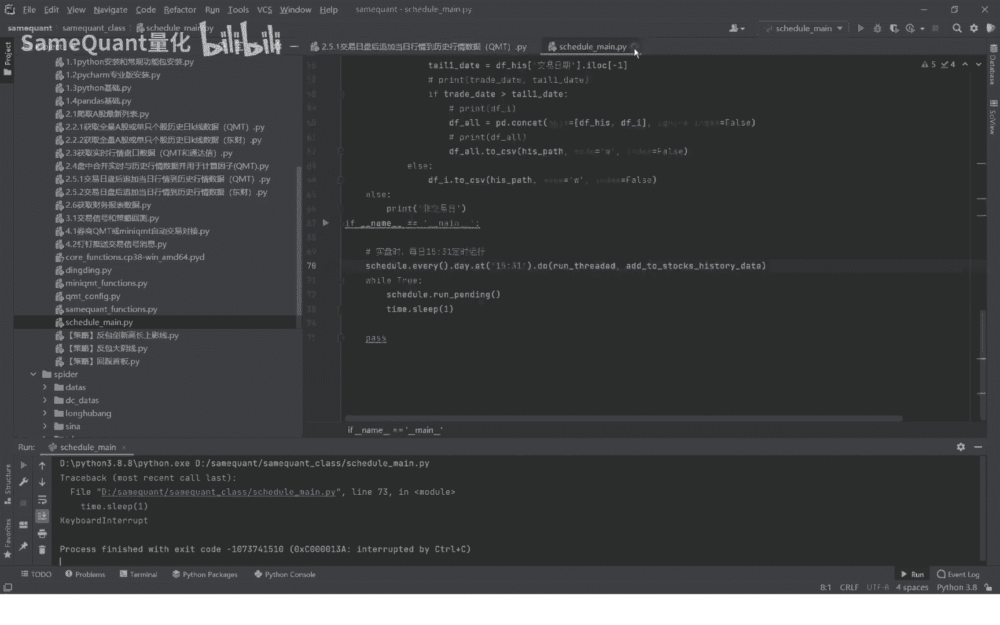

# 2.5.1 交易日盘后追加历史行情数据QMT - P1 - SameQuant量化 - BV1Qy411Y72z

大家好，这里是西部矿山量化，我是打板哥，这期呢分享每个交易日盘后，最佳当日的一个最新行情数据，到这个历史的行情数据当中，也就是补全历史行情数据，我们本期演示的是GMT的，那还是一样啊。

我们导入这个mt的包，另外自己本机需要先登录一下，券商的KMT终端，就可以运行这个方法进行一个追加啊，点击运行一下，大家可以看一下，它就会循循环的便利这个股票代码，因为我们就不再演示了啊，因为比较多。

我们先停掉啊，你这个就可以追加了循环，我们进入这个函数，大家可以看一下，首先是读取我们所有的个股列表去啊，对于每只个股啊，循环去追加当日的一个最新的一个行情数据，到历史行情数据当中。

这个是QMT它本身已经包装好的一个方法，我们直接调用就行了，那我们实际的一个使用的过程中啊，你不能说我每天我手工的去追加，所以就还设计了一个定时程序，比如说我们这里，我们也是为每位都提前封装好了。

这个程序就一个定时的一个运行程序，就是比如说你可以设置每天15。31，只要是收盘之后，你去运行这个ADD to stay dog history date啊，这个就可以了，你只要运行起来。

它每个交易日的三点是31，它就会自动运行，当然这个时间你可以自己改，它就自动运行，它就自动补充，这样可以保证你每天盘中实盘交易的时候，就保证它的历史行情数据都是齐全的，那样就不会计算信号。

就不会出现错误好了，本期的分享就到这里，我们下期呢分享，补充这次行情数据的另外一个通道啊。

东财通道好。

