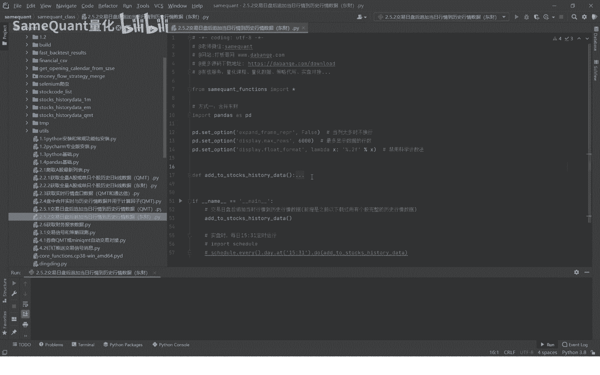
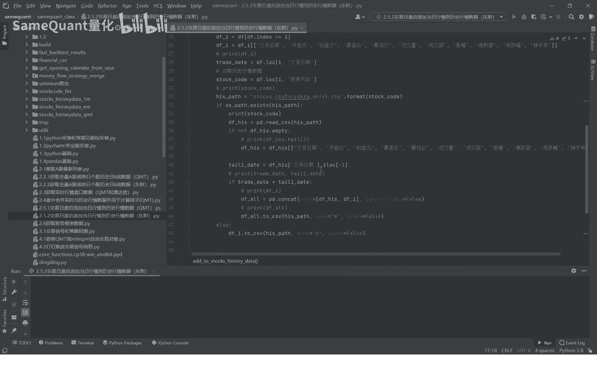
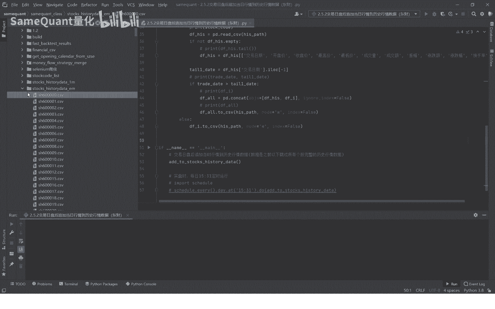
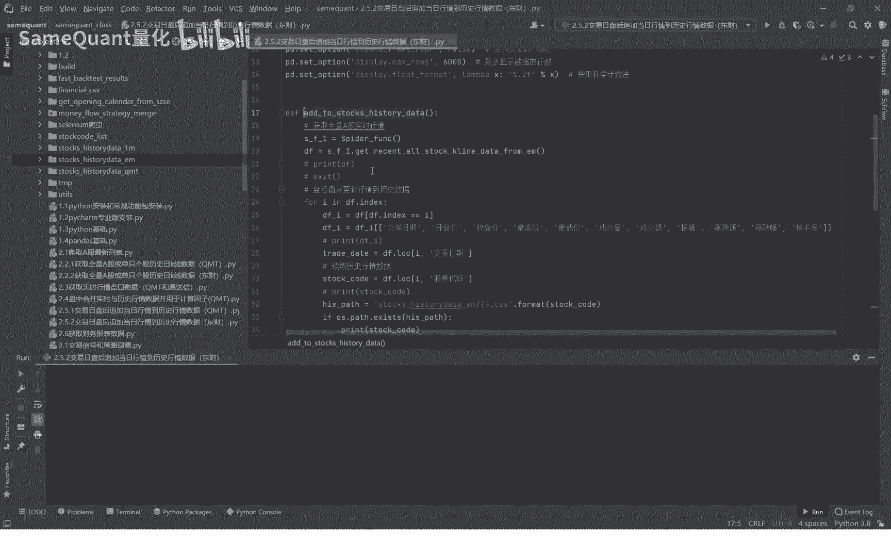
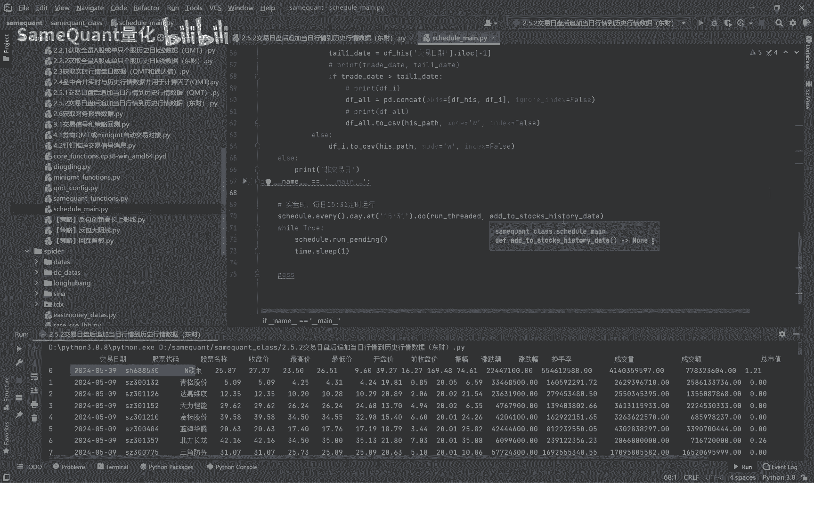

# 2.5.2 交易日盘后追加补充历史行情数据东财 - P1 - SameQuant量化 - BV1JT421D79t

各位学员你们好，这里是新媒矿产量化，我是打板哥，本期分享了交易日，盘后追加当日的一个行情数据，到历史的行情数据当中，以保证我们每日盘中用到的这个历史行情数据，去计算信号的话，保证这个数据是全的啊。

没有缺失的，我们已经写好了这个函数。

也就是这个ADD to stokes hd啊。

这个直接运行一下，大家直接运行一下看一下啊，一旦运行它就会循环的去立即去增量补充，因为太多了，我们就先关掉停掉，运行结束之后呢，这里的我们这本机的文件夹下面，它就会将当日的一个行情数据给增补进来。

好我们来进入这个函数详细的讲解一下，首先是每日盘后，他会先获取全量A股的一个行情数据。

好我们打开运行一下，你看这是不到一秒，获取到这个全量A股的实时行情数据，包含这些字段啊，各种各样的一个字段，接下来我们要便利之时的行情，含糊的实时行情数据啊，便利根据这个股票代码，便利之后呢。

先截取当日的该支股票代码的啊，这些字段是于历史行情的数，数据的字段要保持一致啊，接下来读取该只股票的它的历史行情数据，接下来就把这个历史行情数据，与当时的实时行情数据是这样的，做一个拼接啊。

拼接之后去重去除之后，进行一个覆盖的一个存储，一只个股完成之后循环便利，将这个所有的个股全部这样做一遍就完成了，如果是遇到这个新股，比如说新上市的新股的话，它会自动的增加，因为新股它可能就第一天嘛。

这是第一天就增加一个代码，增加一条，这样就完成了，我们实际在策略运行的时候，我们肯定是会用到用到这个定时程序的，你也就是我们上期课程分享的这个PY文件，里面，也就是定时程序，你可以设置交易日每天的15。

30，一定时的去运行，补充这次数据的展示。

那就循环运行，运行完它就结束了，好了，本期的分享就到这里。