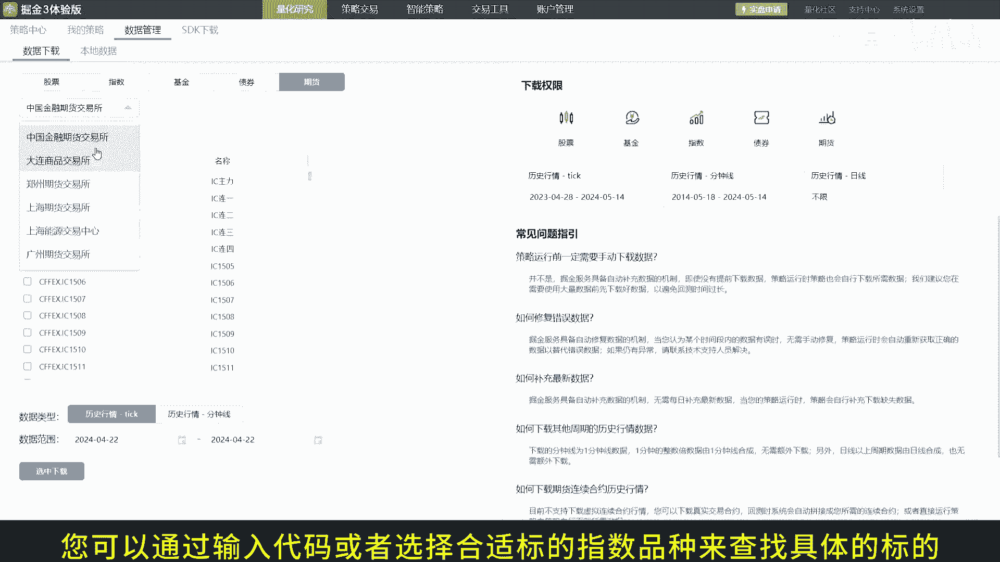
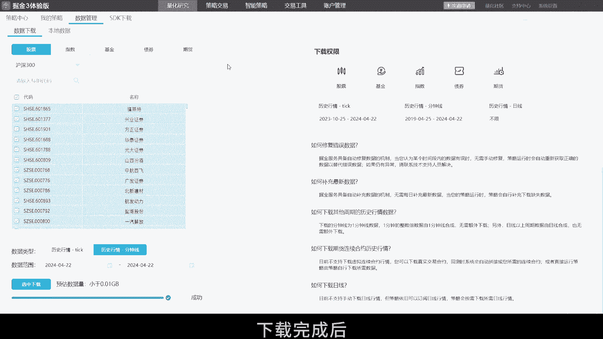
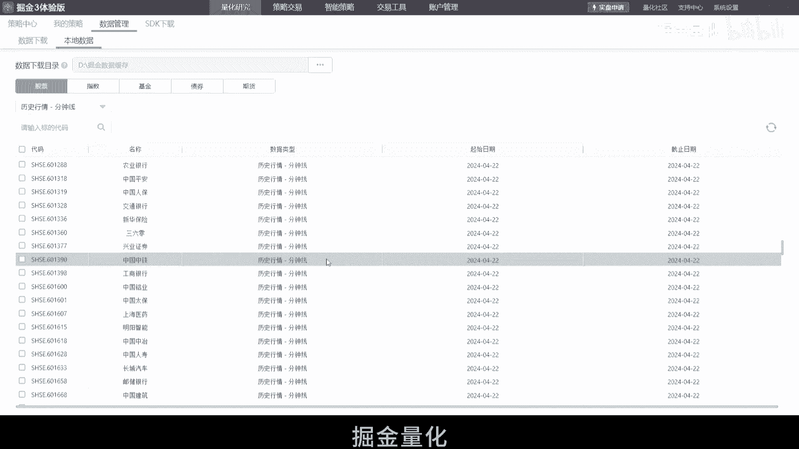

# 2.5 掘金量化终端本地数据管理下载 - P1 - 掘金量化 - BV1ow4m1v7Yt

欢迎来到掘金量化终端的本地，数据管理与下载教程，今天我们将指导您如何高效的管理，并下载历史行情数据，以提升您的回测速度和效率，首先我们需要设置数据下载目录，在升级到3。17版本后，点击量化研究菜单。

选择数据管理，并进入本地数据进行配置，在这里您可以选择一个合适的路径，作为您的数据下载目录，设置完成后，记得点击重启，已应用更改，在下载数据前，请确保您的账号有相应的数据权限。

您可以在终端内查询您的权限范围，在开始下载前，建议查看我们的常见问题指引，了解数据下载的相关机制，现在让我们开始下载数据，点击量化研究数据管理，数据下载，您需要选择标的数据类型和时间范围。

来指定下载任务，首先选择您要下载的标的大类品种，然后您可以通过输入代码，或者选择合适标的指数品种来查找具体的标的。

并选中它们，接下来选择您需要的数据类型，如历史行情的tick数据分中线数据，设置好开始和结束日期后，点击选中下载来建立下载任务，请注意，如果本地已有最新数据系统，不会重复下载，下载完成后。

您可以在本地数据页面查看已下载的数据记录，这里会显示所有通过手动或策略，自动下载的数据，这就是在掘金量化终端中，管理并下载本地数据的全部步骤，现在您已经准备好，利用这些数据进行高效的回测和策略开发。

感谢您观看本教程，如果您在使用过程中遇到任何问题，欢迎随时联系我们的技术支持团队，掘金量化。

