# 2-CCXT获取历史K线数据 - P1 - Crypto小白书 - BV1Li42127Mt

三大家好，这里是加密小白书，欢迎来到本次课程，今天呢我们将介绍如何使用CCXT，获取必然交易所合约K线数据，方便我们后续进行啊回测，在Python实战这一系列课程中。

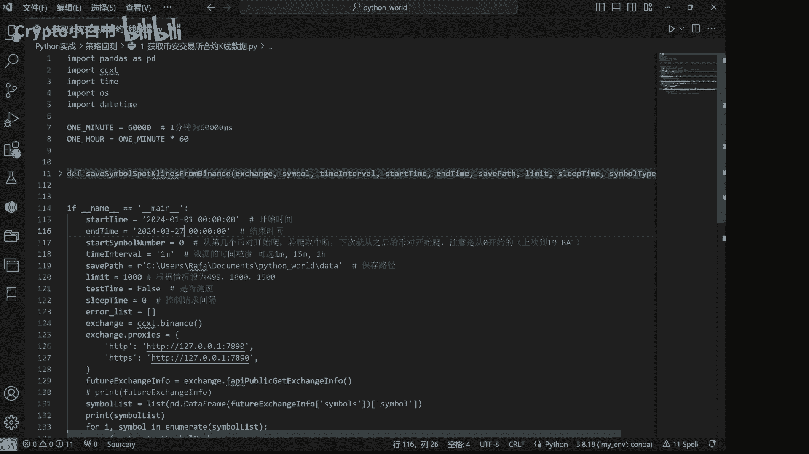

我们将首先进行策略回测，那策略回测呢将包括以下几个重要的模块，首先是使用CCXT获取必然交易所K线数据，然后基于这些K线数据呢，我们生成交易信号，持仓信息，净值曲线以及策略的结果。

也就是说在我们的K线基础上，我们运用一个哦布林策略生成交易信息，仓位信息，然后最后来看我们使用这个策略的交易结果，首先呢我们需要强调一下。

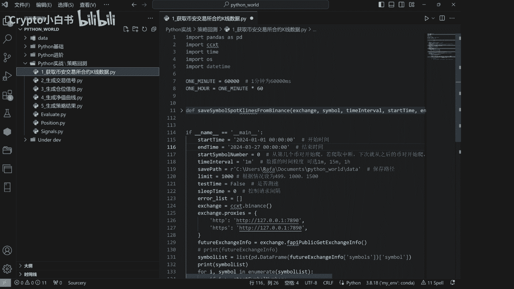

今天开始呢我们使用到的数据代码会比较复杂，如果大家有不懂的地方，或者视频中有一些没有讲清楚的地方，大家可以复制代码去到cheat GB T1，或者POE这种人工智能软件中嗯，对代码进行一个分析。

然后方便大家进行理解，好，我们先来看一下，如何用CCT获取币安交易所的合约K线数据。

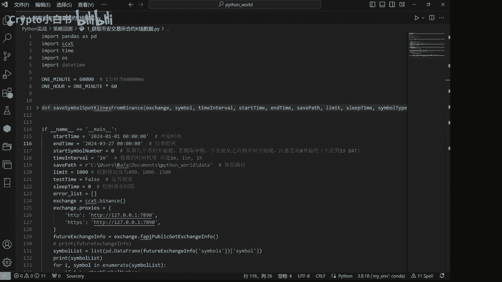

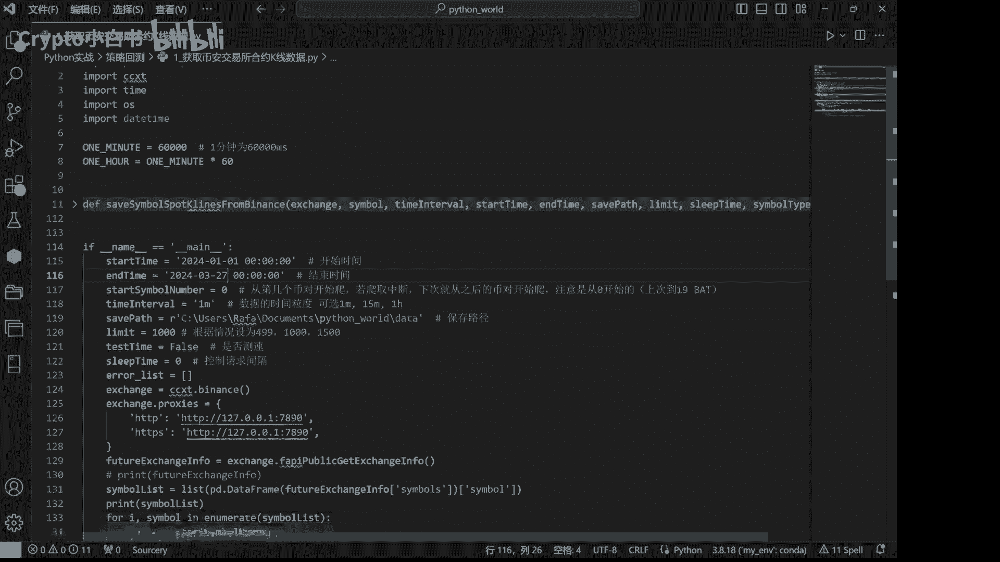

介绍一下一些基本概念，币安交易所是一个加密货币交易所，它提供了非常丰富的历史K线数据，我们可以免费的利用这些数据进行分析和研究，但是呢我们并不推荐国内的用户呢，去使用BI的app进行交易啊。

因为它的app设计来说并不太人性化，尤其对国内用户有网络环境上的一些障碍，所以说我们更加推荐大家去使用ex交易所，好我们来看一看代码，首先我们需要装一些必要的库，确保你已经装了啊，Pandas。

cc xt time os等等库，如果你还没有安装呢，可以使用pip install pandas啊。

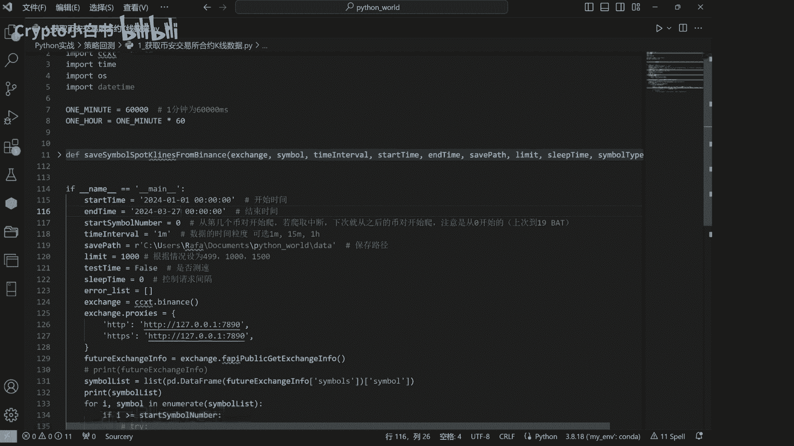

sixty等等，在这里呢我们定义了一个名为safe，Symbol spot，killines from balance的函数，这个函数用于保存必然历史K线数据。

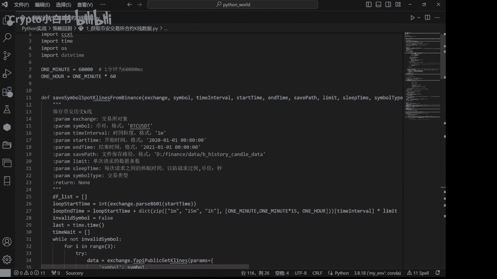

它接收一些参数，包括exchange找一首对象，symbol b对time interval，时间颗粒，start time开始时间等等等等，在函数内部呢，我们首先创建了一个空列表。

d e f list用于储存获取到的K线数据，然后我们定义了一些循环变量和时间变量，用于控制循环的请求和控制请求时间间隔等等。

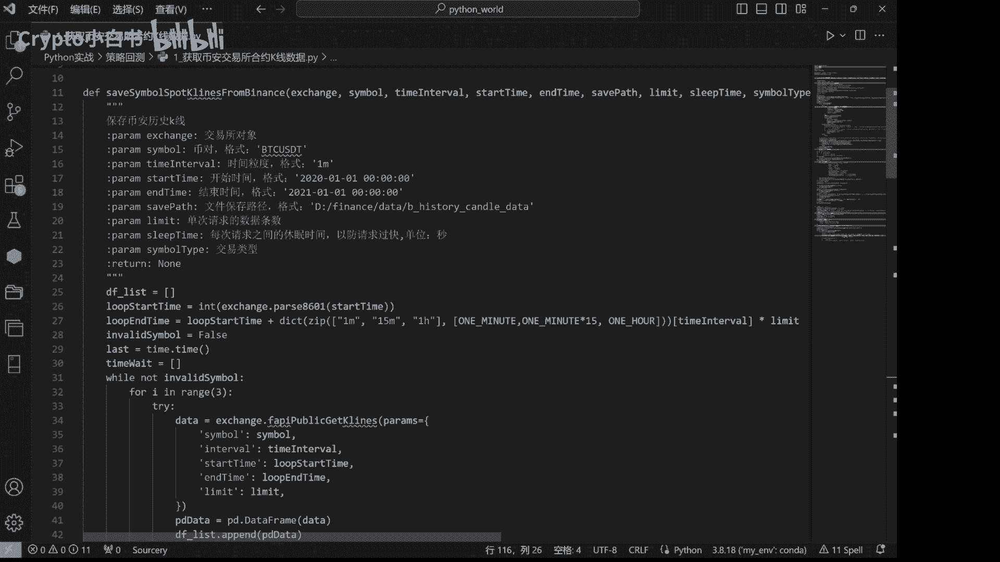

接下来呢，我们使用这个函数获取必然的现货K线数据，并将数据储存到pd data这个变量中，然后我们将pd data添加到DF下划线list，这个列表中。

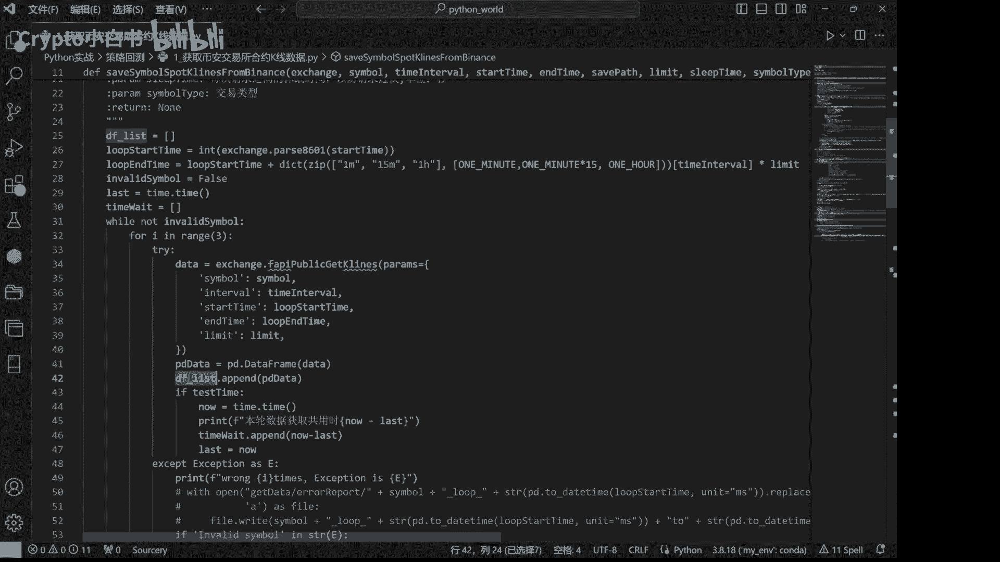

在获取完所有数据后，我们将DAHLIST中的所有数据合并为一个data frame，而并对列进行重命名和处理，可以在这里看到，最后我们将数据保存到指定的文件路径中，接下来我们来看一下主函数部分。

在主函数部分，我们设计了一些参数，比如开始时间，结束时间，time interval等等等等。

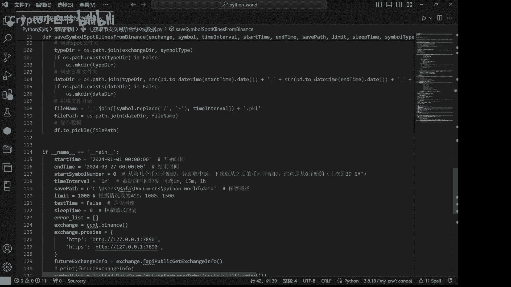

然后呢我们创建一个balance交易所对象。

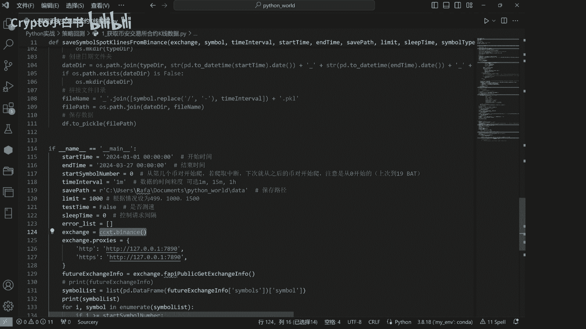

并设置了代理，方便我们在国内对数据进行一个获取。

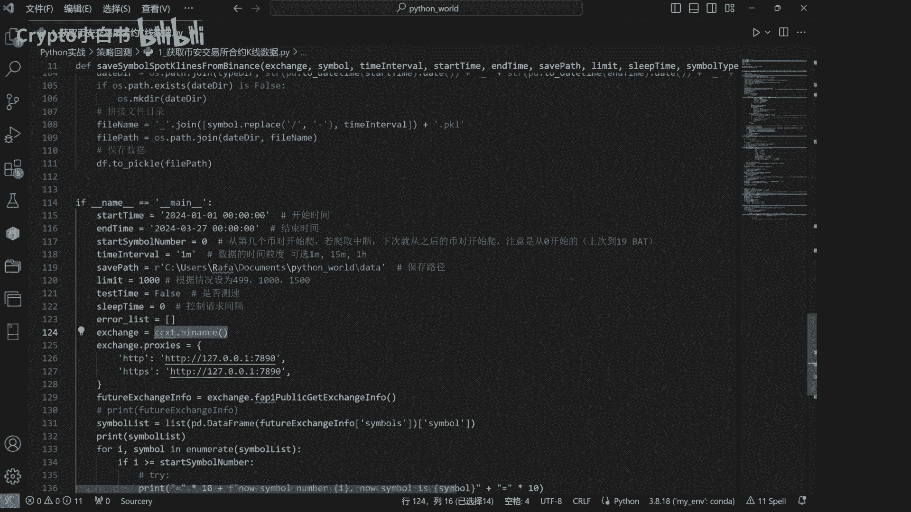

接下来我们获取必然的交易信息，并将必对信息储存在SYMBOLIST这个列表中。

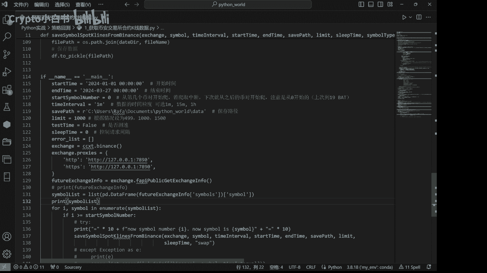

等一下我们print一下SYMBOLIST，来看一看，最后我们使用一个循环遍历所有B队，并调用刚才我们创建的函数，确保每个B队的历史K线数据，都进行了一个储存。

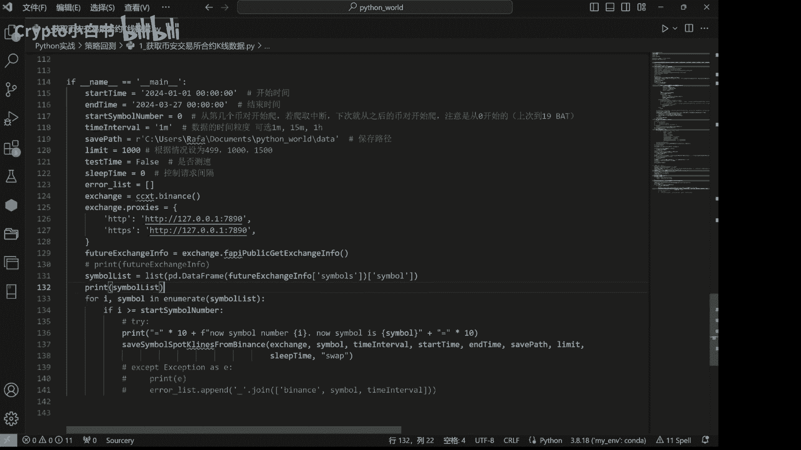

让我们运行一下这段代码。

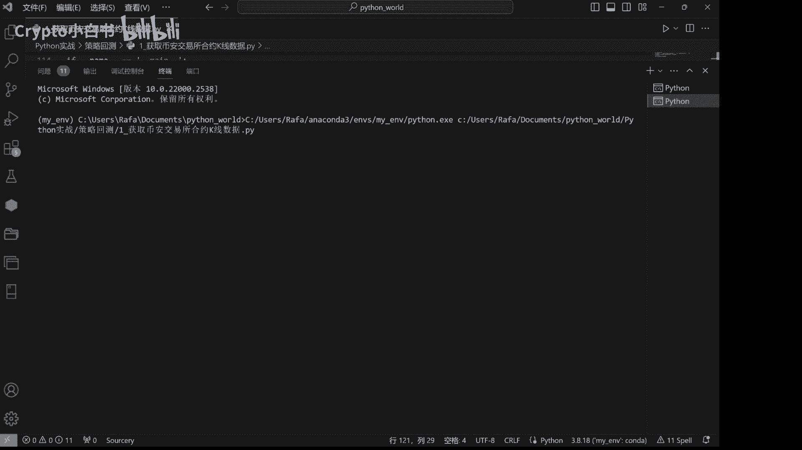

可以看到这是我们print出来的SYMBOLIST，也就是说所有我们需要下载的啊B对信息，并且呢我们现在正在下载啊，BTCUSDT这个交易队的历史K线数据，可以看到。

在data这个文件夹下面有一个binance swap中，2024年1月1号到，2024年3月27号，一分钟的K线数据已经下载到了XRP。

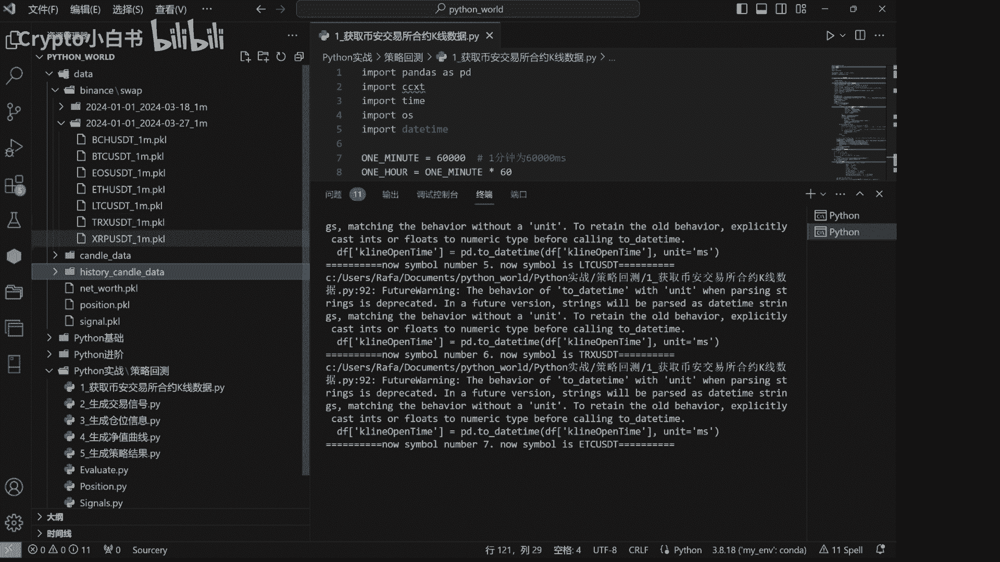

那么可以看到目前呢是已经下载了第九个部队，因为是从零开始的，目前正在下载link usd t这个B对，等一下哦，我们就可以在这个文件夹中看到，link usd t这个B对的文件数据。

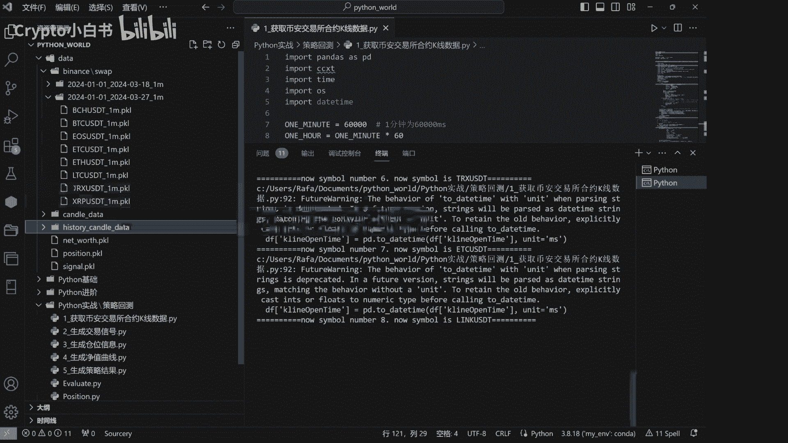

可以看到link usd t已经被下载下来了，好，现在就只需要等待程序。

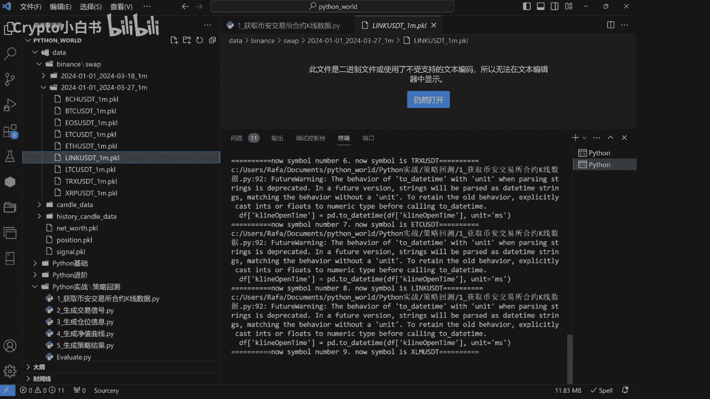