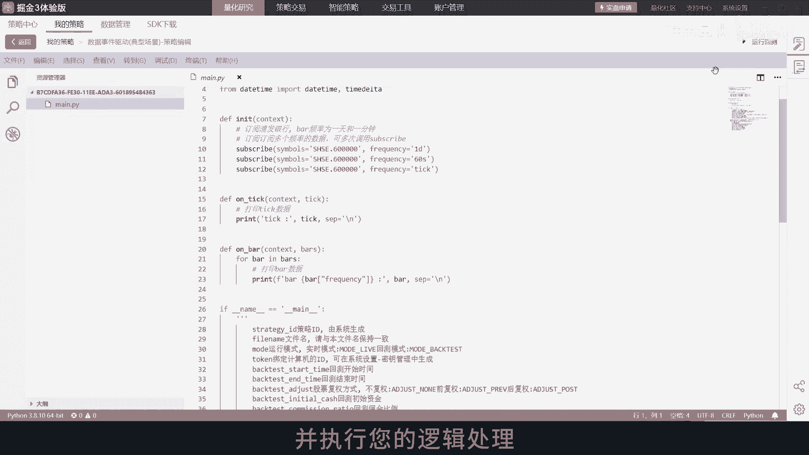
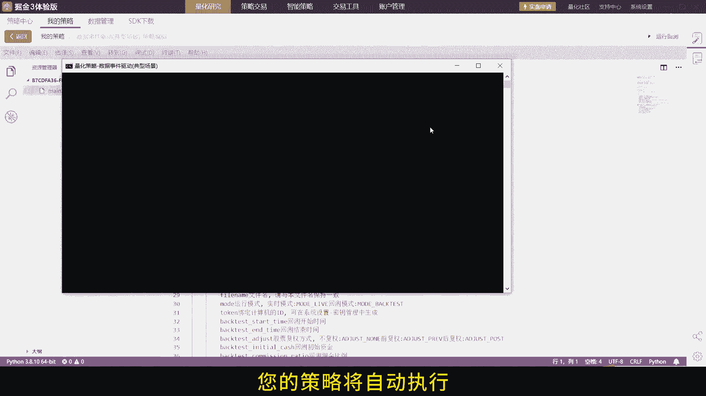
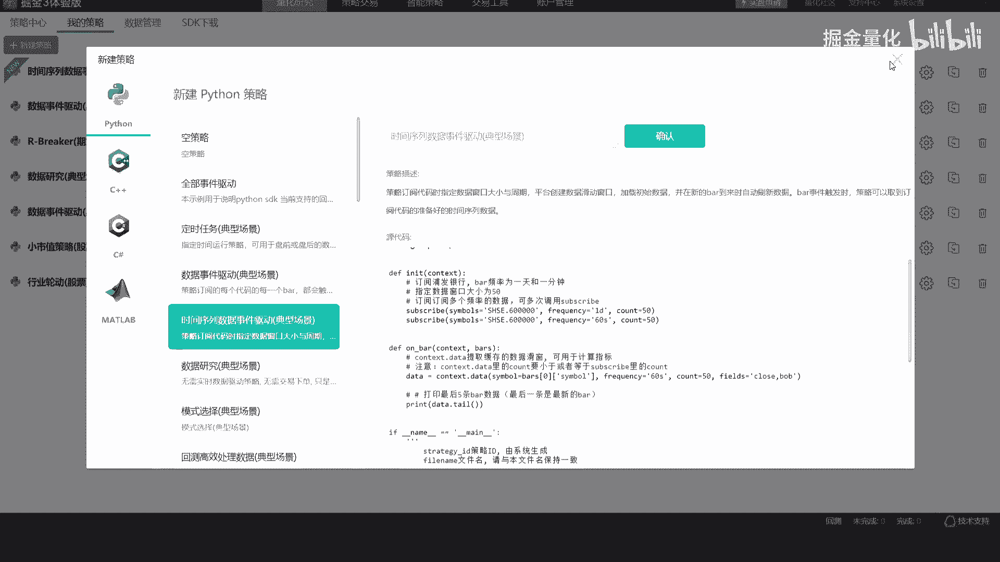
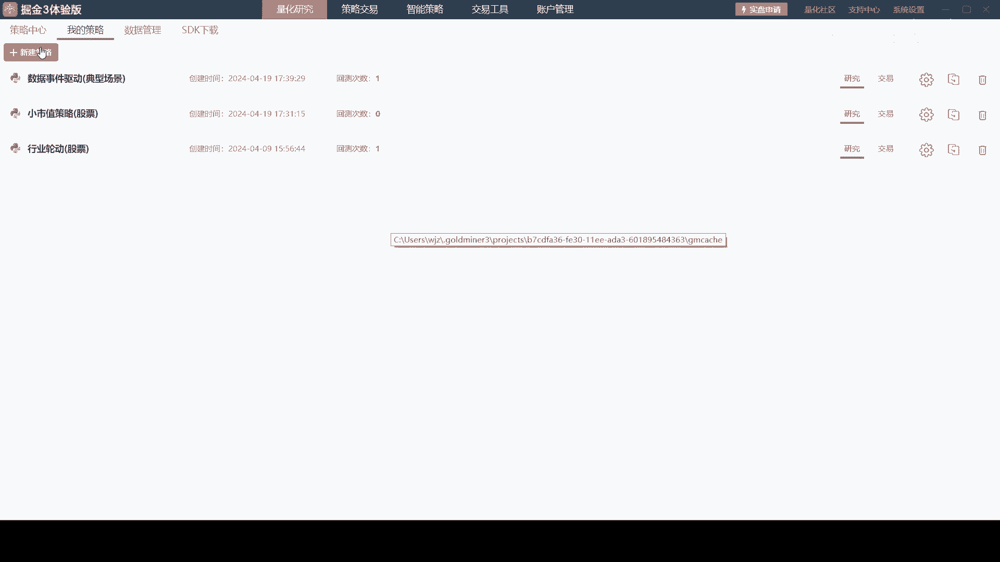
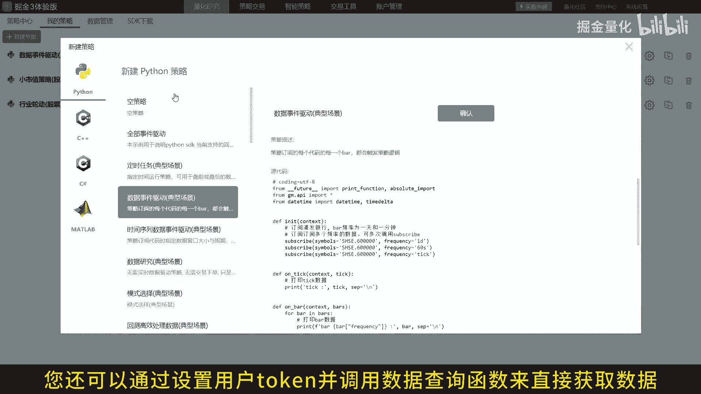
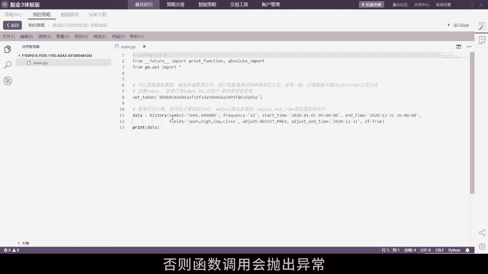
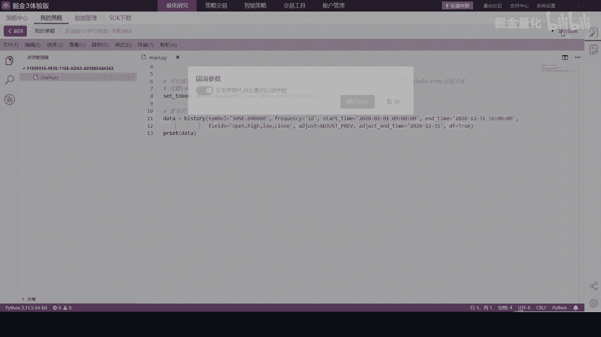
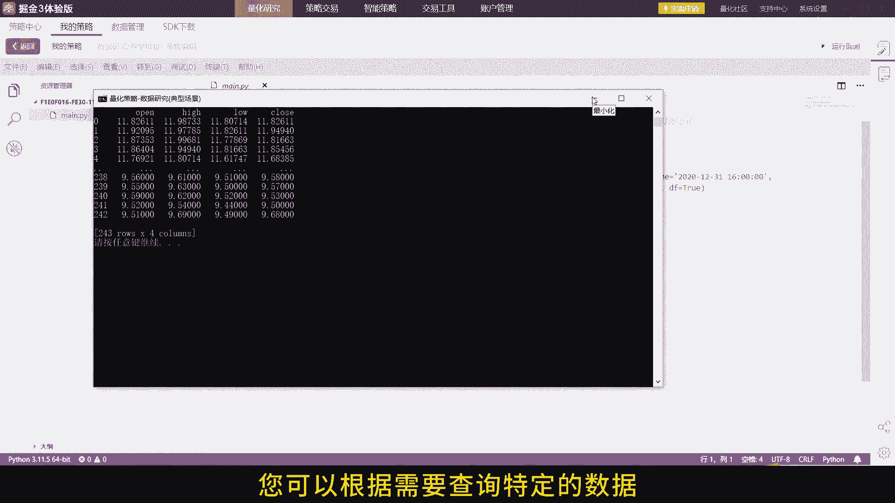
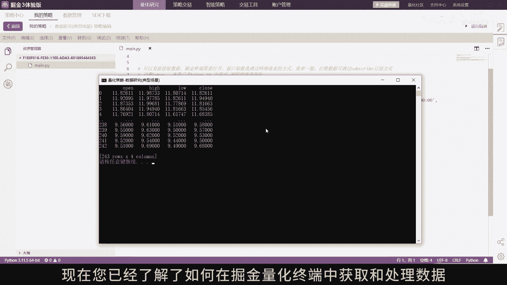
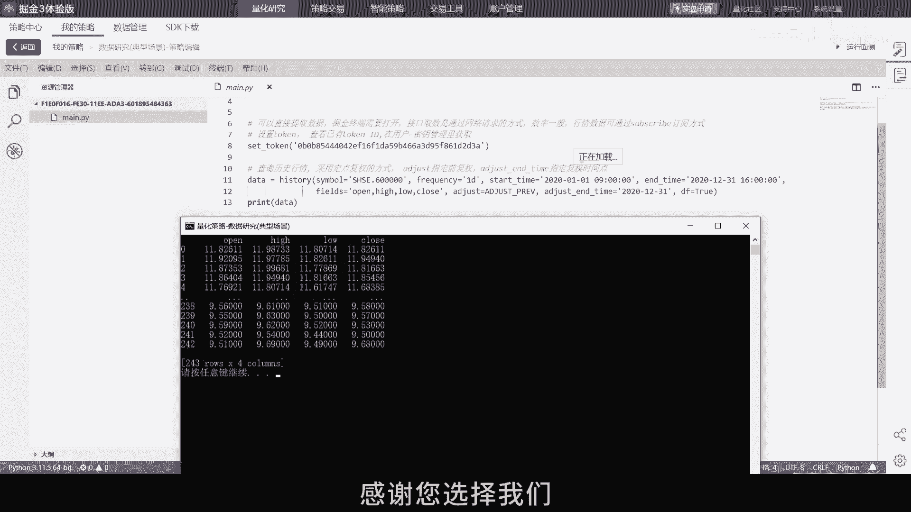

# 2.1 掘金量化终端获取数据 - P1 - 掘金量化 - BV1x7421d7oe

欢迎来到掘金量化终端数据获取操作指南，今天我们将向您展示，如何通过订阅和接口获取高频行情数据，以及通过查询方式获取历史数据，以便您能够更有效地执行您的交易策略，首先我们需要设置初始化函数。

在您的策略文件中，使用INIT函数来初始化您的策略，并在其中调用subscribe函数进行数据订阅，接下来实现一个ANTICK和n bar函数，来处理推送的数据，每当有新的数据到来时。

ANTICK和AMBAR函数将被触发并执行您的逻辑处理。

现在当数据更新时，您的策略将自动执行。

您可以在antic和N82函数中，添加您的交易逻辑，以响应市场的变化，接下来我们将展示如何保存和提取数据，滑窗获取订阅的tick对象或者bar对象。

划窗数据为包含当前时刻推送tick或bar的前count，调tick或者bar数据。

订阅后的数据滑窗将储存在context data中，您可以通过调用context data接口来提取数据，无论是在自定义函数l go中，还是在antic和EMBRE事件驱动函数中，除了通过订阅获取数据。

您还可以通过设置用户token，并调用数据查询函数来直接获取数据。

请确保您的token是正确的。

否则函数调用会抛出异常。

通过接口查询的数据将一次性返回，您可以根据需要查询特定的数据。

例如历史行情数据或实时市场数据，现在您已经了解了。

如何在掘金量化终端中获取和处理数据，无论您是通过订阅还是直接查询，都能够有效的支持您的量化策略，感谢您的观看，祝您投资顺利，掘金量化终端，您的量化投资之路上的得力助手，感谢您选择我们。

