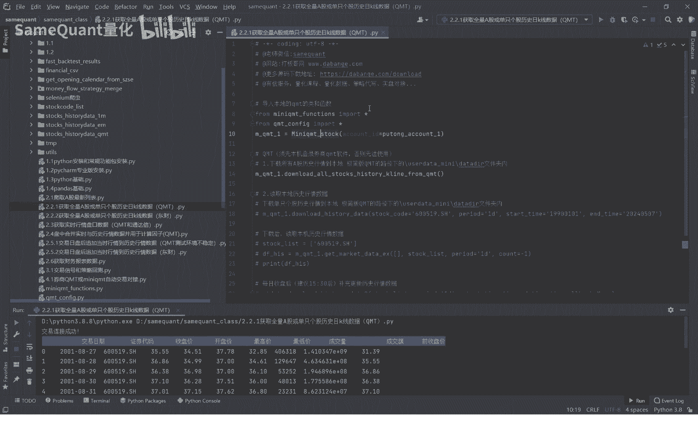
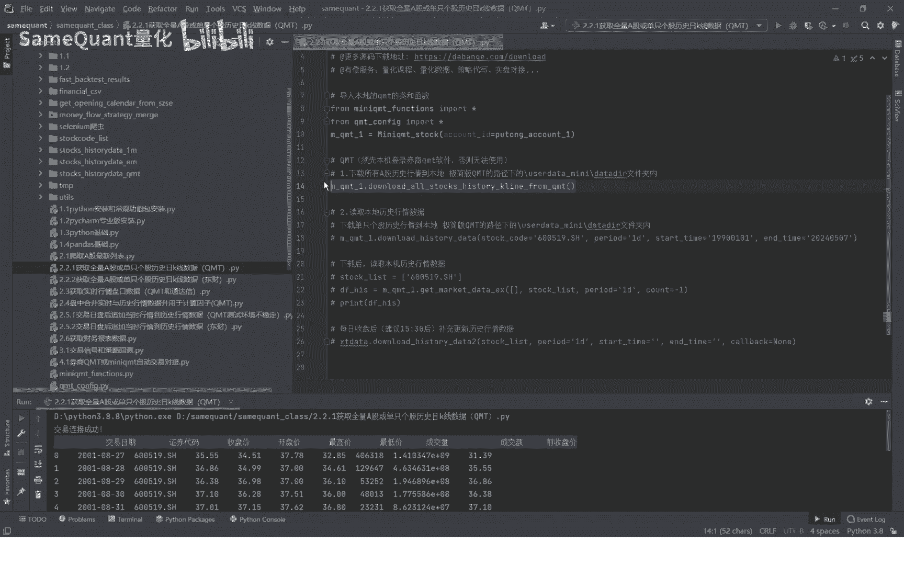
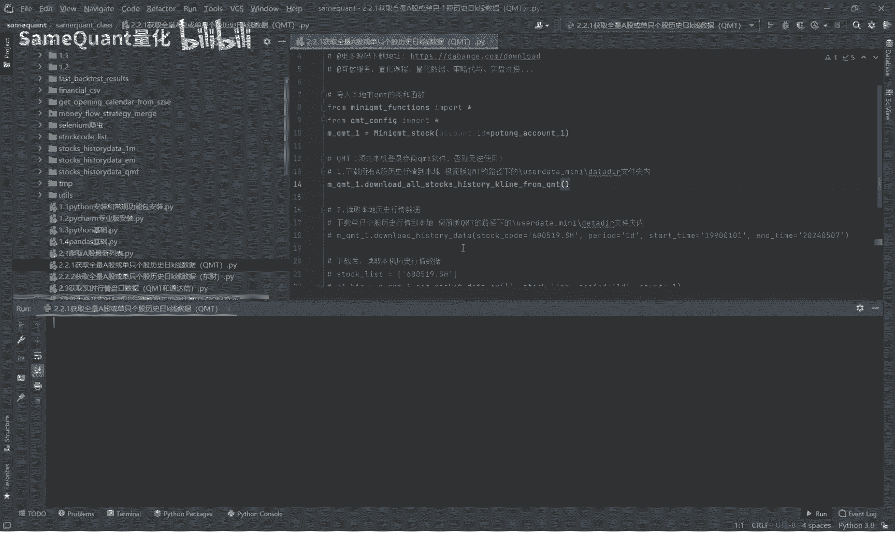
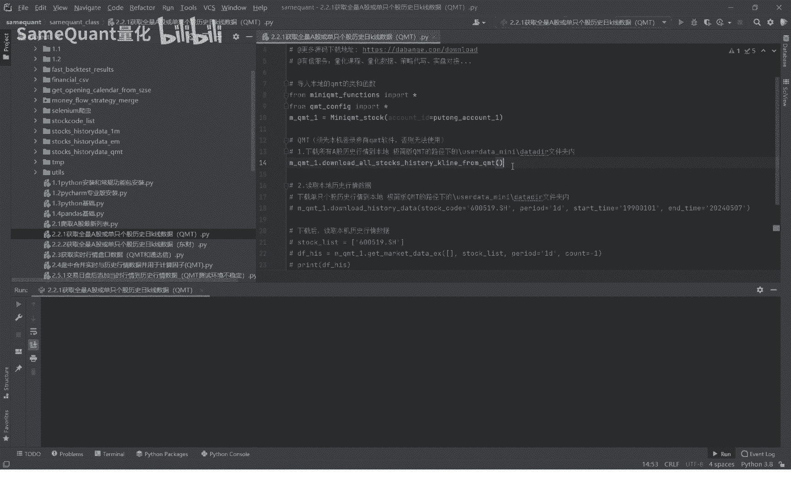
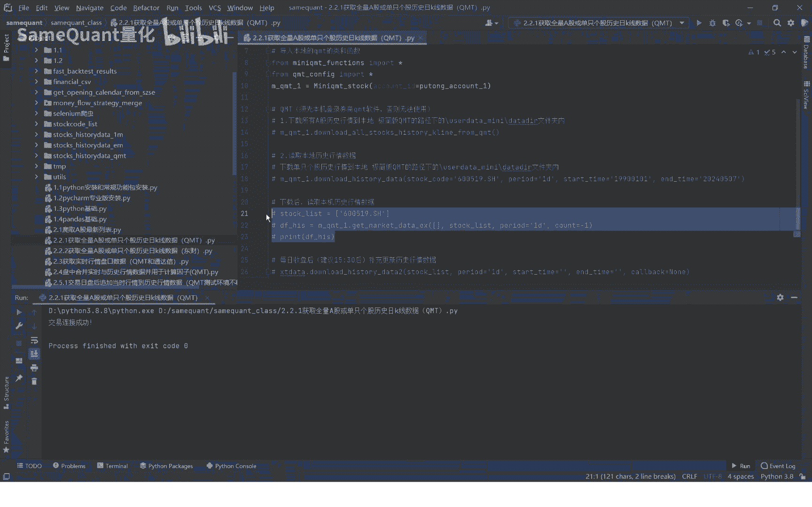
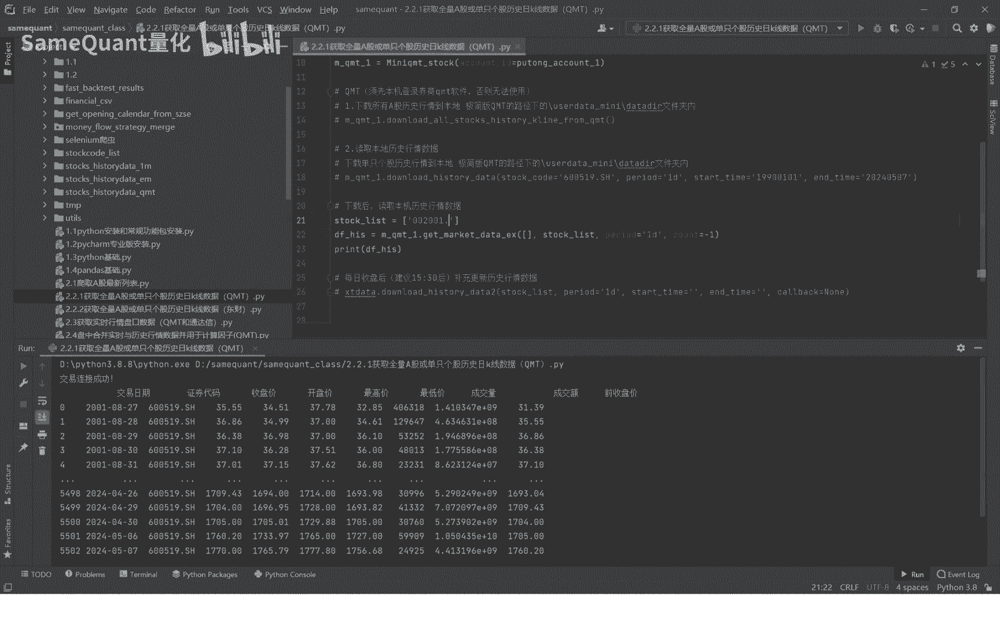
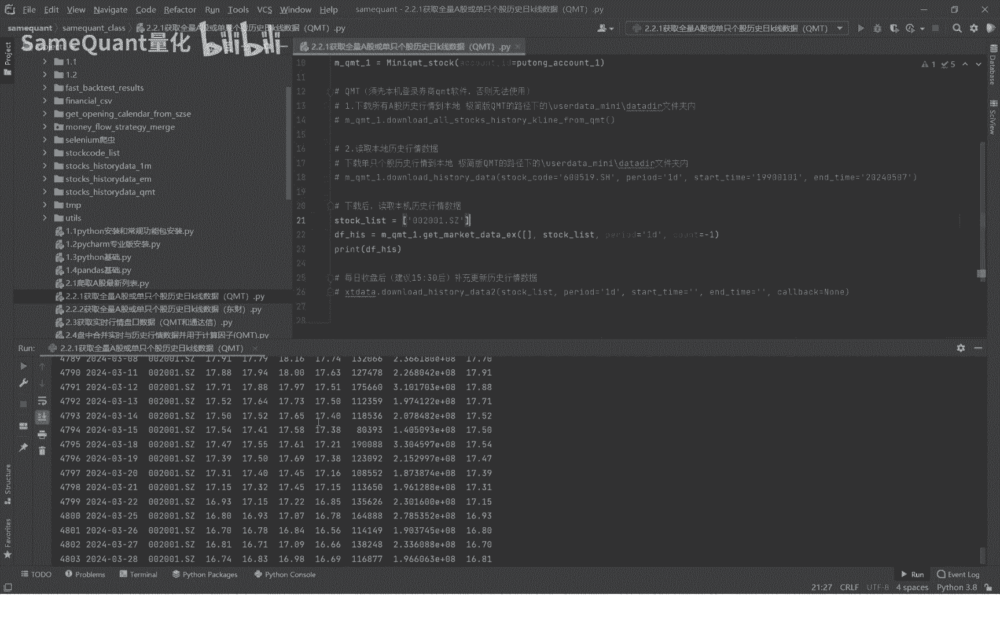
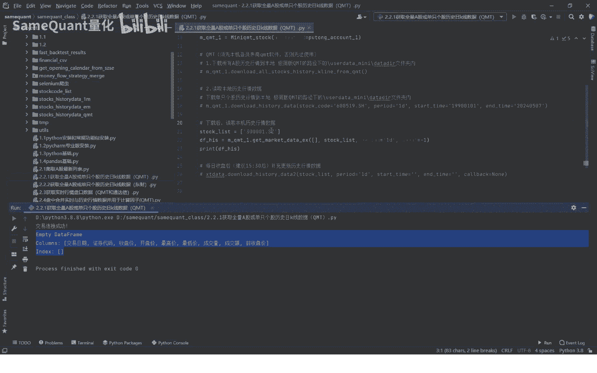
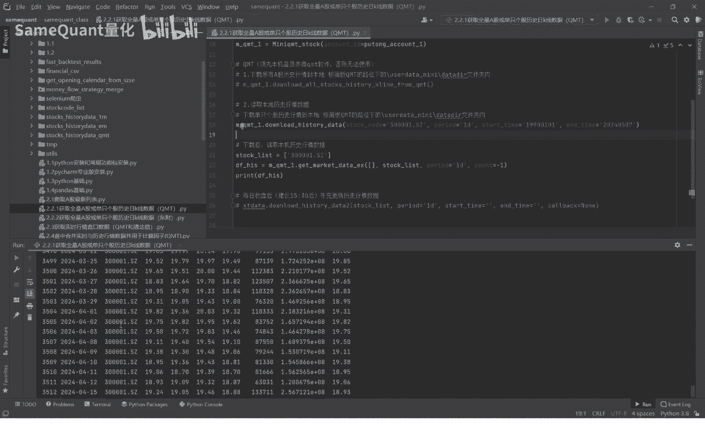
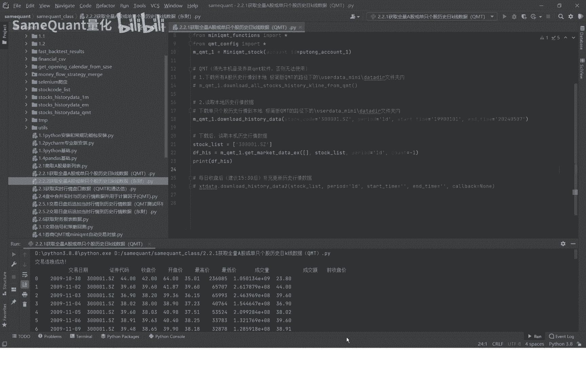

# 2.2.1 下载A股历史行情数据QMT - P1 - SameQuant量化 - BV1kJ4m1A7md

大家好，这里是sim扩张量化，也是打板哥，那么这一期呢我给大家分享，我们在量化交易过程中啊，必须要的一个数据。

就是所有A股的历史行情数据啊，首先呢我们这一期介绍的方法是，在QMT里面啊，下载所有A股或单只个股的历史行情数据，进行读取好这个函数啊，首先这个类啊，mini q mt的dog。

这个类是我们已经封装好的mt的这个功能包，包括登录啊，查资金，查实账号，下载历史行情数据，是获取知识行情啊等等。

公司一个包，那么下载历史行情数据，就是这个啊所有A股的历史行情数据。

就是这个方法了啊，你就这样，现在就直接点击运行，它就开始下载了，现在已经下载了，当然这个比较多啊，我们就先暂停掉哈，因为这个需要时间比较久，因为我们就先不下载了哈。

你收到这个课程的源码之后，你直接运行这个就可以自动下载了。

好那我们接下来因为先演示一个单只的好吧，比如说这个茅台的啊，你设置第一个股票代码，你是输到这里，第二位1D就是日K的，当然还支持其他周期的5分钟到30分钟，周K的啊都是支持的。

但是time呢你就直接输入1990年1月1号啊，因为这个是对吧，enter data呢你就输入最近的一个交易日期哈，点击这个这个这里运行完了。

这就下载完了，那如果你能证明它下载完了呢，你直接来读取哈，如果你没有下载的话。

这里是无法读取的，现在我们就因为下载了，我们就直接读取，你就可以看到是吧，对线的，那比如说如果我们找另外一个，另外一个就是说啊你有有可能还没有下载的话，我们来来你直接读取这次哈，应该是不行的啊。

如果是可以的话，那就是已经下载了，我们再运行一下这个哈，这个应该也是已经下载了哈。

我们再来换一个，你看这就没有数据的，因为你没有下载，所以没有数据啊。

那如果说我在这里把它输入到这里来，我们先下载再读群呢，你看你就有了。

所以说这个是不是很神奇啊，这个就是说除了历史行情数据以外，我们每个交易日还涉及到这个，把每一个交易日的最新的行情数据，补充到历史的行情数据里面去，那后面我们会有对应的这个课程。

里面会有好好这节课我们就先到这里，下节课我们会介绍另外一个数据的一个通道，比如说东财啊去获取全量A股的历史行情数据，或者是单只个股的历史行情数据，好。

