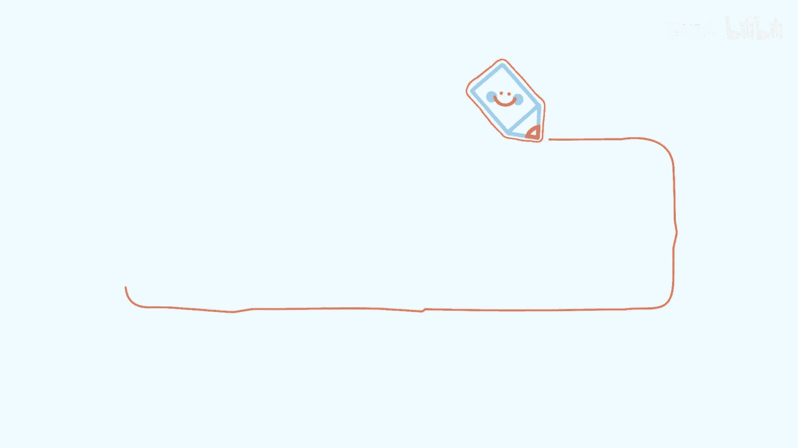
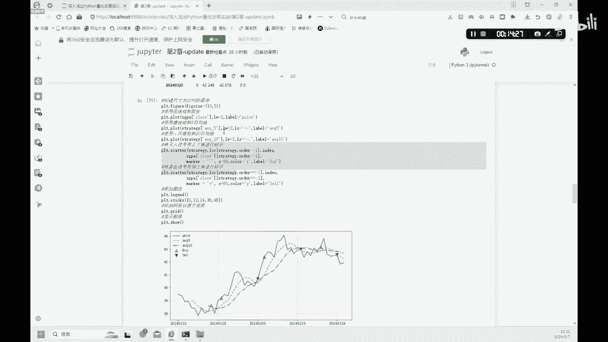

# 2.2【金融科技】Python量化编程技巧大公开！移动平均策略 - P1 - 隋UP主 - BV1rBvbeAEY5

移动平均策略。

好我们来讲第二个策略，移动平均策略哈，也是很多人会学习的第一个策略啊，金叉死叉这种策略好，我们首先呢来做一个单一移动平均线，这样的指标策略哦，我们这里呢用到的是10日的一个均线，好。

大家可以自己可以改为20日均线也是可以的，好啊，这个首先呢我们设置这个period，这个为十好，就是10日均线，20日均线你就设置为20好，然后我们设置一个空的一个列表，来储存这个十天的一个平均值啊。

这个这个空的啊，就是这个average10就是一个空的一个列表好，也就是我们下面生成的话，会生成这样的一个东西，average10好，然后我们再设置一个空列来储存呢，每十天的一个价格的一个均值。

这是一个动态的啊，一个一个值，average value等于一个啊空值好，设置好了这三个部分以后呢，我们就来对这个做一个这个循环的赋值，首先呢啊循环设置啊。

for这个price就是我们对这种price进行一个这个计算，这个price呢我们又就等于这个close就是这个收盘价，用这个收盘价来做，然后呢我们这个看一下它的一个基本的原理啊。

移动平均线的基本原理好，我们的第一个值呢是2024年1月2号，大家可以看一下它的一个10日的，这种平均线的值啊，是不是就等于它的一个close这个收盘价好。

我们第二个第二个这个average10呢平均值呢，他就是用的是呃，这个close的这个2024年1月3号的啊，加上这个1月2号的这个收盘价，然后再除以二，我们就可以得到了10日的中平均线啊。

依次往下是吧啊，1月4号，1月5号，1月8号啊，一直往下，然后呢我们最多的就是十个交易日，我们做一个平均值啊是吧，最多10日，这个因为这是两天嘛，只有两天，我们只能做两天的一个平均值。

三天只能做三个三个的三个值，做一个平均值，最多我们10日凑个十十个，十个数十天整，然后我们得出一个数值，然后下面的话是吧，多过超过有十行数据的话，我们下面的数据呢都是每十个做一个平均值。

每十个做一个平均值是吧，好这里大家可以看一下这个price是吧，我们呢就是用这种刚才那种方式，对它进行一个平均，然后呢如果这个平均值呢它超过了十天，11天，12天啊，12行13行的数据的话。

我们都不要是吧，我们只要超过十天的，我们都是按十天做一个平均值，这就是一个10日均线的意思，好，这里呢我们呢最终呢就可以得到这样一个数据，数据这样的一个数据是吧。

前面这个数据都是啊这个to share自带的，然后最后这一列average10呢，就是我们通过刚才这样的循环，每10日做一个这样的一个平均值，得到的这一列数值啊，就是这样的一个代码好。

有了这样的一个数据之后，average10做出来以后呢，我们就可以来画图，画图呢就是用下面这一个这一个方式，然后呢我们设置一个画布啊，10×6的画布，然后呢我们首先来画的就是一个stock value。

就是一个正常的一个股票的这个clothes，close的一个价格，那就是这个黑色这条线，首先画这一条好，然后再画10日均线，10日均线就是蓝色这个虚线，这个就是我们刚才生成的这一列数值啊。

它的一个平均值好吧，这就是我们画出了第一个，单一的移动平均线的一个策略，然后我们看一下，下面呢它是一个双移动平均线的策略，也就是我们这个怎么样来设置，金叉和死叉的一个策略，好我们呢首先创建一个数据集。

命名为啊strategy啊，就是这个数据呢我们是吧，改成一个strategy这个名字，然后建一个新的一个data frame，然后保留这个index啊，trade trade date是吧。

先保留这一列，然后我们生成一个signal，首先呢我们这个signal生成这一列，所有的值都给先给它赋值为零，所有的都是零，然后呢我们呢在设置两列啊。

这个strategy average5就是5日的均线是吧，5日的一个均线，然后再做一个strategy10，那艾瑞1010日的一个均线是吧，这就是短线和长线是吧，短线和长线相交的话，我们就可以判断是吧。

金叉还是死叉，所以下面呢我们就是来判断这个signal，我们原来呢上面设置的这个signal都是零，我们现在有了5日线和10日线，我们找到可以找到找到一个交叉点，这个交叉点就是我们交易的一个信号啊。

如果5日线大于10日线的话是吧，我们那就设置为一，如果5日线小于10日线的话，我们就设置为零啊，就是这样的一个，我们就就可以通过大家可以验证一下，看看我我们这个做的对不对啊是吧。

就是大家可以看一下这个是1signal是一是吧，2024年3月11号，这个数值是大于3月18号这个数值的，所以我们这里就是标为一啊，一的意思呢就是一个这个哦，对不起，我说错了哦，这个是二。

这个5日线大于10日线，大家可以看一下，42。882大于这个42。841是吧，同一天3月11号，它的5日线上穿了10日线是吧，我们就买入这一个SIGMO，就标注为买入啊，好大家可以看一下3月11号之后。

这些日子3月12号到5日线，它是要大于还是仍然是5日大于10日，所以说我们这里这个order呢就不发生任何的变化，大家看一下13号也是这样啊，5日大于10日，14号五月大日这个5日大于10日。

15号五日大于10日，大家可以看一下，3月18号就发生了一个反转是吧，5日线的值小于10日线的值，这里呢哎我们就卖出是吧，出现了一个死叉，这个地方我们就卖出，然后依次往下就是这个样。

所以说呢在这个地方呢我们有了signal之后呢，我们这里再设置一个order这一列是吧，就是我刚才所说的啊，出现出现了金叉，我们就买入，出现了死叉，我们就标为一卖出啊，这就是它的一个基本的策略。

大家可以看一下这个画图就更加的清楚了，我们首先呢也是会绘制一个这个啊5日线的图，然后10日线的图，然后呢我们也是用正三角和三角，这个这个正三角和倒三角来表示买入和卖出。

大家可以看一下下面这个图就很明显了，黄色的布，黄色这个虚线呢就是一个5日线，大家可以看一下5日线，绿色这个线呢就是一个10日线，大家可以看一下，这里这里出现了一个红色的3333角。

在这个地方就是5日线上穿10日线的时候，唉它提醒你买入，大家可以看一下，在这个交叉的部分，黄色的部分下穿了这个绿色的这种10日线，然后是不是这里就出现了一个向下的一个三角，提示迈出啊。

同时在这个很近的地方，5日线又上穿了10日是吧，这个地方又出现了红色的三角的一个标识，是吧啊，依次啊5日线又下穿了10日线，这里提示绿色的，像这个绿色的卖出的信号好，这就是我们的一个这个简单的一个啊。

这样的一个交易信号的一个设置，然后下面呢我们就可以来进行一个回测，回测呢我们也是先给小瓦2万块钱啊，然后让他来就是来就是来买这个股票啊，好我们这里呢设置一个positions。

这个空的这个一个一个空的一个data frame啊，就是然后呢保留了这个index，然后呢我们再设置几列新的列啊，第一个呢是设置了一个这个stock这个列是吧，他就是在有signal之后呢。

发现了这种这个交易信号之后，哎我们就就买入股票啊，买入多少是吧，大家可以看一下这有一个stock value，也就是这一列是吧，这一列stock value这一列呃。

就是我们用这个stock price乘以一个你买入股票的，这个stock的一个数量，我们就可以得到一个stock value在这一列，然后呢在职拱，然后我们再设置一个这个order，就是仓位的变化啊。

和前面我们的这个第一个2。1的例子一样，我们有了stock value，我们是不是我们现金呢给小瓦了多少钱，2万块钱，他初始现金有多少，我们也要知道啊，然后他股票的买了多少股票，他的现金有多少，之后呢。

我们就可以来算算他的一个total的一个总的，一个这个资产，小瓦的一个总资产发生了如何的一个变化是吧，好我们这里呢就分别做出了这三类stock value，还有这个他剩余的现金cash啊。

然后他这个股票的总市值是多少，我们分别来做了一下，然后分别得出了这样的一个表格嗯，大家可以看一下啊，在3月11号之前是吧，小瓦手里这2万块钱呢还在他自己手里，他分文未动，他为什么3月11号的时候。

他这个股票的这个价值就变动了，大家可以看一下，3月11号的时候，这里呢就发生了这个，发出了一个这个买入的金叉买入的一个信号了，在这个地方一直到3月15号是吧，他都会持有这只股票不变是吧。

一直到3月15号，所以说呢他的因为买了股票，所以说他的cash的价格呢，哎是不是变少了一部分，移到买到股票里面来了是吧，下单order的一些股票，然后加起来大家可以看一下是吧。

在这个期间这个total值呢哎反而就是怎么说呢，从期初的二零这个这个2万这个209块钱，然后到了15号的时候，哎他的这个总资产呢哎反而是下降了好发，反而下降了之后呢，在3月18号的时候啊。

就出现了一个新的一个卖出的型号啊，一直在下跌啊是吧，到了这种死叉的位置，他就卖出了啊，又回到了现金账户啊，小瓦又持有中现金了是吧，好大家可以呃看一下这个，然后呢我们可以看一下，这里也可以画一个图啊。

跟前面是一样的，画一个图来显示一下，大家可以看一下啊，小瓦呀，买这个中国平安这种股票持有了啊，这个两个多月的时间啊，他并没有并没有赚钱啊是吧是吧，在这个部分呢，到3月7号到3月20号的这个区间呢。

反而他唉还亏钱了啊，所以说呢这种策略我们编写是可以的，但是它是否有效，它是另一说的好，这里呢5日线10日线大家也可以调整啊，调整为这个20日线，60日线是吧，也可以拉大这样的一个区间试一下。

