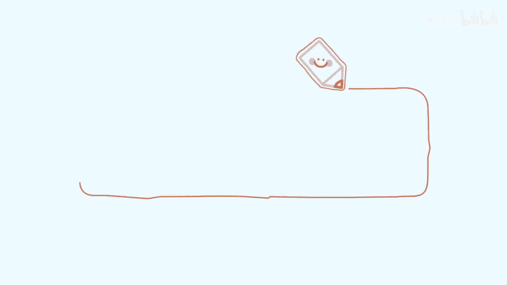
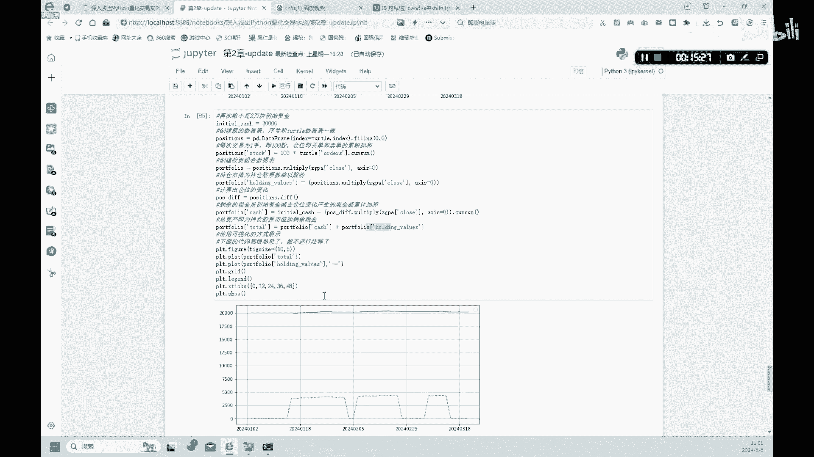

# 2.3【金融科技】海龟策略 - P1 - 隋UP主 - BV1tEYZeQEyH

海龟策略。

我们来讲一下海归策略哦，海归策略的定义呢，在股价超过过去N个交易日的股价，最高点时买入，大家注意是吧，最高点买入，然后在股价低于过去N个交易日的股价，最低点是卖出，大家注意啊，他是最高点买入。

最低点卖出的一个策略，上述的若干最高点和最低点会组成一个通道，我们称为啊唐奇安通道，我们下面呢就实现一下这个策略，首先呢我们建一个名字，就是海龟的turtle的一个数据表啊。

也是data frame格式，保留这个它的一个index，好我们看一下，首先呢第一个是设置第一列就是设置一个high啊，就是它的最高点是吧，我们先设置它的最高点。

tural high就等于这个股票的一个收盘价啊，然后呢这里先看这个rolling5，和前面的移动平均线一样，它是以五天的五个交易日做一个，这个做一个这个循环，五个交易日做一个平均值。

是在过去就是上一个策略的时候，是做移动平均嘛是吧，然后我们这个呢是就每五个交易日，找出一个最大值，那max找出一个最大值好，这就是我们找最高点的方法，然后这里有一个shift one是什么意思呢。

大家可以看一下啊，我百度了一下，就是给大家解释一下这个shift one是什么意思啊，嗯大家看一下这里，好这是一个原始的一个股票的一个数据，它是2017年6月1号啊，他的股价是17。86，好。

大家可以看一下，如果他在这个骨架后面加一个shift one，他会发现什么情况，2017年6月1号的数据向下移了是吧，17。86向下移了一位啊，这就是shift one的意思，好吧好，大家可以看一下。

这后面还有一个例子，他做了一个差分啊，差分项的话经常会用到这个shift one，大家可以看一下它的这个它用他这个差分呢，就是用6月2号的一个股价，减去6月1号的一个股价，他不能写在这个位置。

他要写在下面这个位置是吧，他就用到这个shift one啊，这个shift one就是这个意思，好回到我们这个策略的代码好，第一个这条策略呢，就是这个定义了一个最高最高点，然后呢我们再定义一个最低点啊。

他的这个命令只有把max变成了mini minimum，然后我们在有了最高点和最低点之后呢，我们再来找交易信号啊，交易信号呢就是买入和卖出的一个信号好，首先呢买入信号是什么，当股价突破上沿时。

那就是突破最高点时会发出买入信号，也就是如果这个股价是吧，我们选的是中国平安，如果中国平安今天的中国股价超过了这种啊，最高点的话，我们就买入是吧，这是这条命令。

然后下面呢啊tural cell是就是中国平安的股票，股票如果小于最低点的时候，我们就卖出啊，发出这样的信号，然后我们可以看一下这样的一个结果啊，运行一下可以看到这样的结果是吧。

这是结果最高价最低价买入，大家可以看一下，在这些日期里面买入都是false，false的意思呢就是就是不能就是错误的，不买不买入啊，啊只有在sell的地方有几个处是吧，有两个处。

就是说他这个地方呢是适合脉的一个信号是吧，true就是代表一个卖的型号，如果在拜这个地方的话，出现了true的话，就是买入信号啊，false的话就是不进行下单是吧。

这个sell一样出现true的话就是卖的信号，如果是false的话，就不做任何的下单，好这这个步骤呢就是来找一个信号啊，好我们再看下一个下下一段代码，下一段代码呢是做一个仓位的一个管理好。

上面是信号管理，下面是仓位管理好，我们设置一下初始的一个这个仓位呢是零啊，就是订单状态是零，初始的一个仓位也是零啊，初始的时候我们不持有这个股票好，然后下面呢我们就做一个一个循环啊。

对于这个循环呢的意思呢，就是说我们什么时候买，什么时候卖，两部分做一个循环是吧，就这个当这个股票，这个当买入信号为true，就是上面这个买入信号是处且仓位为零的时啊，下单买入一手，大家注意这个意思是吧。

仓位为这个这个首先呢拜这个东西了，拜这个信号是true的，然后仓位为零的时候，我们呢order就是下单一手啊，注意下单一手，这个仓位呢也增加一手，就这个意思，然后第二呢再做一个另一个循环是吧。

如果sell卖的信号为true，且and的这个持有这个这个持仓时啊，他有个position是大于零的话是吧，记住不是等于零，这个地方上面是等于零，这是大于零是吧，持仓大于零的话。

哎这时候我们那就可以去卖一手是吧，这时候呢仓位清零啊，这就是这个仓位的一个管理，大家可以看一下这样的一个结果啊，这是我们，大家可以首先看一下这种败的结果，这个true是吧，true是什么意思啊。

by就是这个当天的股票价格，大于这个最高的值的时候啊，出现了一个信号，买入信号处，同时呢，哦我说错了，是这个大家注意，先先看这个2024年3月7号是吧，就是这里有一个处，他的truth是什么意思啊。

就是呃当天的这种3月7号的，中国平安的价格超过了这种最高点，这出现了一个true的信号啊，同时呢大家可以看一下，就是这时候的一个这种仓位是吧，order前面order全部都是零，所以呢这个地方呢哎仓位。

他的position这个时候也是零，所以说呢这个地方呢我们就可以买入一手是吧，好大家可以看一下，为什么这里3月11号的时候，这里是处啊，他这里还是零呢，大家可以看一下为什么啊。

就是因为这里是虽然是他的信号显示是true，它但是它的position是不等于零的，是大于零的，这时候是吧，这时候你手上还有这个order，所以说这个地方不买入好吧，这这个处也不买入。

下面这个处也不买入好吧，然后大家可以看一下，到了3月14号的时候，这里sell哎是吧，他出现了一个true，就说这里可以卖这个卖的条件是什么，他这个麦的信号，这个sell这个信号是true，且是吧。

它就是呃且他的这个position呢，因为position现在是一直就是怎么说呢，他的position一直是一，因为这里一直都没有卖过，持有一手之后他这么长时间他一直是持有的。

所以这个地方他的position是大于零的，是一，所以说呢我们这里可以卖，卖完了之后啊，下面的position都是零了是吧，好大家注意就是这个意思，这个代码就是这个意思。

好我们这里呢下面呢就可以画一个图啊，就是画出这个买入的，还有卖出的这个信号啊，好，第一行代码呢是说，这个画布设置是10×5的画布，然后呢我们画第一个图呢，就是根据这个骨架来画出啊，第一条线啊。

但是这里呢就是它没有做一个label，没有做一个标签，所以说呢是吧，这股票是哪条线，你可能不知道，但是大概应该就是这个蓝色这条实线，就是第一个，你要是标出来啊，label的话是吧，它就会显示这个啊。

蓝色这条线在这里会显示一个label，蓝色这条线是一个这个股票的一个收盘价啊，好这里没标，大家自己可以后课后标一下，然后这个然后再画一个这个上沿，上沿应该是红色这条这条线好，红色这条线，红色这条虚线啊。

然后再画一下下下沿啊，就是应该是绿色这条线，然后呢再用标出订单的这个标出，买入这个订单order什么时候买入，什么时候卖出是吧，大家可以看一下什么时候买入，什么时候卖出，这里有啊。

标注就是当天的这种股价，这个蓝色的线如果超过是吧，上沿红色这条线就标出一个上涨的，一个正的三角，是红色的这种三角是吧，这种买入的一个型号，然后下面这行代码呢，就是说如果这个蓝色这条骨架。

它低过这种这个下沿的话，最低点的话唉他就是一个卖出的一个信号是吧，他就是这就是给大家就是标注出了，这样的一个一个图形啊，更直观的可视化，好我们继续来做一个小瓦的一个回测啊，我们呢还是给小瓦2万块钱。

让他去买股票啊，这支中国平安好，就是initial cash，我们还是给2000，然后呢我们计算一下这种仓位，这种仓位就是前面每一次这个这种order，每一次下单是吧，他这种仓位变化我们先要计算出来。

就是前面啊持仓量的这种变化，大家可以计算出来就是这个position，这三行1234这种这四行代码就是计算出哎，下单之后是吧，这种小瓦持有多少股票，这里好，然后下面这几行代码是什么意思啊。

还是跟之前说过的一样，就是小瓦2万块钱买了股票还剩多少现金，这里呢我们就可以计算出来，用你initial cash减去它的持仓量是吧，然后我们就可以得到是吧，就是他就是剩余的现金是多少，好剩余现金有了。

然后我们就可以做一个profolio total，就是总的一个资产，就等于一个现金，加上他持有的持仓量，股票的持仓量是吧，是持仓的重，股票的价值是多少，我们这两部分加加起来就可以了，得到他的总资产好吧。

大家可以看一下，简单的看一下这个图啊，他2万块钱起出，然后啊它的总资产稍微有一些上升是吧，就说小瓦赚钱了，这里呢我们也可以用一个表格来检验一下啊，用因为我们前面这个这个是一个做了一个这个。

小这个小瓦的一个资产啊，PFOLIO这里呢我们可以检验他13天，你也可以检验15天，20天，这里可以这个数字可以自己改变啊，就是这里检验13天，就是小瓦的一个总的一个资产啊。

大家可以看一下起始起始的这种资产呢，小瓦给了2万块钱，他现在到2024年3月20号的时候诶，他赚了188块钱啊，当然你也可以是吧，30天一个月的一个你检验一下，看看他的一个情况啊，大家可以看一下是吧。

小瓦额，就是从1月这个2024年1月31号，到2024年3月这个20号的时候是吧，赚了2万1000多块钱，在其中呢在2月份的时候诶，它就是2月到哦，3月初的时候，他赚的是最多是吧，3月14号又跌了一些。

总体来说小瓦是通过这种啊，海归策略是赚了一点钱的。

