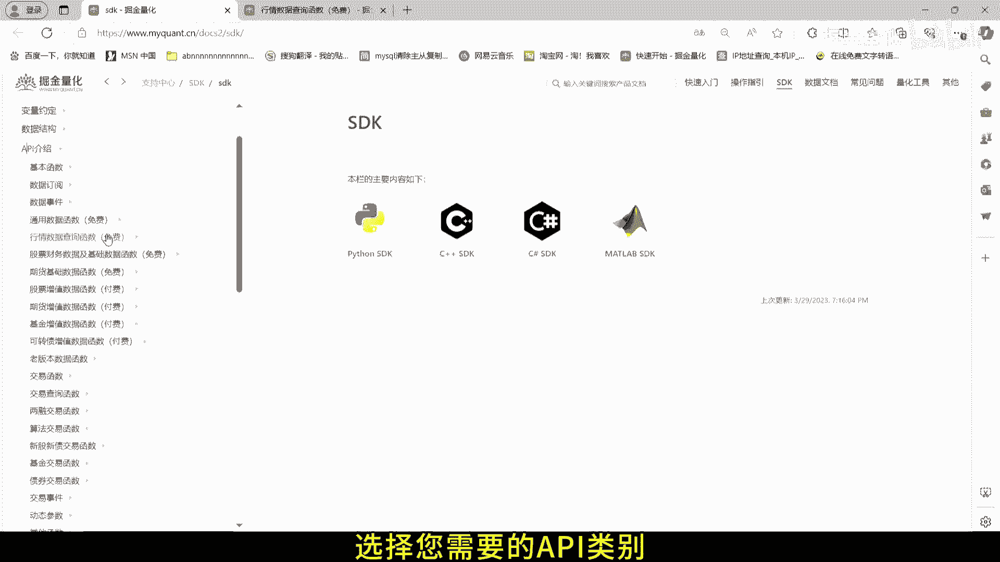
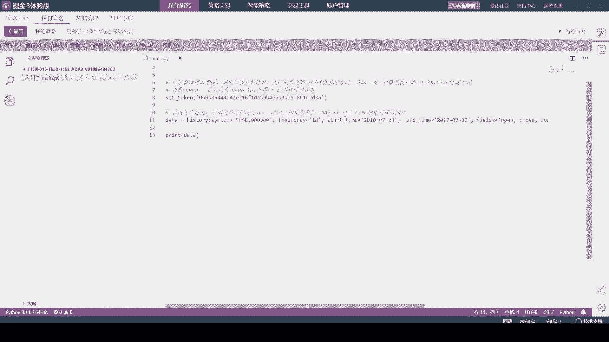
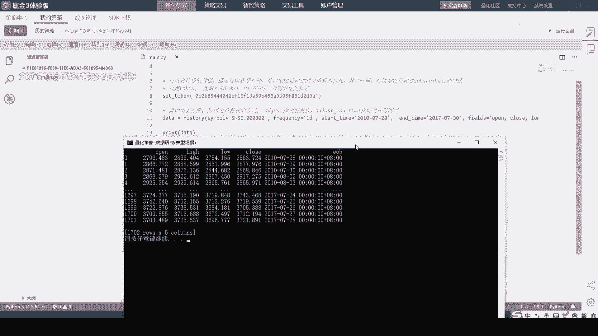
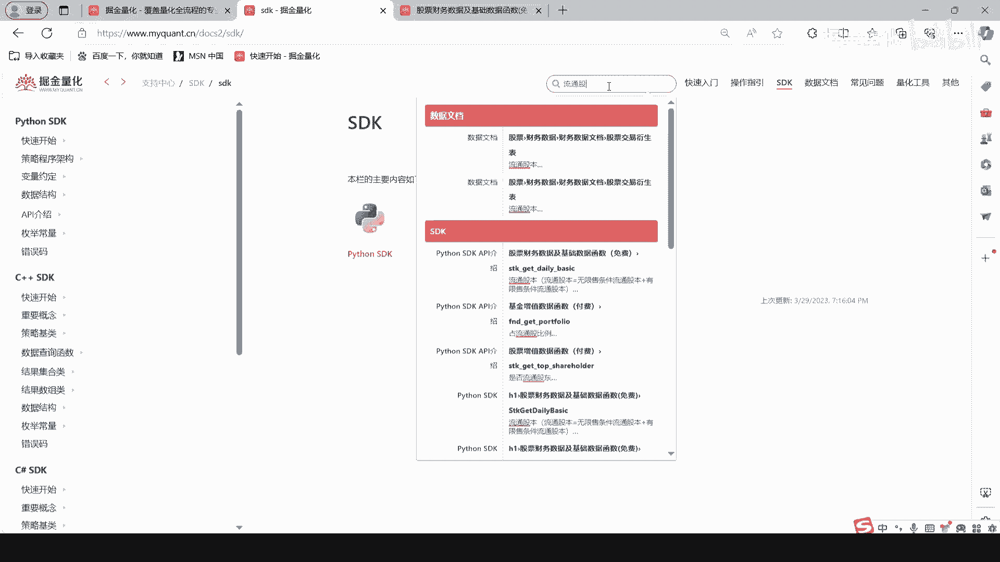
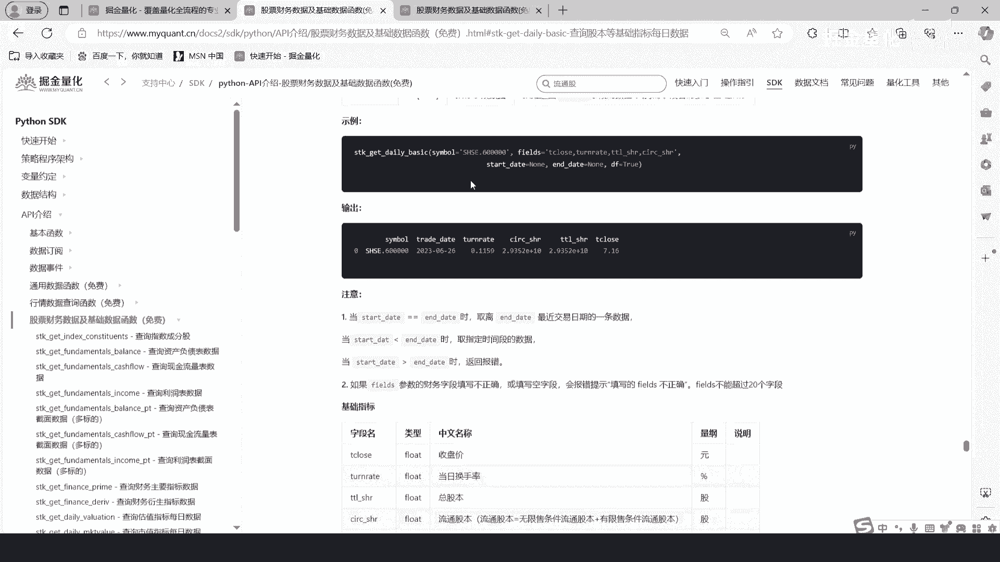
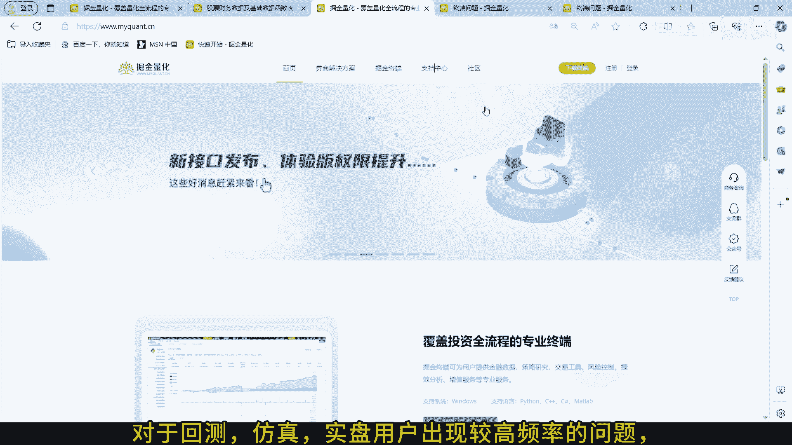

# 2.4 掘金量化API使用介绍 - P1 - 掘金量化 - BV1HZ421u7iZ

欢迎来到掘金量化API使用指南，今天我们将带您了解，如何有效的使用我们的SDK文档，并开始您的量化之旅，首先我们需要访问掘金量化的SDK文档页面，在浏览器中输入上述链接进入我们的API文档。

以Python的SDK文档为例，在SDK文档中，我们的API主要分为通用类，行情类，财务数据类和交易类，每一类API都为您提供了丰富的功能，以满足您的不同需求，选择您需要的API类别。

您可以查看详细的API描述和使用方法，您可以直接复制代码到您的项目中，开始使用我们的API。

如果您需要一些实际的例子，来帮助您理解如何使用APA，我们终端的策略中心提供了示例策略，您可以参照他们来编写自己的策略，同时我们提供文档搜索功能，方便您寻找需求的API。

打开官网支持中心界面或者SDK界面，点击右上角搜索即可查询。

对于回测仿真实盘用户出现较高频率的问题。

我们也提供常见问题文档，打开官网支持中心界面或者SDK界面，点击常见问题即可查询浏览，在使用过程中，如果遇到任何问题，您可以通过我们的官网添加QQ号，加入技术交流群，我们的技术团队将为您提供帮助。

现在您已经了解了如何使用掘金量化的API文档，开始您的量化项目，让掘金量化，帮助您实现更高效的数据分析和交易策略，感谢您观看本教程，掘金量化您量化投资之路上的得力助手。

如需进一步的帮助。