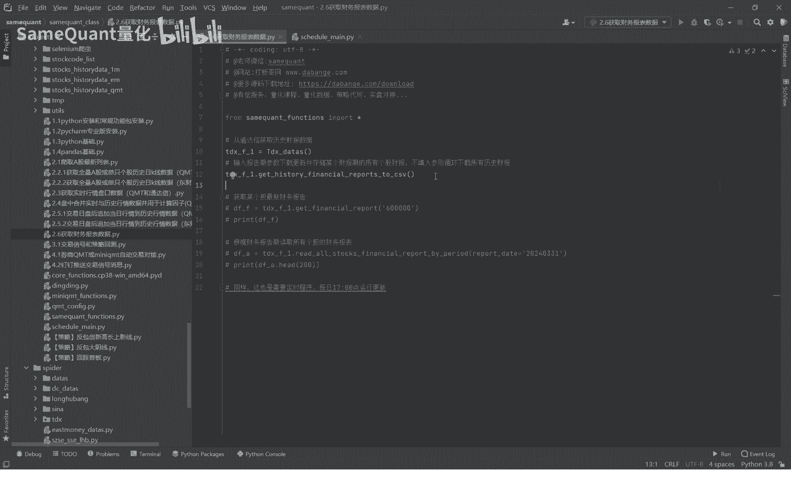
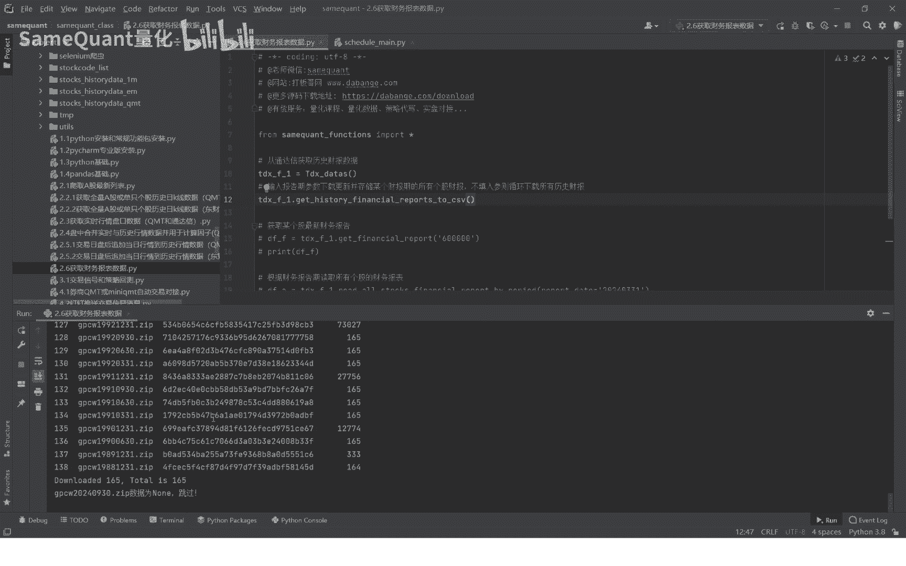
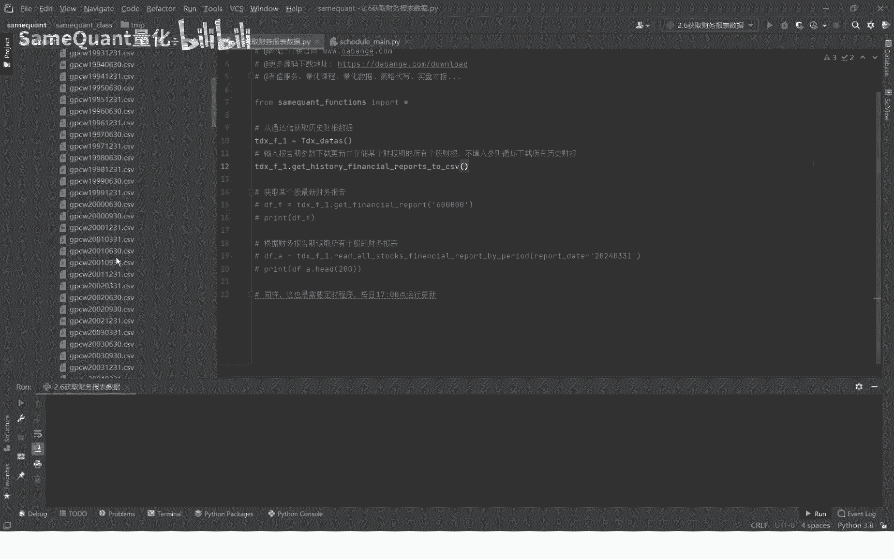
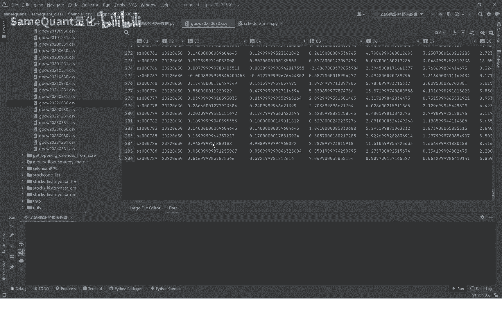
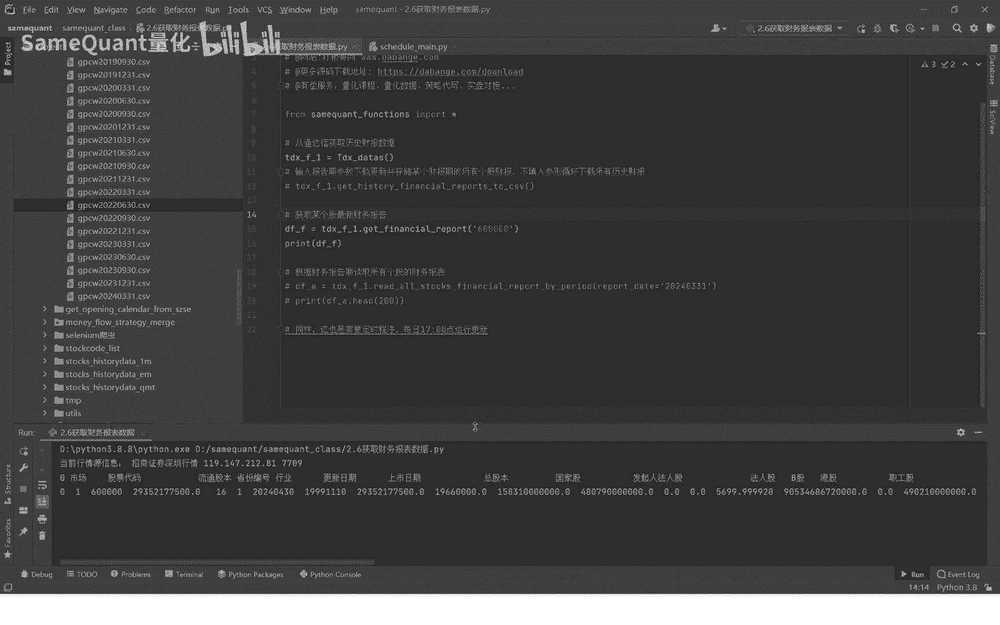
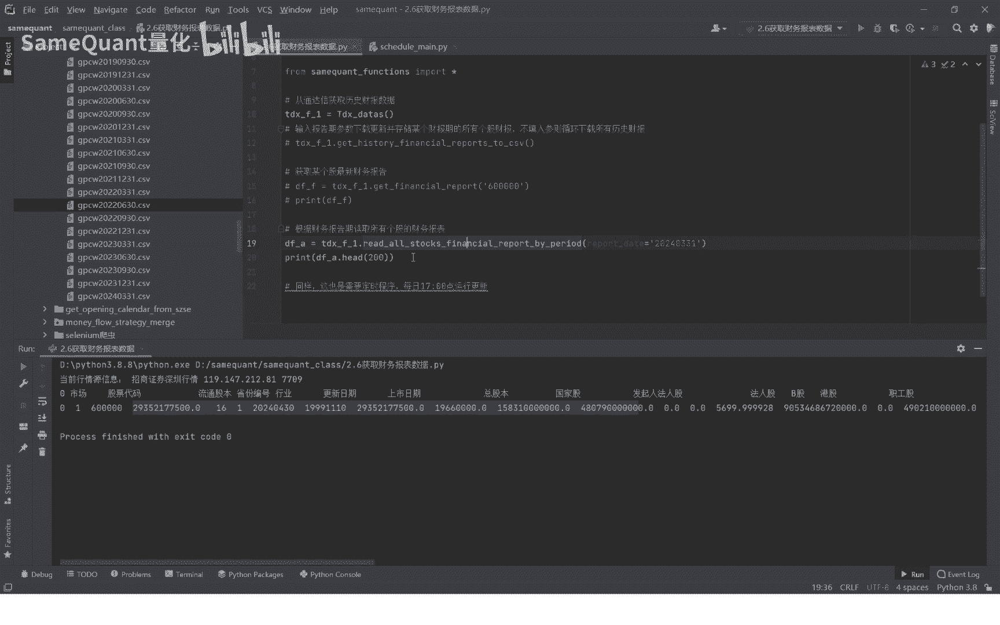
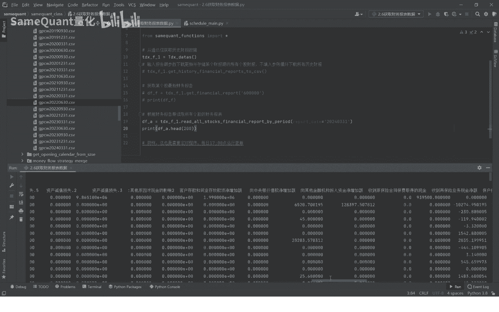
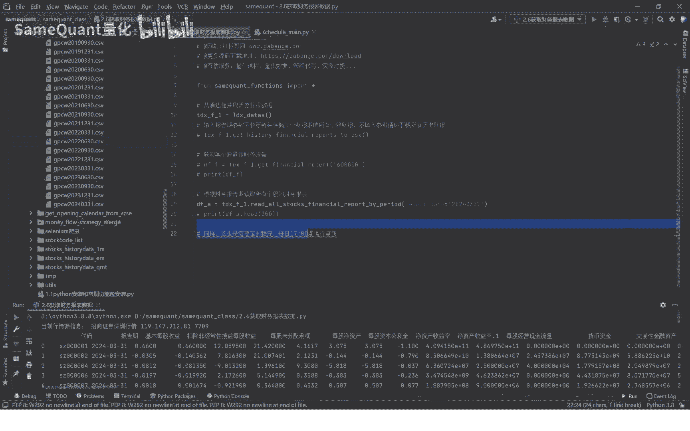
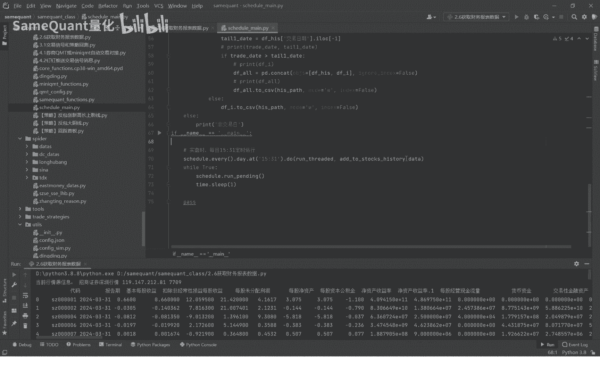
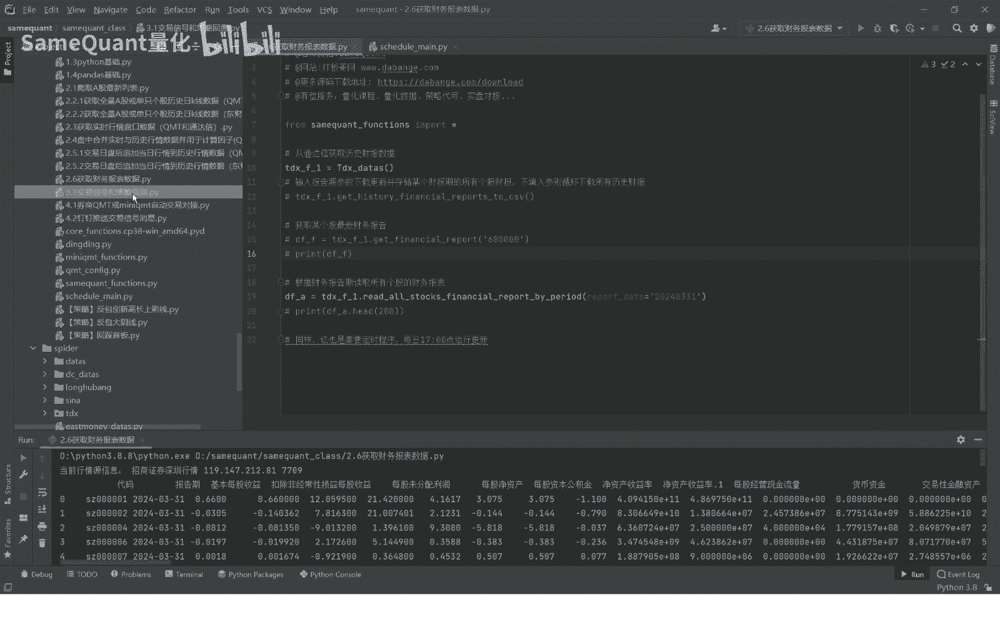

# 2.6 获取A股历史和最新财务报表数据 - P1 - SameQuant量化 - BV13i421X77B

各位学员你们好，这期分享，如何获取全量A股的历史和最新的，财务报表数据，首先我们导入通达信这个包，本期演示的是从通达信，获取这个全量A股的财报数据哈，第一步就是每天交易日之后，去下载这个财报数据好。

我们先运行演示看一下，一旦运行它就开始下载了。

大家可以看一下，这个就正在下载了，这个表示就是正在下载过程，我们之前已经下载过了，没必要重复下载，我们这里就停掉啊，下载完成之后，我们下载在什么地方呢，下载在我们课程里面。

这个目录下面是课程的7mp目录，下面你可以看到所有的下载的，就是这个ZIP文件，这个ZIP文件就是这个财报数据的一个文件，那下载完成之后会做一个解析。

解析之后会生成这样的一个文件啊，这个FINANCIOCSV里面就是这样的一个文件。

这个文件里面你可以看到啊，我们随便点开一个看，你可以看到是这个季度的所有个股的财报数据，当然这个目前显示的是只有200多行，因为JS文件太大了太大了，咱们还项目软件它显示不了。

所以说只显示这么多行，它实际是全部的好，下载完更新完之后，我们接下来就是查看按个股来查看财报数据啊。

最新的财报，比如说这支票，它的最新的财报，更新日期是2024年的4月30日啊，在这些有包含这样的一些字段啊，这是个股了，全量A股的某一个季度的财务报告来运行，这个方法啊，你输入报告期运行。

那么我们这里只打印前200条的，所以财报数据我们来看一下它有哪些字段哈，首先是代码，它报告期基本每股收益扣费是每股利率，每股基金资产，每股资本公司净资产收益率等等，我们往后拉拉拉啊，总共有多少个字段呢。

总共有400多个字段，这个财务报表这个数据的含金量是非常高的。

只要比你任何的网站雪球也好，动态也好，或者是什么甚至是自发性行情软件，同花顺也好，你们看到的财务报表数据都比较，他们的字段要多要全啊，这个是全400多个啊，全量的光这样的一个海报的数据库。

可能一年都得都得大几万啊，所以我们的学员你就可以免费的一个获得啊，好接下来呢也是一样的，就说对于这样的一个财务报表数据，我们需要一个定时的更新程序，一般来说就是每天交易日的一个五点定时运行。

下载更新财报数据的函数就行了，因为这个方法我们之前也讲过啊，也主要是在资源文件里面增加一个17点。

下午五点，也就是运行在运行这个函数的一个方法，就可以了，好了，本期的分享就到这里，我们下期就讲解我们金矿的量化，这个课程的一个核心部分，就是交易信号的一个计算啊。

这个策略的一个回撤环节了。