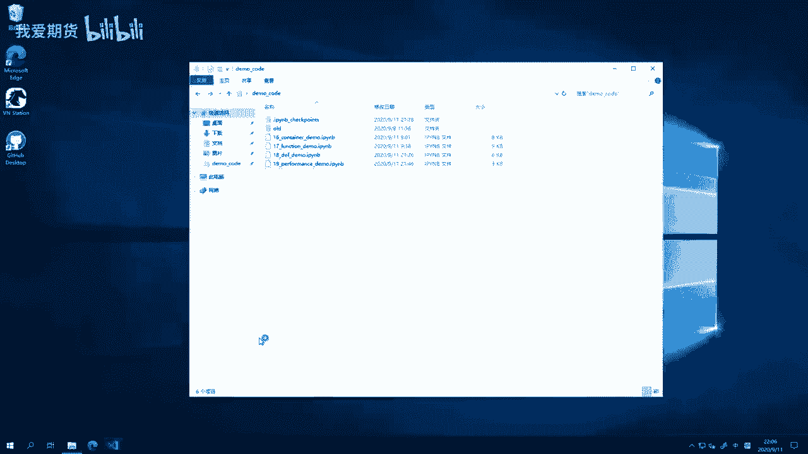
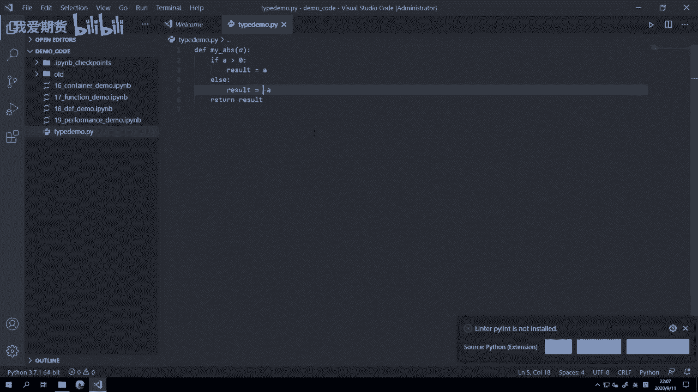
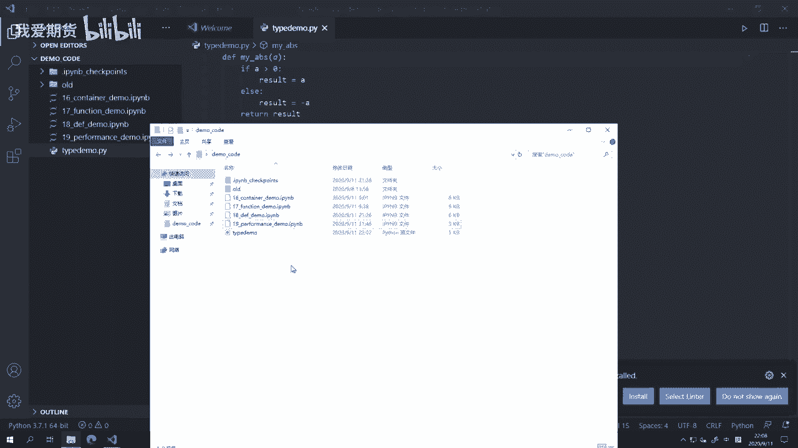
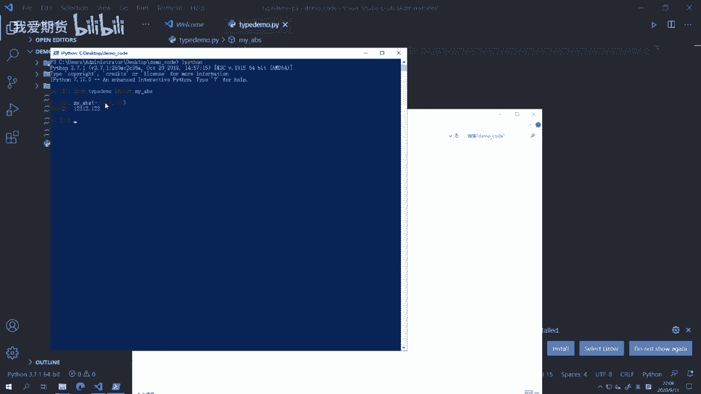
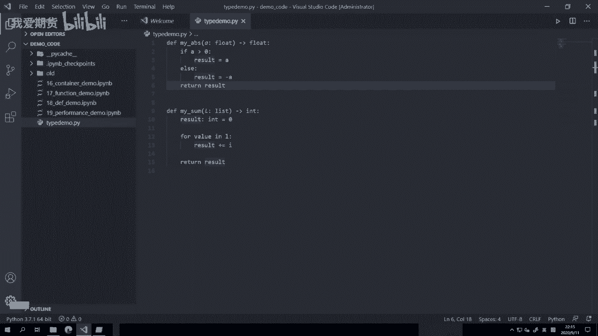
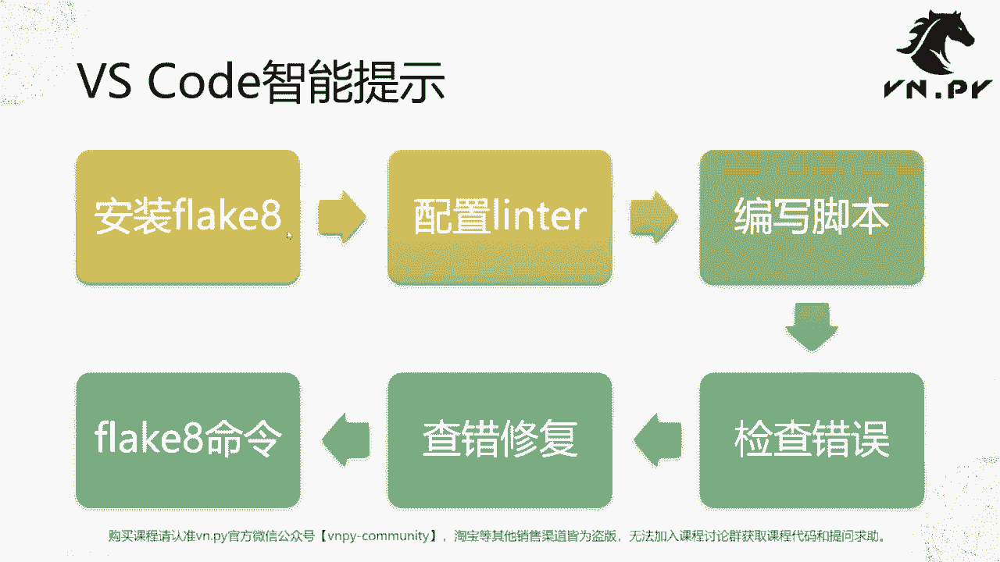
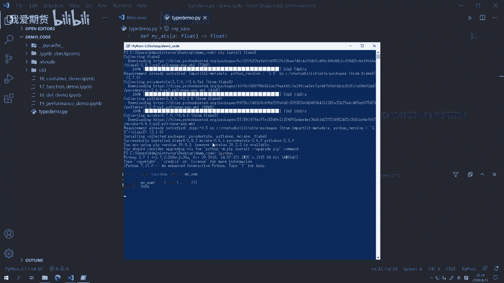
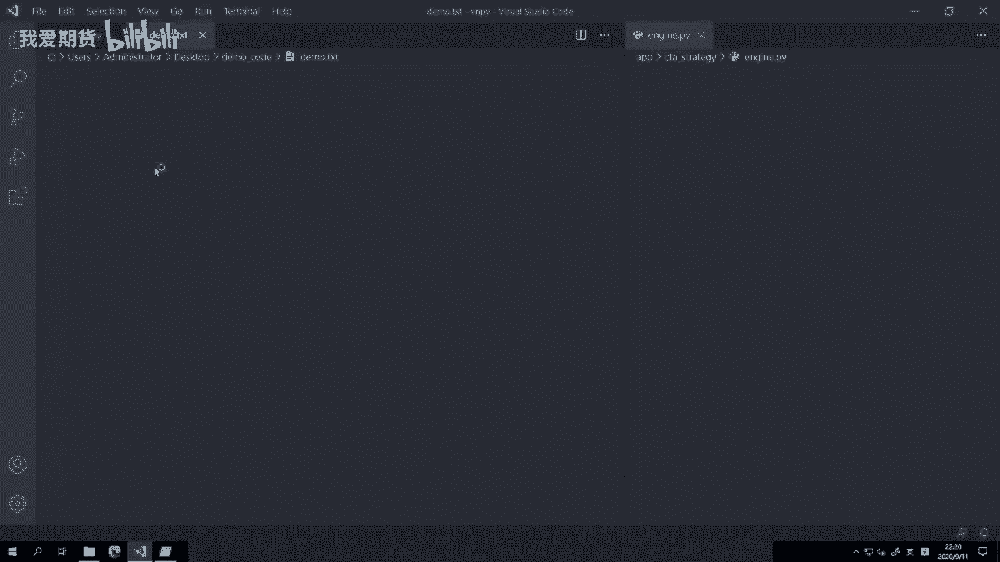
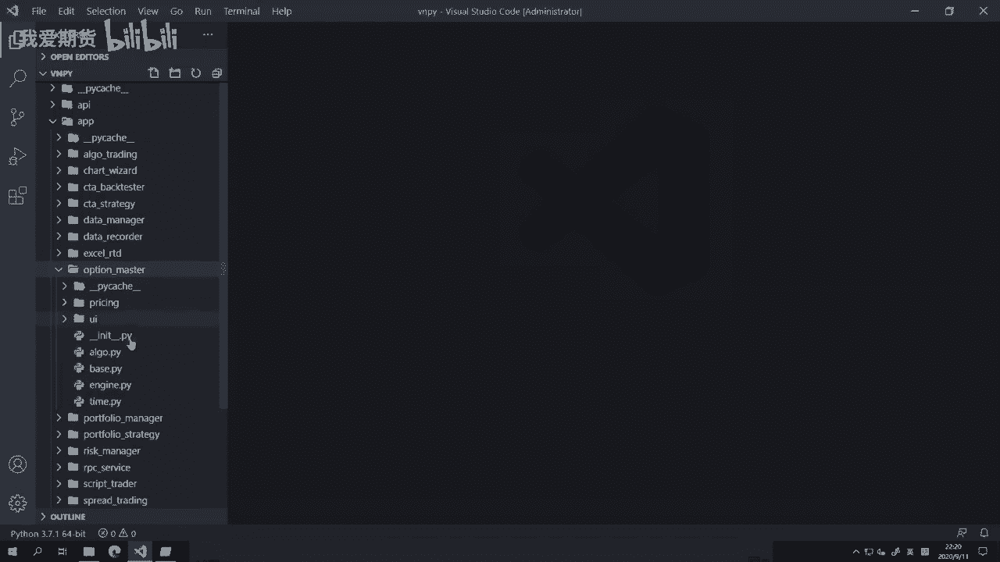
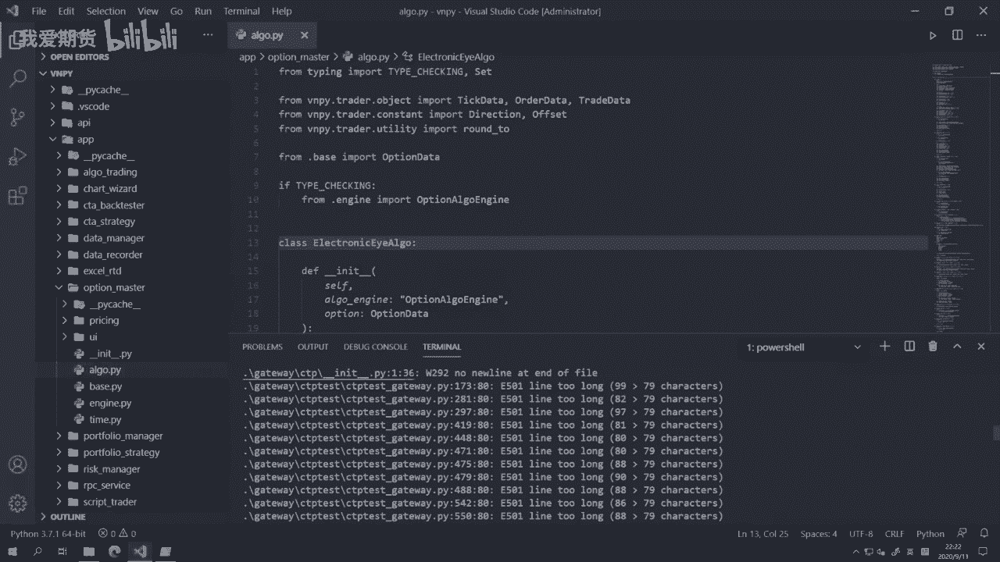

# 20. 类型声明 - P1 - 我爱期货 - BV1352gYTEEz

OK欢迎来到量化交易零基础入门系列，30天解锁Python量化开发课程，那么今天呢是我们的第20节课了，在上一节课里面呢，我们讲了怎么样去测量函数的性能，那么在这节课里面呢。

我们要来讲一讲怎么给函数加上类型声明，那么首先要提到的一点呢，就是Python作为一个动态语言，它在这个写代码的时候，并不强制要求，我们必须去给某一个变量或者某一个函数，去声明它对应的类型啊。

这个和C加加c#，java职业动态语言呃，静态语言是不一样的哈，就是些编译型语言，通常呢都需要我们去指定好哎，这个数据是哪个类型的，他们才能正确的去识别啊，但是对于Python来说并不需要这个呢。

我们也在之前的这么多节课里面，都已经反复的在啊讲到在演示到了，但是呢不可否认的是，在写代码的时候，如果我们把每个变量，每个函数啊，他们在做各种操作的时候，返回的数据或者用到的参数。

加上一个类型声明的话呢，一个是对于我们人来说会更加容易去判断，哎我这里应该传什么东西进去，应该传什么参数，什么类型的参数进去，第二个对于我们用的这个编辑器来说，他们也能更好的去这个起到一个智能提示啊。

帮我们去猜测说诶，这个地方你想要填什么东西进去，或者说呢帮我们去扫描诶，已有的代码里面是不是有什么潜在的问题，而不用等到运行的时候才能发现啊，所以这个是我们Python里，为什么一从这个大概三点啊。

53。6开始引入了一个叫做type hinting啊，这个叫做类型声明的概念啊，那么这里呢所以我们要先讲的啊，是怎么样给函数来增加类型，在后面呢我们讲到这个面向对象的时候，我们会再讲啊。

怎么样给这个面向对象就类啊等等，再去添加类型，我们先来讲函数的，在这里我们要讲的这个添加类型，整体上在函数里面分两块，一块呢是参数，一块呢是返回值啊，对于参数或者说对于这个函数里面。

如果你还用到其他一些变量的话，那么这一类在声明的时候，你想要声明它类型直接跟一个冒号，冒号后面跟那个对应的类型就行了啊，然后第二个对返回值的话，那么就是在函数声明的那个def那一行。

冒号前面加上一个哎这么一个减号，加上大大于号，长得跟个箭头一样，这么一个符号，然后跟上那个类型，这样呢我们的啊，解释器就能够去知道这个函数啊，它返回值的类型。

那我们这边呢就直接用代码的例子来看啊，这里是我们这个放demo code的目录啊，在这里点右键，通过code打开。

然后呢，我们按键盘上的CTRLN来创建一个新的文件啊，我们先把它，大家可以看到按了之后出现一个untitled1，这是一个没有保存的啊，这个vs code里面的文件，我们先用CTRLS来做一个保存啊。

随便起个名字，比如就叫tap type demo啊，点派，那么这节课呢因为全程代码是我会手打的哈，然后所以的话呢，我就不提供这个type demo的代码给大家了，我建议大家也跟我一样啊，一边看着视频。

一边手敲一遍，那啊首先我们来考验一下，还记不记得这个my abs函数的写法哈，这个首先def my abs啊，然后跟一个A冒号FAA大于零呃，这个result等于a else，result等于FA。

嘿不好意思，打错了FA，最后return result就行了啊，那这样我们就定义好了这个这么一个买abs函数。

首先呢我们可以在当前目录下再打开，按住shift按住鼠标右键，注意直接摁的话，是就就就是的这个右键菜单长这个样子，按住shift再点鼠标右键之后会多出一个。

在此处打开咆哮窗口啊，那么在这打开这个power shell啊，在当前目录下，那这个时候呢我们直接输入，比如说IPATHON命令来运行on from type demo imports，买abs。

然后我们就随便买abs这个服务，好运随便运行一下，我们可以看到结果是正常的啊，他可以非常好的正常的去运行啊。

这证明我们这个函数首先没打错，然后呢我们来试着给它加一些类型啊，因为JA这么一拿到一个def my abs函数的话，你可能有的时候呃，因为你是写这个函数的人，你比较清楚，但是我是一个用户。

我一上来不知道的话，我万一哎我可能往里面传个字符串，123。123，那会造成一个后果，就是出错啊，因为我们这个内部的运算用了一个大于号，而大于号是不支持字符串和整数的比较的啊，字符串是这也正常吧。

字符串不存在什么大大于小于之类的操作啊，所以如果有可能的话，能让这个类型我在看代码的时候，一眼就知道的话，会让我在用的时候呢更少出错，所以呢我们可以做这么一个类型声明，比如说在这啊。

我就把它声明为一个float类型，就输进来的A这个参数我们后面跟了一个冒号，然后呢跟了一个这个叫float，就是它的这个数据类型啊，也是我们之前讲到的这个基础类型，那返回值是什么呢。

也是一个float类型啊，因为这个result它本质上也是一个浮点数嘛，只不过符号变了啊，所以这样我们就完成了一个很简单啊，就加了两个东西，我们就完成了这么一个类型声明。

需要注意的就是参数后面跟的是冒号啊，这个空格，然后是类型，然后函数返回值的类型是在之前啊，我们这里是长这个样子的，就括号后面紧跟着就冒号了，然后呢我们在括号后面加多了这个一个箭头啊。

然后又多了几个函数返回值的类型，那么在这里我们要注意空格还是要有啊，这样作为一种写Python代码的好习惯吧，那么这样加上之后呢，其实啊你有如果是在C加加这类语言里面，它在编译的时候就强制要求诶。

你这里只能输入浮点数，你没有办法再去输入，说什么字符串什么，但在Python里面是嗯起不到这样作用的，我们给大家也同样演示一下啊，我先来退出JUPITER啊，输入exit命令直接退出，然后COS啊。

就是叫做clean stre呃，这个screen好吧，这个CMD清空啊，就这个抛弃清空一下，然后我们再次启动啊，Python好，from type demo import这个my abs。

然后我们可以看到，如果虽然你加了类型声明，但如果你要硬是传一个字符串进去的话，它还是会报错的啊，就这个类型声明它并没有实际上帮助你去啊，这个避免时报错解释器其实在实际运行的时候，它并不看。

而是在我们这个vs code里面，它能帮我们起到一些额外的检查啊，那这个怎么怎么看呢，我们来再继续写我们下一个函数啊，那注意一般在同一个文件里面，写两个函数的时候，中间最好空两行，两个空行。

这个同样是P呃，这个这个Python啊，之前我们提到P1P8，就编码方案的一个啊，这个建议啊，SUL这里返回的呢，比如说我们返回一个整数啊，然后result好，当然写的时候我们直接把类型给加上啊。

这个L是一个list类型，result呢是一个额，这个也是一个int类型等于零，For value a value in l，result加等于I，return result啊。

这样就是我们的一个my sum函数，大家可以看到my sum函数比起my abs呢，最大区别在于中间它因为有个啊，这个函数运行过程中的变量result，所以呢我们也给它加上一个类型啊。

然后呢我们可以同样在这个好，在我们的JUPITER里面，From my son，大家可以看到在此时我再次去import的时候，反而有一个报错，之所以但是我这边文件我确定已经修改好了，而且我已经保存了。

那之所以会出现这么报错的原因，是因为Python解释器啊，在你加载某个模块之后，它会把这个模块的文件直接读到内存里面来，那这个过程中如果你在去import的话，它其实并不会再去读文件。

而是直接从内存中有代码里面去import，所以大家注意到我之前在加载type demo的时候，是只写了my abs这个函数的，所以尽管我现在硬盘上的文件里面，我已经加上my sum这个函数。

或者说我已经修改了type demo这个文件，但是对于现在已经开着的这个，我们的Python解释器来说，它是发现不了的啊，所以此时我们就要退出一下exit啊，然后再重进，好让我们试一下。

My sun list range e e，少了个括号，那在JUBEAT里面输入命令的时候，如果少括号的话，或者说他觉得你没输入完的话，会直接你又回车，完了后会到下一行，这个下一行是一个三个点省略号啊。

意思就是这还没输完呢，你可以继续输啊，然后再补个括号，它就可以运行了，把广告没有移到后面啊，这样运行，那在这就报错了，为什么报错呢，因为我这里不小心刚才打错了，Name。

i is not defined啊，我这里是一个for循环对吧，这个这边但是我for循环时候的值是value啊，但我打错了，打成了I啊，所以我我正确写法应该是value啊，但是这样如果说我打错了的话。

只有等到在这个进了运行的过程中，我们才能发现，而没有办法像C加加之类的静态语言说诶，你写代码的时候，这个编译器就呃，或者说这个集成开发环境，IDE就能自动帮你提示啊。

Python的话呢默认是做不到这点的，那么有没有什么折中一点方法，至少让我可以尽可能多的把这些打错字啊，或者呃什么东西没有import啊之类，比较常规的问题，在写代码的时候就给解决掉。

不要说到运行的时候再出问题啊，有没有办法呢，有就是我们在下面一张PPT上要讲的。

叫做vs code的智能提示啊，那么智能提示这个功能不止vs code有啊，包括拍照，包括win i d e等等，绝大部分现在Python的id都能去实现啊，但因为我们用vs code讲。

所以呢我们就用它来做，那么我们整体啊要做这么几个操作啊。

安装flak8配置LINTER编写脚本，检查错误，查错修复flak8命令啊，我们来看看怎么做的，首先n control j啊，在这里打开一个啊，我们的这个运行的，这个运行在我们呃。

呃这个vs code里面的这么一个终端啊，或者你不用它，你直接还是回到这啊，你还是回到这个IPAD里面输入X命令，退出也行啊，退出了之后，我们把屏幕清空一下。

这时候输入命令pip install flake8啊，这个模块的名字比较奇怪，叫flak8，这时候呢他会去啊，这个Python官方服务器上去下载这个库啊，然后执行一下安装操作。

大家可以看到整体上还是挺快的，因为很小只有大概多少K啊，这个等会啊很快就会下完，那么这个flak8呢就是我们讲的啊，要起到一个帮我们自动检查代码里面，是不是有什么地方打错了的功能，那这个时候已经装好了。

大家可以看到这个这个已经装完了，successfully insert啊，此时呢我们再回到vs code里面，按住Ctrl shift啊，再按P好，那这个时候vs code顶部会弹出这么一个对话框。

那此时呢我们输入一个select linter啊，选到最下面这个select liner，什么意思呢，选择这个代码的智能检查工具，然后选到我们刚刚装的这个flak8回车，大家可以看到我选完了之后。

紧接着这就有提示了啊，这有一个黄色波浪出来，这儿有一个红色的波浪出来，那我们把光标移上去啊，大家可以看到黄色波浪，这说什么blank line contains white space，什么意思呢。

就这一行是空行，但是它有个空格，这有四个空格，这个写法对于Python官方的建议是不推荐的，如果某一行是空的，它就应该是空的，你不要没事在这加空格好，我们把它删掉，再保存一下，CTRLS保存一下。

大家可以看到这就没了，然后上面还有个红色的空格，红色的它这里会提示undefined name，I就会告诉你诶，你这个名字压根就没定义啊，你不能这么写的，这么写，红色的定这种波浪。

一般提示就是如果你直接去运行了的话，那大概率是要出错的，黄色的呢是叫做不符合Python官方推啊，推荐的这个代码格式啊，所以呢这这个是不同的筛查标准啊，那么然后或者更方便的方法。

我们也可以到这个problems里面，problems里面呢里面就可以看到undefined，第一个问题，undefined name i啊，就这个名字没命名好，所以我应该怎么做啊。

应该把它改成value啊，因为因为它就是value，大家可以看到我CTRLS完了之后，紧接着那个啊一个提示就没了，同时这儿的那个波浪符号也没了，但上面还有一个还还有一个剩下的叫L。

这叫ambiguous variable name l什么意思呢，同样也是Python官方的建议，就是你要去呃这个命名一个变量，或者命名一个函数的时候，尽量不要用一个英文字母去命名。

因为这个很容易让人搞混，不知道你到底想这这个东西是干嘛的，你最好给他一个完整名字啊，我们这边呢就直接把它改一个名啊，叫value list，这样CTRLS完了之后啊，它下面又有提提示报错了。

因为我只改了上面这个地方，下面这个L还没改啊，所以我就复制粘贴下来，把它翻过来，这样改一下，再CTRLS，那到这儿我们可以看到problems，这个里面已经没有了空了啊。

空了之后就说明这个文件在flak8的检查下，已经是正常的了，已经没什么任何问题了，我们也可以在JUPITER里面来操作一下试试看。

啊可以看到结果就是5050，这个挺正常的，可以正常运作，没有在打错的部分啊，所以这个就呢就是我们这个flak8的效果啊，如果说当前目录下，你的这个文件特别多的时候啊。

比如说我可能不止一个type demo，比如说像VN点派这样的项目，比如说我们打开的这个open fold啊，我们这个找到C盘va studio啊。

这个lips site packages VN py啊，打开这个目录，那么在这个目录里面。

如果你有兴趣可以点开看一看，这个里面有非常大量的啊，这个这个这个代码最少啊，这个大几百个文件肯定是有的，可能不止可能要上千了，如果在这个时候，你要去检查哪个文件里面有出错的话，那就非常的呃。

你当然可以每个文件打开之后，然后啊按下CTRLS。

然后呢按个就看这个problems里面有没有输出啊，这样也也是一种解压方法，但无疑非常非常麻烦啊，这里有提示了，因为我们刚刚换了个文件夹，所以它会提示我们要重新选一下，我们就重新选一下。

再选一下flake8就好，那这就非常麻烦啊，更方便的一种方法，那就flick by也提供了一个命令行工具，我们回到这边terminal里面好，回到terminal它，我们会发现已经打开到这个目录了。

Vn studio lab sapes v n p i，然后在这里我们运行flake8点啊，什么意思，用flake8检查当前整个目录下的所有代码，有看看他们有没有不符合的啊，这个这个我们要求的。

如果有的话呢，就提示啊，我们先运行它，当然这个要耗挺长时间的，因为VN点派里面的这个源代码，文件量已经比较大了，那么这边的点起到的就是告诉你啊，要告诉我们的程序要检查当前目录的啊，这么一个意思。

如果呢你不想用点，你也可以用这个号这里输入完整的目录路径啊，就把这一部分复制粘贴过去啊，这检查也可以啊，那么我们在这儿可以看到啊，有一堆的提示，那主要提示内容是什么呢，就是某一行太长了啊。

Python官方的推荐是，每一行代码不应该超过79个，或者说这个是PP8里面推荐啊，但是从Python这个3。7之后呢，这个规则稍微改了一下，就是现在一般推荐是不要超过100个字符了，所以啊。

我们VORP是照着这个100个字符的标准写的，所以这样会有一些若干若干的提示，但在我们GITHUB的开发仓库里面，我们有修改这么一个配置啊，我们相当于FLICT8提示是按照100检查的。

而不是按照照79检查啊，就不会有这些问题了，那vs code里面当他发现某还有问题的时候。

你还可以诶把鼠标移上去，按住CTRL键直接点它，就可以跳转到有问题的这一行啊，它会自动帮你打开这个文件，然后同时切换到这一行，此时呢你就可以去很方便直接进行修改哈，那当然这边啊。

这个因为额这个并不是实际上的问题，只不过是因为这个不是我的开发环境啊，所以他有这么一个提示，我就不做任何修改了，OK那这样呢回到我们的PPT啊，最后在讲完这个啊，这个这个类型提示之后啊。

一定要注意几个点啊，这里我们还是把Python和C加加做一个对比，Python是一个动态语言啊，而C加加呢是一个静态语言，Python里面的这个类型系统啊，是叫做type hinting。

它是一种类型的提示，它的主要作用就是让我们的vs code编辑器，以及我们的flak8这样的代码检查工具，可以去帮我们识别代码里面一些常规的错误啊，然后提示我们在运，使得我们呢在不用运行代码的情况下。

就能把这些小的bug给修复掉，不用到了这个运行的时候啪一下啊，这个程序挂了啊，那个时候才去修复，所以提高我们工作效率，这个是这一点，但对于C加加来说，里面所有的函数的类型也好，还是每一个变量。

他们都是有完整的类型声明的，这个类型声明会限制你的程序，在就C加加程序在编译的时候啊，就下面我们这里有写有写编译检查的时候，就必须啊，你所有的这个数据操作，如果满足不了的话，错了直接就编译不出来。

编译不出来，你自己自然就没法去运行了啊，所以C加加的这个类型系统是一个严格的类型，声明系统，反过来到Python这边啊，这个类型提示更多是为了IDE，为了flick8这样的检查工具去识别。

如果识别出来有错的地方，但是你不改的话，同样你这个Python代码还是可以运行的，只不过运行的时候有可能会抛异常，就像我们刚刚之前那样，就抛了一个exception啊，程序挂掉了。

那么这个呢是Python里面的类型系统和其他的啊，cg加或者CSHB，java之类的静态语言里面类型系统最大的区别啊，当然了，虽然他们都叫类型系统啊，但其实是类型。

这个系统往两个不同的方向发展，应用的方式，OK那么我们这节课的内容呢就到这里啊，更多精华内容，还是请扫码关注我们的社区公众号。

