# 20240428量化高级培训（26） - P1 - 通通小白 - BV1nM4m1f7Eg

今天呢是这一次学习的最后一堂课，因为我们上次设置的时候呢，就到5月节节之前就结束了，所以呢到前面的那个时刻的链接都没有用了，到五一节后，我们再根据情况再重新做新的培训链接。

因为这次培训就到这个月底就结束了，可能今天应该是最后一堂课吧，昨天我们讲了为什么要学量化，今天呢我们就给大家系统讲一下皮球量化理论，答案为什么叫貔貅，貔貅也就是中国古代的神兽之一，传说只吃只吃不吐。

所以呢很多就是做生意的，或者是主要做生意的人，就喜欢买些貔貅的配件和摆摆件，因为传说他就说貔貅招财进宝，当然了，我们投入资的奖情况来说，不可能只赚不亏嘛，所以必修理论追求的是大赚小亏。

就是我们要总体要盈利，你以百分之百不亏是不可能的，没有说不，除非神，这世界上没有神，那也不可能说百战百胜，所以不要相信哪个老师买都是股神，你看很多老师整天吹十岁炒股成了千万，他现在没日没夜的给大家讲课。

他咋不投资呢，你也可能他这是自己包装，是骗子，很多的讲课老师呢，他们都讲自己多么厉害，多么牛，现在都不炒股了，一说的还是汤面辉煌，因为他是什么，他现在以前是一个从业人员，不能炒股，那我是从业人员。

那我怎么都不不当从业人员，我为什么要当炒股呢，那说明他没本事炒股挣钱，他可能以前也许运气或者牛市，让他偶尔挣了一把，那这个东西，那我们天天买彩票，总有机会中550块钱吧，甚至十块，对不对。

那中个十块钱就成了股神了，那是不可能的事情，你让他改投资，敢投吗，也许他就没挣过钱，只是自我包装或者是P出来的一个有钱人，那好几个投资者，包括最早的以前的那些分析师，和现在卖教材的分析师，说多么厉害。

多么厉害，那当然有些厉害的了，那些厉害的人，比如说涨停敢死队的，人家厉害，人家有钱有资金有做，人家为什么厉害，最后结果证明人家是通过违法挣钱的，就通过那种摘帽子，就是控制股价对吧，那种方式违法挣钱的。

你合法的很难挣钱对吧，你是实际上很多人在聊的时候，真正的挣钱的路子全在刑法里写着呢，那是很容易挣钱的，对不对，那咱们不去挣，那都在刑法里写着，所以我们学习呢就一个常平和的心态来学习，就说我们就讲。

如果你要是从挣钱的角度上来投资，就像我来讲，老想总想挣钱，反而挣不到钱，当我把挣钱作为一种游戏的时候，那就挣钱就非常容易了，因为你就看那个是盈亏很正常的事情，不可能是只赚不亏。

如果一个人不学点投资的知识呢，那你肯定就跟普通人一样，人呢有个贪婪的心，因为你菜谁都贪财嘛对吧，那我也贪财，另外一恐惧得到的手里的钱又害怕失去，这是每一个人的本性，所以呢就是说在做投资的时候。

包括我也也是一样，我就权衡一直在权衡，就像下围我前面给大家讲下棋一样，下围棋一样，当你这个子落出去之前，你要权衡你的这个收益，要使我们的收益最大化，你就看准狠，你才能挣到钱，这是我们给大家讲。

就是怎么样去看，要从全局的观看，不要说你很多人学了一招打板的，那以前当初大行情好的时候，天天在那打板，有可能是真的，有可能是假的，但是我相信在行情好的时候，那些打板的多数是真的，对不对，不会是P的。

那在行情不好的时候，他们咋不打板了，因为他打一个板，死一个来一个死一个，你喜欢打板，那那机构给你就给你做局嘛，我就给你拉涨，拉涨停板，你去追，你以为今天打了，追了个手板，明天有二版，今天涨停买进去。

当天收盘就掉五个点，就剩五个点了，第二天开盘跌停，你去打吧，这些人怎么不去截图了，他这个游戏他都玩不明白，为什么让我去追版，我就不从来不追别人，获利的情况下，我不会去获利的，主力一旦获利。

他随时随刻都可以把筹码丢掉，如果我去高位去接主力的筹码，那主力跑了，那是不是把我套死了，所以我从来不爱追吧，对不对，那主力在追赶这个游戏怎么玩呢，为什么大家说两融转融通，人家把这个股票打板。

直接到券商去借券卖出，比如说人家五个点开始拉，拉到拉板人的成本是6%，打板的时候，人家到券商时候，把券商同样的多的数量，直接在涨停板的位置卖掉，人家主力已经把利润4%锁住了，对不对，当天主力不玩了。

你散户能把他打满吗，你那些打板的招数肯定打不了，他就掉下来了，掉下来后，第二天主力顺便再砸一下，对不对，为什么要砸呢，因为他手上有筹码，他昨天6%买进的，现在已经5%了，他跌停板卖出去，你觉得主力亏了。

主力没亏，主力怎么样，主力在昨天涨停板借的券，今天在跌停板把卷买回来，还给券商，人家又做了，挣了10%，人家一反一正挣了14%，你那些跟着打板的人亏了14%，这这这个这个游戏都不知道这个规则怎么去玩。

整天喊着爱我打扮打扮，那都是傻子，对不对，所以这个游戏我给你，你听我的课，我正儿八告诉我这个游戏这个钱是怎么拿的，怎么能挣到人家钱，你把这个游戏规则搞清楚，为什么你说我从来不说我什么什么打扮。

因为打板是个小概率事件，你自己统计一下，就是所有的股票天天涨停的，一年下来连5%的股票都没有，就包括那两版的，你都算，你算算每一只股票一天5000只股票，你把那个打板的数数量加起来，不管它值多少只。

你把它累积到一起，对不对，就算200个交易日，5000×200，加上你每天的打板数量，你算算有没有5%，那是个小概率事件，所以我从来不玩打板的事情，你知道吧，但是我就看看准看狠，我就正常。

哪怕200%分之三，我稳稳当当的拿到手，所以我们追求的尽量只赚不亏或者赚大亏小，这是我们的一个学习的要求，你不不报风险，你就不可能没收益，你就肯定没收益嘛，你不投资哪有收益，也不可能亏，也不可能收益。

对不对，我们要学习量化，打量化的投资来讲，因为大家没听过皮修课呢，我们给大家讲，就是说首先我们分析这个游戏，我们把金钱看成数字的时候，这个钱数字怎么样增长，如果十块钱的股票跌到五块钱，亏损50%。

你看你资产是不是缩了一半，你挣这100万很难的，亏掉这100万很容易，这个投资市场很多人光想着往上挣，因为证券市场投资市场就是一个财富变压器，你投资一块钱，他会根据你的变压器。

比如说你220伏变到12伏，或者变到36伏，对不对，根据你的变小大小，也就投资的回报的大小，它有一定的风险，对不对，你的投资越大，你的风险越大，它是成正比的，比如说我投资一块，我能挣两块。

但你的风险率是100%，你亏损就这个本金就没了，你说我的投资回报率10%，我投资十块，我亏一块，那你也可能挣一块，对不对，这种常态的风险是相当的，在这种小条件下，比如说我们我是个低风险的人。

我也不想把本金失去，我只追求10%的利润，对不对，那我看看我投资的这个所有的这个标的里面，我能不能找到我最大亏损5%，我最大盈利能挣到15%的票吧，这种股票我觉得是十，当然我是一只可能是会失败的。

对不对，我再试一次还是失败的，那我们可以用量化吗，我一次把这种状态的，我认为这种状态的股票他有十只，我全买了，只要我的胜率超过50%，我能达到60，那我肯定是大赚小亏嘛，对不对，我总体是盈利的。

这就是一个量化，另外呢投资我刚刚讲十块到五块，你亏50%，你想挣回来不容易，五块涨到十块翻倍，对不对，所以要求是什么，不要借钱去炒股，不要用急用钱去炒股，另外要止损，因为在股市投资市场中获得。

股市中有个鳄鱼法则叫什么，止损增等于再生对吧，比如说你是一个壁虎，你被猫逮住了，你跑不了，猫，把你的尾巴压住了，那你就把尾巴丢给他呗，让他吃呗，你活了命，尾巴还能再长出来，命都没了。

这个尾巴还有什么用处，有的舍不得尾巴，对不对，舍不得尾巴，那就把命交交交交给人家了吗，所以明白这个规则，止损等于再生，你可以让自己小亏，觉得不能产生巨额亏损，这就是我们这个量化讲的这些简单的一些东西。

另外呢大家我们经常讲，当然我们不是说所有的穷人死于基金中产，死于理财财富，富人死于信托，实际上你看看你周边的人或者投资者，包括比如说你的父母，他们搞理财，搞集资，当我身边的亲戚也有很多。

当时我劝都劝不住，拿了一张什么东西，拿了一张养老院的一个宣传画，拿了一个招生广告，说国家要求民办大学集资，办大学集资，搞养老院，年化利率12%，一年投资100万，一年给你12万的回报率，那我直接这句话。

我说那你咋不让他到银行去贷款，银行贷款利息8%，他咋不贷款，搞这个集资干什么，我说既然能集资，那就是骗局吗，最后证明我周边的一些亲戚就参与了什么，一个就是集资办学，集资养老院，人家人家是什么游戏。

就是一种就是那种类似传销呀，就是说就是拿前面的，拿后面后面加入的钱付前面的钱的利息，一直到钱付不起，这个流游戏玩不砸了，跑路了，很多人一下一贫如洗如洗，对不对，这是理财的富人的，搞信托死了很多穷人。

搞基金，以前的是大家的股神呢，那些基金经理，明星经理赔100个亿都不好意思见人，你知道人募集上三五百个亿，赔一二百个亿，很正常的，对不对，那些基金经理咋都亏呢，因为人家不把你的钱当你的钱。

待会你听我的课，知道为啥不能买基金，对吧，所有的股票呢都是一元上市，它的净，因为你的证券法规定呢，就这一元的净资产等于一元面值的股票，它是以这个原则上市的对吧，长期跌破一元的股票，也就是20个交易日。

跌破一块钱就退市，这证券法规定的证券市场规则，但是这些股票基金经理干什么，基金经理IPO是基金经理高价申申，报亏了即免费了，基金经理，因为基金经理他的年终奖奖，年终奖万奖金是基金公司发的，不是基民发的。

基金经理为基金公司服务，不是为基民服务，所以基金的盈亏与基金经理和基金公司无关，为什么，所以我们自己的钱留在自己的手里去做，亏了还享受了这个亏钱的过程，你买了几斤一块钱买的，现在剩了五毛六毛。

你享受了什么过程，你去找基金公司是给你赔吗，人家没逼着你去买对吧，只能说那些赔钱的人是傻，对不对，因为他不知道这个游戏我都不买，不买基金，我从来不买这些权益型基金，我只买货币基金，货币金是两码事。

基金挣钱我就不讲了，你们自己百度去看这些基金经理怎么样赔，赔的少了，还好意思见人嘛，对不对，葛兰赔了170一张坤171，很多人都是坤坤啊，九零后的整男坤坤明星，对不对，刘彦春都是一个个大明星。

一个比一个亏得猛，为什么他们亏钱，对不对，因为他们就没把你的钱当钱，我给你找个例子，为什么亏钱，因为人家就是为了人家是为基金经理，不是为居民服务，是为基金公司服务，一块钱的股票，人家多少钱是申购的。

我们这上讲过例子，一元的股票，人家多少钱申购，你们自己看吧，反正那些破净的股票太多了，100多，200多，300多，一元竟是咱的股票，那么高的申购，他拿吉米的钱当过钱，没没当过钱。

因为人家就靠这种李一呼唤对不，上市公司发行股票给他估，给他一个净资产的一个估价多少倍，他一块钱的净资产给你固定个50倍，100倍好吧，一块钱股票变成100倍的价，一块钱加100价格申购。

给你写个投资报告，因为现在的趋势都是这个样子，然后给给基金公司送点钱，对不对，写点小作文对不对，后面交谈一下，然后基金公司200块钱申购，股价一下申购申购就200块钱，那些亏的一个比一个差。

不论是投资新股的很和做些这些人都亏得很惨，所以我们待会后面讲皮球理论的时候，做什么样的股票才有真正的投资价值，我们这些就不讲了，反正我们就目的一句话，就是自己的钱掌握在自己手里，投资市场。

我们这个理论讲的不是说你投资股票，因为对大家对对对，我来讲，我就实盘期货，我自己拿自己那十块钱挣点小钱，一天挣1000块钱，每天挣1000块钱，多了挣两千三千对吧，我也不贪，这个挣够数。

以前还熬夜做黄金白银，最后也不好挣，最后我就不做了，对不对，我做到晚上十点我就睡觉了，别人我还有些朋友玩，是跟外面挑打02：30，我说我我说有时候经常挣不到钱，盯了一晚上盘连波动都没有，对不对。

所以就没意思了，就把身体给搞坏了，所以我们做的品种，首先你要玩懂规则，你知道你玩的是什么品种股票的，国内的股票呢是一倍的杠杆，两融是两倍的杠杆，融资融券，很多人说哎我有100万。

我到融资融证券开通融资融券，人家机构开通融资融券是为了做空，你为了把资本翻一倍，你的风险放大了一倍，对不对，这是不是道理，我刚跟你讲，人家打板打板怎么做的，人家12%开始拉往涨停板，拉人家成本是6%。

涨停板的时候，借券卖出，建融资两中，借券卖出，当时就跌了，人家利润锁定了4%，第二天再用手中买进那些筹码，砸个跌停，开盘就跌停，人家在在用跌停价把股票买回来，还卷卖，就是买买券还券，对不对。

人家把钱还给券商，又挣了10%，那些散户打板的又没做两融，只能做多死的透透的，所以这个唉我都不知道你们咋玩，然后雪球呢，那就是一些杠杆，它有一些低风险的股票，觉得感觉能挣钱。

他就用杠杆放大2~5倍的杠杆，期货呢6~10倍对不，国外期货两二十到2000倍，你要知道杠杆杠杆越大，你亏钱越快，你比如说杠杆维持的时候，你亏赚10%，你的本金就是要么翻一倍，要么消失。

所以你要知道这个杠杆的作用，我们股票呢一般一般不做两融，你就是一倍杠杆亏赚，你可以玩，很多时候我不玩期货，期货能亏爆仓，爆仓就一分钱没有了吗，玩股票对吧，亏个50%，你还有100万，还有50万。

你期货的话亏上二十三十%，你本金全消失了，对不对，这个风险都在那放着，所以你不论玩啥都是有风险的，总之我们是为了赚钱，不论是杠杆，是我们是要参考对吧，主要是挣钱为目的，刚才我们讲了，你看十块钱对吧。

假如说我们那时有些我长期持股，我从来不建议别人长期持股，上昨天的那堂课，持股便利的时候坚决不持股，哪怕他有涨停，我也不会拿，因为我做趋势长期做对吧，红线的时候你再有短期买点要去买对吧。

绿线的时候有买点我也不买，这就是昨天给大家那个操盘线的那个目的，所以呢你就股票呢只在短期持有，你有十元，假如说客户有十元的股票，股价买了1000股对吧，涨跌幅10%。

如果他持有股票一直不懂这个股票先涨停，先跌停吧，我们先讲先跌停，跌停就损失了10%嘛，对不对，你就剩了9000的总资产了，如果再涨停，9000加九百九千的10%就900啊，变成9900，就一跌一涨。

两个跌停，涨停你亏损了1%，那你说我先涨停呢，好先涨停也是怎么算的，一千一万涨停板给你了1000块钱，你有1100好，第二天遇到了个跌停对吧，10011000-1100，又变成9900。

事实上减去9900，所以呢亏钱快赚钱慢，只要你你想想你在这个市场连续天天涨停，跌停电，他给你来个20个十个咱就说十个吧，你还有多少钱，你起码损失10%，对不对，你们我说我没动啊，我看他又天天涨停。

跌停他也不算是10%，另外呢，我刚才讲跌的快的原因，是从十块钱跌到五块钱对吧，我们这数学游戏，我们知道10×0。9的六次方才是跌了六天，你才还有五块三毛一，对不对，只有跌到第七天的时候，你才不到五块钱。

也就是说只要经过七个跌停，你肯定不到五块了，资产少于50%了，但是从五块涨到十块，翻100，100%就翻一倍，你看看十乘以1。1。7，1。1的七，什么时候变成十上面呢，要八天你涨了七个涨停。

你才19块四毛九，还没到100%，到第八天的时候才到20一点多，210%，对不对，所以你要得要掉下来，你只要七天就自产损失一半了，涨回去要八天，那你说你去年做的那些热点股，你亏了50%。

你猴年马月能挣回来，你自己想吧，你自己有这个信心呗，你有这个信心到银行去贷上100万，你去炒早都能翻倍，你既然有翻信息，把那损失的50%打回来，你就去借钱去炒了，所以我给大家说，刚反复讲这个问题啊。

不论是讲前面杠杆，讲这个刚才这个涨跌数字游戏啊，绝对不能损失大多数本金，这是我们必修理论的一个原则，风险大于收益的时候坚决不碰，这是我们这个原则，你才能保住你的本钱，你才能稳健增强。

所以这个是我们的必修理论，那个理论你要说我亏了50%，我学必修理论，我怎么挣，我也不知道怎么挣，对不对，因为挣钱后面还没讲，还有运气成分呢，你跟我学了技术，我也不能保证你百分之百挣钱，因为这还有在运气。

还有一定投资运气，因为我这边公式都写的清清楚楚的，你要知道你的运气有多好，你再去投资，假如说我们不投资，那你肯定一辈子是穷人，穷人，除非你很能挣钱，你的收入很高，对不对，如果在30年前，你有1万块钱。

就是万元户，当时能买一套房子，对不对，如果1万块钱，而且当时的一年一年的利息是10%1万，30年之前改革开放的时候，利息是10%，你自己查一下以前的那个收益，然后假如我们有100万，30万。

有100万现金，我们不投资，假如说我们已除去利息3%，以前的利息还高，我刚才说你就买个活期都78%的利息，定期10%甚至12，对不对，我们都不说那个话，我们这3%，假如说你不投资30年。

你放到家里还是100万，假如说你当时是个万元户，你能买一套房子，对不对，你放到家里拿到现在，你这个1万块钱还是1万块钱，你能干啥，30年前，也就是八九十年代改革开放的初期。

你那个钱还是这还是那个时候钱还能用，对不对，你看你这一毛钱纸币，嘿这不1980年的发印印刷的，你那个时候1万块钱继续用，能干啥，啥也干不了，放到30年后还是有那么多钱，但是呢你要是不投资的话。

我们大有讲你不投资你就惨了，因为为什么1万元不值钱了，有通货膨胀，通货膨胀我这上没有写哦，通货膨胀其实远远高于银行的利息的，银行利息，银行就是靠息差在挣钱的，通货膨胀率肯定比银行的利息高。

所以前存钱给你10%都不行，还得要保值，你知道吧，你要买你买国际件来讲，国库券的利息当时500%分之六对吧，年化利息让大家买，大家都不买，因为银行10%啊对吧，但是国库价有个什么情况呢，他给你保值。

如果保值亏钱了，国家给你，比如说用通货膨胀20%，国家给你保20%，这就是通货膨胀造成的一个问题，这事我还没讲，通货膨胀率，通货膨胀率起码4%以上，你知道吗，你想想没有4%，那现在的房价能涨成那么高。

1万块钱的房价，现在100万1000万，你有30万，你有几万块钱都能在北京买个四合院，你现在去买一下，你试一试，能买得起不，所以这个通货膨胀这还没给你算，没说你的钱贬值的问题，你放家里30万。

30年以后还是30万，如果你单位投资储蓄的话，你190万对吧，因为你投资投资可以避免通货膨胀，财富贬值，我刚给你说通货膨胀率4%对吧，我们这上没写，我给你写一个例子，对吧，几十年来。

通货膨胀40%都有可能写的少了，因为人民币在九几年做了一次贬值，当时就贬值了20%，你像现在的日元，现在日元日本现在核核核污染，中国人咋还往日本跑呢，因为日元兑美元大贬值吗，你有日元，我有认识一些朋友。

还搞外汇投资的，他经常买汇，拿拿银行买汇，今天投资美元，明年投资这个英镑欧元对吧，他就拿那点钱每天去投资倒腾那些外汇，第一个利息高，哪个国家利息高，他比如说美元利息高，他就买美元对吧，买完美元了以后。

美元再增值，他就再换人民币，他又能靠短暂的挣钱，就靠这种炒汇，自己在那个银行账户炒汇，那现在日元贬值了，那你如果假如说你有日元，那你是不是损失了你，原来我现在我不知道贬值多少，反正我们不。

假如说日元贬值20%，那你的购买力是不是下降了20%，所以投资是肯定要投资的，贬值和通货膨胀是必然趋势，你就像美国购买了什么拉斯危机，都什么购买了，当时俄国的对不撒谎的土地。

100万美元买了一块一个一大块地方，那地方能值多少钱，第100万美元，那大概是一八几几年的100万，现在100万能干啥，你的房产，你要是在北上广深的房产都不止100万，你自己算一下。

假如你房产1000万出个六一百三十万美元，你说你搁到以前一八几几年，你是不是买了美国一大半个州了，对不对，这个东西钱在贬值是必然趋势，中国人民币也是一样，所有的国家的财富都在贬值，通货膨胀是必然趋势的。

所以投资呢单利复利，我们讲复利肯定厉害的，你看如果单利投资的话，就是我们本金不动，把利息取走对吧，我们所以呢你单位这叫单位投资30年，190万，如果是复利呢，就是我每年产生的利息作为本金再投资。

这叫复利，复利的话，你30年就242万，你看是不是复利比单利投资多，所以呢复利是投资的一个财富的变压器，这就是我们讲投资，你怎么样钱增长的更快，然后游戏呢我们讲投资是个游戏，我们讲你要把它作为财富来讲。

你可能亏了赚了你很开心，亏了很肉疼心痛，知道不，但是呢你把它当成游戏来看，我们讲了，就是说就我们就像比如说我们玩麻将，赢扑克对吧，我们在家里玩，几个朋友在家里玩，大家玩来玩去。

这个扑克呢40张扑克在牌桌上转来转去，最后大家不玩了，就所有赢家的合计减去所有盔甲的合计，这都是政治啊对吧，它等于零，这叫零和游戏，因为40张扑克大家一起一分十张玩，玩完了不玩了，扑克往桌子上一扔。

还是那40张，这叫零和游戏，因为数字不增加不增减少，只是说扑克的在赢家和输家之间进行转移，那我们在讲，我们在这四个朋友觉得家里没意思，不刺激，我们到麻将馆去玩，对不对，到麻将馆那就存在问题了。

那麻将开麻将馆的老板肯定是为了挣钱，不能让你们白玩，大家一人带了100块钱去玩对吧，玩小麻将，你到那又要交麻将馆的抽成，还要在那喝杯茶，对不对，消费了你人带100块钱去，等游戏结束了。

大家走的时候带去了400，回来了，300，那100没了，让人家麻将馆赚走了，这是变成什么，因为所有的赢家合计减去所有的盔甲，合计小于零，这是个复合游戏，因为你的钱减少了，叫负的小于零，成为复合游戏。

那那一般情况下没有任何游戏，因为任何能量守恒定律，动量能量都守恒守恒定律，物理上能量合计永远等于零和绝对零，不可能是大于零的，对不对，你就说爆炸，爆炸是质量和能量的转换，它能量守恒的。

符合爱因斯坦的能量守恒定律，对不对，但是呢在投资市场，股票这个只有在股市是个特殊的情况，股市因为股票有分红，有可能是一个正和游戏，如果大家都买了这只股票，谁也不交易，对不对，一一每人一都买这个股票。

不交易这个股票市值，比如说是现在是100万，总共市值100万，但是这个上市公司每年给大家分红1万，第一年101，第2年102，大家的，所以赢家和输家的合计，那其实是正的，所以投资市场只有股市。

投资市场是个正和游戏，所以大家对这个游戏先问问经理在哪个市场，然后我们再讲股市震荡横盘的趋势，我们可以看作为零和游戏，因为呢它不涨不跌嘛，指数不涨不跌，他是个零和游戏，期货市场，外汇市场。

赌场就是零和游戏，为什么期货合约就是买卖双方看多看空的，对赌吗，外汇也是一样嘛，对不当，外汇还有利息，那我们不考虑利息成分啊，赌场对不对，赌大赌小，你压大我压小，谁产生谁给你中间贴钱，老板贴钱吗。

开赌场的人贴贴钱吗，对不对，最赚钱赚钱的市场就是赌场，开赌场肯定赚钱，这是国家不让开吗，因为在法律上写着，我刚给你讲了，大挣挣钱很容易的，市场都在方法都在刑法中写着呢，对不对，这是赌场。

因为这些没有办法产生资金的新增，就是对赌，赌场抽水，期货市场人家收佣金，外汇市场收佣金，赌场庄庄家还抽水，这都是零和游戏，就说只是抽水率很小，我们认为是个零和游戏，在零和游戏呢你可以靠技术赚钱。

会出现赢家和输家，因为游戏你学了必修理论，你只能在零和市场挣钱对吧，在复合市场肯定挣不了钱，所有的赢家减去所有的盔甲小于零，这是个复合游戏，复合游戏呢只能靠运气赚钱，参与者多数是输家。

就是你有技术都没用，你让我去在一个熊市去炒股赚钱，我都觉得我白给，对不对，我买股票我买完他就跌，我买完就跌，那我为啥去白给嘛，对不对，因为熊市下跌的趋势类似于复合游戏，复合游戏是靠运气赚钱。

所有的参与者多数是盔甲，只有运气的人才能挣钱，所以熊市下跌趋势是复合游戏，彩票市场是符合游戏，因为彩票没中500万，大家都不买彩票了，对不对，彩票呃，就就主要是收集收割一些那些你买彩票中了。

给你有奖没奖的五块钱就白扔了，这是复合游戏，因为大多数参与者都是亏欠的，假定所有的赢家减去所有的盔甲大于零，这是个正和游戏，正和游戏呢可以靠技术或者靠运气都能赚钱，是参与者多数是赢家，股市牛市上涨趋势。

市场类和正式游戏是一个傻子都能赚钱的行情，你现在想想，你那些明星经理就是一个猪，在风口上能飞上天那个行业，那是个大牛市，傻子买股票都挣钱，只是那些基金经理挣得更好，或者人家包装的更好而已。

那现在熊市他咋亏钱呢，对吧，他不挣不了钱，他不会不买吗，你你想想我们除了股市这个股票以外，股票基金分类的，它分为低风险，就是货币型基金，我买的就是低风险货币基金，他主要是买一些流动性强的。

他们买一些企业在国债就是能够奉献，他就收一点点的利润对吧，利息比活期利率储蓄高，这另外一个就叫中风险基金，中风险基金呢是一半股票，一半国债，对不对，那国债或企业债也有，就主要是企业债也有破产的时候。

所以买企业债的基金也不一定能保本，也不会保本，挣钱的也可能会亏钱，那你股票不行，你可以买基金吗，买股票不行，你可以买债券吗，那些平衡基金他也亏钱，对不对，那你股票基金更亏，你要买上股票，你除非买了牛股。

有牛股，有有做这个去年亏损，有做赢的，有一个基金经理，人家的基金经理看得很痛，是个私募，人家早早就在去年年初，人家就清算了，人家对市场不看好，人家把钱全部还给投资者了。

那市场证明人家对着人家在最高点的时候，人家出不掉货，全部把钱分了，人家是真基金，直接清算，我们不玩了，对不对，还有一些个别的基金经理，人家只买那些就是不买那些热点，只买那些有投资价值的股票。

那人家也挣钱，你像股市股票股指到现在一些分红好的，业绩好的，人家还在一直创新高，比如说我们说的一些收益性高的银行对吧，国有银行，你看农业银行，中国银行那些银行股，他就收益高，还有一些长期分红的。

现在是不是都在一直在上涨，投资市场呢分为他的资钱是哪里来，投资市场的基金资金流入呢，包括新人入场资金就是新股民入场上股票分红，上市公司回购，这都是资金流入股市，资金流出是包括哪些，发行新股，增发限售股。

减持交易佣金印花税，还有人赚钱走的那一赚二，平期赔一赚的人，那里面50%有可能人家就把钱拿走了，不玩了，对不起，人家知道挣钱玩的都是都都没有人投资挣钱，就没有人炒股，跟个刚给你讲了，投资跟买彩票一样。

没人中500万，谁去买呢，肯定有人赚钱的，如果出现钱多，股票少就对吧，股价就会上涨，因为流入的钱多了，因为买的人多，就跟卖菜一样，大家都喜欢吃这个菜没卖的了，那剩下的卖的人就借机涨价，对不对。

总是会有人能卖出去的，如果股票多，没钱买，你这个菜上市了，尽管很新鲜，当初冬天的时候，那青菜对不对，破破烂烂的，皱不拉几的，还能卖个高价，因为大家都有钱，买不到青菜，到夏天芹菜上市的时候。

一个菜叶子比一个菜叶新鲜，一一块钱一大堆，为什么钱多对吧，但到那个时候菜多钱少，没人买啊，这这这这个卖菜你先想想想，投资就跟做做小买卖一样，你怎么样，你真正的很多的，说真的很多的投资者他做生意很厉害。

但投资股票我就搞不清这么糊涂的，自己辛辛苦苦挣的钱，买基金，买理财，然后嫁给你又亏掉，对不对，所以这个就是一个游戏，所以我们大家明白你的投资游戏就行了，你知道了这个游戏呢你就知道怎么挣钱了。

然后这个钱是哪里来的，我们把这个市场整个投资商做了个划分，就所有的人呢，这相当于人所有的参与者，一个是投资的场所和服务商，一个是交易主体，服务商呢全是来这个市场是赚钱的，他赚谁的钱，赚投资者。

交易者就叫投资者，交易者还分为两类，一类称为原始股东，原始股东他在二级市场减持，那就等于拿股票换钱嘛，对不限售股减持他那不是原始股东吗，那限售股哪来的，他本来就是原始股东对吧。

我一一级市场的原始股东减持换钱，二级库上市场的买卖双方，就靠股票的差价来赚钱，所有的市场呢，也就是说二级市场这些人呢，要养活一级市场的减持者，还要坚持活这些上面的所有的人，这些人包括什么证券公司。

交易所银行，对不对，软件公司还有培训课的对吧，卖软件的啥都有，对不对，理财的还有投资公司那些，你去你去靠这些，全是靠这些交易投资者来养活的，或直接或者间接从他们身上赚钱，所以大家的钱都到哪里去了呢。

从投资市场两部分所知，上市公一大股东上市前清仓式分红，提前拿回来了，投资本金上市后，资金都离开了市场，上市后呢，公司增发再圈一次钱，为什么干了涨增发就圈钱嘛对吧，拿走了钱。

所有的资金来源都是二级市场的投资者，不论你是机构投资者还是散户投资者，你只要去投在这个市场去买股票，你就是投资者，我们都成为二级市场投资者，第二个结论，整个市场靠所有的二级市场投资者来供养。

因为他们赚我们投资者的钱，不论是国家收的佣金，就证券公司收的印花税，交易所发行的新股上市费，对不对，全都是从我们这些投资者身上拿的钱，那我们知道了刚才那个零和游戏以后，才知道这钱的流入流出是怎么回事。

的时候，我们看一下2022年，2022年，对不对，但我们从表面上来看，很多人都很简单，简单从这个2022年对吧，上证股指跌了15%，股指总市值消失了多少，总市值下跌了13%点13多万亿，人均亏损这么多。

全市场的基本平均亏损10%，对不对，我们看这个大家很正常啊，那股指都掉了吗，那我们亏钱很正常，这种人就跟傻子有啥区别，你为什么要亏钱呢，对不对，为什么亏了钱，他没搞明白，因为从2020年这两项吗。

这是202年资金流入和流出分红在这对吧，50%让人家限售股和法人股拿走了对吧，因为你很多国国有公司控股公司，人家拿走了，有一半我们觉得给留了二级市场，你还要交20%的分红税，上市公司回购对吧。

但人家100块钱发行的调到十块钱，人家回收购一下，增强一下投资者的信心，哎我们这股票还有价值，现在低估了，我们回购我们100块钱发行的，我们十块钱收回来注销掉，这叫回购，就等于上市公司拿钱买买回股票。

二级市场买股票，这也等于是流入市场的钱，这两项一算，然后下面什么印花税佣金统统都从市场抽水，我们这1-2022年少了多少万亿，这个市场是复合游戏和游戏，你回顾一下前面的投资理论。

零和游戏它正和游戏这种市场有挣钱的没，一赚二平七赔，达不到，一赚二平七赔也能达到5%的人赚钱吧，或者3%的人赚钱吧，对不对，达不到10%，3%的人2%赚钱，因为还是有很多股票涨停翻倍的嘛，对不对。

那大多数人都是亏钱的，这种市场零和游戏，你参与那个干啥，那我们从2023年看一下，是22023年，同样也是这个道理，你看这个上市公司分红这么多，下面都是减项，少了多少这么多亿啊，少了这么多万亿。

而且股指没跌，你说去年股指跌了，大家都亏钱，咱就算了，去年的话，前年股指下跌亏钱，那去年股指没跌，年初到年末还赠了涨了0。68%，那股民为什么还人均亏损这么多万元呢，因为人家都赚走了嘛对吧。

我刚跟你讲下马234567，人家都赚走了嘛，没钱了嘛，就跟卖白菜一样，对不对，你看着是菜钱涨了，对不对，没人买有啥用处，或者因为买的人少了嘛，所以就没钱，不是大家想补仓，已经没钱补了，就像他说的。

一定房子也抵了，就差卖老婆了，再去补仓了，人没钱可补了，所以还得要看他亏钱，所以我们就讲，所以大家投资呢一定要记住，股票的面值是一块钱，股票的EV呢只要平均股价跌到20日，他就退市了。

这是一个1V在这个市场嘛，前面就是个圈钱市场，你看整个一个整个一个证券公司，对不对，疯狂的劝你，你因为在这种体制下不圈钱都是傻子，基金公司公司经理，基金经基，基金公司在圈钱，上市公司圈钱。

证券公司在圈钱对吧，说谁在做空，那中介公司不融融券，那别人怎么去做空，对不对，它整个是一个圈钱市场，包括上市也是个圈钱市场，我们后面讲的是如何立志对吧，一圈了再圈，所以我给大家讲。

今天给大家讲的没有讲任何理论啊，今天呢首先呢时间的关系，因为讲的有点太多，我们给大家把这个头很多人没听过皮修理论，我们把这个讲透，把昨天的那个指标说要给大家送的，昨天给大家送了一个呃中波段指标。

叫做叫做呃，操盘线，今天呢把大家送给大家一个角度线对吧。

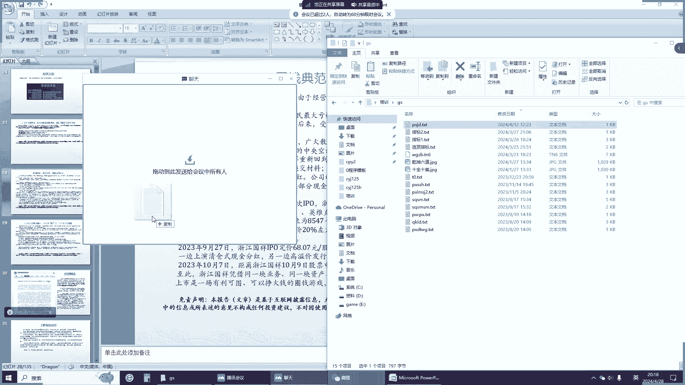

角度线指标我们看一下啊，我们不推荐股票，我们只交流技术，我们说清楚，大家呢因为课一定要结束了，如果大家呢想知道什么课什么开始，可以加我们的群，QQ群或者微信群，或者加我的微信，这是我的微信QQ群的话。

你们也可以加微信群，也可以加QQ群一看很多，我们先看一下啊，昨天给大家讲的操盘线。

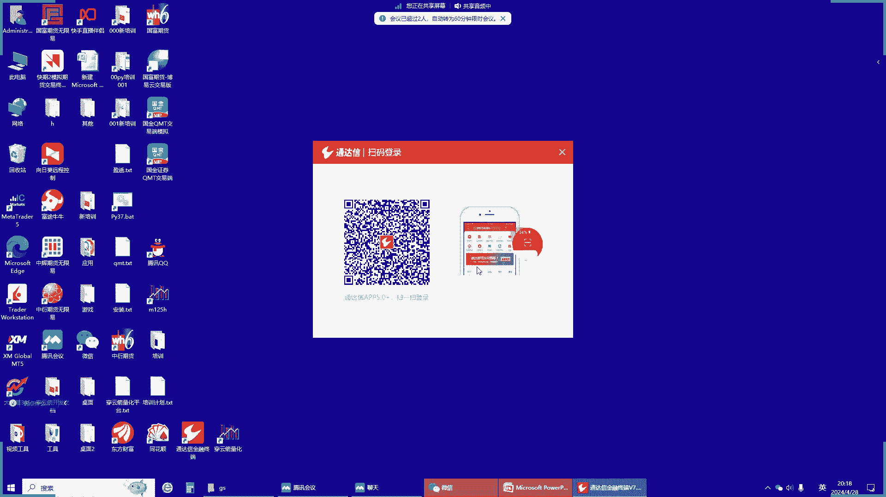

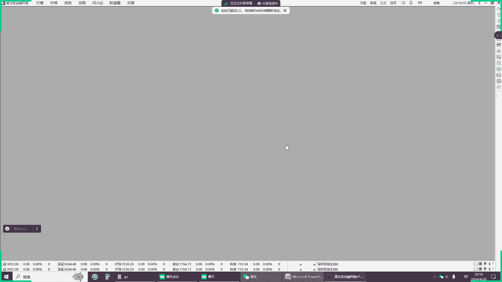

大家呢你只要选好股票，长期做肯定会挣钱的，这是昨天送的一个操盘线，对不对，我们只在上涨的趋势算，今天送的是必修角度线，刚才发给大家了，我们讲了，必修角度哎。

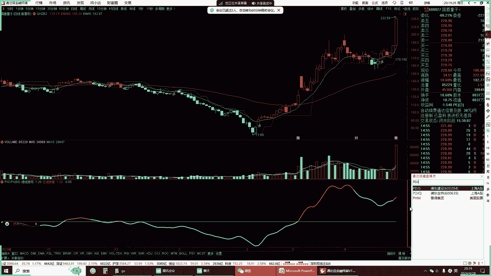

就是这个指标它是角度为它，这个原理呢就是PU理论，因为时间的关系呢，我们讲了个基础，后面的后面再有空了，节后再给大家讲，我们在以前连续给大家讲了，你知道吗，语气讲了一个角度，就这个理论的原理在哪。

我们讲了以后，开线的下跌它会产生一个夹角，我们画个趋势线，它会产生一个夹角，这个下跌的趋势是个负角，因为这个是零轴嘛，水平线是零轴，它是负角，如果它上涨，它会也会产生一个角度，它是个正角。

我们根据这个角度来判断上涨和下跌，这个速度比你均线速度快得多，所以我们用了数学公式，我们已知B和A求A角，对不对，得到这个角度线的公式，为什么呢，我们刚才讲在这个市场中没有股市，首先我们刚才讲了。

这个市场实际上是人主力操作的市场，主力是什么呢，我们看主力是怎么增强的，因为你说看了所有的课，什么股票是以围绕价格波动，这所以你学的所有的理论，实际上任何市场，包括美国股市，中国股市呢都是由主力控制的。

主力首先在低点，也就垃圾股，早题材找到题材，他提前吸筹码，然后挖坑砸掉技术盘的跟盘者，就像我这种跟版本整人家造假，想办法，我们只能砸掉，因为我们也能发现主力在收集筹码，会把我们这些人洗掉。

因为让我们破坏，假如说我止损5%，他就给你砸到10%，你卖不卖对不对，你卖了人家就开始拉，对不对，主力第一主力在低价垃圾股中寻找题材，二，并提前买入筹码，二发现有人跟盘拉升前，用手中筹码砸盘。

让跟风者止损，然后以更低价格收集更多的筹码，三利用资金优势快速抬高股价，打板就是不想给对手收集筹码的机会，也就是说你追不上的板才是呵呵，真正的赚钱板，你能够追上的板，那就是炸板，那就等着亏钱了。

那是假的，就是你追不上的涨停板才是好的涨停板，第四利用网络媒体投顾编写投资报告，提高股票评级，推荐给其他的价值投资者，我刚才那砸板，其实前面那个洗盘砸盘就是为了技术投资者，下面是搞价值投资者。

你看这个价值投资者也不容易啊，为什么很多有钱人亏钱呢，他全被被这些价值评估报告给忽悠了，对不对啊，推荐一下给其他大的价格的投资者，然后第四五个通过关联账户对敲交易，做出量增加增的假象。

吸引其他的技术投资者继续跟盘，顺势出货，主力完成出货后形成阴跌散户行情，因为都是散户了嘛，谁买进都不涨，只有割掉，找其他热点，第二个追进去抄底又没人，主力又得割掉，你哥我哥只有价格往下走嘛。

所以投资者亏钱最多的股票是历史牛股，那你说你的主力是控制的，这是假的，事实给你摆到这，这个龙净环保最高价是2023年7月12号，在最高价的这个附近，17块九毛七对吧，现在多少钱啊，现在都十几块了。

可能十525块钱了，这亏了多少，你看所有的券商投资股票都在评级，7月11号中邮证券评价评级买入，华鑫证券，7月12号评级买入，7月12号是最高价，他们都是主力花钱买的，骗技术投资者，价值投资者。

所以这整个市场都是假的，对不对，所以你看我刚给你讲这挣钱呢怎么挣，就是用必修理论来证朴素的来挣钱，那你说你在那成天吹牛，那你怎么样，那我现在其实我没截图啊，我截图还是挣钱的，你就不用想每个月挣。

每天挣一两千，你看看我的脚也我只做期货，我们看一下最近的4月9号。

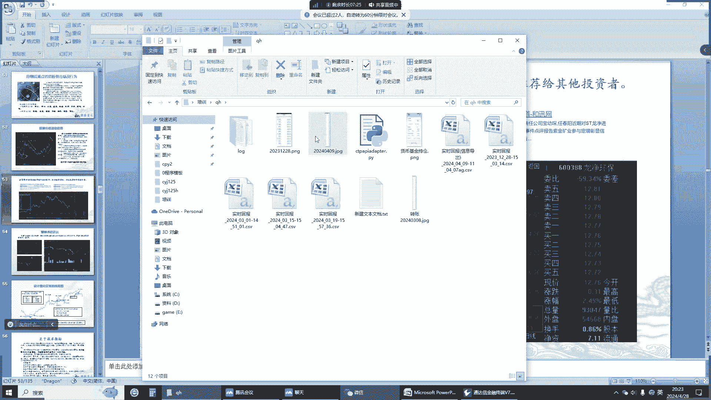

我们看一下，我这我就拿10万块钱每天在做期货对吧，4月9号，今天是4月几号，我都懒得去截了，没截图，还是这你还是一千两千，你看赚的多了对吧，挣3000赚的少了，挣两千一千，我也是稳定，他的手早看见了。

赚钱了，做赚不了钱，我就不做了呗，对不对，每天在赚钱，对不对。

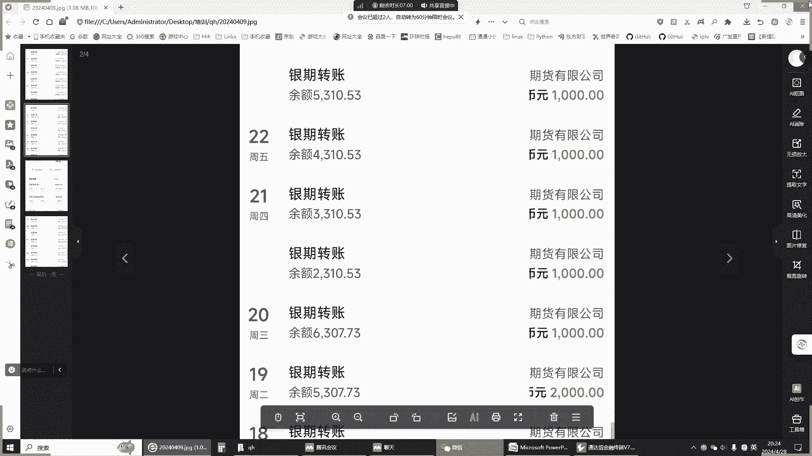

我是怎么做的，量化技术，主观加量化，我们看一下最近的3月4月九号的，这是流水，这是我的实名实名流水，你可以到证券公司去查交易时间，4月9号我们看一下盈亏，对不对，盈亏多少笔，这是啊，这是我做的白银啊。

这个只是做了一个品种，这个品种很多啊，你知道我不只是做白银761，我们再看看其他的回报，找个近点的，3月153月19号看一下这个回报，160一比376，我让你看玻璃玉米螺纹钢，你看这些都是对不对。

有机会我就下单吗。

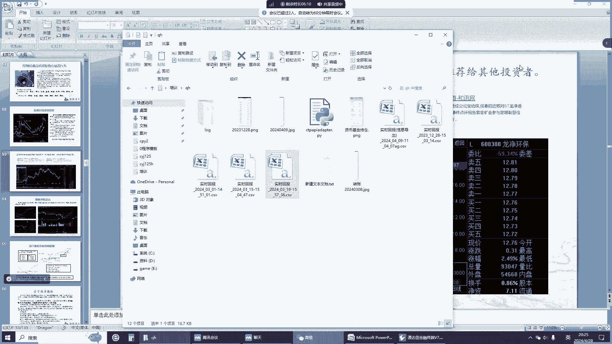

这就是皮球理论，皮球理论去教大家如何赚钱，你就算世界上没有股神，马克思物理学家牛顿都败给了股市，你想想你听那些人不睡觉。

给你在那讲，他能战胜这个股神吗，股市依然是一个。

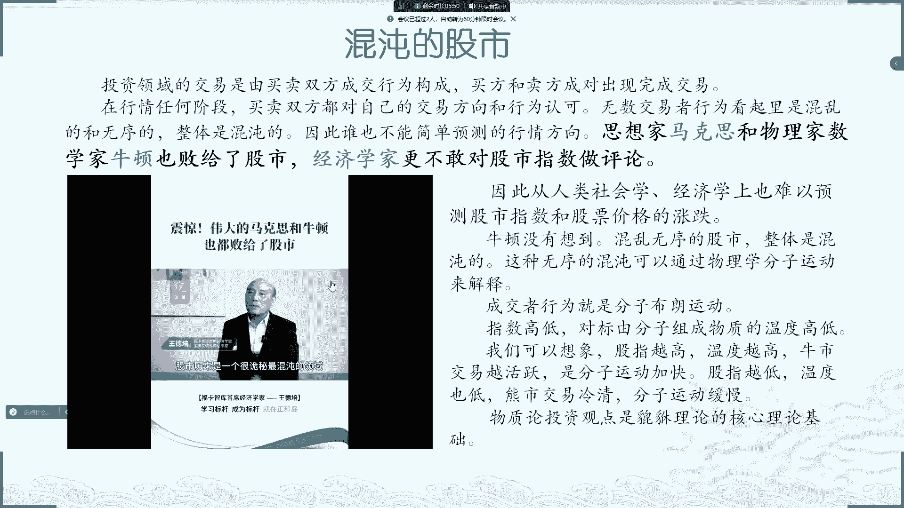

我们看一下这个这个经济，中国的经济学家怎么评论我们中国股市的。

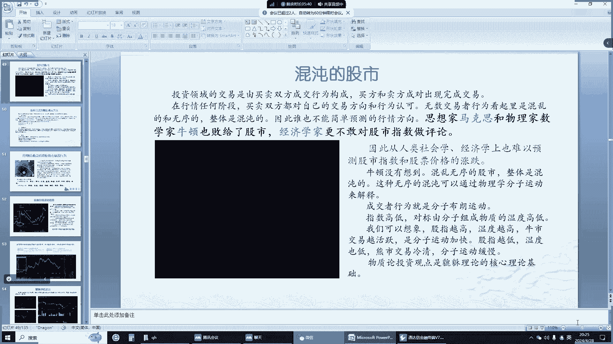

你们听一下，股市历来是一个很诡秘，最混沌的，不管你是科学家，理论家，牛顿就因为炒股失败了，最后他去搞天体，他说他算得清楚，天体算不清楚股市，马克思写了资本论，最后一炒股全部吃掉。

所以凯恩斯也是名头响得不得了，但在股票时，这是我们一个经济学家。

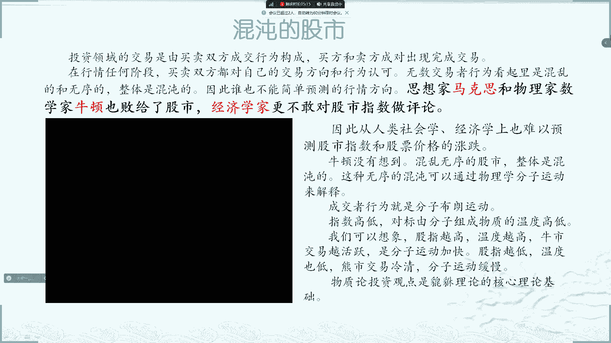

说他他给自己预测不了股市，再说这个别人也预测不了，对不对，那我们看一下那些流水就是交割单，你看的那些交割单是怎么做的，这是网上，淘宝上有卖的，叫做交割单，古神神器，我们看一下这个例子啊。

哎这个视频的我都，交割单，做个交割单神器，这全是假的，炒股养家，他自己在那做交割单呢。

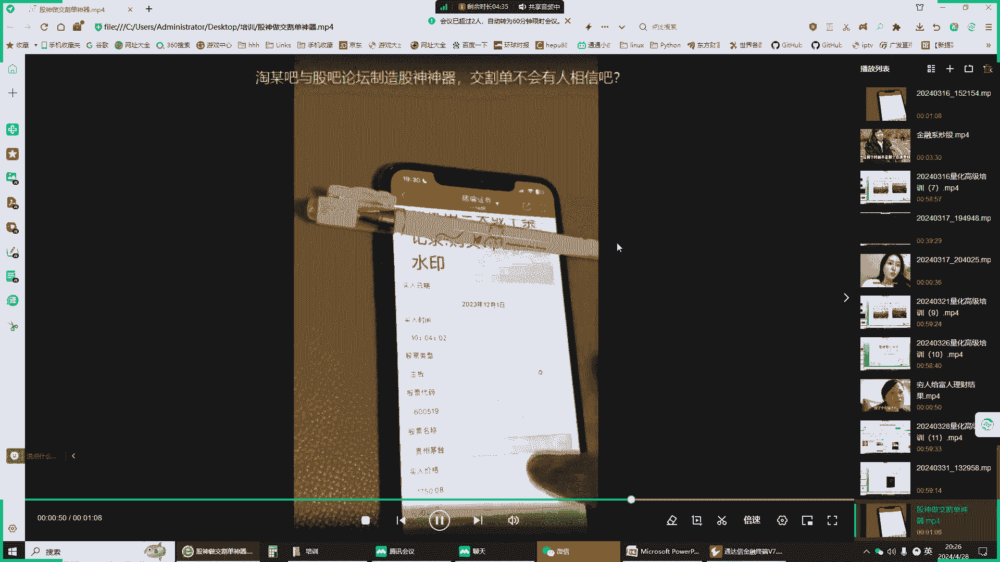

做的跟真的一样，再看一下我们的金融系和金融系的老师，是怎样炒股的，编剧懂得蛮多的，个人的一个哎呦，我觉得蛇这个有没有在上海，就在上海呀，一个重点大学是上海这种大型金融系的，他学他炒股亏钱。

他说他的老师教他金融的老师也跟你说吧，我大学最好玩的是教我们专业课，金融课的老师，他说的，他说他自己教的是金融课专业课，然后他自己他以前玩股票，他也从来没赚过一，都在都在做，你觉得这个钱好挣吗。

真正的学会PCO理论，才能让你看我给你送的这个指标，买进卖出，买进卖出，买进卖出，买进打板，这就是角度线，我送给你的角度线，这个白送给你的，这就是物理学知识，我们在这买进是不是挣了，在这卖出是不跑了。

对不对，你看买进买进，我就用这个来做期货的，说真的我就天天在做期货，我就做的玻璃，最近我现在玻璃一些PVC。

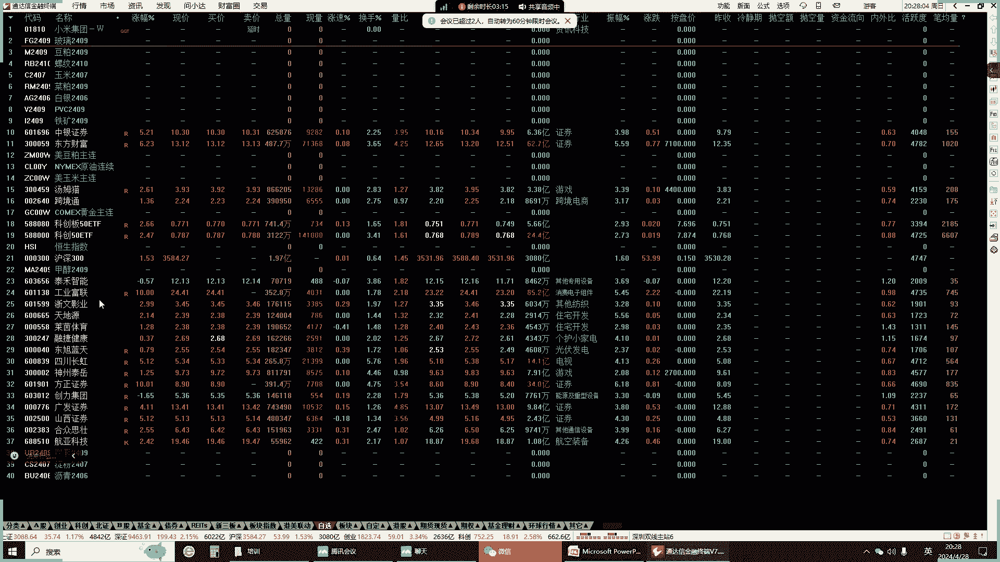

这我昨天做的玻璃和PVC就用这个，这是我的看图版面，我给你看一下，密密麻麻的关注综合炒股，对不对，我是用技术分析，主要是做PV这个一个是玉玉米，玉米怎么做了，你知道吧，主要是做PVC哪个挣钱。

前一段时间做甲醇对吧，我这还这个老想做白银，你看我们在这买进卖出，这也是对不对，我们都低买，这底下你看这个线，这就是P学角度线嘛，我把我操作的指标都送给你们了，这就是必修角度线，看必修角度。

这是一分钟线，这5分钟线，这是日线，我把这共振在那看呢，就用这看准，看一下子就买多，比如说这个就拿玻璃来讲对吧，我们在这买进做多到1800之上，在这做空，我们在这看这，我就做了很多次玻璃了，一直在做。

一直多多空，我全做，你看我们的交割单都是双向的，都都涨了，我就做多掉了就做空，对不对，但是你说百分之百挣钱，不是也亏钱，但是呢通过策略我们来调整平衡，比如说我买多，它掉了掉了就有两条路，要么止损。

要么追加，这个时候你要权衡了，这就凭经验了，你比如说我们假如说我们买玻璃的话，我们当然我这是做空了，我基本上已经空仓了，应该这个我估计是二，这个玻璃是白天的盘，是挣钱了，夜盘没跑，知道吗。

我昨天晚上我在那研究呢没跑，亏了200块钱，我本来从这挣了啊，我从这挣了200，我做了两手掉下来，亏了300对吧，因为我不停的加仓挣钱，掉下来亏了300，亏了300等于现在亏了100块钱。

因为昨天的夜晚，我礼拜一的早上，我就明天我就挣回来了，这个挣钱也不是100%的，我觉得就是说我也不是推荐你们玻璃，因为我多空全做，我在后面158级我就一直在做空，你知道吗。

我在这你看这是一分钟线底下一直做多，打到158级后一直做空，所以就靠这种挣钱的，如果一旦你错怎么办，要用方法了，我们后面给你叫各种各样的方法怎么样处理了，要不要止损，当然是止损损还是加仓。

这就是一个投资者的一个难点，你要学会批评理论，综合的来看，到底在这个位置要不要加仓，到的是止损呢，你比如说在这，我当然我直接做空了，我就不管了，因为你高开低走我就做空了，但是假如你们在这个地方做买进了。

挣钱跑不跑，比如在这买进下来跑不跑，这就是一个综合学问了，你这就是共振，你要看下面对不对，我们比如说我们在这地方已经被套住了。

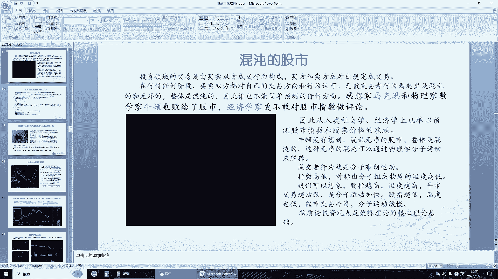