# 20240615Python量化框架设计 - P1 - 通通小白 - BV1oz421B7cx

没办法，那个讲课的有时候就漏掉了，我因为我们有些时候录了，有时候忘了。

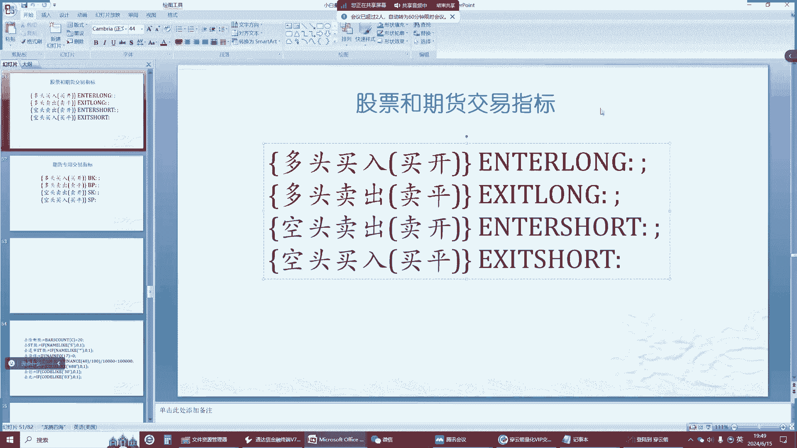

现在呢我们这个呢正在回测，你看大家买入卖出，买入卖出，我们不管它啊，我们现在再继续讲，因为我们的软件呢刚才讲了新的版本。

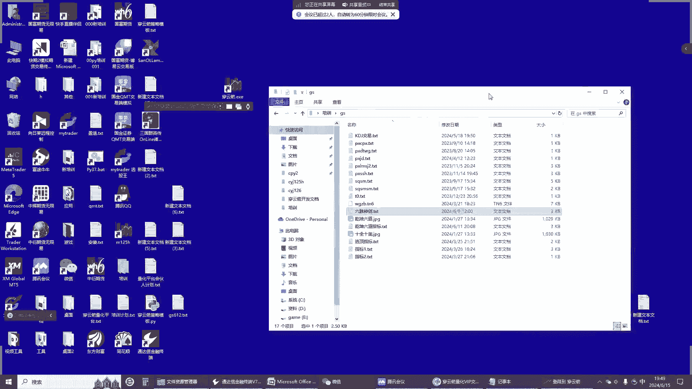

我们采用合伙神人制主，你现在做什么量化平台也没有意义，待会给你讲，为什么没有引起后面讲课你就知道了，以我们的软件本身可以改变logo名字。

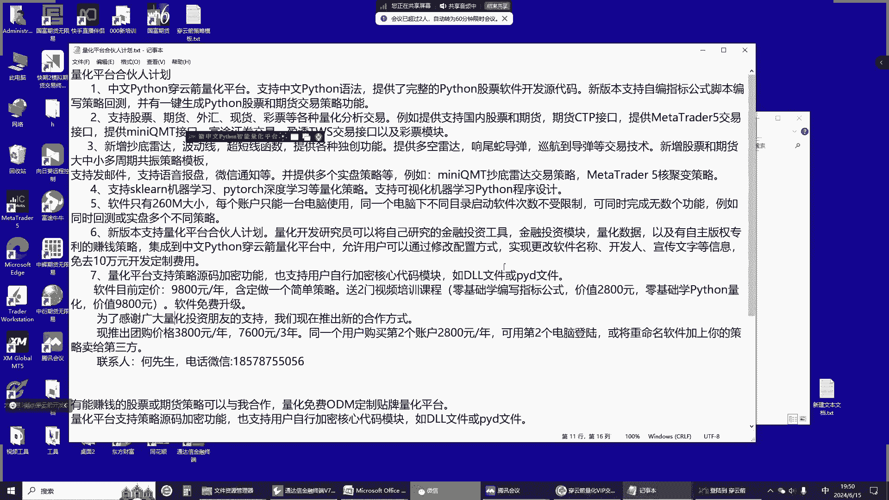

我们现在刚才这个平台呢，这个在跑的这个程序呢是第D盘的一个，你看D盘的穿云箭1。2在跑，我们C盘上还有一个穿云箭1。2，刚才我们讲了，我们的软件只要放在不同的目录，可以同时在运行，测回测都可以。

我们新的版本，我们修改穿云箭CYJ2。3F键，我们用写字板打开。

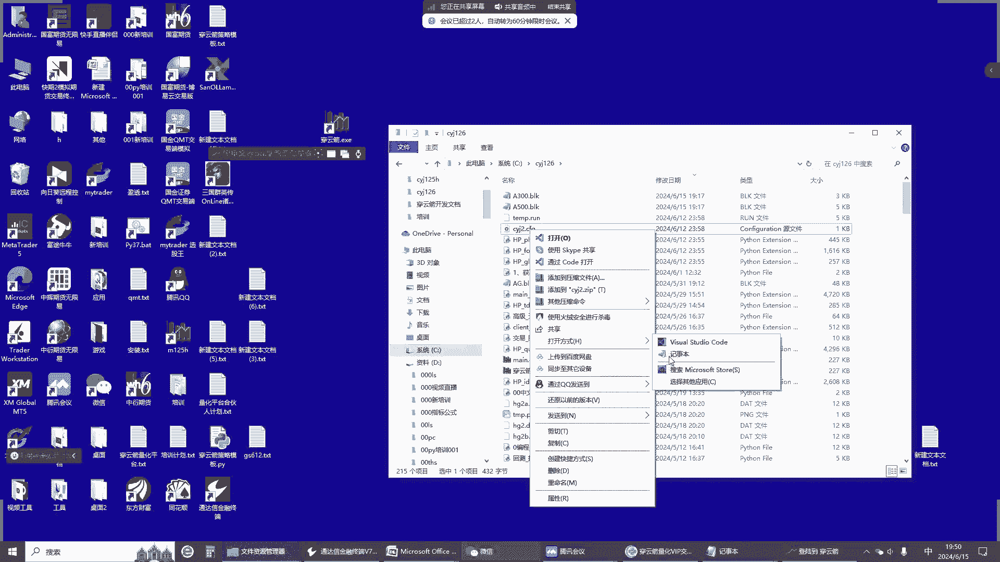

在这里面呢我们可以更改这个软件平台，我们叫中文Python量智能量化平台，我们不变，我们把我们的开发人这个logo现在改不了，改不了，因为以后我们改，因为这个logo也不是任何公司的图标。

就是网上一个免费的一个图标，所以你们将来以后再改，我们就叫股神吧，你就是股神，因为我们有自己的策略指标是很准很准的，这个呢就是分辨率，因为我们这个电脑可以支持穿云箭呢，可以用准计算机运行。

很多人买的七寸笔记本电脑运行穿云箭，但是拿它的平面分布，分辨率呢只有1280×720，所以呢我们可以设置软件的分辨率。

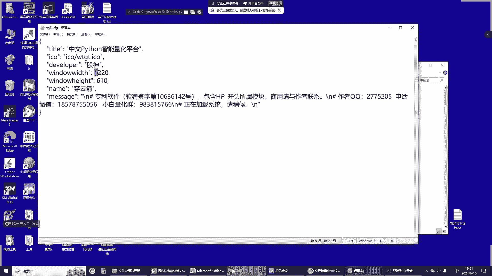

你一设置它就启动就这么大，你看现在它是全屏也。

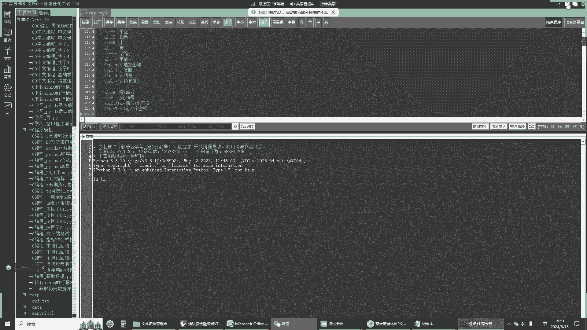

但是它如果要是启动的话，这个刚好适合小屏笔记本大小，你可以学习，我们先不管它大小，不管穿云箭，我们改成因为我们有摇钱树指标嘛，自编指标嘛，我们就改成摇摇钱树，哎这个软件变了，你不想这个东西，软件专利。

你说他咋是你的，那你改呀，对不对，这个斜杠N呢是回车的意思，你的QQ1234，比如说2775205，当然这是我的QQ手机，你可以联系人，你自己可以随便改，因为这个东西没我的信息了，对不对，手机微信。

对吧，哎要改成你自己手机号码对吧，这都变了，联系人，股神你这个股神开发的斜杠N回车好了，整个这个软件呢保存一下。

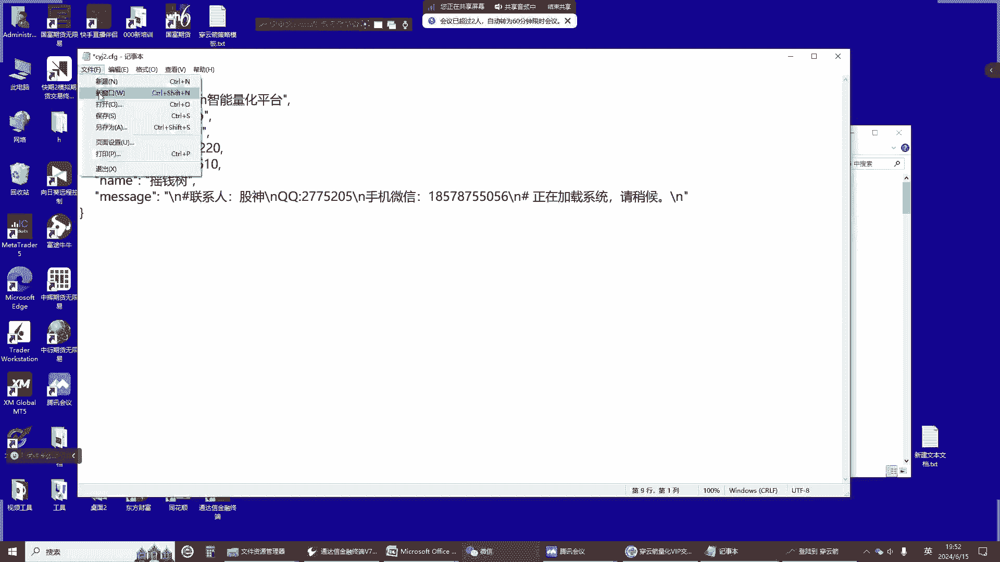

这个软件就是你的名字了，我们再使用一下创新键，这个时候我们在当然我们同一个账户，在一台电脑不限次数登录，你是登录1万次，同时运行1万个策略无所谓，只要你计算机能跑得起来，这个怎么办呢。

我们想用我们的摇钱树指标实盘一下。

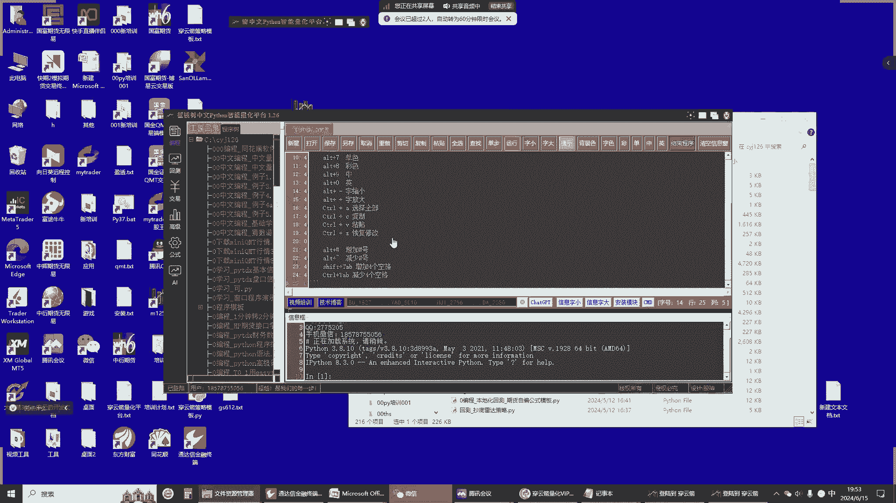

对不对，我们不管它是不是我们变成了谣传树，摇钱树原来叫穿云箭，我们看一下穿云箭现在是不是改成摇钱树了，开发人在哪设计是股神，我们鼠标称为股神，原来设计是小白，因为这些穿云箭待会给给大家讲，我们量化平台。

包括他设计原理怎么设计的理论我都给讲的，讲的时候你就明白这个开发人是不是刚才变了，原来是他的软件专注啊，什么专利啊，什么软注登记啊，联系人，你看是不是换成你自己的了，当然这多了个空格。

是因为我们那个记事本里多了个多了个回车嘛。

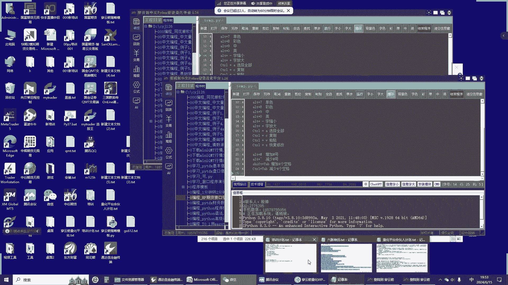

你把那个回车删掉，这是这里面他就没那个回车了。

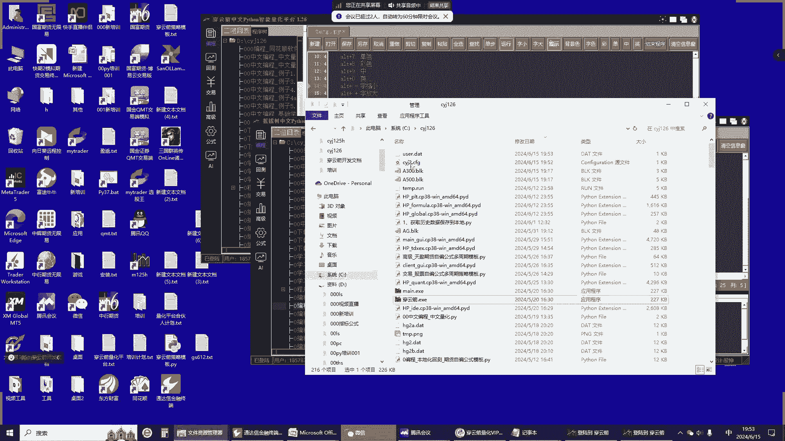

这样的话这不有个联系人回车，这个你删掉斜杠，N就是Python的字符串的换行的意思。

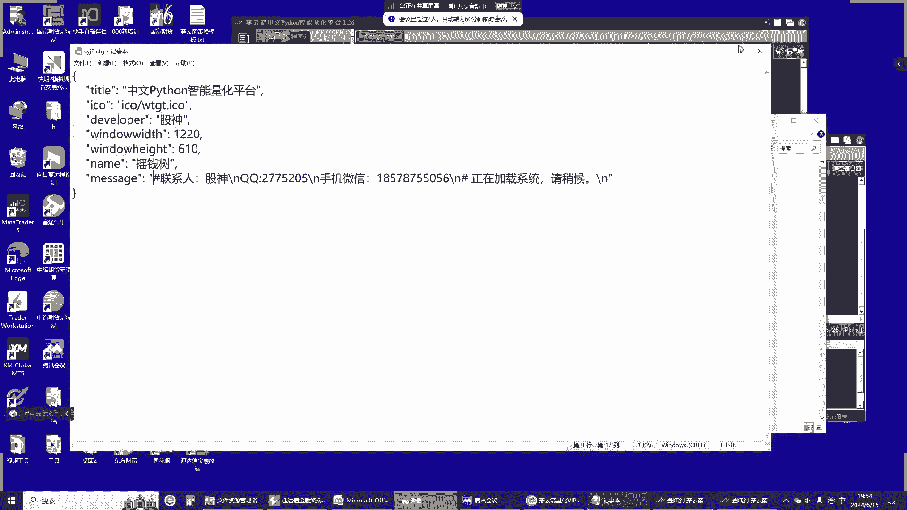

所以多了个空换换行是不是传给你的东西，你的策略，你说我的策略，我不想让人家看到源码这地方有加密，你可以把你的策略进行加密，比如说我们刚才还是我们的这个指标，我们把它作为实盘指标，我们CTRLC对吧。

CTRLACTRLC复制到传音键里面，把它关掉，复制到我们这个这个这个这在回测，我们换到这另外一个，反正不管他，我们这个要实盘那个回测，这个是里面我们保存为什么指标呢，这我搞保存为C盘。

这个时候要选对目录，因为它有时候默认你最后一次使用的，我们选择对目录叫做六脉神剑，哎这是我们的内六脉神剑公式，我们刚才测过一定没问题。

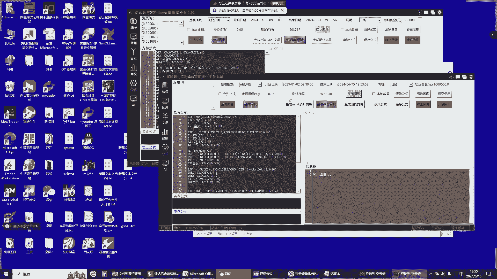

因为它不影响在不同的目录下，它不不存在影响的，他六脉神剑的买卖信号。

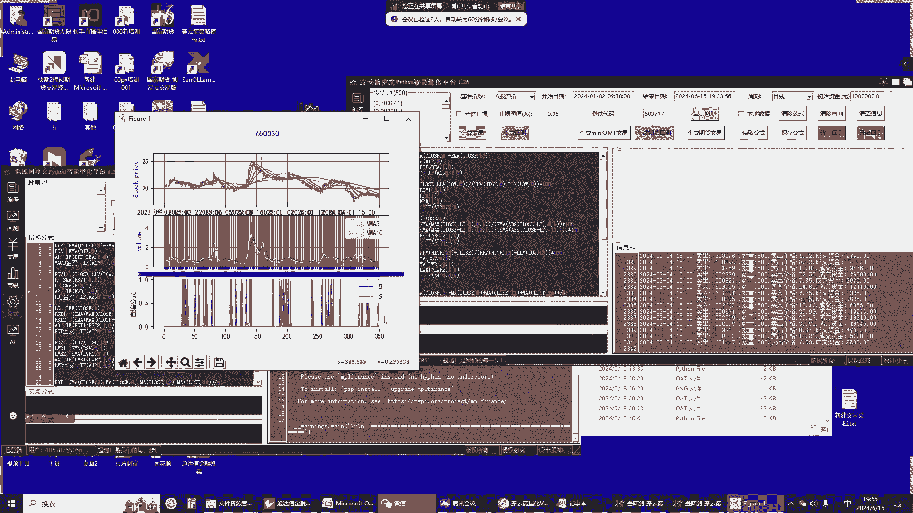

最后一次刚好出现了个买点，哎，六这个出现了个买点。

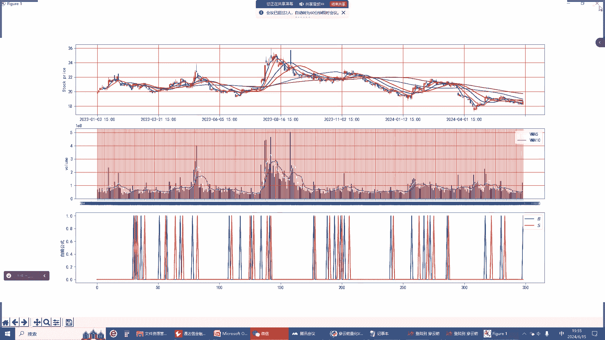

我们看一下600030最后一个交易日。

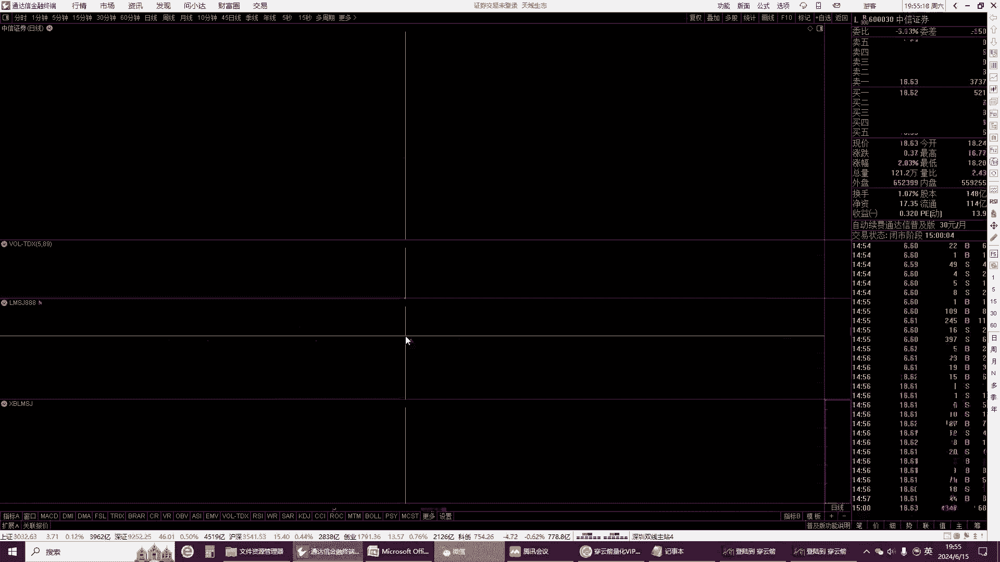

是不是出现了买点一模一样的，你要相信我们的指标，就是你通达信商办的结果，我们指标运行百分之百是这个结果，不会有任何差异的，所以你就要相信这个这个东西，所以它正在回测，但是我们想实盘怎么办。

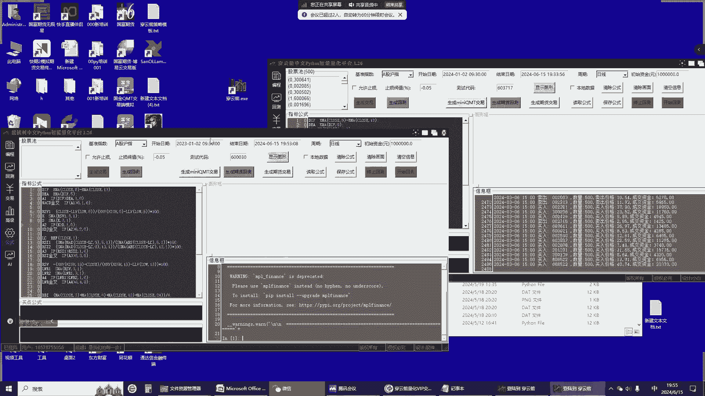

哎我们可以用生成这上生成交易，哎，我们直接生成六脉神剑交易指标，我们生长到C盘啊，因为我们要在C盘上运行，不能升盘的，因为他们目录是冲突的，它目录文件是独占的，所以我们要在C盘上运行。

叫做六脉神剑公式交易，哎我就写写吧，不想再写拼音了，就连六脉神剑交易，我们也可以生成mini k mt，你需要写策略吗，不需要六脉神剑自变公式，直接就帮你生成策略了，会编写指标，会教就会写策略。

你需要学习吗，只需要写策略就行，所以我们已经生成好了，我们现在用这个呢进行交易，我们还选这个股票池，我们选一个300的值的股票池，跑一下，读取我们的六脉神剑交易公式，这个指标公式呢。

实际上就是我们你看这个开发的这个圆，他是脚本的，这个就是策略的写法，跟距宽和PTOR是一样的，你看你只要做这三个函数，两个函数一个叫初始化，一个叫做盘中函数，我们的六脉神剑指标在哪，就在这个策略题里。

你看哎，另外设你可以改成你自己的摇钱树指标，你只要你的指标准，我不经常，很多人在我的群里贴各种个很很神的指标吗，当然你这个信号呢，你也可以换成通达信的信那个模式，就是这个格式也可以是可以交易的。

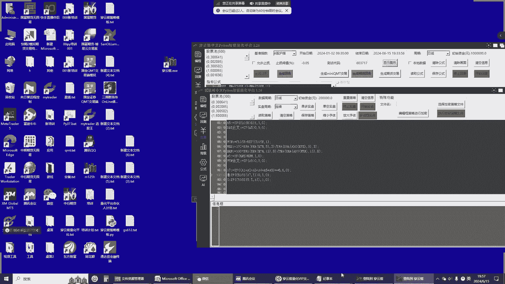

我们刚才讲了指标公式，你可以用这个来代替它，也可以实行买卖，这个无所谓的，我们这都通用的，你可以拿着代替买卖，还是不是，这是不是就专家系统公式，对不对，我们把它复制到这个指标。

可以复制就变成专家的系统公式，我们现在呢假如说我们没有开通mini k m t，我们可以用同花顺来模拟交易一下。

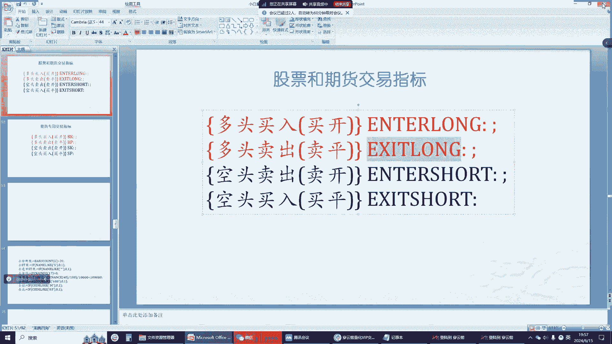

看看到底能不能挣钱。

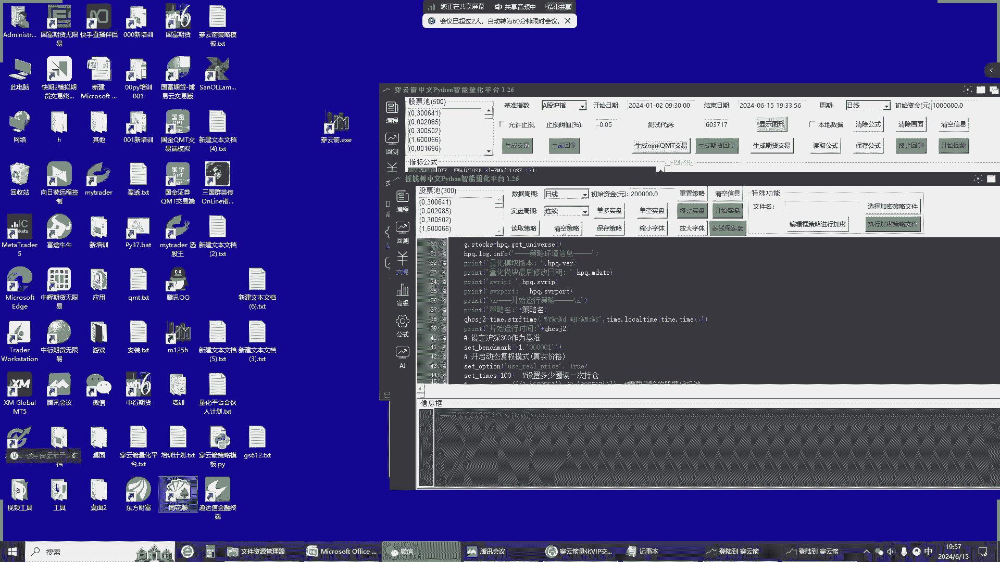

当然了，我们现在是用的模拟账户，你说我想实盘，那你同花顺也可以实盘的，我们用模拟炒股啊。

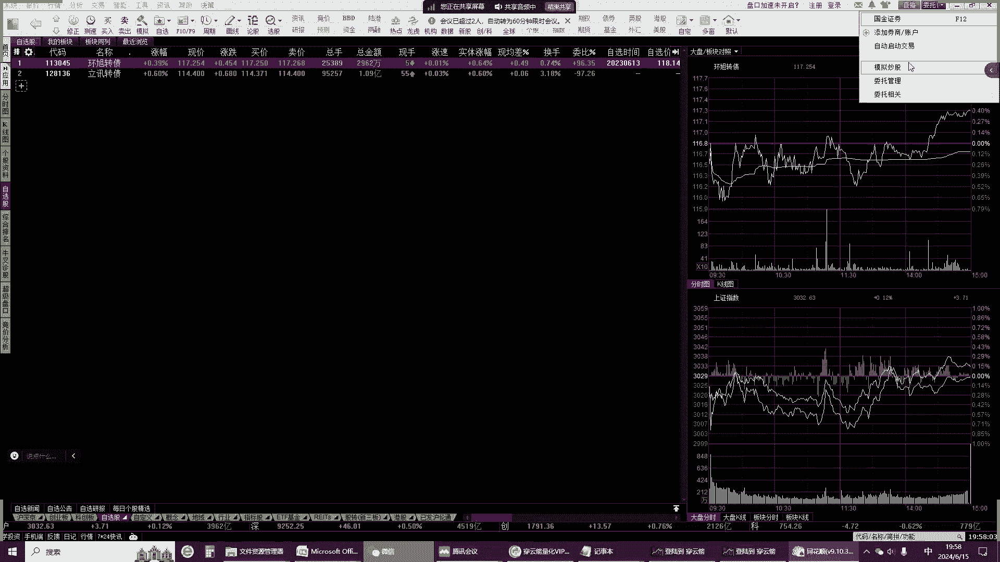

这个模拟炒股可能没钱了，果真没钱了没钱了，那也有些朋友说我的账户已经没钱了，这笔钱测试的一个拿客户的一个测试测试的。

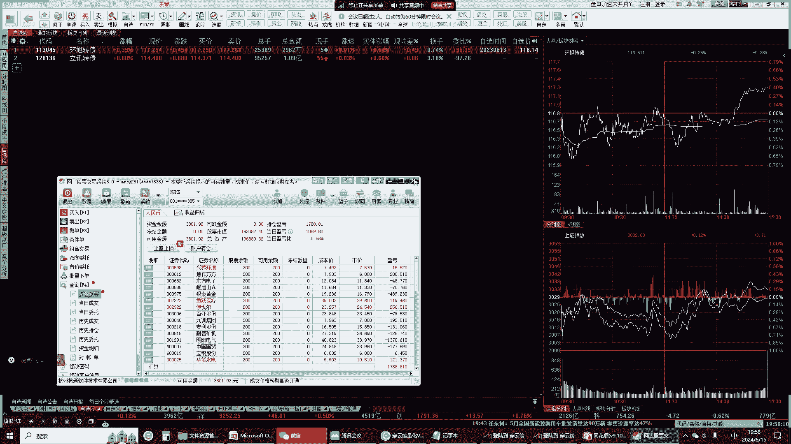

那怎么办呢，没钱了，很简单，重新装一下嘛。

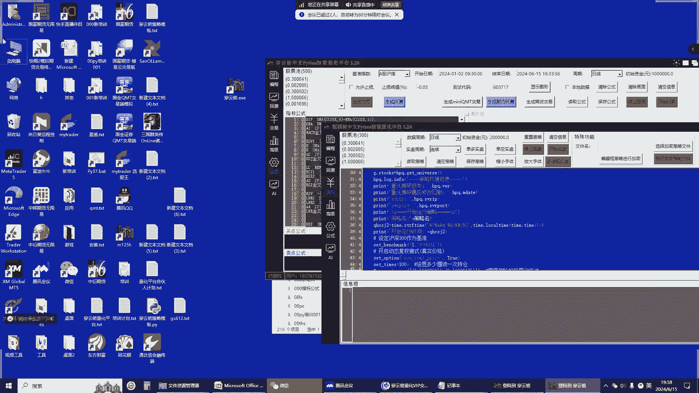

把同花式删除掉，首先卸载，卸载掉同花顺，这是第一步，直接写个忍痛卸载，其他原因，残忍卸载，比如AA吧，因为我们为什么卸载载了模拟账户，没钱了，买不了了，这个第一步，第二步呢，因为你设置删除掉了。

你的账户信息，还在同花顺里面，你再重装还是没钱，因为还是以前的账户，所以我们要找到同花顺的目录，把他的整个目录删除掉，哎我们把这个目录删除，因为这里面记录你原来旧的账户信息，就是你重装都没用。

下来呢我们装川建的一个同花顺的一个标准版，因为你券商下载的有可能用不了，我们用个新的一个同花顺，然后快速安装什么也不管，重新装一遍，又给你了多少，20万，现在我们不管。

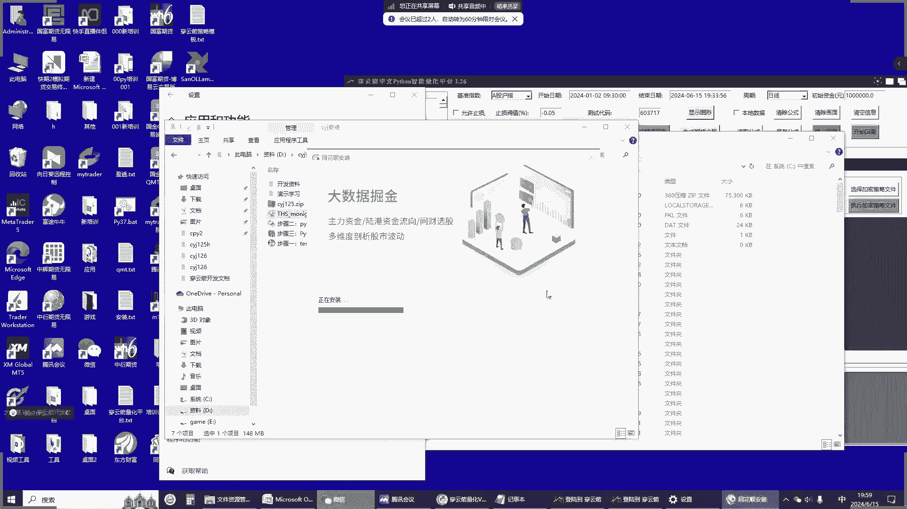

刚才我们给大家介绍了所有的股票软件的指标，公式都是这样的，现在就给大家讲量化平台，我们把这个关掉，量化平台呢它分为好多，按平台的划分来讲，分为web轻量，web型的一个量化平台。

服务器量化平台和本地化量化平台，比如说我们的用的巨宽呀一些的平台呢，它是web型的量化平台，你的策略呢在量化平台的服务器上跑，它是用web来写的，你的策略保存在服务器上，你面临的一个问题有两个问题。

几个问题，第一个你的策略在人家量化平台容易失去，第二个你是1万个人，同时使用一个服务器在运行回测或者实盘，你的速度肯定没有本地速度快，这就是第三个，你想使用你的JPG，比如说4080啊对吧。

显卡的深度学习量化跑回测它也实现不了，因为它服务器上没有GPGGPU卡对吧，你支持不了，所以他有很多缺陷，服务器呢也面临这个问题，因为你的策略在服务器上也是很多人共享一个。

所以他呢面临着大家都是策略密算法，人家能知道，第二个你的速度慢，你大概你一个券商，你有100万个人，一大概有10万个客户用了同一个服务在跑策略，你说你速度能快得了吗，对不对，肯定快不了。

你一个速度分了100个人，1万个人在那跑，你那个量化速度能快吗，你肯定快不了，所以第三个是本地化的客户端，穿云箭呢属于本地化客户端，因为呢我们的服务器只记录了你的账户和密码，对用户什么都不知道。

你是怎么样运行的，你的策略呀什么都不清楚，待会给大家再介绍约这个这个创建量化平台，包括呢很多的量化平台，现在量化平台都偏向于本地化，比如说P吹的啊，KMT啊，它是券商给你提供的一个量化平台。

它是本地化的，所以呢你的但是呢他有个问题，尽管是P吹的KMD，它在本地，你的好处呢，能够利用本地的电脑速度和网络速度资源，不是跟人家几10万，几十个客用户去共享抢服务器的资源，你的速度快了。

但是你的缺陷服务器，你的策略，还是本质上保存在人家量化公司的服务器上，所以你很多人知道，你比如说你在家里写了个策略，你到单位一登录，你的策略马上就能读回来，那是肯定在服务器上保存着呢。

因为我们的量化平台只有几多少兆，只有很小的，你看我们的量化平台才260兆，你一个电脑，一个手机12G16G内存，1G可以保存四次穿云箭，你想想你光手机的内存能保存多少，还不算你的512G的卡。

512G乘以四，你能保存这么多个几百个穿云箭量化平台，所以我们量化平台非常小，你可以反复复制，不要害怕耽误空间，你要知道能用钱解决的一切问题不是问题，你觉得速度慢，你就买个快的机子，硬盘小换大硬盘。

那你想想这能用钱解决的问题，这不是问题，现在内存计算机那么便宜，硬盘那么便宜，不在乎你运行多少次，我们装完了，我们把这个勾去掉，不要开机启动，我们不需要它开机启动。

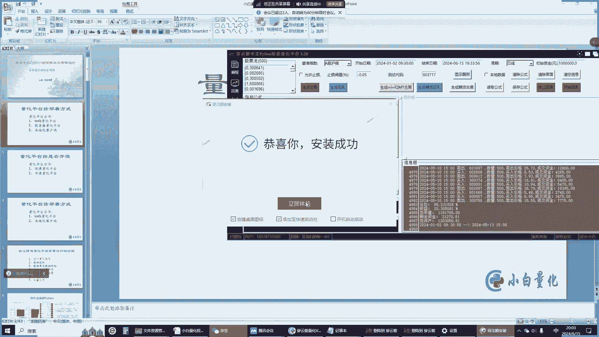

我们立刻启启动启启用它。

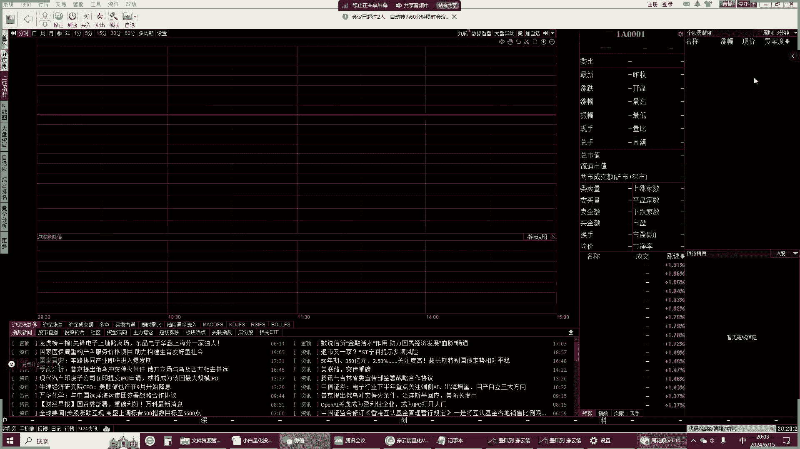

我们再申请一下模拟账户，这时候呢模拟炒股，他这答案我们这些都可以试盘哦，你敢登录穿云箭量化就能让你实盘，所以我们建议大家不要拿到软件，把自己指标一键生成，直接实盘，那傻了，如果万一的策略指标你看得很准。

现在给你20万，但是呢到底挣不挣钱，因为你没有经过实盘的检验，你先用模拟盘去操作，我们待会看一下川建模拟盘怎么交易的，这个时候安装完要退出一次，因为他要刚才再配置，重新再配置一次，那他还在升级。

真是本来都不应该升级，升级可能都读不了，他给了20万资金，我们最小化，这个正在回测，你看一定收益了24%，哎呦这个六脉神剑还挺厉害的。

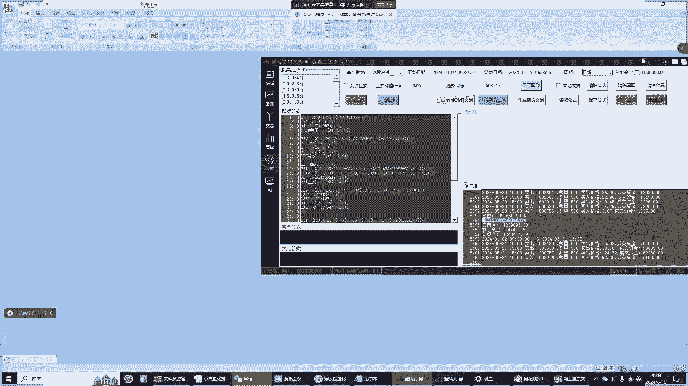

你挣了这么多，那你们炒股报从今年炒到现在怎么样，我们看看他模拟怎么操作了，这刚才我们讲了，我们装了300只股票，我们不用500只股票了，我们让他直接点一个开始实盘，对不对，他是用模拟账号。

你刚才给大家讲了，你如果登录实盘账户，他就实盘下单，所以这个东西很厉害的，哎一定开始买入，看到了没，哈买的很很不亦乐乎，那不赶紧终止吧，好我们不管他了，但是我们有时候觉得他影响速度。

你们很多人说你这个不停的确认回车或者回车，我们看委托是不是啊，我们看一下这个软件是不是出现了买点呢。

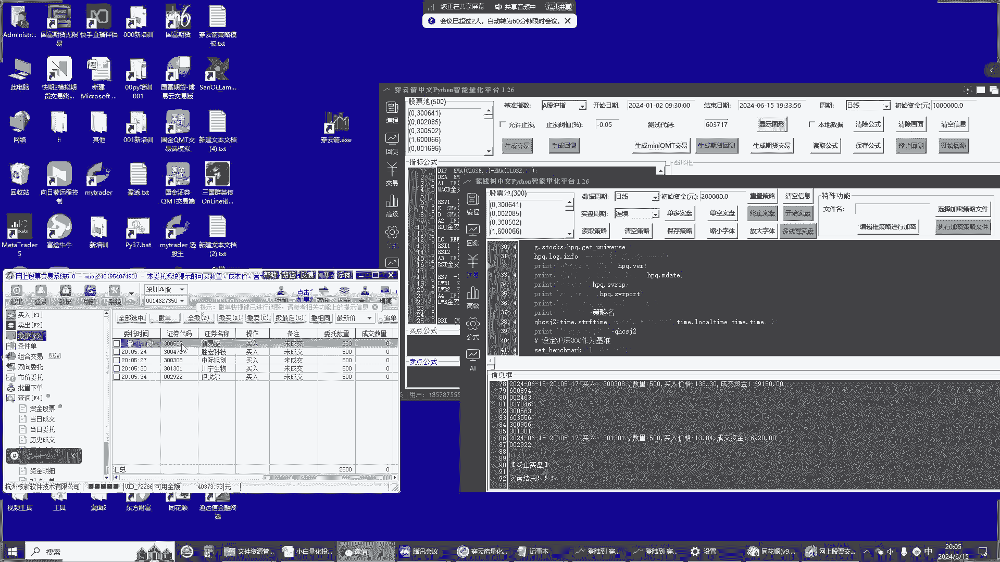

我们双击一下这个股票名字，双击名字它就会出现这个股票，这个股票是不是出现了六脉神剑的买点，我们刚才讲的什么指标公式是通用的嘛，我们把我们的水槽，我们把策略里面的指标复制出来，看看同达同花顺能不能跑。

对不对啊，这是我们策略里面的六脉神剑指标公式，它是一个专家系统，我们CTRLC，我们在这里面CTRLV，我们用新建哎，我们在通达信做的指标移植到同花顺上来了，选个知识指标，这个时候是选到啥，通达信模式。

因为同同花顺他没有完全它自有自己的格式，我刚给你讲了，在大家使用通达信的统一格式之前，是同花顺有同花顺的指标公式，大智慧有大智慧的指标公式。

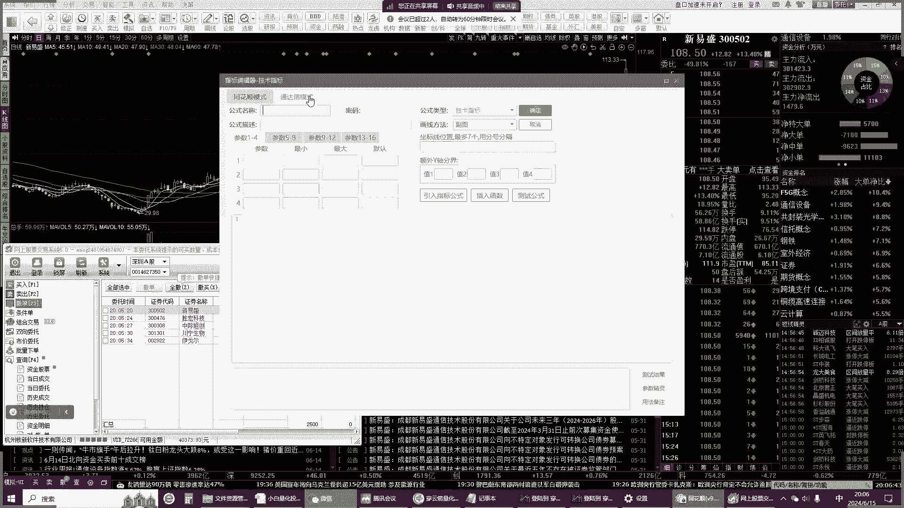

指南针有指标的指标公，但是每个指标公式都写法都不同，语法都不同，哪一个这个所以我现在呢这个叫做六脉神剑，我们啊这个应该是中文写到下面啊，测试一下一下，通过OK从我们的突然间两边策略里边写的指标。

我们看一下六脉神剑是不是这个出现了买点，立马买进，我们看一下第二个股票，是不是出现了白色的信号，我们白色是什么信号呢，是买进吗，蓝色的黄绿黄色的是卖出嘛，对不对，你的你有股神指标。

是不是一下就可以全自动交易啊，很多人承担在群我的群里，微信上贴自己的指标，那你来实盘一下，试一下，是不是完美的，把六脉神剑的指标公式移植到同花顺畅，当然你复制到东方财富也可以运行。

为什么我刚才讲了他们的函数是一样的，语法是一样的，唯一不同它们啥绘图语句不同，这个讲明白了没好，我们的实盘没问题，我们当然要，假如说我们要用mini k m t也可以直接一键生成，你需要写吗，不需要写。

拿来就能实盘，又能回测。

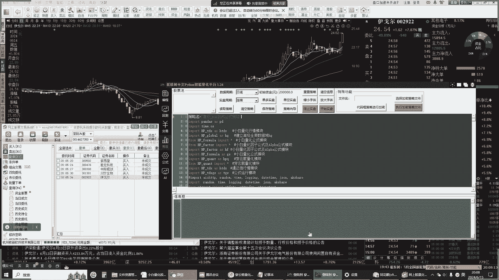

刚才我们一键生成还在回测，你看见没，因为回撤了，现在马上就结束了，已经回撤到6月多了，盈利了15%回利润会回吐对吧，刚才还最高盈利24%，我们看他回回测的结果是多少，还有啊，已经快结束了。

因为今天14号是最后一天，哎这就是我们的回测结果，我们把它最大化，大家看一下，六脉神剑用这个股票池回测的利润为多少，12%点多，他的各种因子，阿尔法因子，贝塔因子，各种各样的因子，我们双击一下。

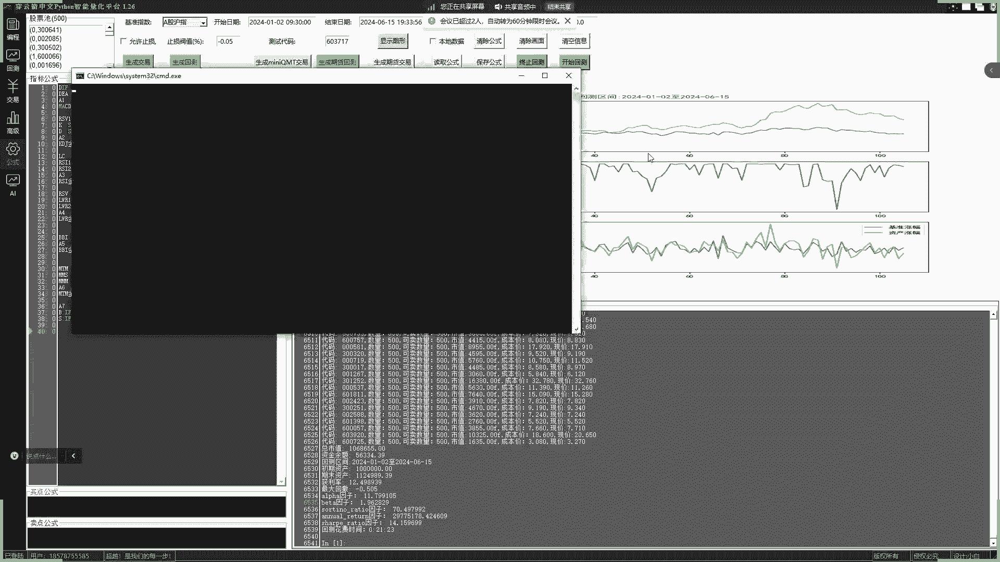

它会独立的把这个屏幕放大，我们看到的这个界面呢，D最下面的是基准，上海的股指的波动和我们的盈利的波折，波动是什么样子，比如说它涨一点，我们盈利很多，说明我们跑赢了这个当天跑赢了这个市场。

中间这个是仓位表现，如果我们的策略持续仓位达不到50%，说明你的策略没用，你拿了5%的股票，你打了100个涨停，对那总市值有什么影响，没影响，对不对，所以我们要使策略达到板打板的问题。

他不是打满100%，你看我都盯上打封顶了，已经没钱可买了，买到极限了，对不对，你看在上涨的时候全是底线，你稍微回撤不是止盈就是止损吗，他六脉神剑发出了卖出踹七里哗啦全卖了，对不对，买的晚了没挣钱。

买的早了，都获利了，结了嘛，这就是一个最上面的，就是他的比较，蓝色线呢就是沪深额沪沪指的表现，上海股市的股指的表现。

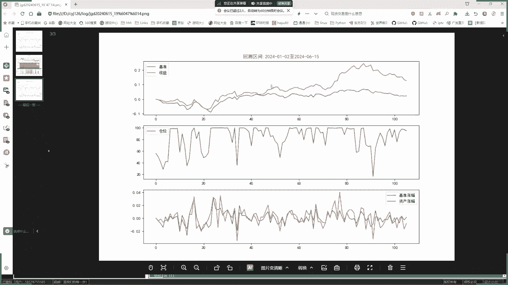

上面的黄线是我们的收益图，这我们一目了然，对你这个策略评价简单不简单。

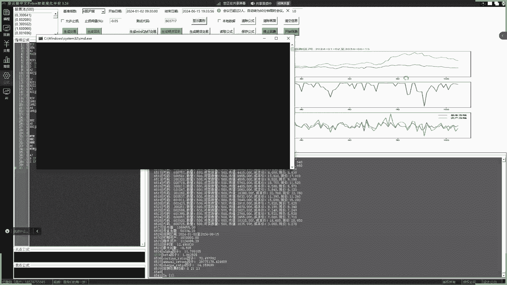

穿云箭的介绍就完了，它本身本质上是什么呢，穿云箭本质上就是一个Python中文IDE，加小白量化金融模块。

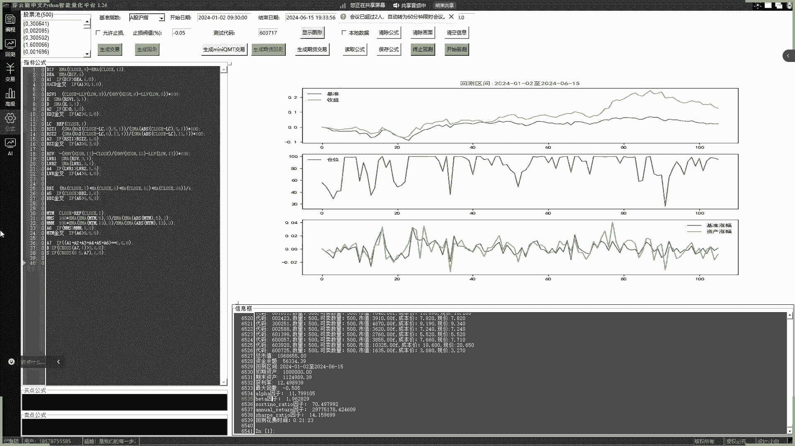

我们现在这本质上讲完了，现在再给大家讲一下那个讲这个刚才讲了。

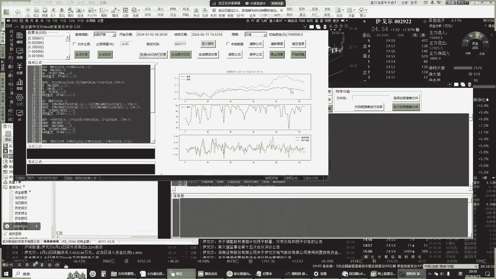

我们生成了mini k m t，如果用mini k m t怎么交易呢。

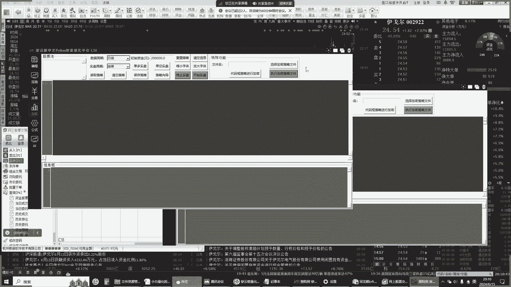

看这个回测完了，他不影响回测，是回测，因为这一定要不要在一个同样目录。

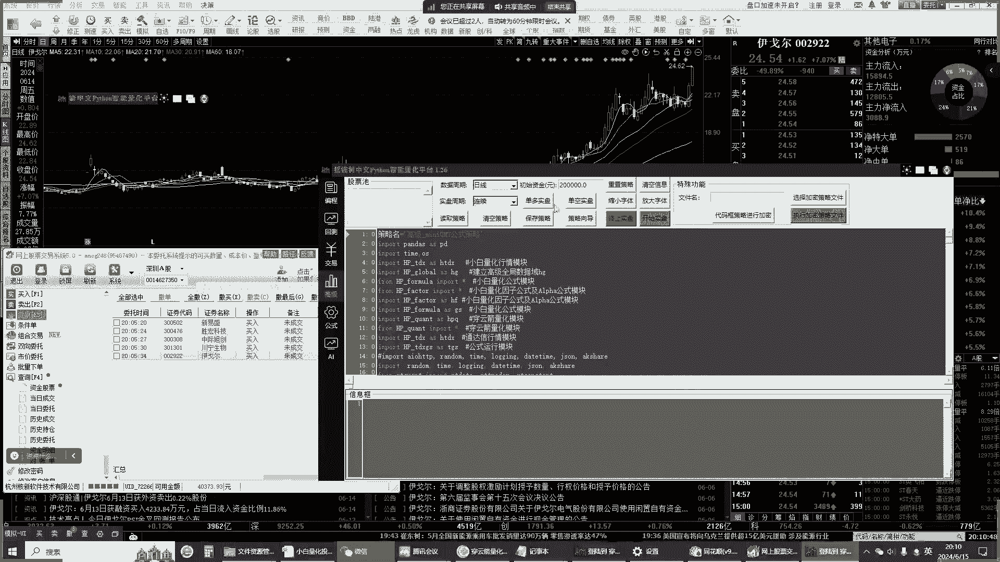

我们把他这个打开放大，我们可以启动很多次，当然我们启动这个软件是不受限制的，你可以无限启动，但是呢不一定能够无限运行，我们把这个可以关掉了啊，这个啊这个不关保留到这还可以，我们可以把放大字体。

你眼睛不好，你拿的笔记本你可以放大，我们需要改什么，把这个路径改成我们的迷你k mt的一个账，户的一个路径，另外把你的账户填到这里面，只改这两个什么也不动就可以全自动交易，每个人有不同的。

我们当实盘模拟都可以抛。

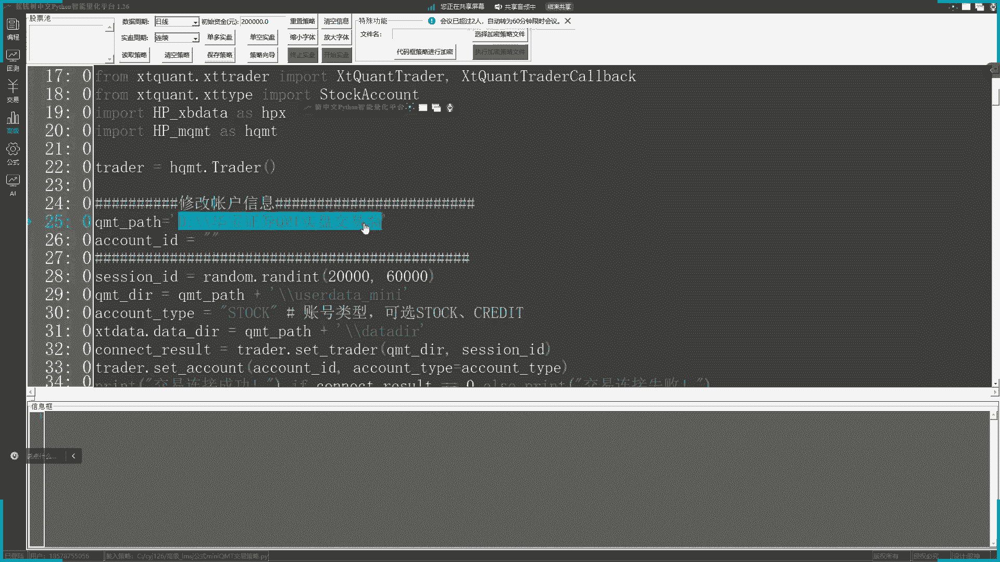

你只要修改完，修改完这个账号密km得直连就跑，所以呢在我们这个机子上，我们刚才讲了，我们在两个不同的目录下启动了两个穿云箭，他们的账户号是相同的，同一个账户可以在两个电脑上反复登录。

哪怕登录100次都可以，但是呢登录是登录，不能实盘的话，交易必须在不同的目录下，这两个文件都是主程序，你可以不停的登陆，只要你的船舰能跑下，你可以你看这个也可以，这两个文件是一样的。

看到都是一个一样的文件，你可以登录很多的。

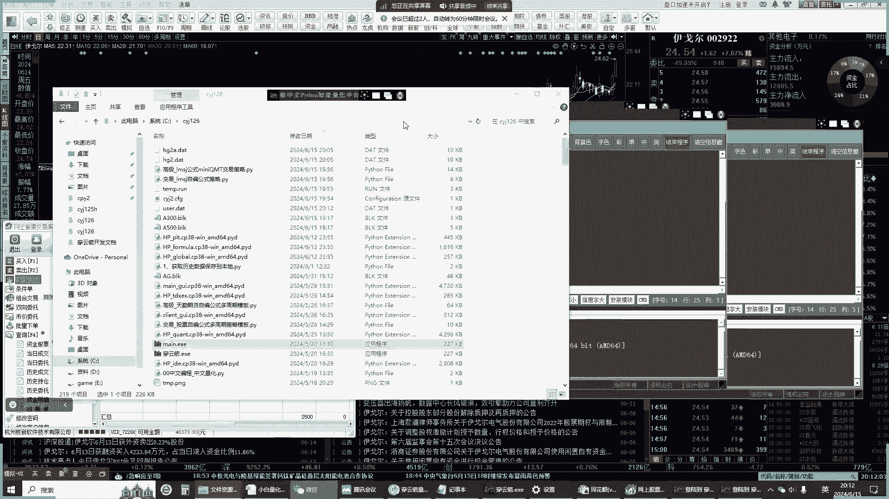

你编写程序写代码非常方便，你这个写这个这个写这个两个互相复制粘贴，对不对，很方便，但是你运行策略涉及到回测自动交易，你只能一个目录下跑一个策略。

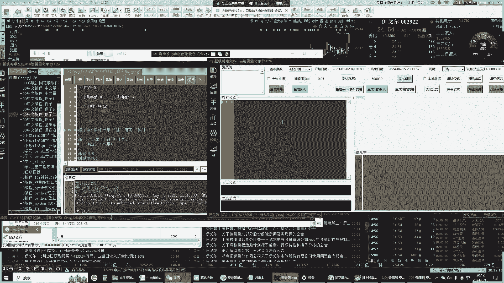

编程无所谓，包括你在本地下回测，也只能使用一个，比如说我你在这地方回测这地方，因为我们这个编程模拟模式下，可以运行所有的开源量化平台，它在回测的时候也会产生独占，所以大家不要在回测的时候。

在同一个目录下回测，因为他文件是冲突的，创建量化平台已经讲的差不多了，然后给大家介绍，继续介绍量化平台怎么设计的，刚才我们讲了，我们学习量化，我们要学习量化的话，答案自动交易，我们把它全撤了啊。

因为这个上回没全撤，所以买了一堆股票，所以一直放了好多天，所以亏钱了，我们把这个退出，我们看一下，现在给大家再接着讲我们的课的内容，因为时间的关系呢，我们刚才指标已经给大家过了。

如果大家不知道能不能看到，刚才已经发给大家六脉神剑，如果没有看到的话，到时候加我的微信，我再私下发给大家，我们这个平台只要你有指标，就可以会编一些指标公式，就可能只能直接做。

每次听课我们都会送指标公式的，刚另外十件已经发给大家了，没有的话，你到时加我微信，18578755056周，我的电话号码，刚才我们讲了，创建是本地化量化平台，另外呢做量化平台的话呢，它还分为闭源和开源。

我们的川建是闭源，比如QMT呀，mini q m t啊，它属于必然的一个量化平台，对于呢VNPY啊，或者是back tree啊，它属于开源量化平台，开源的所有的开源量化平台，在创新建上都能使用。

你这个待会我们再讲，自己要搭建量化平台呢，你要设计量化框架，获取数据，数据库和数据结构分析及计算模块。

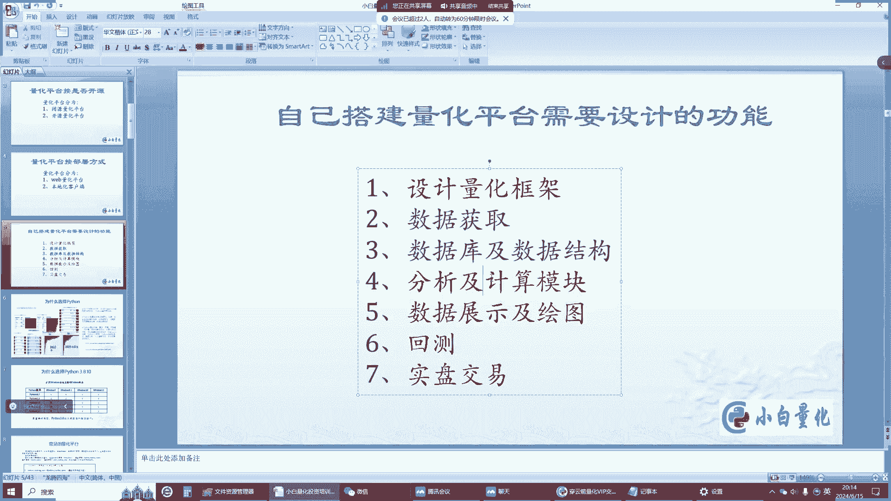

数据展示和绘图回测和交易，当然我们穿云箭一定具有了。

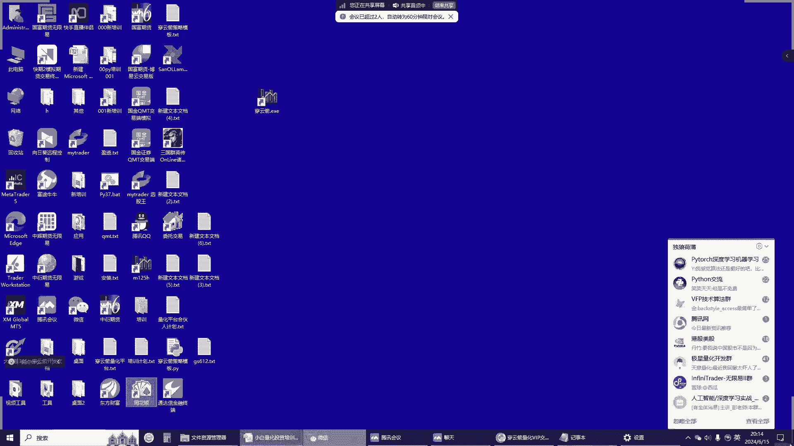

所有统统的这些模块，你们可以看一下，而且是中文版的，比如说我们用中文量化，对不对，它整个是中文的Python，它是全中文的，我们运行程序它就会能显示一个KDJ指标。

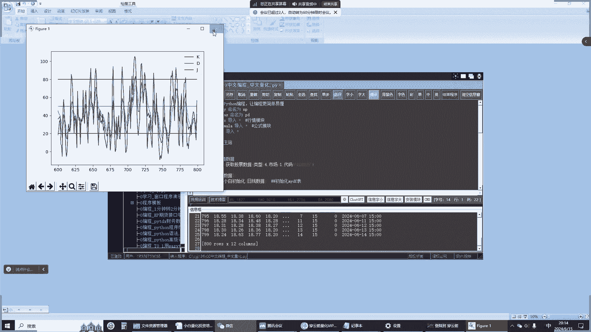

我们看一下它源代码，应该大家能够看到它整个是中文来描述的，这就是说你没有学习负担，你不一定说非得做中文啊，你把所有的计算机指令，你不要理解它的中文英文意思，你把它当做一个符号对吧，当做ABCD符号。

你还非得给它理解它的意思吗，对不对，全部是中文化，如果你要说指标公式呢，当然我们这上也有指标公式，比如说我们读一个指标公式的一个策略额，编写的一个中文量化，这是中文量化，我们看一下指标公式。

你要说有人说，我想看一下指标公式是怎么显示的，这里面有很多例子，你看比如说我们的指标公式哎，这就是指标公式源码，其实我们策略是这样写的，这是指标公式的源码，对不对，第一个是KDJ，第二个是MACD。

第三个是一个什么猎户先觉嘛，什么指标我也不知道对不对，我们这个可能指标不一定能显示哦，因为他绘图语句不一定百分百支持，然后呢你看是不是Python的语句啊，他是运行指标公式，实际上这个东西。

我们策略里运行了这个这段代码，所以他就能计算上面的指标公式，然后我们运行一下。

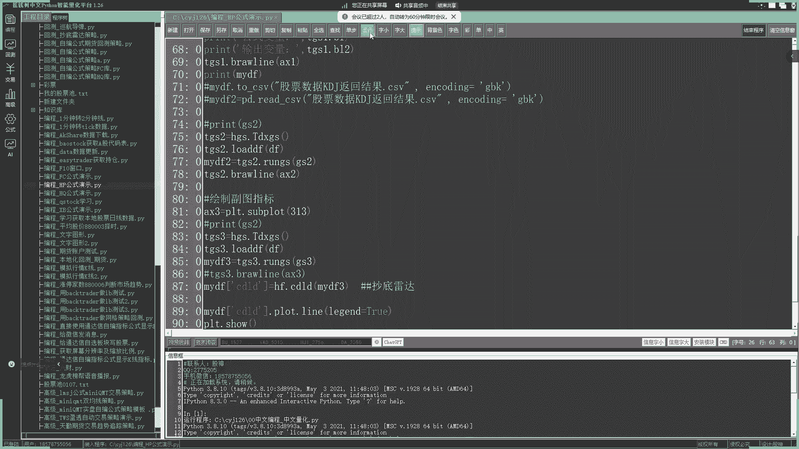

下面是另外一个指标，他没显示中间那个。

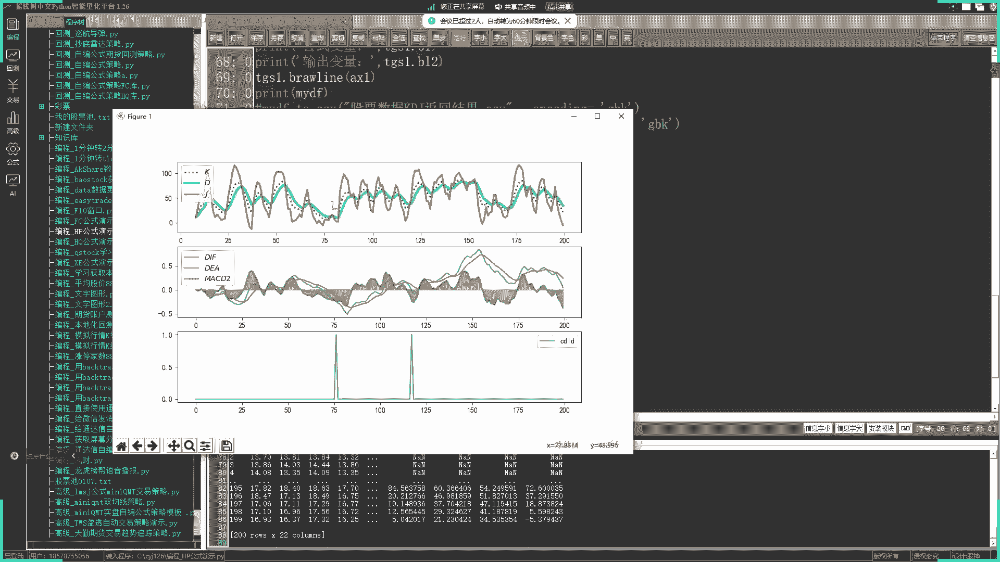

这是不就是开地结MACD。

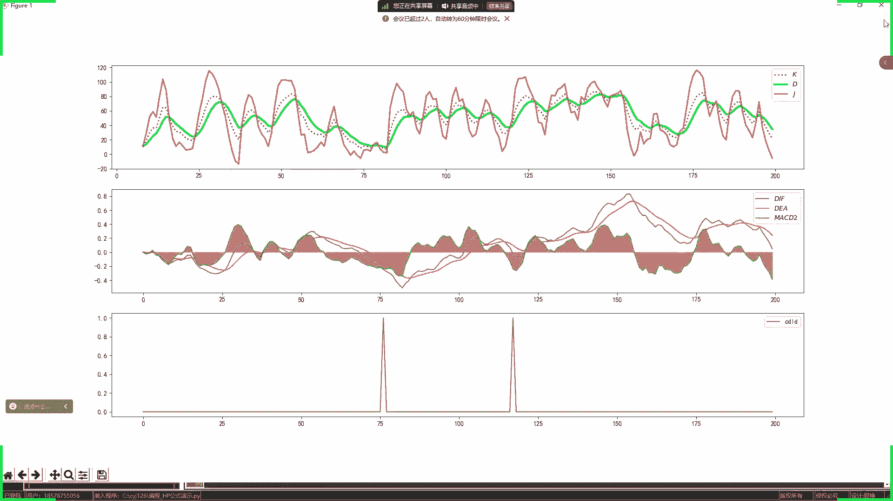

是不是很简单，它指标公式源码都在里面，这里面学习演示非常方便，当然我们还可以做可视化，你说Python能不能开发别的东西啊，所有东西都能开发，你看我们这里面有很多的例子，有很多的编程啊。

编程比如说我们看一下可视化文字图形啊，这是这是当然我们不展示这文字图形了，还有语音，这比如说这是可视化的，你看本身可视化都支持，因为这个模块呢本身是创建的一部分，你有了这个你自己做任何的东西都可以。

你说做所有东西，这是我们本来想做一个可视化编程器，做了一半没做好设计图，这本身游戏也支持，彩票游戏全都支持，还有我们还给了一套股票软件源码，在这里，这是指一个股票公式的。

就用Python设计的股票软件的一套源码。

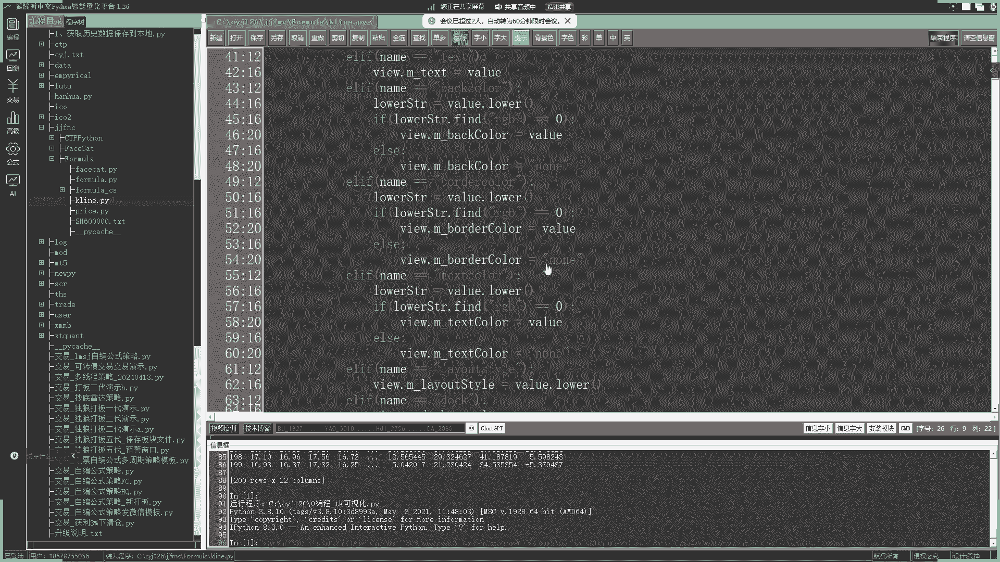

我们看一下你穿云箭除了操作系统，比如windows安卓平台开发不了所有的应用程序。

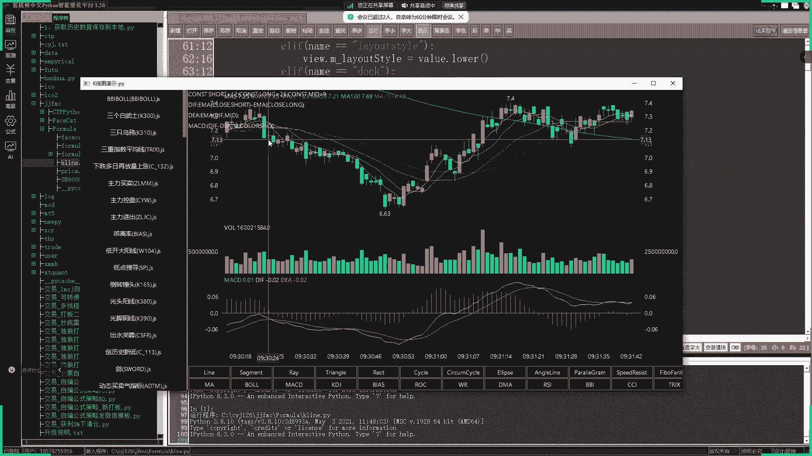

全部能开发，没有不能开发的，这是开发股票软件。

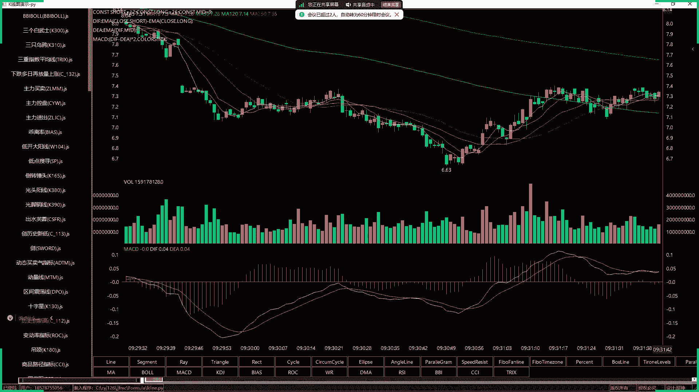

也可以开发一个量化平台，我们改变个目录，我们看一下，我们自己用穿云箭，开发了一半的一个一个股票软件，这是我们用创新建开发了一半的一个股票软件，你看这是他的主程序，在这里看，整个是创建开发的。

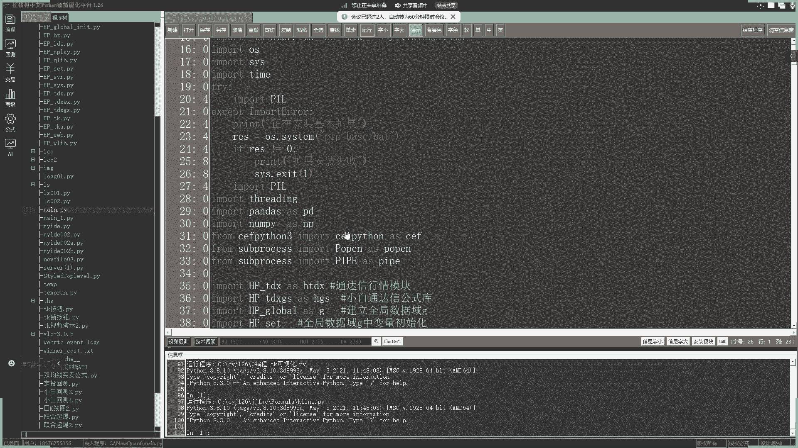

我们运行一下，这是不是仿股票软件能开发吗，行情。

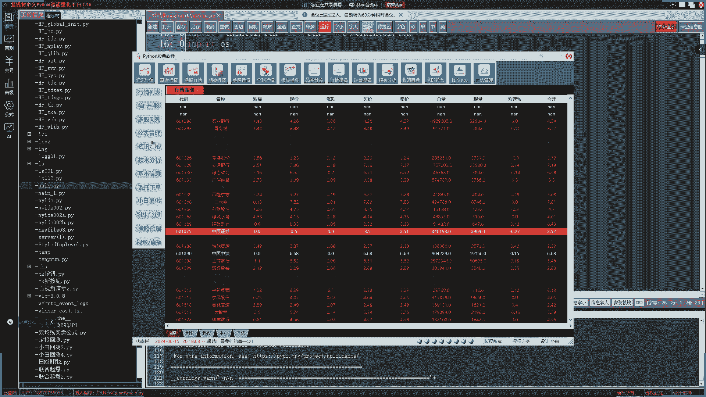

啊能不能开发Python做些这些东西，速度快不快，很快的，我们还可以看一下F10，你想看什么股票。

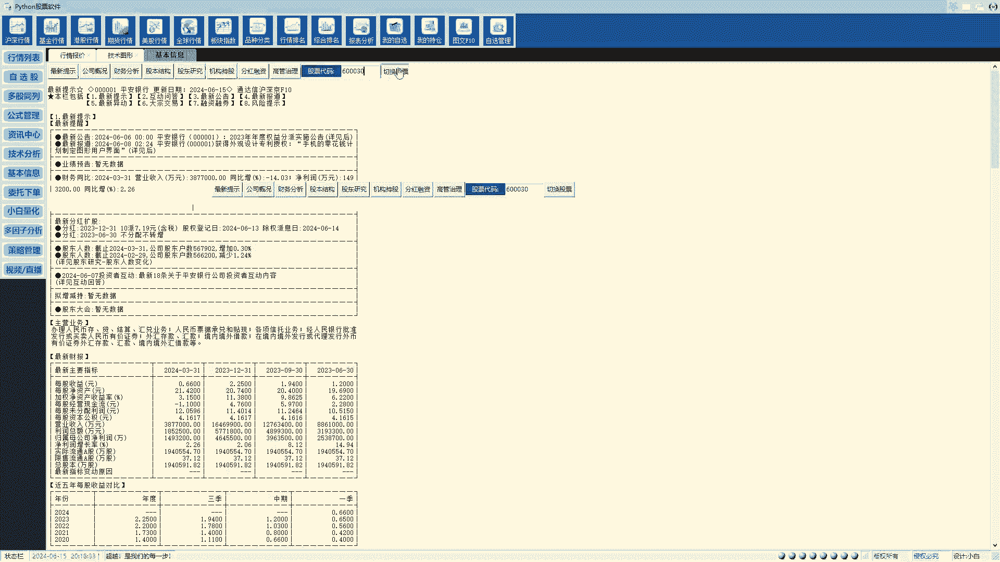

这个有点滑板了啊。

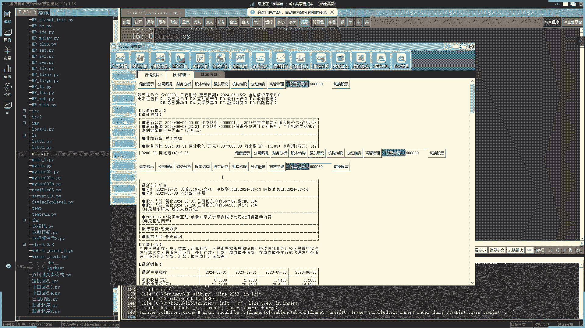

我们先不管他，这是一个演示哦，只是半成品，当然这里面还有自选股，什么都可以做，这是个演示，就是Python呢，还有10分钟时间。

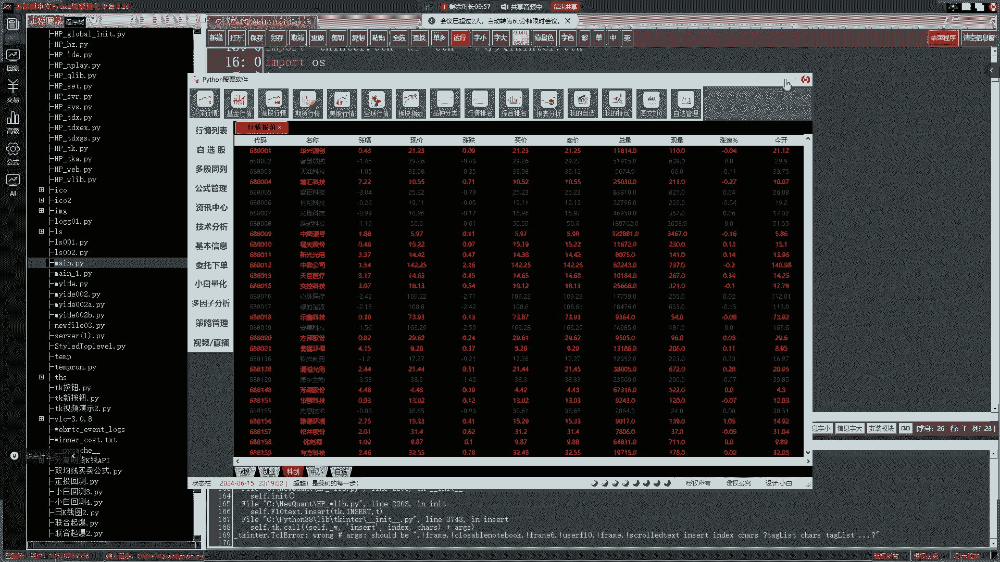

我们先不管它了，接着再讲，感恩节再讲，就是说用户设计你要自己重新搭建两个平台，你要考虑这么多东西，设计量化平台呢，很多东西P吹的KMTVNPY，包括你自己自设计一个量化平台，很多人写博客。

自己设计个量化平框架，你用户都要学习一个新的一个量化框架，我都懒得去学，所以呢我建议大家你要设计框架，就像仿传硬件这样设计一个指标公式的算法，为什么小白量化呢，你要是不用，你这个是搭建平台啊。

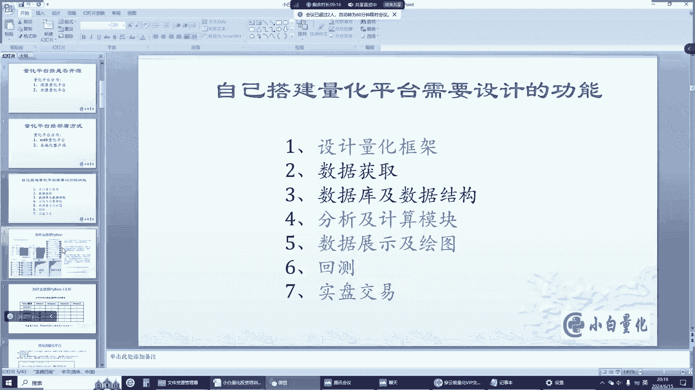

这专门你如果要是自己搞一套算法，你要想想这个是非常困难的，客户会不会写把自编指标，因为大家都是会使用自自编指标。

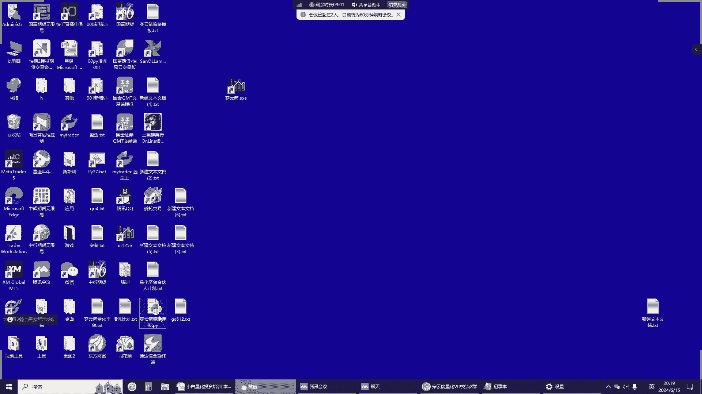

他怎么样把自己的自编指标转换成Python的算法。

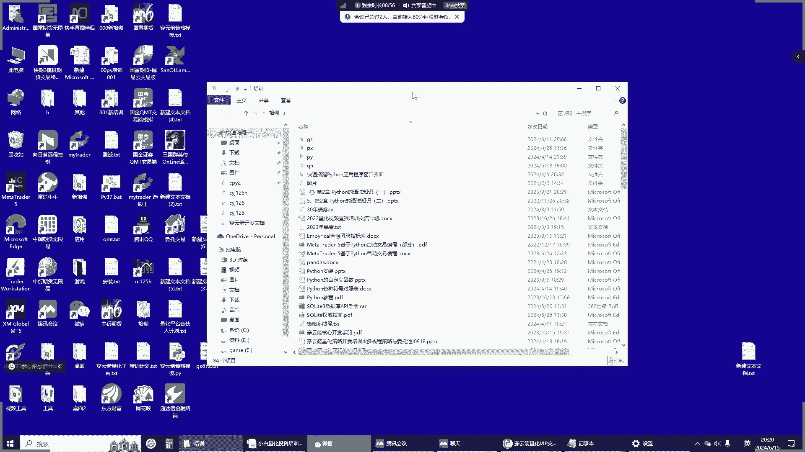

用户有没有这个能力，如果用户没有这个能力，你连客户都不可能有的，很多人做了很多，他我我的客户很多的100多个，为什么，就因为我的很多人都会用指标公式，对不对，你看如果你用小白量化或者穿云箭。

你只要两条语句就能在代码中实现一个算法，比如说我们用e m a close5，因为你导入了小白量化的金融模块，对不对，额量化公式的模块，你可以直接引用这个公式，如果你没有这个模块很多。

你你如果想在q m TP trader实现，你是不是得想办法实现em a，当然EMA这个算法很简单，那只计算机公式有几百个呢，你每个都是有现成的吗，比如说m a e ma本身一个函数一掉。

那你挨了HV呢，可说上穿下穿呢，还有很多的，你怎么样做，你把穿云箭。

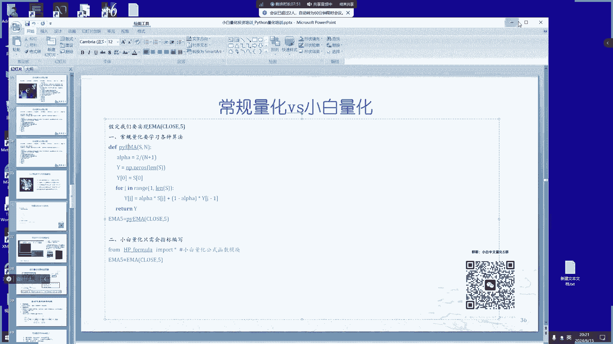

刚才我们跟你讲的这个六脉神剑这个公式，那你给大家实现一下，你用户给你了一个六脉神剑指标，我们读入六脉神剑，读入六脉神剑这个指标，目录变了，在我们这个目录下的六脉神剑啊，在D盘好，把这个指标给你。

你给大家，你给写个策略，我呢买了川建，我是免费写策略，因为客户都是指标这么复杂的指标，你用再把这个六脉神剑，在P吹的KMT上去实现试试，能实现的了，不能实现三个月时间，就光这个指标，你翻译过来搞三个月。

还不一定跟人家客户的结果一样，因为你上面的MAEMALHV计算的结果，或者TWTT，MWMA跟我们的通达信计算结果有差异，人家昨天发出的买点，你今天才给买点，那你之后的一天你不让人家的亏钱。

人家能满意的了吗，肯定不满意。

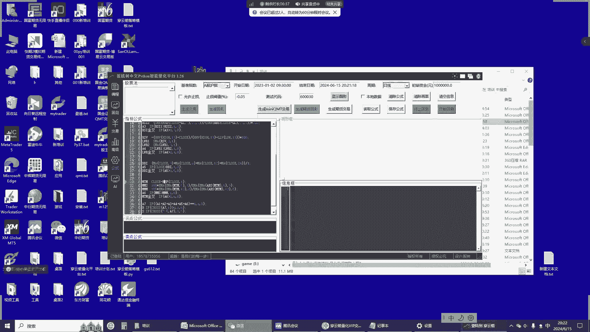

所以你们自己做，你都实现不了这个功能，你去怎么做呢，我们刚才讲了一个很简单的例子，你首先你每含客户有没有能力。

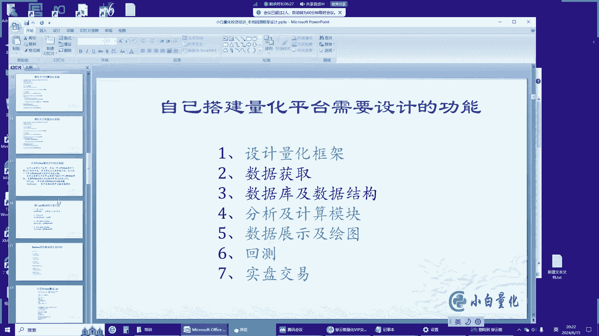

他去实现每一个。

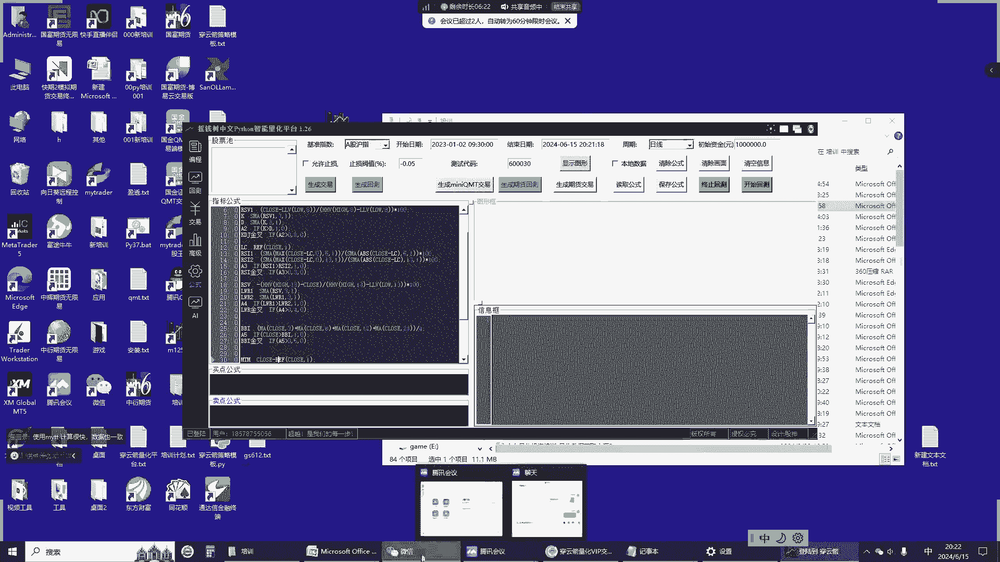

每一个函数，每一个公式函数它有没有这个能力，是买TT也是一样，但是呢客户不是程序员，我刚才讲了，买TT我们这个算法跟MTT的算法一样，大家都是调用的什么库呢，NUMPY和PANDAS1模一样。

但是呢买TT比这个公式少，另外呢客户要懂Python才能实现，对不对，比如说zip啊，ZIG啊，他没有LH，比如说便餐的ma变仓MAA和A和这些也没有，对不对，REF它也没有，对不对，也是变参的。

他也都没有没有你就实现不了吗，因为你买T都是固定的，它是调用了一个函数是很快，但是这种他都实现不了的，我们再给大家讲，所以你们设计的时候呢一定要用另外呢接口，国内的股票接口有两种，一是翠的。

我刚刚给讲了，同花顺第二个的mini k m t期货，用CDP或天晴港股，用富图牛牛和老虎证券美股应盈套，另外mt5，实际上理论上我们这个软件呢。

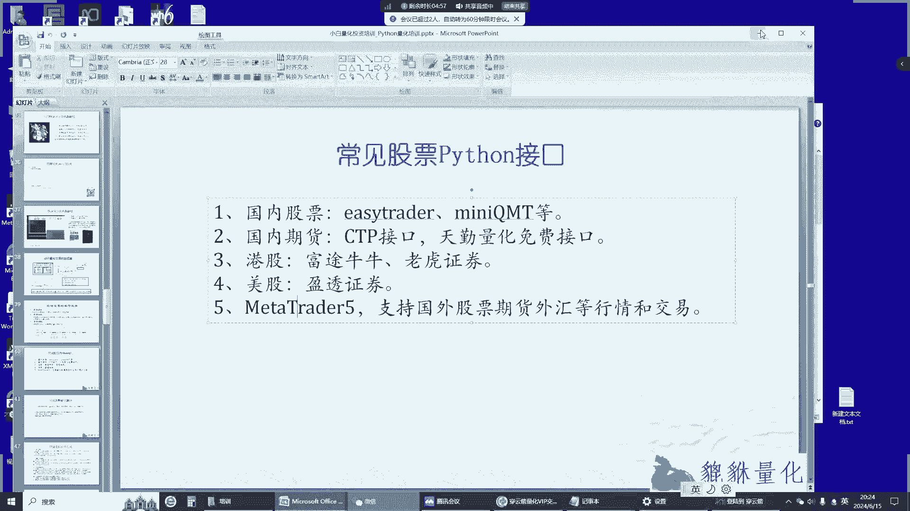

所有的平台它都支持，所以你们大家设计的时候，就是我们在设计这个软件的时候呢，就穿建在设计的时候，用户呢不管你什么客户的数据是怎么样来的，它我们把它表转换成标准的小白，量化的一个一个数据格式。

它一定一旦转换为小白量化以后呢。

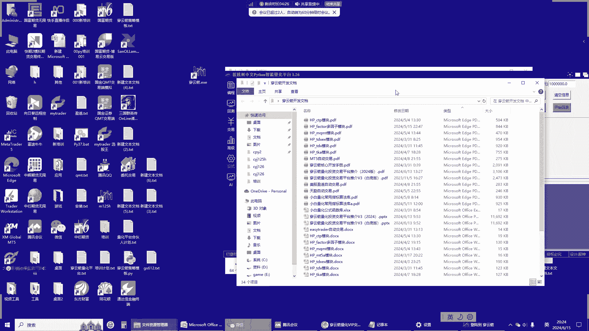

就能做什么，就能做指标运算，运算的结果是什么呢，刚才我们这里面的创建提供了这些指标的公式，你看一指指标一览表，他的所有的算法我们也给提供了，你看所有的BBI指标全部提供了，而这个函数呢你可以调用的。

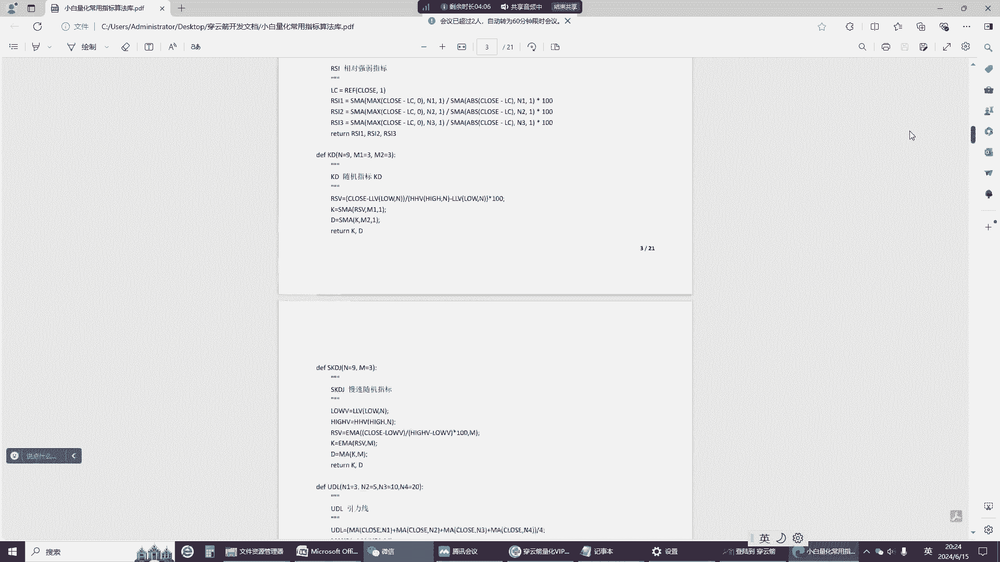

所以都都都是有这些函数，用指标公式计算，先标准化换成小白量化的标准格式，你就可以用指标计算，不论你是期货外汇换算成指标了，公式了以后，标准化了后，再指标运算，指标去运算结果直接进行。

我们的计算的格式是标准的距宽，p trader的向导，用户只需要实现这三个函数，没有任何学习负担，用户只要用就行了，交易呢不同的软件有不同的交易，比如说我们用天琴交易对吧。

我们或者我们用mini k m t都有，这上都有。

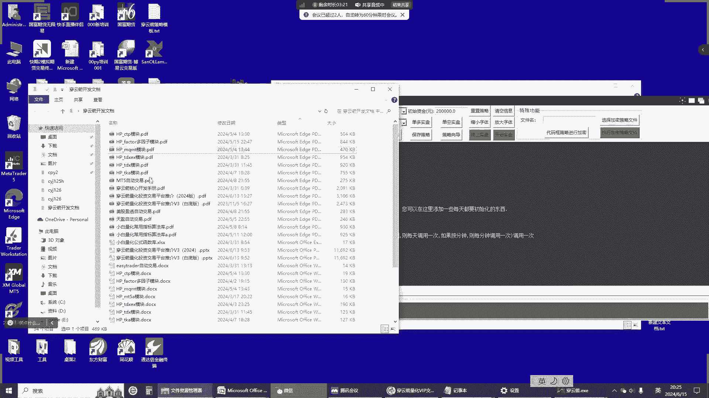

比如说mt5mt5怎么样登录，我们只要知道买开卖平卖票卖这些撤单指令，我们把我们的股票交易指令替换成mt5，或者替换成天琴，替换成莹透，是不是就实现了通用的自动交易。

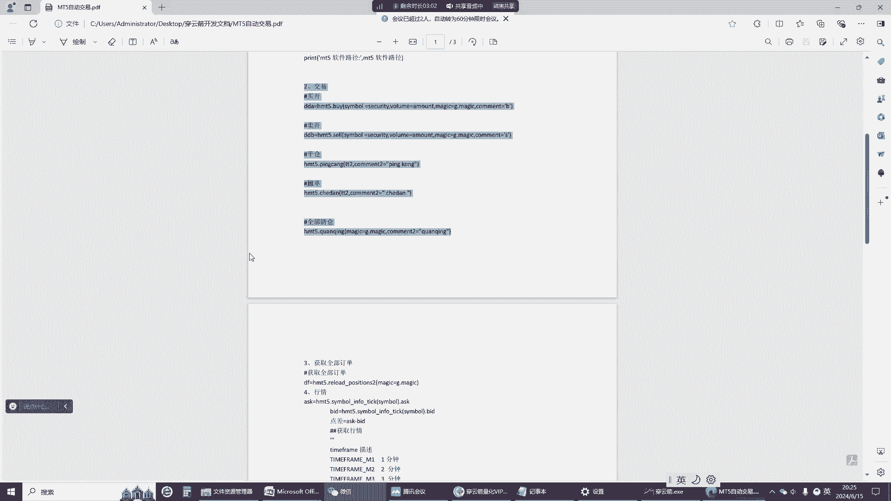

所以我们这个平台所有的量化软件都是支持的，你看我们提供了天津自动交易，美国盈透，我们为什这里面本身创建你装的时候，你白看这几十兆里面，一定给你提供了哪些交易接口，我们看一下CDP期货交易接口。

附图交易接口，港股附图一定包含了，这个是这个是，迅投我们一定赢透呢，自己安装pip安装就行了，easy trade p p IP自己安装，那都是不是我们软件的一部分，那是公用的一个模块。

你自己安装就行了，我们以前讲过这些很多的这些培训，怎么样自己安装这些模块，免费的高频的一些BBT啊。

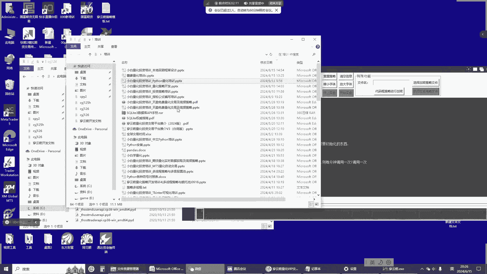

怎么样安装天晴，你比如说天晴怎么样安装，对不对，这是天晴的，你怎么初始化，怎么我们都介绍过，你只要把它安装过上，就可能用就能直接使用，这不这安装天晴，你在在我们这里面，如果你记不住安装的命令的话。

这不是有个安装模块，你把这个模块输到这里面，就把这个天琴，这个模块输出到我们的安装接口上。

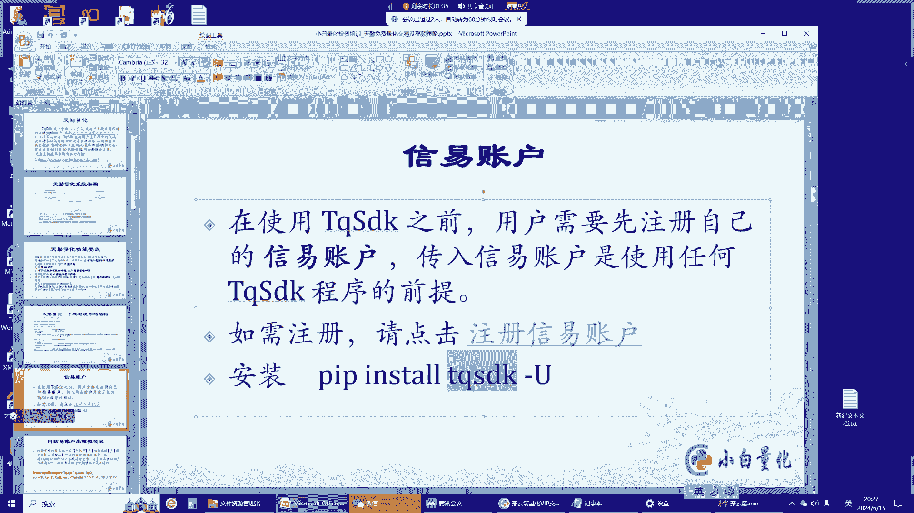

直接点一下它就自己就安装，已经安装过了，所以他突出错了，也可以打开CMD窗口，所以我们这个没有任何负担。

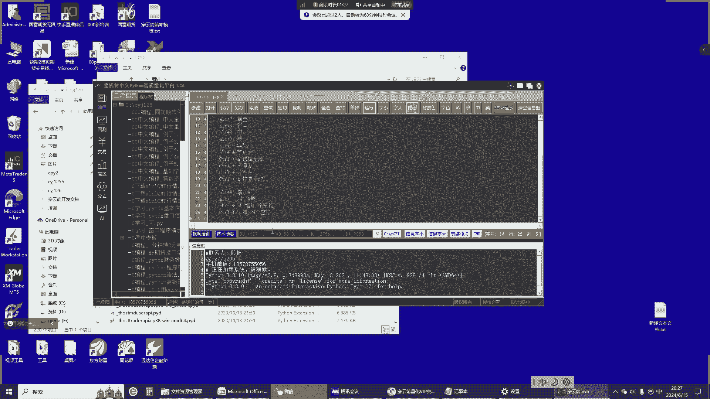

如果有任何问题的话，你也可以使用差的GDP，你可以使用，你比如说你使用指标公式，用免费的就够了，因为免费的3。54。0是要收费的，你就用免费的3。5就行了，帮我设计一个Mac的交易指标。

他就会就写个通达信，首先你要说关键点，通达信公式我们都直连的。

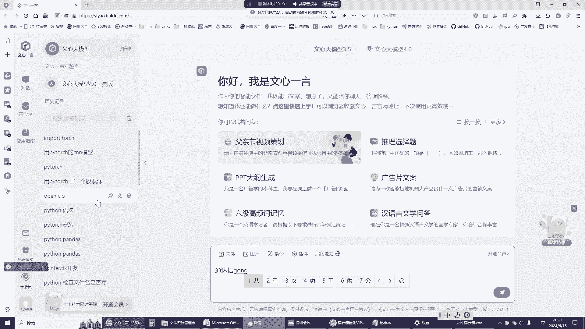

这这个我们查的数据不讲了，以前讲过的视频本身这个是都有技术视频。

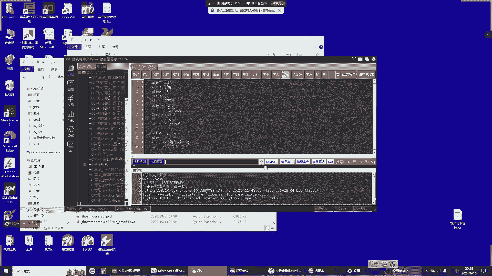

视频培训，我们每一期的讲课，这个上都会有专业的安装介绍都有。

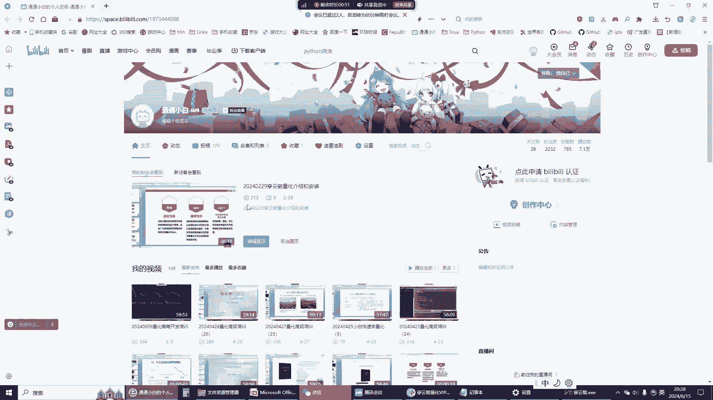

所以大家呢在用的时候，我建议再说，刚才我们讲了，我们这里面也使用了back trade，刚才我们刚刚在回测的时候，有一个回测的一个结果，里面有什么阿尔法因子，贝拉因子，很多人对这个很感兴趣。

其上穿云箭根本就没有做过这些东西，因为这些东西呢本身都是人家开源的。

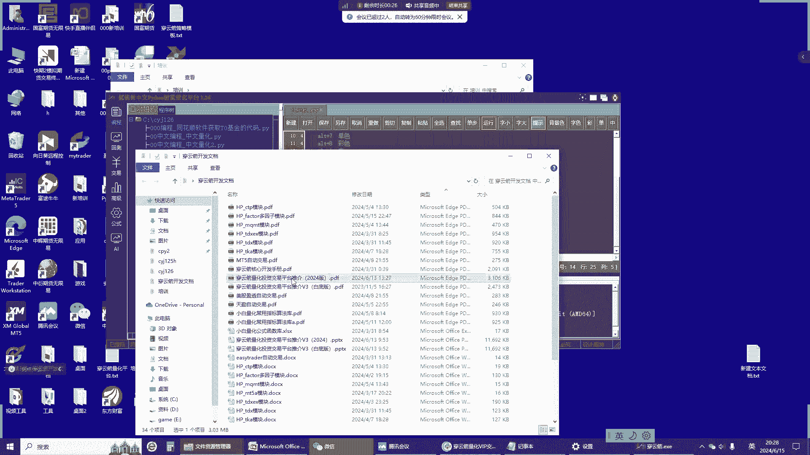

你直接用我们在创建目录下，一定给大家也做好了，直接使用的back trade的一个策略回测，这以前我们讲课专门讲过一次，就是策略的评价，这里面有一个对这一个，这是BER trade的量化评价。

一个指标库，你需要整个一个量化平台。

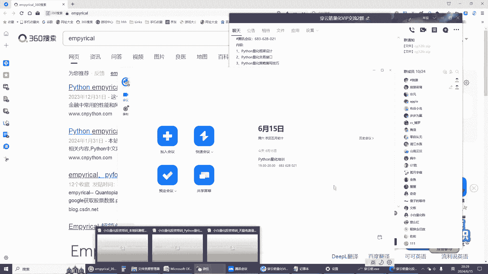