# 20240922Python期货历史和实时行情获取 - P1 - 通通小白 - BV1nWsCeCEhx

为为什么说学会Python能帮我们赚钱呢，第一个能提高工作效率，因为Python可以批量处理汇总电子表格，你就会用指电子表格的宏公式都没用，因为Python它可以批量处理，另外自动运维自动很多的工作。

就自动操作的工作全部能用Python，第二个能够爬虫所需的资料文档或者自动抢单，你看以前的墙或者网购抢单都可以用Python来实现，第三个能够业余接单赚钱，因为你不会很多人最近投资一些做生意。

比如加盟生连锁店呀，或者你搞一个店铺呀，那投资现在很难挣回来，因为现在赚钱很难了，学会一个技能，你会Python基本上是无本投资，因为人人家里都有电脑，你可以接单挣钱，另外你跟钱相关的所有投资。

都可以用Python量化分析和交易，比如股票期货，外汇彩票等，另外呢从2017年至今，2024年9月，Python都在计算机编程语言排行榜第一名，你要学个编程语言，我建议你你首先学会Python。

这是第一个，如果你想进一步学编程，你也白学别的，就学个C加加，这个如果你掌握了Python和C加加，你可能是都成为顶级程序员了，为你说很多的其他语言，比如说R语言，c#那些都是过程语言。

你想我今天看新闻，现在鸿蒙系统就是华为的电脑，现在是最后一批使用windows的，以后的华为电脑全部是鸿蒙系统，另外中国的政府采购，金融机构采购要求，50%的电脑必须使用国产电脑。

必须采用国产的操作系统，所以你学会了c#，你在鸿蒙系统和中国的那些操作系统上能跑吗，因为sharp只能在windows上用windows服务器，windows客户端，对不离开这个系统你还能跑吗。

但是Python是跨平台的，不论小孩玩的玩具机器人对不对，包括你手机linux windows所有的系统都能跑，这个Python对于你提供提高办公有很大的作用，所以我们建议先学会Python。

因为Python还是个简单的语言，学会了再学个C加加，C加加从他的出现九几年出现至今都很厉害，你你看这个C加加第二位，因为C加加离开不了Python语言，本身是C加加开发的，你的c#java对不对。

R语言vb p h p，哪个语言都是C加加开发的操作系统，Linux windows，对不对，全是C加加开发的，因为C加加是面对硬件和顶层的一个，接相关的一个操作系统，包括Python。

你你觉得速度很慢，那就用C加加做个模块，因为我那天在VSBVFP群，就是福克斯普若群，跟咱咱咱们聊，别人说FOGPA多么好多么好，我说将来没有windows系统了，你个问FO个婆。

你怎么跑YFBYFP就是威神福克斯pro，就微软公司的人家早都不升级了，2007年就不升级了，到现在还凑合，能运行，到以后不能有windows系统，拿它运行，没系统可运行。

但是Python不存在这个问题，Python更早，他从八几年就出现，一直到现在都有人维护升级，你看他的排排行榜是第一名，你看历史上201718192 12，1222324，全是计算机编程语言排行第一名。

第二名不停的在换，你看有CC加加java java java，然后这个可能也是什么c c java吧，这里现在C加加，你就第一名永远是他，第二名，咱这都抢第二名。

所以就所以我就大家建议就先学Python，那怎么样学Python呢对吧，学会Python的好处，我刚给大家讲了，你怎么样学Python，建议大家选择穿云箭中文Python，因为会中文就会写程序。

支持中英文，Python语法混合编程，可以运行网上所有的在IDL，IDLE是什么呢，VN就是平呃，就是那个Python自带的编译机器，我们找到Python它的自带的编辑器叫做IDLE。

这是Python自带的一个代码编辑器，我们打个new就能写Python程序代码，我们就先不讲，另外呢vs code是微软公司的对吧，VPYTHON呢本来Y微软看不上，但是人家Python老是第一名。

那没办法，他就开发了个vs code，让他支持vpython py charm嘛，本来就是针对于Python开发的商业软件对吧，你要花钱去买，所以能够在它上面运行的程序呢，都能在从中文传文件上运行。

另外呢我穿云箭呢中文创新建Python，支持中文和英文的一键无缝切换，也就是说你用中文写的程序呢，可以在任何的新闻Python上去运行，但是前提你要进行中英文切换一下，把他的代码自动切换。

我们可以给大家演示一下。

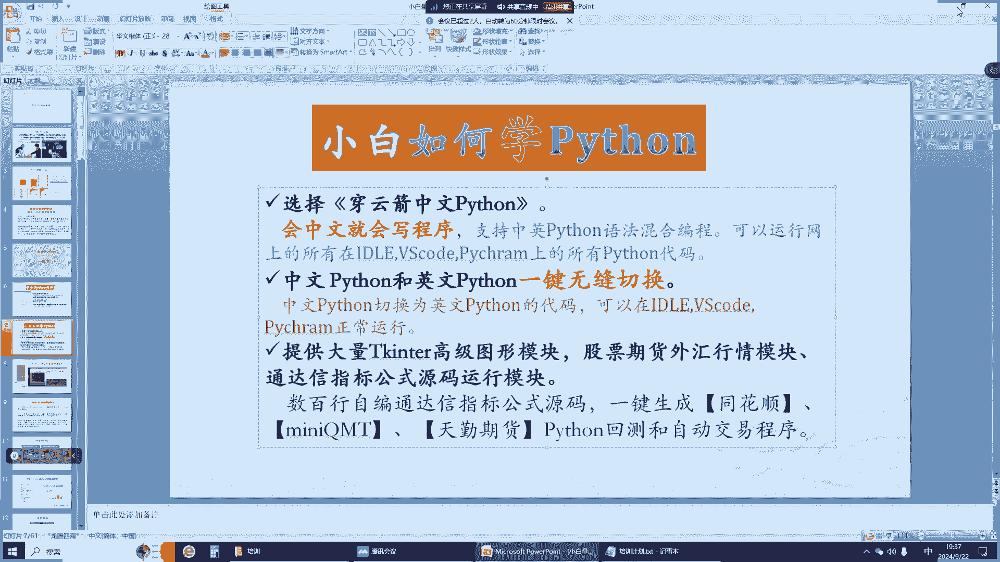

这个呢就是创新件本身是Python纯Python开发的，利用t kt，我们登录了以后。

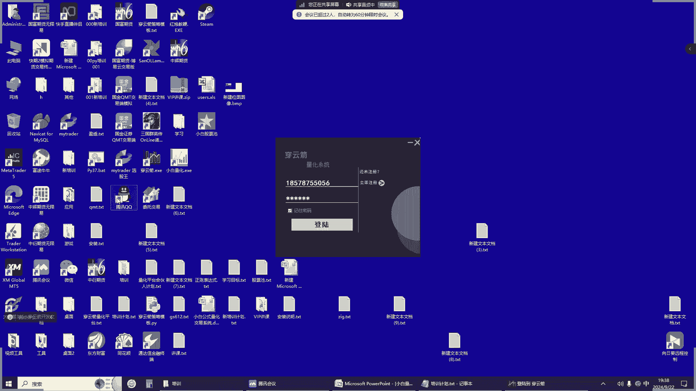

他就是一个Python的一个集成开发环境，它支持中文。

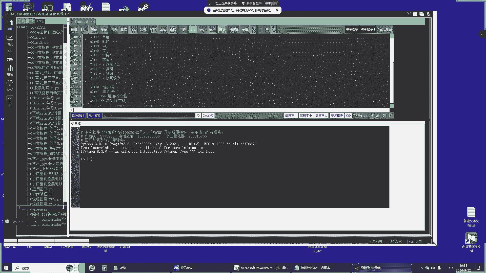

我们看一下这一些中文的一些例子，这就是中文量化本身它是一个纯中文程序，你看见没导入中文NUMPY，这是一个Python模块，命名为NP，对不对，从hp杠TDX导入所有的星，就代表所有的函数连接站点。

IP就是它的参数站点的地址和端口，然后你可以用中文变量，日线数据等于获取股票数据类型是四四，就表示日线市场，一表示上海代码是股票代码，输出我们的日线数据，然后呢进行小白初始化对吧。

小白是按是小白量化初始化，把日线数据初始化一下，因为呢任何数据进行指标计算，它就要进行初始化一次，初始化完以后有个好处，我们就可以有很多指标使用了，比如说RSI凯蒂结MACD我们全都能用。

这些公式呢就是通达信里面的很多的自带公式，我们就支持了，我们可以改变参数，它默认我们不写就933写了就是433，然后我们定义了几条水平线，这几条水平线呢我们定义好了，然后我们还可以做支字转向我们划线。

你看画指标线，画指标线就画我们三条线，然后收盘价我们是把这个当时我们是用的只字，转向，我们加个井，然后我们就显示你看减去井号，那就不注就注释了，我们运行一下，这就是一个中文Python，简单不难。

它是显示的KDJ，但是数据比较多，所以我们做个数据裁剪，显示最后200条我们运行一下就看的很仔细了。

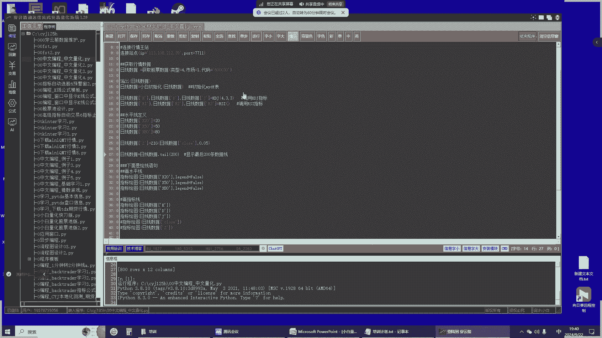

是不是一个凯立杰的一个图形。

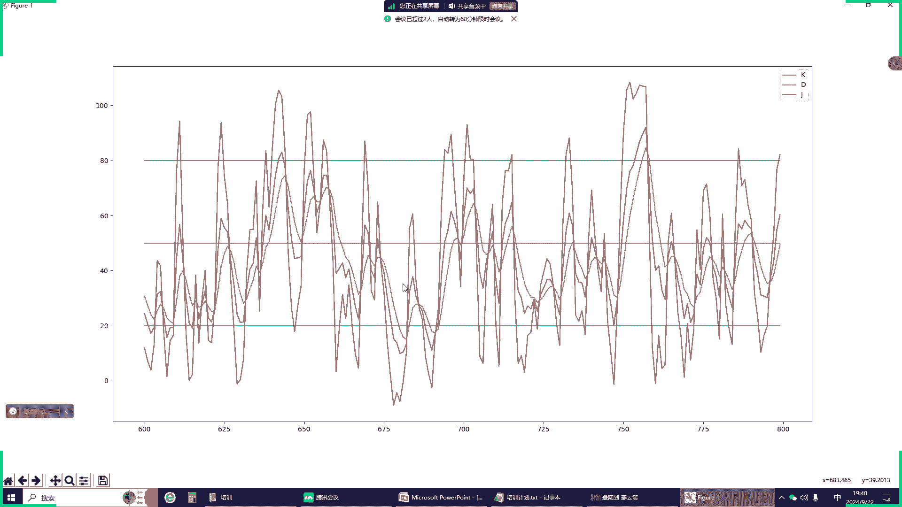

我们做了三条线，简单不简单，纯中文的，那我们还可以做一些其他的中文的一些游戏，参数，游戏对不导入一个RAMDI函数，你看这学快不从汉化导入所有的汉化程序，车辆目地是中立区。

在车票背后后面又发现了一行小字，然后呢，我的数字等于随机函数1~9，就是这个啥意思呢，我的数字是代表电脑响的数字，你就是用户来猜，对不对，电脑随机产生一个1~10的数字计数，排个计数器你只能猜五次对吧。

猜六次百分之百能猜出他猜六次，因为总共才1~10嘛，对不对，11~1到九，你只能只有五个数字，你猜五次肯定百分之百猜中你十六六，五六次以上，那你那就太多了，所以他基数一个循环开始计算基数。

我的他现在是一计数小于一的时候，就是你的数字整形输入，你猜一个1~10的数字，然后你的数字和我的数字比较，就是你猜的数字和电脑猜的数字出的数字比较，猜对了就进行，否则继续猜。

然后计数器计数加一加到六结束，我们运行这个程序，这实际上是个Python代码，他是不是执行了底下的Python，我们可以放大，然后我们猜个，那我们为了五次猜数二分法嘛，猜五嘛，哎呦一下就猜对了。

电脑出了个五，我们一下猜对了，我们再运行一次，我再猜个五诶，你猜的数字太大，那五的一和一的一半是多少，那我先猜个三试试，你的数字太小，那我猜四是不是百分之百猜对，这就是一个游戏，怎么样最短的时间采访。

那你说这是中文的，那我想在vs code上运行怎么办呢，那我们这地方有个中英按钮，我们鼠标这个位置，我也可以用鼠标菜单转换成英文诶，他就是一个英文的一个程序，我们把它另存为，我们叫中文编程，对不对。

我们改成英文参数。

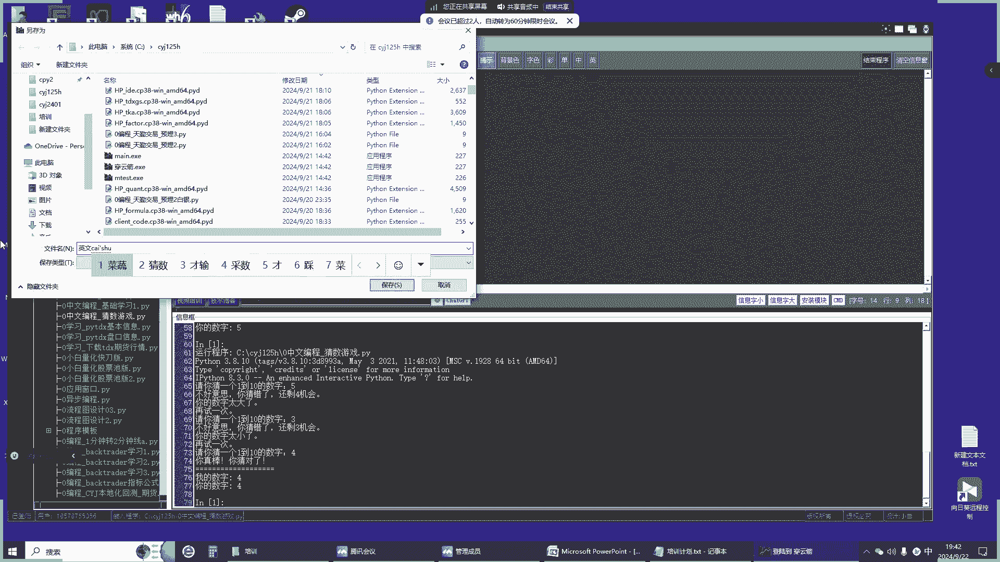

这个时候呢他就是英文程序，我们可以用什么做呢，Python的IDLE，我们搜索一下，IDEL了，我们看看啊，能搜索的。

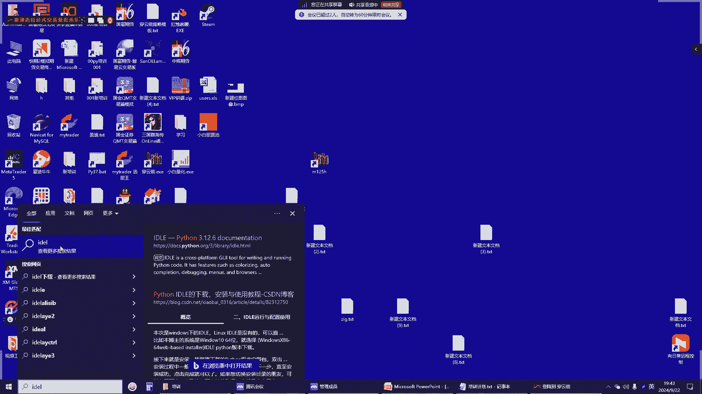

哎我看看啊，应该用什么IDLE啊，当然我们可以先用vs code x。

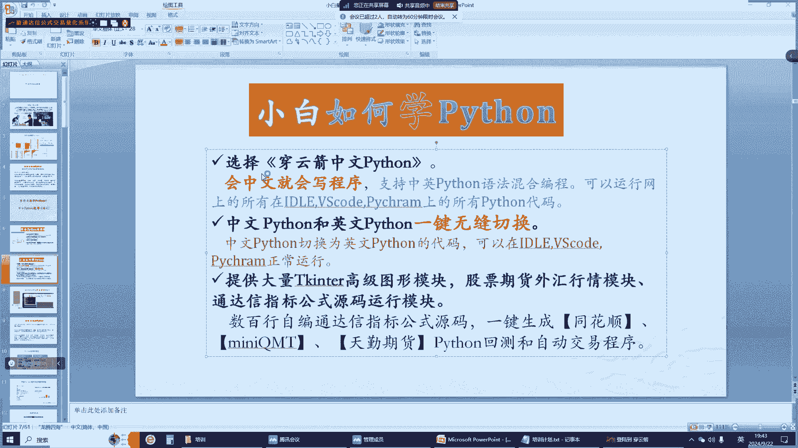

它能运行，肯定百分之百能运行，我们先打开一个文件，打开我们的那个刚才工作区域，就是这个目录下打开，然后找到我们的刚才那个游戏叫做中文参数，它是按，我看看啊，是不是在这里，这个不是这个目录，打开目录。

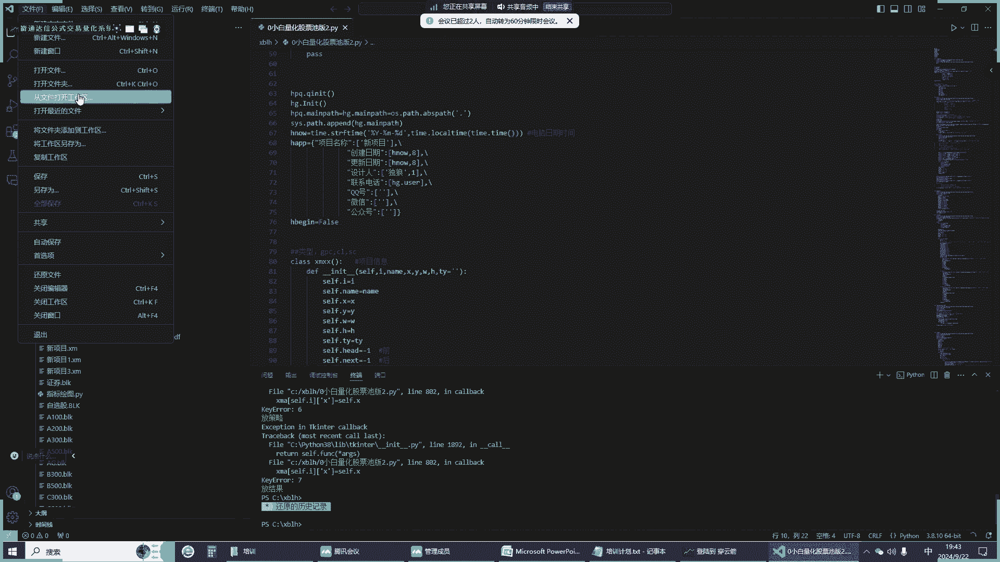

打开工作区域。

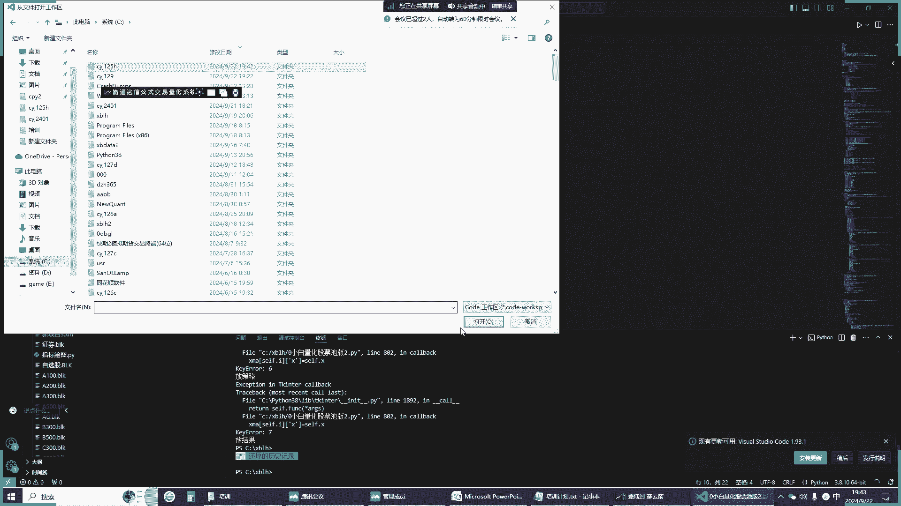

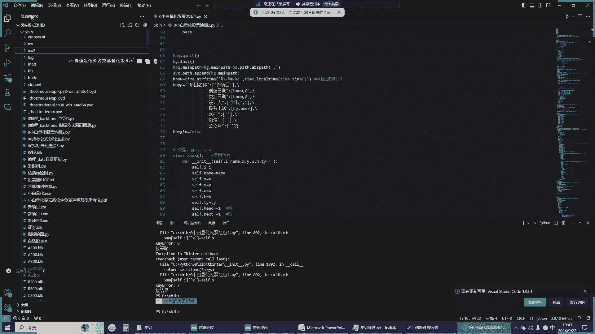

打开不是工作区文件夹啊。

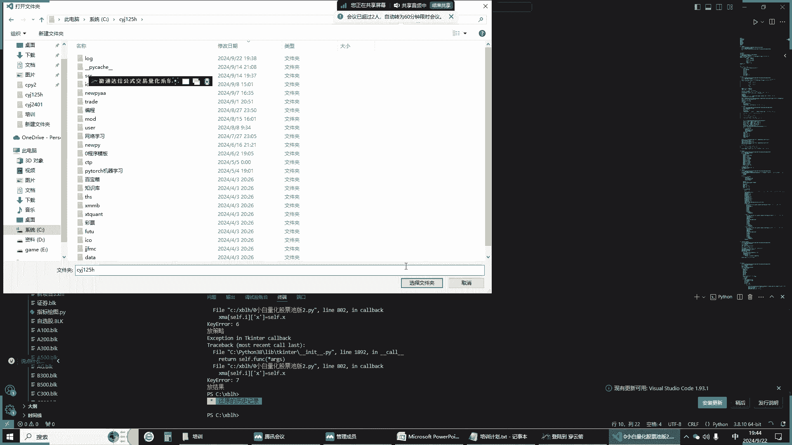

刚才我们写了一个英文参数，找一下那个项目学习，他是，英文参数哎，这是我们那个程序，我们运行一下，是不是啊，请输入，这是这什么中英文切换，就算你学会中文，就等于英文Python学会了，因为它自动翻译。

对不对，自动翻译，那我们再猜个五嘛，对不对，你猜的不好意思，你猜错了，还有四次机会，你的数字太小了，那我们就猜个七试试，还小，那么猜个八猜对了，对不对。

是不是这个学会中文Python等于你学会了英文Python。

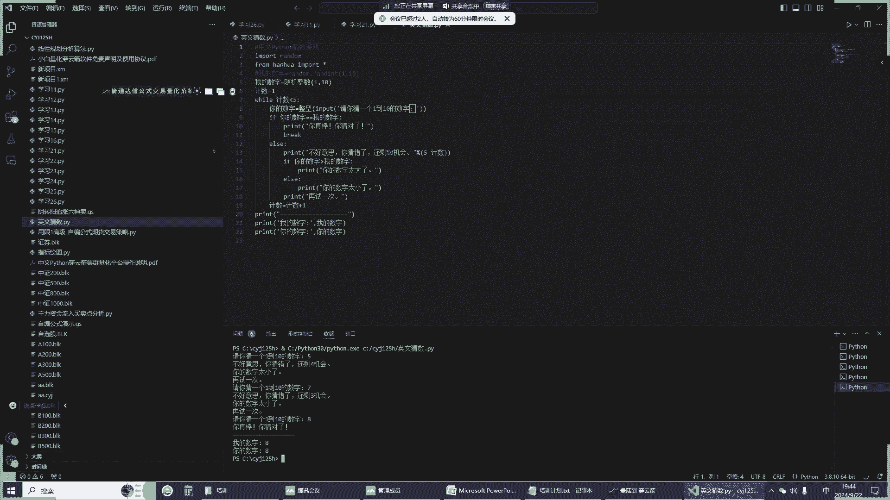

因为会中文秀会写程序，支持中英文语法混合编程，也可以运行，所有能够在网上的下载的任何Python代码都能跑，支持中文和英文的一键无缝切换，我刚才把中文的程序切换成英文的程序，可以在其他的上面。

新闻的编辑器上跑，提供大量的提坑的高级图形模块对吧，本身我这个穿云箭呢就是替坑的做的，还有同大性指标运线，可以可以做任何的工作。

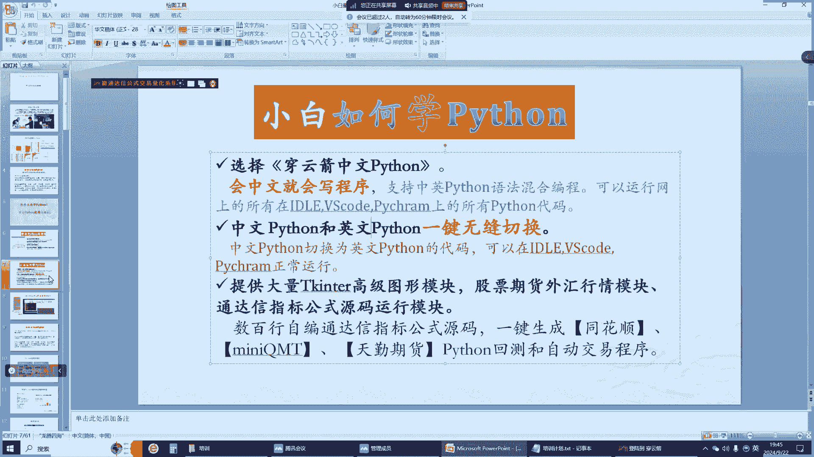

这是小小白，如何学Python，比如说你接个单，别人给你了个100多行的自编通达信指标，你也可以接网络爬虫，你看网上的例子，接爬虫的一个单子至少2000到1万对吧，然后爬数据你要接到了，肯定能做。

因为我们这个可以运行爬虫程序，也可以运行深度程序结呃深度学习程序，我们比如说有个人炒股的人，他用个什么六脉神剑，这个六脉神剑大家看过将近很长的，几十行甚至上百行，他们很多人改造了上百行。

那你现在把它做成mini camt，你一般的在网上找人做起步，我估计1000以上，这但是你要是别人让你做多少钱，一个红包，一个红包封顶就是200，那你说这老师你这太便宜了吧，对不对，你这太便宜。

时间其实呢不论你做什么工作，你卖东西出上班还是开发软件，其实呢值钱的就是时间，你时间越快，你的劳动力越高，对不对，时间越慢，你的劳动力越低，你这个软这个六脉神剑。

你让别人把它做成mini k m t的一个指标，他可能要做一天时间，那他不问你要1000块钱，但是拿到我们手里怎么办，很简单了，六脉神剑的一个指标到我们的穿云箭上，我们刚刚讲了。

这是一个非常强大的一个中文Python量化平台，它除了支持中文Python以外，你学习速度加倍。

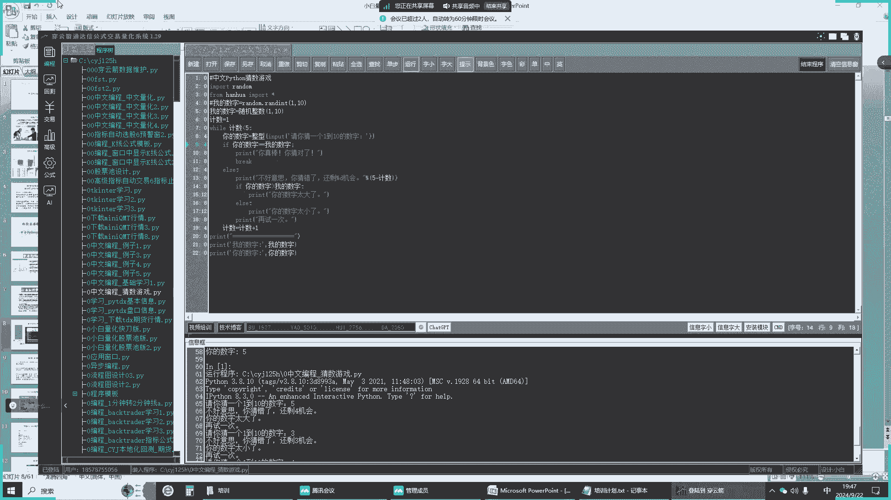

就可以不用学英语，直接学Python，另外呢有指标公式，我们读入六脉神剑公式，这就是六脉神剑的一个公式，对不对，六脉神剑公式我们点生成mini k m t的交易策略。

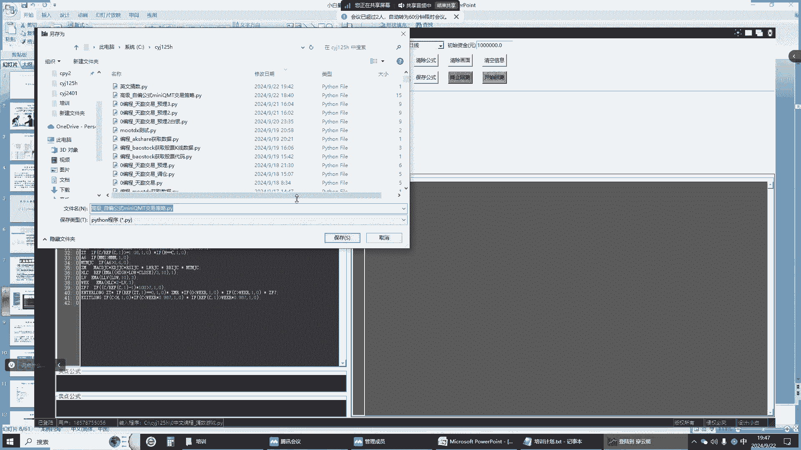

我们就可以在高级模式下就可以直接自动交易，我们可以看一下读入我们的刚才生成的程序，这个就是一键生成，你只要改变你的路径，因为它可以实盘，可以虚拟盘加入你的mini cam的账户。

一点开始实盘在盘中自动按六，按六脉神剑全自动交易，简单不简单，200块钱到手嗯，谈我们说是最简单的，对不对，我们这学习学我们目的是为了高效嘛，对不对，学习加快速度加快。

所以呢那你说这个Python呢既然这么快，那我们有很多的例子，比如说我们这里面有很多的例子，这是一个因为我们这里面有指标公式源码，实际上是指标原公式源码可以直接运行。

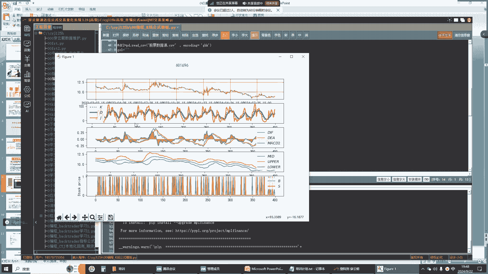

对不对，我们画了几个分图，我们诶这是个布林轨。

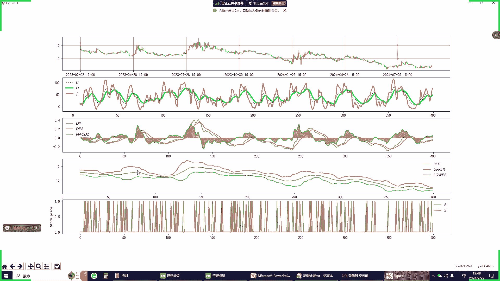

布林轨我想跟这个K线图凑的套到一起，很简单，我们的布林轨在哪里呢，布林轨，布林轨是第几根线，我看看哦，第一个线，第二个线，第一个是安凯蒂结，第二个MACD，第三个是布林轨，公式三是布林轨，布林轨。

我们看公式三是在哪计算，这是公式三，那我们把它在我们的K线图上显示一次行不行，是不是我们的主图上诶。

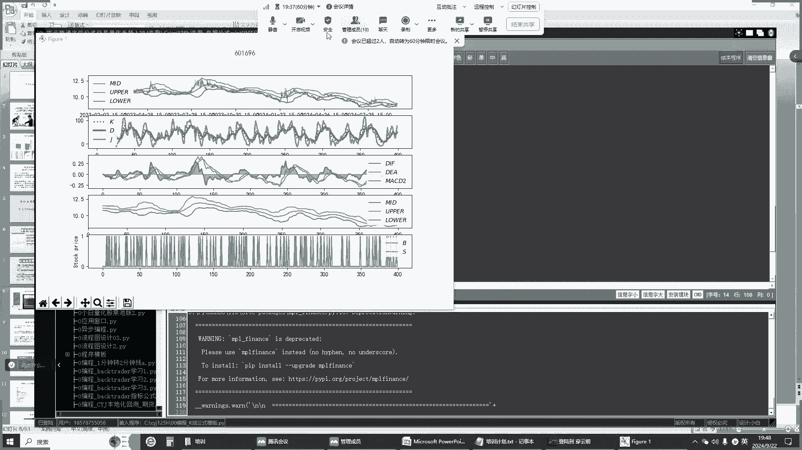

套了个布灵鬼，是不是量化，你需要学什么，你什么也没学，只要学习会中文会指标公式，你一定分析自动交易统统实现了。

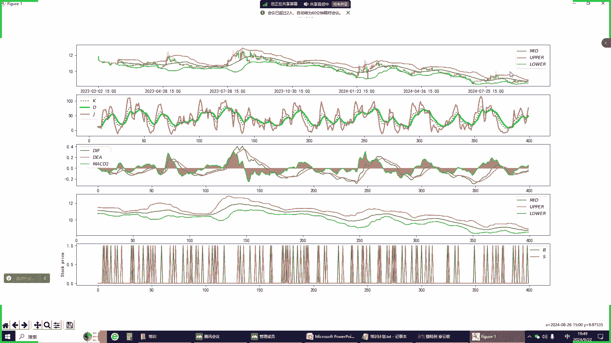

那你说这个公式有了，我想试试这个六脉神剑，挣钱不挣钱，我们拿一个股票池，随便找一个股票池来算啊，我们随便找一个200只的股票池，然后我们从1月2号到9月20号回测一下，直接开回测，这个如果挣钱了。

我们在实盘他都不挣钱，我们敢实盘吗，对不对，他在线下载数据，我们这里面没有数据哦，他在线实时下载历史数据，下载完后，他立马就开始回撤，如果挣钱的话，他比他就可以实盘边下载数据边自动交易，这个他已经开始。

他开了很多进程，你看开了多少个进程，他判断我的计算机有24个，核，对不对，是他开了200个进程，每只股票是一个线程，然后下载行情，你想速度快吧，多线程的功能吗，你开了20个线程或者十个线程。

十个同时爬十个网页，那个速度多快，我们这个下载行情开了200个行情，200个县城同时下，所以瞬间就下载完了他的六脉神剑，他就边计算指标边算，如果出现了买点，他就会全自动交易啊。

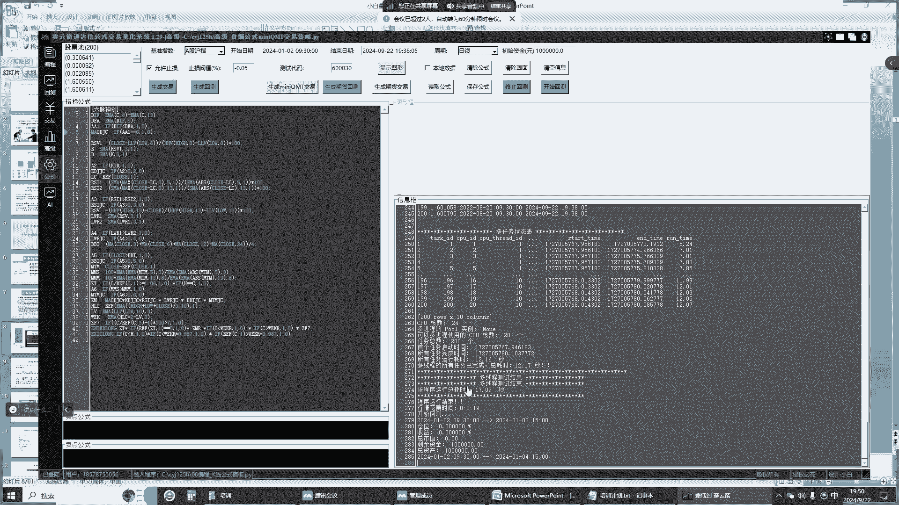

我们在讲我们的课，这个就是说学会Python，你的功能非常多，你可以在网上接爬虫的活对吧，因为他Python的用途非常广，人工智能，云计算，大数据，网络爬虫，自动测试，web开发，自动运维，数据分析。

人工智能，这个就说你学会，其实呢这个软件也不贵，嘿这个软件也就是9800，但是现在有优惠才3800，对不对，你们想要的话，可以到时候加我的微信，都会回头加我微信，我们现在不讲别的了。

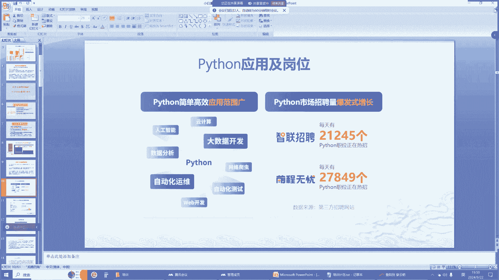

我们继续讲我们Python的课，因为我们学来不是学这个来了，让他慢慢的回测嗯，他怎么卡到这了，我们打了止动止损，应该不应该从侧呀，可能可能是不是有停牌的股票，我们不管他了。

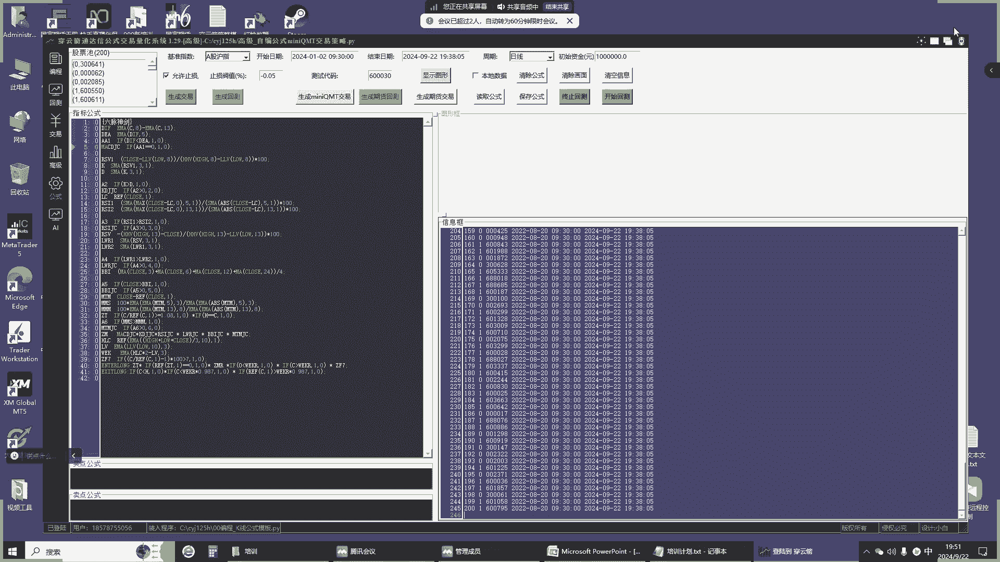

我们讲课，因为我们讲下面的内容，因为抓紧时间。

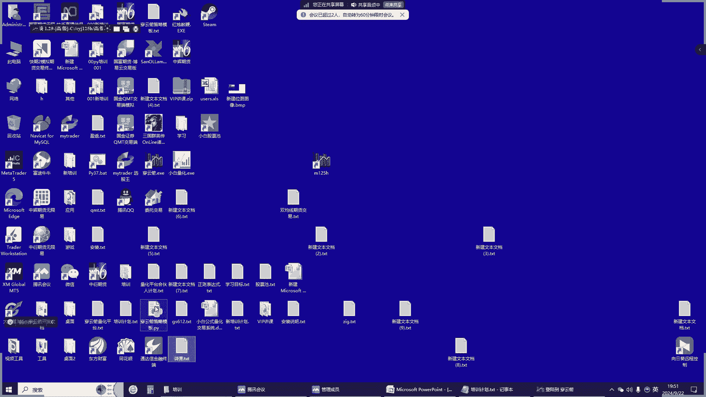

我们讲期货行情的获取，期货呢我们用的两种方式。

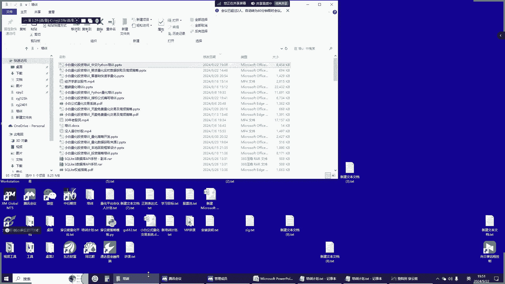

一个是这是期货的行情，一个是用PYTDX，因为连接的行情通达信，通达信有期货和一些的国际期期货品种，所以我们可以通过通达信接口，能够读到通达信里面的所有的品种。

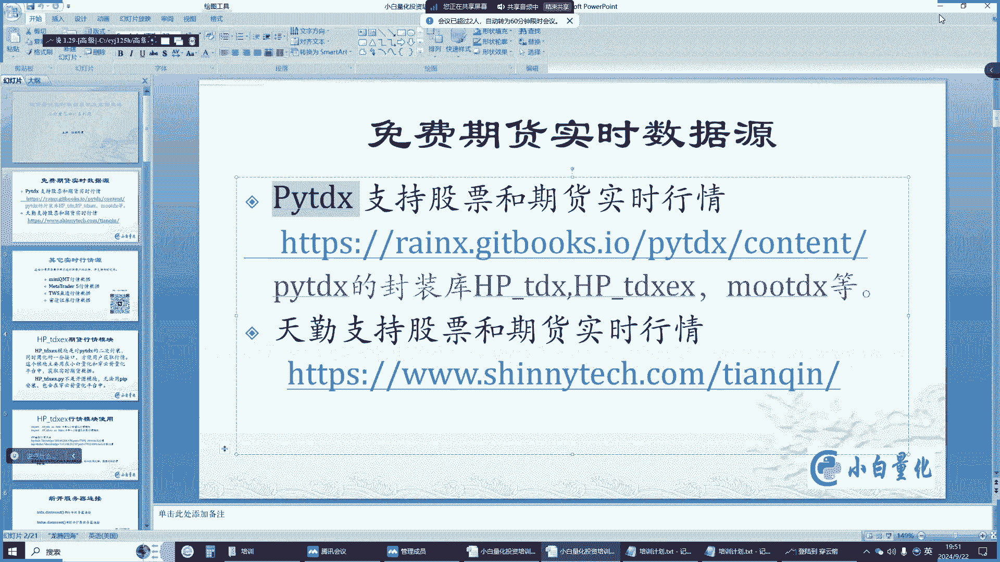

期货呀，国内期货，国外期货，美国股票。

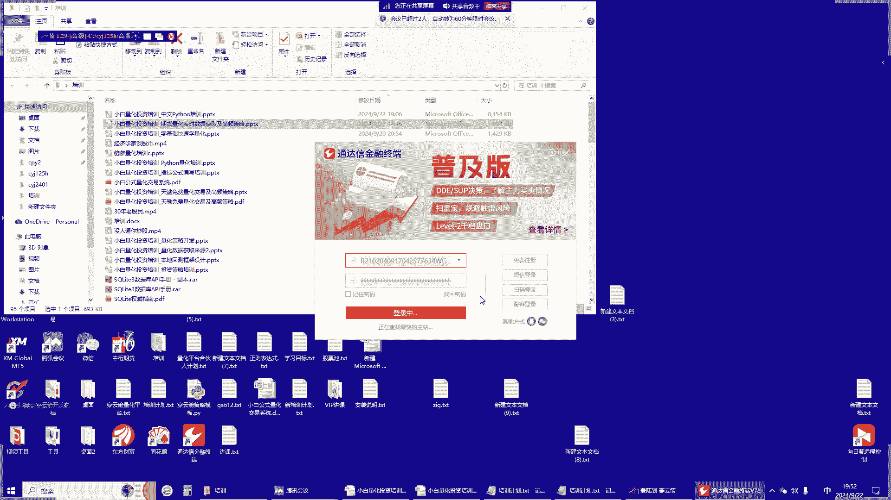

包括苹果股票都有，我们因为可以在这个地方，你看有个期货，我们可以看香港的期货，纽约的期货都能读，还有全球的行情，就说是本身通达信。

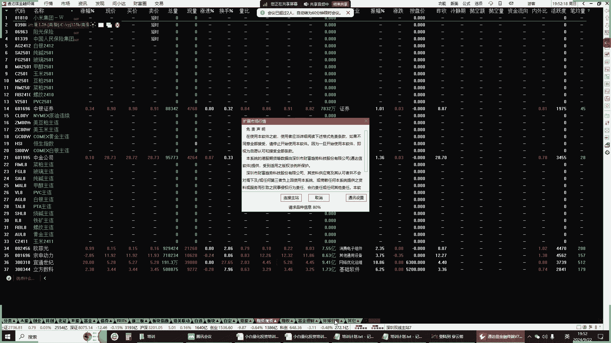

这个已已经支持了全球的行情，美国的股票，这些股票你都可以都可以获取它的行情，可以通过我们这个借口来读，所以呢我们可以用PYTDX，来读，另外呢可以用天晴期货读国内的股票和期货，因为天津期货也可以支持。

今天主要讲这两个，如果我们先讲第一个，我们对PYTDX做了封装，变成了h p cot d x，EXEX表示通达性扩展行情的意思，他是期货嘛，因为托他是对PYTDX的二次封装，连接站点呢我们就是这样操作。

一个连接基本站点，一个连接扩展行情站点，你把这站点一连对吧，它本身这个不是开源的，没有安办法安装，他在穿云箭目录下，你只要有了穿云箭就可以直接调用期货行情，所以我们连接行情主散下来呢。

断刚才连接连接不用的话，你要断开，否则你一直占着人家的端口，我们断开服务器对吧，断开基本行情，服务器断支开扩展服务器的短链接，对不对，下来呢，但对它的股票编码，因为我们的编码在PYTDX呢。

采用原组的方式，元组方式是市场和代码，我们这里面可以看，比如说你可以看纽约的商品交易所，它的编码是三，对不对，你要想看国内的大连交易所啊，他的有药品交易所的商品是16，大连的是29，然后上海的呢是30。

郑州28，如果你要看香港的指数呢，或者香港的品种，他都可以看，我们上面后面给了个例子，比如说你要看香港的主板小米集团，它的三幺，它的股票代码是香港是五位编码，我们是六位编码，然后呢上海的期权中金所。

你看这就是它的编码，你就通过这些编码能够获取它的行情，非常简单，然后呢这个可以获取什么呢，获取K线图你可以看获取5分钟，15分钟，30分钟，一小时日线K线，月线一分钟，所以呢我们能够扩展扩展行情的话。

我们做国内期货的话，我们可以采用就是就是监控，比如说我们想做黄金，我们现在看着美国的黄金走价，做国内的黄金可以实现这样的功能，这个你可以读两个品种，只是在我们这里面调写两个品种而已。

它的K线历史K线和现价都是有，他这个是实时数据盘中毒的，K线永远是最新的价格，这个是分时图，分时图呢它是当前分时图。

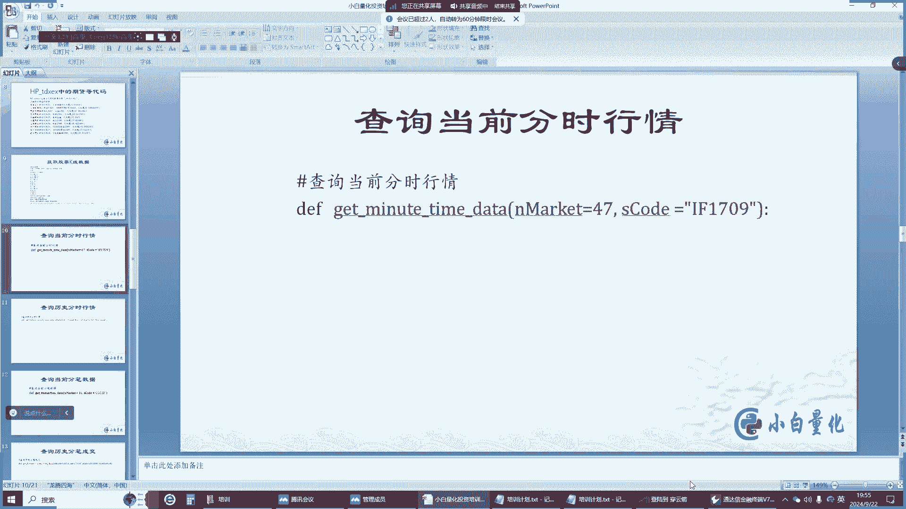

就是这个就是我们看到这个图形哎，这个叫实时分时图。

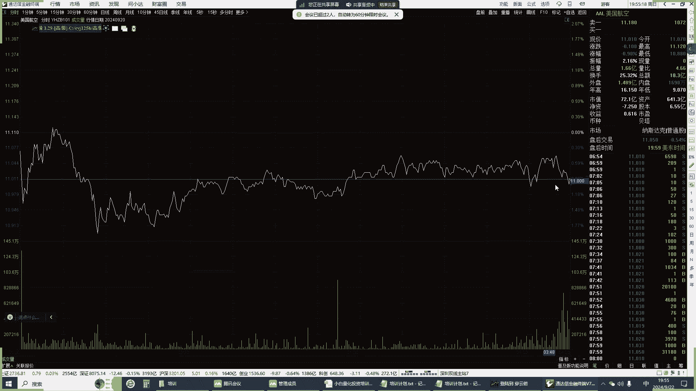

这个呢是历史的，因为历史呢每一天都有分时图，所以你要加个日期data，那几月几号的分时图，下来这个呢分比我们还可以读到。

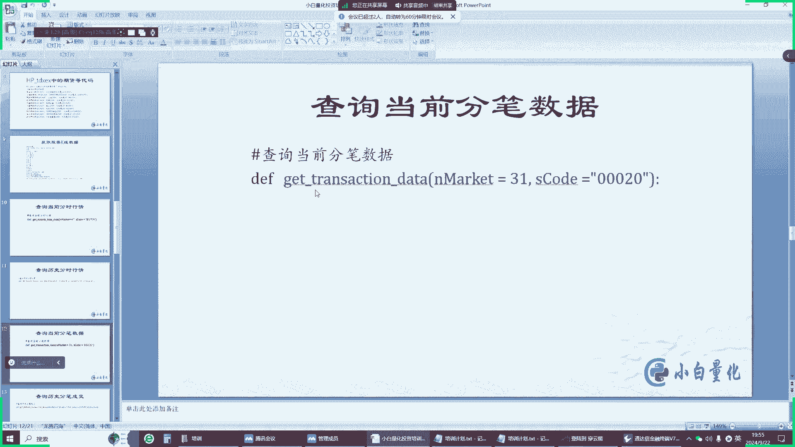

期货的分比数据分别在哪里呢，就是我们看到这个比如0650，这这是一笔一笔，这叫分比数据，看到没，我们鼠标的这个位置，这个叫分比数据。

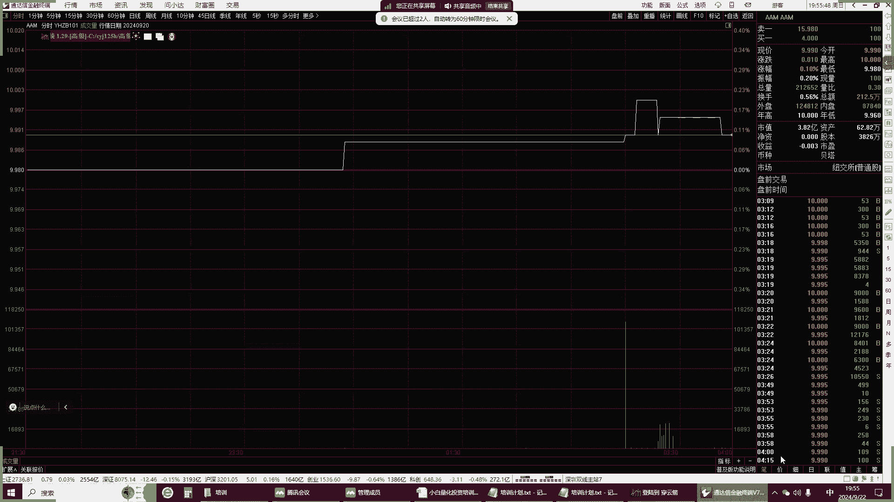

所以这个一历史分比，因为这是这是当天的分比，你要查那任何一天你要加上日期，所以简单不简单，这就是说我们刚刚学了这个接口还大，还可以说获取盘口。

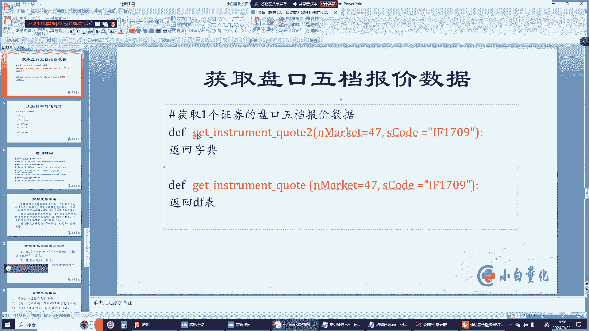

这个盘口是什么呢，就是我们这个上呢涨跌对于有些品种，有些市场它是只有买和卖，对于国内的一些期货品种，比如说白银，它是它这个上啊，他都是两档的行情，你看见没有些应该是五档的，这是就是这个盘口买入卖出。

所以这个行情软件看到的所有东西，你都能获取到。

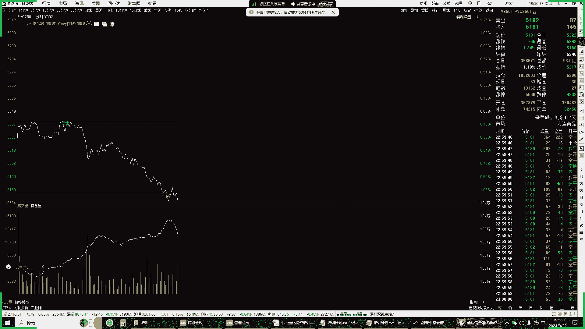

刚才给大家讲了，这个用这个的获取的方式，我们看一下，如果用天琴的话怎么做呢。

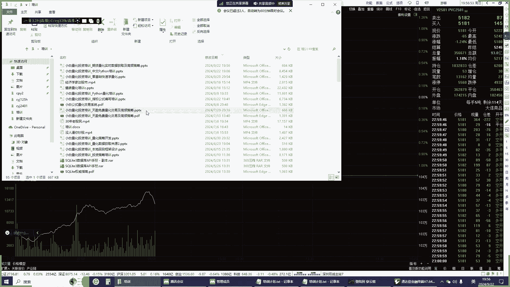

天琴呢是一个国内的易信科技的一个量化接口，它主要是做期货的，你比如说很多人在它上面做股指期货，全自动的商品期货，他都支持期权呀，他都全是支持的，所以呢天津期货呢支持股票和期货的实时行情。

它主要是针对国内的，这是他的架构，我们都不讲了，天晴呢，我们呢因为那期货股票，我们是不允许散户量化的，你就散户没有办法量化的，但是期货是允许散户量化的，我们只要在期货公司开个户。

我们就可以进行全自动交易，所以呢我们就可以用天晴的这个接口，天晴这个接口呢它本身它能够获取行情，也能下单，这是他的一个典型的一个例子，你要在易信申请个易进账户和密码，然后就能获取行情，获取持仓。

然后进行这是这是一个任务，就是一个任务，然后进行他这是一个调仓的一种模式，就是说你根据它是个死循环，就说你每一次update以后，你就能获取最新的K线，最新的持仓和最新的任务，然后再查些些状态进行下单。

一表示你就调仓你这个品种，因为期货它有多空，他会把你进仓调整为一，如果你本来是空仓，这个时候呢他就会买一手多单，如果你原来有一手空单，他会平掉空单，再买一个多单，所以他是调仓模式。

如果你原来有一手多一手空的话，他怎么操作呢，它就会再开一个多单，因为他是进仓模式，就是说总是你的多单，当你等于一的时候，你的多单就比空单多一，如果是一，表示你持有一个空仓，如果你是零，当你为零的时候呢。

你就表示你多空都没有，是零的，还有一种方式可能是多一手多单，一手空单，这种情况是因为啥，你是因为有预埋单，预埋单就会比如说你把多单对吧，埋出这些了一笔，他想平仓，平不了，他就会保存一手空单。

因为他是要求多空加到一起为零吗，他这是一种调仓模式，这就是说我们首要首先要在这上注册一下，就能用，那我们下来就给大家简单的讲一讲。

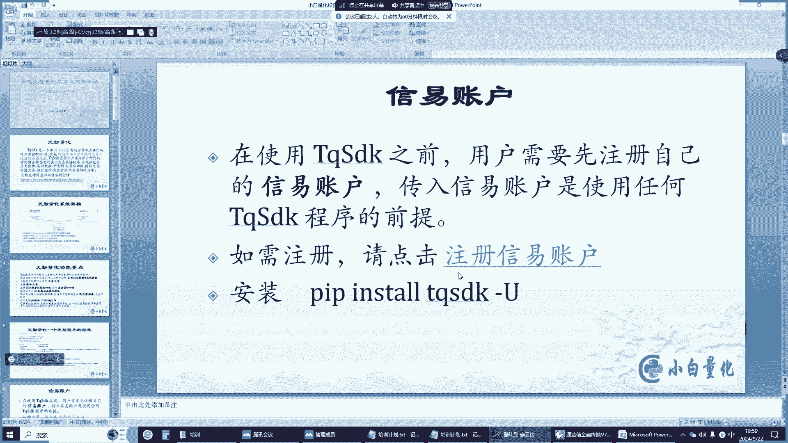

他还在回测，你看六脉神剑呢，这个回测的时间有点长哦，赚了7%额2%，仓位是0。1，我们就不管他了，他慢慢回撤，就如果挣钱的话，我们就可以进行交易。

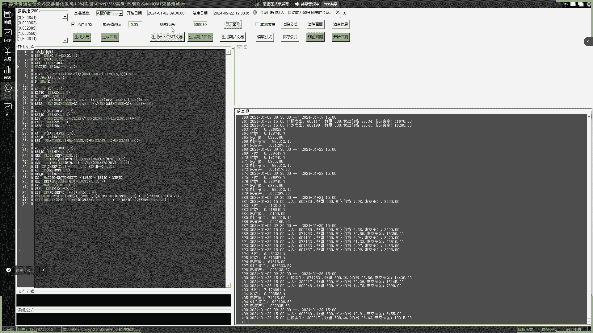

我们现在讲一些期货的例子，比如说我们想下载通达信的行情，我们看一下怎么做的，现在学习比以前前两年学习很容易了，为什么现在有差的GDP。

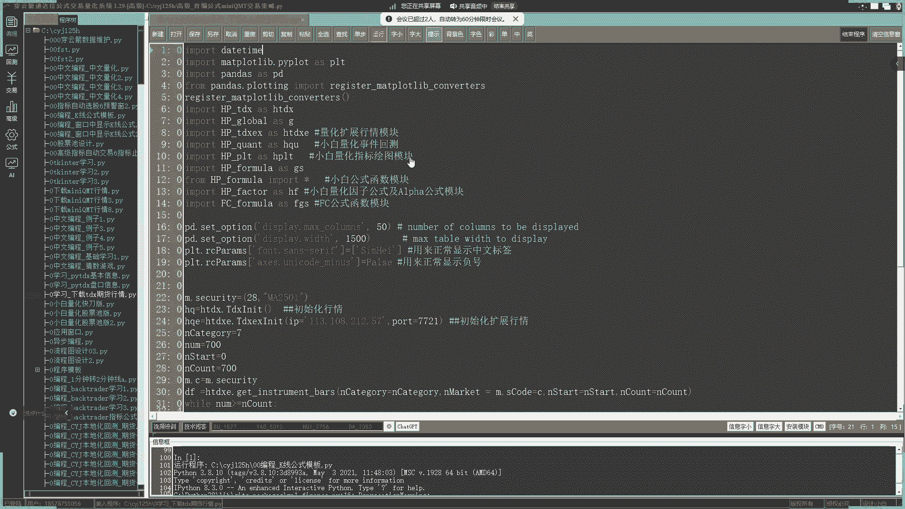

不论你想学公式，想学Python，你都可以使用差的GDP来实现，中国比如说有很多的免费的查的GDP，比如说文心大模新3。5，它本身就是免费的，当然4。0以上他是要花钱的，我们用3。0的就够了，3。

5就够了，我们比如说写一个通达信公式，25日均线上穿，10日均线差的GDP都帮你写了，对不对，这差的GDP都不让写了，那你说我想写Python对不对，那Python也可以帮你写吗。

Python你就首先选择一个，因为剧量化有很多的量化平台，你要指明，比如说我们用距宽，首先告诉他是距宽量化或者P吹的，比如我们用P吹的，用PETRA量化策略写一个，双均线交易策略，这个很简单。

他P吹的是，他就很快的帮你分析，哎，P吹的是一种量化平台，双均线，其实我们这应该加上一个什么，这不他都帮你写好了，但是这个能不能用呢，不一定能用，因为他分析的不够彻底啊，他只是认为PC的是一种量化平台。

那我们要改成巨宽呢，我们待会试试啊，看他他是怎么写的，用P吹的，他可能不认识P吹的，但距宽还是时间长一点，用区域宽，六六可玩宽距宽量化策略，写一个双均线交易Python策略，强调一下，我们看一下。

他可能就认识你看，因为距宽还是存在的，比P出的时间长一点，他帮你写好，你这个策略复制到一起，可以在矩块上用，也可以改一改，在穿云箭上用很简单的，其实呢我们不看他写了大写。

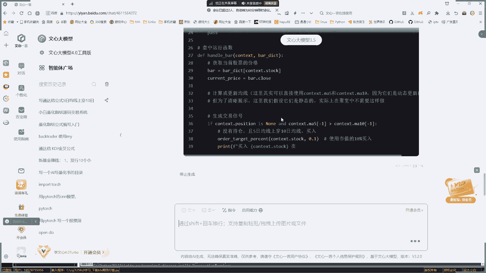

这这给写个大概，你会一下改一改，那在我们这样很简单，比如说我们读一个双均线的，双均线策略，或者我们读个凯迪结策略吧，比如说开低价交易策略，这是一个我们放大一下，大家可以看到，放大字体。

我们alt加他在回撤有点慢，这个传剑那个啥那个六脉神剑计算的要复杂，有点慢，我们不管他了，反正回测赚钱了，我们再交易，这就是一个开地结的一个指标，我们可以把它复制到。

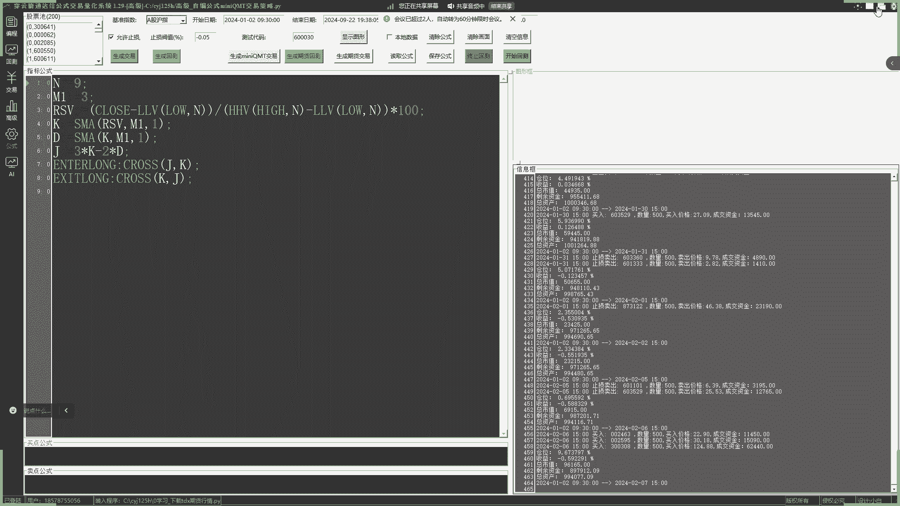

复制到哪里呢，嗯他现在写好了没，哎这个都又打开了一次，是不是好不看了啊。

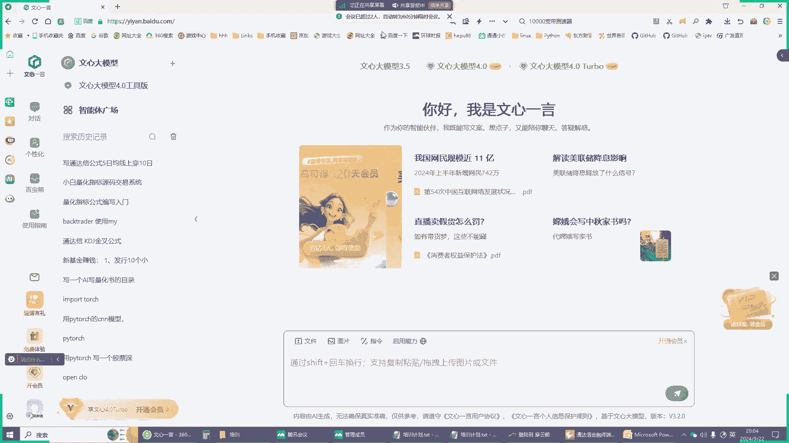

我们可以复制到传音，传音键上看一看，我们创建一个指标，用户指标TXTR1R二，就是我们刚才从六脉神剑里面复制了一个指标，这是一个指标，这个我们测试一下哎，通过了他的指标名字TXT022。

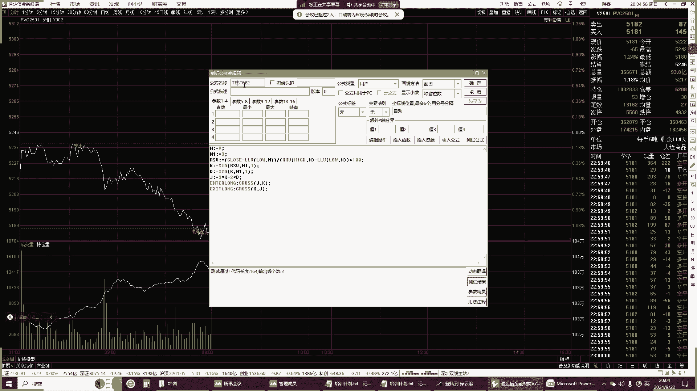

我们看一下。

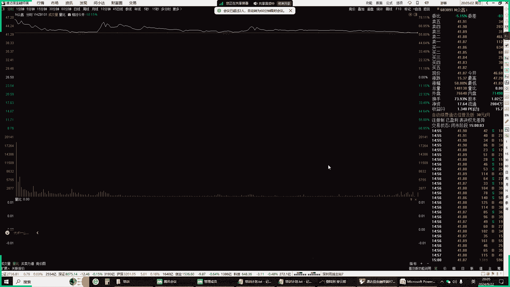

这是个新股，我们看TEST022诶，这个就是一个交易指标，白色的信号呢就是买进黄色的是卖，吃出白色的信号，买进黄色的脉出，你看买进卖出，因为他是K底节嘛，我们不管他准不准，因为他是一个指标K底节指标。

所以呢米哥买进卖出，我们看下哎，我们想把这个写成一个策略怎么办呢，很简单，直接复制到川建里边，然后在在在哪里呢，在这里点一个生成mini k mt，生成同花顺，那你说我没有mini k mt怎么办。

我就生成同花顺，他在他这个回测，表示要在回测面板的一个自编公式。

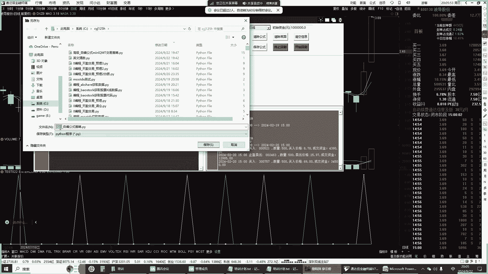

我们看一下，回测交易哎我们读入我们哎我看看啊。

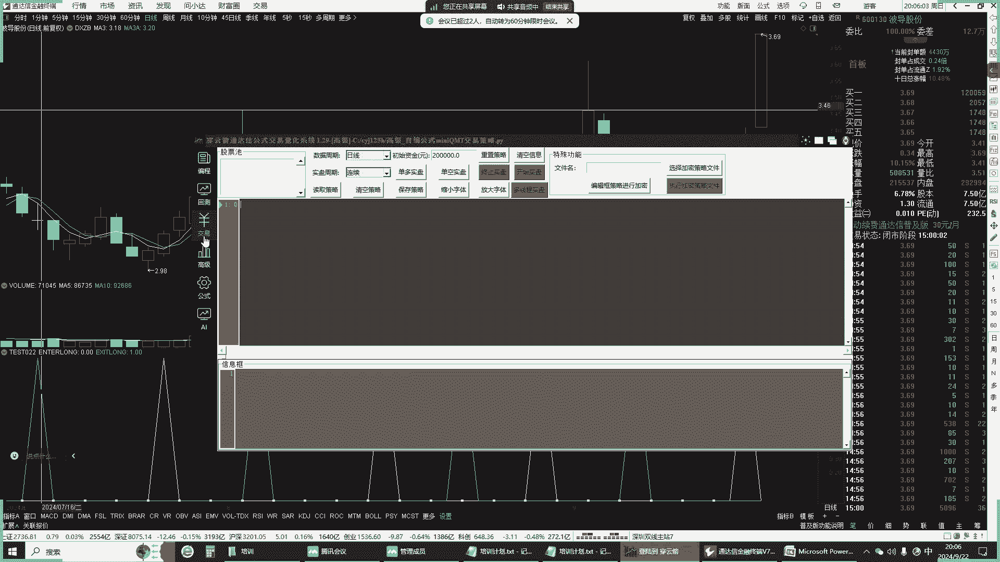

生成交易啊，我们刚才也生成回撤了，也生成交易，我们生成个交易，我们读入以后，刚才这个公式我们把它打开看一下。

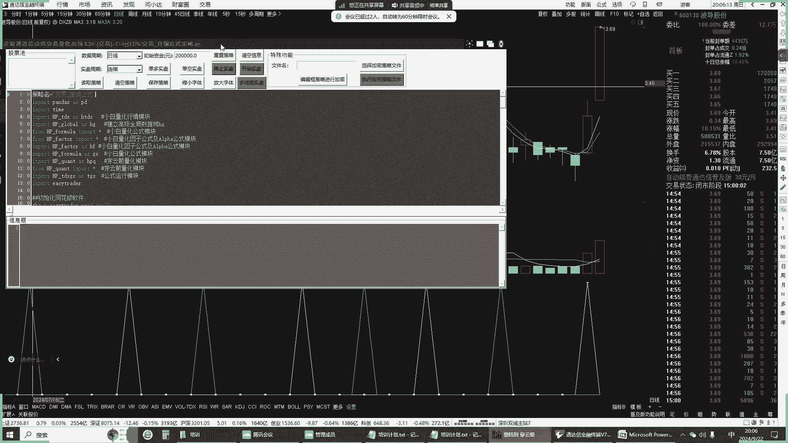

把给跑哪去了，看下最大化吧。

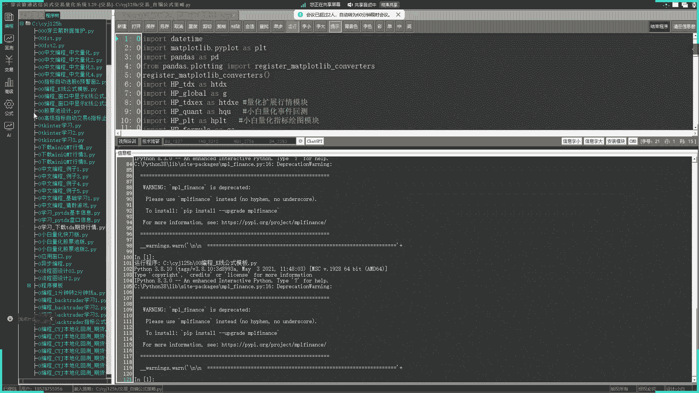

我们看一下啊，在交易的模式下，我们刚才一键生成的一个策略，这个策略在哪，他就连接同花顺可以全自动交易，这个指标就是我们的买卖逻辑，它就会根据泰迪结的结上穿K买进，K上穿结迈出，简单不简单。

我们拿到这个东西，只要改变啥，我们改变下单的数量，它默认是500股，我们把股票改成200股，我们把他的止损改一改，比如说五觉得太大了，我们改成三型平滑点是不是有点太大了，改成1‰型平，最大买50是首。

这个因为我们这不存在熟的问题啊，因为这个主要按照期货来讲的，因为期货有个限制，不允许他这个上没有用到，因为他这按200的整数倍进行全自动下单，这就是他的一个完整的一个逻辑，这个可以根据KD结全自动交易。

所以今天现在讲到这，你已经学会了量化了没有，很简单，会中文就会量化，那你说老师这个量化是英文的，我看不懂，看不懂，实际上就是些关键字，你不懂吗，对不对，这些关键字不懂，鼠标右键点一个中诶。

把这些关键字全部变成中文了，对不对，那你说这咋是西文，这是人家的规定，对不对，那你说这也是西文，这是人家的规定，也不能随便改一改了，他就没这个函数了，你改成中文，咱哪有这个函数就不存在了。

但是他把这些Python的一些指令，比如输出print，它就变成输出了，对不对，他把一些循环如果if对吧，如果这个不在这个day这个数据中继续continue嘛，如果这个我也可以改，也是中文。

但我写可以写成中文，我只是用英文代可卖数量的，那我直接写成中文，可卖数量，这个变量名字你可以随便定义，那是不是就变成全中文的了，只不对不对，我们还可以觉得哎这如果我觉得别扭，那我再点个英。

是不是他又回来了啊，是不是这中英文学习，你还用写注释吗，你还用写注释吗，你只要是全中文就不用写注释了，有那敲注释的名劲儿，还不如写中文代码，所以一键恢复。

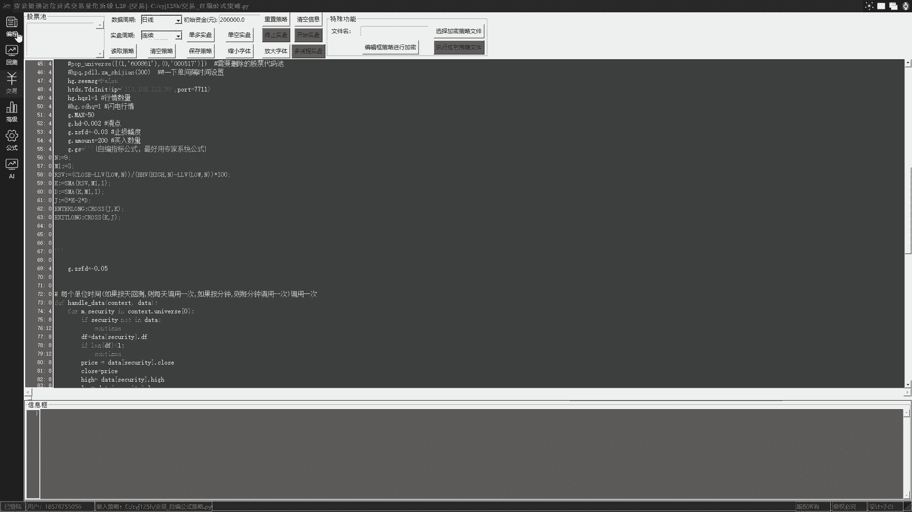

刚才那个回测测那个就是交易给大家讲了。

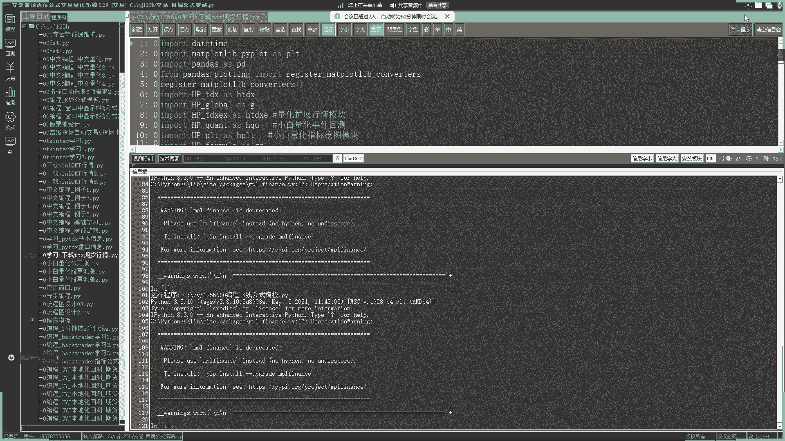

如果现在问题，现在给大家先讲一个指标公式的源码，一个实用的问题，给写个额，这事如果大家有兴趣可以加我的微信啊，18578755056，你知道吗，以后对创建有兴趣也就加我的，这个。

我现在给大家讲怎么样在策略中使用公式源码。

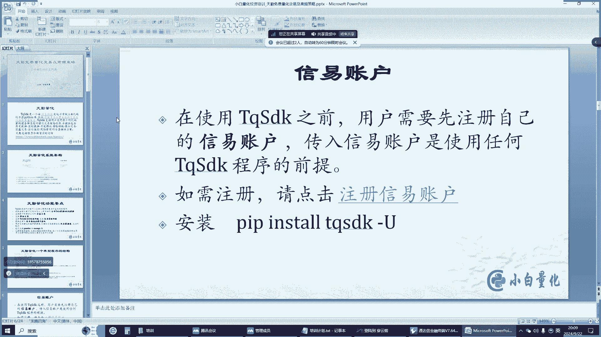

因为我们现在就给大家讲这个问题。

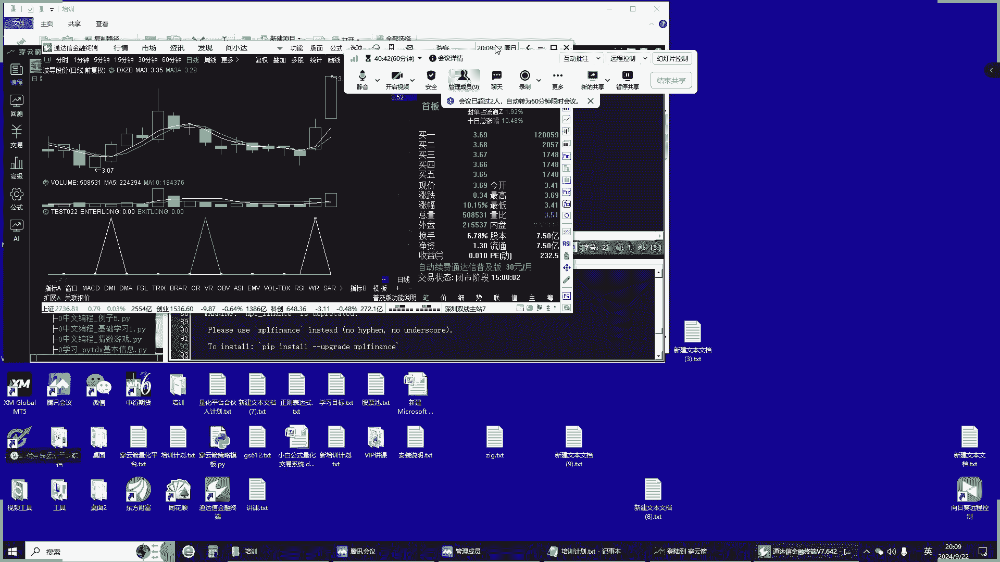

因为不论是期货和股票还是外汇。

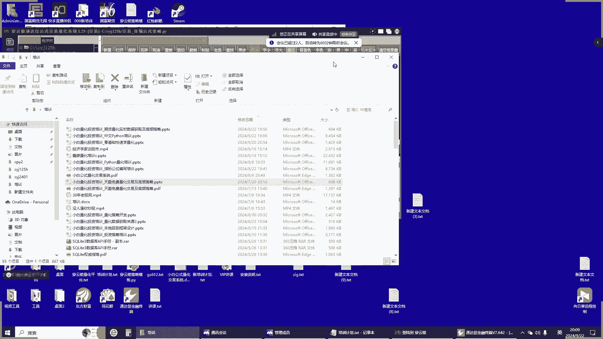

我们最最好用通达信的源码去计算，因为你不用去管了，要不然太麻烦了，这里面有两个例子，这个里面我们可以找到编程里面的hp公式，其实呢穿云箭有三种，三种公式的源码运行，我们主要hp和谱合谱。

就是我的网名独狼和谱的意思，hp你看所有的hp都是和谱的模块，所以是我设计的，所以呢第一个你把指标公式的源码变成文本，我们重新做一个例子啊，我们怎么做例子呢，我们第一个鼠标右键在新选项卡打开。

是不是我可以跟哎其他编辑器啊。

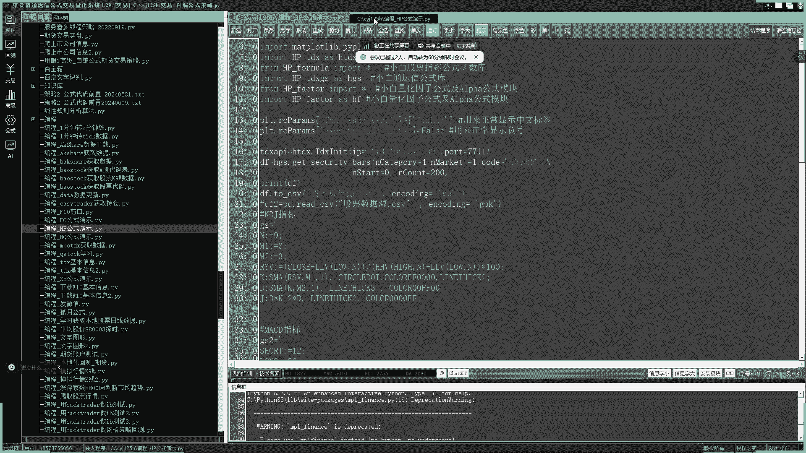

我可以打开很多次代码，我们还可以打开其他的选项，是不是啊，如果我们不想要最后选项后面有个叉诶，它就关掉一个选项，那我们打开一个备份。

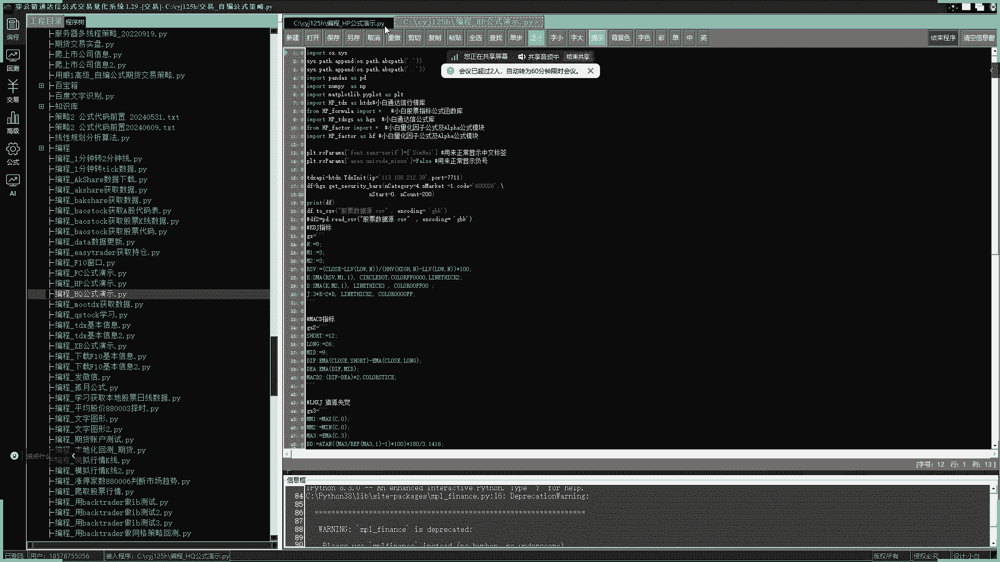

然后呢把我们这个打开new嘿嘿。

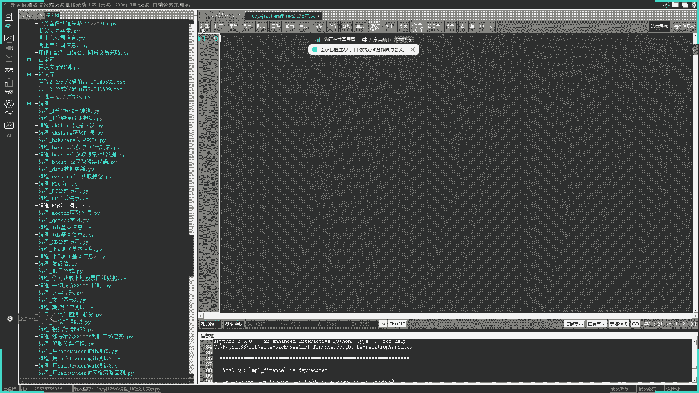

是不是新文件，我们复制一个新代码，我们把它照猫画虎的复制一下。

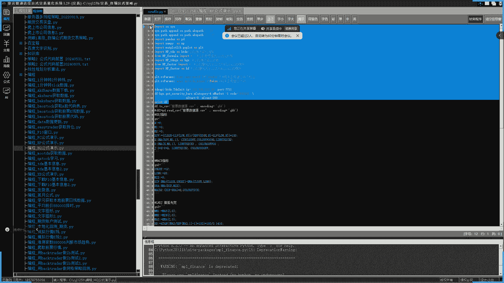

哎我们把它变成中文的一个，对不对，这些都不能改，这肯定不能改，这是人家pt t哎，就是人家那个PPT的模块的一些定义，你改了成中文都不认识了，所以这不能改，这个地方可以改吗，那可以改吗，这改成这叫。

行情接口，这个叫什么呢，这个叫做K线，这是什么K线，四是日K线，对不对，我们输出什么呢，日K线我们运行一下，首先我们给大家讲怎么去获取行情，嗯这个里面没有读到这个东西，啊我们先保存一下啊。

另因为没有保存到另存，另存到传一件这个目录下，要在这个目录下运行，否则找不到它下面的模块，我们叫做期期货额，股票行情我们叫行情演示吧，好像演示一，我们保存一下，现在就可以运行了。

哎我们读到了哪只股票的行情呢，上海股票的600026的行情，那你说我现在想用期货期货怎么办呢，我们打开打开我们的看看我们那个PPT。

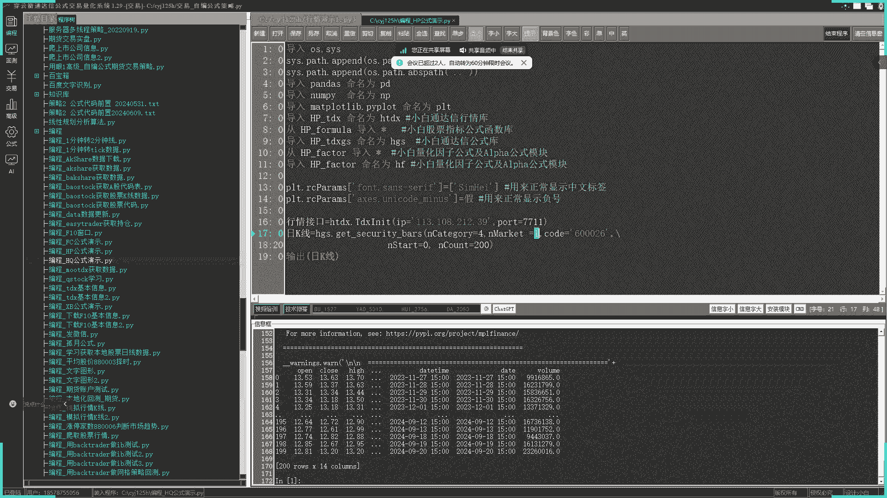

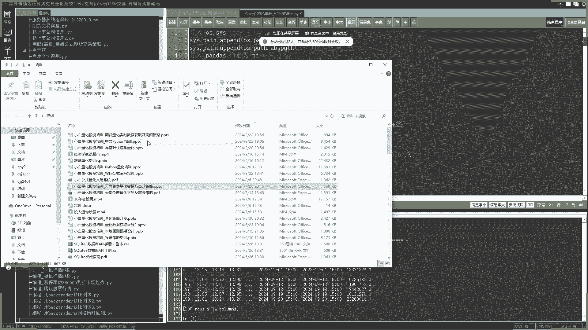

实际上有文档，我们有个文档，我们连接期货站点行不行，我们把它复制一下。

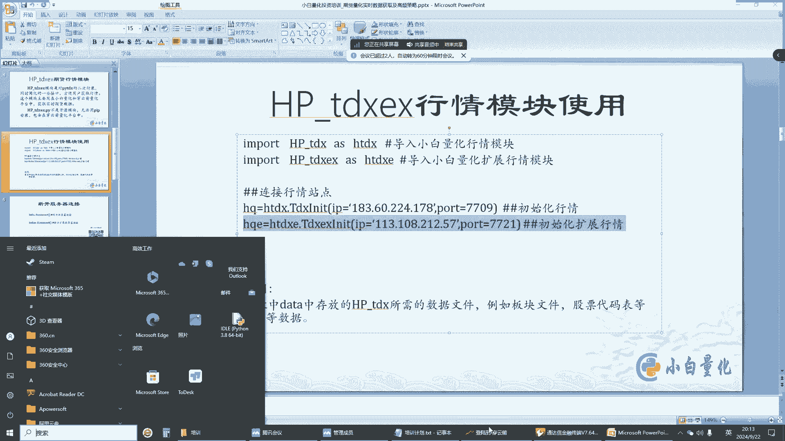

首先我们看这里面有没有它，这里面都没有，我们复制一个行情，我们做一个ex，下面叫做这个，哎我们是多了一个行情，这个时候呢我们叫做期货行情接口，其实呢这个可以这两个接口可以不定义，你定义了。

你就可以使用PY通达信函数的内部变量，就是说你可以在官网查到的所有的东西，可以都使用，比如说我们打开PY通达信的一个官网，你只用它，比如说行情接口点，PY通达线的所有的内部行情，你都可以使用。

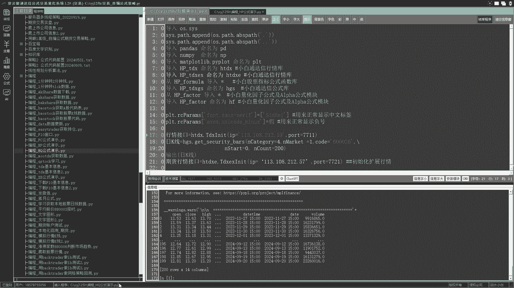

我们找一下它的官网数据，好起股票，哎我们，扫吧从这扫吧PPT里找的更快，PPT里面介绍了，这是他的官网的一个站点，这是里边官网，我们看到他标准行情，比如说他这里面的接口，它叫API。

我们呢就可以直接去使用了，比如说我们使用这个对不对。

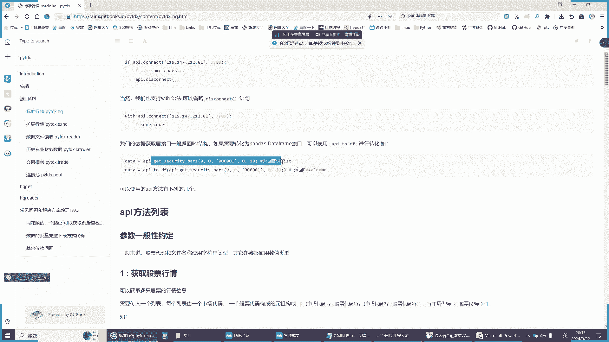

因为我们有什么有它的接口的东西。

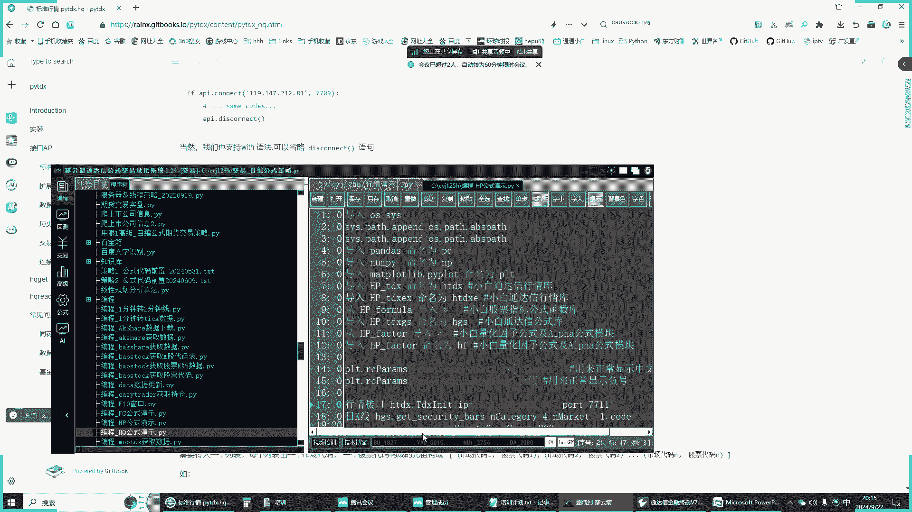

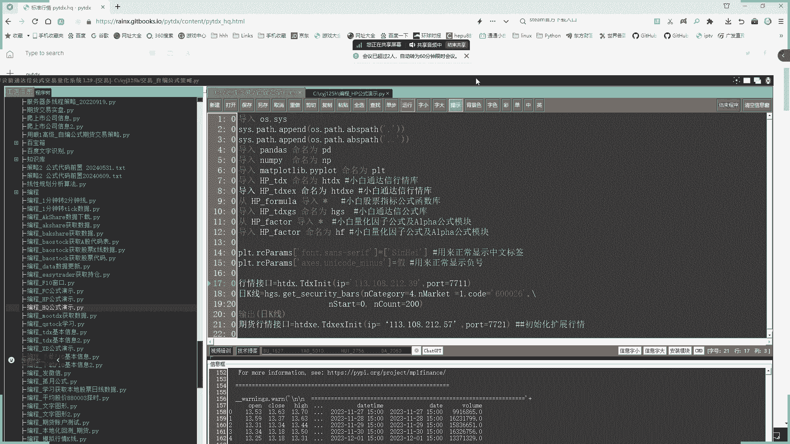

我们不是有行情接口吗，行情接口点诶，这是他的一个信息，我们给他数据叫数据，数据等于这个接口，我们其实呢也可以在控制台上运行，我们可以看看这个数据是什么东西，复制粘贴，哎他返回了个字典。

是不是这个数据这个指令从哪来的呢，他是从人家的PY通达信的原始官网获取的，所以我为什么可以定义呢，行情接口，你行情跌接口点。

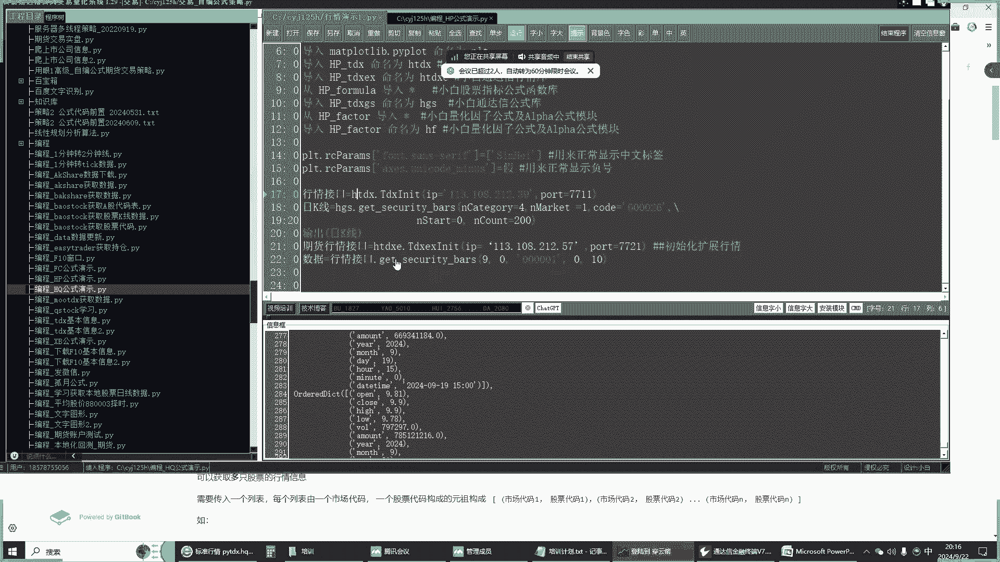

人家里面的所有的功能你全能用，比如说我们把这个字典转换成一个data form数据框，对不对。

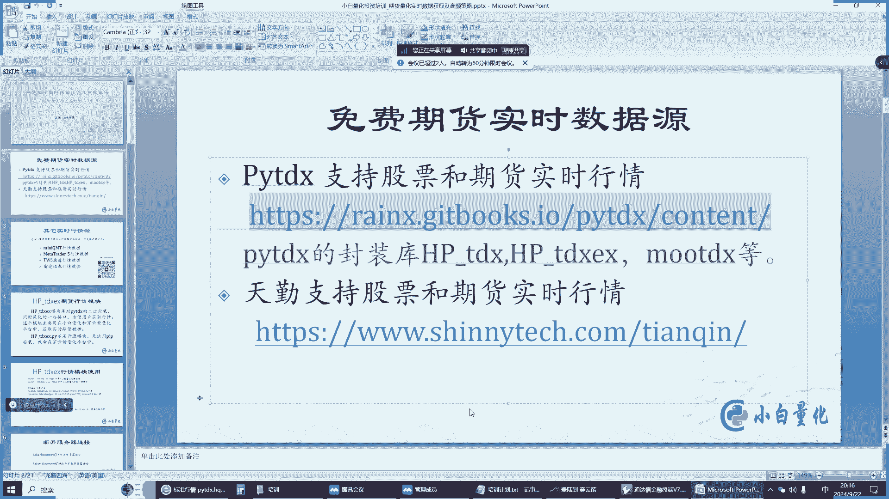

我们就用他的这个接口，实际上我们给大家提供了丰富的功能，我们叫数据二，等于等于什么呢，行情接口点to df，这是人家的内部接口，这是行情接口啊，不是这个直接就用这个就数据就行了，它等于嵌套了。

我们直接用这个数据，它会把数据二，我们可以写个输出或者打印，输出什么呢，数据二我们运行一下，刚才我们看的数据是字典，I a p，好这是个中文，我们从那里面复制出来，它就变成中文了，他盘pt t那个叫啥。

他把那变成我们保存运行一下，哎他读到什么，他读到的股票的一个数据，这个数据呢是日线数据，对不对，这是九，九不一定是日线数据哦。

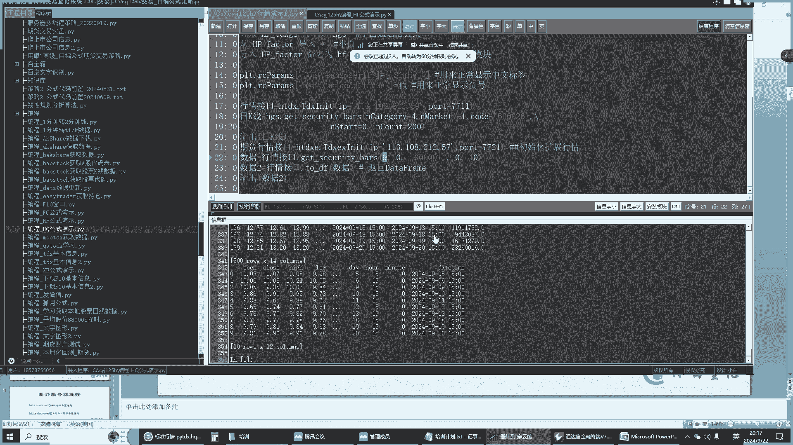

我们看一下它的接口，我们先不管了，现在我们想读期货的，那期货的也可以读啊，我们刚才讲了元祖，那我想读小米的，对不对，小米的行情怎么读呢，那我们就用这个。

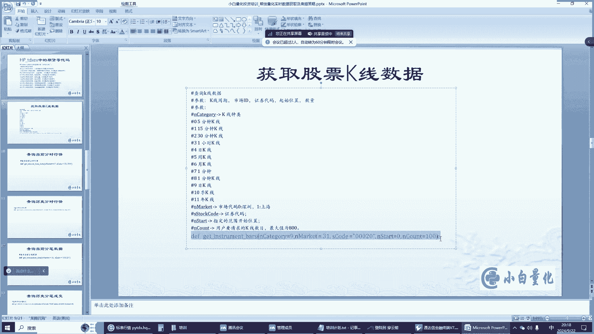

小米是不是港股，我们先把这个接口复制过来，我们小，行情小米行情是什么呢，我们用这个扩展行情，因为它是小米行情，是港股吗，也普通行情只能读深圳和上海的股票，港股呢你就可以读这个三幺，我们不用三幺了。

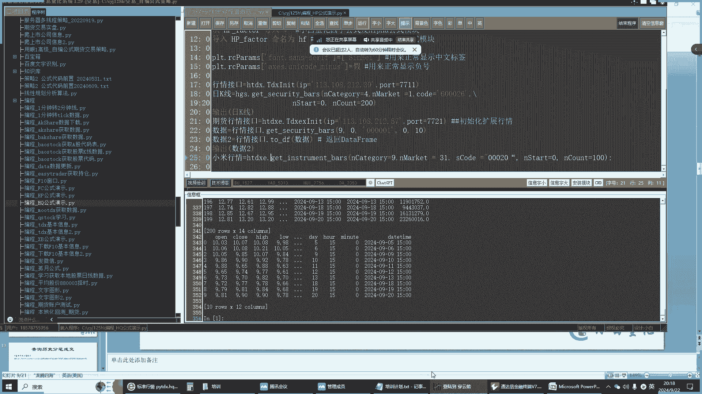

我们看看小米集团的编码是多少，小米集团的编码是三幺好。

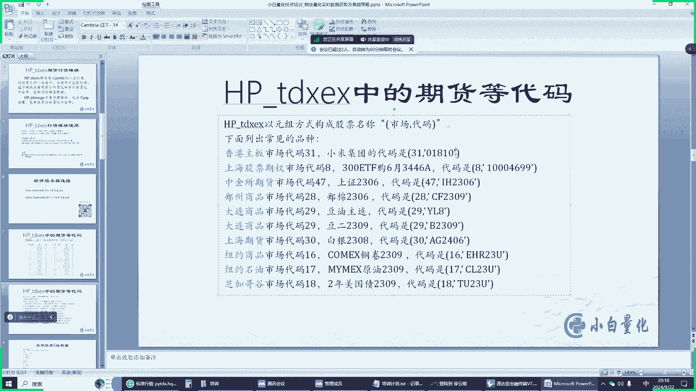

就这个我们把它复制过来，然后变成，它又变成中文了，我们暂不开通啊，我们用默认的吧，四是日线，我们看一下输出一下小米行情，这个就是小米的行情，他的最新数据是20号15点收盘的数据。

我们看一下小米的最新价格，收盘价，没有它，我们看一下它的开盘价，19块八，代码是01810，小米集团，它连接扩大行情，我们看到底下这个十字光标，开盘价19块八，最高价我们看一下啊，最高价20块二。

是不是跟我们这一样，我们这个精度高点四舍五入，你省去两位就是最新的数据哦，然后呢是最低价，我们下来看一下19块七毛二，对不对，收盘价19块八毛八，我们这个隐藏了，我们想看的话很简单。

小米集团点close，是不是啊，19块八毛八就是我们这个平台，即使中文的，你可以编辑调试，他本身本身就是Python的一个普通的IDE。

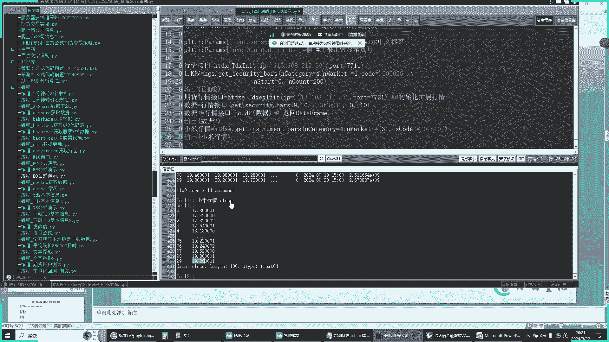

因为时间的关系呢，我们给大家简简单的简介绍了一下，他的一些扩展普通行情和扩展行情，天琴呢这个来不及介绍了，因为时间的关系，我把指标给大家发几个，比如说大家刚才有有人对六脉神剑，指标公式感兴趣。

那我就发给大家一个，发给大家一个六脉神剑的一个图形指标，再给福大家发一个六脉神剑的股票的交易指标，因为这个交易指标我改好了，因为在交易系统下。

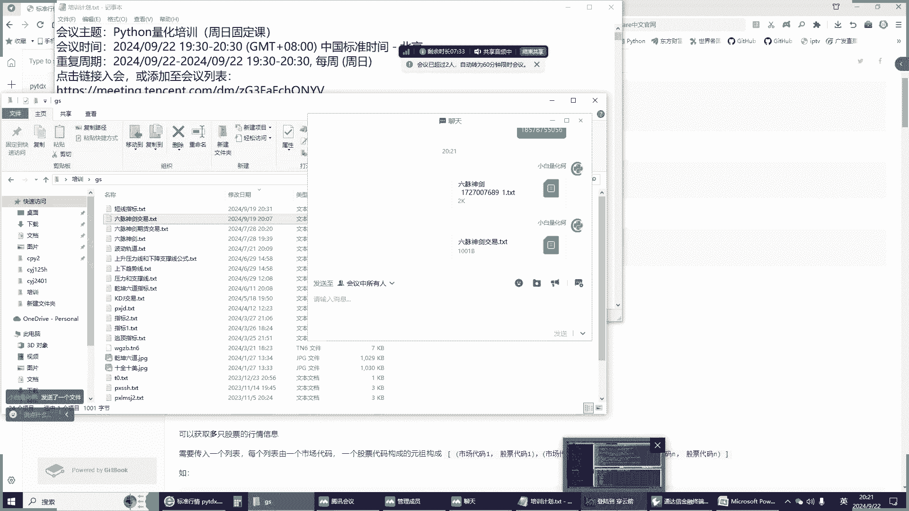

你没有办法去做，我们看一下，比如说我们打开六脉神剑，这就是六脉神剑的指标公式，然后六脉神剑交易呢是什么样子呢，六脉神剑交易实际上就是个买卖信号嘛，他就给你了一个买卖，但是我们是这是做的期货啊。

我们只看前面的白的和黄的，白的买黄的卖，我把后面屏蔽了，屏蔽很简单，加一个中括号就变成注释了。

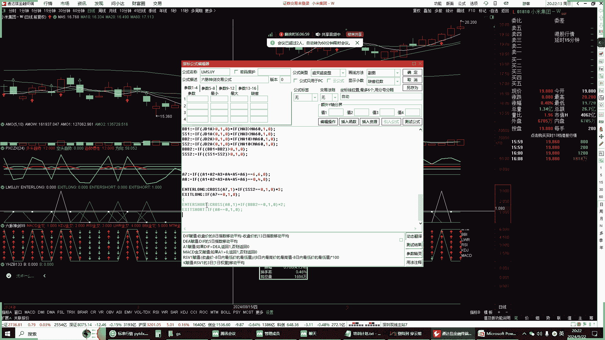

这就是他的买进卖出，买进卖出买进只要出现黄信号就卖，出现黄色信号卖的，因为我们是成对的，没有买你就买不了。

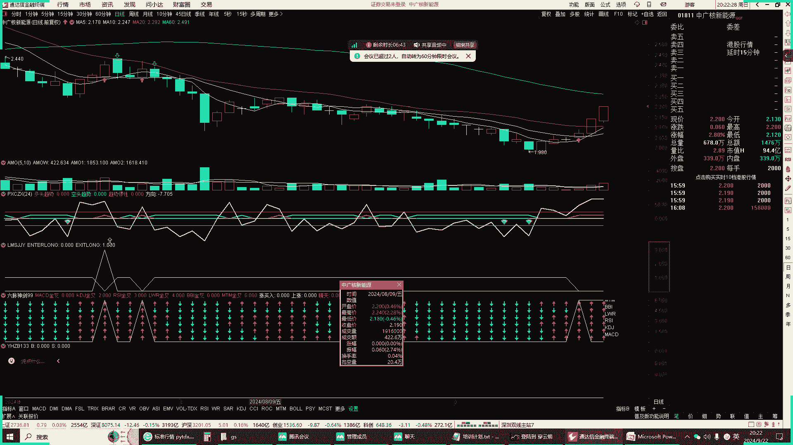

卖不了，我们看一下，六脉神剑交易，六脉神剑交易，这就是六脉神剑的一个交易公式，他只要他是完全使用公正的方式，对不对，这不是跟我们网上看的六脉神剑是一模一样的，这个指标这么复杂的。

你要把它写成改成Python啊，你怎么去改成Python这么长的，很多人就教你学Python，你现在这些这一行数据，你怎么把Python写出来，用不用写不用写，直接把代码一复制就完了嘛，这是源码。

就你说这是个股票交易，那好嘛，那我就把你一复制，对不对，复制到我们这里面，现在刚才讲用这个公式另存为，我们叫哎我们叫行情二吧，这是六脉神剑公式，我们怎么样放到这里面运行，我们就用一个哦。

我们把开立结改成六脉神剑的交易公式，这就是个文本，你需要做什么。

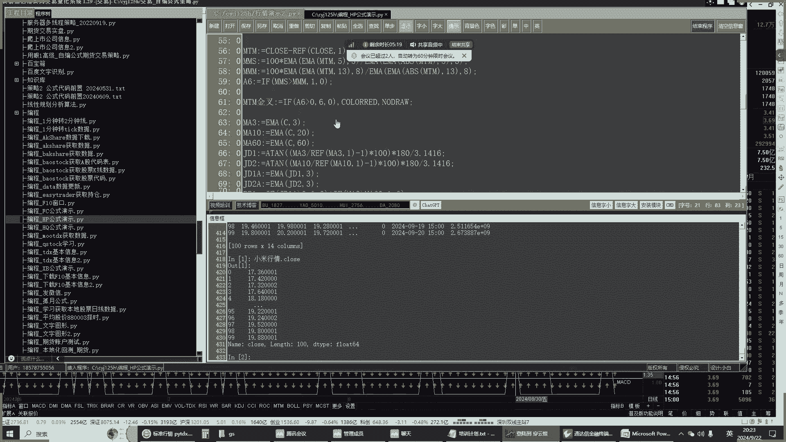

什么也不做，我们保存一下，运行一下，它的指标一就变成了六脉神剑的买进，买卖买卖简单不简单。

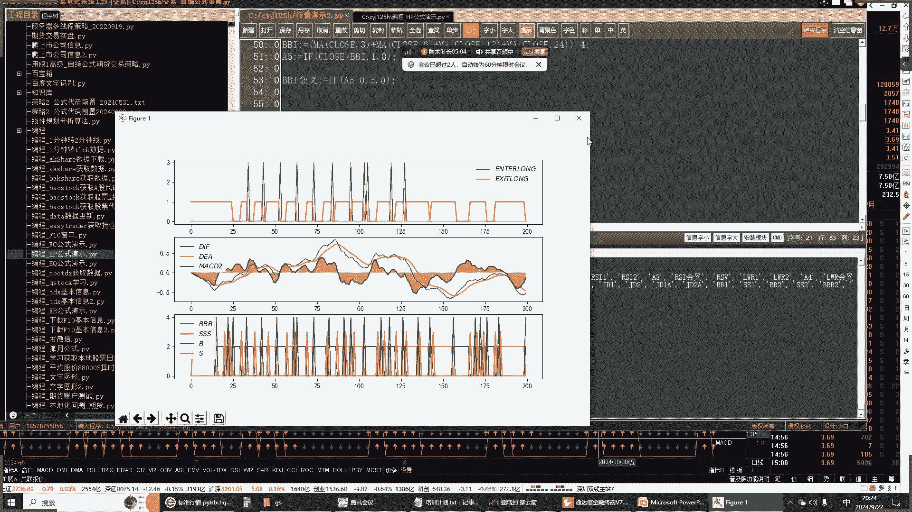

我们这个指标是因为把K线图给占了，我们把K线图给干掉了，我看看哦，K线图六脉神剑怎么把K线图给干掉了，有一个主图指标啊，它没显示K线图，我们不管了，它没显示开线图，这里面想显示K线图也很容易啊。

找一下这些模块就复制粘贴PLT要有，这里面有没有找，这没有K线图，我们看一下，找个K线图的，学Python就是有很多的例子的积累，复制粘贴，找到它的代码，在另一个窗口打开，复制粘贴就行了。

怎么没有K线图了，交易编程，刚才我们那个学习算了，运行一下，还有3分钟了。

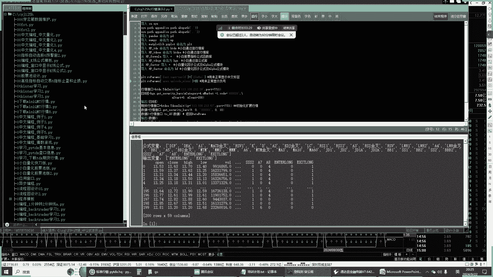

中文量化哦，我们用这个也可以做，现在我们不先不管了吧，先就把这个刚才那个例子再运行一下，就说K线图实际上就是一个模块，你只要调用就行了，这就是我们六脉神剑的指标，你得把源码，你看他源码在这放着。

你自己把它写成Python，很多人叫你学Python，你学猴子学到猴年马月，能把它全部翻译成Python语句，让它能够准确的运行，这都是一个难点，我们这都不需要他怎么做的，就给大家讲一下这个原理啊。

首先你定义一个你要导入这个模块，就是导入一个公式模块，这个叫做通达信公式库，你要把这个模块导入它，这个模块呢主要是解析指标公式的源码，我们看一下这第一步，第二步怎么办呢，我们要创建一个公式对象。

因为它里面有个通达信公式的一个对象，他第一个字母大写，我们叫做通达信TGS1，这是一个对象，把我们的行情加载到这个对象中，这是第一步，第二步运行我们的穿云箭指标源码，它会返回来一个新的表格。

这个表格里面已经包含了什么呢，六脉神剑的输出数据，我们看一下他，六脉神剑的输出数据已经已经显示出来了，对不对，这是他的买卖逻辑，前面呢都是前面的数据，他在前面的数据加了六脉神剑的计算指标。

的这个买卖逻辑，所以我们根据这个买卖逻辑进行全自动交易的，所以划线呢实际上就是一个指令，记者在，区指标区，因为我们有三个区域，你看他都是Python的一个命令吗，我们做了两个区域，三个区域公式1ax1。

绘图区一一般做主图指标，绘图二绘图三我们有三个，所以我们这个地方显示在绘图一或者绘图二，画我们的指标线就是我们实现出来的这个东西。

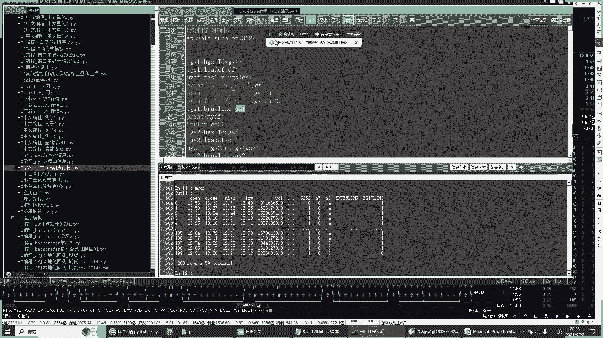

所以我们学量化简单不简单，你想画个指标线，第几个区域，第几个区域画，随便画指标线就能显示出来。

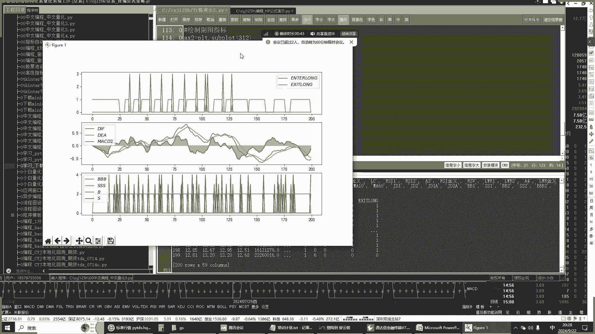

因为时间的关系呢，今天还剩不到一分钟时间，如果大家对穿云箭呢，小白量化或学习中文Python有兴趣的，可以加我的微信，18578755056，大家还有什么问题呢，也可以提出来，可以加我的微信交流。

这就是说我们学习呢其实学习很简单，就学习中文Python中文量化啊，而且中文量化里面跑的指标公式源码，学什么什么也没学，学会指标公式一小时就会学习中文量化，我估计一天就会学会了。

语法你就能看别人懂别人的程序修改。

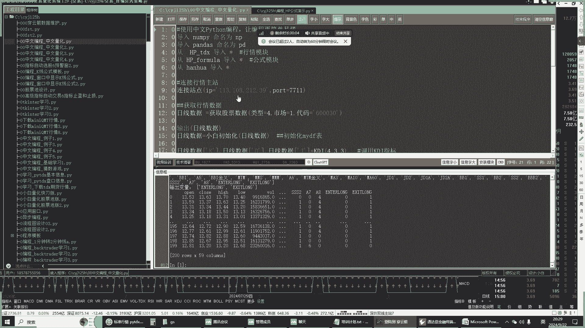

你想再编程，那你自己再百度一下。

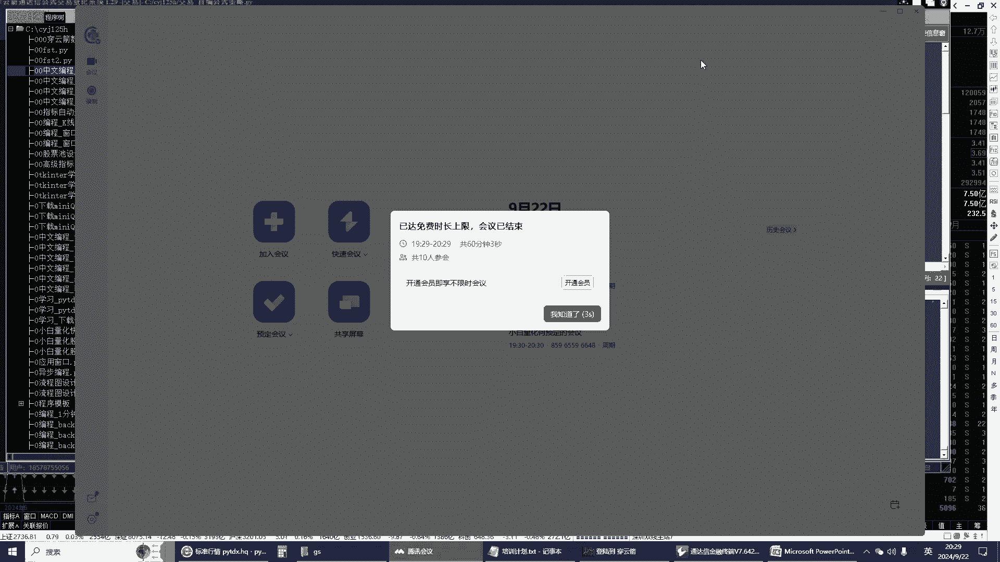

今天的讲课到这里。

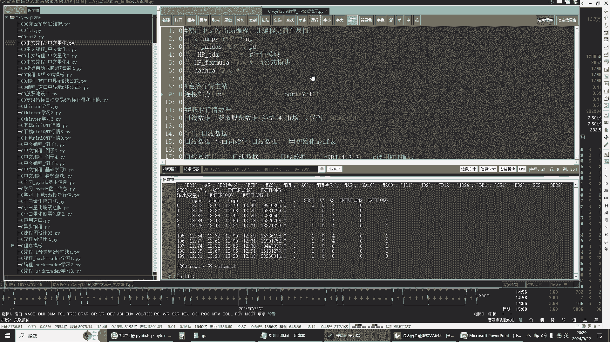