# 20241006Python选热点股及发QQ、发微信等 - P1 - 通通小白 - BV1jm1BYsED5

好我们现在开始给大家讲，为什么要学Python量化呢，首先我们要了解为什么要理财呢，因为你不理财，财不理你，什么叫理财呢，首先我们要了解在犹太人，很多犹太人为什么有钱，因为他们从小学习理财书籍。

谈不得书中有这样一句经典的建言，赚钱不难，花钱不易，这个意思是掌握了赚钱的智慧，赚钱就不是难事，掌握理财的法则，花好钱才能可能让钱生钱，这就是理财，理财呢是指通过合理分配自己的财务资源。

获取最大的财富收益，财务收益实现个人的财务目标，理财的内容包括很多了，是指的资产配置，投资管理，风险控制方法，可以通过投资股票基金债券，房产等方式投资，学会量化投资呢，做自己的财富主宰，有一句话。

盛世理财乱世黄金，在盛世的时候呢，你理财投资，因为经济繁荣向上，你用投资的方法很快的能聚集财富，在中国，现在的股民大概有1。66至2亿之间，A股的总市值已经达到89。67万亿。

炒股和做期货是自己的主动行为，跟自己的能力有关，基金理财信托是别人帮你炒股和做期货，你看上了别人的利息，别人看上了你的本金，所以呢学会量化投资，做自己的财富主宰，学会量化的很多好处我们就不说了。

另外呢学会Python量化开发呢，你也有机会获得高薪收入，以前的职业分为蓝领，白领，金领，金领就指华尔街金融行业的高级职员，所以他金领最高的，所以你要懂得Python量化，那你能收入很就更高了。

一个在去年一个量化私募发了，给一个量化人员发了5000万的年终奖，所以量化人员的收入非常高的，如果一个普通的人想快速进行量化怎么办呢，你要具备以下的知识，一初中数学统计学知识，二初中物理学知识。

三中文Python编程能力，四金融知识和交易规则，五策略研究能力，这是一个量化所需要的，上一堂课我们已经讲了很多了，比如赚钱的程序的实验过程，然后一些股票数据，实质数据的都是获取方法。

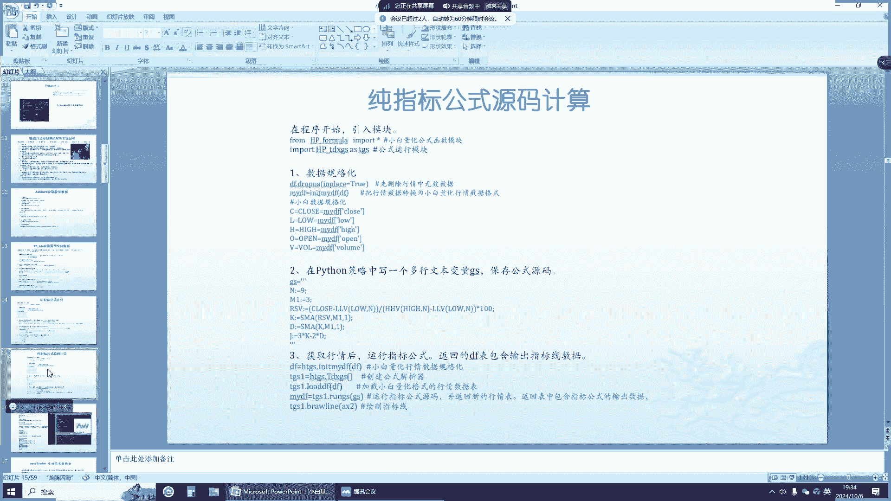

今天呢我们简单的给大家讲一下，中文Python一个编程，我们中文Python编程呢主要是用穿云箭量化平台。

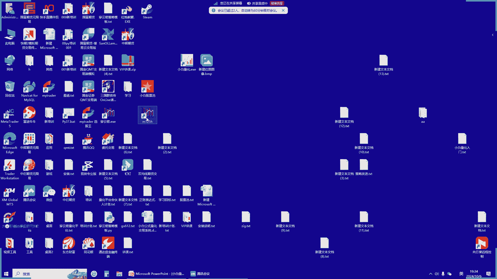

我们给大家记一下。

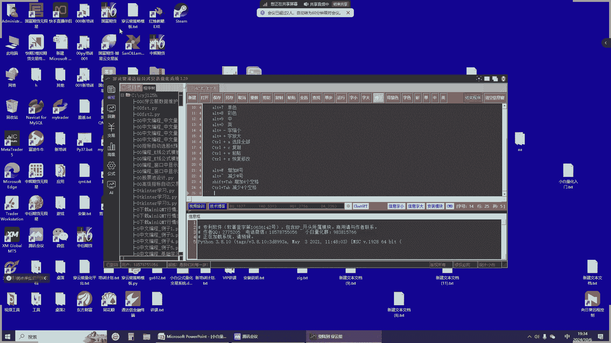

这个就是创建量化平台，创建量化平台呢它本身编程编程就是Python ide。

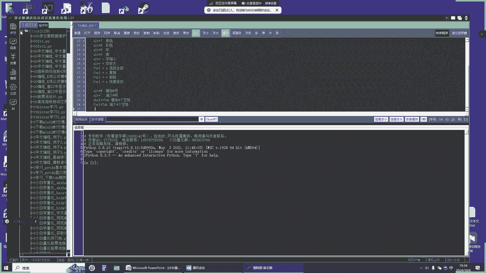

它本身支持中文Python回测，就是一个量化回测面板，交易面板和高级交易面板，还有一些公式，比如说我们直接可以用公式进行回测和交易，股票，比如六脉神剑，你也可以读取凯蒂杰什么，你任何自编指标都可以做。

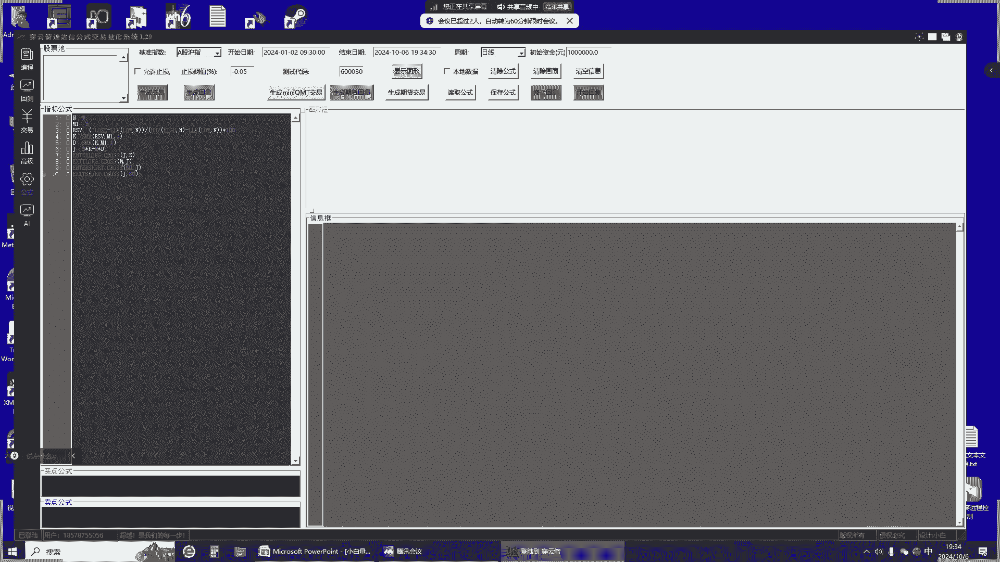

另外还有一些AI的编程的一些功能，你可以写一些AI的一些算法，所以这个很多的比如说股票啊。

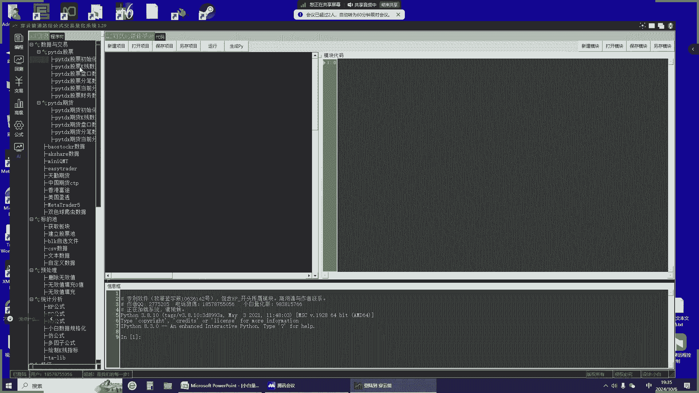

期货啊，这些都可以去用，我们主要是先给大家讲中文编程。

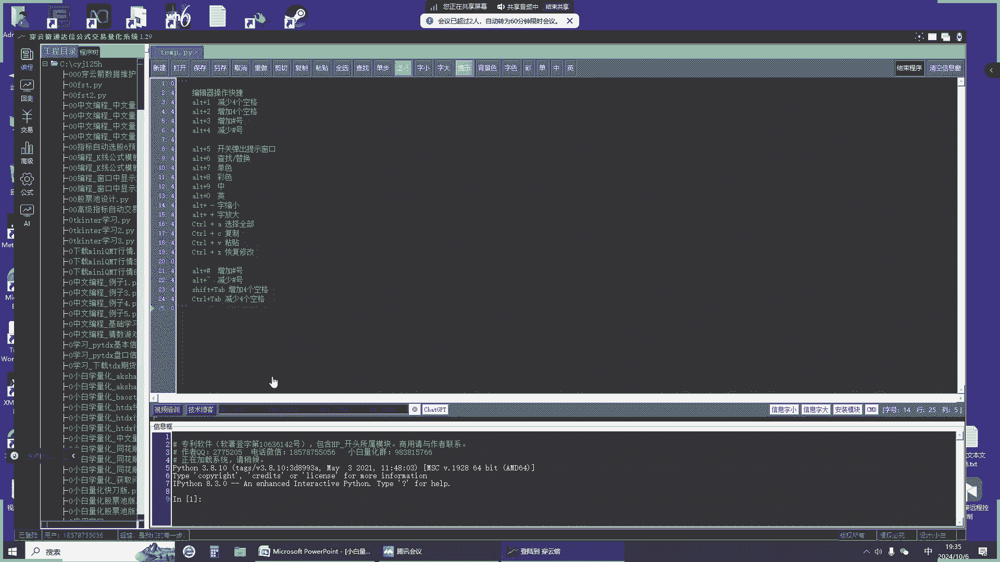

成我们看一下中文编程的一个例子。

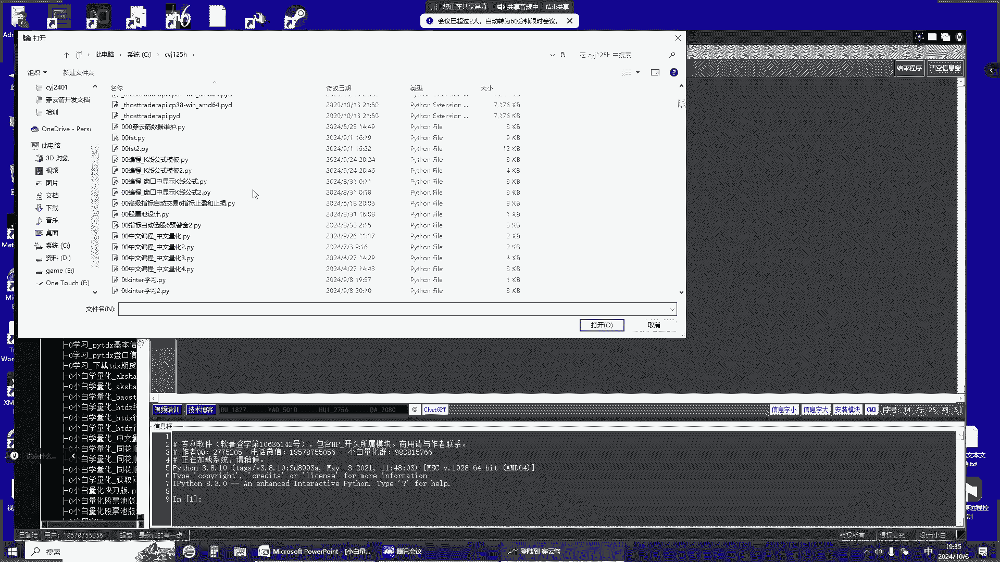

这就是一个中文编程的例子，因为本身呢他全是中文化，他把Python呢关键字中文化了，比如说导入import变成导入as，另命名为命名为，就是导入NUMPY这个模块命名为mp，这样我们就能用简写来写代码。

然后这就是占我们的关键字函数都可以汉化，比如说我们的变量起名就是中文，比如日线数据，你也不用用什么英文写了什么cl杠data写，那干什么，还得在后面加个注释井号日线数据。

那我们中文编程直接写中文不更简单，对不对，我们所要关键的就是提示我这一行在干什么，讲这个逻辑不用去去每一句话去接注做注释，那就没有意义了，对不对，这就是一个我们把这个试一下啊，这就是什么连接站点。

读取日线行情类类平是40日线，然后规格化，然后计算KD结合RSI指标，然后我们又画了三个水平线，我们把这个数据呢显示出来，下面我们把这个注释去掉，画下KDJ指标的线减去这个注释，然后显示图形。

我们运行一下指标就可以看了，画指标线没有定义，画质标线，这是注释运行。

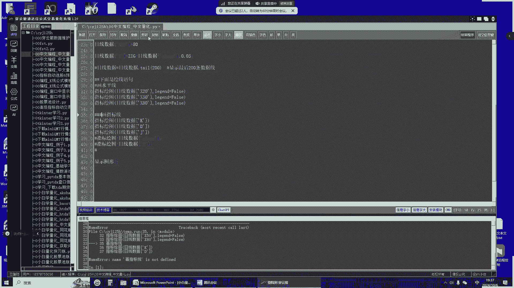

把注释给去掉，这就是画了一个KDJ的指标线。

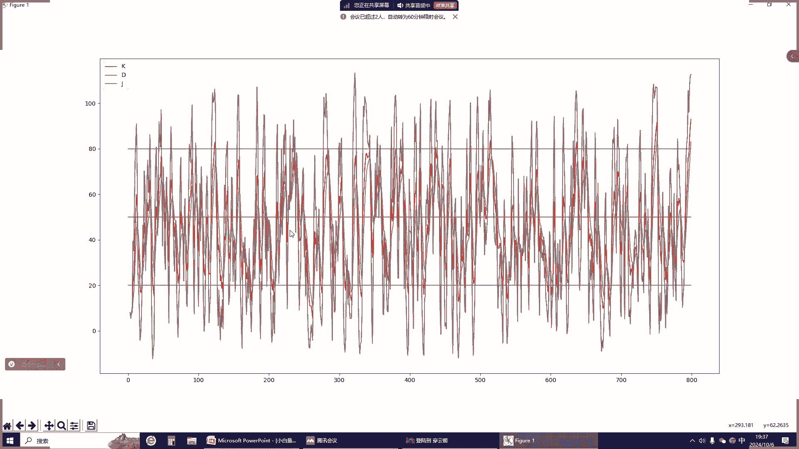

对不对，你看简单不简单，我们如果太长了，我们缩短一点，看截取一下，看这是不是一个开DJ，开DJ在0~100之间摆动，所以我们这个中文编程是非常方便的。

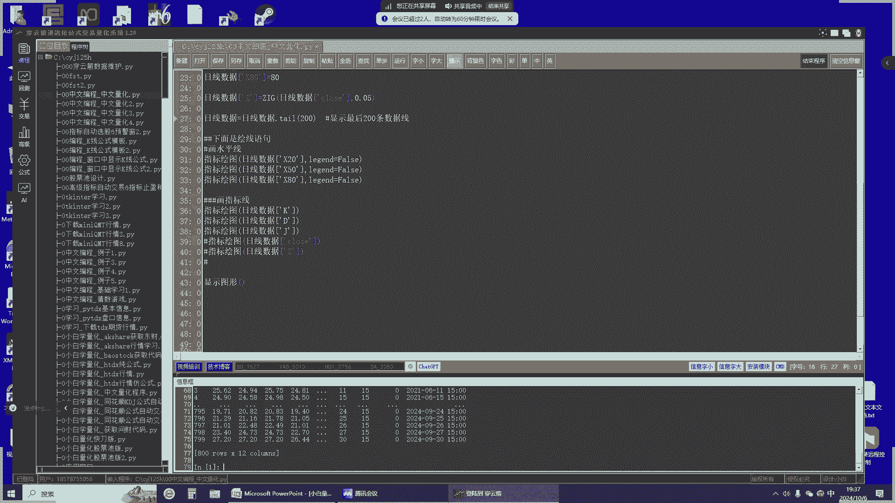

做程序的话我们就给大家就跳过了啊，因为这些东西都讲过了，我们就讲就直接往后讲，快速编写策略的途径，一选一个股票池，根据经验设计自己的自编公式，编写策略，在自选股票池中逐个取出股票代码。

获取股票行情指标计算，根据指标信号的进行买入和卖出交易，这就是一个策略的一个简单的写写法，我们下面这个就是一个，同花顺自动交易的一个程序，就说如果你自己没有量化平台，你自己想写一个量化逻辑。

就照这个模式学，就照我这个步骤建一个股票池，然后写策略，写个自编指标的策略逻辑，然后做一些这个这就是一个演示，这就是上面呢，首先就连接导入通达信的一个模块，连接通达信同花顺，这是我们用同花顺软件。

这个是快递解指标，我们写了个K地结指标，他是有个买入和卖出的，我们用的是个专家系统，开DJ专家系统，这个是买入卖出卖出买股卖股，然后呢下面是初始化行情，我们读了一个小米汽车的板块，我们也可以自选板块。

也可以创建，然后呢我们从这个板块中取出一个股票代码，进行获取它的日线行情，然后进行规格化运行指标，这个指标呢继续运行的我们KDJ这个指标，然后运行完了后，返回的表里面。

买DF表里面已经已经包含了KDJ指标的值，下面呢，下面就根据我们的表里面判断买入条件，我们取最后一个值，我们这个是买入条件吗，买如果最后一个值大于零，我们就给我们这个板块，其实我们跟选股是一样的。

给这个板块增加这个代码，那我们就相当于一个选股器了，对不对，我们同时也可以做买入，对不对，最后输出吧，如果我们把这个买入条件注释掉，就相当于我们做了一个选股器，这个逻辑就这么简单，清晰。

股票池取出一只股票，读取行情运行指标，然后根据指标的值进行择时交易，买入或者卖出，这就是一个完整的一个自动交易，Among one，后脚，这就是呢在我们想在股票的专家系统中，我们想做股票。

就用这个来做买股，这个叫卖股，这是股票，如果我们要用期货，我们就用这四个条件买买开，他这叫期货，叫买开卖平，卖开买平，这期货实际上就是通达信本身就是支持期，股票和期货的这种交易指标。

我们用他的交易指标也可以直接写，另外呢在创建中呢，可以用bk BP来做买开卖平，也可以用SKSP做买开卖平，这是一个例子，比如说我们想做一个交易股票的交易，我们用两日均线上穿20日均线作为B2S。

二是20日均线上穿两日均线，那就相当于下穿，然后我们判断如果B2大于零返回一，S2大于零返回一，这个就是买和卖的条件，下面呢实际上是期货，我们如果做期货的话，那就反向做，那我卖出多头做空头。

那我们就这样做，这是简单一个例子，量化策略程序的实现，因为量化策略呢我们不论是所有的雪球距，宽P吹的KMT，包括川建他们量化平台呢，它是一个完整的一个量化平台，所以用户写程序的时候只需要完成两个函数。

一个叫做策略初始化函数，一个叫盘中运行函数，初始化函数中呢主要是设置佣金，手续费和一些其他的参数，另外可以在里面创建一个股票池，盘中运行函数呢，就是说它在盘中，实时的从股票池中选出一只股票。

然后获取这支股票的行情进行指标运算，根据指标计算的结果，信号结果进行择时买入或者卖出，然后呢再增加一些风险控制，如果比如你的买进价格，买进后价格跌破成本价的5%止损，这些都是可以在策略中去写的。

刚才那个程序呢简单的灰色开DJ我们也看过了，如果呢我们就拿前面那个例子来讲，刚刚那个凯迪杰，那个同花顺交易的一个程序来讲，如果在这个这个例子呢是同花顺的交易例子，如果删除掉交易指令。

把它放到一个空的股票池，这就是一个选股器了，你看选股器容易不容易，我们只要把这个交易指的指令下单指令去掉，是不是满足要求，它就会增加到my block这个股票持中，这就是最终的选运行。

把所有的股票读货机指标判断满足条件，不满足条件放入这个股票池，是不是，这就变成了一个选股器了，这就简单的很，就是说我们下单的话，我们把就是直接加入下单指令，我们现在用的是同花顺下单指令。

我们也可以改成迷你QMT下单指令，我们也可以改成期货，外汇，港股美股这些都可以下单，如果我想给客户发信息的话，就说我不想交易，比如说我上班现在行情比较好，我又没有办法上班期间实时看盘。

我在家里把电脑打开，让电脑运行我的程序，盘中运行程序，如果发出了买点，就希望我的这个程序给我发QQ信息，微信信息，钉钉信息以及邮件，甚至微信，其实都可以发送给你，提示哎，这个股票发现了买点。

你收到短信或者信息就可以直接交易，这就是说我们今天这堂课讲的一个内容，呃发微信应该没有什么QQ，微信和QQ没有限制，如果发短信可能有限制，因为呢短信我们也可以看一下，在腾讯云或者微信呃。

腾呃腾讯云或者是淘宝云，我们看腾讯云短信，他是都可以发的很便宜，但是它有个审核机制，就是你发的信息，人家平台要审核，而且很便宜，你发一条短信就三分钱，因为他这有接口，你看1000条33块五。

它里面呢有接口，你可以看一下，它里面都有Python的接口，你可以按照他的要求，就是把我们的买入条件换成发短信，你的短手机短信也可以发收到，你知道吧，这个所以他这个都是有的。

你看腾讯云短信都有付或者淘宝云都可以。

我们没有做例子，因为这个要花钱买才能尝试，我们没有去试。

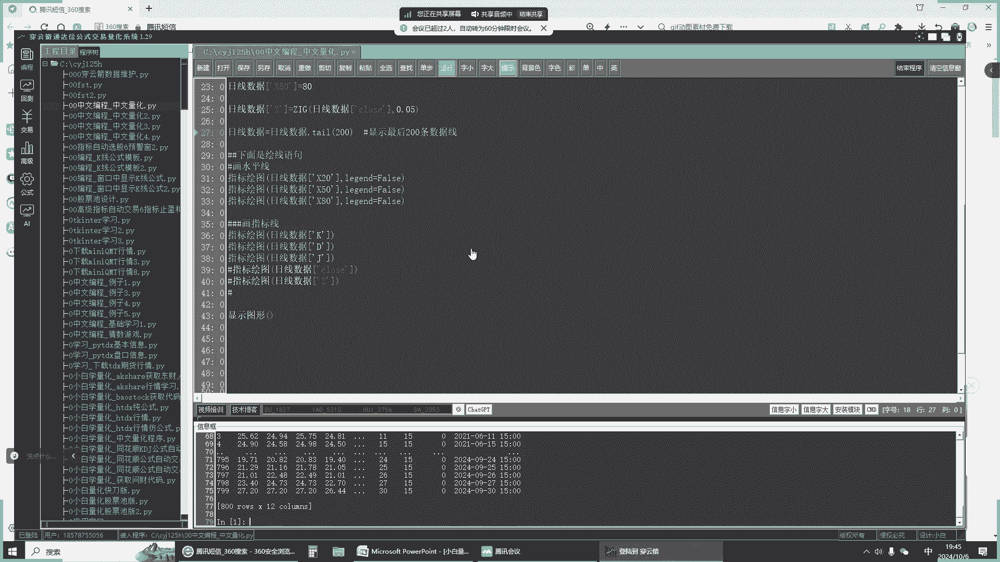

实际上都是可以的，所以这个待会我给大家演示啊，现在接着向大家讲，如果呢大家使用的量化平台，比如穿云箭聚欢p trader量化平台呢，它里面只要定义这两个函数。

i i it a l i z e这个函数这个叫初始化函数，它在策略运行中只运行一次，在这个函数所实现的功能主要是设置策略信息，设置费用信息，设置股票池，读取柜台的资金信息，然后呢获取你的持仓，对不对。

还有另外你还可以定义一些固定的值，比如说你的止损值，止盈值，我们这里定义的是G点，GS定义的是指标公式的源码，下面呢是盘中运行函数，盘中运行函数是每它有很多种方式，如果是on b那就每个K值生成。

它会运行一次，像我们这种Mac杠open Mark呃，就市场开盘期间的函数，我们是循环处理的，有的呢是5分钟触发一次，比如说P吹的，它是5分钟触发一次，比如KMT这种类似的函数，它它会一分钟触发一次。

就是一个K线生成，它会逐星子，但是我们这个穿云箭呢是连续是运行的，我们不管你K线不生生成没生成，但是我们一直在续高速的在处理，所以我们这里面要自己加暂停一秒，要把你的程序就会运行非常快的，航向还没变化。

你都计算了十圈了，这个呢在这里面呢，你要一般我们处理是获取机器时间，因为我们决定我们集合竞价怎么操作，因为我们一开盘初始化已完成，不管你是九点，你只要程序跑起来，它已经开始运行了，可能9。1刻在跑。

但是整个市场还没开盘，然后你在这里获取机器时间，然后发现9。15开始集合竞价，那你就要进行集合竞价处理对吧，你这个策略他应该是高速在处理，然后开盘了，开盘处理，这是有的，一个原来一个客户呢，他只做打板。

就每单开盘10分钟，如果满足要求，他他就操作打板，不满足的话，他就不做了，反正只做每天做10分钟，这10分钟有机会就买，没有机会他就放弃了，他不再去做了对吧，我看他那个胜率也很高的，如果早上都不能封板。

那下午升封升封板的概率就低了，这个是获取委托信息，首先同步机器获取时，机器时间要处理哦，然后获取柜台的资金信息，因为你要买股票的时候，要知道你还有多少钱，然后获取委托的信息。

因为你的订单他是循环处理的嘛，你第一圈可能没有订单，但是第一单圈在运行的过程中，有些股票触发了买买卖，他已经发送了订单，订单成交没成交，你第二天圈回来，你就要处理，你要读取你的委托信息。

如果成交了怎么做，如果不成交，你是不是要撤单呢，这个是要怎么样处理，然后获取持仓，因为你获取你现在持有的股票，有的什么东西，你下来要进行处理，循环处理持仓数据，根据策略和最新行情要计算你的止盈止损。

对不对，因为我们优先处理持仓嘛，因为你的价格是快嘛，价格比如说跌上涨或者下跌，你触发了你买卖，你就先止盈嘛，先把钱释放出来，下边呢才是循环处理股票池，对不对，股票持股，然后取一只股票取行情。

然后根据策略指标计算信号进行，根据信号进行交易，这个在穿云箭中呢，如果你选择实盘周期，一定要选连续，因为如果你不选嗯，你选连续的时候也要必须增加一暂停，因为你不加暂停的话，那个它的速度非常快。

你比如说你把这个一去掉，没有暂停的话，你比如计算mt5的时候，每秒计算500圈，那个速度太快了，因为行情还没波动，你已经计算了几十轮了，所以我们最好加个暂暂停一秒，控制一下速度，停下来呢，我们讲。

那那我们要设置股票池怎么选呢，那股票池大家都想想追强势股。

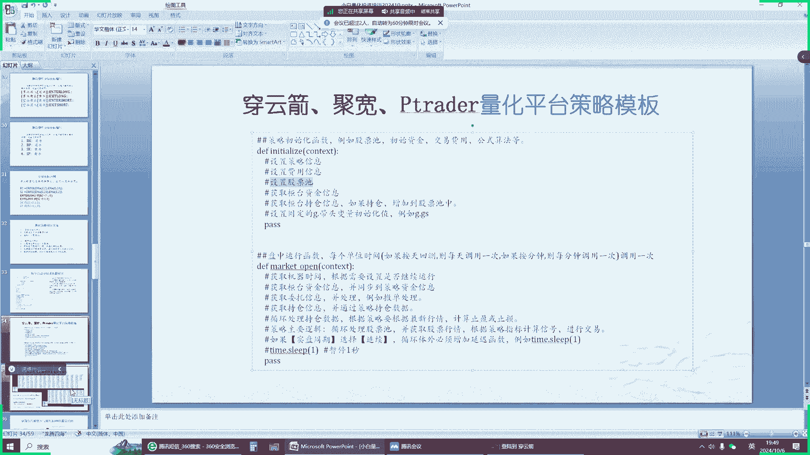

找热点，那我们今天讲选取股票池的时候呢，我们可以用小白量化的行情模块，来获取通达信的板块数据，因为在通达讯呢，我们看到这个是不是通达信板块数据，它是分为概念板块，还有风格板块，比如说现在的热点。

假如是小热点是小米汽车，那就把所有的小米汽车取出来，下人形机器人或者低空经济，你这都是板块，我们最近假如炒这个题材，那我就读这个题材，你你首先看通达信有没有这个板块，如果有这个板块。

你直接用我们这个指令就能获取他的板块，我们比如说我们获取一下近期强势，我们创建一个指标，我们输出一下近期强势可能也有很多吧，我们就不输全输了，看有多少只。

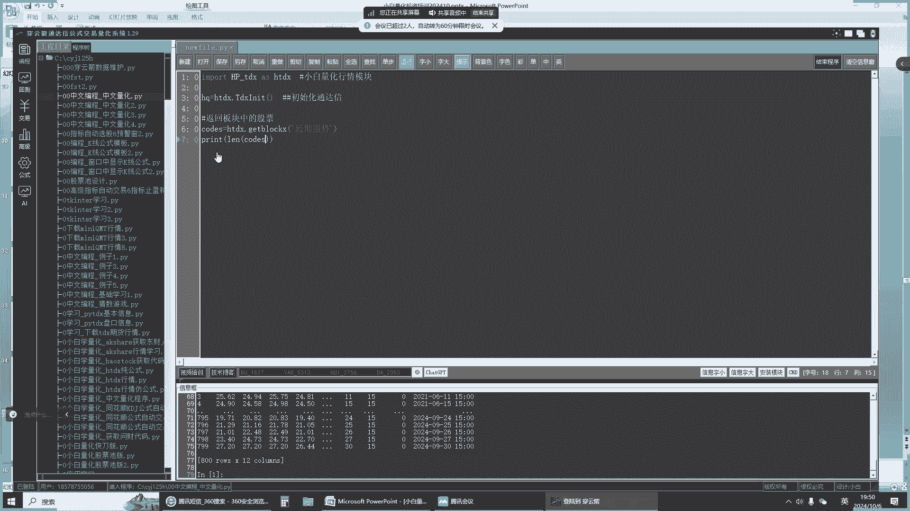

我们就叫近期强势吧。

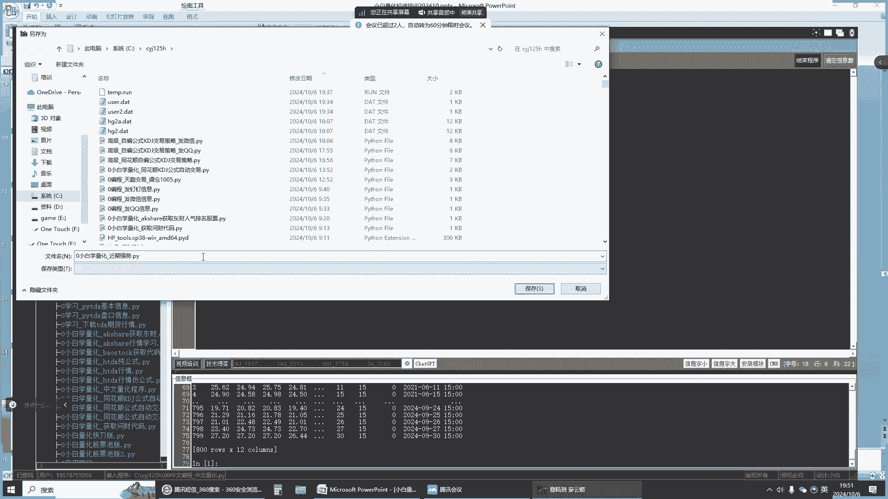

我们运行一下，我们获取了400只股票，看经济强势有400只股票，这个代码呢那就非常多，比如说我们看一下，我们在底下也可以切片去看到底有多少，这400只股票有什么，我们不用全显了，因为这数字太多了。

我们选择十个看一下，因为我们就是0~10哎，这就叫切片，他就是这几个股票，它实际上有400只，因为我们刚才显示了经济强势的股票，因为大盘现在走的好嘛，那肯定很多股票都在大涨，所以都涨幅都比较大。

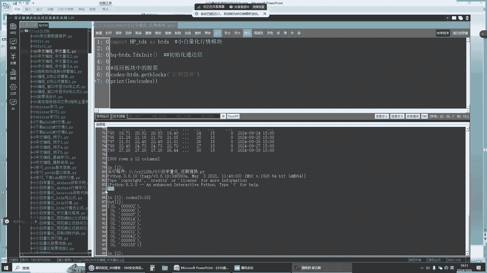

它近期强势有400只股票，所以我们在我们的克里斯刚才讲的，在初始化的时候，我们在初始化里面我们可以用读取板块信息，或者你可以自己创建，那你自己创建也可以。

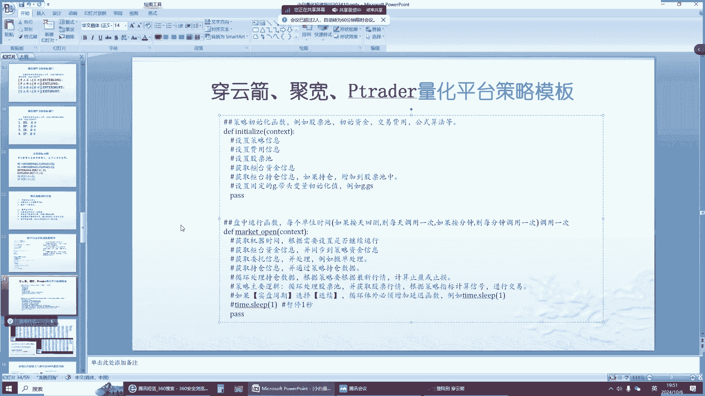

对不对，你要自己创建，比如说COIDS，我们举个例子，假设我们的这个名字叫CODES是股票池，我们是个列表，我们一般选择有两种方式，我们通常是用通达信的模式，比如说我们通达信是模元祖一零是深圳。

一是上海零，我们这00007001吧，这是深圳的，如果我们上海呢，上海市场是一，比如说我们600030，对不对，我们可以不断的写自己写股票池，我们刚才上面是读的板块，当然我们还可以读什么自选股。

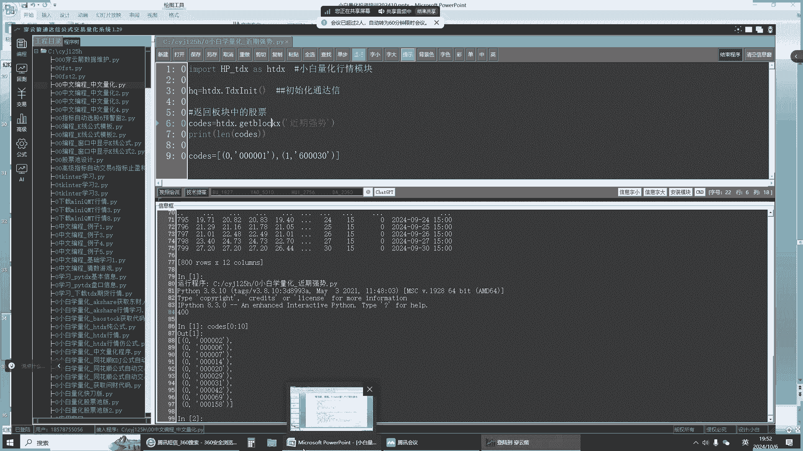

我们自己可以选用自选股票，选一个用自选股板块来做。

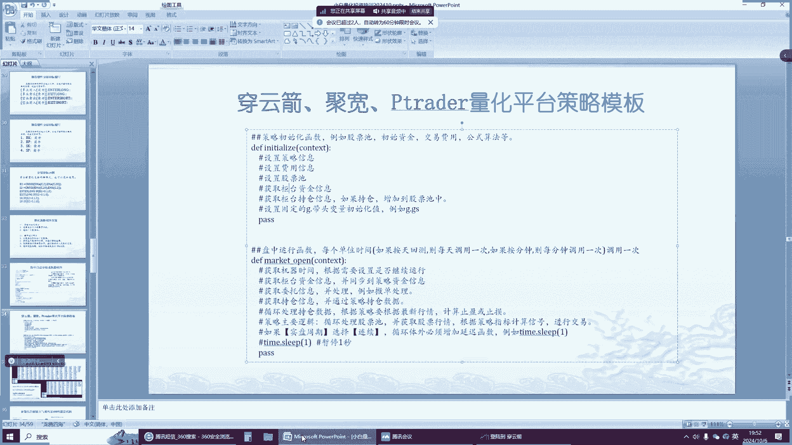

自选股呢，我们比如说我们可以获取通达信的自选股，那也看看我的自选股啥，但是我的自选股是做期货的，我这个流和做期货和那个啥的，我主要做期货和港股，所以我的自选股是比较乱的，比如说我们看一下我的自选股有啥。

是有什么东西，这是我的通达信自选股，实际上我们不用打开通达信，因为我们这个程序本身自己就会读的，我们运行一下，通达信自选股的BLK，我们看这里面可能因为有那个啥有港股的原因，不够数字哦。

原来是这里就是说。

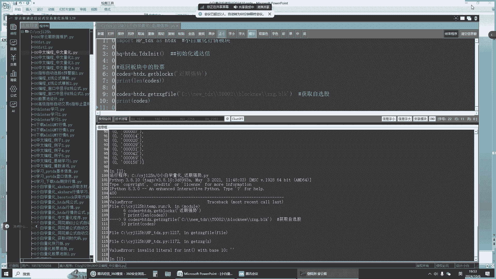

港股是五位，所以他数字不够出错的，因为原来做这个库的时候。

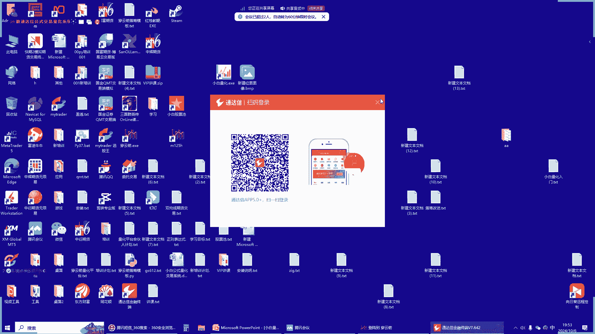

没想到要用港股的问题，你看里面恒生指数很多的东西，连续港股阳光保险，你看中金。

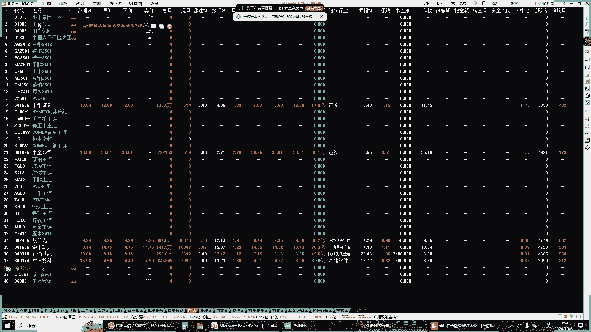

这都是我在看关注的一些港股股票，所以它里面的成分比较复杂。

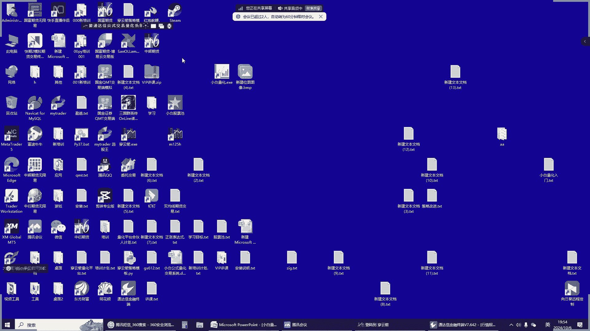

如果呢不看这个，我们看自选股八吧，哎我们看看啊，我的自选股多，自选股八，自选股八八，看能读出来不，哎我们读出来自选股八八，有这些股票，因为他你看601598。

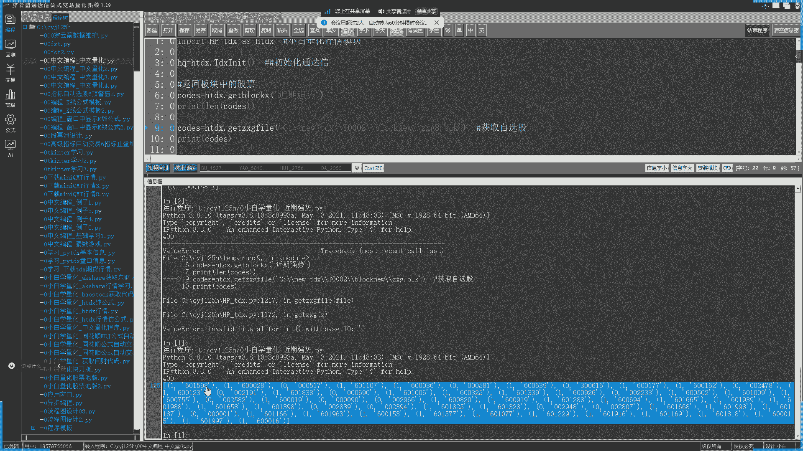

我们看看是自选股，是不零自旋自选股八，哎这里面还有可能还有期货呢。

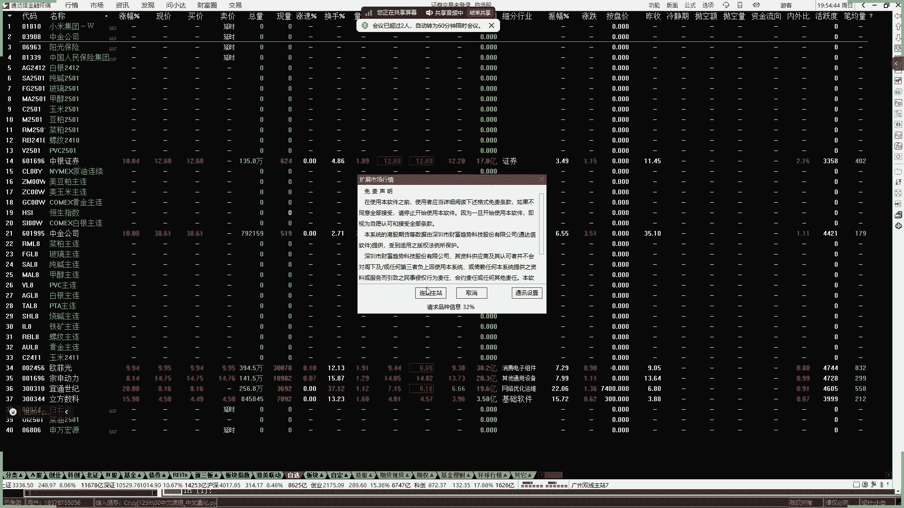

自选股霸哎你看第一个601598，我们看一下，我们这个读出来的是不通达信的自选股，对吧，601598，第二支是600028，中国石化，第三个600517，就说你可以通达系的自选股，我们这里面同样可以读。

所以第一个我们选什么呢，通达信的强势板块嘛，我们把这个板块打开，他有个风格板块，这里面你看历史新低，历史新高，近期新高，近期新低，近期强势，近期弱势，他就是现成的东西嘛，对不对，我们可以直接去读。

比如说我们刚刚近期强势，他有多少支票呢，我们翻一下，刚才我们读了400只，你看他确实是400只，最后一只是400，所以这就是我们读的强势，第二个呢，我们除了用通达信的本身的软件自己读的话。

我们还可以这里面，当然这里面什么的板块，这上列的所有的板块，都可以用这个指令去读出来，他的股票代码下来呢，我们读什么呢，东方财富，我们东方财富里面呢经常有个人气榜。

往往呢人气榜的都是最活跃的100只股票，我们也可以把这个100只活跃的股票，做出股票值，这些股票我们作为股票时并不是买，因为我们的指标在这些强势股里面选择机买入，哪些股指股票呢，发出了买点，我去买。

因为你选强势股肯定挣钱的概率更大嘛，所以我们看一下这个代码，我们看看啊。

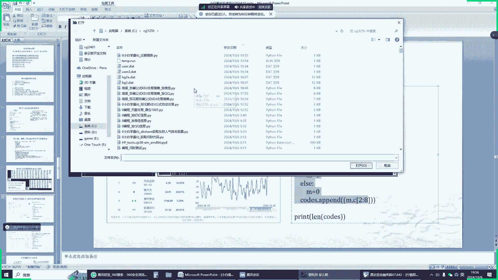

我们这个是用的AKSARE这个库，这个库呢，它本身呢支持支持那个获取东财的那个功能。

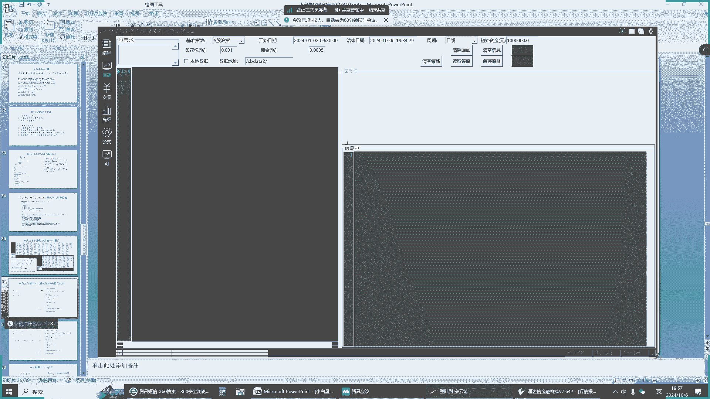

我们运行一下啊，我们处理了一下，因为他的格式呢，转换成我们的什么通达信的格式，因为我们读的主要是用通达信的行情，所以我们就做了个通达信的一个转换，他读了100只股票，100只股票我们也可以看一下。

来我们去看一下前面的市值，300059，这个是什么东方财富吗，我们看一下是不是300059哎打错了。

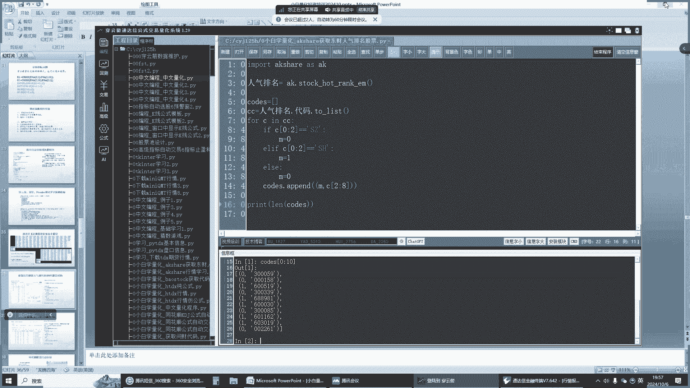

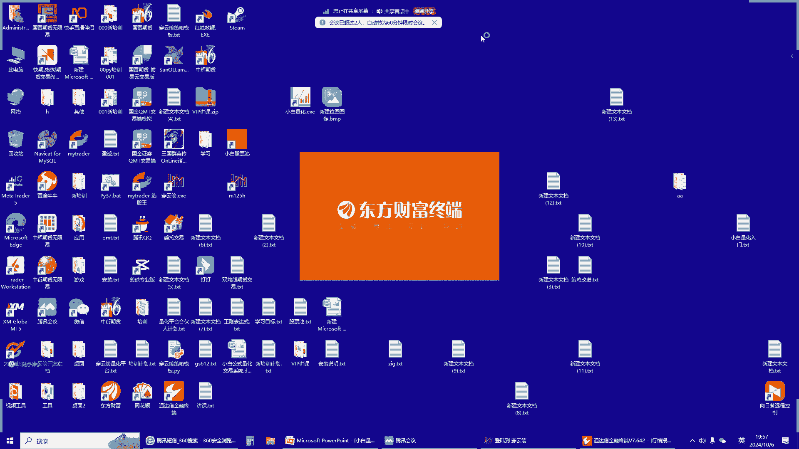

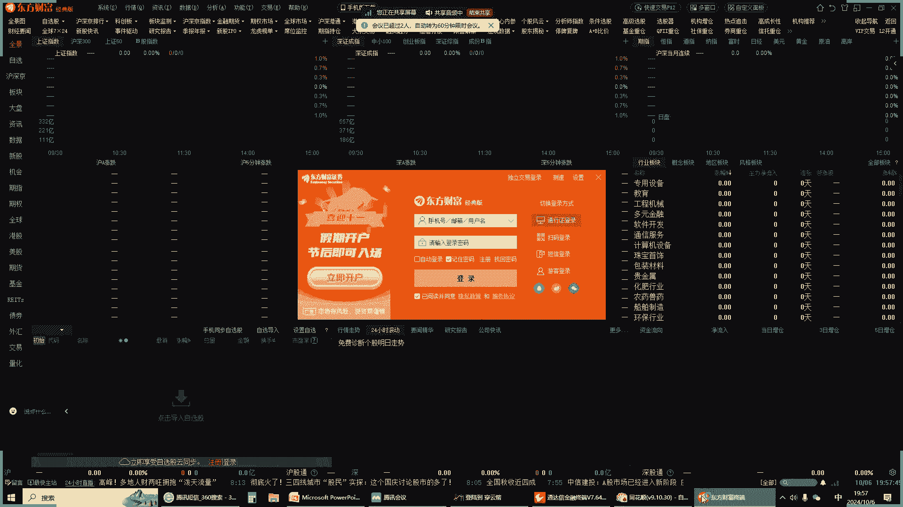

这个地方呢鼠标这个位置就是东方财富人气榜。

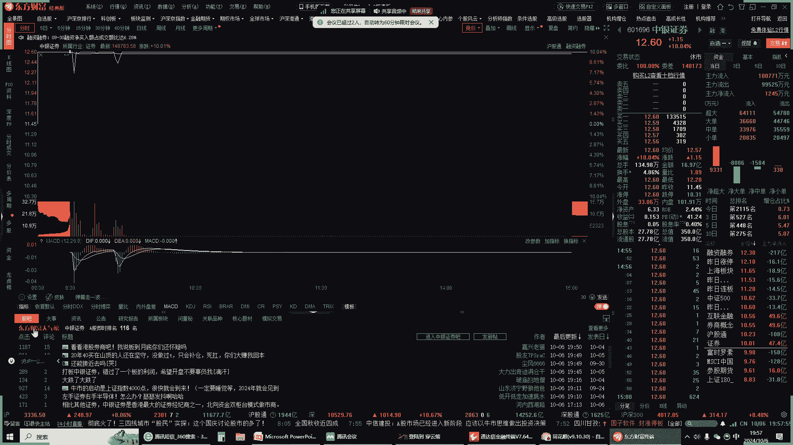

我们看一下第一支是不是300059，第二支是000158，是不是我们也是读的这个3600018，第三个600519，我们这不推荐股票，我们只是给他讲课的例子啊，就说你每天这都这都是实时变化的。

我们读的呢都是最新的数据，拿这个人气榜前100名作为股票池。

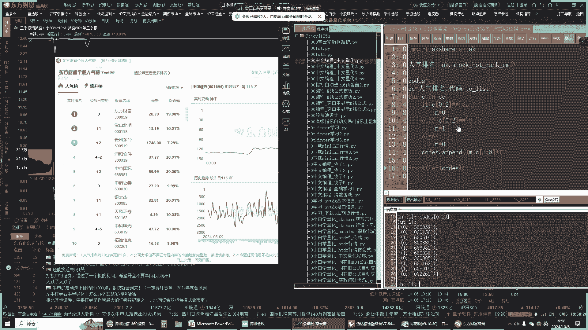

简单不简单，你先听我的课，是不是很简单，这个行代码就是他通过代码，它的原始代码是这个，我们看一下哦，他的原始通东方财富的代码和格式是，深圳000628，上海SH600305，我们把它转换成什么呢。

转换成我们的通达信格式，它是用元组来表示的，所以我们就通过这个程序转换，把它转换成我们这个元组的模式，你看见没，市场加股票代码。

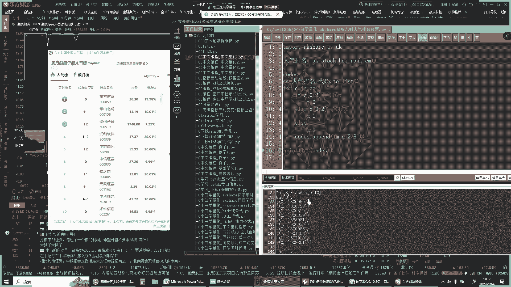

这个给大家讲讲东方财富人气榜，我们也可以把它作为股票池，把它放到什么策略的开始部分，另外呢我们还可以使用问财，问财呢，我随便写了一个啊，这个这个条件你随便写，包括什么KDJMACD大于零，小于零。

你随便写一问问财，这属于基本上属于智能化的，问财在哪里呢，在我们这个里面一个，我们看看啊，这是同花顺选股，同花顺选股有个问财选股，你也可以到官网去去去，我们点一个条件，我们点一个回车。

你看他还可以AI对话，很强大的，他选了我们这个条件呢，流通股小于100亿，涨幅排名前100名的股票，第一支601618，我们都用它来选强势嘛，对不对，我们看一下，我们用这个代码去读一下。

是不是跟我们的软件代码是一样的。

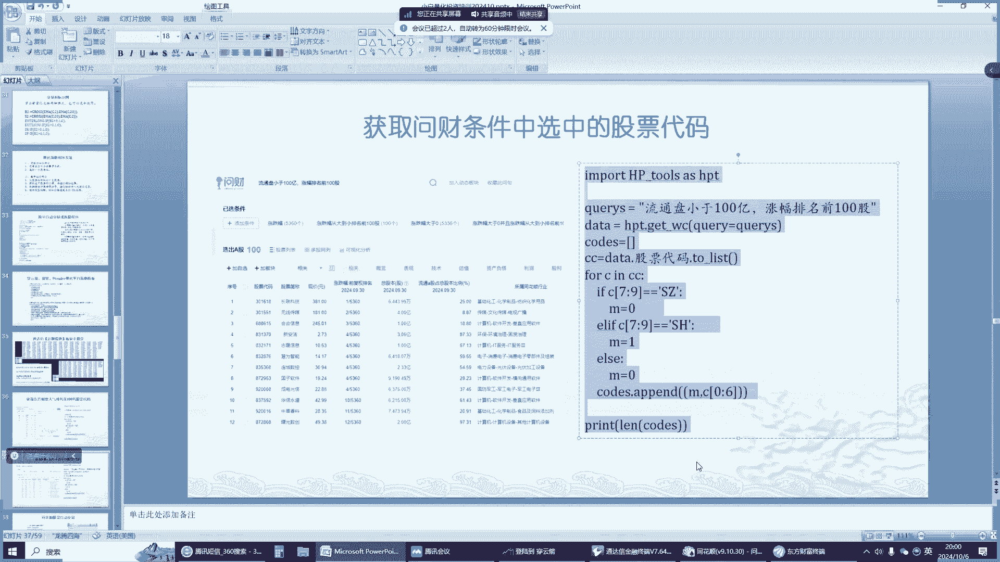

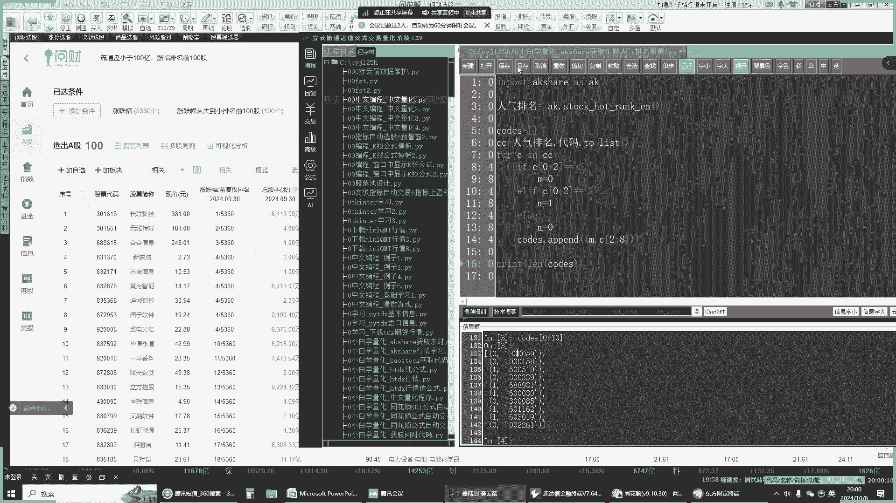

这里面是不是已经写过了。

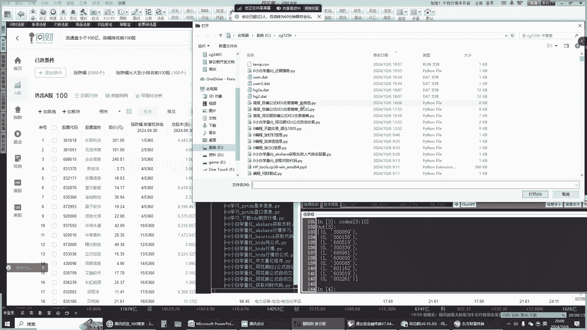

问财，啊买个例子不对。

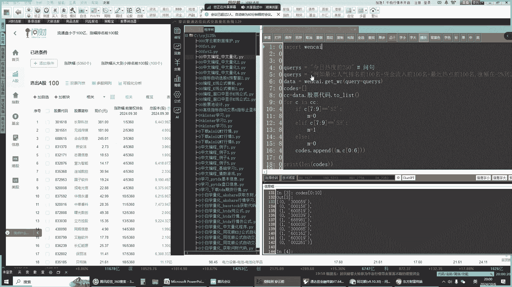

我们直接用我们这个标准例子吧。

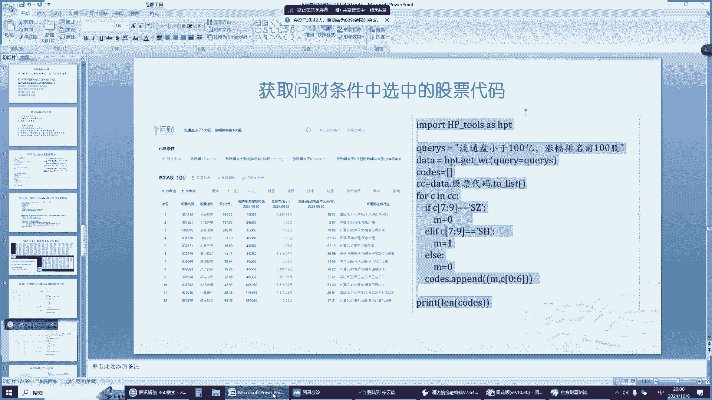

因为这个课呢是上次讲的，我们就用的标准的例子保存运行一下，是不是他选了100只股票，那我们也看一下前十只是什么呢，第一支301618。

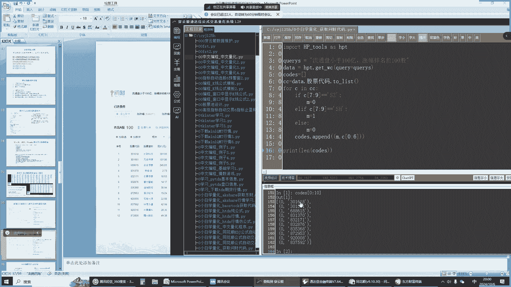

那和这个是不是301618。

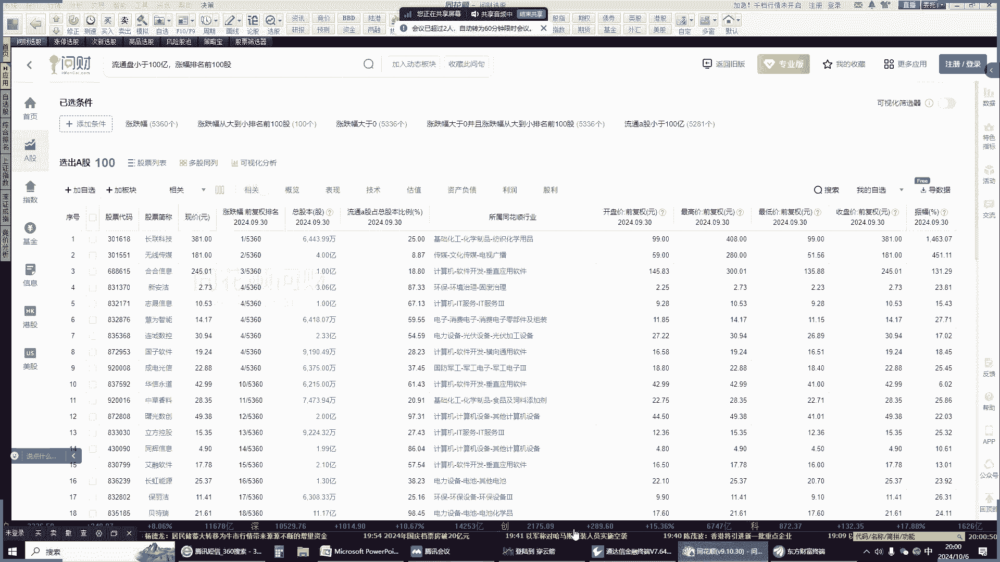

对不对，我们可以拿它作为一个股票池的，把他这一段代码复制到我们的初始化里面，是不是我们的股票池都有了，第二只呢301551，是不是这个第三只688615诶，这个其实没有错的，所以我们可以用问财。

我们还可以输其他的条件，比如说流通盘小于500亿，这是第一个第二个涨幅排名前100名，然后呢收盘价大于多少，或者MACD，MACD大于零，或者直接写公式，对不对，KD结大于80，这问财我们这样试一下。

看他能选吗，因为问财他属于半机器的了，他还选了100只，他选了什么，我们看一看，我把这个条件呢复到这里面。

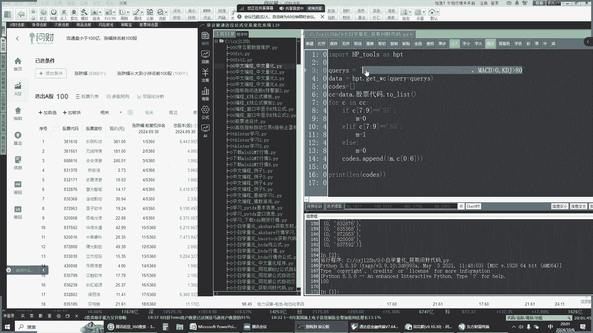

他这个因为我选了前100只，这后面是辅助的一些条件，他就变了，你看对不对。

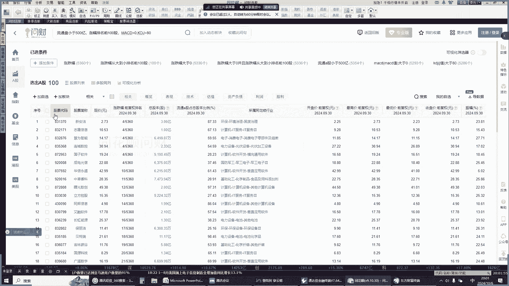

他重新选了100只，我们看一下我们这个条件再选一下，看跟我们的新的是不是一样，831370它，然后第二个832171哎，我们这100只股票实际上我们不用看，因为这选出来是100。

这个地方显示长度是100，我们就不用看那么多，所以用问财也可以，这是我们给大家讲的一个你可以强势股。

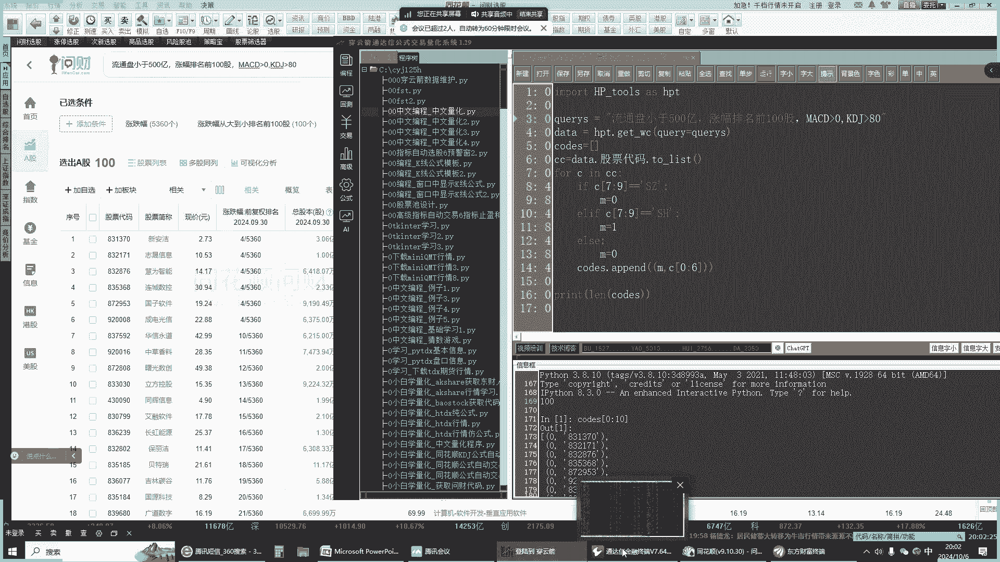

下来我们继续讲课啊，当然自动交易上一堂课我们都讲过了，我刚才讲了，我们在前面那个程序中，我们想这个程序呢把这段复制掉覆盖掉，把这段覆盖掉，对不对，它就是一个完完整整的一个选股器程序，如果我们想做同花顺。

我们就初始化同花顺，然后把我们加在我们的满足条件，加上同花顺的下单指令，因为这个地方给大家PPT给大家说的很清楚，我们首先要初始化easy trade，然后连接同花顺，如果满足要求的话，我们就买入。

对不对，那我们把它换成迷你KMT期货，外汇的指令呢，他们就变成他们的交易了，我们看一下同花顺连接模块获取资金，获取持仓，买入卖出，是不是我们刚才那个代码有个买入，对不对。

那我们想用mini k f t呢，那我们就用这一段哎，我们就改成mini可比，这初始化呢我们把它放到初始化的代码里面，在买入的时候呢，我们就用这个指令进行去买，用这个指令去卖。

因为米开mt它是一个完整的一个交易系统，它里面很多获取持仓呀，下单呀，撤单呀，调融资融券呀，什么指令都有，我们你们自己看他的说明书，他的叫mini k m m t的一个开发文档。

我只是给大家举个简单的例子啊，你这样初始化有个买入在那，把我们这个买入呢放到我们刚才这个地方，就放在我们刚那个代码里，我们刚才说了嘛，把我们这个同花顺的代码，换成mini k m t的下单指令。

是不是就变成了mini k m t的下单了，简单不简单，所以交易呢我们这个代码呢就是我们这个code嘛，对吧，价格呢这个不要动数量呢，就是我们输了个400嘛，我们把它改成400，对不对。

他的价格是多少呢，价格我们就是在这里面有吗，我们用的是收盘价嘛对吧，我们把这复制过来，是不是很简单，这就是你想用迷你QMT下单也可以，所以这个量化平台量化很好，学的不复杂。

你只要知道这个套路和规则去套就完了，他为什么那样写，你问老师，他为什么这么下单呢，为什么这么写呢，我也不知道，你看他的开发文档就是那样写的，没有必要究追根问底，你问底我也说不出来，你把这句话记住就行了。

这是买入卖出，你去复制粘贴，就改他的代码，改它的数量，改它的价格，其他的不要动，对不对，那你说他的参数多了对吧，股票买股票卖期货，买期货卖什么ETF可转载，那各种各样的代码你需要用的话，你去查查手册呗。

这个呢那你说我想用mt5，但也可以啊，mt5连接行情，他的把他的买入换一下代码，成交量魔法值，他这个呢代码成交量魔法值，它的价格呢，价格漏写了，应该还有个价格，P r i c e，买开。

因为只有平仓的时候可以不写，如果不写的话，我估计是以现价成成交的，实际上不是不是都是一回事，这是不是就做mt5的交易了，mt5你什么想做什么都行，美股港股，新加坡，澳大利亚，美国英国。

比特币外汇没有不能做的对吧，你也可以，这上里面有很多的功能，我们就不讲了，因为我们不是介绍mt5怎么样交易，我就给你讲，你就把他换下单，指令一换他就变了，下边当然还有天晴，你说我要做期货。

那期货也是一样，期货它指令就比较多了，上把你就是初始化连接的部分，对不对，放把这一部分替换我，我们把这一部分替换哪里呢，就替换我们这个模板，我们这里一个模板，应该这一段这一段都是同花顺的，对不对。

我们把它一替换哟，我们就变成什么了，期货了吗，对不对，首先我这一段初始化变了，我们把我们的天津账户，用我们天津账户来做的，也可以模拟，也可以实盘，然后呢，再把我们这段代码后面的那个下单指令，换一下嘛。

下单指令，那下单指令这就麻烦了，这有四个指令指令，因为期货是双向的，买开卖平，卖开买平，那你根据你的指标需要买开卖平，卖开买平，你自己随便玩了，对不对，所以这个就是说这就是期货，你想怎么做。

我们把这个PPT不改了，恢复一下，你看我刚给你讲，简单不简单，你只要把同花顺这个换成期货的一个初始化的，一个模板或者mini k m t的模板或者mt5，是不是就变了。

然后再下上面初始化完成就改他的下单指令吗，这只是个买演示，当然你还有卖演示，我没有做啊，因为卖你可以完全可以写，你可以用这同理，对不对，这个值大于零，而且卖的时候一定要注意，期货的话可以卖空股票。

不能卖空，你得有可卖数量，这个卖出信号有可卖数量大于零才能卖，但你要是一般你读柜台，他就会给你提示可卖数量的，比如说你做的ETF可转债，你今天买进他马上就他就可卖数量就有了，如果你买的股票。

你的总股票数有，但是你的可卖数量是零，因为股票是T加一，第二天才能卖，所以你就只要读柜台的可卖数量就行，简单不简单，你说自动交易简单不简单，当然了后边还有很多的我们就不讲了。

因为里面后边天晴我们还可以做美国盈透，对不对，美国盈透数字化合约定义，下单还可以做附图对吧，把港股附图都可以改下来呢。

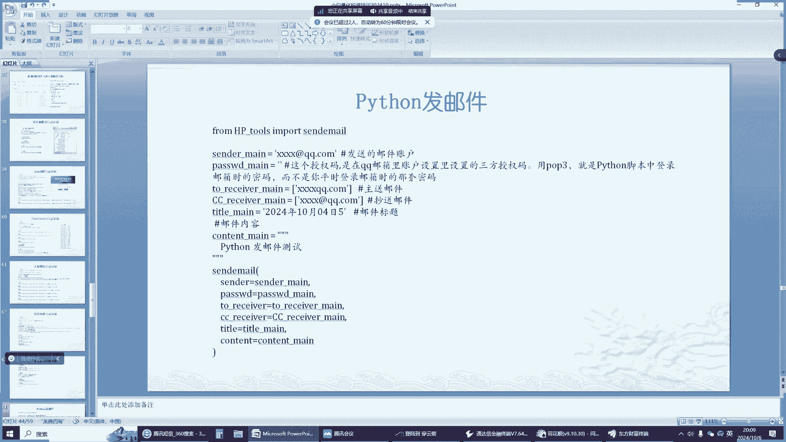

我们就讲发邮件，发邮件呢就说我们不下单，因为很多朋友呢现在行情好。

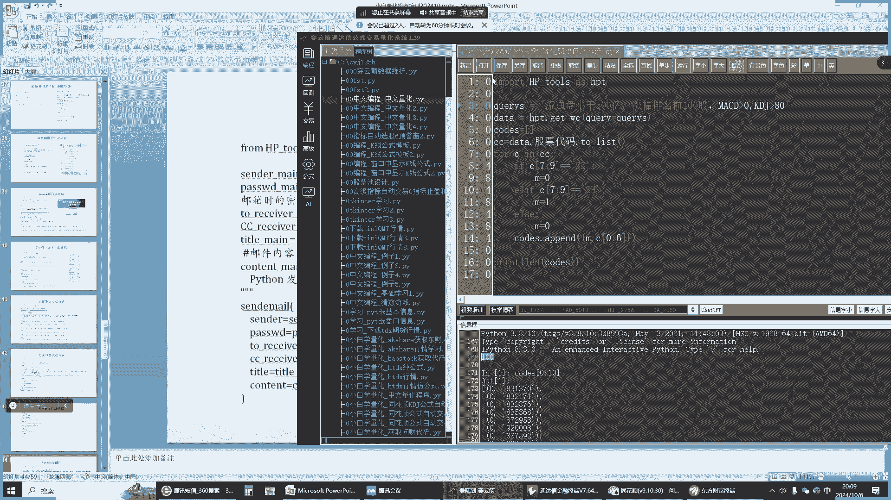

他是意思说哎我现在我在家里运行个代码。

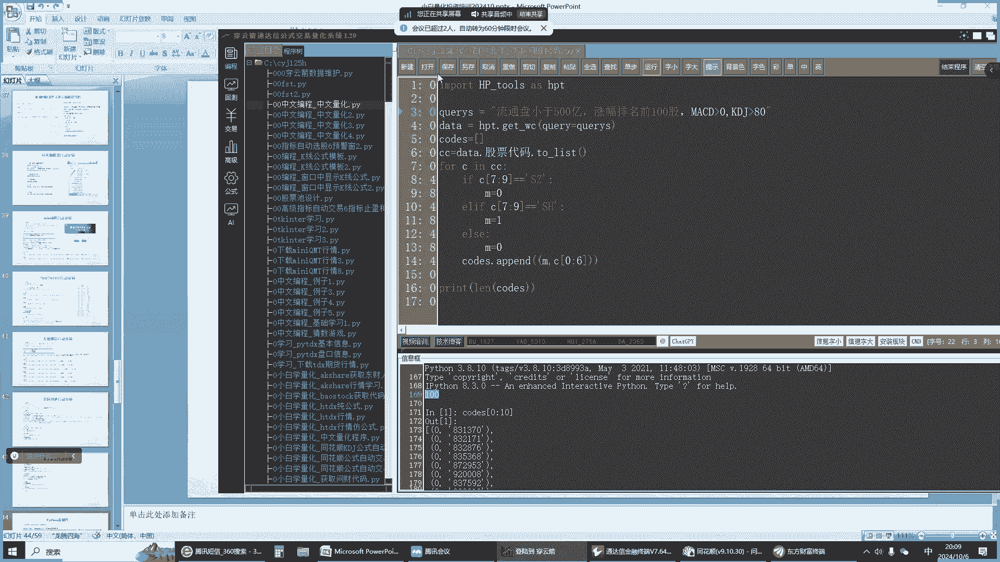

把电脑打开，我运行，我想给我发邮件。

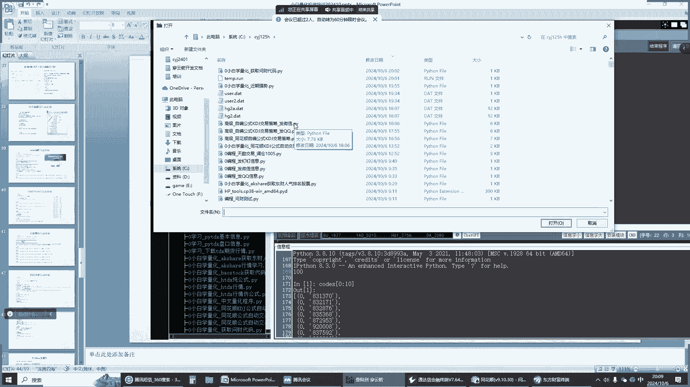

发邮件，我们这是发微信，我们就不做测试了，这个测试应该是没问题的，你就因为时间的关系，还有20分钟就结束了。

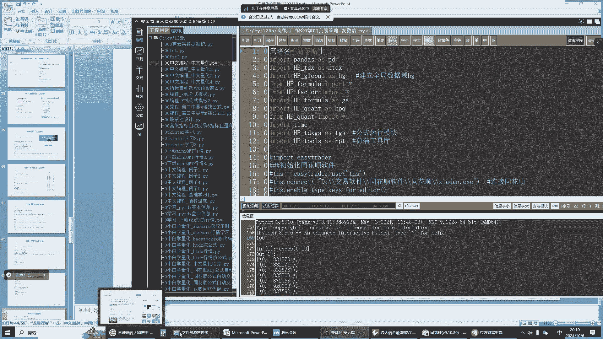

我们只做个QQ和微信的演示，其他的没法来，不做了，因为发邮件它里面要设置一些东西，比如说你的邮箱和你的授权码，包括你的密邮箱密码，还有你的都给别人谁发的邮箱，那我要发还得自己给自己发，也没什么意思。

就是按这种模式，你把我们的下单指令，把这个地方呢就是放到我们的初始化里面，我们上面这一段我们把它改个颜色，改个蓝色的，对不对，我们改成蓝色的，蓝色的部分，你把它放到哪呢，深蓝色的放到我们初始化里面。

下马这个段呢就放在我们盘中运行函数里面，因为为什么呢，我们这个如果发出了买点，那我们就要填邮件的标题信息，能给我发个邮件，如果你发QQ邮件的话，就会在这弹出个信息邮，你收到了个邮件。

你也可以搜索你的邮件，拿你的软手机上的邮件可以看，这是邮件的一个发送，我们呢发QQ也可以，首先呢我们再建立一个通讯录，这上面这部分呢是通讯录，我们要放到什么，我把它打成蓝色，要放到我们初始化里面。

下巴这一段呢，我们把它放到什么地方，就买或者卖的交易指令里面，这样的话呢，当我的股票出现了买点，他就会读我们的通讯录，把我们通讯录，因为我们一行一个人，一个QQ名称，一行一个人对吧，我们没有。

当然你还说可以用逗号，我没去做，你想做也你可以自己改，你要是用逗号的话，这个分隔符你就变成逗号了，因为这个都无所谓，你想怎么做都可以，也就是把它分解每一个人的名字分解出来，然后呢对每一个人去发信息。

那我们这个可以测试一下，我们打开一个我们做一个发QQ信息的测试哦。

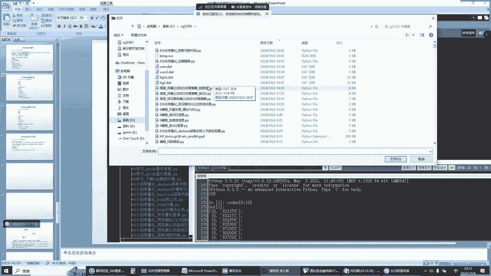

当然我们这有个例子，你看我们例子就不讲了，因为这是给一个客户写了个模板，就说你看我们把这都做好了呃，删掉了，对不对，我们有一个通讯录对吧。

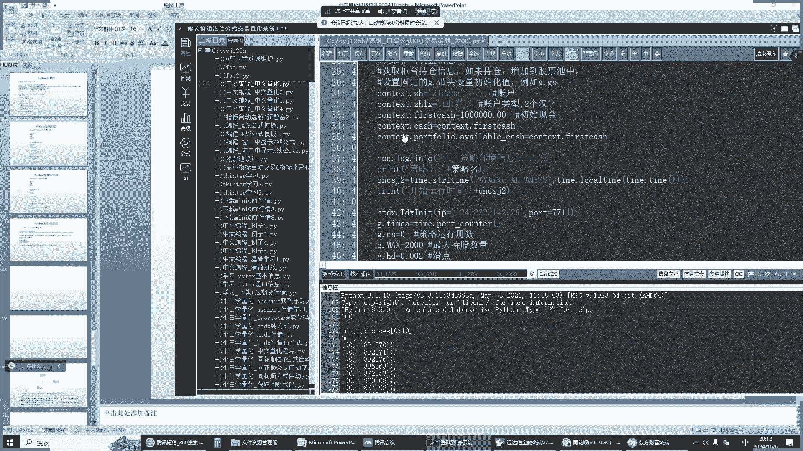

有一个买和卖，如果指标发出买点和卖点，这是有个通讯录，这个通讯录是QQ的通讯录，我们也可以运行一下试试，这个在高级模式下要运行，然后他就不买不买股票了，我们读一个股票池。

比如说300只200只股票的池吧，然后我们读入这个开地结交易，发QQ的，我们运行的时候呢，他就会发信息，这个呢QQ是这样的，你要把这些人的名字要打开，你要不打开的话，他是针对窗口发的，我们先运行一下哦。

我们只运行一次开始盘，如果有信息呢，他就马上就发信息，这个是为什么呢，我们要打开这些信息才行，这几个人的名字要打开，因为他是针对窗口发的，一个是股票量化，股票量化，我们做这都这啊，这个信息不是我的名字。

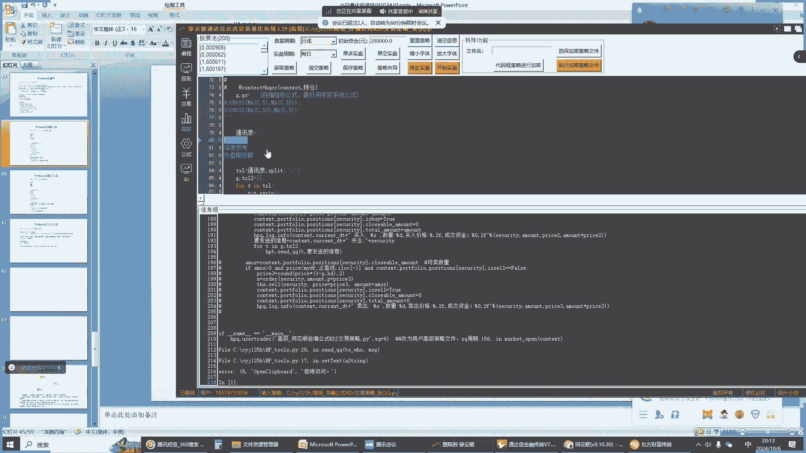

我要换成我的名字，比如说我们举个例子啊，我们可以用，当然这些名字都不能用，我用自己的名字，我找一个自己的一个群，首先可以发群，比如说我们这个群自己给自己发一个，我们复制这群的名字，对不对。

首先我要复制一个自己的群名，这是给别人做的，是别人的电脑上能发在我的发，然后呢我还可以给自己发，对不对，因为这个群名字呢我可以给自己发，比如说独狼和浦发一个独狼科普，是我自己了对吧，我要复制这个名字。

那我还可以给其他的人发，我还给这个人也可以发一个，我们再给这个人发个，独狼和普，他给其他的人哎，别给这个人发一个，这是我那天发的测试的，这个都要用这个昵称，如果1V呢，你，我们就发红到这里，对不对。

我们给这上面两个人是独立的人，下面是个群，我们直接就可以发送一次，然后他很快的就去判断了上面的股票，看见没，因为买入的股票他是关注关注关注，是不是啊，大家看到了，我们就要终止这个程序，是不是啊。

因为他这个一直在发送，因为速度很快，你知道我们这显示的慢，但实际上它已经运行完了，一直在发，我就不管他了，你看在群里面呢，她也应该会发了，好他没来得及发，我看看啊，他没发过去吗。

我们这个就是发微信的演示，我们就先不管他了啊，啧这个还在运行，我们先关掉它，刚才做了个发QQ的一个演示，实际上就是这是什么意思，你就发列表挨个去发，下来呢我们再看一下发微信，发微信实际上是一样的。

也是要建立一个通讯录，然后呢把我们的交易指令，这地方呢肯定放在我们的初始化部分，这地方呢就放在我们，交易部分我们直接用例子发了。

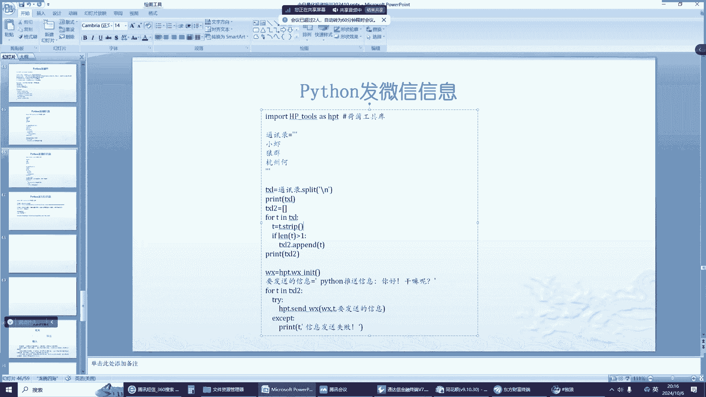

不用再用程序去发了，因为程序做起一运行，他就要续行很多的。

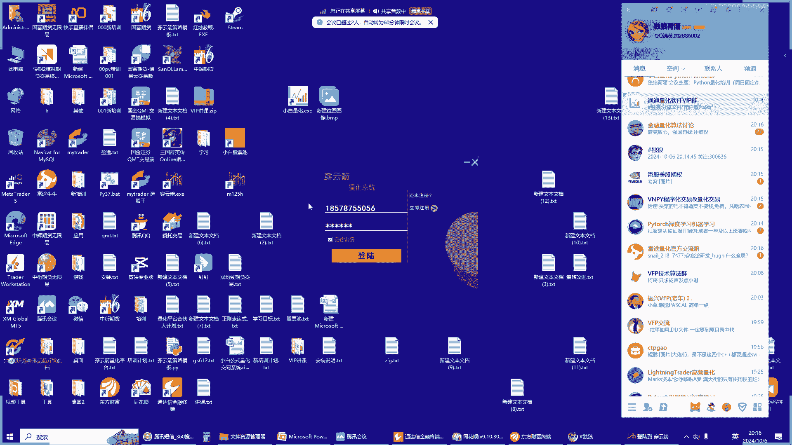

我们直接用发送信息来做吧，发送QQ信息，这地方呢这个不用看，发QQ信息，我们直接发微信信息，小夏我看看。

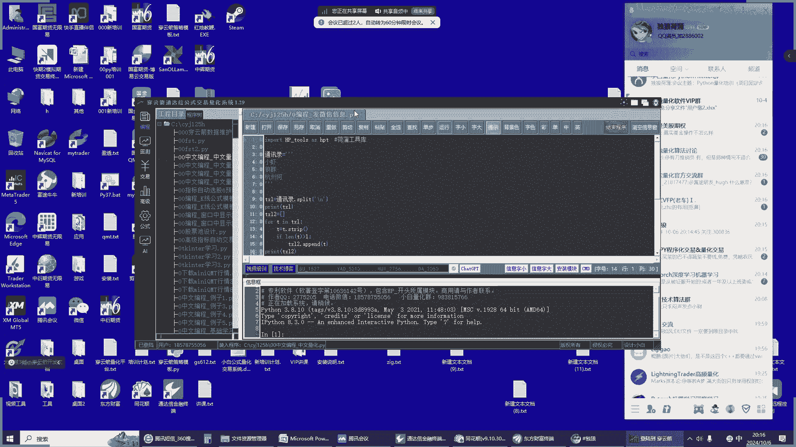

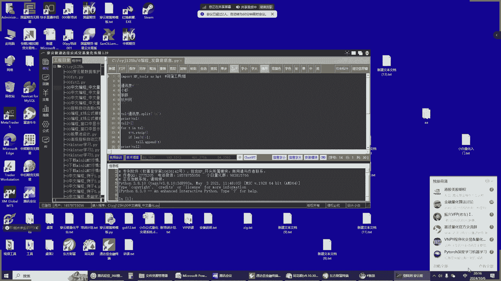

我们测试下发微信哦，我们可以给自己的群里发，我们找一个，比如说这个小虾，我们给他发一个，我们还可以给自己发，自己给自己发呢，就这个自己给自己发消息，哎我的名字叫通通Python量化，我们把它复制一下。

另外呢还可以给自己群发，比如说你任何一个群发，比如说我们找一个独狼群，我们就叫独狼群吧，我们直接运行这个代码了，实际上是个测试推送也好，实际上这个你可以把它作为一个交易信息。

自己给自己发QQ和发微信都不要钱哦，发短信你要花钱去买，而且需要审核不，你的信息编辑的不好，还不一定能发的出去，比如说你推荐股票，你没资格，估计人家审核都过不了，是不是他正在发送信息，这就在发微信。

我们待会发完了后，因为我们做了一个测试，应该发完了，因为只有三条信息，还在放，还有个独狼群也在放好了，他已经发送完了，你看他这提示了没，已经发送完了，是不是刚才发的28：18分Python推送信息。

你好干嘛呢，就推送到我们这个信息，简单吗，刚才还有前面那几个人，我看给谁发了，给独狼群发了一个，还给两个人发了，给这个小虾发了一个，20：17分发的，还给自己发了一个，自己给自己发了一条信息吧。

没发出去吗，那自己给自己发不了吗，所以呢微信发送信息也可以，就说你在家里把策略运行起来，你给自己发微信发短信，哎，这个股票有买点了，买进那个股票有卖点了卖出，今天呢讲课呢主要是给大家讲了这些内容。

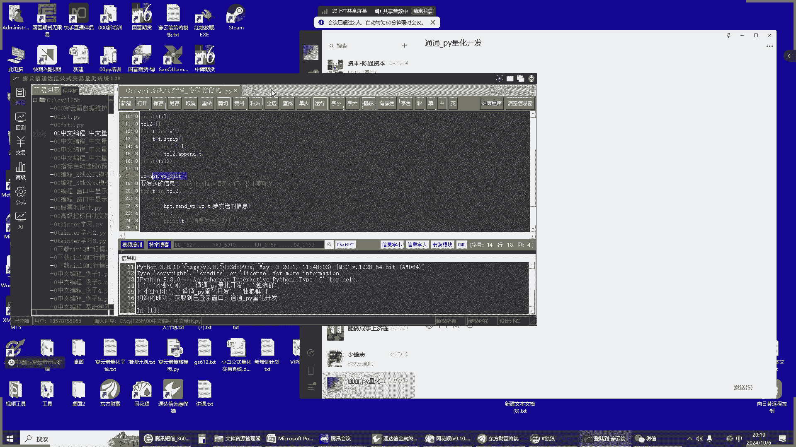

我看看还有应该没有别的了，还有发钉钉，我们就不讲了啊，钉钉你要首先创建一个钉钉机器人，也可以发，我们这全都可以发，所以感到今天主要的问题，怎么样选一个热点股票池，你找不到的话。

就可以用它系统默认的有了末点热点股票池，并不是说你股票池里每只股票买，因为你的策略在择时去买，满足你的指标的策略，买点你才去买，你也不是瞎买的，对不对，所以你就不用担心股票池肯定有不涨的。

那它不涨呢跟你跟你买不买有什么关系，没任何关系的，就是我们选个股票持尽可能大多数股票会涨，这样我才能大概率的挣钱，对不对，如果你大股多数股票都下跌，那你不是没有买点或者买进就止损就亏钱了。

所以我们这都是不是就是说你选选不了的话，就用我刚才讲的，今讲的那些内容，你就可以自己选，这个呢因为你发信息的话，不论是微信还是QQ，他呢实际上都跟同花顺一样，都采用的外挂。

因为人家不允许你去发这些批量发信息，对不对，为什么我们用同花顺的外挂呢，因为你期货就不用啊，期货人家允许个人去量化交易，你可以直接申请个端口，直连交易所下单买卖，那股票不允许个人去交易。

那你只能变相的用同花顺来外挂的来操作，你也不能，对不对，呼亚麻，你就用mini k m t，就是mini k m t申请的权限，权限呢，首先你要是有资金够大，第二个呢你要是合法的投资者才行。

如果大家呢对这些知识有什么疑问呢，可以加我的微信，可以咨询，18578755056，你们可以到时候加我的微信，我然后还有7分钟时间，我们就把讲课准备就停了，大家停了以后呢。

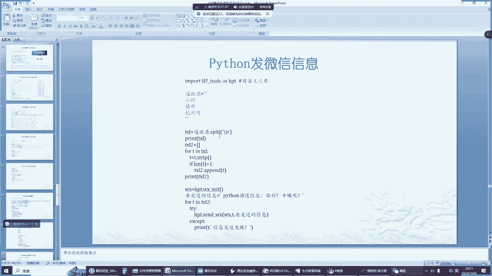

因为我们就录课就停了。