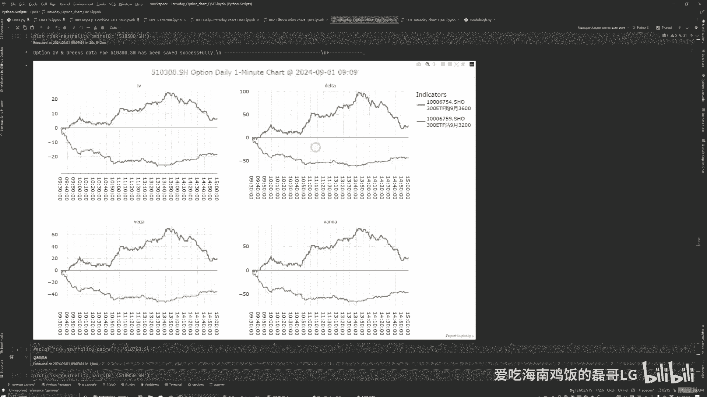
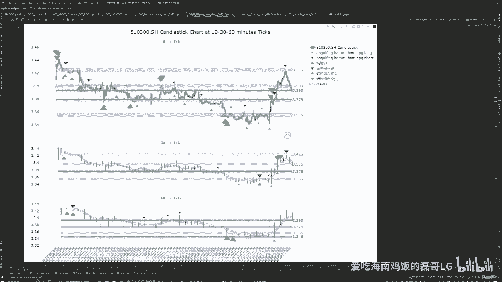
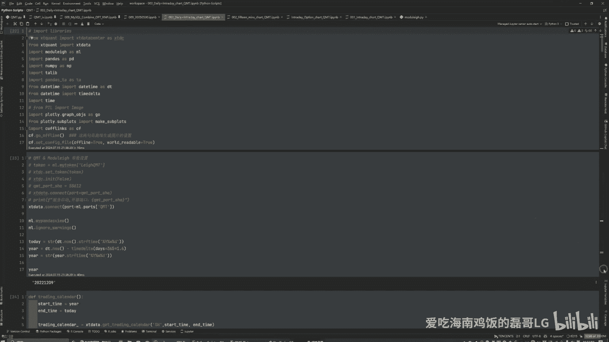
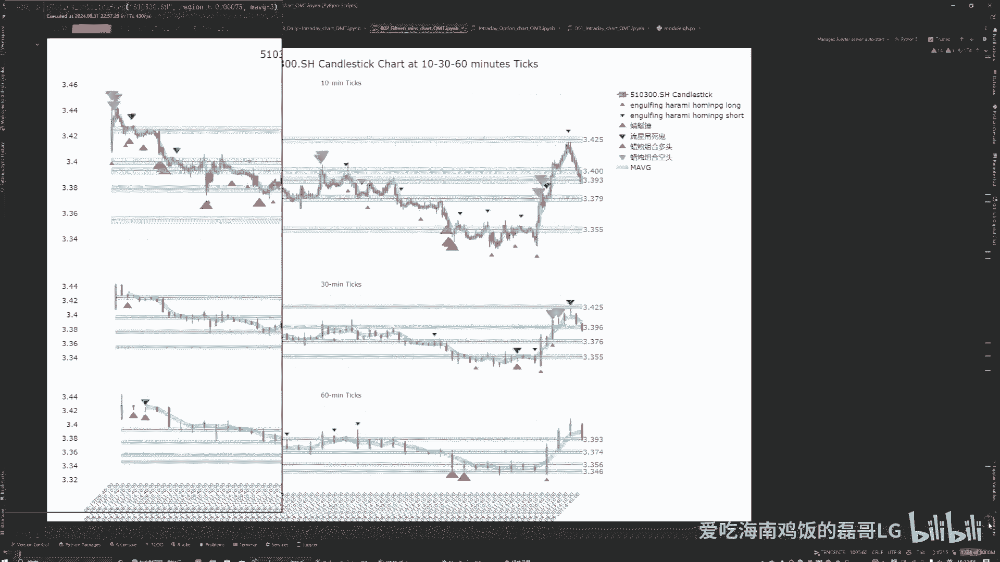
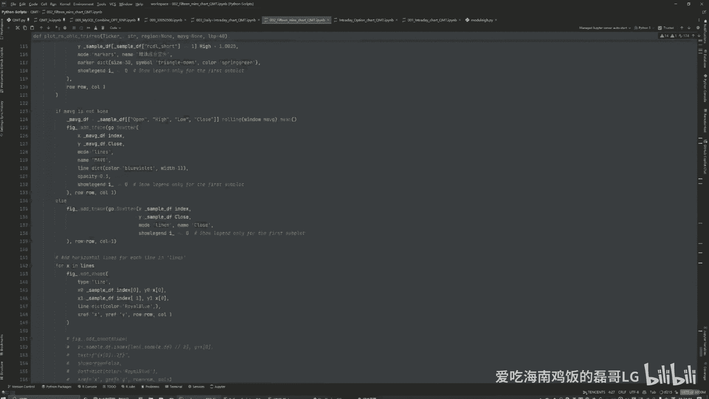
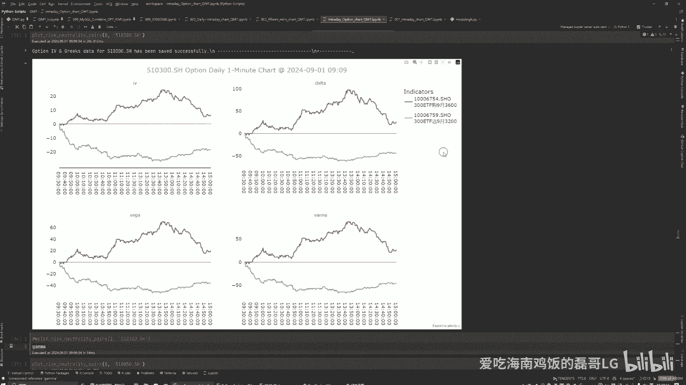

# 2024年8月30日期权交易复盘及量化闲聊 - P1 - 爱吃海南鸡饭的磊哥LG - BV1WvHvepE9i

大家好，我是爱吃海南鸡饭的磊哥啊，今天的话呢跟大家分享一下，我在2024年8月30号做期权的啊，这么一个实盘的一个回顾吧，我的目前的话呢是做实盘，已经开始了一个月的这么一个时间啊。

这一个月相对来讲还是比较平稳的，一直到8月份的最后一天啊，我不知道有多少这个朋友的话呢，有关注到8月最后一个交易日啊，这个咱们大盘是反击啊，非常大的这么一个回击的这么一个交易量啊，方方面面从宏观经济上。

还有一些这个宏观政策呀，宏观经济方面的这么一个反击啊，我们的市场表现出来非常好的这么一个韧性啊，交易量的话是突破了9000亿啊，这最近是很少很少看到的啊，那对于我们这个期权的这个交易人来讲的话呢。

呃他未必是件好事，因为我们是做对冲策略的，所以说这个单向市场的这种巨大波动的话，我们是要进行一定的这个啊调整措施的，那我们今天的话呢就跟大家分享一下啊，看看我是当时又犯了什么错误。

然后还有也希望这个有经验的大咖们，能多多的给我指点啊，大家能够多多的这个沟通交流啊，我们来看一下呃，我主要是做这个沪深300的这个ETF期权的啊，那这也是呢，当天的这个四个希腊字母的一个走势啊。

基本上都差不多，然后我可以简单的跟大家分享一下啊，这第一个是隐含波动率，这个是期权里面的一个重要的一个指标，Delta，delta的话呢他是这个啊，delta的话呢他是这个期权价值和底层资产。

也就是说沪深300的这么一个变动的，这么一个指标，然后VEGA的话呢，他是底层资产和波动率的这个变动指标，VANNA的话呢简单的理解的话就是delta乘以vega，也就是看什么呢，看这个底层资产啊。

对不起，是这个期权和底层资产和波动率，之间的这么一个变动关系啊，那我们知道的，就是在8月30号开盘以后的话呢，这个大盘是直线拉升，然后在11点以后的话呢，还是有一波上扬，一直到下午的两点钟左右啊。

他是有这么一波的这个强势的上涨，然后呢他还走了一个平台，然后才慢慢慢慢的接着往上走啊，那我们先分成几个时间段，第一个时间段的话呢就是在11点之前，11点之前呢，我们可以看到这个delta啊。

他是这个期权的价格和这个底层资产价格的，这么之间的这么一个关系，我们可以看到这个看涨期权，他的delta并没有说涨得很快，但我们的这个看空（沽）的期权，反而它会跌的非常的快。

那这样的话呢就给我们一个信息是什么呢，如果在这个时候你是做空看跌期权的话，那你的收益的话肯定是要比买涨要多的，为什么，因为它的波动更大啊，delta的波动更大啊，那我当时呢也是这个操作。

我是卖了三手这个看沽的期权，然后买了两手看购的期权，总共是五个合约嗯，大概的话呢是给我覆盖回来，有500块钱的这么一个利润吧，那然后呢是到了11点钟的时候，在11点钟的时候呢，大盘接着上扬啊。

往上这个突破各种阻力位，但在这个期间，大家看一下这个看涨期权的，这个delta是一直在增加，但是看空期权的delta反而没有太多的变化，但这个情况的话呢，对于我做这个双卖策略啊，我是主要是做双卖策略。

那对于我们这些投资者来讲的话呢，这就是一个不是特别友好的一个信号了，因为什么，因为我们在空，空这个做做空这个看跌期权的话呢，它并没有太多的收益了，它的收益是停止的，但是我们看空上涨期权的话呢。

看涨做空看涨期权的话呢，是在一个亏损的这么一个状态，那也就是说在这一段期间的话呢，这一段期间啊，这段期间的话呢，我是处于一个非常严重的亏损的状态，而且再加上我经验不多，我反而没有任何太好的这么一个方案。

如何来弥补我这个亏损，即使我做空看跌期权也是没有任何收益的，你看他的delta它是平的，也就是对于我来讲的话，你做空，看跌期权完全没有任何收益，但是看着你只能买看涨期权，但是你又不确定。

你又不确定它到底能涨到哪，它能无限制的往上涨吗，也不是啊，那这种期间的话只能等待一点办法没有，要么平仓，要么等待，那就看你的这个利润有多少啊，我当时的利润是有2000多，3000块钱不到，对我的利润。

但是这一波走完以后的话，我的利润基本上也就剩了1000块钱左右，对并不是很理想好，然后在尾盘的这一个小时当中的话，我是做空了这个看涨期权，因为我是觉得说你不可能无限制一直往上涨嘛，那在这一波对冲的话呢。

那我还是说想尝试一下做卖卖，卖出这个看涨期权来弥补我的损失，在尾盘这一波的话呢又弥补回来大概500块钱，这整个一天的话也就做出来，大概有1000块钱的损失嘛，对啊弥补了1000块钱的损失啊。

这相对来讲还算是嗯，后面这个简直就是一个对于新人来讲的话，就是一个神来之笔了，我觉得这只是一个感觉了，但是也算是歪打正着吧啊，那我们来看一看这种单边的行情的话，不要不要过多的操作。

这个并不是一个好的操作，其实我当时也看到了大盘在涨，我没有做出任何的行动，或者说砍仓这个空涨的期权啊，啊或者说在加大我的这个空沽的期权，来弥补我这一部分损失，我都没有做啊，我觉得这不是一个理性的操作。

这是其一，第二的话我也不知道它上涨到底能上涨多少呃，这个都是很多的不确定性，但是能确定的就是它不可能涨太多，是你可以涨1%，2%，3%…，但是你超过3%的时候，在这种市场上又能出现几次呢是吧。

那肯定是个小概率事件嘛，所以说我只能等哎，那刚才跟大家说这么多关于delta的，其实这个delta的变动值的话呢，它的一个希腊字母就是伽马哎GAMMA啊，伽马的伽马代表的就是delta的变化速度啊。

这个也是咱们做量化的期权，量化的一个关键的一个指标啊，嗯那也就是说在那一天的话，我是体验到了一次看购期权，就是看多期权的一个gamma指标的一个飙升啊，这个是不常见的嗯。

但是呢也很有这个学习的这个必要性啊，我我是最近是准备说在这个图上，再把伽马的这个变动值唉加上来，这样的话呢，可以也能帮我更多的理解这个伽马的变呃，伽马的变动啊，对那我们来看一下另外一张图。

另外一张图的话是我做这个日内的话，主要看的一张图，这是三个时段，10分钟，30分钟和60分钟的这个分钟图，这是由这个算法出来的一些阻力位，那我们可以看一下，在8月30号这一天，你看大盘涨了长得有多凶啊。

这个突破了三个阻力位，一个这俩其实可以算一个太窄了吗，这一个两个三呃，带第三个停止啊，就底下的这个算一个支撑位吧，也算半个阻力位，也就一个两个三个哈，非常强势啊，我们可以看一看，从沪深300的话。

是从￥3。35一直飙到￥3。41啊，这个对于这我们期权日内期权交易来讲的话，这是非常可怕的一个上涨，那这一波我是抓到了啊，两个看涨期权和三个卖空的呃，看看空这个两个看购期权和三个做空。

三个看估期权弥补了一波，然后这一波是卖看涨期权，也是弥补了一些损失啊，然后大家如果对这个机器学习的这个阻力，支撑位的这个代码感兴趣的话，那我未来也可以跟大家分享一下啊，这个的源代码是油管上的一个啊。

这个大咖量化大咖他分享出来的，我觉得我使用起来的话还是比较好用的啊，我就一直最近的交易的话呢，也是从模拟盘开始，一直到现在这个实盘啊，我都是在参考他这个这个代码，我觉得准确率还算不错，也挺高的。

我主要是在找什么呀，在不同的时间段里面有这种一致的，这种这种看多和看空的信号来进行，帮我这个做这个交易的一个判断，你也不能完全信任它，因为毕竟这这个东西，这个量化这东西也不能说百分之百嘛，是吧啊。

那大家也可以借鉴，如果大家感兴趣的话。

那第二一点的话呢，嗯我的这个我的这个唉。

这第二个这个我的这些代码啥的呢。

都是这个讯投啊，讯投这个量化量化公司呢，为我提供的他们的这个服务啊，然后这个个人感觉还是不错的，因为我之前也是用TuShare，但TuShare的话，实时的这个我也咨询过一个这个实时的期权呢。

这个数据他们是没有的，只能是盘后盘后才能进行分析啊，但我觉得我个人是觉得说可能不太够用吧，后来我就转转了这个训投这一块，主要就是这个日内的这个，实时数据的这么一个更新，然后大家给大家刚才看的图。

这都是实时数据产生的啊。

就实时的，我是一直看着他每一天这个出来的，任何每一根蜡烛图啊，然后这边的话呢它也是实时的，我是通过这个dash啊，这个前端的dash来通过浏览器来实时的来关注，咱们这个盘面是个什么情况。

然后再进行交易的，我没有完全实现这个呃自动化交易，我觉得那个太难了，这个好多代码还需要需要自己去写去，然后毕竟他不是股票，股票的话，你就直接交易标的资产就行了，但这期权的话你牵扯到标的资产。

你还牵扯到期权的这个交易代码，所以说这个是，我觉得不是上了一个档次的难度啊，这个还是还是比较难的啊，然后最后一点的话呢跟大家分享一个，就是我我在我为什么会关注到期权这一块，就是我是去年2023年的时候。

正好报名这个CQF这个协会的这么一个课程，当时是6万5左右吧，但现在我不知道是多少了，但是在国外报名的话是2万美金嘛，还是2万欧元啊，还挺贵的，国内咱们国内还是相对来讲比较啊，比较便宜的啊。

因为毕竟这个高顿嘛，高顿是他的这个啊承销商吧，算是因为之前的CQF，其实已经有20年的这个历史了，但是他一直也没做起来，主要就是在国内，没有什么特别好的这种合作伙伴。

后来他自己单做做宣传的话也不是特别的理想，然后就找了咱们这个高尊这个机构，我当时是是孩子出生以后，我觉得没什么事做，结果就在这个陪产期的时候，就一直在学这个Python，自学嘛，学了5年。

然后我本人就是做这个金融块的啊，然后我的英语水平啊，我的计算机水平和我的这个额数学的水平，还有对金融经济的理解什么的，就相对来讲还是还是算是不错吧，啊哈至少在大学本科的这些东西全用得上。

然后正好再通过一年的时间吧，把这个CQF给考下来了，然后CQF里面大部分设计的都是这个啊，期权这一块的嗯，我之前的话是对期权有一定的了解，但是没有说做过这个实操。

而且咱们国内的这个门槛也相对来讲比较高嘛（50万月流水开户，我也就是没有，之前也没有去这个做这方面的交易，一直是在做这个A股的这么一个呃，主要是炒股票对，但后来发现说这个我个人。

因为之前在国外留学的时候啊，这个做这个日内交易也是比较多的，所以说我对这个而且还可以双向交易，那正好期权的话是跟，美股的这个交易策略其实是大同小异了，但是我在美股也没有做这个期权。

然后回来以后实在是找不到这种双向T加零的，这个交易的这个方法，那后来就是说要通过CQF学了一下，这个期权的相关的知识，然后再加上这个嗯周围朋友的一些介绍吧，然后就也开始了我的这个期权的这么一个。

量化的一个路程吧，对嗯，反正这就是我今天那个，跟大家分享的一些内容吧，然后也希望如果有大佬看到的话，也希望能够指点迷津是吧，嗯大家多多交流啊，让我对我这个代码感兴趣的话，朋友的话呢嗯可以给我留言。

然后我可以把这个阻力支撑位置代码，然后跟大家分享一下，然后可以看一下他大概是怎么计算出来的，大家可以看一看，学一学习，我觉得量化这个这个过程啊，它是一个漫长的一个过程啊，呃这么说吧。

其实有很多这个广告啊，什么乱七八糟的，什么Python这Python那的，给大家简单的科普一下吧，如果你的数学水平，假如你想做量化的话，你的数学水平没那么好的话，呃还是要谨慎一些，另外一点的话。

还有你的计算机水平，我觉得你想在量化这一块，或者量化再深一点的话，机器学习和深度学习这一块儿，你想有深耕的话，我觉得没有个3、5年的这么一个，代码的经验的话，嗯很难有一定的难度，我不我不是说量化没门槛。

他是有门槛的，不要去轻信那些什么打的那些广告什么的，嗯得还是要结合看自己的这个情况啊，嗯行反正今天就跟大家分享到这吧，嗯喜欢的朋友的话，请给我一个一键三连啊。

