# 2024年金融大神老师讲解量化金融分析师.AQF—量化金融专业知识与实务 - P18：《+威❤hhh427501  了解获取全套课程》06.优矿策略_小市值因子策略 - 量化沿前 - BV1oU411U7QM

好各位同学大家好，那么接下来的话呢我们就开始实战的来，去跟大家去讲啊，额我们这个优矿里面的一些策略，那么在我们这个里面的话呢，我们是先跟大家讲几个比较简单的啊，小市值策略完了之后的话呢。

再讲一个双金券策略对吧，后面的话呢，我会教大家怎么在优酷上去获取数据，然后呢下载成我们的那个嗯CSV，那么你就可以再去本地去使用了，呃原来一直以为这个优矿把这个功能给禁了啊，现在又出来了。

只是呃带了一点限制，这非常嗯，还是对我们来说是非常好的一个消息啦，这种好，那么后面的话呢呃是我们两个重头戏啊，铀矿因为你如果用铀矿不做多因子的话呢，那哈这个有点浪费了对吧，暴甜天欧了对吧。

所以呢对我们来说额两个重头戏，一个是单因子，还有一个呢是我们的多因子啊，那么基本上我们会把就是真真正正实盘当中的，多因子的一个完整的一个过程，在我们的呃优矿这个里面，课程里面我们都会来去跟大家去讲啊。

好那么我们整个课程还是非常的那种实战的，对吧好，那么其他就不多说了，先来看一个小市值策略，小市值策略的话呢，我们会发现，在我们这个里面用的是0313年到14年啊，回测期是这一年我没改，回测太长啊。

因为我的内存只有1G，你的内存额回测时间一长的话呢，这个微核就会这个呃，油矿的这个微和它就会爆掉对吧，那这个就没办法了，那对我们来说的话呢，大家可以用那个积分去兑换对吧，或者换多邮箱去注册哈。

这其实方法有很多啊，那么在这个里面请为了做演示啊，那么我们在这个里面要跟大家说的是，用一年去回测，我也不知道，那么来看一下，这个，就是我们的一个非常简单的一个多因子策略，额单额小市值的这种单因子策略啊。

但是我们会发现市值策略，这种嗯小市值的这个策略啊，就这一年年化的收益率，是不是63。3%啊，完了之后的话呢，呃它的基准呢只有百分之什么负的8%，所以多板数啊在牛市之前啊。

小市值策略是非常非常有效的一个策略对吧，特别是12年到14年这段时间里面，我们会发现，其实呃股票市场表现的并不是特别好，但是小市值的股票，就单一个这个小市值这个因子就可以。

往往会获得特别大的一个什么超额收益，对吧，这个阿尔法问题吧，好那么我们一起来看一下这个策略啊，这个策略没有任何的新的东西，所有用到的东西在我们前面都是跟大家讲过的，明白意思吧，好。

那么先来把我们这个策略的整个框架，带大家看一下啊，这是我的什么，这个是我们的参数设置的部分，对不对，这是什么，这是我们的一个账户配置，对不对，好后面的话呢怎么样，这是一个什么。

我要初始化我的策略的一个运行环境，那么在这个里面我们可能不需要什么呃，全局变量对吧，所以呢这个我们就不用去做了，那么直接pass后面的话呢是我们的一个handle data，汉德德塔式。

给大家讲的是我们整个策略的一个怎么样哎，运行逻辑问题吧，好那么接下来的话呢我们就一个个来看啊，首先来看我策略回测期是13年的，1月1号到14年的1月1号没听吧，我的整个策略回测期是一年好。

那么呃来看这里的universe，这个universe是多少呢，dynamic universe a全A股的dynamic universe，就跟我的沪深300。

是不是也有一个dynamic universe啊，那么A股为什么也会有胆能培育那么大，沪深三零是因为我要调成成分股，虽然我的总数都是三三百，但是今年可能是这300至，明年可能是那300只。

300只里面是不是有可能有个十几20来只，是不是被换掉了对吧，那么A股也是一样，它今年的A股的全市场，跟我明年的A股的全市场股份是不一样的，因为有些股票会退市，有些股票会怎么样，新上市能理解意思吧。

哎所以对我们来说，我们拿的是每一年具体的那个动态的，那个权益股没问题吧，好后面这个用法是不是啊，apply点apply filter，它指的什么意思啊，哎这个我是不是要过滤了，那么过滤是怎么过的。

我们用的是呃，这是上一节课和大家讲的这个facts方法，FAC对象是不是去过滤的，对不对，哎好这个用法大家应该还记得对吧，就是factor点factor的这个因子的名字，完了之后的话呢。

我要取最大的还是最小的n small20就非常简单，就是取最小的20个没问题吧，哎回过头来看一下啊，这为什么要跟大家讲这里啊，就是我们之前刚刚在这里跟大家讲过，dynamic universe里面。

我们可以通过一个apply filter的方法，完了之后的话呢，这个里面就可以调用前面的FIFFACT，然后呢这个factor的名字我要取大还是取小，没地方好，那么这样的话呢。

也就是说我的universe现在已经确定下来了，是什么，全A股下面的市值最小的这20只股票，没问题吧，哎好我的benchmark是什么，是沪深300，然后呢我的频率是多少呢。

我是呃日线的还是分周线呃级别的，日线的refresh rate呃，刷新率就是monthly one，这个是不是也跟大家讲过，weekly one就是每周的第一天。

monthly one就是每周的每年的是吗，啊不不每月的什么第一天每天吧，所以我这个策略的话呢，大概是多久REBALANCE一次啊，哎大概是一个月，不是大概要就就是一个月REBALANCE一次。

没问题吧，好那么接下来的话呢就是account等于self accounts，那么这一行的话呢不用多说了对吧，就在配置我们的一个账户，那么这个里面的话呢这个小事值策略非常简单。

那么在这个里面initialize，注意我们要把context给到他，但是这里面我们没有什么一个全局的这样，一个变量啊，所以我们直接是pass，那么后面的话呢是一个handle data。

handle data的话呢，我们来看啊，这是我们之前的跟大家讲的策略的一个，核心逻辑的一个地方，这问题吧好那注意啊，首先第一个在写策略的时候，你就脑子里就马上反应过来啊，我不管什么策略。

第一个我得先什么拿到我这个账户吧，我是不是要通过这个context这个运行环境，跟我这个账户联系起来了，对吧，哎所以我得拿到这个账户，听明白吧，所以呢在我们这个里面很简单，我怎么去拿到我这里的账户。

Contest get account，那么你这个账户的名字，前面是不是定义了问题吧，好那么后面的话呢是universe，universe等于什么，I get universe，注意这一个是在干嘛。

这一个是在通过context的这个方法去获得，说我这个时间点上在执行这个handle data的时候，我这里的这个什么universe问题吧，怎么去拿到这个universe。

通过context点get universe的方法，之前专门给大家讲过的啊。

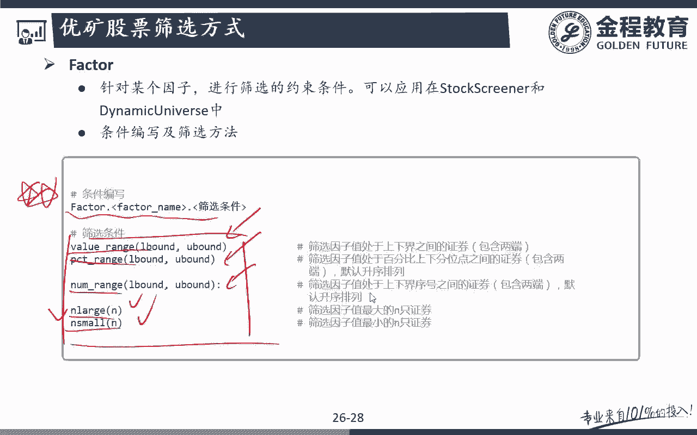

在哪里哎，就在，额就在这那context点get in universe的方法，我是不是相当于我就可以拿到这个时间点上的，我的这个universe里面的这个股票没问题吧。

哎我们大致跟大家先沙盘模拟一下啊，也就是说我是从2013年1月1号开始的，那么1月1号这个里面1月1号这里它是什么，全A股下面的市值最小的三二十只股票，这么地吧，那么这是1月份的啊，有这20只股票。

到2月份呢，到2月份的时候，我这里面是不是又执行了一次这里的handle data，所以呢这个时候我在获得这个universe的时候，我就拿的是2013年2月1号，这一个时间点上。

我市值最小的20只股票，这20只股票可能跟前面的20只股票，有一样的，是不是也有不一样的啊，所以呢在这个里面也是，我为什么以嗯再一次要去调用，我这里的universe的一个原因之一，能理解意思吧。

哎所以对我们来说的话呢，initialize这个函数方法的话呢，我们默认只运行一次，但是handle data的话，那就不一定了，handle data是这两个同时决定的。

也就是我是日线级别还是分周线级别，然后这个策略多久执行一次，是不是都是在这个里面预定的，哎，好所以呢杜马说这一行代码其实就是在干嘛呢，我拿到了我访问到了我这个账户对吧。

这个呢其实我就拿到了当前的一个universe好，那么这个策略为什么简单，我们会发现我这个是一个什么策略啊，小市值策略对吧。

这个小市值策略其实我前面没额，应该先跟大家讲这个策略逻辑对吧，这个小市值策略的逻辑就很简单，那么我们来看一下啊，这个小市值策略的逻辑就是额每一个月，我都去买什么呢，哎我都去买全A股范围内市值怎么样。

哎市值最小的对吧，20只股票，然后呢等权重去买啊，20只股票嘛，那么等权去买的话呢，所以每只股票的比例就是多少，哎每只股票的比例是不是就是怎么5%啊，那这意思吧，好多久REBALANCE一次呢。

一个月REBALANCE一次，一个月进行一个再次平衡，也就是说对于我们来说的话呢，怎么样，现在这一里的话，这咳咳在这个时候的话呢，刚开始只是主股票好，我买了这20只股票，持有一个月完了之后呢。

在2月1号的时候，我把这20支股票都给换了，然后呢在新买，当在2月1号的时候，市值最小的20只股票再持有，这一个月能理解意思吧，来哇这个策略简单吧，哎这但是这个策略是不是典型的一种对吧。

哎小市值的小市值这个因子的一个策略能听吗，哎这个就是我们这个策略的一个逻辑，那么这个策略的逻辑是这样的话。

能通过我们的优框就可以非常快速的去实现，为什么这么说啊。

我们会发现我的universe就是么，市值全A股市场范围内卖里面，每个月月初的时候，第一第一个交易日的时候，市值最小的20只股票，所以其实说白了我这个里面的universe。

是不是就是我要购买的那20只股票，没问题吧，哎所以说接下来就很简单了，当然怎么做啊，首先第一个account点close all position。

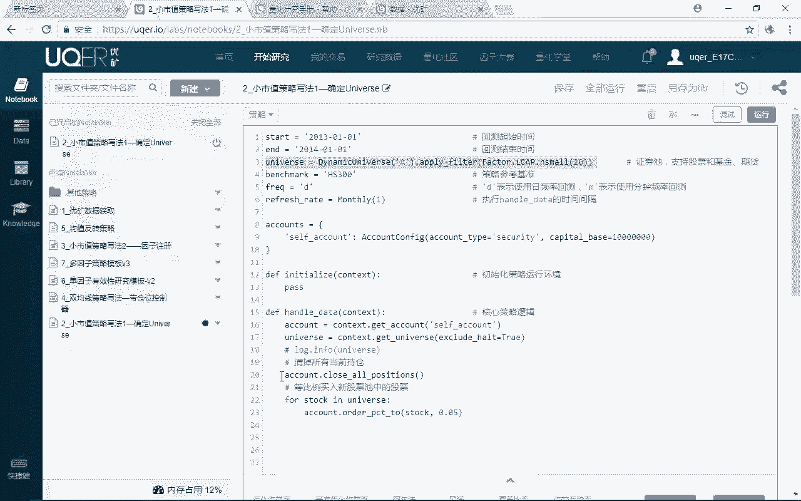

注意还记得吧，这一行代码是在干嘛。

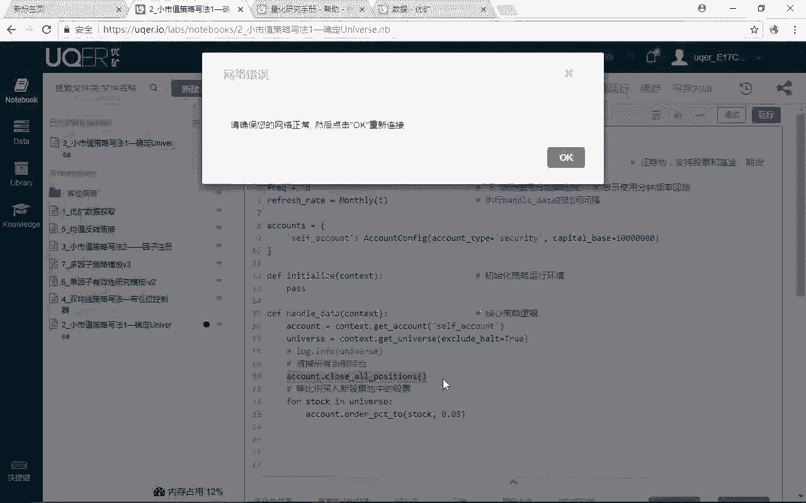

呃在我们看一下我们的网络有没有问题啊，呃这一行代码的话呢其实很简单，他就是在干嘛，都是在把我清掉我所有的持仓对吧，哎刚购刚刚购买前啊，我要把我所有的持仓全都清呃清掉，为什么要有这句话呢。

其实你第一次购买的时候，你是没有其他资产的，你是可以直接买的，能理解意思吧，但是呢对于我们来说的话呢，因为我在下一个月再买，2月1号再买的时候的话呢，怎么样，2月1号再买的时候。

相当于我就做了一个最简单的一个操作，2月呃，1月1号我先买了20只股票，完了之后呢，2月1号的时候，我把1月份买的这20只股票全全都给卖了，再在2月1号的时候再去把2月1号的时候。

市值最小的20只股票再把它给买回来，能理解意思吧，所以清掉所有的当前的持仓，再去买2月份的这个呃20只股票，2月份的那个时间点上的市值最小的20，股票问题吧，哎那么其实这一个呃。

呃一般来说你可以写的更好一些，怎么去写啊，因为我1月份买的这20只股票，跟2月份买的这20只股票里面，是不可能有重叠的对吧，所以呢对我们来说这个就很简单了，怎么去操作啊。

也就是说你可以在这个里面多加一个判断，也就是如果1月份的这个里面有的股票，那么2月份里面也有，我就不操作了，我就继续持有是吧，好了，但是的话呢2月份里面的那些新的那些股票，我们再买。

原来2月1月份里面呃，有2月份里面没有的那些，我就要把它给剔除掉对吧，其实多就是多加了一些判断啊，那对于我们来说的话呢，正正常的情况啊，真实的运作的过程当中啊，我们就要这么一步步去做节约成本嘛对吧。

不然的话你在我这个里面，我把这20只股票全都卖了，再去买回来，20股票如果有一样的话，就5万就浪费了，这一买一买一卖的一个成本能理解是吧，但是为了在这里啊，我们是为了突出啊。

我们这个策略的一个效果原理啊，那些手续费的话呢，我们是没有考虑，那么考虑手续费的话，是在这里，account这里是不是可以考虑啊，可能是等于多少，四类配置等于多少，是不是都可以去考虑一下。

咱们课上是不是前面那个呃，课是不是都是跟大家讲过的问题吧，哎好所以呢第一个我先把它清仓，接下来干嘛，接下来就很简单了，For stock in universe，这两个。

大家有那个本质上来说是一个什么东西啊，唉universe是一个list对吧，就是是我当前市值最小的20只股票，所以for stock in universe。

我是把universe里面的元素一个个取出来，完之account，Order percent to，注意order to和order percent to的区别，order to是我买到多少多少股。

All percentage to，我是买到多少多少比例，听明白意思吧，old percentage to到多少，因为我是买的是20只股票嘛，所以呢等全去买抓20只股票，所以每只股票是不是呃。

percent是不是5%啊，没问题吧，哎所以呢对我们来说，在这个里面的话呢，我们就可以这个行代码是不是已经写完了，所以呢这是最简单的一个小数值策略，也就是说每个月呃。

我呢让优矿帮我选出市值最小的20只股票，放在我的universe里面，然后的话呢我通过跟我account账户的一个交互，接下去怎么做，把我这个universe里面的每只股票拿出来，都买5%问题吧。

那么到下一个月的话呢，先把这上一个买的五十二十只股票先全都卖掉，再买2月份给我来的这20只股票问题吧，哎那么我们可以把这个策略来运行一下啊，我们不知道这里网速怎么样啊，这个，稍微等一下啊，呃。

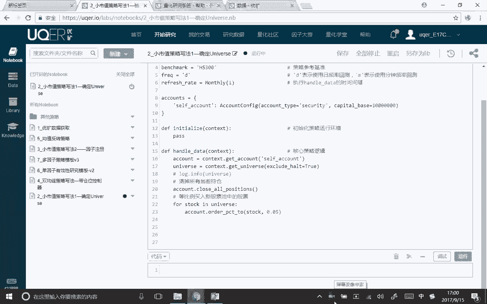

可能还是，会受到一些影响。

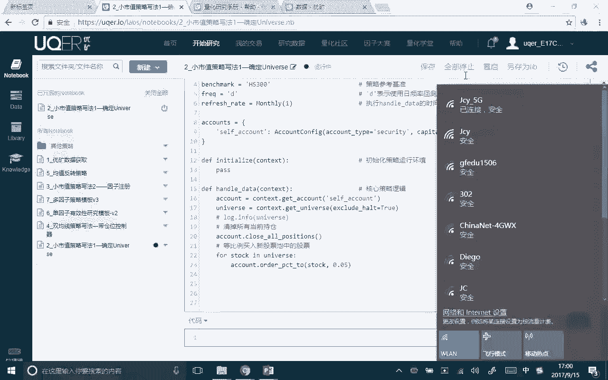

他，哎出来了，咳咳额，在我们这个里面嗯，我们可以看到，我们这里的年化收益率是63。3%啊，完了之后呢，年化的基准因为313年14年啊，股票行情不怎么样啊，所以我们的阿尔法是不是特别高啊。

哎贝塔SHAPERRO，这些答案应该都是会知的，都会了好，那么在这里跟大家讲一下策呃，优矿策略的这样另外一个用法，就是呃交易完成了之后的话。

那我们可以看这里面的一个回测详情啊，就可以看看我们这里的策略到底有没有完成。

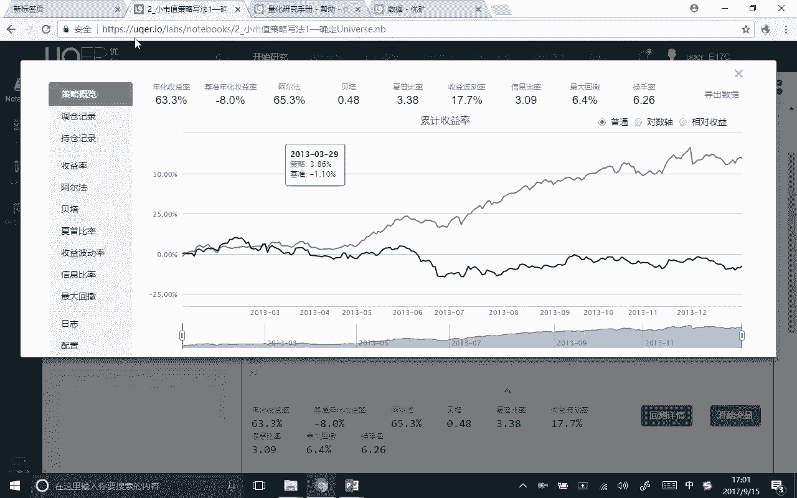

我们的这里好，那么在我们这个里面，我们可以来看到1月4号的话呢，我们是怎么样呃，20个单词对吧好，那么我是买了这20只股票，这20只股票是我当时1月份的时候，市值最小的好。

那么接下去的话呢呃2月1号的时候的话呢，我是卖了这额，把原来的20只股票把它给卖了，再买原额后面的这20只股票呃，再去呃买我后面的这个股票，这没地方好，但是呃呃在我们这个里面稍微会有些小问题的。

就是在于我们前面跟大家讲过啊，我们同时如果是麦和买的话，我们先处理的是卖，再处理的是什么，买对吧，哎，那么其实一般来说不太影响我们最终的这样的，一个结果啊，那么呃但是还是会有一些稍微的一个影响。

我们来看一下啊，呃我们发现这里跟我们想的还不太一样啊，大家可以看到呃，因为我们想的是应该是买20只股票，完了之后呢，再呃下一个月把这20只股票卖了之后，再卖20只，下一个月呃市值最小的这20只股票对吧。

但是我们会发现这个里面这个优矿里面嗯，3月1号这个里面我们只处理了36个订单，38有多有少啊，那说明我们这个里面还是有些问题啊，我们来看一下嗯，看这里有问题的这个里面啊，大家可以来看啊。

后面的一个订单状态啊，我们会发现有些时候可能会有一个费单，那么费单在这个里面他说明了看到没有，也就是正常情况下，我应该在那当当天第一个交易日里面，把我这20只股票全都把它给卖了。

再买新买的20只股票能理解意思吧，那么在这个里面，优矿呃，在这个里面其实可能会有一个问题，就在于说赵20只股票，那时候我当时这一天我想卖这支股票，但是呢卖不掉了对吧，因为怎么样，可能是涨停了。

听明白意思吧，呃呃不卖不掉了，可能是跌停了，所以我卖不掉了对吧，所以呢呃在我们这个里面，我买单，这里可能也是会有一些额无可卖头寸，买是我们看一下买了几只，123456789十十一十二十。

三十四十五十六十七嗯，那么应该呃有这样一个可能性啊，比如说在这个里面嗯，四呃我的股票太多了，我一共是45，各订单哦不对，这个是我的订单记录啊，那么这里是我的一个持仓记录。

那么持仓记录里面呢可能会有20只股票，这20只股票都是对的，后面会有16只股票，16只股票的话呢，那可能就存在一种可能性，就是说嗯我当时想买的时候，当天那只股票可能会有涨停或者跌停的，这样一个问题。

所以的话呢呃呃他的一个大致的一个情况，可能都是在40个左右，但是如果我在进行操盘的时候呃，当天进行调仓换股的时候，如果会有一些涨停和跌停的一些问题的话呢，它可能就会存在多买多吃。

多拿一些股票和少拿一些股票的一个原因，那么还有一个可能性。

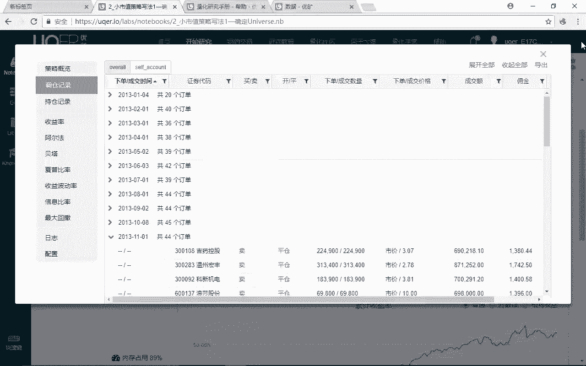

我们想了一下，可能是这里的percentage to的一个问题，这个proceed to他是说我要买到5%，那如果说有些股票我能买不到呃，在我买不到或者卖不掉的情况下，那么我再买到这个5%的话。

可能就有问题了，比如说我原来是有20只股票的，我照道理，应该我把这25只股票全都把它给卖了，把这20只股票全都把它给卖了，再呃买20只股票，这20只股票呢呃我们每只股票买5%，哎。

我们想的是比较理想化的对吧，但是真实情况可能并不是这样，真实情况可能是什么，我想卖的这20只股票里面有一只股票，比如说我们没卖掉，我们只卖掉了19只问题吧，那么接下来我要买的这支股票里面。

我是不是又要买这个呃，2月份再买20只股票里面，我都要买我的整个持仓比例的5%啊，能理解意思吧，所以呢这个时候就可能会有一个问题，我有些股份我就股票我就买不到了。

就会出现类似于像我们前面额股份数就减少了，这样一个问题呃，我持有的持仓的股票数就减少了，这样一个问题啊，所以啊对我们来说，真实情况呃还是相对来说比较复杂的，但是呢呃这个嗯。

你要去额考虑一个真实情况的话呢，就要把这个我们这个策略想额，再做的更robust一点，或者说在做的更这个啧呃更健全一些对吧，那么在我们这个里面的话呢，我们只是说呃把这个思想加给大家啊。

那么确实在这个里面，可能会有一些各种各样的一个问题啊，呃比如说我们持仓啊。

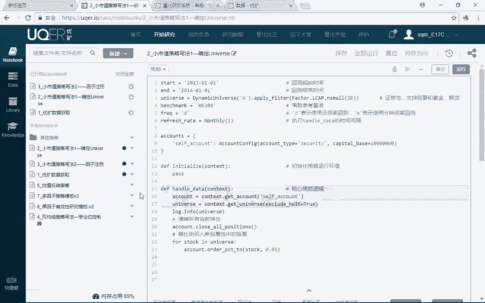

涨跌停的这样的一个问题，那么具体的详细的原因的话，那我们再看一下啊。

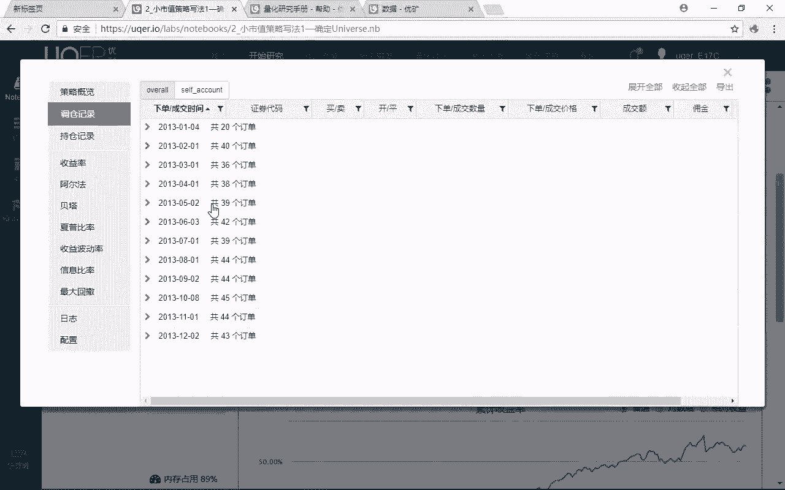

应该应该就是前面我们和大家提到的这个原因，比如说我卖的时候，我有股票我卖不掉，那么我在新买的这20只股票，我每只股票都要买到5%的话，我可能就会再买一些股票，再卖一些股票。

所以呢我们就会出现这样的一个策略的，一个情况了，额所以在我们这个里面，我们的持仓记录就可能会少，可能会多。

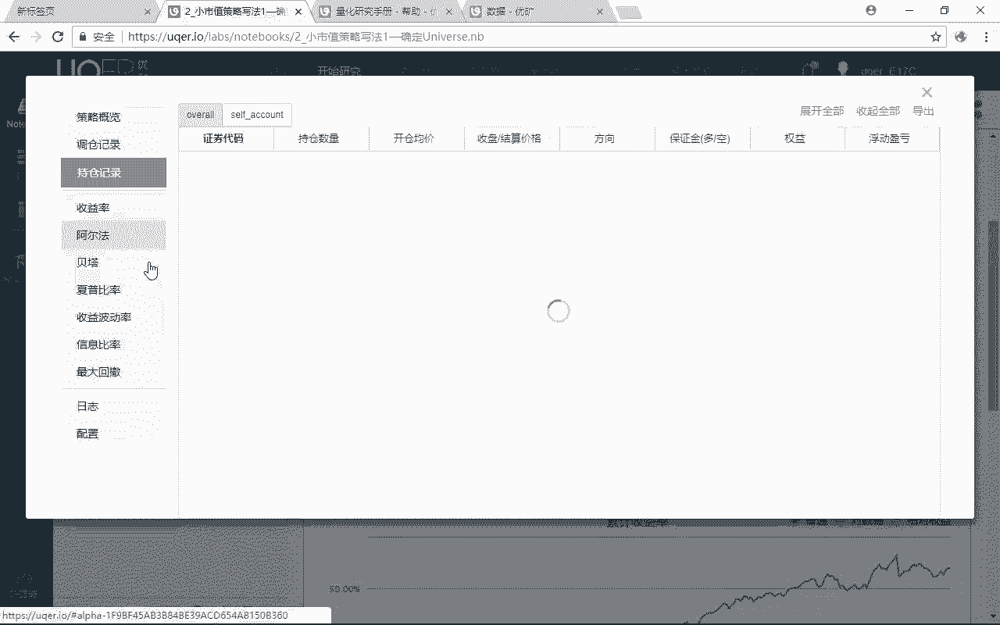

嗯就是这样的一个概念啊，那么具体的一个原因的话呢，应该就是这个原因啊，我们到时候这个结束了之后，我们再看一下，那么基本上的话呢，呃我们把这个策略的这个原理，先跟大家讲明白了。

也就是说我在这个里面先挑选20只，市值最小的股票，没问题吧，好完了之后的话呢，呃我每个月调仓一次呃，在调仓的时候先把原来这20只股票全都卖掉，然后呢剩下的20只股票，我每只股票都买5%，能理解是吧。

或者买到百分之，怎么样买到5%，那么对于我们来说的话呢，呃啊这是这样子的一个情况啊，呃好那么这个策略的话，那我们就讲到这里，确实啊这个策略我们没有呃，把问题想的特别的呃，各方方面想的特别健全。

因为我在卖的时候，可能有些股票我是停牌或者我跌停，我卖不掉，明白意思吧，那么你在买到5%的时候呢，有些股票我就买不到了，我就呃其实实际上来说，我要把我这里的股票买到整，每只股票买到我的5%。

那这个时候可能就是会有一些股票，已经超过我的这个账户的一个价值，我就可能就买不到了，就会多买一些，少买一些这样的一些问题啊，好那么这个策略的原理并不难啊，但是的话呢这一个我们就先讲到这里好，那么看着啊。

我们这个策略是已经写完了对吧，哎大家有没有发现一些什么小问题呢，注意啊，在这个里面我们用order percent to就不是特别好，为什么呢，他就没有用我们的order percent来的更好。

因为什么你看order percent to指的什么意思啊，呃指的是呃我要把我的股票通通买到多少，统统把我这里的股票买到5%，能理解意思吧，哎那么如果正常情况啊，这个我们把原来持有的股票卖掉。

再把它给买回来，再把原来的20只股票卖掉，再买新的20只股票，如果每次都是这样额没有任何的问题，但是我们会发现啊。

在我们买卖股票的时候，可能会发生一个问题，可能会发生一个什么样的一个问题呢，嗯嗯大家可以想啊，呃我们会这样，比如说我呢第一波我先买了20只股票对吧好，那么买了20只股票额，每只股票买5%好。

百分之百的钱花掉对吧好，那么等到调仓换股的时候，我先把这20只股票先通通怎么样卖掉，再买怎么样哎，再买新的20只股票好，再买新的20只股票的话，那每只股票也买5%好，如果说啊，我卖的股票和买的股票。

没有任何的特殊情况的话，我可以正常买，正常卖的话呢，all percent和order percent to都一样，都是可以额完成我们的这个目标的，明明白意思吧，哎但是可能会发生一些什么事情呢。

比如说啊在这个里面，我呢想要怎么样去买这支股票的时候呃，呃比如说这个市值最小的20只股票，是不是有的股票可能会停牌对吧，唉或者说有的股票它可能怎么样，嗯这个呃涨停是不是我没法买对吧。

唉那么假如说啊这十二十只股票里面，我可能只买个只能买到个19只，只能买到个18只，有可能吗，有可能为什么，因为对我们来说，有些股票可能停牌了，有些股票呢可能这个可能这个涨停了。

那么当然这个停牌的这个过程的话呢，我们可以在哪里去进行控制呢，呃停牌的这个过程，我们其实是可以在我们这个universe这里面，我们是可以进行控制的，对吧哎好那么但是我反正选的市值最小的吧。

嗯就算你把停牌剔除掉了，是不是也会也会稍微有些问题对吧好，这是一个问题，我买的时候可能买不到这个20只股票好，那么假如说啊就算我买到了这20支股票，现在我要卖了，卖的时候的话呢，又会有一个问题。

在卖的时候，是不是先要把原来的那20只股票卖掉，再去买新的20只股票好，那么原来二市值股票，如果都是正常交易状态的话，现在可以，我是不是可以把它全都给卖掉，但是如果原来的这20只股票还是一样。

如果有股票是跌停的，或者说有些时候我的这个股票是呃，这个这个停牌的，那么在我这个里面，我还能不能把这20只股票全都卖掉了，哎我是不是卖不掉了，听明白意思吧，哎我就没法把这20只股票全都卖掉了。

假如说啊有一只股票是跌停的话呢，我现在只能卖掉这几只股票，唉只能卖掉对吧，19只股票好，完了之后，接下来我再买20只股票，每只股票额的比例统统买到5%的话，我们就会发现在我们这个里面。

其实因为我原来只能卖掉19只，另外那只股票没卖掉，不管跌停也好，停盘也好，它是不是也会占到我的一个比例啊，所以你接下来你要再给剩下的java10支股票，每只股票买到5%，是不是可能会有问题啊。

有些股票就怎么样买不到了，或者说会成交失败，听明白意思吧，哎而且呢因为对我们来说，当时我这几只股票，当时买的时候确实是占5%啊，但是呢现在这个时候呃，比如说我们的市值价值变化，不可能你当时买的5%。

现在涨涨涨跌跌，过了一个月还5%对吧，所以对马说你这个也达不到5%了，可能会比5%高一点，比如说这只停牌的股票已经占到7%，或者这只股票下跌的话呢，这只股票可能只跌到3%，那么对我来说。

我现在还要让所有的股票变成5%，那么对我原来这个第一批的20只股票，这剩下的这一支股票，我们是不是还得进行一个调仓，比如说我得卖掉几百股，再买入几百股，或者卖掉几千股，再买入几千股，能理解是吧。

哎所以呢这个过程的话呢，我们用order percent to就不太好，因为我要让他确定的到5%，那么正常情况还好啊，如果没有特殊的情况，假如说都是可以正常买卖的，那，Ok。

但是如果说发现一些涨停或者停牌的，一些情况的话呢，order percent to to5%的，我们就会发现，可能最终我们会出现非常非常多的散单，为什么呢，我要不断的进行调整的吧，把我原来卖不掉的。

怎么样，我重重新再调整到5%，但是这个时候卖不掉的，我可能也买不了进来对吧，哎所以到最后我们就会很乱，那么这个时候的话呢，在我们这个里面可以怎么办呢。

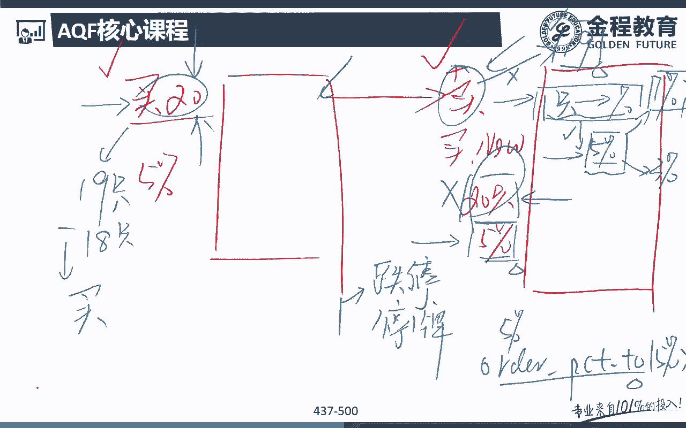

我可以把这里的old percent to，我们把它改成什么old percent，听明思吧，哎那么如果说我们能改到older percent的话，这个时候我们就会发现所有的股票怎么样。

我现在不是买到5%了，是怎么样，在所有的在这个新的universe里面，所有的股票我都买怎么样，5%能理解意思吧，唉这个呢也是有一些嗯这个好的呃，这个这句话没用啊，这个是我们原来那个写法。

那这种方法的话呢有他的一个好处，对应嘛，是因为什么，因为我这里是一种简化的一个手段，我是把原来的20只股票先统统卖掉，再每一只股票买5%，能理解意思吧，哎我不是买到5%啊，我是怎么就直接买5%。

听明白意思吧，哎那么这么做的一个好处。

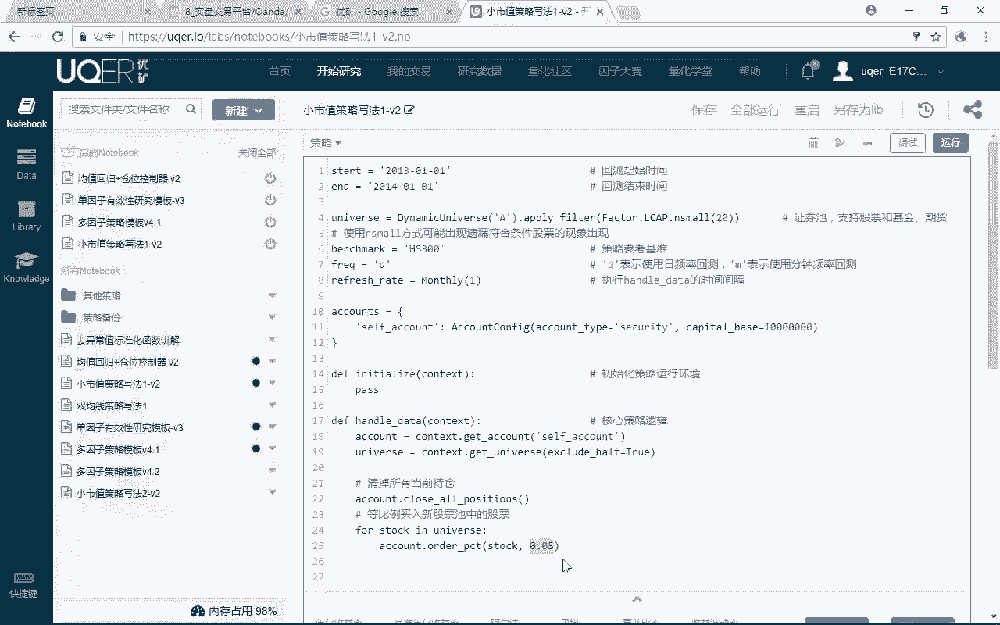

就在于说我们不用再对，如果有些股票卖不掉的话，我可能还会再买一个呃，进行这种小调整，这个就不会再去有了，所以呢对我们来说，这个percent to可能是呃不不是特别好啊。

old percent这种方法的话呢。

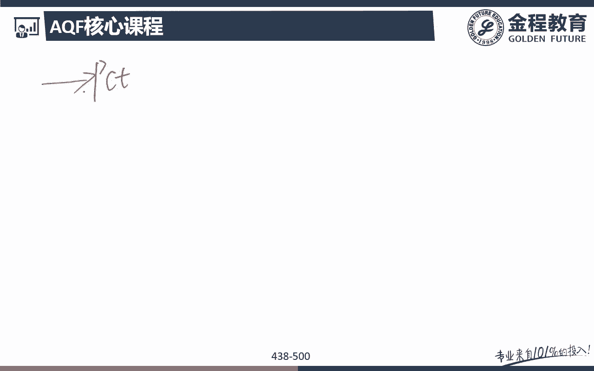

我们认为反而是更好的，呃同时的话呢这还有，但是这个percent也有一个问题啊。

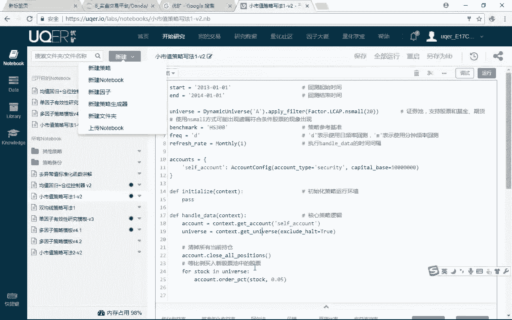

什么问题啊，呃假如说我20只股票，现在第一波的我有一只没卖掉，比如说停牌了，我只能卖掉，怎么样，19只停牌是吧，那么剩下的接着在新的一批20只股票里面，我是不是还得怎么每只股票买5%啊。

哎那么可能前面19只我都能成交的，每只股票买5%，但是剩下最后那一支，也就是新的20只股票里面，最后那一支我可能就无法成交了，或者说我只能怎么部分成交，甚至有可能无法成交，能理解是吧，因为什么。

因为我原来仓位里面还有一只股票，他也占了我的比例啊，你现在再想买每只股票买50%，也有可能会买不到啊，唉但这种问题我们就觉得要比我的PERSORDER，percent to的问题要来的更小一点。

因为order percent to的话呢，它这个他这个方法啊，这个写也呃我们专门也看了啊，呃写的呃，他优化里面他其实写的也不是特别好啊，他的那个整个交易逻辑还是会存在一些问题。

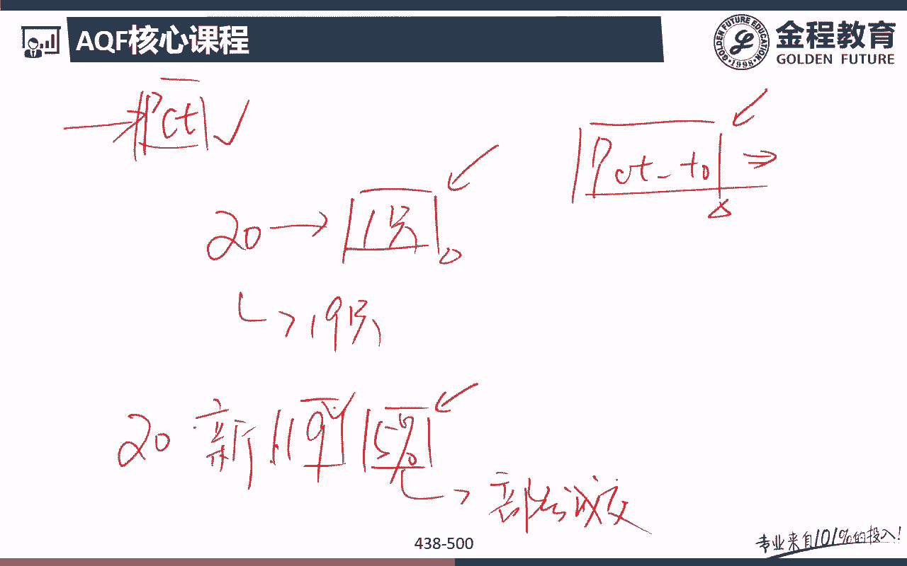

那么我们尽量用这里的percent听明白哎好，那么还有一点啊，要注意的是在这一个点，咳咳其实优矿上面啊，也会有各种各样不断的bug对吧，我们已经找到好几个bug，已经反馈给那个油矿啊。

这个这个不用不知道对吧，用了用了之后发现他其实呃，它内在的那些逻辑方面还是有一些，也是虽然比我们自己写的可能要好啊，但是还是会有一些问题的对吧，回测跟我的模拟交易，都可能会有一些逻辑上的一些问题啊。

好那么其他我们就呃不多说了，那么我们就来看一下，我们这里面的这个运行的这个策略，这个小市值的策略啊，你看其实最简单的一个策略对吧，我们整个把小市值统统把它给运行出来的话呢，也没有特别多行的一个代码。

但是呢我们这里选的是一年的回测期啊，13年到14年，我们来看一下，我们这个小市值的这个具体的表现怎么样，哎我们会发现一三到14年，我的benchmark沪深300，是不是跌的比较惨呐对吧。

但是的话呢在我们这个小市值的这个策略，我们在1314年，只要有市值这个因子，我们就买市值最小的股票，唉我们会发现大幅跑有没有大盘问题吧。

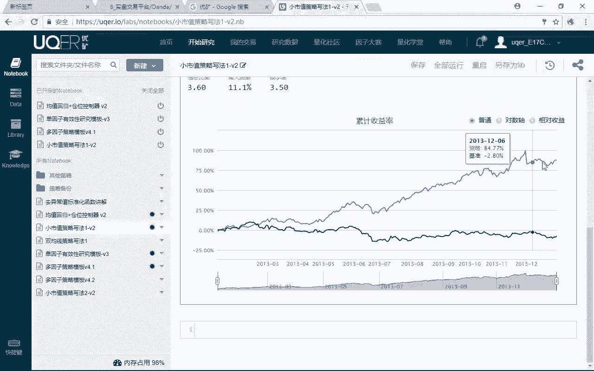

唉他可以获得93%的这样一个收益啊，但是呢这个收益在最近这几最近一段时间啊，不是特别好用，那么我们来看一下这里的回测详情，回头想起的话呢，第一次我是不是就买市值最小的30只，20只股票对吧。

哎在这个里面我们都不呃成交了，这没有问题，那么后面的话呢我们又共40个订单，共40个订单，我们卖掉一些订单，卖买了一些订单对吧，但是在这个时候我们就可能会发现一些问题了，因为什么你看有些股票的话呢。

在这个里面，比如说这个股票600634对吧，我们就会发现他是个废单，无法成交，因为什么很有可能证券是什么停牌的，那么证券停牌我是不是卖不掉了，那么最终导致的一个影响，就是说你看在后面我们会有一些股票。

这些股票的话，那我们就没法买了，那你看就是无可卖投资或现金，我是不是就没钱去买到这些股票了，能理解意思吧，哎那么包括后面也是一样，我再卖一点股票，他其实还是停牌的，那么他既然还是停牌，我后面我买的时候。

我是不是也是只能部分成交，那么后面我有40一个订单，那么40一个订单的话呢，在这个时候我们是这还是停牌的，还是飞弹，那么其他的股票我们可能已经成交了，但是额还有一些是部分成交的，因为我还是停牌的对吧。

看看他什么时候停盘完成啊，那么呃对于我们来说，后面可能还会有一些其他的股票，他也没法卖了，所以我越到后面，我能越买的这个20只股票的5%的比例，我能买到或者不能买到的可能性，是不是就更小了对吧。

哎那么这是我这个策略的额一个呃小缺陷吧。

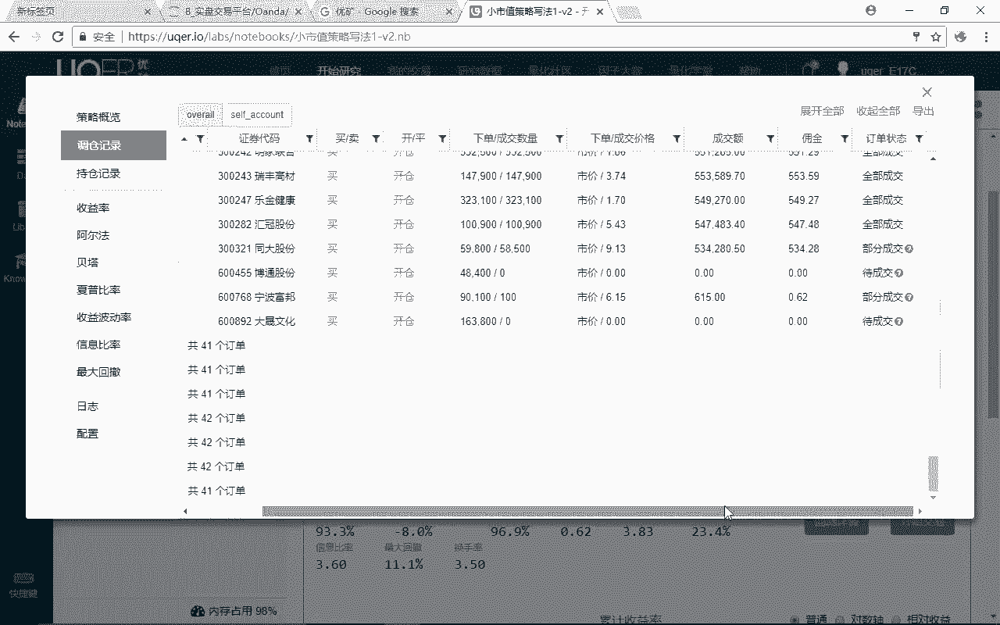

那没关系啊，如果说真的要拿小市值来进行，额策略进行交易的话，其实买个18只，买个19只，其实我们认为也对我们整个策略，是不是也没有一个特别大的一个影响问题吧。

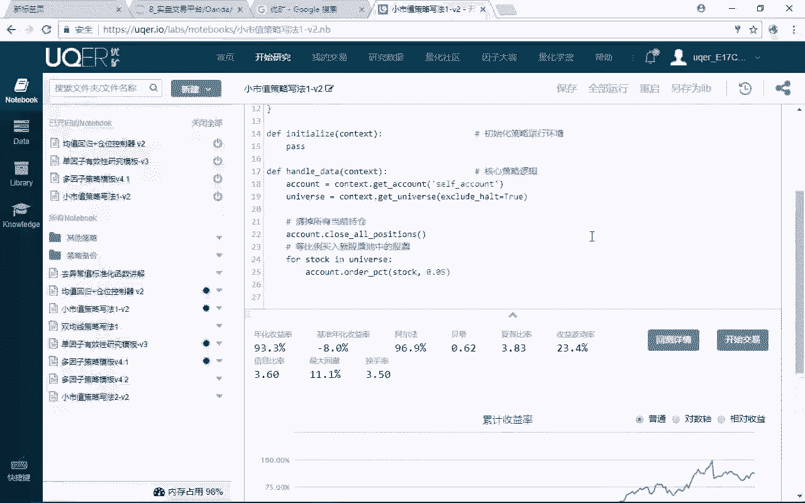

哎好那么这个是我们小市值策略的一个写法啊，那么后面的话呢，我们会教大家用小市值策略里面的，第二个写法好，那么第二个写法也可以去呃，实现我们这个小市值策略，那么这里里的这个小市值策略的话。

