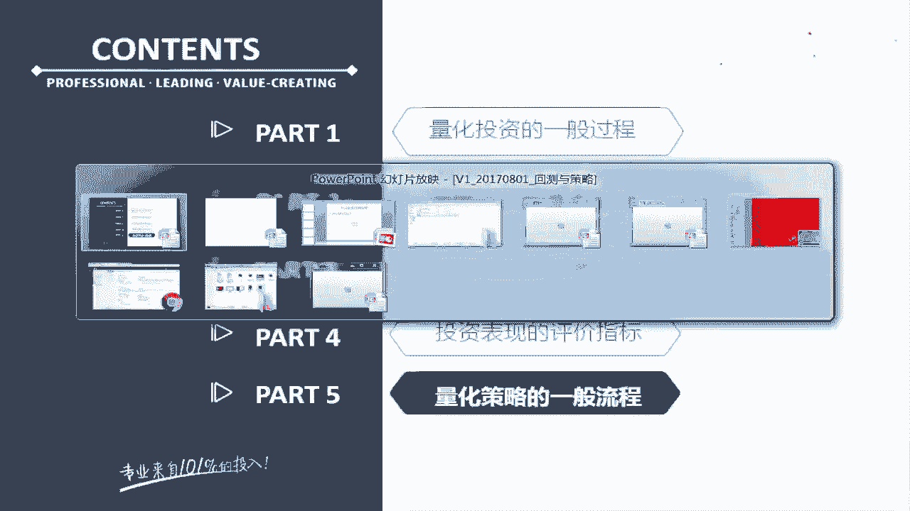
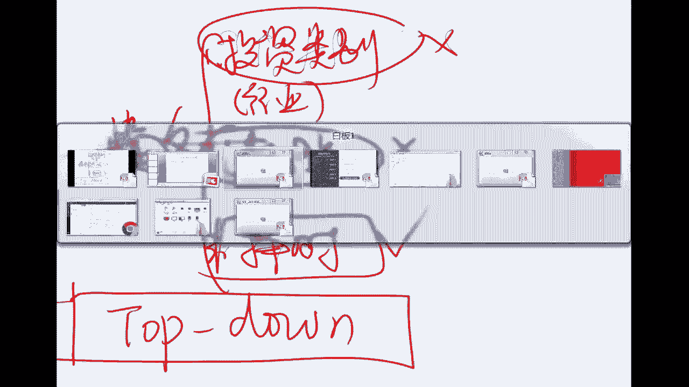
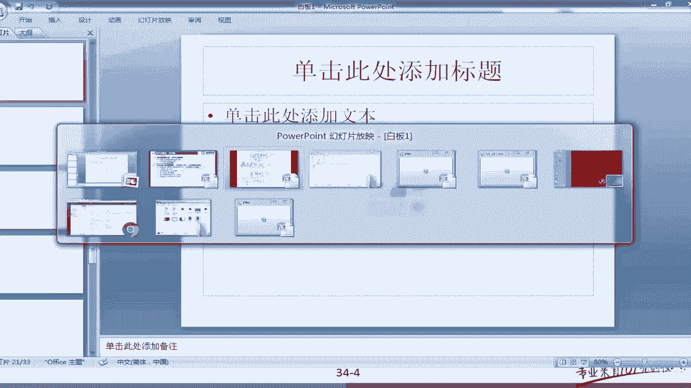
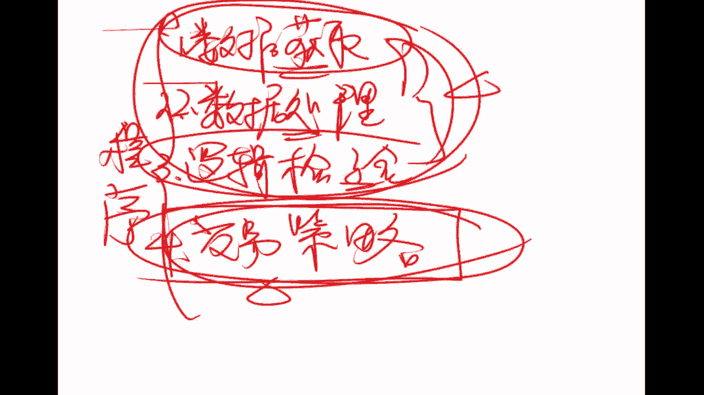
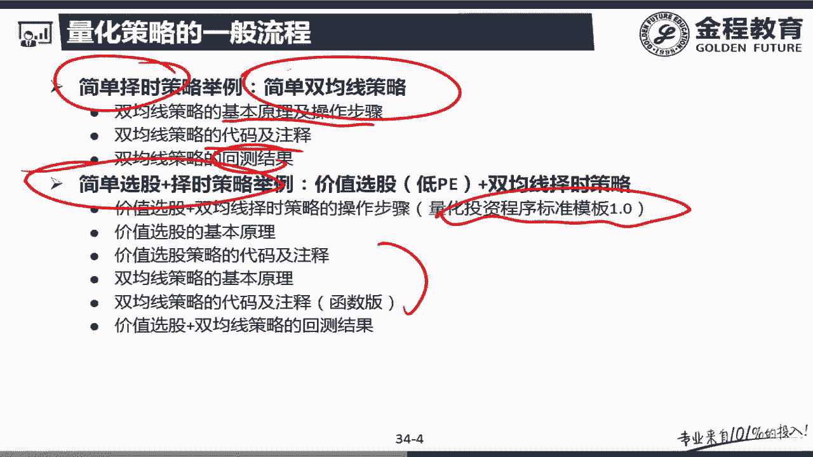
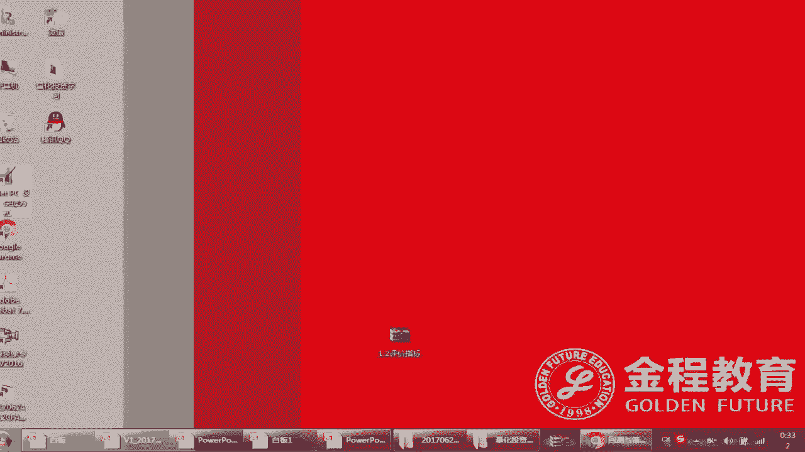
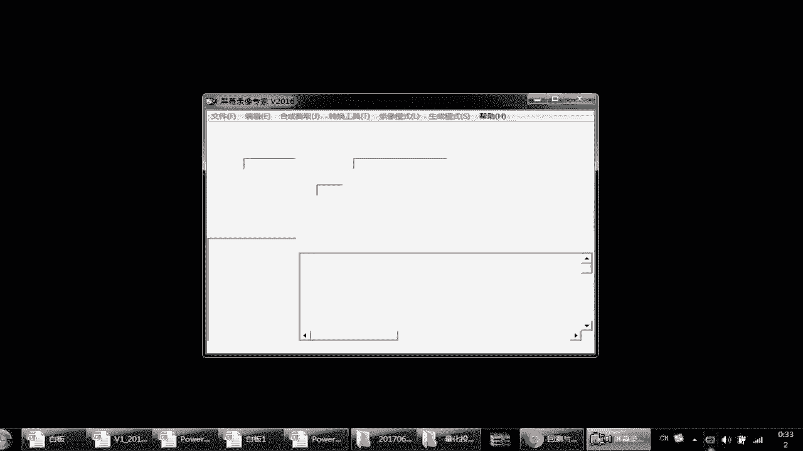

# 2024年金融大神老师讲解量化金融分析师.AQF—量化金融专业知识与实务 - P20：+威❤hhh427501  了解获取全套课程《实盘交易模拟_基于优矿的进阶学习》03.量化投资策略回测之量化策略设计流程简介 - 量化沿前 - BV1oU411U7QM

好各位同学，我们来继续学习，第五个部分，也就是量化策略的一般流程，在讲具体的量化策略流程之前呢，我们还是回顾一下我们如何设计一个量化策略。

来看最开始的时候，我讲过一个人在设计量化策略的时候，其实应该注重的是三个步骤，第一点是寻找什么，寻找规律吧，然后基于这个规律呢，我们要设计出投资的步骤，如果你用的是人工的这种投资策略。

就是一般性的这种投资，实际上它对应的是操盘计划是吧，然后有了操盘计划，实际上我们就应该写一个程序，来代替人进行交易，而我们刚才其实讲过一个，一般性的回测策略是吧，我们这个步骤是什么，对不对。

是不是已经说过，其实就是每一期定期的投100块钱呢，然后当然了，为了投这100块钱，我们程序写了很多很多的东西，所以你看到这个程序，其实是这个步骤的什么一个细化，而我们这里面主要是先给大家讲的。

就是作为一个投资而言啊，不管你是基于什么样的一个规律进行投资，实际上我们的步骤是基本确定的，那么在这个时候，其实它的每一个步骤你可以认为就是什么，其实就是一个模块，是一个模块儿。

然后我们这里面想给大家说什么呢，这个模块具备什么样的一个特性，比如说你在写一个程序的时候，对于设计哪些步骤，也就是说哪些模块你是要处理的，我们来给大家讲一下这个事情，来看关于这个模块的问题。

这个模块啊一般情况我们分为两步，第一种就是初始化，如果大家还有印象的话，我们在写初始化的时候做过什么，是设置你们要模拟的开始和结束时间呢，以及什么，以及比如说像一些环境变量。

比如我这个交易时一天还是一分钟的，然后我是每分钟交一次，还是每10分钟交一次，是不是这些都是一些初始化的策略，而其次第二步是关于投资的策略的部分，或者叫策略，或者你写投资部分这个部分的一些问题。

实际上我们在模块的时候大体分为这两个部分，而对于第一部分的初始化，我们再来看，对于第一部分的初始化，我们又可以分为两个部分，一个是代表投资环境的初始化，比如说A股市场的一些数据。

然后之后呢是关于从投资者的一些初始化，比如说我们当时写过投资者，我们写过什么，是不是capital啊，比如当时我们刚才那个策略告诉大家，是不是有1万块钱呢，这是关于投资者手里有多少钱的。

因为不同的投资者，其实你拿到的钱是不一样的，如果是司投资，可能就是有1000万，对于我们而言，可能只有几10万，这当然了，这个你以后也可能是会变成自动量的几千万，那么这个里面每一个投资者的的这个初始化。

代表的是你要代表的是什么样的一个投资者，而这个环境呢你在做初始化的时候，实际上你是指深入化了认为重要的一部分环境，而有一些情况你会使用默认的一些变量，关于这一点我们一会还会再说。

比如说就是这个佣金的问题，我们一会还会做一个说明，而关于这两个部分的，其实我们用的都是什么方法来进行初始化的，是不是参数设置啊，还记得吗，刚在比如说举个最简单的，举个最简单的例子啊。

刚才我们涉及到的就是开始时点，我们设为这个2014年1月1日，而结出节日数的时点，我们设为什么设为2015年1月1日，其实这就是设置了两个开始和结束的参数，对不对。

那实际上我们重点要说的是关于投资这一部分，就是投资者的这个部分，我们还会说一下一会儿，然后我们先来看关于第一步模块，在于初始化的部分之后，我们就进入策略的部分，策略其实就是那个handle这个函数。

我要写的东西，40策略，这是策略的部分，关于策略我们看啊，实际上是哪部分策略，具体来说我们要第一步要确定你投资的类别，这你投哪一类股票，而注意这个投资类别啊，如果我这么说，你可能比较的抽象，实际。

举个例子，最正常看到的一个投资类别是不是行业啊，选出你投资股票的行业，然后大家看其实在现实生活中啊，你不但是按可以按照行业学，你可不可以按照大盘小盘去选呢，这也是可以的啊，但注意我这里面讲的第一步。

往往是要选择一下我这股票投什么样的行业，而第二步基于你确定了选股的类别之后，那么你在这一些之中去做一些选股，然后在第三步就是你选定股票之后，你要选择什么时候投这支股票，这其实是基本上可以认为是。

如果你做策略的三个模块，但是你要注意一点，你再仔细看这个的时候，你有没有发现，其实我们用的这个方法是什么，是不是不是就是我们一般性投资中的，top down的这个思路，其实在这里面。

我们在建立一个量化投资策略的时候，实际上只不过是计算机帮大家做了这些事情啊，但是在步骤上也就在操盘策略层面上，其实它跟一般的这种top down策略，是没有任何区别的。

只不过这里面用程序来起到交易和分析的，这样的一个作用，那我们看啊，实际上而言跟大家说，我们对于一个策略在写的时候，实际上你是可以不选投资类别，也不选股，只做择十个，这个是没有问题的，那代表什么。

我设定一个范围，我不去选择一些范围之内的哪些类别要投资，比如说我设定就是沪深300，但我估里面去选是能源行业还是银行业，然后在我们这里面你要注意，这是可以的，我只要是这个沪深300中的股票。

它满足了某些十点上的一些要求，我就用择时策略把它选出来，这是没有问题的，但你注意一点，但在正常情况下，这种方式是比较少的，我们可以不去写它的类别，但是我们还是要做一些简单的选股，所以说你注意一点。

只是简简单单做择时的这种策略是比较少的，而我们去做一下选股再做测试，这种策略是比较多的，其次第三类都做的策略也是存在的，也但是这个里面量就比较少，那么对于我们这一部分呢，我们主要讲的是一个什么样的策略。

大家回到我们的这个讲义中来。

大家看，其实我给大家讲的框架啊，首先我们看一个简单择时策略的框架，然后我们会讲一下，同时包含选股和择时策略框架，我管这个叫做量化模板1。0，而在未来如果我们开一个高级包的时候。

我会给大家讲这个如何进行选行业，比如就是我们所谓的这种行业轮动啊，当然行业轮动只是行业选择的一个类别，它还有其他的一些类别，这个放在高级班中去，我们再做深入讲解，那个时候我们可以叫模板，叫标准模板2。

0，这个以后我们再说，而对于每一部分大家看啊，实际上我们的讲解方法都是一样的，就是把原理和操作步骤说一下，然后再说我们的代码，这个是不是就是我们刚才说的规律步骤，再加什么程序吧。

那后面这个是不是也是一样啊，就是规律步骤加程序，然后最后一轮我们再对结果做一轮分析，还是按照这样的一个顺序帮大家理解好，了解了整体过程之后，我们回到我们刚才的讲解中去。

还有一个问题要跟大家说明一下，就是假如说啊我现在策略这步骤我已经确定了，那么我们想你要实现这个策略，那么你在这个程序上，一般来说我要实现哪些目的，这个要跟大家交流一下，就是你编程的时候。

你这个程序一般会分为几个段啊，但是一般情况下啊，这个断口能编程的，这个不是很规范的情况下，我不会去着重去分这个东西，而且这个东西其实也很难做到一个标准化分类，我只是给大家介绍一下。

让大家有在自己写的时候，尽量把它做到规范化和专业化，好大家看了，对于每一类算法啊，我指的是这每一类，它其实而言，你要写的程序都包含了这样的一个过程，其实你在看到这个程序的过程的时候，其实有一点也是什么。

也是在讲了一个事情，就是你编程的时候要注意编哪几类的问题，或者说你思考问题的时候，不要把其中的某一类的类落下，那都有什么呢，第一步是数值，第二步，数据处理第三步，是逻辑检验，第四步是交易策略。

大家注意点啊，就是你再写一个程序来实现你的算法的时候，如果是人为的交易，它是没有上这项目的，他只有最后这一点就是我生成了交易计划之后，操完计划之后，这个交易员就按照我去做，至于后面上面。

这种是在人工的需要收集和处理的一些信息，这个东西可能是他潜意识或者潜意识的，就完成掉了，但是这个基金经理是不会跟他说这些事情的，只会告诉你一个整体的交易策略，但是注意当你在人来被计算机来代表的时候。

就是用程序来交易的时候，程序是没有办法做这种显或者隐意识，来的处理的，它必须显示的得到我基于什么样的数据，我把这个数据怎么样进行升华，然后检验数据的对与错，把其中能用的抄出来。

然后基于这个数据逻辑上的一些计算，最后生成我的教育方案，那实际上你注意我们讲交易的步骤啊，往往指的是什么呢，展指的是这个部分，也就第四部分交易策略，而我们往往在做这之前，必须要把我们需要的数据获取。

比如说这股价数据，然后这个或者是PE数据，那你说这个获取之后，你这个PE是不是要处理一下呀，处理的时候你把有一些虫子确认这个数据出掉，然后你再选P的时候，你能不能选负的，P1负P1代表什么是收益为负。

这种不符合逻辑的，是不是要去掉啊，最后你才能说我要选高PE的或者低PE的吧，是不是这么个逻辑啊，所以说注意我们所谓的这个，对于我们只是说从工作量角度上啊，我们在谈量化投资的时候，实际上相当于人为投资。

没办法啊，这是他麻烦的，或者说他的一个小小的门槛，你要处理这个事情，实际上来说，在我们量化投资的初学阶段，真正需要比较复杂数学处理的，或者叫做程序处理的功夫，都是来自于上面的这三个步骤。

尤其是上边两个步骤，这个逻辑检验这一点，有很多时候还是要基于一些日常的经验的，而这个经验啊如果是人来做，往往能识别，但是你要计算机做，你必须显示的写出来，这个举个例子，我看一眼这P1为负，这收益为负。

我肯定不选，但是在计算机里面，你就是要明确的写给计算机的，这些需要一些程序的问题，反而是这个交易策略本身而言啊，是其实并不是太难的，那么这里面其实说到这，你也应该有个体会啊，注意如果这个数据获取来之后。

我直接就是一个质量非常非常好的数据，你并不需要做数据处理，也不要去做逻辑检验，它直接就可以用，那等于是这两步就消失了，等于是什么数据提供商帮你做了，那这个时候你要注意，所以说我们很多时候。

有些机构它很大一部分成本是能干嘛，是买各种数据吧，比如说你万德国泰安彭博等等吧，就这一系列大家都在用，但是啊这个其实说了，不管任何一种数据都有一些瑕疵，所以说在应用的时候。

很多时候你需要怎么做做多扣的一个比对，来找到一个比较好的数据，如果数据不好，那你就是要做一些数据处理和逻辑检验，确保有足够好的质量以支持你的教育策略，这是我们整体的一个过程，给大家做了一个讲解好。

那我们再复习一下这个东西，我们要讲的仔细一点，你要把这一部分记在脑袋里面，这些东西是我一个总结，就说你要做程序化和量化交易的时候，你需要注意的一些事项，首先我们回到最前面。

大家看就是我们在做一个量化交易的时候，实际上是什么呢，其实是找到规律，然后生成步骤步骤来说的时候，我们基于这个步骤进行编程程序，而程序一段代码实际上是什么，是对这些某一个步骤的一个细化吧。

然后我说什么呢，这每一个步骤我说，其实你可以认为是一个什么呢，这个不太清楚啊，我们选下一个，实际上我刚才说的是不是就是一个模块，那么这一个模块来说，我们都包含哪些模块呢，就是包含两个，一个是初始化模块。

一个是策略，就是用于生成投资计划的这一系列的模块，而对于初始版模块，我出我需要初始哪些要注意，这都是关于步骤上的一个讲解啊，需要两个步骤，一个是对于环境的，一个是关于某一个具体投资者的这个部分。

他们用的方法一般就是参数的什么设置吧，好了，那我们接着看，那么到了策略这个层面，其实也就是说在策略时候我有哪三步，我说基本上的三个步骤，就是选择一个可供投资的类别，这个里面最基础的这个类别是什么。

分类方法就是行业是吧，我跟你说，如果到高级课程中或者下面的增量包之中，我们还会给大家做仔细讲讲怎么做行业选择，这里面一个最大家平常的就是行业轮动，那其次是什么呢，其次就是我们下面讲的这个选股的这个策略。

选股策略也是一个非常重要的策略，一般来说你都是要做了选股，才能做第三步择时的，那么这个加起来就是我们的top down策略，而在这里面我们讲两个框架模板，一个是就是所谓的1。0，就是先选完五再做择时。

然后再做一个简化版本，就是讲讲怎么择时，这是我们策略结构，然后具体而言对于每一块，不管是选行业也好，选股也好，选策略也好，我这个程序一般来说分为四个部分，第一部分是要获取数据，第二部分是分是对数据处理。

第三部分你要做一些业务或者逻辑上检验，确保你数据是正确的，最后我才基于一个较为良好的数据，做一个交易的计划或者交易策略，那你这里面我跟大家说一点，你获取的数据源越好，实际你做数据处理和逻。

辑检验等工作量也就越小，这样越能改进你的准确率，这就是我们做一个量化策略的一般的过程，也就是我们说的规律策略加上或者规律步骤，加上我们所谓的程序实践好，那我们讲完这个之后。

我们进入具体的这个讲解，比如说首先看一个最简单的，比如说只有择时的策略，我们选择和一个经典的择时策略。

