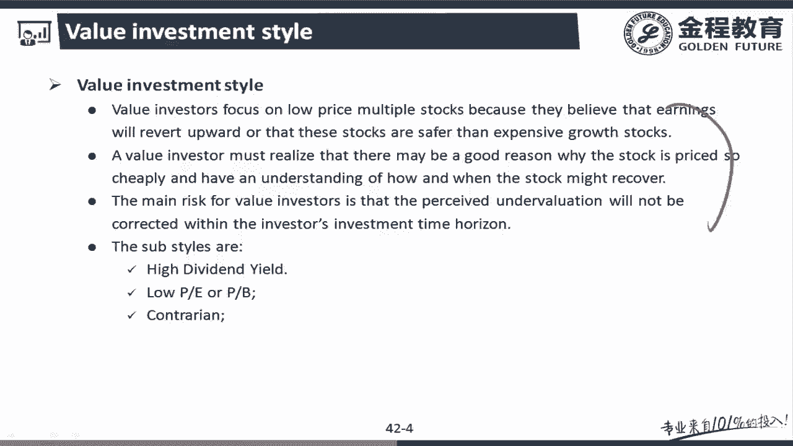
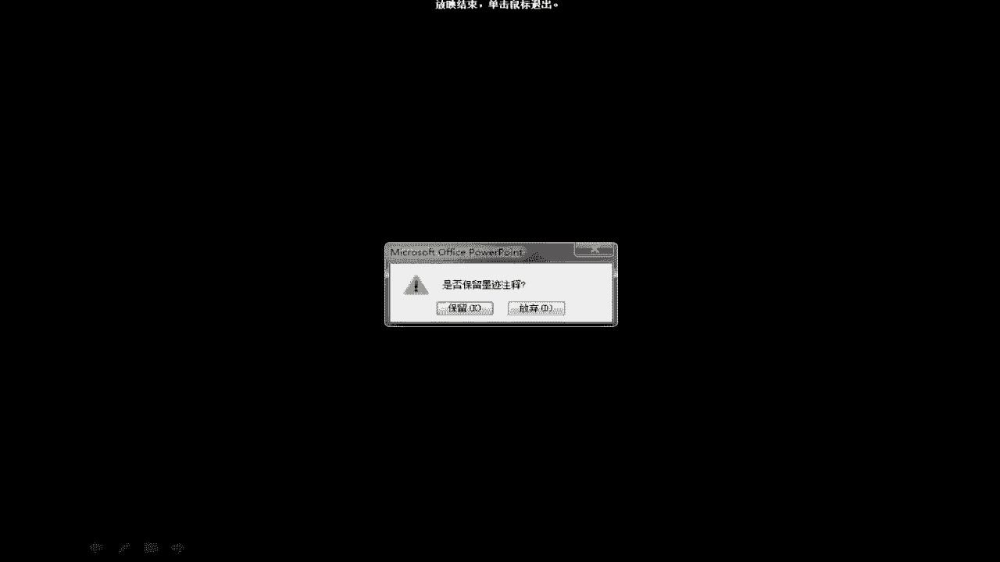
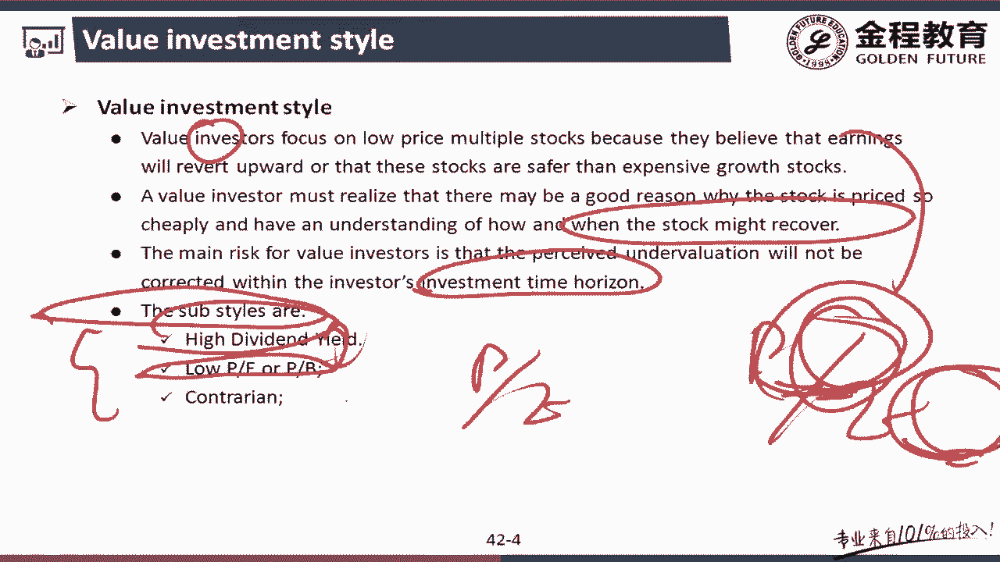
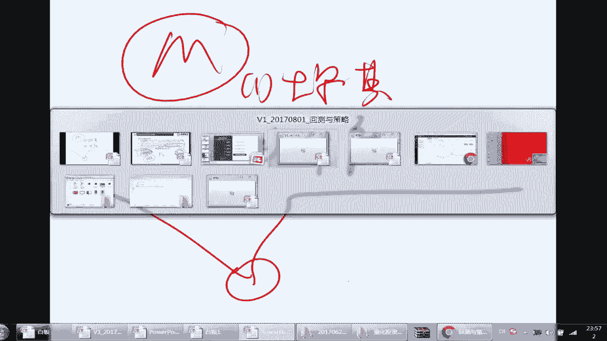
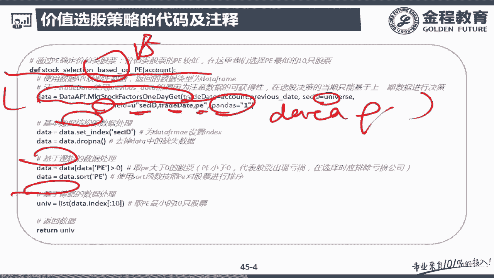
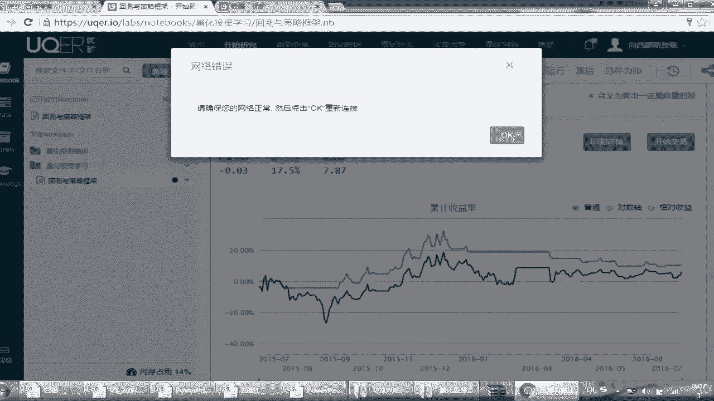
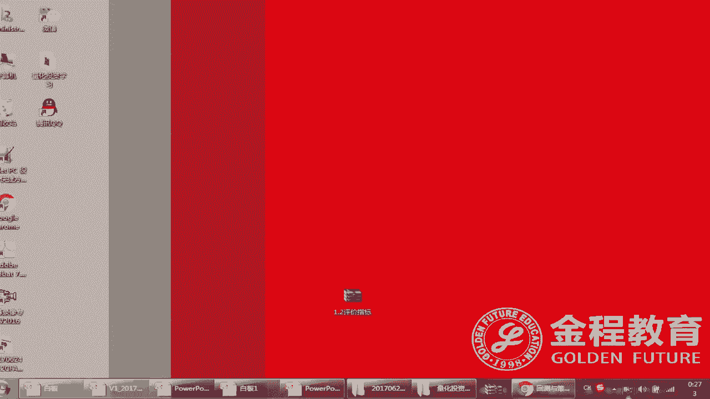

# 2024年金融大神老师讲解量化金融分析师.AQF—量化金融专业知识与实务 - P22：+威❤hhh427501  了解获取全套课程《实盘交易模拟_基于优矿的进阶学习》05.量化投资策略回测之量化投资模板10选股和择时 - 量化沿前 - BV1oU411U7QM

好各位同学，我们继续学习下一个策略模板，这个就是比较标准的一个策略了，就是简单的选股加择时策略，而这里面的选股策略我用的是价值选股法，而择时策略还是用刚才的这个双均线策略。

然而这里面其实跟我们前面讲的有所不一样的，是，我给了大家一个量化投资程序的标准模板，就是我们称为标准模板1。0，这里面这个模板涵盖了选股和双均线，择时两个部分，这个为什么它才叫标准模板1。0。

而上面这个择时不叫，因为相对而言啊，对于股票投资而言，第一步一定是选股，选股之后才是得失，所以这两步是必须做完，才是一个完整的过程，所以说我们先讲一下模板之后，我们对于选股部分和这个择时部分。

分别都是讲它的基本原理步骤，以及我们的代码，最后我们看看他的回测结果，而实际上后面我还会讲很多很多的策略啊，运营策略的基本过程仍然是一样的，首先它那个大体结构都是用的，我们的量化投资的模板之后。

我们会分别去讲他们的这个选股策略，和双均线的指标的择时策略，最后我们会讲一下它的回测结果，大体上以后都是按这个逻辑思路去跟大家去讲，而这里面每一步其实都是跟上面讲的是什么，比如说基础数据的获取啦。

怎么获取，怎么处理，怎么逻辑检验了，以及怎样的策略交易，大体上都是按着这样的一个逻辑套路去做，实际上你看到啊，我们在以后的这个策略中，你会发现，对于如果你要成为一个专业的这种量化分析师。

其实你的这个整体是要形成一系列的思路的，这个思路的框架模板是要牢牢的印在大脑里了，然后这里面该用模板的，用模板，剩余你自己根据自己的思路去更新，其中的某一部分内容，就可以形成自己的算法。

这个相对而言就显得专业很多，也会省事一些，就是跟大家说明一下整理思路好，那我跟着这个思路把整体的过程过上几点，首先第一点，我们看这个就是所谓的这个标准化模板，标准化模板。

你还记得我一开最一开始说的这个过程吧，其实就分为初始化和策略两个部分，然而初始化其实都有什么呢，就是这样的一个我说的初始化是什么，时间是环境的和投资者的初始化，而投资者分为账户数据的策略。

数据的一些初始化策略，那么也就是说这里面整体而言，我们需要的初始化部分跟大家说一下啊，关于这个初始化部分啊，往往是我们对于自写策略的时候，往往只需要改什么呢，改这个策略参数设计。

因为相对而言我们在做的时候，前面的环境和账户数据往往是相对比较固定的，这里面也是为了当大家做这个回测的时候，是否有一个比较好的可比性，而后面的策略设置，它根据你所选择的策略不同，会有不同的参数。

比如这里面你看啊，明显我们的这个跟上面一个只做择时的，就不一样了，我们这里面你有没有注意到我们实际上而言，我们用了什么，用了一个沪深300，作为我们的这个整体的投资范围。

并且把benchmark选为了沪深300，然后这里面给大家说一个小函数啊，这里面叫做看没看到叫做set universe，它是什么呢，它这个函数的含义就是，把沪深300设置为我们的投资法，也就是说。

我们只能在这300只股票中进行一个选择，这一点你需要注意的好，那么我们接下来一个一个看，来做完这件事情之后，你注意我们就做了策略部分，并没有发现策略部分我们其实是两个函数。

一个叫做stock selection，一个叫做timing，你注意到我们stop flection的参数叫做account，这个代表了你所有可获得的当前环境信息，和之于某个投资者的信息。

而之后作为参用的时候，我不但要把这个环境信息给他，还要指出什么，这个UNIVER，这个UNIV是我自己定义的一个变量，它代表了什么呢，它代表的是选股的结果，实际上就是说我选择了哪些股票。

而这个模板实际上来说就是我们的1。0模板，那么我们其实这里面要做的是什么，就是把前面的选股和择时，是不是当FLECTION和timing吧，这两个词分别代表选股和自持，我们把这两步做完。

那我们看下面实际上就用了两个函数，就是stock nection函数和ping函数，你注意我们这里面有没有看到，我后面还有一个具体的函数。

有没有注意到这个叫做stock station based on p，下面是什么，Timing based on double ma，就是这个基于双均线，这是叫做基于PE策略，其实这个里面什么。

其实这里面我要如果写的话，其实你要写的更好，应该写成叫做value effect，就是这个词，这个是我们的规律，而基于PE是这个规律的一个代理变量，然后我这里面你大家先不要管。

什么叫做value effect的价值效应，什么叫做PP，大家很可能知道就是这个所谓的什么，所谓的这个市盈率，然后我要想讲的是这个框架的问题。

就是我们作为stock selection和timing这个东西，大家是不用动的啊，就是你作为框架放在这里是形成一个套路，而我们实际上要更新什么呢，就是更新你自己的这个思路，就是这两步啊。

不论是谁来做这个策略，肯定都是先做选股，再做择时，是不，那你就是至于我后面到底选的是哪个，具体的选股函数，哪个具体的择时函数，那么你要把它写在这里面，这个函数需要你自己根据自己的策略去写的。

然后我给大家一个建议是什么呢，就是我一般来说这个命名啊，这个规则就是前面都是写上什么呢，写上我们的这个步骤，而后面这个你可以写什么，其实你也不可以不写这个贝斯啊，直接后面写上什么。

用一个这个这个下划线加上你的这个思路，或者叫做规律的名称，这就可以了，就说我是基于什么规律来设定了，这样的一个步骤，然后这个步骤最后转换成我的这个代码，这就是我们一系列的这个想法，那好了，讲完这个之后。

我们要分别讲讲什么呢，就讲讲到这两个函数是吧，我说这两个函数分别代表的是什么，基于PE或者叫做value effect的，这种选股的思路是吧，我说讲每一个步骤都要写什么，先找规律是吧，再找步骤。

然后再找具体程序，所以说对于这个选股，我们先看看他用的是哪些基本的规律来看一下，其实这个里面就是我们选股的规律的部分，这个东西叫做value effect，那什么叫value effect呢。

这里面给大家说一下这什么是价值股，会比什么呢，会比这个增长股要有高的收益率，这个是其实是一个实证结果了啊，就是从历史的这些年的实证数据，好像如果没有记错，是来自GF。

就是journal of finance的一篇文章做的实证发现，就说价值股会比增长股票收益要高，注意这里面给大家解释一下什么叫做价值股，就是这个PEE比较低的，这也就是我们刚才为什么说要基于PE去选。

那么什么叫做增长股，就是PE比较高的，那其实这里面你会很容易就想到啊，我们的规律发现的是，低PE的股票收益率比高PE的股票收益率要高，那你怎么做，是不是你选出适当的一部分第一批的股票，然后去买啊。

那么我们这里面啊为了把这个概念讲清楚，我们讲讲什么叫做这个增长股，什么叫做价值股，这两点的一个深入讲解，就是P是选择一个代理变量是吧，但是你要有想过，如果你自己做一个value effect。

甚至于你可以做一些其他的这种代理变量，不一定非要选择PE对不对，只不过是我这里面为了简便而言，这个PE的数据很好获取，给大家举个例子，我们用了PE，但实际上你更应该了解什么是什么叫做价值股。

有什么叫做这个增长，这个很重要，那我们就分别看啊，首先我们看一下这个所谓的价值投资体系，也就是说我们讲讲什么叫做价值股，然后这里面给大家讲了一堆啊，就这三句话讲的是它的一个概念。

我们逐一给大家做一个讲解啊，其实你要想明白，就是他这个投资体系，或者叫那个价值股是怎么个模式啊。

就实际上就是加大原曲里面的第一句话，来大家看一下这个我们看一下这个。

好看一下，对于一个股票而言，对于图片而言，它的price是不是等于T乘以我们赚的钱呢，这个这个earning是不是，然后你注意而言，我们所谓的价值股这个投资的理念是什么，大家看我们是不是刚才给他讲了。

往往这个选择是比较低的这种情况啊，如果这个PEE比较低，那么也就是说相对而言，整个市场中模式选的是PEE最低的那些，那么此时呢，我们知道这个的PE其实就已经是超跌了，就是P比较低嘛。

他肯定是会有一个均值回归，第一点就是有一个长期的均值，那我已经比较低了，这个时候我其实是比较小的，而我对于一个价值性股票往往是什么呢，往往这earning是一个比较稳定的事。

就说实际上具备的特点是它是比较稳定的，那么这个已经超跌，那么在未来的情况下，TE是不是就会回归我应有的这个情况，那这个情况其实我们并没有为个因喂，我停这种现象，那这个上升股价格自然就会高。

这是就是整个我们价值股投资的一个基本思想，比如说什么呢，收益比较稳定是吧，然后PE又比较过于的低，在未来它会有一个mean rewarding的效应，它会回归，那么你就会带动了价格上涨。

这也是个基本是价值股的基本思路，那么这种思路是不是有没有一定的作用呢，实际上而言，从我们长期的这个投资的思路来看，这个而言是一个比较受到实证支持的一个特点，但是这个知识特点有什么问题呢。

就是我们这里讲了这个东西，叫做核实或怎么样进行回归，然后他这个问题是可能在投资期里面不会回归，比如说我这个PE进行超跌了之后，就是我刚才这张图看一下，创跌之后我市会回归，这一点是受到实证支持的。

也就是说有我的value effect，但是有一个问题，我这个可能是10年，可能是20年之后，具体某只个股而言才会回归回来，那么你的投资期能不能等到10年和20年，这个就是一个问题，那实际上而言。

你一个一个去找这样的股票，其实就会比较麻烦，那么你更好的去找这个会回归的这类股票，其实用量化就是一个比较好的思路，好这关于这一点，我们去对于后面会讲这个精选的里面，精选股票的一些方法中还会涉及到。

那我们这里面呢不过多的讲了，大家有一个这样的思路，就说其实我们这里面作为只是一个基础的，这个阶段，我们可能讲的会比较，就是忽略掉一些更加深入的细节，这些细节我们后面都会再回来仔细讲。

这只是为了帮助大家学习好，我们看到了这个里面的一个，哦value的带这一点，那么实际上而言，我们知道其实他读的是PE的什么均值回归吧，那么这里面有一个特点，就是我说他的主要问题是什么。

我可能在我与我的投资期中可能回不来，那好了，讲完这个之后，我们看看这个所谓的value effect的一些类别，实际这里面就是我说的，你了解了什么叫value infect之后。

或者叫value的这种stock之后，价值股之后，那么实际上我不一定非要用PEE作为代理变量，其实你下面这些都可以作为它代理变量，产生的一个思路，当然这个low p和low pb。

是表面上最明显的一个思路，那么我们想这样的一个问题，为什么PE1会比较低，为什么会P1比较低，大家想一个问题，这个P比较低是什么意思，就是说我们想你想P，为什么你有些情况下会被认为比较高啊。

就是当前的价格比上收益，这个东西比较低的原因是什么原因，什么原因是它的价格比较低，是不是比如说端性比较低，那么你想一个问题，我赌它均值回归会有什么现象，就是未来这个价格会比较高。

那未来为什么会价格定的会比较高呢，是不是未来代表我的一个增长情况会比较好，而增长情况比较好，会带来未来的估值比较高吧，因为我的股价反映的是未来的情况是吗，但是你注意，如果我每期都发很多很多的福利。

会代表什么，我会透支未来的增长率，就说我要想未来带来更高的earning，是不代表你要进行大量的投资啊，如果你不进行投资，你把这个钱都花了，叫HIDAVIDENT已有的，那么你自然不会有很好的增长。

那这个时候未来我估值必然就会比较低吧，所以这两个之间是有一定的什么因果关系的，那么我这里面你想一个问题，我在题目之中，我用了low pe或者叫做low pp所代表的话，PB叫做什么市净率吧。

然后这个时候我是不是也可以用这个DAVID，业务的情况，但是你要注意一点，这一点就涉及到数据的一个问题，大家都知道啊，在美国，很多正常的这个公司是爆发大量的鼓励的，但在中国是不发鼓励的，所以说这个里面。

HIDAVIDYEL的并不是一个很好的指标，在中国这一点需要跟大家说明了。

然后我们讲讲什么叫军这种是又代表什么，这个东西大概代表的含义叫做暂时性评估，叫低估类股票，什么叫做低估类股票，就是你什么东西有价值啊，是不是我这个东西既然说价值是什么，我的价值要远远小于价格。

要远远大于价格，不好意思的时候，我这个东西被称为有价值的股票了，那什么样的公司会是有这样一种情况呢，就是它发生了一些事件，严重打击了市场的信心，所以它开始暴跌，但是呢他又不会破产。

而基于它的基本面又很好，它未来会有一个恢复，会有一个报复性上涨，这种情况下就行了，低估我举一个国外的例子，举一个中国例子，帮助大家理解一下这个含义是什么，国外的例子就是我们那个F代表的麦当劳是吧。

安德道不是M吗，M这个东西做了些什么，大家知道麦当劳这个公司的基本面很好，他跟肯德基被称为垃圾食品双侠是吧，基本上只占领了市垃圾食品市场的，这个绝对的份额，然后我们想这个垃圾食品双侠，做过些什么事情呢。

你说美国公司，尤其是刚刚全球化开始那个阶段，美国的公司往往都有天老大地老二，我老三的这个想法，就是我认为我美国的思想就是普世价值观，别人跟我不一样，那么肯定就是别人有问题是吧，他就不会照。

就着重的照顾一些国家的这种特殊的文化，那么就会造成一些问题，这个里面就讲到这个麦当劳去投资的一个想法，那你看啊这是怎么回事，麦当劳，其实当时在我们的这个叫做土耳其金融投资，然后土耳其投资。

他认为土耳其是第三世界国家是吧，所以这个时候我就想着牛肉，他自然就是吃不起了，那我为了当地人民好，我降低一些价格卖猪肉吧，因为大家知道现在中国其实就是这个麦当劳，有很多的猪肉汉堡。

什么巨无霸这一类的东西就很多，但是这个结果是什么，对不对，他就没想到一点啊，他就没调查一下土耳其这个国情，土耳其是什么东西，而不是宗教啊，这不好意思，不能这么说，就是什么样的国家，什么样的宗教信仰。

他的国教是伊斯兰教，这个猪在伊斯兰教里什么就跟是一个含义，所以说你就是做一个汉堡，你做了一个屎汉堡，一竟然是这个东西，那你觉得这个在伊斯兰教里面会怎么做，那这个结果就是这个麦当劳的公司被砸了。

店被砸了一个遍，那你是带来一个什么形象，股价就会暴跌，暴跌到历史水平线之下，但是你别忘了这个麦对于麦当劳而言，这只不过是在一个的一个不是很重要的国家，当然我所说的重要性指的是占它的盈利份额中。

很小的一个地方的一个很小的损失，并不是会产生这么明显的影响，所以说未来他肯定会回归到我们的正常情况，所以这个时候就是一个低值的情况，也就是说有价值的投资，这是第一种情况，就是这个土耳其的这个头。

然后我们再讲啊，就是有的时候啊，一个人啊如果不纠正他的思维，或者说一个公司不纠正他傲慢的这种偏见，他还会在同样的地方再跌倒一次，这个地方就是在印度还有投资的这个印度，他知道啊。

大家知道印度是一个文化特别复杂的这个国家，就是在印度既有基斯兰教，又有古印度教，也有还有伟大的佛教是吧，然而这个时候你们注意一点啊，这个时候他就想到的是，既然印度是有伊斯兰教的，我别犯上一个错误。

我就不要做这个猪肉汉堡了，我做个牛肉汉堡，那你就想想这个结果是什么样的，因为大家知道啊，牛是什么，是印度教里湿婆大神的这个坐骑，然后你把它做鸡吃了，那你知道印度人是怎么对待这个叫做麦当劳的。

但又是砸电是吧，又是驱逐是吧，但股价又暴跌，但是这又给资本市场一个很好的进入情况，然后这里面就会导致什么诱人投资，又获得很好的价值投资，在这里面多说一句题外话，因为大家都学投资的注意啊。

就是有些逻辑是可以不会重复了，但是它会重现，就举个简单的例子，大家有没有想过拍戏墨西游房降魔的时候，有一个公司的股价暴涨，然后这段时间战狼出了，你有没有买那个相应的北京文化这只股票。

那你如果你没有买的话，我只能说你这个西游消磨这个资本市场，你完全没有做分析，实际上这是什么，一个影视公司出了一个好电影，带动股价暴涨吧，这就二三十%的这个利润啊，就是你明白这个思路，就是你一定要观察。

如果你观察到了一个逻辑，这个逻辑仍然是要存在的，那么未来什么你就要投资，实际上我们量化投资对于过去的研究是什么，就是更方便的研究这个逻辑，如果你个人一个一个股票去找，那这种逻辑是你很难作为一个覆盖的。

但是作为量化图，你可以瞬间看遍整个这个历史的脉络，这也就是说我说量化一般优，应该说优于普通投资的一个地方，好这个讲讲什么叫做这个低谷，那中国有什么中国的例子，就是一个重庆啤酒的例子。

重庆啤酒干了些什么事，他去做了一个什么，他去做了这个投资，乙肝疫苗，大家知道你要投资一个医疗的这个领域，其实应该说来说没有几十年的积累，没有积几十个诺奖，没有这个几千个亿，你是搞不下来的。

然后重庆啤酒怎么做，他投了5亿去生产五家疫苗，然而这个当这个消息暴露出来的时候，说你原疫苗苗第二次测试失败的时候，它的股价是不是就出现一个暴跌啊，但是大家知道这个乙肝疫苗投这个五个亿。

相对来说可能还不到他一年喝啤酒的利润，因为重庆这边好吃嘛，所以这个时候一定是会回复的，所以说在未来的10年，他又回到了这个阶段，所以在这个一出来这个点的时候，这是什么东西，这就是一个价值的点。

也就是说有投资价值的这个地方，而这是对于我们关于这个价值的一个解释。

我们知道了什么叫做价值股，然后我们再看下面就是这个growth这股票，gross这个股票是什么思路啊，我跟大家说一下，我们还是一样啊，这个PE是不是乘以这个learning等于这个price。

然而你注意，一般来说我们这个的PE就会特别特别的高，那么你要注意一点，当P1特别高的时候，比如说我们甚至出现了过这个东西，叫做先辈的，我们一般起了个名字，就是不叫适应率，叫施梦率，代表什么意思。

就是你这个价格你要按照当前这个股价，它先保持现在的收益，必须1000年才能收获，但是我不知道1000年之后这个公司在不在啊，但是纵观整个中国的历史，还没有1000年的王朝啊，可能我们可能会千秋万代。

但这个东西我们不去讨论啊，就明显这个会怎么样，是不是会特别特别的高啊，或者说虚高昂，但是mean reverted思想这一项是一定会怎么做的，一定会下降的，那么你要想一个问题，就是个burning。

比如说我下降了100倍，P我这个RNING能不能涨十倍，在往往的情况下是不能的，因为什么，因为这一个增长，高增长的股票往往是要带有一些概念性的炒作，这种的价格往往会带有一些的非理性。

所以这个时候在长期来看，这个价格往往是无法进行兑现的，这里面要大家注意一点，就说这个里面我考虑的是什么呢，由于我在心理上认为，他未来会增长到一定很高的水平，所以说我认为PE会比较高。

那么这里面你还有一点你要注意一点，那么我问你个问题啊，就是发散一下，我这里P1比较高，那么对应的这个鼓励应该怎么做，注意我这个股利肯定是要比较低的，为什么，因为我只有再投资才能产生更高的利润。

才能怎么的支持吉普的股价，所以增长型公司往往是不发鼓励的，这是对于增长性公司的一个解释，然而这里面有两个类别，一个叫做持续增长，一个叫做earning moment，就是这种动量性增长，那叫什么。

这个其实叫做，如果从字面上理解这个东西叫做一直增长，这叫做一段时间，这什么代表它要是有持续性，后面没有持续性，但是大家知道这东西往往都是有相对性的，就说有没有一个股票从它出现开始，一直涨到现在。

举个例子啊，大家现在都知道这个化工类股票，我们不认为是高更增长股票，是这种淘汰产能型的，但是你注意当年几十年之前，这种化工类解决陶氏化工这种当时的看法，跟我们现在看这种互联网大数据公司是一样的。

所以说你要知道，就是说我们认为所谓的这种持续性高增长，是不存在的，我们这里面所谓的这种持续性指的是一定时间，这个往往在我们整体的投资期里面认为啊，如果能在一个经济周期之内，保持一个长效的增长。

我们欧美这边都认为它是有持续性的，但在中国这个思路要变一下，如果他就是一般认为能走过5年计划，我能保持高速增长，这种东西都叫实性增长，这是你要知道的，然后短期增长什么就可能在短期几个月增长。

然后过这期就不增长了，这里面典型的例子，比如说是上海自贸的概念，这种东西都叫科技，然后项目死呢，什么叫做持续增长，举个例子，你看到横贯整个的一个十二五计划的，这里面什么文化传媒。

这个你可以认为是有一定的持续增长性的，这是两个特点，好我们解释一下什么叫做这个价值型股票，什么叫做什么呢，叫做增长型股票，那然而我们这里面下面有个对比啊，那市场的这个特点等于就是两者都不占。

往往我们大家也不是很关注啊，我们主要关注的是前面这个对比，也就是说其实你看第一年我们讲过，第一的这种乘数，比如说PE的这种叫做Y流的股票，然后高股利的这也叫做value的，然而这个特点叫做高价格乘数。

就是PE比较高，然后发股利比较少的，这个叫做这个增长型股票，然后我们下面接着看，就是你预期这个EPS增长率，刚才我也给大家解释过，对于value由一发把这个利润都分了，他没法进行再投资。

所以怎么的它的增长率比较弱，这个就会比较高，然后我们看下一页这个A的这种波动率，这个AN的波动率，就是说我这个未来收入的这个波动情况如何，谁会比较高一点，我这里面指出的value比较高，这是为什么。

因为你价值股，我举例子啊，你看你这个大数据，这一开始我从零到有，在这个5年计划之中，往往会出现一个持续性的这种比较高的增长，没有什么波动，而对于我一个价值型的我这种情况，那么由于我不是进行大量投。

这个机会也比较老，那往往就会带有一定的季节性，比如天然气这个公司往往天然气用的多的时候，我就价格高一点，天然气用的少的时候，价格怎么低一些，所以说这个波动率就会比较大。

但是最后一点我需要大家着重的看一下，就是哪些行业是我们所谓的价值类公司，这里面就比如说这个金融行业，这叫什么，这个东西叫做这个公共事务，这种行业，这个东西都是一种叫做价值链投资，但你要注意一点。

这个的价值里面你要把互联网金融排出去，互联网金融其实算是一个高速增长行业，因为它更多的是技术含义，这个技术行业往往指的就是i it，其实你认为互联网金融就是金融，跟什么计算机或者叫做it的一个结合好。

下面叫做health care这个产业，注意传统的医疗，我仍然归到这个价值体系之中去，我们这里的医疗基本指的是另外一个行业，叫做智能医疗，这个里面是我们所谓的高速增长行业，而且注意一点就是这个的命名啊。

基本是在做变化的，如果你几十年前看我讲过化工类产业，你都能叫做高速运转行业，只不过现在都变成value了，整个行业的趋势是什么，首先这是公司从上市开始，它一定是一个高速增长的这个领域，要不然它上不了市。

然后逐步逐步的老化，变成一个value类的公司，这就是整个公司发展的一个卖点，就是说你在看高速增长和价值类投资的时候，要严格的注意这一点啊，就是我为什么讲这个事情啊，你就是只有在这些东西全部了解的时候。

你对于算法一个可以认识的比较深入，再有一点在你做算法调优的时候，你能把这些特点发现的比较明确，所以说你要注意一点，就是你在写一个算法的时候，对于这里面说的每一件事情要深入的掌握。

对于这个原理你要理解之后再去做这个算法，这样这个东西才能赚的钱，赚的是一个明白钱，好了，这是关于这里面的一个讲解，那么讲完之后呢，我们进入它的代码及注释阶段，比如说刚才我讲了一个基于什么呢。

基于我们的价值选股策略，我说我要选择是一个什么，是什么一个策略，就是我发现了一个实证研究，发现价值股比增长股要怎么办，收益率高哈是吧，那也就是换算成我们可以进行操作的指标，就是选择低PE股票。

低高PE股票收益比较高是吧，那你这个策略步骤是什么，刚才我说的规律，那步骤是什么，是不是就是买EPE的股票，选DPE的股票吧，那你这个定价策略之后，我们就进入代码的阶段了是吧，就是代码阶段，你看我说了。

这个程序要写在这写明白是吧，就是这个stock selection base on pe，你还可以把这个base on去掉啊，就是SFLECTIONP把这个规律写在这，这代表是你用于什么样的一个算法。

我说这个最好写的可in更好一些，就是value effect，这个可能更加符合现实中的例子，那么我说对于一个这样的一个程序，你是不是有标准四步走啊，第一步获取数据吧，第二步数据处理。

第三步数据的逻辑检验嘛，最后做这个什么策略，是不是这样一个过程啊，那首先第一步我们看这个数据的获取，这一看啊，这个函数是不是好复杂啊，这个函数啊跟大家说，实际上是优框提供的一个API。

它专门用于获取我们的数据，那我们看这里面都写了哪些东西啊，大家看我这个数据获取的是这个叫做获取的，是交易的时点，就是说你这个数据来自于什么事件，第二点是我这个获取的范围，我获取哪些股票的数据。

第三点我这个股票之中它有哪些属性，你能获取，比如说我们的id就是这个股票号，然后哪一天进行交易的，以及我的PE值，注意这里面有个加了一个pandas，等于一代表什么，就是说注意pandas等于一。

代表的是我得到的这个数据类型叫做data。

这个大家季老师也给大家做一个详细的介绍啊，我这里面不再做过多的讲解了，大家有兴趣可以翻翻之前的讲义，然后注意一等于它要是取另外一个值，零代表CSV的格式，我们往往在处理的时候。

全都是用的是pandas等于一，这是关于这个函数做个理解，那么其实你获取的是一个date这种结构，那这个data是什么呢，一个data frame这里面包含了些什么东西。

就是这个id trade date以及P，这是对这个函数我做了一个简单的介绍啊，为了让大家理解的更清楚，我们看看代码，然后有一段专于对它的运行，我们看一看，然后我们再去看看它的API。

这里面其实也是介于于这个比较复杂的函数，跟大家讲讲怎么样去查找API，怎么样去进行实验，来我们回到我们刚才的这个程序中去。

大家看啊，注意一点，跟大家说，其实讲这个东西啊，主要原因还是想帮助大家怎么样进行编程，如果你很多时候啊，你会遇到的情况是什么呢，就是我现在要用到一些函数，而让我知道这个函数有什么用啊。

但是这个时候你往往是用不对的，那你为什么是用不对呢，你刚看到一个函数，我只知道它大体的用处，这也是我查出来的，但是这里面往往有很多编程的细节，你可能是不了解的，所以说一般情况下。

我建议大家对这种情况分两步走，第一步是根据你的用处，是把这个函数的基本形式，把它查出来，也就是说你要查这个API，查完两个QI之后，你也不要直接去编程，你把这一段代码先拿出来，单独去运行一下。

了解一下这个的结果，然后你再去做下面的这样的结果，会做的比较好一点，那好了，我们看一下关于这个函数，说我是不是想获得进行PE进行交易啊，那你要获得的是不是PE的这个数据啊，那么往往我们要想获得数据。

其实就是date API来执行的，所以这个data API，我们这个函数名字叫做market dequate get，就这个东西是干嘛，是获得我们相应的一些数据，然后这些数据大家看啊。

我们都有哪些参数看一下，就说我这些数据，比如说P是哪一天的P1，第二点我是获得的是获得的是除了有P以外，我是不是指明这是哪些股票的PE啊，所以说你要指明一下id对应的是哪些股票，然后这里面看啊。

这里面还可以有什么呢，比如说这个taken，这叫股票交易代码，你注意这个id是我们通联的正确编码，和我们下面这个就是股票的正确编码，这两个是有所不同的，这个其实这个id大家刚才也都看到了。

所以说我也不再多说，这两个往往你选其中一个就可以，但我建议你还是选择通联的这个比较好，因为我们毕竟用的是通联的数据，然后我们再看，当然你也可以指定一下，我到底获得哪一个阶段的这个数据。

这个往往在编程里用的就比会比较少，因为我们往往是霍记得是什么，是根据我们的运行函数什么，每天运行一次吧，然后每运行一次，我拿到某一天的数据，这个时候往往就不涉及开始和结束数据，然后注意这个field的。

我们单独的讲一讲啊，这个field就会比较重要，这个field指的是你到底可以拿到哪些因子，你看都有哪些，比如说这里面是P叫市盈率，PB叫市净率，是不是这种东西还有什么涨跌幅，总市值。

流通市值这些东西都是什么，同学就是你可以填到你的队友都中的一些指标，而这些指标往往代表的是你们，如果大家用过同花顺或者大智慧，在这一个整个的第一章页中，你会一眼看到的一些基本数据都有。

所以这里面其实相对于什么，是一些比较简单的数据，当然这里面也有后面有其他的指标，可以获得一些比较高级的数据，那个东西等遇到我们还会给大家做一个讲解啊，但是第一步你了解了这些参数是什么。

那么这个时候啊注意如果你直接去网上，你的这个函数中去敲，你这往往是怎么做，是敲不对的，那如果是敲不对呢，我建议大家一个方法是什么，你注意你的一个方法就是把它复制过去，复制过去就可以了，然后我们注意啊。

这里面我给大家讲了一个API，就是这个最基本的API，这个里面他们提供的这些方式几乎是相同的，那我们再看一下，接下来，然后我们看这里面我们都提供什么，首先第一点我们要试验一下，就说我是哪一天。

我试验的是2017年6月27号，然后这个id是指的是什么，Universe，就是我所有的这个情况，注意我所有的设置是什么，设的是沪深300，比如说我获得了这个想要获得的股票的范围，是整个沪深300。

那我返回哪些数据呢，就是这个id以及哪天以及它的PE，然后我的pandas取的是等于的是一档，然后这个是代表什么，我返回的是data frame形式的数据，这里面有我都给大家明确的写在这里了。

然后你点一下这个运行，然后你会什么，你会获得2000 201，今年6月27日的所有的这个PE值，你看这么多是300只股票是299，哎为什么大家想一想，为什么是299，因为我是从零开始的是吧。

所以大家都知道这个我们这里面有个特点啊，这个里面会下面会用到，我再说一下，就是我们所谓的取300值是0~299，也就开始试点，是从零开始的，这一点要会比如说我再总结一下思路啊，就是你做这个股票的时候。

你要注意的一点，如果某一个函数你要用它这个东西又比较复杂，你第一步干什么，第一步是看他的这个就是注释，看完注释之后你怎么做，是不是把它贴过来之后，你先单独把这个东西先运行一遍，然后再往下钻。

这就避免到下面的时候，你会犯一些错误，这个你要注意，然后这里面再多说一句啊，就是这个fail这个领域，它指的是你返回哪些数据，他们组成的是一个data frame，就是这个这种类型的数据。

这一点是大家说明一下好了，那我们讲完这个之后呢，我们继续，在这里面我们获得了一个数据，那么我们就进入了第二个步骤，你要对数据进行处理，实际上大家都知道你拿到的是一个原始数据，它会有很多很多的重复的点。

比如说这里面会有一些重复数据，但是这里面可能最大的原因是什么，原因是我们的这个数据来源质量不当，但我为了去除，所以说我要把某一个指标进行设置为id，那这里面对于某些重复的你要去掉。

然后对于某些缺失的数据你也要去掉，因为我们的数据集中，可能某些数据是没有给定的，你为了去掉缺失数据，必须先设置我们的索引，这个设置索引的函数叫set index，这个不多讲，这个东西。

应该是我们data frame里面的一个基本函数，这个大家会就可以了，在这一部分叫做数据结构的处理，然后我们下一步就是我这个数据是不是有一些，逻辑上就要做一个判断，逻辑上不应该合理的，你要把它去掉吧。

因为你注意我们这里面是不是选的是小P啊，但是你选出PE为负了，这明显不合适，因为PEE为负，大家知道价格不能为负，如果为负的话，P为负代表什么，肯定是warning为负，ORN为负代表什么。

就有可能会被ST掉，那这种股票是不是你肯定不选了，所以在逻辑上要把小于零的进行去掉，怎么做呢，你看这里面其实用的也是我们hate frame，讲过一个函数，为什么我选择其中大于零的这些数据。

然后下一步我对P进行排序，排序之后呢，我说我要选PE一比较小的股票，那我问你个问题啊，P1比较小的股票是只选一只吗，那么到底什么叫PEE比较小啊，我这里面认为的是价值，就是P1最小的实值。

注意我这里面你注意啊，点两个点，再加一个十，代表的是取的是前十只股票，其实你的索引号是0~9，这个是要会，那么我的策略是什么，就选择了PE排列最小的十只股票，然后我们把这十只股票干嘛，是不是返回需要。

这就是我们整体而言讲的关于价值的一个思路，然后这里面其实啊关于这个策略到底好还是坏，其实这个东西是无所谓的，我们这里面想要跟大家讲的是什么，就是你在做这个东西的时候啊。

是所有的东西都要尽量按照我们的框架来，然后你要在这个框架之中进行一些改进，这样的话这个代码第一是复用率比较高，第二大家看的比较清楚，这样显得也会比较专业，然后这里面需要给大家最后讲一下的是什么呢。

就是关于函数，就是这个获取参数的这个这个东西大家要注意，然后各个部分是什么含义，刚才我也给大家解释了，你注意的是，你看完我们我们的这个API这个帮助文件之后，我们优化做的有优化，这边做的比较好的一点。

就是这个代码你可以直接复制，这是一个比较好的性质，然后之后呢你也不要直接去用，你要怎么做，把这代码先加一些原始数据单独运行一下，看看这个结果跟你预想的一不一致，这样保证你下面不会犯错误。

这是关于这个部分做一个讲解，好我们接着看，然后我们接着讲，就是选股结束之后，选股之后我们回到这个基本的框架之中，你看到了什么呢，我们选股回复之后得到的是一个股票的范围，我们股票的范围和我们账户信息。

我们一起给了谁，一起给了参与的过程是吧，然后我讲ping这个基本的思路是什么，是不是仍然用于双切线策略的一些基本原理啊，这个是我们要讲的，但双曲线这个策略我已经讲完了，所以说这个里面我不再多说一遍啊。

但是你会发现我们其实下面的这个程序，跟我们上面写的会略有不同，就说我们会用另外一种方式来实现，第一是帮助大家熟悉更加规范型的这个过程，再有一点是什么，帮助大家熟悉几个函数。

这样逐一的等我们把所有的这个策略都讲完，大家应该对于常用的这些函数，都有一个比较好的掌握，这样的一个结果，就会帮助大家把量化这个学的比较好，那我一个一个来啊，还是按这个过程啊，你做一件事情。

不管是择时也好，操还是选股也好，这里面的形式还是获取数据，数据处理，逻辑检验以及最后的策略是吧，这个不多讲，这第一步肯定是数据的什么获取吧，刚才讲过get attribute history这个函数。

我其实两个参数，第一点你要获取什么样的例数，第二点获取多长时间是吧，这个peter的one和po two分别代表五天和20天，比如说其实你获得的是这个什么。

是代表的是一个关于五天的close price，后面是五天的，20天的close price，分别带有黑丝袜，黑色to来代表，那你下一步这个是不是，这个第一步是获取数据吧。

刚才讲过这个是不是就是数据的处理了啊，这个叫做生成五天和二天的均值，注意这是没有包含什么当前日期的，你不能用当前的日期的数据计算均值，然后我们下面怎么做呢，下面这里面我们开始进行策略部分，这个部分。

这里面就要比刚才说的更加严谨一些啊，你注意，因为你这里面做的事要怎么做，你们要买股票的时候，你肯定做的事情做先卖再买吧，这是一个更加考虑的深入的一点，为什么只有卖了才有钱才能买吧。

所以说我们第一步应该先卖出股票，第二步才是买入股票，这个东西其实更符合实际，就是我们整体而言是逐步的进行深化，逐步的更加的规范化的一个讲解思路，那然后这里面我们看一下啊，如果刚才讲过这个是吧。

讲过这个策略是吧，这个里面讲的是什么，什么叫做s in account这个词啊，刚才讲过，这是代表s in后面那个东西代表什么，是不是代表的是我已经持有这个股票吧，那好了，如果再持有这些股票的话。

我们看我是不是持有了，我现在就要选择一下，是否要把这个股票进行干嘛卖掉啊，注意看啊，卖掉的是什么，这里面的条件是什么样的条件，别代表什么，如果他不是我选择出来的股票，应不应该卖啊，白吧。

那么如果即便它是我选择的股票，那么他如果买除了这个子差的条件，我是不是仍然也应该卖掉啊，对不对，那么我们这里面注意卖掉这个函数，跟我们原来写的是不一样的，我们没有order to，也没有order。

我用order pc d to这个等于什么，这个含义是什么，是以百分比的形式卖掉，当然你注意了，我百分比对于S这支股票，我百分比是什么是吗，是0%嘛，那不就等于全部都卖掉了吗，然后我们再来看下面。

你卖掉之后是不是就应该计算是否应该买入了，那这个时候怎么做，如果我是我已经被选入了，并且这支股票怎么的，我没有持有，并且它满足测试条件，就是前面这是什么意思，我第一点选股选中了，那么我是最新选中的。

现在这一期原来没选中，然后我又满足我的这个金叉的这种格式条件，你应该怎么做，是不是来错，买入怎么做呢，白入总账户值的10%，就是这个0。1嘛，这是我们需要的一个函数好了，这里面是对于整体过程的一个介绍。

那介绍完这个之后呢，我们有几个点还是要跟大家再做一个交流，说最后讲讲有几个重要的函数，你还是需要禁忌，二的话会比较类似于我们的一些做法，就是我了解这个函数就是最后一步。

然后这里面了解函数这个第一个是什么，就是这个函数这个东西代表什么，代表持有这个股票，然后这个什么这个东西看啊，也代表持有这个函数，然后下面我做了一个注释，这个的基本逻辑是当前交易日有效证券的头寸。

然后这是记载这个账户中，数量大于零的证券头寸，但数据类型为字典，建为正确代码值为头寸，再就是什么，如果说我是一个字典，我S没有在这个字典之中代表什么，我没有持有它们，是不是就是这个含义啊。

那相应的这两个你要记住，就说我们相应的这两点都是在干嘛啊，是不是讲的是我是否持有这只股票，所以说这里面是两个代表，是否持有股票的这个写法，实际上我建议大家，你可以在一开始的时候就把这个代码复制掉。

比如说你下回用我是否持有的时候，直接把这个代码S1就直接用了就可以了，你就可以不去过多的去管这里面内部的机制，这样的话可以写一些时间啊，然后你当然你如果有兴趣的话，我们结合季老师给大家讲的一个问题。

就是关于我们字典的一个查找，或者是字典的一个判断的这个逻辑，你把这个数据类型再看一看，这也有利于对于Python这个语言做深入理解，但是相对于我们量化投资啊，就是这些基础的这个函数和这些变量。

我建议大家的方法就是知道它有什么含义，怎么用就可以了，至于详细的内容，可能是编程上的一些问题，而跟我们量化投资的关系就是是一个次要性，可不是说不重要啊，只是说你会在下一步做深入学习的时候。

再去想这个问题，我们先在一开始的时候掌握的重点是，先把这个程序跑起来，可以自己编写一些程序，可以自己读懂程序，至于后面的这些细节的问题，我相信大家可以在后面再做一些高级的了解，这是没有问题的。

比如说这里面要掌握的两个类型的函数，第一点是这俩加在一起，是代表是否持有这个函数，第二点就是说我把这些股票卖到百分比，实际上order这点一个是order是代表卖的数量吧。

order to是卖完之后我剩多少吧，然后这里面叫order p c t two代表什么，卖掉之后剩的是百分比是多少吧，就这三种代表卖掉的函数，我希望大家也要再好好掌握一下。

以及代表怎么代表是我们所说的这个持有，你要看一下，然后注意我们再讲另外一个问题，大家看一下，如你看啊，我们这里面用的是一个for，有没有注意到代表什么意思呢。

就是说我这里呢这universe用的是300只股票吧，沪深300了，那么也就代表是我要对每一天，对当前沪深300指数的组成成分，股中的300股指股票，我进行一轮什么整体的判断吧。

就是300只股票我都判断一轮，然后该买的买该卖的卖得到最后的结果吧，其实这个也是一个逻辑框架，代表什么，我遍历所有的范围中可选的股票，然后把满足条件的挑出来，该买买该买卖，这是我的一个过程。

也是我们大家需要掌握的一种模式啊，好了，这里面跟大家做了一个交流，也就是说什么呢，双均线策略其实我们可以写的更加规范，就是我写的这样的一个方式，那我们最后看一下这个结果。

你在择时策略的基础上加了这个选股，我明显做出来的是18。7%，也就是说我这里面有8%的收益，如果我们研究记错，刚刚才讲择时这个策略大于收4%，我们选股这个策略，仍然给我带来了4%的这个收益。

其实你分一下，你就可以知道哪部分的能力的收益各自是多少，当然啊我们看回看我们这个程序，你也可以做的是看一看我们整最后的这个结果，然后看一看详细的这个回测，然后比如说这里面有一堆的收益率。

还有这些贝塔下属比例，收益比例信息比例，然后最大回撤还是一样的啊，就是对于这种反趋势的这些，比如说这个负的9。50，那你就要看看这个原因是什么，导致我有这么大的一个损失。

也就是说最大最小值以及跟趋势不符的数据，你都要看一看，做一个掌握，找一找原因，这样的话你转一转的明白，赔也赔也明白，这一点其实也是我们整体量化投资，优于传统投资这个方法方便进行分析。

这个其实我认为啊是它的一个主要优点，那么我们再说一下，其实我当时给大家讲了两点，一个是利于情绪控制，再有一个是利于进行分析，这两点都是量化投资比较好的一些特点，好我们这就是我们第一部分。

关于一般性的这种量化策略的模板的一个讲解，那么在下一节的课程之中，我们会逐步深入的讲解各个类型的策略，也帮助大家逐渐的去好好的掌握一下，量化投资的基本思路和方式，方便大家进行下一步的投资额。

