# 2024年金融大神老师讲解量化金融分析师.AQF—量化金融专业知识与实务 - P4：《量化交易策略的Python实现与回测（进阶）》04.量化投资与技术分析_3布林带策略_2 - 量化沿前 - BV1oU411U7QM

好，那么嗯接下来的话呢，我们接着来看这个iteral rose啊，那么其实通过我们前面的这个讲了之后的话呢。

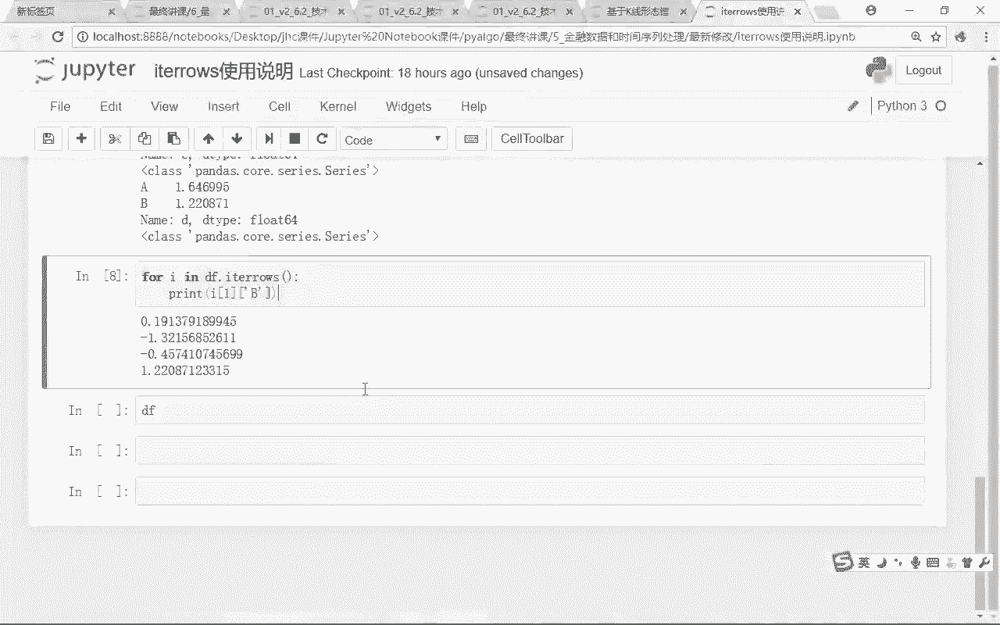

大家其实已经发现了诶，我们的空白PPT呢，呃我们的itera rose返回的其实是两个东西，返回的哪两个东西啊，一个是我们的行标签，一个是我们的呃对应的这样的一个series对吧。

相当于是把原来的列变成我的行，一行一行，原来的你有十列，那么现在我series里面就应该有十行对吧，哎所以对我们来说的话呢。

咳咳呃我们ital rose返回的是两个东西。

那么如果说我只给你一个变量，把它给取出来的话，相当于相当于来说怎么样，这个变量是不是就变成一个突破了，因为其实我返回到的是两个值，你只给我一个变量，那么没办法。

我只能把这两个值作为一个turbo返回出来，能理解意思吧，那么现在的话呢我们可以对它进行一个呃修正，或者说要对他进行一定的修呃，就是改进，那么这一块我们可以怎么改呢，比如说注意啊，我们现在for i。

然后呢item呃，两个，一个是I，还有一个呢是item in，这里的DF点怎么样，At roll iteral，咳咳rose，没问题吧，好那么接着冒号，那么接下来的话呢注意啊。

现在因为itera rose本身是不是就有两个返回值啊，第一个返回值是行标签好的那个label，第二个返回值是series，那么现在这两个返回值的话，我分别赋予了这两个变量，一个是变量I，一个是变量。

怎么样，item能理解意思吧，那么这个时候我们就相对来说，更好去理解一些了，比如说我在这里先print i，再print一个这个item，那么在这里的话呢，我们就不用像这里这种I0I1这样子去选了。

因为比如说我现在大家想看，我print出来的这个I就应该是这个行标签，这每一行的这个行标签，也就是这里的小写的ABCD没问题吧，那么额这样的话就不用像我前面，我想输出这个I0的话，我想输出这个行标签。

我得先怎么样，哎I0或者I1这种方式去输出了，明白意思吧，那么我们来看一下啊，在这个里面果然我先输出了是print i对吧，哎print i这个是不是A啊，第一行的这个行标签就是I。

那么第一行的这个item呢就是什么，第二行的这个item，是不是就是后面接着的这个什么series啊，所以在我们这个里面我们可以来看到呃，在现在的话呢我们可以看到这个呃，艾特的这个咳咳type。

我们把它呃也输出一下，我们来看一下啊，在我们这个里面我们输出一下这个呃item，这个type就直接就变成了我的一个什么SERI，就不用像前面那样了，我要是输出这个series的话呢，我得是I里面选择呃。

这个时候的这个I是一个元组，我选择第二个才是我的serious，然后呢这个series是要是在I后面，是不是再要去选择这个元组里面的第二个，但是现在的话呢，你看我们在这个里面直接给了那两个变量。

第一个行标签就复制给了I，第二个我的series就复制给了这个item，所以行标签就是我的变量I，这里的这个item就是我的接下来的这个什么SERI，听明白意思吧，哎这个看懂了之后的话呢。

我们就可以来看我这个策略了啊，那么这个策略的话呢，嗯大家来看这里呃，呃循环咳咳，那么这个策略啊我们写了两种写法，第一种写法的话呢，是我们只给大家提供了一个items，那么这个ITE斯的话呢。

相对来说理解起来就比较难理解，因为这个返回出来的这个item啊，在这里返回的这个item其实是一个元组，没问题吧，这个元组里面有两个部分啊，两个部分组成，第一个部分是行标签的这个怎么样。

label这是我的第一个元素，第二个元素呢是那个什么series，听明白意思吧，哎好那么在我们这个里面我们先讲这一个啊，这个相对来说可能嗯更好去理解一下，那么在这个里面嗯注意啊，我们现在还是一样呃。

ITERO呃，Rose，那么注意我们现在注意啊，iteral rose是不是返回怎么样返回两行对吧，那么第一行额返回两个元素，第一个元素的是行标签，我们给它一个变量叫做label。

第二个元素的话呢是呃或者你在这里叫I啊，都可以啊，我们在这个里面嗯嗯嗯改一下好了，叫叫做I，就是我的呃返回到每一行的这样的一个元素，那么这里改成改成I了，那么这里也改成I啊，好，那么第二个的话呢。

就是每一行的这样的一个series对吧，哎返回出来的是呃，把每一行里面就变成一个series返回过来了，所以呢在这个时候的话呢，嗯嗯大家知道啊，这个时候的这个item。

这里的这个item就不是一个额top了，这这里的item就是一个什么，就是一个serious，听明白意思吧，哎所以的话呢在我们这个里面，哎我们想要去选择item里面的哪一列。

item里面的这个signal这一列，也就是说大家会发现，现在我这个stock index长什么样呢，我们现在先把这个stock index输出给大家看一下啊，那现在这个stock index是这样的。

我的行每一行是一天，对不对，好，完了之后的话呢，嗯这是每一列，对不对好，那么这个时候大家感觉一下啊，我这个里面的这个item，返回的这个item应该是长什么样，你看原来是一行，完了是有这么多列，对不对。

现在的话呢我把它艾特成rose，第一个是我的一个I，第二个是我的一个什么ITEI的话呢，大家猜一猜看就应该是什么，这里的每一行的这个行标签是，2016年1月4号。

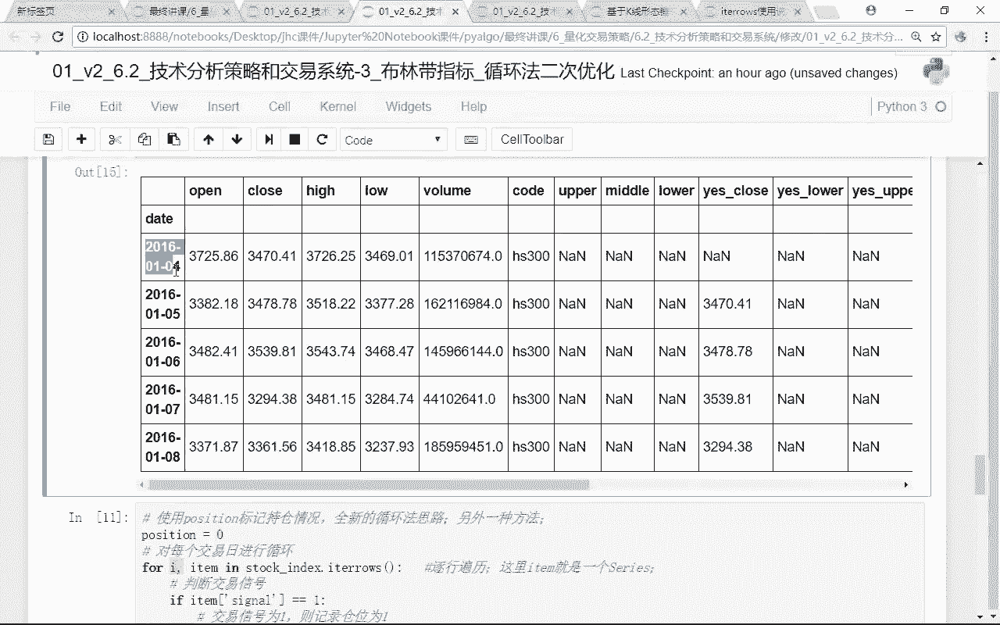

1月5号，没问题吧，所以呢我们把它写到空白PPT上，这么看，我都这么讲代码了，如果大家再看不懂的话呢，那确实这个也也也不能怪我了啊，我已经尽力了，那这个时候的这个I其实应该是每一四的。

这个I应该比如说2016年1月4号，听明白意思吧，这是我们的那个行的标签，就是我们这里的这个label，那么这个时候我这个item是什么呢，第一个item，第一天的这个item应该是这样的。

我们前面说过啊，在我们这个里面，这个item就变成了一个什么serious了，听明白意思吧，好变成这个serious的时候的话呢，我们说了呃。

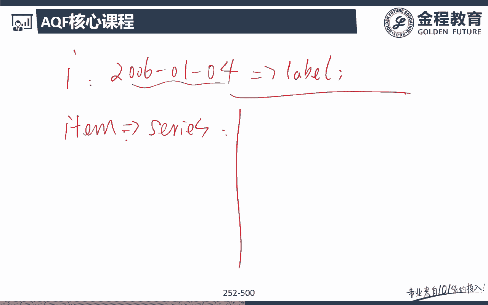

一行就是一个serious，那么这个时候原来的列名现在就变成了什么哎。

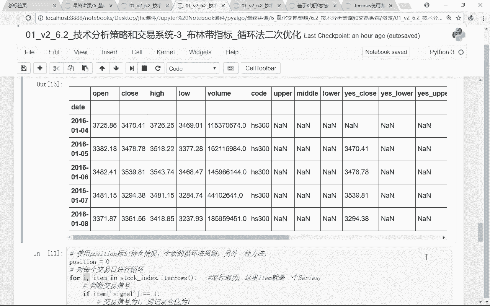

原来的列名现在就变成了毫米，因为serious的话呢就是这两维的这样的对吧好。

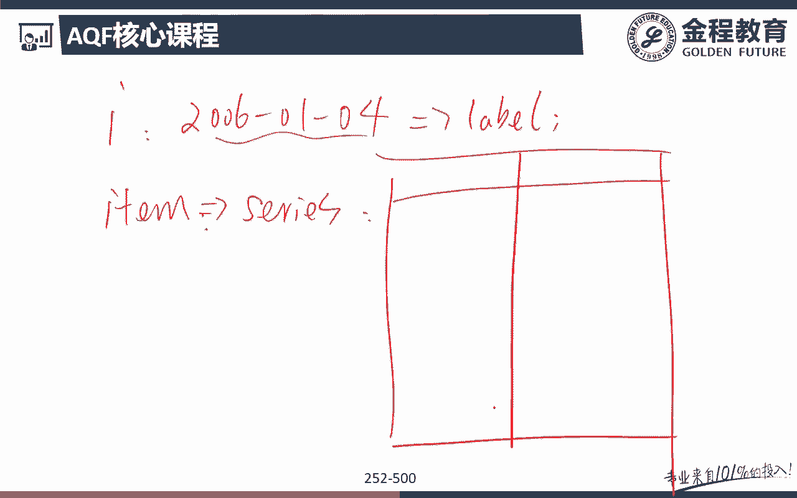

那么这里就变成了什么，这里就变成了open。

然后呢下面一下面一行呢就变成了怎么样close，在下面呢是一个hi。

我不写下去了，所以每一列现在就变成了这样一个series的。

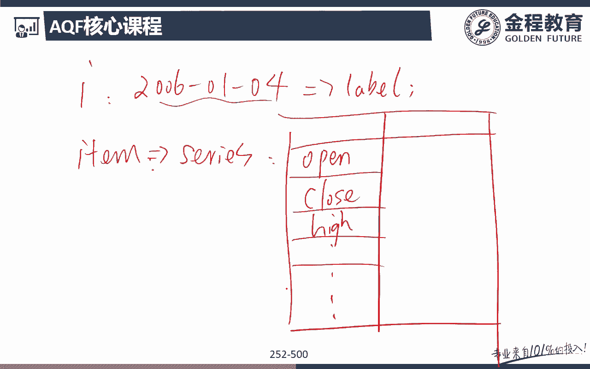

每一个行，听明白意思吧，那么现在比如说我要选择第一行的这个volume，那么很简单，相对于来说，我们就是额我比如说我想选择第一行里面的呃，这个呃什么额，随便写一个好了，比如说我想选择第一行的这个收盘价。

那么在我们这个里面，我就可以通过items里面的怎么样，唉，close这种方法，我是不是就可以选择到具体任何一天的，这样的一个收盘价是等于多少，我就可以在这个里面进行一个处理了，给他点可以进行赋值了。

能理解意思吧。

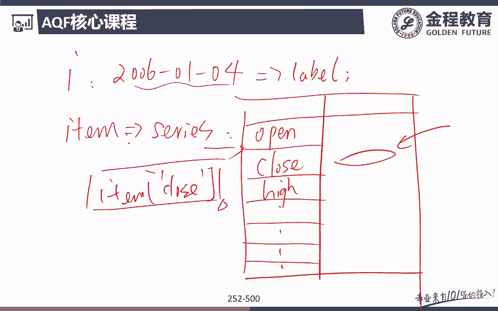

哎所以对用码说的话呢，这个可能相对来说更好去理解一些啊，这我们这里的第二种写法呃，那么在这个里面，因为我们这个里面怎么样，我新建呃，我就已经拿到了每一行，注意啊，我是itero rose。

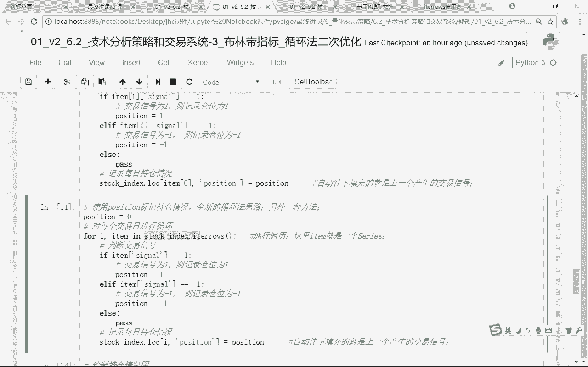

我有几行，我就有这样起，我就会做几次循环听明白，那么在这个里面，我是比如说我的数据行有300行，那么有300行的话呢，我就可我这个for循环就会做什么，300次，每次我都可以拿到一个I这一个item。

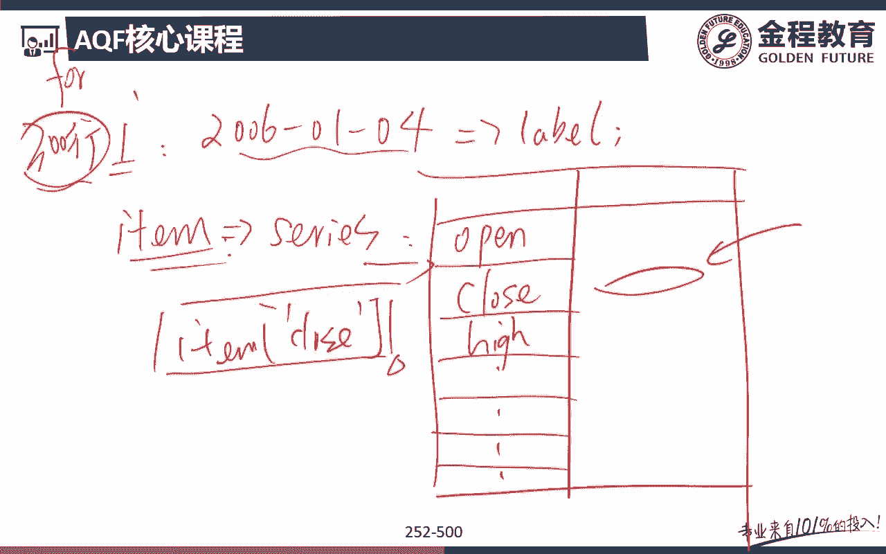

听明白一行就变成了一个item，能理解意思吧，好那么知道了这个之后呢，我们就可以来看下面这个了，他说FITESIGNAL等于一什么意思啊，也就是说在我们前面呃。

前面的这个嗯呃在这个stock index里面，我们哎在我们前面输出的这个stock index，在在哪里啊，我们再打印一个啊，比如说在这个里面的stock index点呃，head可能看起来不太好啊。

stock index点tail好了，那么对于我们来说，stock index点tail，那你看在这个里面呃，我是不是有这个signal，这呃signal和position，那因为我们后面起呃。

前面已经写呃代码执行过了啊，所以对马说在这个里面嗯嗯嗯啧正常来看啊，我们这个里面signal前面我们是不是已经产生了，应该哎在这个里面嗯，signal这一列我们前面已经产生了，就是呃，这里还没有啊。

在这里产生了这个signal，在这个signal的话，我们在这里的index的点tail这里我们没有输出啊，如果输出的话呢，我们这里的signal其实已经可以产生了。

那么这个signal那我们图已经画出来了一呃，有些是正一，有些是一对吧，那么绝大多数情况是不是都是零啊，好那么现在来看什么意思啊，也就是说如果说这一行的这个signal等于一，代表什么呀。

代表之后是不是这个点这个点，这个点这个点这几个点啊，说明是怎么样，这一天我是做多的，所以呢我让他的position就等于几啊，等于一，因为交易信号发出了额做多的交易信号，所以我这个持仓信号我就记录为一。

说明我是持有什么，说明我这里就可以开始持有什么多仓了，问题吧，哎好那么如果说我们前面算出来的这个item，那么这个signal如果说是等于一的话呢，那这个时候也是一样，我们就认为怎么样记入持仓为一。

我们认为我们持有了是一个什么，来开始持有空仓了，没题吧，那么额对我们来说，这两个是我们认为最重要的，如果这两个都不是呢，我else pass，注意啊，pass就是啥都不干对吧，哎，我就啥都不做好。

那么对我们说大家有同学可能会想了，老师我就写到这里有什么意义呢，注意啊，写到这里啥意义也没有，对吧哈哈额，这一行最关键的啊就是记录持仓信号，最关键的是下面这一行代码。

看到没有注意这行代码也是在我for循环下面的，听明白意思吧，来所以对于我们来说的话呢，下面这一行代码是我们整个for循环的一个，核心关键，哎我们怎么讲到上面去了对吧，应该是下面这个，但一样啊。

上面跟下面，其实最终我们所实现的效果是完全一模一样的，只不过呃稍微有一些些的不同，所以盗版来说呃，这最后这一行代码是我们整个策略，就是循环里面的一个核心关键啊。

也就是说呃前面的这个signal我们已经产生了，对不对啊，这个signal产生的一个原则，就跟前面跟大家说过，如果前天的close是小于我的lower的，那么昨天的close大于我的lower。

就是一开始做多了，那么同样的道理，如果前天的是大于我的upper的，但是呢昨天的小于我的UPER的上轨，那么我们开始做空是不是一啊，所以这个signal我们前面已经产生了，你看在这里面正一是做多。

一是做空，那么接下来的话我们要做的是持仓的一个型号，对不对好，那么怎么去算持仓的这个信号呢，我们是逐行便利啊，我们用的是循环，那么在这个里面iteral rose，你有几行，我就做几次循环。

听明白意思吧，那如果说你现在的这个signal是等于一的话，我就把我这里的position改成一，那因为你给了我一个买入信号，所以接下来的我的持仓是不是都应该是买入啊。

如果说这一天你给我的信号是一的话呢，在这里我就把我的持仓信号改成什么，改成position，就改成一，听明白意思吧，那如果说这一天你啥也没有，你是零呢，就是你这一天的signal你都是零。

或者说你看这里面你的这一天的signal，绝大多数是不是都是零啊，如果你是零的话呢，我也啥也不干，那么接下来的话呢，当天的具体某一天的这个时候的怎么样，他的这个position我就直接让他等于什么哎。

上一个position，注意啊，这一行代码是我们的最核心的一个关键，也就是说呃如果说比如说啊，我们现在2016年1月4号进来了，1月4号进来，首先他会判断一下这个里面的哎，我们又到上面去了。

也就是说在这个里面呃，这一行代码是我们整个最终的一个核心，也就是二零呃，嗯它代表什么意思啊，如果说你这个signal是一的话，我就记录持仓为一，如果你这个signal是一的话呢。

我就记录我这里的持仓信号是一，听明白吧，那么在有新的信号进来之前，我接下来的我接下来的这些天哎，你看在这个里面，I是不是我2016年1月4号，1月5号，1月6号，我接下来的每一天。

接下来的这里下面的这一天的里面的这个position，我统统让它等于什么，通通让它等于position，注意啊，这个position就是我这里的这个position，听明白意思吧。

也就是说除非有下一个信号出来，不然的话呢我当天进来的这个I啊，我的这个position还是用的，沿用的是上一个产生的这个交易信号。

听明白意思吧，哎这是最最关键的啊，那么我们再通过一个这种嗯，画一张图，大家来看一下，比如说二零呃，16年1月4号的时候注意，假如说这里的这个signal是一啊。

这假如说啊这里的四个都是零，是零的话呢，它不是一。

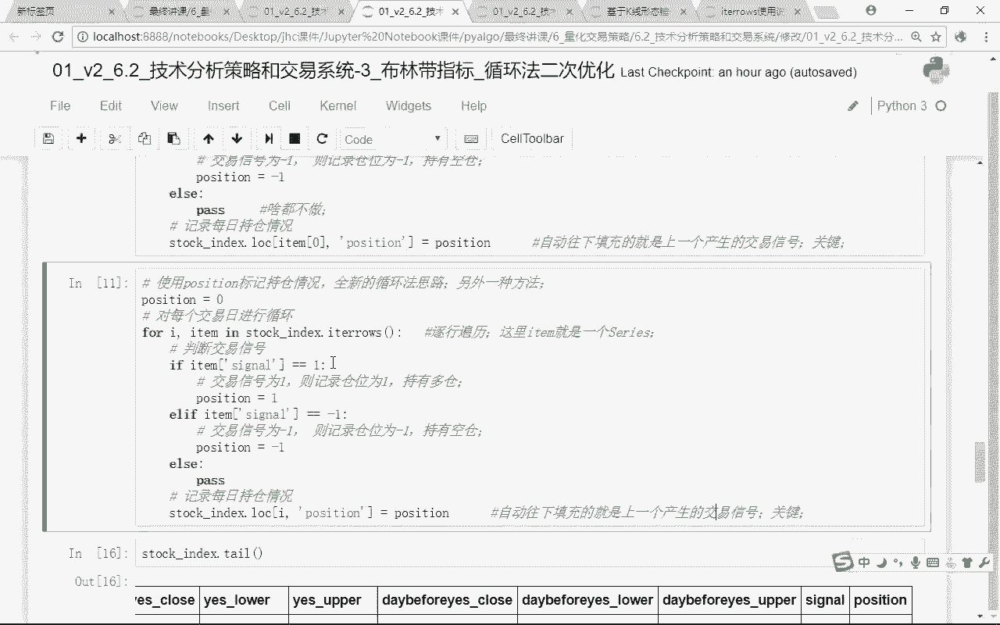

也不是一，所以我这里的position就是多少，我这里的position就是零，说明对于我们来说怎么样。

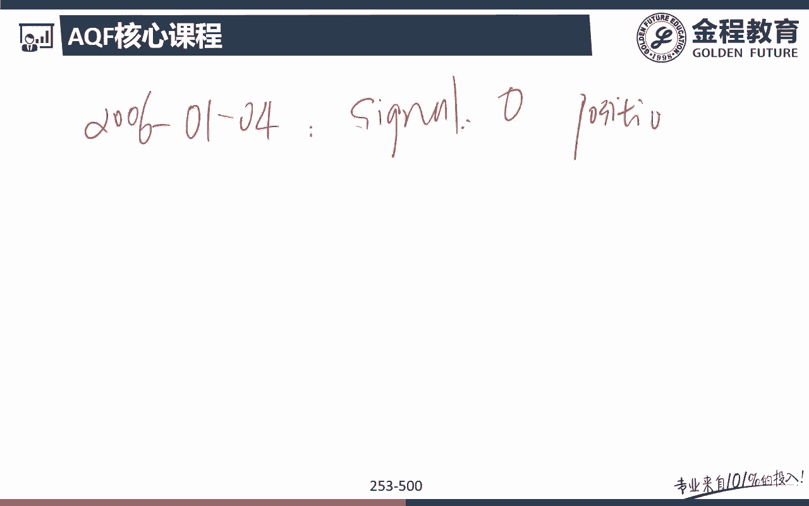

我是没有持仓的对吧，所以在我们这个里面，我呢在我的这个stock index里面啊，在这个呃data塔夫人里面新建了一列，这一列就叫做什么，咳咳，这这一列其实就是我们的这个position这一列对吧。

那么这一列新建的这个position这一列的话呢，我们就让它等于什么，等于这里的我们之前所产生的这个零。

所以这个时候呢，在我们前面跟大家讲的这个stock的这个index，就是stock index这个data frame里面啊，其实就是在2016年1月4号这一天，它只专门有一列。

这一列就是position，对吧，这个这一列里面的这个position，因为前面赋值给你了。

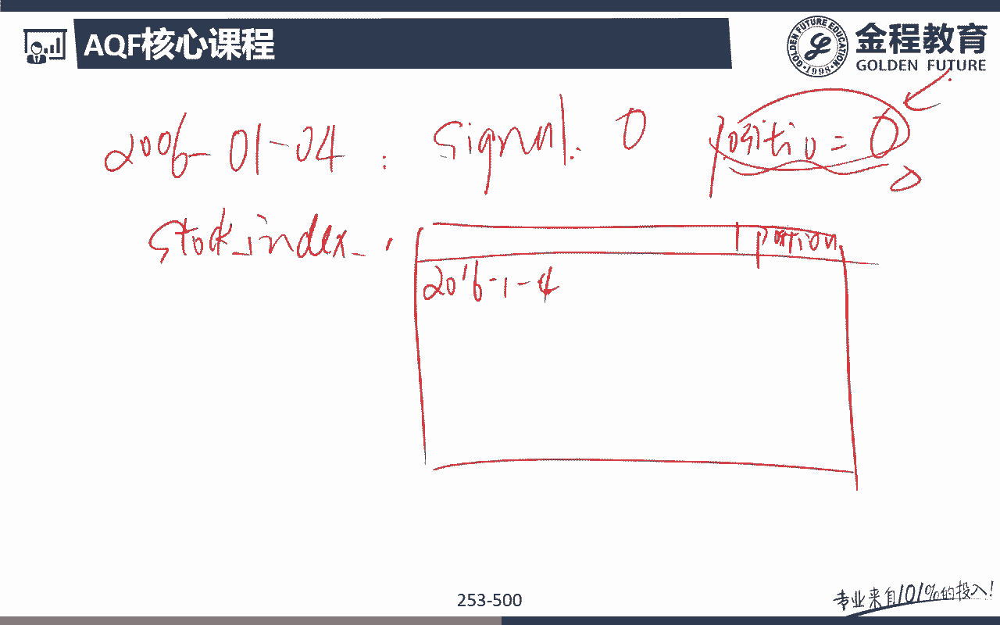

这个时候额咳咳，这个时候的这个position就等于零，这一行呢就是这一行代码所做的事情，听明白意思吧，相当于是在data frame里面，在等它frame中自动填充了好。

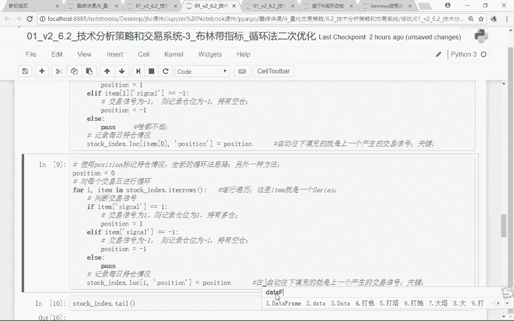

那么这是1月4号啊，那么接下去大家看一下，如果说比如说到2016年随便说啊，2月14号的时候，他这个时候产生了第一个可以做多的这个信号，那么这个时候，这里我在便利，到2016年12月14号的时候。

因为itera roll每一天我是不是都会便利啊，当我这个itera roll里面，便日历到2014年2月14号的时候，这个时候我可能产生了做多项signal，是不是等于一了好。

那么signal等于一之后，我这里的position就等于几了，在我们这个循环里面的这个position，是不是就把它改成一了，好，改成一之后，最后一行代码是什么，这一天的2016年的2月14号。

这一天的这个position，我让他等于这个position，所以呢对我们来说，在这个data frame里面，也就是说在2016年2月14号，这个stock index我们这里定义的啊。

stock index这个data frame里面也就在这个里面，可能是一行是2016年，怎么样，2月14号，那么这个时候他这里的这个position，它就让它等于几啊，等于这里的position1了。

明白意思吧，好那么接下去大家看2016年呃，2月15号，那么可能只有这一天我产生了这个signal，是不是一啊，对吧好，那么2016年2月15号。

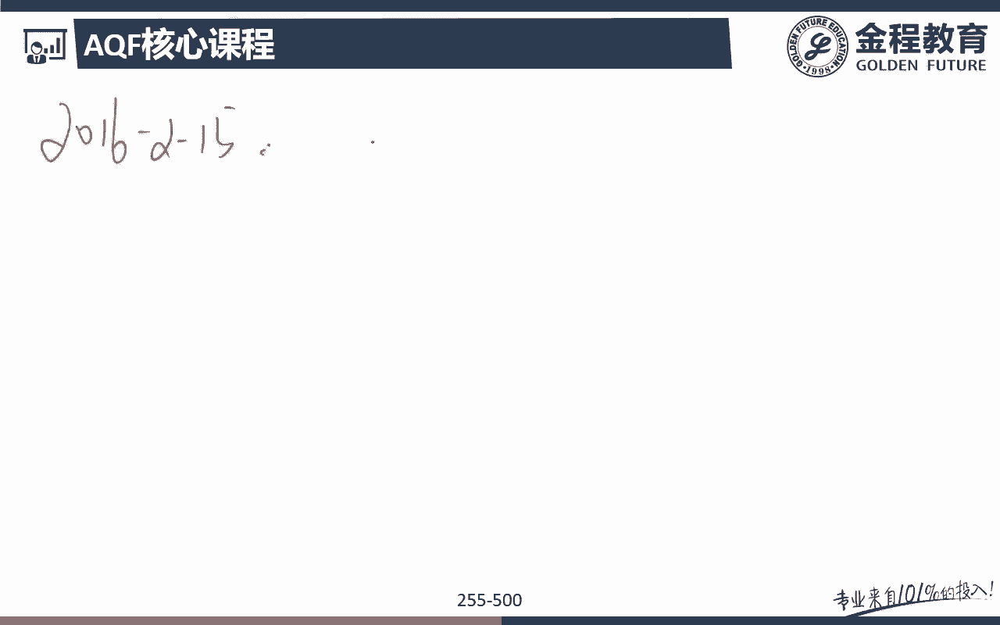

这个时候我的signal又等于几了，我这个西格呢是不是又等于零了，好那么这个时候signal又等于零。

之后的话呢，它不是一，它也不是一，所以呢这一个时候我的position等于几啊，这是理解我整个段代码的一个核心啊，注意这个时候我的position还是上一个position。

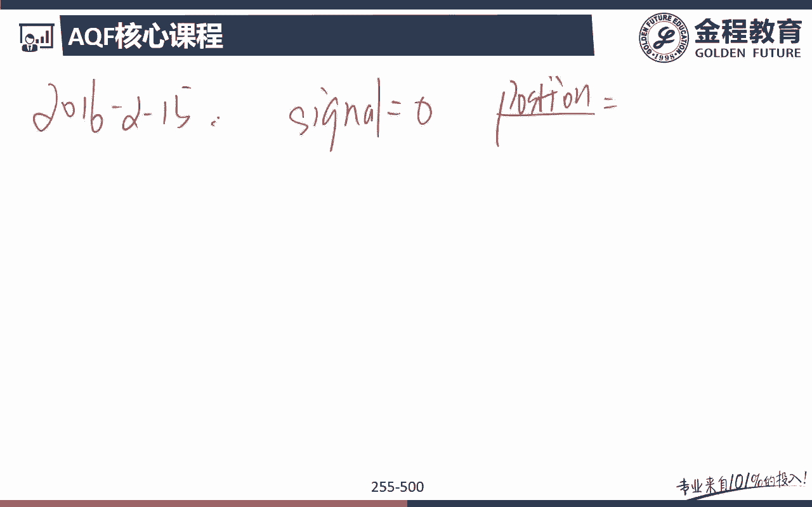

听明白，因为在这一段呃，你既不是一也不是一的话，我不会修改我这里的position的，看到没有，这个position是在这个F的下面的，没问题吧，哎所以你既不是一也不是一的话。

我不会修改你这个position，我这个position还是沿用到上一个position。

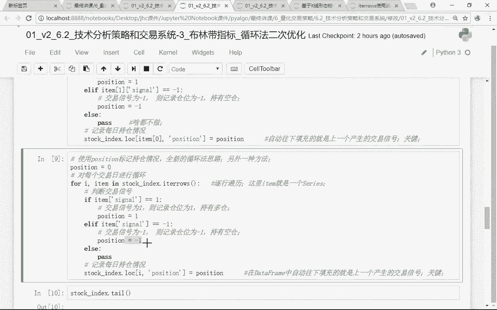

那么在我这个例子里面，上一个position是多少，上一个position就是一，所以呢在这里面2月15号这个里面，这个position还是等于一。

听明白意思吧，所以最后的话呢我在这个里面，我想这里填充的最后一行。

填充在这个stock index这个data frame里面的，2月15号的这一溜，2月15号的，一二2016年2月15号这一列，这个时候他的这个position还是等于几啊。

还是沿用的是上一个2月14号的这个一，没问题吧，直到什么时候哎直到又产生一个signal，可能是一的时候，才会把我这里的position改成一，那么我这里的position。

才会在下一个产生signal的时候改成一，明白意思吧，哎那么注意，这一行代码其实是通过逐行遍历的方法。

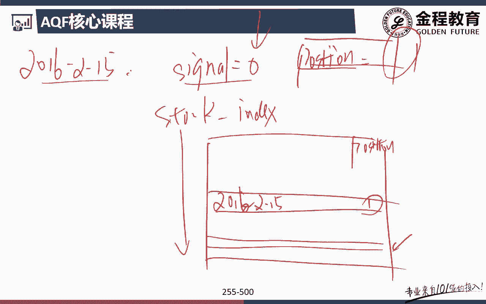

注意啊，这确实呃相对来说是有一定的难度啊，他是通过这种逐行遍历的方法，怎么样把这个里面嗯嗯嗯，把我这个data frame里面的每一行，这个通通便利一下，看看满足不满足条件额，满足条件是一的话呢。

我以后接下来的就是position，就是一是一的话呢，这个position以后正式服役，直到下一个信号出来的时候听明白吗，那么接下去你看这一行的代码，是我们前面跟大家讲过啊，是我们整个核心啊。

如果说我们产生的这个signal如果是零的话，就是呃前面产生的是零，我既不开多，也不做空的这个零的话呢，我们这里的position它就等于上一个position，因为不等于一，不等于一。

我在这个F里面啥也不干，那么这个时候的这个position，就是这个循环里面嵌套的这个position，还是上一个我留下来的这个position啊，是一或者是一，能理解意思吧。

哎所以这一行代码你能搞懂的话呢，那么后面的话呢我们来看一下这个index and detail，那么后面我们就可以画出这个持仓信号图了，那么我们会发现原来你看在这个里面，嗯嗯嗯我们把他重新重启一下好了。

因为呃咳咳顺序顺序，前面我们这个稍微在执行的时候顺序有点乱了，那么再重新把这个看一下，首先我是import，这个没有任何的问题，完了之后呢，我传呃获得了这个数据对吧好，然后呢用ta列表计算上轨下轨。

然后呢就可以把我这里的图，布林线的这个图画出来了，完了之后呢，计算前天和昨天的数据，那么我们可以把这个里面的这个，昨天前天数据都算出来了。

好接下去的话呢是计算我们的signal对吧，signal的计算原则前面已经跟大家说过了，好我们把它的呃尾巴打印出来。

给大家看一下，在这个里面signal是零是一哎，这一天我们是不是开了一个空额，开了一个空仓对吧，好看了一个空单，那么接着的话呢，在我们这个里面，每一天的这个交易信号是不是有了，但是注意啊。

这一天我只产生的是交易信号，并不是持仓信号，听明白意思吧，那么怎么去产生持仓信号，我逐每一天去便利，如果你这一天的产生的这个新signal是一的话呢，我就让我的position等于一。

那么在下一个信号出来之前，你的这个position是不是都应该是等于一啊，哎下一个signal只可能是什么，哎比如说是一，一的时候，我就把我这里的position等于一，那么接下来所有的这一列。

接下来的这几列是不是我这里的position，统统让它定义成我这里的一啊，所以在这个里面你看啊，原来的话呢我只有signal这一列，它是没有position这一列的，看到没有。

那么接下去的话呢我们执行了了这段代码之后，那么在这个时候，就是这个是持仓信号的这段代码啊，接着再来看这段呃，这个data frame这个tale我是不是就有position了，哎一负一负一看到没有，哎。

所以对于我们来说的话呢，在我们这个里面嗯，嗯通过这一段代码的话呢，呃我们就可以把我们这个持仓图，把它给画出来了，那么你看在这个里面呃，这个持仓图可以跟这张图大家对应一下啊，也就是说如果是负的。

这一段应该都是一，那么这一段也应该都是一，这一段也都是一对吧，直到下一个信号出来之前嘛，所以呢在这里你看这里都是一，这是一，这是一，这是也是一，没问题吧，那么相当于是还是那个原理。

在我们下一个信号出来之前，我沿用的我的头寸还是应该是上一个型号的，只不过在这个里面我产生的交易信号，我的和我的持仓信号我是怎么样分开写的，同时我是用了循环的方法来去写的，听明白吧，哎这个啊这一段代码啊。

大家再仔细的好好去体会一下啊，这一段代码确实，初学者的话呢会有一定的难度啊，那么但是呢你体会了这背后的一个思想之后，你就会发现，他其实他所用的这段思想还是挺精妙的对吧，还是挺精妙的啊。

你signal是等于一，我就把我的position改成一，你signal是一的话，那我就把你的c position改成一，那么其他的都是零的那些signal呢我就怎么样，哎你上一个signal是什么。

或者说你上一个呃position是吗，我就下一个position还是等于什么东西，我没有发生改变，听明白，只有当我signal是一和一的时候，才会影响我的position。

那么才会影响我data frame里面position这一列，理解意思吧，唉相当于是把我后面的这些，进行了这样一个填充啊，好那么这一段代码掌握了之后呢，上一段代码一模一样啊。

上一段代码只是说我在it tal rose的时候，我只给了你什么一个变量，那么这个变量，即使ITERROLL会给我们返回两个对象对吧，那么你只有一个变量，那没办法。

我只能把这两个对象怎么样放在一个TPO里面，这所以呢这个in de这里的这个item是一个turbo呃，它是一个行标签，然后呢后面跟着的是一个series，如果说我这里给你的是两个对象。

额两个变量的话呢，这里的行标签就是到I里面去了，第二个的话呢，第二个series是不是就到item里面去了，这个就是我们最初的时候跟大家讲的，Python里面的unpack的一个概念，还有一下吧，哎好。

那么上面这段代码啊一模一样啊，只不过在这个里面我要想我想选择series这一列，我得先选在这个top里面，先选择第二个元素对吧，第二个元素才是我这里的serious。

所以我得ITE1再选中这个signal，Itten，一再选中这个SIGNANO，我要选这个行标签呢，我要用item0来去选择这个label，就不像我这里我直接选I，或者我直接item的四个人就好了。

但是你这个看懂的话，上面就是一模一样的，听明白我们产生的这个结果也一定是一样的，大家自己再回去体会一下啊，好那么持仓图画出来了之后呢，后面的收益计算我就不说了，跟我前面的都是一模一样的啊。

跟我之前的那个CCI的策略都是一样的，收益的计算计算每日收益策略，然后最终我们就可以把这个图形，把它给画出来了，所以呢在这个图形里面，我们会发现沪深300的这个累计收益啊。

也是跑赢了我的这个买入并持有的，这个策略的啊，那么有些地方额咳咳啧，我们表现的还是比较不错啦，但是呃跟我原来的这个指标，好像有点这个反向的这些指标对吧，你看嗯当然并不是全都反向啊。

有一部分我是反向的一个指标，那么有些地方我是比较好的，你看在这里下跌了，我识别出来了，所以呢我觉得可能是做空了，我就开始涨了对吧，那么当然也有一些做的不好的啊，你看我这里还是接着在涨啊。

但是我可能触发了一个做空的信号，我这里就开始跌了对吧，哎那么这个就是我们最终的这样一个呃，布林带的这样一个图啊，布林带我们第一次用到了这种循环的方法啊，那么这个循环的方法我们是逐行遍历，听明白意思吧。

一行一行去便利，那么我们用到的是这里的itero rose的这个方法，他返回了两个，一个是我们的行标签，还有一个是每一行的原每一行的这个值，只不过我们是把它变成一个听明白。

那么我想选这一行里面的这个元素的话呢，我就可以通过c series这种行标签的方法，我就可以选到这里，每一行的这个元素的这个值了，那么我就可以进行这个策略的，这个他的一个值的这个每一行的具体的。

比如说position signal这个元素这个值的一个修改，在我这个循环里面都可以做了，能理解意思吧，所以呢通过循环这种方法的话呢，我们会发现在我这个一天的这个循环里面啊，我可以做很多很多的事情。

他的呢就要比我们前面跟大家讲，只能是这种向量化的填充的功能要来的更强大，可能大家现在还没完全感感觉出来啊，但是呃我们后面会有非常多的去呃，用循环的这种做法来去跟大家去编写策略啊。

好那么这个布林带的这个策略呢，我们就讲到这里，大家再好好去体会一下啊。

