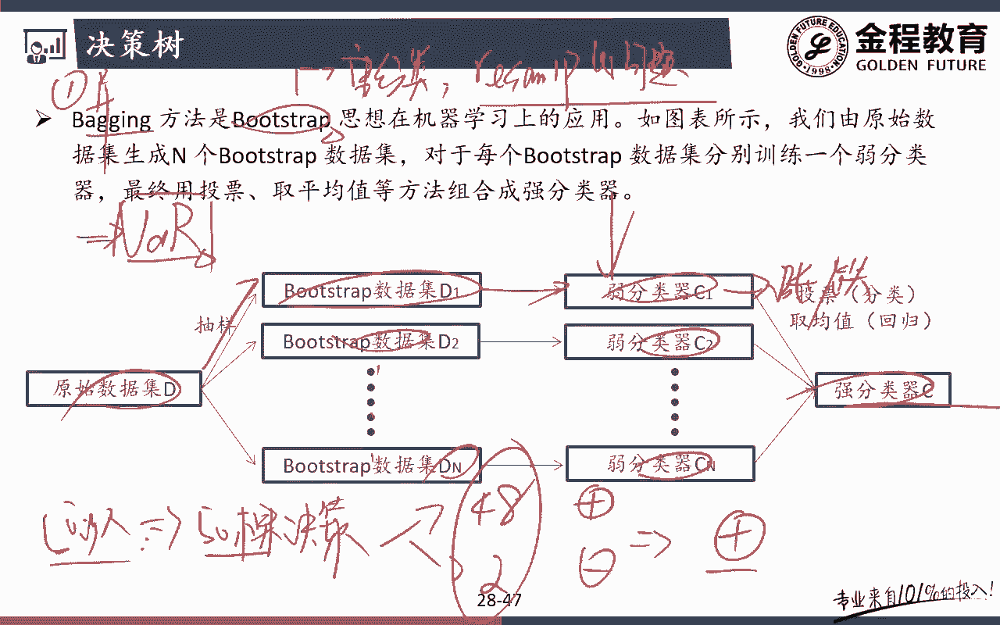
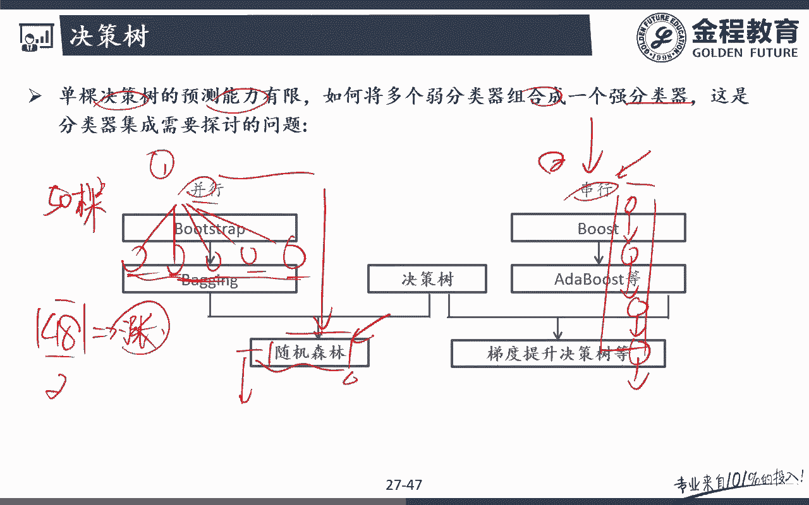
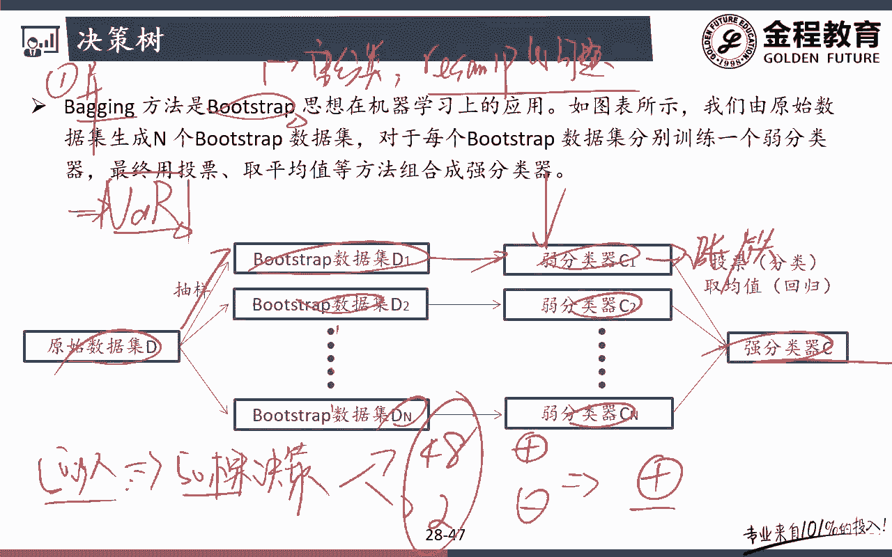
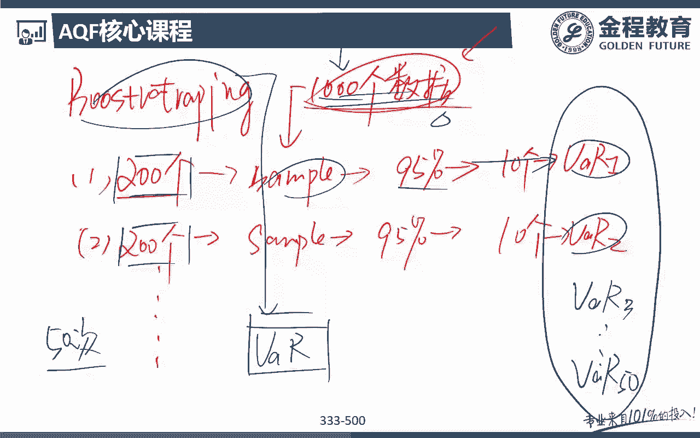
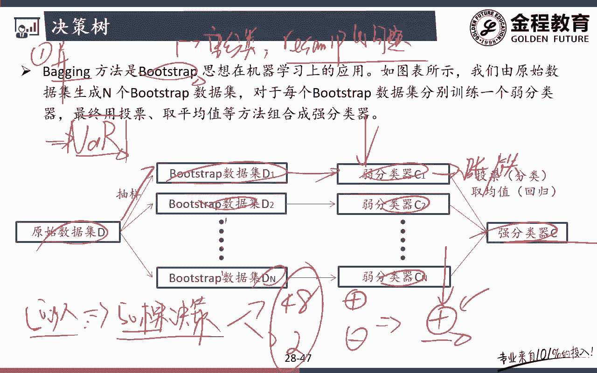
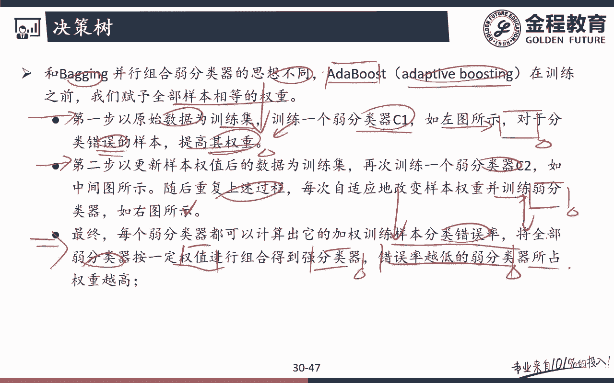
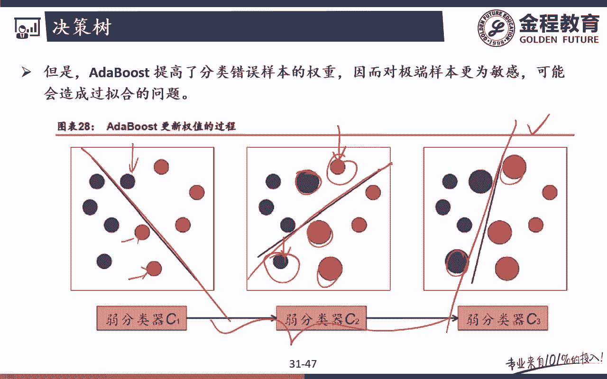
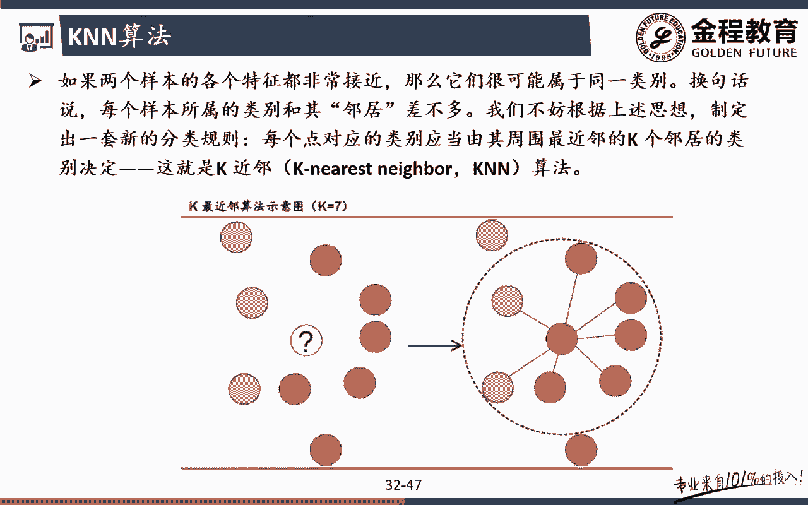

# 2024年金融大神老师讲解量化金融分析师.AQF—量化金融专业知识与实务 - P9：《+威❤hhh427501  了解获取全套课程》03.机器学习算法原理_3决策树算法原理 - 量化沿前 - BV1oU411U7QM

那么大家好，那么接下来的话呢，我们跟大家介绍的是，下面一个特别有用的一个算法，这个算法呢叫做呃决策树，叫做decision tree，好这个算法非常流行啊，这个也是跟我们实务当中，用的非常多的一种算法。

那么这种算法的话有它的一些优势，比如说速度比较快呀，可以解决一些非树之类的一些特征，包括它最大一个特点是，可以解决一些非线性的一些分类，因为有些问题啊，其实嗯我可能在线性呃，在其他算法上我无法求解啊。

但是呢我用一些决策树的话呢，可以非常快的嗯，快速的可以把它给求出来对吧，可以把它给呃找到它的一个分类的一个问题，所以呢对我们来说，这个决策树的其实对我们来说呃，它也有两个啊。

一个叫做decision tree classifier，决策树的一个分类问题，还有一个呢是decision tree regressor，决决策树的一个回归问题，那么同样的道理啊。

我们在这里还是拿的是决策树的这个分类问题，来去跟大家说明这个算法问题吧，那么这个算法的话呢，也是比较有意思的一个算法，同时的话呢它的功能非常非常强大，而且计算速度非常快，那么这个算法的话呢。

同时呃虽然我们不会拿来用于量化投资啊，但是呃我们把前面的那些特征，向量的特征工程全都做完了之后，最后的话可能就是一个算呃，fit的时候的一个算法的一个改变对吧，你完全在用SBM的时候，你换一个。

或者你不用CVM，你可以试试decision tree对吧啊，可以看一下它的一个效果，所以段漫说前面之前的那些嗯，在我们课上的那些算法的原理，掌握了之后的话呢，在代码里面啊。

其实大家就只要改变那个classify呀，那个分类器的一个名字，那么我们就可以完全实现一个不同的一个算法，所以对我来说的话呢，其实理论上来说，这些算法在我们后面嗯的code里面。

全都会每一个都会带着大家去跑一遍啊，好，那么我们简单来看一个决策树的，这样一个例子啊，那么我们后面有一个决策树呃，因为决策树为什么除掉呢，他后面还会衍生出一些新的一些算法对吧，在结策数的基础上。

比如说我可以用一些什么随机森林啊，后面的话呢我们还可以有一个叫做呃，at boost的一种一些算法，其实对于我们来说的话呢，这个是都是基于决策树的这样一个思想来去呃，发展起来的啊。

所以我们这里决策树嗯不做深入去展开啊，但是会简单来带大家看一下，好我们来看一下决策树的一个问题啊，那么这个决策树的话呢，我们解决的是怎么样子的一个问题呢，我们画一张图就可以知道了。

在PPT上我们也有一个例子啊，但PPT的这个例子稍微稍稍有些难啊，我们先来看一下呃，先把算法的原理告诉大家对吧，好比如说我们还是拿一项注意啊，我们在这里拿的是回归的一个分类的问题，对吧好。

那么我们还是一上来呃，拿那个一上来跟大家讲的一个分类的一个问题，比如说推荐歌曲的时候，我们有两个特征，一个是我们的一个节奏，还有一个呢是我们的这样一个什么音调，对吧好，那么对于我们来说，节奏的话呢。

这里我们分成了slow和怎么样，fast哎在越子我这里节奏越快，然后音调的话呢我们分成了低音的部分，和我们这里的一个什么高音的一个部分，没问题吧，好那么之前的话呢我们跟大家讲过。

我是属于什么样子的一个类型的，我是呃喜欢节奏比较快的对吧，同时的话呢我也不喜欢听高音的，所以呢可能对我来说就这一块的内容，就这这一部分的内容，我可能是不是可能比较感兴趣啊，哎节奏比较快。

然后呢这个怎么样呃，D的音色音调比较低好，那么除此以外的其他地方呢我都是不喜欢的，比如说呃虽然速度与速额低音低音是低音，但是速度比较慢，我这个人呢对这个节奏还是有一个比较大的，一个这个要求的。

我就特别喜欢快一点的节奏的对吧，慢一点的节奏不太喜欢的好，同时的话呢高音的这些东西啊，音调是比较高的，我都不喜欢，因为我我不喜欢扯嗓子的对吧，我是喜欢那种呃啊怎么说呢，就是没有情感。

能唱出那种感觉来的情怀的那种对吧，现在最近也是特别有意思啊，说呃最近机器学习在学什么呢，我要让机器我要让我们的这个门是有情怀的，也是一个比较有意思的一个话题，好那么对我们来说的话呢。

可能额我们画了这样一个数据集，这个数据集的话呢，就是呃对我来说是非常符合我的这样一个，taste的一个呃情况对吧，高音的部分我都不喜欢扯嗓子，都不喜欢，低音部分呢要看节奏快还是节奏慢对吧。

节奏快我比较喜欢，节奏慢的话，那我也不喜欢好，那么我们会发现这样的一个算法的话呢，嗯这样一个分类的一个问题啊，我们拿传统的那种嗯线性的分类的话，那是不是分起来可能会有些困难，哎我要把它给分出来的话。

至少我得两条线对吧，比如说横着这里画一条线，竖着在这个里面再画一条，这里竖的这里再画一条线，哎，我是不是可以才把这一块，我所喜欢的这部分把它给画出来对吧，但是呢对我们来说呃，呃这种算法的话呢。

在那里我们要拿线性的算法去分类的话，问嗯可能就有点难度，但是注意我们再拿这里的decision tree啊，就非常非常简单了，好我们先来看一下啊，这个decision tree怎么个简单法呢。

我可以通过这种决策树的一个方法的话呢，我可以马上来就把我这一个部分的一个，我所喜欢的这些数据类型，我就会把它给分出来，怎么去呢，比如说我们有第一个问题，第一个问题我们问你嗯。

我我可能在这个里面音调是不是低的对吧好呃，那么在这个里面呢，如果说音调呃，你看哦这个是，当然这个问题，为什么第一个问题问的是音调是低，也是有讲究的啊，呃，呃当然这个我们的AKF课上。

就不会具体跟大家展开了，那么嗯后面的课程里面会有啊，比如说我们怎么去做这个节点上的一个问题呢，这个节点上我们是怎么去呃问问题的，其实我们要考虑一些什么叫做信息增益。

information game的一些问题啊，才可以去更好的去把这个决策树的一个效果，给体现出来，当然这些不在我们的这个探讨范围里面啊，我但是我们后面会大致跟大家感觉一下啊。

好比如说我第一个问题可能问的的就是，节奏是呃，这个音调是高的还是低的对吧，好音调是不是低的，音调是D的话呢，如果说我们是yes的话呢，我们就接下去进一步去判断，如果说音调不是低的，是NO。

也就是说如果音调是直接是高的话呢，我直接就可以知道了，我的分类是是什么，音调是高的话呢，我这个分类是不是就是打叉，因为音调高的我就不管你了，是不是只要你是高一的，在那扯嗓子，我是不是就不行了。

所以在我们这个里面通过一个问题，哎我们如果这个问题是NO的话，我就可以怎么分类分好了，就是直接我们就是不喜欢的，对吧好，那么音调低的这个里面呢，接下来我们再来问第二个问题，就是节奏是否怎么样。

节奏是快的还是慢的好，那么这个问题的话呢，我们问出来，如果说我们这个节奏是快的，是yes的话呢，哎这个时候我即使音调低的，节奏也是快的，所以yes的话呢，在我们这个里面。

我分类出来的那个结果是不是就是我是喜欢的，那如果说节奏是NO的话呢，也就是虽然你是音调低的，但是你是节奏慢的，但是对我来说节奏慢我就是不喜欢，所以呢对我们来说哎怎么样，我最终的结果是不是还是错啊。

开始打叉，所以对我们来说，通过这个决策树desection tree，大家有没有发现，我们把一个圆根本看似非常复杂的一个，非线性的这样一个分类问题，通过短短的这两个问题，我们就可以把这一段。

就是我们是不是就可以把它给这个决策速度，可以把给分了给分出来了，问题吧，哎好，那么这是一个相对来说比较简单的一个例子啦，那么我们再来看一个，相对来说更复杂的一个例子啊，那么德玛说这个例子的话。

那也其实都是类似的啊，只不过我们这个数的话呢可能分的更复杂一些，比如说在这个里面嗯，这里是零对吧，这里是12345好了，12345，那么在这里也是一样，123445，12345没问题吧。

好比如说这里是X这里是Y等等，好，那么对于我们来说的话呢，在我们这个里面，比如说在我们这个三这个里面，我们先画一条虚线啊，辅助我们去画图，然后呢二这个里面我们也画一道虚线，同时的话呢在四这一个里面。

我们也画一条虚线好，画完这个虚线之后的话呢，我们看啊在这个里面，这里些这些点的话呢，我们都是喜欢的，就是这个圈圈好，同时的话呢在这里一段我们也是喜欢的，是圈圈好，同时的话呢在下面其他的一些地方。

类似于在这个里面我们都是不是特别喜欢的，这个，I i don't like，那么在这个里面我们也是这里打叉呃，所以这样的一个分类问题我怎么去做啊，你看啊，这看似是不是又是比较复杂的一个分类问题啊。

如果说我们要拿额其他的一些分类方法的话呢，这个嗯当然你可能这个应该也画不出来对吧，唉呃我们可能要通过一些呃，可能SVM的把它放到更高维的一些里面，我们要去做对吧，但是呢呃这种算法的话呢。

但是在我们的决策树下面，又可以非常快速的去解决问题，那么我们一起来看一下，这个在我们决策树下面怎么去问问题呢，很简单，首先第一个我第一个问题问的是，比如说X是否小于三对吧好，那么如果X小于三的话呢。

也就是说yes，我们就走下面一条路，如果是NO的话，那我们就走什么这一条路问题吧，好如果X是小于三的，是不是在这里呀，好那么就是在左边这一段，如果X是小于三，是yes的话呢，我们接下来判断一个问题。

就要问你Y是否怎么样小于二，没问题吧，如果Y是yes，它确实是小于二的话呢，Y是小于二的，所以呢这个时候我们的这个怎么样，是不是就突出来了，我们实际上是大差，那么如果说Y是大于二的一个斜点呢。

那如果说是NO的话呢，这个时候我们也出来了，我们的最终的那个是圆圈，对吧好，那么再来看右边这一坨，右边这个X小于三嗯，是NO，也就是说X是大于三的，那么接下去的第二个问题，就问的是Y是否怎么样小于四。

也就是说如果Y是小于四的话呢，嗯这个时候yes的最终的一个结果，我们还是一个什么打叉，如果说Y不小于40，NO的话呢，在这个里面我们是不是一个圈圈，哎，所以对我们来说的话呢，在这个里面大家可以看到啊。

非常复杂的一个非线性的分类的一个问题，其实我们通过这样的一个决策树也是两个字的，一个叫做父节点，然后呢两个子节点，那么对我们来说，我们是不是可以把这个decision treat。

classify的一个问题，也可以把这个问题把它给解决掉，哎，所以呢这个其实就是我决策树的一个核心的，一个思想和算法问题吧，唉是不是理解起来还是比较简单的，对不对，好，那么嗯接下来的话呢。

我们简单跟大家提一个概念啊，这个概念的话呢，虽然在我们KF里面不作为一个重点去设计啊，但大家可以了解一下，也就是说我为什么在这里选的是音调低，而不选节奏快，作为我们这里的第一个节点。

唉那么这个大家知道了解一下，在这个里面我们可能要看一些指标，比如说其中有一个指标叫做information是吧，get信息的一个增益，也就是说我要通过一个判断，能给我产生一个最大的一个什么信息增益。

听明白意思吧，哎那么什么是信息增益，哎那么包括还有一些其他的一些概念啊，这个在决策树里面真的要讲这个算法的时候，我们就会来跟大家说，他有对应的一些数学公式对吧，哎这些都会涉及到的啊。

但是在我们这个里面我就不说了，那么如果说啊在这个快，如果我把这个音调低，把它分成节奏快呢，也就是说我把这一个呃子父节点上，我们把它判断成节奏是否快，那么他的信息增益啊。

可能就没有我这个音调低的信息增益来的高，为什么，你看如果直接是节奏快，那么节奏快，如果是yes的话呢，怎么样，我是不是变成了这样去切了一刀对吧，哎完了之后的话呢怎么样，如果是，NO的话啊。

这这这这道题其实呃可能看不出看不太出来啊，因为在我们这个里面如果节奏慢的话，那其实对我们来说，我也是全局的把它给这个这个嗯，嗯我也可以把它给判断出来，那对我们来说的话呢。

这个那这个例子中可能我画的没有特别好啊，所以在这一块的话呢，这个我们在这里节奏快和音调低到底谁好，可能你用肉眼我们就看不出来了，那没关系啊，我们后面嗯在我们的PPT上，还有一个具体的一个例子。

这个例子就比较好了，这个例子是跟我们食物当中的一个例子，是有关了，那么这个例子里面我们就可以判断出来啊，在这个里面我们就不去讲这一个概念了，那么这个概念我们就在这里来去跟大家说，比如说在这个里面。

我们想判断一下当前市场上的股票的一个市值，分隔和板块的一个风格，来去预测我们的一个什么涨跌情况对吧，好比如说在我们这个里面有这样一个模拟图啊，那么这样的这个表格里面我发现这样一个情况。

也就是说我们这个市值我们分成了大市值，中市值和怎么小市值，然后呢百块分格里面我们分成了消费周期，消费周期成长没问题吧，涨跌情况吗，就是我最终的那个label是涨还是跌问题吧，哎好，也就是说在这个里面。

用我机器学习里面的话来说的话呢，就是什么这个市值是一个什么features，我的板块是不是一个features啊，我要预测我的涨跌情况，就是我最终的一个什么label这问题吧。

哎这是我们第一节课就和大家讲的一个概念啊，这个概念一定要搞清楚好，那么我们会发现怎么去判断这个涨跌情况呢，其实我们可以通过这样一个decision tree，我们就可以判断出来到底是涨还是跌了。

也就是说来看一下啊，第一个节点判断是否是大市值，如果是大市值的话，我们会发现如果这些都是，你看他就用了两个大时值，如果是大实值的话，我们马上就可以得到这是一个什么场对吧，哎，那么通过一个判断。

我们就能得到一个标签的话呢，这种其实我获得的这个信息，大家感觉一下是不是就是感觉还是不错的，对吧好，那么是大市值之后，我们再判断下面一个叫做是否是消费类，那么看一下是否是消费类，如果不是消费类的话呢。

哎马上就可以判断出来是跌了，为什么，你看消费是在哪里有啊，这个是消费这个消费这个消费呃，所以对我们来说除了不是消费类以外的话，就是既不是大事呃，是否是不是大市值，同时又不是什么消费类。

所以那个对于我们来说满足这个条件的，就什么不是大市值，又不是消费类，比如说这里的什么周期呃，这里的这个周期，这个这里的这个什么成长，这个成长我们会发现，其实这几个点最终得到的一个效果，是不是都是跌啊。

没问题吧，哎好那么跌完了之后，我们再来看最终判断的一个是否是什么初始值，那么看一下是否是中市值，如果说既不是呃这个里面不是大市值，同时是消费类呃的里面不是大市值。

就是中市值和小市值里面呃又都是消费类对吧，又是消费类，那么这个时候呃，我们就来判断一下是否是一个什么中式值，也就是说如果你是中式值的话，我们会发现你是不是长大哎，如果说你不是中式值的话呢。

你是不是就是跌的哎，最终通过这样一个决策树的话，那我们就可以判断出来我训练好了，就是这样一棵树，好完了之后呢，等有一个新的数据进来的时候，我就会同样的问，判断一下是否是大是指示的，就是涨。

不是就是看看是否是消费类呃，不是消费类，你就是跌的是消费类，我就看看你是否是中市值对吧，所以呢这个就是我最终的训练完成之后的，这样一个列，听明意思吧，唉这样一个decision对吧，TRA哎。

所以呢这是可以在我们的实物的量化投资里面，去解决一个真诚真实的一个投资的方向，趋势判断哪个问题的，明白意思吧，哎好那么在这个例子里面的话呢，我们就可以简单来看出来了，就是我前面跟大家讲的那个。

信息增益的那个概念，我们就可以看出来，为什么我们要把这个里面的这个复节点，负的这棵树，我们上面的这个节点判断叫做是否是大市值啊，因为如果是大市值的话，我马上就可以判断出来这两个是不是涨了。

完全一个label，我是不是就出来了，对吧，唉不然的话你把它给反过来，比如说把这个里面随便换啊，我们随便说啊，问你是否是消费类，那么是否是消费类，如果说是的话，是真的消费类，你看消费类有这三个。

是的话呢，我能不能马上判断出来是消费类的，就是涨或者是跌的，判断不出来是否的话呢，不是消费类里面，我们会发现在这个里面也有涨涨跌跌的，明白意思吧，那么这个时候我们就会发现，如果我们把是否是消费类。

作为我们这里的第一个节点的话，可能我获得的这个信息增益，是不是就没有大市值来的大，哎那么这个到底怎么区分啊，到底第一个节点上是问一个什么样的问题，不用我们自己去管对吧，这个我们的算法他自己会去计算。

我们所获得的这些information，给他自己会去额算出来一套最合理的，或者说我获得的信息增益最大的这样一棵树，没问题吧，那么当然通过这个机器学习之后，我们拿到了这棵树，这棵树以后。

等有新的股票前期的一个情况进来了之后，额我们是不是就可以进行判断，最终我就可以得到是涨还是跌了问题吧，哎这个就是我们决策树的最简单的一个嗯，思想和原理，那么前面是跟大家讲了。

单科决策树的这样一个嗯运算的一个原理，对不对好，那么对我们来说，其实单科的这样一棵树啊，其实我们认为你的运算能力，相对来说还是比较有限的啊，那如果说我可以把多棵树把它给组合在一起。

变成一个比较强的这样一个强的一个，分类器的话呢，那其实对我们来说，相对我们在做这种分类问题的时候，是不是可能更好一些，对吧好，那么怎么把一棵树变成更多的一棵树，然后呢进行一个更好的一个预测呢。

在这个里面其实有两条线，一条是叫什么并行，一条叫做串行对吧，额相当于什么呢，这个并行的话呢，就可以，大家可以理解成这是有很多很多棵树对吧，完了之后的话呢，我们每额比如说我给你的你了，额产生了这50棵树。

对不对好，那么50棵树再让我们判断涨跌的时候，可能48棵树判断涨，然后呢两棵树判断跌完之后，最终我的那个额判断出来的那个结果就是什么，找哎多少数服从多数的这个原则对吧好，那么这种叫做并行的。

他其实每棵树都是并列的对吧，哎那么这种算法的话呢，其实就是我们最终啊我们会呃，在我们的程序里面，你也可以自己去跑一下，叫叫做random forest，这对吧，叫做随机森林。

那么还有一个呢叫做串行的一个多棵树，什么意思啊，我呢是一棵树，这棵树决策好了之后的话呢，我们会看一下你的表现的一个好坏，完了之后的话呢，把表现怎么样分类错误的那些东西啊，我们可能给你一些更大的一个权重。

然后呢再让让你判断一下好，然后呢再去给你判断一下，是不断的怎么样迭代的这样一个过程，能理解意思吧，所以虽然它也是多棵树，但是呢这个多棵树里面的数据集啊，我是呃好分类正确的那些数据句，我不管你。

但是分类错误的那些数据集，我给你一个更大的权重，那么完了那些数据我给你一个更大的一个权重，那么对我们来说，你可能在下次分类的时候，你就可以把它给改过来对吧，哎那么不断的不断的去。

怎么样进行这样的一个优化和迭代，最终的话呢它的结果可能相对来说也是比较准，准确的，听明白吧，哎那么其实并行的话，那指的就是什么少数服从多数的一个每棵树，其实都不经过呃这种修改的每棵树的话呢。

它相当于是都会自己去独立判断，完了之后呢，我取一个少数服从多数的这样个个原则，但是呢串写的这种走法的话呢，它是在呃每棵树的基础上，它那简单来说啊，它是有一定的这样一个权重的一个修改。

好我们一个个来看一下啊，比如说先看并行的这个并行的这个的话呢，它就是做在这个里面它叫做白给对吧，什么叫做白给呢，它其实是叫做波特strapping，波特stripping。

这个其实大家学过CFA和farm的同学，应该都不会特别陌生对吧，不strapping的话呢，其实这是其实是一种纯分类的，重分类的一个问题啊，或者说他是一个RESAMPLE的一个问题，那么这个接触过啊。

特别是FM啊，FM2级里面市场分析里面我们在计算VA的时候，在算V的时候，我们是不是有一种叫做butter strapping的一种V，唉如果考过FM2级的同学，应该还能会有印象对吧。

那么我们会发现什么叫做bootstrapping呢，比如说啊，呃我们还是拿这个VA的那个例子来去举例子啊，比如说我们现在有1000个数据对吧，1000个数据呢，我现在1000个loss，1000个呃。

return或者lost的一个数据好，我要算95%的一个吧，好咳咳，95%的一个吧，怎么去算呢，这个1000个数据吧，我5%，我怎么样从我损失最大的那些一个开始对吧，呃往前从左往右。

这里是lost最大的，然后呢loss慢慢慢慢下降，我往从loss最大的那个往第数第50个，第50个的话，那是不是就是我这里的495%的，这个八，没题吧，哎这个应该是考过CFA和FM的同学都知道对吧。

叫做在线价值value at risk，这个是一个吧，那么对于我们来说啊，如果我们只有这1000个数据，我们拿历史的方法去算这个八的话呢，其实这是从左往右数第50个，我的一个损失。

是不是我这里的95%的一个吧，它代表一个意思，就在于那我有95%的把握，说我张天的这个损，当然比如说这是一个daily吧，或者你也可以算ANUALLY吧等等，any anyway都可以啊。

比如说我有95%的这个把握，我说接下来这一天，我今天的损失不会超过这个吧，能这意思吧，反过来说我可以说成对吧，呃我有5%的概率，只有5%的概率，在下一天的这个损失，我会超过我现在算出来的这个方案。

这么题吧，哎玛尔的概念啊，应该是相对来说是比较简单的啊，好，那么这是一个最传统的这样的一个，VD的一个计算对吧，historical vt一个计算，那么对于我们来说。

什么叫做boosting的一个挖的一个计算呢，那BOOSTRAPPING的这个挖的这个计算，那其实重分类RESEMPLE的这个Y的一个计算，那么比如说啊举个例子，我现在不是有1000个数据嘛，对吧。

哎1000个我的一个return或者lost的一个数据，现在怎么做呢，呃现在的话比如说啊随便嗯，当然我们不是特别严谨啊，比如说我在每个数据这1000个数据里面，随机挑选出怎么样200个数据组。

那么这200个数据组作为我们的一个什么sample，然后呢在这200个数据组里面，我们再去计算95%的一个吧，能力就有四吧，唉那么在这个里面95%的折扣吧，在200个数据组里面。

是不是从左往往右数倒数第十个啊，哎我们就是不是可以把这个挖，把它给算出来了对吧，大家注意这个挖我们只算出来一个吧，这娃是第一次进行三破的时候，我算出来一个八吧，那么同时算完之后。

我再把这200个数据通通再扔回去，再扔到这1000个数据里面，然后呢，再在这1000个数据里面，再怎么样挑选出200个呃额数据，那么这个200个数据可能在原来数据里有选过。

也原来在数据里面没有再怎么样产生一个sample，再来算这个sample里面的95%的吧，然后呢，倒数第十个我是不是可以计算出法子弹二啊，对吧好，所以德玛兽我可以不断的重复这个过程。

比如说你可以自己去重复一些对吧，比如说那重复这个过程之后，我可以算888，比如说我在这里重复了200次额，或者说重复了50次，那么重复了50次之后的话呢，我是不是可以计算出这怎么一共呃，483888。

一共有50个吧，问题吧，哎那么这50个吧之后的话呢，再怎么样，我在我要算整个这1000个数据的，最终的那个八的话呢，我就把这50个数据算出来，这50个八我再除以50。

我是不是就可以算出来这个平均的这个八，那这意思吧，我们把这种方法的话呢，就把它叫做波特是吧，哎boot strapping好，那么这个思想在呃，结合在我们的这个决策树里面的话呢。

其实它是一一模一样的一个原则啊，比如说呃类似不能说一模一样吧，反正是非常类似的这样一个呃算法的一个体现，比如说当我们说哎，你现在不是一共有100个数据，1000个数据嘛，我先挑选出200个。

然后呢用一个决策树，然后用前面训练出来的这个决策树，看看我最终判断出来的是涨，什么是跌，能理解意思吧，我完了之后呢，我再选出200个数据，然后呢看看我这个决策树跑出来的是吧，市涨是跌，所以他们说原始。

那你看啊，这个过程就是在原始的数据库里面，我先抽样抽样的一个数据集，完了之后呢，用这个前面训练出来的那个算法，可以帮助我们去判断是涨是跌，同样的我可以随机去抽取啊，抽取多少多少次，你可以自己看对吧。

完了之后的话呢，我就可以每一个他就可以判断出一个市，涨或者怎么样跌吧，比如说就拿我们前面我们做了50次RESEMPLE，那么做了50次RESAMPLE的话呢，在我们决策树里面。

这个时候对应的我们是不是就做，我们就有50颗决策树啊，对吧，哎有这50棵决策树，每棵决策树我怎么样都让他自己去判断一下，根据我前面训练出来的那个算法，我都让你去判断了一下是涨还是跌，没听吧。

好那么比如说这50颗数据里面啊，假如说啊48颗是判断是涨的，然后呢有两颗判断是怎么样跌的，最终我就形成了这个强分类的这个气强分类器，其实就是相当于我呢投票多少数服从多数。

最终的话呢我判断出来那个结果是长的，明白意思吧，那么这种做法有个什么好处啊。

这种做法其实就是我们这里的嗯，前面跟大家讲的这个RINFOREST随机森林。

那么随机森林的做法的话，那相当于把这个，相当于把每棵树取了一个平均吧。

就跟我这里的重分类，RESEMPLE的这个思路是完全一样的，明白意思吧，也就是说如果我只是单纯的1000个数据里面，我拿倒数第50个数据做我的我的一个八的话，这个八算出来可能是不那么精准的。

那如果我经过不断的重分类，不断的RESAMPLE呃，进行50次RESAMPLE之后，算出50个V再取平均这个VA我们实证发现，其实这个挖要对我们的真实的在减价值，这个判断是一个更好的一个结果。

那么同样的道理，在我们这个里面是不是也是类似的一个思想，对吧，同额对我们来说的话呢，在这个里面，咳一棵树你可能判断的时候有偏颇，但是50棵树取一个平均，而且数据集我也是随机抽样的。

那么最终选出来的这棵树的话呢，呃最终选出来的这个呃平取平均，这个结果是不是可能怎么样，它的性能就会大幅提升对吧。

哎，这个就是我这个随机森林的，这个背后的一个思想还是比较简单的对吧好，那么这是并行的啊，因为我们对每棵树取的就是类似的一个权重，完了之后的话呢，我们取一个加权平，我们取一个平均对吧。

哎可以通过投票啊或者取平均的方法，我们就可以形成一个强放在一期没问题吧，好呃那么这里也是跟大家讲的随机森林啊，Red forest，你看每一个呃，我是各个种大的数都有一个涨跌的一个判断，完了之后的话呢。

我可以通过一个投票的方法对吧，哎这个我们就不说了啊，好那么呃跟白给的就是说boosting的这个呃方法额，换一种呃，不是这种并行的啊，我们可以看一下这个串行的，串行的话呢。

有一个叫做ada boost对吧，也是非常最近比较火的这样一个概念啊，叫做adaptive boosting，它对于我们来说嗯，他是一个什么样的一个概念呢，我们在训练的时候，其实我们给所有的刚开始啊。

我们是给所有的样本给一个相同的一个权重，好完了之后的话呢，嗯我以原始数据作为数据集，训练出来一个这样的一个决策树对吧好，那么决策树完了之后，训练出来了之后，我们会发现啊，其实并不可能说每一个数据。

我都是完全分类正确的对吧好完了之后呢，如果是分类错误的话，那怎么办，我就怎么样重新，我就提高的这个错误，分类的这颗这个数据的一个权重，能理解意思吧，哎因为提高了错误的这个权重的话。

那么接下来我们还同样在，用那个原来的那个分类器，再去对它进行分类的时候，重复上一个过程，很有可能原来是错误的，因为你的权重高了，是不是就怎么分类正确了，对吧好，那么对于我们来说的话呢。

就是通过不断的去这样进行迭代，去进行额这样的一个处理过程之后，最终我们会得到一个错误率，非常非常低的这样一个怎么样分类对吧哎，完了之后，因为对我们来说怎么样，其实到最后的话呢，它类似于也是按照。

因为每一次进行了这样的一个分类之后，也就会得到一个值，对吧好，那么就会得到这样一个分类的一个结果，这个label标签是涨还是跌，我们就已经知道了，对吧好，完了之后的话呢，最终的话呢我们也是一样。

把所有的全部的弱分析，按照一定的全职呃权重去进行一个组合，得到一个比较强的这样一个什么分类器，那么对我们来说错误率越低的这种分类的话呢，就是在不同的在迭代的过程当中，我这个错误率越低的这个分类器的话呢。

我所占的比例就越高。

他其实就有一定的自适应的，这样一个原理在里面啊，我们简单来看一下啊，比如说首先这是这样一个分类的一个问题，对吧好，我们先试水这样分类一道，这样分类一到之后，我们就会发现这个点是不是分类错的。

这两个点是不是也是分类错的，所以在下一次同样的数据集，我们来进行分类的时候，我们这个时候错误的这个点，我们的分哎我们这里的权重是不是会变大，所以呢权重变大之后的话。

那我可能分出来在下面一个分类一起分出来的，可能就是怎么这样一种分类方法了，对吧，哎这样的一个角色边界好，这个角色边界之后，我们就会发现诶这个是不是又是错的啊，所以呢呃这个也是错的对吧，哎这两个是错的。

完了之后的话呢，我就会增加这两个东西的一个权重，我们把它会放放大，所以这个大了这个大了，最后第三个A分类器，我们是不是就可以把这个问题把分类分出来了，对吧哎好，所以呢其实他就是有这样一个自适应的啊。

adaptive的这样一个过程，完了之后，最终的话呢也是听过一段方法，然后取一个这样一个平均，那么你错误率越低的，然后额你的权重就越大。

对吧好，那么这个里面的话呢，就是我决策树的两种不同的呃，让呃这个这个怎么说呢，这个多棵树的一个方法对吧，一个是并行的，一个是什么串行的，并行的就最终形成了这里的RAINFOREST，然后串行的话呢。

其实就是可以用这里的adopt a and boost这种方法，问题吧，好那么具体的过程的话呢，我们就不多去做过多的一个展开了，好那么决策树的这个算法我们就讲到这里，其实也是讲的挺深的了啊。

那么后面我们也会带大家在算法里面。

