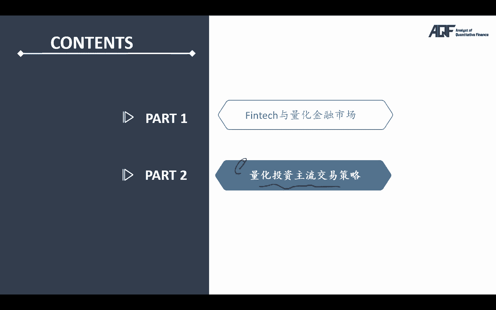
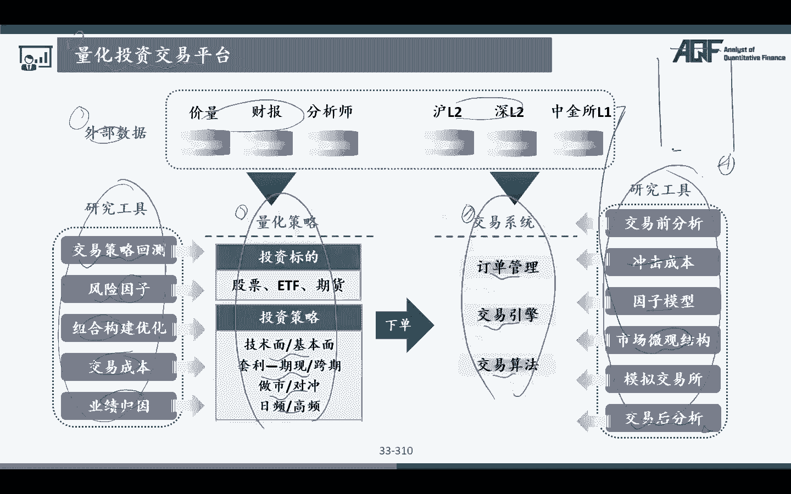

# 2024年金融大神老师讲解量化金融分析师.AQF—量化金融基础知识（完整版课程） - P15：《量化投资理论》04.3量化交易回测和实盘的一般框架结构 - 量化沿前 - BV1ar421K7Mo

好，那么接下来的话呢，我们来开始给大家看我们的第二部分啊，我们整个的量化投资的一个主流交易策略，也是我们整个课程的一个核心，在这里的话呢，我会跟大家讲解各种各样的交易策略的，这样的一个啊内在的一个原理。

那么学完这些之后，大家才可以在后面的这些课程当中，更好的去啊利用编程来去完成这整个课程啊。

好啊，来编写这个呃我们的一个课程代码好，那么先呃在讲我们的具体交易策略之前的话呢，我想先跟大家介绍两块内容，第一个的话呢就是我们的一个量化投资，交易的一个整个整体的平台，还有第二个的话呢。

就是我们的整体的交易策略的，一般的这样的一个回测框架好，那么我们先来看一下啊，这里先来看一下，如果说假设啊，是我们一个这样的一个回测框架的话，呃大概是分成了这几会分成这样几个模块呢。

首先第一个模块的话呢，是我们白了就是数据处理模块啊，当然啊这个不同的呃，我们的一个量化的一个呃公司量化的一些机构，他们所用的那个回测框架啊，可能啊大致会有有一点不同，但是整体的原理核心思路都是一样的啊。

那么首先第一块的话呢，是我们的一个数据处理及数据获取的，这样的一个模块，那么在这个模块里面的话呢，我们要进行一些数据准备，那这些数据准备的话，那就比如说加量信息啊，基本面信息，其他数据对吧好。

那么我们要去完成，我们这个里面的一个数据存储，所以的话呢在我们这个里面，其实主要做的是这样几件事情，第一大模块里面啊，主要做的是第一个的话呢，你要有数据的一个获取，对不对，好。

第二个的话呢就是我们要有数据的一个清洗，完成了之后的话呢，当然我们最终还要有一个数据的这样一个存储，所以的话呢哎在我们课程里面啊，我们的主要的数据的获取来源。

我们可能比如说或从我的to share里面啊，自己去获取，当然了呃对于我们来说的话呢，呃呃在真实的量化的交易的过程当中，大家还可以从很多地方去获得数据，比如说我们的万德数据库啊。

我们的BLOOMBERG的一些数据库啊，这些数据库里面都可以给我们啊，获得各种各样的一个数据啊，或者说我们可以自己使用我们的一些爬虫技术，那去网上啊，比如说新浪财经啊。

比如说我们的一些各种各样的一些金融，财经网站，然后的话呢去爬取我们所需要用到的一，些诶数据，那么第三个的话呢，我们就可以使用一些，我们的一些免费的一些开源平台，那么这些开源平台的话呢。

都会有这样的一些数据获取额这样一些来源啊，那么在我们的课程上面的话呢，我们主要围绕的是这两个，第一个的话呢就是主要的核心啊，就是我们会从免费的开源平台上啊，带着大家去获取数据。

比如说我们最主要的一个获取数据的一些来源，是图sh，还有一些的话呢，我们会使用一些排除爬虫的一些技术啊，带着大家从我们的网站上爬到一些数据之后，然后再加以分析，那么如果说我们可能需要用到万德。

或者BROOMBERG，其他的一些收费平台的一些数据的话呢，大家也不用担心这些数据的话呢，我们会诶跟大家下载好一起打包发给大家，因为我们呃这个也不会让我们，每个同学都必须要买一个万德blue berg。

这个才能去啊获得这些数据对吧，所以如果是涉及到这些数据的话呢，我们会啊打包好，就我们把数据会打包好，整理发给大家，大家直接使用这里的那些数据，我们就可以了，那么数据获取初始数据获得了以后啊。

基本上都是不太能用的，我们要进行一定的数据清洗，异常值啊等等这些处理啊，完了之后的话呢，我们再会把这些数据的话呢，存储在我们的一些数据库里面，那么这一部分也是我们今年的这个AACFA和AKF。

新改版的一个，我们加入了我们的数据的读取存库，这些啊，比如说我们会用一些SQL啊等等的一些数据库，那么存在我们的数据的一个存库和读取，那么这样的话呢等我们呃拿到了这些数据，我们存在了我们的数据库以后。

等我们在使用以后，想要使用的时候的话呢，其实哎就会比较方便了，对吧好，那么这是数据的预处理的这一个模块，有比较多的这样的一个嗯内容和功能啊，那么第二块的话呢叫做回测的一个准备，那么这些的话呢。

就是我们要去设定一些股票池啊，啊预定义自定义的这样的一些东西啊，那么这个模块的话呢，其实很多它跟我们的第三个部分，其实是结合在一起的，也就是说在我们的真实的量化的交易过程当中，可能就是这样几个模块。

第一个数据处理模块，第二个的话呢就是策略的一个啊开发模块，那这个策略的这个开发模块的话呢，主要涉及到的是一些什么呢，哎就是我们的一些策略编写的核心，对吧啊，我们怎么样去产生啊。

我们的一些信号怎么去获得一些得分，包括我们的一些参数寻优等等，所以的话呢策略回测阶段的话呢，主要我们就是给到最终给我们产生了一个signal，我们的这个signal的话呢，是我们到底是买还是卖。

我买卖的是什么样的一些股票，对吧，哦那么这些股票的话呢，我们会给到第四个，这个叫做交易风控，或者有些时候啊，我们很多用的就是一个叫做exception的一个模块，那么在这个模块当中的话呢。

他负责这样几个事情，第一个的话呢他负责啊整个的一个下单处理，因为你前面策略的那个模块，已经涉及到了我们的一个买入和卖出的，这样的一个订单，对不对，好，那么这个有了订单之后的话。

那我们就要去模拟这样的一个下单，好呃，下单完成了之后的话呢，呃或者说在下单的同时，我们还要看一下下单之前，是否满足我们的一个模型的一个风控要求，那么对我们来说啊，这在这个里面风控里面的话呢。

我们可以设计一些每天的指标对吧，比如说我们一些股，哪些股票的最大持仓的一个程度啊等等等等，满足我们的一些风控要求啊，我们才可以去啊进行我们的一个下单，那么在下单过程当中。

如果我们碰到一些异常的一些数据啊，情况我们如何去处理，也是在我们这个里面，交易和我们的风控的这个模块里面会有啊，好那么呃这个交易风控下单也下完了，交易也完成了之后，最后一个模块是什么呢。

是我们模型的一个表现与统计的，这样的一个点啊，模型的一个表现与统计的话呢，就是我们要去统计一下我们策略的收益率对吧，Separratio，最大回撤等等等等这样的一些指标，包括我们可以去绘制出来。

我们的一个额收益率的一个净值曲线图对吧，那么这个净值曲线图比较可视化的一个啊，就可以知道我们大概的一个策略是如何了，所以这个其实是一个比较完整的这样的，一个回测框架，那么在这个回测框架里面的话呢。

我们其实是跟大家介绍了这样几个，额方面的一个点对吧，那么我来给大家总结一下啊，首先第一个就是我们的一个数据处理的，数据获取和数据处理，那么数据获取和处理的话呢，大家知道我们的input是什么。

我们的output是什么，我们的input就是各种各样的数据来源对吧，有包括收费的，万德啊，免费啊，收费的，比如说BROOMBERG，当然也有免费的，比如说新浪财经啊。

你可以自己去去使用爬我们的一些爬虫，去爬取的一些数据，当然我们也可以用一些to share，我们所使用到以现有的一些，那么它的output是什么呢，它的output是一个清洗过程。

清洗完以后的这样的一个存库的这样的一个呃，数据存在我们的数据库里面，那这个数据的话呢，就作为我们下一个模块的这样一个input，下一个模块的话呢就是我们的一个strategy。

我们的一个交易策略的这样的一个模块，那么交易策略的一个模块，我们要形成交易策略，我们的input就是上面这一个模块的怎么样，output对吧，所以我们的input呢。

就是上面之前我们已经清洗过的那些数据，我们的output的话呢，那这个模型里面就会去进行各种各样的一些，模型的一些计算啊，然后的话呢完成各种各样的一个，具体的一个操作。

所以它的output的话呢是一些什么呢，是一些signals，这些signals的话呢是我们买卖股票的一些信息，我们要买什么股票，我们要卖什么股票对吧好，那么strategy模块以后的话呢，呃。

我们接下来进入到的，就是我们的一个exception模块，我们的一个交易执行模块，交易执行模块的话呢是呃他要完成呃，它的input就是前面的那些signal对吧好，那么他在这个模块里面。

他要做一些什么样的一些事情呢，在这个模块里面它其实第一个啊，如果说我们是回测的话，我们就要计算我们回测的这样的一个收益，那如果说我们是呃实盘的话呢，呃在我们这个里面是我们真实的这样的一个，实盘交易啊。

那么实盘交易的话，那我们就要完成整体的这样的一个下，单的这样的一个过程对吧，嗯那实盘的这个过程当中的话呢，就是我们要跟我们的一些股票的，或者说呃期货的一些API，我们要进行这样一个通信。

然后的话呢将我们产生的那些signal，给到我这个里面的这些API对吧，当然除此以外的话，那我们还要去做，看一下是否满足我们的一些风控的一些要求，那必须通过风控的那些事先事后的那些分析。

我们才可以发送这个信号来去给到我们的这个，如果是回测的话呢，我们直接就啊产生了买卖单交易啊，如果说啊我们是实盘交易的话呢，就是呃我们还要去跟我们的外部的股票的，那个API进行通信，对吧好。

那么执行的这个完成了以后，output产生了以后的话呢，就可以进入到我们最终的那个啊APPRECIAL啊，对吧，业绩的这样的一个评估的这样的一个模块，那么这个模块里面的话呢。

就是你前面产生你买了什么股票，卖了什么股票对吧，那么在这个模块过程当中，最终的output就是我们那个NAV啊的曲线，然后呢我们的SHAPARRATIO，各种各样的那些指标对吧，好。

这个就是我们一般的这样一个过程啊，那如果说呃，这个过程我们把它变成是一种实盘交易的话呢，其实其他都是一样的，实盘交易，数据处理模型的这些策略其实都是一样的，唯一的一个区别就是在下单的过程当中。

回测跟我们的这个呃，这个这个模拟的那个其实是啊有一些不同的，对吧，哎还有一个点其实就是在编写策略的时候，那么策略模型的开发的过程当中，会有一些不一样啊，因为啊模型如果说是回测的话。

那我们只需要处理回测的那些数据就可以了，回想的那些数据都是历史数据，但是的话呢，在如果说我们是一个诶实盘交易的话呢，在实盘交易当中啊，我们的这个数据其实都是一个，实时实时的一个数据。

所以它非常考验我们的实时数据的，这些处理能力，必须有实时数据的处理能力，才能完成比较好的这样一个实盘交易，对吧好，那么呃实盘和我们的回测还有一个点区别，就在于我们的具体的下单方式，那如果说是回测的话呢。

就是我们直接这个这个撮合，直接就是显示成交就可以了，但是的话呢如果说是实盘交易的话呢，我们就要跟外部的一个股票的那个，或者期货的那个API有一个真实的一个通信，这个过程的话，那可能就会比较复杂一些对吧。

那最后的话那就是那么模型的一个这样的，一个表现统计，所以啊不管大家自己以后去看我，我们是不同的交易平台啊，或者说我们是不同的软件，其实呃一个量完整的量化的模型的话呢，它的核心就是这样几个步骤。

而且他的呃下一个的output就是上一个啊，下一个的input就是上一个的怎么output对吧，就是这样一步一步呃，下来的一个闭环的一个过程啊，好那么前面是跟大家讲了，回测框架的这样的一个点啊。

那么接下来的话呢，呃我再跟大家讲一讲我们的一些啊，可能用到的一些方法和数的模型工具，研究工具啊，那么在这个里面，比如说我们前面提到的数据数据的话呢，有基本面财报的，有我们的一些价格的一些数据对吧好。

那么我们的一些策略策略的话呢是有技术面，基本面等等等等，日评高频对吧，那么呃在我们这个里面还有一些交易系统，交易系统其实前面也更提到过了，这些执行系统对吧，交易算法，那么在我们这个里面啊。

不同的交易策略里面，其实我们是有不同的研究工具的，不同的交易系统下面，我们也是有不同的这样的一个研究工具的，所以这两页其实说的是一件事情对吧，所以整体的话呢他在这个里面，外部数据是一个方面。

交易策略是一个方面啊，交易系统是一个方面，只是他在呃第四个部分啊，呃交易后的分析，他转也是做放在我这里的交易系统里面了，其实也是可以的，对吧好，那么这也想要跟大家说的。

就是交易策略里面我们可能用到一些什么呢，比如说分分啊，因子投资啊，组合的构建啊，我们要去衡量价业绩成交易成本，我们要去做业绩归因，那么整体的交易系统里面，我们要分析的是冲击成本因子模型，市场微观结构啊。

什么叫做市场微观结构呢，这个我们在课程里面也会有一定的涉及啊，就是去分析我们的这样一个叫做old book订单部。

那么订单不在中国，我们会发现我们有买一买二对吧，那么在我们这里面有卖一卖二，然后的话呢在什么样的一个订单部的情况下，我们认为将来可能会上涨，在什么样的一个订单部的一个情况下，可能会下跌对吧。

后面的话呢就是模拟交易所，或者说实时数据的那个处理，和包括处啊交易后的那个分析，所以这个是一个比较完整的，整整体的一个量化交易策略的这样的，一个回测框架。

