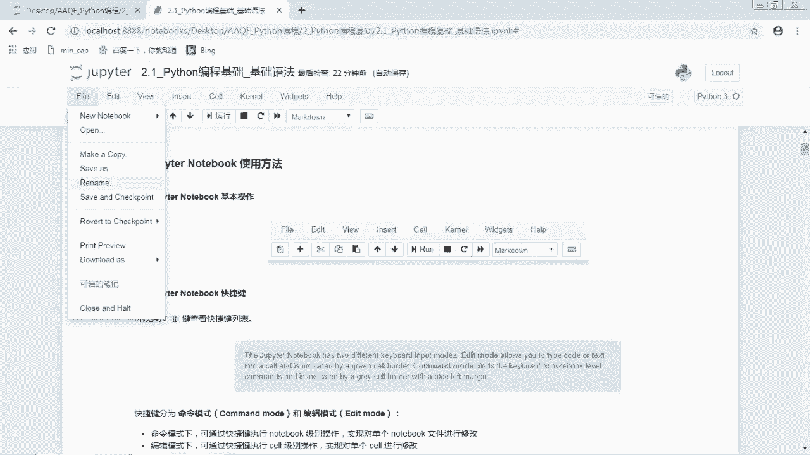
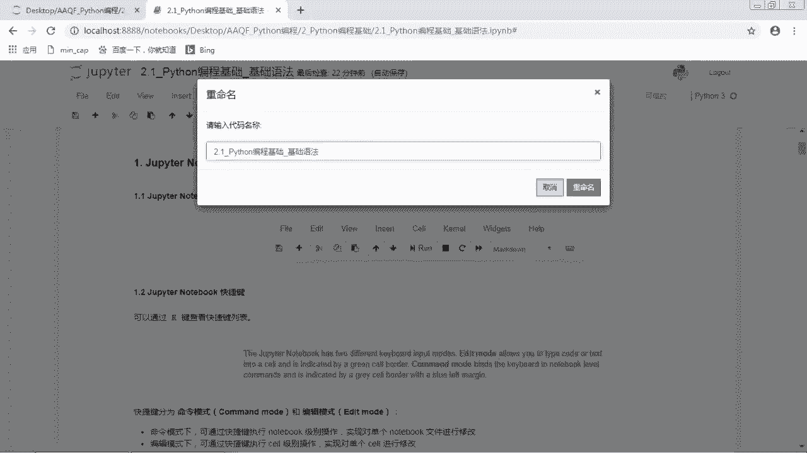
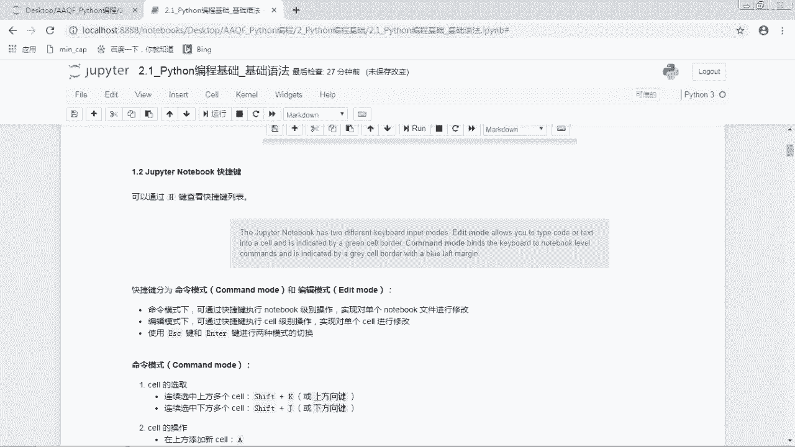
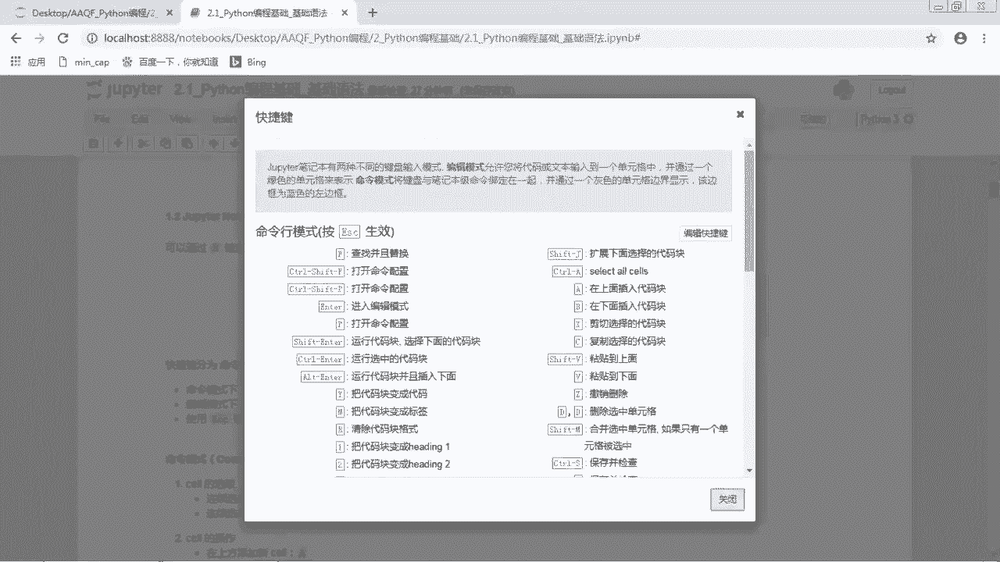
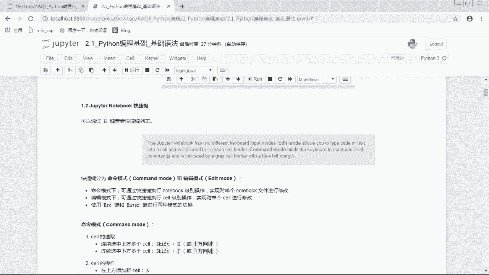
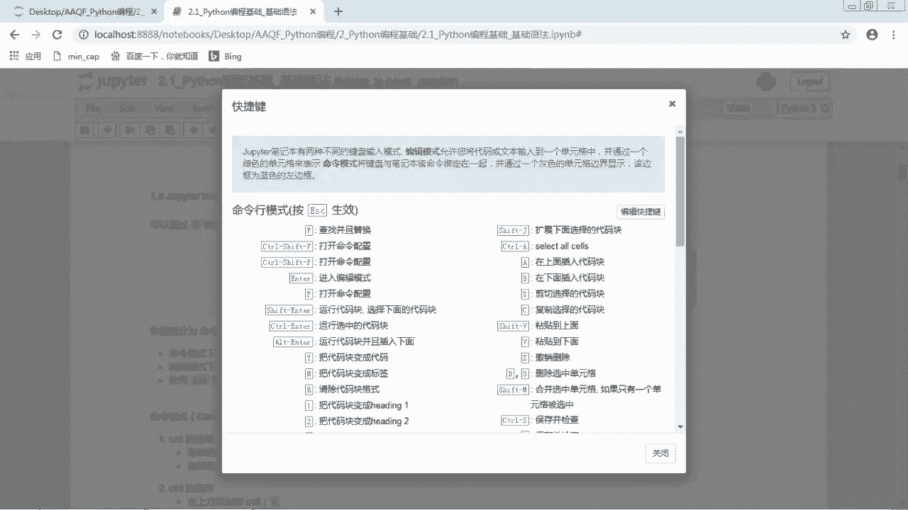

# 2024年金融大神老师讲解量化金融分析师.AQF—量化金融基础知识（完整版课程） - P20：《Python编程》02_JupyterNotebook使用方法 - 量化沿前 - BV1ar421K7Mo

好那从这节课开始，就我们就正式学习Python编程内容了，那我们首先看基础语法部分，那么这节课是有四块内容，首先是支配notebook使用方法，也就是这个软件的一些基本使用基本操作。

第二块是Python基础语法，第三个是Python基本数据类型，那我们今天的课程，只是将这个基本数据类型做一个简单的介绍，那在下一节课中，我们会对Python的六大基本数据类型，都做一个详细的讲解。

然后第四块是Python运算符，好我们首先来看一下JUPNOTEBOOK的使用方法，我们先看一下基本操作，那在这个网页的上方，我们看到有这样的啊两行，那这些按钮呢。

就是我们呃这边notebook可以使用的一些操作，我们来带大家稍微看一看，首先是fire，就是对呃这个文件的一些操作，那new notebook python3就是新生成一个python3的代码文件。

那我们这样就是新生成了一个代码文件，那它生成的位置的话，就是在我们当前的工作路径，我们当前的路径就是在这个文件夹，我们看到这里生成了一个untitled的好，那这个就是我们新生成的文件。

那这里我们不需要把它删掉，那第二个open就是再打开一个这样的页面，然后make a copy就是复制啊，然后SAAS就是呃保存就是另存为，然后rename是重命名。

那重命名的话也可以直接点击这个，那也是可以重命名的。

然后还有这个其实就是保存了嗯，然后他还可以下载成其他的文件格式，好这个是文件的一些操作，那edit这个编辑里面主要是对单元格的一些操作，比如说剪切单元格呃复制，然后复制了之后，你可以在上面粘贴。

在下面粘贴，然后粘贴并替换，然后删除呃，或者说是呃撤销嗯，不是，或者说就是这个undo就是撤销，然后spit就是拆分merge就是和上面的合并，然后和下面的合并，然后把单元格往上移，把单元格往下移。

嗯下面的话，然后还有这个寻找替换，下面的话就用不上了，然后insert image这个是插入图片，它插入图片的话，只有在嗯就是markdown格式下才可以插入图片，好这个是对单元格的一些编辑。

然后view这个又好像用不到，然后insert的话就是在当前的单元格上方插入，或者是下方插入，要注意一下这个sell，sell的话就是我们这个单元格，比如说我这里选中了一个框框，诶，他是不是有一个框框。

把我这个选中的部分给框起来了呀，那这个的话就是一个cell，那比如说我们在这个下方插入一个好，那这个的话也是一个小好，然后然后对于单元格的操作的话，这里面有运行，就是rushes运行，然后运行。

并且选中下面一个单元格运行，并且在下方插入，然后运行所有的，然后运行上面的运行下面的，然后kernel就是这个和呃，我们可以interrupt就是呃中断，比如说你当前在运行某一个单元格。

然后你不想它再继续运行了，你就可以点这个中断，让它中断运行，然后restart就是重启嗯，Restart clear and clear output，那这个呢是说我们重启这个呃和重启这个和。

其实也就是把我们这个代码文件重启，并且把我们代码文件上，我们之前运行的结果清除，就比如说我们这里面，可能这个文件里面可能会有一些代码嘛，然后代码运行之后，它的结果就是会显示在这个notebook上的。

那我们如果想把这个结果清除掉的话，那么可以用restart and clear output，这个，然后下面是restart and run now，那这个呢就是说我们重启并且运行所有的代码。

那这所有的代码就是这整个文件的代码，那这两个的话其实用的比较多嗯，一个就是把所有的结果都清除掉，一个就是嗯把所有的运行一遍，然后然后下面的话好像用不上，然后这个的话也用不上好。

那这个是对呃notebook的一些操作，然后下面的话还有一些嗯比较常用的操作，比如说这个就是保存，其实notebook它会自动保存，那就也不需要我们点，不过大家就是还是呃养成及时保存的好习惯。

然后这个的话是在下方插入代码块，然后这个是剪切选择的代码块，然后这个是复制，然后这个是粘贴到下面，比如说我这里复制一个代码，那我就是把我这里选中的这个呃，代码块给复制了，然后我点击这个粘贴诶。

他就在我选中的这个代码块下面又粘贴了，我刚刚选中的这个，然后这个的话就是上移，比如说我现在选中的是这个1。2，G变note快捷键，我把上移哎，它就移到我这个呃这个嗯带代码块的上面去了。

然后这个我再把它下移，我又把它移回来了，然后这个是运行好，中断嗯，重启嗯，嗯代码这个效的话，单元格的话它是有四种格式，那其实是只有三种了，因为最后的这个标题，其实已经合并到这个markdown里面去了。

所以我们主要用的是这个代码和markdown，那代码的话嗯，字面意义嘛就是我们要写的这个代码文件，那markdown的话主要就是我们写的一些文本啊，比如说我这里写的这个这些标题。

就是用markdown格式来写的好，那这个是juper notebook的一些基本操作，下面呢我们来看一些比较常用的快捷键，我们可以通过H键来查看快捷键列表，也就是说我们可以按一下键盘的H键。

然后它就会显示所有的，好然后它最上面的话有这样一个蓝色的框框。

说明这个juby notebook它有两种键盘输入的模式，一个是edit mode，就是编辑模式，一个是command mode，也就是命令模式，我我这个呃做课件的。

这个and accora版本是一个英文的。

那我这个电脑上安装的是中文的，那我们直接来看中文的这个版本，好嗯，这边笔记本有两种不同的键盘输入模式，编辑模式也就是那个added mode，它是允许将代码或者文本输入到一个单元格中。

并通过一个绿色的单元格来表示嗯，也就是说你可以在某一个单元格里面写一些，你要写的内容，就比如说你要写的文本啊，代码呀什么的，就是在编辑模式下进行的，然后在编辑模式下，它这个外面的框框是绿色的一个框框。

那命令模式呢是将键盘和笔记本及命令，绑在一起，并通过一个灰色的单元格边界显示，该边框为蓝色的左边框，那也就是说啊在这个命令模式下，主要就是对单元格的一些操作嗯，比如说嗯删除啊，然后嗯什么剪切啊，复制啊。

然后把它往上移啊，往下移啊，在上方插入，下方插入啊，这些呃文这些就是notebook级别的操作，那它的格式呢是一个灰色的框框。

然后它的左边框是蓝色的，那我们就是呃在这个notebook上看一看，唉你看我这里的话，选中这一个单元格的话，你我们这个边边上是不是灰色的，然后它的左边左边框是蓝色的，说明我们现在是在命令模式下。

那在这个模式下我们就可以进行命令模式的，就是note g notebook级别的操作，比如说我们就可以在上方插入啊，或者说在下方插入等等，那我们可以这边写了，然后命令模式下是可以通过。

是可以执行notebook级别的操作，然后编辑模式下是可以进行shell级别的操作啊，使用ESC键和enter键进行两种模式的切换，也就是说嗯如果你是当前是在命令模式下的话。

那我们可以按这个enter键，也就是回车键诶，它现在的话就变成编辑模式了，那在编辑模式下，我们看到它额外面的这个框框是绿色的，那这时候如果我们想要切换到命令模式的话，我们就是按ESC，也就是退出键。

就是在这个键盘最最左上方的这个键，我我我这个教学真的好啰嗦，真的是纯小白，傻瓜式保姆级别的教学好，那现在的话我们就看到嗯，嗯这个现在它外面的框框就变成了灰色的，然后它左边框变成了蓝色的。

那现在的话我们就是在命令模式下，哎有的同学可能说了，怎么没有什么，就是它里面的呃，单元格里面的内容没有发生变化呀，嗯对的，就是单元格里面的内容，并不会因为我们是哪一种模式而发生改变。

那我们刚刚这个呃刚刚那个样子呢，主要是因为我们运行了这个单元格，那我现在可以运行这个单元格，那我们可以点这个上面有个运行，也可以使用快捷键嗯。

shift enter shift enter的话是运行并选中下一个单元格，那还有可以是CTRL加enter，那CTRL加enter的话就是直接运行这个单元格嗯，然后它同时它还是选中了当前的单元格。

然后或者还有一种是alt加enter，然后alt加enter的话就是运行，并且在下方插入一个新的单元格，那这个是三种运行的快捷键，好嗯，我们来看一下在命令模式下，我们一些比较常用的快捷键。

首先是校的选取，连续选中上方多个cell，是用shift加K或者shift加上方向键，也就是说我们按住这个键盘的shift键，同时按住上方向键哎，那我们就是可以同时选中多个单元格。

那连续选中下方多个单元格，就是shift加J或者shift加下方向键，还有一些cell的操作，那在上方添加新的cell，也就是说我们在命令模式下，然后直接按键盘的A。

那我们就是在这个上面插入了一个新的cell，那如果说要在下方添加一个新的cl的话，就是按键盘的B那就在下方插入删除，选定的cell是双击D，那么双击D哦，那就是把它给删除掉了，还有剪切。

剪切的话就是X然后粘贴的话是V，你比如说我这里把这个额剪切诶，他就被我剪切掉了，然后V的话OV的话，它是在当前单元格的下方粘贴，那我们还是把它移到上面去，好那这个是对于单元格的一些操作。

那还有一个是像模式的转换，对于对于一个单元格来说，我们是可以在markdown，code和roll3种模式下来进行编辑的，其中常用的编辑状态为markdown和code。

用户使用markdown状态下进行文字编写，数学公式编写插入图片，绘制简单表格等文档编辑工作，使用code模式编写代码并运行，比如说我现在这个呃单元格里面，其实都是写的一些文本嘛，那这那既然是文本的话。

我们就是在一个markdown格式下，那我们也看可以在这里嗯，在这个位置我们可以看到这个单元格的属性呃，看到它是一个markdown的格式，那如果说我们想要将单元格转入markdown状态。

我们就嗯点击呃，就是按这个键盘的M键，比如说我在上方插入一个shell，那我们看到这个shell左边是不是有一个in，那这个in的话就表示它是一个代码的单元格，那我们看到它上面的话也写的是代码。

那如果说我们想要把这个单元格，转成MADOWN格式的话，我们就按M键诶，它就转成了M呃，markdown格式，那如果说我们想要将它再转成代码格式的话，我们就按这个Y键哎，它就又变成了代码格式，好。

那这个是我们在命令模式中常用的一些快捷键，那下面的话，其实我就是把呃，这个所有命令模式下的快捷键嗯，粘贴在这里，方便大家查找，那这里面的话，大部分有用的我就是常用的，我已经跟大家讲过了。

而这里shift enter的话就是run sls selea blow，就是嗯嗯运行当前的单元格，并且选中下一个，然后Ctrl enter的话就是运行当前的单元格。

alt加enter的话就是运行单元格，并且在下方插入一个单元格，然后Y的话是，然后Y的话就是转成代码格式，M的话是转成markdown格式，R的话就是转成raw格式，然后123456。

那按这个123456的话是可以呃，将这个单元格转成head heading模式，heady模式就是这里的标题，比如说我们这里我们把这个按键盘的一诶，它这里的话就自动的变成了markdown。

并且它这里出现了一个井号，那现在的话如果我们在这里嗯输入一些内容，比如说输入一个标题一诶，它这里的话就变成了一个一级标题，它的这个字体就比较大，那如果说我们按键盘的二，它这个前面就出现了两个井号。

他现在的话就变成了二级标题，它的字体就变小了一点，那么按三的话它就更小了，然后四的话就更小了啊，然后五六它一共是有六个标题，六个级别的标题，然后K是select cell above。

就是选中下方一个呃，或者呃选中上方一个，或者说我们也可以用这个上方向键来选中，然后选中下方的话，就是用下方向键或者用J键来选中，然后如果说我们要同时选中多个的话。

我们可以使用shift加K或者shift加up，就是选中上方的多个，那如果是shift down或者shift加J的话，就是选中下方多个A就是在上方插入B，就是在下方插入X就是剪切C是复制。

然后V或者说 v就是粘贴哦，shift v的话是在上方粘贴，然后V的话是在下方粘贴，然后Z的话就是撤销单元格的删除，比如说我先我刚刚删了一个单元格，但是我发现删错了，那我可以按这个Z键来撤销这个操作。

然后双击D的话就是删除选中的单元格好，其他我没有框住的话，就是呃不是很常用的，大家就是看一看就可以了，好下面的话我们来看一下编辑模式，那编辑模式就是它是一个绿色框框的时候，在编辑模式下。

我们主要是对这个单元格里面的内容进行编辑，那在编辑模式下我们也是可以运行单元格的，它这个呃，它这个嗯，快捷键的话和命令模式下是一模一样的，也是运行当前就是control加enter，运行当前单元格。

选中下一个就是shift加enter，运行当前单元格后，在下方插入，就是alt加enter，然后还有一个是代码补全是可以用tab嗯，比如说我们想要呃调用某一个变量，那我们这个变量名字可能比较长。

我们记不全，那我们可以写这个变量前面几个字母，然后按这个tab键，它就会出现几个选项，让我们来选我们可以选择的这个东西，好然后第三个是缩改修改缩进，选中部分增加缩进是CTRL加这个右应括号。

右应括号就是在回车键上面，就是左上方的这个键啊，然后左的左边应括号就是它左边这个键啊，就是可以增加或者减少缩进，不过我们我比较常用的还是用tab键来缩进，然后用shift tab来减少缩进。

好这个下面的话是编辑模式下的一些快捷键，那编辑模式下的快捷键，比命令模式下要少很多啦，那我们来看一下比较常用的嗯，首先就是CTRL加右应括号就是增加缩进，加左应括号就是减小缩进，CTRLA就是全选。

CTRLZ就是呃撤销，比如说我输入，比如说我删除了一些嗯，嗯就是文本的内容或者说代码的内容，那我想撤销，那我们可以用CTRLZ来撤销，然后CTRL加斜杠是注释，那这个也是用的比较多的。

嗯下面的话下面的话其实就不是很常用了，然后最后的话还有一个单元格的运行，那这个是和命令模式是一样的，好那这些的话是JUPNOTEBOOK的一些嗯快捷键，那大家在开始学习的时候。

可能觉得这些快捷键很多记不住，但是没有关系，在我们接下来编程的过程中，大家都是要用这个notebook的，然后多多熟悉的话，那这些快捷键也就很熟悉了，那快捷键的话可以大大减少我们的工作量。

还是蛮有用的嗯，那接下来呢给大家介绍一呃，几个比较常用的剧本，notebook的魔法命令，那GPNOTEBOOK魔法命令主要是有两种语法，一个是行魔法，也就是前面是有一个百分号的，它是说对该行执行命令。

那单元魔法sell magic它的前缀是两个百分号，它是对整个单元格来执行命令，那下面来介绍几个比较常用的魔法命令，首先是list magic，是罗列当前可以使用的魔法命令，我们来运行一下，看一看。

那注意一下，我们这个魔法命令是写在code模式下，就代码模式下，就是我们以后所有要运行的这些代码的东西，都是在这个代码格式下面的，那我们来运行一下这个好，然后它就出现了。

我们现在可以使用的所有的魔法命令，那上面的话是available line magic，也就是航模法，那么看到所有的前缀都是一个百分号，然后下面是available sale magic。

也就是所有呃可以使用的单元魔法，那我们看看到他前面的前缀都是两个百分号，那这个命令呢，就是把我们所有可以用的魔法命令，都罗列出来了，那其实也是很有用的，比如说有一比如说大家在用，想要用某个魔法命令。

大概知道呃是长什么样子，但是具体的话怎么拼写的，忘记了，那可以用这个list magic嗯，大家注意一下，他这个这个最开始是L是小写的，L字母不是数字一，也不是大写的字母I不是不是是小写的L。

这个要注意一下，那其实这个嗯list在LINUX里面它就是表示list嘛，就是罗列这个呃列表，那如果说我们嗯想要查看这个魔法命令的使用，说明，我们可以在后面加一个问号，这就是比如说我们对某一个魔法命令。

我们不知道它到底是干什么的，那我们可以在它后面加一个问号，好我们来运行一下诶，他就弹出来了一个说明，然后他说是list currently available magic functions。

也就是罗列目前可以使用的魔法命令，那这个呃问号的话也是非常有用的，因为就是代码千千万，我们也不可能对所有的代码都那么熟悉，所以很多时候我们都需要查看它的说明文档。

那因为这个Python是外国人这个编编写的嘛，所以这些文档的话都是英文的呃，需要大家就是有一丢丢的英文基础，那如果说大家英文基础没有那么好的话，也没有关系，大家就可以百度嘛，那有什么不就是百度一下。

你就知道，那比如说我们不知道这个东西是啥，那我们就把它放到这个百度里面去搜一搜，诶然后他就出来一些大家写的一些笔记，然后嗯就可以看一看别人写的笔记，参考一下，好那这个是list magic。

然后第二个是matt pob in line，这个魔法命令呢是说使用MAD bob lib画图时，图片嵌入在JUPNOTEBOOK里面，不以单独窗口显示好，我们来看一下它的使用效果。

比如说我们这里的话写一个md pov lib inline，然后下面这一堆呢是用来画图的，这个我们后面会讲，那现在的话我们就看一下它的效果，我们运行一下诶，那我们看到这个图片。

就是嵌入在这个notebook里面的，那如果说我们不想把这个图片嵌入在notebook中，我们想以一个单独的窗口来显示的话，那我们就是呃用这个not prolib就不要in line了，那我们运行一下。

诶他好像不听我的话，那我们在后面加一个qt好对，这样子的话它就是在一个新的窗口显示了，按理来说他这里面运行MAD prolib，应该就是以单独窗口显示，但是有时候不知道为什么就是不听我的话。

然后如果说大家想呃，如果说大家在安单独运行MAD bob lib，不嗯就是不起作用的话，可以在后面加一个qt，它就是会以一个单独的这样的一个窗口显示，诶，点没了，好把这个窗口改掉。

那我们现在的话还是把它画在呃，把它画在这个notebook里面，诶注意一下，我刚刚其实用的就是嗯，编辑模式下的一个快捷键，就是增加就是注释和解除，注释就是这里的CTRL加这个斜杠，那我点了这。

那我按了这个CTRL加斜杠之后，它就自动在前面加了一个井号，也就是把这一行给注释掉了，那注释掉的代码我们在运行的时候是不运行的，好现在的话我们还是把它放在这边notebook里面。

这个是might pullib in line，然后第三个是time time，it time timmy的，那这个前面两个是一个百分号，就是行行魔法，然后面两个是单元魔法。

那这个呢是可以计算代码的运行时间，那time的话是计算一次运行的时间，比如说我这里呃想要计算后面这个N派点，random点round10，这个代码要运行多少时间，我们就在前面加一个百分号探呃。

它就运行出来了，发现运行的时间是零纳秒呃，其实就是运行非常非常快了，那这个time it的话呃，这个其实也是来查看代码的运行效能的，但是它不是运行一次，而是运行非常非常多次呃，算一个平均，我们来看一下。

那他这个会有一些有一定的时间，因为它要运行很多次好，那我们运行结果出来了嗯，那它这里面的话是运行了七轮，然后每一轮的话是运行了100万次，其实就是运行了超级多的次数。

然后前面它这个结果呢是一个呃什么什么加减，什么什么的格式，那这个前面呢就是它运行的一个平均时间，比如说这里运行的平均时间是1。01微秒，然后后面的这个加减这个呢就是一个标准差，就是2。31纳秒。

一个标准差还是运行就是很快了，那这个time和time it，这两个都是计算代码运行时间的，那time的话就是运行一次，time it的话就是运行很多次好，那如果说我们是加两个百分号的话。

就是对我们整一整个校里面，整个单元格里面的代码进行运计算呃，运行时间下面一个run run是运行PY文件，比如说我这里有一个support点PY，额有一个这样的文件，那这个文件其实就是在当前路径。

在这个地方是一个support py，那我们来运行一下看看那运行的结果是hello world，那其实主要就是他这个里面内容就是一个print，Hello world，那我们直接运行它的话。

就是呃结果就是hello world，然后PWD是查看当前路径，那我们现在当前路径就是在C盘的users，Administrator，然后desk top。

然后aa q f Python编程的2python编程基础里面，也就是我们当前的这个文件夹，那我们可以通过CD来更改当前路径，如果后面CD后面加两个点的话，就是返回上一级的路径，那上一级的路径是什么呢。

就是呃我们当前是在这个地方嘛，那上一集的话就是这个路径，那我们来运行一下CD哎，那我们看到我们现在就是到AAQF，Python编程里面了，那我们现在如果打印呃，查看当前路径的话。

我们可以查看一下当前路径好，那是不是和上面就不赢了，不一样了，我们现在的话就是在aa q f Python编程里面了，那现在的话我们就可以呃，CD到a a q f Python编程下面的呃。

另外的一个路径，那我们看看这个路径里面有些什么东西，那就是这个文件夹，那这个文件夹里面是不是有这些文件夹，比如说我想现在想进入到第一个文件夹里面去，也就是1python语言环境搭建好。

那我们就直接CD1python语言环境搭建哦，那我们现在的话就到这个文件夹里面去了，那我们现在呃查看当前路径的话，就是我们现在就是在这个路径里面了，那注意一下，如果我们现在是在这个路径里面的话。

因为呃这个文件夹里面是没有这个，2python编程基础，所以如果我们现在是在这个文件夹里，是不可以CD到这个二里面去的，我们来试一试，我如果说我们想CD到嗯二，然后Python编编程基础的话。

不他就说找不到，找不到指定的文件，因为这个文件夹其实不是在这个路径里面，所以我们现在的话还需要返回到上一级，返回到上一个级别，又到这个文件夹里面，这时候我们才可以再到这个文件夹里好，那我们现在又回来了。

回到原来的文件夹了，那WHOS这个魔法命令呢，是可以查看当前所有变量信息，我们现在看一看我们现在有哪些变量，那我们现在的话是有NP和PLT这两个变量，那这两个变量它的类型都是module，也就都是模块。

但主要是因为我在上面画图的时候，把这两个模块导入进来了，所以这两个模块现在是在我们的命名空间是呃，是当前的变量，那如果我们在命名一个新的变量A等于一，增加一个新的变量，那我们现在看一下诶。

那我们现在就是多了一个变量A，那它的类型是int就是整形，然后它的data info就是一些信息呢，我们可以看到它的值是一好，那这些的话就是我们比较常用的一些，JUPNOTEBOOK的魔法命令。

哦我刚刚的话这里直接写了CD，没有在前面加一个百分号，那这是因为行魔法的话，是可以省略这个百分号的，但是单元魔法的话是不可以省略，那个两个单百分号的，所以这里的话我们加一个百分号，或者不加都可以。

那我们其实在上面list magic时候已经有说明了，你这边autommagic is on，这个一个百分号的前缀是不一定需要的，就是对于航模法来说是可有可无的，那最好的话大家还是保持习惯。

在前面加一个号，加一个百分号。

