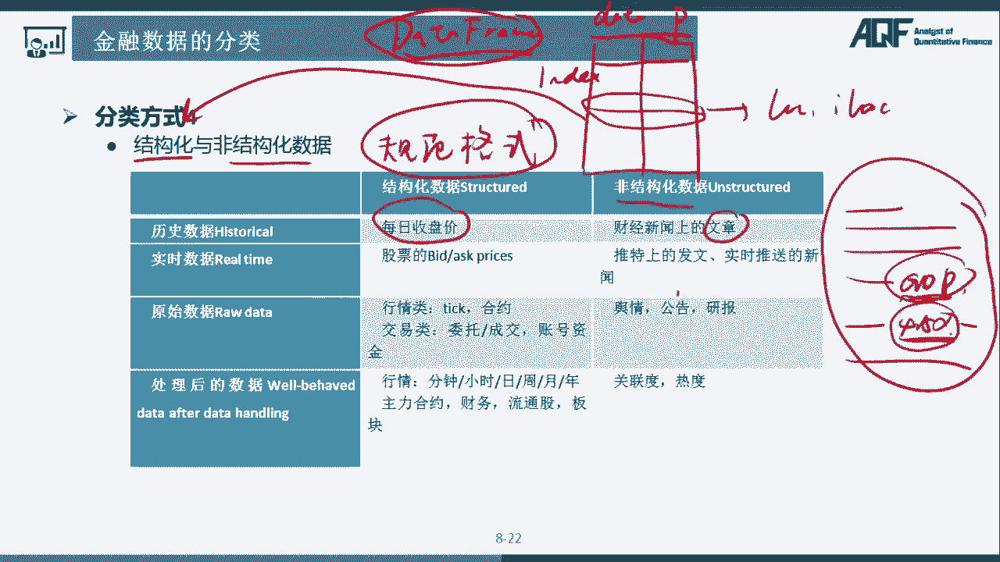
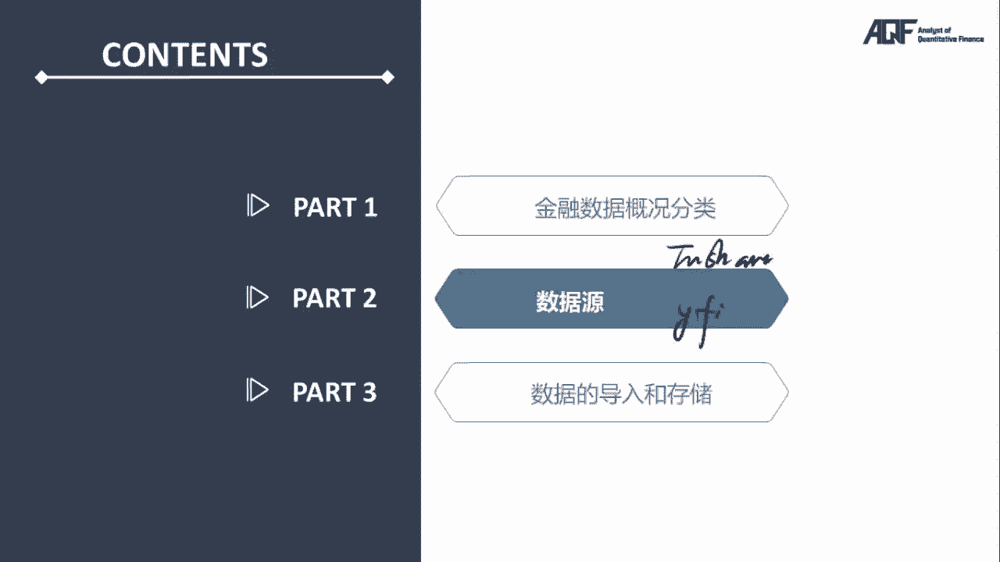

# 2024年金融大神老师讲解量化金融分析师.AQF—量化金融基础知识（完整版课程） - P27：《Python金融数据分析基础》02.金融数据分类 - 量化沿前 - BV1ar421K7Mo

什么是原始数据呢，原始数据就是没有经过额外的特殊的处理的，这样的数据，比如说没有经过数学运算的数据，我们来看一个例子，还是举未名医药它的一个走势图，这是分时曲线，分时图，我们都知道一个股票。

它的分时图其实对应的使用这一只股票，以一分钟为频率，选取过去时间里面每一分钟最后的一个成交价，我们保存这样的一系列的价格，并且把它绘制成这样的一条曲线，这就是未名医药的分时图了。

那这样的一个分时图所对应的数据，它是经过什么特殊处理吗，经过计算了吗，其实是没有的，他们只是在固定的频率下选取出来的价格，这就是原始数据没有经过特殊处理，它是按照固定频率选取出来的。

当然这个固定频率并不是最重要的，最重要的是没有经过额外的计算，相反如果我们想要获取这一个未名医药，这只股票在这一段时间里面，它的最高价，最高价我们会选举出这一个价格，那最高价选取的过程。

其实是把当天上午所有的价格进行了一个比较，比较的时候呢选取了最大值，最大值当然对应的是这一个价格，那选取最大值的这一个过程其实是经过了处理，经过了特殊的计算，经过特殊处理，经过计算的。

这样的都是属于经处理数据，它选取出来了一个特殊的价格，同样的还对应着会有其他的，比如说选取最低价等等，那这种都是属于经处理数据好，我们再看另外一个例子，对于日K线，这是瑞明医药它的日K线走势。

日K线里面有四个非常重要的价格，高开低收四个价格，那它们分别是属于原始数据还是经处理数据呢，我们一个个来看，对于最高价来说，最高价日K线的最高价，当然是选取了这一天成交价里面的最高价，也就是最大值。

所以最大值对应的是以次计算，和前面一样，它是经过处理的数据，那开盘价呢，开盘价其实只是选取了每一天第一个成交价，那第一个成交价其实就是开盘价，没有经过额外的特殊的处理，那么它们都是属于原始数据。

最低价呢不再多说了，它和最高价一样是经过了一次计算，只不过他选取的是最小值，那收盘价呢，收盘价是经过了没有经过特殊的计算，他选取的是每一天最后的一个成交价，那这两个都是属于原始数据。

这两个呢都是属于经处理数据了，那在未名医药的日K线走势里面，我们还会看到这里有不同颜色的曲线，这些曲线大家应该都知道啊，是均线，不同周期的均线有5日均线，有10日均线，20日均线等等。

不同的周期对应的均线，那均线是原始数据还是经处理数据呢，大家应该都知道了，结果肯定是经处理数据，因为他们利用的是日K线的收盘价，经过了均值这样的一个计算计算出来的结果，形成的曲线就是不同周期的均线。

那经过均值这样一个计算的过程，肯定都属于进行处理数据了，同样我们其他也会说到RSI，CCI等等这样的技术指标，肯定都属于经处理数据，他们是在原始数据的基础上，经过一些额外的计算呃处理，然后得出的结果好。

这样的话我们就知道了，原始数据和进行处理数据它们概念上的区别啊，非常容易理解啊，那接下来呢我们来看一下，原始数据和进行处理数据，它们在使用过程中有哪些区别，我们先来了解一下原始数据啊，假设某一只股票。

它的日分时走势是这样一个样子，如果你在某一天想选取几个价格，代表这一支股票当天的走势，你选取哪些价格呢，一种我最简单的方式可以选取两个价格，可以吧，两个价格取一个开盘，取一个收盘，也就是这是一个。

这是另外一个，这样的话，我通过开盘价和收盘价，对于这一只股票当天走势的理解是什么样子的，肯定是两个价格，基本上就是一条直线，这里面我也画出来是这样的一条直线，那如果我觉得选取的价格太少了。

我可以增加自己选取价格的频率，频率提高频率，以前选两个，我这一次多选几个，我选四个，两个再选两个，这样我所得到的信息是什么样的，我对于当天这一只股票的走势，理解会成什么样呢，会是这个样子的。

四个价格大概啊，后来我觉得这个频率还是太低了，我选取更多的这个价格，我可能选取了八个，那当天的走势会是什么样呢，会是这个样子，这个我们用其他的颜色标注一下，当我们选取八个点来代表，当天的价格走势的时候。

我们发现我们对于行情的理解，大概是这样的一个样子啊，这个时候呢我们就发现，如果我们把选取数据的频率提高的话，对于行情的信息信息量是不是就在增加啊，最开始我对于行情的理解可能就是一条直线。

我没有了解到这一支股票在当天盘中的波动，当我选取四个数据点的时候呢，我了解到了一些波动，但是其实还漏掉了像这样的一个回调的过程，这一个回调的过程其实就漏掉了，而当我选取了八个数据点的时候。

我们发现这样的一个选取的方式，基本上可以描述大概的描述当天的价格走势了，有一段上涨，有一段回调，再一段上涨之后又再次回调，通过刚刚这个例子我们就知道了，如果我们把选取数据，提取数据的频率提高的话。

其实对应的是什么，对应的是我们获得的信息量就更高了，信息量就更大了，为什么呢，因为原始数据如果你选取的频率越高，高到无穷大的时候，其实你就获得了每一个成交价，那基本上就是和这一个红线完整的成交价是一。

完全一致的，所以对于原始数据来说，原始数据最重要的一个决定的属性是什么呢，是频率频率越高，原始数据包含的信息也越高，那这里可以简单介绍一个在量化研究过程中，有一个呃比较重要的规律。

如果你是以日K线去研究分析的时候，可能会获得一定的收益，那你如果提高数据的频率，把它换成一小时的K线，非常有可能，那数据表现出来的结果就是，你按照你当时既定的策略，表现出来的结果会比以前更好。

因为一小时K线比日K线包含了更多的信息，你更容易把数据进行进一步的优化，这是原始数据，原始数据一个非常重要的属性是频率，Pv，频率决定了信息量的大小，那我们接着看经处理数据，还是看刚刚的那一个例子。

假如说某一只股票当天的走势，是这样的一个走势，这次呢我们选取五个价格来代表它当天的走势，分别是ABCDE这五个价格刚刚提到了，这五个价格其实是选取之后的价格，没有经过额外的特殊的处理。

所以他们都是原始数据，好接下来呢我们要由原始数据产生，经处理数据怎么产生啊，肯定是经过一些计算，那我们接下来想要计算当天的最高价，这五个价格选取当天的最高价，其实就是选取出其中的最大值就好了。

选取最大值的这一个过程，经过了特殊的处理处理之后，其实他就是经处理数据了，最高价是一个经处理数据，那我们来看一下最高价它反映了什么，最高价它首先选取除了D这一个点，同时呢。

他其实抛弃了ABCE这三这四个数据点，如果我们想要知道的是，当天这一支股票的价格走势，用ABCDE5个点来描述是比较清楚的，但是呢这一次我们只选取出一个D的点，肯定是对信息进行了筛选，对不对。

因为他抛弃了一些额外的信息，只保留了他最想知道的那一个信息，就是最高的那一个价格，所以经处理处理的这一个过程，其实是数据的提取的过程，是根据你自己倾向，然后使用某些特殊的计算的方式。

比如说你想要知道当天最高的那个价格，你的倾向是获得最高价，那你的计算方式呢就是选取最大值，经过这样的一个处理，最后获得了相应的数据，那同样的你获得自己想要的那一个数据的时候，也损失了其他的信息。

这些信息并不是你关注的，也就损失掉了，这是最高价，那我们再接着看最低价，当然对应的是最小值，那我们还可以怎么样，还可以用最高价减去最低价，是什么是振幅，振幅这个计算和刚刚这两个相比，其实稍微复杂一些。

那我们来看振幅这个例子，振幅它反映的是什么，反映的是这一天股票它上下波动的范围，波动的幅度，那这样的一个价格有没有经过处理啊，肯定也是经过处理的，它是在原始数据的基础上。

其实是用D减A这样最后得出来的结果，那这一个过程呢，其实是因为你自己有这样的倾向，比如说我自己是在做趋势股，这是一个规律啊，如果你在做趋势股，它的日K线很有可能是非常平稳的上涨的直线，那这样的股票呢。

其实在A股市场里面也有比较多大的蓝筹呃，茅台等等都是这样的走势，但是呢当趋势股到最后末尾的时候，我们都会发现他们会有一个放量，并且快速上涨的过程，快速上涨的过程对应的是什么。

快速上涨的过程对应的它的振幅会增加，振幅增加，交易量放大，这个时候很有可能它的趋势就到顶了，那我们关注振幅，是不是就可以实现自己提前平仓，或者说规避风险这样的这样的一个目的啊，所以说呢。

不管不管你最后选取的是什么样的精处理数据，或者说你自己经过某些计算，得到了一个基因处理数据，其实它都反映了你的一种倾向，因为你要用这样的一种倾向来表达自己，交易的策略，然后呢通过这样的一种倾向。

选择合适的计算的方式，像这里通过最高价减最低价，我们获得了振幅这样的一个数据，然后又通过振幅的变化呢，呃计算出来，评估出当时的这样的一种类型的股票，它是否走到了趋势的尽头，通过这样一种方式。

通过振幅的方式，当然也要配合成交量，最后我们得出来的信息，其实是关于这一支股票趋势是否走到尽头，那倾向经过计算，最后提出来的是我们所需要的信息，这样我们就知道了，原始数据是我们前面通过固定频率。

或者说不固定频率，但是最重要的一点是没有经过处理的，选取了出来的一些数据，那这些数据呢再经过我们自己的加工，经过我们自己的倾向的选择，从原始数据中提取出了特殊的信息，比如说提取了最高价。

提取了振幅这样的信息，然后再用在我们的策略之中，这就是经处理数据，经处理数据，它是从原始数据中提取出我们所倾向的，特定的某些信息，这样原始数据和经处理数据我们就分别讲完了，我们接下来看它们之间的关系。

先来回顾一下原始数据，原始数据最重要的属性是它的频率，提取原始数据的频率，频率决定了什么，决定了原始数据所能包含的信息量的大小，原始数据提取的频率越高的话，包含的信息量也就越多。

那么我们在一定的原始数据的基础上，经过某些特定的处理计算这样的一些过程，最后得到了基因处理数据，经处理数据其实是根据我们的倾向选择的，固定的或者说特定的处理方式，所以经处理数据。

这个处理的过程其实是信息提取的过程，那这样的一个信息提取的过程，反映到经处理数据上，经处理数据，它所包含的信息，肯定就是我们所需要的那些特定的信息，特定的信息肯定是属于信息量的一部分。

也就是原始数据所包含信息量的一部分，但是呢它肯定比它少很多，这里面是它们所包含信息量的关系，原始数据包含所有的信息，而精处理数据是从原始数据里面挑选出，我们所倾向的想要获得的那一部分信息。

这就是原始数据和经处理数据之间的关系，以上呢就是第三种分类方式，我们将金融数据分成了原始数据和经处理数据，这里面一定要注意，原始数据频率越高，包含的信息越多，经处理数据是对原始数据里面。

包含信息的一种提取，接下来我们来看第四种分类方式，这种分类方式呢，我们将金融数据分成了结构化数据，和非结构化数据，简单来说结构化数据就是有非常规范的格式，这样的一些数据，比如历史数据里面的每日收盘价。

前面也提到了，我建议大家用data frame，这样的一种数据格式去储存数据，如果我们保存的是每日的收盘价，就会得到这样的一个表格，第一列呢是日期，第二列是它的价格，当然index我们先不做考虑。

我们可以看到这样的一个表格，其实是非常规范的，那这样的数据就属于结构化数据，另外对于非结构化数据，我们来举一个例子，最典型的就是我们常见的一些文章，假如我现在在看一篇文章里面。

有一段话提到了GDP的增速，然后呢假如说是4。5左右，我们需要在这一段自然语言里面，提取出GDP和4。5这样的信息，那提取的过程是不是就非常困难了，前面如果我们用的是data frame。

想要提取某一天的这个收盘价，只要用lock或者i lock进行提取就可以了，但是呢，如果我们想要从这样的一个非结构化数据中，没有规范的格式的数据中提取GDP和4。5，这样的数据其实就会非常麻烦。

我们可能要用到自然语言处理，用到正则表达式等等处理的技术好，这样的话我们就知道了，结构化数据和非结构化数据，它们的本质区别在于是否有规范的格式，规范的格式有的处理起来就比较简单。

没有的处理起来就比较复杂，好以上呢就是四种比较重要的分类方式，我们简单回顾一下，第一种呢，我们将金融数据分成了行情数据和非行情数据，主要的判断标准就是是否和成交直接相关，第二种分类方式。

我们将金融数据分成了实时数据和历史数据，主要的分辨的标准是实时数据，是当时现在这一个时间点所反映出来的数据，所获取的数据，而历史数据呢是过去的一段时间，或者过去的某一个时间点的数据，这就属于历史数据。

第三种分类方式，我们将数据分成了原始数据和经处理数据，原始数据最重要的属性是它的频率，决定了它包含信息量的多少，经处理数据呢是我们在原始数据的基础上，经过某些特殊的处理，选取出，提取出特定的信息。

第四种分类方式，我们将金融数据分成结构化的和非结构化，非结构化的两种数据，结构化的数据有规范的格式，非常好处理，如果是行情数据的话，建议大家使用data frame这样的一种数据类型。

以上呢就是金融数据的几种分类方式，这几种分类方式，希望大家在遇到金融数据的时候，对金融数据先有一个提前的判断，判断之后要提前想好我们代码应该怎么去写，怎么去处理，要想好我们的分析应该用什么模型。

用什么工具好，以上就是第一个部分的内容。

下一部分我们来介绍两个比较重要的工具包，一个to share。

