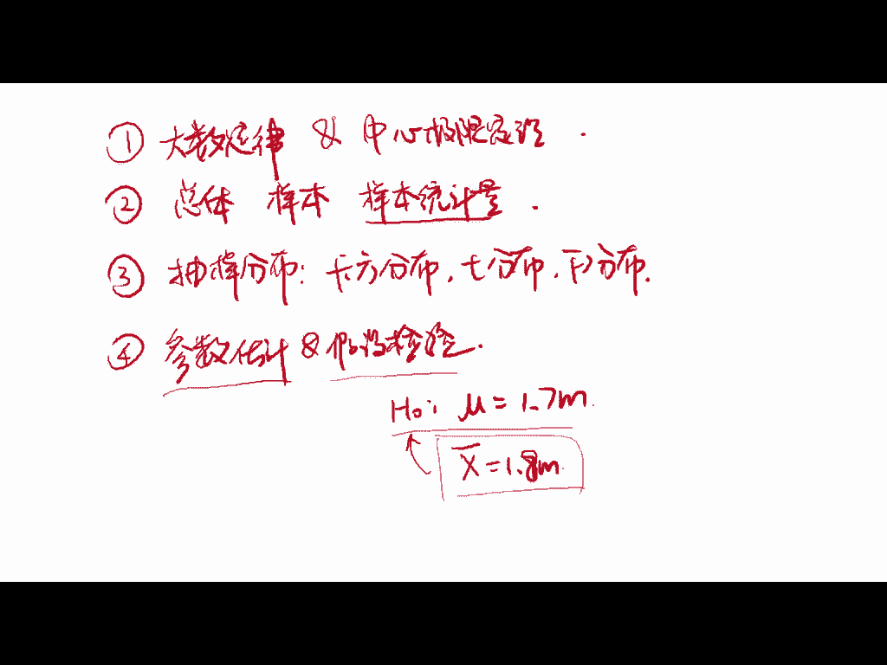
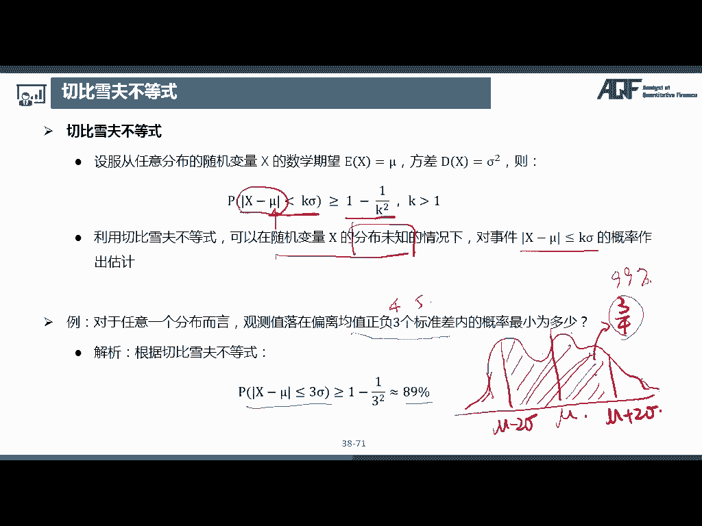
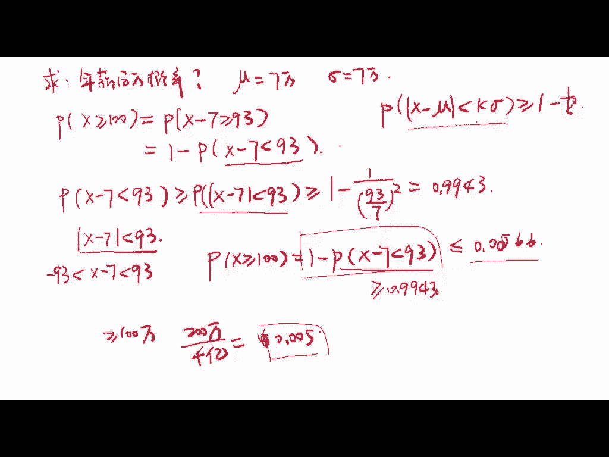
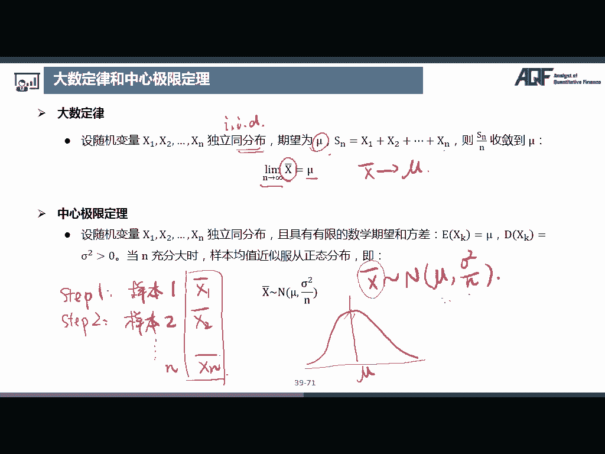

# 2024年金融大神老师讲解量化金融分析师.AQF—量化金融基础知识（完整版课程） - P4：《金融基础》04.数量分析-04_大数定律和中心极限定理 - 量化沿前 - BV1ar421K7Mo

好那第四部分是参数估计和假设检验，那从这一部分开始，我们就要开始梳理统计的内容了，那在之前的话我们介绍的是概率论的一些知识，那我们来回顾一下我们概率论讲了哪些内容。

好那我们概率论是不是，首先呃研究的对象是随机现象，那么我们对于随机现象的一个重复观测，或者说我们对随机现象的研究叫做随机试验，那这个随机试验的结果叫做随机事件，那我们对将这个随机事件进行数量化。

那么把它和实数一一对应，那就叫做随机变量，那对于随机变量来说，我们要掌握随机变量的数字特征，就是期望和方差，协方差和相关系数等等，以及常见的概率分布，那概率分布包含离散型的概率分布。

还有连续型的概率分布，好，那这一块的话，其实就是我们在概率论中介绍的内容，那接下来我们要介绍这个数理统计，那数理统计其实是基于概率论的基础之上，对于随机现象规律性的研究。

那统计呢是可以分为描述统计和推断统计，那描述统计很简单，描述统计，其实就是我们啊先去搜集到了一些数据，然后呢我们对于这个数据的数字特征进行描述，比如说我们描述数据的集中趋势，也就是像均值啊，中中位数啊。

种树啊，这些还有离散程度，就是呃方差标准差，极差啊，这些离散程度，以及形态，也就是这个数据的偏度啊，风度等等，反正这些的话比较简单，而且我们之前在数字特征的时候已经有所涉及。

所以我们这里就不再重复讨论了，那我们这里的话就重点介绍这个呃，推断统计，好那推断统计的话其实就是用样本去推断总体，就是用样本的数据去推断一个总体的特征，比如说我们考虑这样的一个问题啊。

嗯如果说我们想要知道全中国嗯，全中国嗯，成年男性的身高在8月两，那我们可以怎么做啊，那我们是不是首先呃有第一个选择，那我们是不是可以把这个，全中国所有成年男性都聚在一起，然后我们给他们一个一个量身高。

然后这些把这些身高加总，然后呃取平求平均，那是不是就可以非常准确的算出，全中国成年男性的身高了呀，那这个理论上来说是没有任何问题的，但是实际上是没有办法完成的，因为全中国成年男性有多少有几亿人次。

就算不把他们聚集在一起啊，就算说什么嗯这个挨家挨户去调查啊，就是给他们去测量，这也是没有办法进行的，因为工作量实在是太大了，那可能可能调查呃，可能等等，我们呃查完了之后，那一堆未成年的都已经成年了。

那我们又要重新进行测量了，对吧嗯，所以这个这个方案一的话呃是没有办法进行，所以我们现在有一个方案二，那方案二的话就是我们可以抽一部分的人群，比如说我们抽取抽取1万个成年男性，然后计算他们的平均身高。

然后我们将这1万个成年男性的这个样本，样本均值，作为这个全国成年男性身高的这样一个总体，均值的估计，好那这个的过程，那这个过程其实就是推断统计的过程，那么我们为什么可以用样本数据，去推断总体的特征呢。

那这个其实是基于大数定律和中心极限定理，那这一个的话会在这个第四部分首先介绍，那我们首先会介绍啊大数定律，的话和中心极限定理，其次呢我们会介绍推断统计的一些基本概念嗯，比如说什么是总体，什么是样本。

以及什么是呃样本统计量，以及一些常见的样本统计量，好，那接下来呢我们会介绍样本统计量，常见的三大分布，也就是抽样分布，抽样分布就是这个样本统计量的分布，那我们这里的话会介绍三个啊，卡方分布。

大T分布和F分布高达G，然后那最后呢我们会介绍参数估计和假设检验，对，对估计和假设检验，当自己在里，那参数估计呢，其实就是用样本统计量去推断总体参数，那假设检验的话，其实就是我们先做一个原假设。

然后我们根据这个抽样的结果呃，来检验我们某一个假设是不是正确啊，比如说我们原原来的假设是嗯，这个假设我们全国呃成年男性的平均身高是，这个是1。7米好，然后呢我们算出来就是抽样抽了1万个人。

然后我们算出来他们的这个样本均值，他们这1万个人的平均身高哎也等于1。7米，那是不是对我们这个呃假设做了一个验证，那说明我们这个假设是不是嗯，很有可能是正确的，那如果说我们这个呃抽的这个样本。

我们全部都是在这个呃篮球队里面抽的，那我们抽取出来这个样本均值变成1。8诶，那这个是不是和我们这个假设有一点偏差，那有可能我们这个假设，我们这个原来的假设是不正确的啊，当然了。

这也有可能是这个范本是不正确的，那所以呃所以这些的话是在假设检验里面，要考虑的一些问题好，那这四个部分，就是我们在这个part4要讲的部分好。

好那在介绍大数定律和中心极限定理之前，我们先介绍一个切比雪夫不等式，那这个也是呃，这个切比雪夫在大量的实验中，发现的一个统计规律，他是说嗯，设服从任意分布的随机变量X的数学期望，ex等于M方差。

DX等于西格玛的平方，那么PX减六的绝对值小于K西格玛，这个概率是大于等于一减K的平方分之一，那这个公式的话，其实也就是说我们这个呃大量实验中，观测样本落在偏离总体均值，谬的这个K的标准差之内的概率。

至少是一减掉K的平方分之一，那这个的话其实就是说呃，我们这个观测值是距离这个呃总体均值的距离，对吧，就是我们的观测值和这个总体均值的距离，是小于K个标准差，这样的一个事件的概率是大于等于这个值的。

那利用切切比雪夫不等式，可以在随机变量X的分布未知的情况下，对事件X减六，小于等于呃K西格玛的概率做出估计，嗯比如说我们看一个例子啊，对于任意一个分布而言，观测值落在偏离均值正负。

三个标准差之内的概率最小为多少，那我们根据切比雪夫不等式，我们把这个K等于三带进去，那就是呃，这个是要大于等于1-3的平方分之一，那就是80/9，89%好，那注意一下呃，这个切比雪夫不等式。

这里面的假设是随机变量X的分布未知，那如果说这个随机变量的分布是已知的话，比如说我们已经知道它是服从正态分布了，那么我们是可以非常准确的知道是这个事件，X减谬小于等于K西格玛的概率的对吧。

比如说我们呃偏离均值，三个三个标准差之内的概率的话，我们之前也说了，是99。9%，那但是在实际生活中呢，我们通常是不知道随机变量的分布的，所以切比雪夫不等式的话，可以给出一个很好的估计。

那比如说我们这个呃，比如说我们有一个分布是长是长这个样子的，假设是长这个样子的，那它的均值我们假设是在这个地方，是他的缪，那我想知道这个距离均值两个标准差，那这个是谬减二西格玛。

然后这个是缪加上二西格玛，那我想知道这个观测值，落在这样的一个范围内的概率，那我们可以通过切比雪夫不等式，就知道这一块的面积是至少是3/4的，那因为他是说大于等于多少吗，那他这个是等于99%。

也有可能的对吧，那至少是这个这个值，所以说这个切比雪夫不等式，他其实说了这样的一件事，也就是说事件的发生，大多数是集中在均值附近的，比如说我们这里计算出来，距离平均值三个标准差呃，概率就已经是89%了。

也就是说很大很大，可能都是在均值三个标准差之内了，如果说我们这里放宽到四个五个标准差的话，那它这个在这个区间范围内的概率就更大了，好那切比雪夫不等式其实还是蛮有用的。

比如说我们嗯可以考虑这样的一个问题啊，就是我们现在不是很多，很多人都想都想要年薪百万嘛，那我们额来算一算，这个年薪百万的概率到底是多少。

那我们来我们来跟大家就是估算一下概率。

好那我们现在来估算一下年薪百万的概率，看看我们离梦想还有多远，那呃中，中国人均GDP今年就是刚突破了1万美元对吧，那我们假设呃中国人均收入是1万美元，那如果说我们用汇率为七的话。

那我们就缪等于7万7万人民币，那西格玛它标准差，我们也假设7万，那这其实是一个挺大的标准差了，因为7万-70000就一下子就等于零了，好那我们现在来估算一下年薪百万的概率。

那我们是不是要求PX大于等于100，好，那我们是可以用呃，切比雪夫不等式来进行估算的，那切比雪夫不等式是不是，PX减mu的绝对值小于K西格玛，这个事件是大于等于一减K的平方分之一，那么往这个公式上去靠。

那我们这里的那我们是不是首先要一个X减六，那我们把这里是不是等于PX减六，减六是不是减七就是大于等于93，那我们可以把它这个概率呢写成这个，是不是等价的呀，那这里的话是有好，那这里的话切比雪夫不等式中。

它这里是不是一个小于号呀，所以我们这里应该是要把它改成小于号，那我们用一个呃把它求个逆，也就是一减PX减七小于93，唉那这个两个是不是等价的呀，好那我们是不是这里有一个X减七小于93。

和这个已经非常接近了，所以我们这里的话只要求PX减七小于93，就OK了，那在切比雪夫不等式中，是不是X减六的绝对值是小于K西格玛，那是不是得二是X减七的一个绝对值，小于93，那X减七的绝对值小于93。

是不是X减七小于93，并且是要大于-93，那X也就是要大于负的86，嗯应该这个X你的收入应该是大于零的吧，那严谨起见的话，那这个概率肯定是要大于等于嗯，这个概率的对吧，因为我们其实就是去掉了X减七。

小于-93的那一部分，然后这个呢我们就可以呃，套用切比雪夫不等式了，那它是大于等于一减K的平方，那这个K是多少呢，这个K是不是等于931个西格玛，西格玛是七呀，那是不是这样的一个值好。

那我们算出来是等于0。9943好，那我们这个值算出来了之后，我们把它带到上面去，那PX大于等于100，等于一减PX减七小于93，那这个值呢是大于等于0。9943的，那我们这一个值是不是就小于等于一减。

0。9943，那算出来的话是小于等于0。0566，也就是说年薪百万的概率是小于等于零点哦，这里少了一个000566，也就是大概在5‰到6‰的一个水平，那这个其实还是蛮符合我们的。

这个平常平常的认知的对吧，那嗯根据2018年的胡润财富报告，中国家庭收入达到100万以上的家庭，大概是有200多万，也就是说嗯这个家庭收入啊大于等于100万的，是有200多万，那中国一共是14亿人口吗。

那如果说按三个人一个家庭来算的话，就是大概4亿个家庭，那就是200万÷400000000个家庭，那算下来的话，呃大概也是差不多在5‰左右，嗯就是就是0。005左右。

所以我们这个用切比雪夫不等式估算出来的值，还是嗯蛮准确的对吧，但是呢呵嗯，但是呢这个年薪百万的概率，是不是就是5‰呢，嗯大家还要考虑一下这个年薪是什么概念啊，年薪并不是说你年收入是百分是100万对吧。

那年薪是说你在帮别人打工，然后别人给你发一年100万的工资，但是呢我们要考虑到像高收入人群里面，绝大部分都是老板呀，所以说这个呃5‰里面，其实还是掺了很多水分的对吧，所以光靠工资的话。

那年薪百万的人群应该是会比5‰更少的，嗯所以说呃这个嗯，如果你达到了一个年薪百万的，这样的一个水平的话，嗯确实是一个非常厉害的程度了，嗯那有的人就会说了，那我身边好多年薪百万的人啊。

嗯就是很多朋友都有年薪百万啊，那这可能是因为你受到了教育啊，你的家庭环境啊，你所处的城市啊啊这些条件，比如说一线城市的收入，肯定是要比这些二线，三线城市的收入会高一些的嘛，然后比如说你是嗯这个呃。

本来家庭条件就比较好的，你所接触的这个圈子也是这个条件都比较好的，那这些条件的话，可能会导致你的交际圈子中的人，人均收入会比较高一些，那根据贝叶斯法则，那先验概率的话，就是我们这里计算出来的5‰。

那如果说加了什么啊，这个学历背景啊，家庭背景啊，呃所处的城市啊等等这些嗯，这些条件就是乘上了这个信息调整因子的话，那么这个后验概率的话可能会大于先验概率，那我们可能这个额就会大于5‰了。

在那根据这样的一个例子，我们是不是可以看到生活中其实很多呃，这个问题都是可以用理论来进行解释的呀，那我们在这里学习理论课程的话，其实也是为了用一种更加科学严谨的态度，来分析现实生活中的问题，好好。

那这个是我们用切比雪夫不等式。

来分析的一个实际问题。

那切比雪夫不等式其实也衍衍生出来，另外一个思想叫做小概率事件原理，也就是说偏离均值太多的事件，发生的概率是非常小的，所以我们认为在单次试验中是不可能发生的，比如说我们刚刚算出来。

这个年薪百万的概率是5‰，其实已是已经是一个呃比较小概率的事件了，那如果说我们随意随便抽一个人的话，就是在我们我们在这个大马路上，随便呃这个随便抽取一个人，那么我们认为如果我们单次的呃抽取这样的。

进行这样的一次实验，我们单次的抽取这样的一个人的话，他是年薪百万的概率是零好，那这个是一个小概率事件原理，那这个原理这个思想的话，其实就是我们后面假设检验的一个基本思想嗯，好那这个是切比雪夫不等式。

接下来我们要介绍大数定律和中心极限定理，好我们先看这个大数定律，那大数定律其实是有几个不同的表示形式的，比如说伯努利大数定律啊，切比雪夫大数额大数定律，新星大数定律嗯，那因为我们其实不是搞研究的。

就不用知道了，那么复杂，那么细致了，大家只需要了解我这个PPT上写的，这个简化的大数定律就可以了，那么看一下，设随机变量X1X2到XN是独立同分布，那独立同分布也会写成IID。

也就是independently and identically distributed，那大家就知道id就可以了，就是看到认识就行，那随机变量X1到X3是独立同分布的。

那但是具体它是服从什么分布是不知道的，那期望是缪，也就是每一个随机变量都是期望都是谬，因为他们是同分布嘛，同分布的，它的期望肯定是相同的，然后4N是等于X1加X2加到XXN，那么N分之SN收敛到缪。

也就是唉，那其实这个N分之SN是不是，就是我们这些这个随机变量，X1到X的一个均值，那其实其实就是一个样本均值的概念，那也就是说当样本数量非常大的时候，样本的均值和真实的均值是非常接近的。

也就是当N趋向于无穷的时候，这个嗯X8就是样本均值就是等于六的，对于总体均值好，那这个是大数定律，那中心极限定理是说，设随机变量X1X2到XN独立同分布，且具有有限的数学期望和方差，然后嗯他的期望是缪。

然后方差是西格玛的平方，当N充分大时，样本均值近似服从正态分布，也就是X拔服从均值为缪，方差为N分之西格玛平方的一个正态分布，那其实这个中心极限定理，就是在这个大数定律上呃，只是更加精确了嘛。

就大数定律其实只是说当N充分大的时候，XN是这个X8是趋向于new的，那但是中心极限定理就更加详细了，他是说这个X拔它还是服从一个正态分布，那这个正态分布的均值就是缪。

然后它的方差是N分之西格玛的平方好，那比如说我们这里举一个呃，举个直观的例子，还是这个量身高的例子，比如说我们想要知道中国成年男性的平均身高，但是呢我们并不知道总体分布的情况，那么我们可以可以怎么做呢。

那我们首先第一步啊，我们抽取一个样本，那我们首先第一步我们抽取一个样本样本一，比如说我们抽取了100个中国成年男性，然后将他们的身高求一个平均值，就是X18，那我们再重复进行，我们进行step2。

我们抽了一个样本二，我们又抽取了100个人，那这100个人的均值我们又算出来是X2，然后呢我们就不断的重复得得得得得，然后我们取了N个样本，我们算出来了这样的一个呃各均值，那这个我们每一次呃。

计算出来的这样的一个样本均值，是不是也是一个随机变量，那这个样本均值，这个随机变量它是服从均值为缪啊，方差为N分之西格玛平方的正态分布的，好那中心极限定理其实就是告诉我们。

不论我们研究的群体是怎么分布的，样本均值总是会在额总体均值的周围，呈现一个正态分布，也就是说我们每一次抽取的这个呃，我们每一次计算出来的样本均值，它是呈现一个这样的形态。

然后他的这个呃中心呢是在缪这个地方，也就是说我们每一次计算出来的这个样本均值，大多数都是集中在总体均值的附近的嗯，好那这个的话就是我们统计推断的一个基础，因为我们其实就是用统计的呃。

样本的统计量去推断总体特征，那如果说我们这个样本能够，很好地描述这个总体，那么我们是不是就可以用样本的这些特征去呃。

