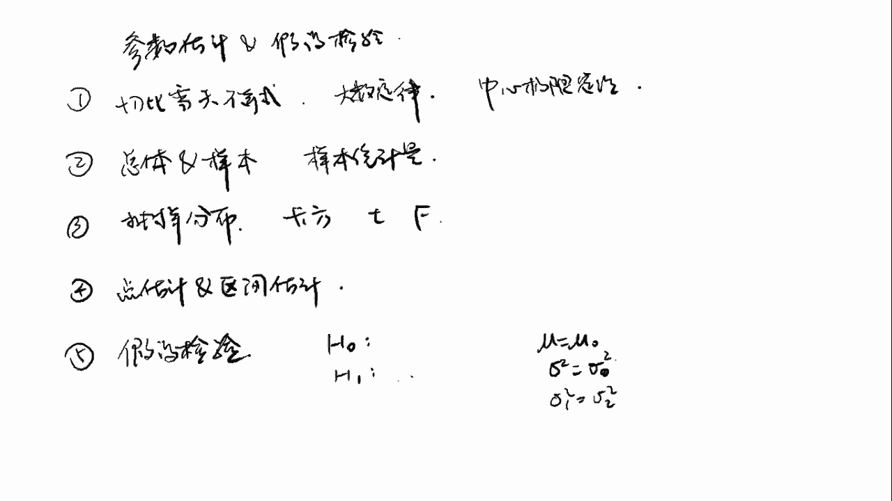

# 2024年金融大神老师讲解量化金融分析师.AQF—量化金融基础知识（完整版课程） - P6：《金融基础》06.数量分析-06_参数估计和假设检验 - 量化沿前 - BV1ar421K7Mo

好我们接下来讲点估计和区间估计，那我们之前讲的参数估计，是不是就是用单个的样本统计量，来估计总体参数啊，比如说我们用这个样本均值来估计样本的呃，总体的均值，用样本的方差来估计总体的方差。

那这里的话我们都是用这个一个点，一个点来进行估计，也就是用某一个值对总体参数进行估计，那这个呢是叫做点估计，那因为我们知道样本统计量是有误差的，也就是说我们每一次抽取的样本，计算出来的。

这个样本统计量不一定正好是等于总体参数，是会有一个误差对吧，所以说如果我们用点估计的话，那我们呃有时候计算出来的点估计，其实不是很准确的，所以说如果我们能够估计，计算出来一个估计的区间。

使得总体的参数落在这个区间的概率很大，那么这个呢是叫做区间估计，那在区间估计中，我们首先要设定一个显著性水平，而反，或者说置信度是1-2法，比如说显著性水平是5%，那么置信度就是95%。

那置信度是什么意思呢，它其实就是一个可信的程度，比如或者说是一个呃正确的概率，比如说当置信度为90 95%时，我们可以说置信区间，包含真实总体参数的概率为95%，也就是说我们估计出来一个区间。

然后这个区间呢是对这个总体参数进行估计的，那这个区间呢也不是一定，是包含这个总体参数的，而是一定概率包含的，当置信度是95%的时候，也就是说这个区间包含这个总体参数的概率，是95%。

那这个说法其实也不是特别准确，最最最准确的说法，其实是说我们构造这样100个区间，那其中95个区间是包含总体参数的，那大家可以就是简单地理解成，我们包含这个总体参数的概率是95%。

那其实也就是很大一个概率是包含总体参数的，那么显著性水平越低，也就是阿尔法越小的话，那置信度是不是越大，比如说这个显著性水平只有1%，那置信度就是99%，也就是说我们这个区间包含总体参数的概率。

达到了99%，那就是不是就是更加准确了，那这样的一个置信区间是应该更窄还是更宽啊，应该是更宽对吧，因为说因为我们估计出来，这个区间范围越大的话，那我们也就是说我们猜的这个值越多了。

所以说你如果猜出来这个区间额越大的话，那我们猜的不是越准吗，那比如说我们嗯比如说我们对这个平均身高，身高的均值做一个区间估计，那第一个区间是1。7到1。8，那第二个区间是一米到2米，哎。

那是不是第二个区间的正确的概率更大，因为如果说我们计算出来的，身高是1。68的话，那是不是不在第一个区间中，但是是在第二个区间中对吧，所以说呃这个区间范围越大的话，它的这个置信度是越高的，好嗯。

那这些区间的怎么来计算呢，它的计算公式是这个样子的，那点估计还是和原来一样，也就是说我们是在点估计的这个基础上，向左和向右又拓宽了一些，那拓宽的是多少呢，是关键值乘以一个标准物。

那这个标准物之前已经说过了，标准物就是样本统计量的标准差，那这里的关键值是什么东西呢，关键值其实就是说在显著性水平阿尔法下，随机变量小于等于这个值的概率，是一减阿尔法嗯，那这里我举举一个例子。

那比如说随机变量是服从标准正态分布，或者说Z分布，那它的图形是不是长成这个样子，那这个中间的话是呃零，那如果说显著性水平阿尔法是等于五的话，那置信度是不是一减，阿尔法等于呃95%，那关键值Z0。05。

就表示当这个随机变量小于等于Z0。05，这个值的概率是等于0。95，那如果说我们在图上的话，就是说呃那这个值是不是就是在这个地方，这是Z0。05，那PX小于等于0。05，那是不是这块面积呀。

也就是说这块面积是95%，那是不是Z0。05，这个数右边的面积就是5%，好那这个其实是一个单侧区间，一般的话我们会用双侧区间，也就是以零，也就是以零这个对称轴为中心的，那这时候如果这个面积是95%的话。

那这两边的面积就是各为2。5%对吧，那这一块面积是和这块是相等的，那中间是95的话，那两边就是2。5%，那这时候这个这个值的话就是Z0。025，那就是这个关键值好，那标准正态分布的关键值。

其实是可以查表获得的，那我之前也给大家记了几个比较重要的，比如说我们这个中间的面积是9%，15的时候，Z0。025是等于1。96，那如果说这个中间的面积是99%的话，那就是Z0。000。005对吧。

那这个的话是等于2。58好，那有了这个关键值，那点估计关键值和标准物都有了之后，那置信区间就可以直接代公式来求得了，比如说这个嗯总体参数，这个总体均值谬的置信区间怎么求啊。

那是不是点估计就是这个X8对吧，那加减关键值是Z0。025，然后乘以一个标准物是呃，西格玛除以一个根号N好，那这个的话就是置信区间，那但是有时候我们这里的这个西塔值，也就是总体参数额标。

总体标准差是未知的，那我们是不是可以用S来代替，那这时候就不是服从标准正态分布，而是服从T分布，我们回想一下我们之前说的这个抽样分布定理，二是不是X8减掉6S，那这个统计量呢是服从。

自由度为N减一的T分布，所以这时候的话，我们就是要用T分布的这个关键值，那这时候我们的置信区间就是X8，加减一个T的0。025，0。025，然后它是N减一，然后这个后面的标准物就是S除以根号N好。

那这个的话就是在总体标准差未知的情况下，的置信区间，那下面讲几个估计量的评价标准，那这个大家稍微了解一下即可，那首先一个最重要的就是无偏性，那无偏性的意思就是说，估计量的数学期望。

等于需要估计的总体参数值嗯，也就是e sita hat等于theta，那这个theta hat就是我们的样本统计量，比如说X8，那这里的theta就是总体参数，比如说总体均值六，那这个无偏性。

也就是说我们这个ex白呢是等于缪的，那第二个评价标准是有效性，有效性是说对于同一个参数的多个无偏估计量，中方差最小，那比如说我们对这个总体均值new，有多个统计量，比如说这个X8。

然后还有一个什么什么统计量，这个统计量，那个统计量，那这几个统计量都是具有无偏性的，也就是他们的期望都是等于缪的，但是呢他们的方差是这个呃不一样的，那我们知道这个X8的方差，是不是N分之西格玛平方。

然后其他的可能是什么什么什么方差，然后这几个统计量中嗯，方差最小的这个呢是叫做有效性，那还有一个评价标准是叫做一致性，那这个是说随着样本量的增大，该估计量越接近总体参数的真实值。

也就是呃当N趋向于无穷的时候，theta had减掉theta的绝对值，小于这个ABSENO的概率等于一，那这个一致性其实没有无偏性那么严格呃，比如说这个样本方差X平方等于N减一分之xi。

减掉X拔的平方，那如果说我们另外一个统计量是N分之一，XI减掉X8的平方的话，那这个统计量随着这个N增大的话，它也是呃也是满足这个一致性的，但是这个统计量就不满足无偏性，所以这样的一个统计量就是是。

我们呃是为了满足无偏性，所以我们是这样计算样本方差的好，那下面有一个叫做最优线性无偏估计blue，也就是belinnear unbiased estimator，也就是这个最优线性无偏估计。

那他这里是说，如果一个参数的估计量，是样本观测值的线性函数，并且具有无偏性和有效性，哎注意一下是前面两个特性，那这个估计量就是最优线性无偏估计量好，那这个的话大家理解一下，就是了解一下就可以了。

好我们接下来看一下假设检验，那我们这一节课的标题，是不是就是参数估计和假设检验呀，那参数估计和假设检验都是用样本来推断总体，但是角度不太一样，我们来看一下参数估计，和假设检验。

那这两个的话都是由样本来推断总体，其实也就是额统计推断，那参数估计是什么时候用呢，比如说我们是要估计一个总体均值六，那参数估计是说，如果我们对这个总体均值缪是一无所知的，对这个总体参数是一无所知的。

那么我们可以用参数估计的方法，给出这个总体参数的点估计或者区间估计，那我们之前也讲过了，比如说这个总体均值谬，我们可以给出一个点估计X8，或者说给出一个区间估计是X8，加减一个啊，Z0。025。

这样的一个区间好，那这个是参数估计，那假设检验是什么意思呢，也就是说，我们现在已经对这个总体参数有了一定的猜想，比如说我们现在已经猜这个总体均值缪，我们猜它是等于呃这个1。7。

那这个呢其实就是我们的一个假设，那我们现在就是要去用一样本的数据来检验，这个假设是不是正确，来判断我们这个猜想的正确性，那假设检验它基基于的基本思想，是小概率事件原理，也就是说。

如果某一个事件发生的概率是非常小的话，那么我们认为在单次试验中，这个事件是不会发生的，所以说如果在某一个假设条件下，发生概率非常非常小的事件发生了，那么我们就认为这个假设是错误的。

比如说我们这里假设我们身高的均值是1。7，那如果说我们抽出来一个样本，我们计算出来这个样本的均值是等于二诶，那在这样的一个假设前提下，我们样本均值按理来说，是不是应该在这个1。7的周围啊。

那但是我们算出来是二，那是不是和1。7相差特别大，那是不是说明这个我们呃，我们这个假设是有错误的呀，那如果说我们计算出来，这个样本均值是等于1。71哎，是不是非常接近这个我们的假设。

那说明我们这个假设很有可能是正确的，我们没有办法去推翻它好，那这个呢其实就是假设检验的一个基本思想，我们来注意一下这个假设，检验和参数估计它的区别，它这个参数估计的话。

一般就是我们在对总体参数一无所知的情况下，我们直接拿这个样本样本的这个数据，计算出来一个样本统计量作为总体参数的估计，那么假设检验，也就是说，我们初步是对总体的参数是有一个假设的。

然后我们再从这个样本计算出来一个样本，统计量，和我们这个假设进行一个比较，然后检验我们的假设是否正确，好那假设检验的话是分成这样的五个步骤，首先第一个步骤是陈述原假设和备择假设。

那这里的原假设和备择假设，一般来说我们是要将诶，那大家可以思考一下，我们是将什么放在原假设，是我们想要接受的，还是想要否定的放在原假设，那应该是我们将希希望否定的结果放在原假设，也就是一般是有等号的。

比如说原假设H0是缪等于缪零，也就是说，我们现在假设我们这个均值是等于某一个值，然后被则假设呢就是这个原假设的对立面，就是mu不等于mu0，那这里为什么将我们希望否定的结果，放在原假设呢。

那这是因为我们永远都没有办法确定，缪是等于缪林的，因为我们没不不是站在上帝视角，只有上帝才知道这个缪是等于多少，那我们其实只能够通过从这个抽样的结果，来判断new是不是不等于缪零。

也就是说我们永远是没有办法证明这一点的，无法证明，我们只能够不停地寻找反例，如果说出现反例，说明这个假设是错误的实话，那我们就推翻原假设，但是如果说我们没有找到反例，也就是说不能推翻这个原假设的话。

那我们也只能说我们不能拒绝这个假设，而不能说这个假设是正确的，所以我们最终的结果就是，拒绝或者是不拒绝原假设，而不是说拒绝和接受，那有的地方可能会把这个不拒绝说成接受，那其实不是不严谨的。

那严谨的来说的话，就是拒绝和不拒绝好，那第一个步骤呢就是陈述原假设和备择假设，那第二个步骤是选取一个合适的统计量，比如说我们呃检验总体均值mu是不是等于mu0，那我们可以用样本均值。

那我们知道样本均值X拔是服从均值为缪，然后方差是N分之西格玛平方的额正态分布，那么可以对它进行一个标准化，也就是X8-6除以一个西格玛除以根号N，那它是服从标准正态分布的。

那这个的话就是我们要找的这个统计量，第三个步骤就是选择显著性水平，那这个显著性水平，其实和我们刚才说的那个车行区间的显著，是显著性水平是非常相似的，比如说我们这里显著性水平射程是5%。

那也就是说那这个显著性水平，就是说，我们判断这个事情是属于小概率事件的标准，比如说这里是5%的话，也就是说原本某个事件发生的概率，是小于5%的，那么我们就认为这个事件是一个小概率事件。

因为我们刚刚也说了，假设检验它的原，它的这个理论基础是不是小概率事件原理啊，也就是说，如果一个事件原本发生的概率是非常非常小的，但是它发生的话，那我们就说明这个假设错误，那多少算是呃。

这个发生概率非常小呢，那就是这里的显著性水平，比如说我们这里定城市5%，那么也就是说这个事件的概率是发生在，这个发生的概率是小于5%的时候，那我们就认为这个发生的概率是非常小的好。

那如果说这个显著性水平越低的话，那就说明这个事件本身发生的概率越小，那么这个事件发生的概率越小，但是还发生了，那我们是不是就是有更大的信心去拒绝原假，设好，第四个步骤是决定规则。

那这里的话我们是有两种决定规则，一个是叫做拒绝欲，一个是P值，那这两种决定规则我们后面会讲，那第五个呢就是抽取样本计算相应的估计值，然后呢将这个估计值和我们的绝测规则，决定规则进行比较。

如果说满足了拒绝原假设的条件，那我们就拒绝原假设，否则就是不拒绝，那就是通过这个步骤五，我们来决定，我们最终的结果是拒绝还是不拒绝好，那假设检验的话是有单位检验和双尾检验，那双尾检验的话。

就是检验参数是不是等于某一个值，比如说这里H0是mu等于缪零，HA就是缪零，缪不等于缪零，这个ha就是倍则假设，那还有一种是单位检验，那单位检验其实是检验的是方向。

也就是说检验参数是不是大于等于某一个值，或者小于等于某一个值，那这时候他的倍则假设就是大于缪零，或者说小于缪零，那他这里的H0的话，嗯其实这里应该是可以写，就应该的话是写成小于等于六零。

但是有时候我们也可以写成等于号，所以我们最主要看这个单尾检验还是双尾，检验的话，最主要还是看这个备则，假设是不等号还是大于小于号，那如果说是大于或者小于号的话，说明是单位检验，如果是不等于号的话。

是双尾检验，好接下来我们来看两种决定规则，首先第一个是拒绝域，那拒绝域就是说如果我们选取一个样本，计算出来的估计值是落在拒绝域中的话，那我们就拒绝原假设，那我们举个例子来看一下。

首先的话我们是要陈述原假设和备则假设，那我们原假设H0是mu等于缪零，也就是说，我们假设总体均值是等于某一个特定的值，我们的倍，则假设H1，使mu不等于mu0，也就是说这是一个双尾检验。

那这个倍则假设的话，你写H1或者说ha都是可以的，那第二步呢，我们就是要选取一个合适的统计量，那我们知道这个样本均值是服从均值为缪，方差为N分之西格玛平方的一个正态分布，那我们把它作为一个标准化。

就是X8-6除以西格玛除以根号N，那这个是服从标准正态分布的好，那因为我们这里原假设是mu等于缪零，那我们把这个mu0带进去，好那这个的话就是我们选取的统计量，那我们知道这个统计量是服从标准正态分布的。

那我们把这个图形画出来，哎呀这大概是长这个样子，它对称轴是零好，接下来的话我们需要选取一个显著性水平，比如说我们这里选择显著性水平，阿尔法是等于5%，那这个也就是说，如果某一个事件发生的概率。

是小于5%的话，那我们认为它是一个小概率事件，那这个5%的话在图形上是什么位置呢，那因为我们这里是双尾检验，所以是在这个两边，也就是说这两块的面积加起来是5%，那每一块的话就是2。5%。

那中间这个一大坨，那就是95%，好那根据我们刚刚说的这个关键值的定义，那我们是不是可以把这个两个点给算出来，也就是分界的这个点给算出来对吧，那这个是不是就是Z0。025，那我们之前算出来。

我们呃我们之前讲过是等于1。96，那左边的话就是负的1。96好，那其实这个的话这个阴影部分的话，那就是我们的拒绝域，这个的话就是拒绝欲，那这个拒绝域我们如何使用呢，嗯我们可以从总体中。

这个是总体抽取一个样本，那我们这个样本是不是可以计算出来，一个样本均值X8，那注意一下，这里的X8是我们抽取某一个特定的样样本，计算出来的X8，那我们还是呃代入这个统计量的公式。

然后减掉缪01个西格玛除以根号N好，那这个的话就是我们抽取某一个样本，计算出来的估计值，接下来呢我们就用这个，就把这个估计值和这个关键值进行比较，如果说这个估计值是落在拒绝预制内的话。

那我们就拒绝原假设，比如说我们这里计算出来，这个估计值是等于二诶，那是不是这个值是落在这个地方，那是不是就是在这个阴影部分，在这个1。96的右边了，好那这样这样的话就说明呃是拒绝原假设，那为什么拒绝呢。

其实我们就是可以看一下嘛，那为什么这个值会非常大吗，是不是这里的话是不是就是要么这个值非常大，要么这个值非常小，所以我们拒绝原假设，那比如说这个值非常大，这怎么才会非常大。

那是不是这个X拔非常大的时候减掉缪零，然后除以一个值，那这个值才会变得非常大，那是不是就是说明，我们这个抽取出来的一个样本，计算出来的X8，和我们假设的这个谬零相差很远啊。

那如果说我们抽取出来了一个样本，和我们假设的这个均值相差很远的话，那是不是说明我们这个假设可能有问题，那如果说这个计算出来的是二，那二的话说明这个值非常小，那什么时候会非常小呢。

是不是这个X8比这个缪林要小非常多的时候，也就是说我们抽取出来一个样本，比我们假设的这个均值额要小非常多，那是不是也是说明这个值可能不是呃，这个总体的均值不是等于这个值啊，好那这个的话就是嗯双尾检验。

但是如果是单维检验的话，我们的拒绝域是什么样子的呢，我们也可以想一下，画一个换一个换一个颜色吧，嗯比如说我们这里双维检呃，不单维检验是，H1是mu是大于M0，那H0其实是不是就是缪小于等于mu0呀。

也就是说，我们假设这个总体均值是小于某一个值的诶，那如果说我们假设这个总体均值，是小于某一个值的，那我们抽取出来一个样本，计算出来的这个值很小的话，那是不是没有关系啊，因为我们本来就是假设。

这个值是要小于某一个值的嘛，那我们计算出来这个值不是越小，说明我们这个假设越正确吗，那如果说我们计算出来的这个值非常大，那是不是说明我们这个原假设就不正确，就有问题。

所那所以说如果计算出来这个值非常大的话，我们的原假设不成立，那我们这个拒绝域是不是就是在右边，那是不是就是在这个右边这个位置，那呃假设这个显著性水平还是5%的话，那是不是这一块的面积就是5%好。

那注意一下，现在这里的关键值，是不是就变成了0。05了呀，这和关键值发生了变化，那0。05是怎么算，那0。05是不是就是中间的面积是90，就是假设我们这里的话也是对称的话，那中间的面积是不是90。

那90的话是等于多少，是等于1。65，对吧好，那这样子的话，如果我们计算出来一个估计值，是超过了1。65的话，那我们就拒绝原假设，那如果说我们这个计算出来的值，非常非常小的话。

其实在小再小有多小都无所谓，好那个好，这样这个是呃单为检验，那如果说是反一个方向，这个是大于等于缪零，然后这个是小于的话，那是不是正好就是把这个相反，那这他的拒绝域就是在左边。

因为我们假设某一个值是大于某一个特定值，也就是说我们假设这个值是挺大的，那我们计算出来这个值是大的的话，那是不是说明我们假设是没有问题的，那如果说计算出来这个值很小的话，那说明假设有问题。

所以这样子的话拒绝域就是在左边好，那这个是拒绝域，我们我们再来看一下这个整个流程，因为这个假设检验，大家一开始的话可能会不太熟悉，所以带大家多巩固几遍，那首先第一个步骤，是不是要陈述原假设和被则假设。

那这里的话大家注意两个点，首先第一个点一定是要将希望否定的结果，作为原假设，要将一个明确的呃这个描述作为原假设，那什么是明确的呢，比如说等号，那就是一个明确的一个描述，所以这里不额。

不论是等号还是小于等于还是大于等于，这个等号都是写在原假设上的，然后第二点就是单位检验还是双维检验，如果说这个备则假设是不等号的话，那我们就是进行了一个双尾检验，如果说这个倍则假设是大于或者小于号的话。

那就是单位检验好，那这个是第一个步骤，第二个步骤呢就是选取一个合适的统计量，比如说我们这里选举的统计量是X8-60，除以一个西格玛除以根号N，那这个统计量呢是服从标准正态分布。

第三个步骤呢是选取一个显著性，显著性水平，也就是说，这个事件发生的概率是小于多少的时候，我们才认为它是一个小概率事件，那比如说这里是5%的话，就是说明这个事件本身发生的概率，只有5%，但是它发生了啊。

那这个是说明小概率事件发生了，我们就要拒绝原假设，那这个显著性水平越小的话，那是不是说明这个事件本身发生的概率越小，那如果说一个非常非常小概率的事件发生的话，那是不是说明我们这个原假设错误的概率越大。

就越错误，好第四个是决定规则，那这里的话我们是介绍了第一个决定规则，也就是拒绝域，那如果是双维假设的双尾检验的话，那我们拒绝域就是在两边的位置，如果是单位检验的话，嗯如果单位检验中被则假设是大于号的话。

那我们的拒绝域是在右边，如果单位检验倍则假设是小于号的话，那我们的拒绝域是在左边，其实这里的话大家就是想一想，我们的原假设是什么，比如说我们这里原假设是等于某一个值，那是不是越靠近这个零。

就说明我们这个原假设越正确，如果说我们原假设是小于等于某一个值，那我们计算出来的估计值越小，是不是说明越正确，所以拒绝域在右边，那如果说我们原假设是大于等于某一个值，那我们计算出来的这个值越大。

是不是说明越正确，所以计算出来如果是小的话，那就是拒绝，那拒绝域就是在这个左边好，这个大家其实就是脑子里面推推一下，就就清楚了，就不要死记硬背，然后第五个步骤就是抽取一个样本，计算出来相应的估计值。

大家注意一下，这个估计值和统计量不一样啊，这个统计量的话其实是一个呃随机变量，因为这里的X8我们并不知道是多少，但是估计值的话，我们是从这个总体中抽取一个特定的样本，计算出来的一个估计值。

它是一个某一个特定的值，那我们把这个计算出来的估计值，和我们的关键值进行比较，然后看一看这个估计值是不是落在拒绝域中，那我们就可以判断我们到底是拒绝还是不拒绝，原假设好，那这个的话是第一个呃。

决定规则拒绝域，好那第二种决定规则是P值，那P值相P值的方法，相对于拒绝域来说就更加直观了，也就是说我们直接来计算这个事件发生的，这个事件以及更加极端事件发生的概率，如果说这个概率是非常非常小。

但是还是发生的话，我们就拒绝原假设，那我们还是拿原刚刚这个例子嗯，那么还是这个例子呢，我们这个原假设是缪等于缪零，然后倍则假设是缪不等于缪零，我们还是选取这个统计量，画出图形。

好那这些步骤的话其实和我们之前一样呃，包括这个显著性水平，我们也要设置一下，那我们这里的话设置是5%好，那接下来的话我们还是从总体中抽取一个样本，然后我们从这个样本呢计算出来一个估计值。

那这里是因为假设是缪等于六零的嘛，然后这个好，那我们计算出来一个值好，现在的话我们和刚刚就有稍微有一点区别，那我们在这个图上找到这个关键值呃，找到这个估计值在哪里，比如说我们这里计算出来是等于二。

那这个值假设是在这个二这里的话，因为他是双维检验，我们需要就是呃两两边对称，也就是说，我们现在的话是要计算这样的一个面积，也就是二的右边的面积和这个二左边的面积，把它们进行加总。

然后这个面积之和加总和这个5%，进行比较不那这个面积怎么求啊，其实就是可以用CDF来求吗，这一块的话呃，你这个二左边的话是不是就是CDF2，那这个右这个二的右边是不是就是一减CDF2，那两边的面积的话。

是不是就是再乘以一个二，那我们把这个值呢和这个0。05进行比较，如果说这个值是小于0。05的话，那我们就拒绝原假设，好那其实这里的话这个就是P值，那这个是双尾检验，如果是单位检验的话，如果是单位检验。

如果这个倍则假设是缪大于mu0的话，那原假设就是new是小于等于六零，那既然我们假设的这个值是很小的话，那也只有当我们计算出来这个值很大的时候，我们才会拒绝原假设，所以我们现在比如说我们计算出来值是二。

那我们现在的这个P值呢，就是二的右边的这个面积，那现在这个P值就是等于一减CDF2，那现在的话就不用乘以两倍了，因为如果说是在这个极端，在这个左边的话也是OK的，那如果说这个倍则假设是小于号。

然后原假设是大于等于的话，那正好就是相反呃，我们就是要计算一个左边的面积，但其实这个和我们刚刚说的拒绝域，基本上没有什么差别，它唯一的差别，一个就是比较这个估计值和这个关键值的大小，然后这边P值的话。

其实就是比较P值，和我们这个显著性水平的大小好，那我们来看一下，用P值法来进行假设检验的步骤，那首先第一个步骤还是原假设和备择假设，然后第二个步骤是选取一个统计量，然后第三个步骤是选取一个显著性水平好。

第四个步骤就是选取P值是作为决定规则，然后第五个步骤就是抽取样本，计算出来一个估计值，那我们计算出来一个估计值，那这里的话其实这个四和五是合在一起的，因为我们就是计算出来估计值。

只是之后我们才可以计算这个P值嘛，然后我们再将这个P值和显著性水平进行比较，那如果说P值是小于显著性水平的话，那我们就拒绝原假设，否则的话就是无法拒绝原假设，好这个是决定规则。

接下来的话我们来看几个比较常见的，总体参数的假设检验，首先第一个就是总体均值的假设检验，那我们原假设是假设总体均值是等于缪零，也就是H0是mu等于谬零，那我们刚刚是不是用的是Z检验。

也就是说呃我们是用的这这样的一个性质，就是X8是服从这样的一个正态分布，然后呢我们进行一个标准化，那这里的话因为我们假设是mu等于缪零，所以我们直接把这个mu等于缪零代进去好。

那这个的话就是我们这里的Z统计量就是这个，那这个呢是服从标准正态分布的，那如果说我们这里的方差是未知，也就是我们这里的西格玛是不知道的情况下，那我们需要用样本的方差来代替。

那这时候我们就要用到抽样分布定理二，那抽样分布定理二是不是说X减掉MS，那这个是服从呃，这个自由度为N减一的T分布好，那我们把它带进去，那X8-60除以S除以根号N那这个是服从，自由度为N减一的T分布。

那所以额所以如果说方差未知的情况下，我们就是要使用T检验，那T检验和Z检验其实步骤完全就是一样，只不过说我们在这个画这个分布图形的时候，我们刚刚画的这个分布图，是不是标准正态分布啊。

那现在是TN减一的话，那我们知道T分布是不是也是关于零轴对呃，零轴对称的呀，然后这时候我们如果说是用拒绝域的话，那我们这里计算出来的就是T2分之一，阿尔法N减一，那这这个就是我们要比较的这个关键值。

那这里计算估计值的话，就是要用到样本均值和样本方差，那我们抽取出来一个样本，然后计算出来样本均值，样本方差，然后带到这个式子里面去啊，就可以把这个估计值算出来了，那算出来之后呢。

我们再和这个T的这个T分布的关键值，进行比较，这步骤的话其实和刚刚是一模一样的，只不过是把这个Z分部改成了一个T分布好，这里的话我们注意几个点啊，如果说方差已知的情况下，那我们就直接使用Z检验。

那如果说方差未知的情况下，并且N是小于30，那我们是用T检验，如果说方差未知，但是N大于等于30的话，那我们可以使用T检验或者Z检验，那这是为什么呢，我们是不是在讲T分布的时候已经说了for。

当这个自由度趋向无穷的时候，T分布是趋向于标准正态分布的呀，那这里的话一般认为N大于等于30的话，我们就可以将这个T分布近似的，看成是Z分布了，所以我们这里是可以，这个当N大于等于30的时候。

我们可以直接使用Z检验好，接下来呢是总体方差的假设检验，那上面这个H0，西格玛平方等于西格玛零的平方，那这个呢其实就是对某一个真，某一个总体的参数的呃，假设检验，也就是说我们现在呢是有一个总体。

然后我们假设这个总体的方差是等于西呃，西格玛零的平方，那这个其实是一个特定的值，那这时候呢我们可以使用卡方检验，那这个统计量，其实我们就是在抽样分布定理一对吧，那我们是不是说N减1S平方。

西格玛平方是服从自由度为N减一的卡方分布，那这里的话把西格玛平方，用西格玛零平方带进去，那我们就是额那这个的话就是统计量，然后这个的话就是统计量的分布嗯，那统计量的这个。

我们知道卡方分布是不是是一个右偏的图形，那决定规则还是和刚刚一样，然后拒绝与嗯，或者说我们计算一个P值，还和刚才其实是一样的，那这里的话，这个关键值就是卡方分布的一个关键值，好最后一个是西格玛一的平方。

等于西格玛二的平方，那这个原假设其实是当我们有两个总体的时候，我们想要检验这两个总体的方差是不是相等的，也就是西格玛一的平方是等于西格玛二的平方，那这时候呢我们就是可以使用F检验。

那这个其实是用到了抽样分布定理三，那抽样分布定理三，是不是说S1的平方除以西格玛一的平方，然后比上一个CS2的平方，除以一个西格玛二的平方，那这个呢是服从自由度为N1-1，N2-1的F分布。

那我们这里的话，因为假设西格玛一的平方，是等于西格玛二的平方，那我们这个是不是正好可以约掉，那其实我们计算出来，其实我们要计算的就是这样的一个值，那这个就是我们的统计量，它是服从一个这样的F分布。

那F分布的图形也是一个啊，这样的一个诱片的图形，那注意一下，在做F检验的时候，通常将较大的方差分放在分子的位置，也就是S1的平方大于S2的平方好，那这样子的话，其实我们计算出来的F值是一个大于一的数。

对吧，那如果说我们计算出来，这个F值是非常非常大于一的，比如说我们计算出来F值是50，那是不是说明这个S1的平方，是这个我们抽取出来的这两个样本的呃方差，这两两个样本的方差是相差非常大的呀。

那如果说这两个样本的方差是相差非常大的话，那是不是很有可能这两个样，这两个总体的方差是不相等的，所以这时候的话我们就是可以拒绝原假设好，那所以无论单位还是双尾，拒绝域通常都是在右尾。

那这个主要是因为我们通常是把S1呃，把大的这个方差放在上面，那计算出来的这个值就是在比较大的位置，所以我们就是呃拒绝于一般就是放在右，那如果其实是双尾的话，我们拒绝域其实是有两边。

但是我们因为计算出来这个值是很大气，所以我们其实比较的只是这个关键值嗯，那如果是单位的话，那就是没有这个额，没有左边这个拒绝域了，好，那这个的话就是我这里的话，还有一个假设检验汇总，我们再来看一下。

那首先是这个总体均值的检验，还总体的方差的检验，那我们首先来看均值检验，均值就是mm，那如果说正态分布总体总体方差已知，也就是这西格玛已知的情况下，我们的原假设是缪等于缪零，这个没有问题。

然后统计量呢是嗯Z统计量就是X8-60，然后除以一个西格玛，除以根号N然后它是服从标准正态分布的，所以临界值的话是标准正态分布的临界值，那这个其实是就是N2分之阿尔法，或者如果是单位减的话。

就是N阿尔法零一好，那如果说正态分布总体总体方差未知的情况下，那这时候我们就是只可以用样本方差来代替，那这时候我们的统计量就是用S，这里的话就是S，那这时候我们这个统计量就是服从T分布好。

临界值的话就是嗯T2分之阿尔法，或者说是T阿尔法，好这个的话是对总体均值的假设检验，那如果说是对总体方差的假设检验的话，如果是对一个就是一个正态分布总体，那我们假原假设就是。

西格玛平方等于西格玛零的平方，就假设这个总体的方差等于某一个值，那这时候我们是用的这个统计量，那这个统计量是服从自由度为N减一的，卡方分布，那如果说我们是检验两个独立的正态分布总体。

我们想看看这两个总体的方差是不是相等的，那这时候我们是用的这样的一个统计量，那这个统计量呢是服从F分布，那这里还有一个就是如果总体方差是未知，但是N大于等于30的情况下。

那我们计算出来的这个统计量也是近似，可以认为是服从标准正态分布的，那这时候也可以使用Z检验，好那这个是假设检验，最后的话还有一个第一类错误与第二类错误，那第一类错误也就是说原假设正确。

但是被拒绝也是拒真，就原假，就我们本来这个假设是对的，但是被我们拒绝掉了，这是第一类错误，第二类错误是原假设错误，但是没有拒绝，也就是存为，所以他本来是错的，但是我们没有就是没有推翻他。

这就是保存了一个错误的假设，好显著性水平，阿法是第一类错误发生的概率诶，那这个显著性水平，我们之前是不是说就是一个小概率事件发生的，概发生的呃，呃概率，比如说显著性水平是5%。

也就是说这个事件发生的概率只有5%，那这个事件其实在原假设正确的情况下，也是有可能发生的，只不过说它这个发生的概率很小，嗯那如果那我们在进行假设检验的时候，我们是认为如果这个小概率事件发生。

那我们这个原假设就是错误的，但是实际上即使原假设是正确的话，那这个事件还是有可能发生，就是有5%的可能性发生，那是不是我们就有5%的可能性，可能就是错误地拒绝了原假设，就大家有没有就是想通。

就比如说这个是所有可能发生的结果，那其中这部分事件发生的概率呢只有5%，也就是说在这个正确，在这个原假设正确的情况下，他这个事件发生的概率也是5%，但是当这个事件发生的时候，我们就认为它是错误的。

那其实它是正确的，那是不是这个就是我们距真的概率啊，所以显著性水平的话是第一类错误发生的概率，那最后还有一个检验的是，这个是说当原假设错误时，正确拒绝原假设的概率诶。

那这个是不是说明我们是决策是正确的呀，就是这个原假设是错的，并且我们拒绝了他好，那这个是叫做检验的式，我们看一下下面这个表格，那这个上面呢是真实情况，就是呃原假设是正确还是原假设是错误。

然后这个左边的是我们的决策，就是不拒绝原假设还是拒绝原假设，那如果说原假设正确的话，我们不拒绝，那是不是决策正确，那如果说原假设正确，但是我们拒绝，那是不是就是叫做拒真，那句真的话是不是第一类错误。

那第一类错误，是不是概率正好是等于显著性水平，那如果说原假设是错误的，但是它本来是错的，但是我们没有拒绝他，那是不是存为那存尾的话就是第二类错误，那如果说他错误了，我们拒绝了他，那是不是也是决策正确。

那这一种决策正确呢是叫做检验的是好，那这个就是我们第四部分，参数估计和假设检验的内容，那我们再跟大家就是呃复习一下，我们这一部分讲了哪一些内容，计和假设检验，那我们是不是首先讲了切比雪夫不等式。

大数定律，和中心极限定理，好，那这些的话其实就是我们推断统计的一个基础，理论基础，然后接下来的话我们讲了总体和样本的概念，以及样本统计量，那接下来的话我们讲了三大抽样分布，也就是卡方分布T分布和F分布。

以及讲了抽样分布定理三大定理，好接下来是参数估计，也就是点估计和区间估计，那参数估计是，当我们对这个总体参数毫无就一无所知，毫无头绪的情况下，那我们可以抽取一个样本，计算一个样本统计量作为点估计。

或者说计算出来一个区间作为区间估计，那第五个最后一个呢是假设检验，那假设检验，也就是说我们已经对这个总体有一定的推断，那我们是首先要有一个原假设是什么什么东西，然后备则假设是什么什么什么东西。

然后呢我们抽取一个样本计算出来一个估计量，看看我们这个原假设要不要推翻，那假设检验的步骤一共分成五个步骤呢，首先是陈述原假设和备再假设，然后选取一个统计量，第三步是选取一个显著性水平。

第四步是决选择一个决定规则，是用拒绝域呢还是用P值，然后第五步呢就是抽取一个样本，计算出来一个估计值嗯，然后和这个决定规则进行比较，是看拒绝还是不拒绝，假设检验的话，我们也讲了几个比较常见的一个是呃。

对均值的检验，就是mu等于谬零的这个这样的一个检验，然后是对总体方差的检验，如果是一个总体的话，那我们一般是检验这个西格玛方，是不是等于某一个特定值，如果是两个总体的话。

那我们一般是检验这两个总体的这个方差，是不是相等好，那最后的话我们还讲了一个，第一类错误和第二类错误，那第一类错误就是句真，也就是说你原来原假设是正确的，但是你拒绝了就拒绝了真的。

然后第二类错误呢就是存为，也就原假设是错误的，但是没有拒绝，也就是你保留了一个错误的，保留了一个伪的命题。

