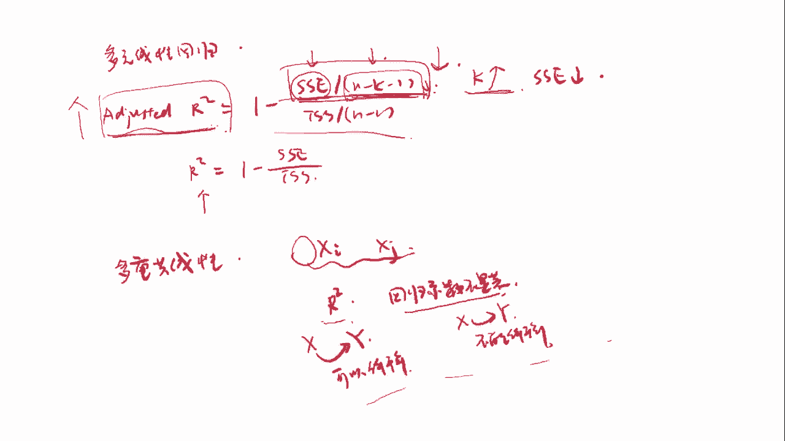

# 2024年金融大神老师讲解量化金融分析师.AQF—量化金融基础知识（完整版课程） - P8：《金融基础》08.数量分析-08_线性回归分析2 - 量化沿前 - BV1ar421K7Mo

好那我们有了这个回归曲线之后，我们如何来看这个回归曲线，到底拟合的程度怎么样呢，那这时候我们是可以用方差分析来看，那这里我们先嗯介绍几个名词，那我们这个图上的这条线啊，是样本回归线。

这条黑色的线就是Y啊，y i hat等于贝塔0hat加上贝塔1hat xi，那这些蓝色的点就是具体的某一些观测值，然后这条横着的这个蓝色的虚线是Y拔，也就是Y的均值，好，然后这个样本回归线上的点距离。

Y拔就是距离均值的平方和，是叫做解释平方和RSS，这个是叫做解释平方和，也就是说，这个样本回归线反映了Y多少的一个变异程度，也就是这个xi到底解释了多少，这个Y，因为这里面的这个yi hat。

其实和xi是成一个函数关系的嘛，那这个y i hat的变动，其实都是由这个xi来导致的，那所以说嗯yi hat和这个Y8之间的差距，其实都是由xi来解释的，那那大家嗯想一个最最极端的状况。

就是我们这里的样本回归线是一条水平的线，那正好是等于Y拔，那这时候这个rs也就是解释平方和，是不是就是等于零了呀，也就是说X完全没有解释Y，那是不是就说明Y和X就是完全没有关系的好。

那这个是解释平方和嗯，第二个是叫做残差平方和SSE，残差平方和，那这个呃概念就是嗯它字面意思啦，就是残差的平方和啦，那残差是什么东西，是不是我们观测值距离样本回归线的这个差距。

那这个的话是不是就是ABSOLUIH的平方，这个大家应该很熟悉对吧，因为我们在做OLLS的时候就是木嗯，我们的目标就是使得这个残差平方和最小嘛，好那这个是叫做残差平方和，然后它们之间残差平方和和。

解释平方和之和呢叫做TSS，那这个是一个总的平方和，那这个呢就是所有的YI和这个Y白差值，平方的和，那其实就是反映了所有这个观测值距离，均值的一个变异程度，好好我们来再来看一下啊，那总的平方和。

就是我们所有观测值总的一个变异程度，然后解释平方和，就是被这个呃自变量X解释的呃变异程度，然后SSE残差平方和，就是我们没有解释到的这个观测值，距离我们样本回归线的平这个残差值的平方和。

那我们之前在做OLLSS回归的时候，是不是就是要让残差平方和最小，那说明这里的话这个是越小越好的咯，好好这里我们看一下这个ANOVA表，那a NOVA其实就是方差分析了，就是analysis。

Analysis of virus，也就是方差分析表，然后这个的话就是把我们刚才讲的东西，总结了一下，那首先这里有一个回归，这回归的话就是代表RSS，也就是我们刚刚说的这个解释平方和。

然后它的自由度是一，那这个自由度呢其实就是我们自变量的个数，自变量X的个数的个数，然后MSS就是用呃这个SS这一列，除掉这个DF自由度，然后残差平方和就是SSE，然后它的自由度是N减二。

然后MSS是等于这个，然后总的话就是TSS，然后它的自由度的话就是上面的之和好，这个的话大家稍微了解一下呃，了解一下就可以了，然后下面的话是其实就是几个不同的名称嗯，大家就看一看就行。

那首先的话就是大家是要知道的，就是这个就可以了，那这个的话是一个总的变异程度，大家知道他是一个total，一个总的概念就可以了，那它是每一个观测值距离Y拔，也就距离均值的一个变异程度。

那这个其实是不是就是Y的Y的方差，然后乘以了一个N啊，那如果除这上面加上一个N分之一，那这个是不是其实就是呃Y的一个方差公式，那这个是反映它总的一个变异程度，然后第二项y i had减掉Y8的平方和。

那这个呢是反映了一个解释，解释平方和，也就是X解释了多少，那最后这个呢是残差平方和，有人说我们还剩下多少没有被解释的，然后这里面的话有几个嗯，就是有几个不同的叫法，那总的呢可以叫做total。

Sum of squares，是TSS，或者有的地方写的是sum of squares，Total，其实大家只要看到有这个total啊，就知道它是一个总的平方和。

然后解释平方和有的地方呢是叫做嗯RSSSS，也就是regression，Sum of squares，也就是一个回归平方和，就是它有时候是叫解释平方和，有时候是叫回归，那有的地方叫解释的话。

就explain some of squares，就是ESS，所以我们这里的话看到呃regression，或者说是explained，那这个就是呃表示的是这一项，那最后还有一个残差。

那残差项就是some of squared errors，或者说some of squared residu，那大家看到这个errors或者是residual的话，就是表示一个误差。

或者说残差的平方和啊，那这些的话就大概稍微看一下就可以了，也不会考这种东西嗯，好那下面呢就是介绍两种拟合优度，那这个其实就是反映我们拟合程度，那第一个就是r square的决决定系数。

它的计算公式是r squared等于rs s除以TSS，那这个rs就是解释的，然后TSS就是总的其实也就是我们这个啊，我们看这个图上啊，也就是这一块这个占总的这个比值，那我们之前是不是也说了。

这个SS是越小越好，那这个SS越小的话，那是不是这个RSS占到TSS的比重越大，所以说这个RSS比上一个ts ss越大的话，是不是就说明这个嗯SSSE比上ts ss越小，那这个是不是越小越好。

那我们OLS的目标本来就是最小化SS嘛，那这个的话那这个值的话就是r square的拟合呃，这个决定系数，它是反映了我们这个拟合程度的好坏，那如果说这个值越大的话，那就说明我们这个线拟合程度越好好。

那我们刚刚也说了，TS是等于RSS加上一个SSE对吧，那我们把这点RSS用TSS减掉，SSE进行替换的话，那r squared是不是就等于TS减掉SSE，然后除以一个TSS，那这个不就是等于一减掉嗯。

一一减掉SSE除以TSS吗，那这个式子是呃r square的一个公式，它是表示因变量的变化，有多少是由自变量解释的嗯，它的取值范围是0~1啊，那这个0~1其实就很容易理解了。

那因为这个rs s肯定是小于TSS的嘛，所以这个值肯定是小于等于一，那最最最极端的情况是不是，就是我们拟合的这条线，正好穿过了所有呃观测点，也就是说这些点的话，全部都在这条样本回归线上诶。

那这时候我们的SSE是不是就等于零了，那这时候rs s就等于TS，那r squared是不是就等于一，那这时候是拟合程度最好的，那另外一个极端情况就是拟合程度最差的，也就是这个解释。

也就是这个X完全没有解释Y，那是不是就是我们刚刚说的，它是一条水平线的时候，这时候RSSS是等于零，那这时候R平方这r squared就等于零，那这个是拟合程度最差的情况好，所以r square的呃。

这个取值范围是0~1嗯，注意一下这个r squared，他是这个R平方是不可以拆开来的，没有说这个R是什么东西啊，这个R和这个平方是连在一起的，它其实是r squared的，它是一个啊。

它这个是一个总体，我们要把这个总体放在一起，你不可以把这个R和二拆开来嗯，这个是要注意一下好嗯，在一元线性回归中，r squared的等于R的平方，那这里面的这个R其实就是相关系数。

有相关系数RO有时候也把相关系数肉写成R，那因为R的这个取值是不是在-1~1之间啊，那R平R的平方的取值，是不是就是在0~1之间了，好然后第二种拟合优度是叫做回归标准物，那回归标准物的计算方式。

就是用残差平方和除以它的这个自由度，然后开根号嗯，那see r衡量的是真实的Y值偏离回归线的程度，那这里真实的Y值偏离回归线的程度哎，是不是这个就是absolui hate，那它衡量。

那它计算公式里面不就是就这样子的话，它就是衡量的一个真实Y值偏离回归线的程度，然后它的值越小，拟合度越好，那其实也就是这里面的残差平方和越小嘛，因为它这个其实就是呃由这个SSSE决定的。

那这个SS越小的话，那说明额拟合度越好，这个其实是比较就是直观的好，这个是拟合优度，那下面呢我们看一下，用Python实现线性回归的一个实例，那我这里的话就是选取了一些呃。

工资水平和工作年限之的这个具体数据嗯，然后给对他们做了一个回归，那首先我第一步的话，还是在这个图形上画了一个散点图，那这个X轴呢是呃工作年限，然后Y轴呢是就是工资水平，那么看到这个工作年限和工资水平。

是不是呈现一个高度正相关的关系，然后我们通过OLS拟合出来的样本，回归线是这个蓝色的这条线，我们看一下这个o s regression result，它的回归结果嗯。

然后这里面的话它的这个嗯呃因变量是salary，就是他的工资，然后他的r squared是0。957，也就是我们刚刚说的这个拟合优度，0。957，那他是不是已经非常接近于零了呀。

哦不已经非常接近于一了呀，那说明它的拟合优度是非常好的，嗯然后它的model是OLS，然后这里面还有一个adjusted earthquare，这个其实是在嗯就是多元线性回归中使用的。

然后methods list squares，然后呃，好下面我呃，下面我们要看的是这块，那这里面呢我们是不是有两个有两行值，那这个constant其实就是算了这个贝塔零卡的。

然后下面这个experience，years experience其实算的就是贝塔1hat，也就是这个工作年限前面的回归系数，那么看到这个coefficient，也就是说这个系数的值。

那我们这个贝塔0HT算出来是等于这个，然后呃贝塔1ht算出来是等于这个，那贝塔1hat等于这个值，我们什么意思啊，也就是说每增加一年就是工作年限，每增加一年的工资水平，就是增加9449这么多好。

然后这个是standard error，就是这两个样本统计的标准物，那这里面的话因为贝塔1hat的方差未知，所以我们使用的是T统计量，我们计算出来的值是24。950，那这个其实是一个非常非常大的值了。

那我们计算出来P值的话是0。000，说明这个呃这个概率是非常非常小的，那么我们可以嗯就是拒绝原假设，那说明这个系数这个回归系数是显著的，好那这个这一块的话，其实是大家最需要关注的地方。

那下面的话就嗯不是很重要了，现在大家也没有学到这样的呃程度嗯，所以的话目前大家就是掌握，怎么看这两行就可以了，就是怎么看这个回归系数的显著性，那主要的话最主要的话我们就是看这个P值。

一般我们就是直接拿这个P值，和我们的额显著性水平进行比较，好前面呢我们看了一元线性回归，那现在我们来看一下多元线性回归，那多元线性回归其实也就是我们的回归模型中，有多个自变量。

比如说Y等于贝塔零加上贝塔1X1加，贝塔2X2加加加加到贝塔NXN加ABSAL，那这里面的话我们就是有N个自变量，那多元线性回归模型的假设和一元线性回归呃，差不多，那也是线性回归模型，它是参数线性。

然后自变量X非随机随机误差项的期望为零，方差相同，彼此不相关，自变量X和随机误差项不相关，随机误差小服从正态分布好，那这个上面的话和一元线性回归，都是完全一样的，那它和一元线性回归一个区别。

就在于它是它有另外一个呃，就是另外一个要求是，自变量之间不存在完全的线性相关，即完全共线性，那这个完全共线性是什么意思呢，这也就是说嗯，一个自变量是可以由另外一个自变量，或者说另外多个自变量。

通过一个线性组合的关系给表示出来的，比如说我们这里，X2和这个X1是呈线性相关的，嗯就是完全贡献的，那X2等于A加BX1啊，那这里的话X2就是完全可以，通过一个线性表达式嗯，由这个X1表达出来。

那这时候我们其实就是可以，把这个X2给剔除掉的，那为什么呢，我们可以把这个式子是不是带到这个里面来，把这个X2用X1来表示，那现在的话我们式子是不是就变成了，贝塔零加上贝塔一，X1加上贝塔二。

那X2是什么东西，是A加BX1对吧，然后后面的话还是保持不变，那现在的话，我们把这个前面这个提取一个什么啊，公公因式，然后这样子的话我们的常数项就变成了贝塔零，加上A乘以贝塔二。

然后X1前面的系数就变成了贝塔一，加上一个B贝塔2X1好，那后面的话还是保持不变，哎那这样子的话，我们是不是就是把X2这个自变量给剔除掉了，那我们只是修改了这个常数项的值，以及X1前面的系数。

那Y还是可以被这些呃剔除掉，X2之后这N减一的自变量来表示的对吧，所以说自变量之间要不存在完全的线性相关，及完全共线性，这个是多元线性回归模型的一个假设，那其实在嗯真实的情况下。

完全贡献信是很少很少遇到，基本上不是我们担心的问题，那我们需要担心的问题，是一个叫做嗯高度相关的关系，也就是说这个X2和X1之间，并不是一个这样的函数关系，但是呢它们之间存在高度相关。

那这种高度相关是不违背，这个多元线性回归模型的假设的，但是会严重地影响我们的统计推断，这个话我们会在后面给大家介绍介绍，我们来看一下呃，回归系数的显著性检验，首先是单个回归系数的显著性检验，那也就是说。

对某一个自变量的回归系数的显著性检验，比如说这里贝塔J等于零，那这个J呢是呃一到K，那这个K其实就是自变量的个数，那我们有X自X个自变量的话，那我们对每一个自变量前面的回归系数，都可以做一个显著性检验。

看看他等不等于零，那这个步骤和一元线性回归就是完全一样，那我们可以用Z检验，也可以用T检验，那这个T检验的话，这里的自由度是发生改变，那这里的自由度是N减K减一，那多元线性回归中还有一个联合假设检验。

那它这个呢是检验，是不是所有的自变量都是呃无效的，那我们看一下它的原假设是贝塔一等于贝塔，二等于贝塔K1等于零，也就是说，所有自变量前面的回归系数都是等于零，那这也就是说一个自变量都能不能解释呃。

Y了对吧，那他的倍则假设就是，至少有一个贝塔J是不等于零，也就是至少有一个自变量，能对Y做做一定的解释，那这时候我们用到的是F检验呢，F统计量是这样的一个式子，然后他是这个统计量呢是服从F分布的。

那我们的角色规则是，如果F统计量嗯大于F关键值的话，我们就拒绝原假设，那这里的话其实是用了一个呃拒绝域，好我们来看一下多元线性回归中，拟合优度的度量，那这时候我们用的是这个调整后的r square。

那这个是什么东西呢，我们之前在一元线性回归中，是不是用的是这个呃，决定系数r squared的，但是在多元线性回归中，我们就不再使用这个r square了，那为什么呢，因为在多元线性回归中。

r squared会随着自变量的加入而增大，甚至新加入的变量，并不满足统计上的显著性检验，那这是为什么呢，我们看一下r square的公式，那是不是这样子的一个公式，那我们看到这个RSS是啊。

解释平方和就是我们的自变量可以解释多少Y，然后这个SSE是残差平方和，那么我们只要在这个模型中，新加入一个自变量的话，那我们的那我们对于这个Y的变异程度，解释肯定是会增大的，比如说我们之前是X1嗯。

X2到XN一共是嗯N个自变量，然后可以解释一定程度的Y好，那现在的话我们又添加进来一个XN加一，那这个里面X1到XN其实还是保持不变，那它们可以解释多少Y，现在还是可以解释多少Y，那我们现在就是可以。

那我们现在就是要看这个XN加一，能解释多少Y对吧，那如果说XN加一能够呃，解释另外一部分Y的变动的话，那这时候RSSS是不是就会上升，那SSE就会下降，那这时候r squared就会呃上升对吧。

那如果说XN加一这个新加入的自变量，对于呃Y是完全没有任何的解释效用的，或者说它只可以解释一丁点儿的这个Y的变动，那这时候我们这个rs s就只能增加这么一点点，或者说呃根本就不变。

那这时候r squared也并被并没有减少，所以随着我们自变量的加入，那r square的肯定是如果不增大的话，也肯定是不减小的，所以，所以如果我们在多元线性回归中使用r squid，作为拟合优度的话。

那我们可能会导致的一个问题，就是我们会加入非常非常多的自变量，因为我们只要加入呃越多的自变量，它的r squared就会越高嘛，那你合优度越好，但是这这就导致了一个问题。

那是因为我们其实并不需要有那么多的自变量，对吧，因为因为如果说我们自变量太多的话，其实包含了太多的冗余信息，比方说我们有一个模呃，多元线呃，多元线性回归模型，我们有100个自变量。

那它的这个呃r square可能会比较高，但是我们要这个模型有什么用呢，我们有100个自变量，我们就不知道到底哪些自变量到，就是真正的能解释这个Y，所以我们最终其实希望得到的结果。

就是我们得到这样的一个模型，然后这个模型中每一个自变量，都对Y有一定的解释作用，也就是说每一个自变量都是比较重要的，所以调整后的这个r squared，其实就是对我们新加入自变量嗯。

就是对这个自变量的个数做一个惩罚，也就是说如果我们自变量的数量越多，那这个惩罚力度就越大，那它是怎么实现的呢，那我们看一下这个它的公式是这个样子的嗯。

调整后的r squared就是adjusted r squared，它是等于一减SSE除以它SSE的自由度，然后TSS除以一个N减一的自由度，那我们把它和原来的这个r square进行比较的话。

我们是不是发现它差别，就是呃在这里多除了一个自由度啊，那这时候调整后的r square，不一定随着自变量的加入而变大，而只是当我们加入的这个自变量的作用，一定大的时候，它才会变大。

比方说我们现在新加入一个自变量，并不满足统计上的显著性检验，也就是并没有什么作用，那它就不会显著的减小这个SSE残差平方和，那我们假设这个SSE是不变的，那我们是不是增加了一个自变量的话。

那K变大了对吧，那K是这个自变量的个数，那K增大了这个N减K减一是不是就会变小，因为减掉一个更大的数，那这个SSE是不变的，然后他除了一个更小的数，那这一块的话是不是就变大了，好那这个分子变大。

那是分母其实不变，因为TSS就这个总的变异程度，其实在刚开始的时候已经决定了，它是不会改变的，那N减一的话也是不会改变的，因为N其实是样本的数量嘛，那这个是在我们抽取样本的时候就已经决定了。

所以这个分母是不变的，分子增大，那后面这一项的话是不是就增大，那一减掉一个更大的数，那是不是这个adjusted r squared是不是就减小了，也就是说如果我们增加了一个嗯自变量。

然后它并没有显著的减小SSE的话，那我们调整后的r squared的是减小的，那说明你合优度是变差了，那只有当什么情况下，这个调整后的r square才会增大呢，那我们增加一个自变量的话，K还是增大的。

那SSE要减小到一定程度的时候，使得这个SSE除以N减K减一，这个式子要减小，然后这个后面这一项才会减小嘛，那一减掉一个更小的数，那adjusted r squared才会增大。

所以说只有当嗯我们增加的这个自变量，能够显著的减小残差平方和的时候，我们才会把这个嗯自变量给加入进去，那这样子的话，我们最终留在模型中的自变量，就是都是比较有用的好，那这里的话注意两点。

一个是调整后的r squared是小于等于r squared的，那这个的话肯定是嗯没有什么问题，因为这里N减K减一是小于这个N减一吗，那分子的话除了一个更小的数呃，那分子就是变大了嘛。

所以这个adjusted r square是比r squared的是要小的，然后调整后的r square也许会小于零诶，这个是需要注意一下的，它是有可能是小于零的。

那r squared的它的这个范围是0~1的，它是肯定大于等于零的，嗯那最后的话讲一个多重共线性的概念，也就是我们之前在说假设的时候，说到的那多重共线性，说的就是多元线性回归模型中。

自变量之间存在高度线性相关关系，注意一下，这是高度线性相关关系，而不是完全的线性相关关系，因为如果是完全的话，就违背假设了，那我们直接把这个嗯存在线性关系的自变量，我们剔除掉几个就可以了。

那但是多重线性，多重共线性其实是不违背假设的，但是它是会对统计推断呃产生产生影响，那多重共线性是不影响OLSS估计量的一致性，但是OS估计量的标准误会高估T检验失效，很难区分各自变量对因变量的影响。

那这里的话为什么T检验失效呢，我们是不是之前T检验的话是贝塔j hat，然后减掉零，然后除以一个standard的error呃，贝塔j hat，然后这个是一个嗯T统计量对吧，那如果说这个标准物高估。

也就这个值变大的话，那这个T值是变小啊，那这个T值如果很小的话，那我们就是没有办法拒绝原假设了，所以T检验失效，那这里我们就是要重注意的一个点是，这里的诊断多重共线性嗯。

现实中我们常常关注的是多重贡献性的程度，而非而非它是否存在，因为多重构线性其实总是存在的，因为你们自变，因为自变量之间嗯总是存在一定的关系的，但是如果说这呃这些自变量之间的关系，实在是太高度相关的话。

就会影响我们的统计推断，那诊断多重共线性，最常用的方法是回归模型的嗯，这个r square很高，但是斜率系数的T统计量都不显著诶，那是不是就是我们刚刚说的呀，那这个回归模型的r square很高。

那说明我们这个X其实对呃，Y的解释程度还是很OK的，但是呢我们对于每一个自变量来说，它前面的系数又是不显著的，那这时候的话嗯，就很可能是出现多重共线性的情况，好那这个的话就是我们要讲的线性回归的部分。

我们也来总结一下，那线性回归我们是不是首先讲了一元线性回归，那总体回归函数，是e y xi等于贝塔零加上贝塔1xi，然后对于每一个观测值来说，有YI等于贝塔零加上贝塔1xi加上XNOI那样，本回归函数。

也就是说我们抽取了一个样本，拟合出来的这个回归线是额，这不是E了，就是yi hat等于贝塔0hat加上贝塔1hat xi，那对于每个观测值来说，就是YI等于贝塔0had。

加上贝塔1HXI加上absolui had，那我们如何确定这样的一条样本回归线呢，我们可以使用OLS普通最小二乘法来获得，那普通最小二乘法，我们就是最小化残差平方和哈。

通过调节这个贝塔0hat和贝塔1hat，这样子的话我们可以算出来，贝塔0hat是等于Y8，减掉贝塔1hat x8，然后贝塔1hat是等于COVERANCEXY，比上一个variance x。

然后通过对这个贝塔1hat的一个改写呢，我们会发现这个贝塔1hat，是服从一个均值为贝塔一，然后方差是这个嗯这个东西的一个正态分布，然后通过这样的一个关系呢，我们可以对它进行嗯回归系数的显著性检验。

然后接下来我们还讲了一个方差分析，那方差分析我们要了解这样的几个概念，那比如说这个是样本回归线，这是y i hat等于贝塔0hat，加上贝塔1hat xi，那这个是呃Y拔。

那这个这个样本回归线距离Y拔这个距离的和，也就是y i had减掉Y8的平方和，那这个是叫做RSS，也就是解释平方和，或者说是回归平方和，那具体的每一个观测点和这个Y拔的平，Y拔平方和。

那这个呢是叫做嗯总平方和，也就是YI减掉Y8的平方和，那这个是总的平方和TSS，然后具体的观测值距离，这个呃回归方程，这个距离是不是就是absent i had，那这个absolui had的平方和。

那这个大家熟悉的就是残差平方和SSE，残差平方和，那我们有一个关系式，就是SSE加上一个RSSS等于TSS哈，那这里的话我们如果用rs s比上TSS，那这个值是等于R平方。

额就是r squared是决定系数，它是一个拟合优度，也就是看我们这个线到底拟合的程度是怎么样，表示这个因变量的变化是多少，是由自变量解释的，好那这个是一元线性回归，那多元线性回归。

其实和一元线性回归也差不多，它就是多有多个自变量，那多元线性回归主要是注意两点，一个是这个adjusted r squared，也就是调整后的这个R方，那我们呃它的计算公式是一减SSE。

然后除以一个N减K减一，然后下面是TSS除以N减一，那他和这个RQUARE大的区别在哪呢，r square的公式是SSS除以TSS，那这里面是不是多除了一个自由度，我们在多元线性回归中。

为什么要用adjusted or square呢，是因为我们只要在添加进去新的自变量的时候，这个r square是肯定会增加的，那我们并不想要添加那么多的自变量，因为它会增加我们模型的复杂程度。

增加很多的冗余信息，所以我们要用一个r square，adjusted r squares呃，来控制我们自变量的多少，那这个那这个公式，那这个值为什么是可以控制呃，我们添加进来的自变量是有效的呢。

那也就是说我们添加进来的这个自变量，使得残差平方和减小的程度，是要大于这这一项减小的程度，因为如果我们增加这个K，增加这个自变量数量的话，我们这个这一块是不是会额减小。

那增加自变量的个数也可以增加解释程度，那增加解释程度的话，SSE也会减小，那这一块也会减小，那只有当这个减小的程度，是大于这个程度的时候，这一个整个总体才会减小吧，那这个减小的话。

我们这个adjusted r squares才会增大，那在多元线性回归中，我们就是看的这个调整后的r squared，如果说这个值越大的话，那就说明你合优度是越好的，那第二点呢就是多重共线性。

那多重共线性，也就是说X嗯，I和这个XJ之间存在一个相关关系，存在一个高度的相关关系，如果说嗯多元线性回归模型中存在多重共线性，它一个最大的特点就是而square是很大的，但是对于每一个自变量来说。

它前面的这个回归系数T值都是不显著的，也就是说，我们在对每一个回归系数做显著性检验的时候，这个回归系数不显著，回归系数不显著，那因为按理来说，如果r square呃，这个r squared他是很高的话。

那是不是说明X是可以，X是可以解释Y的，可以解释的对吧，可以解释的，但是如果说回归关系回归系数不显著的话，那是不是就说明X是不能解释，不能借10万好，那这个的话就是由于这个多重共线性导致的，好。

那这个的话，就是我们这个额数量分析的所有内容嗯，那我们这个课上学习的数量分析，内容还是比较基础的，但是也是为了大家以后学习打的一个基础，那这个课程的话就到这里。

