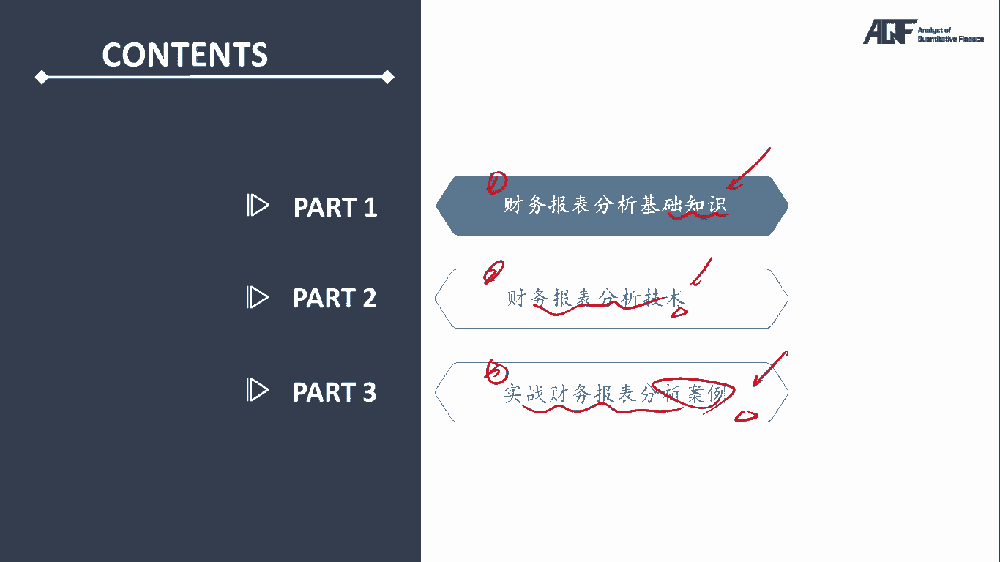

# 2024年金融大神老师讲解量化金融分析师.AQF—量化金融基础知识（完整版课程） - P9：《金融基础》09.财务分析-1财务分析原理：报表关系 - 量化沿前 - BV1ar421K7Mo

好诶各位同学大家好，那么今天的话呢我们来开始跟大家讲啊，我们AKF1级就是我们aa cf的啊，金融部分的课程就是我们的，我们今天跟大家讲的，是我们的一个财务报表分析，那么嗯AKF的同学的话呢。

可能第一个问题问的就是我们是来学量化的，咳咳我为什么要来去学这个财务报表分析呢，这个其实对我们来说啊，大家呃学完后面的整体的量化之后，你就会知道呃，就算我们做的是整体的量化投资。

我们还是需要用到一定的财务方面的一个，基础知识的，比如说大家在啊我们后面的课程当中，在学多因子模型的时候，那多因子模型当中非常重要的一个模型啊，啊这个这个组成部分就是我们的一些财务因子，对不对。

那么你要知道什么是roe，什么是PE，什么是DIVIDYELD等等等等，你必须要知道这些东西，你才能知道我这个多因子的这个模型，怎么去构建，怎么去找到啊，由于财务给我们带来的那些阿尔法，对不对。

那么这是多因子方面，我们可能会用到我们的一些财务，那么还有一些的话呢，我们现在可能越来越多的就是基本面，结合量化的这样的一个交易策略，里面，其实也会涉及到很多的啊，财务方面的一些基础知识啊。

所以对我们来说的话呢，呃学习财务啊，这个嗯我们一再去跟大家去强调说，量化和我们的这个基本面的那些分析啊，基础的那些其实并不是完全割裂的，我们完全也可以用，比如说我们先用量化的手段先筛选出啊。

我们的一些满足我们要求的一些呃公司，对不对，然后呢，再结合我们的一些基本面的一些分析方法，来去做到整体的这个投资的一个把握，所以整啊不管你从哪一个角度去分析啊，我们这里的对于我们学量化的话。

那我们财务报表分析的这些啊，实战技术还是非常有必要的，那么对于我们来说的话呢，我们整体的产啊，量化当中所需要用到的财报分析的内容的话，其实还好很简单啊，不超过C我们cf1级的啊那些呃这个知识。

所以大家如果已经考过CFA1级的，那些内容的话呢，其实呃这个前导课的话呢啊对大家来说，可能这个很多知识点大家都是会的，但是也没关系啊，如果是考过CFA的同学呃，财务也是有点熟的。

一些同学也可以跟着我们的这个视频，时间也不长啊，那咳我们把整体的在量化当中，可能会需要用到的，财务报表分析的一些核心内容啊，我们再来简单跟大家复习一下对吧，那如果说之前没有接触过财务的，那些同学的话呢。

也不用担心啊，就觉得这个财务怎么这么难啊，这个财务我会不会学得了啊等等等等，完全没有必要啊，那啊大家跟着我们的这个课程思路的话呢，我们不会把所有的啊，那些财务的那些内容全都跟大家讲。

对不对，跟大会跟大家讲的，也一定是我们量化当中会用到的，那些财务内容好，那么先来看一下我们整个的呃，AI cf里面的财务报表分析的这样的一个，框架结构，我们分成了三个部分，第一个部分的话呢。

我们会介绍财务报表分析的一些基础知识啊，我就会跟大家讲什么是资产负债表啊，什么是利润表啊，这些表怎么看啊，对不对，那么这些榜里面哪些科目比较重要，那些这个科目的话。

那就是我们将来可能会用到的一些啊财务因子，那么第二块的话呢，就是我们会跟大家讲解一些，财务报表的一些分析技术，那么比如说我们的杜邦三分法啊等等，这其实已经是我们多因子的一个雏形了。

所以嗯我们拿到一张财报之后，一个公司的财报表之后，我们如何去进行分析，那么我们会跟大家去来讲一些啊，分析的一个思路和分析的一个角度，那最后的话呢，我们会结合哪两个比较有代表性的一个公司啊。

带大家来做一个啊整体的啊，实战的一个分析案例，统统拿的是真实的上市公司的一个真实案例，那么我们会就带着大家一起来看一下，我们学完了整个嗯财务的基础知识，财务的分析技术之后，如何来去分析我们的一个公司。

所以整个课程的体系性和结构性，是非常完备的啊，那么就算是没有接触过任何财务的同学的话呢。

也完全可以理解好，那么首先第一个啊，我们先来跟大家讲一个啊，影子的这样的一个例子啊，就是对他来说啊，我们为什么要去学习啊，财务就算我们不做量化学习，财务也有很大的一个作用。

就是可以帮助我们去分析市场上的那些公司，它到底具不具备比较高的那些诶投资价值，对不对，比如说啊在我们这个里面，我们举了一个嗯非常真实的一个例子，大家可以看他说对于我们来说啊。

这个我们一起来看下这个例子啊，他说他呢是一个上市公司，上市公司的话呢都是希望自己是盈利的对吧，哎这个我要满足我分析师的那个预期啊，那么我的股票价格才会涨的比较好，那么呃但是呢晚话呢非常不幸。

今年的话呢这家公司却发生了一个亏损，而且没少亏，亏了多少钱呢，亏了一个亿，那这个公司的话呢当然不想自己会亏损了，对不对，他想把他的亏损转变成一个盈利，那怎么办呢，大家注意啊。

大家会发现正常情况我们亏了一个亿，很难，是不是扭亏为盈啊，对不对，但是我们来看一下啊，这个上市公司他用的一个方法，他就用了一个方法，就瞬间实现了扭亏为盈对吧，从亏损一个亿还赚了很多钱，他呢发现什么呢。

他能发现在他的账上啊，有一个1。6个亿的银行贷款，我欠了银行1。6个亿，那么这个1。66个亿的贷款呢还没到期，但是我申请一个什么诶，我申请一个提前偿还，但是注意了，我用什么来偿还呢。

这是这个例子当中的核心，我不是拿我的钱，1。6个亿的现金来偿还我的这个房子，我是拿什么东西来偿还啊，不是拿1。6个亿的现金来偿还我这个贷款，我是拿什么东西来偿还，我，他是拿了一个房子来去偿还这个房子呢。

这家公司当时买的时候的，账上的价值呢只有多少钱呢，只有3000万，那么呃这个在中国大家知道啊，我好好早之前3000万买的这个房子，现在可能已经值很多很多钱了对吧，所以现在这个3000万的房子的话呢。

它的价值呢可能已经完全足够，把这1。6个亿的债务去抵掉了，没问题吧，所以相当于我这个公司用了一个什么动作呢，他用了一个3000万的一个呃房子去抵了多少钱，去抵了这样的一个1。6个亿的一个债务。

那么接着再来看嗯，他的那个手段里面还有一个再说，第二天呢他在什么，他在用1。6个亿的一个现金，再把一额这个这个抵押给银行，这个买这个咳咳额，这个把这个房子啊，这个卖给银行，想去啊，偿还这1。

6个亿的这个贷款，再花1。6个亿把这个房子再买回来，那么大家想看啊，对我这家公司来说，它本质上就做了一个什么东西啊，它本质上来说就是拿着1。6的一个现金，去把这1。6个亿的债务是把它给偿还了。

但是它的核心精妙的一个地方，就在于说，他不是直接拿了1。6个亿的现金去还，他现在拿了一个3000万的一个房子去还，拿了3000万的一个房子，还完之后，我再拿1。6个亿，把这个房子怎样再把它给买回来。

听明白意思吧，哎所以最终的一个结果，给到我们带来的一个一个什么样的一个结果呢，很简单，大家会发现3000万的一个房子，我抵了1。6个亿的一个债务，所以对我这家上市公司来说，这样一笔操作他就直接怎么样。

有了这样的1。3个亿的这样的，我们把它叫做get1。3个亿的这样一个立得，对不对，哎因为我3000万的房子，我抵了1。6个亿嘛，对吧哎好这是一个处理底呃，这是一个结果，还有一个结果呢。

还有一个结果就是这个房子啊，从原来账上原来价值3000万，现在这个房子因为我当我又把1。6给的现金，把这个房子买回来了嘛对吧，所以呢这个房子在我的账上，从3000万的价值又变回到咳，也变成到了这1。

6个亿，没问题吧，所以整个过程其实本质上来说，就是拿着1。6个亿的现金，去还了1。6个亿的贷款，但是我把这个房子在当周转一下，你会发现我直接赚了1。3个亿，所以我这家公司直接从亏损一个亿。

变成了怎么样哎，变成了盈利3000万，所以这个其实就是我们上市公司啊，很多上市公司会用的一些财计，那这些例子啊在我们市场上还有很多很多，比如说啊我们来举一些嗯，嗯有个什么样的一个例子呢。

比如说我们呢有一家钢铁企业对吧，然中国的钢铁企业啊，大家可能也都知道啊，它的盈利能力啊，各方面其实都不是特别理想，对不对，所以呢呃原来啊假设有一个钢铁企业，这个钢铁企业的话呢，他花了五个亿买了一个设备。

这五个亿的话呢，原来这个设备啊，原来他假设可以用10年好，那么大家想想，我花了五个亿买了一个设备，这个设备可以用10年，那么简单来说，这个设备每年的这个使用用，费用大概都是多少钱。

哎每年的使用费是不是大概嗯就是5000万1年，对不对好，那么这个相当于是我这个公司的一个什么，具体的一个什么唉费用，对不对好，那么但是的话呢我这个公司啊，钢铁的这个企业到年底一看，我利润不够了。

那这个时候怎么办呢，这个时候他就说了很简单，他不是说我原来这个设备我买来的时候，我估计了一下，还可以用10年嘛，然后呢，我这个上市公司说我现在啊我重新估计了一下，我估计出来啊，这个公司这些设备啊。

由于在我公司我管理的太好了，对不对，所以呢我重新估计了一下，这个设备可以用多少年了，唉我重新估计了一下，由于我的管理能力太好了，管理的太好了，这个设备的使用寿命一下子就变长了，我认为可以用20年。

那么大家会发现啊，用20年的话，五个亿的一个设备，我可以用20年，那么每年的使用费其实就变成了多少钱，一年了，2500万1年，大家会发现就是这样一步简单的一个操作，对我这个公司的这个利润的产生。

也多产生了多少钱，唉原来5000万的费用，现在就变成了2500万的费用，是不是又直接成增加了2500万的这样，一个利润啊，没题吧，哎所以呢在我们市场上有很多公司啊，他的那些利润都是拍脑袋拍出来的。

一下子拍了2500万出来，一下子这个呃，这个这个又拍了我们这个里面的的，1。3个亿的一个利润出来对吧，所以呢我们作为分析师啊，我们作为量化分析师，那么我们其实也要能看出来，这些公司他其实有一些猫腻。

对不对，那么对于我们来说，我们在做投资的时候的话呢，啊我们要能把这些公司把它给啊，这个这个啊做财务粉饰啊，这些现象要能把他给发现出来，那么对我们来说，这个其实也是我们后面可以用量化的。

那当然啦这个呃在在在有有些证书的考试里面，我们可能是说呃我们通过一些分析嗯，主动分析的一些方法，把这些上市公司做财务造假，做财务分析的那些东西把它给发现出来，对不对，那么为什么也要跟大家讲，我们学量化。

为什么也要跟大家讲这些例子呢，就是因为这些财务损失的手段和方法，在我们将来都可以用量化的手段，我们可以看哪些公司的哪些指标，它有不正常的啊现象，我们就可以大概率的知道，这个公司有没有做一些财务粉饰。

或者财务造假了，没问题吧，哎好，那么这是我们第一个想跟大家举的一个例子啊，那么接着再来看我们整个财务报表分析，理念的话呢，其实我们想跟大家讲解的就是，财务报表分析的三大支柱。

就是第一个就是财务报表的一个勾稽关系，第二个的话呢我们把它叫做复式记账法，第三个的话呢我们把它叫做呃权责发生制，那么这些一定要掌握啊，嗯因为这些是我们能看懂财务报表的一个基础。

所以接下来的话呢我们大概会额用空白PPT的啊，形式啊，来跟大家讲解一些财务报表分析里面的一些啊，简单的这样的一个勾稽关系，和我们的一个核心的这样的一些知识内容，所以对于大家来说的话呢。

这些知识内容啊是需要大家掌握的，嗯好，那么接下来我们就来看一下我们的这个呃，财务报表里面的嗯我们估计的一些核心知识啊，那么首先第一个的话呢，我们就来举嗯这个举一个例子啊，这个嗯咳咳这个例子里面的话呢。

我们会涉及到三个上市公司的这个额报表，那么首先第一张报表的话呢，我们把它叫做B杠S，这个叫做什么呢，这个我们来还是写在空白的PPT上啊，有一张报表我们把它叫做B杠S，这个的话，那我们就把它叫做什么呢。

我们就把它叫做balance sheet好，因为什么，因为大家注意啊，嗯咳咳，如果让我用一个单词来去形容一句话，来形容什么是我们一个财务报表分析的话，我想用的这个单词可能就是这个单词叫做balance。

balance的话呢，就是叫做配平的一个意思对吧，这大家可能接触过财务或者会计的同学啊，大家可能就知道我要配平这样一个东西，那配平和什么配平呢，就是爆表sheet嘛对吧。

所以呢我们把balance sheet啊专门给它取了一个名字，诶，这个名字的话呢，我们就把它叫做资产负债表，资产额负债表嗯，所以对我们来说的话呢，我们有一个简写，这个简写的话呢。

我们就把它叫做B杠S的balance sheet，那么除了用我们的资产负债表以外的话呢，我们还有两张报表额分别，第一张报表的话呢，我们把它叫做income statement。

这张代表可能很多同学不太陌生，或者至少或多或少听到过，这个呢就是我们上市公司的一种叫做利润表好，那么还有一张报表，第三张报表的话呢，我们把它叫做cash flow statement。

这个的话呢就是我们企业的上市公司的一种，叫做我们把它叫做现金哎，现金流量表好，大家注意啊，我们这些报表之间啊，其实都有一个联系和关系的，那么首先先来跟大家讲一下利润表的话呢，我们也有个简写。

这个简写叫做I杠S对吧，In constant，如果有同学考过ACCA，其他的那些的话呢，有些时候大家也能听说过啊，利润表明会把它叫做P杠L，The pocket and loss，我们把它叫做损益表。

这其实是一回事，我说的都是利润表啊，那么还有一个的话呢，我们把它叫做cash flow statement，这种呢我们把它叫做现金流量表，所以现金流量表的简写的话，那就是C杠F或者叫做CFS对吧。

开始forth statement咳，那么分别每张报表是干嘛的，不用担心啊，我们后面都会跟大家举例子来跟大家讲解呃，一个个展开，那就给大家讲解每张报表的一个作用，每张报表是干嘛的，但是光看名字。

我其实就可以简单的这个发现，就是资产负债表，很明显，就是衡量一个公司的资产和负债的一个情况，对不对，那么利润表的话呢，就是衡量这个公司今年净赚多少钱的，这样的一个，那现金流量表的话呢。

衡量的就是其一个现金流的一个状况，没问题吧，好那么首先第一步啊，我想先让大家记一个结论，这个结论的话呢可能嗯大家先额，现在的话呢啊就这啊不知道原因啊，但是等我们学完整个呃我们的这一个嗯。

这个这个第一部分基础知识以后啊，大家可以知道了，为什么这个结论一定是对的对吧，那么这个结论我们跟大家说的是什么呢，说的就是大家猜一下这三张报表里面，哪一张报表一定是核心最重要的唉，资产负债表是最重要的。

资产负债表是我们财务报表的分析核心，那么后面一句话呢，就是利润表和我们的现金流量表，只是我们对资产负债表的，这是第一种叫做补充诶，补充说明好，所以其实嗯呃以后啊再有人问你。

比如说你觉得三大报表里面哪一张报表最重要，那可能原来很多同学会觉得说，利润表显然是最重要的对吧，衡量了一个企业赚多少钱对吧，但是其实不然啊，资产负债表是我们整个分析资产负债表的。

一个呃分析我们财务报表的一个核心好，那么接下来的话呢，我们就嗯带大家举一些例子啊，就看一下这三个报表分别代表什么意思啊，嗯嗯他只是啊，各自发挥的是什么样的一个功能好，那么额，接下来。

因为如果很多同学没有接触过我们一个财布，上市公司的一个财报分析的话，那我们就不拿公司来举例子啊，我们就拿个人来举例子，因为个人和公司其实是一回事，对不对，公司可能会有一张嗯公司的这样的一张啊，财务报表。

那个人其实也可以啊，这个这个购置这样的一个个人的或者家庭的，这样的财务和财务报表，对不对，好，那么比如说啊我们就拿个人来举例子，比如说我们的在座的各位同学，对不对，哎，那么我们今年啊或者这一个月。

现在是嗯10月份对吧，那呃如果说对于我们来说啊，如果大家这个在10月份的时候的话呢，嗯大家看一下啊，10月份的时候我们可能嗯在工作对吧，有了工作的话呢，我们就会有一个工资收入，对不对，好。

那么如果说我们有了这样的一个工资收入的话，假如说是多少钱呢，一个月1万块钱好了，那肯定是有点少啊，当然赚的钱肯定不止那么多，对不对，那么一个呃一个家庭啊，你作为个人来说，虽然你有工资收入。

那么还有你还有嗯，在这一个月当中可能会有各种各样的是吧，唉可能会有各种各样的开支，或者叫做费用吧对吧，那这个费用的话，那大概是每个月花多少钱呢，哎你还挺省吃俭用的，每个月花个4000块钱没问题吧。

好那么接下来的话，那我们假设你没有别的收入了，也所有的费用都在这里了，那么这个时候啊，你就可以算出我这一个月我净赚了多少钱，这一个月我们这里的净赚的这个钱其实很简单，我这一个月净赚了。

净留下来这6000块钱没问题吧，哎好那么第二个个人啊，这个其实大家都能很好的理解，对不对，就是我的工资开支和我最终净赚，那么在我们企业里面啊，其实都有自己所对应的一个名字，那么注意了。

在我们这个里面工资收入特别是收入的话呢，我们专门给它取了一个名字，叫做一个企业的怎么样，revenue对吧，那这个就是我一个企业的一个收入，就是我嗯买卖商品啊或者怎么样啊，我赚到的钱总总的收到的那个钱。

这个就是我们的一个revenue的一个形式，就类似于我们个人的一个工资收入，对不对，那么费用的话呢就是各种各样的开支，对不对，那么在我们财务里面啊，这个费用我们也给他取了一个单词。

这个单词的话呢我们把它叫做expense问题吧，哎好那么最终啊这一个月我们净赚的钱，净赚了多少钱呢，净赚的这个钱我们就把它叫做净利润，所以上面的revenue啊，我们就叫做收入。

下面的expense的话呢，我们其实就把它叫做费用，对不对，那么净赚的这个钱的话呢，其实它有一个名字啊，这个名字叫做净利润，如果大家去翻译成英文的话，那这个净利润我们就把它叫做net什么哎。

net income简写就是NI，没题吧，好那么这个就是我们通过啊，用个人的一些财务的一个情况啊，就带着大家来感觉了一下，对不对，公假设是公司的话，其实也是同样的道理，那么假设啊。

我们在11月份或者说下一个月的时候，同样的我们也会有怎么样1万块钱的，这样的一个怎么样收入，对不对，那在下一个月我们可能也会有费用expense啊，但是呢下一个月比如说我们可能谈了男朋友。

可能谈了女朋友啊，这个这个时候的话呢，我们的开支和费用啊有一定的增加，比如说我们的费用增加到了6000块钱，那这个时候在11月份我们净赚的那个钱，是不是仍然是我这里的净利润，对吧好，那么在11月份。

我们净赚的这个净利润其实就变成了多少钱呢，唉其实这个时候我们净赚的净利润就变成到了，我们还我还有4000块钱，没问题吧，哎所以公司的运营和个人的运营都是一样的，一个月这个月赚了多少钱，下个月赚了多少钱。

没问题吧，哎好那么接下来啊我想先问大家几个问题，首先第一个问题请问一下大家，你感觉一下10月份的这张嗯报表，或者说11月份的这张报表，你感觉一下啊，这个报表肯定是类似于哪一张报表哎。

这报告报报表肯定是属于我们的income，什么income statement里面的一个报表，income statement i杠S，是不是就是我们之前跟大家讲的，我们这个里面的这个利润表对吧。

那么正是因为它的名字叫利润表，它里面衡量了我今年收到了多少钱，我这个月花了多少钱，我最终净赚了多少钱，是不是还量的都是一个利润对吧，所以这个报报的第一个问题啊，你要知道就是这些数据。

应该是出现在上市公司里面的利润表达对吧好，第二个问题请问大家呃，这假设这是一个公司，或者这是一个个人的话，那么你10月份的这张这个利润表和哎，就11月份的这张利润表，这两张表格之间是相互联系的一张表格。

还是相互独立的一个bug啊，哎很明显，这两张报表其实是一个相互怎么独立的，一个表格，因为10月份我衡量的是十，这个10月份的这张利润表，我衡量的是10月份我收收了多少钱，花花了多少钱吧对吧。

哎最终我净赚了多少钱，11月份的这张表，我衡量的是11月份我收到多少钱，花了多少钱，净赚了多少钱，没问题吧，哎好，那么接下来的话呢再来看第三个小问题啊，第三个小问题也是我们这个里面的核心分析的。

核心的一个内容啊，也就是说大家会发现，如果说我们作为个人的话，我每个月赚了钱，我是不是要把它给存起来啊，对吧，很明显，我第一个月净赚了6000块钱，第二个月净赚了4000块钱。

那么我个人赚的钱肯定要存起来，那么我企业赚的钱呢，他其实也要存起来，那么但是的话呢问题是就是企业赚的钱，它是存在哪里的呢，注意啊，这是我们非常非常重要的一个啊，啊这个这个关系啊，我们企业在利润表里面。

它每个月或者每年赚了钱以后以后，他会把这个钱存在哪里呢，存在我们的B杠S里面，B杠S就是我前面刚刚跟大家讲的，什么资产是吧，哎它会存在我的一个资产负债表里面，好为什么要存到资产负债表里面呢。

它究竟又是怎么存的呢，那注意啊，我们再来带大家看一下，我们资产负债表和利润表之间的，这样的一个关系，所以我们前面说了利润表，income statement里面衡量的是，比如说我这个月净额收入1万块。

然后呢付付出了4000块，所以我这个月净赚6000块，对不对好，那么注意了，这个净赚6000块，我是存在资产负债表里的，那存在资产负债表的哪里呢，注意啊，我们要跟大家讲一下资产负债表的一个结构。

资产负债表的话呢，就是我们这样一个T字形的一个结构啊，存在哪里呢，资产负债表左右两边，左边是资产负债表的资产，右边的话呢是资产负债表里面的这个负债，一个叫做asset，我们把它叫做资产。

还有一个的话呢叫做liability，我们把它叫做负债，那什么是资产，什么是负债，没关系啊，我后面都会一个一个的展开来去跟大家讲，没问题吧，那么资产负债表在右边的话呢，除了有负债啊。

还有一个叫做equity，equity叫做什么呢，equity我们把它叫做所有者权益，什么叫做所有者权益呢，就是这个企公司的所有者，他能享受到的一些权益吧对吧，那很明显一个企业的所有者就是什么，这谁啊。

就是这个企业的股东吧对吧，所以所有者权益，也就是我们这里常呃常说的这个app，有些时候我们又能把它叫做股东权益，听明白吧，哎好那么这个时候的话呢，我们就来看一下怎么去存的呢，哎首先第一个月我是不是赚了。

净赚了6000块钱啊，我要把它给存起来，存在哪里呢，存在资产负债表，注意了，更明确一些是存在资产负债表哪里呢，注意是存在我资产负债表上的，所有者权益下的一个科目。

这个科目的话呢我们把它叫做retain the earnings，那注意啊，它的英文名字叫做retained earnings，那么它的中文名字就把它叫做留存收益，哎我是把它存在这个里面的啊。

把它存在我这个里面的留存收益里面，听明白吧，哎所以呢在我们这个里面啊，我第一个月赚了6000块钱好，那么在我这个里面，我留存收益，是不是就是它就会变成到了我这里的6000块钱，没问题吧。

好那么所以啊一个企业赚了钱之后啊，利润表里面赚的钱最终存在到存，是存到我资产负债表的所有者权益里面没提好，那接下来再来看啊，这是一个月的情况，他在下一个月是不是他还赚了多少钱，他又赚了4000块钱。

对不对，那么这4000块钱他仍然有存单到哪里去啊，它仍然要存到我这里的return，跟你去里面去，没问题吧，哎那么请问一下大家，如果我打开我这个资产负债表的，所有者权益里面，我来看的话，在第一个月月底。

假如说这个公司是一个新成立的啊，原来没有留存收益，那么第一个月月底我净赚了6000块，所以我就把它存到留存收益里面了，那么我在第一个月月底，打开我的这个留存收益的这个账户一看。

那么留存收益这个账户里面存的钱，是不是应该是6000块钱啊，没问题吧，好那么在第二个月我又赚了4000块钱，我是不是又存到留存收收益这个账户里面了，那么非常非常核心关键的一个问题，请问大家。

我在第二个月月底，我打开我这个留存收益的这个账户，我看到的这个钱应该是多少钱，应该是多少钱，有同学说那是4000，那不对了，因为什么你第一个月存了6000，第二个月你又存了4000，所以在我们这个里面。

第二个月你打开你我们的这个资产负债表上，你应该看到的这个钱应该是多少钱，唉你应该看到的这个钱应该是1万块钱，听明白唉，所以这个是我们资产负债表和我们利润表的，非常非常重要的这样的一个关系，嗯咳咳。

那么其实额从这个表格上来看啊，我们已经大概能看出来一些的内容，什么内容呢，就是我们会发现资产负债表和利润表，原来很多同学都会觉得这两个是相互独立的，相互割裂的两张报表，但是你会发现。

资产负债表和利润表有没有关系啊，有关系，利润表里面我每年或者每个月赚的钱，他会存到哪里啊，它会存到我资产负债表的这个什么留存收益，里面，听明白哎，所以利润表和资产负债表我们在会计里面啊。

我们认为这两张报表是有一个叫做勾稽关系的，那么这个勾稽关系是通过哪一个账户，勾结起来的呢，就是通过这个留存收益，这个账户把它去勾记起来的，你不用管什么是勾记啊，这是一个会计的一个概念，简单理解成。

就是利润表的和资产负债表，两个之间是有关系的，这两个之间的这个关系，是通过留存收益这个账户所关联起来的，听明白吧，但是那利润表和资产负债表的区别在哪里呢，注意啊，这个区别大家可以稍微有个印象。

那么我带着大家一起来写一下利润表，大家会发现啊，它是一张什么票表呢，它是一张流量表，或者说我们认为他是一个叫做动态报表，为什么这么说呢，它衡量的是一个累计值还是每一期的变化值啊。

它衡量的是每一期的一个变化值，所以简单来说我们给利润表下一个定义的话，利润表的这个定义衡量的是利润表的这个报表，衡量的是什么呢，利润表衡量的是一个企业，一个公司在某一段某一段期间的怎么样。

具体的一个表现状况，这个大家同意吧，所以像前面那张10月份的利润表，我们衡量的是我这个企业或者你这个个人，10月份你赚赚了多少钱，花花了多少钱，最终净赚了多少钱对吧，所以呢衡量的是某一段期间。

这个企业的这样的一个表现情况，没问题吧，哎那接着再来看资产负债表里面的，资产负债表的话，那我们就把它叫做它是一个什么报表呢，它是一个存量报表，或者说我们认为他是一个静态报表，那么体现在哪里呢。

体现在资产负债表里面的这个值啊，它不是一个变化值，它是一个什么呢，它是一个累计值，累计值什么意思，大家可以看到啊，在我们这个里面，我在第二个月打开我的留存收益这个账户一看，看到的里面。

第二个月月底是不是留存收益，里面有余万块钱啊，所以我打开这个账户一看，这1万块钱，不是说我这个企业，第二个月就给我净赚了1万块钱，而是说这个企业从开始运营到现在，从目前来看，这个企业将总共净赚的。

留下来的这个钱是1万块钱，听明白哎，所以它是一个存量剩余的累积值的一个概念啊，所以他衡量的是什么呢，注意啊，他我们认为他衡量的是一个公司，注意是在某一某一时点上的整体状况，某一时点上的整体情况。

因为我看到的这个数字，就是在第2年或者第二个月月底，我这个公司总共净赚了这1万块钱，没题吧，哎所以的话呢，这里这个就是我们的啊这样的一个啊，利润表和资产负债表之间的这样一个关系。

所以首先第一个啊大家其实已经可以理解了，利润表和资产负债表并不是相互割裂的对吧，利润表里面呃，赚的钱最终要存到我这个里面的这个嗯，资产负债表里面，这两张报表的话呢。

是通过我的留存收益这个账户所勾记起来的，对不对，好，还有一点，我们又掌握了利润表和资产负债表之间的区别，利润表它是衡量的是这一段期间我赚了多少，资产负债表衡量的是我整个十点某一个时点上。

我这个企业的一个整体情况问题吧，哎好，那么接下来啊，我们就要再展开来去跟大家讲一下，我们这个里面的这个资产负债表，因为资产负债表还是非常非常重要的一张报表，对吧，所以呢我们在我们这个里面啊，要大家咳咳。

简单跟大家讲解一下我们这个里面的咳咳，资产负债表当中的一些内容啊，那再次来跟大家画一下资产负债表，资产负债表的一个结构的话呢，资产负债表的左边我们把它叫做资产asset对吧。

那asset的话呢就是我们的一个资产，资产负数债表的右边的话呢，就是我们的一个叫做lia ability，我们把它叫做什么，哎我们把它叫做负债，那剩下的那一块的话呢，其实我们也跟大家强调过了。

这个叫做equity，我们把它叫做什么，所有者，所有者权益没问题吧，哎好，那么接下来的话呢，呃我们把每一个的这个元素啊，这个什么是资产，什么是负债来给大家介绍一下，对吧好。

那么首先来看一下什么是我们的一个资产呢，这个资产啊其实在会计上是有一个学术定义的，他说是由企业的过去经营或呃交易市场，所形成的，由企业拥有或控制的预期，能为企业带来经济资利益的经济资源。

那么这个东西啊是不是听起来很拗口啊对吧，那么对于我们来说的话呢，大家完全没有必要去记这个，非常复杂的那个概念，那么简单的来说啊，在我们学a craft的时候啊，其实我们要掌握的就是我们的一个实战的用法。

对吧，这个我们又不是考会计，我们要做的就是你作为量化分析师，你如何去分析这些内容对吧，所以你简单认为啊什么什么的一个资产呢，这个资产其实我们就认为，能够为将企业将来带来一些好处的一些东西。

我们通常把它叫做这是一个企业的资产，那么大家想看呃，我企业有哪些有哪些典型的资产，可以将来可以给企业带来好处啊，很明显，比如说企业的一些什么唉，企业的一些机器啊，企业的一些厂房啊，企业的一些设备呀。

企业的一些存货呀对吧，这样大家想想，是不是就是都可以为企业将来带来各种各样收，益或者好处的一些东西啊，没问题吧，这个我们把它叫做企业的一个资产好，大家注意在AKF里面。

我们给它企业的资产再下一个定义什么呢，注意一个企业的这个资产啊，就是一个企业的现金流的存在形式，或者你可以这样记一个企业的资产，就是一个企业有了钱，他的现金的存在形式，因为一个企业有了钱啊。

他不可能一直拿着钱嘛，一直拿着钱，你也不能去生产运营，对不对，所以一个企业有了钱之后啊，他要把这个钱变成其他各种各样的不同的东西，变成机器，变成厂房，变成设备，变成存货，这样的话呢他才能赚更多的钱。

没问题吧，所以一个企业的资产或者说资产负债表的左边，就是一个企业的资金的存在形式，这个企业的资金它是以机器，厂房还是设备，还是以存货的形式存在的，没问题吧，哎好那么接着再来看我资产负债表的右边。

资产负债表的右边有两个东西，一个是我们的负债，还有一个是我们的所有者权益，那么在我们这个里面啊，大家可以记一个结论，什么结论呢，一个企业的资产负债表的右边是算什么呢，注意啊，一个企业的资产负债表的右边。

是属于我一个企业的，我们把它做它资金的来源，大家想看啊，一个公司要生产经营的话，那么它资金的来源无外乎就两个地方，一个就是发债融资，是不是就是我企业的负债，还有一个就是什么，我发股票融资对吧。

唉就是企业的这个什么唉，所有者权益明白意思吧，哎呀因为一个企业你有钱，你要有钱嘛，第一个我可以问银行借，这种是不是就是企业的嗯负债对吧，这个负债是不是属于我企业的资，金的来源之一啊，还有一个钱呢是谁啊。

股东的钱对吧好，所以的话呢所有者权益里面，我们可以再跟大家介绍一个这个叫做什么呢，嗯股是所有者权里面有一个叫做股东出资，股东出资的英文名字啊，叫做什么呢，叫做unless contribution。

大家注意啊，考a cf的话呢，其实你并不用知道它里面的英文名字是什么啊，我在这里仍然写给大家，是因为啊这个我们还是要布局全球，对不对，那么呃我们量化分析师啊，你将来你可能投资的不只是中国的股票，对不对。

你可能还要去投海外的那些股票，那这些英文的那些东西啊，如果你能了解一下的话，那其实也更好，那因为一个企业可能他的第一笔钱，就是所有的股东出的钱，这就是属于我这里的onus嘛，就是企业的country呃。

拥有者他的出资对吧，我们把它叫股东出资，这些事都是我企业资金的来源，没问题吧，好那么大家想看，我们其实通过我们前面所学到的那个东西啊，我们还有一个企业的资金的来源，是来自于哪里呀，来自哪里，哎。

是不是我们刚刚跟大家讲过的，利润表和其资产负债表有没有关系啊，有关系，利润表里面有一个怎么样6000块钱的，他净赚的这个净利润，那这个净利润如果它不分红的话，再次跟大家强嗯。

回忆一下6000块钱的这个净利润，这个净利润它不分红，他会放到哪里啊，他会放到所有者权益里面的留存是吧，留存收益里面哎，一个企业赚来的钱存下来，是不是也是属于我企业的资金的是吧，嗯来源啊，没题吧。

哎所以说在我们这个里面的话呢，大家又又再次强调，又又再一次发现我利润表和我的资产负债表，之间的那个关系，洗这个我前面跟大家讲的这种勾际关系，两者之间的那个联系，是不是还是通过我这个里面的留存收益。

所联系在了一起啊，而且同时的话呢通过这个例子，我们也能看出来说我们资产负债表，利润表之间的这个关系，同时的话呢这个他俩之间，而且利润表存过来的这个钱，确实就是我企业的资金的一个来源吧，问题吧。

这个就是我资产负债表和利润表之间的，一个哼哼关系，而且我又跟大家展开去讲了，什么是企业的资产，什么是他的负债，什么是他的所有者权益对吧，好通过这张表的话呢，其实我们最终就可以得到一个结论。

好通过我们前面跟大家讲的，资产负债表和利润表之间的关系啊，其实我们还可以得到一个非常重要的一个结论，我们再来写一下资产负债表的话呢，资产负债表的左边是我们的一个资产对吧，是我们的一个assets。

那么资产负债表的右边的话呢，一个是我们的一个liability，还有一个呢是我们的一个equity，那么大家回忆一下啊，我前面刚刚跟大家讲过，资产负债表的左边是我资金的嗯啊一个什么。

我们下的这个定义叫做资金的存在行零四，对不对，那么资产负债表的右边是属于我资金的，什么来源，那么这个时候我们就可以得到一个企业的，资产负债表的非常非常重要的一个，我们把它叫做什么呢。

我们把它叫做会计恒等式，这个会计恒等式就是什么呢，大家想看一个企业所有的资金的来源，是不是一定会等于他所有的资金的存在形式啊，如果说也就是说就得到一个asset。

会等于我的什么liability加什么equity，因为资产是我资金的所有的存在形式，资产负债表表的右边是我资金所有的，怎么样来源，如果来源和存在形式不相等的话，是不是就是莫名其妙无缘无故多了一笔钱。

或者少了一笔钱对吧，所以这个肯定不可能发生，如果发生这种情况的话，那就只有一种情况，就是你的这个这个这个哈找记错了对吧，哎所以的话呢这个就是通过这个啊，我们就可以它给它推导到了，我们资产负债表当中的。

非常非常重要的一个，叫做会计恒等式的一个关系，所以呢通过这个知识啊，我们先跟大家讲的利润表和我们资产负债表，它是通过return earning这个账户，怎样把它给勾结起来的。

那其实还有一个现金流量表和资产负债表的，一个勾起关系，我们先放放，我们先放到后面再来跟大家讲，没问题吧，好这是我们的第一个非常重要的一个内容啊。

