# 2024年金融大神老师讲解量化金融分析师.AQF—量化金融专业知识与实务 - P13：《+威❤hhh427501  了解获取全套课程》1_.优矿平台介绍 - 量化沿前 - BV1oU411U7QM

好各位同学大家好，那么今天开始的话呢，我们要进入呃我们的实盘交易的这一个环节啊，那么呃今天先跟大家讲的是，这个优矿的这个交易平台啊，那么优矿这个交易平台的话呢，它有各种各样的一个好处。

我们之前已经跟大家讲过了对吧，他的数据金融数据是非常非常多的，而且呢都跑存在他的云平台上，我们可以直接拿来用，所以我当时其实现在这种平台有很多啊，优矿啊，米矿啊，巨宽啊，包括还有一些什么大框啊。

乱七八糟VER，还有很多的这种平台，最终的话呢，嗯我们把我们这个课程还是选用了，优酷这个平台，那么肯定我们其中的一个道理对吧，那其实最大的一个原因就是在于，它里面的数据帮你整理的非常好。

我们直接拿来用就好了，那么咳我们这部分实况交易额，实战的这个实盘交易平台啊，这个其实我们会分成三个部分，第一个部分呢就是我们今天要跟大家讲的优矿，第二个部分的话呢就是优矿讲完之后。

我们要跟大家讲的这个ONENA平台，安达平台，第三个的话呢，就是我们最后要跟大家讲的一个IP平台对吧，哎这三个都是我们的一个实盘，交易的一个平台啊，好那么注意优化的话呢。

它其实只能说是帮助我们去实现一个，半自动化的一个过程啊，什么意思，其实优矿的话呢，它并不能算是一个实呃，实战的这样的一个交易平台，那么它可能更多的就只是一种策略的一个回测。

和策略的一种模拟的这样一个平台，那么但是它有一个好处啊，当然我们后面会去跟大家讲，只要你策略写好了之后的话呢，你可以让这个策略进行一个模拟交易，完了之后的话呢，它呃你就你的手机微信啊。

可以跟这个优矿绑定起来，完人之后，当我们的这个你的这个策略啊，当产生了调仓换股或者买入的这种呃，股票的择时或者择股的一个信号的话呢，你的这个绑定的这个微信的这个优矿账户啊，他就会提醒你。

所以呢对我们来说，这其实就是我们呃通过这种方式，我们是实现了目前的一种自，半自动化的一个交易啊，也就是说我们的一个嗯我们这个平台，其实他呃只是会告诉我们什么时候买，买什么股票对吧，完了之后呢自己下单。

我们要自己去下，听明白意思吧，哎因为这现在没办法啊，这个国家的一个股票API的一个管控，那么对我们来说的话呢，我们就只能做到这个，除非你是全金融行业的啊，这种或者你是产品。

你可以拿到自动化的股票的一个交易接口，但是对我们普通的大众来说的话呢，小散户来说呢，嗯我们只能这个如如果大家做国内的股票啊，那只能退而求其次了，半自动化就没办法，不是我们课上不跟大家讲啊。

是国家的法律法规的政策的一个要求，对吧好，那么对马说后面这两个平台的话，那它其实就是一个全自动化的一个平台了啊，那么对包括所有的单子的下单，从择时的完整的一个过程呃，我们就可以实现一个全自动化了。

那么这两个有一个不好的一个地方，就是ANANA也好，IB也好，他其实都是买卖的是国外的一些资产啊，国外的一些产品合约，那么我们说因为我们课上专门有一个模块，是跟大家讲自动化全自动化的一个交易的啊。

所以呢如果只有半自动化的这个交易的话呢，可能有些同学会觉得呃稍微有些遗憾对吧，所以呢我们课程里面呃国内的不能用啊，我们就找了两个国外的，特别是IB啊，IB是我见过的这个平台里面，最恶心的一个平台了。

如果说大家能把IB的这一个东西搞懂的话呢，我相信啊国内的那些平台的那些交易接口，反而会很显得非常非常简单，所以呢在我们课上除了跟大家讲嗯怎么做以外，我们还会跟大家去讲原理，主呃。

最重要的一个原因就是在于，大家在家把我们课上的这几个平台半自动化的，自动化的掌握的话呢，以后等我们啊国家的政策放开了之后，大家就有自己这样的一个能力，去进行一个全自动化的一个交易了，问题吧。

好那么其他我就不多说了啊，我们就正式来看优矿的这个平台的一个介绍，那么这个优化这个平台啊，他呢写的还不错，但是呢他的那个投资者教育啊，真的是做的一塌糊涂啊，他所有的赔，他所有的。

我看了他的这个关于他优矿平台的一个，使用的介绍也好，教程也好，包括他的官方文档也好，他写的这简直不忍直视啊，这这各种一塌糊涂啊，那么他的那个官方文档的话呢，他最近刚改了一个DR版。

要比第一版要来的好多了哈，这个所以呢对我们来说的话，但是呢它呃你要用它可以，但是呢你要完全去靠自己的一个呃，你之前有一些Python的基础，你要自己去读他的那个官方文档。

太阳跟雷没有一个官方的教程都没有，所以呢我们这个课啊，这个ax s这个反而是充当了，这个优酷这个平台的，怎么说呢，一个投资者教育的这样一个功能和作用了啊，所以我觉得这个油矿得这个，给我们点好处费对吧。

至少给我们一些，比如说呃这种内存更大的一些账号等等等对吧，这个我们后面会去跟大家谈啊，那其实这一块的话呢，真的我们看了市面上的这个优矿的这个讲解，包括优矿这个平台自己本身他自己说的东西。

他自己的官方文档还没有我们这个PPT写的清楚，所以呢段满说的话呢，这个优矿的那些官方文档也好，他的市面上的那些视频也好，真的都是做的一塌糊涂啊。

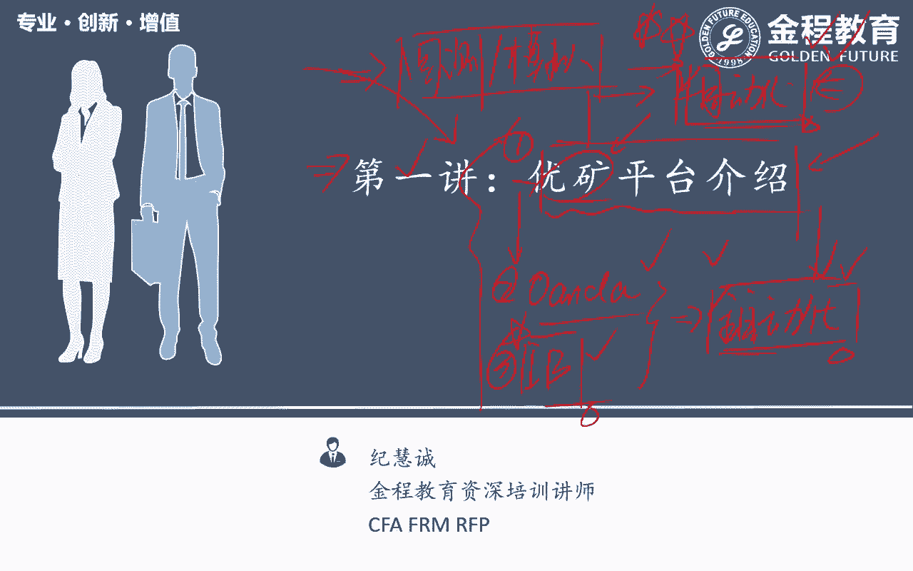

你要掌握优矿平台的话，那最好就是听我们这个课了，我们这个课里面的话呢，各种各样的包括优矿的原理啊，运行机制啊，重要的一些API我们都已经最主要的一些东西啊。

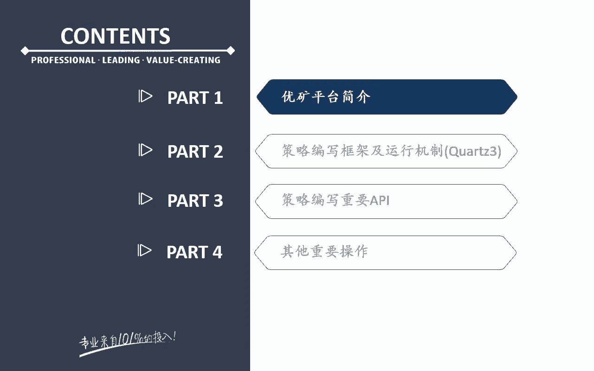

我们都已经给大家梳理好了，所以呢呃用优矿平台，其实呃，我们的这个课是最最好的一个学习资料啊，啊到时候可以嘿嘿给油矿谈一下，我们可以把我们的这个课，作为他们的一个官方的这个宣传。

官方的这个平台的那个使用啊，所以优化他们可能开发做的还可以啊，真的培训真的是一塌糊涂好。

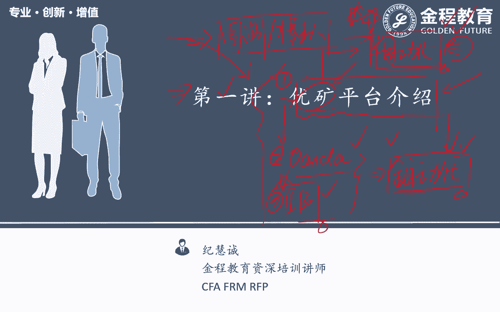

那么我们其他就不多说了，来看我们这里的优矿平台好，那么优矿平台的话呢，它是这个网址啊，大家在google百度里面搜一下优矿就出来了，那么优酷平台的话呢，它目前是两个写法都支持啊，一个是它这里的cos2。

一个是这里的cos3，那么二的话呢是它的一个老版本的，一个回测框架，现在目前全它呃，最近刚的刚更新啊，一个框词呃，三的这样一个框架，那么我们的课程的话呢，都是基于的是最新的这个框，是三的这个啊。

那么呃咳咳这个是框四三，我们会给大家去讲的一个写法，那么我这个人都是喜欢用比较新的一个东西啊，就是在我们的这个课程刚推出来的时候，其实python2。7和python3还是有争议啊。

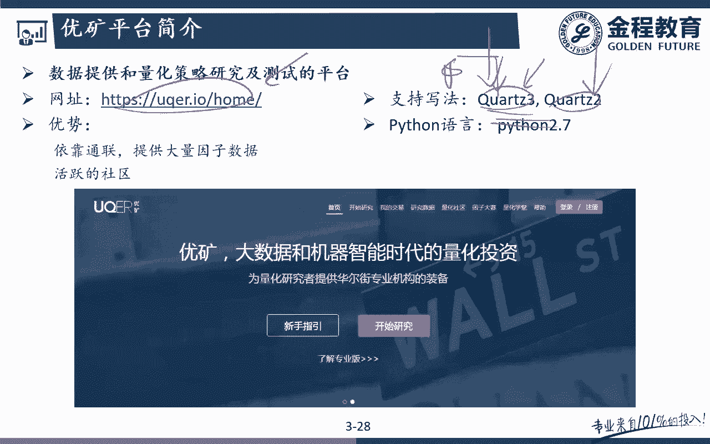

因为很多人都在用2。7，所以我们也在想，到底我们的这个课程举的是二点，现在是三，那么我这个人就比较喜欢用新的色，所以呢我们用的是Python的三对吧，那么在我们这个里面也是一样，有老的，有新的。

那肯定新的更好咯，那么我们也用的是新的，听明白意思吧，哎那么但是呢老的这种东西啊，你新的掌握的话呢，老的这些东西啊都一样啊，那你有这个能力有这个方法可以去看了，可以去看懂它好。

那么我们来带着大家来看一下啊，这个就是我们的这个嗯呃优矿的这个官方啊，官方的这个网址，那么我们来看一下啊，他的一个首页，他的一个首页的话呢就是这样子的一个首页，大家可以注册一下啊。

那么呃咳咳注册了之后的话呢，大家可以拿到这样的就可以进入了对吧，进入了这个框架之后的话，大概就长这样子的一个界面啊，那么呃在这个里面最重要的一个就是呃，这个里面的开始研究呃，开始研究里面呢。

这个其实他就是把我们的jupiter notebook，里面的这个notebook它放在云上了，那么相当于是我们在网上就可以看到这个book啊，notebook它其实就把Python的那个内核啊。

就放在这个里面了，所以呢从本质上来说，优矿的这个notebook跟我们自己在使用的那个，咳咳咳，直接CMD里面出来的我们本地的那个notebook啊，其实是一样的，只不过它是放在云端问题吧。

那么在这个里面的话呢，你就可以自己在这个里面去写，自己的一些算法了，好，那么在这个就是呃，我开始研究的这样一个啊地方啊，那么在这个里面的话呢，大家会发现啊，我们刚拿过来的话呢。

大家的免费的那个内存只有一个G啊，免费的内存只有一个G，那么你可以升级成它的一个专业版啊，没意思呃，我们的课呢也不需要有去用到，专业版的一个东西，专业版的话呢非常贵啊，一个一年大概2万块钱。

但是的话呢如果呃你可以申请试用试用，到期的话呢大概是一个月，大家可以去申请试用一下啊，那么可以体验一下专业版的内存更大，专业版我记得好像是8G的内存吧，然后的话呢，它有一些更多的一些数据可以供我们选择。

但是呃没太多的一个必要，除非我们是真的做的特别特别的，我们对数据的质量各方面的一个要求特别高，那么你可以去选择专业版，那么在我们课上的话呢，呃他的一个基本版啊就已经够用了，那么可能有一个问题。

就是它的内存实在是太小了，只有一个G，所以呢当我们回测期间稍微长一点，比如说我想回测个3年，5年的话呢，你一个G的内存可能就是不够的，听明白意思吧，那么这个时候怎么办呢，你可以去呃。

大家只要注册了之后啊，你用一个新账号注册了之后呃，呃它可以用积分去兑换三个G，也就是说可以去兑换两个G的一个内存，所以呢大家来说的话呢，呃其实没有没一个太大的关系啊，大家就可以拿到差不多。

三个G的这样一个容量问题吧，那么基本上呃两个G也够用啊，三个G到两个G之间也都是够用了，那么呃三个G的话，那基本上你跑个3年五年啊，基本上都没问题了，额，那么但是呢你这个三个G。

它只能给你一个月的使用时间对吧，那你这个一个月到了之后怎么办呢，你换个邮箱呗，再重新注册一下对吧，哎那么对我来说的话呢，这就只能是变通的一种解决方案了，那么如果你真的就就觉得这个内存特别对。

你特别这个重要啊，你可以去直接问他们买这个内存，好像一年也就几百块钱吧，五六百块钱可能，所以呢这还是呃这还可以啊，能接受啊，啊注意啊，我们跟他们没有任何的呃这种联合作啊，我不是跟他们去推广这个哈产品啊。

这个我你看大大家可以看到我这里的内存的，就是1G的容量对吧，可能跑着跑着会崩掉啊，但是的话呢绝大多数策略，至少在我们课上的那些策略啊已经够用了，但是大家注册完油矿之后，可以先用你的积分去兑换一下。

在好像就是在这个个人设置里面，大家自己看一下啊，积分兑换啊，就在这里用积分兑换更大的一个内存。

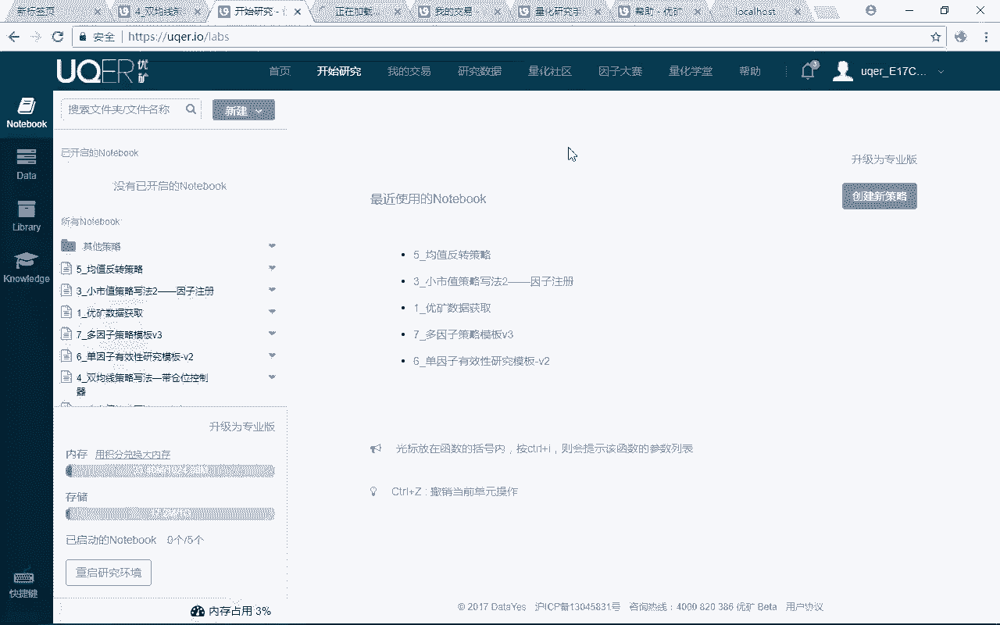

但是我已经兑换过了，我已经用过了哈哈，所以这个我就我只有三个积分了。

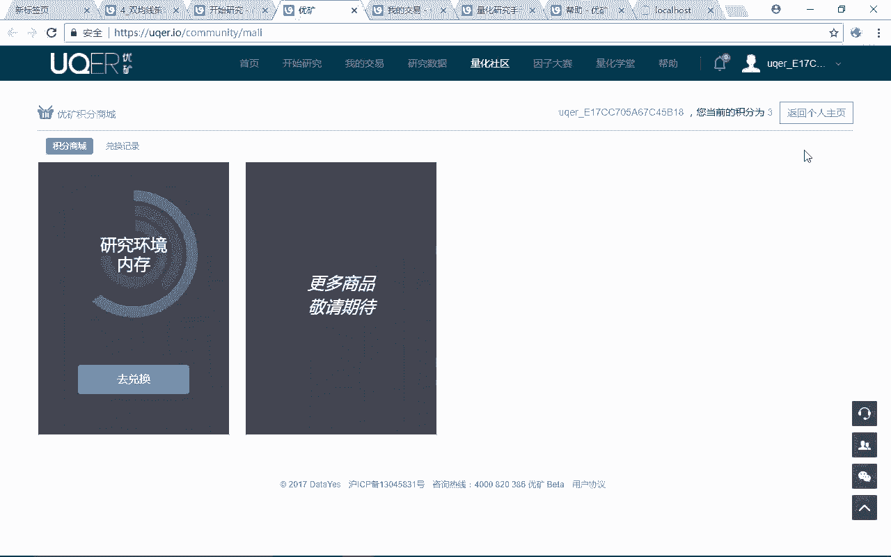

所以我没办法了啊，这个大家应该都注册了之后，你把资料填一填，会送大家几百积分呃，三个G可以用一个月，至少可能至少可以用了啊，那自己接着的话呢，呃我们还要不要重新买，那你可以用新的邮箱注册对吧。

这个我们就不说了啊，好那么这个是我们的这个主体的一个研究框架，在这个里面，我们是呃在我们课上会跟大家讲的这些策略啊，你看我们为大家又准备了很多策略，对吧好，那么但是呢优框里面这些策略的实现思想啊。

都是我们面向对象的一个思想，这也是为什么我们之前要跟大家讲，面向对象的一个原因好，那么后面的话呢大家可以来看到啊，额在这个里面有一个我的交易，我的交易这个东西是干嘛的呢，就是比如说啊我写好了一个策略。

比如说这个均值反产策略写完了之后，我觉得真的很牛逼，太好用了，我可以赚很多钱。

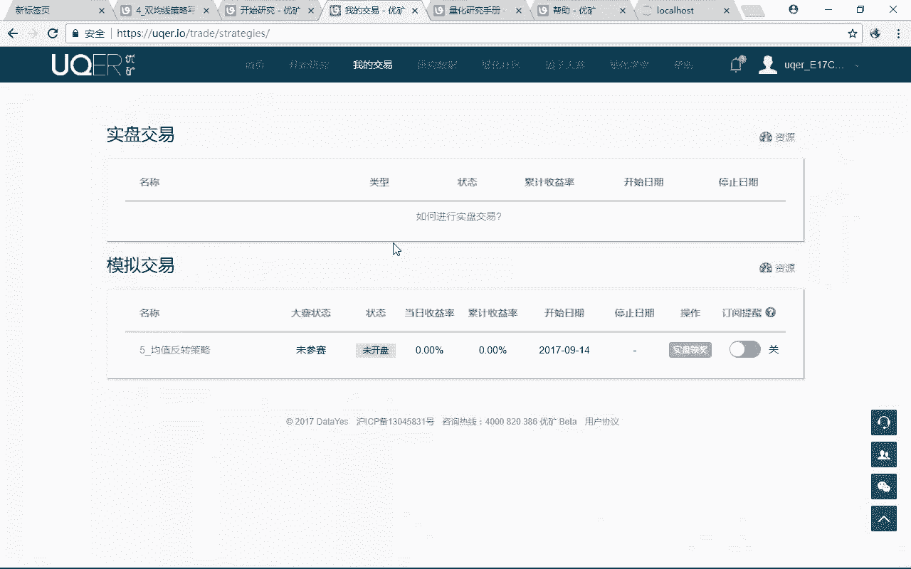

那这个时候怎么办呢，注意啊，我们随便来跟大家举一个例子，在这个里面呃，真的能赚钱，你可以选择这里的开始交易，听明白是吧，哎开始交易之后呢，你就选这个模拟交易。

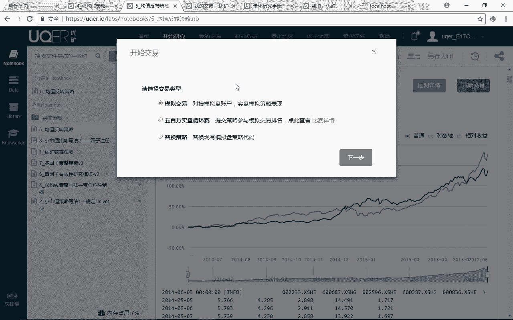

选模拟交易，你就下一步啊，我这里就不点了，模拟交易之后的话呢，它就会在这个里面就出来了，就会有一个这里的这个模拟交易，好模拟交易之后。

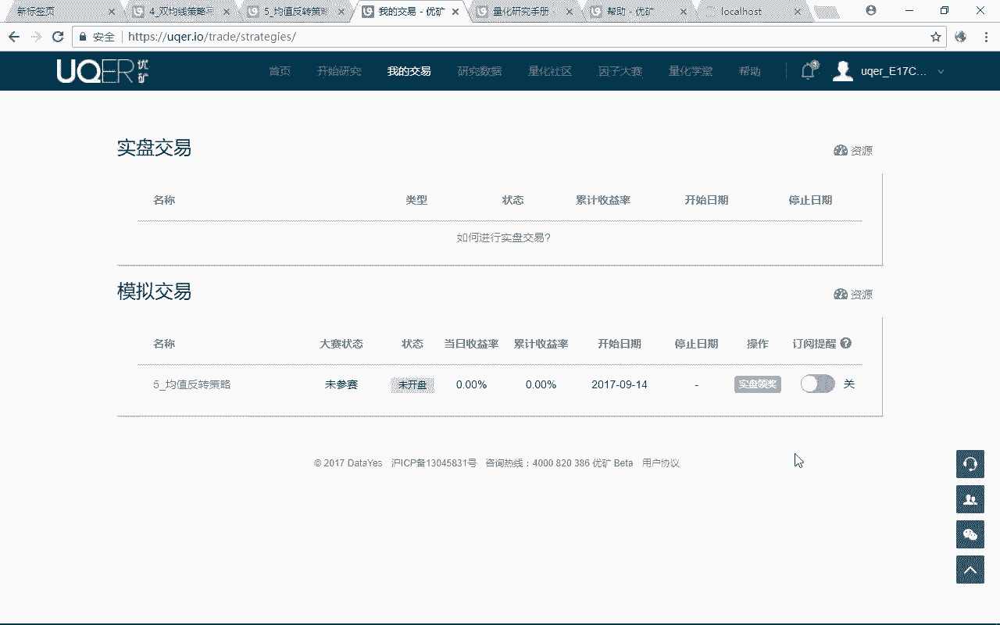

大家在这里啊可以定一个把这里开一下，开一个订阅提醒，这个订阅提醒你扫一下，也就是说这个就是实现了我们之前跟大家讲的，只啊我这个策略可以在云端自己后台自己跑着，完了之后的话呢。

等额等我们这个策略发出一些呃买卖信号，交易信号的时候，你的这个微信啊。

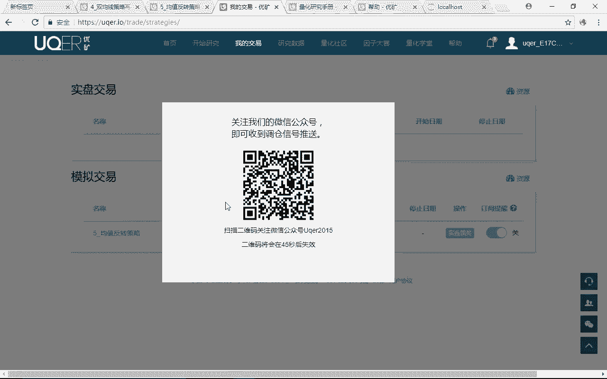

那你就可以收到他的一个，买卖信号的一个提示了，那么就是呃说到这个提示之后，你真的要根据这个策略来做的话呢，你就自己可以啊手动去下单了，能理解意思吧，哎所以对板说这没办法，我们就只能通过这种相对来说。

半自动化的一种手段啊去进行下单，所以呢这个功能也是比较不错的啊，大家可以自己看一下，那么后面的话呢在量化研究手册，注意啊，这个帮助里面有一个量化研究手册，量化研究手册里面是我们的一个它的一个呃。

优矿平台的一个API的一个完整介绍，那么这个介绍里面呢有各种各样的合约，有构建完的东西的一个介绍啊，那么在我们这里面，主要用的是他的这个股票API策略啊，所以对我们来说，这一块这一部分的内容。

可能是我们最重要的去看的一个参照的内容，但是呢他这个里面写的又很乱啊，这个优矿里面写的东西啊，真的培训跟投资者教育和写法，真的写的一塌糊涂啊，那么我们就照着我们的PPT来跟大家讲，我们PPT项目都是。

以及和大家梳理好了一个结果了。

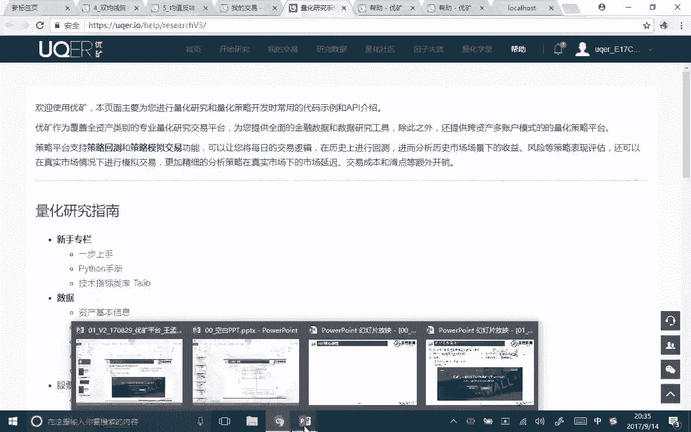

没听吧，好呃，后面的话呢呃最后呃还有一个量化社区，量化社区呢我们要跟大家讲一下啊，你看在这个里面，社区里面有很多各种各样的这种帖子啊，这种帖子的话呢我们直接就可以克隆，比如说啊我看到这个策略诶。

这个策略的这个思想我感觉还不错，对不对，哎那么我也想啊用这个策略来跑一下，那么这个其实就很简单了，在这我们这个里面你只要克隆一下这个notebook，完了之后呢，在这个里面点击这个查看的内容。

克隆完了之后，我们就会发现技术分析入门，那这个策略我们就克隆进来了，在我们这个里面就已经有了问题吧，那么大家就可以呃听完我们的这个课啊，基础的这些API的这些用法掌握了之后。

你就可以自己到他的这个社区里面，去找一些比较好的一些策略，你就有能力自己去看这些这个策略了，听明白是吧，哎这也是我们为什么要去选优矿的原因之一啊，因为优矿里面的话呢，它的社区里面有非常非常多的。

已经非常成熟的一些代码，那么在我们这个里面的话呢，我们直接拿来用就可以了，克隆一下，是不是就到我的这个交易开始研究这个里面了，唉那么因为这个策略我们不要的啊，我们前面把他给删了。

我们我这个人对这个哼清爽还是比较重要，有一个比较高的一个要求的，那么在我们这个里面有非常多的一个东西啊，大家在听完我们的基础的那些介绍之后，你这个就可以花一些比较长的一些时间。

在优酷平台上看看人家写的一个策略，能看懂人家写的这种策略啊，就说明大家已经在量化的这个路上啊，已经这个这个走出非常非常大的一步了对吧，哎但是有一个问题啊，因为目前优矿正在升级换代的一个过程。

他要把他的框二就是那个二的那个框架，升级到三的那个框架，但是我们的课上基于的是三的这个框架啊，但是呃现在的话呢，社区里面还是有很多的都是用二，框架二来去写的，那么框架二的话呢。

这个其实我觉得啊一段时间之后，二慢慢都会转换成三的了，所以对我来说的话呢，呃看二的话呢，呃在这个里面，如果说大家真的要去看一个二的，一个平台的话呢，在这个里面啊，就是嗯在这里有一个框S2的这样一个。

一个股票的一个文档，那么大家可以看一下二里面的这个文档啊，二的话呢他就写的不是特别清楚啊，他的这个对象就写的特别乱，那么嗯他也他的账户之间，期货账户和股票账户之间他都是混着来的。

所以呢对我们的这个策略的最终的那个效果啊，而且他这个二里面的策略会呃，同样的一个东西在三里面一句话就能出来了，但是在二里面可能各种各样绕绕绕，所以呢在我们这个里面，我们是二跟三都看了啊，我们决定。

虽然社区里面还有大量的二的这样的一个代码，我们决定还是用最好的，更好的那个三来去跟大家讲，那么有些同学如果真的要学二的话呢，看看人家二的一个用法的话呢，你可以看这个里面就是量化研究手册。

注意量化研究手册下面的这个框子，二的这个股票文档，那么大家有能力可以自己去看懂啊，那么三的这个股票文档我们会带着大家去看，二的话呢，因为是一个淘汰掉的一个东西啊，你要看你自己来看了。

我们就不跟大家去说了，但是二确实没有三好啊，但是二里面的话呢社区里面现在还有一些东西，还有一些比较好的一些帖子，那么肯定慢慢慢三就会多的啊啊好，那么这个就是我们呃量化社区，当然还有一些比赛啊。

这些比赛无所谓啊，他这个量化学堂就别看了啊，就跟其他的平台比就写的一塌糊涂了，所以呢这个呃还是那句话，优矿可以找我们去找，做他们的那个首席的教育的，这个资料的这个提供商对吧，哎这个培训的一个提供商啊。

好，那么这个就介呃优矿的一个整体的一个框架呢，我们就介绍到这里呃，啊还有一个非常重要的一个地方，就是呃也是我们要去用优矿的，一个非常重要的一个原因，他在这个里面研究数据，大家可以看到啊。

它这个数据里面有股票的日行情数据，它有各种各样的接口，看到没有股票的基本数据，财务数据，现金流数据，它包括它的行情数据呃，有天的分钟的啊，甚至还有tick数据，而且呢都是可以免费拿来的，听明白意思吧。

哎包括债券基金，港股OTC，其他的一些数据啊，在优化上面都有，唉，简直太好了，而且是都是免费的啊，这是哈因为优矿背靠通联数据啊，这也是我们最初刚开始以呃，这个我们商量了很久。

最终还是决定用优化的一个原因，就在于它的数据，但是的话呢优化这个数据，他可能就感觉这个我的数据质量太好了对吧，原来他的数据的话呢，大呃我们后面会跟大家讲啊，我们调出来这个数据。

我们直接可以在他的平台上调完之后，p d to csv直接可以写成CSV文件，然后呢就可以保存在这里的DA这里这里的DA，这里的话呢在这个里面我们就可以直接下载，哎好像好像这个下载功能又有了A这挺好的。

这个这个它，我我原来发现他是把下载的这个功能，把它给毙掉了啊，现在这个下载的功能又有了，那么我们又可以来去跟大家去讲，哎果然又可以拿到了，我们又可以去跟大家去讲握呃这个功能了。

那你看这些都是我们从优框上掉的一个，tick数据啊，每这个你看每分钟每秒的这样一个tick数据啊，一天的tick数据可能就有好几千的，好几千行啊，那么在我们这个里面，tick数据一般来说你要去花钱去买。

或者说你有一些万得的一些东西，但是呢在优酷上没有广场，你是可以直接拿来去下载的问题吧，哎那么它又可以下了，那太好了，我们后面我们原来已经把这部分课程内容，把它给删了，呃，原来它的下载是不限量的。

但是现在的话呢它的这个下载限量了，这个每天只能下载100兆，但是绝对够用了啊，那太好了，那么我们后面在后面的这个数据的呃，获取里面我们会跟大家去讲啊，怎么把他的那个数据把它给下载下来好。

那么呃这个就是我们整个优矿的一个介绍啊。

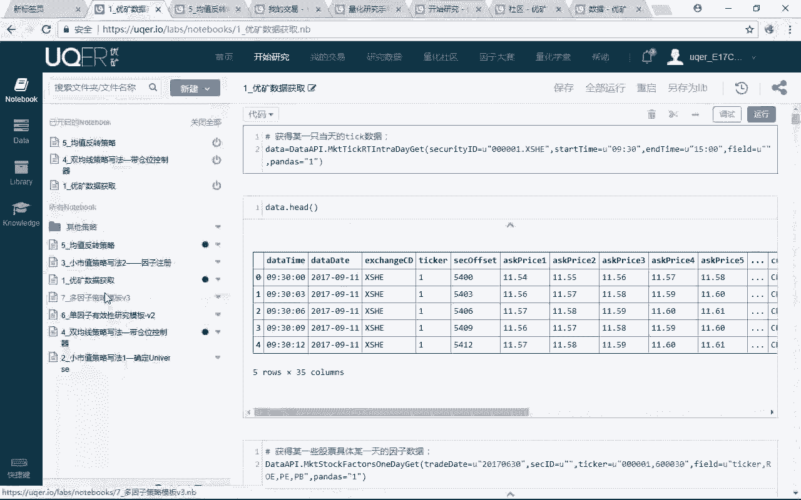

整体的一个介绍，那么还有一点要注意啊，我们原来的所有的课程里面用的语言都是python3，那么在我们这个里面的啊，优酷上他用的是python2。7啊，那么其实python2。7和python3。

没有一个太大的一个区别啊，那么简单的跟大家说几个啊，说一个最重要的一个点，注意原来在我们python3里面，我们是不是都是print要加一个括号的，唉print这东西写在这个括号里面没题吧。

那么在我们python2里面，注意我们print里面，我们直接就要把我们打印这个东西，直接paint出来就好了，就不用加这个括号了，这是第一个最重要的一个点，每天吧，第二个最重要的一个点。

注意在我们python3里面，比如说我要拿3÷1，那么它其实算出来就是0。33，没问题吧，但是呢如果说你是在python2。7的话呢，拿我这里3÷1，它算出来是什么，一是整形，三也是整形。

他直接认为我这里的算出来的那个结果，也是整形，它就等于零了，听这意思吧，哎这是我们不想要的一种结果啊，那么我要让1÷3=0。33，怎么办呢，你要用1。0听明白吧，哎1。0÷3，那么它就可以正常显示成0。

33了，因为1。0的话呢，它就不是一个整形了，它就变成一个什么哎浮点型了，那么对于我们来说啊，绝大多数我们并不涉及到python2和python3，的一个区别，那么大家先简单知道一下这两个东西啊。

不要confuse就好了，那么这个就是我们跟大家讲的这个优矿的呃，整体的一个介绍啊，好，那么接下来的话呢，我们要跟大家讲的是优矿里面的这个整个策略。

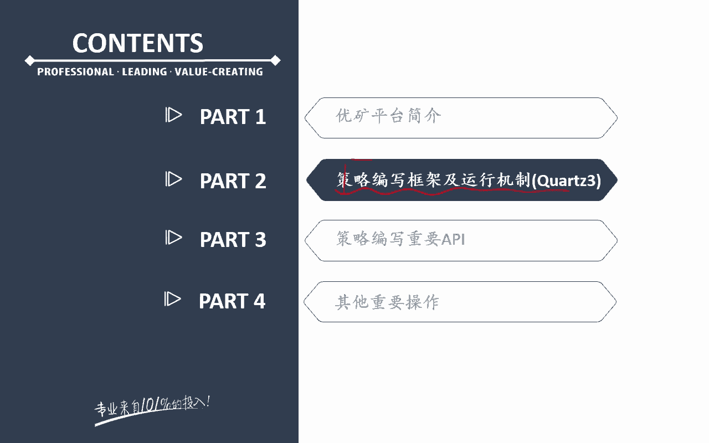

编写的这样一个机制，我们用的是这个框S3啊，来去跟大家去讲好，那么我们先来看一下啊，优矿的这个平台的话呢，它其实呃啊优矿，它这个平台其实也是一个非常核心的这样的一，个面向子的爱面向对象的一种思路方法啊。

那么我们之前呃上节之前，前两节的课程，跟大家讲过一种面向对象的一个思路，这是我这里的ONENA对吧，包括在讲电动车的时候，我们就跟大家讲过了，也就是说电动车这个类里面，我们有一个better的属性。

这个属性呢本身它就是一个类的，一个什么实例化能理解是吧，哎所以他们说我们要调用呃电动车下面的电池，这个的话，那我们就可以电动车点battery，没题吧，哎这个就这个思想。

其实就是我们这里的欧LANA的这个思想，欧LANA这个思想呢，它也有一个大的一个context的这样一个交易环境，完了之后呢，他有各种各样的属性，但是呢这个属性就是一个类的一个什么，具体的一个实例。

那么对于我们来说，我们这个里面的这个优矿啊，跟额他的一个结构，跟前面ONENA跟我们这个之前讲的那个嗯，啧这个电动车的那个啊有点类似啊，我们一起来看一下呃，先来把整个大框架先来给大家讲一下。

OLLANDER它是一个什么样的一个大框架呢，OLENA的话呢它只有一个大的context类，没听吧，好context类的话呢，它就是其实它就是它的一个策略，的一个运行环境。

那么这个contest类下面有很多，比如说它有一个order属性，order属性的话呢，它其实就是一个order类的一个实例，order类的一个什么实例，完了之后的话呢。

他还有其他的一个order类负责下单对吧，他还有一个account属性，account属性的话呢，就是account类的一个什么哎，account类的一个实例，比如说他还可能会有一个position。

那么position就是仓位，仓位的话，那它就是一个position类的一个怎么样，实力能理解意思吧，哎他还有一个吹的交易trade类的话，TRA的这个属性也是一个trade类的一个实例，所以这么说。

在我们ONEA下面，比如说我们要去调用它的一个下单的，这个对象的话，那我们是怎么下，就比如说我们是这样子的，context点怎么样，唉context点的order点什么什么什么能有意思吧，唉这样的话。

那我们就可以去进行这样的一个下单了，这是我们之前跟大家讲过的面向对象，我们把一个类的实例作做我们一个属性，听白思吧，那么我们优矿这里呢，优矿这个里面的一个框架，跟之前的这个框架有点类似啊。

但是优矿的话呢，它也有这样一个context的，大的策略的一个运行环境，听明白意思吧，好这是一个大的策略的一个运行环境，那么在这个contest下面的话呢，呃跟它相对应的，它还有另外一个大类类。

这个大的类呢就叫做stock account，因为我们用的是股票账户啊，股票，那么他在这个里面还有一个呃stock account，听明白意思吧，那么这个呃context的话呢，是一个策略的一个什么哎。

总体的一个环境，这个环境里面我们可以拿到什么，这个环境里面我们有一些属性和方法，那么这些属性和方法的话呢，呃它有这个contest啊，它有一些属性，这个属性的话呢。

比如说我可以拿到怎么样哎当天的一个行情呃，K线我的股票的一个行情，那么包括我还可以拿到一些呃，我当天的一些股票的利一些数据对吧，基本面数据也好，其各种各样的数据也好，在这个里面。

在这个contest这个属性里面，我们有这些方法，我们可以调用到它啊，额这种方法的话呢，就是contest点history这个属性和方法，我们后面会去跟大家去讲啊。

那么这个history它是一个context下面的一个方法，他就可以调到一些行情，调到一些数据没题吧，呃那么context下面的话呢，它还有一个方法，这个叫方法呢叫做get对吧。

这个方法叫做get account，注意啊，在我们这个里面，它优化的这个平台，跟我这个ONENA平台最大的一个区别，就是ONENA它是contest，是一个大环境。

所有的东西所有的都在这个大contest下面的，但是优化的话呢，它其实contest虽然是一个大环境，它还有一个account，一个大环境，account的话呢，它是一个账户，这个账户里面的话呢。

嗯它这个账户类啊是一个非常非常大的一个类，这个账户类下面呢又有很多，比如说又有什么呢，这个账户类下面有一个属性，这个属性呢就是order属性问题吧，哎这个O的属性就是用来干嘛的。

哎这个O的属性就是用来怎么哎下单的，还有一个属性的话，那就是我们下面的一个position，这个position属性就是用来干嘛，就是看我账户类门账户类里面的一些持仓的，听明白了吧。

所以优化的这个面向对象跟ONDA的一个区别，就在于它有这两个大类，那么这两个大类之间我们可以去形成交互，也就是说context类，我可以去访问到account里面的一些，下单和持仓的一个信息。

那么我们通过一个方法，这个方法呢就是我这里的get accounts方法，通过get accounts这个方法的话呢，我们就可以获得额account这个类里面的，实例化对象。

里面的一些具体的下单和持仓的一个信息，通过get cos方法的话呢，我们的一些下单信息，或者说我们的一些怎么样持仓信息，我们就可以通过这个方法，额就可以返回到我这个策略的这个，交易环境里面。

那么我这个交易环境，会根据我的账户里面的一个具体情况，我额就可以来进行一个仓位管理啊，这个购置完的一个下单的一个控制了，听明白意思吧，哎这是我们这个优矿的这样的一个呃，整体的一个框架啊。

所以他其实就是把大交易环境作为一个大的类，大的对象，账户呢作为一个大的类大的对象，完了之后呢，这两个对象之间形成一个什么，哎这样的一个相互之间的一个交互，明白是吧，哎这是我跟我这个前面跟大家讲的。

ONENA之间的一个区别，ONENA是一个大的环境，环境下面的各个方法之间，勾属性之间会有这样的一个交互，那么在我们这个里面，这是优化的，这之间的这个交互啊，所以呢我们要先把这个大逻辑结构。

跟大家先讲清楚好。

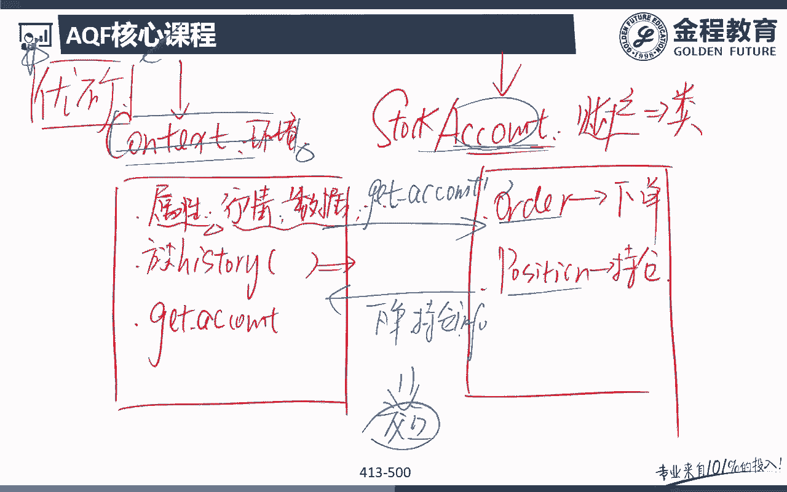

那么可能他现在还没有太大的一个感觉啊，因为毕竟我们还没有带着大家一啊，看过我们优矿下面的这些东西，看完了之后，我们再会回过头来去看呃。

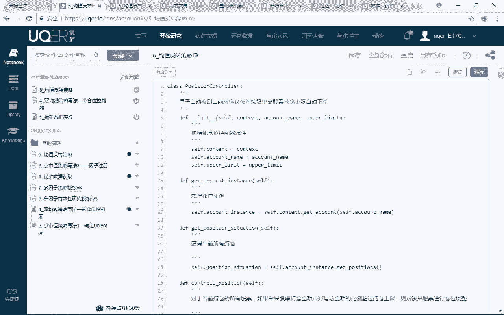

我这里空白PPT想给大家画的，那么大家就会有一个更明确的一个。

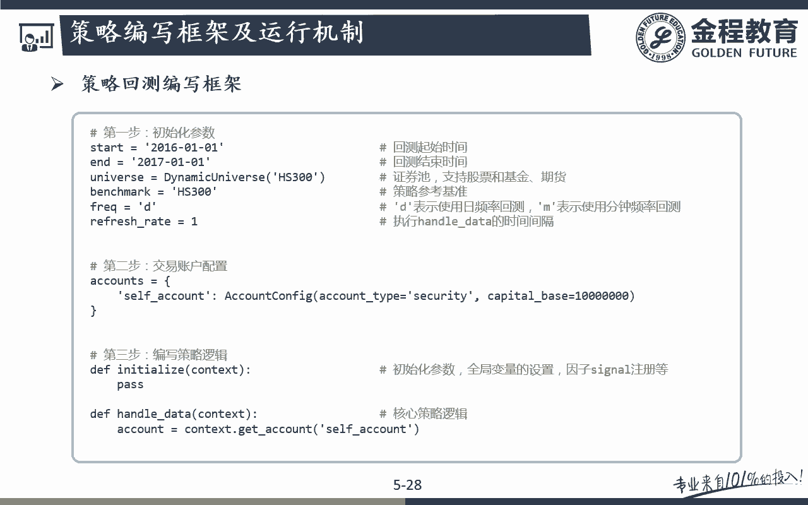

