# 2024年金融大神老师讲解量化金融分析师.AQF—量化金融专业知识与实务 - P14：《实盘交易模拟_基于优矿平台的面向对象策略》02.优矿平台回测框架介绍 - 量化沿前 - BV1oU411U7QM

好。

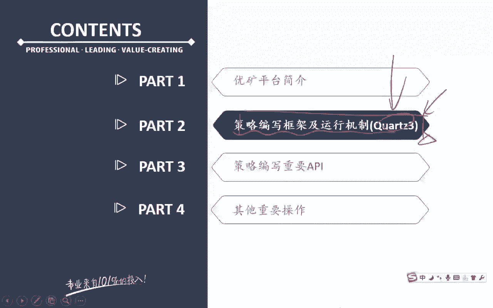

那么接下去我们来看我们整个策略编写，框架的这个运行机制啊，好那么大家可以来看到啊，这个这一页PPT是我们一个最最简单的，也是呃最典型的这样一个策略，编写的一个框架啊，那么对于我们来说的话呢。

我们把这个策略的框架分成了三各部分，第一部分和第二部分和这里的第三部分，注意任何一个策略你都逃不掉这三个部分，能理解意思吧，也就是说你可以在我们这个三个部分的基础上，增加更多的一个内容。

但是这三个部分其实是最为基础的。

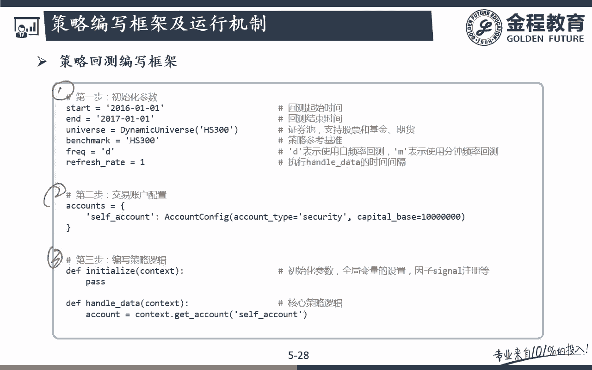

这三个主要的一个框架，这三个框架的话呢，是需要大家这个一定要有的好。

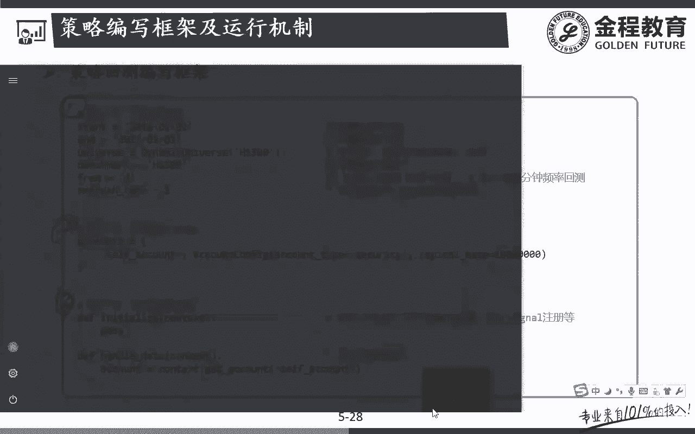

那么来分别看一下啊，第一步是在干嘛呢，第一步是在做一个初始化的一个参数，比如说我们要确定回测时间的初始的时候，回测时间的结束，然后呢我整个回测的一个universe，整个回测的一个正确值是什么。

然后呢我的benchmark是什么，我的回测的频率和我们的一个呃更新的一个呃，refresh的一个时间，那么在具体的细节啊，我们这个后面我们会分成每一个部分，我们都会一个个来去跟大家讲啊。

那么在这个里面先感觉一下第一个部分的话呢，其实就是再进行一个呃，我回测的一些参数的一些初始化没问题吧，好那么第二个部呢干嘛呢，第二个部分我们是在配置一个交易账户，也就是说我们这个配置方法的话呢，注意啊。

你看我们是通过一个大括号，这个大括号是个什么东西，哎是不是一个字典对吧好，那么在我们这个里面的话呢，我们取这个是我们的一个账户名字啊，这个呃在我们这个里面叫self f account。

你可以自己随便取啊，在那个优化里面它叫做什么fancy account对吧，呃乱七八糟无所谓啊，在这个里面你可以自己取一个我自己交易账户，这个名字你都可以自己去取的，那么这个交易账户怎么来的呢。

是通过account configure这个类啊，这个类的一个实例化对象，这个类呢进行一个实例实例化之后的话呢，它其实我们就可以拿到这样一个account，一个账户了，那么对我来说的话呢。

这个里面有一个参数啊，这个里面最简单的一个参数就是你要告诉我们，ACCOUNTYPE什么是股票账户啊，还是期货账户对吧，那么在我们这个里面，AKF主要记忆的是股票啊。

所以我们这里的默认的这个股票账户都是security cat，base的话呢，顾名思义，就是我们的一个初始的一个本金额问题吧，好那么通过这里的话呢，通过这个步骤，为什么一定要用一个字典呢，注意啊。

在我们这个里面框43Q3的一个好处，就在于它实现了账户的一个分离，也就是说我们可以去实现多账户的一个，多账户的这样一个管理和控制，比如说我一个账户专门买某一些股票，那么这个其实我在在这里。

可能可以再取一个account，怎么样，I account2，然后呢它也有一个字典，这个字典的话呢，这个这是我这个字典的名字啊，呃完了之后呢，还是通过这个account config。

这个类去进行一个怎么样实例化，那么对我们来说呃，你想去实例化几个账户都可以，十个20个30个都可以能理解意思吧，哎所以呢这是我字典这样一个意义啊，那么呃在我们绝大多数策略里面。

可能我们主要的就是一个账户，那么这跟我们的现实的呃，跟我们普通的投资者来说可能是更匹配一些的，但是如果你是机构投资者的话，可能我是多仓位，多账户的一个控制，那么在这个里面他也可以去达到你的一个要求。

问题吧，哎这是Q3所实现的一个更好的一个，多账户的这样一个管理控制啊，那么通过这个的话，那我们就可以得到什么样的一个东西呢，我们就可以得到在我们这个里面的这个，stock account这样一个账户。

这个累了能理解意思吧，哎这个类的一个实例化的一个对象，我们在这个里面我们就可以找到了，额咳咳，相当于是进行这个账户进行了这样的一个配置，配置的完成之后呢。

我们就可以生成这样一个stock account的这个类，是这意思吧，哎好，那么第三个步骤的话呢，注意啊，第三个步骤的话，我们就是要进行整个策略逻辑的一个编写，那么注意啊，在整个策略逻辑编写开始的话呢。

我们在这个里面我们首先要进行一个initialize，initialize的话呢，就是我们的一个初始化的一个函数，这个初始化函数的话呢，相当于就是说把我们这个里面，之前跟大家讲的嗯。

这个context里面的一些东西啊，就放呃，把它放进去，就是呃初始化参数就是像类似于这里的start，它这个里面呃，这只是我们定义啊，那么真正真正初始化，类似于我一个类的一个实例化的话呢。

在我们这个里面，我们是先调用了这里的initialize，这个函数问题吧，那么我们要把整个前面跟大家讲过啊，我们的这个优矿所基于的另外一个大的类，是不是就是一个contest类啊。

所以在我们这个里面的话呢，大家可以简单的理解成在这个里面，我们就是把context的这个类进行了一个，怎样实例化，完了之后的话呢，Handle data，注意handle data的话呢。

在在这个里面我们也要把这个contest这个play啊，第一在这个里面只是实例化初始化的一个过程，完了之后呢，我们知道contest这个类呃，我们前面在这个PPT上是不是跟大家画过啊，在这个里面。

contest这个类可以处理行情和处理数据，所以呢在我们这个里面，我要把这个contest这个实例化之后的这个对象啊，它里面包含的数据包含着我的行情，那么传给我这里的呃，Handle data。

handle data这个函数的话呢，它在这个里面，其实就是我们整个呃策略的一个逻辑，就是就是在我这个handle data里面去进行编写的，我要买什么股票，卖什么股票，我要按照什么策略去写。

也就是策略的编写逻辑，主要是在这个handle data这个里面的，明白是吧，那么对白来说的话呢，我们要把这个context去传给这个什么handle data，这个函数。

那么在进行实际的策略的逻辑编写之前的话呢，我们先要通过context点get account这个方法，先从怎么样哎先获得一个account的一个实例，哎这个获得account实例，所以大家会发现啊。

为什么我们一定先要讲面向对象对吧，不然的话我们直接来去跟大家讲这个呃啊有矿，你可能就肯定就看不懂了对吧，唉获得count实力，怎么去获得这个count实例呢，就是通过这个get count方法。

就是在我们前面跟大家画的这张图，大家会发现在我们这个contact s的这个环境下面，我们会有这样一个方法，这个方法就是get count，get count的话呢。

他就跟我这个里面的stock account，这个类会进行一个交互，完了之后的话呢，返回出来的是一个持仓下单的，这样的一个什么account，一个类，不能说account类啊。

是account一个什么实例，哎，那么在这个时候这个account里面到底有多少单子，我持有了哪些股票。

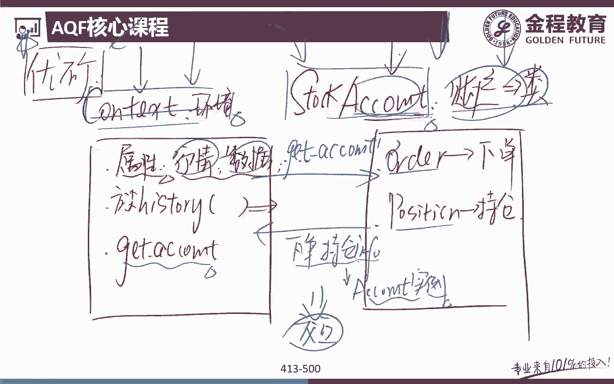

我们就在这个contest里面我们就可以拿到了，能理解意思吧，哎是通过这个get account方法，获得了account的一个实例，这个account是从哪来的呢，这个account就是在这呃。

咱们在这个里面的这个self account，就是这个呃account config这个类去生成的一个额，有点像他的一个子类吧，但是对我们来说的话呢，呃我们要真真正正的拿数据来进行一个，处理的话呢。

注意啊，在我们这个里面，我们要通过get on的方法去获得这个呃。

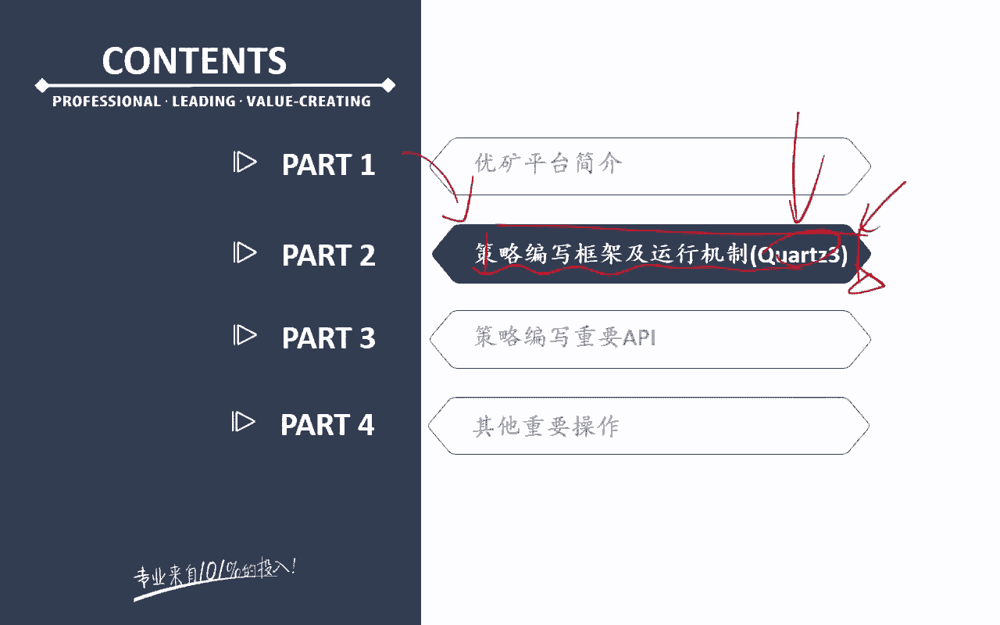

当前的account类的一个实例，那么这个实例里面，我们就已经包含了这个account，里面的一些持仓情况啊，下单情况好，那么先简单跟大家介绍一下，我们后面会一个一个来去跟大家说啊。

所以呢大致的一个逻辑框架就是这样一个框架，没问题吧，好，那么接下去的话呢，我们一步步来跟大家详细去讲，里面的一个参数啊，那么在讲这个详细的每个部分之前呢。

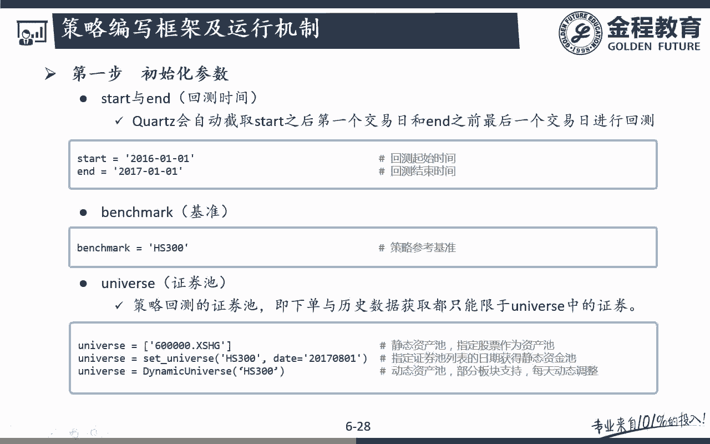

我们先带着大家实际的感觉一下啊，感觉完了之后就可以更好了，你看在我们这个里面，第一个部分就是这里的这个怎么样，参数的一个初始化对吧，完了之后呢，第二个部分干嘛，是不是进行一个账户的这样的一个配置啊对吧。

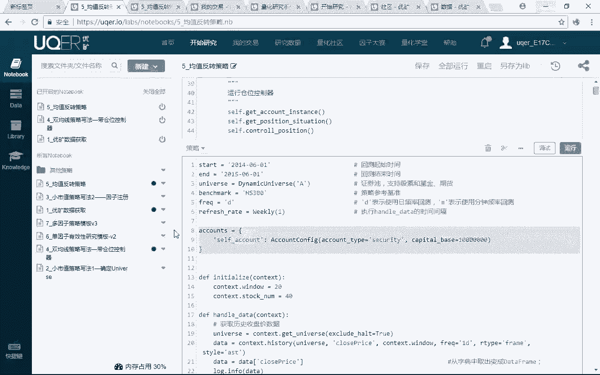

第三个部分的话呢，刚开始就是一个什么initialize，完了之后的话呢，后面就是一个什么嗯，我们那个handle data，数据的整个策略逻辑的一个处理编写，是不是都是写在这里啦，问题吧。

那么所有的逻辑啊都是一样的，你看在这个里面首先是怎么样呃，信息的一些初始化完了之后呢，账户的一个配置，第三个initialize，第四个handle data，我们整个策略的逻辑。

是不是都是在handle data里面的对吧，哎所以呢我们就结合这个实例，实际的这个例子来去跟大家去讲这个框架啊，大家可能就会更好的去理解一些好，那么我们先来看第一个部分，第一个部分的话呢。

我们是跟大家讲的是，初始化我们这样一个参数好，那么初始化这个参数里面啊，我们简单前面已经简单跟大家看过啊，但是呃重点现在一个个来带着大家看，首先第一个start start很简单。

就是我策略的一个起始期间，and的话呢，就是我这个策略回溯的结束期间问题吧，那么在我们这个里面，我们这个策略的回呃，开始期就是从1月1号开始，到2017年的1月1号，正好一年问题吧。

好那么这个时候的话呢，我们可以确定我们这里的benchmark，benchmark是什么呢，在我们这个里面你可以订各种各样的，你都可以去定啊，比如说我可以去具体的某一只股票对吧。

那么在我们这个里面我们可以确定的是呃，比如说胡神300，这个benchmark的概念很好理解啊，不多说了，好重点来看这个universe，这个universe是有很多很多文章来去可以做的啊。

如果说用好这个universe的话呢，可以使得我们的一些策略啊可以事半功倍，那么这个universe是什么呢，就相当于是我们这个里面，我们整个策略可以投资的一个总的一个资产池，能理解意思吧。

好那么我们可以来看一下，也就是说是策略回测系统，一个资产值及下单与历史数据获取，都只能限于universe当中的一个证券，好，那这个很简单啊，假如说啊，如果说我们这个里面我们是想要全A股的。

全市场的股票，我们都可以买，那么这个时候我们是可以设置的，有点VER很简单，你就可以设置一个全A股的，这个AA是优框里面已经自定自己设置好的啊，如果说你给到他一个A的话呢，他就知道我所有的呃A股。

全A股的一个投资策略，我们都可以，全A股里面的股票都可以，是我们策略一个标的对象，听满意思吧，但是对马来说，有些时候啊，我们的策略可能并不想，把所有的全A股的股票都买。

比如说我们的这个universe可能就只有一只股票，或者说可能就只限于某一些行业的股票，或者说一篮子的一个股票，听明白意思吧，哎这是不是完全有可能的对吧，哎还有一种情况的话呢。

呃我们这个呃XF的universe，我们还可以设置成什么呢，set univers沪深300，那么我还可以把我这个里面呃，我们的一个投资范围局限在哪里啊，唉局限在我的沪深300这些股票里面。

听明白意思吧，哎也就是说我只买沪深三零里面的股票，呃，我沪深300以外的股票我就不买了，听这意思吧，哎这是不是也很make sense啊，因为沪深300的股票里面，比如说都是一些盘子比较大的。

流动性比较好的股票，所以呢我觉得当我们盘子这个比较大的时候，我们就可以流动性，是我们这个策略比较重要的一个考虑，预算的时候呢，我们就可以把我们这个里面的这个额，限制在我们这个里面的沪深300部分。

听明白吧，好那么呃后面的话呢呃我们来看，因为沪深300啊，它是一个静态的一个过程，因为什么二零我们知道啊，沪深300每年是不是要进行REBALANCING的，我们要加入一些新的股票，剔除一些老呃。

不再满足我，沪深300这个指数要求的一些股票，能理解意思吧，所以呢端板来说你一定要明确，如果是静态的话，那我们可以去明确一下呃，呃我具体是要哪一年哪一个时间点上的，这个胡子300的这个UNIVER。

听面是吧，因为很有可能2017年的沪深300，跟2016年15年一四年的沪深三零，就我里面的成分我都是不一样了，虽然都是300只股票，但是这里的300只股票跟我后面的300只股票，可能并不是一样的。

明白是吧，哎那么还有一种是思想啊，那对于我们来说的话呢，比如说我在这个里面，我可能我的回测期间有好久啊，比如说我的回测期间是2013年，到2017年，那么如果说我们的这个universe。

如果只设定在我只设定了一个沪深300的话，这种就不太好，因为我们知道2013年的沪深300，和2017年的沪深三零，包括这当中，每一年的沪深三里的成分股是不是都不一样啊。

那么在我们这个里面我们可以用一个什么呢，Dynamic universe，这个dynamic universe，注意啊，他并不知它不是说所有的指数都支持啊，有一些呃比较主流的一些函数它是支持的。

比如说沪深300特别主流对吧，沪深300这个指数，它就肯定是支持我这里的动态的universe，什么样做动态的universe，他就说了2013年的沪深3200，我就给你用的是2013的年的沪深300。

撤300只股票，如果说你现在回撤期进入到了2014年，那么这个时候你的UNIVER，我就自动帮你调整到了动态的，调整到了2014年的这300只股票，那么15年一六年一七年也是一样，明白意思吧。

哎所以对我们来说的话呢，更好的我们可以用这里的dynamic universe，因为dynamic universe的话呢，它其实啊当然也不一定是好坏啊，那其实你要看我要跟实际情况，更接近一些的话呢。

可以用我这里的dnamic universe问题吧，哎因为如果我们只用这个静态的啊，那么可能你今年是沪深300里面的股票额，过几年就可能就不是了，问题吧，哎好那么接下去这两个策略，接下去这两个呃指数。

指数指标的话呢也是非常重要的，一个叫做frank，还有一个呢叫做refresh date，注意啊，这两个东西共同决定了我回测时间，这两个东西啊，共同决定了我的回测频率和调仓频率好，那么先来看一下。

注意frequency这个frequency啊，这个呃参数的话呢，它其实就两个，一个是D，一个是N，D代表是每日运行，也就是说它的是一个daily的一个策略，它是一个它并不是一个日内的啊。

它是一个DA累的一个策略，那么如果说我是M的话呢，注意啊M的话呢，它其实就是这样的一个分钟级别的，一个怎么样策略，所以段位马来说的话呢，D代表着我们可能更常用的，用的更多的。

每天的日线级别的这样的一个策略的一个频率，那么M的话呢代表的就是我们的一个更高频的，这样的分钟级别的，这样子的一个灰色的一个频率，没问题吧，哎好那么对于我们来说的话呢，呃主要AKF啊。

因为为了更契合实际啊，在股票里面其实你没办法做T加零啊，所以理论上来说，分钟级别的这个frequency，MM并没有一个太大的一个实际的一个作用啊，但是你为了去研究处理的话呢，当然这是完全可以的。

没问题吧，哎那么在我们这个里面，主要是跟大家去讲的这个日线问题吧，哎daily，所以frequency在我们的AKF课上出现的，都是daily的这一块啊，那么refresh rate指的是什么意思呢。

指的就是我多久去回测一下这一个时间，我多久去回测一下整个策略的一个框架，也就是说如果是五的话，代表什么意思啊，我这个策略多久去运行一次啊，哎五天去运行一次，听明白意思吧，因为你是day，我是天马。

同时你这里的refresh rate是不是又是五啊，所以呢对我们来说的话呢，它其实代表着这个意思，代表着每五个交易日去运行一遍，怎么样策略算法，那么运行一遍策略算法，这个策略算法运行的就是我这里的什么。

handle data这个函数里面的一个东西，就是我前面给大家讲的，在这一块，第三个部分我是五天运行一次，那么初始化这一块呢，其实就是刚开始的时候，包括我这里的initial lies。

就是刚开始只运行一次的，听明白吧，哎但是呢handle data这个里面它其实是一个循环，这个循环多久去运行一次呢，就是从我这里的frequency，和我这里的refresh date所决定的。

听明白意思吧，来那么除了有这种最常见的写法以外呢，下面这种写法也非常常见啊，因为我可能并不想说，我五六天去呃，重新去计算跑一次策略算法，我可能是什么，你看我这个里面我是day呃。

frequency是day，完了之后的话呢，在这个里面refresh rate的话呢，在我们这个里面weekly1weekly1代表视频三，哎注意是我每周的第一个交易日，我去运行一遍，那么这样的话呢。

这两个其实我们就可以生成怎么样一个情况，唉，我每我的回测频率是天，但是的话呢我是每周的第一个交易日，我去进行一个回测，没听吧，那么同样的一个写法，我们还可以写成什么呢。

weekly就是在这里weekly-1代表什么意思啊，每周的最后一个交易日我去运行，我的答案是吧，策略的算法听明白意思吧，那么我们除了可以每周去运行以外，每天去运行。

如果我refresh date等于一的话，那就很简单，我每天都跑一次这个策略对吧，哎那么这个里面还有一个叫做monster1，monthly1的话呢，其实就是一些额频率比较低的一些策略啊。

我就每周额每个月去运行一次，听明白意思吧，那么你完全也可以自己去设定啊，比如说，十天运行一次等等等等，通过我这里的frequency的一个控制。

在包括我这里的refresh date就可rate就可以了，问题吧好，那么接下来的话呢我们简单来看一下啊，这个里面的分钟策略，分钟策略的话呢，你要注意在我们这个里面frequency这里面。

我们控制的这个关键词，这个参数就是M代表的是我们是minute分钟级，那么分中级的话呢，在我们这个里面，我refresh rate里面它又比较就注意啊，是两个，一个是什么，第一个一指的是每天运行。

也就是说你在这个里面，你可以控制几天运行一下，我这里的分钟策略完成呢，第二个它代表的是什么，哎到底是几分钟运行一次对吧，它指的第二个一指的是怎么每分钟的一个运行，听明白意思吧。

哎那么这个分钟级别的这个策略的话呢，大家可以呃参考呃，如果大家感兴趣啊，想要去后面去研究一些官方呃，高频的一些策略的话，那大家可以在呃去看他的一个官方的这个文档，问题吧，好那么在我们AKF课程啊。

主要我们用的都是这上面这两个问题吧，好那么后面还有一个叫做max history window，额这个东西用的不太多啊，简单了解一下，这是用来干嘛的呢，比如说啊我的回测期间。

前面的那个回测开始日是多少啊，是2016年怎么样，1月1号开始问题吧，好那么如果说你再从这一天开始进行回测，比如说这一天我们开始进行回测了，但是的话呢我们在回测的时候。

我们是不是可能要用到16年1月1号之前的，一些历史数据啊，如果说你用十天，20天，30天的历史数据，OK都可以的，我们这个策略里面默认都是可以获得的，但是呢如果说你这个策略，从2016年1月1号开始。

我默认的你可以追溯到的历史数据只有几天呢，最多是100天，明白意思吧，也就是说我2016年1月1号，最多我可以拿到前100开始回测的话。

如果我们没有明确去声明这个maximum history window的话，我们最多就可以拿到前100天的这样一个数据，但是如果说我在2016年1月1号开始，我要拿更远的一些历史数据。

比如说我要算一个年限，或者我说我要算一个半年限的话呢，我们可能就要怎么样，100天的数据是不是就不够了，对吧，哎所以呢对我们来说的话，那我们就要用在这个里面，maximum history呃。

window这个参数去控制150，代表着我虽然在2016年1月1号，我可以往前再早拿到什么，哎前更早的前150天听明意思吧，哎当然在这个里面你可以自己去设置啊，如果说你要拿到前一年的前两年的。

都可以通过这个麦克森，这个history window这个参数去控制，那么你要哪几天你自己去写一下就好了，没题吧，好那么这是我们的这里的第一步啊，第一步就是我们整个策略的一个参数，的一个初始化。

那么我们前面已经跟大家讲的，相对来说比较清楚了啊，好那么接下去再来看第二个步骤，第二个步骤的话呢，就是我们交易账户的一个配置啊，这个交易账户的一个配置的话，那么用的是字典，前面已经跟大家讲过了啊。

赋值给的是，那么这个里面的什么accounts，那么这个accounts的话呢，注意它其实在这个里面，它是通过一个字典名字啊，也就是在这个里面这个是我们的一个账户名，注意这个账户名的话呢。

你自己是可以自己随便去定义的啊，呃你不一定要照着我们这里的叫什么self account，你可以，whatever你这个可以放飞自己对吧，你想叫什么名字都可以啊，那么后面的话呢就是这个账户的。

我初始化的一些什么唉属性呃，那就是这个value的话呢，就是它的一个account config类，生成的一个账户的一个呃实例，具体的一个属性好，我们一起来看一下啊。

那么这个里面capital base这个不说了，就是我们的初始资金，初始基金金是10万哎，commission commission的话呢，这是我们的一个佣金啊，这也是为什么我们要推荐大家去。

用优矿的一个好处，这其实就在于说呃对我们来说，如果说我们嗯自己去写的话，你要去写这个commission啊，要写这种交易佣金啊，呃其实实现起来是非常复杂的啊，但是的话呢优化。

这里就已经帮我们自动去写好了，好那么我们可以看到啊，第一个是买的额佣金，卖的佣金对吧，买的佣金的话呢是万五，买卖的佣金呢是千一，那么不一定是跟目前的真实情况是相符的啊。

你可以自己再在这里去设置我到底是多少，那么后面的话呢slip page的话，那就是我们的一个滑点对吧，哎在这里滑点设置的是千二，还是相对来说比较去符合我们的一个呃，客观事情的啊，什么是滑点。

我们之前跟大家讲过的吧，比如说在我们这个里面我们有一个买一呃，买一的这个价格和卖一的一个价格，比如说买一是九块八毛钱，卖一的话呢可能是九块八毛二好，那么呃我们最终收盘的时候。

可能收在我这里的九块八毛钱好，那么我们在策略做回测的时候，我们就会以到时候收盘价对吧，当天的close这个价九块八毛钱去买，但其实我们会发现，在真实的行情的这个过程当中啊，你花九块八毛钱不一定能买得到。

我什么时候能，我什么时候才能一定能确保我能买到这只股票，哎我必须要花九块是吧，八毛二是不是才一定能买到这支股票对吧，哎所以多麻说的话呢，这其实当中的这两分钱的这个差价。

就是我们这里的slep pitch，没题吧，哎后面这两个不是特别常用啊，用的非常少，那么也就是说这个里面的capital base肯定是要用的，那么你们的我们的这个持仓的初始资金是多少，肯定要用啊。

commission和SLIPAGE的话呢，呃正常的呃比较SD的一点的，这个也是要用到的对吧，哎但在我们这个呃演示过程啊，因为我们课程的话呢，更多的一种是思路的一个教学啊。

所以呢commission和这里的SLIPAGE的话，那我们就可以直接拿来去呃去设置，但是在我们课程上我们也用的不是特别多，那么后面这两个一个叫做position base，Potter base。

指的是我这个策略，可能呃他也是为了更好的模拟真实情况啊，可能我的股票账户里面已经有一些股票了，那么我要告诉你们这些股票的初始的这个持仓，我这只股票买了多少，这只股票怎么买了多少，问题吧。

哎那么呃在我们这个里面的话呢，就是初呃初始股票的这两个额，600000呃，和00001对吧，好那么后面的话呢有一个叫做cost space，cost space的话，那就是我初始的这只股票的。

我的初始的持仓成本，也就是当年我是多少钱买来的，是十块钱还是十块毛钱，也就这两个不太常用啊，一般来说我们在做策略回测的时候，我们都认为原来我是我这个策略是空的，就是啊没有任何的持仓的。

我是拿之前开始去回测的，一般很少有人说模拟一个真实情况，我现在股票账户里有已经有股票了，然后呢我再看看我接着这个策略去运行的话，我可能会怎么样啊，所以这两个不是特别常用呃，但是知道一下有这两个东西啊。

万一呃如果说你有这样方面的一个需求的话，知道优酷也是支持的，没对吧，哎那么后面的话呢，就是这是定义的一个仓额账户的一个参数，完了之后呢，我们就要进行一个账户的一个配置。

那么cos呢就等于我这个里面的注意啊，这个account configure，这个类就是我账户配置的一个类，那么这个类里面呢就是有一些参数，那么这个里面我在做实例化对吧，哎获得的一个账户的一个实例。

这个账户的名字叫做我这个里面的什么呃，self account没问题吧，哎那么这个还是一样，是我们的一个股票完了之后呢，capta base就等于前面定义的这10万块钱啊。

就等于我这里的commission，SLIPAGE等于SLIPAGE，Position，就等于我这里的呃position base，但是我们说了啊，这两个后面就很少用了啊，我们就不带，不再去跟大家说了。

听明白吧，哎好那注意啊，配置好账户之后，有一点一定要注意我呃，我们在进行数据处理的时候，handle data的时候，我们前面跟大家讲过啊，handle data是用来干嘛的。

handle data是用来我们整个策略逻辑的一个，编写的对吧，那么我们在编写这个策略逻辑的时候，我们之前跟大家讲过，这个策略的这个逻辑的一个编写在context下面。

我们一定要跟我这里的count这个账户，account这个类是不是要进行一个交互的对吧，哎所以呢对我们来说，怎么去跟count这个类去进行交互呢，注意啊。

在我们这个里面一定要用我这个context下面的，这个get count方法，get count方法的话，注意get的参数，什么参数就是我前面定义的这个账户名字啊，你叫self f account。

你就在这里get self account，你叫其他的whenever account，你在这里就get这个account，听明白意思吧，那么对我们来说，这样的话相当于也就是把我这个account。

目前我之前的一个持仓的一个情况给到了谁啊，我把这个持仓的情况给到了我的这个context的，这个整个交易环境完了之后的话，那我这个交易环境就可以根据，我的正账户的这个情况来去进行，一个交易的一个安排了。

听明白意思吧，所以一定要给到他这个账户啊，呃这个账户的实例，所以呢对马说这一行代码的话呢，那就继承这一个东西一定要有的啊，没有的话呢，呃你们拿什么东西来买呢，对吧。

哎所以呢这一个获得这个账户的这个实例啊，这一行代码一定是要掌握的，他其实用的就是get到contest下的这个get co的方法，那么康塔西亚它还有些什么其他的方法，我们后面都会来去跟大家讲。

大家不用着急啊，那么在这个里面的话呢，先知道一下这个相当于是获得一个账户，当前我这个做回测这个账户的一个实例问题吧，哎好那么第三步的话呢，就是跟大家讲的是我整个策略逻辑的一个，编写策略逻辑的时候。

注意啊，我首先第一个要做一个NINITIALIZE，就是要把我整个整个contest，给到我这个里面的初始化函数，那么在我们这个里面initialize里面呢，注意啊。

我们定义的是一个各种各样的一种全局变量，那么这种全局变量的话，那我们就可以在我们这个里面的INANCIALIZE，这个里面去进行一个呃定义，那么注意initialize，因为是初始化函数啊。

它只在策略的周期里面只执行几次啊，哎只执行一次，那么对我们来说，handle data呢注意啊是不是只执行一次啊，不是handle data的执行频率是由什么确定呢。

就是前面跟大家讲的一个是frequency，还有一个呢就是我们前面跟大家讲的怎么样，我的一个refresh的一个rate对吧，哎我们的一个重新的这样的一个refresh的。

这个rate到底是多久去进行呃，那么对我来说呃，比如说frequency是一般来说是day对吧，那么refraction rate呢呃我们不写了啊，比如说是一代表是这个策略。

整个我的编写的这个逻辑算法每天都执行一次，能理解意思吧，哎所以呢对我们来说，在这个里面我们也要注意啊，也要把这个context作为参数这个交易环境啊，这个交易环境的这个真实的这个对象。

作为我的参数传递给我这个里面的怎么样，handle data相当于怎么样，我这个handle data我就拿到了当前的一些account，下面的一个具体的K线情况呃。

因为这个account contest又可以去调用我的count对吧，那么完了之后呢，我的账户情况其实都可以，在我这个策略的逻辑算法里面，就可以去进行编写了，没问题吧。

唉所以的话呢呃现在再来回来看一下这里啊，你看第一步是整个参数的一个设置，第二个是账户的一个配置，第三个是initialize，呃我的整个交易环境的一个初始化，你可以在这个里面去确定一些怎么样。

唉初始的这种全局变量，明天吧，后面的话呢我们是整个交易逻辑，就在这个handle data里面去进行一个编写了，听明白意思吧，哎好那么呃这是知道一下啊，我们所有的策略都会分成这三个部分。

我们也举例子来去跟大家看了，那么接下来的话呢，我们是跟大家画了这样子的一张嗯，图这张图的话呢是我感觉啊，我们这个图是我们自己画的啊，要比那个优矿的那个要画画的好多了啊，那我们先休息一下吧。

后面再来跟大家讲啊，好那么接下去我们来看啊，这是我们自己画的一个优酷平台的一个流程啊，优矿自习有一个流程啊，但是我觉得画的一塌糊涂啊，这个这个总结各方面，这个还是要专业的人做专业的事情对吧。

好来看一下啊，呃我们整个把呃优框的一个回测框架的话呢，在这张图上就有一个非常好的一个嗯，演示了大家以后哪个东西啊，搞不太懂的时候，搞不太清楚的时候，就回到我们这张图来，我们这张图其实是非常清楚的。

完完整整的把我们整个呃策略的这个运行框架，都给大家画了啊，好一起来看一下，首先第一个部分，第一个部分就跟前面跟大家讲了，我们一个参数的一个初始化对吧，来那么第二个部分的话呢，我们参数的初始化的话。

那我们就配置了一些count实例，创建了一个context的一个实例，第二个部分的话呢，就是我们这个里面的一个initialize，NINITIALIZE里面，我们设置了一些策略的一些参数，我们还会。

如果我们呃在铀矿里面用多因子的话呢，在我们优矿里面，我们还可以去进行一个因子的一个注册，因此这个注册呢也在我们这个研究，ITIALIZE里面啊，这个什么是因子的注册啊，有点小复杂啊。

我们后面后面会去跟大家去说啊，因欧框里面的一个因子的一个注啊注册，所以其实这前面这两个的话呢，就有点像我们前面这三个，只不过我们前面把三个里面捏成了两个啊，啊把contest account放在一起。

完了之后的话呢，initialize里面就是我这个策略的一个初始好，那么在我们这个里面，我们要判断一下策略是否结束对吧，策略结束的话，那我们就可以生成一个回测报告了。

那么回测报告我们后面会带着大家去看的啊，包括补史老师的这个课程里面呃，因为bush老师所有的课，都是基于优化来去做走的啊，所以布施老师这个里面的呃，也会来去跟大家去讲右矿的这个回测报告好。

那么如果回撤没有结束的话呢，一般来说我们第一步干嘛，获取当天的一个怎么样额行情数据对吧，那么怎么去获取行情数据呢，呃在我们这个里面，我们要用的是这个里面的hello data。

我们呢把这个contest整个交易环境传给这个hello data，对吧好，那么注意了，前面里面的第一步是要干嘛，获得counter实例问题吧，就是获得我当前交易的这个账户的一个，具体的一个实例。

我这个账户里面还有多少钱，买了多少钱的股票，能理解意思吧，好完了之后呢，这些的话呢，就是运行我们的一个策略的一个逻辑，完了之后呢执行一个买卖操作，执行买卖操作的话呢。

用的就是优框里面的order这个对象啊，我们后面会去给大家讲，完了之后的话，那就是撮合你下单了对吧，通过这个order来进行下单了，下买单或者下买单，那么对嘛，说优矿他会有自己的平台一个撮合系统。

完了之后的话呢，他就会更新contest，更新account context里面的一些行情数据啊，这些数据在这个context里面会进行一些更新，完了之后呢，account里面账户里面的一些数据。

因为我们下了新的单子啊，所以呢呃呃我买了哪些股票，哪些呃这些具体的一个新的信息的话呢，也会在这个account对象里面进行一个更新，问题吧，哎这个相当于说是完成了一步啊，额接着的话呢。

呃下面一天我就拿到下一天的这个数据哎，再进行下一天的一个逻辑的一个，买卖条件的一个判断呃，在执行买卖操作，最后再更新，明白意思吧，哎这是一个非常典型的面向对象的一个思路吧，对吧，好比如说我们回测了一年。

一年做了这250次，250个交易日嘛，做完了之后呢，我们结束结束了之后呢，我们就可以生成我这里的回测报告对吧，哎所以这么说整个优矿的一个呃回测框架啊，大家就看我们这张图，这张图是最清楚的，听明白意思吧。

后面的话呢大家呃，我们会带大家去看几个策略啊，典型的策略看完之后，大家再回来看我们这张图的话呢，相对来说就可以看得更清楚了，好，那么接下来的话呢，是我们一些框架的运行时候的一些细节啊。

这些细节点的话呢也是非常重要的啊，千万不要觉得呃他嗯没什么用，那么它也是非常重要的一些点的好，我们一个个来看啊，咳咳咳，首先第一个他说那分钟频率啊，我们就不看了啊，这个我们写在这了，你可以自己看一下啊。

一般来说我们策略里面都用的是日线频率，也就是说我这个handle data去怎么去执行呢，注意啊，日线频率是非常非常重要的一个点，很多同学如果这个点没有关注到的话呢，你可能就会呃用到用数据我们就用错了。

来看一下什么时候我会执行这个handle data，执行handle data的是交易时间的对吧，开始前，也就是说此时获得的是每天的当天的一个是吧，盘前信息听明白意思吧，也就是说截止到前一天。

当天的前一天的一个行情因子数据，会不会得到当天的一个当天那个行情啊，注意啊，我们是得不到的，现在是，比如说我们在今年9月14号是一个交易日，对吧，好如果说我们的初呃开始日的话呢。

是9月14号进行开始的话，那么我们这个里面handle data，这这里面我们是拿的是哪一天的数据啊，哎我们在9月10虽然写的是9月14号开始，但是我们拿的是9月14号的一个开是吧，哎开盘前的一个数据。

那么开盘前的数据，是不是就是9月13号的收盘时候的，这个数据啊，能理解意思吧，所以呢逗号码说handle data，这个里面还需不需要注意啊，在我们优矿上。

如果我们用的是handle data这种形式的话，我们还需不需要像我们之前在策略，我们自己在编写策略的时候，我们要拿前一天的收益，我们认为呃今天的收益我们是拿不到的，或者说今天的呃价格我们是拿不到的。

所以我们要经常做的一件事情，我们是不是shift1啊，shift1指的是什么，哎往前移一个上一天，或者说我今天的这个仓位，我们需要下一天我才能呃，我今天的这个股票价格的话呢，其实我今天在盘中的时候。

我是拿不到的，也就是我收盘了之后我才能知道，那么收盘了之后，才能知道我的这个策略的一个呃，开始的一个运行，是不是要到下一天才能去执行这个策略，所以呢在我们原来的基础呃。

Python的这个策略里面经常跟大家讲了，我们要怎么样往后shift一个对吧，哎shift一个，那么这样子的话呢才可以去避免一个未来函数，那么对满来说优化的话呢，它因为我的handle data本身。

每一天拿到的就是什么盘前的这个数据，听明白意思吧，所以对我们来说，我们拿油矿再去进行处理的时候，再算收益的时候，我还需不需要像我们之前自己写纯Python的。

基于Python平台上的再去搞这种什么shift1啊，注意啊，我们就不用了，是这个意思吧，哎那么有一个时候我们要注意啊，如果说我们是不是通过context，不是通过handle data这个里面呃。

context这个history去获得的这个方法，去获得的这个交易数据啊，注注意这种交易数据的获得方法，这个我们这种方法我后面会去讲啊，这种方法的话，那就是我handle data这个里面处理的啊。

所以我们拿到的其实是9月13号的交易，开盘前的盘前那个数据啊，那如果说我们拿的是data API呢，就是我这个优矿的一个，它的一个数据的一个接口，那如果说我们是从data API里面去调的数据啊。

那么注意这个时候的话呢，我们你就要去shift one了，那么在我们Python呃，在我们Python里面，我们基本常用的是shift one对吧，但是在我们优框里面啊，他已经默认好了。

写了一个哼呃写了一个属性，这个属性的话呢在这个里面啊，就是呃context点previous data，拿到的是回测日的前一一个交易日的一个数据。

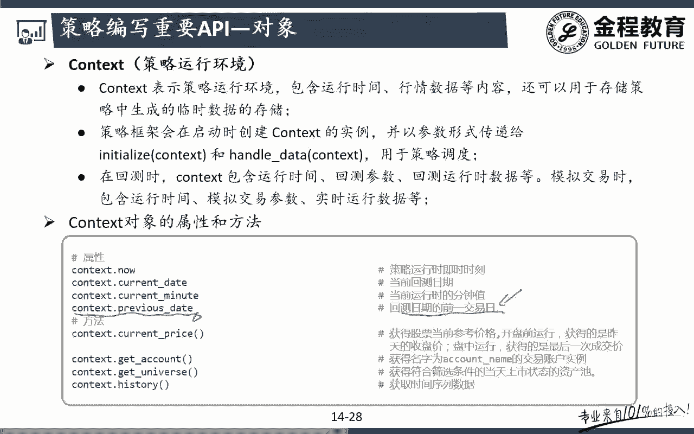

在这首歌里面我们就已经写了，所以呢注意现在可能大家还看不太懂啊，什么是context history，什么是data API，那么先有个印象啊，context history这种获得数据的方法。

已经是拿的是当天的测试的呃，盘前数据也就是拿的是上一天的收盘一个数据，所以呢我们就不用去进行，未来数据的一个调整了，那么如果说我们是拿的是数据接口，通过我优框里面的那个数据研究啊。

就是这个data API里面我们拿到的在这个里面啊，我们带大家看一下数据研究在哪啊，如果是通过这个里面的，你看data API。

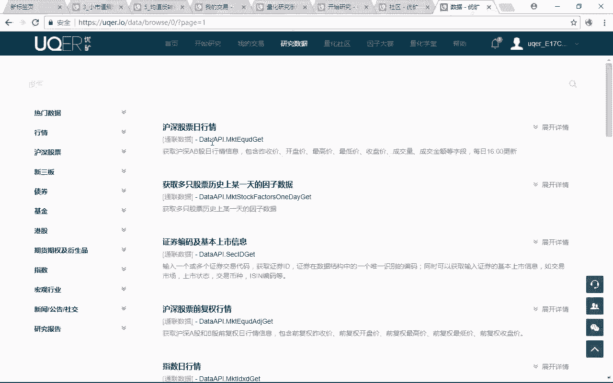

各种各样的data API里面拿到这个数据的话，注意你是要去控制的，怎么去控制呢，去我们就要拿context点previous date，去拿到上一天的一个数据啊，因为当天我们在真实交易的时候。

我是拿不到当天的那个数据的，我们只能拿到上一天的一个数据，能理解意思吧，哎好那么后面的话呢就是订单的一个撮合，订单的一个撮合，大家要注意啊，我们呃使用的是鲜麦子吧，哎先卖后买的一个原则啊。

这是跟我们的现实情况是更匹配一些的，更接近于一些现实情况，因为我先卖了之后，我是不是释放了一定的资金啊对吧，完了之后呢，我再去买我这个策略里面的一个，这些股票问题吧，哎但是呢这么去写啊，也有一个问题啊。

但是这个问题的话那就比较细节了，什么问题呢，注意啊，我这个优矿啊，他虽然已经跟我们的模拟我的这个真实情况，他已经尽可能去模拟我们的一个真实情况，但是还是会有一些呃呃小问题啦。

那么这个问题就在于说注意它在这个里面呃，我运行当天运行了之后，我们就只能得到呃，我就可以知道我要买多少股票，我要怎么样，我要卖多少股票了，能理解意思吧，好那么注意他，这个时候我采用的原则是先买什么哎。

先卖怎么先卖后买好，但是呢我们可能在实际的交易过程当中，我可能先把一些股票把它给卖了，那么要不要买呢，我可能先要等一下对吧，哎看看先卖了，就看看情况，过一段时间再去买，可能有这样一个需求，但是又注意啊。

优矿不行啊，优化的话呢呃是买单和卖单的话呢，它必须是什么卖单先执行完成了之后，他就会马上去执行我这个买单，你就不能说什么，让我再等一下，哎等一下之后我再看看我要不要买对吧，那如果你要等的话。

如果这个时候你要等的话呢，那只能等待下面下一次的这个撮合，那就是其实他就是呃跟我们的现实这个情况，还是有一点小小的一个出入的，但是我觉得这个影响还好啊，影响不是特别大，那么大家可能现在也没感觉。

因为还没看过具体的一个策略啊，看完额策略之后，大家就可能会有一个更好的一个额理解了，那么后面分钟策略啊我们就不说了，大家自己看一下好，那么后面的话呢系统的一个撮合机制。

这个撮合机制也是我们认为油矿比较好的，一个地方啊，这是也是一个优矿的一个优势啊，优因为优矿的一个优势的话，那就跟我们的一些真实情况就更相符合了，呃，但是啊如果说大家是那种比较高端的那种玩家，对吧。

是自己写平台的这种，那有你会觉得优矿里面的一些处理方法，还是不是特别严谨啊，但是的话呢对于我们绝大多数同学来说，刚刚想通过QF来去进入，量化投资的大门来说的话，我们会发现优矿虽然有存在。

各种各样这样那样的问题，但是不管怎么说，还是要比我们自己要有纯Python的那个平台，写的更符合我们这里的真实情况啊，那么为什么我们来看一下，比如说你是一个试驾单的话，那他会怎么样，他去会去。

因为如果我们是一个daily的一个交易的话，那他就会去跟当天的一个开盘价去撮合成交，那么注意他就说了，我比如说我想买1万手，我想买呃，1万1万股好了，1万手有点多啊，我想买1万股的话呢。

注意他这个里面他自己会帮助我们去控制啊，也就是说当我想买1万股的时候，他会判断一下你要买的这1万股的股票，有没有超过我当前的下一根K线的一个，什么总成交量，也就是说如果超过的话。

我们认为也就是说我虽然我想买1万股，但是下面一根K线的总的成交量只有，比如说5000股，那都或者只有6000股，那对我们来说，我最多最多是不是只能成交6000股啊，剩下的这4000股是没法成交的。

明白意思吧，那么剩下的4000股呢，我们会在下一次下一根K线来的时候，去撮合成交，所以我们会发现这种市价单的这种呃，处理方法的话呢，是不是跟我们的这个模额，真实情况可能更相符一些对吧。

哎但是呢他也没有特别的，相反，他只是说更接近于一些真实情况，但是真实情况是什么，真实情况是，比如说下一根K线的成交量只有6000股，那么我现在想下1万股，你说能不能把这6000股全都是我自己买的。

不可能啊，因为市场上大家都是竞价的对吧，也就是说全市场在这一个价格，当前这个价格的成交量就一共是6000股，那么在我们优矿这个里面，他说的什么，因为我要下1万股，所以当前时间点最大是6000股。

我认为我这里的6000股都可以成交，只有4000股没成交，但是现实生活当中呢，现实生活当中，我们有各种各样的买家去跟我去争抢，这6000股的一个成交量吧，所以可能最终我只能成成交2000股。

3000股甚至500股，是不是都可能啊，哎这就是优矿的呃，没那么精，真实的一个地方啊，但是不管怎么说啊，他已经比我们自己写的系统要好得很多很多了，你想如果我们要自己去开发这样一个回测系统。

我要把额每一根K线的一个成交量，跟我自己撮合这个单子去进行匹配的话，他这个工作量写起来，是不是相对来说就会有点复杂了对吧，而且对我们来说，优化还有一个好处，就是涨跌停的一个限制，也不用我们自己去考虑。

它都已经在我们这个优化这个平台上，已经考虑到了，什么意思啊，也就是说前面比如说我现在要下买这个股票，但是如果说我这支股票，当前当天是跌涨停或者跌停的话，跌停就是卖了，如果当天这只股票我是涨停的话。

如果我们不加以考虑，我们认为你是可以买到涨停股票，但是现实生活当中我们能不能买到，哎我们其实是买不到的对吧，哎所以呢多玛说如果我们在自己写策略的时候。

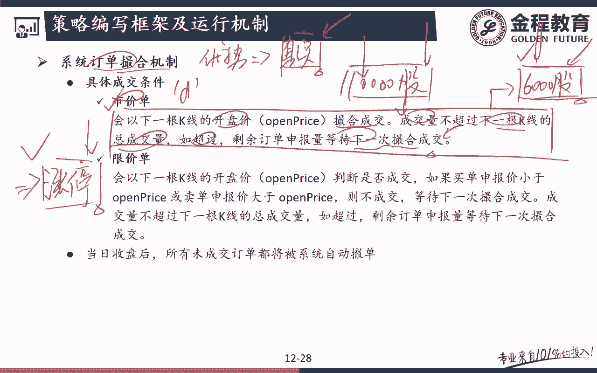

一定要考虑我涨你的涨停和跌停的情况呃，有些时候我们会发现，为什么有些人的这个策略跑出来会大幅跑赢，我这里的呃，Benchmark，就是因为比如说在这个里面，在这一天额明明这支股票涨停了对吧。

哎额我们如果你没有考虑的话，我们认为当天是买入的对吧，一般来说这个涨停的后面可能还接着好几根，好几根阳线对吧，那么我们认为这是这一天我们是买入的，但是真实情况涨停这一天我们能不能买入啊。

哎我们是买不到的，明白吧，那么跌停也是同样的道理，那么优化的一个好处就在于，我们不用再去考虑这些点了，那么相当于这个油矿的这个平台，基本上啊你能想得到的一些点，只要不是特别复杂，优矿都已经帮你写好了。

想好了，那么这是铀矿的一个比较吸引我们的一个地方，问题吧，哎好那么讲到这里的话，那我们主要是把整个优矿平台的一个运行机制，大致跟大家介绍了一下，可能大家还有点懵，呃懵懂啊，因为呃具体还是没接触过策略。

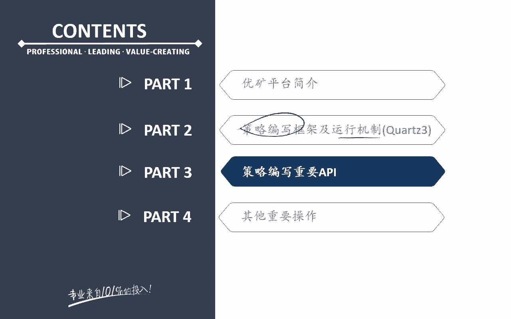

包括呃这个策略这个优化的一些重要的API，我们也没跟大家介绍，那么后面的话呢我们会一个一个优矿，最重要的几个API在我们这个里面都会做。

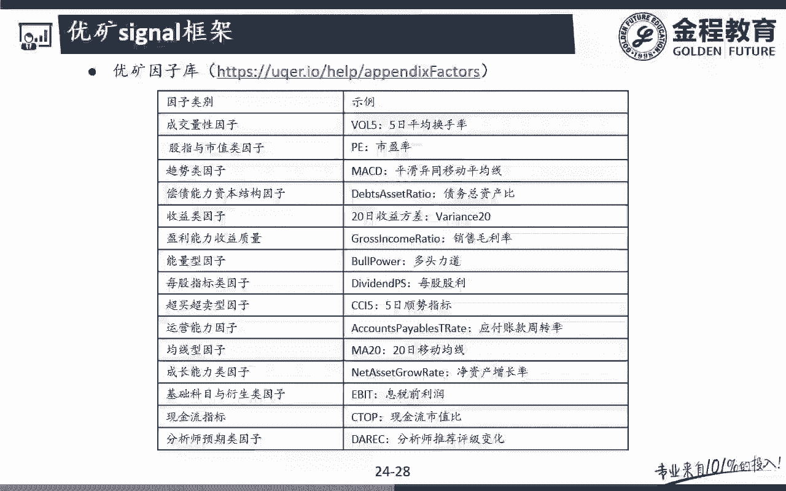

跟大家去介绍啊，而且我们都已经跟大家分类汇总写好了。

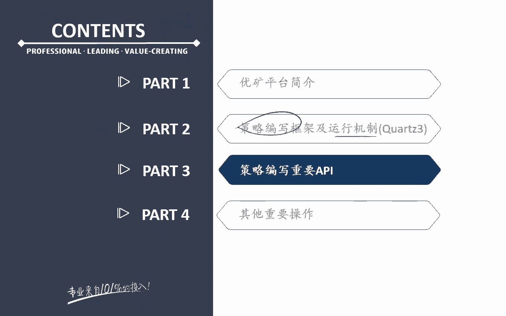

