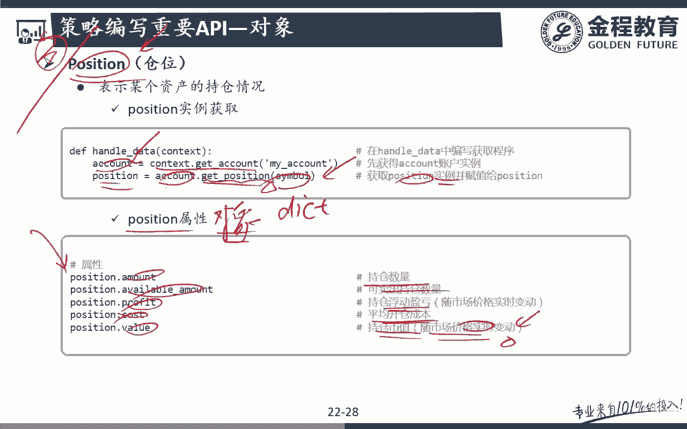
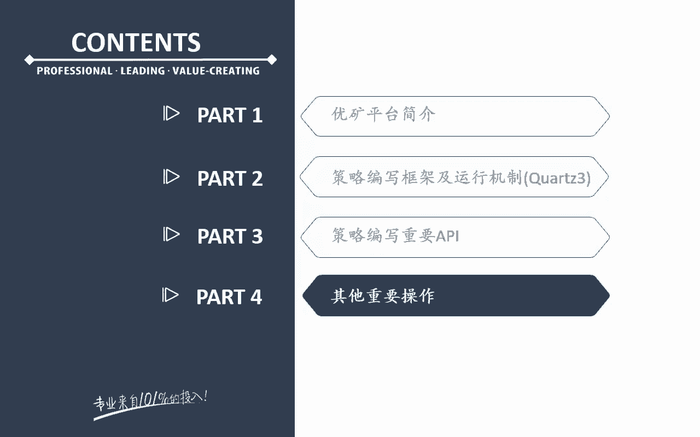

# 2024年金融大神老师讲解量化金融分析师.AQF—量化金融专业知识与实务 - P16：《+威❤hhh427501  了解获取全套课程》04.优矿框架_Account和Position对象 - 量化沿前 - BV1oU411U7QM

好，那么接下来的话呢，我们带大家来看下面一个最重要的一个，也就是说其实整个优矿平台里面最重要的额，最核心的就两个对吧，这两个对象一个是我们这里面的一个context对象。

还有一个呢就是我们这里要讲的一个这个stock，account对象，一个是整个交易调动控制，我整个交易环境的这个context环境，还有一个呢就是我的一个呃策略，对应的一个股票账户对吧。

那么账户跟交易环境之间可以相互沟通，相互联系，相互交互，那么这个这是我们整个优矿平台的一个大的，一个逻辑框架啊，好那么来看一下这个股票的这个交易账户，那么股票的这个账户注意啊。

账户的话呢配置账户是在最前面的时候，这个账户是不是就已经配置好了，这个配置账户是在哪里进行配置，大家注意在这个里面我通过这个账户名看啊，Count configure。

注意我们刚开始就进行了一个账户的配置，听明白意思吧，那么这里是在干嘛呢，接下来这个里面注意我要在我的handle data下面，这句话一定要有啊，所以画的话呢，相当于前面已经账户已经配置好了。

现在的话呢就获得的是一个账户的一个account，类的一个怎么样哎account类的一个实例，所以呢对我们来说，现在通过get count前面跟大家讲过啊，get account这个方法。

是不是就可以获得跟我这个策略里面对应的，真真正正管理我这个策略的持仓账户里面的，这个account这个实力啊，对吧，哎能理解意思吧，所以多麻说你要有策略，你要有买卖股票，你肯定要有账户啊。

所以这个账户这行代码的话呢肯定是有的，所以呢在我们的这个优库里面，它也作为我们的一个目默认的一个属性额，已经把它给放出来了，问题吧好那么我们来看一下，在这个里面我们定义好了这个account。

注意这个account现在就已经是什么，唉，就已经是account类的具体的一个什么实力的对吧，好，它就是一个账户实例，那么这个账户实例account这个账户实例啊。

它后面就会有很多的这个功能和方法的对吧，它有很多的属性和方法好，一起来看一下，在我们这个里面account点catch的话呢，获得的什么，获得的是当前账户的一个可用资金，这很好理解。

account的pfoo value的话呢，就获得的是当前账户的一个总价值啊，包括现金和股票，Proflow value，没题吧，哎这两个我们最常用的两个属性，注意啊。

现在的话呢这个account就是一个account，账类的这样的一个什么呃，具体的一个实例对吧好，那么关键来看方法啊，这个方法的话呢，注意它这两个方法非常非常常用，一个叫做get position。

还有一个呢叫做get positions，这个呢我们在后面会单独去跟大家讲啊，get position它其实指的什么意思，它其实指的就是呃，我获得的是指定资产的这个position实例额。

也就是说get position是获得的是某一个额，只能是获得一个啊某一个具体产品，或者说某一个呃，具体股票的这样的一个持仓情况额，具体这个股票的这个持仓情况，那么get positions呢。

get positions的话呢，就获得的是我当前所有账户里面的这个什么哎，获得所有当前账户的当前账户的所有股票啊，所有持仓的一个情况，那么这两个的话呢，我们后面专门会去跟大家讲啊。

其实呃在我们后面我们还跟大家说了，除了有context方法，count方法的话呢，还有这个呃呃context这个类，account这个类它其实还有一个小类。

这个小类就是我这里的position这个类对吧，呃但是呢position这个类的话呢，呃我们就没有花在这里，因为对我们来说，position这个类其实我们认为他是主要依托的。

是我这个里面的stock账户这个东西啊，所以如果说你一定额完整来写的话呢，它其实可能是这样子的一个结构，一个是context这个类，context这个类呢。

它跟我这个account这个类有相互之间一个交互，这个交互的话呢，我们用的是怎么样，context点get account这个方法没对吧，那么跟它相对应的account后面的话呢。

可能还有一个position类持仓，这个呢有一个持仓的具体的一个持仓的一个类，那么我可以通过account点get position或者get positions。

就可以跟我这个里面的position这个类呃的实力，也可以进行一个什么交互了，没问题吧，哎所以呢对我们来说的话呢，这是一个账户，这是一个具体的一个什么哎具体的一个持仓，那么对于我们来说的话呢。

在这个里面嗯嗯简单来写啊，你可以写成这两个类，主要的就是这两个啊，那么如果说呃要写的更复杂一点的话呢，它其实是这三个之间的，两两之间，是不是都这三个之间都会有这样一个交互对吧。

这个用的是get account这个方法对吧，哎了解一下啊，在这是我优狂背后的一个思想啊，这个也是为什么，我们之前一上来一定要跟大家讲，什么是面向对象才来跟大家讲这个优化问题吧。

唉好这两个我们先放一放啊，后面我们会有专门去跟大家讲，那么关键来看这两个，下面这两个就比较重要了，下面这两个说的是什么来唉，说明说的就是我具体的一个在account下面的账户。

下面的我的一个下单的方法问题吧，而count order就很简单，或者呃这个order里面我们后面也会有啊，这个具体的例子里面都会有，order里面呢第一个参数的话呢。

就是我的一个symbo simple的话，那就是我要买什么股票对吧，当然你可以买一篮子股票啊，呃当然一篮子股票你可以写一个循环对吧，每一个买多少，每一个买多少好。

那么order的话呢后面后面一个参数的话呢，就是我要买的一个数量是正的，表示买负的表示卖明白意思吧，所以呢其实account点order就是最简单的，我要买多少股股票，明白吧，哎那么还有一个呢注意啊。

对应的order to这个方法也要注意，它是我要买多少股票，我要卖多少股票，我要买到多少，听明白意思吧，哎我要买到多少股，或者说我要怎么样卖到多少股啊，注意啊，order跟order to是不一样的。

听明白了吧，我看看后面有没有例子啊，有例子，你看for stock in universe，universe是不是我可以买的所有的股票，就这样一个字自选池啊对吧。

for stock in这个universe account，点order stock100，注意这代表什么意思啊，说明只要在我这个universe里面的所有的股票，每只股票买多少股啊。

每只股票买我买100股，能理解意思吧，唉那如果说你之前我的账户里面，已经持有这只股票，我想把它给每只股票卖100股，那那很简单，在这个里面是不是有-100问题吧，哎好那么这是买100股啊。

那么后面的话呢还有一个叫做order to，代表什么意思啊，如果说在这个里面我是account点这个order to的话呢，注意比如说我现在原来已经买了100了，现在的话呢还是同样这支股票。

我现在order to1000，听明白意思吧，order to1000代表什么意思啊，我原来有100股，现在我要买到多少，买到1000股，那昨晚说我只要再买多少股就好了，唉再买900股，听明白意思吧。

哎后面这个我们每个都会跟大家去介绍啊，不用这个在这个里面都有，去这个具体的一个介绍没对吧，好，那么还有一个old percent，这个也用的很多啊，那么既然讲到了。

我们在这个里面就跟大家讲一下order percent，注意它是按照我的百分比例去买，也就是说在我这个universe里面，不是有这支股票吗，好那么对我们来说。

每只股票额如果我要下的是old percent的话，注意每只股票我都买的是多少，我都买的是10。1%，听白意思吧，所以我既可以按照具体的股份数去买，我也可以按照具体的怎么样比例去买，没问题吧。

哎那么在我们这个里面，我们还可以去拿一个什么东西啊，比如说在这个里面0。1%，我可以取取一个length universe呃，less universe4分之怎么样，哎分之一说明什么问题啊。

这个时候就说了，我是不是等全去买，不管你的universe里面是是十个，如果我的universe里面可买的股票是十个，那么每只股票买1/10，我这个universe里面的股票是20个。

每只股票我就买1/20，这个是不是都可以根据我的比例去去买，问题吧，哎那么order to这个概念掌握的话呢，那么percent to应该也可以掌握了，PERSTO指的什么，我要买这只股票。

我要买到这支股票的怎么样，当前的一个买到当前的比例听白思吧，哎所以如果是O的percent to10%的话，0。1代表什么意思啊，原来我可能有股票，原来我可能没股票，如果说原来是零的话呢。

这个percent to0。1和percent0。1是一样的，能理解意思吧，哎哎也不一定啊，因为对我们来说，这是我当前这个呃，按照我的比这个持仓的比例去买啊，那还要看你有没有其他的持仓能懂意思吧。

所以也都不一定啊，那么在我们这个里面，如果是是percent to的话，代表什么意思啊，代表的是比如说我原来有2%，现在的话呢我要买到整个持仓的百分之多少，I10%我就要买8%，整个我的仓位比例的。

持仓的比例的8%，听明白意思吧，哎所以呢对我们来说，这两个呃这两个东西的一个用法啊，先简单了解一下，我们后面还会去跟大家说，没题吧，一个是order percent，就是怎么样根据当前账户的总价值。

按一定比率怎么样下跌，答案问题吧，哎那么对于我们来说，还有一个呢order to的话呢，注意他是怎么样把我的股票的持仓，调整到持有多少手对吧，哎这也是写的比较清楚的啊，percent to呢。

它是通过下单将某个股票的持仓，调整到持有总价值的是吧，一定比例，明白意思吧，哎好那么下面也是用的非常多的一个东西啊，这个叫做account点close OP possessions。

这看名字我们就知道了，不管你的账户里面现在有多少资产，我把这些资产全都给我对吧，哎全都给我平仓了，听明白意思吧，哎我把我这个账户里面所有的资产，都能把它给平仓好，那么这是我的account。

下面的一些主要的一些函数和方法好，那么接下去的话呢呃我们就来简单看一下，那么首先来看account点get position方法，注意get position方法的话呢。

我们获得的是所有的持仓还是单只股票的持仓，哎我获得的是单只股票的一个持仓，没问题吧，哎单只股票的这样的一个持仓啊，那么来举个例子，比如说我现在account里面注意啊。

我必须先要获得account这个账户，这个实例明白意思吧，我才能用这个account下面的get position，比如说我这个账户里面买了这只股票，我就可以来看看这只股票当前买了多少股。

还具体的一个情况是什么，没问题吧，哎那么如果说是accouncident get positions呢，那注意，那么对我们来说其实也很简单，注意啊，我们返回的是所有磁场啊，返回的是一个字典。

key为正确的代码，value为某一个股票的具体的position实例，现在可能看得懂的啊对吧，因为什么get position，我们其实是从position这个对象里面。

获得了我这个当前账户的这个持仓的，具体的一个实例吧，那么如果说是get positions呢，get positions注意，因为我可能有好多个持仓，听明白意思吧，我可能会有好多只股票。

所以呢我返回的是一个字典，字典的键值，key是这支股票的代码，股盘的这个value的话，那就是我的一个具体的position能理解是吧，就跟上面一样，上面的话呢我返回它上面就没有字典了。

因为我只有一只股票嘛，那么我直接返回的就是这支股票的对应的，一个持仓的一个点位，没问题吧，好那么在我们这个里面还是一样，首先你要获得我这个账户的一个持仓的话，还是要用get account。

那么完了之后呢，通过get account下面的account，下面的get positions就可以获得当前所有持仓，还是那句话啊，他获得的是一个什么哎，他获得的是一个字典，拿到这个字典之后。

我再想看这个字典里面，具体没某一只股票的这一个持仓的话，那我可以怎么做，很简单，Positions，因为positions是不是现在是一个字典啊，那么我就让positions等于什么呢。

等于那当然不要这么去做了，我可以让某一只股票的一个具体的持仓，我要看某一只股票的具体的持仓，就是等于possessions，下面你拍这个股票的这个代码作为我的一个key。

我是不是就可以拿到我对应的这支股票的一个，具体的一个持仓情况了，问题吧，哎就跟我们前面跟大家讲的那个呃context，the history是一个用法，没听吧，哎好，那么在这个里面。

account点order的用法也跟大家讲过了啊，在这个里面symbol amount呃，price等于零没什么用啊，它这个price等于零的话呢，它是在分钟级别下的，那这个参数不用去管它啊。

那么还有一个old type就是market，你是要想想下的是试驾单还是线下单，没问题吧，哎那么这个例子前面已经跟大家讲过了，order stock100没问题吧，我这支股票每只股票买100嗯。

每只股票买100股，order to的话呢指的就是什么，我这只我要把这支股票买到1000股，或者买到1万股，听明白吧，哎我是把某个股票的持仓调整到持有多少时，或者叫他会根据我的当前持仓。

和我的目标持仓的一个差额去进行下单，没问题吧，哎这是一个非常非常呃，人性化的一个内置的一个方法啊，额不然的话，那你大家如果要自己去写的话呢，这种方法写起来还是这个有点难度的，对吧好。

那么还有一个下面这个order percent，这话呢我们前面已经跟大家讲过了啊，我们拿到的是我要买这个股票，我买的是当前总价值的，注意要是账户总价值的百分之多少，10%，明白了吧。

呃所以这里跟大家强调一下啊，是总的账户的总价值的10%啊，不是剩余现金的10%，明白意思吧，不是剩余cash的10%啊，是我比如说我现在是一个100万的一个账户，就算我这个账户里面买了其他股票。

我现在还是要买这个账户的10%，也就是说买10万听明白意思吧，唉不是比如说我现在买了20万的股票，买了20万的股票，还有80万的现金对吧，不是80万里面我拿10%啊，是100万里面我拿10%去买。

也就是拿10万去买这支股票问题吧，哎那有些同学说老师，比如说我现在100万的股票里面已经买了，比如说95万的一个东西，你现在再让我买15%，注意我是买不到的，也就是说我这个里面的这个部分。

我是其实我是没法买到的，听明白意思吧，哎没法买全，我是买不到这个10%的啊，所以在这里面跟大家强调一下啊，是这个10%好，那么后面的话呢这个percent里面的话呢，就是正式表示买路虎。

就表示卖出这个前面跟大家讲过了啊，还有一个呢买到一个具体的比例问题吧，好那么后面的话呢就是跟大家讲的第三个实例，第三个类，第三个类的话呢就是这个position类问题吧，好那么position类的话呢。

其实前面跟大家讲过了啊，简单来看，你可以把它看成position，是我的account下面的一个子类啊，不能说子类吧，account下面的一个呃，当然最好你不要把它看成是在炕下面的啊，呃你可以。

其实这张图其实是比较比较好的一张图，它其实position类，它是跟account类也是有这样的一个什么哎，对象和对象之间有这样的一个怎么样交互的，一个动作问题吧，好那么来看一下啊。

在我们这个里面的话呢，account这个类呃，我怎么样去获得这个呃position的这个对象，那很简单，我用account这个类，我前面是不是已经怎么获得这个账户了对吧，好获得这个账户的话呢。

这个账户的这个实例我已经拿到了，我只要拿这个账户里面的这个get positions方法，也就是说get position或者get possessions，所以呢对于我们来说，在这个里面。

其实position你可以在这个里面写成，这里面有一个方法，Get position，没题吧，哎额他就可以通过这个get position，这个方法，就可以跟我这个position。

这个对象去进行一个交互了，所以呢对我们来说呃，嗯这个我们前面已经讲过了啊，一个是get position，get position拿到的是单只股票，还有一个呢是get positions。

get positions是拿到的是什么，唉这个一个字典TMS吧，哎好，那么这个position啊，它其实也是一个独立的一个对象啊，呃他原来也是一个类。

但是呢通过account get position的话呢，我就拿到了这个position的一个具体的实例问题吧，哎并赋值给这个变量，position好，那么来看一下这个呃，position是个实例。

或者说position是个对象，有哪些属性呢，position的amount，我的具体的一个持仓数量，Available amount，我可卖出的一个股票的数量。

possession的profit就是我的一个持仓的一个浮动，盈亏完了之后呢，cost就是我的一个平均的一个持仓成本，position的value的话呢，就是我整个position下面的一个持仓市值。

那么这个市值的话呢，会随着我这里的波市值的市场价格的一个波动，而波动问题吧。

哎这个就是我们的一个position，好，那么讲到这里的话呢，我们就已经把我们呃整个优矿里面，最重要的三大这个呃已经跟大家讲完了呃，三大类啊或者对应的就是三大对象，三个实例就是我们的context。

我们的account和我们的position呃，context和呃，account可以通过get account这个方法来去进行交互，那么account跟我的position呢。

可以通过get position或者get positions，这个方法去进行相互理解，意思吧，哎好，那么讲到这里的话呢，其实一定一些简单的代码，我们已经可以看懂了。

那么我们先休息一下，然后呢带着大家看几个，我们的一个简单的一个策略。

