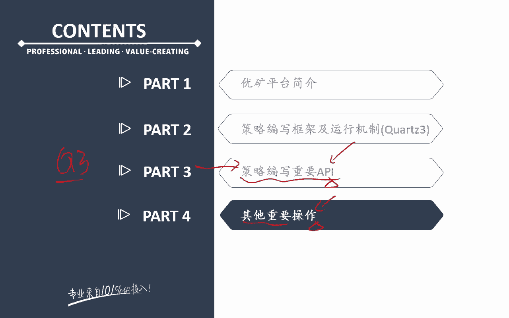
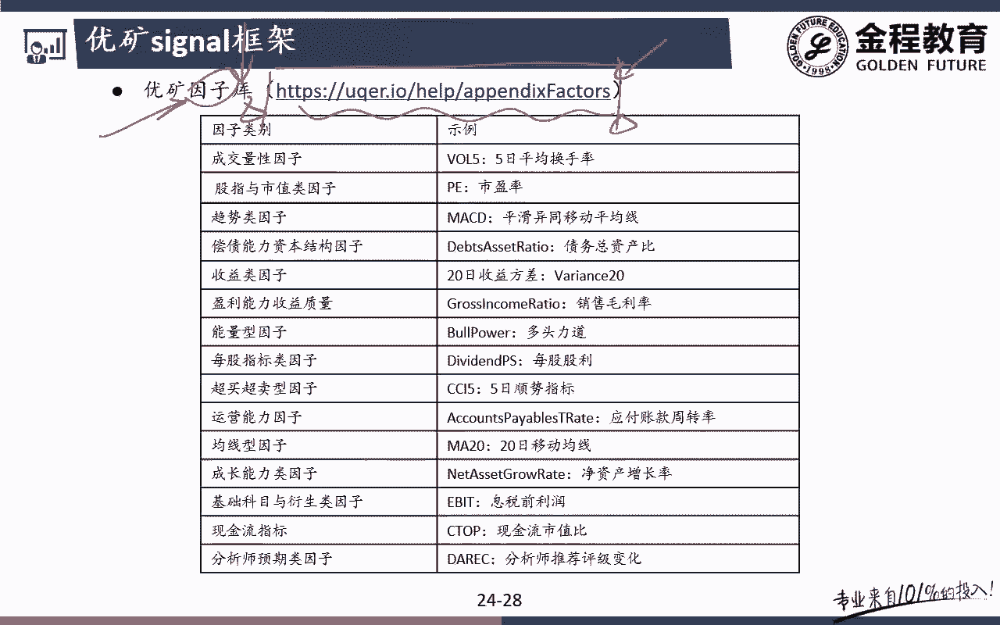
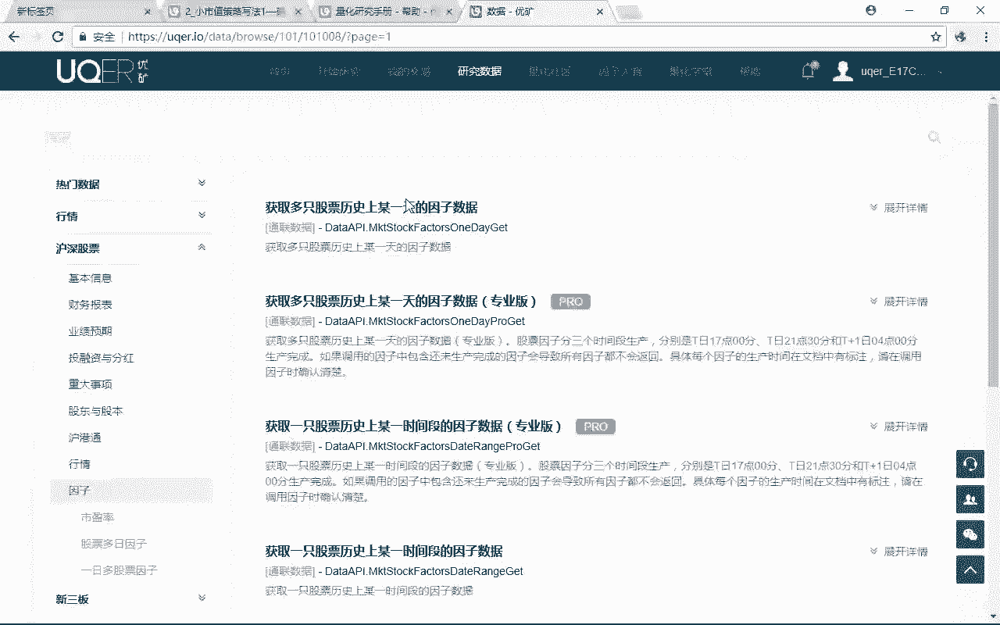
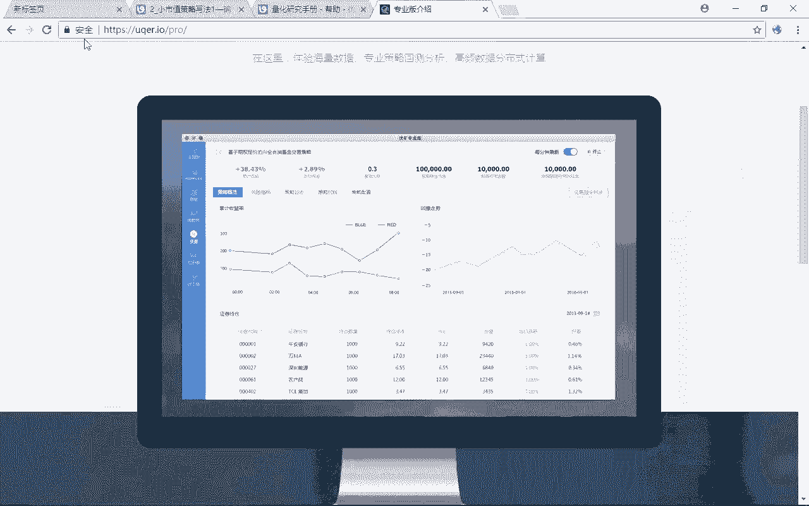
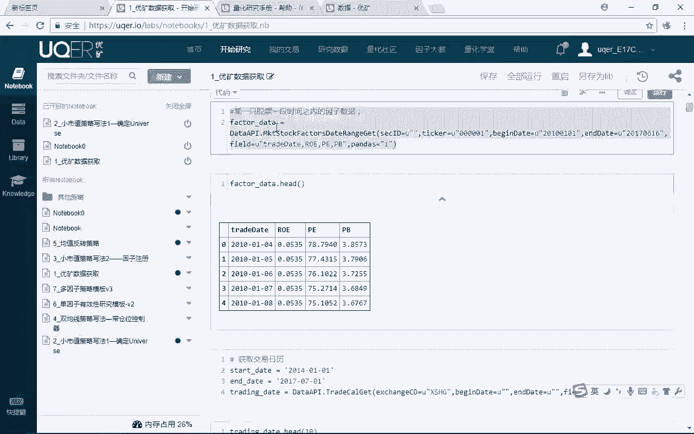
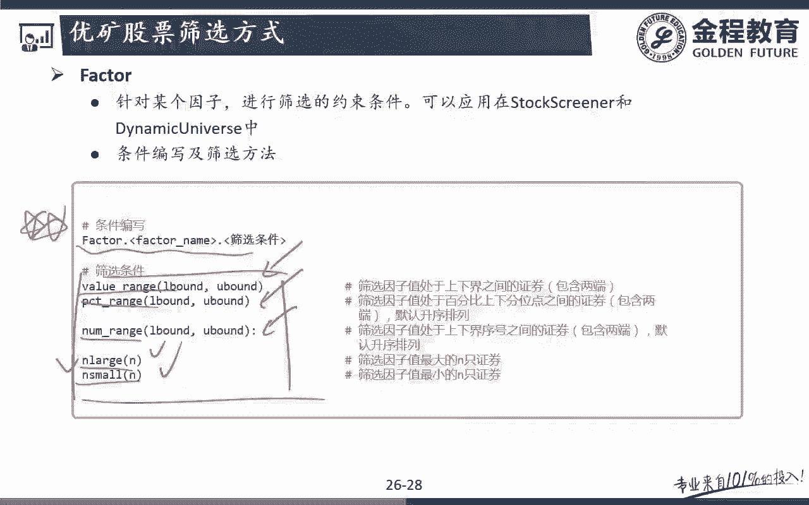

# 2024年金融大神老师讲解量化金融分析师.AQF—量化金融专业知识与实务 - P17：《实盘交易模拟_基于优矿平台的面向对象策略》05.优矿框架_其他重要操作 - 量化沿前 - BV1oU411U7QM

好那么基本上讲到这里的话呢，呃这个策略的API讲完之后的话呢，基本上大家就已经对呃，绝大多数我们Q3注意啊，我们都课上都是记得是Q3啊，呃的一些最基本的一些策略，大家就已经可以看懂了，那么接下去的话呢。

我们再稍微花一点点的时间，来跟大家去介绍一下，我们优矿里面还有一些比较重要的一些东西啊。

好那么首先第一个的话呢，呃要让大家知道一下优矿有这样一个因子库啊，呃这个点是我最重要的，要把我们最终的这个课程，要放在这个优矿平台上来，去跟大家讲的一个原因之一，就是因为优矿上的因子数据啊。

它非常非常强大，那么免费版好像就是有200的，还是400多个因子，那如果说你是专业版的话呢，那你的因子就更多对吧，那么而且这些因子数据的话呢，是他都帮你，是额都已经帮你整理好了。

那么我们直接拿来调用就好了，就不用像说在其他平台，那么还有一些其他平台啊，你要用同样的这些因子数据，你要自己去找自己去处理，那就很麻烦。

优框上的这些因子数据都有，都已经帮你整理好了，那么我们先来带大家看一下它的数据在哪里，他的这个数据的话呢，在这个研究数据这里问题吧，那么呃研究数据，然后呢沪深股票，沪深股票下面就是专门有一个因子。

看到没有，哎那么因此的话呢呃在这个里面它有一个呃。

这是带pro的话，那就不用去管它了啊，他是这个专业版才有的一些东西。

那么其实绝大多数因子啊，我们会用到的一些东西啊，直接拿普通的那个就已经完全足够用了，没地吧，哎那么有些时候教给大家一个小技巧啊，你看这是两个不同的因子的这两个API。

一个是data API market stock factors，One day，没问题吧，get还有一个呢是one day pro get，那如果说有些时候我们在社区里面看到。

有些人他如果可能是买了专业版啊，他在这个里面用的是PROGET的话呢，那么呃很有可能因为你的我们是免费版的，你就没法用了对吧，那么这个时候你看到这种pro的这种单词啊，你就把这个pro给删了。

那么就相当于我用免费版的这个接口去接，一般来说啊都可以调到这些数据的问题吧，所以呃对我们来说呃，除非是真真正正要去基于这个优化平台，去这个呃做策略回测投资啊，不然的话。

其实专业版没有什么太大的一个意思啊，额那大家要这个试用的话呢，你可以这个它有一个月的一个免费期对吧好，那么我们来看一下，在这个里面其实我们就可以拿到啊，比较常用的啊。

呃呃就是我们就可以拿到它里面的这些因子了，那么比如说呃这个因子呢有两个额，主要用的是这两个啊，一个是什么多只股票在某一天的某一个因子的，它的一个值对吧，或者说一只股票在历史上，某一段时间的因子数据。

这两个我们是最常用的啊，比如说我们进点进去了之后，你看啊在这个里面他其实都已经帮你写好了，看到没有，我们直接只要扣背代码完了之后的话呢，在我们这个新建一个notebook，新建一个notebook呃。

呃这个什么东西啊，呃我们复制一下啊，然后直接在这个新的notebook里面我们粘贴一下，这个其实我们就可以钓到了，没问题吧，哎那么在这个里面的话呢，这是它默认的一个啊。

我们的trade date是2015年，注意我们有几个子参数啊，我们来看一下呃，第一个参数的话呢是trade date，就是我要拿的是哪一天的一个因子，数据没问题吧，好第二个呢是sc id。

第三个呢是tick，注意啊，这是很多同学初学者，你用用黄平台看不懂的啊，second id和tick其实都是我的股票代码，那么对一般来说啊，这两个里面我们只要把它编写一个就好了，但有同学问了。

我为什么要搞两个呢，sc id和我的tick，这两个里面不都是股票代码吗，你自己搞一个就可以了，为什么要搞两个呢，注意啊，呃在我们的嗯，呃课上或者说其他大家可以看到的时候啊，其实斯卡蒂是用的更多的。

因为什么tick的话呢，它只有这个股票代码啊，sc id的话呢，它是呃这个股票代码类似于这样，000001股票代码后面有一个怎么样呃，后缀后缀什么XS什么HG，乱七八糟的那些对吧。

那其实就是在说我是上交所的还是深交所的，这是我的sc id跟我tick之间的一个区别，明白意思吧，那么呃为什么我们说用斯卡id更多呢，因为斯卡id，它跟我的universe里面的结构是一样的。

明白意思吧，也就是说最常用的一种用法，我可以把这里的c kid就等于什么，哎这里的c kid就等于我的那个universe，哎这个universe我们不是在之前定义过吗，对吧，哎universe。

所以呢对我们来说，直接呃我要拿的就是我整个我的资产池里面，我要的这些股票的这个因子数据，是不是就特别方便能理解是吧，哎不然的话呢，在这个里面你就不用去不用去显示什么啊，就好了啊，那么有同学问嗯。

季老师这个里面的这个U是什么，这个U不用去管它啊，你就知道有这样一个东西就好了，这python2里面的一个UNICODE，这些字符串编码的一个类型啊，这个不用管它，反正你知道一下呃，上面这样一个U。

那么在这个里面的话呢，就是我要获得00000160000好，我拿的是field field的话呢，拿的就是我要拿什么样的一个因子，数据听明白意思吧，哎那比如说在这个里面你可以那在这个里面。

你看field里面它其实可以选很多啊，在这个里面我可以拿各种各样的一些因子，看到没有，唉，那么我们要拿各种什么样的一个因子的话呢，我们直接在这个里面拿就好了，比如说我们要做小市值策略。

那么我们可能就拿到这里的什么哎，这个cap额这个呢是一个对数式值，是不是就是求个因子啊，哎，那么我们在这里面就进行一个简单的一个调用，那么这不就可以了，后面pandas等于一，你要看得懂。

pandas等于一指的就是一和零，一代表就是我返回的要不要是一个data frame，如果说是一的话，那就说明返回的是data frame，如果是零的话，那就不是data frame。

当然我们要用的是什么是data frame，这个东西没题吧，哎那么在我们这个里面具体的例子的话，那我们就先不举了，因为我们后面专门会有跟大家说，怎么去返回这个里面的field。

听明白是吧，哎我们后面会专门去跟大家举个例子啊，也就是说在这个里面是先跟大家说这个里面的，我们有这样一个非常强大的一个因子库，你要做什么多因子啊，这些的话呢直接调用这个里面的因子就好了，听明白哎。

这是一个要跟大家讲的，那么怎么去调，包括怎么把这个因子数据拿到了之后，可以把它给下载下来啊，我们去后面都会来去跟大家讲啊，好那么后面的话呢，呃要跟大家讲，一个相对来说比较特殊的一个东西啊。

叫做signal框架，叫做这个信号框架，那么这是优矿自己编写的这样的一个东西啊，这个信号框架是用来干嘛呢，那其实说白了也是来用来处理多因子的，或者说是是去为了获得我们这个，多因子数据的好。

我们一起来看一下啊，这个也就是说嗯我要拿到因子数据，我们有这样几种不同的方法啊，那么首先来看第一种方法，第一种方法就是我们这里要跟大家讲的，这个signal框架因子的这个注册框架，那么这个的话呢。

用起来稍许可能会有一些复杂啊，但是嗯我看的我看了，社区上也有人这么去用的啊，所以我在这里专门拿出来跟大家讲一下，因为我怕呃，大家看到社区里面很多人用这种方法去调，因此数据很多人感觉嗯周围也有感觉。

这是什么东西对吧，可能不太理解，所以呢对我们来说的话呢，嗯这个我们会来跟大家介绍一下，第二种的话呢，第二种方法的话呢，大家应该掌握了对吧，呃contest history里面，这是我的一个symbol。

这是我的一个time range，那么对我们来说，attribute我们除了可以拿到收盘价，开盘价成交量以外，有一些常用的一些因子啊，P1PB这种常用的一些因子。

我们也可以通过context get history这种方法来去掉的，TMS8好，那么注意啊，再强调一下，通过这种get嗯contest history掉的这个方法，它是盘前还是盘后去掉的。

哎他是盘前去掉的，听白了吧，哎那么它就有一个好处，什么好处啊，它就已经帮助我们自动的去规避了，我的一个未来数据，能理解意思吧，唉他就已经是自动帮我们去，规避一个未来数据了，这个在我们之前课上。

是不是在跟大家讲什么东西的时候啊，呃在讲context还是讲什么，我是专门跟大家强调过的，还有印象吗，呃来看一下在哪里呢，嗯啊那在这里contest history这个里面呢。

我们是拿着一个盘前的一个数据啊，盘前一个数据就已经帮助我们自动的去规避了，未来函数了呢，如果我们要从data API，就是我前面跟大家讲了数据研究理念的话呢。

注意我们就要用contact previous data这种方法啊，我们要呃当天我们是拿不到这一天的数据的，我们要拿的是前一天的一个因素数据，听白意思吧，哎所以呢在我们这个里面我们来看。

如果说我们要拿的是，如果我们是通过contest history的话呢，我们直接拿来直接去取这个P，这个P就是我要拿的这个attribute，没题吧，哎好这是第二种方法，那么再来看这里的第三种方法。

第三种方法是最呃，因此如此，我们放到最后来讲啊，因为第二种方法我们接触过了对吧，第三种方法的话呢，就是前面跟大家讲的data API这种方法，我可以通过market stock factor。

One day gate get trade date，注意啊，我要是context previous date还有印象吗，context这个对象下面是不是有一个属性啊。

前一天因为这个里面one day get这个数据库里面啊，这个如果你要通过data API这个数据库调的话，这个里面的因子值就是当天的一个因子值啊，这不是盘前的了，所以对我们说你要掉呃。

如果说你是2017年呃，现在是9月14号的话，理论上来说我要收盘了之后，我们才能知道准确的获得这个因子数据啊，所以你在这个里面，在9月14号还在交易的时候，我只最多只能获得9月13号的因子数据。

所以呢在这个时候我们要用context点previous state问题吧，好那么后面sc id和TICKK，我前面已经跟大家讲过了，两个之间的区别，一个带后缀，一个不带后缀问题吧。

好那么field就是我要拿到哪些额属性呢，这个field的话呢，注意我们要拿tick，tick就是我的股票代码再拿一个是吧，哎P这个tick你要加啊，不加的话呢，你就只能拿到这。

你这些股票代码的这个P1的一个因子值，但是你是什么股票对应的什么意思，你就没有了，听明白吧，哎所以在这个里面加一个tick的一个意思，就在于我要拿到的是，比如说000001，我的PE1ratio是十倍。

600030，我的pu ratio是20倍，这样能理解是吧，哎判断等于一，就说明的是呃我们这要的是一个PAND呃，pandas data frame问题吧，哎所以呢第二种方法和第三种方法。

其实我们都已经跟大家讲过了啊，好，那么关键来看一下我们这个里面的这个，signal这个框架，这个signal这个框架的话呢，注意啊，我们要进行一个你要用signal这个框架的话呢。

我们要在initialize初始化函数里面，我们要对这个因子进行一个注册啊，为什么要进行一个注册呃，简单来说啊，只有我这个因子注册了，我们后面才能通过context点signal result这个方法。

才能获得我的这个因子的这个数据，能理解意思吧，哎而且呢他获得的这个因子的这个数据啊，还是一个它也是一个字典，那么这个确实有点小复杂，那么我们后面会结合一个具体的一个实例，来去跟大家说。

那么我们简单来跟大家看一下，我这个因子的数据，如果我要注册的话，我们是怎么注册的，很简单，首先第一个我定义一个因子的这个变量名字吧，这个时候注册的话呢。

注意我们要用signal这个大写的这个signal类啊，我们后面里面定义的这个就是我注，我需要注册的这个因子，听明白了吧，哎我要拿到的是什么因子啊，p e ratio好，那么这个时候的话呢。

我们要通过context下的一个signal generator，因子生成因子的这个注册器啊，它就等于我这里的signal generator这个类，下面我要实例化一个p ratio。

额市盈率的这样一个因子，所以对于我们来说的话呢，呃在我们这个里面我们就可以用到这种方法，我们就可以怎么样通过这种方法，我们就可以去说在这个里面它就是一个因子，怎么样，这个是因子一个注册的一个过程。

那么这个不用想太多啊，这是它呃优矿呃，内部他已经自己帮我们去呃，写好的，已经完成好的一个东西了，所以呢在我们这个里面以后，我们要调用这些因子数据的话呢，我们直接拿来用就可以了，你就用我这种格式问题吧。

好那么这一个不过程叫做因子注册，那么什么时候我可以用呢，注意我在处理handle data的时候，我就可以通过context点呃，signal result这个因子的这个结果。

我就可以返回我这个universe下面的这些音呃，就是我的那个universe里面的，这个因子的具体的一个值，就是我这些股票对应的这个因子的值是多少，那么在我们这个里面。

我们就可以通过这个context点呃，signal result这个方法我们就可以调用了，那么像这个方法的话呢，注意context chat我们是不是跟大家讲过一些方法，Get account。

Get universe，这是是最常用的，最重要的，所以呢我在前面的那个context的方法下面，我们是不是写出来给大家了对吧，那么像这种呃context的点signal result呢。

它就只能说我在因此注册的时候才用，它，不具有普适性，不具有代表性，只是特殊的一些地方，我们要用到这些地方，这些东西啊，我就没写到我们前面那个PPT里面，但是你要知道额，我们还可以通过因子注册这种方法。

也就是说，如果我没有上面的这个因子注册的这一步，我直接在下面用什么context，点signal result，我是调不到数据的，明白意思吧，只有在初始化的这个里面，我把因子注册一下。

就相当于在告诉我们的这个优矿的这个解释器，哎我要调用因子啦，那么在后面的数据处理里面，我们就可以获得这个因子的相关的一个，数据问题吧，好那么具体怎么去用啊，我们后面会举具体的一个实例来去跟大家说啊。

先有一个印象，但第二种方法和第三种方法应该能掌握了，没题吧，哎好那么接下去再来看下面一个啊，下面一个的话呢它也是蛮常用的一种做法，它其实做的什么针对某个因子啊，我们在进行筛选的因约束条件的时候呢。

我们其实在dynamic universe，或者在stocks公认的不过程当中，我们就可以加以约束了，也就是说我的这个universe啊，我定义的这个我可以买到股票的这个股票池。

整个universe我们就可以进行筛选，那么筛选的话呢用的是什么方法呢，注意用的是这个这种结构啊，就是factor大写的这个factor啊，这个factor相当于一个factor类。

下面的一个factor的一个什么name，后面的话呢再加一个什么，我的一个具体的一个筛选条件，那么筛选条件有哪些呢，我要找到的是什么哎一个范围，比如说我的我要找到是因子值。

处于上界和下界之间的一些股票对吧，还有呢我可以看一些百分比，百分比位，比如说我要找到前百分之多少到百分之多少的，这个因子对应的一个股票，还有呢可以是一个数量咳，我的因子值处于呃这个上下序号呃。

序号之间的一个，比如说是前100到呃，比如说排名前十到第100的，那在我们这个里面也可以用，还有一个呢这两个是比较常用的，一个是n large，一个是n small，这代表是什么意思啊。

挑选出因子值最大的若干个因子，挑选出因子值最小的若干意思对吧，那么这个可能讲的起来比较抽象啊，我们来看一下这里，咳咳在我们这个里面注意啊，这两种方法额包括第三种方法，第三种方法的话呢。

我们是放到后面的策略里面，会跟大家去去介绍的一些方法啊，那么在我们这个里面，大家先掌握前面两种方法，这两种方法的话呢，其实都是通过factor这样的一个类啊，去进行对我因子呃进行一个筛选的。

而且这种筛选在我的这个universe的，这个过程当中，就是在最前面定义universe的这个步骤里面，我们就可能就已经做好了，好我们先来看一下啊，这个时候我们就可以用到一个特殊的一个类。

这个类的话呢叫做stocks screener，看名字我们就知道他是帮助我们去筛选股票，对吧，那么筛选股票的条件呢，我们就可以用前面跟大家讲的factor，前面跟大家讲过factor，点一下。

点一下的是什么，后面我要筛选的一个因子，比如说我要筛选的是P1最大的50只股票，点P1，那P最大的50只股票的话呢，用的什么，用的是这里面的哪一种呃，Value range，Percentage。

Range，Number range，还是n large n sport，哎是的是我这里的n n large对吧，哎P最大的50只股票，我就是什么N对吧，N large50，那么P最大的20只股票呢。

N就是变成NFACTP一点，n large怎么20哎，这种结构写法没题吧，所以呢对我们来说，我这里的universe是怎么做的，也就是说比如说我每个月月底呃运行一次，那么在每个月月底。

我就找到在每个月月底的时候，我P值最大的50只股票，那么这作为我的一个universe，我在这个universe里面我再进行一些条件选股，各种各样的一个策略的一个逻辑，没问题吧，那么再来举个例子。

比如说我要选出我这个里面的嗯，市值最小的，市值最小的几个几几个股票对吧，那么这个我就可以怎么去写，市值最小的50只股票，factor fact的市值我们可以用什么因子呢，叫做l cap，l cap的话。

那就是我的一个对数市值啊，叫做log normal类似吧，cap完了之后呢，最小的50只股票，那就什么N什么哎，n small完了之后呢，怎么50只股票，所以杜马说这个时候我们在universe里面。

我们就定义了怎么我的选股的整个股票值，就是在这段时在这个时间点上，我市值最小的50只股票，然后呢怎么样这50只股票，比如说我每只股票都买，或者我每只股票都买，额等全买。

那这是不是就是我们最最简单的一种等权呃，这个多因子的这个市值呃，不能说多因子啊，就是单因子的市值的一个策略，哎我们后面会带着大家实现的啊，好那么这是一种方法。

我们直接可以通过stock screen来去做，还有一种方法的话，那我们可以用dynamic universe，注意打namic universe，比如说沪深300。

我可以用一个点apply呃filter方法，注意啊，这个点apply filter方法的话呢，是这个dynamic universe，下面我们可以调用去去调用这个apply filter方法。

filter方法里面，它其实光看名字我们也知道啊，他其实对我们来说嗯，我们要用的一个他就是怎么样，后面就是，FP一点n large，其实这两个殊途同轨啊，只不过在这个里面。

我是在我的动态的这个universe的这个下面，我们呢再找出我P值最大的50只股票，没问题吧，哎所以这种写法啊，呃fact这种用法一定要掌握fact点呃，这个因子的名字点筛选条件。

那么主要的一些筛选条件就在这里，那么我们用的比较多的value range，介于这个因子值介于多少之间，还有呢我这里的因子值处于百分之多少之间，还有呢它是排序介于多少之间。

那么最大的极值最小的若干支对吧，来这些都是比较常用的啊，那么后面的话initialize和我这里的单handle data，这后面就没什么东西了，在我们这个里面第一步初始化参数，初始化参数的时候。

在universe里面，我们就可以设计好我的universe是是不是随机的，不是全A股，也不是沪深300，那么我是在沪深300里面挑选出怎么样哎，脾气最大的多少只股票，这作为我的universe。

我再去结合我下面的投资策略去进行投资啊，好那么基本上讲到这里的话呢，优矿里面的一些基础概念，我们都已经跟大家讲完了，包括重要的API的呃写法呃功能，包括其他的一些重要操作。

可能就剩一个因子注册啊，我们也给大家举实例，那么后面的话呢，我们会包括我们所有的这节课上讲到的，包括前面一节课所讲到的一些东西啊，我在后面的例子里面都会用到，所以呢我才会放在我这个课程里面问题吧。

好那么讲到这里的话呢，优化的一些基础用法我们就已经跟大家讲完了，那么接下来的话呢，我们就是要带着大家在优矿上，真真正正写策略了，那注意啊，优框上写的策略的思路都是面向对象的，听明白吧。

他是把我的优矿的context的这个类的对象去跟我，account账户里面的这个类的对象，相互之间进行一个交互，当然如果要严格来说的话，它还有一个position这个类，这个类的对象。

跟我的account账户也有一个交互的一个对象，问题吧，哎好，那么接下来的话呢，我们就开始讲我们的因子的一个呃，这应咱优矿的一个策略好。

