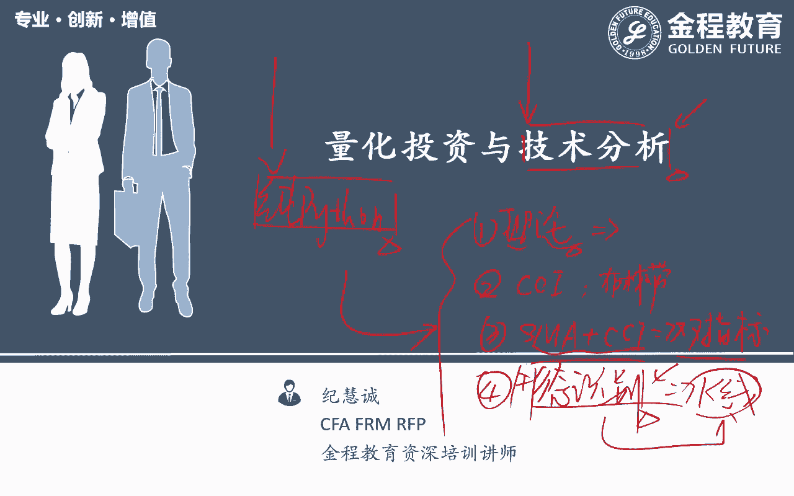
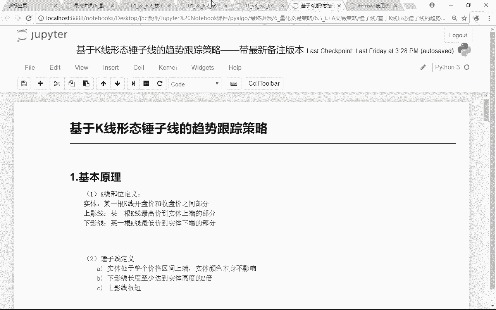
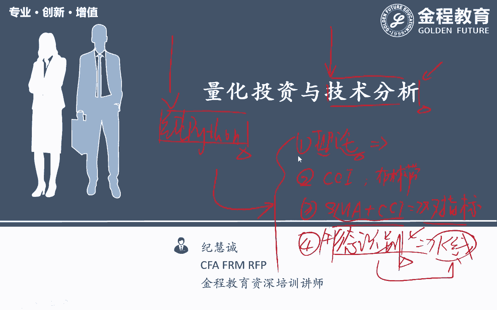
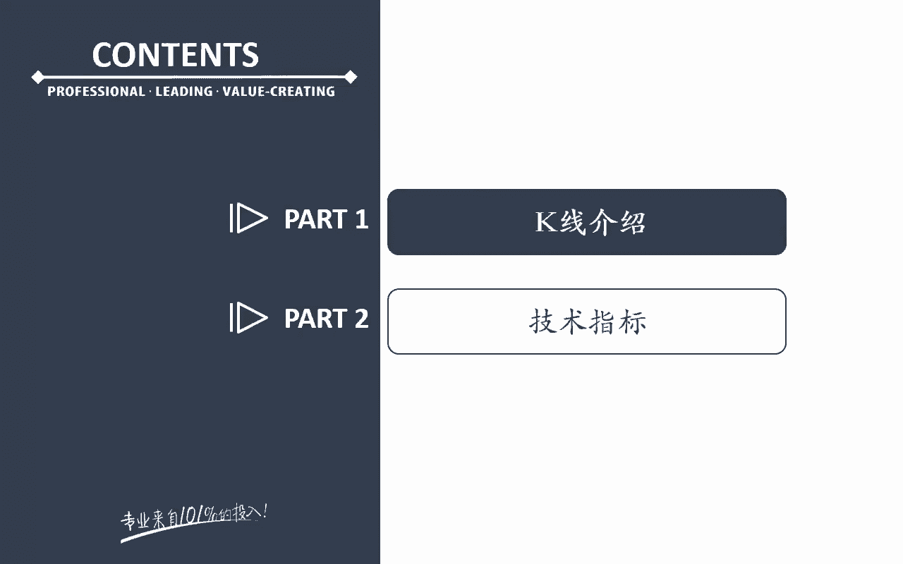
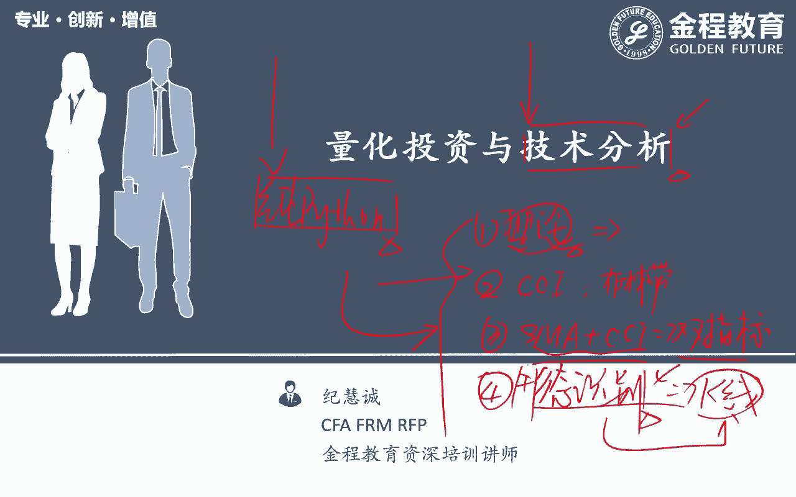
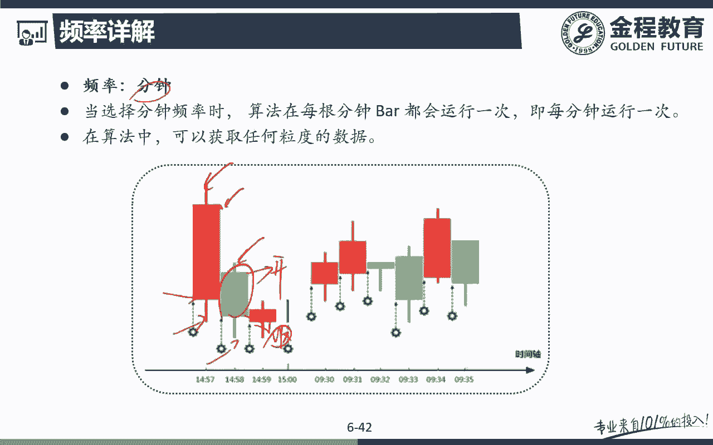
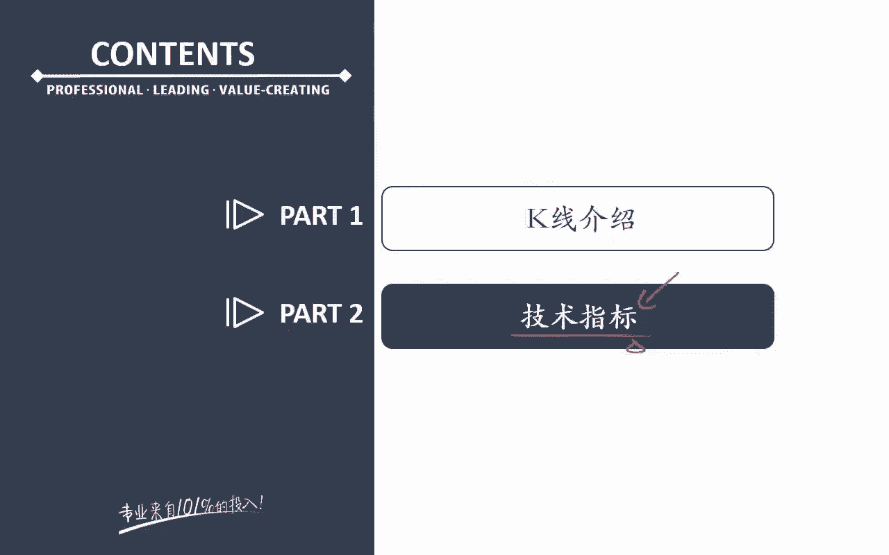
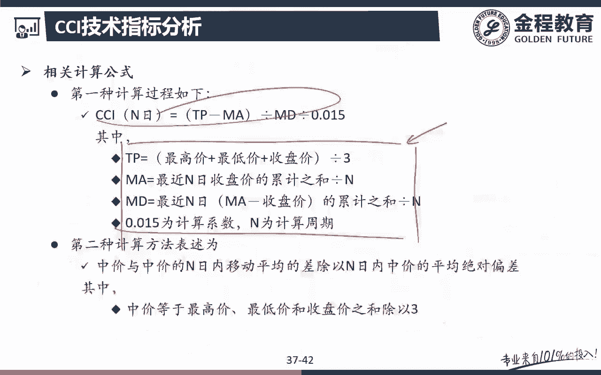
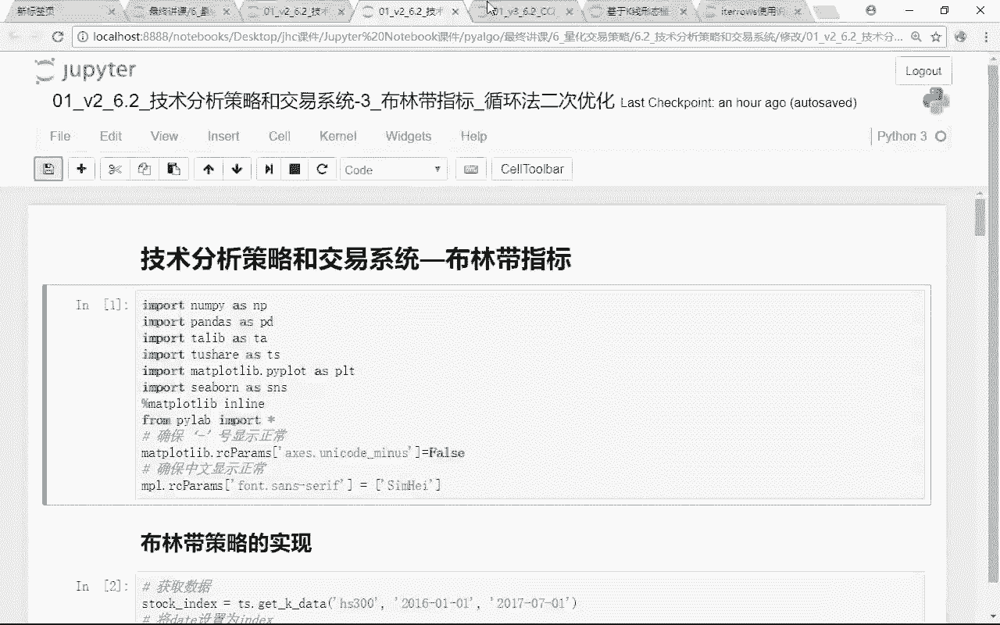

# 2024年金融大神老师讲解量化金融分析师.AQF—量化金融专业知识与实务 - P1：《量化交易策略的Python实现与回测（进阶）》01.量化投资与技术分析_1技术分析理论 - 量化沿前 - BV1oU411U7QM

好各位同学大家好啊，那么这节课开始的话呢，我们是跟大家讲的是呃，量化投资额里面相对来说也是用的比较多的啊，一个呃技术分析的这个模块呃，但是对于我们来说的话呢，因为呃跟布什老师沟通了一下啊。

布什老师后面也会跟大家去介绍，在优化平台上去跟大家讲啊，这种技术分析，那么我们这里也会讲一些呃技术分析啊，但是我这里讲的是纯Python平台上的，纯Python的一个技术分析。

那么额布施老师讲的实际优化的一个，技术分析啊，还是有些不一样的，那么各有优各有优缺点吧，反正还是那句话啊，因为布鲁史老师那边也会讲一定内容的，这个技术分析啊，所以我本来准备了挺多的一个内容呃。

想跟大家在这一个模块来去跟大家讲的，那么鉴于布施老师那边也有一部分的内容啊，所以我这部分内容就稍微简化一下，那么呃不要让大家觉得这个技术分析，前后两个都是技术分析啊，这个嗯大家会感觉课程有些重叠。

所以我这里呃就简呃简单来讲，简单来去跟大家说啊，好那么这个技术分析的话呢，呃先来告呃，跟大家讲一下我们整个课程的一个框架啊，那么我会先把这个技术分析的一个理论，先跟大家做一个简单的一个介绍啊。

我不会花特别长的时间，大概也就一个视频的时间吧，因为对我们来说这个理论的话，那在我们之前的那个呃就是Python基础里啊，不量化投资基础里面都有跟大家提到过啊，技术分析是一个比较重要的一个呃流派对吧。

好理论会复习一下，稍微再简单介绍一下啊，好，那么第二个的话呢，是跟大家讲的是几个技术指标的一个实现，那么这几个技术指标的Python实现的话呢，呃这几个技术指标非常有名啊，一个叫做CCI。

还有一个呢就是布林线对吧，Ball bling，那么还有一个呢就是布林带，那么还有第三个的话呢，是呃我们做了一个交易系统，是拿我的SMA均线加上我的CCI，双指标的这样一个交易系统啊。

那么对我们来说的话呢，这一个内容的话是因为带了双指标，就这两个指标同时满足开仓条件，我们在进行，我们才在量化投资的，才在我们的策略里面进行开仓啊，这一个双指标的一个策略，那么最后一块的话呢。

我们是跟大家讲的是一个第四个部分，跟大家讲的是形态识别，那么稍微有些技术炒股的同学啊，这个应该知道对吧，比如说在我们的K线图上呃，出现了某一种技术形态，什么头肩底呀，什么纺锤线啊，什么早晨之星啊。

三只乌鸦三乱七八糟的那些东西，那当我们出现某一定K线的组，织的组合的形态的时候，我们认为，可能我们的股票就要开始上涨和下跌了，所以对我们来说的话呢，这个块也是最近研究的特别多的一块内容啊，形态识别好。

那么主要我们这个Python的技术分析。

这一个topic的话呢，主要跟大家讲的是这些内容好。

我们先来看一下我们这个里面的这个结构啊，那大家在这里已经可以看到啊，我们在这里首先第一个会跟大家讲的是CCI，第二个的话呢是跟大家讲的布林带呃，第三个的话呢是SMA加上我的CCI。

双指标的这样一个交易系统代码，我们都已经跟大家写好了，那么最后一个的话呢就是我们要实现的这个呃，锤子线，纺锤线的这样一个形态识别的这个策略。

那么相对来说还是比较有意思的啊，好我们一起来看一下，那么先来看第一个部分。

就是我们的一些K线的一些呃，技术分析里面的一些最重要的一些理论介绍啊，那么理论部分啊我们就不花特别多的时间了。

因为理论技术分析市面上的那些书啊，资料啊太多太多了对吧，那么我们在这里面花特别长的时间跟大家讲，这一块额，那可能也不是特别感兴趣了，所以理论部分呃我认为特别特别重要的一些点，我会跟大家提一下。

那么接着的话呢，某一个呃具体的技术指标它是怎么用的，我会跟大家去说，但是这个技术指标背后的一些原理啊，类似这些东西啊，大家可以感兴趣的话，你自己看一下呃，市面上的那些书都可以啊。

那么在我们这个里面我们会跟大家去讲呃，实际应用的时候怎么去用，当然也是最入门的呃一些用法，因为如果真的要讲技术分析的话，讲了深入的话，技术分析我就可以讲，这就讲五天十天都可以去讲的对吧。

哎所以对我来说的话呢，在这一块啊，理论部分我们简单来说，重要的还是在Python上去实现，那么理论部分市面上说很多啊，怎么做量化，就是市面上额比较少的对吧，好我们来看一下啊。

呃首先第一个我们分成两个部分，第一个部分是K线的介绍，第二个部分的话呢是我们的一个技术指标好。

首先第一个K线啊，这个K线就是来额从日本过来的，它是一个日本的蜡烛图对吧，所以K线的话呢，有些是在中文里面有把它叫做kindle对吧，哎呃呃英文里面把它叫做kindle，这是我们的这样的一个K线图。

那么K线图的话呢典型的这种长这样对吧，那么上面它是一个最高价，这个呢就是我当天的一个收盘价，这个呢是我们的一个开盘价，当然这是在呃我今天的股市涨的情况下啊，如果跌的情况下的话呢，就是上面的是开盘。

下面的是收盘，后面这一块的话呢，就是我们的一个什么最低价对吧，哎好那么对于我们来说有一些指标啊，有些名称啊，大家要知道啊，像这一块的话呢，就是我们K线的一个实体对吧，那么像这一块的话呢。

就是K线的一根怎么样，哎我们叫做K线的一个上影线对吧，哎我虽然涨到过这么高的一个最高价，但是我最终收盘的时候，我是不是又丢跌回来了对吧，那么这个下面一个小尾巴呢，我们就把它叫做什么哎下影线对吧。

哎所以对我们来说的话呢，这是就是一根最最简单的一根K线啊，那么这个K线呢我相信大家应该都知道对吧，那么我们就不花特别大的时间来，去跟大家说了啊，那么K线的话呢呃在我们做量化里面呃。

另外一种嗯比较多的一个叫法就是单根的K线，我们又把它叫做八，很多同学不知道八是什么东西对吧，其实呃大家以后啊，在不管是在我们AQF的课程里面，还是在其他的地方，你听到有人说哎一根八一根八。

那其实就是对我们来说其实就是一根K线了，明白意思吧，那么呃这个八的话呢，我们是分成了不同的时间序列啊，正常的话呢一呃如果说我们是天K线的话呢，呃或者他就什么一天是不是会产生一个八对吧。

哎那么呃如果说是你看一分钟的话呢，怎么样，可能一分钟的K线就把它叫做什么分钟吧，那么最常用的我们是在我们呃KF课程里面啊，这个没有特别多的一个靠平的这样一个处理，所以我们是日K线，那么日K线的话。

那我们就把它叫做日线的这些八，听明白意思吧，哎好那么对我们来说的话呢，你看在这个里面，其实这个K线图就是好几根八组成的问题吧，哎那么对我们来说的话呢，大家还是要注意啊，如果额我们用的是日K线的话呢。

那么这一根拔就是一天听明白意思吧，一天才能有这样一根拔出来，那如果说我们是呃，比如说分中线，那么对我们来说，其实一分钟是不是就可以有这样一个八了对吧，哎好所以对我们来说。

你看在这里面跟大家讲了八的不同的运行时间，如果说我的频率是天的话，那一跟八就是一天，3月13月二，3月3嘛对吧，如果说我的80分钟的话呢，对我们来说就是什么，一根K线就是一分钟代表一分钟。

那么这一根K线代表什么意思啊，这一根K线代表是五四点呃，02：57分，这一分钟里面我的怎么样，这一分钟里面的最高价，在这一分钟里面最后一点的收盘价，这是开盘的一分钟，那一分钟刚刚开始的那个价格。

和这一分钟里面的最低价能理解意思吧，哎所以我们是站在的频率不同啊，那么呃后面的话呢，这个这个也是我们经常能听到过的啊，什么tick数据，tick数据经常能听到嗯，嗯做量化的人呃，经常口中的啊。

那么tick的话呢，其实指的就是一般来说啊，就是我们在进行交易的时候，最小的这种成长时间单位，也就是说我们的这个股票价格啊，稍微有一个跳动，或者稍微有一个波动。

那么其实对我们来说就把它叫做这个一个tick，那么这一个tick的话呢，它的频率是相当相当高的啊，非常高的一个频率，还有可能我呃，比如说海外的一些比较成熟的一个市场，一秒钟里面可能有几十个tick。

听明白了吧，那么对于我们来说的话呢，嗯这个其实就是我们的股票价格的这个呃，播报的一个最快的这样的一个频率，那么对于我们来说的话呢，这个tick的话呢其实大家知道啊，这个tick数据的话。

一般来说就是非常非常高频的一个数据，是我们频率最高的一种数据啊，那么一些高频策略的话呢，我们会基于tick指标来去做tick数据去做，明白意思吧，但是在我们EQF里面的话呢，这一块就不会特别多的涉及。

但是在我们后面实盘的时候啊，会跟大家去呃，提到一些这里的这个tick指标好，那么K线的介绍我就不说了啊，那如果说是绿的这根下跌呢下跌的话，那这也是最高价，这也是最低价，那么这一个就是什么。

当天呃这根K线的开盘，这个就是这根K线的收盘价问题吧，哎一样的啊，好那么对于我们来说K线啊简单了解一下啊。

好那么接下来的话呢我们会跟大家介绍嗯，几种技术指标。

那么移动平均不说了啊，额我们之前三大策略里面，moving average都已经跟大家说过了啊，均线怎么去用呢对吧，比如说呃最最常用的一个用法就是金叉买，死叉卖对吧好。

那么在这个里面就是呃比较简单的一些均线啊，我们就不跟大家说了啊，但是我们PPT会给到大家，大家自己会去看一下，好那么呃咳咳，因为均线之前都跟大家讲过了啊，不说了啊。

后面的话呢是EXPTIONAL这个指数的这样一个，均线页眉指标啊，页眉指标的话呢，哎这个指标相对来说比较有意思，为什么这么说呢，因为它是相对于在我们原来的SN美，简单的移动平均的基础上的一个修改。

一个改正，因为我们知道啊，呃移动平均的话呢，这种SMA的话呢，他就什么我什么时候买哎股票呃，比如说双均线额，短期均线，20日均线和60日均线，我们是不是之前跟大家举过例子啊，当我20日均线上穿呃。

60日均线的时候，这个是不是把它叫做golden cross啊，对吧，哎金叉，那么这个金叉的时候我们就会来去买了，那么有些人往往会发现这样一个问题啊，虽然这个交易的额规则非常简单，但是很多对啊。

发现了这样一个问题，什么问题呢，比如说当我真的20天上穿60天的时候，其实我会发现，往往我的股票价格是不是已经涨了很多了，唉所以真的发生了金叉这个点的时候，可能我的股票价格在我这个金叉发生之前。

我的股票价格已经涨了很多，才会有这个20日的买入的平均价格，大于了我60日的买入的价格，哎能理解意思吧，那么这个时候当我们经济差产生的时候，你再进行买入的话，我很有可能是怎么样来买在高点上了。

因为之前已经涨了好多了，可能涨涨要回调一下，那如果你真的按照这个呃金叉去买的话，那我可能就买在了回调这个点上，听明白是吧，哎所以购买车的话呢，很多人就呃说了呃这个SMA的话呢。

他有一个比较严重的滞后的一个影响啊，因为你要上传，你要金叉，必须是这个价格积累到一定的阶段，已经上涨了一部分的时候，我在金叉，所以呃呃这个SMA的话呢，其实也是一种趋势跟踪的这样一种策略啊。

所以对外码说的话呢，这个呃SMA的话呢，我们认为你的反应滞后速度反应太慢了，因为比如说20日的移动平均，和60日的移动平均，我们认为在这20天的K线和60天的K线，注意啊，s ma的话。

我们认为每天的K线的权重是怎样计算的时候，权重是一样的啊，所以20日的呃移动平均的话呢，就是拿这过去20天的这个价格除以20，六，10日的移动平均呢，就是拿过去60天的一个价格除以60。

所以短板是我的权重都是一样的，每一个时间点上的权重都是1/20和，1/60，听明白意思吧，好那么这里的EMA是一个什么意思呢，EMA他有这样一个思想啊，他就认为时间越近的日期，怎样越近的这种K线。

是不是离我刚刚发生的时间不远啊，就刚过去不久的K线，日期越近的K线，我认为你的权重，你这个weight就应该越怎么样唉越大，那么越早的那些K线呢，比如说20天，60天甚至100天之前的K线。

我就觉得你这根K线对我的行情的，或者对我价格的影响是不是已经比较小了，所以呢如果说呃时间越远的话呢，你的违停的权重是越低的，而且这种权重很有可能是呈指数型下降的，听明白是吧。

哎所以在这样的呃这种呃移动平均啊，我们也是算20日的平均和60日的平均，但是在算这个平均的时候呃，20日最早的那个时间我的权重是最小的，最近的那一天的权重，我的额时间我的权重是最大的。

那么这样我们画出来的均线是EMA，听明白意思吧，那么这个EMA的话呢，他的额最大的一个好处是它的反应速度啊，它的反应速度是不是可能要比我们的这个SAA，SMA的反应速度更快对吧，唉。

因为s ma真的要确认了，20天甚至60天的这样一个趋势之后，它才会发出这个信号，但是EMA的话呢，因为最近的我的权重最大更大，所以可能什么还没开始涨多少，我EMA就已经发出了我金蝉的这个型号了。

那有同学说，那老师啊，这个教室我就全都用夜美好了，那也不能这么干对吧，因为怎么样呃，EMA反应速度快，但是他怎么样，哎它是它不稳定啊，嗯嗯可能会给我们产生大量的这个噪音，一会警察一会儿死叉。

所以顿马说啊，呃SMA的话呢可能反应更慢一些，但是它反映出来这个signal可能更靠靠一些，那么EMA的话呢，他反应速度更快，但是这个signal呢就可能可能就不那么稳定，明白是吧。

哎那么你自己要做一个权衡啊，那么包括后面怎么去用EMA啊，一样的啊，就跟我们的均线是一模一样的啊，我们就不说了，呃这个大家自己看一下我们的讲义啊，好那么接下去叫做m acacd moving。

average convergence divisions i这个MACD啊，这个是表示在是太太有名了对吧，只要稍微做过一些啊股票交易的同学，我们会发现打开我们的股票交易软件，默认的这个技术交易额。

技术分析的这个指标就是MACD啊，所以可见MACD在我们这个技术分析里面的，一个重要性啊，但是这个MACD的话呢，它的有效性确实也是还不错的了，但是的话呢在我们这个里面嗯，嗯我们还是简单来说啊。

只给大家讲怎么去应用这个东西啊，MACD的话呢它有一个柱线，它有两条线，一个是DF线，一个是DA线，也就是一个是快线，一个是怎么样，慢线就在这里已经显示出来了呃，一个快DF线，一个是DA线。

快线和慢线对吧好，那么这是我MACD的这样的一个，计算公式啊，计算公式我也不想讲了，那么在这里的话呢大家自己看一下啊，但是如果说你要自己去编写这个MAACD，这个指呃。

如果大家想想要自己去编写MACD这个指标的话，那这里的这个计算公式啊，你就是要需要记住的，因为你在编写的时候怎么去算这个MACD，我的这个计算这一套计算的过程，是不是你得告诉我们的Python解释器啊。

对吧，唉那么额这是一种方法，但是你自己编写出来的，肯定执行速度肯定比较慢对吧，那么我们之前跟大家讲过，技术分析专门有一个库啊，非常有名，叫做ta lib对吧，那么这个库的话呢。

相当于他已经把MACD啊等等各种各样，我们这个这节课上所讲到的，所有的技术指标都有啊，那么对我们来说，而且呃这个ta lab是我们比较prefer的一种，因为他写的时候他的算法肯定更优对吧。

唉那么他是这样的话呢，执行起来我们的策略速度也更快啊，所以在我们这个里面，我们的课也会去基于这个ta列表的的这个，技术指标来去跟大家讲啊，所以这一块计算的这个公式你看不看都行啊。

但是你真真真正想要去掌握这个额指标，背后的一个思想的话呢，那么这个指标的这个计算公式啊，你可以去看一下对吧，哎好那么我们就在这里教大家怎么去用啊，最简单的这个ma acd的用法还是一样。

快线和慢线之间的一个金叉和死叉对吧，比如说快线上穿慢线金叉，我买入，哎果然有一波是上涨的，那么快线下穿呃，死叉呃，呃慢线是死叉，所以我们会发现这一段是不是就是跌打对吧，哎所以呢在这个里面。

而且你看在这个里面有一个快线和慢线的一个，粘合对吧，哎这种的话呢，嗯在我们技术分析里面是比较喜欢的，包括均线的一个联合，可能我们接下来就要去啊，选择突破的一个方向了对吧，哎那么在这个里面我们会发现。

MAACD是一个它的底部啊，呈现了一个比较平稳的这样的一个上涨呃，比较平稳的往上走的这样一个趋势，那么这个在我们之前跟大家讲过啊，那再看这里，这里的股票价格是在越来越低的，但是怎么样。

我们的MACD的这些指标其实在往上走对吧，所以呢这个其实是在我们量化基础里面，跟大家讲了一个什么背离的一个状态对吧，完了之后呢，果然在这一段之后诶，一段时间之后。

我们的股票价格是不是有一波这样的一个上涨，对吧，哎所以其实对我们来说啊，技术指标的话呢，呃各种各样的你要结合在一起用啊，那么呃你才可能更好的去把握我这支股票价格。

那么我们经常去追求的是技术指标的一个共振，什么叫做技术指标的一个共振呢，就是多个指标同时发出了买入信号对吧，哎呃比如说MACD是金叉，均线是粘合，刚刚开始发散，完了之后呢，KDJ底线金叉等等等等。

各个多周期，多指标的共同给你发出一个买入的一个信号，那么这个买入的信号我们认为怎么样，他的靠谱程度，他的那个呃，靠谱程度是不是会大幅的一个上升对吧，这也是我为什么后面的课程里面，要跟大家去讲呃。

除了讲两个单个的策略呃，技术指标以外，我们还会讲一个s ma加CCI的双技术指标的，一个过原因对吧，那么对大家来说，你完全可以自己再加一些新的一些指标，那么可以三均线呃，三指标，四指标。

我变成一个非常完整的这样一个交易系统，等我这个交易系统发出交易信号的时候，我再进行自动化的买入，听明白意思吧，哎这是，这其实就是我们的一个总交易系统，的一种构建方法啦。

那么这种思想啊是二门课程想要传递给大家的，也是我们后面带着大家会一步一步，从我们这个策略里面这个去进行实现的问题吧，哎好那么后面又呃都是金叉和死叉，你看这里已经差了对吧，那么这里死叉了。

那么这里就不说了啊，所有的用法其实都差不多，这里金叉这里有一波上涨好，那么呃这里也是金叉和死叉啊，还有一点要注意啊，这个MACD啊，这个要看我是在哪里进行的金叉和死叉，那么他说在零轴附近的额金差。

就是我的靠谱程度要来的更好，那么比如说啊在我们这个零轴上方，我也有一个金叉，那么呃这个不知道他插没插到啊，反正有些时候他就认为零轴附近发出来的，金叉和死叉的这种信号可能是更靠谱的。

还有呢在嗯底部的时候发出金叉信号和在顶，就是和在顶部的时候就是呃我这个MACD啊，我的数值在比较高的时候，发出的死叉的这个信号的话，那我们认为，你的可信任的这个程度会比更大一些，那么在我们这个里面啊。

嗯还有一个大家判断的是，它的一个红柱和绿柱的一个大小，也就是说红柱越大说明买方的势力，买方的这个额能力越强，那么绿柱越大的话，那就说明额卖方的这个空投啊，他这边的力量越大啊。

那么这些都是呃比较常用的一些用法啊，大家自己可以看一看啊，那么在这个里面还有一个，那像这里的话，就是前面跟大家讲的是一个背离对吧，哎一个呃啧而且的话呢在这个里面两次金叉。

就是这是一个我们技术分析里面的嗯，MACD里面非常常用的一种做法，你看我先是在底部，就MACD的底部有一次金叉，好完了之后呢，过了一段期间在零轴附近，咳咳零轴附近又有一次什么金叉。

而且同时我们会发现股票价格是跌的，你的MACD是在往上走的，哎是不是对马说两次金叉同时有背离呀，哎完了之后，这个时候我们会发现，可能我这个MACD的这个靠谱程度，就会来的更大一些，能理解意思吧。

哎这都是一些技术指标的一些应用方法啊，好那么这个就是我们嗯第二个MAACD指标啊，那么再来看下面一个随机指标呃，随机指标的话，那就是KDJ，K d j，他的一种使用方法，跟我们的不亚于我们的MACD啊。

因为MACD的话呢，还算是一个呃周期偏长的这样的一个，额指技术指标，但是呢KDJ的话呢它的反应速度很快，反应非常灵敏啊，这是他的一个目的好，那么KDJ的话呢顾名思义有三条线对吧，K线D线和折线。

那么这三条线怎么去用呢，还是一样啊，一般来说就三条线之间的，金叉和死叉的一个用法，而且呢低位金叉可能更好一些，那么高位死叉的话呢，大家就要小心了对吧，那么在这里看，在这一段高位死叉了，这一段高位死叉了。

那么在这里呃低位金叉了，那确实有一波小小的一波反弹对吧，哎所以断马说KDJ指标啊，它抓小行情可以，但是如果你要想让他去抓大行情的话呢，他可能他会不断的在发出买入和卖出，买入卖出信号。

所以呢这个KDJ指标，我们嗯也是用Python策略实现过啊，但是没哎没给大家去呃，主要的一个原因就是KDJ指标，它就不像我们的s ma指标，就是不像我们的一个均线，均线指标的话呢，我们之前跟大家举过。

比如说我们举了指数，沪深300的这样一个例子对吧，那么它可能一年里面触发的信号没几个，但是大行情大波段我是能抓住的，那么KDJ呢它是正好相反，他每年他可能每次我都能赚一点，但是他不断的在买入卖出。

买入卖出，频繁的发出交易信号额，所以呢这个时候可反而有可能会错失，我的这一块的这个大大趋势大行情，所以对我们来说，这个指标的特征啊，大家要知道，那么怎么去用呢，就是计算呃咳咳计算方法。

K线底线和折线怎么算的对吧好，那么嗯这个里面它代表的一些东西啊，你自己看一下啊，那么在我们这个里面还是一样，怎么去用啊，你看在这个里面这个里面是金叉上穿对吧，哎那么嗯嗯一段时间之后。

果然嗯我的这个股票价格就开始上涨了，对不对，哎那么这些都是一样，而且啊这个KDJ的话呢也会运用到一些形态呃，比如说你看这里就是一个W底对吧，这个哼什么M头，这个呢哎这个长得还比较像啊，这个是一个头肩。

什么头肩顶，那么头肩顶的话呢是一个比较明显的这样的一，个啧反转的这样一个信号对吧，唉那么其实也就是说呃，技术指标也会跟我们的一些形态分析，结合在一起去使用啊，那么大家也可以去看一下。

但我这里就不想嗯展开太多啊，这一块的内容，技术分析市面上实在是太多了啊，那么这个就体现不出咱的一个这个价值所在了，好那么嗯这里面有一些技术指嗯，图形的这个指标怎么用啊，我们都在这里写给大家了。

大家自己看一下啊，好还有一个是ISI，ISI的话呢也是非常多的分析师，咳咳比较喜欢用的一个指标，它是一个相对强弱指标，他是判断我们这个股额，股票现在是处于什么样的一个状态。

是判断我们买卖双方之间的一个力量，程度的强弱的好，那么RSI也有它的一个计算公式啊，还是那句话，如果你要自己想写这个技术指标的话呢，那么这个公式你就一定要掌握，那如果说你是跟我们课上一样。

主要用的是ta lib的话呢，这个你要会啊，知道怎么用就好了，听明白好，那么怎么用呢，注意啊，T呃啊SI的话呢主要就是一个判断超买超卖，判断趋势的，他认为如果当我们的ISI超过80。

他认为整个市场的力度过强，多方力量远大于我们的什么空方力量，双方力量怎么样比较悬殊，那么我们知道啊，你一个东西啊，物极必反，你太强了，不断的处于强势的这个市场当中。

我们认为将来你可能就有一波怎么样下跌了，对吧，那么你看在这里都是一样，如果短期内特别特别强，rs还特别的高高高于了80以上的话呢，我们就会认为这个行情可能就会有，转而下跌的一个可能啊。

那么同时对我们来说，当我们认为ISI如果说小于20的话呢，我们就认为唉你这个空投是太强了，你多头太弱了啊，但是还是那句话啊，物极必反对吧，那么我们有可能也会有一波的这样的一个，反弹的上涨问题吧。

这是ISI的一个用法啊，还有一个呢接下来跟大家讲的是顺势指标，顺势指标是CCICCI的这个指标的话呢，这个咳咳，我们也会呃跟大家策略一模一样的去跑一遍啊，就是带大家会完整的去看一个呃。

CCI和后面的那个布林带的那个指标，那么CCR的那个公式的话呢，就是有这几个参数，这几个参数的计算方法，在我们这里都列给大家了啊，你呃大家如果感兴趣的话呢，可以把我们这个里面的呃技术指标额。

你不用贴a lip，你可以用嗯自己的纯手码的那个，可以去写一下对吧，哎那么我们是写过的啊，我们到时候一起来给大家看一下，那么CCI的相关策略，那么这个CCI的策略有很多啊，那么来看一下，首先第一种做法。

他说当CCI大于正100的时候，表示进入的是一个超买区间，那这个时候股票价格的一个异动应该多加关注，哎这个就跟前面那个稍微有点不一样对吧，前面那个比如说RSI突破80之后，我们认为你会反。

你会这个转而下跌啊，但是CCI的话呢，在这里他认为额超过100了，进入了一个超买区间，那么这个时候的股票价格的一个异动，我们反而要关注了，那么C3I小于-100的话呢，进入了超卖。

那么这个时候我们认为怎么样，你应该是这个这其实跟前面的那个有点类似啊，一个是超卖了，那么对我们来说，我们可以逢低吸纳股票，还有一个呢呃超买了，超买的话呢，这个时候也是需要注意一下啊。

我们的这个股票价格的一个波动，那么如果它出现下跌啊，或者什么样的话呢，我们就知道了，那么要及时关注，那么在我们这个里面，我们来跟大家讲一下我们的策略是什么，呃这个策略没我们没写到这个PPT上，那很简单。

这个CCI的策略，CCI这个指标啊，它是可以负负的，很低的，也可以挣到很高，那么对马来说，我们认为我们在这里选择了一个区间，这个区间当然你可以自己定啊，我们定的区间是-100和正100，注意啊。

这是我们课上的这个strategy啊，那么我们的这个策略是呃在-100以下，前面这里说的是不是超卖起的地方啊，哎那么大家可以这个粉低新浪股票，那么在100以上是超卖的，那超买的，那么在这上面的话呢。

大家需要密切关注，对吧好，那么我们的指标是什么呢，当我们认为现在你的股票价格是在-100波动，我们不做，当我发现你的CCI指标，第一次从-100以上上穿，这里上传到-100以上的时候。

这个点是我们的一个买入点，听明白意思吧，哎这个点是我们的一个买入点，那么同样的道理，如果我这里CCI原来在100以上，我持有了这支股票，我也不动，但是呢等我什么时候，等我这个，股票从100以上往下跌。

跌到100以下，哎这个时候我们做出什么唉卖出操作没问题吧，哎这是我们的这个后面跟大家讲的，这个策略的这个思想啊，那么我们会发现这个其实技术指标单一的指标，它的解释力度比较小啊，呃就是是涨是跌。

可能这个指标说了也没什么太大的一个作用，对吧，那有些指标还可以像MACD我们做看了一下，实际上MACD这种解释力度确实还是不错的，但是绝大多数指标啊这个呃他的一个解释力度，它跟我们的随机啊。

只是稍微要比我的random的那个number，要稍微来的更好一些对吧，所以呢对于我们来说，还是要多指标可能才更靠谱一些啊，那么在我们这个里面是呃，后面跟大家讲的是这样的一个例子啊，呃咳咳。

那么对于我们来说的话呢，在我们这个里面其实你看啊，也就是说100以上呃，我到底是买还是卖，你要看你要呃这个还是要关注一下啊，所以对于我们来说的话呢，像CCI指标呃，有前面跟大家讲的100以上。

100以上的话呢，可能是涨的有点高了对吧，还要时刻密切关注，还有一个呢是他说100以上在100以上上方，我们认为是一个异动区域对吧，如果它继续上涨的话呢，我们可能我们也可以及时买入。

所以这个CCI指标的话呢，运用起来还是比较灵活的啊，那么在这个里面不用去特别去纠结啊，这个指标一般来说这个CCI指标的话呢，我们会加一，我们是作为我们整个策略的一个过滤器的，什么叫做过滤区呢。

我们的策略可能我有我们的一个核心思想，比如说我触发买入信号，卖出信号，同时再加一个CCI，也就是说当我们的这支股票触发了买入信号，卖出信号之后，我要看一下我这里的CCI处于什么位置。

如果说这个时候触呃触发了一个买入信号，但是我的CCI很高，或者说触发了一个买入信号，我的CCI很低，那么这个时候我就可以来判断我到底嗯，结合我前面的那个买入信号，结合我这里的CCI，最终我再进行判断。

我是买入还是卖出，能理解意思吧，哎所以对我们来说的话呢，这个CCI这个指标的话呢，大家知道一下，反正呃正-100是做我们的一个分水岭，啧，100之间的正负，100之间呢是我们认为是正常阶段。

100以上和100以下的，那么这个时候我们需要稍微关注一下，知道这一块就好了啊，好那么布林带指标，布林带指标的话呢很简单，它有一个中轨线，中轨线就是跟我们的均线类似啊，同时他有一个上轨。

上轨就是均线加两倍的标准差，那么下轨的话呢是均线减两倍的标准差，当然这个两倍你是可以自己去设的，你觉得这个两倍的标准差太大的话呢，我可以自己去设，或者你觉得太小了，你可以变高，听明白哎好。

那么这个布林线这个指标怎么去用呢，也是一样啊，他跟我的CCI一样，你其实两个方向都可以去考虑，第一个方向碰到上轨，我认为你应该怎么样下跌了对吧，哎同样的道理，碰到下轨，我认为你应该怎样反弹了。

这是一种思路，还有一种呢碰到是上轨，如果说一旦能成功突破这个上轨，还是那句话，如果看到突破了上轨，有些人会觉得哎不可能一直突破，所以我会下跌对吧，还有一种人呢会觉得诶我现在突破了上规。

我认为啧我将来的股票价格会涨的更高对吧，所以咱来说布林带啊，这两种用法都是有的，也就是说第一种用法突破上轨，我认为你是下跌的，要第二个呢突破上轨，我认为你反而可能要什么上涨，就跟我前面的那个CCI一样。

在100以上突破了100，我到底是买还是卖，突破100，我看好它，我认为在100以上上涨的话，我会我就应该继续买入，那么还有一种呢，你突破在100以上，我们认为反而你是超买区域对吧。

那么这个时候可能我们认为你会下跌了，所以不同的投资者啊，对突破了这个，对技术指标的看法也都是不一样的啊，所以呢，这个时候可能要你要结合对大势的一个判断，比如说现在是大牛市，那么我们很有可能认为。

你突破了这个布林带的上轨，我们认为可能是你要上涨了对吧，如果你现在是熊市的话呢，碰到了我大牛呃，碰到了我的上轨，我认为你可能就要下跌了，明白意思吧，哎在这个里面的话呢，就是我布林带的这个这个就是标准差。

Stand division，这应该不用说了对吧，好了中呃，上轨和下轨的话呢，一个是加K倍的stand division，一个是减K倍的stand division，K的话呢。

我们是可以自己去定义的问题吧，好，那么这里的话呢就是简单跟大家介绍了一些。

我们这里策略的一些理论啊，好那么接下来开始的话呢。

我们就先跟大家讲CCI指标好。

