# 2024年金融大神老师讲解量化金融分析师.AQF—量化金融专业知识与实务 - P2：《量化交易策略的Python实现与回测（进阶）》02.量化投资与技术分析_2CCI策略 - 量化沿前 - BV1oU411U7QM

好各位同学大家好，那么接下来的话呢，我们正式来开始讲几个策略的，在我Python上的一个实现啊，这是我们课程的一个重点，好那么我们首先第一个指标要跟大家讲，技术指标讲的是这个CCI指标啊。

好那么其实啊我们在后面的是呃，在我们之前的课程里面也跟大家讲过啊，我们要去写策略的实现的话，那其实有两种方法，第一种方法呢就是这种嗯向量法，向量的填充法，那么这种方法的话呢，在我们之前就是呃SMA啊。

然后呢我的momentum吗，包括我们之前的那些cha pr trading啊，其实用的都是这种方法叫做向量法的这种填啊，不是填空啊，向量法的这种填充对吧，哎fulfill n fl n a呃。

就是向前填充这种东西对吧，嗯如果有看过我们策略的同学应该有印象啊，那么呃接着的话呢呃我们在讲技术分析的时候，还要跟大家讲第二种方法啊，第二种方法的话呢就是循环遍历法，那么相当于我是把每一天的这个日期。

我都进行一个便利，然后呢确定我这一天额是零还是一的，哎，就是或者是一等等，我确定我今天的一个持仓状态，听明白意思吧，那么呃对这种向量填充法的话呢，相对来说比较简单的这种策略啊。

我们就可以用这种向量填充法来去做，那么如果说一些稍许一些复杂的一些策略的话，那我们就要用循环遍历法了，就像我们后面要跟大家讲的一些CCTA策略，CCTA策略的话，那你用向量这种填充法就不行了啊。

就必须要用循环的这种便利法了，那么在我们这个里面的话呢，今天技术分析原额原则上来说啊，我们是都可以用这个向量填充法的，就像我们之前的呃策略课程里面SMA啊，pr缺点啊一样。

我们原则上来说都是可以用这种向量填充法啊，但是为了让大家更好的去理解，我们后面要跟大家讲的这个CCTA的这个策略啊，所以对我们来说的话呢，在我们这个里面，我们呃虽然比较简单。

理论上来说可以不用到这里循环去便利，但是我们还是先用一些比较简单的策略，先带着大家感觉一下这个循环便利的这种方法，正或者说这种思想，那么在接下来的这个更嗯难，难度更大一些的这个策策略的时候。

我们就可以用这种循环遍历，就可以更好的去啊编写我们这里的策略了，听明白好，那么这里的这种循环遍历法的话呢，就是跟我们后面要学到的一些优矿上的一些，逻辑结构是相对来说比较类似啊。

好那么我们来看一下这里的这个CCI策略，注意啊，这个CCI策略的话呢，我们用的是向量填空填充法，先先来跟大家说，因为这个方法的话，那是包括我们的s ma啊，momentum啊。

min reverting啊，其实用的都是这种方法，那这意思吧，唉呃这个技术分析，大家应该放在我们的这个片呃，前面那个四个策略讲完之后再来看技术分析啊，那么这里的循环便利的话呢。

这个我们会用下面的那个呃布林带，布林带的这种方法的话呢，我们带着大家用循环遍历的方法来，去跟大家写啊，那么这样的话呢两种方法，两种策略都大家感觉一下这两种方法，特别是这种循环遍历法啊，呃前期比较简单的。

我们可能用的都是这种向量的这种填充法，但后期的话呢，我们就要更多的用这里的循环的这种，便利方法了，没问题吧，好那么呃我们就来开始看呃这个策略，当然在这个策略之前呢，呃你看我嗯这里面的这个策略啊。

我们这个CCI这个策略啊，虽然我们用的都是向量填充法，对不对，但是呢我也分成了两个啊，也就是说在向量填充法下面，我又进行了两个细分，第一个细分呢是我的交易信号，信号和持仓是合并的这样的一种写法。

还有一种呢是呃信号和额交易，信号和持仓信额，交易信号和我们的持仓情况是分开写的，这一种方法，那么对我们来说，我们像我们以前啊s m a momentum，包括pair trading。

都是信号和持仓合并在一起写的，那么这么写的话呢，呃相对来说代码比较简单，但是可能呃不是自己写代码的，就D其他人来看你的代码，或者说呃那初学者来去看这些代码的话，那可能会看起来稍微吃力一些啊。

那么如果说我把交易信号和持仓信号，分开去写的话呢，它是逻辑结构相对来说更清晰一些啊，虽然我代码可能更长了，但是呢第二种方法，我这里的逻辑结构可能就会更清晰，那么代码是这两种方法，我们都会来这呃。

带着大家一起来走一遍的啊，好那么接着的话呢，这个就可以正式来看我们这里CCI这个策略了。

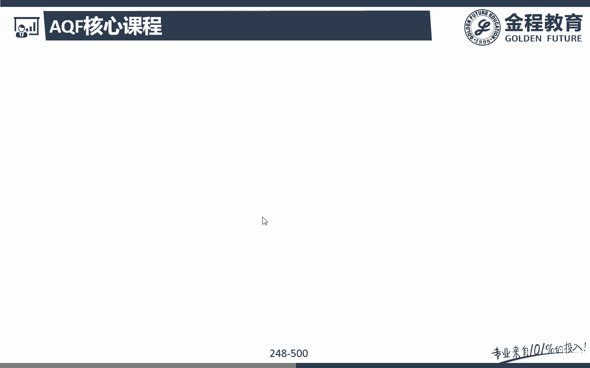

那么我们知道啊，这个CCI这种策略的话呢，嗯我们是要去用到算。

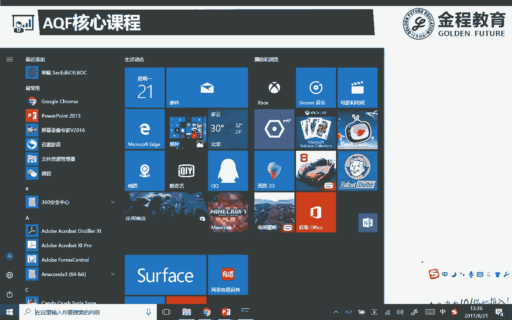

我们可以自己算啊，但是你自己算的没有人家算的好，也没有人家算的快，也没人家简单对吧，所以呢我们会跟大家说的，我们要用的是这里的嗯非常重要的一个库啊，技术分析里面非常重要的一个库叫做ta lib。

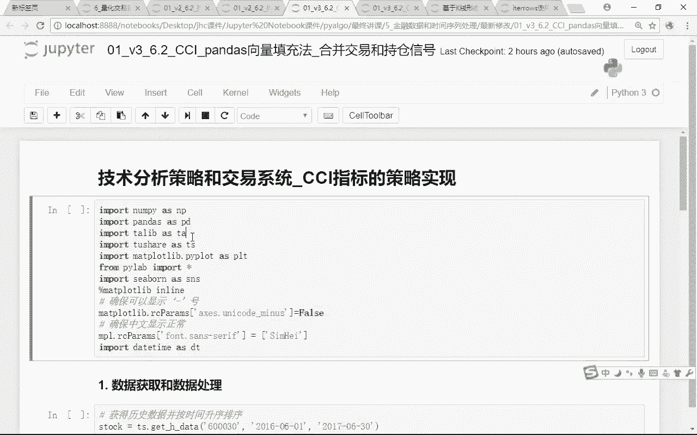

对吧好，那么呃安装ta lib的安装啊，是相对来说有一定的这样的嗯难度啊。

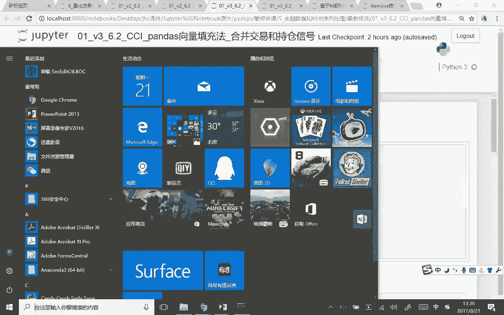

因为如果32位的同学电脑啊，你的电脑是32位的同学，你直接可以pip install或者康的install，贴贴列表没有问题，没有任何的问题啊，那如果说有同学的电脑是64位的话。

你直接pip或者说你直接康纳的话，那是不行的，它是会呃出错的啊，所以对于我们来说的话呢。

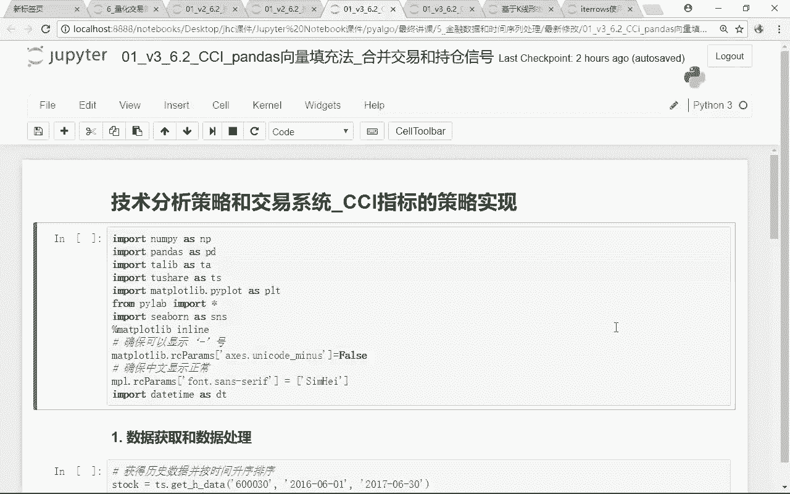

在我们这个里面怎么办呢，呃因为它官网上只提供了32位的这样子，一个下载啊，那么你要把它变成64位，那你就要用呃你自己的一个平台，把它给编译一下啊，那么这个编译的过程啊，我们都已经跟大家做好了。

那么对大家来说的话呢，你就不用去这个呃再去编译了啊，那么呃我们直接把这个安装包安装文件，到时候会随着我们这个notebook一起会发给大家啊，一个是呃python3。6的安装。

还有一个是Python r7的安装，那么主要对我们来说，我们用的课程主要用的是python3点呃六啊，呃咳咳，所以对我们来说呃，呃如果大家装的不是3。6，或者其他的一些版本的话呢，这个大家再来跟我说啊。

这个呃我到时呃呃到时候会贴给大家一个网址，这个网址上有各个版本的这个ta lib的，这样一个嗯编译好的，64位的一个下载就免去了，我们要自己去编译的这样的一个过程啊，编译也挺费时间的对吧好。

那先来教给大家一下啊，这个东西怎么装啊，因为WHL的文件你不能双击打开哈，这装不了的啊，那怎么办呢，注意啊，你再重新打开一个，我们这样的一个命令行控制行，那么打开这个命令行之后的话呢。

我们直接pip install，注意啊，这个原来是我们可以pap install ta lib了对吧，但是现在的话呢，呃这个我们一定要把这个放映的把它给去掉。

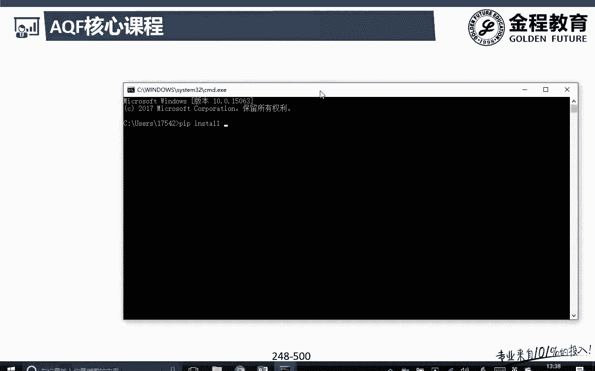

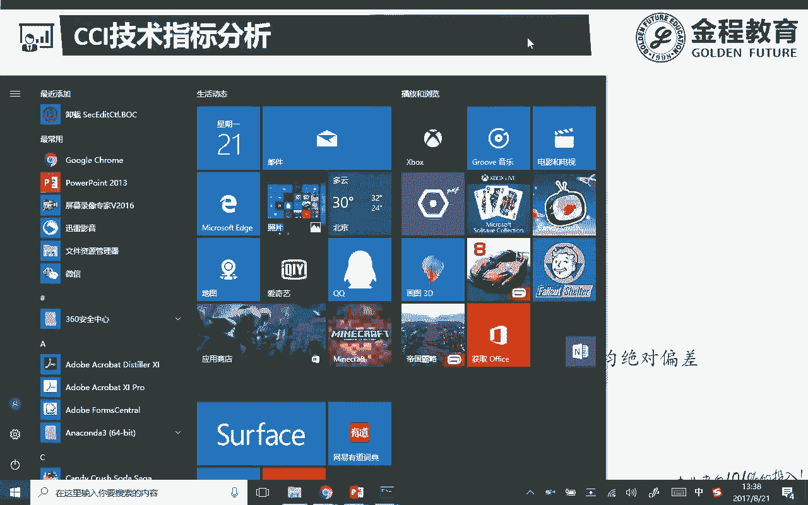

不然老是跳出来好，那么在我们这个里面你找到啊，你先拿出来你自己的装安装的这个地方呃，下载文件呃，安装文件的一个地址啊，完了之后呢，在CMD里面嗯，弄好ping install，完了之后直接把它拖进去。

看到没有哎，直接把它给拖进去，你就不用自己去拍这么大行的一段代码了，完完了之后，你直接按一个回车，他就会去在那里装了，那么因为对我们来说，我自己电脑里装过啊。

所以requirement already satisfied，那么大家如果没有装过的话呢，你就用我这种方法其实非常简单了，马上就可以改过了，而且注意啊，你这里别把名字改掉啊，很多同学自作聪明。

你名字取这么长，我就直接换一个贴A列本，把后面都删了啊，不行啊，这些是在告诉我们的解释器，它是哪一个版本的，完了就是呃32位还是64位，这个名字啊，你要一模一样的啊，别动别改啊，啥也别动。

直接tapping in store，把他推进去，把他拉进去就好了，听白思吧，那么python27的话呢，呃反正我们本身也不太用啊，如果有同学装的是双系统的话呢，你可以自己呃装的是虚拟过一个版本啊。

你就先切到那个py python27对吧，然后呢一样的再把他拉进去啊。

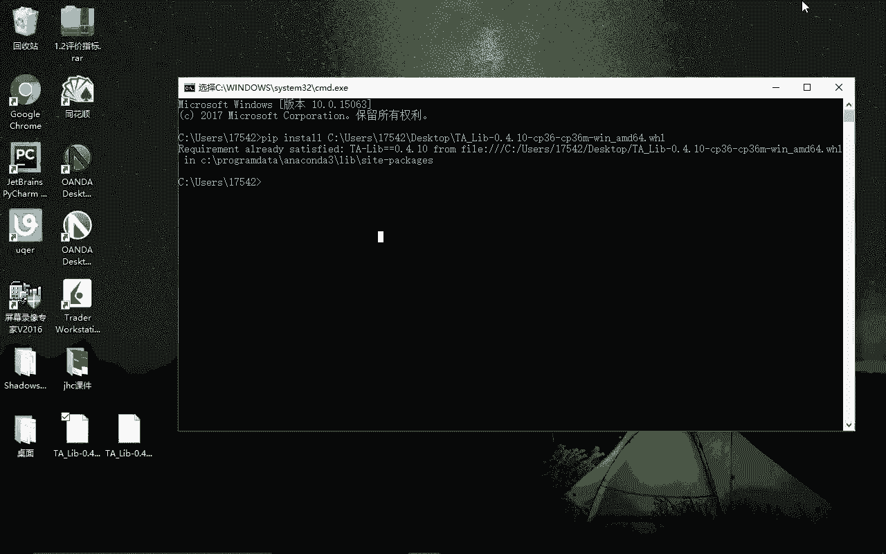

我们就不带他装了好，那么这是一个呃，比较简单的这样一个安装过程了。

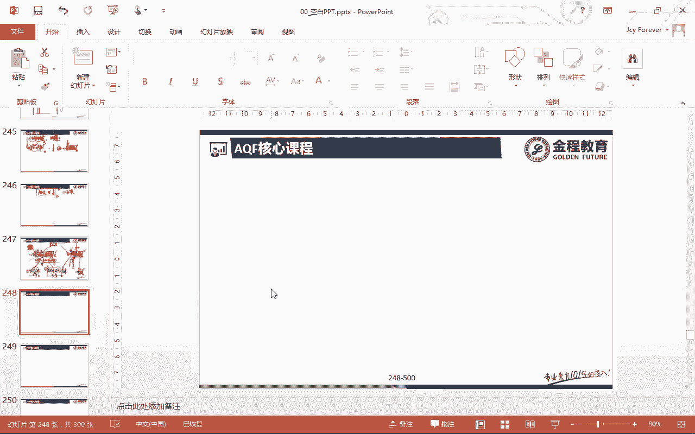

我们就呃讲到这里，装完了之后的话呢，看看有没有安装成功，你就import一下ta里的STA对吧。

看看他报不报错啊，安装成功的话，那你就可以直接import了，好那么在我们这个里面，我们就开始正式来开始讲，我们这个CCI的这个Python的实现啊，那么总体来说不难。

同时的话呢这个策略就跟我们之前的SMA啊，什么乱七八糟的那那些都很像啊，所以呃如果前面几个策略，大家掌握的比较好的话呢，那么这个CCI的这个策略，只是我的交易信号这一块稍微有些不同啊。

其他的都是一样的问题吧，好那么在我们这个里面我们一起来看一下呃，在这个里面有这样几个嗯呃library对吧，那么这些library的话呢，大家先呃应该都知道是什么对吧，哎然后就直接import一下啊。

那么在我们这个里面有一个嗯，它是一个这个中文的一个正常显示，这个跟之前也跟大家讲过，没问题吧，这是一个import一个过程啊，应该非常简单好，那么这个CCI的这个策略的逻辑啊，再来跟大家复习一下。

上一节课刚刚跟大家讲过CCI的话呢，它的取值范围是可以是非常非常大的，负的，-300到正300都有可能，但是在我们这个里面我们选了一个呃，正100~-100到正100的这样一个区间啊。

我们的这个交易策略是你这个注意这是CCI啊，在正100~-100里面波动没有任何的处理啊，那么当我们这个里面第一次呃，如果说是在额-100以下完了之后呢，我什么时候进行开仓呢，注意啊。

当第一次我的信号在-100以下向上突破，这里的-100这一个点上，我买入开仓，理解意思吧，那么在我们这个里面也是一样啊，直到下一个信号出来之前，我是不是一直持有啊，直到什么呢。

下一个卖出信号的开始卖出信号什么时候啊，注意啊，卖出信号是向上突破正100，我不卖出的啊，什么时候我再卖出啊，原来是在正义版上面，完了之后呢，突然有一天我这个里面在图呃，原来是正一版的。

现在就变成什么唉，向下突破了，这下跌突破了这100，所以呢在这个里面我们就开始在这一个点上，我们才开始进行sell，听白意吧，所以断完善我们这个策略非常非常简单啊，呃对我们来说。

前期可能是有一段空仓期的，因为不满足开仓条件对吧，如果说先满足的是先跌到-100以上，从-100上传到了正100，我买入开仓买入开仓之后，在接下来的一段时间内，全都是怎么样买入的，听明白是吧。

而且呃我们也没有考虑注意啊，目前简单的这些策略里面，我们都没有考虑那个额策略的持仓比例啊，现购买比例等等啊，这些都没有啊，我们都是只只做一手，那么是做额满足开做多信号的时候，我们做多满足做空信号的时候。

我们做空听明白好，那么在这个里面，我们其实在这一个阶段一直是做多做多做多的，那么到什么时候呢，在我们这个里面也就是在这一个点上呃，我这里的signal就会从原来的因为买入信号嘛，在这里开始买入信号。

那么是我们是正义，那么一直是正一，说明我是怎么样呃持有的，那么直到这一天这一天我开始卖出了，所以我给你的这个signal是不是就是变成一啊，顺便从这一天开始之后额，我就开始做空，哎咳我就卖出额。

所以对我们来说的话呢，这呃这是这样的一个呃策略的一个思想啊，这没问题吧，所以这一段其实我们都是做多的啊，那么开始下跌，突破了这一块之后的话呢，我们就开始反手做空了，能理解意思吧。

哎这是我们这个策略的一个啊原理好，哎，这个策略逻辑的话呢，相对来说还是比较简单的啊，好那么我们就来看这一个，首先我们这整个策略啊，还是跟我们之前讲的一样啊，分成三个部分，第一个部分是数据获取，数据处理。

第二个呢是交易信号和持仓信号呃，包括我们整个策略的一个逻辑啊，第三个的话呢是我们整个收益的一个计算，和图形的一个绘制好，我们一起来看一下啊，第一个部分数据的获取，这就获取很简单了对吧，不说了啊。

这个啊to share里面get k data，或者在这个里面给它呃，这个HDA一样的啊，那么呃呃啊啊这个我们没跑啊，那么在我们这个里面的话呢，首呃哎，额我们应该先要额看一下啊，这里应该是我们删掉了。

不小心，Import matt plot lip，as s m p l matt plib啊，我们重新来看一下，额啊，因为我们把matt plot lib简额简写成NPL了啊。

所以在我们这个里面把这里改成NPL好，那么这样的话呢呃就可以了啊，好那么这是第一步，import一个操作，那么input操作之后的话呢。

我们可以从to share上面get k data或者get h data，这些都是可以的啊，因为呃HDA和KDA的话呢，两个没有特别大的一个区别啊，一个KDA是一个它新最新的一个交易接口。

速度可能更快一些，KAHDA的话呢，它是它原来老的那个交易接口啊，Anyway，对我们来说，我们其实都是可以把我们的股票数据调过来的，好那么后面的话呢是salt index。

因为如果你要从get h data调过来的话呢，有些时候他的那个数据是反过来的，就是2017年6月30号是在最前面的，然后呢嗯这个最晚的数据在最前面，最早的数据在最后面对吧。

那么我们可能要在这里用一个insult呃，salt index的方法，那么其实这个也没什么啊，都都很简单的，那么对我们来说，那你完全在这里可以用get k data啊，因为在这里的话呢。

因为我们是为了帮助大家稍微了解以下，因为有些策略的话呢，呃大家在今后啊看其他作者的一些策略的时候，可能有些人嗯像我我啥都喜欢用最新的对吧，嗯就是比如说python3出来了。

我绝就绝对不用python2的，那么呃有些的话呢，他还是希望用呃习惯用老的那个版本啊，那其实不同的人有不同的这样一个想法啊，那么在这里带着大家认识一下，还有这个get h data，没题吧，好。

那么接下来的话呢我们要去计算这个CCI指标，那么这个CCI指标怎么算呢，注意啊，stock我们可以算额新建一列，在stock里面新建一列就到CCI，那么CCI这个指标怎么算呢。

如果说你不用ta lib的话呢，注意啊，你可能要三四行代码，但是呢如果你用了ta lib的话，那就很简单了，因为对我们来说，我们可以来看一下啊，在我们这个里面我们可以用ta点tab。

那么我们就可以看到ta lib下面，是不是已经帮我们嗯看这里啊，ta列表下面已经帮我们内置了，非常非常多的一些技术指标在这里了，看到没有，所以呢对于我们来说，我们只要掉，比如说我想算什么，算CCI。

那么切一点CCI我们就可以呃计算出来了，那么这个CCI指标非常简单，对我们来说，我们用不到其他的太多的一个数据，我们只要用到的是这支股票的，每天的一个收盘价就可以了，能理解意思吧，好那么对于我们来说啊。

收盘价额和这里的额有些指标啊，我们只要用到一些收盘价好了，但是呃有些指标的话呢，我们可能要用到开盘价，最高价和收盘价呃，那么这个的话我们可以拿CCI这个指标，来带大家看一下啊，那在这个里面。

其实CCI指标我们是会用到最高价最低价的，对不对，在这里面有显示啊，最高价最低价等等，所以呢对于我们来说这个high low呃，clothes我们可能都要用到啊，那么在我们这个里面的话呢。

怎么去计算这个CCI呢，很简单，那么我们只要把它的最高价，最低价和啊什么收盘价告诉他，最后还有一个参数，这个参数是我算的是几天的这样一个CCI，我们的周期是20天，没问题吧，当然你也可以稍微改一下。

默认是20天啊，你可以改一下是吧，50天啊，其他天都是可以的，那么呃在这个里面的话，相当于是把这个股票的最高价，给到我的CCI了，注意我为什么这里要用NP点s error啊。

这个我们之前在讲金融数据处理的时候，就跟大家讲过啊，我传递进去的数据必须是nd array，能理解意思吧，你不能传一个serious啊，所以呢对我们来说的话呢。

你就把这个呃he这一列原本应该是一列series，我们直接用NP点s array，是不是把它转换成了我们的恩迪瑞啊，听明白是吧，哎那么最高价，最低价和收盘价在这个里面的话呢。

那我们就可以直接就算出来这个CCI了，那么那我们来看一下啊，stock等tail cci这个指标是不是都有了，哎好那有同学说了，季老师啊，我怎么知道我这里的参数是要给他最高价，最低价和收盘价。

还有一个time period等于20呢，呃有两种方法啊，第一种方法的话呢，你直接可以去google上搜啊，Ta lib，然后的话呢他有一个官方接呃接口的说明文档，那么你可以看一下它这个文档里面的啊。

我具体的一个参数，那么还有一种更简单的一种方法，在我们Python里面你自己也可以直接用啊，比如说我就要看CCI这个，那么我们就在TACCL后面，注意啊，你打一个问号，明白了吧。

那么这个时候他就会告诉我们，这个TACCI这个东西的话呢，呃这个呃方法它里面的一些参数是什么，那你看在这个里面嗯，他自己会跳出来呃，CCI里面给到我们的是一个什么最高价，最开始的是最高价，完了之后呢。

当中这最低价close收盘价没问题吧，最后我们要给他一个time period啊，给他一个多少周期的，对不对，所以呢在我们这个里面呃，比如说high low clothes，那么在这个里面用的是14。

对不对，哎，所以呢在这个里面，其实各种各样的指标的一些用法，咱们去用的包注意啊，包括比如说我自己写了一个函数，或者说我们后面面向对象的时候，我们自己写了一个类，这里面有些什么参数。

我直接可以通过点问号呃，这样的一个方法的话，那我们就可以把嗯它一些详细的一些呃，具体的一些函数啊，参数啊，我们就可以拿到了，听明白是吧，哎好那么你要算这个CCI指标的话呢，我们只要把这些输入变量给到它。

我们就可以算出来了，问题吧，好嘶咳咳，那么这一列只是我们刚刚算出来这个CCI，对吧好，那么接下来的话呢，我们就可以绘制这个CCI的这个指标图呃，那么绘制指标图的时候呢。

我们在这里用到了一个supper p super plot这个图呃，图形大家还记得吧，什么叫做support plot at，我们是不是可以绘制的是一个什么子图，对不对，哎。

那么这个子图是211代表什么意思啊，一共有怎么样两行，然后呢，一列相当于是我是上下排列的两行一列对吧，那么这是第一个图，这呢两行一列的这个子图里面的是吧，第二个图没题吧，好现在在我们讲完那个呃。

叫什么图形可视化之后，金融可视呃，数据可视化之后，这些代码是不是可以看得懂啊，这说的什么哎，我上面这个子图的话呢，我有一个标题就是600030的CCI指标图，对吧好，那么这一行代码的话，那就是注意啊。

因为我是子图，所以呢上图和下图可以共用一个坐标轴，那么对我们来说，其实我就是忽略或者说不显示，不显示我的横坐标X轴哈，呃横坐标轴，那么这行代码的话呢，经常能看到这一个啊。

大家知道一下就有这样一行代码就好了，也不一定你要自己能写出来，那么这样好写不写，不影响我们整体的一个作图啊，那么完了之后的话呢，我们就可以嗯stock close，我可以把这个股票里面的呃收盘价。

把它给plot出来了，然后的话呢plot at出来的FIXS是怎么样，哎十杠八对吧，哎这是我的一个尺寸，那么额咳咳，后面的话呢，呃这个PLT的legend的这个加不加都行啊，因为你没有添加label。

那么加label的话呢，你就一定要加这个里面的嗯，PRT的人真的好，那么在我们这个里面，下面这张子图也是一样，stock点啊，因为stock点CCI点plot对吧好，那么在我们这个里面。

我们就可以把这个图形把它给绘制出来了，那么你看这是两张子图，这是上面这张图，这是怎么样，下面这张图，那么上面这张图的横坐标我让它没有显示，因为对我们来说，下面这张图的横坐标是不是可以给它共用啊，对吧。

那么对我们来说的话呢，上面这张图是价格close收盘价，下面这张图呢是我们的一个CCI，没问题吧，哎这个数据可视化的这个代码，是不是自己应该能写出来了，问题吧，哎所以啊我们课程都是经过精心设计的。

先讲什么再讲什么，对不对，好注意啊，这里不加lend的还是不行啊，如果你不加lend的话，额就这两个label还是会没有，因为我们在这个里面，我们用的是呃stock里面。

这个data frame里面这个close排port出来的这种方法，对不对，哎好那么这些都是一些表面上的一些点，然后我们把这个图给画出来了，关键核心来看这里，这里是我们交易信号，持仓信号和策。

交易策略的逻辑的一个核心的重要的一个点，那么我们一起来看一下，在这个里面，在这个里面的话呢，我们首先生成了新的两列啊，一列叫做yesterday，yes嘛，Yes，CCI对吧。

yesterday的一个CCI，还有一个呢我们要生成一个前天的一个CCI，就是day before yesterday的这样一个CCI对吧好，那么呃因为当天的CCI我们是有的。

所以昨天的CCI就是往前移个就是shift one，那么大前列的CCINA呢，就是我这里的shift to没问题吧，好那么我们可以运行一下之后，我们来把这个stock点head，我们把它给输出一下。

大家就可以比较好的可以来看到了，好呃，那么在我们这个里面啊，因为我们的CCI是20天的，那么我们就用tail来看，那么在我们这个里面，你看啊，一个是当今天的CCI对吧，还有一个呢是昨天的和前天的CCI。

那么在6月28号，那么这里时候，今天的CCI是不是就变成了6月28号的，怎么前天的CCI是6月27号的，昨天的CCI没问题吧，哎这两个我们就能看出来了，这这两个应该没有太多的一个问题，对不对好。

那么在我们这个里面，我们看到它里面好像是他的金额，这里有点大，SN5L就这样吧，呃我们也就不做，不去做过多的这种格式方面的一个调整了，好那么接下去的话呢关键问题来了。

我们要进行一个嗯开平仓信号的一个生成，那么我们一起来看啊，怎么去生成的这个开仓信号和做空信号，我们在这里写了，你看对我们来说只当我们前2日的CCI，或者不要叫前2日吧。

或者我们说到我们的前天的CCI小于-100，然后呢昨天的CCI大于-100的时候，我们视为怎么样开多型号问题吧，这个是不是就是我这里跟大家讲的一个逻辑啊，前一天我是小于-100的。

下一天我是大于了-100，所以呢在这一天我们就可以知道对嘛，说我这个CCI指标是不是向上穿，穿过了这-100啊，那么在第一位向上穿过-100，我们认为是一个积极的一个做多信号，没问题吧。

好那么怎么去做的呢，在我们这个里面哎用到的还是NP点，where are的方法对吧，好NP点VR的方法的，它的那个结构大家应该还记得NP点，while后面是一个逻辑判断的一个语句。

好如果这个语句成立的话呢，我让它等于它，如果这个语句false的话呢，我让它等于它，这应该没问题的，对吧好，那么在这个里面有一个比较关键的一个点，在我们这个里面，我们这里的逻辑判断有几个哎。

我们这里的逻辑判断的情况有两个啊，一个是什么，我前一天的要是小于-100的，还有一个判断的情况是，我后面一天昨天的这个是不是要大于100啊，所以这两个条件我要同时满足，所以我们要用到能派里面的一个方法。

叫做roll jk and，就是逻辑语嘛，逻辑语的话呢就是要两这两个同时成立啊，但是你不写这一个啊，也是完全可以的啊，我们可以写成什么样子的一种方法呢，在我们这个里面，我们大家重新来用一个。

大家可能比较熟悉的一种写法，这两种写法都是可以的，所以啊对我们来说，同样一件事情，我们可以用嗯多种不同的方法来去实现它，对不对好，那么我们只展示一个啊，后面的话呢我们就不用这个了。

我们还是用这里的逻辑语听明白意思吧，一样的啊，那么这里面我们可以用一个什么呢，我们可以不用这里的逻辑语啊，那么如果有同学有印象的话，那我们可以知道啊，在我们这个里面，我们有逻辑与他专门有一个符号是。

就是这个and符号对吧，哎但是你要注意要同时满足这两个条件，我要把这两个条件的括号咱都得把它给括起来，这是一个条件，这是第二个条件，我要同时满足，我是不是可以直接可以用这个and符号啊。

如果这两个条件同时满足的话呢，我们给它的标记是一，如果这两个条件不满足的话呢，呃不满足这个条件的话，那我们是不是给它定义的是一个NP点，NN对吧好，那么我们来看一下啊，那么这个里面。

这个我们是可以达到我们这个目标的啊，那么同样的道理，如果我们把它给注释掉的话呢，我们用这一个行代码，我们也是可以得到我们这一个呃，这个目标的问题吧，好额那么咳咳，在我们这个里面。

我们可以先来打开看一下啊，在这个里面你看yesterday a day before，和包括这里的我刚刚新定义的这个signal，是不是也都有了，是吧好，那么来看一下啊，这一行代码我们已经知道了呃。

他做了些什么事情，这个代码的话呢其实很简单，也就是说只要我前天的CCI是小于-100的，昨天的CCI大于-100，是满足了我这个里面的开仓信号，所以开仓信号我给你的是一听明白。

那么啧没有做多信号的这些呢，我统统给他怎么样定义成NP点NN，那么直接把它定义为空值，定义为空值的原因，我们之前在讲spread的，在讲那个pre training的时候，是不是都跟大家讲过啊。

因为我空值的话，我后面就非常容易的，我可以向前填充，对不对，因为此呢我现在做了这个开多信号，直到下一个信号开呃，直到下一个交易信号出现之前，所有的型号都应该是，跟我前面那个信号是不是一模一样的。

所以我们直接通过我这里的FUNA，是不是就可以了，对吧，哎我们后面再来跟大家说啊，好，那么这里呢这行代码只写了开多的一个信号啊，那么接下去再看开空的这个信号，开空的这个信号呢，就是这一行的这段代码。

它说什么开多，什么时候我开多啊，前天我呃开空，什么时候我是开空的信号，前两日也不要了，这些怪怪的啊，前天的这个CCI是大于100的啊，但是呢昨天的CCI小于100，那就说明了在我们这个里面。

是不是前一天是大于100的，在上面的下一天你小于100了，在下面是向下跌破了这100，所以都买说我们你看前一天前天大于100，昨天小于100，那么这个时候我们就开空，那么开空给你的信号是什么。

一没问题吧，那么如果不满足这个条件，注意啊，你不满足这个条件的话呢，还是让它等于stock signal，就是什么，让他跟原来的这个signal是不是一样，保持一样，对吧好，那么在这个里面的话呢。

我们其实写到这里，我们就已经嗯知道了是吧，在我们这块写完了之后，其实什么时候做多，什么时候做空，我现在是不是已经知道了对吧，那么剩下的怎么样，剩下的我只要怎样FNA是不是就可以了，因为哎这个注意啊。

这种写法是我们把什么额信号这个交易信号，交易信号和持仓信号的一种写法啊，所以这种写法的话呢，虽然可能写起来比较简单啊，但是呃同学们，大家自己再去看这个代码的时候呢，可能就会看起来稍微吃力一些。

因为在这个里面什么时候做多，什么时候做空，我是不是已经定义好了好，那么接下来要怎么做，是接下来是不是很多值都是空值啊对吧，那么对我来说的话呢，在下一个信号出来之前。

我是不是应该继续沿用上一个信号的内容对吧，所以呢在我们这个里面，你看啊，在我们这个里面，在这一段是不是满足了看多信号，所以他是正一没问题吧，在这个点上它就变成正一了，那么在这个点上呢，它就变成什么一了。

那么只有这两个点是现在是不是有值的，一个是正一，一个是一，那么接下来怎么办，剩下的这些值都是空值吗，现在现在都现在，这些值都不满足我前面的那些条件，所以呢现在的这些值是不是都是空值啊。

那么这些空值怎么去处理啊，很简单嘛，fulfill怎么样，NA对不对，所以动漫来说怎么样，咳咳你现在产生了一个交易信号是加一的，那么我后面的这些一直都是加一，直到下一个信号产生的时候。

下一个信号是不是产生的是一啊，所以一进来了之后，所有的下面一个小一型额一以后，直到下一个信号出来之前，这些点是不是都是一啊，所以对我们来说的话呢，接下来我们要做的这一件事情就是for fl是吧。

嗯A那么FILNA的话呢，我们的method主要用的这个method，是不是for就是for fia对吧，那么在这里的话呢，像嗯相当于是向前填充了，所以这句话也非常非常重要啊。

就是在呃这句嗯哼之前应该已经知道对吧，在下一个信号产生之前呃，都是沿用上一个信号问题吧，哎好那么最后为什么还要加一句呃，for fl n a呃，fl n a等于零呢，因为在我们这个里面刚开始一段时间。

哎，是不是也是没有开仓的对吧，那么在这段期间的话呢，现在就是NAN对吧，因为现在在这段条件在正-100到正100之间，不满足我任何的开多和开空的一个条件，所以刚开始的这一段时间，现在也是一个空值。

那么我前面用的是fulfill n a对吧，那么呃是向前填充是有数据的，以后再向前填充，但是你现在向前填充第一个数字，你就是空值，所以呢他还是空值对吧，那么没办法，那么对我们来说，我要另外再加一句呃。

fl n a等于零，也就是说现在等我后面都已经向下填充，填充完成之后，如果还有空值的话，是不是只有可能是最前面这一段，我没法向前填充吧，因为你最开始的这个数字就是空值，你向前填充还是空值。

那么只剩下最前面的这一段，所以呢我们在给，所以前面这一段在fulfill什么NA，然后它等于什么零，那么这样的话呢，相当于我这里的空值是不是都已经解决完成了，对吧好。

那么这也是我们整个交易策略的一个核心啊，开平仓型号和持仓信号都在这里写好了，那么在我们这个里面，我们先来看一下我们可视化的一个图啊，那么在这个里面的话呢，我们发画了三张图，第一张图是收盘价。

第二张图是CCI，第三张图是signal，我们先别管这个图是怎么画的啊，那么先来看下这里，在我们这个里面的话呢，确实我们就可以看出来诶，第一张图是呃有点大，我们稍微把它换小一些好了，额。

等把它变成18好了，不然的话因为我们是放大给大家看的，为了让大家看的更清晰一些好，那么再这样的话呢，我们就可以把三张图放在同一个里面了，所以我们会发现这是第一张图是我的收盘价，第二张图是我的CCI。

第三张图呢是我们的产生了一个交易信号，那么在这个时候交易信号我都已经怎么样啧，我都已经处理完成了啊，因为不然的话嗯如果有一个中间过程的话呢，我们后面会带大家看一下啊。

这个中间过程是一个什么样子的一个过程，那么在这个里面，其实你看额前面部分没有任何的交易信号，是不是就是零啊，好直到产生第一个交易信号之后，他是额在我们这个里面是额做空的对吧。

那么我们大概可以看到大概是在这一个位置，对不对，哎上下对齐嘛，大概是在这个位置，我是从上面的100以上往下跌，破了100跌下来了，我是不是又开始做空啊，好那么在这里是又开始做多了，唉果然在这里也是这样。

你看在我们这个里面呃，大概100位置在这里附近，那么在我们这个里面的话呢，向上突破100的时候，在这一块我是不是开始开多了对吧，哎所以呢对我们来说其实这一个呃，但这个交易信号我们就已经产生了。

包括我的持仓信号，现在是不是也都已经产生了对吧，那么嗯，这个时候我是把这里的交易信号和持仓信号啊，把它写在一起了，听明白意思吧，那么我们来看一下，如果说我想把它分开写的话，交易信号归交易信号。

持仓信号归持仓信号，那么这种写法是怎么写的呢，这种信写法可能相对来说大家更好理解一些，因为如果大家熟了啊，你就可以跟我一样，把我的交易信号和持仓信号写在一起呃，先是正一，再是什么一负一，正一之后的话呢。

剩下的都应该是没有任呃，产生了消息信号之后，其他的没有没有交易线，没有数值赋予的那些的话呢，我统统fulfill n a，那么向前填充上一个交易信号，会全都填充完我这里的空值，那么这样子的话呃。

代表着我这里的信号是都已经产生了，对吧好，那么接下去带着大家来看一下啊，在呃在我们这个里面，我们用这个分开去写。

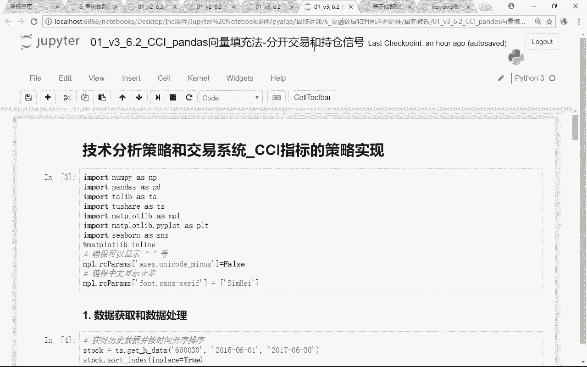

这个交易和持仓信号的这种写法，那么还是一样啊。

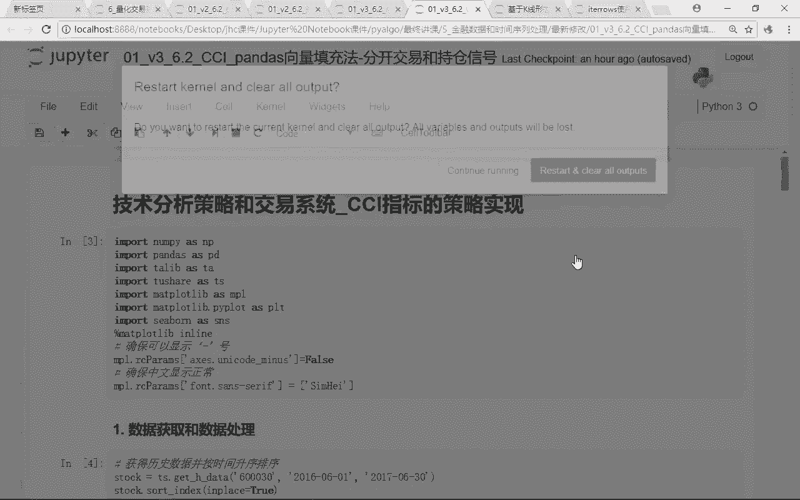

我们先重启一下，好那么在我们这个里面我们来看一下啊，我们前面都一样啊，运行一下，这里我们就不说了啊，嗯获得600030这支股票的一个数据计算，这里的cci tale，绘制CCI的图形。

这些都跟我前面的那个策略一模一样啊，额我这里两种不同的写法，只是一个合并了交易的信号和持仓信号，还有一个是我是分开去写交易和持仓信号的咳，好那么这张图我们也出来了，对吧好，那么接下来的话还是一样。

我先计算出昨天和前天的这样一个CCI，好，那么来看这里这张图，这张图的话呢，呃你看啊我们在这里面我就只做了一步，只做了一个产生交易信号，但是我并没有直接输出做我的这个持仓信号，看到没有。

那么交易信号还是一样，我的signal什么嗯，同时满足前前天小于-100，昨天大于100做多，那么做空信号呢是前天大于100，后天小于100呃，呃前天大于100，昨天小于100，我们是做空问题吧。

好那么这个时候的话呢，我只产生了signal，并没有产生position，并没有产生持仓，听明白意思吧，好那么呃大家可以来看一下这里啊，怎么可以去看出来呢，你看这里我们全都是把它换成14号了，咳咳。

或者全都是爸爸，咳咳咳咳，那大家可以看到，在这个里面我们只知道这一个点上，我们做多了这个点，这个点这个点产生了做多信号，能理解意思吧，所以呢在这个里面呃，其实我们可以呃写的更细一些啊。

这里面第一步是产生产生交易信号，这一个写法的话呢就是跟前面的那种写法呃，更分步走啊，你看呃，在这里面我并没有算持仓啊，只算了交易型号，这一天这一天这一天是不是有做空信号啊，没问题吧。

好那么现在只算出来的是信号，那么怎么样算持仓呢，注意啊，下面这一行2。2这一行才是计算持仓，那么这个持仓是怎么计算的呢，原理也是一样啊，我们来看一下，咳咳在我们这个里面，如果说前面的这个signal。

我们是不是已经定义好了啊，好那么对我们来说，这个signal在定义的时候，你看如果是满足开多信号的话呢，是一，然后呢咳咳其他区域条件是零，如果满足做空信号的话呢，是一。

区域情况是这个stock signal，所以在我们这个里面，我们产生的这个signal图形里面就是三个数字，应该一负一零没问题吧，但是咳这只是一个交易信号啊，并不是我们的一个持仓。

因为什么你看这一天产生了做多信号，那么在下一个信号产生之前，接下来的这段期间，我是不是应该都是做多的，同样的道理，在这一天，比如说在这里这一天产生了做空信号，那么在下一个信号产生之前。

其实我都一直是什么诶，继续做空做下去的对吧，那如果说你是做空信，下一个信号还是做空，那么我们是不做任何的一个处理，我是默认忽视了这个信号，我们是仍然是做空的这样一个信号，只有当什么原来是做多的。

原来是做空的，现在变成做多了，那么这个时候我的交易信号额，我的持仓我们是不是会发生改变啊，好那么在这个里面我们来看一下呃，如果说当我们的signal等于零的时候呢，我们给他什么，我们也是一个NPV啊。

只是我把前面这两个拆成两段来写了对吧，如果说我这里的交易信号是等于零，我给它赋值的是NP点N，给他一个空值，如果不是零的话呢，就是还是你原来的那个数字，那么言下之意，现在是不是就变成前面那个你是正一。

你是一，我还是让你是一样的，那如果说你是零，就是前面的那个没有产生信号的时候的话呢，我给他，我给你一个呃空值问题吧，那么接下来做的这部分干嘛，哎你看也是一样，Stock position，注意啊。

position就是我们的一个持仓信号了，stock position等于stock signal点FUNA也是向前填充，对不对，哎那么这里有一个信号一直向前填充，这里有一个信号一直向前填充。

直到下一个信号产生之前，我是不是都是向前填充啊，好那么在这个里面，我们这一行代码我们就是在计算持仓，那么来看一下，计算完持仓之后，我们就会发现，你看现在我变出来的产生的这一段的持仓信号。

跟我这个里面直接画的这一段的持仓信号，这两个持仓信号是不是应该是哎，我们往上走一点啊，这一个持仓项和跟这里的这个持仓线，我们会发现，这两个时候是不是就开始才就一样了，所以其实对我们来说。

交易信号和持仓信号分开来写啊，一样的啊，只是我先算交易信号，算完交易信号之后在计算持仓信号，咳咳但是不管我是并在一起写，还是和开额分开来写，其实呃我们产生的这个结果，是不是应该都是一样的问题吧。

哎好咳咳，这一个呢有了持仓信号之后，我就已经知道了，这一段期间我是做多的，那么这一段期间我是做空的，这一段是做空，这一段是做多的，没问题吧，哎什么时候做多，什么时候做空，我都有了。

那么这些情况都有了之后的话呢，接下来我就很简单了，我第三步，我就可以开始计算我整个策略的一个收益了，策略的收益怎么算，我先算出策略的额，每一天的一个return，每一天那一个return的话呢。

就是收盘价去计算CPCT点，change ge对吧好，那么我在可以计算每日的这个，收益率哎在这个里面啊，大家要注意啊，计算收益率其实很简单，我只要把每天的这样一个额，我这是我整个策略的这支股票的。

我直接买入并持有的一个收益对吧好，还有一个收益是什么呢，我策策略的这个收益对吧，strategy的这个收益，strategy的这个收益应该是拿我的呃，这个strategy的return啊。

这个股票的一个return，去乘以我这个stock的这个signal对吧，那乘以我的这个交易信号，你是一我就做多，你是一，我就做空，没问题吧，很多同学哎在这里啊，很多同学会自然而然想当然的以为诶。

嗯季老师，你说过SMA策略里面，包括我们的pre trading里面产生了交易信号之后，交易信号必须要shift one之后，才能跟我的股票的收益相乘，为了去避免我的一个什么函数啊。

唉未来函数是不是我们之前讲的策略里面，所有的策略里面都加了这个点shift y，因为什么今天产生的信号，我要明天我才是能知道我是买卖的，是不是这样，所以在我们这个里面很多额有望同学啊，你往前翻一下。

在我们SMA和p l trad里面，都有加了这个shift one，那么请问大家在这里面，我还需不需要算这这个策略的这个收益的时候，我们还需不需要加这个shift to one，哎有些人说要加对吧。

哎要加我就不会拿出来去说了啊，注意啊，这个策略里面我们是不用加设这里的这个shift，完了这一点一定要注意啊，不用再加这里的电，shift完了，那有些人说老师为什么这里就不用加了。

你不是额今天产生的头寸，我要乘我要shift one之后，呃咳咳，我才能去乘以我这个里面的这个股票的收益嘛，对不对，很多同学会有这样的一个疑问，那么大家想看为什么，哎大家来看啊。

前面这里不用加shift的一个核心原因是，因为我在这里算这个信号的时候，我已经非常明确了，你看我这个里面，我是不是算出了昨天的CCI和什么，咳咳咳，前天的CCI是不是我都用了，所以我在算这个某。

当这这当天的这个信号的时候，我就已经用了昨天的和前天的CCI，去算我今天的这个信号，所以其实这个信号我在算的时候，就已经考虑到了，怎么样昨天和前天的这样一个时间顺序，听明白意思吧。

那么比如说我们在这个里面，可以带着大家来看一下啊，在这个里面，比如说我们在这里信号已经生成了，我直接通过stock点tail，那么在我们这个里面我们就可以看到，你看这里是CCI，今天的CCI。

昨天的CCI和怎么样，前天的CCI对吧好，那么我们多产生几个啊，呃往前看50个好，那么在我们这个里面，我们会发现你看在这一天这一天呢，这个signal是不是正好发生了改变啊。

这一天的signal6月5号的时候，这一天的C格呢我是从一变成了什么一好，我们来看一下啊，这在这个里面呃，是不是我当天就可以拿到一这个头寸呢，唉其实我们是可以的，为什么这么说啊。

我们来看一下我为什么当天17年6月6号，我是可以开一啦，因为在17年6月6号的时候，我们可以用到前面两个交易日的数据，一个是6月2号，一个是怎么样，6月5号没问题吧，所以对于我们来说。

这是17年6月6号，今天的CCI，这是他的怎么样，昨天的CCI，这是他的一个什么前天的CCI，所以今天的CCI，我是这个，我是确实只有今天收盘了以后我才能知道，但是昨天的CCI和前天的CCI。

哎我在今天看盘的时候，我是不是就知道，所以多尔玛说，其实因为你看129就是这只股票，前天的这个CCI，86。37，就是这支股票昨天的这个CCI，所以其实说白了在6月6号开盘的时候。

我就已经知道昨天的CCI和今啊，前天的CCI谁大谁小了对吧，那么我们来看一下满足不满足，我前面的那个逻辑啊，是满足的，因为我前天的CCI是什么，129，昨天的CCI是多少，86。

说明我这个CCI是不是上在100以上，那么在这个里面从100以上下跌到了100以下，所以呢在这个时候在今天我就知道了，前天你是大于百的，昨天你是小于100了，所以我今天开盘的时候，其实我就可以做空了。

能理解意思吧，所以今天这个一这个return啊，这个收益我是今天开盘的时候，我就已经知道了，你昨天和前天的一个具体的情况，那么你今天开盘，其实理论上来说，开盘的时候我就可以开始做空。

我就可以获得当天的这个收益了，所以对我们来说，这个signal其实已经考虑了昨天和前天，听明白意思吧，所以这个signal的话呢，我直接去乘以我今天的这个return就好了。

我就不用再去shift one去乘以昨天的这个数，这个呃呃我就不用去shift one，去拿昨天的这个信号去乘以我今天的收益了，能理解意思吧，哎所以这一块啊，这里是非常非常核心的一个点啊。

不用再加shift one了，你加了这个shift one的话呢，你这个策略其实又是会有一定的偏差了对吧好，那么累计收益呢累积收益很简单，累计收益的话呢，就是把我的嗯股票的累计收益。

就是把我的每天的呃return加一，然后呢累累成对吧，这已经写过无数遍了，策略的累积收益呢，这应该是策略的收益累成对吧，哎好那么我们把这个策略执行一下呃，完了之后的话呢，我每天的这个策略的收益。

这个净值曲线我们就可以画出来了，那么最后的话呢，我们就可以画出这张这个图形了，这个图形点plot p l嗯，12嗯，16好了，那么600030CCI收益图好，那么我这个里面来着的来着呢。

默认啊你加不加都无所谓了，你看都是它会出现在我最优的这个里面，所以呢在我们这个里面，我们会发现在股票价格下跌的时候，return是跌的时候，因为我用CCI的这个做空的一个机制啊。

所以呢我们在这个里面我们是不是开始讲了，但是有呃有这段部分确实表现不错啊，但有些时候我们部分其实表现的不好了，你看在这个里面股价还一直是涨的，但是在我们这个里面，我这个策略其实在这一天某一天。

我就判断我要做空了对吧，做空其实他认为在这一天，我的CCI就已经从100以上掉到100以下，我就做空了，所以在这一段期间，我的股票价格是上涨的，但是我策略的收益是负的啊。

额所以我整个策略的话最终虽然还是跑赢的，但是有些段我们跑表现的不错，你跌的时候我反手做空，我确实获得了收益，但有些不地方，比如说在这里这一段明明我的策略是涨的。

但是你CCI给我的这个信号是做空的信号对吧，所以呢我这个信策略，还是有一个比较大的一个回撤啊，所以对我们来说，最终的话呢我们就可以通过这个代码，我们就可以知道我这个CCI策略。

在我这个600030这支股票里面，我做多做空的这样一个呃，根据我这个策略的一个净值曲线，我的一个收益1。15啊，百分之实物啊，看着还不错啊，但其实呃真真正正在试盘的时候，肯定就没有那么高了对吧。

我要考虑手续费啊，其他的一些因素的影响好，那么这个就是我CCI策略的一个Python的一个实现，那么我们跟大家讲了两种方法啊，一个是虽然都是向量填充法啊，但是呢一个是合并指合并交易型号和持仓型号。

还有一个呢是我这里的先写出交易信号，哪些天我产生了做多和做空信号，再产生了我的这个持仓信号，其实说白了一样啊，产生持仓信号就是浮FNA嘛，对吧哎好，那么这两种方法的话呢，就是通过向量填充法的。

那么我们接下来呃这个例子啊，我们就讲到这里，接下来的话呢我要跟大家讲的是布林带，布林带这个方法我们就不用向量填充法了，我们要用循环的方法来去跟大家说好，那么CCI的策略我们就讲到这里。

