# 2024年金融大神老师讲解量化金融分析师.AQF—量化金融专业知识与实务 - P3：《+威❤hhh427501  了解获取全套课程》03.量化投资与技术分析_3布林带策略_1 - 量化沿前 - BV1oU411U7QM

好各位同学大家好，那么接下来的话呢，我们跟大家讲的是布林带指标啊，那嘶呃bling的这个嗯咳咳Python的一个实现方法，那么布林带这个指标的话呢，注意了啊，他完全其实完全是可以跟我们前面一样啊。

我们用那种呃填充的这种方法啊，判断向量化填充的这种方法去编写这个策略，但是的话呢，因为我们后面比如说我们在讲CCTA策略的时候，会用到一些呃当天的这个K线的，日内的这个K线的一个交易的一个处理啊。

如果你要用像前面的那种嗯前向填充啊，这种判断是向量化这种方法的话呢，它只能处理最简单的，那么有些非常复杂的一些东西的话呢，你用那种方法你就没法去做了，我们只能用这种嗯怎么说呢。

就是呃更复杂一点的这种循环法啊，呃来去跟大家去把这个呃策略背后的一些点，把它给弄嗯写出来啊，那么其实这个布林带这个策略啊，其实完全是可以用前向填充啊，在这里用循环法，只是完全把这个在这里。

只是想跟大家把这个循环法这个方法啊，一个一个的这种运作思路来带给大家，这种策略的这种编写思路带给大家，这种思路跟我们之前所有讲的所有的策略，包括moving image，Momentum。

Mureverting，Pair trading，包括我刚刚前面跟大家讲的那个嗯，CCI的那个策略，他的思想思路啊完全都是不一样的，听明白意思吧，哎而且这种循环的这种写法的话呢。

也是我们后面优化的呃呃的一个基础啊，好我们来开始看嗯这个布林带这个策略。

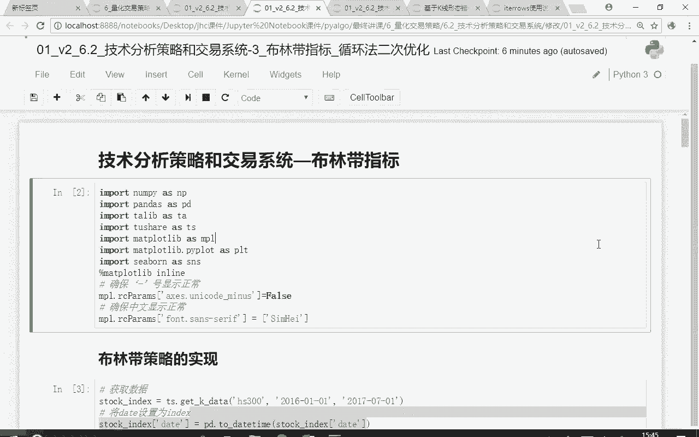

那么在讲布林带这个策略之前呢，我要先把这个strategy啊，先跟大家来介绍一下呃，布林带的这个strategy他是一个什么样子呢，呃大家知道啊，对我们来说，布林带的话呢一共有三根线对吧。

哎一根是上轨阿帕，还有一个呢是lower的下轨，还有呢一个是我们的这里的这个middle对吧好，那么在我们这个里面，我们的策略是什么呢，这个策略我用的是跟，类似于我CCI的那个策略啊。

也就是说当我的股票价格注意上涨，突破我这里的上轨的时候，哎这么不做事情啊，什么时候我在做的事情呢，我上轨突破了之后又跌回来了，明白意思吧，又跌回到我这个下轨以下了，那这一个点上我们开始怎么样shot。

我们开始做空，那么同样的道理，如果我的股票价格在里面，我们也是不动的，什么时候股票价格开始动呢，注意呃，先要跌破下轨，跌破下轨咱也不做事情呃，当我什么时候开始做事情呢，跌破下轨之后向上突破这里的下轨。

这是我们的一个lp session买入的一个信号问题吧，哎所以只要在两轨呃，但是其他时候的话呢，我们都还是一样，你如果这里是狼的，一直是朗朗朗朗朗朗之，如果说你这个里面又突破下轨了，再回来了，还是浪。

没有没有出现short的position的时候，这个里是什么东西，一直都是拉直到什么时候，唉，直到在这个里面，我先上涨突破这里的上轨，然后又再跌下来，比如说伤口在这里的话，在这一个点上。

我才会把前面那个long position调整为我这里的，怎么short position能理解我意思吧，哎所以对于我们来说的话呢，这个就是我们这个strategy啊，这个呃咳咳这个策略的一个呃原理好。

那么我们来看一下啊，其实我们会发现，这个策略其实是跟我们的CCI的思路，是非常像的一个思路，对不对啊，当然这种思路都不能赚钱的啊，只是说呃带着大家来看一下，在我们的Python里面怎么去进行实现。

那么大家学了这种最基础的，相对来说最核心经典的一些交易算法之后，你就可以把自己的一些交易思想啊，就是加到这个策略里面，因为我们的策略代码都是发给大家的对吧，就不像其他的机构啊。

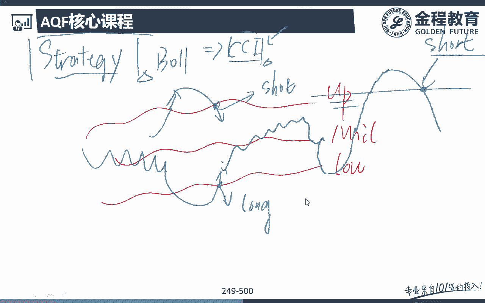

这种代码都不发的啊，那么对于我们来说的话呢，这些呃是我们也是花了非常多时间啊，整理出来的呃，这种编写出来的这种代码我们都是无偿的呃，作为我们的学员是发给大家的啊，所以呃希望大家也可以利用好。

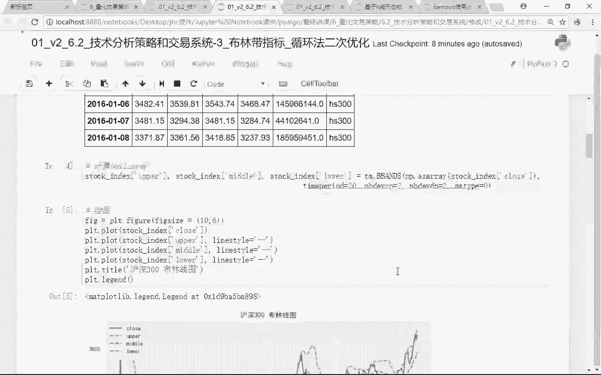

我们这里的这些策略，你可以在这些呃我们发给大家代码的基础上。

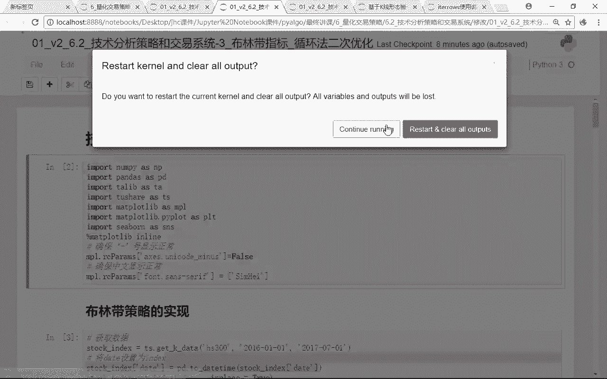

可以做二次开发，可以进行一些更复杂的一些东西，当然并不是说我们这个策略写的有多好啊，那么我们这个策略的话呢还是一样啊，因为我们Python的初学的话呢，入门的量化的时候，我们还不是特别再去追求性能啊。

呃我们更多的是要把我们这个策策略，实实现出来，听白是吧，哎速度慢一点，咱就慢一点，反正我们也日内对吧，哎这个我们又不是做高频的，也没关系，太大的一个关系啊，那么等大家学到后面啊。

比如说我们要做一些基于分钟级别的一些，交易行情的时候，那这个时候的话呢，这种Python的这种嗯，对性能的要求可能就会慢慢慢慢体现出来了，那么在这里的话呢完全没有关系啊，好。

那么我们来看这个布林带这个策略的实现过程，那么注意啊，这个实现过程跟前面的完全都不一样了啊，不是完全都不一样啊，这个就是那个交易策略逻辑的这个部分，其实都不一样了，好我们一起来看一下，那么在看这个之前。

我们先把这个跟大家把它分类分一下啊，这个嗯标题取一下，这个是一布林带的一个策略的一个实现，然后的话那不能叫不不能在策略的一个实现啊，在我们这个里面，第一个我们把它叫做跟前面一样，叫做数据准备，对吧好。

那么咳咳，第二个的话呢就是我们的一个额策略的一个，嘶前面我们叫什么名字啊，嗯我们统一一下，最好第二个的话呢就是嗯算交易信号，交易信号和持仓信号的计算好，那么这是我们的第二个部分，那么第三个部分的话。

这是持仓情况图，第三个部分就是这里计算呃，计算策略收益及可视化，好咳咳，那么这样子的话呢，大家就可以对整个代码的一个结构，有一个更好的一个理解了，好那么我们先来看第一个部分嗯。

第一部分就是import嘛，这这不说了，就是各种各样的一个library的一个input对吧，那么在我们这个里面，技术分析里面主要基于的是ta列表啊，好第二个第二个的话呢也已经说了很多了啊。

在我们的呃TUSHY上，我们这个时候我们还是用的最额，更常用的这个KDK，get k data这个API，这个速度更快啊，那么掉的是沪深，三0016年1月1号到7月1号的这个数据，那么掉到了这里对吧好。

那么接着的话呢我们要计算布林线啊。

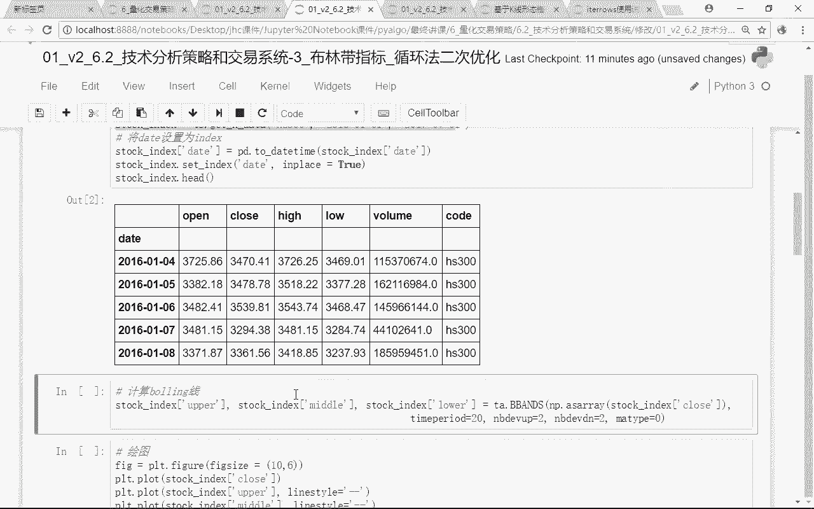

因为你要基于这个布林线的，布林带的这个去进行算法去进行投资的话。

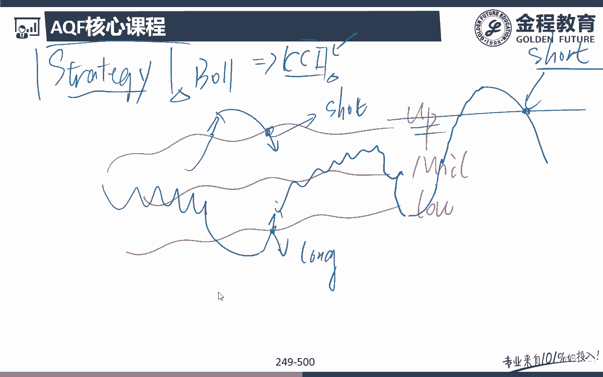

那必须我得先算出布林线对吧，那么怎么去算布林线呢，哎我们有一个神器，就是我们这里的ta列表对吧好，那么在我们这个里面ta列表里面还是一样啊，那在这个里面，我们可以看到ta lib。

里面有各种各样的一个算法，比如说在这个里面b big bds，就是不要bulling什么band对吧，就是我们的那个布林带，那么同样的我想知道布林带有些哪些参数啊，什么东西我们就可以用问号对吧。

所以布林带里面的话呢，首先嗯第一个第一个里面的呃，我们是一个价格，后面的话呢他用的是呃input parameter，一个是时间，我是计算是几天的一个布林带对吧，还有呢一个是向上偏离的波动率。

向下偏离的波动率问题吧，那么在我们这个里面的话呢，嗯就是我这里的一个参数，也就是说在这个里面是嗯计算布林，那肯定要收盘价对吧，好完了之后呢，就是我们的一个time period的额。

time period的话就是我们还是计算是20天，然后呢是向上波动率和这里的向下波动率，没问题吧，好还有一个呢是ma type均线的这样的一个种类啊，在我们ta lip里面，这个均线有好多种啊。

有什么啊，就像前面跟大家讲的moving呃，Simple moving average，还有EXPORTIONAL，还有各种各样的加权啊等等等等的方式啊，在我们这个里面。

我们用的这种精神就是最普通的那种，ta ma type等于零啊，这样的话呢这个就用最常规的就好了啊，所以对我们来说的话呢，通过这一个的话啊，为什么是NP点S啊，瑞已经跟大家讲过了啊。

企业列表里面必须用的是能派的NDA瑞对吧，我用的是收盘价，收盘价我我计是计算出这个收盘价的均值，向上波动两个标准差，向下波动，两个标准差，上轨和下轨是不是都计算出来了，哎所以德玛说的话呢。

通过这样的一个呃ta lib的话，那我们就可以马上非常快的计算出，我这个布林带了对吧好，那么接下去的话呢就是绘图，绘图的话呢，用的是我们金融数据可视化里面的东西，PLT的figure，PLT的plot。

先画什么，先画收盘价，再画上轨，再画下轨，中轨和下轨标题点title legend是我的标签对吧啊，lifestyle因为呃布雷达我想用虚线来表示啊，我可以用line style或者用style来啊。

进行一个输出的这样一个显示好，那么这应该没有任何的新的东西对吧，是不是都在我们的那个金融数据可视化里面，都跟大家讲过的对吧好，那么在我们这个里面我们就可以看出来了，蓝色的是我们的一个收盘价。

红色的这条线呢是我们的一个啊middle line，那么绿色是apply low啊，紫色的这条线是low a line问题吧，好，那么我们的交易策略前面已经跟大家讲过了啊，是什么呃。

呃当我们突破上轨之后，跌破下轨开始啊，像类似于这种地方对吧，跌破下轨开始，我开始怎么样啊，跌破上轨啊，我开始做空，那么呃什么时候我做多呢，像这种地方看到没有，大家看到没有呃，我先是在下轨以下。

然后呢向上突破上轨，我我就开始做多，其实呃简单来随机选了两个数据，其实还是不错的对吧，从我们的这个交易策略上来看，那像这里呃原来在apply的上面，现在跌回来了之后，我做空，那么在这个里面的话呢。

在这一段原来在啊lower line的下面，我在做多，然后呢这个呃向上突破了我这里的下轨，我就做多，哎果然这个股票价格是不是开始往上涨了对吧。

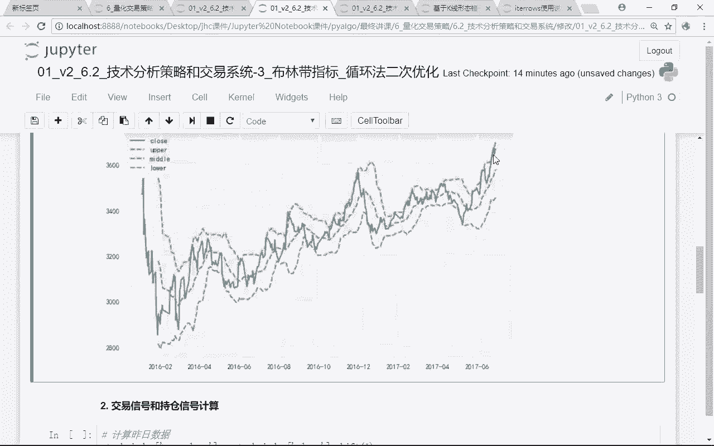

哎所以对我们来说，这个我们的这套策略的思路啊。

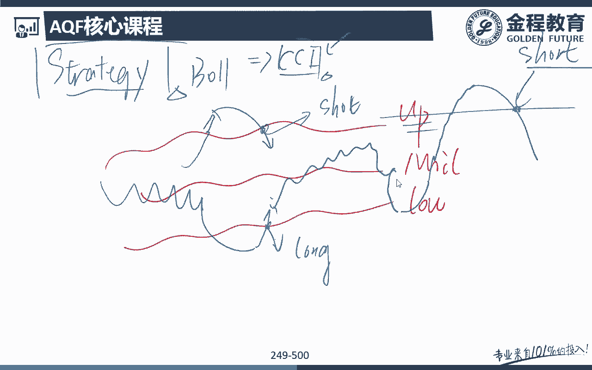

还是有一定的背后的那个，内在的思想在里面的啊，所以对我们来说的话呢，嗯嗯嗯这个是这个，当然啊你不能靠着呃，我们这个课上跟大家讲的那些算法和策略，去赚钱对吧，额当然也有可能能赚到钱了，但是嗯还是要这个。

你要自己要对整个策略的模型更有把握啊，才能去进行试探的这样一个操作和交易啊，好那么接着的话呢这个图我们画出来了，那么再来看第二个部分呃，交易信号和持仓信号的一个计算。

那么因为这个图我们用的是一个循环的方法啊，所以呢在这个里面，我的交易信号和我的持仓信号，我们也是分开计算的，那么怎么去算呢，其实还是一样，我要计算额，昨天的数据和前两日的一个数据对吧。

前两日的数据统统改成我们前天的这个数据，那么对我们来说怎么去计算，也就是说还是一样，就跟我的前面的类呃CCI是类似的，我要算昨天的CCI和前天的CCI，那么我在算这个布林带的时候，我们也要用的是怎么样。

昨天的布林带的数据和前天的布林带的数据，问题吧，那么在这个里面有三个是我们特别关注的，一个是收盘价，一个是低点高点，收盘价低点高点，那么shift1呢就是变成昨天的。

那么shift2呢就是变成什么前天的证明题吧，哎这一块应该已经非常熟了，shift2往前移动两个嘛，移动两个之后，现在的这个时间点上的这个价位啊，额往下移两个，就是我前天的那个价格对吧。

好我们可以来看一下啊，咳咳因为是20天啊，所以前面这里had这里都没有了，那么我们就来看一下这里的tale，跳到这里都都有了，那么我们可以来看在这个里面，昨天的yesterday，Clothes。

Yesterday，Lower，Yesterday，the upper都有了对吧，那么这个里面我们就会发现，你看这是今天的当天的这个最高的，那就变成了下一天的昨天的最高的，看到没有，那么这里也是当天的。

就变成下一天的呃最高的对吧，那么我们再往前呃看一下的话呢，我们就可以看到呃，看这里顺序都是有点乱，它就变成再往下一天，他就变成前天的这个最高了，问题吧，哎所以他们说这个的话呢，就是已经把数据处理好了。

那么关键来看这里啊，那么接下来的话呢，是我们计算我们这个signal的一个核心，计算交易信号和呃计算我这里的持仓，特别是计算我这里的持仓啊，是我们今这次的一个全新的一个课程内容，和全新的一种思路。

全新的循环法思路，这是非常非常重要的一个点啊，好那么我们来看计额计算交易信号，计算交易信号跟呃，CCI的那个交易信号其实是一样的，呃，或者说是类似的，那么在我们这里看。

前天的收盘价要小于我的前天的最低价，同时下一天的呃，就是昨天的收盘价要大于昨天的最低价。

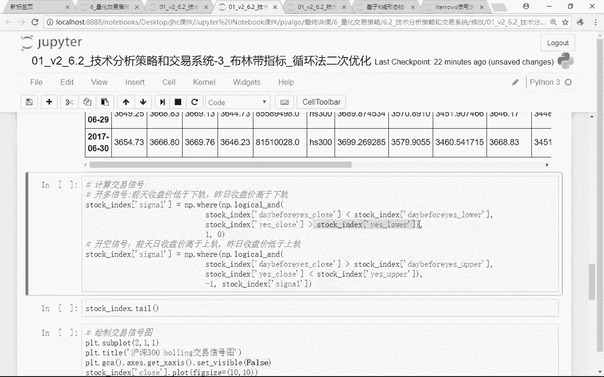

听明白意思吧，那么这个时候就变成一个什么，就相当于是实现了这个理念，前一天我的最低价，我的收盘价是小于我这里的嗯，下轨的。

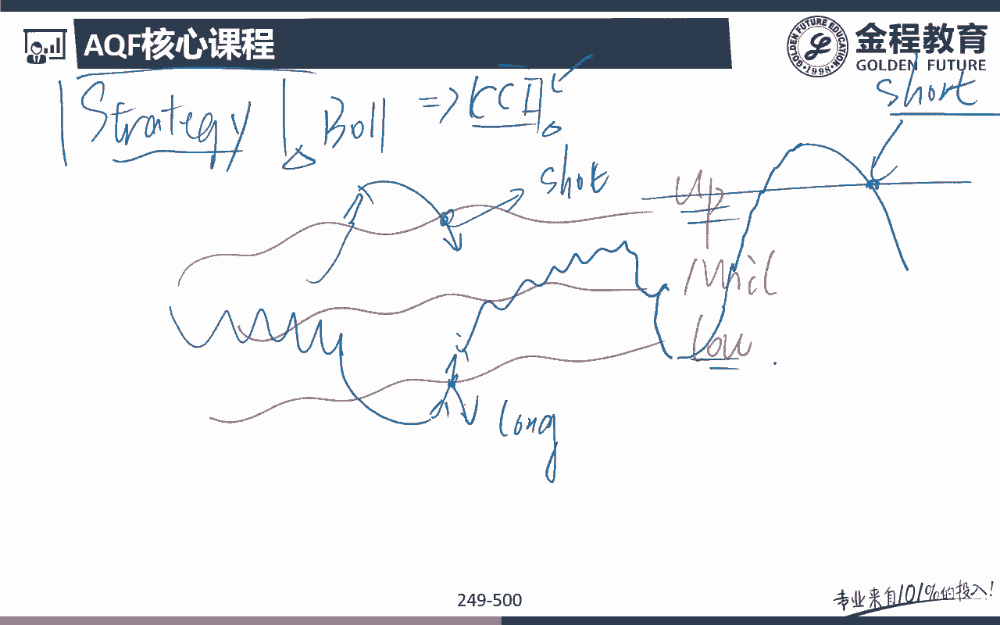

下一天呢，我这里的收盘价大于了我这里的上下轨，没问题吧，是不是就是这个如果满足这个条件给你一说，明我们要开仓开仓了啊，开多头，那么额不满足这个条件的话，那我们统统给的是零问题吧，那么这做多信号啊。

那么接下来看做空信号，开空信号，那么开空信号的话呢也是一样。

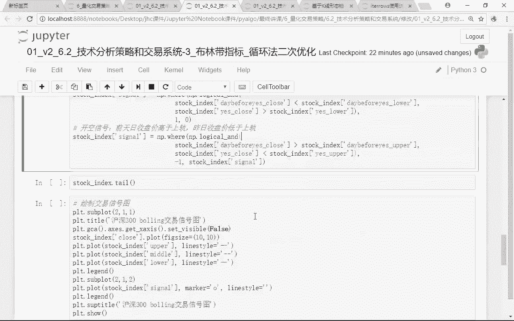

反过来来说就是什么前天的是大于100呃，前天的是大于up的上轨，然后呢昨天是小鱼的上轨。

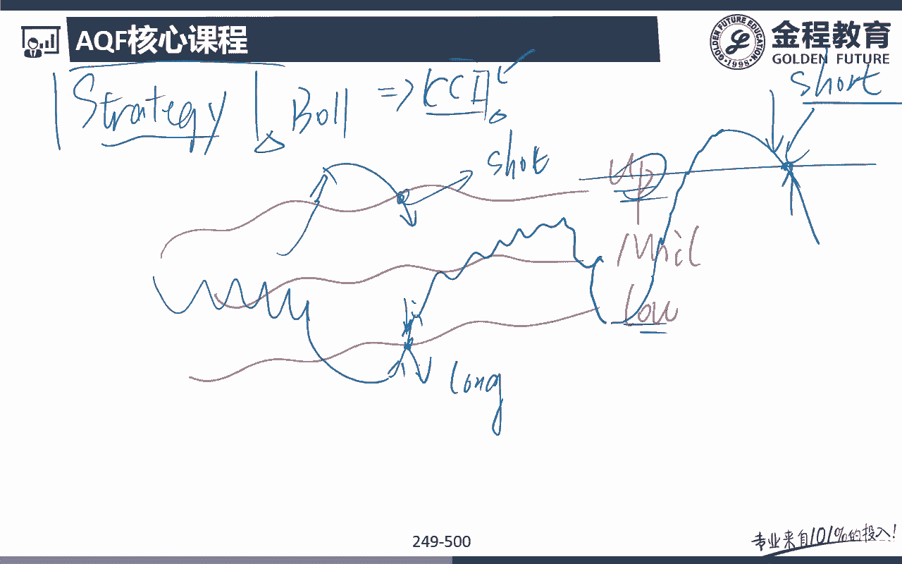

是不是这样对吧，来那么在我们这个里面，我们来看呃，Today before close，就是前天的价格，前天的收盘价是大于我这里的上轨的，完了之后呢，昨天的收盘价小于我这里的上轨了。

所以说明是我这个收盘价是从上面吓破了，跌破了这个上轨，所以跌破下轨的话呢，我就给你的什么一，如果不是一的话呢，呃不满足这个条件，我们说的还是上面的这个stock index，这个signal我就不动。

你是该是一就是一，该是零就是零，没问题吧，好那么这个就是计算的是我们这个交易信号，那么算出来这个交易信号之后的话呢，我们可以把这个交易信号把它画个图画出来，那么这个交易信号这个图就可以像呃。

上面是我们的股价图，下面是我们的交易信号图对吧，那么这个就是我们的呃，去画这个图的这样子的一段代码，那么这个代码的话呢，像POT点show，我们前面说了啊，在这个里面呃。

因为我们是从这个点PY的文件里面，把它啊改写到我们这里的notebook里面，你要在啊Python的文件里面，就是在IDE里面就是想用什么pythm spider啊，都可以。

你在那个里面你必须要加PLT点show，但是你在呃这个notebook里面，因为我们前面加了那个mattiplib in line对吧，所以这句话加不加都无所谓，那么在这个里面其实代码都见过的对吧。

就是绘出额最高的最低的中间的对吧，然后呢同时还要绘制我这里的一个收盘价，同时我的标题等等等等，这些都有了，对吧好，来看一下啊，在我们这个里面，果然我们这里的这张图就出来了。

上面的话呢就是我们的这个骨架图，下面的话呢就是我们这里的这个，什么交易信号图，没问题吧，好那么我们简单来看一下额，像在这个地方嗯，可能这里对的不是，我们来看一下啊，这个里面呃稍微不是对的特别齐啊。

像在这个里面应该是从上轨跌下来额，在这个里面我们来看一下啊，它是从这里，应该可能是这里这一段他是从校呃，下轨往上突破的，那么像在这个里面，这这里还可以，就是从我这块的，你看有两次都跌破下轨涨回来了。

有两次跌破下轨涨回来了，所以这两个是不是做多信号对吧好，那么像这里的这个应该是这里的这个点啊，是先突破上轨，然后呢又跌回来了，所以呢我就开始做空，那么其他的点基本上也都是符合这个条件的啦。

那么比如说在这里这条的话呢，就是应该是呃跌破了下轨又涨回来了，所以我这里做多了对吧，哎所以呢大致对一下啊，因为时间各方面，我这里的这个点点的，确实呃不可能不会那么精确了，那基本上我们能可以看到啊。

还是能对得起来对吧，好，这是我们的这个交易信号的这个图，注意啊，现在我只是有了交易信号，是不是还有没有，这个时候持仓信号有没有写好啊，没有写好，持仓信号能理解吧，那么像前面那种写法，我是怎么写的。

在我前面CCI的那个里面，我是怎么写的，哎呃我是呃这个满足这个条件的，那让他等于零的时候，要么等于零，或者要么呃等于零的时候全都变成NA，完了之后呢怎么样，额不然的话呢不等于零的这些地方。

我还是让它等于原来的那个数值，完之后，fulfill n a是不是完了哎，fl n a那向前填充，那么这一块的这个就可以统统填充完了，那么对于我们来说的话呢，在这个里面啊。

我们要用跟大家讲的就不是这样一个代码了，这个的话呢注意啊，咳咳唉，还记得吗，如果说我们要用嗯，前面那个CCI的策略里面怎么去说啊，那么我们再带着大家来看一下啊，技术分析七修改嗯，在额在我们这个里面。

CCI的这个额应该在咳算了，反正呃前面前面那个CCI的那个指标，应该大家刚呃刚刚还知道对吧，他其实就是嗯判断一下是零的地方，我通通让它等于空值，完了之后呢向前填充，所以呢对我们来说。

这些点就是空值的那些地方，额它就会向前填充了，那么这个时候就可以产生我这里的持仓信号了，那么在我们这个里面啊，因为为了给我们后面的那个交易，这个比较复杂的策略打基础啊。

所以呢我在这个里面要给大家引入这个，循环的这个思路，什么叫做循环的这个思路呢，注意啊，循环的这个思路的方法其实说白了啊。

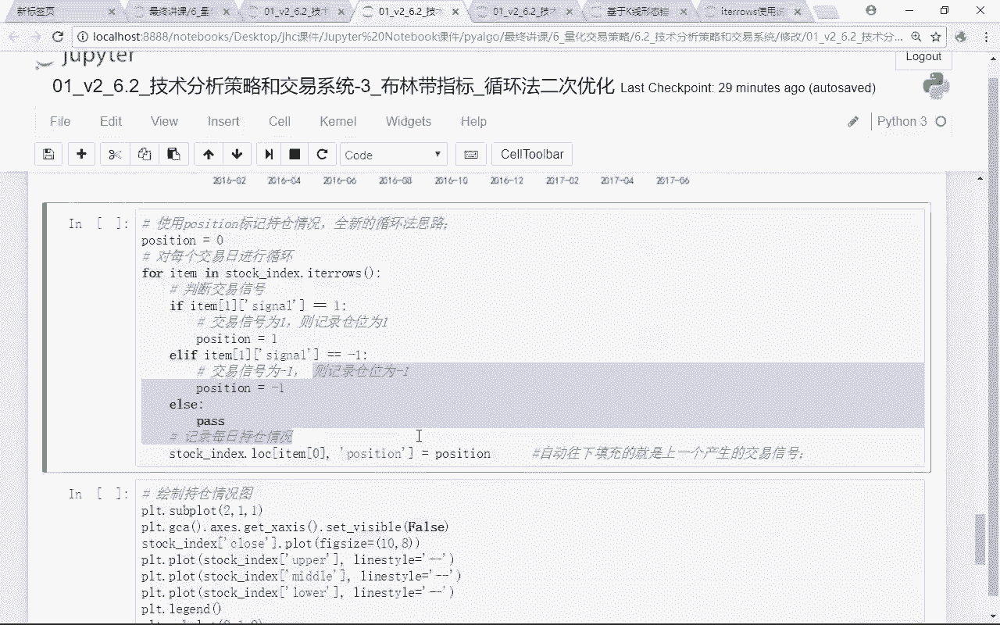

在我们这个里面先把这个嗯，循环的这个思路啊，先跟大家来说一下，也就是说在我们这一个额策略的这个例子里面，我们是从什么时候开始的呢，咳咳咳啧，2016年1月1号到2017年的6月。

7月1号到2017年的7月1号好，那么在我们这个里面，其实我们前面已经生成了这样一个大的一个，data frame问题吧，那么在这个里面就是我们的一个date，好。

后面的话呢就是我各种各样的一个数据对吧好，那么这个date的话，我们知道大概是2016年1月，比如说4号开始，然后呢2010年1月5号888881，直到最后的2017年7月1号，没问题吧。

好那么在这个里面循环是什么循环注意啊，循环它是这么循环的，我呢逐行去便利，也就是说首先来看2014年好阿爸爸，2016年的1月4号，看看这一天有没有满足我的开仓，平仓的一个信号，满足的话呢。

我进行这样的一个处理，也就是说我是循环的话呢，我是一天一天去处理，我们的这个哎交易信号的能力，能明白我的意思吧，好那么1月4号的这个信号处理完成之后，这个可能有信号，有信号的话。

那我就要计算它的一个持仓对吧，好，1月4号处理完成之后呢，我在便利到下面一天，到1月5号那进行一个处理，1月5号处理完成之后呢，再进行1月6号的一个处理，888，也就是说你有几天我就要进行几次循环。

我就要每一天我都当成一个循环里面的，一个组成部分去进行这样一个处理操作，这是我们这个里面的循环的核心思想，听明白意思吧，那么在我们优框里面也是一样啊，优框里面你嗯它可以是你可以按着一小时，可以按着一天。

或者可以按着一周去呃，做这种便利循环都是可以的，那么在我们这个里面，我们是一天一天去处理啊，就是先进处理第一个交易日，第一个交易日处理完再处理，第二个交易日再处理，第三个交易日能理解意思吧。

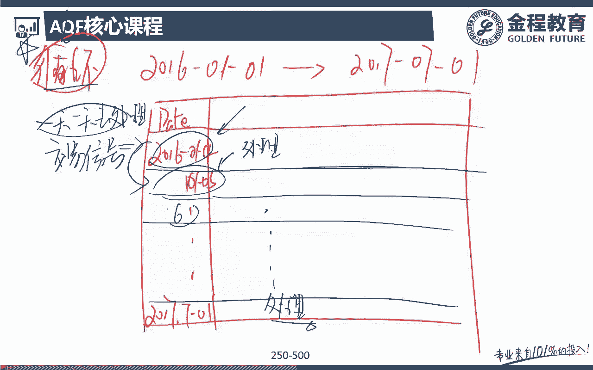

好，那么他这里怎么去实现，一天一天的这个处理的呢，咳咳因为大家会发现我这里的索引是什么，是不是日期啊对吧，哎我就我就先处理，因为这里已经是tale了，那么had的话呢应该是1月4号开始，那么咳咳。

那比如说在这个里面1月4号先处理，1月4号，1月4号处理完成之后再处理，1月5号的，听明白啊，哎好，那么他是怎么去处理的呢，我们来看这里的这行代码啊，呃首先我要确定一个持仓的一个标记。

这个持仓的position我让它等于零，也就是说position如果等于零的话，那是不持仓，那么position等于一的话，那持多仓position等于一的话呢，持空仓没问题吧。

好那么咳接下来我们要用到一个新的一个函数，或者说新的一个方法啊，那么写首先来看这个for函数复函数应该知道吧，for什么什么in什么什么in的话呢，应该是一个可迭代的这样一个数据组。

你可以是一个list等等，所有的乱七八糟的东西都可以，所以呢通过我这个for的话呢，我可以把这个数据组合里面的具体的元素，一个一个取出来，然后呢去进行我下面的这个操作问题吧。

所以你看呃这个是for下面的都是缩进的，所以后面的这些说白了都是我这个for循环，下面的，也就是说这是D说白了这是第一天，第一天下面的话呢我要做的是怎么样呃，这么多的一个判断的操作好。

这一天做完成了之后，然后呢我就取到的是下一天听明白哎，下一天之后的话呢，我同样也是做这么多的一个操作问题吧，那么对于我们来说，如果比如说一年半一共有300多个交易日。

那么我这个循环是不是就要跑300多次啊对吧，哎那么来看一下啊，这个里面呃，我们怎么样对这一个注意去进行，一个逐行的一个便利呢，嗯嗯那么我们要用到这样的一个itero rose方法。

那么其实这个方法的话呢用的就呃，逐渐逐逐行逐行便利，哎咳咳，怎么去进行这样一个逐行便利呢，就用的是这里的iteral rose这个方法好，那么这个iteral rose这个方法啊。

你可能在我这个策略里面看起来比较难受，这个可能看不太懂，所以呢我们在这个里面专门跟大家写了，这一个iteral road这样的一个使用说明啊，那么我们来看这个使用说明，呃。

咳咳这也是我们的一种讲课技巧吧，把比较难的一些东西啊，我们就单独出来弄一个最简单的一个topic，让大家在最简单的过程当中理解这个东西之后，我们再放到我们这个策略里面，那这样的话呢。

大家是不是就可以嗯嗯更好的去理解了，对不对，好，咳咳，那么我们来看一下这个itera rose，到底是怎么用的啊，那么这个itera rose，ITERA就是ITERR呃，就是iteration。

就是那个迭代的那个意思，听明白，所以呢嗯嗯嗯在我们这里的这个entital roll啊，其实说白了就是我们这个逐行便利对吧，哎就是把每一行我都进行一次迭代，每一行我都进行一次便利啊。

好那么来看一下这个到底是怎么去用的，嗯比如说我们先生成一个，我们的这样一个data frame好，那么这个data frame我们随便生成的啊，随机数对吧，四行两列，咳咳AB，然后呢，这是我的列索引。

这里是我的行索引，没问题吧，好那么我们现在呃对我一个data frame来说，它是不是有iteral rose这个属性啊对吧，或者说这个方法，那么来看一下，这个时候我呢让DF点itero rose。

那么这个时候我们产生了这样一个对象，这个是一个生成器对象啊，生成器的话呢相对来说是一个呃，呃比较高级的一个东西啊，不用啊，不用纠结，那么其实你就可以认为这个生成器，就是一个可迭代的一个对象。

那么这个对象的话呢，我从可以从这个生成器里面拿出我的这个数据，问题吧，好，那么比如说我们怎么从这个DEFERROLES里面，把这个数据把它给取出来呢，这是一个数据的这样的一个生成器，这是一个对数据。

其实相当于你可以把它理解成，这是我一个打了个包的，里面放存了一个数据对吧，那么怎么把它给拿出来，用for循环对吧，For i in df ateral，我们print i，那么这个时候。

不管你DFITERO里面有什么东西，我们统统把它赋值给了这个什么变量，I明白吧，I那么这个时候我们就可以来看到啊，这个I我们拿出来的这个I啊，他是一个什么东西呢，我们来看我们可以看到啊。

其实我这个里面弄出来的这个I呀，每一个I它其实圆括号括起来的，它是不是都应该是个都是一个TP，都是一个元素，对不对，而且呢它不是一个特呃普通的一个元素啊，你看他这个元组里面的第一个元素就是序列呃。

top是不是呃，顺序索引是从零开始的，那么这个I里面的零第一个索引，第一个元素是不是我这里的行值啊，行的这个label a看到没有，那么第二行的第二个I呢就是这里的B，包括这里的C和这里的D没问题吧。

那么再来看它第二个值，注意啊，第二个值的话呢，它其实嗯他自己本身啊，他是一个series，那么它是一个类似于pandas下面的这样的，一个series，也就是说第二个索引。

其实是我们整个iteral rose里面的一个关键，那大家可以看到啊，第二个元素就是我这个呃TURO里面，元组里面的第二个元素的话呢，它其实是具体的这个值，看到没有，但是这个值的话呢。

它是用一种类似于serious的一种形式，把它给额表示出来的，也就是说A我的这里的值是多少，0。993800，然后呢这个里面的这个B呢是多少，0。19137，没问题吧，那么接着的话呢。

第三嗯嗯后面这一个他的一个名字，它的name又来呃，重复了一下，他这个时候这里的name就是这里的这个什么A，那么最后的话呢它有一个d type，它的一个数据类型，数据类型是float。

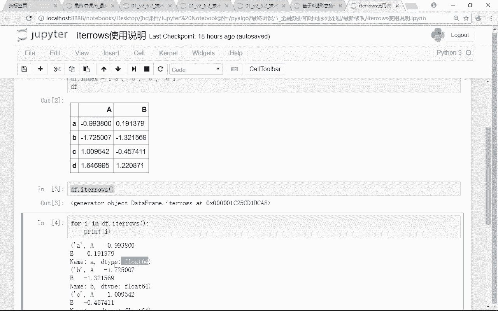

没问题吧，哎好可能这么看呢还不是特别清楚啊。

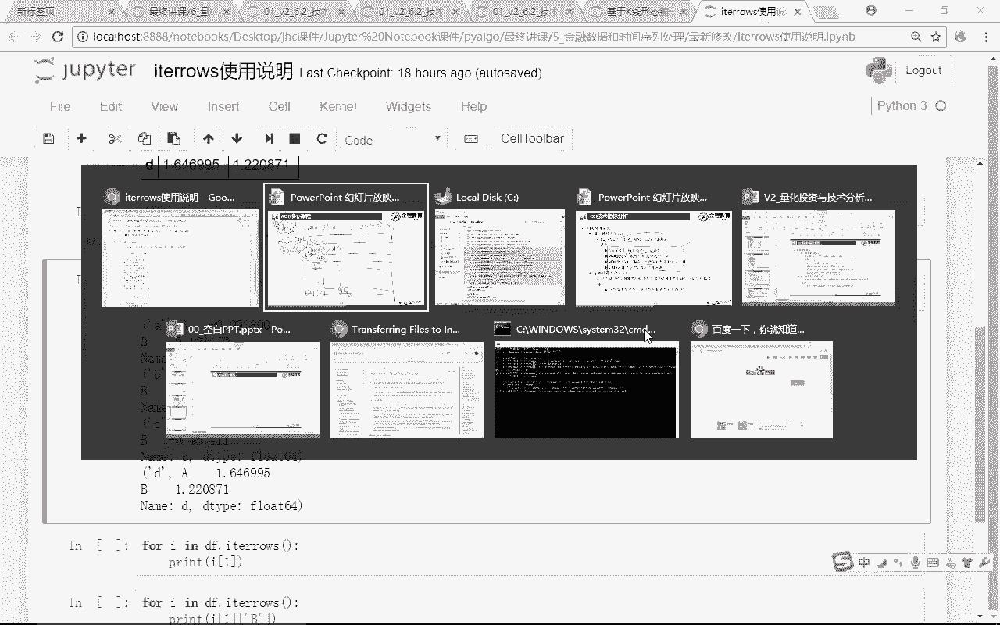

那么我们来看一下，再接一块，咳咳咳，他其实呃我每一行啊，注意啊，每一行都是我的这样的一个TP，这样子子的一个元组，这个元组里面的第一个元素呢是我们的一个行，Label，是我们的一个行标签，没问题吧。

第二个元组注意啊，第二个元素是我们的一个series，这个series的值，这个series的内容呢就是我当前的每一行的，就是我遍历出来的每一行的列名和列名，加上这一个的怎么样。

他的一个具体的一个value能理解意思吧，所以对我们来说啊，在我们这个里面我们可以来看到额，这个里面你看其实它就是一个TP，TP里面的第一个元素，就是这里的行标签，A b c d。

tap里面的第二个元素就是A开始的啊，每一行的列名ab看到没有，然后呢，它具体的值0。3988和0。19317，那么第二个也是一样，他其实说呃他其实说白了啊，他就是一个这样子的一个元组呃。

呃这样子的一个series，注意啊，第二个是serious啊，怎么可以看出来是series啊，我们每一个I我们可以看出来它是个什么东西，比如说我们可以再print一下呃，print什么东西呢。

print一下这个I的一个type，先说说这个I的一个态，那么这个I的话呢，我们说了他是不是就是一个元组啊，对吧好，那么这个元组里面它其实包含了两个元素，这个是元素一，这个是元素二，那么这个元素的索引。

或者说这个元素的index是什么呢，这个行索引的index是不是一呀，这个第二个元素的这个索引是不是就是一，一个是零，一个是一，没对吧，那么它来说我可以通过I0，就是I是这个元组I0的话呢。

我就可以选择到这个行标签的这个行label，那么如果说我们可以类似于这里，用这里的I1的话，那我们是不是可以选择到这个series啊，这一列对吧好，那么来看一下啊，在这个里面。

我们先呃把这个I的这个呃tab，先把它给打印一下出来，那么我们可以看到，果然这个I每一个取出来的这个一行，就是一个特O注意啊，这个top你有几行就有几个top，有一行就是有一个top没问题吧。

好那么这个看懂了之后，我们再来看呃，我现在不想把整个都输出来，因为I里面有两个，一个是我的行标签，还有一个是我的一个具体的一个值对吧，那对于我们来说，我们关心的是不是后面的一个啊。

就是这个series里面所包含的每一列的列名，和这个value是不是我们所喜欢的对吧好，那么这个时候，其实后面这一部分是我们的一个series，那么我就想把后面这部分的serious，把它给输出出来。

可不可以呢，可以那么在这里面还是一样，For i in defeterro，那么这个I我们知道是一个元组，对不对，那么我就想输出元组里面的第二个元素，是不是就是我这里的索引一呀，好，那么在这个时候。

我们就可以来看到第二个元素的话，我们会发现呃就是我这里的ab name，然后呢这是第一个，然后这是第二个，这是第三个，因为有四行嘛，有四行的话就有四个元组，四个元组下面的第二个元素。

是不是都是我们的这个series啊，没问题吧，那么比如说我们可以再把这个呃里面的这个type，把这个第二个元素的这个类型啊，再打印出来给大家看一下，那么大家就可以知道了，I1呃，每一个就是零。

就是我这里的行标签二呃，一的话呢就是我这个下面的这个serious对吧好，我们可以来print一下它的一个type，果然你看他的一个type什么pandas里面的一个series，没问题吧。

哎好那么接着的话呢我想选的是什么呢，注意啊，你看I1的话，我是不是选的是每一行的这个，注意啊，这里面已经是啊，各种各种各种各样的一个嵌套了，对吧哎，那么但是呢大家要有这个能力啊。

我们我们只是说把最基础的方法带给大家的，等大家自己能拿到，掌握了这种基础的方法之后，稍许复杂的一些的这种代码，大家也要能看懂，听没有，所以代码说现在我这里的I0。

那I1我是不是可以选送这里的这个serious啊，对吧好，我们知道serious是一个什么样的一个结构啊，serious的话呢，这里就是它的series的一个标呃索引，然后呢这是他的一个列名，对不对。

好，那么比如说在我们这个里面呃，我的列名就是什么，比如呃我这里的列名就是呃。

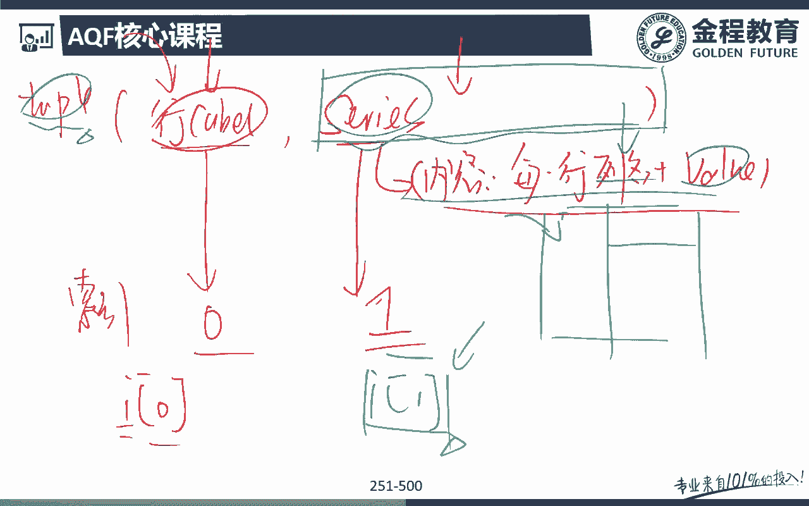

我这个张表格里面的这个什么A跟这个什么B，是不是就是作为我们这里的这个索引啊对吧，所以呢这个里面呃比如说一个是A1个是B，完了之后呢，下面对应的是不是它的具体的一个value啊，对吧好。

那么我想选择的是每一行里面，BB这一列的一个价值，那再怎么选啊，我选中了一一，是不是选中这个series啊，series里面我在想根据行标签去选的话呢，我们再加一个什么哎，再加一个这里的标签B。

这个时候我们加了这个里面的这个标签，行标签的这个B的话呢，对于我们来说，我们是不是就可以选择出来，这个里面的这个具体的value，我们是不是把可可以把它给选出来了，对吧，哎所以啊确实啊。

这一行代码是稍许有点恶心的啊，因为他是itero rose，里面第一个元素是他的行标签，第二个元素是一个serious，那么这个serious的时候，他又把他的格式进行了一个转变，这个怎么转变出来。

这个时候转变出来的这个series我的列，我的行的索引就变成了我原来的什么列名对吧，哎行的索引就是我原来这里的列名，那么这个时候它就变成了一个嗯，series就变成了A是多于多少，A是等于0。9983。

B等于我这里的0。1937，那么这个我用呃蓝色标注的这一个代码，这其实就是一个series，没问题吧，那么我想选择这个series里面的行标签里面，B它的一个value是等于多少呢，在我们这个里面。

我只要在IE后面再选一个B，大家会发现我每一行的这个B，我是不是就可以打印出来了，100点，你看啊，大家看0。1913，这里是负的1。32，负的0。4，没题吧，哎好，那么这个是我们这个里面跟大家讲的。

这个itero rose的这个用法好，那么我们再回过头来看这里，前面的这个掌握了之后啊，那么再来看下面这个代码的话呢，就比较轻松了，好我们好像已经讲了比较久了，那么先让这一块确实比较难啊。

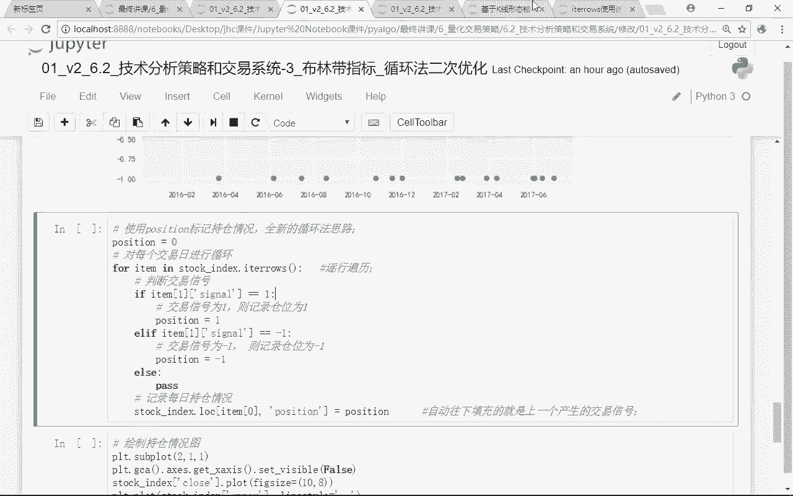

我们先让大家休息一下。

