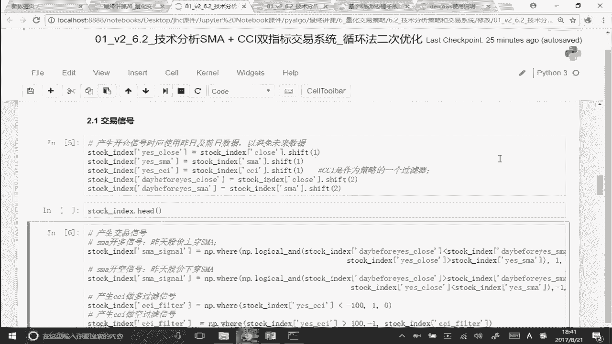

# 2024年金融大神老师讲解量化金融分析师.AQF—量化金融专业知识与实务 - P5：《+威❤hhh427501  了解获取全套课程）》05.量化投资与技术分析_4SMA和CCI双指标交易系统 - 量化沿前 - BV1oU411U7QM

各位同学大家好，那么接下来的话呢，我跟大家讲的是我们的这个嗯，SMA和CCI指标呃结合在一起的啊，这样的一个额交易系统，那么这个交易系统的话呢，所有的原理啊都是一样的啊，只要呃大家前两个策略。

就是呃CCI和布林带这两个策略搞懂，因为CCI我们用的是这个向量化的填充，那么cs的布林带的话，那我们用的是循环，那么这个指标这个双系统的指标，我们也用的是循环啊，那么如果大家只要能把我前面跟大家讲的。

那个循环的方法全都掌握的话呢，在这个里面这个策略的话呢啊都一样啊，所以这个策略的话呢我就不逮呃，我不打算就是跟我前面两个策略一模一样，一行一行代码去跟你去讲了，我们会发现代码的逻辑都是一样的。

呃我们都可以看出来对吧，代码的逻辑基本上都是一样的，只不过是说呃在交易信号的产生，这里稍微有些不一样，那么包括后面的数据可视化等等等等，所有的东西都是一样的，听明白意思吧。

哎那么我们整个把我们的这个策略的逻辑，策略的思想跟大家讲一下，然后呢把不一样的这个地方啊，就是我们这里交易信号的产生在这个里面，因为双有双系统嘛，两个交易指标，所以两个交易指标的话。

那就会有两个的交易系统，我得把这两个交易信号结合在一起啊，才能作为我最终的那个交易信号，那么除了这一部分是稍微有一些不一样以外，剩下的所有的部分包括持仓信号的计算啊。

你看也是用的是iteral rose对吧，哎所有的代码跟我们之前跟大家讲的啊，都是一样的，所以呢这个大家就可以作为你自己，有没有真真正正掌握这个拿循环去便利，或者说向量填化填充的一个。

非常好的一个检验手段，所以呢在我们这个里面，如果这个策略你看起来有问题啊，注意你就把我前面的那个布林带的那个呃，视频再好好看一下，在这个里面除了交易信号有区别，其他的都是一样的，听明白是吧，好。

那么我们来看一下这个交易系统，这个交易系统啊，那是指把SA就是移动平均均线，跟我们的这个CCI的这个指标，结合在一起的这样一个交易系统，好，那么双技术指标的交易系统，那么我们一起来看一下。

首先这个交易逻辑啊先得搞懂啊，必须要有交易策略的交易逻辑，才能有才能把这个代码把它给写出来，对吧好，那么我们来看一下他的一个交易逻辑，他的一个交易逻辑是当股价上穿呃，呃上传s ma就是什么。

当我的股票价格呃，穿越我这里的这个短期均线额，我就是我这里设定的这个均线啊，这个均线我们设定的是这个五天的，这个短期均线，当我们的股票价格向穿，突破我这里的额均线的时候，同时注意啊，额我们的这个。

CCI是小于-100的时候，注意是在超卖的情况下听明白，那么这个时候当我的股票价格上穿我的SA，我们认为是一个比较可靠的一个交易性啊，明白了吧，所以对我们来说，我们这套交易系统说白了是以什么作为主导。

唉平的开平仓信号，以SMA，就以额均线作为我们的这个开平仓信号，同时增加了CCI作为我们的一个过滤器，也就是说这个时候虽然我们产生了一个开呃，均线啊，均线系统，我们产生了一个开仓或者平仓的一个信号。

但注意啊，我不我并不一定马上就会开仓和平仓，我要同时要看我这个时候的CCI的一个点位，如果CCI正好也是处于我这个策略的呃，这个所要求的这个范围里面，我们才进行开多和开空，听明白了好。

那么我们把这个策略啊画个图来给大家看一下，也就是说每天我们的股票价格，是不是有这样的一个K线图对吧，每天的股票价格是这样子的呃，一个价格当我们的股票价格啊，比如说上穿突破我这里的这个SMA。

突破我这里的均线的时候，我们知道股票价格站上均线，是不是相对来说是一个一样的，是一个比较利好的这样的一个signal对吧，注意啊，这个均线跟我们之前讲的均线不一样啊，我们之前讲的是双均线。

双均线的金叉和死叉是吧，比如说我们一个是5日均线，还有一个呢是10日均线，当我们的短期均线上穿时长期均线的时候，这是一个golden cross金叉，听明白意思吧，但是注意啊。

在这个里面并不是什么金叉和死叉的，这个概念啊，在这个里面，我们不是拿两条均线的金叉和死叉，作为交易信号，我是拿股票价格跟什么唉，跟我这个均线的上涨下跌作为呃，我们的一个交易线号，当我当天的收盘价。

比如说我的这个K线，站上了我这个均线上方的话，是不是收盘价，我的这个股票的价格，大于了我的移动平均价格啊，我们认为这是一个比较利好的一个情况，但是站上的均线我是不是马上就开仓呢，注意啊，不是马上就开仓。

我同时要看，如果说我这里的CCI是小于-100，也就是说处于超卖，是不是之前已经跌的比较多了，可能还是卖方势力比较强的，这种超卖的这种状态下，这个咳咳太过于强盛了，买房对吧，那么我们说了物极必反。

很有可能将来是不是会上涨上去啊，所以那么说在超卖卖的很多，很多超卖的这个情况下，同时我的股票价格占上了，我这里的这个短期均线好，这两个信号结合在一起，注意啊，是股价上穿。

我这里的SMA和我的CCI小于-100，这两个信号同时成立，那么这个时候我们再进行开仓，能理解意思吧，来这是开仓是多头好，那么这个策这个交易策略搞明白，正面搞懂的话呢，反面也是一样。

反面的话呢当我的股票价格下穿啊，跌破我这里的SMA，同时我这个时候CCI是大于正100的时候，因为这是属于超买的情况下对吧，说明买方势力原来是非常非常强的，但是也有可能会物极必反啊。

所以同时你这个时候股价又下穿了，我这里的SA，所以我们认为这个时候我就开始怎么样做空好，那么这个时候我们认为两个交易系统注意啊，这里是这里是做多对吧好，那么接下来的这一段呢，这里是做空没问题吧，好。

那么呃，因为是两个指标，同时给我产生了做多和做空的这个信号，那么我们认为这个值，这个交易信号是不可能更靠谱一些问题吧，好那么整个代码啊，我就不一条一条去跟大家去细讲了，那么大家应该自己可以看得懂啊。

有一个地方呃稍微有一点不一样，我们来重点来给大家看一下，好，那么第一个是一样的啊，我就import这些啊，package对吧，第二个也没问题，准备数据，我们拿的是沪深300的数据好。

第三个的话呢这应该非常熟了，即用我的ta lib去计算我的两个指标，一个是短期的五天的移动平均，还有一个是我们的CCI对吧，哎这两个之前我们都带大家算过啊，好完了之后的话呢。

我们就可以画把我们的这个图形，把它给画出来了，那么这个图形是呃，我沪深300的clothes的价格，和SMA的一个价格，包括了我下面这张图里面的，还有一个什么CCI的这个价格。

这两张图是不是我们可以画出来了，没问题吧，好那么接下来啊，这个策略跟我们前面两个策略唯一的不同点，就在于这里的一个交易信号啊，好我们来看一下，首先对我们来说还是一样，我要先放出昨天的收盘价。

昨天的CCI和额，前天的收盘价额跟我这里的呃，前天的SMA没问题吧，那么注意啊，在我们这个里面我收盘价是要算的，那么对我们来说的话呢，这个CCI的话呢其实就不用了，CCI的话呢。

我们只要算出昨天的这个CCI就可以了，因为对我们来说，我们判断的是什么，我们判断的是诶，怎么样去判断我这个收盘价，上穿了我的股票的那个均线，我们原理是不是跟前面一样，所以收盘价跟均线的比较。

我要算昨天和前天的听明白，也就是说昨天我的收盘价是低于我的均线的，今天我的收盘价大于了我的怎么样，额我的收盘价大于了我的均线，也不是说今天吧，就前天的收盘价是小于我这里的均线的。

同时昨天的收盘价大于了我这里的均线，是不是说明在昨天我这成功的站上了我的均线，对吧好，那么这个时候可能会触发一个买入信号，那么这个买入信号是否执行呢，我要看昨天的这个CCI的这个点位，能理解意思吧。

所以我还得算一个昨天的CCI，那么在这个里面，我们就不用去算前天的CCI了啊，因为昨天产生的这个交易信号，我就看一下昨天的这个CCI，是不是小于-100的，听明白意思吧。

如果昨天的C3I是同时也是小于-100的好，那么这两个交易信号是不是同时满足啊，那么这个时候我们才进行开仓，能理解意思吧，哎所以在这个里面啊，这一段也是比较有讲究的，为什么我的收盘价和移动平均。

我要算昨天和前天的，但是我的CCAI我只要算昨天的就好了，因为CCI是作为的，我们这个是作为我们策略的一个什么过滤器，对吧，我们只要知道我触发买入信号的，那昨天的那个时候我的CCI是多少。

我们来判断一下是不是就可以了，哎好那么我们来生成额这一行代码没问题吧，好，那么接下去我们再来带大家看一下，这里的这个交易信号啊，那么如果啊前面的同学呃同呃，同学们，如果是完全follow上我们的这个。

AKF的这个课程的话，在这里就算我不跟大家说，其实这一行的这几行的代码，大家应该都能看出来对吧，也就是说，首先第一个，我先判断额额均线的这样一个信号啊，均线的这个信号是怎么判断的。

跟我们前面完全是一样的逻辑语对吧，他说的是，前天的收盘价要小于我这里的前天的均线，同时昨天的收盘价大于我昨天的这个均线哎，那么这个时候我们是不是说明，这一天我的收盘价成功的站上了或者个均线。

所以呢在这个里面给的是一这个signal买入信号，听明白了好，那么同样的道理，反过来来说，如果前天的收盘价是大于我前天的均线的，同时呢，昨天的收盘价小于了我昨天的均线，说明我这个价格是不是下跌。

跌破了这个均线啊，所以呢在这个里面我给你的是一，是不是要做空啊，那么不满足这个条件，我们还是原来的这个呃，我们保持不变，还是stock index，原来的那个s m a signal问题吧。

好那么之前的那个策略到这里，SIGNON是不是就已经完成了对吧，哎如果说是单策略的话，其实到这里就已经结束了啊，但是我们这里面不是啊，我们这个里面还算了一个什么东西啊，拿CCI作为我们的一个过滤器。

听没听明白是吧，好那么在这个时候呢，我们要给它一个cci filter这一列，那么这个CCI是什么，哎我要看这个CCI，如果说昨天的CCI也是小于-100的，注意啊。

我们如果说昨天的CCI是小于-100的，我给你的序列是多少，我给你这个signal是一，不然的话给你的是零，那么同时我要看，如果你这里的昨天的signal是大于100的，大于哎小于-100。

我们是不是要买入啊，所以我们给给你的是一，如果说是大于这100的话呢，我们是要卖出，我给你的信号是什么，一没问题吧，哎好，那么接着的话呢，我们要算一个把这两个信号啊合成啊，呃把这两个信号进行一个合成。

那么这个合成的信号大家想看应该等于几啊，也就是说这个合成的这个信号，应该是拿我均线的这个信号，加上我的CCI的这个信号，这两个信号同时触发，让我买入吧，所以买入的信号是什么，均线信号。

信号值等于1CCI的信号是不是也等于一啊，所以这两个信号要同时触发买入信号，哎那么在这个时候我要让它等于什么，我是不是要让它等于一啊，对这两个信号同时等于一的时候，那么在这个里面。

我们可以算一个什么filter的signal，看到没有，我可以算这样一个filter的这个signal，这个filter的这个signal很简单，它是什么，拿我的SA的signal加上我这里的啊。

怎么样，NCCI的这个signal能理解意思吧，那么这两个信号加在一起的话，如果说等于二诶，这就说明什么问题啊，这个就说明你是一的时候，同时我也是一，就是说的是吧，我均线上穿的时候。

我这个时候我的CCI同时是小于-100的，能理解意思吧，所以接下来我要用的是这个filter的signal，什么时候我才会真真正正的开播啊，在我们这个里面。

如果我这里的filter的这个signal产生的是什么，R的时候，听明白意思吧，哎那么这个时候我们就要进行，开多的这样一个操作，所以我们这行代码写的是什么呢，当这两个信号同时发生的时候。

他是等于二的时候，我们给你的一个信号是什么，一然后呢当这两个信号同时是一的时候，你是一，我也是一，同时是产生做空的那个信号的时候，二的时候，我们最终再给你一个，这个过滤后的一个信号是一。

所以是一代表怎样做多，一代表做空能看出来吧，但是这个时候的一和一，其实是两个信号结合在一起，这两个信号同时是一，我们才让额同时是一等于二的时候，我们才做多，同时是一，是等于二的时候我们才做空，没问题吧。

哎好那么我们来把这一行代码给拍一下啊，那么完了之后剩下的都一样了啊，我们就不带着大家一个一个去看了，那么你看在这里确实产生了交易信号，那么一是做多负，一是做空对吧，同时我们接着的话呢。

这行代码就跟前面的代码一模一样啊，布林带的代码一模一样，你自己再看一下，完了之后我们就可以额哎，在我们这个里面，我们就可以计算出我这里的持仓信号了对吧，前面一段是空仓，后面是一正一好。

最后的话呢数据可视化的return一个计算，我们也可以做出来了啊，所以在这个里面，其实这个策略没有任何的新的东西啊，唯一的新的点就在于要两个信号同时满足，两个信号同时满足的话，我这里要等于二对吧。

那么一样画葫芦啊，我们在这里教的大家是方法啊，并不是说让大家把这个东西背出来对吧，一样画葫芦以后，如果三信号的话呢，怎么样，我就是在这里同时要三个型号都是产生一嘛，我就让这里等于三。

那么同时这里要等于三，是不是才触发我的买入和卖出啊，所以我这个信号我教给大家的，这个双指标的交易系统，我们也可以非常好的去进行拓展，你可以三系统，三指标，四指标，五指标都可以啊，能理解意思吧。

哎所以的话呢我们的这个课啊，就是不不止教大家怎么去编，还到家哦，教大家怎么去怎么拓展，去延伸，你接下来你可以怎么去优化改进，升级你的这个交易系统，明白意思吧，好那么这个消系统的指标啊的交易系统。

我们就讲到这里没有新的的点啊，相当于是把我前面的那个点的一个复习啊。

