# 2024年金融大神老师讲解量化金融分析师.AQF—量化金融专业知识与实务 - P6：《量化交易策略的Python实现与回测（进阶）》06.量化投资与技术分析_5形态识别和移动止损策略_1策略原理 - 量化沿前 - BV1oU411U7QM

好各位同学大家好，那么今天的话呢我们要跟大家讲的是，我们策略里面非常有意思的一种策略啊，这种形态的这种识别策略呃，那么我们来看一下啊，这种形态的这种识别，这种策略的话呢，它具体的一个原理是什么。

这个具体的原理的话呢，在我们之前的嗯量化投资基础里面啊，跟大家讲过啊，比如说我们可能会看到一些呃股票嗯，它的K线图里面出现了一些某一些特征，或者说某一些形态的时候，我们会发现接下来的这个。

接下来的这支股票价格，它就会不断的可能上涨，不断的怎么样下跌TMS吧，所以对买说在这个里面，我们就想去通过我们计算机编程，去自动去识别出我们K线里面的，一些具体的一些形态，然后找到这些形态之后呢。

我们就可以对应的去进行做多和做空，从而去获得这样的一个收益，那么其实这种形态有很多啊，比如说什么头肩顶啊，头肩底啊等等等等，那么咳咳呃还有什么W型啊，对吧，W底啊，或者说呃呃M顶啊等等。

乱七八糟的有很多啊，所以对我们来说，这种其实都是我们K线里面的，一些具体的一些形态，那么当我们发现这种形态出现的时候呢，我们后市可能会按照我们一定的方向啊去啊，这样的一个运作，那么在今天的话呢。

我们要跟大家介绍的是一种啊形态，这种形态是非常有意思的一种形态，这种形态的话呢我们把它叫锤子线，那么这个如果是之前学过技术分析的同学啊，可能呃相对来说还额会了解一下，什么叫做锤子线呢，其实很简单。

说白了就是我的股票也注意啊，他有几个前提桥事件啊，前面之前的话呢，我的股票价格一般来说都是大幅下跌的，明白意思吧，完了之后呢跌到一定程度的时候，它形成了这样一根K线。

这根K线呢呃我的实体它是非常非常小的，但是呢它的下影线很长呃，或者可能有些时候会有上影线，有些时候就没有上影线了，所以对于我们来说的话呢，我们把这样的一根K线，这种类样子的这种K线啊。

我们就把它叫做锤子线，那么不用锤子线之后的话呢，当我们发现这种垂直线以后啊，很有可能我们的股票价格它就开始开始会上涨，所以呢我们嗯这个今天的这个策略的一个目的，就是目标就在于我们要找到市场上的这些呃。

某些股票，我们要把它的这个股票里面的这个锤子线，把它给找出来，然后呢，怎么样在持有一段期间，我想我想获得这一波后面上涨，这一波给我带来这个收益，能理解意思吧，哎好那么这个锤子线为什么能赚钱呢，注意啊。

首先它有一个前提，第一个前提是股票价格前期是怎么样，唉前期是大幅下跌的，这是一个前提，完了之后，第二个前提是为什么会有下影线啊，这个答案嗯啊这之前跟大家讲K线的时候，稍微简单跟大家提过啊。

也就是说这一天的，他的一个当日的一个股票价格，它应该是怎么走的，他可能当天开盘我是开始不断的，也是照着往常一样，因为之前都是跌了嘛，所以当天开盘它就也是一样，它就会继续下跌。

但是跌到比如说跌到这一个点位的时候，哎我是不是有买盘进来了哎，所以呢这个时候买单或者说这个买盘就进来了，买盘进来了之后的话呢，这个股票价格是不是会上升啊，所以最终我这里的收盘价可能在这里，明白意思吧。

所以这一段的话呢就是我当天的一个最低价，一直涨涨涨涨，涨到我这里的一个收盘，所以其实对我们来说的话呢，呃这种形态的一个产生，就在于说，它可能给我们市场传递了这样一个信息，这只股票已经跌到底了。

你看在跌到底的时候，有大量的人已经选择超额抄底买入了，所以呢我的股票价格最终我会收付会涨上来，所以呢在我们这个里面会留下，一根非常长的一个下影线啊，所以垂直线的一个最大的一个特征，它是有一个长下影线。

下影线的一个意思就是啊怎么样，哎我的最低价到的很低，但是最后我又收回来了，这是一个非常嗯怎么说呢，普遍或者说呃有实用的一个反转型号，说明后期我们的股票价格在前期的大跌之后。

往往可能后面就会有一定的反转情况，能理解是吧，哎这是我们这个垂直线的这样的一个形态啊，和它的背后的一个原理啊，这是我们的一个股票信息，那么后面会带着大家看一下啊，好那么在我们这个里面的话呢。

我们先把前面跟大家讲的一些策略原理啊，来给大家看一下，也就是说呃在我们这个里面呃，在我们这个策略里面，我们对K线定义了一些K线的一个部位，那么呃这个K线的这个部位的话呢，之前也跟大家提到过啊。

正常的这个K线可能是长这样子的对吧，这一段叫上影线，这一段叫怎么样下影线，那么这一段就是K线的一个怎么样实体问题吧，哎如果额这一天我的股票价格是额上涨的，那么收额开盘价在下面，收盘价就比较高一点对吧。

所以呢他这根K线就可能是一根红色的。

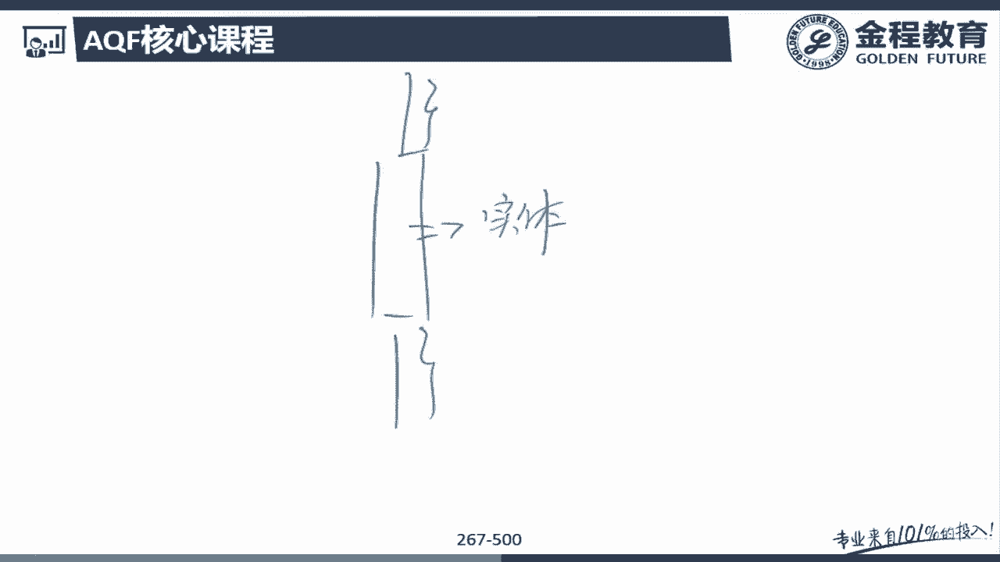

这样一根K线，所以对我们来说，这是一个比较普通的这样的一根K线的，一个情况啊。

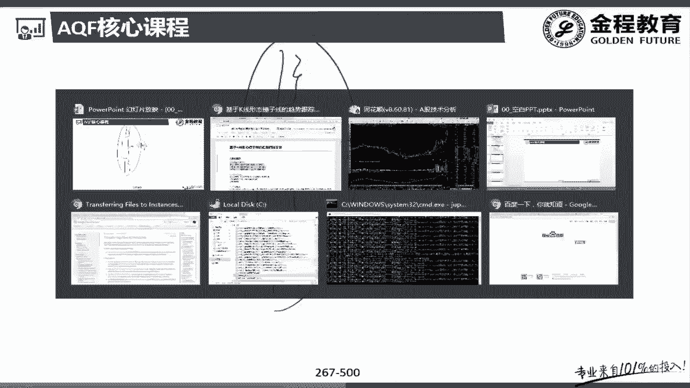

好，那么再来看一下我们这个策略里面，对于锤子线的这样的一个定义，锤子线的一个定义是，他说的是实体除以整个价格区间的上端，实体颜色本身不影响什么意思呢。

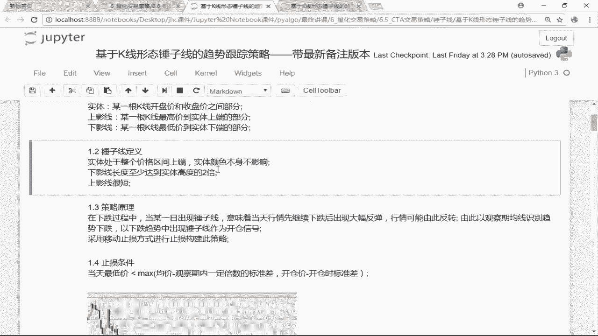

像前面你看这个时候这个这根垂直线，你要是真正意义上的一根垂直线，那么你这个实体啊，首先第一个你这个实体要比较小，同时你这个实体要在我这个垂直线的偏上方，看到没有，在你这个实体要在我整个K线的上方。

因为上方的话说明什么，我往下跌了之后收回来，涨的是不是才多啊，对吧，哎。

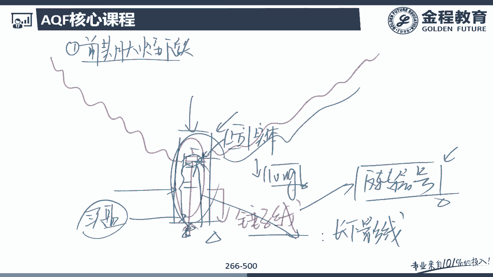

那么就说明我这个抄底买入的那些人就越多啊，而且的话呢我这里的上影线。

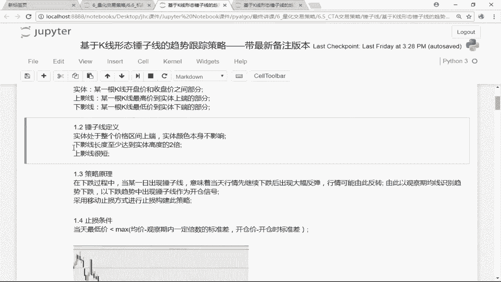

下影线的长度至少要是实体的两倍，下影线要比较长，这是我前面跟大家讲的对吧，这个怎么到底多长算成长呢，他这里说了。

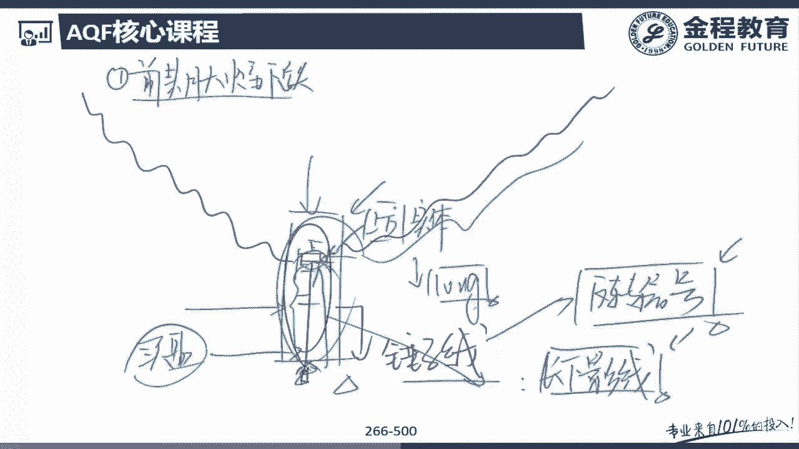

下影线要长，至少要是我这里实体的两倍，第二个上影线要短一点。

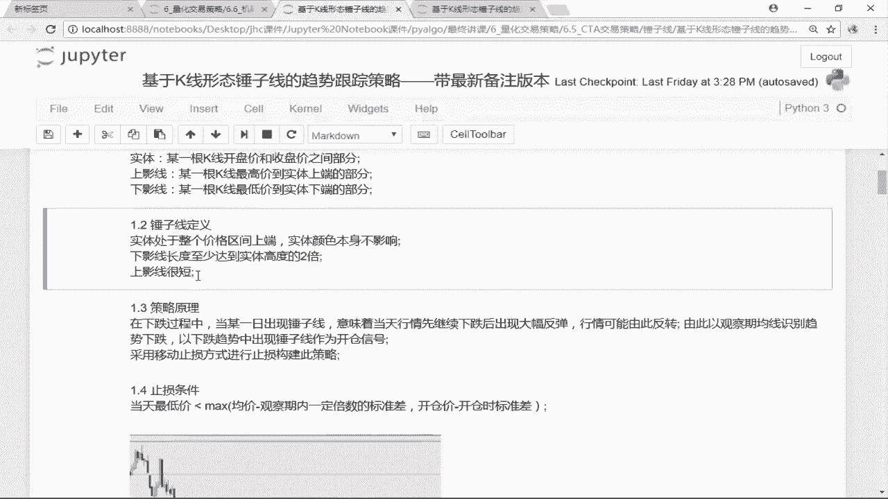

最好没有或者比较短，这这些都可以，没问题吧，哎上影线太长的话不好啊，上影线太长说明什么，说明我股票价格本来往上涨了一段时，网上确实涨了一波之后，我这只股我后面股票价格是不是又跌回来了，哎所以。

上影线太长的话呢，并不是我们所希望的一个状态啊，好那么再来看一下我们这个策略的一个原理，策略的一个原理就是在下跌的过程中，如果当日出现了一个垂直线，那么就是什么当天行情先继续下跌，后出现怎么样大幅反弹。

那么我们认为怎么样，后市我这个行情反转或者反弹的概率，是不可能就比较高一些，所以呢在我们嗯这个策略的一个原理，就是在下跌的趋势当中出现了锤子线，我们就作为一个开仓信号，没问题吧。

来这是我们这个策略的原理啊，那么额开仓了之后怎么去止损呢，注意啊，我们采用的是一个移动止损的方式，去进行止损呃，这个移动止损的方式的话呢，之前我们在课上跟大家讲过啊，就比如说我们的海龟交易策略等等。

我们用的都是移动止损法啊，移动止损法有它的一个好处，因为如果说你用固定止损法的话呢，他可能会有一个非常大的一个获利的一个回吐，比如说我这里是嗯这里是我的一个开仓价好，那么比如说这里是我们的一个止损价。

如果我们是固定止损的话呢，可能是什么哎，价格一直涨涨涨，涨的已经很高了，然后呢都不会触发止损，对吧好，后面我股票价格跌跌跌跌到这里，哎我去我止损了，那么这一波的上涨的这一波的的这个收益。

其实我是不是都获利回吐了，唉，所以固这是固定止损的，这样一个比较大的一个问题啊，那么移动止损就有它的一个天然的一个好处，移动止损是什么意思啊，比如说这里是我们的一个开仓价。

那么你的止损价在开仓价位的时候，你的止损价是不是在这里啊，唉可能随着我的价格的不断上涨，比如说现在价格涨到这里了，那么我的止损价可能就是在这里能理解意思吧，这个止损价是在不断的。

随着我行情的变化而变化的，那么这种就是我们的一个移动止损问题吧，好那么我们这个策略非常好的一个点，就在于说，我们把移动止损和固定止损这两个优点啊，结合在了一起，我们既有移动止损的部分。

我们也有固定止损的部分，所以他们来说，这个策略是非常非常有代表性的啊，呃除了他是一个形态识呃，形态识别的这个策略以外，还运用了我们的一个移动止损的这样一个，技术问题吧，那么到底怎么去做的这个移动止损呢。

我们在讲策略的时候来去跟大家说。

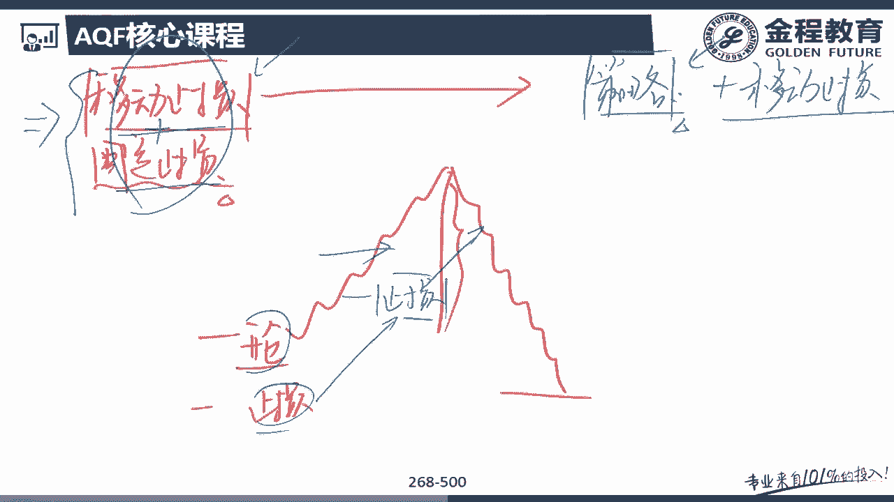

那么这个止损的一个条件啊，你看这个止损的一个条件是拿我的额平均价格，一段期间内，里面的这个这个股票的均价，减去我观察期内一定倍数的标准差啊，注意啊，这是一个移动止损。

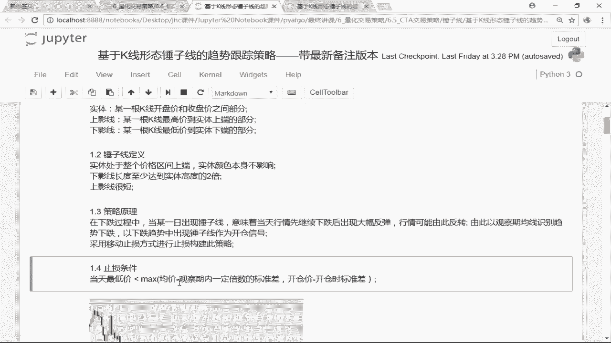

那么咳那么他说的是吧，当我的平均这个时候，我的股票的一个均价，就相当于是拿我的命减去几倍的标准差，哎减去我一倍的标准差，那么对于我们来说，这就是我们的一个移动止损的这个条件，大家会知道啊。

随着我们的呃行情的一个交易，我的股票的价格的一个变化，我这里的均值和我这里的标准差，是不是都会随着行情的改变而改变的，哎，所以呢我这个时候的止损价格，也会随着我的价格的改变而改变，比如说我价格上涨了。

在价格上涨的时候，我这个均价，一段周期的这个均价的价格是不是也会上涨，哎那么这个标准差呢可能上涨可能会下跌对吧，所以呢当我们在这个里面减去我一倍的，这样一个标准差，就设定为我当前时间点上的这样的一个。

移动止损的一个点位问题吧，好那么还有呃这一部分是移动止损啊。

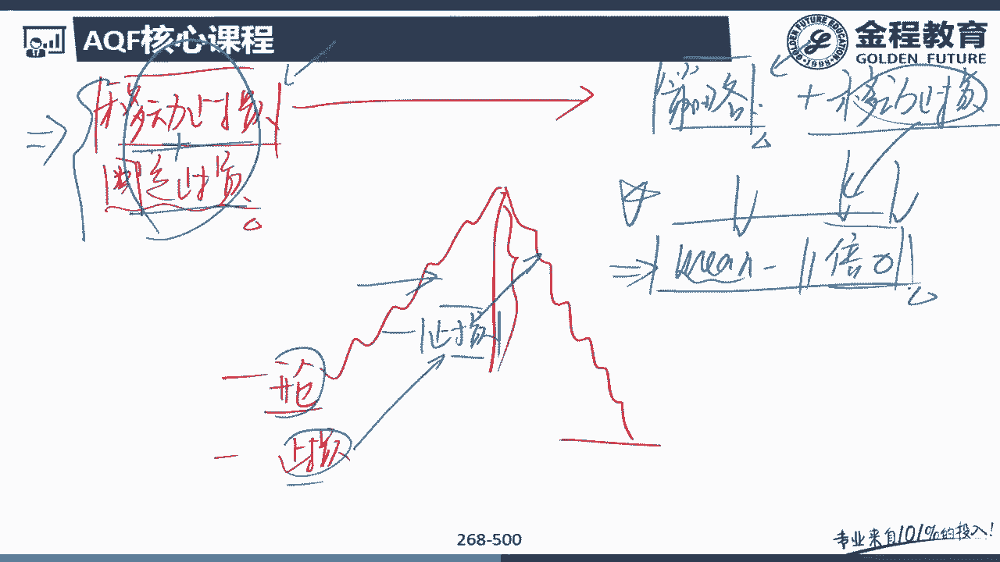

后面一部分是呃固定止损，固定止损，它是就是拿我当时开仓时候的那个开仓价格。

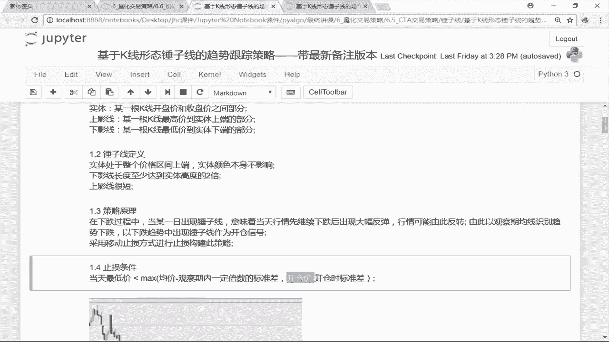

减去我开仓时候的那个标准差，也就是说在我这个里面，均值减去观察期内的一倍标准差，这个是随着时间的改变而改变，或者说会随着价格的改变而改变的，那么这是一个移动止损，那么除了有移动止损以外。

我们还加了一个固定止损，那么固定止损是怎么止损呢，固定止损，就是当时的开盘开仓价减去一倍的标准差，也就是说比如说这是我的开仓价，那么固定止损就是这个点位，就是拿我当时的开仓价。

减去我当时开仓时候的一倍标准差，能理解意思吧，所以整个来说我整个策略的这样的一个核心，它就变成这样一个，比如说这是我的一个开仓价好，如果你股票价格上涨的话，呃，开仓价那么第一个点位，第一个止损点位啊。

固定止损的这个点位，就是这里这个是固定止损的点位，是拿我的开仓价去减去我的一倍的标准差，问题吧，唉这是固定的这个止损点位啊，那么除了有这个固定的这个止损点位以外，如果我的行情上涨了。

比如说我的股票涨到这里了，那么我的这个止损价也会水涨船高，我的止损价它现在就变成一个动态的一个止损，就变成了当时的一个均价，减去我一倍的标准差，你涨得越高，我这里的止损价格会慢慢慢慢慢的提高。

听明白意思吧，那如果说我行情下跌呢，行情下跌没关系啊，行情下跌，因为我们也有这样的一个固定的止损，当我们跌到这个固定的止损，这里里面这个点位的时候，我们也会进行怎么样，哎我们也会进行这样的一个止损。

听明白意思吧，哎所以呢这个策略，它是相当于是把移动止损和固定止损，结合在了一起啊，同时注意这个策略，我们是拿着大循环的方法去写的啊，因为基本上我们后面很多的策略，包括我们优化里面的很多的策略。

都是用循环去写了，所以对我们来说的话呢，比较简单的策略啊，你可以用向量化的填充方法啊，稍微复杂一点的这种策略啊。

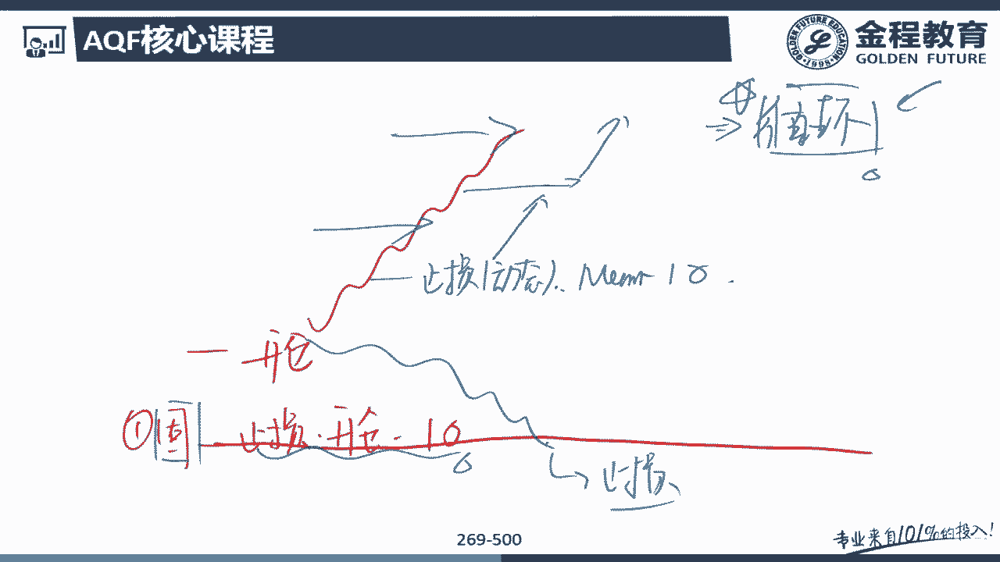

我们都是需要用循环的方法去写，没问题吧，好那么这是跟大家介绍了一下，我们这个里面的这个策略的一个原理，那么那我们在这个里面给他放了一张图啊，你看前期价格是要下跌的，对不对，完了之后呢。

在下跌一段过程当中出现了这样一根锤子线，就是嘛当天刚开盘的时候还是继续下跌，但是跌了一段时间之后怎么样，哎有人买了，那么这个时候我的收盘价，我的价格是不是再会涨回来，对吧好。

那么我们会发现后期就会有一波这波啊，相对来说比较大的一波行情，我们在这一个点位开始开仓的话，后期这一波行情我们是不是开始上涨，拿到了我这样的一个收益啊，对不对，好，那么我们来看一下啊。

在我们的股票软件里面啊，这种这种图形有非常非常多啊，随便找几个，你看我在这里002386，你看在我们这个里面其实是真正正正行情的，你看这个点这一个点就是7月呃，大家不知道看得见呃，呃5月24号。

那么这个时候我们会发现实体是不是很小啊，几乎没有玩完之后呢，我的下影线很长，上影线很短，那么当然这种也是一种叫十字星啦，那没关系啊，在我们这个里面，其实这种十字星是一种比较特殊的这种，这种怎么样垂直线。

对不对，而且前期是经过一波下跌的，所以呢对我们来说，我们我们的策略可能就会把这个怎么样，这个呃这个咳咳垂直线可以找到，然后呢这一波行情我们是不是可以获得了，对吧哎好，那么对于我们来说啊。

这种嗯这种股票真的有特别特别多了，那么比如说随便来看几个啊，我们来看看额，唉像这里这里也其实也是一根锤子线啦，但是这个垂直线的话呢，他的那个上影线有点长啊，但是也还不错，那么你看只要我的实体小上影线长。

那么对我们来说，其实后面会有一波小行情，对不对，那么你看这种我们多看嗯，我们往前多看一些的话呢，其实像这种锤子线肯定有很多啊，比如说我们来看一下最近比较火的，对吧好，那么来看下中国联通。

那中国联通的话呢，像这个这个是不是也是一个比较呃，比较典型的这样的一根垂直线，下影线很长，上影线很短对吧，当然这是一个比较特殊的一根额锤子线了，那么后面我们再来看一下其他的股票。

额其他的这些好像我们随便到我们的那个里面，去找几个股票来看一下，好了呃，啧看看这种这种股票，唉像这种，像这种，其实这个都算是一种锤子线了，那么在这里面的话呢，嗯看一下啊，唉像这种也算是。

所以呢对我们来说，其实这种嗯锤子线啊，在我们的这个K线图里面，是一个相对来说还比较常见的，这样的一种K线形态，所以呢对于我们来说，而且后面呃额相对来说啊，很多锤子限制额，后面的话呢都会有这样一波额涨幅。

所以呢在我们这个里面形态识别里面啊，我们跟大家讲的就是这样子的一个形态，我们要找到市场上的这种垂直线，完了之后的话呢，呃我们就可以通过买入这个水资线，所对应的一个股票。

那么我们就可以获得这一波上涨的一个收益了，没问题吧，哎那么嗯像这种锤子线有很多了，那么到时候我们这里就不一个一个，大家大家看了啊，到后面的话这个我们可以呃用一个用一套算法，然后呢。

把这个算法里面这个垂直线我们就可以找到呃。

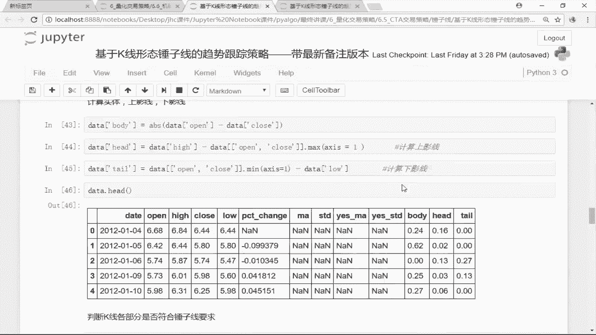

到时候大家就可以来看一下啊，这个我们算法里面找到的这个锤子线。

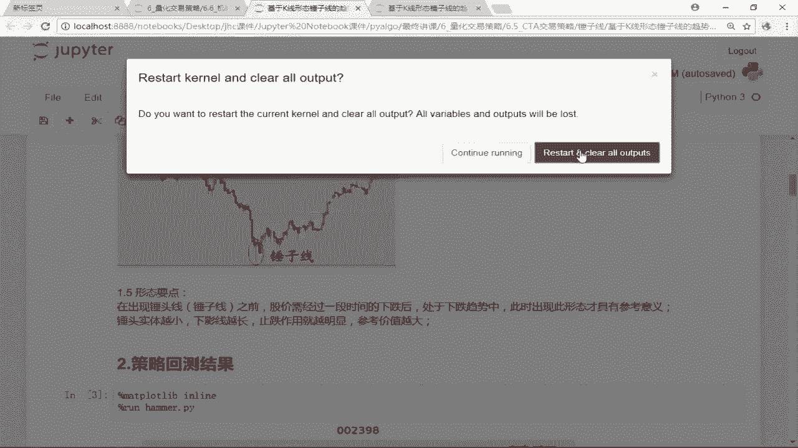

我们其实在我们的K线上一看呃，它也是满足我们这样的一个要求的，听明白意思吧，好，那么呃这就是我们给大家介绍的一个，策略的一个原理，好，那么接下来的话呢我们开始就跟大家去讲。

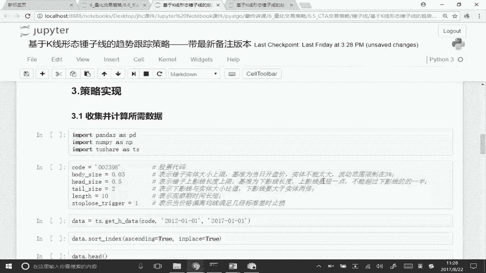

