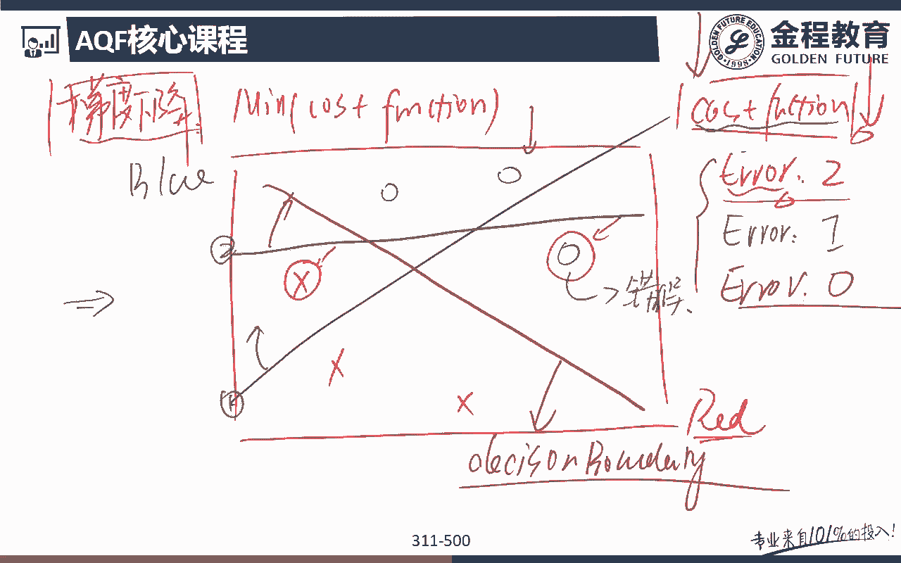
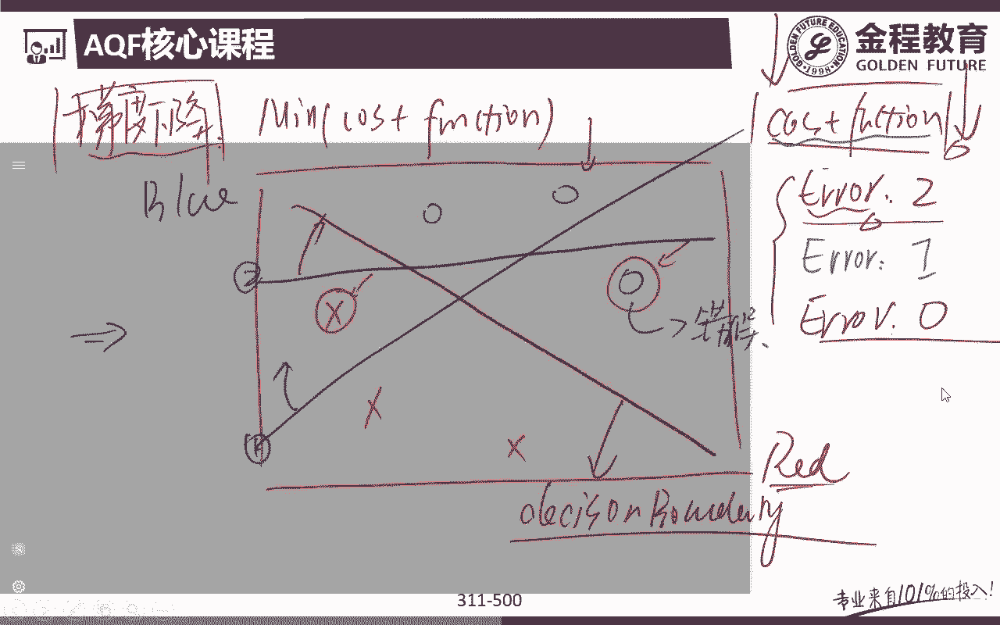
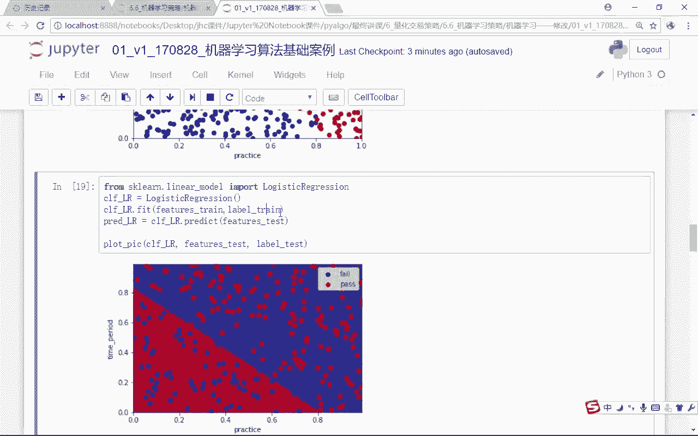
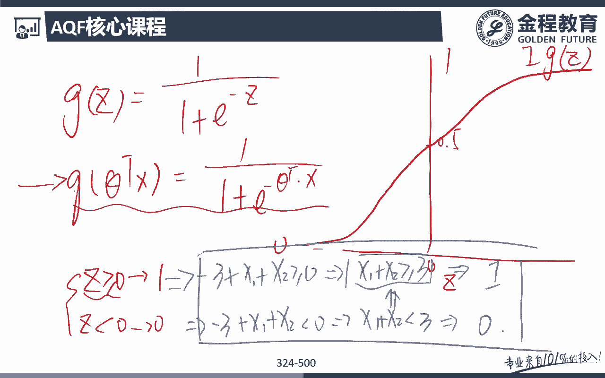
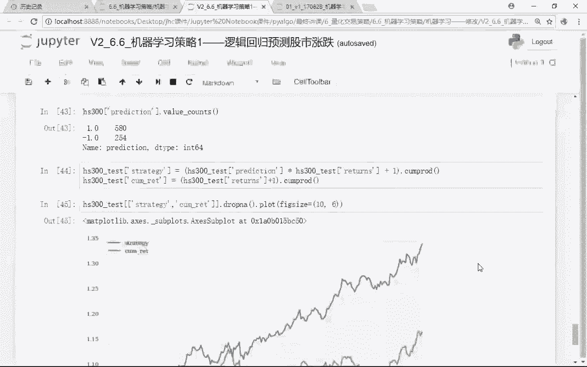
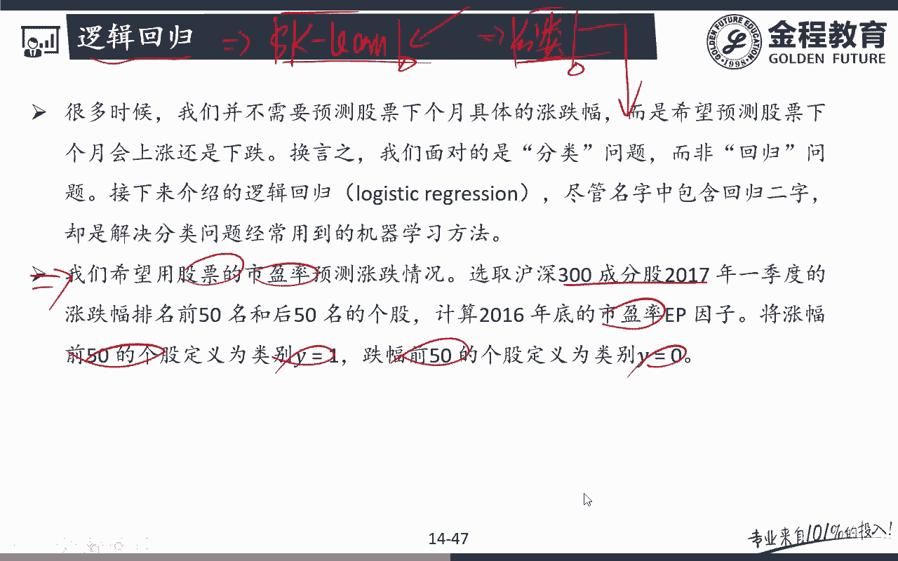

# 2024年金融大神老师讲解量化金融分析师.AQF—量化金融专业知识与实务 - P7：《+威❤hhh427501  了解获取全套课程》01.机器学习算法原理_1逻辑回归原理 - 量化沿前 - BV1oU411U7QM

好各位同学大家好，那么上一节课的话呢，我们是跟大家介绍了呃线性方程对吧，哎线性回归，那么在线性回归里面的话呢，我们跟大家介绍了传统的线性回归的方式呃，呃同时的话呢，我们又跟大家介绍了一些线性回归的一些。

正则化的一个方法，这什么是正则化，就防止我们过拟合对吧，过拟合的一个嗯正则化的一个核心思想，就在于说，我要在我的损失函数里面再增加一些嗯，再增加一个项，这一项的话呢就是我之前呃我这个回归方程。

线性方程里面的那些系数，如果额前面的话呢还有一个惩额惩罚系数能打，那对我们来说如果能打越大的话呢，我对后面的权重的影响就会越大，所以呢我要使得我的线性方程的这个损失函数，最小化的时候呢。

我就要怎么样降低我这个方程的，这样的一个复杂程度，对不对，当然了，你也不要让让这个惩罚系数太大啊，惩罚系数太大的话呢，这个呃确实方程组不会那么复杂，但是我的解释力度也会大幅下降。

那么后面又跟大家去讲了一个，梯度下降的这样一个概念，那么这个梯度下降这个概念还是挺重要的啊，就是我们再来跟大家来去重复一下，什么是梯度下降呢，其实它的一个过程就是minimize。

我的一个error的这样一个过程对吧，就最小化我的这样一个错误，那么这个错误其实就体现在，我们之前面跟大家讲的那个损失函数里面，好，让损失函数里面能loss最小化好，那么怎么去做的一个呃最小化呢。

就是我可以怎么样呃，大家可以把额梯度下降想象成这是一座山对吧，山上的这一个点呢，额呃最高的那个点，可能是我错误的最高的那个点，或者说我随机出来一个点，这个点呢可能就是在这里，这这个点的高低啊。

就表示我们错误的一个大小，听明白意思吧，好那么接下来的话呢我们要做一件什么事情呢，接下来我就像我们前面在上节课，在跟大家讲线性回归的时候，我可以再怎么样嗯，我就可以适呃适当的去移动一下呃。

我的这个这条回归线的一个方向好，完了之后呢，我就可以来看一下移动了之后，我这个error就是我的这个损失函数啊，Cost function，他那个错误是更大了还是更小了，大家想看我是要更大还是要更小。

我肯定是要怎么样更小对吧，也就是说如果说我通过像前面那张图，应该还在啊，我改变我这样的一些一些斜率的话，最终使得我损失函数的这个error下降诶，那么我就觉得，我接下来是不是要往这个方向走啊。

哎那对我来说，比如说我接下来我就觉看出来了，我现在要往这个方向走对吧，哎好那么可能在我现在就走到了这个点，那么这个点呢再进行一次，这样的一个额梯度下降之后的话呢，哎我可能会发现往这一个走。

我的error下降的是最多的，所以呢我就往这里走，然后呢我可能再往这里走，再往这里走，再往这里走，最终到什么哎，最终到的山底下，那么像再到山底下的话，我们认为你这个错误已经是什么，哎MINIMUS了。

已经是最小化的这个错误了，那这意思吧，哎所以他很形象啊，就有点像我们这样一个下山的这样一个过程，所以呢他就叫一个什么梯度下降对吧，哎好呃，在我们一般的这种机器学习的，正规的这种课程里面的话呢。

一般我们可以见到这样一张图，这张图的话呢，哎这这个图形，我们知道它是一个convex的一个图对吧，哎呃这种convex这种图啊，呃那么画出来的才呃，这是我损失函数，那么画出来的话呢。

这一个呃我们再拿来它去做梯度下降，才可能是更好的，那么比如说啊，我现在我的这个err是在这里对吧好，那么接下来的话呢我要找到哪一个点这个点，因为这个点的话呢是我们的一个损失函数最小。

我的error minimize error最小的那个点，那么怎么做呢，我就不断的先走一步，再走一步是吧，再走一步，不断的走，不断的走，不断的走，听明白是吧，哎无奈的走了之后呢，我找到走到这一个点。

这一个点的什么，怎么找到这个点，很简单嘛，就找找这个损失，就找这个什么求导对吧，求导看切线，那么也就是说他们说，如果我们这里的切线切出来的是平的，那么这个求导求出来的是对吧，我等于零的话呢。

那对我们来说，我们是不是就找到了这样一个极值点对吧，哎找到了这样一个最小点啊，那么这个具体展开数学方面的一个展开，我们就不不多说了啊，大家知道一下，我们其实是take求导求导之后呢。

看斜率斜率是大额正的还是负的，我们就可以判断它离我的那个最低点为应呃，我应该是怎么走对吧哎好那么对我们来说，我可以不断的往前往下走，往下走往下走好，直到找到一个点，我这里的斜率是平的。

那么斜率是平的话呢，相对于是我这里是不是就是这样一个最低点啊，对吧，唉这是梯度下降的这样一个思路啊，这个思路的话呢，我们上节课虽然跟大家讲了，但是我觉得还是有必要再跟大家来复习一下好。

那么接下来的话呢我们就要来去看呃，逻辑回归了，那么逻辑回归的话呢，它是属于一个非常非常常用啊，也是功能非常强大的这样的一个算法，所以呢对我们来说，这个逻辑回归的话呢。

我们就稍微会呃展开来去跟大家讲一下啊，我们会把这个逻辑回归的原理，简单来去跟大家说一下，但是所有的机器学习的用法啊，非常非常简单对吧，所有进行学习的用法的话，那我们就可以用怎么样，额。

我们之前跟大家介绍过的一个库叫做sk learn，对吧，哎这个package我们只要import一下，这个sk learn里面的，比如说各种各样的模型，SVM也好。

如Rush urologistic也好等等等等，我这import一下，然后再train一下，fit一下，predict一下就完了，所以很多同学会觉得机器学习可能很难，那确实啊。

你要掌握后面的背后的一个核心的算法原理好，那确实是非常难的，但这个机器学习呢应用起来倒不难啊，应用起来的话呢，我们因为我们已经有一些package呃，帮助我们把这些算法都已经写好了，我们只要调用它。

然后呢输入一些参数，这个算法的这个结果我们就可以出来了对吧，所以呢呃原理写的一些东西尽量去听呃，能掌握最好啊，不能掌握的话呢，这个嗯大致知道一下有这么个算法，完了之后的话呢。

大家可以在具体在实战当中可以拿来用，就好了啊，好那么我们接下来的话呢就来开始看呃，啊这个我们比较重要的这个topic，我们把它叫做rogistic regression，逻辑回归好，那么逻辑回归的话呢。

首先大家要知道一点啊，它是属于我们的机器学习算法里面，监督学习下的一个什么哎分类算法，所以分类算法的话解决的就是一个分类问题，对吧，哎那么这个比如说呃，我要预测股票的一个什么上涨的幅度，下跌的幅度。

那么比如说我要去预测股价的一个收益率，那这个我们要用的是regression对吧，哎但是如果说我可能我只想预测一下一段时间，下一个呃时间上我股价的一个变动的一个方向，是涨还是跌。

我不用去判断涨多少还是跌多少，那么涨还是跌，这个是不是就是属于我离散的这个雷吧对吧，哎离散的这个标签，所以呢对我们来说，其实分类问题的话呢，我们之前也跟大家举过例子啊，就是要解决的是离散的这样一个问题。

没问题吧，哎那么在我们这个呃，传统的这个机器学习里面呢，有一个非常典型的一个算法，就是呃帮助我们去理解我们这个逻辑回归的，它是一个什么呢，它是一个呃叫做它是一个DATASET。

这个DATASET的话呢是在帮助呃，让我们去判断这个肿瘤是恶性肿瘤还是良性的，一个肿瘤，那么对于我们来说，我最终要形成的这个肿瘤是良性的，还是怎么样恶性的，那其实显然他是一个怎么样dis呃。

离散的一个对吧，哎他是一个两分类的一个分类问题好，那么对我们来说的话呢，怎么去看呢，就最简单的比如说我们只有一个一个feature的话，那我们就可以去看这个肿瘤的一个怎么样size好。

然后呢我们就可以判断这个肿瘤是良性的，还是怎么样恶性的对吧好，如果说是恶性的话呢，我们用怎么样呃，这个用我们可以用一来表示，那么如果说是良性的话，那这个肿瘤我们可以用怎么样零来表示，没问题吧。

好那如果只有这个这个size是feature，然后呢，恶性和良性是不是就属于我们这个里面的雷吧，对吧好，那么他可能是这样子的，比如说你的肿瘤的尺寸还比较小的时候，我们认为你是不是可能都是什么良性的。

对吧好，但是呢当你的这个肿瘤的尺寸达到一定的时候，一定大小的时候，你的肿瘤开始就变成恶性了，我们恶性用怎么样呃，这个，圆圈来表示这没问题吧，哎所以呢对于这种问题的话呢，大家想想看。

我们如果还用传统的线性回归去回归的话呢，我们的效果是不是相对来说就比较差了，为什么，你看如果我要用线性回归去回归一下，我这里的肿瘤的尺寸，跟我这个到底是恶性的还是良性的话，我可能线性回归。

因为我要最好更好的去拟合这两个点嘛，这些点对吧，我可能回归出来的是这样一条线对吧，那么这样一条线的话呢，对我们来说呃，可能啊你可以去说这里是0。5对吧，那么呃那你看比如说在这一个点上。

我的一个size size回归出来的，我这个肿瘤是什么，这个肿瘤是恶性还是良性的，是0。2，0。2是良性还是恶恶心啊，这个其实呃我们就不可能用这么去做了对吧，当然你可以自己设定一个阈值。

比如说这里阈值设定成0。5，我线性回归出来的话，如果是在0。5以下全都判成良性，如果线性回归出来的结果是0。5以上，全都判断成为我的一个什么恶性，那么其实倒也可以啦，但是的话呢对我们来说的话。

如果说啊我们的这个尺寸额图形里面额，比如说我们会有一些呃点在这里，如果我们有大量的一个size的一个点在这里好，如果这个时候我们再要想去呃，你和这个线的话，那我们可能怎么样，我的线性回归的这个线。

是可能就跑到怎么样这里来了，是不是这样，所以呢这个时候对于我们来说的话呢，可能你看我要如果还是0。5，作文的一个分水岭，可能size在这里我才说0。5以上是恶性，0。5以下十良性。

但是如果size在这里的话，显然很多点我们都是错的，因为这些点其实都已经是什么恶性的了对吧，哎这些点其实都是已经是恶性的，所以对我们来说啊，这个像判断这种分类问题的话，我们认为这个里面的呃回归的算法。

其实是呃呃效果是不是比较差的，不能比较好的去拟合出来，对不对，好，那么这个时候我们就要去用到一个什么方法呢，哎就可以用到我们这里的ROGISTIC怎么样，Regression。

那其实rogistic regression叫做逻辑回归对吧，虽然它是一个回归啊，但是的话呢它反而是一个分类的一个问题啊，那么为什么他这个里面有一个回归的这样的，一个字眼呢，它其实。

有一定的这样的一个线性的一个，方程的思路在里面啊，那么我们后面会继续来跟大家说好，那么我们这个里面的逻辑回归是怎么做的呢，他其实他就要做一个分类对吧，就是想要把这里切一刀对吧，比如说在某一个范围里面。

我这里全都是零，完了之后呢，等达到某一个数值了之后，怎么样直接通通把我这个里面呃，预测的一个结果变成一，所以呢它其实就是一个两分类，一个要么是零，要么是怎么样，一，我这个绿色这条是不是。

就是我这个逻辑回归要做的一件事情啊，它其实就是要把它怎么样把它给切出来。

对不对，好那么对于我们来说，我们来看一下路程啊，好那么对于我们来说的话呢。

这只是一个features啊，那么如果说有两个features的话呢，也是一样，比如说还是一样，这里的第一个features是我们的size，第二个features呢。

比如说可能是我们的患者的一个年纪对吧，比如说在这个里面的这些点呃，size是比较小的，年纪也是比较小的，那么可能怎么样，你是圆圈，都说benign都是什么良性的，那如果说呃你size比较大。

同时你的年纪也比较大，那么对于我们来说的话，那这些肿瘤的话呢，可能就是一些恶性的一个肿瘤了，所以对们来说，我们的逻辑回归就要做一件什么事情啊，哎找到这样的一条线，可以把这两个类型更好的最好的。

怎么样把它给切割开来，没问题吧，好那么这条线的话呢，就是我们逻辑回归里面要去找到的是什么，来决策边界，什么地方，Decision boundary，好，那么这个就是我的呃逻辑回归要做的一件事情。

根据我的分类之后，我有标签，然后呢，把属于各自标签的这些点都能把它给找出来，能理解我意思吧，好那么额这是我们逻辑回归要做的一件事情，那么他具体是怎么做的呢，我们把整个原理啊。

我们通过一些呃图形的一些方式，我们来跟大家讲一下啊，好那么接下来的话呢，我们就尝试着来跟大家讲一下啊，我们这个逻辑回归的一个背后的一个原理，当然我会举最最简单的一个例子，来去跟大家讲啊。

所以可能有些地方我们是做了一些简化，那么呃并不是特别那么的严谨啊，但是我觉得这个教学过程吧也不用那么，能把这背后的一个主体的一个思想啊，能给大家解释出来的话呢。

我觉得就额能帮助大家去理解这个logistic，regression背后的一个呃思想的话，那我觉得应该就可以了，没题吧，好，那么我们接着就来看一下这个逻辑，回归的一个主要的一个作用。

或者说它背后的一个算法的一个逻辑啊，那对我们来说其实呃分类的一个问题，包括REGISTIC，包括我们后面还会讲的SBM，其实就是要做的一个东西，就是什么分割数据对吧，我们把它叫做split data好。

那么比如说大家来看一下，现在有这样几个数据，比如说这里是几个叉，这里呢是几个圈，对吧好，那么我的目标是什么，诶，我的目标是不是把找到这样一个决策边界，把这两个数据把它给分割开来对吧。

哎一个数据是属于这个标签，一个数据可能就是属于怎么样，另外那一个标签对不对，好，那么我现在要跟大家讲的就是，如何在我们的逻辑回归里面，找到这样的这个决策边界对吧，这根线我们是怎么找出来的，对不对。

哎好那么我们要解决的就是这个问题，包括我们整个逻辑回归的算法，也就是要找到这样一根线，对不对，好，这根线的话呢，可以最好的去分割这两个数据组好，那么我们简单来跟大家举一个例子啊，怎么去嗯找到这根线呢。

其实它背后用的思想也是，我们前面刚刚跟大家去讲的这个梯度怎么样，唉梯度下降的这样的一个思路和原理啊，就是不断的去最小化我的一个什么cost function哎，去最小化我们这里的这个损失函数对吧。

哎这也是为什么我们要在线性回归的时候，先跟大家讲损失函数，因为线性回归的这个代价函数也好，损失函数也好，是呃大家可能是都理解的啊，那么完了之后，再把它推广到我们的其他模型下面。

那么这样的话呢它就可能更好的去理解，对吧好，那么对我们来说好，首先一起来看一下啊，比如说我们来举一个最简单的例子，可能我有这样六个数据点，比如说一个点在这里，一个点呢在这里。

一个点呢在这里还有呢是三个蓝色的这个点，三个蓝色的这个点呢，可能一个点在这一个点在这，还有一个点在这问题吧，好那么对我们来说的话呢，比如说这里呃这个是这样一个data set。

这里呢是这样子的一个数据组，好，那么这个数据组的话，我们知道啊，正常我们的一个切法应该是怎么去切的，正常的这个切法我们其实在我们的这个里面，我们也看的特别清楚了对吧，正常的一个切法的话。

那我可能这样一刀切下去，那对我们来说，这里一段全都是什么哎这里的全都是blue的，这里一段全都是什么red的，这没地吧，哎这我们肉眼就能分辨出来的啊，那么呃但是呢，我们机器不可能一下子他就能把这一段。

把它给切出来，对不对，那么机器的一个过程是什么样子的一个过程呢，注意啊，我们把整个它的一个呃逻辑来跟大家算一下啊，让大家来感觉一下，机器刚开始的第一个它全都是随机化的，听明白吧。

哎机器刚开始的他不可能像我们人眼这样，一眼就看出来这这个角色边界对吧，好机器，我呢我可能就什么先随机画一条，比如说我先找到了这样一条角色边界，这是他先随机化的一个边界问题吧，好那么他就判断了一下。

比如说这里一段全都是什么，哎呃我们拿蓝色笔来写啊，这个紫色线的左边的话呢，可能全都是不是blue了啊，哎，这个机器学习啊，一定要用可视化的一种东西来跟大家说啊，不然太难讲了。

比如说在这一段的左边可能全都是blue的，然后呢在这他的这个决策边界的右边，它就是什么red的，对吧好，那么我可以看出来，你肉眼我们就可能看到我机器学习的，刚开始的这个随机的这条线画的好不好，显然不好。

为什么这里面有错误分类，哪两个其实是比较明显的一个错误分类，这个对吧，哎明明你是红色的，你把它分在蓝色的这个里面了，还有一个呢是这个明明它是蓝色的，但是呢你把它分在什么红色，这个里面了。

所以他刚开始随机出来的，画出来的这个角色边界，我们认为好不好，唉，显然是非常不好的对吧好，那么现在要怎么办，我们还是那个我们要找到这个cost怎么样function。

然后的话呢把这个cost function，损失函数是把它给最小化对吧好，那么我们先来讲一个最最简单的，但是实务当中并不是这么去做的啊，真正的算法里面也不是这么去做的，比如说我们找一个最简单的。

我们可以根据错误量，错误的数量来去额作为我们的这个损失函数，那么大家来可以看看一下啊，如果我们把这个错误的个数，作为我们的一个损失函数的话，这样一条我随机画出来一条线，我这里的错误有几个。

哎我错误是不是有两个，因为这两个这里这个数据组和这里这个数据组，我们其实是分类错误的，对不对，好，那么现在怎么办，唉，我现在要做一个什么梯度下降，那么梯度下降是怎么做的。

就是我可以去移动这条我的决策边界，往上移一点，往下移一点，看看我在哪一个方向走，可以降低我这个损失函数吧，对吧好，那么这个时候我就有可能怎么去做呢，我就移动了我这个决策边界。

让我的决策边界怎么样往上走一点，可以吧，完全可以，那么这个时候的话呢，我可以比如说把我这里的决策边界变成注意啊，这是第一条决策边界，这是第二条，我怎么通过梯度下降。

不断的怎么样改变我这个角色变迁的一个方向，我可以找到怎么样，第二条绿色的这一条线，作为我们的一个decision boundary，没问题吧，好那么这个时候我们再来看一下，这个时候我们的这个绿色这条线。

我的error是多少，我的损失函数哎，在我们，这个里面绿色的这条线的话，我们先来看一下啊，嗯你看在这个里面这两个分的是蓝色的，这四个我们分的是什么红色的对吧，哎那么对我们来说的话呢。

我现在的error是不是就只有怎么样一个了，哎只有这一个我们是不是分了分错了对吧，哎绿色的这一个啊，这一个我们是分类错误的一个点没听吧，好那么接下来怎么办，我还是一样啊。

我要最小化我这里的什么cost a function没问题吧，好那么我可以再一次的去移动我这条检测边界，比如说我现在可以把我这里的这条决策边界，移动到哪里呢，哎再往这一段移一下好，那么再往下走啊。

先走一步子，然后呢再什么再往上走一格对吧，哎因为我发现我朝这个方向走，我的损失是在降低的，所以呢我要不断的去往这个方向走，这是不是就是我前面跟大家讲的，这个梯度下降的一个原理啊，我往这个方向走。

我一看诶，损失是下降的，我就往接着往这个方向走，看看损失是不是继续下降的对吧，哎，那么我们先往这个原来随机画出来的，紫色的这条线，好是两个错误，我现在呢先往这个方向走了一下，诶，发现果然我的错误下降了。

那么我就再一步次沿着这个方向走，这个时候我们会发现我这条线这个decision boundary，这条角色边界我们会发现是不是就不错了，为什么他跟我们的真实的那个分类的呃，最优的那条决策边界。

可能是已经是非常非常接近了，对吧好，那么这个时候我们会发现这条线，为什么我们认为好啊，因为这条线里面我们分类错误的点只有几个，没有了对吧，哎因为什么这一部分全都是蓝的，这一部分全都是红的。

哎我们发现我全都是分类，怎么样准确的听明白意思吧，哎这其实说白了啊，就是我这个逻辑回归的最最简单的核心的一个，背后的一个什么思想，听明白意思吧，哎好但是呢这么做啊，我们把这个错误的个数作为。

我们这里的损失函数的话呢，有一个问题什么问题啊，我们发现这个是我们举的例子啊，所以这个大家可能理解起来可能会呃，相对来说比较好去理解一些。

但是在实际的过程当中啊，在这个看我们可能会碰到这样一个问题。

什么问题啊，我往这里走了一个可能还是两个错误，我怎么样又往另外一个方向走了一下，还是两个错误，听明白意思吧，因为你看哦，原来的我们的线性回归方程里面也好，其他的里面也好。

其实我们的损失函数都是一个连续的吧对吧，哎我们可以稍微变动一点点，我们就可以知道我的损失是呃，我的这个error是更大了还是更小了，但是呢在我们这个里面，如果说你们把额，我们把这个错误的个数做。

我们的一个损失函数的话，有一个比较大的一个问题，什么问题啊，比如说我们往这里，比如说刚开始随机的，是不是就是这条紫色的条条线，我先往上走一点点，画出来这一条蓝色的一条线。

我们发现其实我的错误是不是还有是两个啊，好我再往下走一点点，好，我们会发现这个错误还是两个，所以这个时候对我这个决策边界来说，对我这个算法来说，我可能就不知道我应该往哪走了，我往上走一点，错误没改。

我往下走一点，我的错误是不是也没改啊，哎所以呢对我们来说，这只是我们的一个原理性的一个东西，但是它的算法真正真正的一个算法啊，并不是这样子的，那么真真正正的算法它是怎么样子的呢。

他是要把这个离散的这个东西啊，把它变成一个什么哎，把它变成一个连续的这样一个损失函数，那么把它变成连续的这个损失函数之后的话呢，它就可以更好的去怎么样哎，他就可以更好的去找到这条最优的。

这个什么角色边界了，好那么我们来看一下啊，他是怎么把这个离散的，把它变成一个连续的，因为我们知道啊，离散在数学上它不可导对吧，不不能求导的，不像我前面那个，比如说我们在这一点在做梯度下降的时候。

每一个我取一个切线，我就可以求导，我们就可以知道我的切线的这个什么斜率，对吧好，我们只要斜率等于零的时候，我们是不是就可以找到这样的一个额，最低的那个点对吧，哎但是如果你是离散的话。

你压根没法去求导对吧，哎好，那么这个时候我首先要做的第一件事情，就是要把离散的把它变成一个什么连续的好，那么怎么去把这个离散的，去把变成一个连续的呢，我们来看一下logistic regression。

他的一个做法啊，他的一个逻辑回归的一个做法也是蛮有意思的，那么还是前面一样啊，比如说呃我们有三条三个西呃，三个点对吧，六个点这里是红色嗯，这红色的这三个点在这完了之后呢，我有一个什么蓝色，蓝色的话呢。

可能三个点在怎么样，这三个点在这没问题吧，好那么还是拿前面的那个例子来看，前面的那个例子，我先随机切一刀，我是怎么切的，哎我是先这么切的对吧，因为我们机器不像我们的人，眼一看可能斜过来的45度。

斜向上去，斜斜上下就是一个正确的点对吧，我可能直接切出来就是这样一个点好，那么这一个点的话，那我们就知道其实两个有两个点它是错的对吧，一个是这个点错误分类了，还有一个呢是什么。

这个点错误分类了好那现在怎么办呢，注意啊，他就加入了跟我们前面一样，正则化的那个思想一样，他就插入了一个penalty，他就加入了一个惩罚因子，什么意思啊，你这两个不是分错了吗。

所以我给你这两个分错的这两个点，给你一个更大的一个权重，听明白意思吧，我就让你的这个呃，这个我就让你这个错误的这个点啊，权重更大，那么来看一下这个时候权重跟单的话呢，可以用什么来表示呢。

比如说我们可以画一个更大的一个大差出来，对吧，哎我让你的权重更大好，那么同样的道理，你这里不是蓝色，这里也有一个错误的点吗，我让你的怎么样，呃这个错误我让你的权重也来的更大。

比如说我让你的权重变成到什么，哎哎，额我让我们的这个错误变到这里这么大，没问题吧，哎好这个时候我们就可以看出来了，现在我们的这个error损失函数是多少呢，注意啊，我这里的损失函数就不以个数来去作为。

我们这个损失函数了，我们这里的错误的话呢，就是以你什么权重的一个大小呃，来作为我们的一个损失函数，什么意思啊，你这个不是分错了嘛，分错的话呢，你权重大对吧，所以呢这个时候你的这个error就变成什么呢。

就是更大的这两个，一个是大的大叉，还有一个呢是大的什么圆形对吧好，再加上这四个点是不是怎么样，这四个点是分了正确的这几个点对吧，所以呢他这四个点的错误可能很小，哎这四个点的正确的那个错误啊可能就很小。

所以他们是这个时候我们会发现，你看呃，因为由于存在这两个分类错误的这两个点啊，分类错误的这两个点的话呢，它对于我们来说我的这个error损失函数，我们就让它权重更大。

那么这个时候在这里我这个error是不是很大，对吧哎好那怎么办，我们说了嗯，梯度下降的背后的核心思想，就是要降低我们这里的什么错误对吧好，那这个时候怎么办好，降低错误嘛。

我就让我的这个怎么样线重新不断的去啊，调整一个方向对吧，可能最终就画出来了这样一条线好，画出来这样一条线的话呢，这个时候我们发现红色的大叉，原来是很大的一个诶，他不就怎么样呃，风来吹起了吗。

所以呢他的权重是不是又会变小了，对吧好，那么同样的道理，在我们这个里面怎么样呃，蓝色的这条线原来是错的，现在的话呢你也分类正确了好，那对我们来说，我的这个错误的这个权重是不是也变小了好。

那么这个时候我们就会发现，现在我们会发现现在你的这个error函数，损失函数就变成多少，唉，这四这几个点都非常小了，大差大大差大差加怎么样，三个，因为这六个点我们分类都是正确的，所以呢对我们来说。

我们会发现，这个时候红色的这个error显然是不是要小于了，我这个蓝色的这个error啊，对吧好，那么通过这种方法的话呢，相对于就把我前面的这种离散的错误，一个两个错误还是三个错误。

就把它变成了错误的一个大小是大一点的，还是怎么样小一点的，我们通过这个方法，是不是就把一个原来一个离散的这样一个，损失函数，变成了一个怎么样连续的一个损失函数啊，那么对于我们来说。

我们就可以用前面的那种梯度下降求导的方法，然后呢让我们这个切线等于零，我们是不是可以找到那个最低点啊，能理解是吧，哎好那么有同学可能会说了，季老师，我怎么把这个让他的错误大一点。

怎么让这里的错误让它小一点，怎么让他的权重大一点，怎么让他的权重小一点呢，对吧哎好，咱们其实说白了这是背后的最简单的一个思想，把我离散的变成连续的，但是连续到底怎么连续。

这里为什么可以让你的错误更大一点，这里为什么分类正确的时候，就可以让你的这个错误更呃error更小一点呢，注意啊，我们接下来要讲的就告诉大家，我这个损失函数是怎么定义出来的，听明白吧，哎，逻辑回归的。

损失函数的定义是怎么定义出来的呢，它会用到了一些，比如说我们最大自然估计啊等等等等的一些呃，想法和思路啊。

好，那么哦我们还是一样，来通过我们的一个图形来去跟大家说啊。

呃比如说在我们这个里面，我们可以先画出一个什么probability，我们先画出一个我们的一个概率的这样的，一个to，那么对于我们来说，我们前面就是要怎么做啊，我们前面的话呢。

就是要找把我这里的红色的点和我蓝色的点，这个是不是把它给切割切出来，对吧好，那么我们就拿最简单的原始的，随机的那个这样的一个决策变现来看，好了这样一个决策变现来分的话呢。

像我们这个里面我们前面原来是怎么分的，这么分出来的一个决策边界，我们认为这里是不是你全都是blue啊，那么你这里我们全都是什么red，没问题吧，哎好但是我前面的数据组是什么样子啊。

前面的这个数据组是呃呃我们来看一下，一个是在这里，两个是在这里好，那么同样的我blued呢，这个这里有两个是blued，还有一个blued是不是在这里啊，好那么这是我们前面随机画出来的这一个啊。

那么对我们来说的话，那现在我要做一件什么事情呢，我要把它的一个概率，每一个点，它被正确划分在他自己所对应的这个标签里面，的这个概率啊，我们可以把它给算出来，也就是说什么意思啊，你看啊在这一个点。

因为这个是在这个角色边线的左边，我们是不是都认为你是blue的好，那么越左边的话呢，我们认为你的蓝色色的概率是不是就会越大，对吧，好比如说我们在这个里面，在最蓝色的地方。

我们可以把它叫做very likely blue，是不是非常非常很有可能是怎么样，蓝色的对吧好，那么如果说你这个点的话呢，如果这个点出现在这里呢，出现在这里的话呢，我们就认为你是怎么样。

可能就是blue的对吧，哎likely，我就是不是very very likely，就likely gr好，那么如果说你在嗯这条呃我们决策边界线上的，那可能我们就是50对50的这样一个概率，对吧好。

那么对于我们来说，如果说你在这条线的下面，决策边界的下面的话呢，在这一块我们认为你是怎么样，likely什么red，没问题吧，那么对我们来说的话呢，如果你在很后面，那么这个就是跟我们这里一样。

就变成了一个什么very likely red对吧，就变成了非常有可能是怎么样红色，那么对于我们来说的话呢，在这个时候我们就可以画出一个怎么样图谱，这个图谱是怎么样子的呢。

就是嗯也是这样的一个概率的一个图谱，那么这个概率的这个图谱它可能是长这样的，我们就拿蓝色来举例啊，就是可以把我们这里调这条线啊，就根据我蓝色的可能性，我们就进行了这样的一个划分，比如说我们在这个里面呃。

可以随随机给它切几刀啊，我们不一定啊，随机给它切几道，比如说蓝额数字最大的，像这里可能是四对吧，这个四代表着在这个里面怎么样，我很有可能是蓝色的对吧好，那么蓝色的概率很高，43210好，那么零的话。

那就代表什么意思啊，零的话就代表着呃这概率大概是五五开，可能是红色，可能是蓝色对吧好，那么接着的话，那么这里是一负二负三或者四呃，呃我们少画了一条，没关啊，不管了，反正对我们来说嗯。

比如说一负二负三负四，所以呢对我们来说，这里代表什么意思啊，数字越大，我觉得你蓝色的probability，这个什么蓝色的probability是不是就越高，那么你数字越小的话呢。

我们认为你是蓝色的这个probability的概率，是不是就怎么样越小问题吧，唉好比如说，也就是说现在出来了一个什么样的一个状态，比如说现在这个数字点在这里，我们认为怎么样，你出现你是蓝色的一个概率。

是不是还是挺呃，有一定的概率是蓝色的，是likely blue对吧，那如果说你这个数据出现在这里呢，我们认为你的概率是蓝色的概率就很高了，那么如果说是出现在这里呢。

基本上我们可以确定你就是一个什么蓝色的，很有可能非常非常有可能是蓝色的对吧，但也并不绝对，那么同样的道理，如果你这个数字是在这里的话呢，我们认为你可能是红色的，或者说蓝色的概率就比较小了。

那如果说是这里的话，那我认为你蓝色的概率就更小了，那如果出现在这里的话呢，我几乎认为怎么样，你这个蓝色在这里几乎是不太可能的，明白意思吧，好，那么我们可以根据这样一个一个数字的一个大。

小去知道我们出现蓝色的一个可能性是多少，但是注意啊，数字毕竟是一个绝对的数字对吧，唉那么我们想要怎么样呢，我们把这个数字还是一样，我要把数字变成一个0~1之间，因为我们知道概率是不是0~1之简单。

所以我要把这个概呃，数字变成到一个0~1之间的，真正真正的一个probability，明白意思吧，那么怎么去变成一个真正真正的一个probability呢，很简单，我前面的那个数字的那个分类哎。

我们分成了这样几类对吧好，这里是43210好，然后呢一负二负三，我后面不画了啊，我现在要变成一个什么样子呢，变成大概是这个样子的一个图形，我们呢也是这样的一个怎么样函数对吧好，那么现在切出来了之后呢。

比如说我们在这个里面，我们认为你是蓝色的概率是0。9，然后呢，在这一段我们认为你蓝色的概率是0。7，在这一段我们认为你蓝色的概率是0。5，在这一段我们呃0。6，我们认为你蓝色的概率是0。5，好。

在下面一段呢我认为你蓝色的概率是0。4，再下面是0。3好，在下面的话呢是0。2好，最后我们认为你蓝色的概率是0。1好，现在的话呢我们是不是就把原来是数字，绝对数字的这样一个数字呃，这样的一个关系图。

变成了一个真真正正意义上的一个probability，一个概率的可能性了吧，能理解意思吧，哎这个叫做什么呢，这个在机器学习里面我们把它叫做activation function，这个这个函数的话呢。

我们就把它叫做什么激活函数，激活函数，或者说whatever啊，这个反正它的英文名字叫做activation function，它其实就是一个转换了，转换函数，它就把原来的可能是有一个线性的。

这样一个关系，把它转换成了一个什么用概率来表示的，这样的一个关系，听满意思吧，好，那么这个这么去做的一个一作用就在于什么呢，为什么要进行这样一个转化呢，很简单，那么我们来看一下啊。

这个函数就是把这里的绝对数字4321，当然了，你可以这里的啊，在我们正常的算法里面，这里可能是一个线性关系，然后呢，我可以把这个线性关系转换成为我们这里的的，这样的一个概率啊，所以在这个里面，4321。

只是我跟大家举了一个简化的一个例子啊，在这个里面可能原来你就是一个function，那么我把这个function变成了一个怎么样呃，概率的这样一个方式，那么这个做法这个函数长什么样呢。

这个函数这个激活函数啊，它可能是长这样，这个激活函数比如说我们用GC来表示的话呢，呃这个激活函数的这个公式它是这样子的，几C等于什么呢，几Z等于一加呃，一除以我一加上E的什么哎，E的负C次方。

这个呢这个就是我们这里的这个激活函数，这个激活函数有名字的啊，叫做什么SIGMOID的，哎这个function好，那么来看一下啊，这个sigma de function有个什么样的一个作用呢。

它背后的一个思想就是相当于把所有的数据啊，你可以是从正无穷大到负无穷大的一个数据，统统把它映射成什么，我的一个概率，我的概率从这个概率从零开始到是吧，哎这个概率从零开始到一结束。

好比如说我们来举一个例子，比如说我们原来有这个数字，这个数字的话呢，可能是从负无穷大到什么到正无穷大对，我们来看啊，这个数字可能是从负无穷大到什么正无穷大，问题吧，好那么在我们这个例子里面。

可能这个数字的话呢，比如说从十，然后呢8888好，这里呢是呃五好，88888，然后呢再到什么零，同样的这里开始再到五，再到什么正十888，没问题吧，好那么这个sigma的这个函数啊。

就是我这里的这个GC的这个函数，它有一个什么样的一个作用呢，一加上E的负C次方，这个C就是我这里的原来的这个数字对吧，当然这个C可一般来说啊，在我们这个例子里面。

这个C就是原来的我要映射的原来的那个数字，就是我这里的蓝色的呃，代表我这里的我们可以把它叫做什么blues对吧，哎数字越高，我们认为你蓝色的可能性越大，但是呢在我们真正真真正正的这个C啊，它就是一个形。

它其实它本身就是一个function，它可能就是一个LINUFUNCTION，我把这个LINUFUNCTION通过这个转换函数，或者这个激活函数，把它变成了这样子的一个，通过这个函数来去进行一个转换。

那么这个函数进行一个转化，转化出来的是一个什么样的一个结果呢，注意啊，转换出来的，我要把所有的数字，你从负无穷大开始到正无穷大，我要统统把它转换成多少，从0~1的这样的一个什么probability。

从零开始到什么一没问题吧，好那么从零开始到一结束好，那么这个时候怎么去对应呢，很简单，注意啊，比如说你是负无穷大，负得很厉害的，我就通通让你是怎么样，最终通过这个转换函数统统把你转换成多少。

他们把逆转换成零，没问题吧，哎那如果说你是-20，负多少十的话，那其实可能是比零稍微高一点点对吧，比如说0。00001等等，我们就假设说啊，没题吧，好那么同样的道理，如果你是正无穷大的话呢。

非常非常大的一个数字呢，我映射回来通过这个激活函数转换回来的话，那就变成一，那么你可能在这个里面，有一个非常大的一个数啊，200几千对吧，那么你在这个里面转换回来的，可能是0。999，能理解意思吧。

哎好那么在我们这个里面，比如说我们在这里是四，对不对，哎前面我们是不是看到这里是四啊，对吧好，那么如果是额四，应该在这里，如果是四的话呢，可能转换回来的这个概率大概可能是在多少呢，我们这里定的哎。

可能是怎么0。9，那么如果说你是四的话呢，这个时候转换回来的，这个概率是不可能只有我多少，呃这里好像画的不是特别好啊，那么呃也就是说在我们这个里面，如果说你是四的话呢，可能在我们这个里面呃咳咳。

还是属于这样的一个比较低的，可能肯定是小于0。5的对吧，比如说我们在这个里面，你可能转换回来的是0。3啊，或者0。2啊等等等等好，那么在我们这个里面，如果说你是零的话，那注意啊，这是一个关键点。

如果你原来这个数据是零的话呢，我们这个时候转换回来的就是多少，哎这个你是零，那么转换回来的就应该是正好是多少0。5I，所以呢我们是把我的原来的呃，负无穷大到正无穷大一个数字。

把它变成从零到什么一好分水岭是哪里呢，分水岭是这个原来的这个C呀，是等于零的时候，这个C等于零的时候，它是一个什么分水岭，能理解意思吧，哎因为C如果说是等于零，大家把这个带到我这个里面的计划函数里面。

activation function里面，大家会发现一加上E的零次方，是不是就是E的零次方是不是就是E啊，所以呢这个时候对应映射回来的，是不是正好就是0。5啊，问题吧好，那如果说你把这里带一个。

正无穷大的一个数字进去呢，正无穷大的一个数字，然后E的负无穷大次方完了之后呢，它就是一个什么非常非常小的一个数字，所以呢这个时候它是不是就接近于一呀，那么同样的道理。

如果说我这个数字是负无穷大的一个数字呢，我们把它放到这个，这个转换函数里面，那么这个时候怎么样，因为是负无穷大，你这个数字就变成特别特别大，这个分母变成特别的吧，1÷1个特别大的一个数字。

它是不是就接近了一个零是吧，零啊哎这是一个非常精妙的一个思想，有点感觉了吧，对不对哎好，所以呢这个图形，如果我们把这个图形正常画出来，就是这个GC的这个激活函数的这个图形啊。

Activation function，我们正常把它给画出来，应该是什么样子呢，注意啊，呃这个图形我们后面还会用，包括我们在我们的PPT上也会有这个图形呢，大概就是这里嗯。

这里呢是C等于零的一个critical value，那么这里的话呢，嗯它大概是长这个样子的一个图形，那么这一个点大家就知道啊，这一个点全都是这一个点，就是我这里的一个什么关键点，这个关键点呢就是怎么0。

5好，那么这一个点呢就是什么一这里就是什么零，没题吧，也就是说当我们的这个C接近负无穷大的时候，我们会认为最终我这个GC给我出来的，这个结果就是什么，唉是不是就是零啊对吧，唉同样的道理。

当我们这个数字接近于正无穷大的时候，或者越来越高的时候，这个时候GC出来的这个数字就什么，一听明白意思吧，这代表什么意思啊，也就是说最终我就要看这个几C，如果几C是大于等于额0。5的话。

那当然啊这个是咳咳，大于等于0。5的话呢，我就通通默认让你怎么等于什么Y等于一，那么如果说在这个里面，GC如果算出来是小于0。5的话呢，我们就让它统统让它等于几呢，通通让它怎么样，哎等于零，所以呢。

这个时候我们就会发现这样的一个激活函数，最终我们是不是把所有的大于0。5的统统，让你等于一，所有小于0。5的统统让你怎么样等于零，因为我觉得额大于0。5，认为你是一的概率更大，大于小于0。5呢。

我认为你是怎么零的概率更大，没问题吧，那最终的话，这里的一跟零可能就是我最终的那个标签，你是涨的还是跌的，你是好瓜还是外挂，能懂我意思吧，哎这是一个非常非常嗯精妙的这样一个函数啊，好那么嗯讲了这么多啊。

这是我这个logistic function里面的这个sigma函数，没问题吧，好那么知道这个函数之后的话呢，我们就可以知道呃，在我们这个里面，我这里的前面要跟大家说的，这个连续的这个损失函数啊。

它是怎么转化过来的对吧，哎我们讲了这么多都是在跟大家讲啊，怎么去做呃，知道这个连续的这个损失函数对吧，好，那么还是一样，我们呢把这张图把它给画一下出来，咳咳大家可以来看到额。

比如说在这个里面我们简化来看啊，只有四额，看一下，只有四个点好了，这两个点是红色的，两个点好了，还有两个点呢是我们的蓝色，这两个点没地吧，好那么在我们这个里面，我们其实可以非常明显的可以看出来啊。

正常的分割线可能是不是应该是长这样的对吧，唉好那么我们的机器呢他是不知道的呀，那么我们还是看啊，如果说我们机器随机出来的这个点，是在这样子的这一个点问题吧，好随机出来的是这个点。

那么这个点的话呢还是一样啊，我们把这个图画出来，比如说越接近上面的是blue，越接近下面的是怎么red，没问题吧，好那么在这个点里面的话呢，我们会发现大家可以看到啊，在这里你是blue的，你是蓝色的咳。

哎他也是一个怎么蓝色的，我认为你这么划分的，你这个点正确的一个可能性是不是有0。6啊，哎怎么画出来这个0。6的，我前面已经跟大家说过了对吧，通过这个sigma函数。

是不是可以把它转换成为我们最终的这样的，一个0~1之间的一个数字，对吧好，那么这个再来看这里，嗯如果说呃我们这个里面是一个怎么样，嗯或者说额这个这个数字都无所谓了，那么在因为我们前面这个数字算好了哈。

你咱就不瞎弄了啊，这里是0。6对吧好，那么在这个时候的话呢，红色的这个咳咳，也就是说这个点是正确划分的一个概率，在蓝色的点的概率是不是0。7啊，对吧好，那么再来看这个点，这个点是我红色的点。

它在我蓝色这个里面是不是不太可能啊，所以他是我蓝色的一个概率可能只有多少，哎，可能只有0。2，没问题吧，那么再来看这里，这里是红色的点，红色的点它是在我红色下面，而且对吧，也是离得挺下面的对吧。

离我的红色是挺接近的，那么这个点我们认为可能你是划分正确的，一个概率是0。8，那么再来看蓝色的这个点，蓝色的这个点，我是不是现在是画在我红色这个里面啊，所以我们认为你这个正确的概率，是不是可能有0。

3好，那么这个时候我们假如说啊，假设这每一个点之间的额，相互之间是相互独立的话呢，这个时候我们就会发现，如果这么，如果这样子是正确的一个概率可能是多少呢，我们可以计算出来这个如果这样划分是正确的。

这样一个probability是多少，这个probability假如说啊是相互独立的话，就很简单，就是0。2×0。7乘以0。8乘以多少，0。3，所以呢这个概率大概是多少呢，这个概率大概是0。

0336问题吧，好那么我们就感觉一下啊，你觉得这个概率只有3%点几对吧，我们认为这个概率是不是比较小，也就是说你这么划分是正确的，一个可能性是不是比较小，好，那么现在我们就要怎么做呢，现在的话呢。

我们可我们就要通过我们的一个损失函数对吧，呃把这里的这条线把它给怎样转一转好，那么对于我们来说，其实我们可以我们正确的知道啊，我们这个嗯这个划分应该是怎么画的，应该是这样子的对吧好。

我们来看一下这里两个是红色的，这里两个呢对应的这里两个是怎么样，蓝色的好，那么我们来看一下我们把原理的东西啊，尽可能跟它讲的明白一点对吧好，那么这个的话呢还是这样子好，原来我是45度斜向上去切的。

现在的话呢我可能什么，我就是这样子去切一刀了，问题吧好那么现在这样子去切一刀的话呢，怎么样，现在我就变成了什么，这里我们认为都是什么red的对吧好，这里我们认为全都是什么blued了，明白意思吧。

好那么大家想想看现在这个样子的话，你看这个点，这个点我们认为什么你是蓝的，你是蓝色的，同时你也是蓝的，你这个概率我们认为怎么样，你可能是正确的对吧，所以呢这个点，我们认为可能你正确的概率是0。7，好。

再来看这里，这个点它可因为更接近于我这里的blue，所以呢你本来也是blue，那么你画在blue里面的一个概率是多少，是不可能达到了0。9啊，好那么同样的道理，你这里是red对吧好。

那么你这个是red的话呢，我们认为你算在我rider里面的概率也有0。8，那么同样的道理你是red，那同样你也在我这个red这个类型里面，那么我们认为你也是0。8，没问题吧。

哎好那么这个时候我们就可以测算出来，我们这里的在这种情况下的probability是多少，这应该是0。7×0。8乘以0。8乘以，怎么样，0。9，所以呢他算出来的一个是这样画，这种划分是正确的。

一个概率大概是多少呢，0。40是吧，哎大概是0。4032，没问题吧，唉好，那么我们会发现这样划分的一个概率是，0。403，是不是要比前面这样划分的一个概率，是正确的概率，这个是0。

03的这个概率率要来大大得多啊，所以我们认为这种probability2就是第二种，这种切法要比我第一种切法是不是更有可能啊，能理解意思吧，哎那么这种方法的话呢，在我们数学里面这种叫做什么极大。

或者说叫做最大极大自然是吧，哎这极大自然估计好它背后的原理啊，都是这样子的一个原理，就看哪一个出现的可能性是不是更大一些，哎那么对于我们来说，我们知道啊，这一个可出现的这个可能性是不是压的更大，对吧。

哎要比我因为出现这种情况是划分正确的，可能性有40%几，但是呢这种情况划分正确的概率，是不是只有0。3%几啊对吧，哎43%点的对吧，哎这种背后的这个思想啊叫做极大自然估计，最大自然估计好。

我已经尽量用最简单的那个去跟大家去讲了啊，如果说嗯应该能听懂对吧，如果这一块嗯觉得还是有点小问题的话，没关系啊，因为我们后面还会去跟大家去说呃，怎么去运用它，你会应用也OK对吧，哎好了。

有了这个极大自然估计之后的话呢，我们就可以真真正正来去计算，我这里的这个cost function了，那么我们把前面这两种不同的写呃，画法啊，全都把它给画出来，这两个是红色的，这两个是的蓝色的对吧。

前面我们切的时候是这样子切的对吧好，那么这是第一种，第二种的话呢嗯这两个是红色的，这两个是蓝色的，我们是什么这样子切的对吧好，那么前面我们分别算出来了对应的这个probability，概率，一个是0。

2，这是多少，这里是0。2，这个是呃0。7，这里是是0。8，0。8，这里是怎么样，0。3，注意我们认为这里是red，这里是什么，这里是blue，这是这种画法问题吧，好，那么后面的话呢。

我们又画了一个这样的这一个分类，这里是red，这里是什么blue，好我们可以看出来我们这里颜色，我们还是换一下好了，这样可能大家看起来更清楚啊，咳咳，这两个其实是blue对吧。

好我们认为额哎这两个是什么呀，嗯哦反过来了嘶，嗯这里是这里是blue啊，这里是blue，这里是什么red，这是对的啊，好因为这两个是red的，你是red的，你在red的概率里面是0。8，你是blue。

但是你在我red的概率里面，是不是在这里只有0。3对吧好，那么在我们这个里面，这两个是blue好，那么我们把这两个划掉好，这两个划掉我们用blue来表示，哎咳咳这个真的太难讲了，这个课好来看一下啊。

在这个里面这是0。80。8，这两个对应的概率都是怎么样，0。8好呃，接着的话，那这个对应的概率是多少，0。7，这个对应的概率是什么，0。9，没题吧好，那么前面我们已经算出来了。

这两个不同的情况的发生是正确，这么分类正确的一个概率，那么这个概率是多少，这个概率是呃，0。2×0。7乘以0。3×0。8，所以这个概率的话呢，大概是3。36%对吧，0。0336好，那么下面这个概率是呃。

发生的可能性是多少呢，0。7×0。8，乘以0。8乘以我这里的0。9，我们前面算出来大概概率是0。4032，没问题吧，好那么注意啊，这个时候我定义了一个logistic function呃。

logistic回归的这样的这个cost function，这个cost function是有点复杂的啊，我们就不写出来了，它的一个损失函数是有点复杂的，我们就不写出来了，我们就举一个最最简单的。

它其实是一个对数啊，它的logistic的它是取了一个log，它是取log的一个对数的一个损失函数，那么我们知道这里概率是正的0。7，那么我们取log的话呢，我们算出来的是一个负数啊。

那么我要让这个损失函数还是一样，不管是线性回归还是逻辑回归，我是不是要让我这里的这个损失函数最小，才是最优的，这样的一个条件对吧好，那怎么办，那你自己可以看啊，如果我直接取一个log的话，log0。

2log0。7都是负的，听明白意思吧，那么我要让它变成正的，同时让它最小没问题吧，那么现在要怎么样，我取的是log怎么样，0。2前面加一个负号，然后呢再取一个log0。7，再在前面加一个负号。

因为把乘的把它变成加号，是不是就取log了对吧，哎完了之后的话呢再减去，只不过我在log前面是加了一个负号啊，再减去一个log怎么样，0。3再减去一个log0。8好，这个时候我们可以注意啊。

我们把这一坨东西就把它叫做呃，当然这是我简化的啊，这我们把这一坨东西，就是我们认为rogistic function的一个什么损失函数，那么这个损失函数大家可以自己加一下啊，我这里拍了一下。

大概是多少呢，大概是0。83好，那么同样的道理，我们再来看这里，这个时候这里的这个额损失函数是多少呢，就是负的log怎么样，0。9减去log怎么样呃，0。7减去log，0。8减去我这里的log，0。

8再减去我这里的log怎么0。9听明白吧，好这个时候我们可以算一下，算出来是多少，大概这里是零点什么哎，0。39有没有发现一个问题啊，因为通过这种方法的话，我们会发现这个的损失函数唉。

通过就是这个正确的更好的这个呃呃划分呃，分类方法的这个损失函数，0。39是不是要小于了，我这个里面的怎么样，这个分的不是特别好的，这样的一个什么损失函数啊，那么还是一样，我这个损失函数。

我是通过怎么样梯度下降的方法，慢慢慢慢的把这个0。83怎么样最小化，最小化，可能到这里，0。3不一定是最小的，可能还有更小的，但是对我们来说，这是一个我logistic，就是逻辑回归的。

它背后的一个什么原理和思想，明白意思吧，通过这种方法的话呢，我们就可以慢慢慢慢慢的找到这个最优的，这个什么哎，决策边界听明白意思吧，唉我已经用了最最简，我觉得啊，我已经用了我。

我能所能想想的一个最简单的一种思路，来去跟大家说了啊，那么在这个里面我们来看一下啊，损失函数的话呢，有一个sigma的这个函数，大家知道他用来干嘛的，是用来转化的，转化成零一是吧，之间对吧。

不管你给我一个什么数字，转换成零一之间大于0。5的，变成一大于，这个就是我这个sigma的这个函数，大概是长这样的，看到你要认识啊，它的一个用法，然后呢什么是最大自然估计，同时的话呢。

我logistic，它其实背后也是用了最大极大自然估计的，这样的一个做法，问题吧，好那么我们先这个逻辑回归的原理，我们就讲到这里，后面我们接下来再带大家讲两个，具体的一个应用啊，各位同学大家好。

那么前面的话呢我们是尝试的给大家讲了一下，这个整个逻辑回归的一个背后的一个思想啊，啊这个激活函数转换函数额sigma的函数对吧，包括嗯函数的图形和嗯我的损失函数额。

他是怎么怎么呃怎么样去做梯度下降的对吧好，那么有一个小疑问啊，嗯怎么说呢，这个大家注意啊，这个其实呃原理的这些东西啊，你能听懂就听懂，听不懂你就搞明白他是干嘛的，他是搞分类的就行了，听明白意思吧。

比如说我们在这里给大家来看一下啊，在我们这个里面，真正真正我们要拿拿来做那个machine learning的时候，因为他都呃skate lan里面，他的包都已经帮我们写好了对吧，所以对于我们来说。

最终我们要去做我们的这个machine learning的话，你看其实就这一行代码，首先第一个我要调用的是logistic regression，第二个我拿我的呃训练集里面的数据fit一下，完了之后呢。

测试集里面的数据我predict一下，完了之后我们把图画出来，这个是不是分类就帮你分好了，哎，logistic regression没问题吧，所以呢对于我们来说，其实真正正正在用的时候。

这个东西就完全很简单，就直接调用sc usk learn里面的包，直接package拿拿来弄就好了啊，额也就是说嗯我对大家的要求是，如果你对自己要求比较高一些，那么你要把它背后的一些原理性的。

至少是简单原理啊，因为我们这只跟大家讲的简单原理啊，这个深入的一些东西都没跟大家去说，这些简单的原理你要掌握，但是如果实在你对数学啊，其他一些东西，你觉得额本身我自己看起来也很累啊，或者什么样啊。

那也没关系，你要会用，听明白是吧，哎你这几行代码你要会用啊。

好，那么呃再解，跟大家解决一个小小的一个小问题啊，可能有些同学说老师呃，就老师这个里面的像我regression嗯，Logistic regression，为什么我的损失函数是拿这个log函数来计算的。

而不是而不用我们之前跟大家讲的，类似于我们线性方程的那个损失函数呢，类似于我们线性呃方程的呃，线性回归的损失函数，大家还记得吧，我们是怎么做的，拿我这里的actual的去减去我的怎么样，PRE怎么样。

i predict的怎么样平方，然后呢求和我要面的马斯塔对吧，哎这是最简单的那个啊，我们后面没有加那个惩罚项，咳咳为什么不用这种呢，为什么不用这种嗯，我每个点到我这个预测期的。

这个的一个最小距离平方和呢，呃额这个了解一下啊，因为对我们来说，如果我们要用这个的话，那我们最终我们这个损失函数啊，一般我们用这直接来表示，我们这个损失函数画出来，他其实是长这样子的。

所以对我们来说的话呢，它其实这种损失函数它就是NONCONVEX，什么意思啊，那么我们对应的来跟跟大家看一下，convex的这种函数对吧，这是大家知道啊，这是凸的这种convex的函数。

那么convex这种函数的话呢，我就可以不断的去做梯度下降，梯度下降梯度下降完了之后呢，我能找到这样一个最低点，minim求导对吧，我可以斜线等于零的时候，我就可以找到这样一个最低点。

但是如果说类似于这种non max的这种图形的话，那我们会发现，我们可能会找到一些局部的最低点，比如说这里这里这里这里这里其实对我们来说，我们在做梯度下降的时候，哎，到这里。

其实我的切线的斜率是不是都已经等于零了，哎，所以到这里我能找到这样的一个，局部的一个最优啊，并不而不能找到我这里的什么哎，全局的一个最优，那么如果说我们是这种COMMAX这种图形的话呢。

才能去找到这种global minim这种点，明白意思吧，哎了解一下啊，呃在这里面的话呢，这个呃逻辑回归的一些原理，我们就讲到这里啊，听得懂听听不懂呢，这个没关系，我们后面所有的算法。

都会带着大家在我们的这个拍在里面跑一下，那么跑了之后你可能就有感觉了啊，具体的时候我们是怎么用的，前面其实我们已经给大家看了一下对吧，哎这个其实就四行代码，我的逻辑回归的东西就做完了。

好那么接下去的话呢我们来看一下逻辑回归，具体在实务当中我们是怎么来去，而不是实物当中啊，具体在应用的时候是怎么弄的啊，我们前面就是拿的是一个最最简单的一个东西，对吧好，那么呃前面的这个东西啊。

跟大家复习一下，我们呢定义了这样的一个值呃，这个叫做西格玛的函数对吧，他的那个表达式是一除以什么，一加上E的什么负C这么地吧，哎那么这样的话呢就是这个C啊，你可以取值负无穷大到正无穷大。

但是anyway，最终的话呢我会变成啊类似这样子的，怎么类似这样子的一个图形对吧，这是0。5倍，没有画的特别好啊，那么我们之前跟大家讲过啊，前面那个例子里面，我的C就是一个数字，很简单的一个数字。

我就可以把它这个数字转换成我，0~1之间对吧，但这个C的话呢，我们本身可以他自己可以是一个什么，哎，他自己是可以是一个function的TMSR哎，他自己可以是一种线性方程，那么对于我们来说的话呢。

在我们这个里面什么时候我这里取值最终是一，什么时候我这里取值是零啊，我们前面跟大家讲过，就是如果C本身就是数字的话，C大于等于怎么样零的时候，我取值是不是就可以取到一啊，如果说我这里的C小于零的时候。

我们这里的取值是不是取的是零啊，没题吧，哎那么前面的那个呃，我们这个红蓝蓝色点和红色点分类里面，就是最最简单的啊，这个C本身就是一个数字，但这个C啊自己也可以是一个什么哎，也可以是一个function。

听满意吧，那么比如说你这个C可以自己是一个线性方程，那么这个线性方程呢比如说有什么呃A1呃，A加上我这里的B1X1，加上B2X2等等等等，那其实对我来说，你自己就可以是这样的一个线性方程啊。

好那么对于我们来说，现在的话呢我就可以怎么办呢，现在这个西格玛的函数啊，其实这个C如果说是你自己是一个，线性的一个方程的话呢，嗯我现在要解决的这个问题，其实就会转变成什么。

C这个方程的数字如果大于等于零的话呢，怎么样，最终我把你转换成一，如果这个方程解出来是小于零的，我们让你就什么等于零，对吧好，那么这么讲可能比较抽象一些啊，那么这个C的这个方程的话呢。

我们可以用什么来表示呢，在我们数学里面，我们可能用可以用这个西塔来表示西塔呃，T然后呢它是一个呃权重权重的一个向量，再乘以我这里的X，那么它可以写成这样的一个表达式啊。

那么其实这个是大家自己可能会看数学的，一些书啊，机器学习里面的一些书，他可能会写的这样一个表达式，那这个表达式呢你不要看它对吧，写成这样，它其实就是这是一个什么哎，他是一个纯正的这样一个矩阵对吧。

这个theta的话呢，它其实就是一个向量的一个呃矩呃，就是这样一个向量，比如说是什么负112等等等等，看你是多少对吧，比如说我们就拿负112来说好了，那么这个西塔X这里的C就可以写成什么呢。

就可以写成一加上我的一乘以什么，X1加上我这里的二的乘以我这里的是吧，哎乘以我这里的X2，所以这么说，我这个C啊，你本身自己是可以是一个什么线性方程的，也就是说它的功能啊相对来说就更强大一些了。

因为我们前面举的那个例子是最简单的，C本身就是一个负无穷到正无穷的一个数字，听明白，但是我这里的C可以是一个什么方程，那么这个方程的话呢，我可以通过这个呃西格玛函数转换成。

怎么让你最终也是可以形成怎么样，012个output，两个label，那么举一个例子，大家就可能有一个更直观的一个感受了啊，比如说我们呢也是要做一个分类的，这样一个图形。

那么这个分类的这个图形呢可能是这样子的呃，呃比如说这里是X1，这里是我们这里的什么X2，没问题吧，好那么在这个里面呢，这里比如说是呃123，这里比如说也是123好了，123问题吧。

好那么在这个里面的话呢，比如说呃在这个里面，我们是有各种各样的一个数据点的好，那么另外一个地方呢，我们也是有各种各样的一个什么数据点的好，那么如果说我这两组数据是这两组数据的话呢。

其实我们就可以比较简单的画出这个角色边界，对吧，这个角色边界可能就是长这样的，额可能画的没有特别好啊，那在这里再多画一点我们这里的叉叉对吧，好，那么在这个里面，我这可能我这里的决策边界是长这样的。

听明白意思吧，好那么这样的一个分类的一个问题，我怎么把这里的圈圈跟我这里的大差，把它给分类出来呢，在这个里面我们就要知道啊，这里的话呢这个C呀我们就可以自己写出来了，那么这个C等于什么呢。

它其实是可以写成我们前面跟大家讲的，C塔T乘以什么X这样的一个方程的，对吧好，那么在这个里面这个theta就可能是等于多少呢，因为在这个里面一共是X1X2这两个变量，对不对，好。

那么这个C就可以写成是我这里的什么C塔零，再加上我这里的怎么样呃，西塔1X1加上我这里的CA2对吧，X2问题吧，好那么这个其实就相当于是我前面这样，你可以写成这里的这样的一个什么线性方程，对吧好。

那么在我们这个里面，比如说我告诉大家这里的西塔零，西塔一西塔二分别是等于多少呢，这个比如说等于三，这个呢等于一，这个呢也让它等于一，没问题吧，所以这个时候我们就可以把这个线性方程写成。

什么三加上我这里的什么X1，加上我这里的什么X2，这个时候这个C是不是这样的一个线性方程啊，问题吧，好，那么大家这个时候大家会发现哎，确实是不是满足这个条件呢，这里是以三为作为一个分界点，怎么样。

额这个时候我们可以把它呃改一下啊，这里就可以把它变成么，这里C的右边就可以变成X1加X2，怎么样要大于等于几啊，哎要大于等于三，这没问题吧，我们会发现唉，确实这个三是不是就是一个分水岭啊。

如果X1加X2小于三的，是不是都在圆圈的这个里面，如果说X1和X2这个加在一起，大于等于大于三的，那么在这个里面，其实是是不是就是分成了大差的这一块，对吧，哎好。

那么在这个里面我们就可以把这样的一个问题，通过我前面跟大家讲的，那个什么sigma的这个函数，这个时候我再来把它转换一下，GC等于一加上E的什么，原来是负C对吧好，那么现在的话呢。

我就可以把它写成什么样子的一个形式啊，因为C的话，它本身就是这个我们的一个线性方程，对不对好，那么这个时候的话呢，我这里的G怎么样，这里的C我们就可以写成前面的那个什么C，他T什么X能对吧。

它就可以应该等于什么，我一加上我这里的E的负的什么C，它怎么这个T是transpose的那个意思对吧，再乘以什么X好，那么这是这样的一个矩阵向量去乘以呃，就这个时候我们这个呃西格玛的函数啊。

就可以写成这种的这样的一个形式，对不对好，那么在这个里面的话呢，大家就可以发现，我现在怎么可以让它变成一个呃，最终取产生的是零一的这样一个函数啊，那这个时候就很简单了。

那这个时候我们把这个函数把它给画出来，这个时候我这里的函数就应该是长这样的行吗，你看额这里还是一样啊，这里是零，这里是什么一这里是什么0。5对吧好，那么这个是不是就可呃，当然画的没有画的特别好啊。

这个其C还是一样变成了这样的一个函数，好现在我们前面说过是，只要C大于等于零的时候，给你的output是1C小于零的话呢，我这里的给你output，这里是不是就是C啊，我给你output是不是就是零啊。

所以这里是零，这里是取什么，一没问题吧，好那么现在的这个C其实就是我前面的什么，前面的那个线性方程对吧，哎其实就是我这里的这个线性方程，所以对号码说Z大于等于零，我就可以写成什么三加上X1。

加上X2要大于等于零，所以我只要推出X1加X2怎么大于等于几啊，唉大于等于三，能理解意思吧，所以我现在只要得出一个结论，什么结论啊，只要X1加X2大于等于三，那么我最终给你的取值是多少是一。

那么同样的道理，三加X1加X2，如果小于零，换言之X1加X2，如果小于三的话，这个时候给你的是多少，哎零，那么大家会发现通过这个sigma的这个函数，我是不是就把这个里面的分类把它给分出来了。

你看大于三的地方全都是这一块是一小于三的，这一块是不是都是零啊，能理解意思吧，哎所以在这个里面，我们通过举了一个实际的这样一个例子啊，带着大家更好的去理解了一下，我这个里面的啊sigma函数啊。

好那么呃逻辑回归我们就打算讲到这里啊，这里是个听得懂这个原理啊。

听得懂听听不懂呢，我觉得问题也不大对吧，哎好。

那么只要你在我们的Python策略里面会用就好了啊，好那么在我们这个里面还是一样，我们来看一下，比如说我们像现用要用到这个市盈率，去预测股票的一个涨跌，那么我用的也是是一律这个因子，对不对，好。

那么我们将涨幅前50的定义为一，涨幅低额前呃，DF前50的定义为零，那么在这个里面还是一样啊，我们可以把额一个是零，一个是一，我们是不是可以把这个函数把它画出来了啊，这些数据点我们就可以把它画出来了。

那如果说我们要用线性回归的话，我们可能感觉回出回线性回归出来的，是不是就是这样一条线拟合程度是非常差的啊，但是我们说了，如果我们可以通过什么啊，Logistic regression，哎，通过线性回呃。

逻辑回归，回归出来的是这样一个GC的这样一个函数，没问题吧，哎那么对于我们来说这样的一个函数的话呢，我的hypothesis呃，或者说我这个最终的一个模型的话呢，就会定义在这里，这个什么。

只要我测算出来的概率大于，大于0。5，这大于0。5是怎么算出来的，这里大于0。5，只要C1大于等于零，那么怎么样，这里的这个GC这一个点，因为是吧，只要大于零，这个C这个点大于等于零的时候。

它这个函数的这个取值就是什么，0。5能理解意思吧，哎所以它背后的一个思想啊，还是是一个这种概率的这样一个点啊，也就是说只要我这个C大于等于怎么样，大于等于零，那么我们就是整个方程。

我们就可以知道它的probability p它就大于了多少，哎大于了0。5，那么大于0。5这个里面的话呢，嗯我们在这个里面我们就给你预测的是多少，预测的是一对吧，那么如果说C小于零的时候呢。

你是小这个你的这个取值就是小于0。5的，小于0。5呢，我就让你取到零，那么在这个里面我们就通过这个呃逻辑回归啊，就回归出来了，可以通过预测我的市盈率，也可以判断出来我在接下来的里面。

下一个阶段我是涨还是什么跌对吧，哎那么这一块内容的话呢，具体怎么去用嗯，怎么用我的logistic model去跑我们的这个策略啊，我们后面会给大家讲一个完整的这样。

一个大的一个case对吧，之前跟大家看到过啊，这个去预测股价方向的股市，股价方向的一个趋势啊，这个整个的策略我们都会带着大家跑的啊。

好那么我们逻辑回归就讲到这里。

