# 2024年金融大神老师讲解量化金融分析师.AQF—量化金融专业知识与实务 - P8：《人工智能与机器学习策略》02.机器学习算法原理_2SVM算法原理 - 量化沿前 - BV1oU411U7QM

各位同学大家好，那么接下来的话呢我们要讲的这个算法，也是在我们机器学习领域里面啊，有一个非常非常广泛的一个应用，也就是说呃在deep learning这一块，就是神经网络这一块出来之前啊。

其实啊SVM在我们整个呃继续学习里面的，它的应用是非常非常广泛的，它的效果也非常好对吧，但是正是因为神经网络啊，deep learning啊这些东西出来了之后，s bi嗯它的效果真的非常非常好啊。

就是GOOGOOGLE啊，test flow啊，这些那些爱它，它效果非常好啊，所以SVM才渐渐的他的这个风头杯，稍微呃弄下去了一点对吧，但是anyway啊，不管怎么说。

SVM这哎我们整个机器学习的这个领域，还是有一个非常非常广泛的一个应用的，所以呢，SBM也是我们在这里会重点去跟大家讲的，这样的一个算法啊，呃也是跟逻辑回归一样。

我们尽量会去把这个呃算法背后的一些原理啊，逻辑啊，简单的跟大家说一下啊，额但是就是我们尽量用最简单的语言，不要去涉及到太多的那种嗯，非常恶心的一些东西对吧，计算啊等等等等。

但是呢原理性的一些东西我们要跟大家讲一下，完了之后呢，你会用这个模型啊，那么但是这个模型背后的一些逻辑，真真正真正背后的那些思想，如果说大家真的特别感兴趣的话呢，在那我们后游戏会专门推出嗯。

gg machine learning的这些课程啊，那么在那个课程里面，大家可以，我们就会实打实的带着大家来去讲一些啊，这种算法背后的一些东西，那么呃你对这个算法可能会有一些更深刻，更深入的一个认识啊。

但AKF的话呢不要求大家去掌握的那么深，你会用，然后呢知道这个是东西是干嘛的就好了啊，好那么我们来看这里的SVMSVM的中呃，全称叫做support vector machine，叫做支持向量机对吧。

那么呃什么是支持向量对吧，那么我们后面会跟大家去讲啊，那么这个SVM到底是用来干嘛的对吧，它其实是一个算法，那么之前跟大家提到过啊，SVM其实下面有两个啊。

呃一个我们用的最多的叫做svc classifier，就是这个是SVM用于什么分类的对吧，还有一个呢叫做SVR啊，Support vector，Vector regression。

就是这是我们是用来回归的，所以其实SBMM它就既可以拿来解决嗯，前面跟大家讲的这种离散的分类的问题判保，比如说帮帮助我们去判断股市涨跌的方向，同时呢如果我们用SBR的话呢。

也可以帮助我们去解决regression的一些问题，比如说我们可以预测股价，下一个周周期的股价或者股价的收益率，这些都是可以的，对吧好，那么对我们来说的话呢，SBC是干嘛呢。

它其实也是通过一些线性的组合呃的方法，然后呢怎么样去进行去进行一个呃分类也好，回归也好啊，那么在我们这个里面，因为分类可能稍许理解起来比较好好讲一些啊，理解起来更好去理解一些，所以我们整个是呃SVM。

我们是照着SBC去讲的啊，分类的这个问题去说的，那么回归的这个问题的话呢，其实你了掌握了原理啊，回归的问题只不过是把那个分类的问题，变成一个非回归的一个问题对吧，原理都是非呃比较类似啊，比较相近的。

虽然都蛮说，我们在课上基于的是SVC来去跟大家讲，但是我们后面SVM的这个模型，其实反而我们用的是SVR啊，那其实这两个没有什么本质的区别了，我们看到那个例子的时候，我们就知道了好。

那么首先来看一下SVM，它主要是用来干嘛的，它其实是通过一些增加一些维度，增加一些特征的方法去看待我们的一个问题，那么其实它的一个核心思想是什么呢，它的一个核心思想就可以就是用嗯把东西。

因为我们整个是介于借助分类的问题去讲啊，所以分类的问题就是还是那样去找到这个，什么决策边界对吧，它是有一个叫做HYPERPLAY，Hyperpl，这个是叫做什么呢，这呃SVC里面有个东西叫做超平面对吧。

那它其实是通过一个超平面，它可以把我的数据组分成这样两块，不同的两块类型的一个数据组，那么讲起来特别抽象对吧，那么什么是叫做超平面呢，就比如说啊，如果说像我们这个里面，我们的呃。

我们的数据组是两维的一个数据组，在整个在我们这个坐标系里面，我们就可以看出来了，也就是说一个是X1个是Y是两维的话呢，那其实一条线就是我们一条直线，一维的一条直线，就可以去怎样把这个两维的平面。

把它给分割开来，分成这一半和什么，这一半听明白意思吧，那么如果说我们本身就是一个三维的这样，一个东西，东西呢，三维的这个东西要注意，我们就要用一个两维的一个平面，才能把它怎么样切成分成两部分。

听明白意思吧，哎比如说啊我们举一个嗯，嗯我们举一个最最简单的这样一个例子呃，像前面举的那个例子，如果是一个两维的一个东西的话呢，我把它切割开来，我们只要通过一个什么一条直线，我们就可以把它切割开来了。

那如果说我们本身是一个三维的，一个东西的话呢，我们可能要通过一个平面才能把它给切割开来，切成两半啊，那么什么意思啊，这那在我们这里面，就举了一个最直观的一个例子，西瓜西瓜立体的吧，三维的一个图形吧。

那么三维的一个物体怎么样把它可以切成两半，注意我们不能拿线去切啊，我们只能来拿一个平面去切这个平面，比如说我们的一个刀刀是不是就是一个平面，我们这啪一刀切下去，那么这个西瓜三维的这个西瓜一刀切下去。

是不是会变劈成两半，所以对我们来说，其实推广到一般任何的一个P维的一个空间，都可以拿一个叫做P减一维的一个超平面，把它分成两个部分吧，因为SVM如果说我们是解决分类问题的话。

我们用的是SVM下面的SVC，其实最终还是一样，我们要确定一个label到底是一还是什么零对吧，哎所以呢对我们来说，SVM就是这样的一个思想啊，它可以处理非常复杂的，它可以是N维的一个空间对吧。

因为什么对我来说，就算你是N维的一个空间，只要我拿一个N减一维的这样一个超平面呃，我就我是不是就可以把你用这个呃超平面，我就可以把你分成两个部分，能理解意思吧，唉这是我这个F4VM的一个。

最核心的一个思想，可能这么讲还是很抽象对吧，那么讲机器学的这些东西啊，我们就只能通过画图的方式啊，来去跟大家说了啊，来那么我们一起来看一下，首先在这张图上我们可以看到两类图形对吧，一个是红色的图。

一个是什么，我们蓝色的点，那么这两个点的话呢，分别代表的是两类不同的样本好，那么对于我们来说，二维空间里面，大家想想看我的超平面就是什么东西啊，就是一条直线，因为我本身就是二维嘛。

减掉一维直线就是我的一个超平面，对不对好，那么这个超平面是怎么找到的呢，注意这个超平面，我们就这里在这里切一刀，对不对，哎注意啊，这个怎么去找到这个超平面的这个算法，是我们整个SVM的一个核心。

能理解意思吧，哎那么我们整个它的这个超平面怎么去找到，也就是这条红色的这条呃决策边界，我们是怎么找到的，那么是我们整个SBC的一个核心啊，我们会呃后面来去跟大家说，那么在这张图上呃不是特别好的。

可以去看到啊，这个嗯这个是怎么去说呢，嗯我们来看一下，这里我们先简单理解一下啊，可能这张图画的也不是特别好，我们后面再会举一个最简单的一个例子，来带大家理解一下，怎么去找到这个最优的这个决策边界啊。

怎么去找到的呢，其实很简单，这个条黑色的呃，Decision bounder，我们是怎么找的，我要让这些处于边缘的这些点啊，那大家来看，也就是这两个点跟这个点最靠近的，这些最边缘的这些点。

让这些点到这条线的最这个距离啊，要让它最小，还是让它最大呢，要让这些点这个距离最大，那么距离最大的话，那就说明怎么样呃，让他接近边缘的这些点啊，离我这个决策边呃，决策这个边界的这个距离最大。

因为什么这个距离越大，说明我这个分类可能分的越准吧对吧，哎那么比如说啊在这里的话呢，像这条黑色的线它就比较好，如果说我们把这条线把它变成一条绿色的，这把黑色的这条线啊，把它变成绿色的这条线好。

大家来看啊，这条线的话，那就没这条绿色的，如果作为我们这个决策边界的话，那就没有这条黑色的好，因为什么，因为你看额每一个点到这条线的一个距离，这是这条，这是这条，这是这条，那如果是黑色这条切线的话呢。

每一个点到这条线的这个距离是不是差不多啊，哎那么我们这条距离都是比较大的，那么如果说我们变成了绿色这条线的话呢，大家来看啊，绿色这条线距离大还是不还不是说的特别缺线，要让每个点呃，在边缘上的这些点。

到这条决策边界的距离的这个最小值，要让它最大，听起来有点拗口对吧，我们后面会跟大家来去说啊，比如说在这个里面红色到这，如果我这个角色变线是这么画的啊，那么红色照到这条绿色的线确实很长对吧。

但是我们会发现这个另外的蓝色，这个点到我绿色这个线的距离是不是很短啊，哎那么在这个时候我们就认为这种分类不好，因为什么稍微如果呃有一点点小的偏差的话，那可能我这个比如说。

因为我这个点离你这个角色边界太近了对吧，虽然我在这里画在的是我蓝色这一圈圈里面，但是很有可能因为我离这个角色变成太近了，是不是很有可能大概率呃，我这个我有一个更大的一个可能性。

我这个分类太离角色边界太近了，是不是可能会分类错误啊对吧，哎呃怎么讲呢，还是实在是太抽象了啊现吗，而且这个图不是特别好啊，我们拿到我们会拿后面的这张呃，我们给大家举了一个例子来去跟大家去说啊。

但有一些助理啊，在这个里面这个点和这个点，还有这个点，注意这三个点其实共同决定了我这条黑色的线，听明白哎，那我把这三个点这三个点的话呢，我们就把它叫做支持是吧，来支持向量，先认识一下啊。

这个这张图不好啊，我们后面又给大家举了一个比较好的一个例子，来去跟大家解释这个概念额，那么在我们这个里面还是那句话啊，我要让嗯这个这个这张图可以来看一下啊。

我是要让呃靠近我附近边缘的这些点，怎么样到我这个决策边界的距离什么最大哎，最小值的就是每一个点到我这条决策边界的距，离的这个最小值要让它最大呃，这个我也快疯了啊，哈来看一下啊，呃在我们这个里面。

我们举了这样一个例子，你看这是蓝色的线，这个是什么红色的线，那么如果说有红色的样本啊，如果要把它分割开来的话呢，其实有两种分割法对吧，一种是这样的割法，还有一种呢是这样的分割方法，那么请问大家。

你感觉一下哪一种分割方法更好啊，唉显然第二种分割方法是更好的，为什么，因为它的间隔或者说这个距离distance，其实呃他是怎么样最大的，那么什么，而且是任意一个点，到我这条超平面的最小距离呃。

距离的最小值我要让它最大，那么来看一下，如果说我们这里是这么割的话，这么去进行一个切分，那么大家会发现这一个点到这里，这个点到这里，这一个点到这里好，前面不小心怎么被我按掉了啊。

这个呃前面讲到一半断掉了，那算了，反正呃这两张图的话呢也不是特别好的。

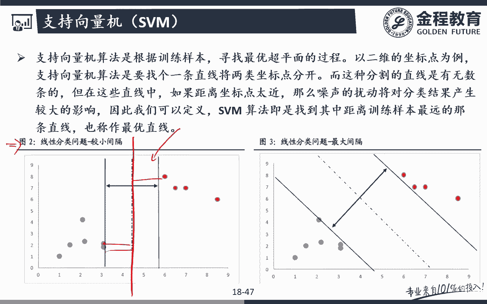

可以去呃大大家去理解这个SBM，那么对于我们来说，我们就拿这张图注意啊，这是我们额比较好的去可以理解，SVM的这样的一个比较好的一张图啊，好们一起来看一下呃，现在的话呢。

我们有这两个不同类型的一个数据对吧，一个是红色的，一个是绿色的，好，我们知道SVM里面的SVC，主要是也是来做分类的一个问题啊，好那么我要去找到一个这样的一个决策边界。

可以把这两个呃data set的数据组把它给分割出来，好那么大家可以来看到啊，在这个里面我们用了两张两条线啊，第一条线是黄色的这条线，第二条线呢是绿色的这条线好，大家来感觉一下，或者大家来猜一下啊。

你觉得注意，首先首先第一点，这两条线是不是都可以，把我这个数据组把给分割开来对吧，这没问题好，那么请问大家，大家感觉一下啊，你觉得这两条线哪一个分割的嗯，效果更好一些，是黄色的这条线。

也就是我们这里的第一条线呢，还是我们这里的第二条线呃，蓝色的这条线，注意啊，这个你要知道啊，这是可以更好的去理解，我们SVM的一个精髓啊，我们认为第一条线它是一个更好的这条线，听明白意思吧。

为什么第一条线是更好的一条线呢，那大家可以来看到啊，在我们这个里面，首先第一个啊嗯你觉得对这两条线分割的效果，哪些点给我们的分割呃，哪些点对我们的意义或者说作用是更大一点的。

注意其实就是离我边缘最近的这两条线对吧，好这两个点，所以呢首先第一个点的话呢，我们知道啊，其实对于我们来说，我要把这个数据组把它给分割开来，其实起到最决定性作用的就是最旁边的唉，边缘的这两条线没问题吧。

哎呃呃不是边缘的两条线啊，边缘的这两个点，就是这个点和这两个点，是不是对我起到这个分割，这个找到这个超平面，或者说在这里找到这个决策边界，是起到最决定性作用的，对吧好。

那么我们把这两条这几个点啊叫做什么呢，就把它叫做support vector，叫做支持什么哎，叫做支持向量，为什么呢，因为就是这些点，帮助我们去找到了这样一个超平面，没问题吧。

好那么这个超平面到底怎么找呢，或者说怎么样的一个超平面才是一个更好的呢，那注意啊，我们就可以来看呃，大家可以来看到啊，首先第一个绿色的点到这条黄色的线，包括我这里的红色的点呃，到我这条黄色的线。

我们会发现啊，每一个点到这条角色边界的距离来的大一点，还是来的小一些，哎是不是感觉好像都来的大一些对吧好，那么接下去我们再来看蓝色的这条线，蓝色这条线呢，我们就用蓝色的这个颜色来标记啊。

红点到这里是这条红点到这里的话呢，是这条绿点，到这里的话呢，是这条绿点到这里的话呢，是这条没问题吧，好那么我们前面跟大家讲过啊，我们怎么把这个超平面可以找到，找到我们是通过这些支持向量怎么样唉。

让每一个支持向量，到我这条超平面的最小距离最大，哎让注意啊，呃我们再讲一遍，让每一个超平面，让每一个支持向量的这些点啊，到超平面的距离的最小值，让它最大，那么怎么去理解啊，你看红色呃。

如果说到蓝色的这条线的话呢，我们会发现呃每一个我这里的支持向量，它这个超平面的最小值是哪一个哎，是不是就是类这个，或者说是这个这两个长短差不多对吧，虽然它有很长很长的啊，就比如说呃绿色这条线。

它确实有这一段是非常非常长的对吧，包括这一段其实也是非常长的，但是注意啊，我们不看最长的那条，我们是看的是最小的那条，最短的那个距离，听明白意思吧，我要让最短的这个距离maxim。

哎我要让这里的这条最小的distance，怎么样最大化，听明白意思吧，哎那么大家想想看，如果是蓝色这条线的话呢，最短的距离是哪一条，哎，最短的距离是不是就是我这个我们换个颜色啊。

这是我紫色的这一条线对吧，哎这是我的一个最短距离好，如果我拿黄色的这条线呢，作为我们的一个角色边界，因为黄色这条线，我的角色额，支持向量到我这个黄色的点上的距离，是不是都差不多对吧，可能这个稍微短一点。

比如说这一个点是我们的一个最短距离好，那么我们就会发现了，而我们是要让怎么样哎，支持向量到这个超平面的最短的这个distance，让让他怎么样，maxim要让它最大化，听明思吧好。

那么这个时候我们就可以看到了，是哪一条线，我这个最短距离它其实是最大的哎，是不是黄色的这条线，因为你看黄色这四个点，每一个点到这条线的虽然没有特别特别长的，但是每一条线到这条黄色的距离，是不是都还不错。

呃，都差不多，但是最短的那条线其实也挺长的对吧，但是的话呢我们来看到，如果是呃到我蓝色的这条线呢，它其实虽然有非常长的点，但是我们不看最长的，我们是看最短的那个距离，那么最短的这个距离的话呢。

它其实没有我这里的黄色这条线来得来，决策边界来的长，明白意思吧，所以这条黄色的才是我们真正正正的，这个决策边界叫做decision对吧，Boundary，明白意思吧，哎好呃，这也是说明了。

黄色这条的分割线，要比我蓝色的这条分割线来的更好，因为什么，你看蓝色的这条分割线，到我距这条支持向量的点比较短，稍微我这个支持向量新的一个数据点，可能离你比较近的话。

是不是可能就会出现一些怎么样分类错误的，一些问题啊对吧，哎所以我让你距离越远，我呢对吧，你这个数据分在哪一个类型里面，我是不是更有把握啊，唉好那么我们就可以来看到啊，通过我们的图示。

我们就可以来看得出来了，那么这个点其实跟我们前面讲的是一样的，你看这是我蓝色的这条线的最短距离，那么还有呢我黄色的这条线的这个句子，最短距离是不是在这里啊，对吧，哎所以呢对我们来说注意啊。

我们是要minimize什么，哎它的一个这四条线里面的怎么样，distance注意，首先第一个距离是什么，距离是相当于是这四个支持向量，哎你看我这里把这个离我比较远的这两个点，我是不是虚化了。

虚化的一个原因就在于在我决定超平面的时候，距离远的这些点对我影响是大还是小，哎远的点对我的影响是比较小的，为什么把它叫做支持向量级啊，也就是说它的这个分类主要依赖于哪些啊，这个分类唉。

只要主要依赖于最边缘的这个什么，这些support fac，依赖的是这些支持向量来进行的，一个分类问题吧，唉所以呢这个马车其实离我比较远的一些点，对我的影响相对来说是比较弱一点的对吧。

当然这个远一点的影响是呃，远一点点点得对我的影响弱一点还是高一点，你可以通过一些SVM里面的一些参数，可以去设置的啊，这个我们后面来去跟大家说，咳咳，但是在我们这里知道，其实如果简单来看的话呢。

这个决策额超平面啊，这其实就是我这里的支持向量，是不是可以决定了对吧好，那么首先第一个我们可以算出，每个支线向量到这个平面的，或者说到这个决策边界的一个距离对吧，这个距离的话呢。

是每一个点到这个决策边界距离，我们取一个最小值好，所以呢绿色这条线的最小值是这么点对吧，其实可能就是这么一段距离对吧好，但是呢如果到我黄色这条线，每一条线的长短距离是不是都差不多啊。

所以呢呃我黄色这条线的最小距离是这个好，那最终我是怎么做，最终我要maxim m the distance，我要让这个距离，每一个点到我这个决策边界的一个距离，最特别是要最小的那个距离。

要让它什么唉最大明白意思吧，哎最小的那个距离我要让它最大，那么通过这种方法，通过这种手段，我们就可以找到最好的这个分割的这条线，那因为你是二维数据啊，所以我们只要一条线就可以分割了。

那如果说你是一个三维数据的话呢，我们要需要用到什么，哎我们需要用到一个平面去做分割问题吧，但是举例子的时候，这个二维平面是不是更好去理解了问题吧，哎好，这个就是我们SVM的一个简单的一个。

算法的一个过程啊，所以呢知道了哎，这这两张图我觉得是画的特别好的啊。

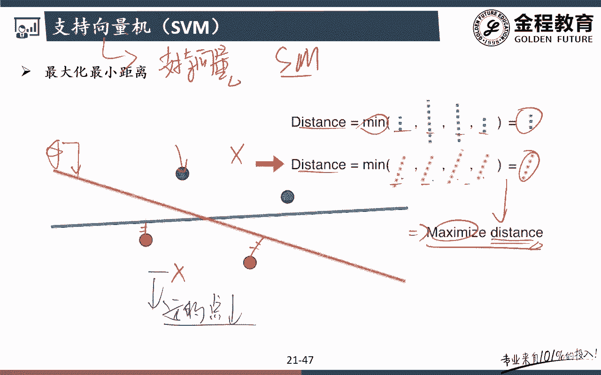

那么知道了这两张图再来看这里的话，那我们就可以看明白了，那么在这张图里面呃，大家会发现哪些是属于我的一个知识向量，如果说我们是这么区分的话呢，这两个其实是不是我们的一个支持向量好。

那么这几个是我的一个支持向量的话，那我要怎么样，我要让每一个支持向量到我这个决策边界里面，的距离的最小值，让让它最小还是最大最大对吧，唉现在是不是感觉有点有点有点难理解了，对吧好。

那么其实最大的可能就是这一块，对不对好，那么这是一条角色边界，那么这个点这个角色边界好不好呢，哎也就是说我们要看它的distance是不是最大的，对吧，显然我们会发现这一段的distance。

最小值的最短的那个距离啊，他的那distance其实并不是最大的，为什么，因为最大的这个距离我可以怎么切啊，哎我可以像这里一样这么去切，能理解意思吧，哎这么去切，如果这么去写的话呢。

像这两个是不是就变成了，包括这里的这个是变成了我的一个支持向量好，那这个时候我们来看呃，这两个支持向量到我这个决策边界的最小值，可能是这一条，我肉眼看不出来啊，大概差不多可能是这一条。

我要让怎么样最小值最大，那么这个其实我们通过这两种不同的分法，来去比较的话，一个的距离你只有这么点，还有一个的距离你有这么多对吧，所以显然哪一个的SBM的分类方法是更好的，哎这个决策边界是不是更好的。

没问题吧，哎当然怎么去找到这个决策边界，你是可以通过一些向量化的一些算法，可以去算了啊，那么这些具体的计算这个距离怎么去算的，我们这里就不展开了，但是大家知道我这个SVM的这条线，是怎么找到的。

这条这个原理听白是吧，原理就是要让每一个支持向量，到我这个决策边界的距离的最小的那个值，我要让它更大一些，更小更大，因为更大的话。

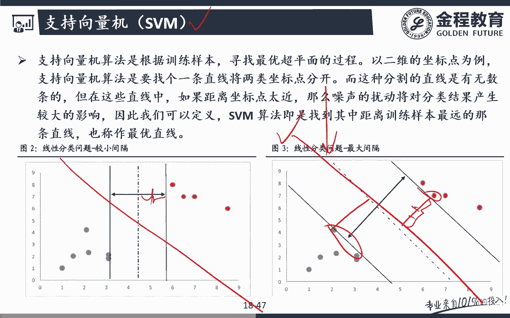

说明我这个分类分割的效果是不是更好啊，问题吧，哎那么包括这里。

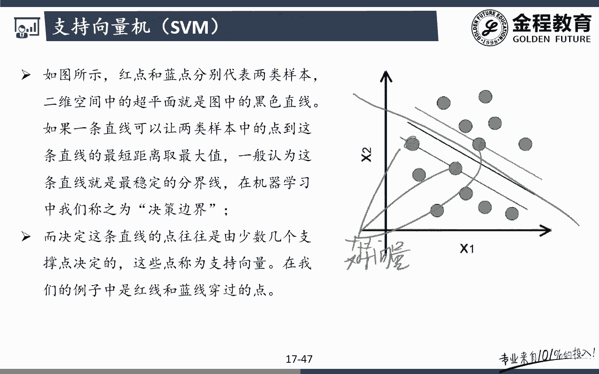

我们是不是也就可以能理解了，没题吧，哎好，那么接下去呢我们要来讲一个呃，SVM里面相对来说比较有难度的一个东西啊，它这个其实就把它叫做SVM的这个核函数，那么呃咳其实在这个里面的话。

额这两页其实说的是一回事啊，呃因为我们前面介绍了这个支持向量就算法好，那么现在的话呢我们要跟大家讲，SVM里面的一个非常重要的一个概念，叫做kero kernel的话呢，其实呃NEL的这个CN的话呢。

我们把它叫做知识向量里面的一个核函数，他是一个非常虚无缥缈的一个东西，对吧，好，我们来好好跟大家讲一下啊，这个kernel这个核函数是用来干嘛的。

呃那么前面跟大家讲过啊，我这里的SVM，其实主要它是一种什么线性分类对吧，哎它是一个线性的一个分类器，因为我要找到这样的一个超平面，这个超平面的话呢，通过怎么样这样一个切下去的话呢。

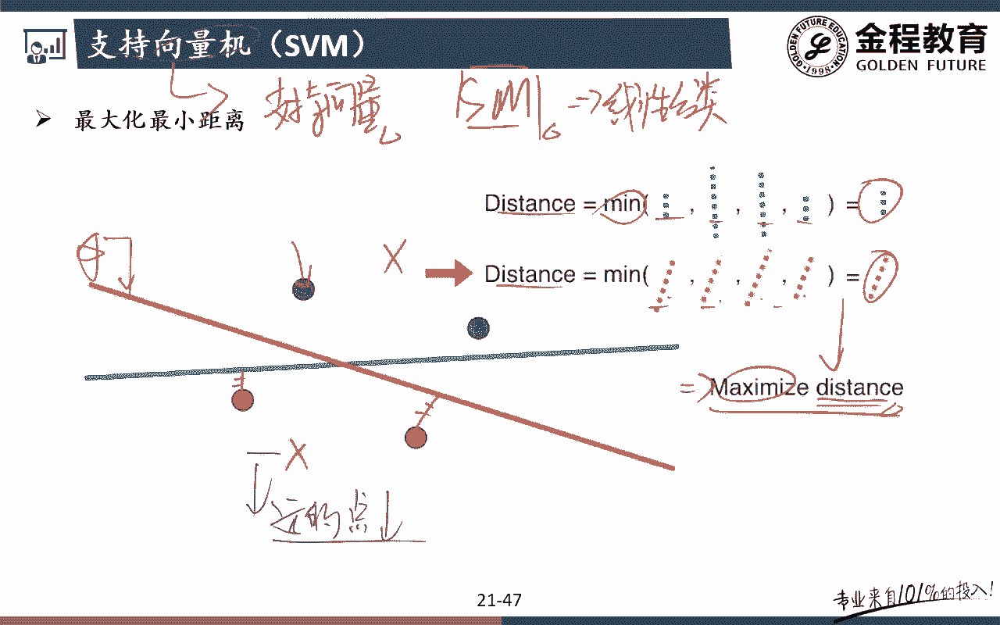

可以把我们的额数据是不是可以分成两类啊，对吧好，那么当我们发现，但是呢有些数据组啊，其实在我们这个里面并不是线性可分的好，那我们来举一个这个例子，并不是什么线性可分的好，那么比如说啊我们来看这张图。

这张图的话呢，它是一张平面对吧，这个平面里面有红点，有蓝点，那么我们会发现在这张图里面，如果是在二维的情况下的话呢，其实我们并不能把呃，红色的点跟我蓝色的点做一个，线性的这样一个分割吧。

那我们会发现其实我这里分出来的，在这里是不可能弯弯曲曲弯弯曲曲啊，哎哎这个是没法线性可分，那这个时候怎么办呢，注意啊，我就可以引入这个核函数，通过这个和函数呢，我可以把一些低维的情况下，注意啊。

我们可以把一些低维理中，怎么样不可线性不可分的把它放到哪里呀，哎把它放在高维里，把它放在高位中，那么很有可能在高纬的这个，高维的这个过程当中啊，这个高维的这个体系里面。

它我们把它转换成了一个什么线性是吧，哎线性可分，注意，这是我这里的核函数的最核心的理解和概念，听明白意思吧，大家注意啊，其实我嗯我找的在网上找的这张图啊，是我个人感觉最好的。

可以去理解SVM的核函数的一个呃思路吧，他其实你看他在二维当中，一个低维的一个空间当中，一些不可线性不可分的一些点，我把它怎么样放在高维当中，把它放在一个这样一个三维的，这样一个高纬的这个过程当中。

我就可以找到这样一个超平面，是不是就可以把这个数据点里面的数据集呃，其怎么样分类分出来了，对吧，哎那么这个绿色的这个呢，其实就是我们前面跟大家讲的那个超平面，那么通过把嗯低位的东西引入到高位。

然后呢把它给怎么样切一刀，迁移到之后的话，那是不是就是线性可分，我就可以把它分成这两类了对吧，哎这就是我们这个SVM的这个，kernel核函数的这样一个效果啊。

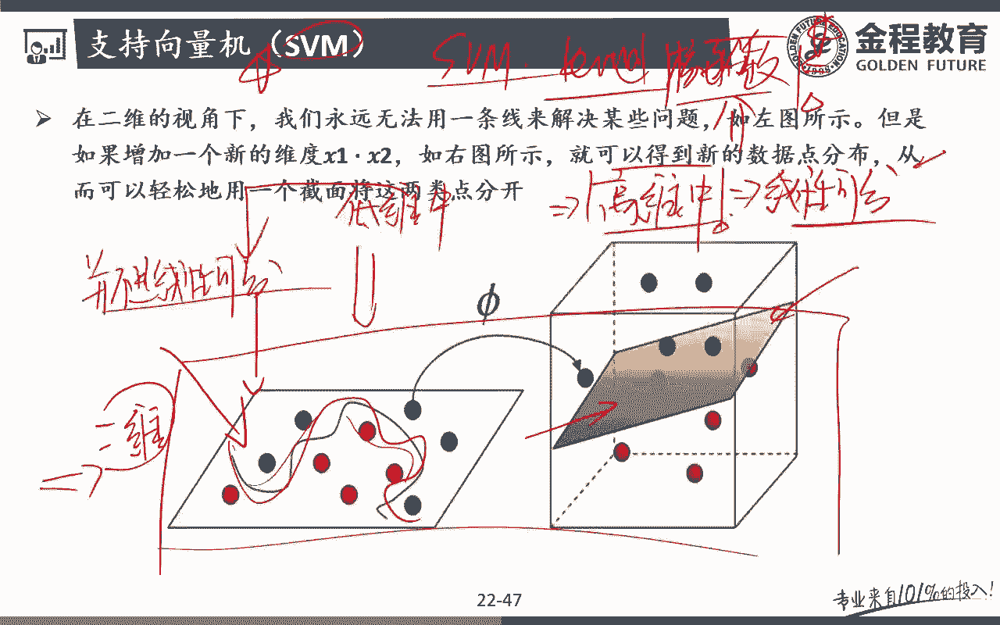

那么对于我们来说这个核函数的话呢有很多啊，一个是线性和多项式和以及那个高斯河对吧，那么这些的话呢在我们后面都会遇到啊。

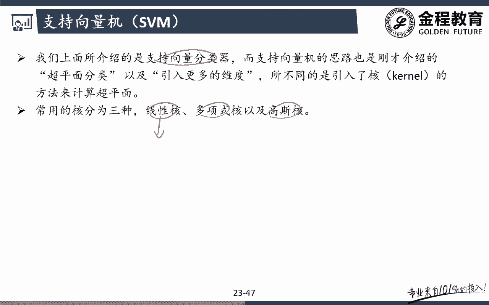

呃包括我们在呃我们的那个策略的应用里面，呃在诶在这里这个策略的应用里面。

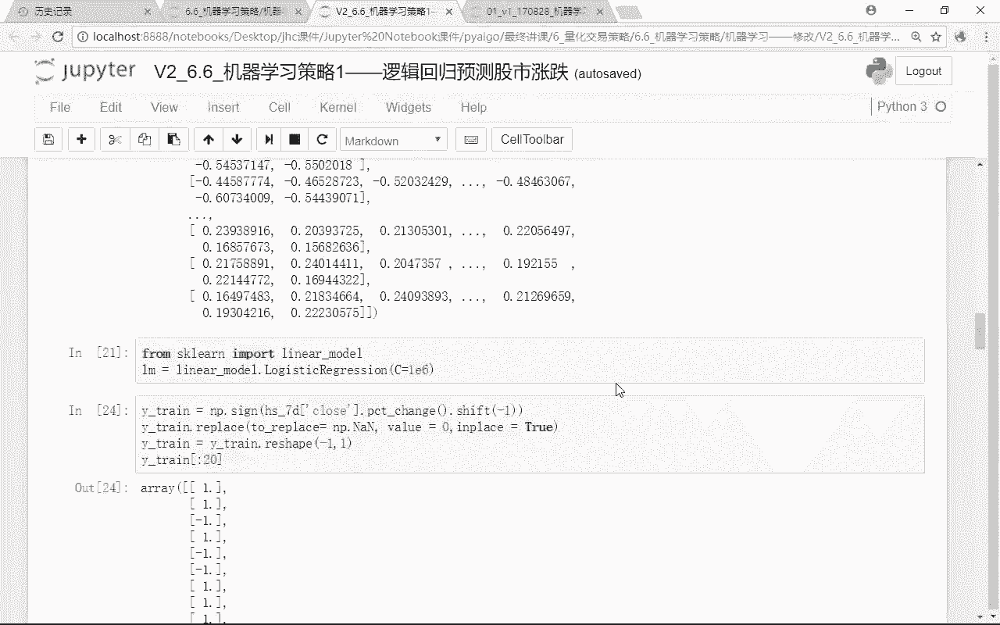

SBM一个是线性和，你看克诺这个是线性和。

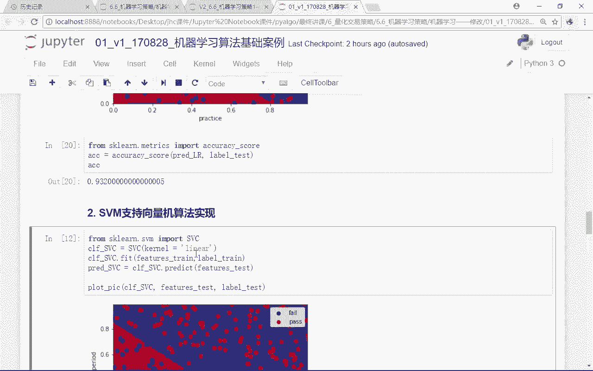

还有一个呢是RBF盒，在我们这个里面啊，其实我们都带着大家会去额，看这些具体的算法啊，那么线性和的话呢就是linear对吧。

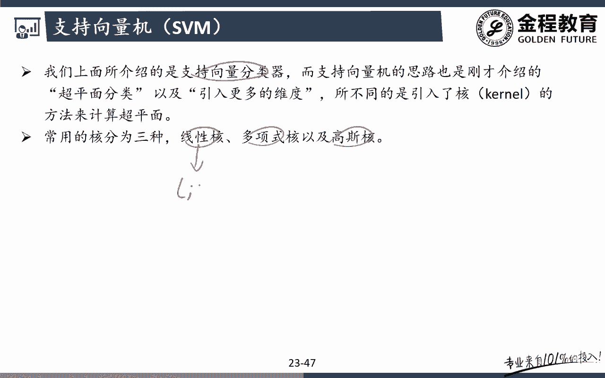

好，那么线性和和的一个最大的一个特征，就是最终我们分类出来的。

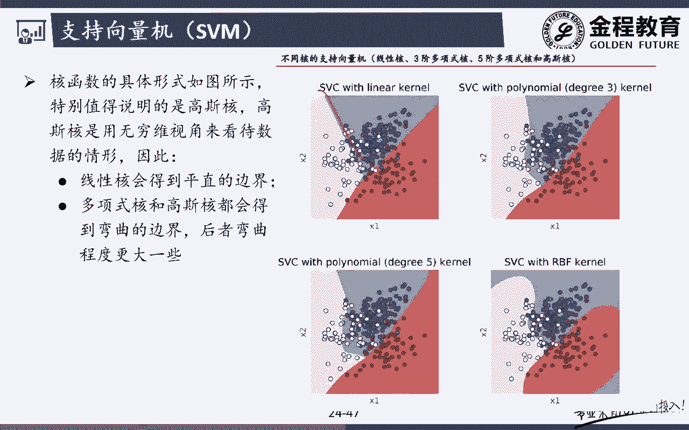

它其实我的边缘是线性的对吧，还有一个呢是额多项式和，就是polynomial。

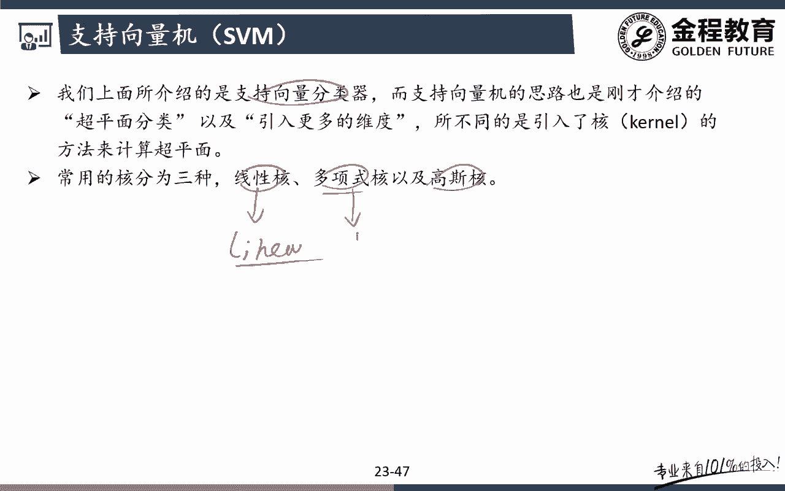

咳咳PLYOMIO的话呢，对于我们来说的话呢，它其实我的边界它就是会弯弯曲曲的，因为二次项，三次项我们都知道他是不是会拐弯的对吧，所以呢在我们这个里面。

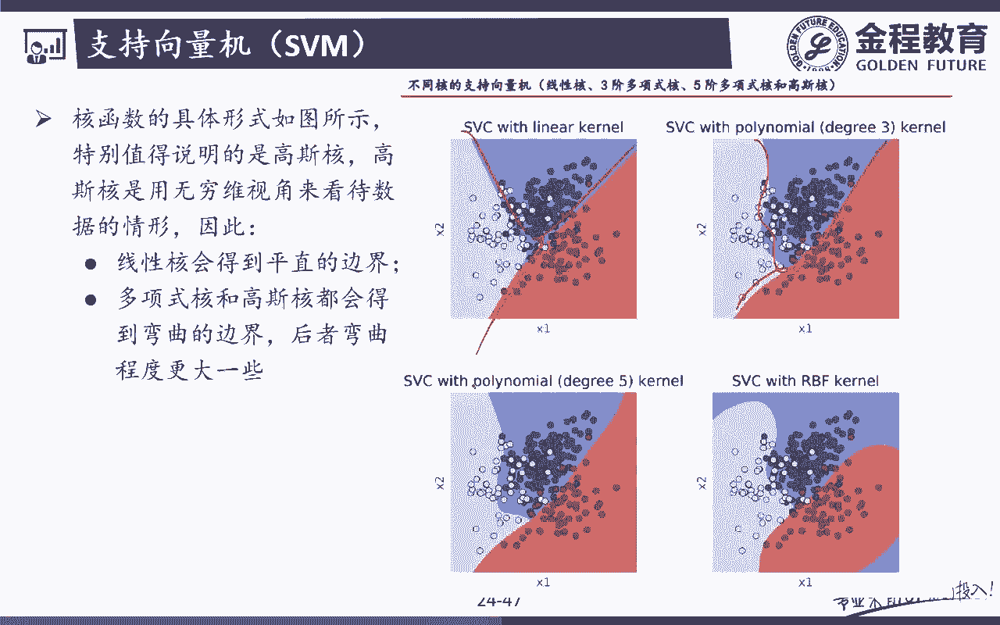

我的河的边界啊，它其实会拐弯的，那么还有一个呢叫做高斯和高斯合的话呢。

就是这里的RBF可能这个RBF课呢的话呢，跟我的多项式和非常有点类似啊，只不过我我这个嗯l BF和这个高斯核的话呢，它相对来说它的扭曲程度会更扭曲一些，对好那么可能很多同学在这里还是有点晕啊。

那么我们再举一个例子，就带着大家就讲完这个SBM啊。

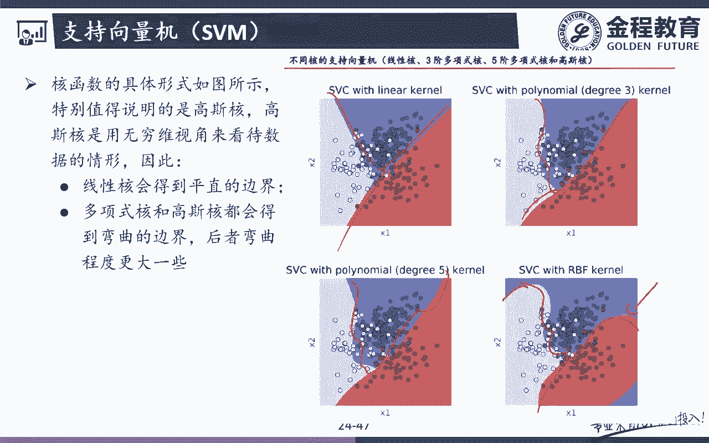

就再举最后一个这个核函数的这样一个例子好，那么呃我们一个个我们来看一下这个例子，这个例子的话呢我们是这样，比如说在我们这个坐标轴里面，这里两个对吧，一个是X1个是Y好有这样几个点，那么一个点呢是在这里。

还有一个点呢是在这里好，那么注意啊，在接着的话呢当中还有两个点一个点的呃，高中还有两个点，一个点的话呢，在这里还有一个点呢，比如说在这里好注意啊，这个这个我们好像画的不是特别好啊，他应该是一条直线。

那么我们再来画一下额一条直线的话呢，可能这个点在这里差不多，还有一个呢在这里好，反正大家知道一下啊，它这呃这四个点之间是在同一个直线上好，那么首先第一个问题，大家感觉一下。

如果说我们只在低维的这个二维空间里面，我能不能找到一条二维的嘛，二二维的空间里面，我要把它线性分割的话呢，找到这个超平面，这个超平面是不是就应该是一条直线，我能不能找到一条直线。

把这四个点的分类把它给分出来呃，要么切这里或者切这里，甚至切这里或者切这里是不是都不行啊，哎所以对我们来说，我们找不到这样一个非常好的一个怎么样，我们找不到这样一个非常好的一个点。

可以把我这个四个点的怎么样，额把它作为一个线性可分，对不对，好，那么这个时候怎么办呢，哎我们就可以用到前面的那个方法，怎么样，把低维的一个东西，放到一个什么高维的一个空间去。

可能放到高维的这个空间去之后的话呢，哎它是不是就变成了一个，线性可分的一个东西啊，对吧哎好，那么这个用到这种方法的话呢，我们就把它叫做什么i kernel，我们就把它叫做核函数好，那么这种方法的话呢。

我们应该怎么去做呢，比如说啊我们把这个点的话呢给他起个坐标，比如说这里是零三问题吧，好还有一个呢这一个点是比如说呃X轴是一二，还有一个呢是这里是二一好，还有一个呢这是三零。

这么题吧好那么我们会发现其实在这里的话呢，呃它是线性不可分的，我额因为对我们来说，我们找不到这样一个点，我可以让他怎么样，这个真真正正的把这个分类把它给分割出来，对吧好，那么在我们这个里面的话呢。

我们就可以用这里的这个核函数，那么这个核函数怎么去做的呢，呃其实我在这里可以跟大家讲两种方法，但是这两种方法说白了，最终核心是一种方法对吧，比如说现在第一嗯，第一种理解我可以增加一个features。

新增一个features，新增一个什么样的一个feature啊，大家想看新建一个分数词之后，我们就可以把它怎么样分割开来了，那么怎么去分割呢，呃注意啊，我们可以在这个里面，比如说X是一个Y是一个对吧。

我可以新增一个features，比如说是XY，为什么我可以新增这个XY呢，大家会发现这四个点有个特征，什么特征啊，红色的这两个点我拿XY乘出来是多少，是不是零啊，然后呢。

蓝色这两个点我乘一个XY乘出来是多少，乘出来是二，也就是说在我们这个里面，我们发生了这样一个现象，红色的这个点我们乘出来的XY乘出来是零，那么蓝色的这个点呢，我们乘出来的XY是等于多少。

哎我们乘出来的XY是不是等于二啊，好，那么我怎么现在怎么可以把我这里的红色点，和我这一个蓝色的点把它给分割开来，那很简单，我只要找到当中的一个一个，零和二之间的一个区别，就是多少，XY等于几啊。

哎XY等于一，或者说我找到新的这样一个特征，比如说Y等于怎么样，X分之一哎只要我能找到这个XY等于一，作为我们的一个新的特征的话呢，这个时候我的SVM它又变成怎么样，它就可又可以进行分类了。

那么Y等于X分之一的一个图形，应该是长什么样子的呢，啊如果大家知道见过的话呢，应该是掌握这个样子的这条线的话呢，这个图形就应该是Y等于什么，X分之一的一个图形，能理解意思吧，所以呢在我们这个里面。

其实比如说呃我们只拿X，只拿Y放到我这个SVM里面，我们可能无法线性可分对吧，那么这个时候我们只要新增一个，怎么新增一个特征，比如说这个特征叫做CC等于什么，Z等于XYI。

我把这个新的特征放入到这个SVM里面，哎，现在的话呢它是不是又变成可以怎么样分割了，对吧好，那么它具体是怎么做的呢，怎么去分割的，虽然在二维里面，我们可以看出来Y等于X分之一，这条额。

这条蓝色的这条线确实把这两个一个是蓝色的，一和红色的是不是分隔开来了对吧，那么实际的过程当中的话呢，他是怎么做的呢，注意啊，呃它其实跟我这里的核函数，用的是同样一种思想。

我们可以现在把这里的二维的这个数据，把它变成一个怎么样在三维的这样一个数据，也就是说原来在二维下面，可能并不是线性可分的，但是呢在我的三维的情况下，我就可以让它线性可分了。

比如说我们在这个里面举一个例子，我们来画一张图啊，我们可能试一下啊，不知道能不能画好，呃，在我们这个里面，比如说呃原来的话呢，我们嗯假如说啊只考虑二维啊，我们在这个里面X轴和Y轴之间的。

X和Y轴之间的一个坐标应该在哪里啊，呃在这里比如说只考虑两维啊，这个是Y这里是多少呃，前面写过了三零对吧，好后面呢这里有一个点，这个点的话呢呃是这个点我们换一下啊，换一个颜色额，这个点是多少呢。

这个点是一二对吧，还有一个点呢是多少，二，怎么样，221好，那么这个点的话呢可能在这还有一个点呢，他是在这，反正是一条直线嘛，然后我们可能画的不太好啊，大家知道一下啊，好最后一个点。

最后一个点在这这个点的话呢是多少，三，怎么零问题吧，好那么这条线如果我们只看一个平面，我们并不是一个线性可分的，那怎么办呢，我前面跟大家讲过那个思路了，这个思路的话呢其实很简单。

我只要再引入一个新的一个特征对吧，把它从二维的变成到什么三维里面，比如说我引入一个新的特征C这个C的话呢，哎这个特征这叫做什么XY问题吧，好那么这个时候我们就会变呃，注意原来的话呢是多少零三。

然后呢122怎么样，一还有一个什么三零好，现在我引入一个新的特征，新的特征是吧，新的特征是XY问题吧，好那么引入这个新的特征之后，这里的零三它就会变成多少零三，怎么样零，因为X乘以Y是不是零啊。

还有呢这个特征会变成一二怎么样，二还有一个这个特征呢，它会变成二一起怎么样，二最后一个呢是三怎么样，零零没问题吧，哎通过这样的一个特征，新的一个特征的一个引入，哎这一个新的X乘五。

Y的新的特征的一个引入的话呢，我们就可以把它变成线性可分了，那么这个时候我们就可以来看一下，我们呢也来画一张这个图，这个图的话呢我们把它可以画的大一点啊，比如说这里是X这里是怎么样。

好像画的不是特别好啊，这个画图的难度稍微有点大啊，这个大家可以来看一下，比如说这里是我们这里的Y对吧好，那么这个是呃X这里是我们的Y，如果只有在两呃，在接下来的话呢我们再新增加这样一个呃。

把它变成三维的对吧，好这一个这里的这个呢我们把它这一行的向量，我们是不是把它叫做C啊，没题吧，好那么在C这里的话呢，它其实也是有这样一个平面的，这个平面的话呢，这个里这是Y这个是什么，哎。

这是这个X这里是这个Y没问题吧，好那么现在我们就可以来看了，我们就可以看到前面我们是不是有这样三个点，啊对吧，一个呃这1234，这四个点原来只是二维的一个平面，我们现在把它放到三维里面来了。

好那么这个时候就可以看到了，第一个点就变成了多少030，那么呃这里反正都是零了，030，这个X是零，Y是三对吧，C是多少，C是零，所以呢第一个点他是在这里大概位置啊，这在这里是多少030，没问题吧。

好那么接下去来看第二个点，第二个点是122没问题吧，X是一，Y是二，C呢也是二，所以注意啊，他在这个里面就不是在这个平面里面了，因为什么啊，大家可以来看到，其实在这个里面。

下面是不是有这样子的一个什么哎，下面是有这样子的一个平面的，对对吧，哎呃没画，好哈哈呃，这个从小这个画图的，那个从小这个画图的水平就不怎么样啊，这个哼来大家来看一下啊，在我们这个里面的话呢。

这个他可能是涨了这样子的wherever啊，大家见谅一点啊，好在上面的话呢，它其实也有一个这样的一个平面对吧好他是呃，他是这样诶，呃算了啊，应该这两个这两个大小肯应该是一样的对吧。

这个我们这个反正这样比较粗糙一点啊，这个反正大家凑合着看吧，好那么咳咳在我们这个里面的话呢，上面有一个这样的平面，下面是不是也有一个这样的一个平面，对吧好，那么呃第二个平呃，第二个点现在变成了多少啊。

第二个点现在是一二是吧，二没题吧，X是1Y是怎么二，所以呢同样的他的C也是2C在这里是吧，二所以第二个点的话呢，它大差不差，大概在这里注意啊，这是这里对应的是什么，我这里的1Y的话呢对应的是什么。

2C的话是不是也是二，所以这个点呢是一二怎么样，二好，那么我们在这里还有一个点是212对吧好，那么X是二了，Y现在是不是变成一了，X等于二了，好，那么这个点就在这，它就变成了多少，一二怎么样。

二没问题吧，那呃呃一个是122，还有一个是2122，这个X变成二了对吧，呃Y是一了好，那么在我们这个里面的话，那就变成了怎么样，二一好好，最后一个点是多少，300对吧好，最后一个点300的话，注意啊。

他又跑到这里来了，那么比如说X等于三的时候在这里啊，因为3Y是零，C也是零，没问题吧，好那么这个时候大家会发现，原来在同一个平面上的，我无法线性可分的对吧，但是通过引入了新的这样一个变量。

我是不是便把他怎么样放到高位里面去了，一旦把它放到高位里面去了之后的话呢，我们是不是现在是不是又可以变成线性可分了，我们可以找到一个什么样的一个超平面，可以把这个呃。

蓝色的两个点跟红色的两个点把它给切开，哎在当中这一列，比如说大致在一这个位置点上，我们是不是就可以找到这样的一个紫色的嗯，唉大家看我是不是可以找到这个，紫色的这样一个超平面啊，紫色的这个超平面的话。

相当于通过这样切一刀，我是不是怎么样把我这里的红色的两个点，跟我蓝色的两个点，是不是把它完整地切在什么，两个不同的类型里面了，对吧，哎，所以呢这种方法其实就是我们前面跟大家讲的。

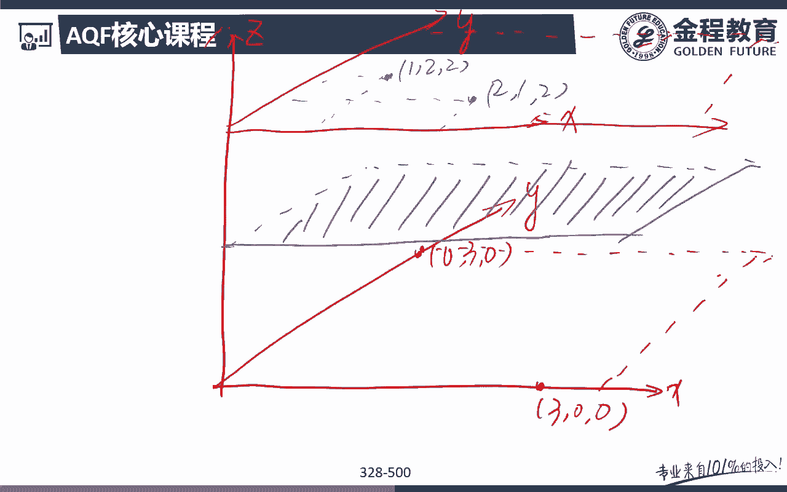

是什么爱可能的方法，也就是说你看在我原来的怎么样呃，原来的低位的情况下，我是线性不可分的，但是我把它放到高位里面。

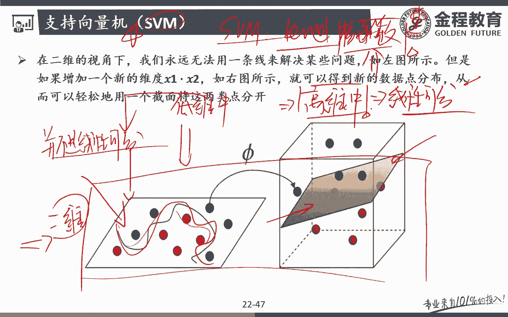

是不是就变成线性可分了对吧，哎所以呢这种方法这种手段啊，我们都可以通过这种kernel的这种手段啊。

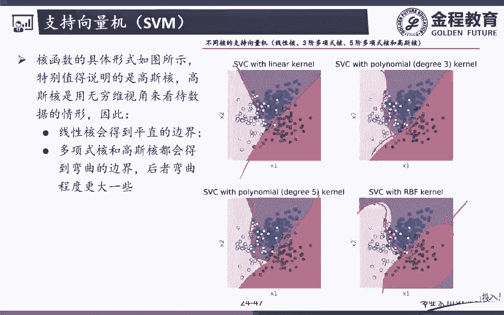

就可以把他怎么样把它切成，原来不不是线性可分的，现在我就可以线性可分了，那么在我们这个里面啊，我们可以画出来的三维对吧，再再多就画不出来了，但是在我们的那个嗯算法里面，其实不管你几位对吧。

1万维也是有可1万维也是可以去处理的对吧，哎所以呢但是呃在我们这里的话呢，画图这里我们只能画到这里了，但是呃我觉得这个画图这个点。

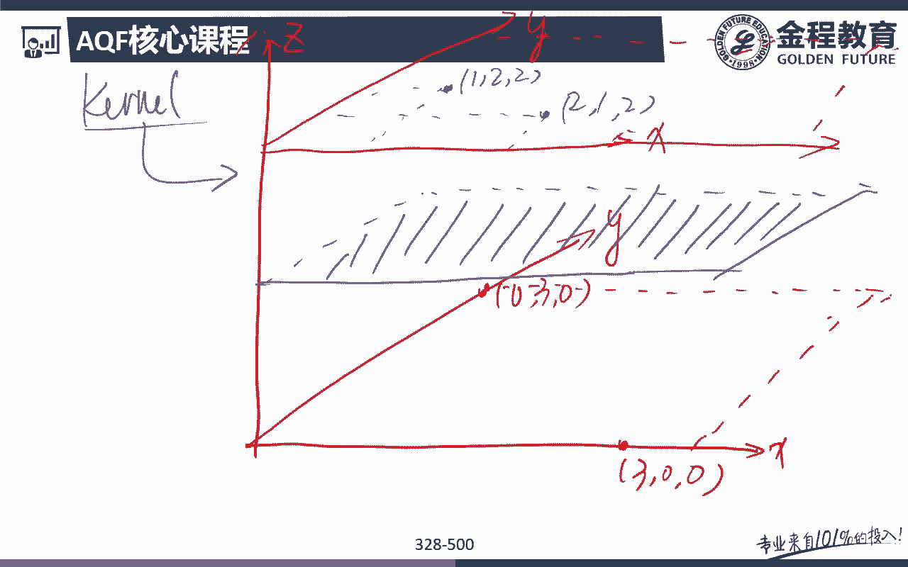

还是可以帮助大家去理解的问题吧，哎好那么这个SVM嘛我们就讲到这里。

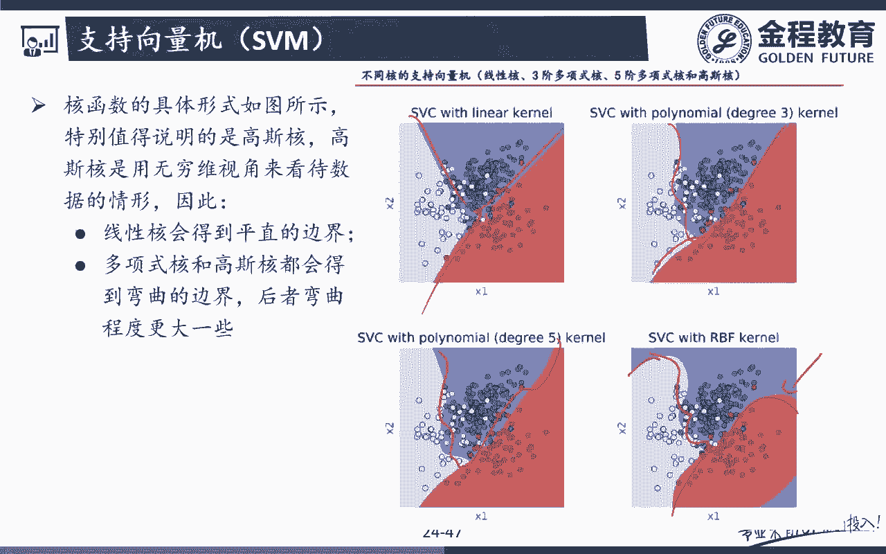

那么大家可能发现一个小问题啊，什么问题啊，呃我的regression也在做分类，我的SVM啊，我的前面的ROGISTIC也是在做分类，我这里的SVM也在做分类，那请问大家，这两个分类有没有感觉出来。

有个什么样的一个区别，好logistic的话呢，比如说对于我们来说，这里查查查查查查查，我们是不是找到这样一条线对吧，哎ROGISTIC跟我s mm最大一个区别是，每这里的每一个点跟我这里的每一个点。

其实都会对这个决策边界产生影响吧，但是SVM呢大家会发现这还差，这里有这样几个点对吧好，然后呢这里也是有这样几个点好，那么请问大家，S v m，我画出这个决策边界，哪些点对我的影响最大一下。

更大一些哎是更关注的是什么，哎最靠边的这一些对吧，最靠边的这些这些点叫做什么点啊，这些点我们把它叫做什么支持向量对吧，那么同样的外围的那些得对我的影响，对我这个决策变现的影响。

是不是相对来说更比较小一些对吧，哎这were rogistic跟我SVM的一个区别啊，而且的话呢SVM它可以解决一些呃，相对来说更复杂的一些问题，因为原来一些地方我们不是线性可分的话。

我可以不断的加维加维加维，让它比在虽然有些看似非常复杂的一些数据啊，但是我把它加到非常高的维度的时候，总能找到这样一个超平面，可嗯比较好的，可以把我这些数据把它给分割开来，能理解吧。

哎好那么这个SVM的这个原理啊，我们就讲到这里。

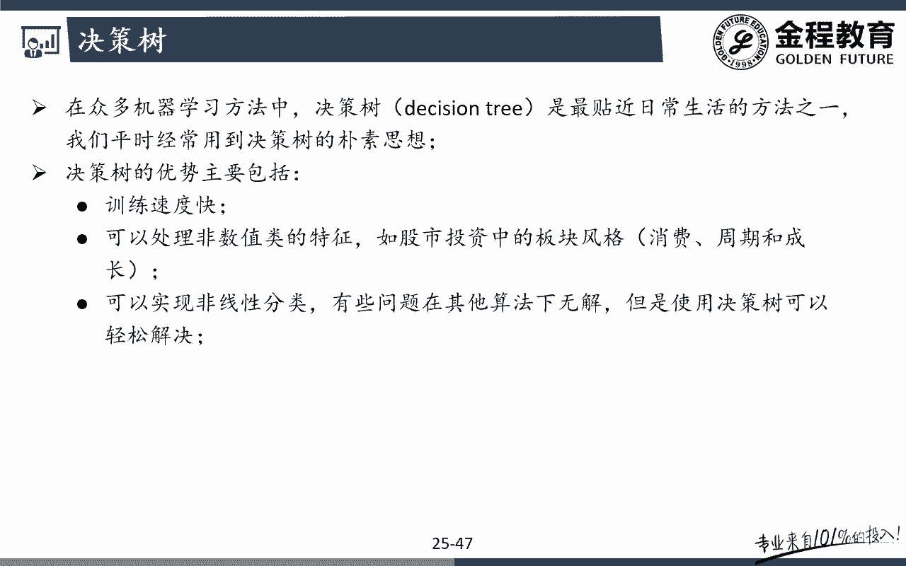

那么具体的话呢你听懂最好，听不懂的话呢，我们后面会去跟他说啊，怎么在实际当中应用啊。

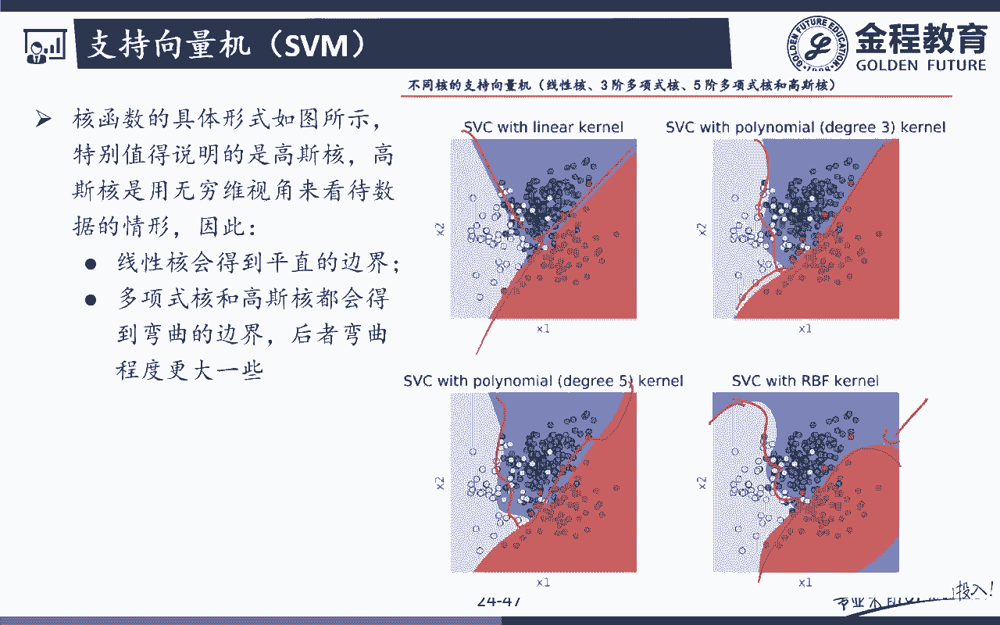

那么这里的呃，我们要最重要展开讲的这两个模型，一个是logistic，还有一个是SVM，我们就跟大家讲完了，那么接下去一些算法的话呢，我们就不会讲这么详细了啊，就是简单的把这些额算法的一些点。

简单的跟大家过一下啊，当时最终的话呢，如果大家对这些机器学习真的特别感兴趣的话，后面会有这样的课的啊。

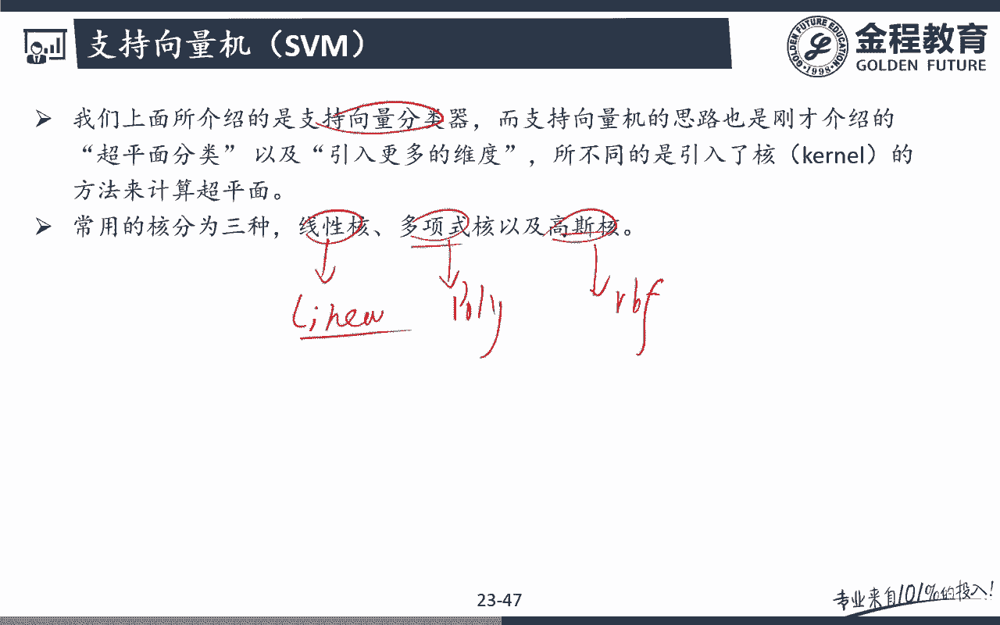

