# 2024年金融大神老师讲解量化金融分析师.AQF—量化金融基础知识（完整版课程） - P11：《金融基础》11.财务分析-3财务分析原理3：资产的分析 - 量化沿前 - BV1ar421K7Mo

好，那么接下来的话，那我们继续带着大家来看我们的，财务报表分析原理啊，这个原理讲完之后的话，那我们就可以开始带着大家来看我们的一些额，使财务报表分析的时候，具体的一些实用的一些分析技术啊，之后的话呢。

我们再带大家来看几个分析的一个案例，这一套的整体的学完之后啊，大家都会对财务有一个更深入的，一个了解和认识，那么在量化啊投资的使用过程当中啊，就可以更好的去理解财务的各种各样的，那些因子啊，那些东西了。

对吧好，那么我们来看一下第八页的这些都啊这页PPT啊，这些PPT的内容的话呢，前面我都跟大家讲过了对吧，就是asset等于我的LIBATE，加快这个能换用的快捷恒等式，现在应该很熟了，对不对，好。

还有呢我们的利润表呢，income statement是拿我的revenue减去我的expense，是不是等于我的net income嘛，对吧好，那么现金流量表呢是cf o cf i和cf f。

然后呢会产生一个net cash flow，that cash flow影响的是我资产负债表上的cash，对吧好，分别的那个勾稽关系我们也给大家讲清楚了。

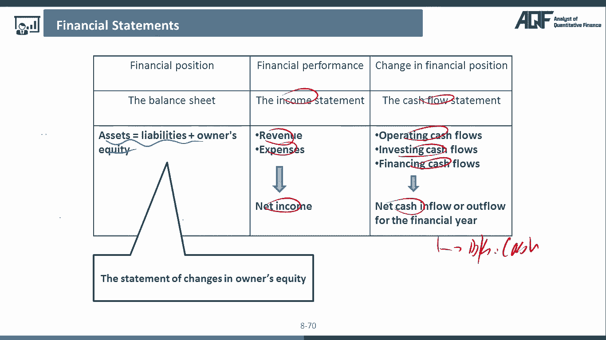

没问题吧，哎好，那么接下来的话呢，我们再来看一下额资产负债表的一个介绍，资产负债表上我们的话呢我们说了，他是一个appoint of time，还记得吧对吧，它是一个时点，他衡量的是这个企业啊。

在某一个具体的时点上的整体资源对吧，嗯整体的一个状况啊，那么access的话呢是resources，是我可以控制的资源，负债的话，那是我欠人家的对吧，onless equity的话呢。

这个叫做所有者权益对吧，那asset等于额liability加equity，也嗯跟大家讲过了好。

那么利润表呢，income statement呢，呃income statement衡量的是怎么某一段期间，Over a period of time，某一段期间的这样的一个整体的一个表现。

我10月份做得好还是不好，11月份做的好还是不好对吧，那么我们有收入啊，我们有费用没问题吧，好没有利润，当然在这个里面的话，还有一个叫做other income，ARANECOM的话呢。

这个是财务里面的一个概念啊，叫做其他业务收入，这个的话呢简单了解一下就好了，也就是说对我企业来说啊，它其实有一个什么呢，它其实有一个主营业务收入，那么主营业务收入，就是这个企业的最核心的那些业务。

这个它的主营业务给他带来的对吧，比如说一个企业是化工企业，那么生产化工卖了化工产品以后的那些收入，都是他的那些主营业务收入，没问题吧，那么什么是其他业务收入呢，其他业务收入可能跟主营业务有关。

也可能跟主营业务没有关系，比如说最典型的一种就是那个化工企业啊，它生产出来的化工的产品卖掉，这是它的主营业务，但是生产出来的呢为了生产这些化工产品啊，它可能会有一些废废料。

这些废料的话呢也有一定的工业价值，所以他把这些工废料吧给变卖了，也可以赚一些钱，但这种钱就是我买这其他业务收入没问题吧，那么照道理来说啊，一个典型的一家企业的话，那应该是他的收入来源里面。

绝大多数的占比，应该是来自于他的那个主营业务收入对吧，哎这也才是呃比较正常的一些呃情况啊，那么在这里的话呢有个其他业务书啊，大的带着大家了解一下就可以了透。

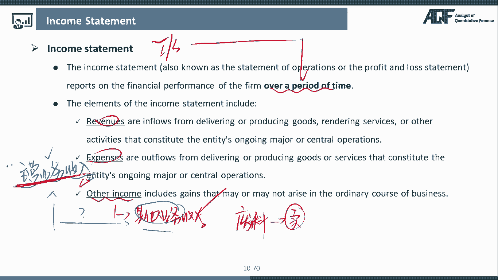

那么接下来的话呢在我们这里的话，我们就是再来跟大家介绍一下，我们的一个现金流，对不对，好现金流量表，现金流量表里面啊，我们前面跟大家讲过，一个企业所有的现金流的分类都可以分成三种，现金流。

第一种的话呢叫做operating cash for经营活动现金流，第二个的话呢投资活动现金流，第三个的话呢叫做融资活动现金流，那么我们之前跟大家讲过啊，每一种类型的现金流我们都可以有流入流出。

我们都有流入，怎么样流出，我们都有这里的流入，怎么样流出好，那么我们先来简单跟大家做一些介绍啊，这个啊其实我们在量化分析里面啊，分析的最重要的其实就是个经营活动现金流啊，其实其他的嗯。

那些的话呢我们一般我们用的都其实比较少了，那么类似于经营活动，现金流为什么它比较重要呢，经营活动顾名思义就是这个企业的核心主体，它的经营业务给他带来的一个现金流对吧，那一家健康的一个企业的话。

那应该是他的经营活动，也就是他的那个主业，可以不断的为他创造核心现金流，自由现金流，对不对，那么如果说啊当我们看到一个企业的经营活动，现金流非常的缠弱，非常少对吧，然后呢这个企业为了继续经营下去。

有大量的融资活动现金流，也就是说这个企业继续生存啊，主要都是靠那些借来的钱去续命，那么这个企业的经营，将来的可持续经营，我们就会打一些大大的问号，对不对好，那么还有一种嗯分析思路的话呢。

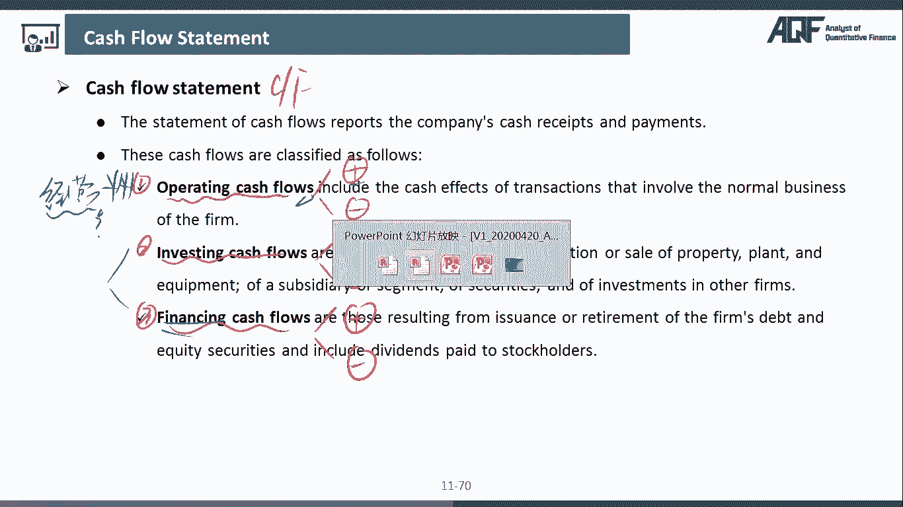

是这样子的，因为我们要把我们的现金流啊，跟企业的一个利润结合在一起看，因为有些企业啊它可能是这样子的，它这个企业的净利润呢每年涨的都很高，每年赚的都很多，然后呢，每年以20%的净利润增速在那增长。

上市公司啊，大家注意，如果他的净利润可以，每年以20%的增速增长，已经是非常非常好的一了对吧，一个公司，但是呢你不能被他的表象所迷蒙蔽啊，那么因为根据我之前，我们前面跟大家举的一些例子。

上市公司的净利润，很多都可以拍脑袋拍出来对吧，这个一下子拍个脑袋，一下子多了1。3个亿的利润，再拍个脑袋多了2500万的利润，是不是之前的课程当中，是跟大家举过例子的对吧，所以呢我们怎么看这个啊。

企业的净利润的这个叫做我们把它做什么呢，我们把它叫做盈利质量呢这个话题啊，我们在后面嗯做量化的时候，其实还是要嗯重点来去跟大家讲的，因为这个盈利质量的话，嗯还是非常重要的一个概念，呃。

而且嗯一个企业它的质量比较好，嗯从它的盈利质量也可以看出来啊，一个企业它的投资价值是否高，那我们怎么去看他的这个这个公司的净利润的，那个盈利质量到底是真实的利润，还是我们之前拍脑袋拍出来的那些利润呢。

很简单，我们可以看一下这个企业的CFO，如果这个企业的CEO也是跟他一样，跟我的净利润一样，呈同商的同比增幅大幅增长，那么我们就可以大致推测出来，这个企业的净利润是不是很很多呃。

绝大部分都是额由他的那个CFO所贡献的，就是他的经营的主业所贡献的，那么这种利润，其实我们就会觉得说是非常健康的一些利润，听明白吧，那再比如，那如果说有些时候我们会发现，企业的利润一直在涨它的。

但是呢它的现金流一直在萎缩，甚至一直在变负的，而且负的越来越厉害，如果这个时候我们就会发现，这个时候我们co在不断的下降，那么我们的净利润反而在不断的上涨，那这个时候我就可能有理由去怀疑说。

你这个公司的这个净利润，到底你这个是不是一个真实的利润对吧，当然啊有些企业由于一些盈利模式啊，商业模式的一些问题，比如说你跟政府打交道，政府回款周期就是很慢，确实可能会存在说CFO一直在下降。

利润一直在上升额，这种跟商业模式有关的排除以外啊，如果是正常的一些企业的话呢，如果当我们看到他的那个CFO一直在下降，然后呢净利润一直在上升，那这种时候的话呢，我们就要打一个大大的问号。

或者说我们要对这个企业的这个净利润的，盈利质量来去提出一定的质疑，或者说我们在量化里面在进行股票筛选的时候，那种盈利质量特别低的那些公司，哎我们因为做量化，为什么可以跟基本面相结合呢，很简单。

如果啊你真的要只从基本面研究的开始的话，那你可能那3000多个股票，3000多个家公司，你怎么一个个去研究过来，不可能的对吧，你可以通过量化先编写一些程序去筛选，通过一些判断的标准。

先筛选出一波嗯企业出来，比如说3000多只股票里面，你先筛选了个二十二三十的知识股票，那其他股票可能会由于盈利质量的问题啊，增长的问题啊，或者其他的那些都被你排除在外了。

那剩下的20是那些20家公司分析来，分析起来也很累啊，那我们只是说剩下的那些数量，为数不多的那些公司，你在可以用一些基本面啊，我们啊价值投资的一些分析思路来去学对吧，所以的话呢我们经常就跟大家讲啊。

你不要认为呃基本面分析和价呃，这个这个和量化分析，就是完全谁也看不起谁的那种对吧，这个完全不同的两条路啊，其实不一样，不一定两者可以有一个很好的一个结合，可以发挥双方各自的这样的一个。

更大的一个作用对吧，所以学CFA也好，学AKF也好啊，其实都是为了能让我们在自己，在这个投资领域啊，有更多的一个手段和工具吧对吧，哎那么我们后面会专门去跟大家讲啊。

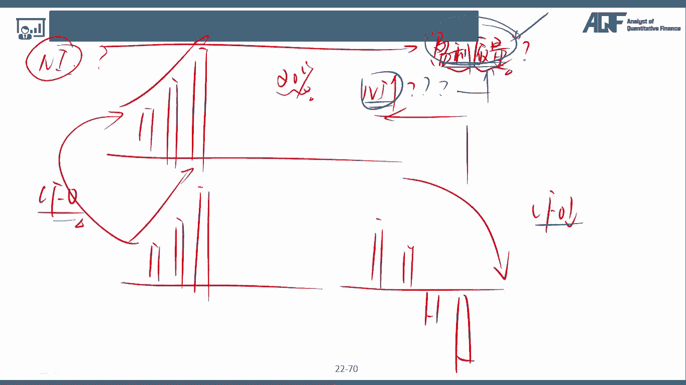

这个怎么讲这个利润表的时候，再来跟大家说，怎么去分析我这个企业的盈利质量好，所以在这个里面只是提到了这个企业的CEO啊，是最重要的一个现金流，这个是需要大家掌握的好。

那么接下来的话呢我们来跟大家举一些例子，哪些是属于一个企业最最重要的经营活动，现金流呢，注意啊，是从客户那收到的钱，从customer那卖了产品以后，从customer那收到了现金。

那大家想看我的这个我的企业，把我的货物啊或者服务卖给我的客户，从我客户那收到的钱，是不是最我这个企业最核心的经营活动，现金流的流入啊对吧，如果说我这个企业的利润，主要都是来自于这块的话。

那这家企业就是非常好的对吧，那么主要的经营活动现金流的流出呢，有些什么呢，比如说我们支付给谁的钱呢，支付给我们的供应商，因为对我们来说呃，我们要这个这个生产产品要去卖给别人对吧，我为了赚到这个钱。

我肯定要有，支付的一些原材料对吧，包括我们可能会支支付给谁呢，企业员工的那些工资啊，啊其实这些都是属于我们经营活动，现金流的流出，因为员工的工资为什么额算经营活动啊，很简单。

员工是为了帮助企业经营而存在的嘛，对吧，哎那么接下来再来看投资活动现金流，投资活动现金流有些什么，投资活动现金流的流入呢，注意啊，投资活动现金流，我们先来看流出好了。

流出可能会看嗯多的投资活动现金流的流出，比如说我采购了机器厂房设备，采购了一些固定资产，我后面会跟大家讲啊，机器厂房和设备这些的话呢，我们后面会跟大家讲嗯，有一个嗯简写叫做PPI的E啊。

或者说买了一些股票啊，长期投资的一些股票等等，这些是不是都是可以说明我投资了对吧，哎，那么什么时候是我们投资活动现金流的流出呢，就是我买了机器厂房和设备，我把它给变卖了，或者说买了原来买了股票。

是投资活动现金流的流出，现在我把我的股票卖了，是不是就变成了我投资活动现金流的流入啊，对吧，哎卖人家东西变卖了，就是属于我的现金流的流入了嘛，投资活动，那么再来看融资活动，融资活动现金流的流入很简单。

我问别人，我问银行借钱了对吧，或者说我发行了一个债券，这个债券5年到期100万面值等等等等，那这些的话就说明我企业当然也可以是，发股票融资啊，发股票融资，这些其实都是属于我们企业的典型的，怎么咳。

融资活动现金流的流入，对不对，那么什么是流出啊，就是还钱还钱还债的时候对吧，那这些就是我们的融资活动，现金流的流出问题吧，哎所以我们会发现一个企业的现金流的，核心的流入的主体。

如果是由于它的经营活动带来的，那么这样的话其实是往比较理想的。

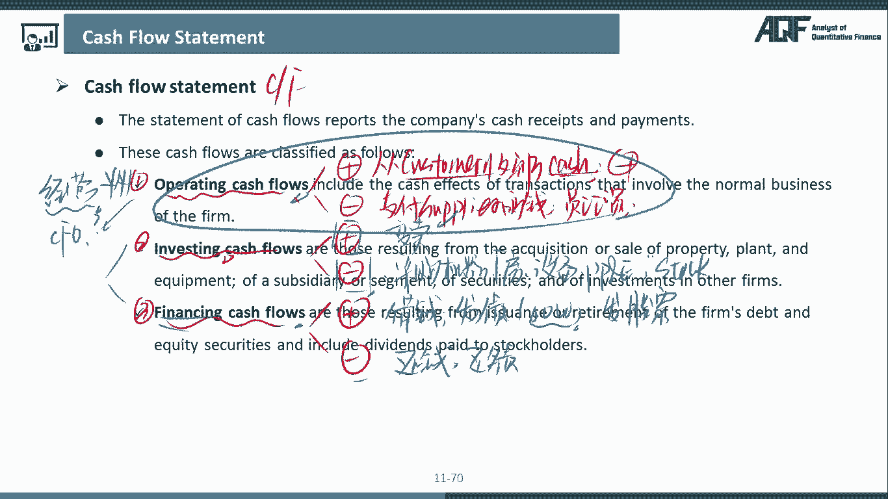

或者说是我们更希望看到的对吧好，那么在这里的话呢。

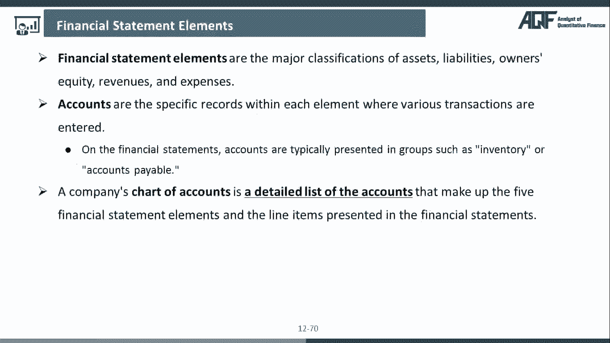

我们是带着大家啊，把我们的那些嗯几个啊核心的嗯。

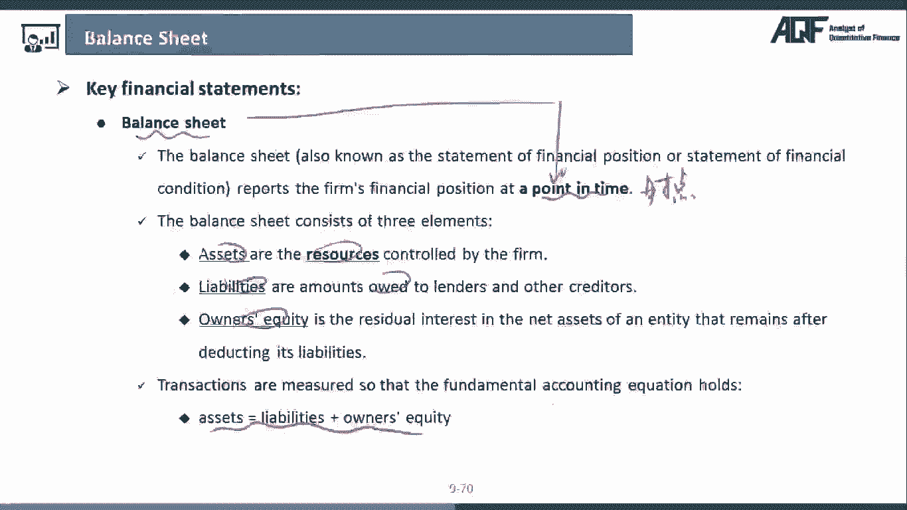

报表里面，它主要讲的什么资产负债表里面有什么利润表。

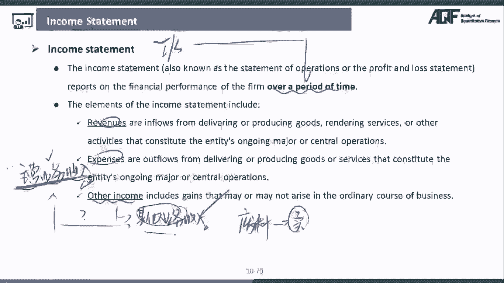

里面有什么现金流量，表里面主要说的是什么对吧，而且我们也带着大家分析了一下。

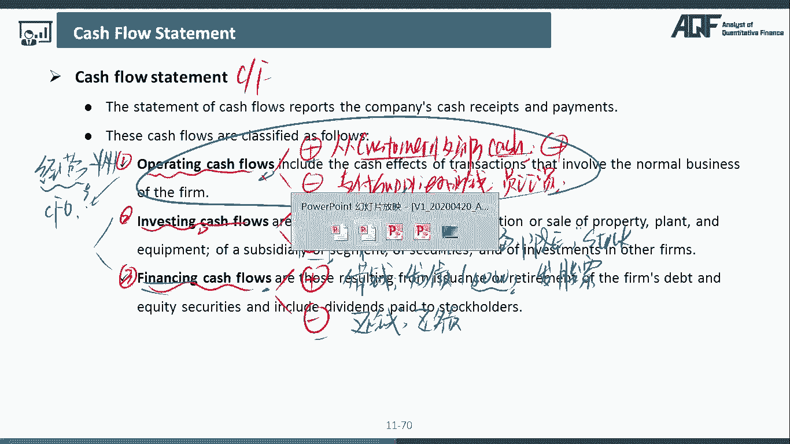

我们的一些盈利质量相关的一些topic啊，到那么接下来的话呢，我们会跟大家介绍一些我们的一些financial elements，这个叫什么呢，这个叫做我们的会计的一些元素。

财务的一些这个这个要素可能叫元素啊。

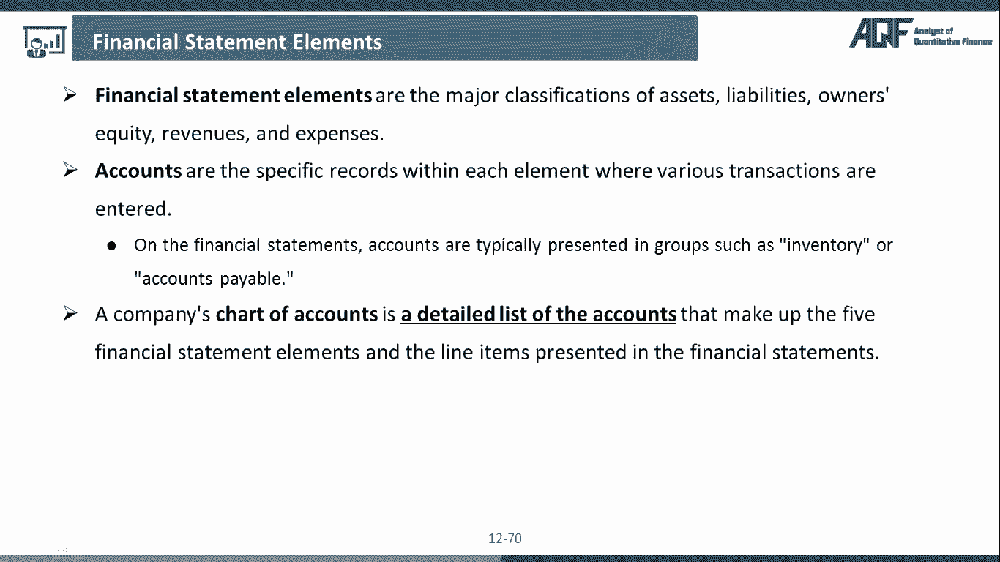

这个叫做财务会计的一些要素，那么要素下面啊我们又分成了account。

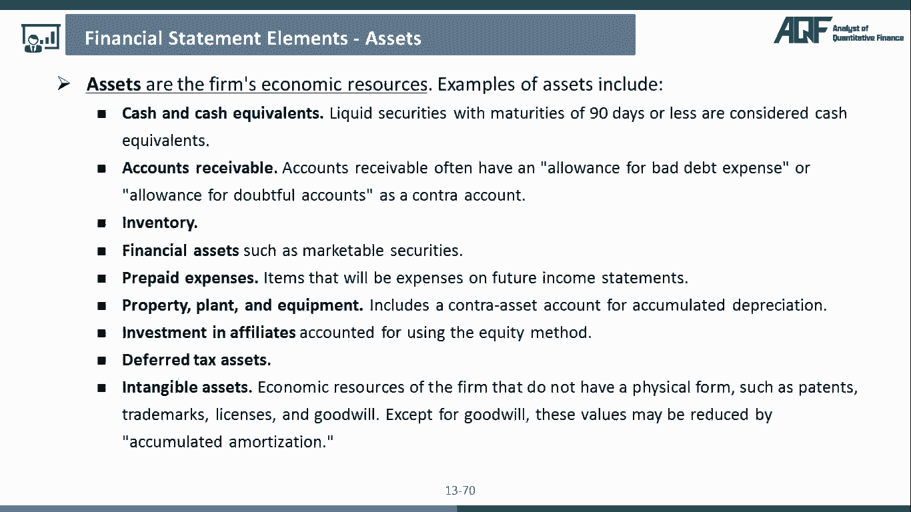

account的话呢，我们把它叫做账户，这两个东西的一个区别是什么呢，大家注意啊，如果说是会计要素的话，那么对于我们来说，它就是一个更广义的一个会计要素啊，它是一个更广义的一个概念，那么会计账户的话呢。

它是一个更狭义的一个概念，那么会计要素指的是什么，就是我们之前前面提到过的什么资产负债，所有者权收入和费用，听明白哎，那么这些都是更广义的要素，那么什么是会计账户呢，因为我们会发现。

资产下面是不是有很多的账户类型啊，有现金存货，应收账款呃，这个预付账款这些东西，负债下面也有很多听明白哎。

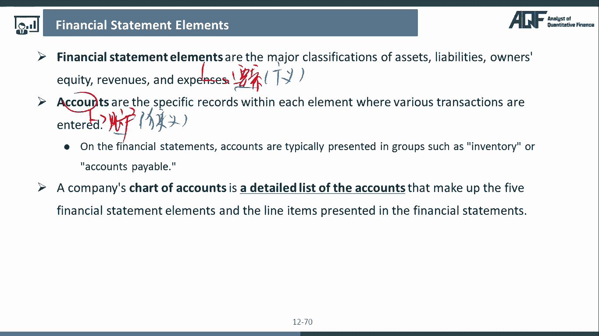

所以对我们来说的话，那这个就是一个一个的这样的一个账户啊，好大家可以看到下面接下来我们有几页内容啊。

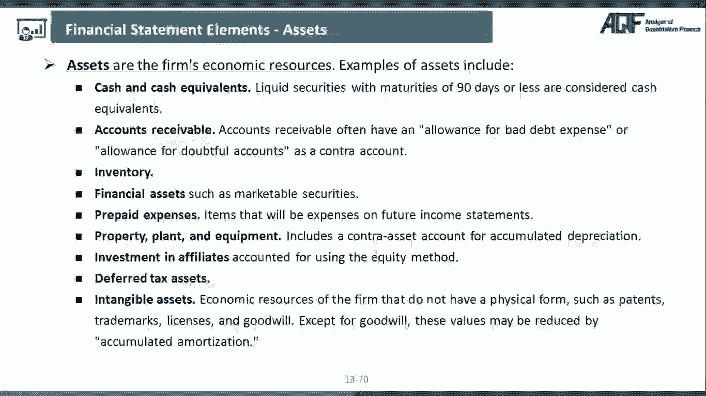

我们就是要一个个来的。

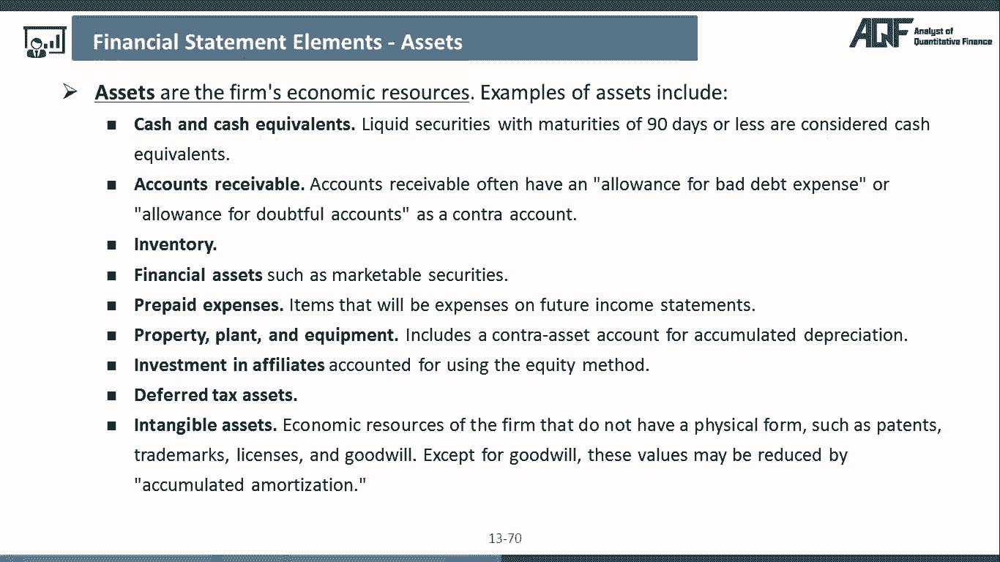

来跟大家介绍要素和账户，那大家来看这一咳咳。

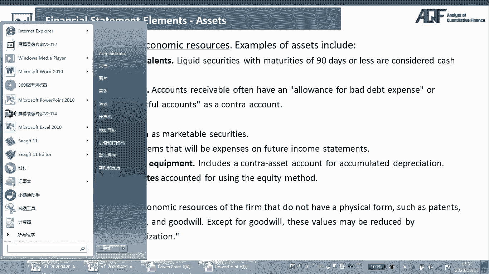

这里的话呢其实上面这个asset这个啊，就是我们所谓的这个叫做element对吧，会计要素要素的话，那是一个广义的概念，下面各个的话呢就是我们的一个会计的账户，或者是我们把它叫做会计的一个科目。

那么我们一个来看，首先来看第一个，第一个的话呢叫做cash and cash currently，这个叫做现金及现金等价物啊，那么对我们来说的话呢，其实在额要有一点补充说明一下啊。

大家在看这页PPT的时候的话呢，大家可以在这里起呃，先画先画一道啊，那么嗯因为注意啊，大家注意在我们嗯资产负债表的结构里面呢，资产负债表它其实是通过我们的一个liquidity，流动性来进行的。

这样的一个编制的liquidity based，也就是说它是根据流动性的好坏来进行嗯排序，那么额流动性最好的话呢，就是我们这个里面的现金及现金等价物对吧，从上往下依次，我的流动性是嗯咱俩下降的啊。

那么我在这里切了一条线，有同学说这条线的额，这个意义何在呢，那注意啊，在这条线上面的这些资产的话呢，我们给它取了一个名字，我们把它叫做current assets，也就是说这条线上面的那些资产啊。

我们把它叫做什么呢，流动资产，那流动资产顾名思义，就是流动性比较好的一些资产对吧，一般我们认为啊在一年之内我就可以变现的呃，比较容易可以变成现金流的，那么下面的话呢下面的这些啊。

我们就把它叫做non current assets，非流动资产，非流动资产的话，那指的就是流动性，自然而然会相对来说更差一点对吧，那么他的变现的话，那可能要一年以上的那个时间，才能够把它给变现。

嗯哼那么嗯我们来看这里啊，这里的话呢，第一个，那资产下面的第一个就是现金及现金等价物，那显然现金就是流动性最好的一个东西了吧，对吧哎好那么接下来我们来跟大家讲一讲啊。

一般来说我们在做企业的财务分析的时候，现今这个科目啊我们怎么去分析呢，嗯我们分析的这个角度可以有这样几个角度啊，首先第一个看看他有没有一些叫做闲置资金，如果说有闲置资金的话呢。

往往这个公司会进行一些投资理财，那么大家注意啊，如果公司有钱可以去做一些投资理财的话，大家看到上市公司各种各样的财报里面对吧，他会呃呃年报的里面啊，就是上市公司的公告里面，他可能会说啊。

关于公司使用闲置资金来进行投资理财的，那种公告，那一般来说啊，有闲钱来做投资理财的那些公司的话呢，他的财务状况一般不会特别差，因为如果特别查啊，这个入不敷出的话，哪有怎么可能会有钱去做理财产品了。

对不对，那同学说这老师有钱买理财的，是不是就一定好呢，那也不一定啊，那就说明他有钱并不能扩大，比如说扩大它的产能，让他钱赚的更多对吧，所以对我们来说，像呃有理财产品这种公司啊，一定不是最差的那些公司。

或者说最差的那些公司，不可能有钱会去做理财，但是说呃会做理财的公司，是不是就一定是一些好公司，那不一定，因为会发现很多好公司他也不理财，因为很多好公司，他们的主营业务是不是能做做到这个嗯。

非常非啊非常非常大对吧，然后通过这些去赚钱，其实是啊比较好的一些啊角度，那咳去分析一个公司没问题吧，好第二个的话呢，大家注意啊，他的现金里面的一些具体的一些结构，因为托马说啊这个现金里面也分啊。

就是呃他是可以自由使用的现金，还是有一些额有限制性的一些现金，因为有些公司啊，你别看他的现金很多啊，但是很多现金他都不能使用，在使用于其他用途，或者说他都是嗯抵押在这个，这个放在账上不能动的。

所以有限制的这种现金的话，那其实我们在看这个现金的构成结构的时候，有是有限制的那些现金，大家要嗯明确啊，要仔细了，因为它跟我们所认为的这个现金啊，也是正常使用的那个现金器并不是一回事。

要仔细去看他的那个现金结构啊，那么第三个的话呢，你要看诶现金跟其他科目的这样一个关系，也就是说当我们发现啊，有些公司他可能他的现金有很多，他的现金呢有很多，完了之后呢。

他还有很多的short term的一些debt，他短期的负债也有很多。

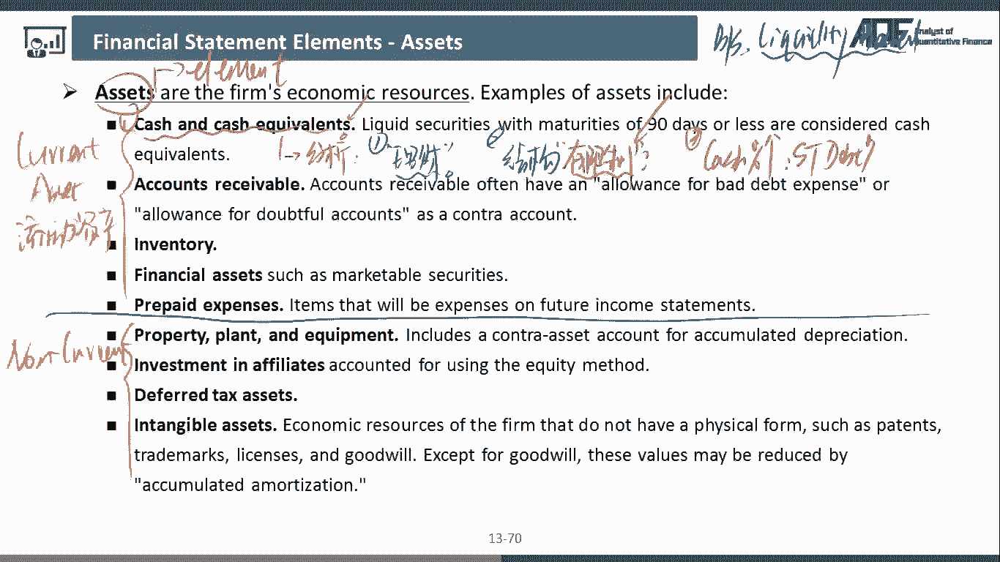

这个其实就是在我们财务上来看啊，他是一个矛盾的现象，因为什么呢，因为托马说大家知道啊，短期负债的话呢，它的利率往往还是比较高的对吧，为了应急啊，这些钱利润还是比较高的，那如果说你的账上还有很多的现金。

你为什么还需要去做这么多的那种短期贷款，听明白了，短期借款，所以断码说，我会对你这个账上的那个资金的那个真实性，会打一个大大的怎么问号，是不是你这个资金真的存在，听明白吗，比如说像乐乐视啊。

之前就出现过这种资金和呃，这个这个贷款双高啊，都特别高的这种嗯不太好的那些迹象，所以诶那这些其实就是我们在以后啊，在以呃为什么要跟大家讲财务的这些呢，就是以后我们在做多因子分析的时候。

我们就可以利把这些矛盾的那些现象啊，就是这个我们就通过多因子就可以筛选出来，比如说市场上的那么多公司，他所有的现金有多少，他的债务有多少，我们其实都可以通过代码，是不是可以获得这些数据啊对吧。

然后呢当我们筛选的时候，我们的其中的一个筛选标准，就可以把所有又有很多现金，又有很多负债的那些公司，我们就作为第一批我们排除的那些对吧，哎所以这个就是我们的嗯，财务跟我们的基本面相结合的啊。

这样的一些方法啊，好那么这是第一个啊，我们说现金及现金等价物，我们可以从哪些角度来去进行分析啊，好接着再来看第二个，第二个我们应该不陌生了，这个叫做account，怎么RECEIABLE。

就是应该收还没收到钱对吧，哎好那么呃大家注意account receivable，我们在做分析的时候要怎么去做分析呢，那首先第一个啊你要掌握的是account，你要去分析的是account。

Receivable，和它营收的增长的一个，两者之间的一个具体的一个比例，因为对于我们来说啊，嗯比较理想的一种情况呢，就是应收账款的增长比收入的增长来的小，或者说应收账款的增长和收入的增长大致持平。

那如果说是这种情况的话，我们就认为这个公司应收账款的增长，相对来说还是比较健康的，听明白吧，那么我们不希望看到的是什么呢，我们不希望看到的是，他应收账款的增长，大幅大于他那一些营业收入的那个增长。

听明白，我们把这种现象呢，其实你就要打一个红旗了，red signal这种就是跟我们上面的那个你现金很多，短期负债很多可能是一个道理啊，我们就要亮个红旗，或者说他在这个里面可能会有一些问题。

那这个问题来自于哪里呢，应收账款是应该收还没收到的钱，收入是我已经确认的收入，对不对好，所以段妈说啊，如果是应收账款的大额增长啊，它大幅上升的话呢，很有可能或者说应收账款的额增长啊。

这个或者不一定它跟收入去比啊，或者直接就是说因账款相比同比，那比如说啊收入同比嗯，今年比去年只增长了20%，但应收账款同比，今年比去年增新增了40%，这代表什么意思啊。

这代表着企业越来越难的去收回他的钱，因为他的钱可能收不回来，收不回他的那个钱，或者说这个企业啊，为了让他的收入更多一些，他放松了他的这样的一个，这个这个收款的那个时间也好，他放松了他的一些收款的标准。

让他们让更多的人来拿货，那么额让他们晚点交钱对吧，所以不管是出于任何一个角度，我们都可以认为这个企业的这个上下游的，bargain的这个能力啊，其实都是在下降的，听明白吧，哎我反正钱收不回来嘛。

或者说我为了让我的货好卖一点，我就给你一些非常有优惠的这样的一些政策，让你来多买一些我的这个，所以不管怎么说啊，这个是我们要警去警惕的一个东西啊，好还有一个的话，我们要去呃去分析的一个是什么呢。

是应收账款，我们会有一个应收账款的一个坏账准备，坏账的准备和坏账的计提，好先来解释一下啊，什么叫做应收账款的换账准备和换算的计提呢，比如说啊，照道理我们卖给了别人1万块钱的这样一个货，对不对。

我就感觉啊这个钱货已经发给别人了，钱还没有收到，所以呢在我们这个里面，我们就确认了1万块钱的收入，和1万块钱的应收账款，当时我发你货的时候，我觉得你这个公司收回款项还是可以确信的。

我觉得还没太大的一个问题，但是怎么说呢，过了一段时间，因为是你收账款收回来，是不是要有个时间啊，恰恰好就在这段时间呢，这个公司的财务状况发生了一顶，就你的客户啊，他发生了一定的恶化。

比如说陷入破产困境了或者怎么样了啊，他的财务困境发生任何，他说这1万块钱我可能还不上了，所以的话呢，我可能就要对这1万块钱的应收账款，计提一个叫做坏账准备，我们把它叫做bad at坏账嘛。

bad debt坏账准备，我们把它叫做bad debt allowance，没题吧，好那么计提坏账准备什么意思呢，这个时候呃，原来在我们资产负债表里面啊，我们列的这个asset，这个里面。

我们可能我们这个应收账款，这个里面是不是计提的是1万块钱对吧，A4确认应1万块钱的一个一个应收账款，那我现在我就要看一下，我大概觉得我有多少钱收不回来了，那有可能极端一点情况。

我觉得这1万块钱统统收不回来，所以应收账款就会变成零对吧，但是呢也有可能说这1万块钱里面，虽然大部分钱我收不回来了，但是我觉得我可能还可以收回个2000块钱。

所以的话呢在这个里面从1万块钱到2000块钱，我是不是就递计提了8000块钱的这个班，坏账损失啊，Bad at allowance，没问题吧，哎所以对于我们来说啊，这个就是呃。

我们要去呃进行重点分析的一个东西，叫做坏账准备或者坏账计提，那么分析的是什么呢，分析的是大家注意啊，在我们呃上市公司的财报当中啊，他都会有一张这样的一张坏账的一张计提表格，像具体表格他就告诉我们。

比如说它会有一个额应收账款，它是根据账龄来分的啊，一年以内的应收账款他计提的比例是多少，可能是坏账的计提比例3%，然后的话呢它会有一个两年以内，应收账款期限的比例是多少，比如说是20%。

3年以内计提的应收账款的换算成本是多少，就是50%，这代表什么意思呢，这说的就是如果应收账款一般来说啊，就至少三个月，六个月，一般来说都是短期之内，我是不是要收回来的，那如果说一年之内我还没收回来的话。

那我是不是要对呃，我就要对你这个钱我还能不能收回来，是不是要打一个问号了对吧，所以的话呢，在我们这个里面打的这个问号是多少呢，那我计提3%，因为毕竟一年之内还不是特别长嘛对吧。

那如果说两年之内这个钱还是还没收回来了，那我觉得这个东西，你是不是要打一个更高的一个折扣了，对那3年之内还没收回来呢，这个周可就更高了，那一般来说啊，如果这个钱你5年以上还没收回来。

那么我通通就是百分百就记为坏账了，基本上我就觉得你想别人一家公司欠你的钱，照道理应该几个月之内就还了，现在5年之内还没还给你，是不是大概率你这个钱可能就收不到了对吧，所以的话呢在我们这个里面。

可能绝大多数公司啊，5年五年的这个gt比例可能就是百分百了，好，那么我要去比较的注意这个计提，表示上市公司的财务啊，或者说上市公司的管理层，他自己可以去定的，听明白吧，哎那么在这个里面的话呢。

它有很多的可操作的腾挪空间，因为它的腾挪空间可以在于哪里呢，比如说啊行业里面的其他公司，它计提的坏账比率都是，比如说300%分之20，50%，100%，这是一个假设啊，这是一个行业普遍的一个做法。

但是突然呢有一家公司，他计提的坏账准备是这么计提的，一年之内提1%，两年之内提3%，3年之内提5%，5年以上再提百分之，只提50%，那么他这么做的意义何在，他让他的坏账少一点，这计提的坏账少一点。

他的那个损失是不是就少一点，损失少一点，他的profit它的利润是不是就会高一点，听明白吧，哎所以很多同事很多上市公司啊，他就会利用这个小的这种操作啊，这个他就可以粉饰他的那些财。

这个这个利润的这个嗯财报听明白吧，哎所以大家呢这个应收账款，除了你要分析它的大幅上升，我们可能认为它不是一个好的现象，那但是呃它低于额上升的不是特别多，或者跟它的营收的上升。

保持一个额可是差不多的一个比例的话，这个我们都是认为是健康的啊，那他的大幅上升我们需要注意的，还有一个我们要去分析的，就是这个应收账款的那个坏账的集体，没问题吧，好。

那么这个是我们的第二个方面的一个那内容好，那么接着我们再来看第三个，第三个我们需要重点去分析的一个，就是我们的一个存货，Inventory，inventory也是要去重点分析的。

为什么存货我们也是要去重点分析的呢，呃或者说存货的分析的角度有哪些呢，注意啊，存货分析的这个角度啊，有这样几个角度，首先第一个角度，同样的存货的大幅的上升啊，我们认为可能不是一个不利的一个现象。

但是我你要打一个问号，并不一定所有的存货的大幅上升都不利啊，因为绝大多数或者说有些公司存货的大幅上升，确实就是不利的，为什么呢，因为它你想存货的大量的上升，就说明这个公司的存货卖得掉还是卖不掉。

卖不掉嘛，卖不掉才会积压在我公司的账上对吧，所以这个可能就不是一个特别好的，理想的一种状况，听明白吧，哎但是在有些情况下，存货的大幅上升反而可能是一种好的现象，什么情况呢，就是这个公司可能会认为啊。

这个存货的价格将来可能会大幅上升，或者说这个公司测算了一下，他觉得在接下来一段时间里面，这个公司的收入啊，会有一个比较大幅的一个增长，所以他现在就大的大量的囤存货，他囤存货的一个目的。

一个是为了可能现在比较便宜，将来会比较贵对吧，所以我现在便宜的是多卖点，还有一个呢就是为我将来的嗯，营收的大幅的一个增长来去事先做准备，那这种存货的上升啊，我们认为它反而是比较健康的明白唉。

那么怎么去看这一个存货的上升嗯，到底是为了什么呢，你可以看有一个财报里面啊，他有一个m d and a管理层的分析和讨论，在这个里面啊，他会嗯有些时候他会披露，他会呃他会告诉我们，他为什么他的存货呃。

大量上升的那个原因是什么，你看一下原因是什么，听明白啊，如果原因是卖不掉啊，那些东西啊，那你就要小心了对吧，哎哎咳，那有些，但是呢有些公司呢，他不披露这个存货大幅上升的原因，那这个时候怎么看呢，注意啊。

这个时候你可以去看一下这个存货的一个构成，因为存货的这个构成的话呢，一般啊我们认为是分成了这样几个啊，这个这个呃类型啊，第一个的话呢就是我们把它叫做存货的原材料，原材料是最早的那个啊。

我就问我的supplier拿的原材料对吧，然后呢还有一种存货的类型的话呢，这个叫做在产品，就是正在生产的一些东西，那么第三个的话呢叫做产成品，产成品就是我现在都已经生产完了，就已经等着再卖了对吧好。

那么这三个存货嗯，这三个的金额加在一起啊，构成了我整体的完整的额这个存货，那么对于我们来说，我最不希望看到的是哪一种的大幅上升，但其实我最不希望看到的是，这个产成品的大幅上升，因为产产品的大幅上升。

是最有可能是因为我的产品生产好了，那在这里现在又变了那么多，最有可能是买不掉，听明白，因为原材料的大幅上升，在产品的大幅上升也好，都有可能是因为我企业主动型的在囤货啊，在干嘛问题吧。

哎所以啊如果说他没有告诉我们原因的话，那我们就可以看一下存货的那些构成啊，这个构成里面，他可能会给我们一些蛛丝马迹的一些啊，这个这个啊内容对吧好，那么这是第一个部分啊，我们需要掌握的存货的分析的点。

第二个我们要掌握的一个存货的分，析的一个额点的话，那我们要去分析的是什么呢，我们要去分析的存货，它他也会计提一个叫做存货的，我们把它叫做跌价准备，好存货的跌价准备说的是一件什么事情呢，很一样的道理啊。

跟应收账款的这个减值其实差不多，比如说我手上有1000万的一个存货，原来的话我觉得我可以卖1000万，但是的话呢现在啊随着市场行情啊，包括我们的一个价格的呃不利的一些影响啊，那这1000万的这个存货。

我觉得他可能卖不掉那么多了，所以我觉得最最终他可能只能卖掉800万，所以在我们这个里面，我们就要计提这样一个200万的一个，存货的跌价准损失问题吧，这个损失的话呢会计入我们的一个利润表，影响我的利润。

我的利润会下降，比如说200万不考虑税的话，没问题吧，哎那么嗯在我们这个里面啊，我们怎么那这个存货的跌价准备，我们怎么去分析呢，同样的你可以啊跟同行业去比，那么这种跟同行业的分析的那种方法。

我们把它叫做cross section的分析方法，同行业的这种比较方法，比如说啊AB两个公司都是属于我们的，比如说服装行业的，那么服装行业大家会发现啊，这个他的衣服最好卖，是不是今年是最好卖的。

就是你的产品设计出来，是今年才生产出来的新款，那么新款一般来说是会卖的比较好的，对不对，但是如果说这个新款你今年没卖掉，在第2年再来卖，可不可以呢，第2年再卖是可以的，但是这个就是老款式了。

所以你可能要打折啊，你可能要促销啊，对不对，所以新款的服装你说你卖1000万，那OK但是第2年，你说你那个新款的服装还能卖1000万，是不是我们就觉得有点问题了，对吧，哎所以的话呢服装企业啊，一般来说。

他们每年计提的存货跌价准备大概是多少呢，平均来看可能是12%，大概啊大概什么意思，比如说一件衣服100块，假设啊新新品大概是100块一件，但是呢下一年可能我就要打一个，至少12%。

就是在我账上这个存货的价值可能就要这个折，只能算88块了，没问题吧，哎这是服装行业的一个，但是注意啊，这个存货的跌价的这个比例的幅度，这个不同的行业是不同的啊，我在这里只是说的是服装行业的啊。

那么呃在我们这里啊，服装行业里面有一家公司，这家公司也很有名啊，大家跑到各种各样的店呃，马路上啊，店里应该都能这个这个呃，这个这个看到他的那个公司，公司的品牌的那些店对吧，叫什么什么之家对吧。

哎名字我不说了啊，什么什么之家，那么大家自己可以体会一下啊，这个是一双服装企业好，那么这个服装企业啊，我反正是不太去买，从来没买过他家的东西啊，呵但是他家的那个店各个地方都有对吧，看的还是挺多的。

但是我每次从他的家咳咳，每次从他店门口路过啊，都发现里面没啥人对吧，但是呢他的店都还开的挺大的，各个地方都有啊，我就一直觉得挺纳闷的对吧，然后呢你可以看啊，他的那个上市它也是一家上市公司对吧。

你看他的那个财务报表，他的业绩利润各方面做的还可以，但是他的存货的跌价准跌价比例大概指跌，计提了多少呢，4%到5%左右啊，当然这个数据可能比较老啊，现在可能他做的更好了，我现在我也不知道了啊。

这个这是我当时看到的时候，他的一个计提的一个比率，什么意思，人家都计提12%，就100块钱的东西，下一年我觉得只能卖88了，但是他就认为100块钱，我原来的服装下一年我还能卖95块。

是不是这样一个意思啊对吧，所以这样的话它跌价存货跌价准备跌价损失，这个这个计提的少，他的利润是不是就可能会更高一些，相比较同行来说没问题吧，哎所以很多上市公司啊，都会在或多或少的这些方面啊。

这个来去做一些文章对吧，哎好那么接下来再来看第四个，第四个的话呢，在我们跟我们量化其实没什么太大关系啊，上面几个都是我们在做量化分析的时候，需要重点掌握的一些科目和账户，所以我才展开跟大家讲了啊。

那么第四个简单了解一下，第四个的话呢就是呃我们的一个金融资产，那么金融资产的话呢，老的财务准则啊，会计准则分成了这样几种，第一种嗯这样三个类型啊。

嗯这个第一个名字的话呢叫做holding to maturity，这个叫做持有至到期投资，第二个的话呢叫做trading security，这个叫做交易类金融资产。

第三个呢我们把它叫做available，for sale的这个金融资产，这个叫做可供出售金融资产，那么这几个呃分别代表的意义是什么呢，注意所有制到期投资，很显然一般来说只能认为它是债券啊。

或者说类似的那种固定收益的那些投资产品，对吧，只有债券或者固定收益的那些产品，它才会有一个到期期限，所以像这种东西，我才能把它放在持有至到期投资里面啊，所以如果我们买了一个股票的话。

我能不能把它划分在持有职到期投资啊，不行，因为股票它是不能放在额，他也没有到期期限的对吧，好第二个的话呢叫做交易类金融资产，交易类金融资产的话，那一般我们认为啊是啊呃是比较短期的一个，那么当然了。

这个现在的划分标准也发生了一定的改变啊，所以其实也没关系了，那么第三个的话呢叫做可供出售金融资产，就是不能放在第一类，不能放在第二类的，我们就把它放在第三类对吧，呃但是现在的话呢。

它的定义和意义都发生了改变啊，连名字都改了呃，我们的新的新的财务准则啊，这个呃这个这个持有至到期投资，它改成了叫做以供额，以摊余成本计量的，这个叫金融资产，那么交易类或者呃可供出售金融资产呢。

它改成了以公允价值额计量，且其变动计入咳咳这个像available for sale，就是计入其他综合收益的资产对吧，还有一个的话呢就是以公允价值计量，且其变动计入当期损益的这种金融资产。

那么这些其实都是偏财务的一些呃概念了，跟量化里面的关系不大啊，所以我只是呃跟大家简单说一说啊，我们在这里这个东西啊，我们就不展开跟大家讲了，好接着再看第五个，第五个的话呢。

我们把它叫做prepared expense，这个应该我们也嗯不不陌生啊，这个就是我们前面跟大家提到过的，那个预付账款，对不对，就是跟大家举的那个卖嗯，我们去买宽带服务的那个例子对吧，哎钱付了。

但是服务还没享受，我们不算我们的一个费用啊，我们反而是算我们的一个资产对吧，哎好那么接着再来看下面，下面从下面开始啊，就是进入到了我们的non current asset。

这是我们的一个非流动资产里面了，对不对，好，那么我们来看一下啊，not current asset里面的第一个类叫做什么，Ppp and e property，Plant and equipment。

这个就是我们前面跟大家提到的，机器厂房与设备，没问题吧，机器厂房与设备好，那大家想看一个企业买了一个机器厂房与设备，它不可能就嗯就使用一年吧对吧，所以它所以呢他的那个期限，往往是不是就要超过呃。

一年的这个使用的期限了，对吧好嗯，那么接下来的话呢嗯这个对我们来说啊，PPIDE这个账户的话，我们也是需要去重点去分析的，那么PPI内这个账户，我们分析的这个角度是什么呢，我们来跟大家解释讲解一下啊。

首先第一个PPIDE的这个分析的，这个角度的话呢，我们可以从折旧的depreciation啊，额这个叫做折旧的这个角度来去分析，首先第一个啊，我们跟大家讲一讲什么叫做折旧呢。

折旧就是我这个设备的这样的一个使用费，简单来说啊，可以就是我使用这个设备的一个使用费，那么这个折旧的这个概念啊，我们之前都跟大家讲过，比如说我有一个钢铁的企业对吧，我买了一个五个亿的一个设备。

原来我觉得可以用10年，那么我每年的使用费就是5000万，那么这5000万其实就是我这里的，Depeacciation cost，我买来就是折旧费用，听明白吧，买那么大家注意啊。

这个设备可以用10年也好，可以用20年也好，这些东西啊，具体用几年是怎么定的呢，都是我上市公司自己可以定的，听明白吧，上市公司自己定的话呢，这个时候就会有一个问题，什么问题呢。

诶别的那些公司都定了10年的使用寿命，你这个公司你定了多少呢，你定了20年的使用寿命，如果你定20年的使用寿命，那你每年的折旧费用是不是就是2500万，你的利润是不是要比人家的公司来的高。

那么这个时候我们在做财务分析的时候，这个折旧的标准不同，那对我们来说，我们所用到的这个这个比分析这些公司的，财务的这些分析的呃，这个指标的时候是不是就没有意义了，财务的那些分析指标。

我们后面马上就跟大家讲啊，所以呢在我们这个里面，我们要跟大家讲两种思路啊，第一种思路，这是我们折旧的两大类的方法，第一种方法我们把它叫做straight line的方法。

这种方法的话呢我们把它叫做直线折旧法，那么还有一种方法的话呢叫做double da double呃，decline balance啊，这个DDB，那么大家简单了解一下，这个叫做双倍，它叫做双倍。

余额递减法好注意，那么你可以简单的认为，双倍余额递减法是一种加速的折旧方法，什么叫做加速的折旧方法呢，就是它每年的折旧的速度，是我们直线折旧法的两倍，双倍余额折旧法，双倍余额嘛对吧，简单来看啊。

就是假设我有一个五个亿的一个设备，如果我用10年的话，如果说是直线折旧法，那我每年的折旧费用就是五个亿除以10年，那么就是5000万没问题吧，那如果说是双倍余额递减法呢。

相当于我每年的折旧速度是你的两倍，所以相当于是原来是五个亿乘以1/10，所以每年是怎么样，5000万，现在是五个亿乘以1/10，再乘以二双倍，听明白吗，所以第一年我的折旧费用。

可就是我的折旧费用就是一个亿，没问题吧，哎所以哪一种是更保守的一种做法，注意啊，在我们财财务里面，我们一般把会计的记账分成两种类型，第一种类型的话呢我们认为是激进的做法，注意啊。

激进的做法是我们尽量要去避免的，或者说呃如果公司用了激进的方法的话呢，我们要提前知晓，因为激进的方法的话呢，就是希望让我自己公司的利润更高一点，那么还有一种做法的话呢，就是一种更保守的一种做法。

那这种更保守的一种做法的话呢，它会使得我这个公司的利润会偏低，那么大家注意啊，保守也不好，激进也不好，因为我就应该让我这个公司怎么样，就是该是怎么样的就怎么样，你不要特别保守，也不要特别激进对吧。

这个正常合理的水平就好，但是如果一定要嗯，根据这个激进和保守来分析的话，哪一个棋手我们认为是更不好呢，就是激进的处理方法更不好，因为经济性的处理方法会使得你的利润偏高，很多财务报表的使用者没有学过。

比如说我们a cf没有学过，我们其他的一些财务分析的专业证书的话，他可能就呃分析不出来这个东西听明白吧，所以呢在我们这个里面哪一种是更激进的做法，就是第一种，第一种做法呢是一种更激进的一种做法。

因为我的折旧费用少，所以使得他的利润更怎么样更高对吧，那第二种做法的话，那相对来说更保守，没题吧，哎所以当我们在分析不同的公司的时候，我们发现市场上这个行业里面的绝大多数公司，都用的是双倍余额递减法。

就是这种加速的这种方法，因为折旧费用多，我的利润是不是少啊，但是呢就有一家公司用的是直线折旧法，那这家公司的财务水平我们是不是堪忧啊，我们要打一个大大的问号，听明白吧。

哎这个我们后面会给大家举乐视的那个例子啊，就是，乐视真的是非常厉害，因为他的老板嗯，贾跃亭贾老板对吧，就是会计出身啊，假会计的，所以呢乐视的哈这个财报里面啊，是我们学习财务分析的粉饰的经典之作。

基本上市面上有的这种财务粉饰的方法，乐视都用到了对，因为乐视啊它其实我们后面会跟大家讲啊，他是视频的，乐视网当时上市的那个网站嘛对吧，它是一个视频网站，所以呢它里面的话呢会花非常多的钱去买版权。

那么别的视频公司啊，他买来的版权统统加速折旧去做的，当然乐视呢统统用的是这里的直线的这种数据，我们分析到后面再来跟大家说。

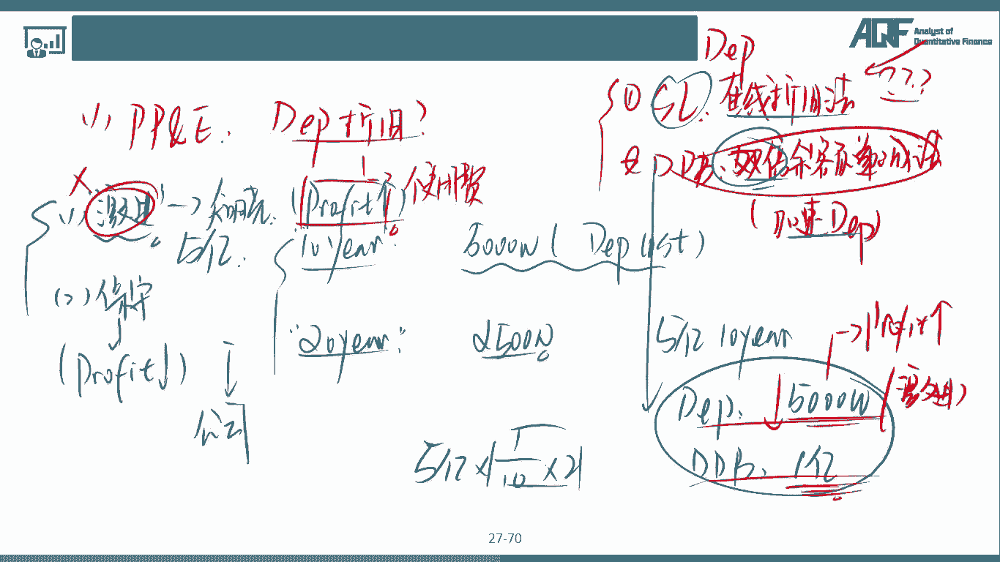

没问题吧，好所以呢在我们这个里面啊，PPIE其实我们更多的要分析的是它折旧，他到底折旧的是不是特别激进，听明白吧，他的利润是不是会通过这个折旧，会显得特别高啊，好后面这两个呢我们不讲了。

一个叫做嗯联营公司投资，还有一个呢是跟税有关的，这个在我们额量化里面都涉及不到啊，那么我们就不展开去多说了，那么嗯接下来的话呢有一个叫做intensible asset，这个叫做什么呢。

这个叫做无形资产，无形资产其实也是企业非常重要的一个东西啊，很多公司，特别是像类似于巴菲特买的那些公司啊，他都什么呢，看看他的实物资产，其实看不太出什么，但是呢他有非常多的无形资产。

无形资产是一些什么东西呢，比如说啊嗯有些patent专利对吧，trade marx license对吧，呃包括有一些啊，他的一些嗯品牌的那些嗯知名度啊，整体的那些其实有些无形资产可能在账上体现。

有些无形资产，他可能在账上都无法都没有体现在他的财报上，对啊，比如说他非常优异的管理层，他非常优异的人才梯队对吧，这些其实都在账上嗯，分析不出来，所以财我们要去投资一家公司啊，价值分析。

财务分析只是一个基础，你更多的是要看到这个财报背后的，这个公司的那些呢内容听明白哎，那无形资产的话呢，嗯这个其实是在价值投资分析里面啊，我们会用的比较多，量化呢其其实接触也比较少啊。

所以我们也不展开去跟大家说了，好，这里的话呢就是我们跟大家讲的资产的部分啊。

