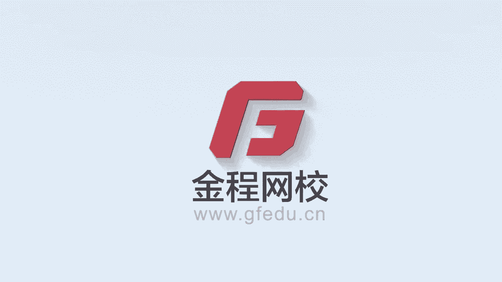
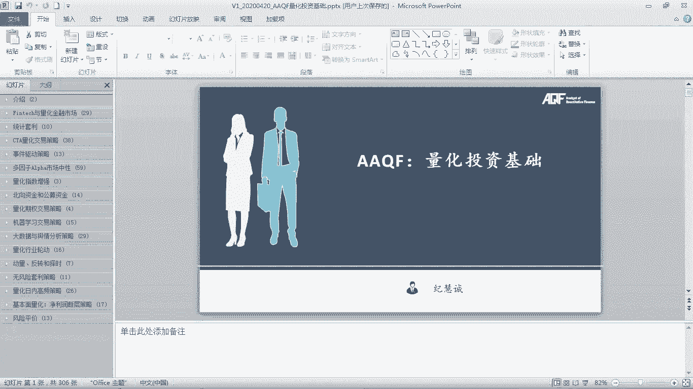
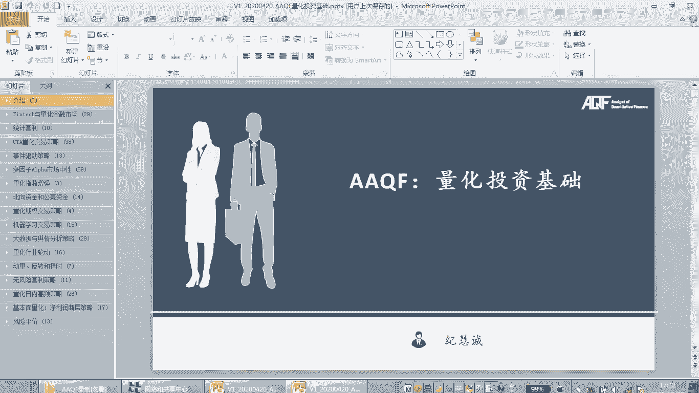
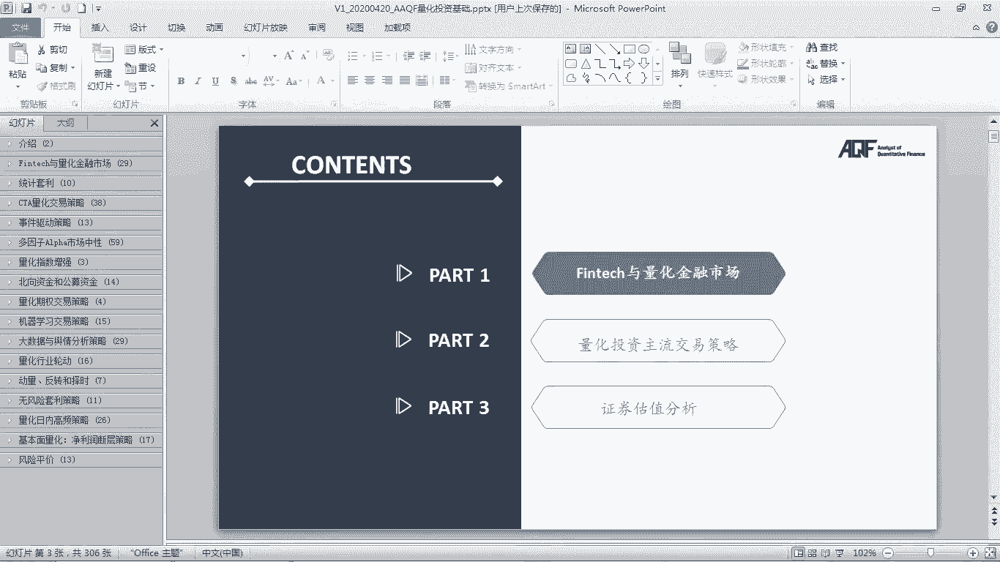
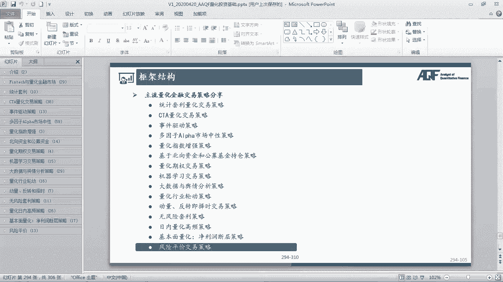
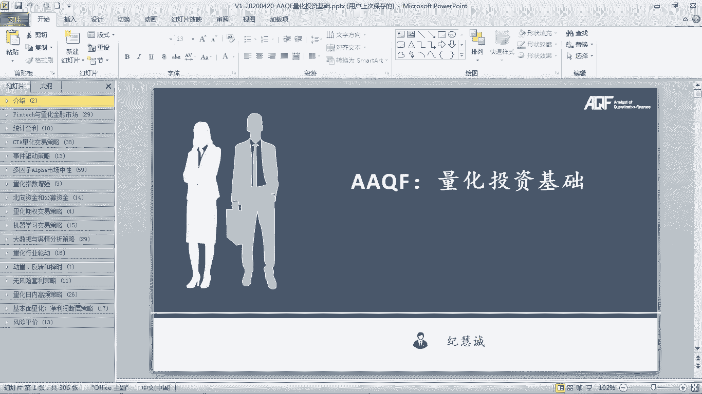

# 2024年金融大神老师讲解量化金融分析师.AQF—量化金融基础知识（完整版课程） - P12：《量化投资理论》01.1量化投资基础课程介绍 - 量化沿前 - BV1ar421K7Mo

好今天非常高兴啊，可以跟大家来开始看新的这一个模块的。

一个课程，那么今天的开始啊，我们就可以跟大家正儿八经的进入到，量化投资基础的这门大课程，的这样的一个教学啊，大家可以看到这门课程的话呢，我们准备的PPT也是非常多啊，300多页的一个PPT。

然后的话呢内容涵盖了各种各样的交易策，略的一个嗯原理，那么在这个部分的话呢，我们会把市面上主流的那些交易策略的，那些原理，包括他如何实现的这种思路啊，我们都会跟大家一步一步的来进行一个展示。

那么到后期的话呢，我们会挑选这些策略里面的一部分，然后呢在我们的Python里面进行实现，当然了，我们的课程里面啊，我们不会把这个我们讲到的所有的原理的，那些交易策略都跟大家来实现。

但是大部分基本上都能实现啊，这个呃但是肯定不是所有的都能实现了，那么有一些的话呢呃虽然我们没有实现，但是也可以给到大家一些参考的一些啊，这个这个资料啊，或者怎么样，大家可以动手去看看，呃如果有了这些呃。

这个大家学完我们整个AKF以后啊，那大家可以自己看啊，给到大家一个策略的一个思路以后，大家会不会通过自己的一个能力，然后的话呢把它变从一个思想，变成一个这个真正切实可循的一个。

量化的一个strategy，对不对好，那么我们先来看一下啊，我们整个课程的这样一个逻辑结构，那么整个量化投资基础的话呢，我们想跟大家讲的是这样几个部分。

第一部分的话呢就是我们的一个FINTECH，以量化金融市场的一个整体介绍，那么在这个里面的话呢，我们会介绍一些FINTECH的一些应用场景，包括人工智能啊，量化金融市场的整体的一个介绍。

那么在这个里面要跟大家讲这么多背景的原因，就在于说我们会发现呃，量化金融啊，那些科学技术的，科技的那些技术，正在不断的shape我们的一个financial markets，所以原来可能在金融行业里面。

我们依靠的是金融知识，我们实现一步一步的交易啊，定价对不对，但是可能嗯你学完这一部分之后，你会发现呃，在不久的将来，可能我们所需要的通通只要是算法algorithm，只要你有足够的一个算法的话。

不管去实现我投资组合的构建，我们的那个交易的策略，还是属于我们对什么option进行定价，你会发现这些所有的所有都可以通过，我们一些深度学习啊，我们一些比较前沿的一些人工智能的一个技术，来加以实现。

所以可能在不久的将来，我要对期权进行定价，可能我我们用的就不是什么b s m model了，我只要通过一个深度学习的一个模型，然后呢，把嗯把它就可以来作为我们的这样的一个。

这个这个嗯课程的这样的一个咳这个实现对吧，这个Python的这样的一个option的定价的一个实现，所以将来我们学金融主要学的是金融还是technology，这可能就是一个大大的问号了对吧。

那呃我们的课程其实就是把这两个部分有一个，比较好的这样的一个融合，那么让大家知道我们市场上啊的嗯，所呃面各种各样的呃，反正呃各种各样的technology是如何去影响或者。

我们的这个反弹收音industry，所以这个是我们第一个部分啊，想跟大家介绍一下我们整个FINTECH市场，整个我们的量化兼用的那个市场，对吧好，那么这一部分讲完之后啊，第二个部分开始的话呢。

就是跟同大家讲的，都是我们的一些主流的一些量化的，一些交易策略了，那么在这些交易策略里面的话呢，大家可以看啊，那呃呃主要的策略的话，那就是有这样几个几大类型的这个交易策略，在我们这个里面都有啊。

包括在我们的呃这里其实也写到了对吧，首先第一个的话呢就是我们的统计套利，统计套利啊，可以说是我们作为入门的一个，必学的一个交易策略，然后的话呢它的Python实现也不是非常困难，但是非常实用。

而且很多时候在市场上还是切之有效的，这样一个交易策略啊，那么统计套利这个策略的话呢，我们会在我们的Python里面，对大家嗯进行一个完整的实现，那第二个部分的话呢，就是我们的CCTA的量化交易策略。

那这部分用的内容啊，就是我们的一个就是衍生品，各种各样的commodity啊，黄金啊等等等等，我们的一些features呃，通过利用fires，通过设定一系列的交易的一些规则。

然后呢比如说有cha following啊，趋势追踪啊这些东西，然后我们就可以获呃这个实现嗯，一些比较好的一些超额收益，那么呃在CCTA的这个部分的话呢，我们会把市场上主流的CCTA的那种模型。

那些算法都会来跟大家介绍，当然CCTA的这个里面啊，我们会啊，比如说海格交易策略啊，非常有名对吧，还有一些这种模型的话呢，嗯大啊，我们会挑选一些比较有代表性的。

也会在我们的Python里面跟大家来进行实现，没问题吧，哎好那第三大类型的策略的话呢，就是我们的一种叫做事件驱动型的策略，就这个策略是否赚钱，取决于某一个事件是否发生，比如说券商分析师的评级调升啊。

比如说我们的一些兼并收购啊等等等等，那么在这个里面的话呢，我们ECRAFT里面，其实啊，他并没有基于事件驱动的这样一个交易策略，但是我们除了AKF以外，我们还有那个嗯我们的一个长久策略更新。

那么这个策略更新里面，我们会讲一些更多的这种更深入的，难度更高的一些交易策略的那类型，那么在长久更新的那个里面，其实啊我们是有一个基于券商分析师的评级，调升的这样一个呃策略课程的，那么对大家来说的话呢。

呃a cf的那些交易策略嗯相当于是偏入门啊，或者说那个啊这个比较典型的与啊经典的算法，那么如果说大家想要学习更深入的学习，那种更前沿的人工智能啊，深度学习啊，神经网络啊这些。

那么你也可以去看一下我们的那个这个，这个长久策略更新的那个那现在好呃，我们反正也是有这种优惠的，要比你单买要便宜好多，那么这块的话呢就是如果大家想深入学习策略，更多的去了解策略的话。

那这一个模块也可以去看一下，我们也会定期更新呃，那么后面的话呢，就是一个基于多因子的这样的一个，市场中性策略，那把还是做marketing neutral的那个more motifactor。

因此呃这个策略我们大家可以看到，PPT的页数其实非常非常多的，那这一个为什么我们准备了这么多的内容呢，主要的一个点就在于说，多因子是我们市场上嗯，非常常用的一个交易策略，我们也可以看到券商里面啊。

各种各样的呃，这个这个不同的券商都是在研究因子，对不对，那我们要找到的就是更有效的因子，解释力度更大的因子，更能给我们产生阿尔法的因子，那么这些因子在配合市场中性策略以后，在我们中国市场上可以获得。

非常显著的这种绩效的一个提升，所以呃这种策略在中国上可以占到了，可以说是占到了我们整个量化的半壁江山，所以多因子策略是如何去做的，那么我们也一步步步会来去跟大家讲，那么包括在我们后面的AKF课程里面。

也会跟大家把啊，多因子的策略进行一个拍摄的一个实现，我们有单因子的检验方法，当然是基于优矿的一个平台，我们也有多因子的，基于非平台的这种，我们本地的一个部署的一个嗯策略，比如说我们可以去呃。

帮助大家去实现我的farm french的三因子模型，唉这个其实对我们来说很多呃，用一些交易平台，比如说优矿啊，呃用巨宽啊，这些交易平台的一个好处是，它有很大很多的数据，这些数据它都是清理好处。

处理好的数据我们直接拿来调用就好了，这是使用平台的最大的一个好处，那使用平台的话有一个问题，就是说平台里面很多函数它其实是黑箱，我们也不知道这个函数是怎么编的，它最终出来的这个结果为什么就是这样啊。

我的输入和我的输出之间的那个关系，其实我们并不是知道，并不很容易的知道，所以啊有些这种量化的资深的开发用户啊，他会对这种平台会有一定的警惕性，对绩效的策略可能会有一定的影响。

所以我们也给大家了一个本地部署的一个版本，那不管是本地部署啊，还是多因子的那个额点的话呢，呃反正我们在课上都会跟大家去做这，样一个呈现，因为毕竟这是市场上非常主流的交易模型，呃但是希望大家说的是。

不管我是用平台的，还是自己本地部署的原理需要掌握，同时的话呢呃像多因子策略，我还是比较建议大家可以用平台，因为他的数据实在是太多了，如果你自己去处理的话，很多数据你得不到，而且很多数据都是付费的对吧。

那平台上的话呢，那这些数据你可以免费额，有些数据你可以免费去用啊，可能更好一些，当然如果说你是用于实盘做资深的那种的话，那该花钱你就得花钱对吧，该去买数据，你就买数据啊，这节你吝啬不得对吧。

这个就是我们的一个做量化的一个前提，就是你要构建非常非常体系化的，完整化的这样的一个数据库，如果你连数据都没有，你谈何策略呢，对吧，哎那么多因子的话呢，最大的一个点就在于说他非常的吃数据，那么对吗。

说所以我们建议大家可以用一些平台的那个，你就不用大量的时间去处理数据了，可能你策略多因子策略里面很大一部分时间，你花在的是数据的获得，数据的整理，数据的清洗这些方面了，对吧哎好，那么后面的话呢。

我们会跟大家介绍的是一些，指数增强的一些思路，在量化里面就是我们有被动的指数增值呃，跟踪指数的ETF的passive的那种交易策略，那么我们目前越来越多的量化基金啊，就想去beat这个啊。

benchmark beat我们的一个index，那么有什么方法可以去beat它呢，我就可以在指数里面，比如说加入一些多因子啊，在指数里面再通过一些什么期权啊等等等等。

来去提升我们整个指数的这样一个嗯收益，那么在市场上有很多，比如说跟踪沪深300的，但是我的表现嗯，我的绩效performance，要比沪深300那个要来的更好，他其实很多背后用到的都是一些量化的思想。

那么在我们这个里面，其实这一块也是我们量化值得研究的一个地方，当然这块的话呢可能那我花的篇幅会比较少，而且这部分的话，那我们就没有在Python里面进行实现了，因为毕竟我们是主动投资者。

我们是active master，我们写AQF也好，我们学啊什么别的东西也好，我们的目标就是为了去beat market对吧，战胜这个市场，所以这部分的话呢可能并不是我们的一个嗯，嗯主要跟踪指数啊。

战胜指数可能并不是每一个主要目标，所以在这里的话呢，我们会把市场上的一些主流的一些方法，跟大家简单介绍一下，但是这部分就没有实现了，那么后面的话呢，我们是会基于一些北向资金和公募资金额，公募基金。

然后看一下他们的一些择股的一些交易策略，那么呃北向资金啊，就是简单来说就是外资对吧，这个通过香港进入到中国的大陆，市场的那些资金啊，可以说是中国A股上啊，近年来为数唯一的一些增量资金。

所以北向资金对我们的A股其实影响非常大，你会发现呃，每天几10亿几百亿的这种北向资金的流入流出，就可以去左右大盘的这个上涨下跌对吧，所以这个是背景下的话呢，北向资金的研究就变得比较重要了。

那还有一个的话呢，为什么我们要去研究公募基金基金呢，因为公募基金现在的愈发的就成为我们市场上，非常非常重要的一个机构投资者，那么研究他们的一个持仓，我们就是看到很多啊量化的基金啊。

我们包括量化里面的一些研究报告里面，他就分析了我通过研究基金额经理的，优秀基金经理的那些持仓啊，因为那些基金的持仓他会disclose嘛，他会公布，对不对，那我看他买了哪些，我跟着他买，买那些最好的。

最优秀的基金经理重仓的去买的那些股票，我们回测下来哎确实可以获得超额收益对吧，哎，这是不是就是也是我们的交易思路的这个，一种啊对吧，那么那么这个北向资金的这一块的话呢，可公募基金的那个我们也更多的是呃。

跟大家讲的是策略思路的一种，阐述啊对大家来说的话呢，大家有了这些思路以后，你不一定就真的在量化领域，你就自己去看北向资金，公募资金的那些，看他买来的哪些股票，你自己再结合你自己的一些主动分析的基本面。

结合的一个可能也能赚到超额收益好，那么后面一个的话呢就是量化期权，那么量化期权啊，特别是期权，现在我们市场上交易的很多对吧，那么很多人嗯这个期权暴涨暴跌啊，暴富暴亏那种嗯。

在我们市场上也听到那些也有很多啊，那么短板说，我们如何利用期权来去这个获得超额收益，那么啊在这个部分的话呢，我们也会跟大家介绍，我们自己的一些策略的实现，当然这个策略的实现。

也是放在我们的那个长久的那个更新的那个诶，这个课程里面，大家可以去关注一下，那么后面的话呢我们有一些啊machine learning的机器学习，现在特别特别火，那么我们有传统的监督学习。

非监督学习对吧，还有我们后面的更难度大一点的深度学习啊，神经网络的这些交易策略，那么对我们来说，a cf里面就有，然后的话呢我们那再来一些，比如说更难的一些什么神经网络啊。

基于神经网络的各种各样的一些交易策略呢，我们可能就是放在诶这个啊，但是必定啊后面APF里面，可能我们也会放一个呃，反正机器学习的这些策略的话呢，在我们ECF里面肯定会有。

而且这部分是我们今年重点想要去啊，啊这个这个突出的一个部分，因为啊machine learning啊，嗯目前嗯就是在行业的一个前沿对吧，那么早在2017年。

我们基本上是全行业第一个把machine learning的交易策略，应用于我们的那个这个这个quantitative的啊，strategy里面的做培训啊，跟他阐述这些思路的那些，那么从17年以后啊。

慢慢慢慢越来越多的啊这种交易策略啊也好啊，这个machine learning应用量化都慢慢慢出来了，但是在我们这里的话呢，我们也有不断的更新迭代，那么在新的这个课程当中啊。

我们也会给大家呈现更多的更新颖的那些，也更漂亮，或者说更实用的一些继续学习的那个啊策略啊，大家可以期待一下对吧，然后面的话呢，就是我们的一些大数据和舆情分析策略。

那么这个策略在我们AKF里课程里面也有啊，但是这个策略的话呢，是在老版本的AKF里面其实就有，那但是一样啊，因为不管是老的还是新的，策略的原理和策略的思路都是一样的，那么大家可以看着这个策略以后啊。

基于这个策略，那嗯你可以去编写自己的那些这个嗯，嗯这个新的一些思路对吧，当然这个策略的一个问题就是，我们也非常依赖于数据啊，呃你要有一个非常非常好的数据源，那好的数据源在目前的量化市场上。

可能都是需要付费的，那么对我们来说，我们因为做研究嘛做启发的那种思路，那么我们可能只能选一些啊，比较简单的那些数据对吧，但是如果大家真的是工业型的，工业化的那种实盘的价格的话呢，嗯还是那句话。

你想赚钱就不要吝啬你的那些成本对吧好，那后面的话那就是一些行业轮动的一个策略，如何通过行业轮动，比如说把握经济周期情况下，不同行业的一个受益程度，我就做多做空某些行业，那么量化的那个industry。

The rotation，行业的一个轮动策略，也是会那么给大家讲解一些原理啊，那么后面的话呢momentum in reverting和额，这个这个择时的那些策略，相对来说好像比较简单了。

那么我们把它放在偏后面嗯，也没关系啊，反正这是属于一些比较简单的一些啊，啊这个交易策略对吧，那后面的话呢我们还会有一些无风险的套利，比如说我们的ETF套利啊，我们的期限套利啊。

这个其实就是跟衍生品有关了，所以我们为什么在前面会跟大家讲，各种各样的衍生品啊，股票啊，财务啊，那背后的原因就是，因为我们在讲这些交易策略的时候，都会用到它们，对吧好，那么今年的更新当中。

还有一个非常大的一个更新，就是我们还更新了我们的一个日内的这个量化，高频的这个交易策略，那么这是原来我们没有太多，去cover到的一个部分啊，因为当时啊早期17年啊，在中国市场的嗯。

日内的量化其实做的人还非常少啊，原理啊这些东西做人都不多，但是随着时间的发展啊，目前来看很多啊基于股票的日内啊，期货的啊，日内啊，越来越多的人都可以嗯开始focus在这里了，比如说有些人会研究集合竞价。

对全天的收益的影响，有些人会研究一些主动性买盘，包括主动性卖盘的大小，对我全天市场的那个收益的那个影响，当然日内的那些高频数据，也是非常非常依赖于我们的那些数据的，呃类型啊对吧，那呃最后的话呢。

就是一个是基本面量化的交易策略，净利润断层的这样一个交易策略，它是技术面和基本面，相当于是共振的这种嗯这样的一个交易策略，那么在这个交易策略里面，我们相当于是结合了基本面和技术面，那么共振的话呢。

那这种交易策略我们赚到钱的可能性就会很大，那么这个交易策略，我们会跟大家讲两种不同的思路啊，这是两家券商不同的两个研究所，的两个不同的思路，这两个不同的思路呢，最终都得到了一个比较好的这样的一个结果。

所以对大家来说的话呢，大家而且在市面上，已经有人去把这个研报当中啊，他们的研究所的研报当中的一些策略，通过Python去复盘去实现了一下，呃，当然这个的话呢我们就没法做了，因为要用到大量的那些数据啊。

对于我们来说的话呢，这些数据可能啊如果你自己去去去去处理的话，可能就难度比较大了，那还是需要借助一些平台，它上面会有一些现成的那个数据，那么可以大幅降低我们整体的这个策略，编写的一个难度对吧，哎好后。

最后一个的话呢就是我们的一个risk parity，风险评价就是REDLIL的那些这个啊那个咳啊，风险评价的那些交易策略也是啊应用量化啊，但是分拣评价的话呢，最近几年的表现不是特别理想啊。

但是不管怎么说，他也是一个比较主流的这样一个交易策略，所以呢在我们这个里面大家可以看到啊，我们今年的新版的量化投资基础当中啊，我们跟大家讲的交易策略更为丰富，更为深入。

同时的话呢我们介绍了跟大家新增了很多啊，啊这个行业前沿的更新的一些啊，交易的思路，strategy啊等等等等那些东西，那么嗯当然对一部分啊，我们嗯有些我们会在后面的课程AKF的政客。

包括长久策略的课程里面，有些会实现，有些的话呢，比如说受益受制于我们的一些交易数据啊，我们的一些嗯各个方面的一些内容，我们可能就没法比较好的，去带着大家去实现这些，但是原理有了，没关系等等。

大家足够的强大，你可以免可以获得到这些数据的时候，你也可以把这些策略给变现出来对吧，更多的是大家需要掌握的是背后的交易的思想，和交易的原理啊啊，然后的话呢我们应用这些原理。

结合你自己对这个市场的一个观点，你自己对嗯这个走势的那种看法，你这么多年来，你自己做投资的一些核心的那些理念，你可以结合这些策略的思路，和你自己的一些理念，那就完全可以开发出属于你自己的啊啊。

这种量化交易系统对吧，那么诶最终我们去实现我们的这样的一个。

这个这个啊完整的量化投资的这样一个闭环好，那么这个就是我们整体的啊整个额量化投资嗯。

