# 2024年金融大神老师讲解量化金融分析师.AQF—量化金融基础知识（完整版课程） - P14：《量化投资理论》03.2Fintech与量化金融市场介绍 - 量化沿前 - BV1ar421K7Mo

呃前面电脑出了点问题啊，它自动的停止录制了，嗯然后没关系啊，我们接着讲啊来看，那么呃我们前面说到啊，那个深度学习的话呢，可以给我们一个作用，就是当我们有BSN模型以后，呃。

只要我们给到我们这五个输入变量，我就一定可以求出这里的看涨期权或者，看跌期权的这个价格，对不对，好那么这个的话呢，其实原来我们对期权定价，非常依赖于我们这个模型叫做BSM模型，但是大家会注意啊。

嗯有了深度学习以后啊，可能以后啊我们在学金融工程的时候，可能压根都不需要再需要这个BSM模型了，当然我没有对BSM模型有任何的不敬啊，这个模型非常厉害的，那么但是为什么这么说呢，其实很简单。

我只要把期权的那那些历史数据，这五个输入变量作为我们的一个input，然后呢，这个期权在历史上他的那个价格肯定是有的，对不对，所以的话呢我就拿这个期权的这个历史价格。

作为我们的一个怎么样输出层output，然后呢我就让这个模型自动去训练这个数据，让这几个input更好的去拟合，这里的这个什么output，听明白好，那么这样的话我就可以训练出一个。

类似于期权定价的这样一个模型，你别用管他，他是怎么定出来的，它它的一个作用就是你以后再给我五个新的，这样一个input，我就可以相对的也求出这样的一个，期权的一个价格，而且我们求出来的那个期权的价格。

相比较于有专门有人测呃，这个这个做过测试啊，这个相比较于我们的BSM模型，甚至还更准确一些啊，更接近当时的一个市场的一个真实情况，所以你会发现等我们将来啊，我们就算学的是金融。

你可能也学的不是金融的那些知识，你更多的会选择去说，我们来去进行这种诶算法的学习，深度学习的这种machine learning啊，deep learning啊，这种计算机方面的那些数据和算法的。

这样的一个学习的一个过程，有没有发现将来的一个金融，可能就是一个数据和算法之间的，这样一个竞争了，对不对，那其实现在已经很多的机构啊，都在往我们的嗯这些算法和数据的这些方面啊，慢慢去做倾斜了，对吧好。

那么啊为什么要跟大家讲这么多呢，就是因为嗯后面我们很多的应用场景都会用到。

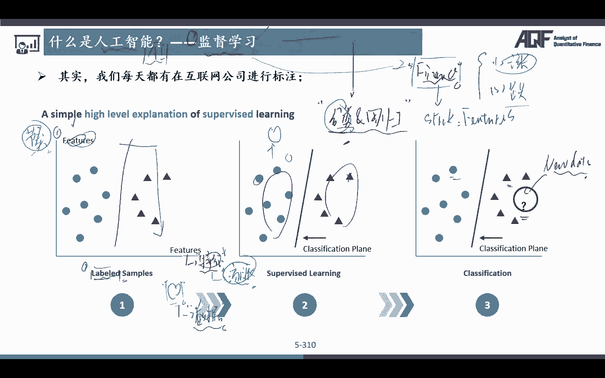

我这里的监督学习，无监督学习，包括我这里的深度学习没问题吧，好，那么接下来我们就正式来带着大家来看一下，我们这个里面的一些应用场景，PTT这里的应用场景那有非常非常多啊，那比如说我们前面跟大家提到过的。

BSM的这个定价模型，对不对，将来你可能压根都不用学BSM模型型的，那个非常复杂的公式了，只要我们会深度学习的这些方法，你给我一些input，我可以自动的给你去做我们的一些output对吧。

那么呃think tag呢，非常啊，目前非常火的流行的一个领域的话，那就是呃algorithm matic training，这是我们的一个算法交易，对不对好，那么其实现在的话呢还有很多的一些应用方法。

比如说我们的一些加强研究啊，这些就是我们的一些智能研究，智能的一些比如说原来的那些研究报告啊，都是让我们分析师去写撰写的，对现在的话呢专门有这种研报的这种撰写的，自动分析，自动的那些机器人。

有了这些机器人之后，当他们就会自动去市场上来，去帮助我们完成这些研究报告的那些书写的吧，包括数据处理，这是比较常见的一些应用场景了，还有一个的话呢，就是我们的一个客户的那种信用的啊。

违约风险的一个分析对吧，那么我们前面说过，我们可以去发现那些违约风险的客户，背后有什么个人的特点，那些没有不会违约的那个客户啊，他背背后有什么自然的一些规律，当我们有一个新的客户来的时候。

他自己通过算法，我们就可以知道，我这个人违约的概率大概是多少，对不对，所以大家会发现，现在有很多这种诶，这个快速贷款的那些啊机构啊，对他们来说，它其实背后都是这一套的算法来支撑他们。

因为当我们会发现你注册完了之后对吧，你调提一个手机的那些信息以后，他可以立刻去测算出来啊，我可以我会不会借给你钱，我借给你钱的话，你的额度是多少，在那他这一套背后支撑的一个很多。

都是我们前面跟大家提到的，无监督学习的这一套算法，那么包括我们的一些市场的预测，市场的一些交易的那些分析对吧，这而且这些应用场景啊啊等等，只是在FINTECH领域，如果说我们学会了呃，机器学习啊。

人工智能这些你完全可以不用，不仅仅限于呃我们的一些FINTECH领域，你可以去到我们的一些business business，商业环境上的这些应用，包括我们的数据处理，因为在我们AKF里面。

我们主要会跟大家讲金融数据如何去分析，如何去处理，那么那你这一套的方法论学完了之后，其实那商业数据如何处理也是一样的了对吧，我如何去分析数据和数据之间的关系，那么呃它背后有哪哪些共同变量。

影响着他等等等等，这些其实你都可以进一步的一个拓展，所以AKFR还是一个面向未来的这样的一个，对我们的分析师呃，除了你要掌握金融知识以外，你可能要更多的那些it知识啊，这些知识所以跟他提供啊。

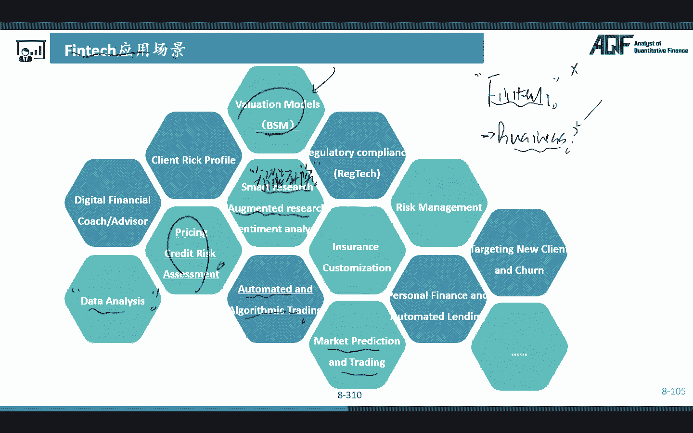

给到了大家一个更高的一个难度的一个要求啊，那么大家可以看啊，在这个里面我们又举了很多我们的FINTECH，可以应用的一些场景，比如说人工智能应用于金融，那这张图啊，是我们自己找的一张比较搞笑的一张图哈。

我们自己放了一条狗狗在那里对吧，但这张图的原图啊，这个因为呃大家可能也见过，他是原来是高盛的一个，非常非常大的一个交易厅，交易大厅里面呢可能原来有数百个trader，有数百个交易员在那进行交易，对吧。

好但是的话呢这一个交易大厅啊，现在来看的话，那已经没有人了，对不对，那他在这个家交易大厅当中，放的全都是那些中央的那些处理器，也就是说原来交易的那些过程，已经通通通过我们那个算法来去完成了。

这样一个自动化的一个什么诶，自动化的一个交易，对不对，好，那么为什么还会有一条狗狗呢，他说呃，呃这个这个看我们还是需要呃，一些人来去这个这个呃，看着这些服务器不被人偷了对吧。

所以来看这些服务器的压根可能都可以不用人，哎我们放放几条狗狗，在那看着那些服务器就行了，所以呃以后啊，这个交易员的那些职能其实可能都会完全丧失，对那这个其实就是对我们金融的一些冲击，那呃我们在难看。

在这个里面，比如说我们市场上非常有名的一些金融机构，radio的那个桥水公司，GOLDMAN萨克斯啊，包括等等，其他很多非非常多的一些公司，他们都在往量化。

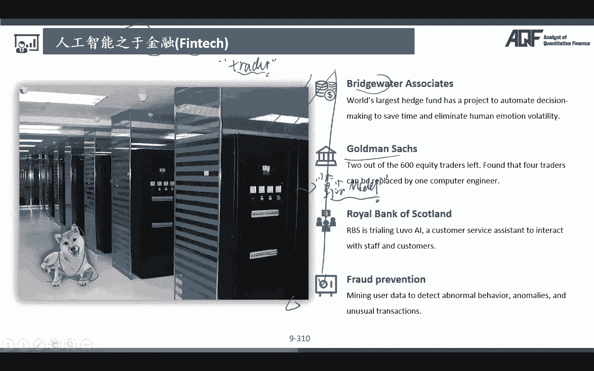

往FTK这一块来去转型啊，那么black rock啊，这些其实都是很有名的对吧，那么在这里啊我想跟大家提到一家公司，这家公司的话呢叫做NUMERA，尼泊尔，大家可以自己搜一下啊，这个公司非常有意思。

他呢本质上来说是一个什么呢，他是一个对冲基金呃，但是呢这个对冲基金啊，它向全球的那些engineer啊，他向全球的那些工程师来去征求，或者说啊来去索索要他们的那些算法，那么各种各样的全球的那个分析师啊。

他会这个这个对冲基金啊，他会给你数据，他会给你input，只要你有一个算法，这个算法产生的output，跟它最终的那个结果相对来说是比较接近的，或者说你的准确率hit ratio啊。

你的那个准确率胜率可以达到百分之多少，多少以上的话，当然你的这个胜率越高，你这个模型就越厉害，对不对，那么呃，很多全球的很多工程师，都会去上传他自己的那个算法，然后的话呢上传到这个啊。

对称numeral i那个网站之后，他会去看你这个算法最终的那个预测结果，如果说你预测的这个结果真的非常好的话，呃他就会拿着你的这个算法，然后呢直接去在市场上去做quantative trading。

对吧，直接去做量化交易，而且那你说我那我把算法提交给你了。

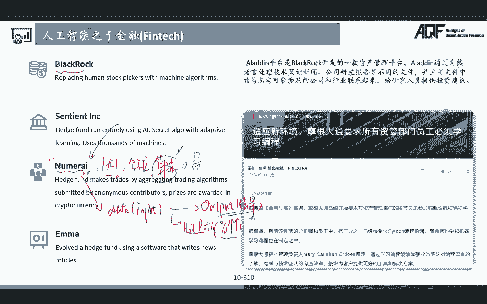

你去做量化交易，我有什么一个好处啊，那很简单。

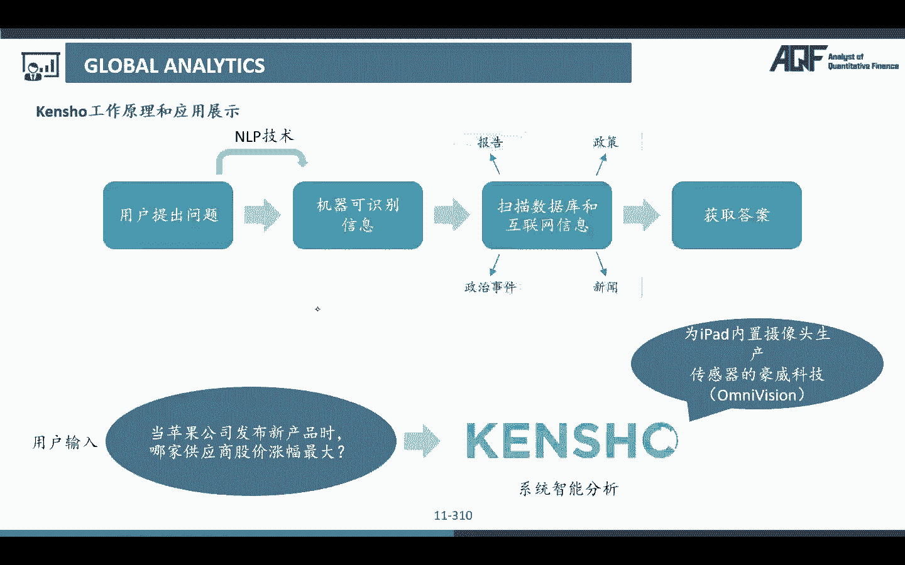

做了这个量化交易之后啊，你是可以拿到这个量化交易的那个分成的，它有一定比例的这样的一个分成，而且这个分成人家直直接是给你的是bitcoin对吧，比特币，所以等我们将来啊，可能我们要能赚钱，不是依靠的是。

你有多么多么强大的对金融的一个理解，你的一个金融知识可能更强多，更多强调的是你有没有这一套算法，这一套算法可以帮助我们更好的去做market，predict对吧，市场预测。

所以这是一个金融正在不断地发生改变的。

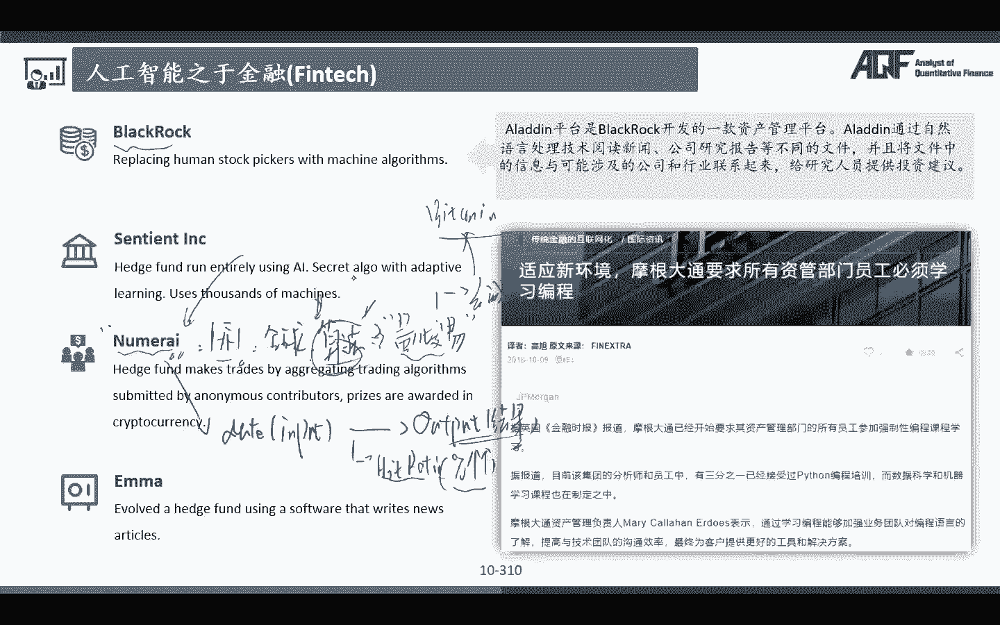

这样的一个真实的一个市场环境对吧，哎那么额再比如说啊，有一家啊有一个公司叫做田寿对吧，那么这是一套算法啦，这个算法非常非常有名啊，这个方法呃最近是被那个这个这个标普啊，标普集成呃，这个几百亿的美金啊。

把它给收购掉了，那么can show它是个什么东西呢，它其实就是一套算法，那么cancel的一套算法，它为什么能卖那么贵呢，很简单，它是一个可以全市场去爬取数据的，这样的一套算法。

也就是说啊你可以问can受各种各样的问题，他问了一个问题之后啊，他会去市场上去找各种各样的那些数据，就是第一步啊，就是用户会提出一个问题，提出那些问题之后啊，机器就会去市场上扫描海量的那些信息啊。

可以是报告，可以是研究报告，可以是policy，可以是事件，可以是news对吧，完了之后的话呢，他通过我们前面跟大家讲的深度学习也好，各种各样的算法也好，他就会给到你一个什么。

给到你一个很好的这样一个答案，所以control背后也是人工智能AI的背后的那个算法，这也是为什么我们在讲这些应用之前，一上来先跟大家讲的是，我们人工智能里面最主流的，最主要的这三个算法对吧。

比如说我们来举一个呃经典的一个例子，当年英国脱欧的时候啊，这个脱欧呃，这个当时是一个黑天鹅事件对吧，大家都以为英国会留在那个欧盟啊，英国，但是公投结果大家脱欧，这是一个非常嗯。

很多人都没有测算到的一个黑天鹅事件，好完了之后的话呢，市场上就有人去问侃瘦了，他说哎can show啊，呃就这你来预测一下，那英国现在要脱欧了，未来的资本市场会有一个什么样的一个变化，然后的话呢。

哎control就去市场搜集各种各样的数据对吧，然后呢他就做了各种各样的预测，他说英镑会怎么走啊，我额汇率会怎么走啊，达来资产会怎么走啊，他会更有多少比例的上涨，下跌的可能性啊等等等等。

做了各种各样的预测，然后呢坎设一站封神就在这里，因为他拿了那个数据做了大部分的预测，我们事后来看，他的很多绝大部分预测都是准确的，所以啊对我们说现在也有专门有人问啊，肯瘦啊。

你觉得一下是特朗普能这个继续当选总统啊，还是拜登能赢对吧，这其实都是这样的一套背后的这样的一个思路，背后其实都是在说哎，最终我们通过大量那个数据，通过这个非常强的这个算法以后，我们大概就可以知道说。

哎我最终的那个结果是什么对吧，哎，它背后应用到的就是那个人工智能的那个思想，非常非常强啊，再比如说在这里我们举了一个例子，就是哪家苹果供应商的这个涨股票，价格涨幅会最大对吧，他就会告诉你是哪一家。

呵呵很很强大啊，哈当然了，这么强大，它背后的一个呃局限就是他每次计算一次啊，他都要消耗大量的电力啊，这些，成本因为他要全市场去爬对吧，而且他的算法非常非常庞大。

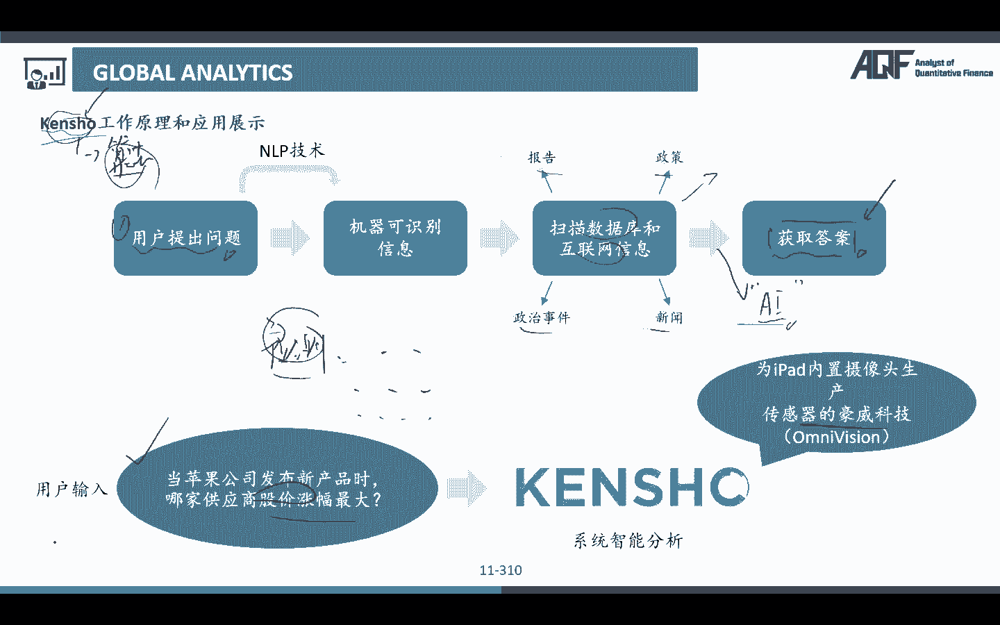

要非常非常大的那个算力来去支撑它啊，这是它的一个点好，那么嗯前面我们提到了，我们的人工智能还可以应用于我们的一些呃，媒体的那些研究对吧，那因为大家会发现现在很多人做做营销都会用。

请一些新媒体的那些编辑对吧，每天来去做大量的这样的一个洗稿啊，写稿啊等等等等这样的一些工作，包括我们的券商，我们的研究员里面啊，我们也会要去说呃，每段时间都要发布大量的那个研究报告，对不对。

所以这个研究员的考核KPI之一，肯定就是一个研报或者这些东西的，但我们会发现啊，有了人工智能以后啊，只要你给他一个主题，这些研究啊，这些研究报告，新媒体的那些文章等等等等，它都可以自动生成。

比如说在这个里面应用场景，研究报告的自动编写新闻的，自动编写新媒体内容的自动生成，交易营权的监控等等等等，有很多，那大家有没有这样一个感觉啊，就是诶我们一个比赛赛事结束之后，可能结束的那一秒。

或者就下一秒或者一秒还没到的那个时间，很多文章都已经出来了，然后再比如说我们呃今天当天收盘，刚刚收盘的那一秒钟，一秒钟之内啊，可能很短的一个时间之内，唉当天所有市场的那些情况，唉。

那些文章那些点评也全都已经出来了，那这个时候你会发现，这很难相信这是人在短这么短期的时间内，你们是不是完成的，那有些人说他已经大概都写好了，最后再只是发一发，那其实你会发现他很多数据信息都用到了。

最后一秒的那些信息对吧，所以啊其实我们会发现，但在当前市场上很大一部分我没说全部啊，已经有相当比例的那些文章，那些新闻，那些报告都已经不是通过人来编写的了，都已经是通过我们的算法。

这个这个自动来去生成的对吧，那么在我们这个里面有一家公司，这家公司的话呢叫这个对吧，这个这个公司的话呢你可以额了解一下啊。

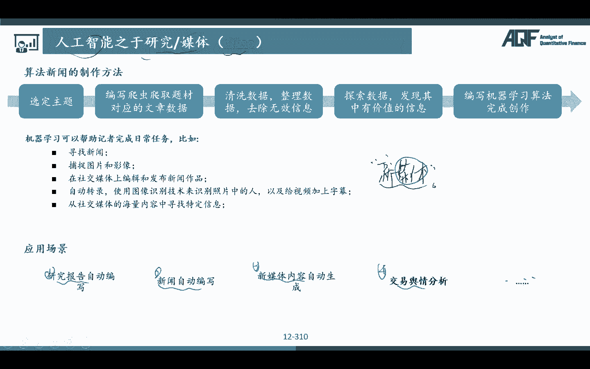

这个无所谓啊，这个呃我们在这个里面，其实就是他是一个写作机器人对吧，那我在啊这里其实已经开好了一个啊，那么对于这个写作机器人来说的话呢，嗯比如说你给他一个选题，比如说美国大选。

然后呢他就可以在短短的时间里面，他给你挑选出非常非写出，非常非常多的那些文章啊，那对我们来说的话，那你可能只需要这个，看看有没有你感兴趣的对吧，然后你就自己在那啊。

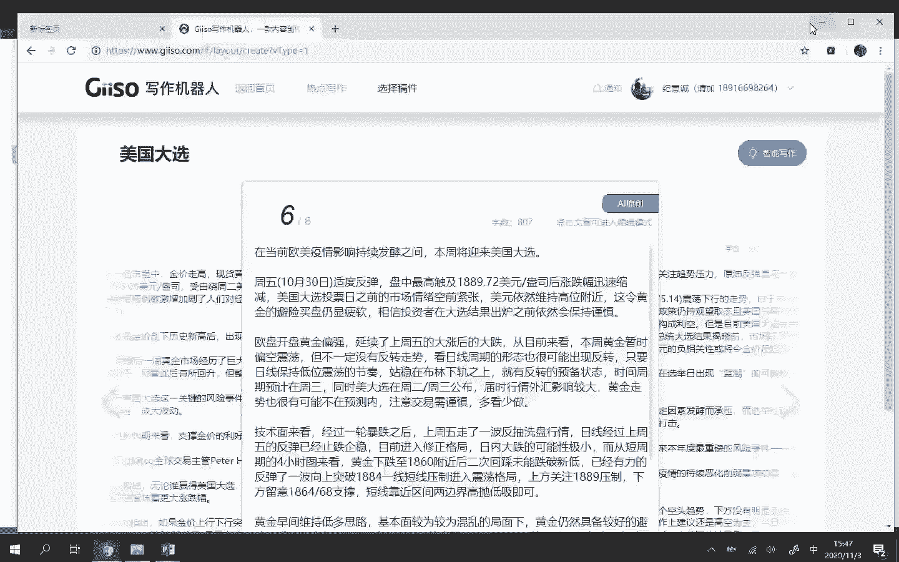

这个这个加一加哈哈，这个做做做做删减啊，其实就可以了，那这个就是未来的一些发展趋势啊，很多人可能都会面临被我们的算法，这种替代也好，这些呃这个这个这个过程都已经在发生了，对吧好，那么在这个里面啊。

比如说我们在这里用了一个机器学习的这样一，个写作的一个模板分析，通过我们的一个机器学习，你会发现啊，他的代码也不是特别复杂啊，就是比如说我要做每天的收盘的一个统计。

那么这个代码你就可以先写好今天是什么日期，一共有多少只股票涨停，当然这些股票的涨停我们可以通过一些呃API，然后去找一些数据去访问一些接口，那么这些接口的读取数据速度都是很快的。

那么我们只要写好这样的一个模板，然后的话呢等一收盘的那一秒钟，我们就去问我们的这个API的这个接口去拿数据，拿到这个数据之后，就放在我这个模板里面，然后就可以实现在非常非常短的时间里面。

是不是有一篇非常完整的这样的一个这种呃，分析的是点评报告就出来了对吧。

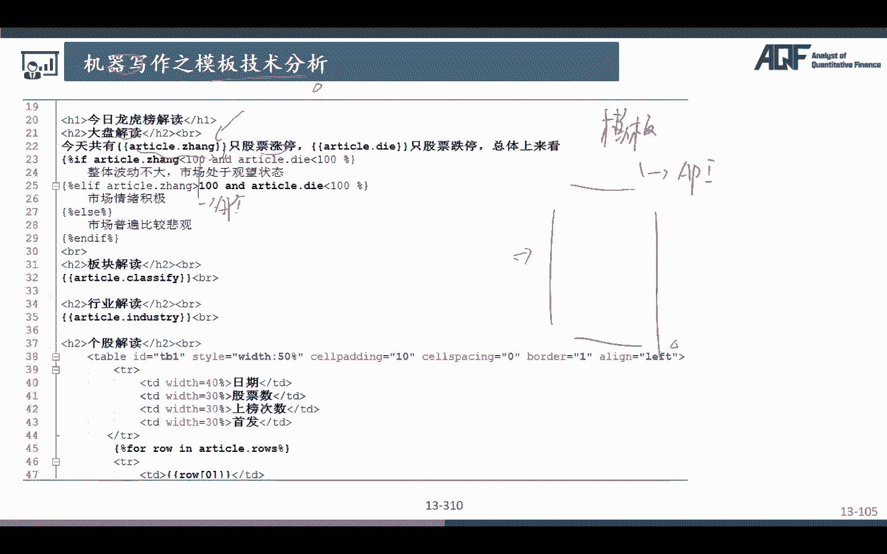

所以在这个里面啊，只是跟大家做了一个模板式的这样一个分析，那么当然Python跟excel相结合也是非常非常强大啊，Python现在可以跟excel来去进行很多的啊通信，我们会发现在excel里面。

原来我们可能一个功能啊，我们要写大量的一个公式，好几行的一个公式，可能这个公式写的只有你能看得懂，才能实现某一个功能，但是如果说你可以跟Python相结合的话呢，这个时候你就会发现。

我们通过Python就可以很容易的去实现，excel里面的非常大量的一些重复性的一些工作，比如说啊我们想如果这个可能是额债券研究员，可能比较有感触啊，因为我们可能要实时去爬，爬取债券的一个报价分析。

我们要呃不断的重复去打开中债券的网站，选券日期修改查询等等等等，那其实这个过程的话，那我们可以通过Python自动化的，就可以高效去处理这样的一些数据，对吧，咳咳，这个过程我们都可以让它变成。

自动化的一个过程，包括去进行数据分析，审计底稿的那些自动化的处理都可以使用Python啊，所以像审计后面后面还会有啊。

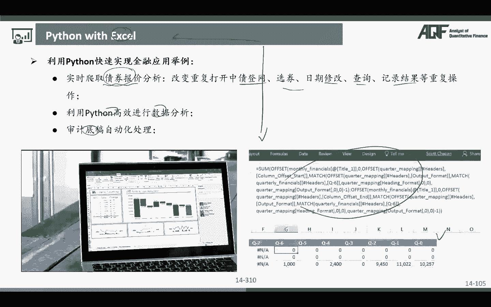

就是啊跟我们的那个这个德勤啊，他的那些审计机器人对吧，当然人工智能也可以应用法律，这JKPMORGAN啊，他就用了一个他的一个法律机器人，然后呢，在数秒之内就完成了一个律师，要工作这么多时间才能完成的。

这样的一个审核的这些动动工作啊。

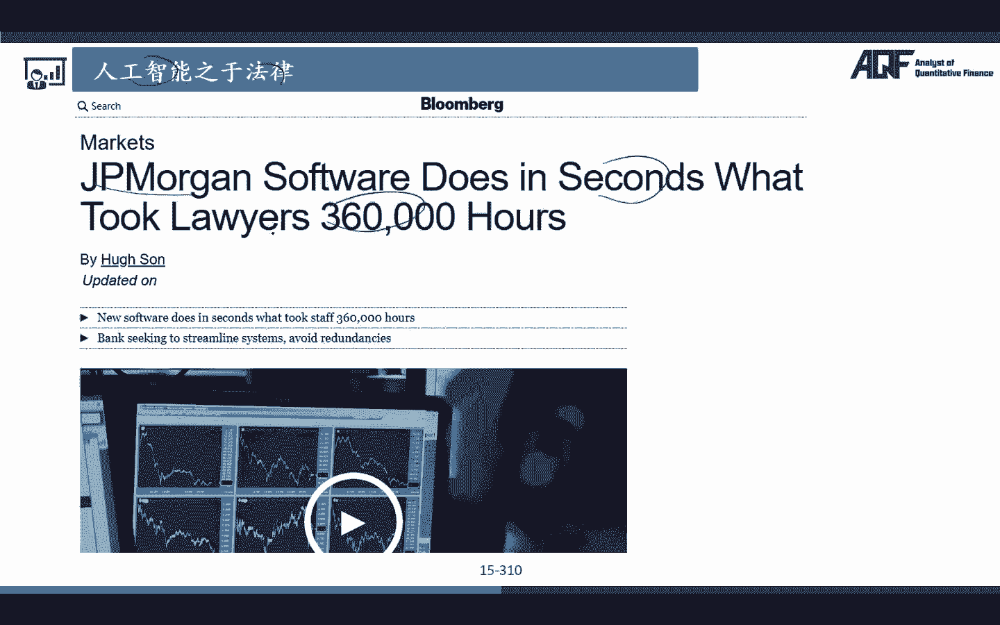

咳那么还有人工智能之于我这个里面的政治，这个的话呢就是在2016年啊，川普当选的时候，很这家公司啊就被呃弄到了风口浪尖，这个叫做啊剑桥分析公司对吧，那么剑桥分析公司他做了一件什么事情呢。

剑桥分析公司他就去获得了FACEBOOK的那些数据，FACEBOOK上有大量的美国的那些这个这个用户对不对，那么他就分析了FACEBOOK的那些数据，那些用户的数据之后啊，他就大概可以知道这些用户。

他对某些policy政策的那些偏好，哎比如说我是喜呃，我是反堕胎的，或者说我是干嘛的，然后的话呢他都可以大致知道我的这些嗯，这个这个嗯用户他具体对，因为你可以看他过去对什么文章点了赞对吧。

对什么文章转发了，或者说他抨击了什么样的一些观点，所以他的那些policy啊，他的那些偏好其实都可以被算法预测出来，所以被算法预测出来之后的话呢，它就可以利用这个算法，给这些不同的用户做个性化的推荐。

就是咳咳，什么叫做个性化的一个推荐呢，就是我看你这个用户他偏好的是什么，然后呢他就跟你说，哎，trump的哪哪一条政策，正好跟你想偏好的这个风险政呃，跟你所偏好的这个政策正好有什么不谋而合。

所以我们会发现很多用户就会发现呃，他们创普的那些政策啊，都是他们想这个这个想要去实施或者执行的，那些政策，所以很多人最终都把票投给了trump，也是当年出了一个不大不小的这样一个，黑天鹅的那个事件对吧。

所以这些其实都已经，发生在我们的生活过程当中，诶，那么还有一个的话，那就是人工智能用于我们的一些艺术啊，大家可以看啊，这张图是这个这个AI画的一张图，我觉得哎画的也蛮好的的哈哈，你跟我说。

你要是跟我说这是哪一个名家画的话，我没有不没有败类的怀疑对吧，那右边的那个是日本的一个作者啊，他写的一个算法也是一个艺术的一个算法，他说只要你给他一个照片，它可以在非常短的那个时间内啊。

就可以把照片处理成类似于这种水墨画的那种，艺术化的那个形态对吧，它是基于google的这样的一个，讲公开平台的一个算法啊，你可以登录这个他那个算呃，这个平台就可以调用他的那个算法。

来去绘制你自己的这样的一个水彩，画的一个图片，画的他的那个效果图还是蛮好的，我自己用了我自己的一张照片画了一下呃，这个好像有点不太尽如人意，他可能人人像啊，就不太好去识别成龙这种啊水彩画的那些效果。

你可能放一些风景画，水彩画可能就会呃更好啊，所以将来的话呢这种艺术啊，短时间之内哎网上还有很多的这种算法，如果大家看到过，就是你随便给他一幅画，他就给你，他就会让他变成比如说类似梵高风格的。

类似谁谁谁哪位名家风格的对吧，非常不错啊，这个这些算法背后的那些点好，那么前面我们给大家介绍了各种各样的那个呃，FINTECH的那些应用场景，对不对好，那么接下来我要跟大家讲的是，作为我们一个有情操。

有有有有节操，有情怀的这样一个证书的一个培训，那么我们如何去呃，应对人工智能对我们的一个冲击呢，嗯这是非常重要的啊，在新世纪的这样的一个发展过程当中，我们如何去做到，这个AI对我们的这样的一些冲击。

或者说呃就算你的工作还不太呃，会直接受到AI的冲击，如何提升我们自己的自身的那个竞争能力呢，呃我在这里跟大家提到了三种方法啊，当然在我们这个里面，首先我先跟大家，我想先跟大家分享一下。

未来什么样的一个职位更容易被替代，这应该是李开复教授啊，他自他绘制的一张图啊，我是直接拿过来用的，那么在我们这个里面的话呢，他他把所有的工作分成了这样两个维度，第一个维度的话呢。

这个工作更主要的依靠的是sentiment，需不需要人的感情的投入，是不是还是绝大多数都是这种蛮扭的，不需要那些感谢的投入的，我只要额动作重复这些动作就就行了对吧，这是一个维度，还有一个的话呢。

这个工作是重复性的还是创意性的，战略性的对吧，哎那么我们会发现在第一象限的那些工作，是最不容易被什么替代的，那么在第三象限的这些工作啊，是最容易被替代的，什么意思呢，比如说我们可以看到第三象限的工作。

就是既有大量的重复性工作的，又没有又不需要什么情感的那些投入的，比如说我们的银行的柜员，大家可能会有这样的一个感觉的，反正都是收钱拿钱收钱拿钱，股票的那些交易员买卖股票，反正都是一样的，买一样的卖嘛。

卡车司机，财务出纳，电话销售客服等等，包括分析师，分析师其实还好啦，他其实介于这个这个重复性和创意性的，那个边缘对吧，所以这个分析师倒还好啊，哈哈这个这个有些嗯，这个说有主动思考的那些分析师啊。

新财富的那种分析师其实也不用担心的，比较害怕的就是那些呃，随我也只是重复性的写写那些文章对吧，跟个简单更新一下啊，更多的就没有什么更多创意的，那这种分析就可能就比较危险了。

那么我又发现第一个象限里面的都是什么，要依靠情感，要依靠创意和战略才能获得成功的，比如说一些CEO，一些social啊，一些包括一些人际交往的那些，那其实第一个象限里面啊，其实只是不最不容易被替代了。

那第二个象限的话呢，其实也不太也还好啦，也不太容易被替代，因为只是说在这个象限里面，他的重工作可能稍微重复一些，但是也是需要对吧，sentiment有情感的，因为对我们来说，算法最大的一个问题就是。

它并不能给我们特别好的这种，这个感情的那些投入对吧，当然这个在日本也有很多的，这种什么什么老老人机器，老年人人机器人啊，什么女友机器人啊，他更多的也想去尝试说。

我可以给你那些sentiment的那个东西，当然这个到底结果如何，还是要去等待市场的那些验证，所以多玛说啊，如果特别是呃124象限期还好，如果特别是这个象限的，当然如我目前所处的这个工作是这个象限的。

那么大家就可以想想看我能不能往这个象限啊，至少往这个上限，或者往这个象限更多的去努力一下对吧，哎切记，如果一份工作就是非常无聊的啊。

每天都是重复起来，也不用任何的感情的投入的，那这种其实将来被替代可能就很高，那么怎么办呢，我在这里提到了三种方法，第一种方法你可以深入去做到某个行业里面的，行业领先的前5%甚至是1%。

也就是说大家可以看啊，这里是这个是BBC给我们的一个数据，他是这么说的，他说如果你是一个银行的bank clocks，底层的一个员工的话，因为你的工作大量是重复性的，没有任何的感情投入的。

所以你会发现你被替代的可能性是非常高的，他在这个里面写到了97%的被替代的，这样一个概率，对吧哈，Likely hold of automation，看到没有，但是只要你在这个领域啊，这个做大做强。

你做的特别特别的专业，比如说你升级到financial manager或者directors，你涉及到财务经理总监的这样一个职级的话，还是一样多，也是银行，也是金融，但是你会发现你被替代的一个可能性。

是不是只有7%了对吧，哎所以不太有不太可能会被替代，所以给我们一个指启示，就是不管各行各业，只要你在某一个行业做得好，做得强，做得深的话，你有一个你的核心技能，其实你不用担心被任何的东西替代。

只要你做得好，对不对，那么对我们金融行业的从业者，那怎么办呢，这这条路其实就跟大家说的是，你可以更多的去考一些CFA的证书啊，更多比如说什么国际的什么CPA啊，或者FM等等等等。

各种各样的顶尖的一个证书，让大家自己在金融行业里面走的加，做得更正更扎实，然后呢你拥有更丰富的那些专业技能，那么这样从普通员工到这里的manager的这个提升啊，对你来说。

你被替代的那个可能性啊就大幅下降了。

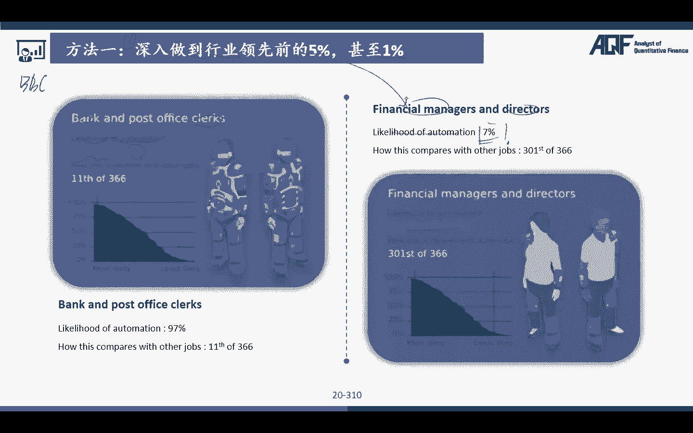

那么第二种方法是什么呢，第二种方法就是你可以在同时在两个领域，去做一个综合性人才，那么因为如果你只是一个领域的话，我要想要求的是，至少起码你要做到行业的前5%，甚至是1%吧，但是如果你同时精通两个行业。

或者两个领域的话，我们对你的要求就没有那么高，你可以同时做到两个领域的前20%，因为这样子的话，你就可以去打造你的一个综合性的一个人，才的一个点，比如说举个例子，大家在这里都是金融行业的从业者。

对不对好，那么你可以发挥你自己的一些核心技能，比如说你看看啊，像我们AQF的话呢，就是金融和量化和it的一个结合，所以你学了我们KY以后，你既会金融的那些知识，你又会了it的那些知识。

所以就算你将来不从事量化投资的那些工作，但是你至少了解量化的那种思想，数据分析的那种理念，那就可以帮助您在这个金融的行业的岗位上，做得更广吧对吧，再比如说你发现自己有很强的演讲技能。

那你会发现金融行业里面混的好的那些人，其实很多人都会有非常outstanding的那种speech，Deliver，a speech演讲的那种，这个主要能力对吧，他可以在数百人之前面前去点。

去讲好一个非常好的一个PPT，让大家去接受他的一个好好的一些思想，核心的那些主旨的那些思想，如果你有这个能力的话，唉在金融领域是不是也很能吃得开，当然后面有很多啊，比如说啊你可以这个CFA加CPA的。

金融加财务的对吧，在嗯如果你是做一级市场的话呢，你考个CFA，再有一个什么这个这个司法的那个证，包括跟风控啊等等等等啊，包括跟数据分析，你你会发现只要你有两个这个以上的领域，都能做到比较强的话。

那你的路其实可以走的非常非常宽，能理解意思吧，唉那就拿我自己本人来说好了，我的话呢金融反正教CFA是不是也交了快10年了，对这个这个啊，而且的话呢i it呃，我因为我本科学的是计算机对吧。

那现在的话呢除了我教CFA以外，我还讲量化啊等等的那些东西，所以计算机的这一块我也会同时的话呢，我也是做呃，我演讲也好，我做教育也好，我感觉我自己都还不错对吧，这个啊口碑啊各方面都还可以，那同时的话呢。

哎我又是一些诶公司的具体项目的一些负责人，CEO啊，这些东西，那么我们会去承担啊，还要去承担一些管理啊，销售啊，营销啊这方面的一些职能，那其实对我来说，我压根不用担心。

我一点都不担心我可能被什么AI替代，或者怎么样的一些点，因为我们是这种的综合性的那些素质的，这样一些这个人，你可以多修一些，你觉得自己比较感兴趣的这样的点对吧，因为原来我们都说我们要追求的是T型人才。

现在可能我们要求的是派型人才对吧，至少你还有两条腿，在你的第一条腿以外啊，你可以再打造一条腿对吧，当然这条腿不一定是正儿八经的专业的啊，你可以是你的激情，你可以是你的呃。

自己喜好的那些方面其实都可以对吧，哎所以我们跟大家推荐的第二条方法，就是你要掌握的是一个综合型人才，那么在这里啊，我们是跟大家提到了，这里的这样一些岗位的一些招聘，你会发现我们在这里啊。

沟通找的是金融行业的岗位，但金融行业的岗位，你看第一条路就是你要有CFA，c pa这些东西吧，就是扎深扎实，第二条路的话呢，你就要会这里的什么MATLAB啊，java Python啊。

这些东西看到没有哎，包括很多的岗位啊，都是要用Python，要用Python office的那些东西对吧，哎好那么其实还有一个第三条路啊，第三条路的话呢就是诶怎么说呢，在这里我们没写啊，想跟大家说的。

就是，你要学会去善于去使用各种各样的一些平台，善于去使用一些AI的那些平台，因为对我们来说，你不要呃就是让AI去代替我们的工作，或呃你可以是说用AI平台给我们赋能，去怎样去提升我们的一些工作效率也好啊。

去对我们的这些工作产生更多的，更好的有意义的那些变化，所以对大家来说啊，嗯善于运用AI平台可以分成几个层级，第一个你可以去看一下，目前不管你从事什么行业，目前有没有什么比较好的AI平台。

我们不是说呃呃你要开发这些平台吧，至少这些平台我们是不是自己要会用啊对吧，第二个的话呢，你可以学习一些这种各种各样的AI算法，从战略上从那个上啊，这个当然这些要求就比较高了，所以对我们来说啊。

我们想要跟大家说的是呃啊，不是这里不是负值哈，这个代码写多了就赋值了对吧，这个编程应该是赋能啊，所以段马说啊，第三条路的话呢，就是我们可以自己去看一下，AI到底能给我们的工作，你可以自己去思考一下。

他对我们的这个工作，可能会有什么样的一些帮助和提升，你自己主动的去这个拥抱他对吧，比你比他自己到时候来去替代我们，可能要好很多好，那么这里的话呢我们是跟大家介绍完了，我们的一些FTG的一些应用场景啊。

如何应对人工智能的一些冲击啊，那么接下来我们再简单跟大家介绍一下中国，包括海外目前的一些人工智能的一些市场，量化金融的一些市场啊，好那么这个是国内的一个具体的一个情况，我们可以来看一下。

其实啊08年就有很多啊，量化的那些交易了对吧，那么有一个数据啊，就是呃在美国市场当前来看啊，80%左右，70至少70~80的那些交易量volume嘛，全都不是人工产生的。

全都是我们的一些机器算法所产生的，所以算法交易或者说叫做量化交易，一定是将来的一个TD，一定是将来的一个趋势，可能这个趋势在当前的过程当中，会误会遇到各种各样的问题，因为我们国家目前所处的金融环境啊。

我们的一个金融的一个阶发展阶段，可能或多或少会对量化产生一定的限制，但是你不能怀疑，或者说不能去对量化这个技术产生一定的怀疑，因为我们可以看到海外市场的发展，都已经证明了这一切。

80%的交易量都是七八十的交易量，都是我们的一个量化贡献的对吧，但是呢这个量化在中国的一个问题是什么呢，比如说15年股灾以后啊，很多股票量化的股票的stock API，其实已经被监管封杀掉了。

现在很多的那种所谓的那些量化交易，其实更多的都是半自动化的量化交易，就是机器给我们发出一个信号，你要自己去员工去下单啊，这是对个人来说啊，机构其实还是可以实现变相的一些全自动化的，一些下单的嗯。

但是这是一些监管的一些问题啊，因为我们发现这个中国的那些量化的高端人才，还是太少了的，所以的话呢就是很多很多海外的那些算法的，那些这个高级算法的那些人啊，在中国随便写写代码。

其实就可以赚到好多好多钱对吧，当时就说是什么俄罗斯的，什么量化的那个团队对吧啊，给中国A股市场造成了大量的那个，这个下跌的那些影响，所以把股票的那个呃量化的那个接口，把它给分掉了。

那么在我们课上其实也不用担心啊，虽然股票的那些接口分掉，我们也会更多的啊，比如说期货啊，期货还可以啊，商品那些有我们也可，我们也会带着大家从一些啊，海外的那些交易平台上也可以啊。

这个类似实现我们这些股票的这种交易的，那些方法，所以对他来说的话呢，呃嗯现在其实还有一个点啊，量化在中国所遇到的一个困境，就是诶这个这个我们所用到的一些，量化的一些方法。

更多的是量化的一些基础性的那些方法，那么这些方法的话呢，就是大家研究的人多了啊，所以这个产生了这种测，我们把它叫做策略的strategy的那种拥挤，就大家都是要靠这个赚钱。

比如说大家都去研究某一个什么什么因子，你研究这个因子，我也研究这个因子，大家都去研究这个因子，这个因子很有可能就会失效，就是有些时候啊，某一个因子在某段时间里面可能特别有效，大家都发现了这个赚钱机会。

大家都用到这个里面来了，那市场人一多，是不是赚钱的这个这个效果啊，这个效率就会下降对吧，所以呢在我们这个里面啊，这个你会发现很多人诋毁说量化的交易策略，不太行啊，这个量化还不如我自己主动去做。

那更多的是我们目前所处的，或者说所拥有的那些量化的技术，还没达到海外的那些登峰造极的，很那些点赞，你你看啊，像那个嗯西蒙斯的那些大奖章啊，那个在暴跌的时候，其实他都能获得二三十%的。

非常好的这种超额收益，所以量化其实算法在市场上很多的传奇，都已经证明了，整个这个过程其实是OK的，只是我们的能力，我们的嗯这个这个研究的深度啊，还没有达到像海外那么发达的那个情况，但是没关系啊。

因为我们相信这是未来的一个发展趋势对吧，所以的话呢虽然嗯在中国啊。

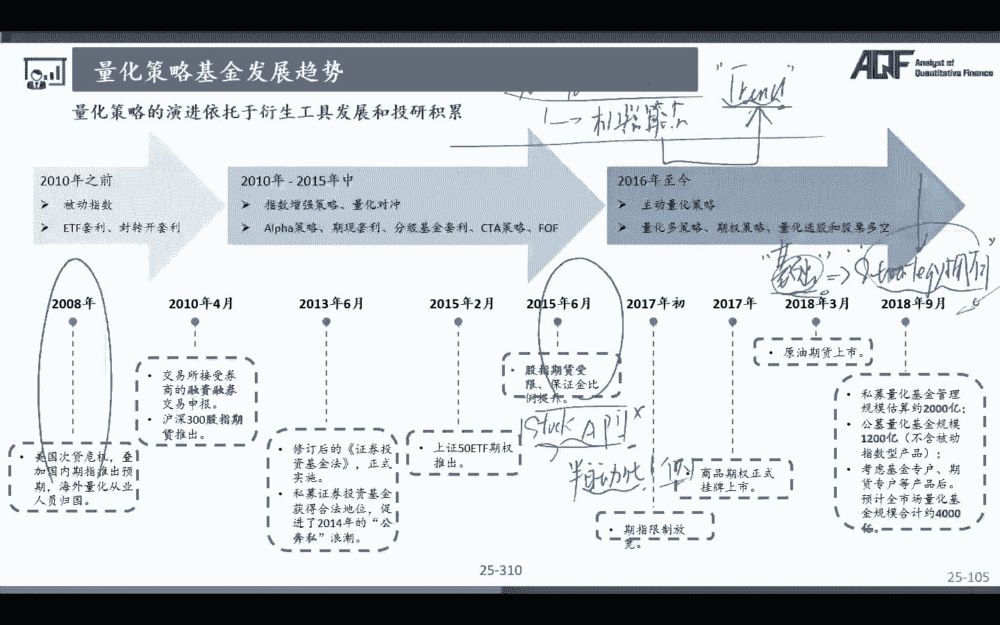

国内的发展磕磕绊绊，但是的话呢在海外的发展确实非常非常不错啊，那在这个里面的话呢，大家可以看啊，我在这里列了一些数据，这个数据是这样说的，他说截至2018年，全球对冲基金里面。

量化基金里面已经包揽了前六，也就是说前十大的对冲基金里面，前六个是不是都是我们的一个量化的，一个基金啊，那这个时候2004年的话呢，其实前九名全都是主动型基金，看到哈哈哎。

所以从海外最顶尖最能赚钱的那些对冲基金，其实通通已经往量化去什么经济转型了对吧。

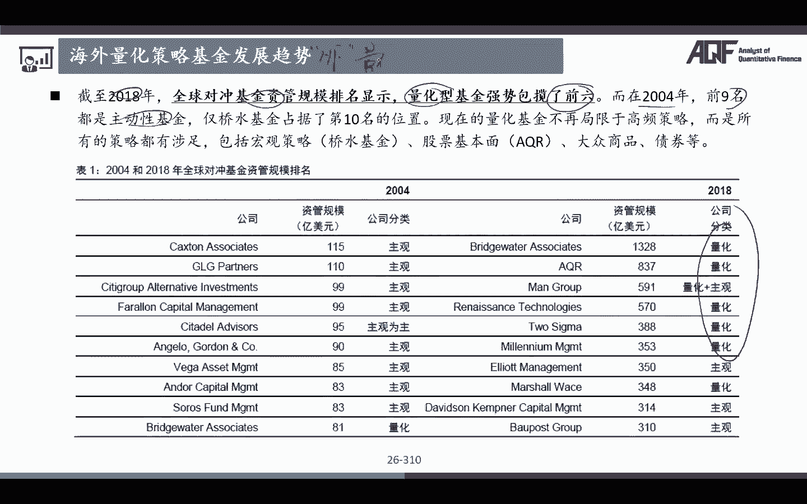

所以这一定是未来的一个发展方向，那么国内的话呢也陆续发布了一些对冲基金啊，有一些对，有一些基金基金公司发布了一些对冲基金，那么大家感兴趣可以看一下，那么这些基金公司啊，原来都是一些公募基金啊。

做的比较多对吧，哎，但是现在的话呢，就是为了满足不同的市场的一个呃需求啊，那些很大量的那些公基金公司啊，就推出了一些啊对冲基金，这个的话呢大家也可以看看，有一定的投币效应啊，那么国内的行业的话呢。

也呃呃这个这个发爆发了一些呃，爆爆炸式的一个增长啊，但是国内市场来看，私募的话呢，它的集中度呃相对来说仍然还是比较低，在这里啊我们统计了一下，不是我们统计啊，是这个这个啊券商啊，这个统计了一些啊。

国内比较靠前的一些私募量化当然都是量化啊，量化私募的一些这个这个规模营收，那比较有名的，像九坤啊对吧，我们很多学员还都是这个这个这些量化的，那些私募基金公司的啊，所以其实啊。

整个市场也是在慢慢发展的一个过程当中啊。

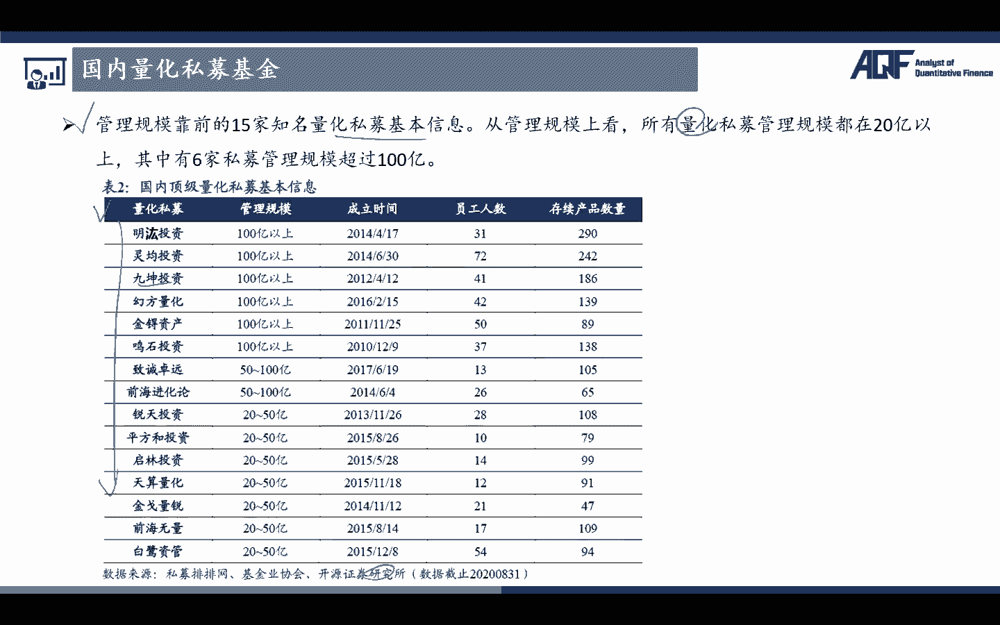

但是这一定是一个发展的一个趋势，那么最后的话呢我们跟大家提到了一些呃。

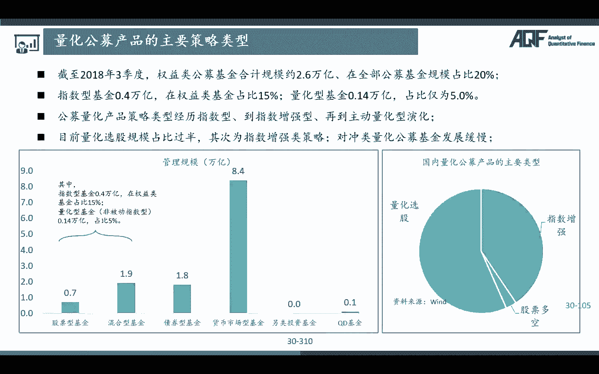

量化的公募产品和量化的私募产品，主要的一些策略类型，这些策略类型，可能大家现在还不知道是什么意思啊，但没关系，我们后面每一个策略都会来去跟大家讲，比如说我们有后面会跟大家讲统计套利的策略。

基于期权的策略，量化的多策略，CCTA就是一些期货合约的一些策略，多因子选股的策略，指数增强的策略，市场中线的策略对吧，那市场中性的策略，简单来说啊，我们后面都会去讲啊，就比如说我们通过多因子去获得。

我们的一个怎么样多因子，去获得我们的一个阿尔法，然后的话呢再加上呃，我们去做空我们的一个股指期货，做空我们的stock index，来去对吧，因为你想获得阿尔法，你肯定会产生贝塔。

然后的话呢产生了正贝塔，我们再去跟这里的负贝塔做空物质之后，就会产生负贝塔，两者相互抵消以后，我们就可以获得，剩下的就是这个因子下的这个阿尔法，那么在这个策略啊，为什么在中国市场占比那么高呢。

大家可以看啊，私募里面百占比50%，可能都是市场中性的这个策略呢，因为中国市场牛短怎么熊长，所以大盘的那个这个这个大盘的那个收益，我是想获得还是不想获得，不想获得大盘的那个收益对吧。

所以我就把大盘的那些风险啊，这个统统把它给对冲掉，所以这些策略啊，其实都是我们中国市场上常见的那些策略。

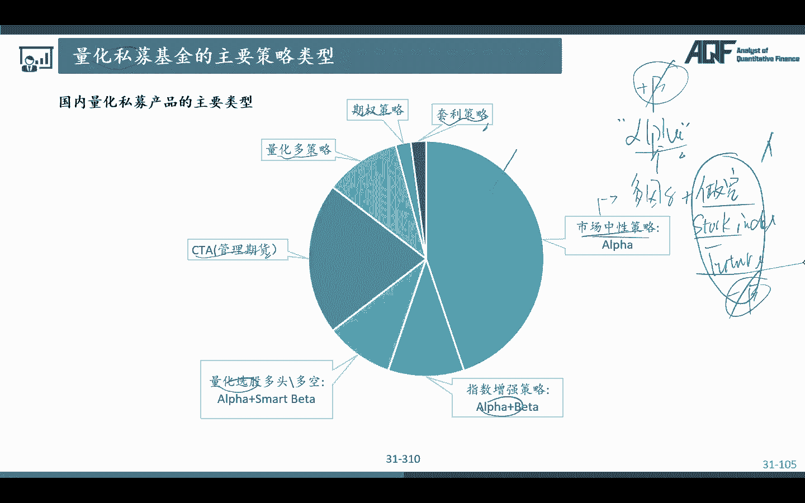

但啊不用担心啊，这些策略在我们后面跟大家讲的量化策略的。

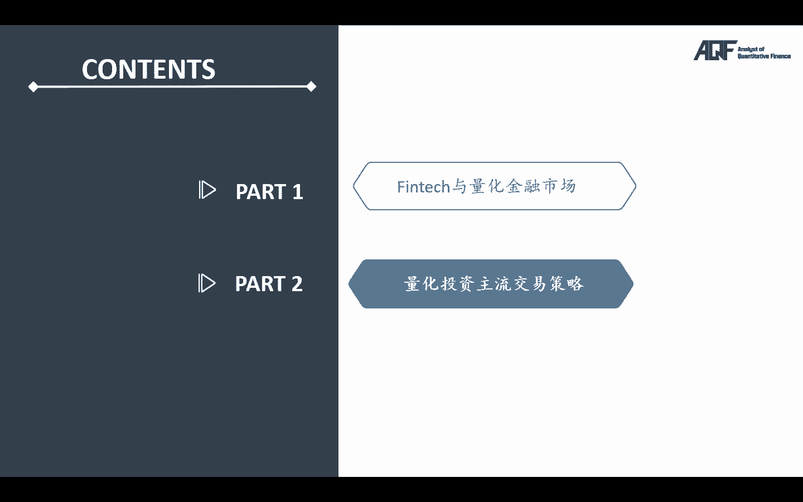

主流交易的交易策略里面都会跟大家提到啊，那公募产品更多的都是一些指数增强啊，什么叫做指数增强呢，比如说我想跟踪沪深300的指数，但是的话呢我呢通过一些量化的手段，然后我想我的目标是打败我的沪深300。

我在沪深300的基础上，得提升一定的这样的一个收益，没问题吧，这嗯其实是有非常大需求的一些啊，一个方面啊，就通过一些量化的一些，比如说我可以通过量化的一些因子，超配一些某一些股票。

那可能大家现在还不太能理解这些，什么是因子对吧，如何去实现超配啊，我们后面都会来去跟大家讲，所以很多啊，比如说跟原来的一些ETF跟踪的是某一个指数，对不对，那么现在也有通过一些量化的那些手段。

在这个指数的基础上，做一定的指数的一个收益是吧，增强以期获得比指数更高更稳定的那个收益，那么这是国内公募所主要的一些策略类型，当然啊因为公募他受到的限制比较多啊，不能使用衍生产品啊等等等等。

所以的话呢他能做的点不多，可能只能额外的提升，我被动投资的一些指数收益，但是对我们来说的话，不管是私募也好，公募也好，托马说一定是未来的一些发展趋势，所以学好量化的话呢。

可能呃为会为大家自己将来的那个职业。

金融行业的career pass，那个职业发展会提供一些比较好的一些机会好，那么第一个部分的话呢，我们就是从整体上带领大家介绍了一下FINTECH，与我们的一个量化市场，那么我们先跟大家介绍了一下。

FINTECH的一些主流应用，又跟大家介绍了一下作文，我们的AKF的量化这种综合性的那个人才，我们应如何去应对我们瞬息万变的这个市场，最后跟大家介绍了一下，我们整个国内外的一个市场的一个变化。

那其实整体来看啊，虽然发展过程当中有有有有崎岖对吧，从海外的市场来看都可以看到，这是一个非常好的一个发展的一个机会好，那么第一部分FINTECH与量化金融市场的那个介绍。

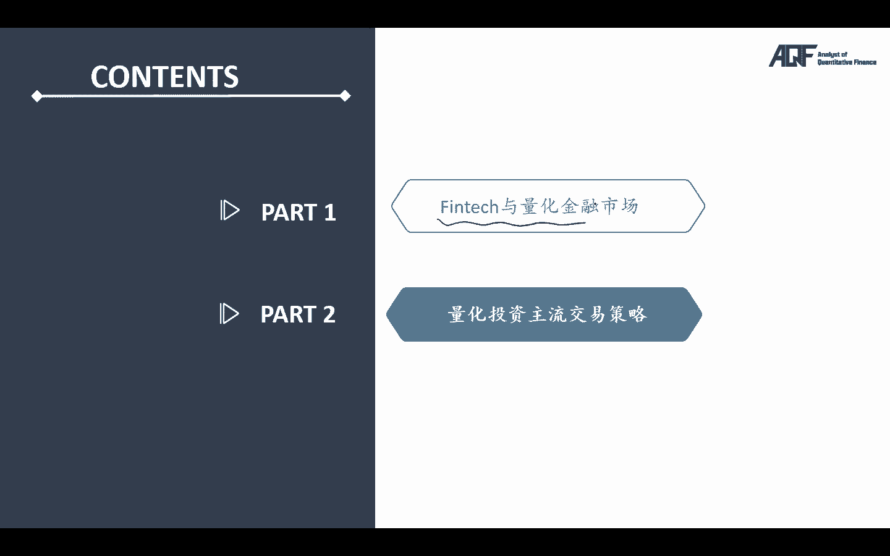

