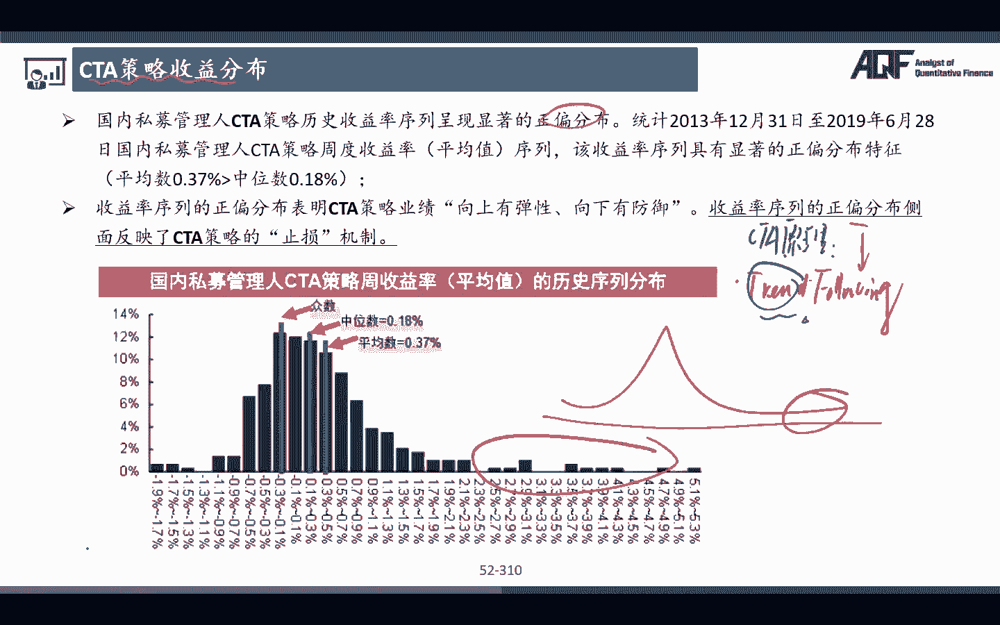
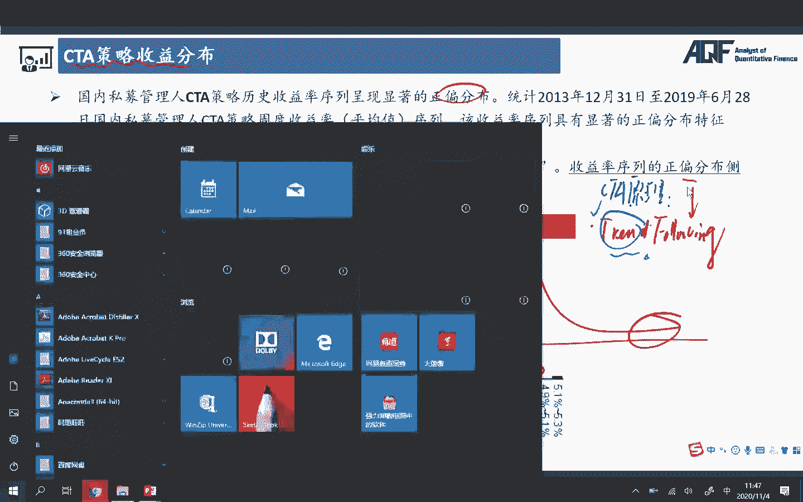

# 2024年金融大神老师讲解量化金融分析师.AQF—量化金融基础知识（完整版课程） - P17：《量化投资理论》06.5CTA量化交易策略1 - 量化沿前 - BV1ar421K7Mo

好，那么接下来的话呢，我们带大家来看我们这个里面的，CCTA的交易策略嗯，CCTA的全称啊，叫做什么commodity train advices对吧，这个什么商品交易顾问啊。

所以其实我们可以发现CPA更多的啊，是从我们的一个商品期货开始活跃在啊啊，这个活跃起来的，所以的话呢CCTA的这些策略的话呢，我们很多也会啊，比如说叫做什么啊，manage the futures对吧。

管理期货，那么本质上来说啊，他很多CCTA的这种交易策略，更多的使用的都是那些期货合约，来去进行这样的一个嗯交易，那么我们先来看一下CCTA的这样的一个市场啊，这个全球的这样一个规模。

所以全球规模的话呢是去巴克莱的那个对冲，HEATCH的那个统计啊，CCTA的那个历史规模的话呢，一直在这样的一个啊，比较快速的这样的一个增长对吧，那么对我们来说啊，CCTA的话。

因为它的投资方向不仅限于股债，而且交易方向可多可供，所以在市场呃08年金融危机的时候，它仍然保持了这样的一个稳定的一个增长对吧，哎所以后面其实我们可以跟大家讲啊，为什么我们要在我们的策略里面去加入一些。

CTA策略，或者说呃CCTA策略分别有些什么样的一个优势，那对我们来说在这个里面的话，那么其实就会发现哎，CCTA它可能会给我们产生一种叫做微积阿尔法，也就是说在市场大幅下跌的时候。

但是我们的呃这个CCTA的交易策略，其实表现的都还是呃，整体来看都还是非常不错的对吧，那嗯因为下跌没关系嘛对吧，我们额指投的不只是股债，而且就算我们的股票价格下跌了，那么我们还可以通过做空。

来去获得这样的一个收益，所以我们会发现在历年危机的时候啊，很多CCTA的那个策略，他的表现都是数一数二的对吧，嗯嗯这是一个方面的原因，还有一个方面后面会跟大家提到啊。

CDC策略跟其他的传统投资策略的相关性，相对来说都还是比较低的，所以在我们的perform6里面，如果能配一些CCTA的这个交易策略啊，那些基金也好，那些交易策略的话。

都会提升我们整体的这个performer的这样一个，App paration，对吧，唉好，这是一个我们全球的CTA的这样的一个数据，那么我们再来看一下对于我们来说啊，国内CCTA的这个市场啊。

一般来说的话呢就是分成呃这样两大类型呃，第一个的话呢就是我们的一个主观交易，第二个的话呢就是我们的一个呃，程序化的一个交易，那么复合策略就是都有啊对吧，哎那么主观交易的话呢依赖的是什么嘞。

这是啊不管是国内国外啊，都是这样的一个分类啊，那么主观交易的话指的是什么意思呢，就是我们依靠的是我们基金经理的，一些人为的一些判断，举些例子，比如说啊这个当然这个判断的话。

那又可以分成诶这样几个不同的类型对吧，趋势的追踪，然后的话呢我们的一个套利，第三个的话呢，我们的一个呃日内的这样的一个交易，那么简单来说啊，说一下什么叫做，依赖于我们的一些主观化判断啊。

呃比如说呃趋势追踪的话呢，就是当我们发现啊这个啊像比如说黑色，黑色系的那些大宗商品，有一些比较好的这种趋势性的行情的时候，那么我们作为交易员，我们可以看到哎很多技术指标都发生了公正，他可能要上涨。

所以的话呢我们交易员说，哎我们我们的基金经理说可以买入对吧，哎那么这种其实就是人为判断性的那种，趋势追踪对吧，那么人为判断的还有一种的话呢，包括很多也会来去做的。

就是哎比如说我们的一些event事件发生了以后，那么我们可能就会知道啊，利有对哪些大类资产，对于哪些商品合约我们是有利的，对于哪些合约我们是不利的，我们就可以同时做多做空这些呃合约，那么比如说举个例子。

我们之前哎说英国脱欧的时候对吧，哎那这是一个非常大的，当时的一个就咳咳全球性的一个事件，所以呢对我们来说，比如说我们知道嗯，这个英国投有利于哪些大类资产，那么我们的这些基金经理啊。

我们就可以分析一下对吧，完了之后呢，就通过同时做多做空这些资产就可以获得收益，那这种是依赖于人为的判断的这种交易策略，就像类似于这里的这种主观的策略对吧，那么在我们AKF里面。

我们肯定更注重的是类似于我们的第二块啊，就是我们的一个程序化的交易，神性化的教育的话呢，他的也有趋势追踪，也有套利，也有我们的一个日内的这种高频交易啊，那这些策略我们其实后面都会啊有所涉及，来跟大家讲。

那么对我们来说，趋势追踪的话呢，这个时候就不是基金经理自己判断了，那你可能是有一些signal，你自己编写了一些算法，这些算法给我们产生了这样的一个信号，这个信号告诉我们，我们要做多还是要怎样做空对吧。

所以这些其实都是程序化来进行投资的，那不依赖于人为的这种判断没问题吧，哎所以这个就是我们CCTA主要的策略，的两种类型啊，好那么接下来啊我们就再来看一下，从策略的角度上来分我们的CCTA策略啊。

比如说分成了趋势日内啊，逃离对吧，那更细分一点可以怎么分呢，那么我们可以来看到啊，这个首先第一个就是趋势追踪型的这种策略，第二种的话呢，就是我们一些套利型的一个策略对吧，但是在这里的话呢。

他没写一些我们的一些日内的高频的一些啊，那么不同的人啊，对这种CCTA的划分方法其实也是不同的啦，那么我们来看一下趋势追踪型的，这种策略的话呢，又分成了什么呢，又分成了日间追踪和日内追踪。

日内的趋势最终就是更高频的一个，所以他其实是把高频的那些啊，放在我趋势追踪的这个里面对吧，所以不同人的分类方法啊，其实都都可以啊，那么日间的追踪的话呢，它的频率就是就稍微那个，第一点。

日内的话呢它的频率稍微来说就会高一些，日间追踪的话呢，比如说ABBERATION啊，这种长线策略，均线策略这种其实就很多了啊，这个用了很多对吧，均线策略金叉买死叉卖对吧，那么日内趋势的话呢。

比如说像dural trust啊，像ATRATR的话呢，是跟那个我们的那个海龟有关的，那个呃交易策略，那么其实呃这个策这些策略的话呢，在我们后面呃跟大家讲量化投资呃，基于一些平台啊。

比如说我们课程上会基于一些优矿平台，或者其他的一些平台，在这些平台上，我们都会带着大家把我们的这些策略啊，进行一定的这样的一个实现，所以对我们来说，到时候大家就会嗯有一个比较好的一个掌握了。

那么额在后面的话呢，我们也会跟大家介绍我们的一个duro trust，那么阿break的话呢，其实很多这些日内的那些趋势追踪的那些啊，策略相对来说都比较接近。

我们后面就以啊dure trust来跟大家举个例子，其他的话呢大家可以这个感兴趣啊，你可以再自己看一下对吧，那么套利策略的话呢就分成了期限套利，跨期套利，跨市场套利和跨品种套利，像跨市场套利呀。

跨品种套利啊，这种统计套利的那些啊，我们都已经跟大家讲过了对吧，还有一些期限套利，这种无风险的那种套利的方法，那么我们后面还会有对应的那种嗯，风险比较低的那种套利方法啊。

我们后面还会有啊对应的那个策略类型，来去跟大家说，呃所以的话呢CCTA策略的话呢主要大类啊，套利策略和趋势追踪这两个类型对吧，好，那么呃接下来的话呢，我们再来看一下，国内的CCTA的大体的一个概况啊。

这个了解一下就好了，那么它的规模对吧，占比嗯，截至呃他的那个整体的一个规模，大概是这么多对吧，那么后面的话呢就是不同的私募基金啊，他的那个呃程序的一个额比例，那像管理期货啊，CCTA的大概就在这里对吧。

那么他的那些额策略的那个表现啊，大家可以看到在股指期货恢复常态以后啊，那么我们CCTA的策略的收益，有了一个比较稳定的这样的一个提升，那么大家可以看到啊，在我们这个里面，2018年以来啊。

这个管理期货的嗯，这个所以写横额在我们这个里面啊，很明显是有一个比较超额的这样的一个回报的，对吧啊2018年以来，所以对我们来说，CCTA策略的相对来说表现特别稳健，而且我们前面也跟大家提到过了。

他有比较啊，好的那些危机产生的那些阿尔法对吧，所以我们还是值得来去做一下研究的，那么在这个里面啊，因为我们主要做的是CTA，它名称这叫做商品咨询的那个顾问对吧，商品交易的那个咨询顾问。

所以对我们来说的话呢，那么我们大致要了解一下我们国内市场，我们的一些流动性比较好的那些商品期货，那么啊在这个里面啊，他是列了一下2019年成交额排名啊，前面最高的像铁矿石啊，都很活跃的对吧，螺纹钢啊。

原油黄金啊，这些白银PTA啊，这些其实都是非常非常活跃的，这样的一个期货合约，那么成交量相对来说比较大的，螺纹钢啊，PTA啊，铁矿石啊对吧，豆粕啊，这些其实都还是额成交量是属于比较大的。

所以对我们来说的话呢，像这种啊，包括额我们自己在做编写CCTA交易策略的时候，我们也是要去挑选一些流动性比较好的，那些策略来呃，那些呃商品合约啊来进行我们的一个交易，因为我们其实前面给大家讲过。

如果说我们要去做日内，我们的一些高频的一些交易策略的话，如果说你的流动性比较低，那么它对我们的市场的这个Impact，冲击的那个影响就会非常大，那么这样的话呢，导致我们的策略的成本就会非常高。

所以很有可能你这个策略本身是赚钱的，但是的话呢你选在一些额，选了一些流动性特别差的那些合约啊，来去做的话，最终考虑成本以后，我们的那个收益就会呃，受到比较大的一个影响和限制。

所以在这个里面啊放了一页这个PPT，就是想跟大家说的是，如果我们以后要做CTA的这种高频策略的话，一定要去挑选，流动性相对来说比较好一点的品种，那么在这个里面啊。

我们是放了一个CCTA策略的这样一个收益分布，那么我们可以看到国内的那些CTA策略的，有显著的正片分布，什么叫做正片分布啊，就是获得极端怎么赚钱可能性的那些概率，是不是比较高一些对吧。

哎那么为什么这么为什么是这样子的呢，很简单，因为他跟我们的CCTA交易策略的那个原理啊，是有一个非常大的一个相关性的，CCTA策略有一个什么样的一个原理呢，它其实我们前面跟大家讲过。

策略里面最大的一块类型，是不是我们的一个td following啊，叫做趋势追踪，那么在我们CCTA里面，我们要做的就是如何去define这个trend，那么如果说你的啊能力越强。

那么你定义这个追踪的那个效果就越好，一旦你发现了市场上有一个比较好的。

这样的一个投资机会，那么。

我们就可以赶紧抓紧时间去进场对吧，然后做多也好，做空也好，那如果说我们看对了这个趋势的话，一旦我们进场了之后，真的这个趋势如我们所料，那么我们就做一个following的这样一个动作对吧，我们就不做。

就持有力持有合约，让利润奔跑对吧，那这样子的话呢，就可以获得一个非常高的这样的一个收益，那么对于我们来说，那万一如果我定义了这个train的这个趋势，发现诶我觉得它要涨，但是它没涨，那怎么办哇。

那么我们就及时怎么样哎，及时止损，那么这样的话呢是相对来说限制了我们一个，比较小的这样的一个损失，所以对我们来说，CCTA策略的一个特点就在于说要赚，我就可以赚很多钱，让利润奔跑，看准了对吧。

那如果说要亏的话呢，我都是小亏对吧，哎小亏大赚，那么这样子的话呢，我整个策略的那个最终的那个return啊，那他的那个收益就会有比较大的一个呃提升，大家可以看在我们这个里面是不是好多呃。

有频率非常高的这样的一些啊点，都可以获得了一个比较高的这样的一个嗯，嗯收益啊对吧，所以在此在这个里面啊，策略反映了CTA的这样一个止损机制，嗯所以如果到这个点大家能看明白的话，那其实大家伙就会发现了。

CCTA策略在什么情况下它就会非常有效呢，像2016年啊，这种我们有很强的这种商品的那种趋势的时候，那么我们定义了发现了这个趋势，马上就做一个船的following，那在这些年份啊。

像嗯我们的那些啊商品的那些合约，其实啊有非常好的这样的一个表现，但是如果说啊我整体的市场啊，我们都是波动非常大的，刚涨了又跌了，刚跌了又涨了，那这个时候刚涨了一点点，我刚定义了一个趋势，我们入场之后。

他开始转而下跌对吧，所以CCTA的这个策略很明显，在震荡时的时候，我们的表现，就会相对来说受到比较多的一些限制，所以呢这就给我们一个启示，就是我们在定义这个trend的时候，一定要尽量的去这个这个额。

降低我们的这种在震荡市当中，我们的这个呃震震荡市当中，我们的这样的一个买卖频率，因为如果是震荡势的话呢，刚买我们就跌了，刚卖我们就涨了对吧，所以对马来说，对我们策略的成本和对我们策略的绩效。

都会有很大的那个影响，所以大家可以在自己后续构建自己策略的时候，可以通过一些指标啊来去衡量一下诶，这个市场是什么样的一个市场，然后去做一些定的这种参数优化，那么这样的话呢，可以很好的去提升。

我们整个整个策略的那个收益，那这个我们在讲到具体后面的策略的执行，的时候，都来会跟大家说啊，不用担心好，那么在这一页，其实我们数据就不带大家看了啊，想跟大家说的就是我们CCTA的那个策略。

相对于跟其他的交易策略来看，他的相关系数是不是都是比较低的对吧，哎咳而且在我们这个里面，大家可以看到在传统的股债的portfolio里面，我们只要再加入30%的这样的一个ct，那么每年在平衡之后。

我们就会发现他的那个首先第一个它的绩效啊，它的SHAPARATI啊，都会得到一个非常大的一个提升，最大回撤会降低，波动率会降低，收益会提升，然后的话呢下普瑞社会提升看到没，所以这也是为什么。

我们说我们在我们的PORTFO6里面，会要去加入一些CCTA交易的strategy的，最主要的一个怎么样，原因对吧，哎好这也是我们为什么会在这个里面啊，花非常多的那个时间来去跟大家讲解CCTA好。

那么呃前面是大致介绍了一下，我们CCTA的整体的一个市场，它的一个特点，它的一个利润的来源，为什么它会有正片对吧，那么接下来的话呢我们会带着大家去啊，讲解几个经典的CCTA的策略啊。

比如说我们会跟大家讲operation的这种长线系统，dual trust那个系统，包括我们的那些交易系统，而且我们的系统在CCTA里面，我们写的代码都还挺多的啊。

包括CCTA策略还可以跟多因子策略结合在一起，当然现在大家可能还不会什么是多因子啊，等我们学完多因子之后，我们再来来回过头带着大家来看这里好，那么首先先来看第一大类型的策略，第一大类型的策略的话。

那我们把它叫做啊长线系统，而不是ATION的策略，这个策略大家呃，我们到时候会在我们的AKF的课程里面，会带给大家做一个完整的这样一个实现的啊，那么这个是这种策略的话呢。

它每一次啊产生的额这个频率都是非常低的，低频的啊，它是一不是一个日内高频的这样的一个，所以他是捕捉的是一个叫做长期的一个信号，所以我们把它叫做长线系统，听明白，那么这个策略的点的话呢就很简单。

我们可以通过计算过去N日，你可以自己去定啊，30天，60天，20天都可以，你可以去算这个呃，比如说某一个期货合约，在过去这一段时间的这样一个mean，它的一个均值是多少对吧，好完了之后的话呢。

我们再计算出这个策略啊，这个期货合约相对于这个均值的上轨，比如说1。5个标准差，下轨的话呢向下偏离1。5个啊，标准差当然你也可以是偏离一个啊，都可以，你自己可以自己去测算完了之后的话呢，他就说如果说啊。

我们的这个期货的合约的价格，在这个区间里面波动，我们不采取任何的开仓策略，但是一旦比如说我的这个期货的价格向上，突破了这里的1。5倍标准差，我们就在这里认为上涨趋势确立，那么上涨趋势确立。

因为我们做的就是趋势追踪嘛对吧，所以的话呢在我们这个里面我们就赶紧开多仓，如果说开了多仓之后啊，这个我的价资产的这个价格就真的一路狂飙，那么这个时候我们就获得了非常高的，CCTA的那个收入来源没问题吧。

当然了，一旦突破上轨之后，他转头下跌了，那比如说你可以呃，设定一个止损的一个条件对吧，下跌超过多少，我们就止损了，等待下一次这个交易信号给我们出发，那么同样的道理啊，如果说在我们这个里面。

它下跌突破了下轨的话呢，我们就认为这个时候空方的力量就非常强盛，空投效果却空头趋势确立，我们就认为这个它会进一步的下跌对吧，哎那么呃最终如果它一真的下跌的话，那我们就可以获得我们比较高的这样的一个。

什么收益来源，所以一旦趋势确立，我们就不轻易的去啊平仓，你可以再去设立，那有同学说这是我们的策略的退出，或者说策略的呃，这个这个我们如何实现一个，这里的这个策略的退出呢，退出的方法有很多啊。

那我们前面给大家提到过了，你要第一个如果方向看错的话，一定要及时止损对吧，第二个如果方向看对了，那么我们就不轻易炎帝，我就让利润奔跑，那么这个时候你就可以采用一种，我们后面在讲策略的时候。

也会跟大家讲啊，叫做移动止损的一种思路啊，你这个不能叫止损啊，叫做移动止盈的一个思路，什么意思，只要我的资产价格在不断的创新高，我就不止损，直到到创了新高之后，我往下回撤，比如说从最高点。

最大回撤达到10%或者百百分之多少之后，我就在这个地方止损，听明白吗，所以它其实是一个移动止损，动态止损的一个过程，它没有一个实时间确定的一个诶点，这个这个止损的一个点位，那这种移动止损的话呢。

其实是在我们趋势，TRANSFOLLOWING的这个过程当中用的最多的一个，因为只要有趋势，我们就啊把握这个趋势，不轻易言顶对吧，哎那么配合完说，如果真的比如说下跌超过了10%。

或者你自己可以去设定啊15%，那么我们就认为这个趋势可能短期来看，已经结束了，为了保住我们的这样的一个利润，我们就可以这个哎呀咳咳这个这个止盈了对吧，哎所以在我们这个里面啊，就是呃这样的一个过程。

那么呃这个不是指移动止止移了，这个叫做移动止盈对吧，哎所以嗯当然移动止损其实也是类似的，这样一个结论对吧，但是我们用的比较多的是这里的动态止盈，移动止盈止盈的这样的一个过程啊，那么在我们这个里面。

这种这种止盈方法就有一个好处，比如说我们在这个里面它只下跌了5%，没有触达我们的移动止盈的点，完了之后又掉头朝上，那么我仍然不触发止盈，下一个止盈的一个点就是距离这个高位，比如说在下跌个10%。

那么这个点是不是要比我们原来看的，假设到指这里这个点又高了对吧，所以他是这样一个移动的过程，它是一个动态的一个过程，那么这个ABBREANATION的这个策略，在我们这个AKF的后续课程当中。

就会带大家手把手的去实现这个交易的代码，也会有一个我们的一个回测结果，到时候大家可以来去看一下好，那么接下来啊我们再来看呃，第二大类型的我们的一个CCTA的这个策略。

第二大类型的这个CCTA的这个策略的话呢，它是一种叫做dual trust，一个策略，它是一种我们把它叫做日内，高频的一种交易策略，就是他的交易的频率啊，这是在日内就可以完成了对吧。

那么如果说在这日内的话呢，当天收盘结束，我们就直接结束了这个策略对吧，那他可能也会有止盈止损的那种方法啊，但是我们来看一下嗯，dual trust啊，它本身来说并没有一个比较明确的一个止损，但是注意了。

这个是这个策略的核心原理，那么我们跟大家讲的都是一些策略的核心原理，那么对马说啊，也会跟大家讲，如果你学了这些策略以后啊，包括我们写好了这些策略，写好了那些代码给到大家。

那么自大家自己可以在原来的这些策略，代码的基础上做一个改进，或者说做一个二次怎么样开发，那么这样的话呢，就可以使得我们的这个策略的performance吧，也就是说这个策略的绩效就会有一个更好的。

这样的一个提升了对吧，比如说啊，这个我们在这个里面先来跟大家讲一下啊，dual trust的一个原理的这样的一个嗯，就这个策略思路是什么，然后的话呢，我们再加入一些我们自己的一些改进措施啊。

当然这些改进措施只是想带给大家更多的一个，启发的这样的一个点啊，大家有了这些改进措施之后的话呢，这个以后不管什么样的这这些交易策略，大家都可以去用这些方法，咳咳那么我们来看一下啊。

这个呃duo trust，他是这个这个人，MICHAEL这个人搞的对吧，他是被被评为这个呃这个这个杂志，最赚钱的一个策略之一对吧好，那么我们来看一下啊，这个dior trust是用来干嘛的呢。

他是怎么样去做的一个点呢，那么它有比较多的不同的版本啊，我们来看一种，就是呃优优已经是优化好后的一个标准的，相对来说比较标准的一种个标准，那就这个它的一个定义啊，什么意思呢。

他说我们先定义一个range，定了一个range之后的话呢，当我将来啊，比如说啊比如说我先定好了这样一个range对吧，我们有一个range的一个上轨，我们也有一个range的一个什么下轨，对不对。

所以我们认为怎么样呢，当我们发现嗯，如果啊我们的这个资产的价格啊上涨了超过了，比如说我们今天的开盘价加一个K1K1，是我们的一个系数啊，乘以我们的一个这样一个range的话，那么就超过了我们的这个上轨。

我们认为上涨趋势确立，我们就怎么样，哎我们就买入，同样的道理，我们认为，如果说我们啊就这个跌破了这个下轨的话，那我们就认为我们下跌趋势的这个确立，我们就怎么样开始做空对吧，那么关键是我们如何来去设定。

计算出来了，这里的这个所谓的这里的这个上轨和下轨呢，大家可以来看这里啊，在我们这个里面，我们定义的这个range的话呢，他用的一种方法叫做，我们是取这两个当中的一个max，一个是HH减去LC。

还有一个是HC减去这样的一个LL对吧，什么意思啊，来看一下HH是过去N天的收盘价的一个呃，不最高价里面的一个最高价，也就是说HH是是过去N天里面所呃，这些最高价里面的那个最高的那个价格。

可以说是就是最高点对吧，嗯那么LC是什么呢，LC是我们过去N天里面啊，收盘的一个这样的一个最低价，收盘价里面的一个最低价，所以这个是简单来看，是不是相当于就是拿我的最高价去减去了，一个相对来说比较低的。

收盘里面的一个最低价对吧，去LC来去确定我们的这样的一个range，当然他取的是range的最大值，那么也就是说它还有另外一个东西，它是拿HC减去什么呢，减去LL。

HC是过去N天里面收盘价里面的一个最高价，那么这个其实是收盘价的最高价对吧，他是拿HC来作为我们的一个最高价的一个点，最低价呢它是LL这应该大家就能知道了，就是过去N天里面的low的一个最低价。

最低价里面的最低价对吧，相当于过去这么多天里面的最终的一个，最低的一个价格，所以这个的话呢我们也可以定义成一个range，所以这个range我们是怎么定义出来的，其实很简单，就是拿一个比较高的一个价格。

减去一个比较低的价格，拿一个比较高的价格，减去一个比较低的一个价格，只是说这两种定义方法的一个不同，点点在于一个是拿过去N天里面的最高价减去，类似于收盘价里面的一个价格，完了之后的话呢。

另外一种定义方法是过去收盘价里面的最高价，去减去，怎么过去这么多天里面的一个最低的一个价格，所以相当于是把网上走定了，这个资产价格啊往上走，在这个里面会有定了一个range，资产价格往下走。

我们也可能定了一个range对吧，完了之后的话呢，这个range，我们两个里面取这个里面学习大的一个对吧好，那么不管怎么样啊，我们定义完了这个range以后的话呢。

注意我们还要去定义我们的一个by line，or我们的一个sell line，这个的话呢这里的这个by line和我这里的cell line，就是我们的这里的这个上轨，和我们这里的这个怎么样下轨。

那在我们这个里面啊，举个例子，那么对于我们来说，我这个里面的上轨是怎么算的呢，就是拿我的open加上我这个里面的K1，去乘以我前面的这个range，那这个K1是什么啊，我后面来去跟大家讲下轨的话呢。

就是我这个里面的开盘价，减去我这个里面的K2，去乘以我这个里面的什么range对吧，所以在我们这个里面可能就是这样一个，我们的基础是一个开盘价，然后的话呢range我们前面已经算出来了。

然后的话呢在这个里面，K1乘以我们的一个range，就是作为我们的一个上轨，然后呢K呃，就这个open减去我这个里面的K2，去乘以我这个里面的这个range，就作为我们的怎么样下轨对吧。

所以的话呢最终我们就可以看到，如果在这个里面进行波动，我们不做任何的一个操作，但是如果说我们突破上轨的话，如果我原来是持有空仓，我就先平仓再开多仓，反正如果没有仓位，我们就直接开多仓，就是这样。

所以如果突破上轨，就是上涨去确认，我们就明显就是开多仓，那如果说我原来可能已经，之前开了空头的仓位啊，我还没平掉，那么我就先把空头的仓位平掉，然后这个时候肯定是要止损对吧，再去进行我们的开多仓。

那么同样的道理，如果说我们的这个资产，我们的这个合约啊，在这里的话呢，就是呃这个这个突破下轨，突破下轨的话，那我们就认为下跌趋势的一个确立，所以如果有多仓，我们就先平仓再开空仓，如果没有仓位。

我们直接就开空仓，所以在这个里面其实dual trust就通过range，包括在前面引入了这里的这个K1和K2，他就设立了定义了define了一个什么，他的这样的一个标准。

他的define了这样他的一个这个叫TD的趋势，所以我们说了CCTA策略，很多都是在定义这个趋势吧，对吧好，那么大家可以来看啊，在这个里面的话呢，就是这是一个更完整的这样的一个策略，的一个思路图。

也就是说如果突破上轨，我们就认为今天这个资产可能会有一个，比较大的一个表现，然后呢啊这这个买入它对吧，那么因为它是一个日内策略啊，什么意思，一般来说就是如果买入了之后赚钱了。

收盘我们就直接close掉对吧，所以因为是日内策略啊，它天然收盘前它就自动的去close掉了，或者说还有一种可能被close的一个情况，就是上涨了，但是呢最终后面它又下跌了，完了之后突它又跌破下轨。

我们前面说了，他是不是又在这个里面去做一个上，再去做一个做空对吧，哎先把多头多头的这个仓位平掉，然后也就是说今天收盘前啊，虽然突破了上轨，我开了多仓，但是的话呢它又转而下跌了。

所以对马说我先close掉我的多仓，然后的话呢我再去呃short我们这个里面的点，对吧好，那么在我们这个里面的话呢，当然它还有一些其他的一些止损的一些思路啊，比如说我们开了多仓以后啊，这个多头啊。

你想你不想隔夜啊，或者说你不想只是在日内进行这个交易，那么你可以选择在两天之内，这个下跌6%止损，或者下三天之内下跌这个3%来进行止损，但不管怎么说啊，它都是一个相对来说比较短期的，我们就止损的。

嗯这个要么止盈，要么就是止损close掉的这样的一个头寸没问题吧，好那么大家来看一下啊，这里的话呢，就是我们就已经把整个duro trust的那个策略，都已经跟大家讲完了。

他的那个思路其实已经跟大家讲过了，通过定义这个range对吧，这个range的话呢，就是这个range的定义过程比较复杂了，那么我们就确定了一个这样的一个上轨和下轨，突破上轨做多突破。

下轨做空原理思路就是这么多，那么接下来我们就来跟大家讲一讲，如果说我们是一个完整的这样的，一个策略的话呢，应该要有这样几个特点啊，那么有这样几个点，首先第一个点的话呢。

就必须我们要有非常明确的这样的一个进场的，这样的一个signal，那么进场的这个signal，在我们这个策略里面有没有OK很很清楚对吧，就是我们呃open的进场策略。

就是open加K1乘以我这个里面的这个range，然后的话呢open减去我这个里面的KA2，去乘以我们这个里面的range，我们就可以形成非常清洗的这样一个进场策略，对吧好，那么进场策略里面。

首先第一个点我想跟大家讲的是，这里的K1和K2就是我们的一个参数，那这个参数可以怎么去定呢，有这样几个点啊，首先第第一种方法，你可以采用普遍市场上我们用的比较多的，一些常见的一些参数。

这些是前人使用下来，觉得还比较好用的一些对吧，所以的话呢这个K1我们K2，比如说你可以定义成我这个里面的0。7对吧，或者说第二个的话呢，你可以使用我们后面会跟大家讲的一种思路，叫做参数寻优。

拿历史数据来去看一下，我这个你就写一个循环，我呢让这里的K1从0。1开始，一直让我让我的K1等于，比如说0。9或者甚至更高，那么这样子的话呢，你可以试一试，在不同组合的情况下。

不同K1和K2这样组合的一个情况下，哪一个业绩的表现可能会比较好，那么我们认为这个过去表现比较好，将来也会表现的比较好对吧，当然这个就有一个悖论，就是过去好的，将来不一定好对吧。

这个是我们嗯参数巡游里面的啊，这个这个方法和思路啊，那其实还有第三个点啊，第三个点的话呢，就是我们后面会跟大家讲的，一种优化的一种操作，那我们先放一放啊，再来跟大家说好。

那么进场信号有了以后哎首先第一个啊，为什么这里的K1可能是0。7比较有效啊，因为range是过去N天的一个最大值，减去偏小的一个值所定义出来的对吧，所以可能张天的话呢不太容易去突破这个range。

所以的话呢我们就给他这个不要特别高的一个，这样的一个K的这样的一个系数对吧，哎好，那么第二个的话呢就是我们的一个退场的策略，退出策略在我们这个里面，在我这个策略里面啊。

其实他并没有一个非常好的一个退出策略，或者说原始的dual trust，他并没有提到说我们应该如何去进行，比较好的这样一个退出，因为退出的话呢在dual trust里面就两种对吧。

第一个的话呢就是这一个日内，今天当天结束，当天结束的话，那我就当天close掉，这是一种，还有一个的话呢就是原来我是long的，但是它又触发做空，所以我呢我先平仓平掉我的long的。

然后呢我再加入我这个里面空投的这个头寸，然后再等到当天，怎么再等到当天close，所以如果说原始的这个策略的话，很明显它有一个非常大的一个问题，就是我是先上涨的，但是的话呢没涨到结束，我就往下跌了对吧。

然后的话呢跌了的话呢，如果真的跌了也就算了，如果如果它有可能再波动一下对吧，所以这种策略其实最大的问题还是，在震荡市里面就表现的比较差对吧，所以像这种啊，如果我们采用它原始的这种策略的话呢。

它可能会有一个比较大的这种叫做最大回撤，最大回撤指的就是从最高点往下跌的，最这样的一个损失，他可能会有一个比较大的这样的一个，最大回撤好，那么接下来的话那我们就可以来看了，那么进场策略是比较清楚的。

退出策略并没有特别好的这样一个点，那么在我们这个里面，我们就可以自己来去做这样的一个优化对吧，怎么去做优化呢，很简单，我自己可以去设定一定的这样的一个退出的呃，或者说止损的这样的一个点。

那只因为如果说我开仓了以后，我是赚钱的，那就OK了，到反正我收盘我就直接close掉，就平仓就好了，但是如果说我开仓了以后，那么我是发生了一个损失，发生了一个损失的话。

原来的dual trust他是不采取任何的措施，就在那直到我的那个收盘价格结束，或者说如果说止损嗯，这个开仓了以后啊，他又反向变化的话，我先止损再开仓对吧，那这样的话呢，他的手这个就这个呃。

这个这个啊损失啊或者收益的下跌就会比较高，那么在我们这个里面，你自己就可以加入一些自己的一些止损，你可以这样几种止损的方法，第一个你就加入固定的止损，也就是说当我的损失达到多少钱了之后，我就立刻怎么样。

我就立刻close掉对吧，或者说你也可以结合均线，当然这个均线必须比较短期啊，你可以用一些30分钟的一些均线啊，短期均线又形成了额什么额，这个因为我是本来看好你是上场的，但是短期均线下跌了对吧。

30分钟的这样的一个均线下跌了，我们也可以去做这样一个close，那这样的话呢就可以提升我们这个里面，performance的这个绩效能理解吧，哎所以对我们来说啊，我们拿到了一个策略以后。

并不是说哦这个策略呃原来是这么写的，那原来的这个就一定是很好的对吧，那你可以呃学完了我们这个思路以后啊，你有了这样一个系统性的思考，你看一眼这个策略，你大概就可以知道这个策略的问题在哪。

然后的话呢你可以不断的去尝试，对这个策略进行一个优化对吧，在进行实盘交易之前啊，先要把这个策略呃的这个过程啊做的嗯，嗯必须要哎回测了之后啊，这是有这样一个过程啊，我们先把策略进行回测，只有回测的比较好。

我们才有可能把策略进行一个，什么实盘的一个交易对吧，所以呢在回撤的过程当中，你就可以想办法尽可能的去优化，我们的一个交易策略的一个结果，最终在用于我们这个里面的是吧，实盘交易吧对吧，哎好。

那么第二个可以优化的那个角度呢就是什么呢，就是在这里啊，嗯当然啊，可能我们能优化的这个角度不止这么多啊，所以呃在我们这个里面的话，我只是谈了一些我们自己的一些想法对吧，正常的话呢。

在我们这个里面可能K1K2，0。7都是0。7，都是我们自己去说的对吧好，那么呃我们可以比如说引入一个新的一个指标，比如说我们可以引入一个KDJ的指标，当我们认为K值大于50的时候。

我们认为可能是一个牛市，当我们认为K值小于50的时候的话呢，我们认为它是一个熊市，那么在这个时候，我们就可以把KDJ作为这样的一个过滤器，这作为这个过滤器之后，有个什么样的一个作用呢。

比如说在牛市的过程当中，我认为更有可能上涨的，所以呢在我们这个里面啊，我这个里面我就把K1把它调的低一点，我就把K1调到0。6，有可能吗，哎第二个如果是在熊市的过程当中的话呢。

我们就把这个K2也调的小一点，K1调到0。6，是不是更容易触发我上涨的这个条件啊，那么如果是熊市的时候，我们就认为它更有可能会下跌，我就把我这个里面的K2调整我的0。6。

那么更有可能会触发我这里的下跌的这样的，一个这个这个条件，那么这样的话更有可能能这个赚到钱，这个时候是不是就通过一个指标之后，来额外的帮助我们来去过滤了，我们判断了一下我当前的一个市场环境啊，没问题吧。

哎好，所以的话呢，这里的话呢就是我们提到的一个duro trust，包括我们针对duro trust1些改进的那些啊，策略的那些点啊，好那么CCTA的第一部分。

