# 2024年金融大神老师讲解量化金融分析师.AQF—量化金融基础知识（完整版课程） - P19：《+威❤hhh427501  了解获取全套课程》01_Python语言环境搭建 - 量化沿前 - BV1ar421K7Mo

各位同学大家好，我是讲师言新宇，那我们从这节课开始学习Python编程部分，Python编程语言在量化投资中用的是非常广泛的，特别是在中低频交易中，那Python编程语语言因为其简单易学。

所以受到广大人民的喜爱，那我们这门课程主要是介绍呃四个内容，首先是Python语言环境搭建，那这一块呢主要是介绍怎么安装，and accorner这个软件，因为我们编程总不可能在word里面编程嘛。

肯定是要有一个比较有一个编程的环境，那这一块就是呃教大家怎么搭建Python语言环境，第二块是Python编程基础，这块的话是嗯讲解Python的基础语法，基本数据类型，控制结构和异常处理。

以及函数的定义和调用，其实也就是Python的核心的部分，第三块是Python数据分析，这块呢会介绍两大数据分析模块，也就是npa pandas，在NP模块中我们会介绍一个恩迪尔瑞数据类型。

在pandas模块中，我们会介绍series和data frame这两个数据类型，那这两个模块是非常非常有名的数据分析，第三方模块，然后第四个是Python数据可视化。

那这个呢主要是介绍MATTPOLIB进行数据可视化，呃其实就是用Python进行画图，最后还有一个附录是常见的概率分布，那这一块的话主要是呃讲解一下，在金融基础数量分析中涉及到呃Python编程的部分。

因为里面有一些图形是我用Python给画出来的，所以就是呃给大家介绍一下，到底是怎么画出来的，好，那这个是我们这个这门课程所有要学习的内容，那我们还是从Python语言环境搭建开始。

好大家现在看到的这个界面就是JUPNOTEBOOK，那我们之后所有有关Python编程的部分，都是在JUPNOTEBOOK上运行的，所以我们现在这节课呢，也就是让大家，也就是教大家怎么把这个下载下来。

并且运行，那我们要安装的是ANNACONNOR这个软件，那如果说大家电脑上已经装了Python的话，就是大家如果是从官网下载的Python的话，建议先把它卸载掉。

因为如果你的电脑上安装有多个Python版本的话，之后你在Python编程的时候会发生很多混乱，比如说你安装了一个第三方库，你你可能安装在了嗯，官网下载的那个Python版本下面。

那但是你在使用ANACCORNER的时候，你就找不到这个库了，所以建议大家首先查找一下，你的电脑上是不是已经有了Python，你就就是可以在那个程序安装程序那个目录嗯。

看一看自己电脑里面是不是有Python，那如果是有的话，建议先卸载掉，大家只需要在电脑上安装ANACCORNER就可以了，也就是说我们只要安装了ACCORNER这个软件。

就Python就已经帮我们装好了，就不用另外再装了，然后安装之后我们就要运行这个JUPNOTEBOOK，我们日后编程的话都是在这个上面呃运行的，然后最后的话是一个设置默认浏览器好。

首先是安装ANACCORNER这个软件，那这个软件的话我们可以到官网去下载，大家可以点这个products里面有一个individual edition。

然后在这个最下面有一个anaconic dollars，然后好，大家看到这块儿，它这官网的话，其其实提供了三个安装版本，Windows，Mac os和LINUX。

但是我想应该用LINUX的同学应该不是很多吧，呃你如果你都已经用LINUX，应该也不用来学Python了，那反正就是我们课上的话，主要就是会介绍这两个嗯，关于windows的话，大家就是下载这两个版本。

注意一下，大家一定要下载这个python3。7版本，因为python2的话，其实官方从今年开始就已经不再维护了，所以python2已经正式成为历史，我们之后要学习Python的话。

肯定是学习python3的，那那CONDA中Python最新的版本是python3。7，那我们就下载这个上面的Python，3。7的版本就可以了，那如果你是windows系统的话。

首先你要看一下你的电脑是多少位的操作系统，那我们就是可以在这里计算机，然后右键属性。

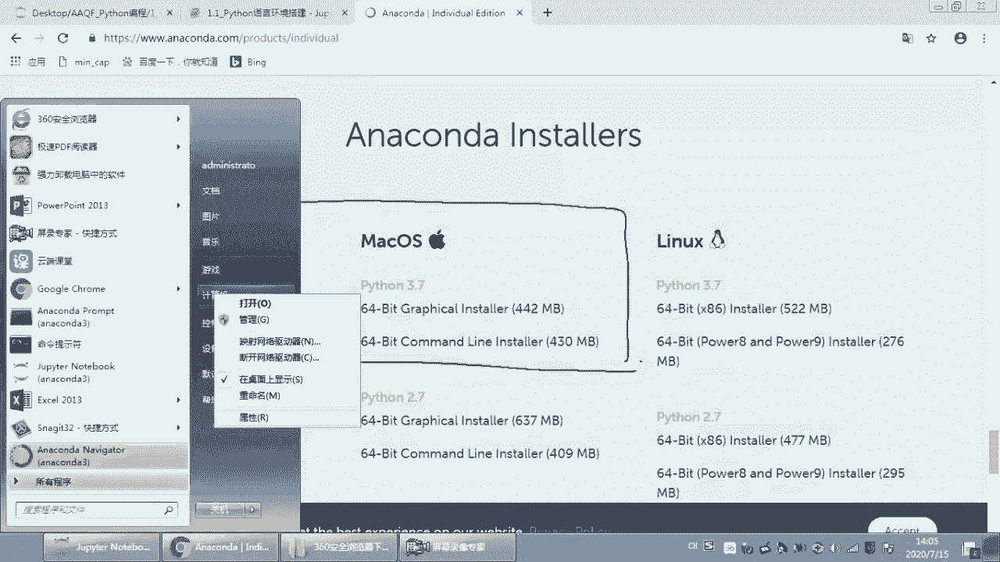

而这里面有一个系统类型，而我这里是64位操作系统，那那我们就是下载这个64这个呃，这个安装包，那如果你的电脑是32位的话，你就下载这个下面32的好，然后如果是Mac os系统的话。

嗯建议大家下载上面这个安装包，因为上面是这个graphic green dollar，然后双击运行，他就是那种傻瓜式的安装，如果说大家用下面的话，那下面这个其实是一个啊命令行难装。

那大家可能刚开始学习编程的话，可能对命令行的操作不是很熟悉，所以建议大家下载这个版本好，那下载下来了这个安装包之后，然后双击运行，根据他的提示操作就可以了，好那这个截图上的话。

这个红框框框住的就是呃大家要下载的这个呃，安装包的版本，那注意一下是安装呃，建议安装默认路径，不要有中文和空格，复选框全部勾选，那这个是大家在安装的过程中嗯，首先的话它会就是问你你要安装在哪个路径。

那建议大家就直接安装在它默认的这个路径，就不要再改动了，还有你这个路径中不要有中文和空格，否则的话是会报错的，然后复选框的话要全部勾选上，好那这个上面这个anaconda官网呃，官网的话因为是外网。

那有些同学可能外网连接速度会比较慢的，下载速度可能会比较慢，那如果说下载速度过慢的话，可以使用清华镜像源安装，那大家可以点击这个网址，那我们下载的是anaconda3，我们就找一下anaconda3。

最新的版本下载就可以了，好我们可以下载这个ANACONA3，202002的版本，也就是这一块，那最上面两个呢是LINUX，大家就不用看了，那下面是MACOS和windows呃系统。

那如果是使用苹果电脑的话，就下载这个呃，后面是点PKG的，那这个的话就是那种傻瓜式的呃安装包，然后下面这个点SH就是那种命令行的安装包，大家下载这个上面一个呃，如果是windows系统。

如果你是32位的话，你就下载上面这个，如果你电脑是64位操作系统的话，就下载下面这个有64的，就进行后续的安装就可以了，那我这里的话就是呃，那我这里因为电脑是64位windows系统。

所以我下载的是2020。02，然后windows64，那我们双击运行，好然后点next agree，而这边的话其实都可以了，你如果说呃只是给你自己一个用户来安装的话，你就是justin me。

那如果说是呃整个所有用户都可以使用的话，就是下面这个all users，那下面这个话是需要这个管理者权限的，那我们就随便选一个，我们选这个好了，然后下面的话它会出现一个默认的安装路径。

那我这边的话是默认安装在这个这个路径，那大家注意一下啊，你在安装的时候，你要看一下这个，看一下你这个呃位置的空间是不是充足，那我这边的话还有39。5个GB，是呃剩余容量。

那这个android accorner的话是需要三个GB，那如果说你这个剩余容量不足三个GB，它也是无法安装的，所以有的同学会遇到无法安装的情况，可以看一下是不是这个呃容量不够，好那注意一下。

这个路径中不要包含中文或者空格，最好就是这种纯英文的好，然后我们直接点next就可以了，好那这里是不是出现了复选框，大家一定要把这个复选框勾上，它勾上了之后，它会出现一个红色，但是不要紧。

大家就是看到红色，不要害怕，大家一定要把这个勾上，否则的话你之后要手动添加路径就很麻烦，然后这个勾上之后就可以install了，那因为我这边已经安装好了，我就不再重复安装了，那我这里只是给大家演示一下。

好我这里看色调好，这个是ANACCORA的安装，那安装完了之后，安装完了之后的话，我们其实就是可以在这个开始菜单，看到这里有一个anaccorner navigator。

但是我们这里可以直接运行这个JUPNOTEBOOK，那我们其实要用的是这个JUPNOTEBOOK好，那第二块的话就是运行jupiter notebook，如果是你是使用windows系统的话。

是有嗯这样三种方式可以打开呃，Jupnotebook，首先第一种就是在开始菜单运行，也就是直接点击这个东西，你点击，然后它就弹出来一个黑乎乎的灭窗口，然后直接这个呃，那这边notebook就打开了。

好那还有一种方法是运行CMD，打开命令窗口，输入这边notebook并回车，那这个的话其实就是这个命令提示符，你也可以在这里啊搜一个运行，然后在这里CMD。

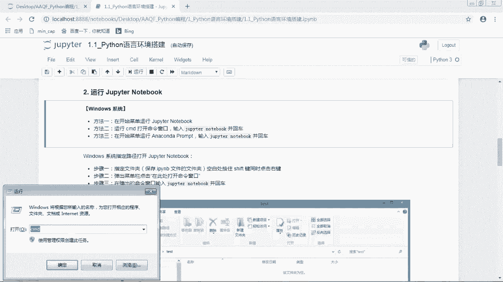

然后这里的话就是把这个命令窗口打开了，你然后输入一个jupiter notebook，然后按下回车。

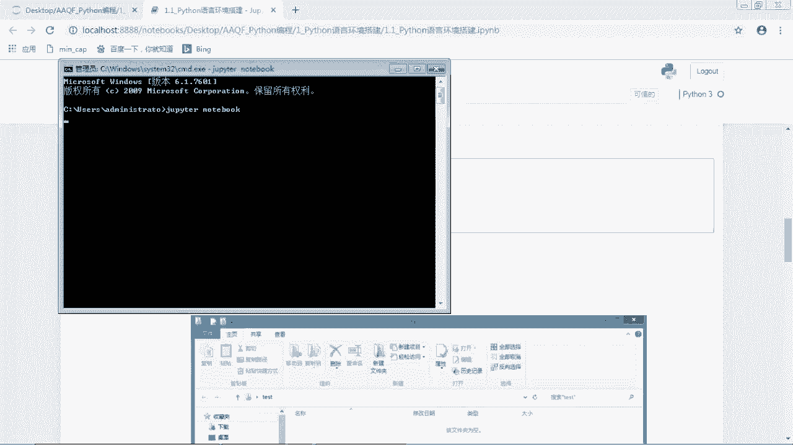

好然后也是可以把这个呃这边notebook打开的，然后第三种方法就是在开始菜单，运行anaccorner prompt，输入JUPNOTEBOOK并回车。

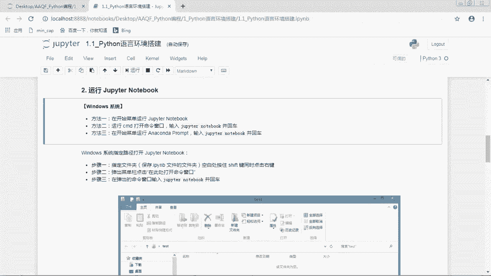

那and accorner prompt就是这个东西。

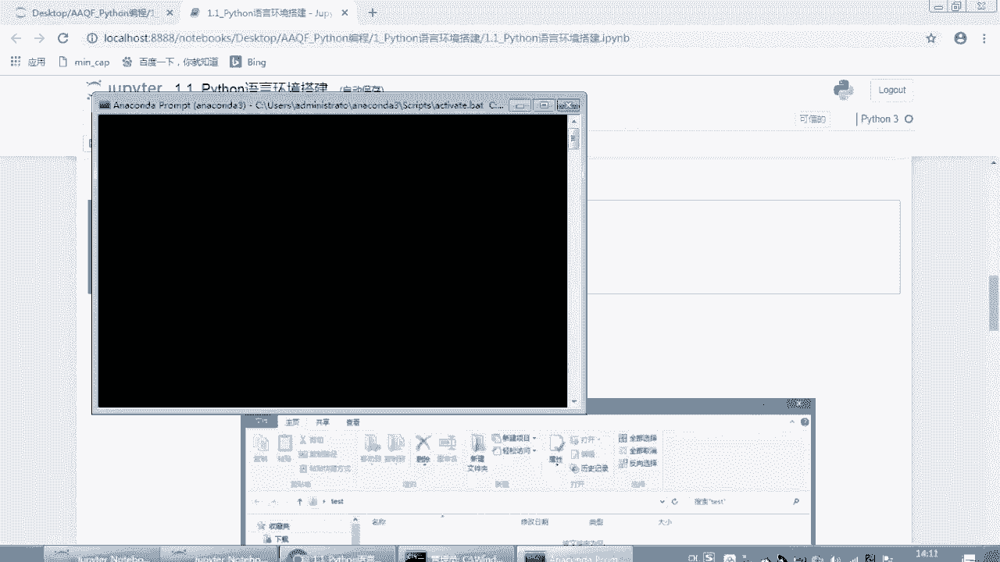

那大家也可以在这里输入这边notebook回车，也是一样的，效果好，那大家其实就是选一个啊顺手的就可以了，那如果你是使用windows系统，但是你的这个代码文件并不是保存在C盘的话。

你可能就是你如果你的代码呃，文件是保存在什么D盘E盘的话，你可能就是很难找到你的文件在哪里，所以我们可以在指定路径打开juper notebook好，那比如说我这里有一个新建文件夹呃。

是一个D盘的一个文件夹，那我们看到它的路径是在D盘的新建文件夹，那如果说我们直接在这个里面运行，直接在这个开始菜单运行juper notebook的话，那我们打开的这个，我们打开的这个页面。

我们是很难找到这样的这个文件夹的，那这时候呢，我们就可以在指定的这个路径打开呃，打开juper notebook，这样我们就是可以非常容易的找到，我们这些文件了。

那么首先是按住shift键盘的shift键，然后同时在这个文件夹空白的这个地方，你随便在这个空白什么地方，然后点击鼠标的右键，然后它会弹出来这样的一个菜单，我们点击这个在此处打开命令窗口。

那如果是win10的同学，他可能是什么，打开什么power什么什么share，什么东西，对，就反正就是大概是在这个位置，就是在此处打开命令窗口。

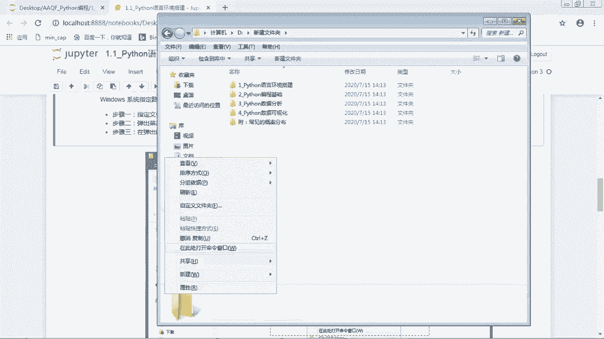

这个东西好，那我们就是在这个路径打开了一个命令窗口，那现在我们运行jupter nojupter notebook。

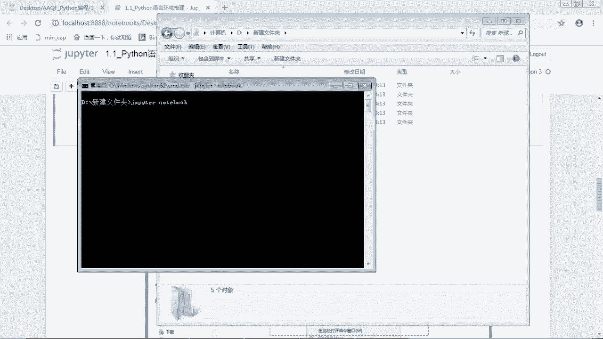

好那这样的话哎，那这个文件是不是就就在呃，我们打开的这个路径了，然后我们直接再点击啊，这些文件就可以非常容易的找到我们这些文件，而这个是在windows系统指定路径打开JUPANNOTEBOOK。

那首先第一个步骤就是在你保存IP，INB文件的文件夹空白处，按住shift键，同时点击右键，第二步是在弹出的菜单栏，点击在此处打开命令窗口，然后第三步呢就是在弹出的命令窗口。

输入这边notebook并回车，然后这样子的话呃，你如果这个文件夹里面是有代码的话，就直接可以看到了，好那这个是windows系统运行jupi notebook，如果你是使用苹果电脑的话。

你就要从终端运行，那终端的话大家可以在就是在那个软件的界面，大家就可以搜索终端，或者说你如果电脑是英文的话，就是搜索terminal，然后打开终端之后输入juper notebook并回车。

这样子的话也是可以把JUPNOTEBOOK打开的，然后还有第二种方法呢，你就是可以在那个软件的那个栏目啊，搜索一下，And connon navigator，就是那个就是这个东西一个绿色的圈圈。

然后点击它运行，然后运行出来之后它有一个剧本，notebook上面写着launch，然后就然后我们点这个JUPNOTEBOOK的运行，也是可以打开JUPNOTEBOOK的，但是使用第二种方法的话。

其实速度比较慢，主要是因为打开这个呃，And color navigator，它速度比较慢，所以我比较推荐的是使用上面一种方法，就是直接在终端运行，那Mac os系统也是可以在指定路径打开。

juper notebook的嗯，它的操作方法和windows系统稍微有一点点差别，就是我们不需要把这个文件夹点开，而是直接在这个文件夹呃，上面点击右键。

然后他最后最下面会出现一个new terminal tab，At folder，或者说new terminal at folder，那我不知道这个中文是什么，反正就是差不多就是在呃。

就在此处打开一个新的终端，或者一个嗯新的终端的页面，大概就是在最下面两行的位置，大家随便点击哪个都可以，然后点击这个之后，它会弹出一个新的终端，然后大家在这个终端上呃。

输入这片notebook并回车的话，就直接是在这个指定的文件夹打开嗯，JUPNOTEBOOK了，但是其实Mac os系统的话也不需要指定路径打开，因为我们只不嗯不管是存在桌面上也好。

还是存在这个document，还是这个download里面也好，我们直接打开这个JUPNOTEBOOK的话，都可以非常容易的找到嗯，那不过它也是可以这样操作的啊。

嘶好这个是嗯运行juper notebook，那那把这个JUPNOTEBOOK打开之后，那就是像呃我这个页面，那我们直接点击这个IPYNB文件，就可以把这个代码文件打开了，那之后就可以开始愉快的编程了。

那如果说大家进行了上面的操作，还是不能成功的运行，也就是你如果呃运行了这个driven notebook，不能自动弹出浏览器的话，则进行以下操作。

也就是我们把这个chrome浏览器设置为JUPANNODE，部分默认浏览器，那首先我们就是要下载一个chrome浏览器，那这个的话就不教大家了，就下载一个浏览器，大家应该没有问题吧。

然后把这个浏览器下载下来之后呃，我们进行下面的两个操作，首先呢我们打开命令窗口，输入命令jupa notebook generate config并回车好，那我们先把这个复制一下。

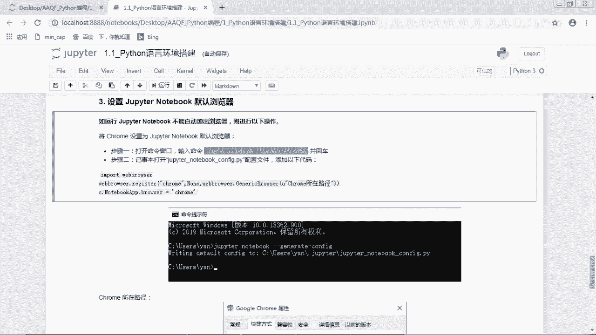

然后呢我们打开一个命令窗口，然后我们把这个粘贴过来运行一下就回车，就是运行，那我这里的话因为本来已经有了这个文件，所以这里呃问我是不是要overwrite，那我这里的话要选yes，那那这样子的话。

我就是重新生成了一个这样的文件，那如果说大家之前没有这样的一个文件的话。

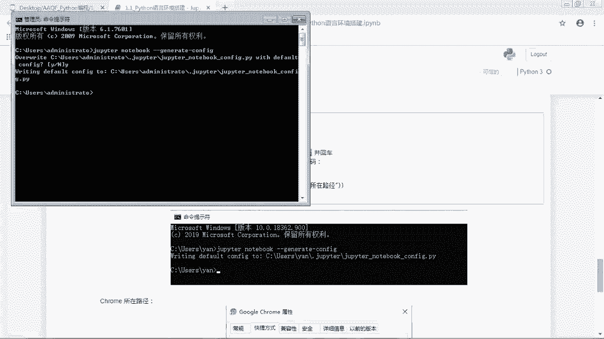

它就直接生成这样的一个文件好，然后第二步是用记事本打开呃。

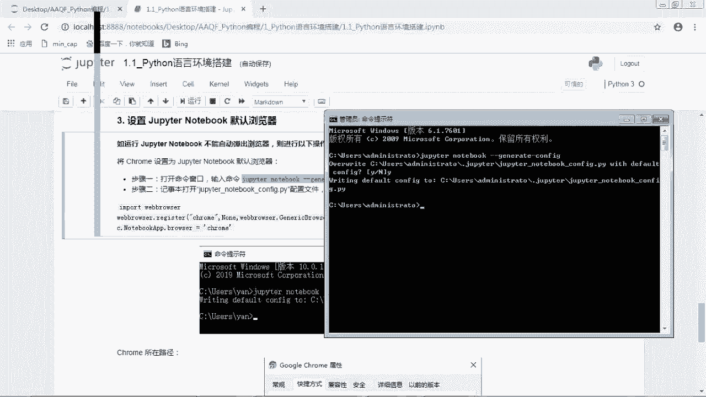

Juper notebook config，点PY配置文件。

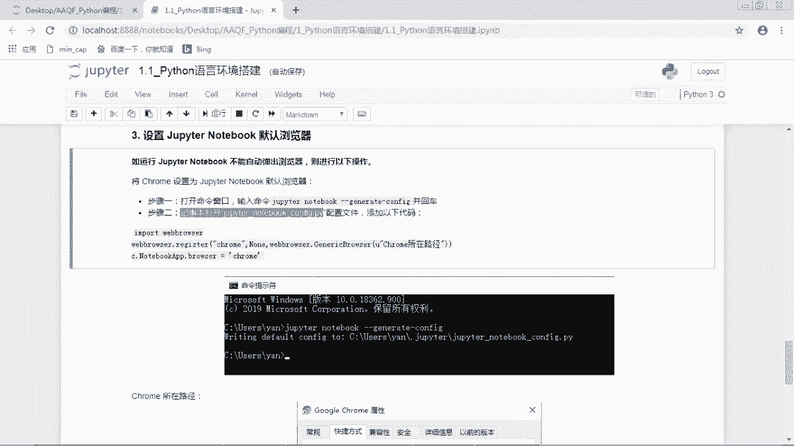

添加以下代码，那这个配置文件就是我们刚刚生成的这个文件。

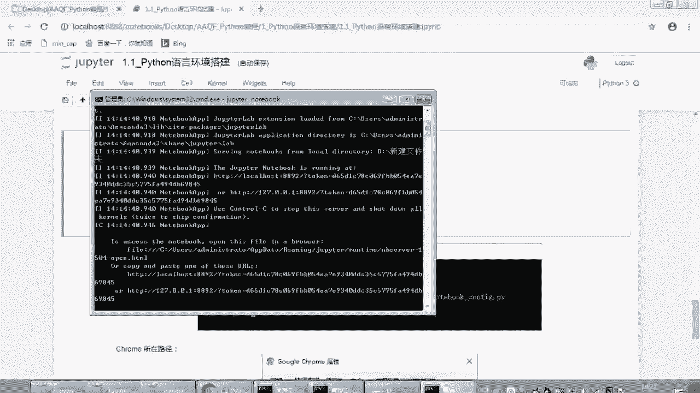

那它的路径的话就是我们这里看到的这个，大家就是照着自己的电脑啊，这是我自己，我的电脑，我这个电脑是路径是这个，那我们跟着这个来找一下，是C盘users administrator。

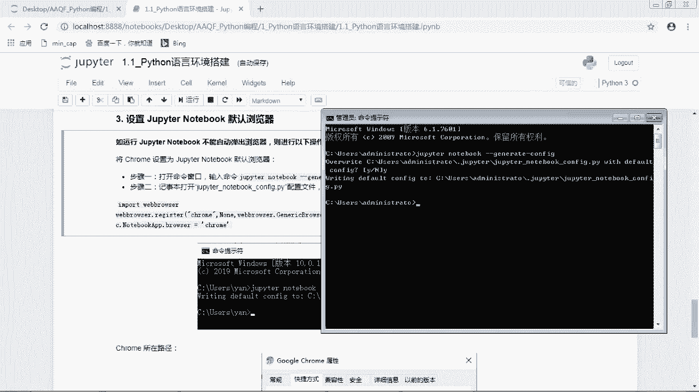

C盘users metrator。

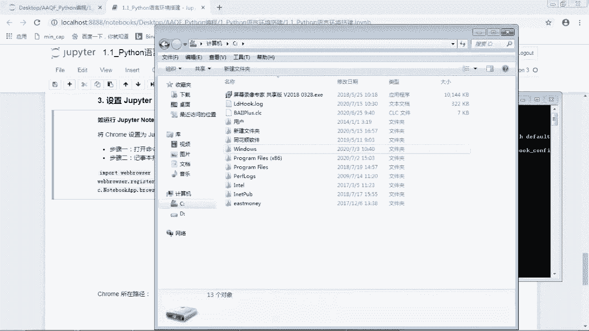

然后在点JUPITER，然后好，那我们找到了就是这样的一个文件，我们用记事本把它打开。

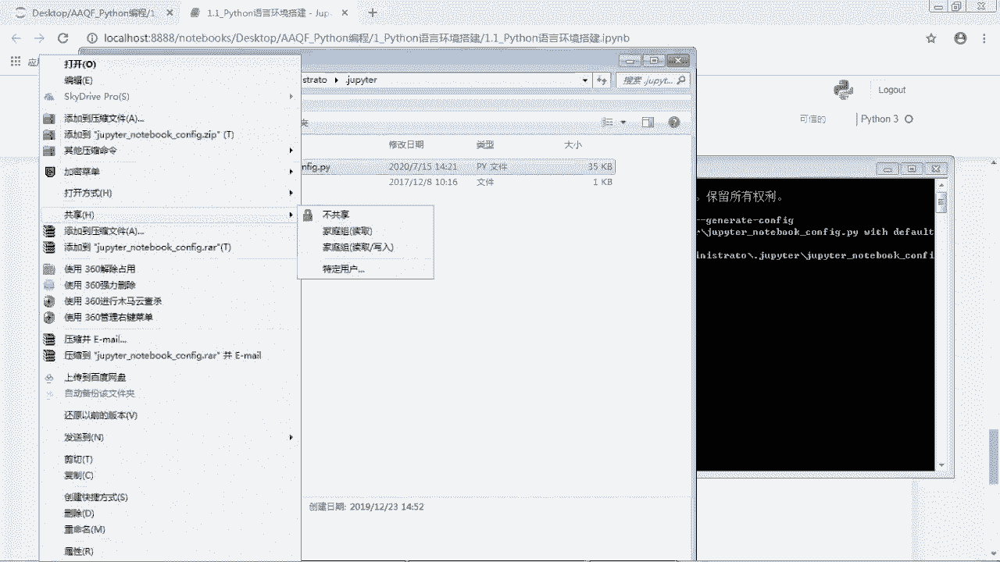

打开之后呢，我们添加下面这几行代码，那我们把这个复制一下，然后粘贴到这个文件里面，我们随便粘贴到哪里，我们就粘贴在开头也OK，然后注意一下，这里有一个chrome所在路径，好这一块。

这个的话就是要把呃这个内容嗯，替换成你自己电脑上chrome的路径，那这个路径在哪里呢，我们在这里搜索一下，哎，我们在这个开始菜单找到这个googoogle chrome，然后点击右键属性。

这里有一个目标，好目标后面这一坨东西就是它的所在路径，那我们把它copy一下，然后把这里替换掉好，现在这一步就完成了，我们把它保存一下好，现在的话我们就是设置默认浏览器，就设置成功了。

那之后的话我们运行这边notebook位，就直接弹出的是chrome浏览器作为默认浏览器了。

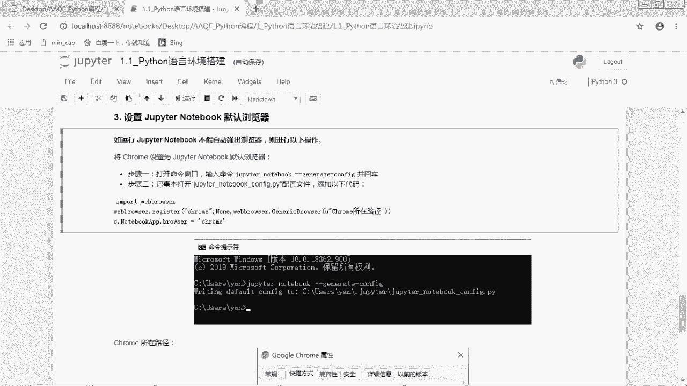

好那下面的话就是一些截图，那这个的话就是我们在命令命令呃，命令提示符里面按呃运行这一行，然后呢它文件是保存在这样的一个路径，就配置文件，然后我们到这个路径打开这个配置文件，添加上面这个代码。

同时我们要把这个chrome的路径，替换成你自己电脑的路径，那你自己电脑的路径，你就是在这个google chrome点击右键属性，然后目标这个目标后面这些东西就是它的呃，所在路径，好好。

那这一课的话就是呃关于ANNACONNOR软件的安装嗯，那从下一节课开始。

