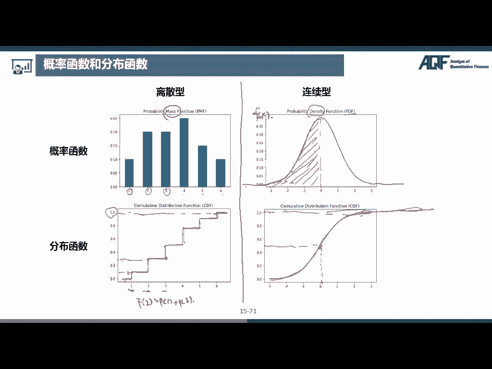

# 2024年金融大神老师讲解量化金融分析师.AQF—量化金融基础知识（完整版课程） - P1：《金融基础》01.数量分析—01_概率论基本概念 - 量化沿前 - BV1ar421K7Mo

各位同学大家好，我是讲师闫新宇，我们这节课的内容是金融基础数量分析部分，众所周知，金融离不开数学，不管大家以后是做量化交易也好，还是做其他金融相关工作也好，具备一定数量分析的知识。

都是非常有必要的，我们这门课程要学习的呢，主要是概率论以及数理统计的内容，因为这是金融中使用最广泛，最频繁，也是最重要的数量分析方法之一，同时呢也是大家学习其他数量分析方法的基础。

如果大家在本科阶段以及学习或相关课程的，可以跟着我呃，将这部分快速的复习一遍，金融基础数量分析这门课程，我们主要是分成五个部分，首先是概率论的呃，基本概念，比如说什么是随机事件。

什么是概率这些基本的概念，以及非常著名的全概率公式，全概率公式和贝叶斯公式，那第二部分是随机变量的数字特征，包括期望，方差嗯，斜方差诶，右边不好写，写方差，然后偏度峰度等等，那第三部分是常见的概率分布。

会介绍常见的离散型概率分布，比如伯努利分布，二项分布泊松分布，以及常见的连续性概率分布，比如均匀分布，指数分布，正态分布，等等，那第四部分是参数估计和假设检验，参数估计的话也叫抽样估计。

也就是用样本去估计总体，那这个是统计推论的核心思想，那如果我们想知道我们估计的这个结果对不对，准不准确，那我们可以使用假设检验的方法来进行验证好，最后一块的话是线性回归分析。

那线性回归因为它非常容易解读，所以在很多领域都有非常非常广泛的应用，无论是横截面数据还是时间序列数据，还是说面板数据，都可以使用回归方法进行分析好。

那我们首先来看一些概率论的基本概念，那概率论其实最早的时候是起源于赌博啊，那17世纪，帕斯卡和费马关于分赌本问题的探讨，可以看作是概率论的开端，那概率论最开始研究的问题啊，就是类似于像抛硬币。

好掷骰子也就是扔骰子了，这些在赌博中经常会遇到的问题，那这些问题有一个共同共同的特点，就是它们具有随机性，比如说抛硬币，那我们抛出来的结果可能是正面向上，也可能是反面向上，那掷骰子我们投呃。

扔出来的结果有可能正面是一，也有可能是23456等等，对吧，没有没有等等，就是2341234566种情况，那生活中的话还有非常多类似的随机问题，比如说我们抽查一批零件，测试它们的使用寿命。

那我们在测试之前，是不知道它们的使用寿命是多久的，那我们只有测了之后才知道对吧，那概率论呢其实就是研究这些随机现象，数量规律的呃，数学分支，那这些呢是叫做随机现象，那和随机现象相对应的呢。

还有一种是叫做决定性现象，那决定性现象就是说在某种条件下，必然会发生的，比如说太阳每天从东方升起，还有比如说呃在标准大气压下，水加热到100℃会沸腾，那这些事情的话还没有发生，我们就已经知道结果了。

那这些问题就不属于概率论研究的问题了，好那概率论其实就是研究这个随机现象，那我们对于这个随机现象的研究呢，是叫做随机试验，也就是对随机现象的研究，我们给随机试验一个定义，它需要满足三个条件。

首先第一个条件，试验室可以在相同条件下重复进行，比如说抛硬币，我们可以就是呃抛无数次对吧，因为最开始的时候，大家对抛硬币这个呃正反面概率的研究，也是从无数次重复来开始的，还有比如说掷骰子。

我们可以在相同条件下掷几千几万次对吧好，那第二个条件呢是说试验的结果不止一个，且事先可以明确试验的所有可能结果，比如说抛硬币，我们虽然不知道它到底是正面还是反面，但是我们在抛之前已经知道它肯定是正面。

或者说是反面中的一种对吧，然后掷骰子的话，它的结果不止一个，因为它有六个结果，然后事先可以明确所有结果，就是我们事先已经知道它可能是123456，那当然了，这些试验的结果是有限个的。

那也有可能是无限个的，比如说我们之前说的这个测试零件的寿命，我们只知道这个零件的寿命，肯定是大于等于零对吧，但是具体的话它可能是可以无穷大啊，理论上来说，然后第三个条件是试验之前无法预知。

会出现哪一个结果啊，那这个是显而易见的啦，那如果说事件之前就知道是出现什么结果的话，那就是决定性现象了，比如说我们经常在电视里面看到的，这个扔这个骰子，一扔就是六，那他可能是把这个色子做的不均匀。

那这个一这一面可能重量比较大，所以它每次扔的时候都正好是这个六，这个点向上，那这时候的话质投资就不是随机现象了，而是一个决定性现象了啊，所以我们一般在说掷骰子的时候都会说啊，我们掷一枚均匀的骰子。

那就是意思是说这是一个啊随机现象，那随机试验所有可能的结果组成的集合，叫做样本空间，就是它所有可能的结果是样本空间，样本空间的话一般是用这个大写的omega来表示的，比如说我们扔一次呃。

投资那样本空间的集合就是123456，也就是我们所有可能的这个结果嗯，样本点呢是样本空间的元素及随机试验的，每一个结果，也就是这个123456，这每一个元素呢就是一个样本点，好。

那随机事件呢是某一次随机试验的结果，那这个呢其实也是随机试验的结果，那这个样本空间呢是所有可能的结果，那随机事件呢是某一次的结果，那一般的话我们用这个大写的字母，ABC来表示一个随机事件，那是随机事件。

是样本空间的子集，诶那这个很好理解对吧，因为样本空间的话是所有可能的结果，那我们某一次的这个结果，那肯定是样本空间的子集，那比如说我们随机事件A是点数为奇数，那我们事件A就是135，对吧。

三种可能的结果，那这个135的话，就是这个样本空间的一个子集，那如果用集合来表示的话，就是A包含于欧米伽，好注意一下，是当前仅当这一子集中的一个样本点出现时，称这一事件发生，也就是说啊。

比如我们投出来是一，或者投出来是三，或者投出来是五，那这就说明是呃，就表示这个事件A发生，因为我们不可能就是一下子，把这个135都投投出来了，对吧嗯，那和随机事件相对应的，还有一个叫做必然事件。

一般是用omega来表示，然后还有一种呢是叫做不可能事件，一般用这个空集的符号来表示，那因为哎那我们有同学发现这个样本空间，是不是也是用大写的欧米伽来表示的呀，那说明样本空间是一个必然事件，哎为什么呢。

是因为我们每一次在进行试验的时候，肯定是会有一个样本点出现的对吧，那这个所有的样本点都是在样本空间，这个集合中的，比如说我们出现了是一，那就说这个样本空间是发生了，所以说样本空间是一个必然事件。

好那空集的话是不包含任何样本点的，所以是呃不会发生的，那就是一个不可能事件，好，最后呢还有两个名词叫做基本事件和复合事件，那基本事件呢是说由一个样本点组成的单点集，比如说我们呃抛出来的正面是一。

那这样的一个事件呢就叫做基本实践，那还有说比如说抛出来向上12，那这也是一个基本数事件，那符合事件就是由多个样本点组成的集合，比如说我们刚刚说的这个事件，A点数为奇数，它包含1353个样本点。

那它就是一个复合事件，好那这一页的话就是概率论的一些基本名词，比较重要的话就是这里的呃随机试验，注意下要满足三个条件，然后样本空间是随机试验所有可能的结果，那随机事件呢是某一次随机试验的结果。

是样本空间的子集，那这几个概念大家稍微注意一下嗯，接下来呢，我们来介绍几种比较常见的事件间的关系，那既然刚刚我们用集合来表示事件，那么事件之间的关系也是可以用集合来表示。

我们通常使用维恩图来表示集合之间的关系，比如说包含关系，A包含于B，也就是A中的样本点都在B中，那么A发生则一定是B发生，那我们在韦恩图上看到A的话，就是在B这个圈圈的里面。

那相等事件是说如果A包含于B，并且B包含于A，那么A等于B，那A包含于B就是A在B的里面了，那B包含于A的话，也就是B又在A的里面，那是不是他们俩就是正好是要在重合的时候，才会发生。

那这时候呢就说A和B是相等的事件好，那第三个是核事件，或者说我们叫做并事件，那是用A并B这个呃，向上的这个U的这个符号来表示的，那它是表示ab中至少有一个发生，那也就是A和B这个全部的这个部分。

也就是说如果说这个事件啊，比如说是在这个地方发生了，那就说这个A并B发生，那如果说它是在这里发生的，那它也是ABB发生，那如果是在重叠的地方呢，它也是A并B发生，也就是说A和B这两个事件。

全部覆盖的这个地方好，那和核事件相对应的呢是叫做基事件，或者说叫做交事件，那A交B的话，就是用这个向下的这个U的符号来表示的，或者我们有时候把这个呃交这个符号省略掉，就直接用AB，那也是表示这个交事件。

它是表示AB同时发生，那同时发生就是A和B之间重叠的部分，也就是说这里面的样本点既在A中，也在B中，那么这里面的样本点发生是不是呃，是不是同时A和B都会发生呀，第四种呢是叫做互斥事件。

那互斥事件就是两个事件不会同时发生嗯，比如说这里的A和B，我们看到他们俩之间是没有任何交集的对吧，或者说他们的交集是空集，那那称他们是互斥或者说互不相容，表示它们不会同时发生。

那对立事件的话就是呃要么A发生，要么B发生，那我们看一下他是要满足两个条件，首先A并B是等于呃欧米伽，也就是他们两个加起来的话是整个样本空间，同时呢它们之间是没有任何交集的。

那么就称它们是逆事件或者说对立事件，表示每一次试验中事件AB中必有一个发生，且仅有一个发生，也就是要么A发生，要么B发生，那一般的话我们把A的对立事件记为A拔，也就是A上面加一个横杠好。

最后一个呢是差事件A减B，那其实也就是把这个A事件中，B的这个部分瓦掉啊，比如我就是去掉，比如说这个A是这一块，然后我们要把这个B覆盖到的这个部分啊，把它去掉，那是不是就只剩下了这块部分。

那其实我们是不是可以写成A减掉一个，A交B啊，那他呢也可以写作A交B拔，那必拔的是什么东西啊，是不是就是B的这个呃对立事件，那B的对立事件是不是就是这块，就是把这个B去掉的部分。

那A的话和这个B拔相交的部分，是不是就是这一块了对吧，那差事件的话就是说A发生，但是B不发生好，那这几个事件间的关系大家稍微了解一下嗯，关于这个对立事件，我再补充一点啊，补充一个概念叫做完备事件组。

那在对立事件中，我们是不是就是把整个这个样本空间，切切成了两块，一个是A1个是A白对吧，那如果说我们把它切成了很多块，也就是说这里把它切成很多块，那同时呢这些事件之这些这些块之间啊，是没有任何重叠的。

那我们把它叫做A1A1A二，然后A3A4，然后等等等等等，一直到AN那这时候的话呃，这是不是就是A1并上A2，然后一直变变变变，变并到AN是等于整个样本空间，同时呢这里A1交A2是等于空集。

然后A2交A3等于空集，就是任意两个事件之间的交都是空集，那我们可以写成AI交AJ等于空集，如果说I不等于J的情况下，那其实也就是把这个整个样本空间划分成了呃，互不相交的N份。

那这时候的话就把这里的A1到AN，叫做一个完备事件组好，那么这个概念的话，我们之后会在全概率公式和贝叶斯公式中用到，所以这里的话先跟大家介绍一下，接下来给大家介绍一下概率的定义和性质。

那概率的定义是说在一次试验中，某个事件发生的可能性的大小，比如说抛硬币，那出现正面向上和反面向上这个事件的概率呃，这个可能性都是1/2，那也就是说我们出现正面向上，或者说反面向上的概率是1/2。

那其实最开始的话，研究抛硬币，是从无数次的这个重复实验中开始的，那之前的人可能就是抛了超级多次的硬币，可能怕抛100次，1000次，1万次的都有，然后呢发现随着这个抛的数量越来越大。

那这个出现正面或者反面的这个频率，也就是平数除以整数，这个这个值呢是趋近于1/2的诶，那我们叫做，那我们把这个频率的区域呢叫做概率好，那我们来看几个概率的性质来，首先空集的概率是零。

那任意一个世界A的概率呢是介于0~1之间，然后样本空间的概率是一，那这个很简单呃，注意一下这个空集的概率是零，也就是说不可能发生的事件概率是零，但是呢概率为零的事件是不是不可能发生的呢，大家想一想啊。

其实不是的，比如说我们测试一个元件的使用寿命，那使用寿命正好是100个小时，那这个事件的概率是多少，诶那其实这里的话，这个呃出现这个它的使用寿命，正好等于100小时，这个事件的话概率是等于零的。

那这是因为是呃使用寿命是一个连续型，随机变量是可以取到无数个数的，比如说我们使用寿命可能是99。9，然后100，然后100。1回，白蝶啊，111就是可以取到无穷个数，那么刚刚刚好等于100小时，诶。

那这个概率是不是非常非常非常小的呀，那在数学上的话，这个概率是等于零的，但是呢它是可能发生的，大家注意一下，就是如果概率是等于零的话，并不是说它是不可能发生的事件，好接下来差事件的概率。

BPA减B是等于pa减PAB那这这个很好理解，那A减B是不是就是把这个呃从A中，把这个B的部分去掉，那就是这块嘛，那PA减掉AB，AB就是这个这个这块儿了对吧，就把它剪掉，然后逆事件的概率。

PA拔呢等是等于一减PA，那这是因为它PA拔和pa两个加起来，是整个样本空间，是概率是等于一嘛，然后他们两个之间呃交集又是零，所以他们是正好是pa的，因为就是我们把这个整个样本空间分成了两份。

一个是A1个是A8，那它们的概率也是一减呃，一减pa，那如果事件A1到AN是互不相容，则这个是等于这个，我们来看一下这是什么东西，诶那我看一下这个的话其实是一个核事件，也就是A1B上A2。

然后一直并到a an，那它是可以写成这样的一个形式，就是把这个bean的符号写到最前面去，然后K呢是从一到N，然后AK那那就是从A1到AN，它们把它并起来，然后这个这个并集的概率是等于概率的和。

那我们来看一下这个是一个和的这个符号对吧，它是把这里的PA1，然后一直加到PAN来，注意一下，这里的话条件是他们互不相容，也就是比如说这个这个是A1，然后这个是A2，然后这个是A3，这个是。

然后一直到AN，他们是中间是没有这个交集的，那它们并集，是不是就是把这个所有的都要把它加起来，那也就是我们把每一个事件的概率加起来，啊下面一个如果有任意事件ab且A包含于B，那么则pa小于等于PB。

那因为A包含于B的话，也就是说A发生，那么B1定发生，那么A的这个概率就是小于等于B发生的概率，那PBA呢，B减A呢是等于PB减pa诶，注意一下，这个的话是只有在这个这个条件。

A包含于B这个条件出现的时候，它才成立的，因为如果没有这个条件的话，是不是PB减A应该是等于PB减掉PAB，那这个时候PAB呢就是等于PA，那他们两个的交集是不是就是A呀，那所以的话。

这里的话可以把这个PAAB写成pa好，那最后加法公式是PA并B等于pa加PB，减PAB，那我们看一下那AABB是什么，AABB是不是就是AB这两个全部包含的部分，那pa的话是不是这一块。

然后PB的话是这块对吧，那我们把这个两个相加的时候，是不是中间这块加了两次啊，所以我们要把这一块的话减掉一个，如果说ab互斥，则PA并B等于pa加PB，那这个因为它们互斥的话，互斥是不是就是没有交集。

没有交集的话，PAB就等于零，如果说ab独立，那么PAB呃，PA并B等于pa加PB，减掉pa乘以PB那这个是一个独立性的概念，我们在后面会提到，那这里的话其实是用到了一个乘法公式。

也就是如果ab独立的话，PAAB是等于PAA乘以PB，那这个我们在后面会提到，接下来呢我们介绍两种简单的概率模型，古典概型和几何概型，那古典概型是说，试验的样本空间只包含有限个元素。

且每个基本事件发生的可能性相等，那这种概率模型其实是最早出现的啦，因为人们最早研究概率就是从抛硬币啊，掷骰子这些赌博游戏中开始的，那这类游戏呢有两个特点，一个是样本空间是有限的，也就是只包含有限的元素。

那比如说抛硬笔，它只有正反两种结果，那掷骰子的话一共是有六种结果，那第二是试验中，每一个基本事件出现的可能性相同，你比如说这个出现正面和反面的呃，可能性是一样的呃，还有抛一个均匀的投资的话。

出现123456，这六个点数的可能性是相等的，那这样的一个概率模型呢是叫做古典概型好，那古典概型中事件A的概率是，pa等于事件A包含的样本点的个数，除以样本空间中样本点的总数，那比如说抛硬币。

我们这个样本空间样本点的总数就是二对吧，因为就是正面和反面，那比如说事件A是出现像正面向上，那是不是就是包含一个样本点，也就是正面来，那这个的概率就是呃1÷2=2分之一，那如果说质投资的话。

样本点总数是六对吧，那如果说我们这个事件A呢是出现点数为一，这样的一个基本事件的话，那它只包含一个样本点，那它的这个pa它这个概率的话就是16，那如果说我们这个事件B呢是呃，出现点数为偶数。

那是不是出现这个246，那它就是包含三个样本点，那PB的那PB的话就是等于36，是等于1/2哎这个非常简单好那呃，古典概型这个事件的概率计算方式非常简单，就是一个样本点的一个比值。

那这里的话给大家稍微复习一下，排列组合的知识，因为在古典概型中通常会用到排列组合的知识，那这块其实是高高中数学啦，那这里的话就大家复习一遍，开一个空白的PPT，那比如说我们现在的话。

啊比如说我们现在的话有四个格子，然后呢，我们要在每个格子中填0~9之间的一个数，也就其实就是从这十个数中取一个数，那我们可以有多少种选择，那这个是不是非常简单，那这个第一个的话是有十种可能好。

第二个的话也是十种，可能第三个话也是十种可能，那这样子的话是不是可以呃取到10×10乘，10×10，一共是1万种柯南，那这种的话其实是一个有放回的抽样，也就是说我们在取第一个数的时候。

我们虽然把这个数取出来了，但是我们还是把它放到了这个0~9里面，我们第二次再取的时候，还是可以取0~9这十个数的，那这时候呢我们的钙，我们这个渠道的可能性是不是N乘以N乘以，一直乘以N。

如果说一共是有NM个的话，那是不是有NM个，那我们取出来就是N乘以M次方，比如说我们这里的话，N就是等于十，然后M的话就是等于四，那这个其实就是十的四次方，那如果说是无放回，那无放回是什么意思呢。

也就是说我们在取了第一个数之后，比如说我们取到第一个数是九诶，那第二个数呢就不可以再取九了，我们是可以从012345678，这九个数中取一个数，那这个第二个数是不是就只有呃九种可能了。

然后第三个数的话是不是就只有八种可能，那也就是这时候的话就是呃10×9乘以，8×7这么多种可能好，那这种的话其实就是叫做一个排列，那排列的计算公式是ANM，表示我们从N个数中取出NM个数。

那第一个数是不是有N种方式，N种可能，然后第二个的话是N减一种，然后一直乘是乘乘到N减M加一，那这是最后一种，比如说我们这里最后的话是七对吧，那N的话是十减M41是不是等于七啊，那我们这样算下来的话。

如果写成阶乘形式，就是N的阶乘除以一个N减M的阶乘，好那这个的话是排列的概念，那组合呢其实和排列差不多，它也是一个无放回的，但是它的区别呢在于它是不考虑顺序的，唉比如说我们在这个排列中。

这里1234和4321是不一样的对吧，但是呢我们在组合中，我们就觉得这两个数是一样的，那我们可以想象之后呃，想象在一个袋子里面摸球啊，然后这个袋子里面，每个球上面的数字都是不一样的。

那排列的话就是说我们呃一个一个的摸，然后把这些球呢按照我们摸出来的顺序，把它排成一起，然后算算算有多少种排列的可能，但是如果说是组合的话，那我们就不考虑顺序了，那我们可以想象出。

我们一次性的从这个袋子里面摸球，那我们这时候呢就只考虑我们摸出来了，哪几个球，那至于他们怎么排列呢，我们是呃不关心的，那这个时候的话，我们是不是就是要在排列的基础上，把这个顺序给除掉啊。

那这CNN那它就是用排列的这个可能性，除以一个它的顺序的可能性，那呃木个数有多少种顺序呢，那顺序的话肯定第一个数是有M种嘛，然后第二个数是M减一种，然后一直排到呃，一啊是等于M的阶乘阶乘种排列。

所以我们就是在这个排列的基础上，把M的阶乘除掉，那比如说这里的话，我们排列是A14对吧，那我们的可能性是10×9乘以8×7，但是这样这里面的话，如果我们要算C14的话，就要在A14的基础上。

把四个数的排列顺序给除掉，那因为我们不是取出来了四个数嘛，然后比如说我们取出来的四个数是四啊，879这四个数，那我们可以排在第一个数的这个种类，是不是有四种，比如说我们把这个四排在前面。

然后四取出来之后，我们是不是还有879，然后第二个数可以取到的，是不是三种可能，比如说我们排七，然后现在的话是不是只剩下八和九了，也就只有两种可能，那就是再乘二，比如说我们排九哎。

那是不是最后的话就只剩下一个八，那只有一种可能，那这个话是不是就是四的阶乘好，那就是好，这个的话就是一个排列组合的概念，那第二种概率模型呢是叫做几何概型，几何概形式说实验的样本空间包含无限个元素。

且每个基本事件发生的可能性相等，哎我们发现几何概型和古典概型一样，都是基本事件发生的可能性相等式的概率事件，那么但是它和这个古典概型的区别是在于，它的样本点是无限个，那古典概型的样本点是有限个。

那几何概型呢，它这时候就不是看样本点的个数了，而是看这个测度啊，也就是说，如果某每一个事件发生的概率，只与构成该事件区域的测度，比如说长度啊，面积体积等等成比例，而与该区域的位置和形状无关。

则称这样的概率模型为几何概率模型，简称几何概型，那这时候事件A的概率就是pa等于A的测度，除以一个样本空间的测度啊，这个说起来有点抽象，我们举几个例子就非常好理解了，比如说最最常见的这个扔石子问题。

也就是说，比如说我们在这样的一个正方形区域中扔石子，那正好这个石子落在这个圆形区域中的，概率是多少，那这时候的话，我们是不是就是用这个圆的这个面积，除以这个正方形的面积就可以了。

那这里的圆的面积是不是就是派R的平方啊，然后呃，那正方形的面积是不是就是它边长的平方，那这里边长的话是2R对吧，那就是2R的平方，那就是这个4R的平方好，那我们把这个二平方约掉的话，就是四分之派好。

那还有再举个例子，这个比如说界面问题啊，那比如说甲和乙两个人，约定是在七点钟到八点钟之间见面，我们这个事件呢是第一个人，第一个人，第一个到的人，等待第二个人，时间超过半小时。

哎那如果说我们想要求这样的一个事件的概率，怎么求啊，唉那我们是不是可以把甲和乙到达的时间呃，设成两个随机变量是X和Y，那么X是不是大于等于七，小于等于八，然后Y的话也是大于等于七，小于等于八对吧。

因为它们是在约定在七和八之间到达，呃如果说他们没有人，就是六点钟就到的话，假设他们两个都是在七点到八点之间到达，那我们画在坐标轴上的话是XY，那这里七八，然后这里也是七八，那是不是就是这样的一个正方形。

好那我们这个事件，那这个的话是不是就是整个样本空间，那我们这个事件，第一个人等第二个人的时间超过半小时，是不是就是X减Y大于0。5，或者Y减X大于0。5对吧，要么就是甲等乙，要么就是乙等甲。

那这个话是可以写成X减Y的，绝对值是大于0。5，好那这块是在什么地方呢，那其实我们还是要把这个绝对值拆掉啊，那第一个的话就是Y小于X减0。5，然后第二个的话是Y大于X加0。5，那么看下X减0。

5是呃这条线对吧，然后Y是小于的，那就是在在这个线下方，然后Y大于X加0。5，那X加0。5就这条线，但是它在它上方诶，那我们看一下这个呃阴影的三角形，加上这个三角形，它们两个是不是合。

可以合并成这样的一个正方形，那这个正方形是不是，占整个正方形的面积的1/4，因为这里是半小时吧，这这里的话其实这个点是7。5，然后这个点的话也是7。5啊，这其实就是他们中间的这个一半。

那这样子的话这个PA就等于14，其实也就是阴影面，阴影部分的面积除以整个的面积，好接下来我们来介绍三种概率，边际概率，联合概率和条件概率，那边际概率是指一个事件发生的概率，而不考虑过滤过去。

或者将来其他事件发生的情况，一般记为pa，那其实我们之前说的一些概率，其就是这样的一个边际概率哎，联合概率是指两个事件同时发生的概率，一般即为PAB，也就是A和B同时发生的概率。

条件概率是指在一个条件已经发生的情况下，考虑另外一个事件发生的概率，一般记为pa杠B来，这个是这个是一个竖线，就是这个enter键上面的这个符号，那这个呢其实就是表示，在B这个事件发生的条件下。

A这个事件发生的概率，那它的公式是呃这个样子的，嗯我们我们举一个例子吧，比如说银行有两笔贷款，A和B那pa呢就是指我们不考虑PB，就是假设这个P这个B不存在，我们单单只考虑A这个贷款。

那他违约的概率叫做pa，那这个是边际概率，那B的边际概率就是PB，那联合概率呢，就是说这两个额贷款同时违约的概率叫做PAA，B，那条件概率的就是在B这个贷款违约的条件下，就是B已经违约了。

然后我们来看这个A贷款违约的概率，那一般来说的话，我们认为呃这个贷款之间是相互独立的，那这个时候也就是说，A这个贷款是不影响B贷款的，然后B贷款违约也是不影响A贷款的。

那所以这个时候这个条件概率就等于边际概率，但是在经济下行以及经济不好的时候，贷款之间违约的相关性会上升，也就是说一个贷款违约，那么另外一个贷款也会也很可能会违约。

那这样的话这个PAAB是不是就大于pa了，也就是当我们知道这个B贷款已经违约了，这时候A贷款违约的概率就会大于，我们单单考虑这个A贷款的违约的概率好，那条件概率公式是，PA杠B等于PAB除以PB。

那这个额公式我们可以推导一下，那推导其实就是这里的乘法公式了，那我们知道APAB，就是A和B同时发生的概率，那假设我们是B事件先发生了，然后在B发生的这个条件下，我们再乘以一个A发生的概率。

也就是当这个PB就是B已经发生了，然后pa告B就是在B发生的条件下，A发生了A，那这个是不是就是A和B同时发生了呀，那我们把这个PB移到下面，移到左边，也就是那PAB就是那PA杠，B就是PAB除以PB。

那当然我们也可以写成pa乘以一个PB杠，A的形式，也就是首先A这个事件发生了，然后在A发生的条件下，B发生了，那这是不是还是A和B同时发生了呀，那这时候呢我们就可以算出PB杠，A的这个条件概率。

那是不是就等于把这个A放到这个呃分母上去，那就是PAAB除以一个pa啊，好那这个的话其实就是这里的乘法公式嗯，如果A和B互斥，那么PAAB等于零啊，那这个是非常好理解了。

那呃我们如果不看这个条件概率的话，那我们知道PAB互斥，也就是A交B是空集啦，那空集的概率是零对吧，那如果说我们用这个乘法公式的话，ab互斥也就是一个事件发生，则另外一个事件不发生。

那这里的话B如果已经发生了，那A发生的概率，这是不是条件概率就是等于零的呀，那所以它是乘乘下来是等于零啊，如果AB独立，则PAB等于pa乘PB，那独立这个概念呢，也就是说一个事件的发生。

不会影响另外一个事件发生的概率，比如说这里B已经发生了，但是B发不发生和A发生的概率是没有影响的，所以这里的PA杠B也就是B发生的条件下，A发生的概率是等于pa的，所以我们把这个pa带到这里的话。

是不是就是PAB等于pa乘以PB好，那这个的话其实是两个事件独立的这个呃条件，那如果是三个事件独立，我们怎么写啊，那如果是ABC3个事件独立的话，那这个时候我们要满足几个条件。

那首先他们是不是要两两之间相互独立啊，PAB等于PA乘以PB，然后PBC等于PB乘以PC后，PAC等于pa乘以PC，那这样是不是就完了呢，不是的，我们还要再加上一个条件。

是PABC等于PA乘以PB乘以PC好，那这个的话其实就是三个事件相互独立的，一个呃定义，那如果说是ABCD4个事件呢，但如果说四个事件独立，我们这个呃定义要怎么写啊，那首先是不是他们也是要两两独立。

那两两独立是不是C42种，可能那三个的话也要满足，那就是C43，然后四个的话也要满足，就是C44，那如果说我们一共有N个事件，他们要满足多少条件，那首先是不是CN2，然后再加上CN3。

好加上一直加到CNN对吧，那这个怎么算呃，这里的话有一个呃二项展开，那这个的话大家不知道眼不眼熟啊，那我们如果再加上一个CN1，再加上一个CN0，哎那这个的话其实是等于二的N次方。

那我们如果是算这一块的话，是不是就是把这块减掉，那就是减一减掉N好好，我们这里的话带大家看一个例子，以CA和B的联合概率矩阵是这样的一个东西，那么看到A的话，它是有A1A2A三这三个事件。

然后B的话是有B1B2，然后这里面的这一块呢，其实就是A和B发生的联合概率，比如说我们这个第一问，事件A2和事件B1的联合概率，那也就是说事件A2和事件B1，同时发生的概率。

那我们来找一下A2是在这个地方对吧，然后B1是在这个地方，然后他们同时发生的概率是20%，好那事件A2发生的边际概率，那边际概率就是我们在不考虑B的情况下，A2发生的概率。

那其实就是不管是呃B1发声还是B2发声，那我们把它进行一个加总，就是50%，那这个就是呃A2发生的概率，那同理的话，我们也可以算出A1发生的概率是20%，A3的概率是30%，好那事件A2发生的情况下。

事件B1发生的概率，那这个是不是就是呃PB1A二，这样的一个条件概率啊，那我们带这个条件概率的公式是不是，PB1A二，然后除以一个PA2，那PB1A二是在哪里，我们看一下B1A2，那是不是就是20%。

然后PA2是50%，好这样子的话算出来是40%，这是一个简单的例子，好好，接下来的话，我们来看这个非常非常著名的全概率公式，如果将样本空间A划分成A1A2到AN，并且相互为互斥事件。

哎那这个的话是不是就是说明这个A1到AN，是一个完备事件组啊，那我们之前在前面讲过，完备事件组有两个条件对吧，第一个条件是A1并上A2，一直ban到an的话是等个整个样本空间。

那这里的话样本空间是叫做A然后呢，他们之间相互是呃互为互斥事件，也就是AI交上一个AJ等于空集，如果I不等于J，那这时候他们是一个完备事件组，那这时候事件B发生的概率为。

PB等于PA1B加PA2B加加加加，一直加到PANB那我们来看这个VN图啊，那我们这整个样本空间是不是划分成了A1，到AN，然后呢B是在这个这样的一块，那这个B发生的概率。

是不是就是相当于B和每一个这个AI相交的，这个部分进行一个加总，比如说这个B和A1它是没有交集的，那就是它这个概率就是零，那pa2B就是这块啊，然后pa3B就是这一块，然后A4B呢就是这块。

然后一直加加加加加，那是不是就把整个B给把它加总起来了，那我们就得到了这样的一个第一个公式，那第二个公式呢，其实就是把我们的这个乘法公式代入进去，比如说这里的PAA1，B就等于PAA11个PB杠P呃。

PB杠A1，那这个是不是就是乘法公式啊，那我们把每一个乘法公式带进去，那就得到了最终的这个公式，也就是PAI乘以一个PB杠AI，然后进行一个加总，在这里给大家举个例子。

比如说我这里有一个产品是有三个供应商，是甲乙丙，然后供应量呢分别是占50%，20%和30%，那这个甲供应商次品率是2%，这是次品，乙供应商的次品率呢是5%，丙供应商的次品率是3%，那我们来问，随机。

抽取一个抽取一个产品是次品的概率，那这里的话我们要求的这个PB，是不是就是抽取一个产品是次品的概率，那我们抽取的这个产品可能是甲供应商提供的，也可能是乙供应商提供的，也可能是丙供应商提供的对吧。

那这里的话我们的A1就是甲供应商提供的，然后A2的话就是乙供应商提供的，然后A3的话就是丙供应商提供的，但如果是A1的情况下，这个产品是次品的概率，也就是PBA1，那这个是不是。

其实就是甲供应商提供次品的概率啊，那就是2%，那如果说是是从这个乙供应商中抽取的，然后它是呃次品的概率是5%对吧，然后如果说它是丙供应商提供的话，他次品的概率是3%，那这时候我们要求PB。

那是不是就等于PA1，也就是甲的这个概率，乘以一个在甲供应额供应的情况下，次品的概率，然后再加上一个乙的概率，再乘以一个在乙的条件下，次品的概率，再加上丙的概率乘以一个在丙的条件下，次品的概率。

那也就是PA1，是等于50%乘以2%，好加上20%乘以5%，然后加上30%乘以3%，然后我们算下来是等于2。9%好，那这个的话就是我们整个额抽取一个产品，是次品的概率。

那这个的话其实就是全概率公式的一个应用，好，那还有一个非常著名的公式叫做贝叶斯公式嗯，他是说如果将样本空间A分划分成A1到AN，并且相互间互为互斥事件，那这个和这个全概率公式是一样的对吧。

也就是A1到AN是一个完备事件组，那么事件B发生的情况下，事件AI发生的概率诶，那这个其实它是求的一个条件概率的吧，那也是在B发生的条件下，AI发生的概率，那我们可以用这个条件概率的公式。

PAI杠B就等于PAI乘以B除以一个P，那它的分子我们带这个乘法公式，是可以写成PAI乘以PB杠AI对吧，那分母的话可以带这个呃全概率公式，我们刚刚也说了，这个全概率公式的话。

PB就等于它每一个条件的概率乘以，它在这个条件下发生的概率的和好，那如果说我们把这个AI提到前面来的话，呃这个AI就是一个先验概率，然后它后面的这一大块呢，是叫做一个信息调整因子。

那这个PAI杠B这个条件概率呢，就叫做后验概率好，那这个贝叶斯公式有什么用呢，那我们还看刚刚这个例子啊，那我们还是呃刚刚这个例子，我们是甲乙丙三个供应商，然后这些这些条件都还保持不变。

但是呢我们现在问题改变一下，也就是说我们现在呢已经知道哎，已知这个产品呢是次品，我们求问他这个次品呢是甲供应商的概率，那这样子的话我们是不是要求一个条件概率，那这个甲供应商是不是A1啊。

然后他的条件是次品，那就是B，那其实我们就是要求的PA1杠B这个概率，那PA1杠B是不是就等于PA1，B除以一个PB，然后等于PA11个PBA1除以个P变，那PA1等于多少，PA1等于50%。

然后PA1呃，PB杠A1是不是在这个地方得2%，那PB我们刚刚已经求过了，是2。9%好，那这样子的话我们算下来，他这个概率是34。48%，好那这个其实就是我们在发生了B这个事件下，发生A1的概率。

也就是说我们已知呃已经知道这个产品是次品，它是假供应商提供的概率，那我们看到我们这个PA1呃，这个PA1，也就是我们在不考虑这个，他是不是次品的条件下，我们随机抽取一个产品。

它是甲供应商的概率是不是50%啊，那这个的话其实就是一个先验概率，那这个PA1杠，B是求出来是34。48%，那这个的话，其实就是我们在已经知道了一个条件，已经知道他是次品的条件下。

它的这样一定一个后验概率，那这里的话这呃它这里面的一个差别，就是信息调整因子，那我们看到这里信息调整，因此是大于一还是小于一呀，是小于一对吧，因为我们这里的后验概率是小于先验概率的。

那先验概率是要乘以一个小于一的数，才会变小对吧，那这里的这个信息调整因子是小于一嗯，那如果说我们这里想要求，他是乙供应商的概率呢，那大家也可以算一算呃，也是相同的这样的一个呃套路。

然后呢我们算下来它的概率是哎，也是34。48%，但是呢我们注意到这里的pa2，是等于多少，是等于20%对吧，也就是说我们在没有B这个条件的时候，A2发生的概率是20%，但是呢如果我们已经知道它是次品了。

这个A2发生的概率就变成了30%，4。48，这个后验概率是大于先验概率的，那说明这个信息调整因子是不是大于一呀，那如果说这里信息调整因子是一的话，我们看一下是会变成啥样的情况，那这个如果是等于一的话。

那是不是就是PAI杠B就等于PAI，那是不是就是B这个事件发不发生，对A事件发生的概率是没有影响的，那是不是就说明AI和B是相互独立的，那这个信息其实是无用的信息，所以说如果信息调整，因此距离A越远。

距离E越远的话，无论它是额小于一还是大于一，那说明它的作用是越大的，那BS公式，其实在现实中是有非常非常广泛的应用的，比如说在这个医疗诊断中呃，我们平时不是去医院去查各种额指标吧。

那BS公式就可以来计算，如果说某一个指标，我们测出来是阴性还是阳性的话，得某一个病的概率，那比如说嗯得胃癌，是事件A，那我们知道胃癌的话，是在癌症中发病率比较高的一种癌症，然后呢我们某一个指标呈阳性。

是事件B那我们想知道我们某一个人在去医院，然后测测这个指标，诶发现这个指标是呈阳性的条件下，他得胃癌的概率，那是不是我们要求PA杠B，那这个怎么求，我们是不是带条件概率公式。

PAB除以一个PB等于PA乘以PB，杠A除以一个PB，那一带，这个全概率公式就是PA，PBA加上一个PA8，那就是它的对立时间乘以一个P，对吧，那这样子的话就是把这个额公式给带进来了。

那我们现在的话可以就是带数字，那比如说这个得胃癌的概率是，pa等于万分之30。0003，那这个的话其实是一个先验概率了，那先验概率就是说我们是根据历史总结的啊，这个呃根据历史经验来看的话。

得胃癌的概率是万分之三，那假设某一个测试指标在胃癌患者中，它呈现阳性的概率是95%，也就是系嗯BA等于0。95，也就是说我们已经知道他是胃癌患者了，然后他这个指标呈阳性的概率是95%，然后呢。

我们知道他在非胃癌患者中的阴性率呢，是90%，哎也就是说这个如果他没有得胃癌的话，这个指标呈阴性的概率是90%哎，那看来这个指标的话还是蛮准确的对吧，就是他如果是得胃癌的话，那这个指标基本上就是呈阳性。

那如果说他是不是没有得胃癌的话，那这个指标基本上都是呈阴性的好，那如果呢有一个人跑到医院去去测了一下，这个指标，诶，发现这个指标是阳性的，那么他得胃癌的概率是多少呢。

那我们是不是觉得唉这个指标还是蛮准确的，这个如果他这个指标已经呈阳性了，是不是他得胃癌的概率会比较大，那我们来算一算唉这个其实是我们主观判断的，那我们来科学的计算一下，好把pa带进去是0。0003。

然后乘以PB杠A是0。95，好除以一个0。0003×0。95，再加上一个呃，A拔呢是呃就是非胃癌患者的概率，就是0。99971个PB杠A，那是不是就是一减PB拔，这就是一减掉这个0。9，那就是0。1好。

那我们算下来是等于多少好，我们算下来是等于0。0028，也就是零0。2%吧，那这个是不是和我们刚刚想象的差别有点大，因为我们刚刚是不是觉得，这个指标还是蛮准确的，但是为什么它是呈阳性的时候。

我们得胃癌的概率还是这么低呢，这个这个呃指标为什么会这么不准确呢，那这里的话其实是有两个原因啊，那首先第一个原因是不是，就是呃这个pa是非常小的呀，也就是他的先验概率是非常非常小的。

那我看到我们得胃癌的概率其实只有万分之三，其实是一个非常非常小的概率，所以如果这个信息调整因子是比较大的话，它乘下来可能还是一个比较小的数，那第二个原因是不是，就是这里的额这个医疗误差。

但我们发现这一如果他是非胃癌患者的话，他这个指标呈现阳性的概率升至0。1啊，虽然这个0。1不是非常大，但是我们在这里额这个0。9997相乘的话，就变成了一个相对比较大的数字。

所以第二个呢就是这里的额这个这个医疗误差，所以的话想要医疗这个诊断要比较准准确的话，这个医疗误差，这些指标的误差都是需要非常非常小的，或者说我们可以和很多个指标一起来进行判断。

那这样子的话可以提高准确度诶，那通过这个例子，我们是不是发现，有时候我们自己主观想象的东西，和事实的差距还是有点大的，比如说哪一个，比如说有一个人他没有学过概率论，然后他跑到医院去呃。

查这个指标发现呈阳性，是不太可能就觉得哎呀啊死了死了，肯定自己肯定要得胃癌了，但是他实际上得胃癌的概率，是不是还是非常非常小的呀，那肯定非常大的，可能他可能什么病都没有，然后他可能就自己被自己吓死了。

其实也就是这样用一个量化的啊，科学的眼光来看待问题，那这也是我们学习数量分析的，一个非常重要的目的，接下来呢我们引入一个新的概念叫做随机变量，那随机变量就是将随机试验的每一个结果。

也就是基本事件和实数X对应起来，就是我们把这个随机事件进行一个数量化，那这样子的话可以方便对概率问题的研究，呃之前的话我们是不是都是用文字来表述的呀，比如说事件A是呃，比如说掷骰子。

然后事件A是出现的点数为一诶，那这样子的话，我们每次在表述的时候是不是非常麻烦，那如果说我们把这样的一个事件和一个实数，对应起来，那我们之后再进行计算的时候就会方便很多了，那随机变量的话是可以分成两种。

一个是叫做离散型随机变量，也就是随机变量全部可能取到的值是有限个，或可列无限多个，那比如说啊是投资，那我们可以将所有的结果对应到实数，123456对吧，那这时候随机数随机变量的值就是有限个，那注意一下。

它还可能是可列无限多个，那这个是什么意思呢，比如说我们想要计算某一段时间内，发生车车祸的次数，那可能是零次，也可能是一次，两次三次等等，那理论上来说它也有可能是发生无限多个吧，但但理论上来说。

虽然说我们不想啊，但是理论上它是不是也是可能发生无限多次的，那这个的话是叫做可练无限多个，也就是说它它数字呢是无限个，但是呢我们是可以数它的，就是零个啊，一个两个就是这样可以数的。

那这个这种呢是叫做可列无限多个，那这两种呢都是叫做离散型随机变量，那和离散型相对应的呢是叫做连续型随机变量，那连续性随机变量呢就是呃不可以数的，比如说身高啊，体重啊，就是没法数嘛。

那如果说你分不清离散还是连续的话，你就看这两个数之间还能不能再细分，比如说人头数，你可以说一个人两个人诶，但是他两个之一个和两个之间就没有了对吧，你不可以说11。5个人对吧，那这个的话就是离散型。

那如果是连续型的话，比如说身高，那身高可是啊，179cm，180cm，那179和180，中间是不是还有啊179。1啊，这个179。11111，虽然说我们量不到那么精确啊。

但是是不是理论上它是有这些数字的，那每两个数之间是不是都是可以找到一个数的，那这样子的话是叫做连续型随机变量，那离散，那离散型随机变量取到每一个值的概率呢，是叫做概率质量函数，比如说呃。

离散型随机变量X所有可能取到的值是小X，1X2到XN那X的概率质量函数为P呃，X等于XI等于PK，也就是说这个随机变量等于xi的概率，是等于pk哦，那这里的话应该是等于pi啊。

那这里的话是I等于121到N，那比如说这个还是最简单的掷骰子，那X1到XN是不是123456啊，那P啊，大X等于一，它的概率是不是1/6，那如果说我们知道了一个，离散型随机变量的概率质量函数的话。

那其实我们就知道了他取每一个值的概率，离散型随机变量的概率质量函数的性质是呃，它的加总是等于一，也就是说我们所有可能取到的值，他们加起来和为一，因为加起来的话，其实是不是就是样本空间嘛。

样本空间是必然事件，那它的概率就是一，那对于每一个这个xi来说的话，它是不是大于等于零，小于等于一，这个其实也是符合一般呃，调一般这个概率的性质，那注意一下这里的概率函数呃。

离散型和随和连续型稍微有一点区别，离散型随机变量的概率函数，是叫做概率质量函数，也就是嗯probability mass function，这个M呢是表示mess，那这是因为这个离散型随机变量。

它是不是都是聚集在某一某几个点上的呀，也就是他可能取到的值的时候是有概率的，其它的时候它概率其实都是零对吧，那这个mess这个英文单词它就是有句成一团啊，这个一块的那种感觉。

所以离散型随机变量的呃概率函数是叫做呃，概率质量函数，那连续型随机变量的概率函数呢是叫做概率，密度函数，是probability density function，那它是缩写成PDF。

那这个D呢就是density是表示密度，那这个是因为这个里呃，连续型随机变量它就有有点像液体一样，它是无限可以无限分割的嘛，然后他每一个点的概率，就好像在计算这个液体的密度的感觉一样。

所以他是用这个DCITY来表示的，好来这个是啊这个PMFPDF这些英文缩写的话，大家稍微留意一下，因为我们之后在编程的时候会用到好，那还有一个概念是叫做累积分布函数CDF。

也就是cumulative distribution function，那大家其实只要记住记住这个CDF就可以了，然后呢，他是表示离散型随机变量，X取值小于等于X值时的概率，但其实它这个定义的话。

连续型也是一样的，也就是X小于等于X10的概率，它一般呢是记作大FX是表示这个连续变呃，是表示这个随机变量小于某一个数的概率，那比如说这个F，比如说还拿这个掷骰子来举例啊，然后呃F3。

那是不是就是PX小于等于30的概率，那小于等于三是不是有PX等于一呀，然后再加上PX等于二，然后再加上PX等于三，要注意一下PX等于三是包含在内的，然后它这里面的每一个是不是都是1/6。

那我们加起来的话就等于3/6，等于1/2好，那这个12的话就是呃大F3，这个累积分布，好那这个是离散型随机变量，那第二种随机变量是叫做连续型随机变量，那刚刚也讲过了，连续型随机变量。

就是呃它可以取到的值是不可以列举出来的，也就是比如说像身高啊，体重啊，原件原件的使用寿品啊，这些可以无限进行分割的，那连续型随机变量的概率函数是叫做概率，密度函数PDF。

那一般的话是用这个小FX来表示的，还注意一下，这个连续性随机变量的点概率是等于零的，也就是说说他取到某一个特定值的概率，是等于零，哎，大家还记不记得，我们在讲这个概率的性质的时候。

它这个不可能事件有空集的概率是等于零的呀，那我们之前也说过，不可能事件的概率是为零，但是如果说这个事件发生的概率是为零，但是它是不是一定是不可能事件啊，不一定，比如说这里的连续性随机变量。

它每一个点都是有可能发生的，但是具体到某一个点发生的概率的话，它在数学上是等于零的，把这个大家稍微注意一下，然后连续性随机变量的概率密度的性质是呃，这个是一个积分的形式，在负无穷到正无穷上。

FX的积分是等于一，那因为我们其实在算这个连续型，随机变量的概率的时候，我们其实是算的某一个区间上的概率，因为它某一个点的概率都是等于零嘛，所以我们只能算它这个呃，随机变量X是在某一个区间上的概率。

比如说这个身高是在呃，179~180之间的这样的一个概率，那这样，那在这个区间上的概率，是不是就是从179，然后180，然后FXDX把这一段区间上进行一个积分，好，那连续变量的累积分布函数。

也是叫做CDEF的，然后它的这个定义是呢，就是嗯也是用大FX来表示，然后它也是这个随机变量小于等于呃X的概率，那他是从负无穷到小X上的一个积分，好，那连续型随机变量，X取值落在常数A与常数B之间的概率。

可以表示为呃，PX大于A小于等于B的概率，是等于这个A到B上FX的积分，它也可以写作FB，减掉FA那FB是不是负无穷到B上的积分，那FA的话是负无穷到A上面的积分，那减一下的话。

其实就是A到B之间的积分了，好我们来看一下呃，离散型随机变量和连续型随机变量的概率函数，和分布函数的一个图形，那左边这两个呢是离散型随机变量，右边是连续型，那我们看到离散型随机变量的概率函数。

是这样的一个柱状图，也就是在这个一这个点二，这个点三，这个点四，这个点五，这个点六这个点，也就是说这个随机变量可以取到的值上，我们是不是有概率的呀，那我们就是这样一坨一坨一坨。

但看起来就是一种呃这个聚集成簇，聚集成团的形态，所以叫做一个probability mass function，是PMF，那离散型随机变量的分布函数，是不是也是在这些点上是有一个阶梯形的。

这样的一个越越越深啊，比如说在这个一的之前，它是不是都没有概率的，然后到这个一数字的时候，它这个概率突然jump，就是跳到了这个呃，一时候的概率是百零。1，那这个其实就是对应的0。1，然后在1~2之间。

它这个概率是不是都是不变的，然后到这个二的时候，他这个概率是不是又有一个呃这个跳跃，那因为我们这里的F2的话，是不是其实就等于P1加上P2，那我们这个P2是0。2，那这里的话其实就是0。3。

那我们在取到某每一个值的话，它其实都是有一个这样的跳跃，那到最后的话这里其实是好都加走的话，那其实就是到一了好，那这是一个离散型随机变量的形态，那连续型随机变量，我们看一下它的概率函数和这个呃。

离散型是不一样的，它是在每一个点上都是连续分布的，比如说我们这里是是一个正态分布，是其实是一个标准正态分布，然后它这里我们是从-3~3，它其实的话是可以延伸到负，正负无穷到正无穷的嗯。

然后它每一个点上都是对应的一个这样的，点的概率，那这个其实是我们这个小FX纵轴其实是小FX，那他这边是叫做probability density，方式是PDF，那连续型随机变量的分布函数。

也是一个这样的一个连续的曲线，那在这个分布函数上的每一个点，就是概率函数的积分，比如说我们在这个零这个点，它所对应的值是0。5，那其实就是把这个零对应的这个点，前面所有的这些进行一个积分。

那是不是积分的话，大家知道就是求面积嘛，也就是说这个零左边所有的面积之和呢，是0。5好，那如果说一直加加加加加加到正无穷的时候，正无穷的时候，那它也是一个趋向趋近于一的好，那这个的话是离散型和连续型。

随机变量的概率函数和分布函数呃的形状特征，大家稍微有一个印象就可以了，那后面的话会给大家详细介绍几种比较常见的。

离散型和连续型。

