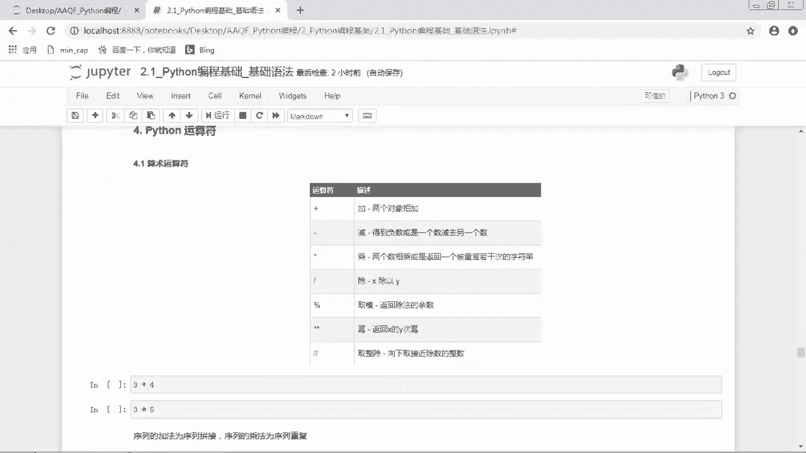

# 2024年金融大神老师讲解量化金融分析师.AQF—量化金融基础知识（完整版课程） - P21：《Python编程》03_Python基础语法 - 量化沿前 - BV1ar421K7Mo

好下面的话我们开始Python基础语法好，我们现在是真的真的真的呃，要终于要开始学习Python了，那首先呃为了保持传统，我们最开始还是print hello world，和世界说一声，你好吧。

那这个print呢是Python的一个非常常用的内置函数，它使用起来也是非常简单的，就把我们想要打印的内容放在这个括号中，那我们运行一下，那我们就是打印出来了，hello world好。

那第一个我们要掌握的概念叫做标识符，标识符，简单的理解标识符就是一个名字，它的主要作用就是作为变量，函数类模块以及其他对象的名称，其实大家就是可以简单的把它理解成一个名字，比如说你你的姓名呃，张三李四。

那别人在叫你的名字的时候，其实就是指代的你这个人，那这个Python中的标识符也是一样的，它呃我们在对每一个变量啊，函数啊，类模块对他们使用的时候，我们都要给它们取个名字，然后之后我们要用它们的时候。

我们就用他们的名字来调取它，但是呢这个名字也不是乱取的，嗯我们来看一下标识符的命名规范，首先标识符是由字符下划线和数字组成的，但是第一个字符不能是数字，标识符，不能和Python中的保留字呃。

或者说叫关键字相同，第三个标识符对大小写敏感，也就是大写的字母和小写的字母，是两个不一样的，而第四和Python语言中，以下划线开头的标识符有特殊含义，除非特定场景需要，应避免使用。

最后一个在python3中可以用中文作为变量名，非ASY标识符也是允许的了，好嗯，我们来看一下，下面哪一些标识符是符合命名规范的，大家可以先暂停思考一下，好现在我们来检验一下，看看大家做的对不对。

那我们来看看，首先第一个python3可不可以，我们把它赋值为一哎，发现没有报错，说明这个是OK的，然后第二个Python下划线三来看一看，哎发现也是可以的，第三个python3。7。

诶那我们是不是发现这里面点七，是不是变成绿色的了呀，那这里是不是出现了一个点，那点的话其实是不包含在字符，下划线和数字中的，所以他这个的话是有点问题的，我们来运行看一看哦。

它就出现了一个syntax error，Invalid，Syntax，也就是语法错误，说明我们这个呃，标识符是不不不符合命名规范的好，第三个三，Python，哎我们发现它最前面这个三是不是也是绿色的。

那我们刚刚说了，第一个字符不能是数字，那说明这个的话也是不可不OK的，那我们运行一下，它也是语法错误，然后第五个是lambda，那我们发现这个拉姆达它也是绿色的，而且是个粗体。

那其实这个lambda是Python的保留字嗯，所以它这里的话是绿色的，那保留字的话是我们是不可以使用的，所以这里的话就是也是呃也是语法错误，然后这个下划线Python，那这个可不可以呢。

那这个是可以的，也就是说以下划线开头的标识符，这是OK的，但是一般来说它是有特殊含义，除非特定场景需要应避免使用，所以我们自己在定义标识符的时候，最好不要在前面呃，不要在这个标识符的开头加下划线。

然后最后一个呃passion可不可以呢，诶发现也是可以的，那这是因为在Python中呃可以用中文作为变量名了，所以非常厉害，那我们中文也是可以作为标识符的，但是我们一般来说的话。

还是不会用中文作为标识符，因为首先第一点看起来也不是很专业嘛，然后第二点的话，你如果用中文的话，有可能会报错，就是不知道报的什么乱七八糟的错误，就是会有一些隐患，所以我们一般在嗯定义一个标识符的时候。

我们就是用一些英文字母，还有下划线和数字组成，比如说这里的python3和这个Python下划线三，这种就是我们比较常用的嗯，比较常用的一个命名形式，那大家如果想要看看自己，就是想要检验自己。

到底呃取的这个标识符是不是符合规范的话，那我们可以看到，如果我们取的这个标识符啊都是黑色的话，那说明应该是不不没有什么问题，那如果说是出现了一些绿色的东西，那说明是有一些问题的，好那这个是关于标识符。

那标识符的作用就是作为变量，函数类模块以及其他对象的名称，那我们之后再使用这些变量，函数类模块以及其他对象的时候，我们就是用它的名字来调用它，好第二个是Python的保留字，Python保留字是关键字。

我们不可以把它们作为任何标识符名称，Python的标准库提供了一个key word模块，可以输出当前版本的所有关键字，那我们就是可以通过这个keyword模块，来看一下所有的关键字。

这样我们也可以避免使用这些关键字，作为标识符，那首先我们import keyword，就是把这个keyword这个模块导入进来，然后使用keyword这个模块的keyword list这个属性好。

这样子的话，我们就是把Python中所有的标识符给打出来了，那我们看一下有哪些，比如说false none true and as assert什么什么，那这些的话都是Python的额关键字。

那这些关键字的话，其实很多在我们之后的编程中，会非常常非常常用，比如说这里面的这个关键字，DEF就是我们在定义函数的时候要使用的，那这个DEL呢就是删除delete，然后l if else。

那这些的话在我们控制结构中会使用，还except finally，那这些话会在这个异常处理中使用，还有什么for啊，from啊，那这些的话都是我们之后会额经常使用到的，那我们之后再跟大家讲吧。

好第三个是注释，Python中单行注释以井号开头，比如说这里我们这里井号后面写的，这是单行注释，那这个其实就是对我们这个前面的代码，做了一个呃解释，那一般的话我们就是会在代码后面写一个注释。

来对这一行代码做一个解释，那写注释的话也是一个非常好的习惯，因为可以大大提高你代码的可读性，因为我们写代码的时候，总是就是会写一大段代码嘛，那如果你什么注释都没写的话，那别人要是拿到了你的这一大段代码。

就不知道你到底在干什么，所以一般的话我们都是要在代码呃，代码的附近写上这些代码的作用，那这样子的话大家就知道，就别人看到你的代码的时候，就知道你在干什么了，那是写注释的话。

我们是用这个井号键来呃表示注释，比如说我们在这里就是一个单行注释，我们这时候运行的呢就是这个前面的内容，那井号后面注释的内容呢是不运行的，那我们刚刚也说了，可以用这个control加斜杠。

这个快捷键来对这一行进行注释，那我们这样子的话，我们看到这一行是不是都变成了一个这个，墨绿色的斜体，在最开头有一个井号，那就说明我们这一整行都变成了一个注释，那现在的话如果我们运行呃，那是没有结果的。

因为注释掉的部分我们是不运行的，所以这个这个单元格里面，其实我们没有运行任何东西，那我们把它再返回来好，现在的话我们才可以运行，那这个是单行注释，如果说我们想要有多行注释，就是我们可能想要解释的内容。

一行写不下，那我们可以写多行，那多行注释可以有下面几种形式，首先最简单的就是可以用多个型号嘛，那你一行的话一个型号，一行的话一个型号，那么想写几行就呃用几个呃，井号不是星号，是井号，那想写井号呃。

想写几行注释，我们就在这些注释前面加井号就OK了，那还有一种方式就是用这个字符串，多行字符串的格式，可以用三个单引号或者三个双引号，其实我们这里按键盘三个单引号的话，它自动就会变成这样的一个一对儿呃。

双呃这个引号，那我们在这个一对引号里面写上内容，写上我们想要注释的内容，比如说内容内容内容好，那这个的话其实就是一个四呃多行注释，那我们想要把我们解释的内容写在这里面，就可以了，那我们在运行这个代码。

这个代码块的时候，这个呃引号部分是不运行的，那这是多行注释，使用单引号，这是多行注释，使用双引号，也就是说我们是可以使用三个单引号，或者三个双引号，注意一下这个三个单引号，三个双引号，你左右一定要配对。

你不要说这个前面是用三个单引号，后面用三个双引号，这样子的话是不对的，那一定是前后是要对应的好，那这里面的话，其实这个这个和这坨这些都是注释，然后最后的这一行print hello world。

才是我们运行的部分，所以我们如果运行这整个单元格的话，我们就会发现它只运行了一个print hello world，把这个hello word打印了出来，好这个是注释，那注释的话是一个非常好的习惯。

大家之后写代码的时候一定要多写注释好，第四个是缩进，Python最具特色的就是使用缩进来表示代码块，不需要使用大括号，那么如果呃有的同学是学过C语言的话，那我们知道是用大括号来表示代码块的。

但是Python中是使用缩进，缩进的空格数是可变的，但是同一代码块的语句，必须包含相同的缩进空格数，比如说我们这里有一个条件语句，那我们看到这个print前面是不是有一些空格，那这块的话其实就是缩进。

那缩进的话我们可以直接按这个空格键，比如说我这里按了四个空格键，然后下面也是四个空格键，大家一定就是这些缩进的空格要保持一致，那如果说不想按空格键的话，也可以直接用tab直接按这个tab键。

也是可以增加缩进，或者说我们之前讲的这个呃，按CTRL加呃，这个右in括号二键也是可以增加缩进，那减少缩进的话是CTRL加左in括号键，或者说用shift tab也是减少缩进嗯，好。

那这个现在这个代码的内容不需要大家掌握，大家就是只要知道呃，Python中是使用缩进嗯来表示代码块的就可以了，好下面是多行代码，那Python通常是一行写完一条语句，但是如果语句很长的话。

我们可以使用反斜杠来实现多行语句，就是说如果你这一行代码写太多的话，我们可以使用多行，比如说我们这里有first variable是一，然后second variable是等于二。

然后third variable是等于三，其实我们这里的话就是定义了三个变量，那下面的话，那如果说我们想要把这三个变量，进行一个加总求和。

那我们可以用first variable加上second variable，加上third variable，那其实这一行我们其实是可以写下的了，那我们运行是OK的，那但是如果说我们这一行是很长。

假装我假装呃，这行超级长，我们写不下了，那我们可以在这里加一个反斜杠，然后把这个呃后面的内容写到下面一行来，那这样子的话我们也是可以正常运行的，注意一下，在硬括号，大括号或者呃小括号中的多行语句。

不需要使用反斜杠，也就是在括号中我们是不用反斜杠的，比如说这里有一个列表，然后是first variable，Second variable，Third variable，是一个三个元素的列表。

那么如果说这个列表太长了，我们想要把它换行的话，那这里就不需要反斜杠，我们直接呃enter键直接回车换行就OK了，好那这个是多行代码，第六个是导入模块。

在Python中用import或者from import来导入相应的模块，那在Python中我们经常会使用第三方模块，那在使用第三方模块之前，我们首先就要把这个模块给导入进来。

那那导入模块主要有下面几种格呃形式，首先第一个呢是将整个模块导入，格式是import some module，那这个some module呢，这个sun module就是这个模块名。

比如说我们如果要导入NN派的话，我们就是import nn派，好，第二种方法呢是从某个模块中导入某个函数，格式为from some module，Import some function。

也就是说我们不是把整个模块导入，而是导入模块中的某一个函数，比如说我们从这个max模块中导入一个log啊，log函数，那现在的话，我们就仅仅是把这个log函数给导入进来了。

那如果说我们想要从某个模块中导入，多个函数的话，我们就from some module，Import first function，Second function，Third function。

那这里面的不同的函数之间用逗号隔开，然后嗯，第四种方式呢是将某个模块中的全部函数导入，格式为from some model import星号，那但是这种方法呢我不是很推荐。

因为如果我们对这个模块不是很熟悉的话，我们一下子把这个模块中，所有的函数全部都导入进来的话，那我们的命名空间就一下子变得非常大，它这个模块中的所有函数名，就一下子导入我们当前的命名空间了。

那我们之后再给呃，在取新的变量名的时候，我们就要避免和这里面和命名空间中已有的呃，这个名称重复，那这时候我们就不知道我们到底有没有重复，所以这种方法是不推荐的呃，那其实还有一种就是导入模块的方法。

就是import，Some module，然后as什么什么什么东西，那as后面是对这个module的简写，比如说我们在导入NPD的时候，一般是把它简写成NP，然后导入pandas的时候。

一般是把它简写成pd，那这样子我们在接下来的过程中，使用N派的时候，我们就不要再是呃写non派点什么什么了，我们直接写NP点什么什么就OK了，那这样子的话其实就是偷个懒嘛，就减小一减小一下工作量。

我们来看一下啊，下面几个例子，首先是将整个模块导入，比如说我们把这个max模块导入好，就是import mah，如果说我们将max模块中log函数导入，就是from max import log。

那把这个log函数导入进来之后，我们就是直接可以使用log函数了，比如说log10，那如果说我们仅仅是import max，没有把这个log导入进来的话，我们就是一定要用max点log它才可以使用的嗯。

然后下面是from math import log pi，那这里面的话我们就是导入了两个函数，那这里面是用逗号隔开啊，这里的话我也写了，就是很多模块在导入时惯例使用简写形式，便于之后的使用。

比如说我们NN派导入进来的时候，一般会简写成NP，然后pandas导入进来的时候，一般会简写成pd matt pop lib，点py plot导入进来的时候，一般会写成PRT。

那这样子的话可以大大减小我们之后的工作量，比如说我们在用画图的时候，如果我们不把它简写成P2T，我们就每一次都得写这么一长串，然后点plot什么什么东西，那如果说我们把它简写成P2T的话。

那么之后在画图的时候就直接写PLT，点plot就可以了，所以这个PLT其实就是只带了，这前面这一坨东西好，这个是Python的呃，一些基本的语法，我们来看一下我们学了哪一些基本的语法。

那首先的话是嗯Python的标识符，Python标识符也就是嗯对，也就是对Python中的一些对象给他们取名字，那注意一下取名字的这个命名规范，第二个是保留字，也就是关键字。

那Python中是有这些关键字，在我们之后的学习过程中也会多多使用，第三个是注释，注释的话，一般就是写对这个代码的一些解释内容，那注释的话可以用井号开头，那如果说是多行注释的话，也可以用三个单引号。

或者说三个多引号呃，三个双引号来括起来，第四个是缩进，Python是使用缩进来表示代码块，第五个是多行代码，那如果说呃代码很长的话，我们可以用反斜杠来实现多行语句。

但是一般的话我们还是避免这个代码写的太长，如果这个代码太长的话，我们最好还是把这个代码拆分成多呃多行，这样这样子的话别人也看得清楚，自己脑子也比较清楚，但如果实在是不行的话。

那我们可以把它写成多行的形式，那如果是在括号中的多行语句，就不需要使用反斜杠，然后第六个是导入模块，那导入模块的话呃，可以将整个模块导入，或者说导入模块中的某一个函数或某几个函数。

然后在很多模块导入的时候，经常会使用简写形式好，那这一个是Python的基础语法部分，下面呢给大家介绍Python中的基本数据类型，那在介绍基本数据类型之前，我们首先介绍一个变量的概念。

那变量是什么东西呢，嗯变量是一种placeholder，它可以呃可以给它赋予普通的值，还可以让它等于某一个函数，那placeholder是什么东西，那其实大家可以把它想象成一个容器。

嗯比如说我们把这个变量啊想象成一个房字，那这个呢是一个房子，它是一个变量，那变量的名称我们可以把它想象成门牌号码，那就是它的变量名，那注意一下变量名也是一个标识符，它是要符合标识符的命名规范的。

那Python中的变量不需要声明，每一个变量在使用前必须赋值，变量赋值后，该变量才会被创建，那这也就是说我们这个变量这个房子啊，它在Python中这个房子是不可以是空的，它里面得一定得有点东西。

那我们把一个对象放到这个房子里面去，那我们取这个变量名，同时把这个对象放到这个变量，这个过程呢叫做变量的赋值，我们是用等号来给变量赋值，在Python中变量就是变量，它没有类型。

我们所说的类型是变量所指内存中，对量对象的类型，也就是说这个这个这个房子呢是变量，它本身是没有类型的，我们所说的这个变量的类型，是指的这个房子里面住的这个对象的类型好。

这样子的话大家有没有就是呃稍微的理解一点，那变量的话它就是一个房子，然后变量名就是门牌号，然后对象呢就是这个房子里面住的人，那房子里面其实是可以住不同的人的对吧，那今天这个房子是我住在里面。

然后过段时间我搬走了，另外一个人住进来哦，那这个在Python中也是可以的，那我们可以把另外一个对象放到这个呃，变量里面，也就是把另外一个对象赋值给这个变量，那这时候前面一个对象就被赶走了。

那现在就是后面一个对象在这个房子里面了，我们来看一个例子啊，比如说我们这里是close等于十好，那这个close呢就是变量名，然后它的值呢就是十，那这个十其实就是放在close这个变量里面的对象。

那我们如果说close这个变量的类型，其实我们就是指代的十的类型，那十其实就是一个数值型的变量，就是一个数值型的对象好，那我们运行这一行的话，其实就是创建了呃close这个变量。

那这个其实是一个匿名函数，它其实是一个函数，那我们这里的话，其实就是把一个函数赋值给F这个变量，因为我们说变量它是可以是某一个值，也可以是某一个函数，当然它也可以是其他的东西。

那这里面的话我们就是把它赋值给了F，那下面是一个序列解包的操作，也就是同时赋值多个变量，唉上面的话我们是不是只是单单赋值了一个close，一个F那我们也可以同时赋值多个变量。

比如说这里我们是赋值close和percent change两个变量，那我们是分别将十这个值和0。09，这个值赋值给close变量诶，那我们注意一下，我们这个close是不是在上面已经复制过了呀。

那如果说我们在这个之前的话，我们调用close这个变量，我们会发现它的值是十，那如果说我们现在唉这里赋值不是十了，我把它赋值成100好不好，那我们现在把这个100赋值给close。

那我们现在调用close这个变量的话，那我们就会发现它的值变成100了，这也就是说close这个房子里面本来住的是十，现在我把这个100放进去，它就自动把之前的那个十赶走了。

现在就是100住在这个close这个房子里面了，那我们现在呃调用这个close变量的话，就是我们后来复制的这个100，那我们可以使用delete来删除对象，那我们可以看一看我们现在有哪一些呃变量。

那有哪些变量的话，我们是不是可以用这个WHOS，这个魔法命令哦，我们现在有不少变量耶，额我们现在就是这些都是我们现在有的变量，那我们现在delete close，那我们来操作一下好。

现在的话我们就是把close这个变量给删掉了，那我们再来运行一下这个魔法命令，那我们看到我们这个close呃，变量就不在我们这个呃变量列表里面了，你看在上面的话，我们的这个close是不是在这里。

然后它的值呢是100，它的类型是int是一个整形，然后在下面的话，我们就发现A后面就直接是F了，这个close就没有了，就被删掉了，好这个是变量，那接下来我们就来看这个python3中的。

六个标准的数据类型，那python3中是有三个基本数据类型是呃number，也就是数值型，string字符串list列表，tuple元组set集合，dictionary字典。

那在python3的六个标准数据类型中，number string和突破是不可变数据类型，list呃，dictionary和set，这三个是可变数据类型，那什么是不可变，什么是可变呢。

那其实就是字面意义了，比如说一个数字嗯是一，那我们不不可以把它改成其他的数字，那如果说我们要把它改成一个十，它其实就是另外一个数字了，但是列表字典和集合它是可变的，比如说这样有一个列表是123。

这是一个列表，那我们可以在这个列表中添加元素，我们又增加了一个元素四，哎注意一下，这时候呢我们是在这个原来的列表本身把它呃，进行了一个修改，那字典和集合的话，也是可以在它本身上做修改的。

但是数字字符串和元组，这三个类型是不可以在它本身上修改的，如果修改的话，其实就是创建了一个新的对象了，好，那我们这一节课的话，就是带大家认识一下，这几个数据类型是长什么样子的，然后怎么创建的嗯。

大概是一个什么情况，那下面一节课的话，我们会依次对这六种数据类型，做一个详细的讲解好，那我们首先来看一下数字哦，就是number Python，三是支持int float bin。

concomplient complex就是这样四种数字类型，那int的话就是整形，就是整数，比如说123，然后float的话就是浮点型，就是后面有小数点的，就是点一啊，点二啊这种。

然后BLA呢是布尔型，就是零和一，或者说是呃true和false，这是布尔型，然complex是复数，复数的话就是虚数啊，就是什么A加BJ啊，那种形式，好像大多数语言一样。

数值类型的附着和计算都是很直观的，内置的ta函数，可以用来查询变量所指的对象类型，那比如说我们这里呃NM1，这个变量呢是赋值一，那我们这一行其实就是创建了一个变量，是NM1，然后同时它的值是一。

那我们可以通过ta函数来查询变量所指的，对象类型，那么可以看一下它的类型是一，那呃一类型是int表示整形，因为一其实就是一个整数嘛，那如果说嗯我们又这里又创建了一个新的变量，是NM2，然后它是一点。

那现在我们来看一下这个NM2，它的类型是什么，那我们发现它是一个float，哎有的同学就很奇怪啊，这明明不是也是一个整形吗，它不是还是一吗，但是我们注意了，如果说我们在这个后面加一个点的话。

不管后面是点零还是点什么什么东西，不管它到底是整数还是浮点型，它都是浮点型，就是只要它有点，它就是浮点型，那当然了，浮点型就是比较正常的话，就点一啊或者点二啊这种，那这种肯定就是浮点型，没有什么意义好。

然后嗯那么三这个变量呢是等于true，true的话是一个布尔型，那我们可以看一下他的额，这个它的类型是等于布尔型，那还有一种布尔型就是false，那false也是一个布尔型的数据。

那true和false它的值是零和一，但是如果说我们把它直接赋值是零还是一的话，它的数字类型其实还是整形，所以所以true和false的话是布尔型，然后最后一个complex复数。

这个的话我们基本上用不到呃，就就不再多说了，好那这个的话就是数字了，就非常简单，那如果说我们要对数字进行一个加减乘除的话，也是非常简单的，比如说啊这个1+2就是四等于三。

那这个就是和我们之前学的数学是一模一样的，嗯是嗯，这这些都是很直观的啦，没什么好说的好，第二个是字符串，Python中的字符串是用单引号或者双引号括起来，同时使用反斜杠转义特殊字符。

那我们来看一下这个呃字符串是怎么创建的，比如这里print hello world，那这里面的这个hello word，我们是不是看到他两边都有个单引号，那说明这个的话其实就是一个字符串。

那它就是一个字符串，那字符串也可以使用双引号来创建，比如说这里的话，hello world旁边是两个双引号，好字符串可以使用反斜杠来转义特殊字符嗯，什么是特殊字符呢，比如说这里单引号就是一个特殊字符。

如果说我们要在这个单引号的字符串里面，添加一个单引号，如果就直接这样写的话，我们会发现是报错的，我们直接看也发现就是有问题吗，因为我们这里的话变成黑色，说明有问题，因为字符串的话就是这里的红色。

那这时候呢，我们可以在这个单引号前面加一个呃，反斜杠来进行转义，这样子的话这个反斜杠加单引号，就是表示单引号，这样我们就是可以在这个字符串里面，添加了一个单引号了，那当然了。

如果我们不想用反斜杠进行转移的话，我们还有另外一种方法，就是把外面这个单引号改成双引号，注意啊，这个前后的双引号要配对好，这样一个由双引号创建的字符串，里面加入一个单引号的话，也是OK的。

那这样子的话也是同样的一个结果，那如果说我们想要在这个单呃，字符串里面添加一个双引号的话，那我们可以在前面加上一个反斜杠，这样子我们就是呃转移了这个反斜杠，或者我们也可以把外面的这个双引号。

改成单引号啊，这样也是OK的，总之就是说嗯，我们最外面创建字符串的这个单引号，双引号要对应对，然后中间如果我们是想要用单引号的话，那外面就可以用双引号来创建，那如果说我们中间想要用双引号的话。

那外面就可以用单引号来创建，那如果说我们嗯就是呃想直接转译的话，我们就可以用反斜杠来转义特殊字符，那转义特殊字符呃，在下面在后面一节字符串里面的话，还会跟大家详细讲，那我们这节课大家要掌握的字符串。

就是说我们要知道，字符串是用单引号或者双引号括起来的，那长成这个样子的就是一个字符串，好那第三个是列表，列表中列表是Python中使用最频繁的数据类型，那其实也不是最频繁的，就是最频繁的之一吧。

那其他的几种数据，基本的数据类型也是使用非常频繁的，而列表中元素的类型可以不相同，它支持数字字符串，甚至可以包含列表，所谓嵌套列表的创建，使用方括号元素之间用逗号隔开。

比如说我们这里创建了一个列表list，然后它的是有三个元素是123，那注意一下，我们创建的话是用方括号来创建的，也就是它左右是用方括号把它包裹起来的，然后中间的元素是用逗号隔开的。

那我们这里面是三个元素，我们把这三个元素用逗号隔开，那列表中元素的类型是可以不相同的，那这里的话我们类型都是一样的，就是整数型，那它是支持数字啊，字符串，比如说我们这里的话。

我们把这个三改成呃Python，这样也是可以的，那在列表中甚至还可以包含另外一个列表，比如说我们这里再加入一个列表，那这个列表里面我们叫嗯这个567，好了好，那这个的话其实是一个小列表。

那这个小列表是包含在这个外面的，这个大列表里面的，那这个的话叫做列表嵌套好，那这个是列表，大家要记得是用方括号来创建的好，第四个是元组，元组是和列表非常相似，不同之处在于元组的元素不能修改。

那因为元组的话是一个不可变数据类型，元组写在小括号里面，元素之间用逗号隔开啊，那比如说这里面123是一个元组，那我们看到他旁边是小括号隔开，第五个是集合，集合是由一个或数个形态各异的大小，整体组成的。

构成集合的事物或对象称作元素或者成员，基本功能是进行成员关系测试和删除重复元素，可以使用大括号或者set函数创建集合，注意创建一个空集合，必须使用set，而不是花括号，因为花括号是用来创建一个空字典好。

那这个集合其实和我们在数学中呃，学的这个集合差不多意思了，那比如说这个是呃创建一个集合，那创建集合我们是用花花括号，外面是这个花括号，然后中间呢是我们要添加进去的元素或者对象。

那我们这里是111222哦，注意一下啊，集合它里面是呃集合的元素都是独一无二的，所以如果说我们创建这样的一个集合，我们看看它的结果是什么，我们发现它的结果是一二，也就是只保留了这个不重复的一和二。

这两个元素，那我们也可以将list一个列表转乘集合，比如说我们这里有一个列表是1122，那列表的话它其实是可以有重复元素的，那我们这里创建出来，我们可以看一下哦，这个列表是1122，它是有六个元素的。

那如果说我们把这个列表转成一个集合的话，我们可以使用set函数，那我们就是用set，然后一个括小括号，然后把这个list放在这个小括号里面好，这样子的话，我们就是把这个列表转成了一个集合。

好我们看到它也是一二哦，它现在的话就是只保留了独一无二的两个元素，那注意一下，创建一个空集合，必须是要用set函数，而不是用花括号，比如说我们这里如果直接是用花括号的话，我们来看一下它的类型是什么。

它类型是dict，是字典，那如果说我们用set函数创建的空集合，那这个才是set，好这个是集合，那最后一个数据类型是字典dictionary，字典是一种映射类型，那什么是映射类型啊。

那我们之前学过的映射类型是不是呃函数，那我们说函数是一个映射关系，因为这个X和Y是一个一一对应的关系，那每一个X1都对应一个Y1，每一个X都对应一个Y，那这个呢是叫做映射关系。

那字典它既然是一个映射类型，说明也是一个一一对应的关系，那它是什么和什么一一对应呢，它是这个key键和值value11对应好，那字典呃它是一个无序的键值集合，那字典它基本的形式是首先外面是一个花括号。

然后它的元素之间呢也是用逗号隔开的，然后它每一个元素呢就是这样的一个键值对，那键值对呢就是用冒号隔开，也就是key冒号value，那这里面的呃键和和键值对呢，键和值呢是一一对应的，注意一下。

字典是一个无序的集合，那列表是一个有序的对象集合，字典是无序的对象集合，两者之间区别在于，字典当中的元素是通过键来存取的，而不是通过偏移存取，嗯那这个是什么意思呢，嗯这个是说呃。

比如说我们有一个列表是123，那我们在对列表中元素取取值的时候，我们是通过它的位置来选取的，那第一个元素它的位置是零，第二个元素的位置是一，第三个元素的位置是二，那假设这个元素这个变量是叫做list。

那我们要取出这个list中第一个元素的话，那我们就是用list0，那我们就是把这个位置为零的这个元素取出来，那它就是一，那但是在字典中是没有顺序的，也就是对于字典中，比如说我们这里有一个呃，有一个字典。

然后字典第一个是嗯A是一，然后第二个是B是二，然后第三个是C13，比如说是有这样三个元素，那这三个元素其实没有顺序的，就是并没有说什么012这样的顺序是没有的，所以如果说我们要取出这个这个一这个值的话。

我们是要通过它的键来获取，比如说它这个嗯字典呢是叫做D，那我们就是用DA来获取这个一这个值，那这个的话就是获取到一好，这个的话其实我们之后还会再详细讲，那现在的话大家就是稍微有一个印象就可以了。

字典的键呢必须使用不可变数据类型，在同一个字典中键必须是唯一的，也就是我们这里面的字呃，这里面的键是不可以有重复的值，好我们来看一下一个例子啊，比如说这里的话我们创建了一个字典，它是有两个元素。

第一个元素是呃name，然后对应的是棒啊，那我们这里的话是AQF了，所以第一个元素的键值对，那他这个键呢就是这个呃name，它这个就是key，然后它的值呢就是呃AQF，然后第二个元素呢是score99。

那我们发现这个的话就是第二个key，然后这个就是第二个key对应的值好，这个是字典的呃，基本格式好，那这个就是我们在Python中的六种基呃，基本的数据类型，那这里面我们其实只要掌握嗯这个数呃。

六种数据类型的基本格式就可以了，那数字的话一目了然，就是嗯大家就是平时用的这些数字，那字符串的话是用引号括起来的，可以是单引号，也可以是双引号，列表的话是用方括号来括起来的。

元组是用这个呃小括号括起来的，集合是用花括号括起来的，注意一下集合和字典的区别在于，字典也是花括号，但是字典中是键值，对对吧，所以它每一个元素的话都是一个键值对，所以它每一个元素都是用冒号隔开的。

那这个是字典和集合的一个区别好。

