# 2024年金融大神老师讲解量化金融分析师.AQF—量化金融基础知识（完整版课程） - P22：《+威❤hhh427501  了解获取全套课程》04_Python运算符 - 量化沿前 - BV1ar421K7Mo

好，接下来我们来看一下pathon运算符。首先是算术运算符。算术运算符非常简单，就是像加减乘除这些。那加法就是加法减法的话，它可以得到负数。就比如说我们在一个呃数字之前加一个负号就是变成负数了嘛。

然后乘法除法，那百分号是取模，也就是返回除法的余数。比如说十。比如说嗯1百分号3，那因为十0除以3等于3余一嘛，那所以它余数是一，那这个是叫做取模，然后两个星号是表示幂，然后两个这个斜杠是表示取整除。

比如说十呃整除三，那就是等于3。那算术运算符式非常简单的，我们来看几个例子，那3加4等于73乘5等于15序列的加法为序列，拼接序列的乘法为序列重复。那什么是序列呢？

序列的话就是嗯字符串列表元组这几种数据类型。那我们来看一下，如果说我们把这个列表123和列表456加起来，那是什样的结果呢？哎，那我们就是把这两个列表给拼接起来了，现在就是得到了一个6个元素的呃列表。

那如果说序列的乘法就是序列的重复啊，那比如说我们这里是123这个列表，然后乘以3。它不是说把这里面每一个元素都乘以3，而是把这个列表重复了3次。你看我们这里是123123123。

那现在我们得到的就是有9个元素的这样的一个列表。好，那这个是叫做序列的加法和序列的乘法。那除法的话很简单。3除以4是0。75取模，那也就是取余数。那这个我们刚刚讲过了10除以10嗯。

取模三的话就是等于3余1，那就是等于1。然后二的3次方呃，这个是这个两个星号是表示幂运算，就是二的3次方等于8。然后两个斜杠是表示整除，那四整除三的话就是一。好。

那除了python里面的这些嗯基本的算术运算符之外呢，我们也可以导入一些其他的算术运算的模块。比如说我们可以导入mas模块，那ms模块中有非常多呃比较高级的算术运算的方法。

比如说我们这里把import mass把ma模块导入进来。然后我们可以算对数。那注意一下我们这里是直接import mass，所以我们下面再用这个log的时候。

我们要在前面加mas点log是表示mas在这个模块中的log这个函数。好，那我们然后在这个里面算十的对数，就是2。302585什么。那如果说我们是嗯from mass。

import log如果是这种方式的话，那我们直接用log就可以了。在max中还有其他的，比如说max派。好，这个是算术的运算，接下来是比较运算，那比较运算就是比较是不是相等，是不是不相等呃。

大于小于这些。那我们来看一看。如果说我们要比较两个对象是否相等的话，我们是要用两个等于号，这个是要注意一下的嗯，是要用两个等于号。如果说我们要比较两个对象是不是不相等，是感叹号加等于号。

那这个是表示不相等。然后大鱼小鱼没什么好说的。然后大于等于就是大于等于小于等于小于等于。那下面的话都是嗯字面的了。那我们看几个例子，那这里的话是有两个变量，一个是close。

表示今日收盘价pre close表示昨天的收盘价。我们运行一下的话，就是表示把这个嗯这两个变量创建了。这里提示一下大家代码一定要运行啊，就是你运行了之后，它才会生效。

如果说我只是把这个东西写在这个框框里面，不运行的话就是。直然后直接再进行下面的操作的话，它就会告诉你说没有这个变量。嗯，所以代码一定要运行。那什么是运行呢？就是我们在这个印这个方括号里面出现了数字。

那就表示是运行。那这个数字大小就表示你是运行的多少次。那这个的话就表示我是第1二次运行。然后下面这些空格空的的话就表示还没有运行。好，那我们来比较一下pre close和 close。唉。

这里面的话是两个等于号，它虽然连在一起了，但是这里面是两个等于号。那我们可以比较一下，然后它是fse，那因为十不等于9嘛，所以如果我们判断它们是否相等的话，就是false。

那这个是感叹号等于是表示不等于那他们两个确实是不等于，所以返回是true。然后下面是大于号，就是判断这个close是不是大于pre close，那就是判断十是不是大于9，那是true。好。

最后一个是pre closese小于等于close。那pre close是9嘛，然后小于等于10是true。好，那这个的话比较简单就是比较两个数字比较两个对象之间的大小。

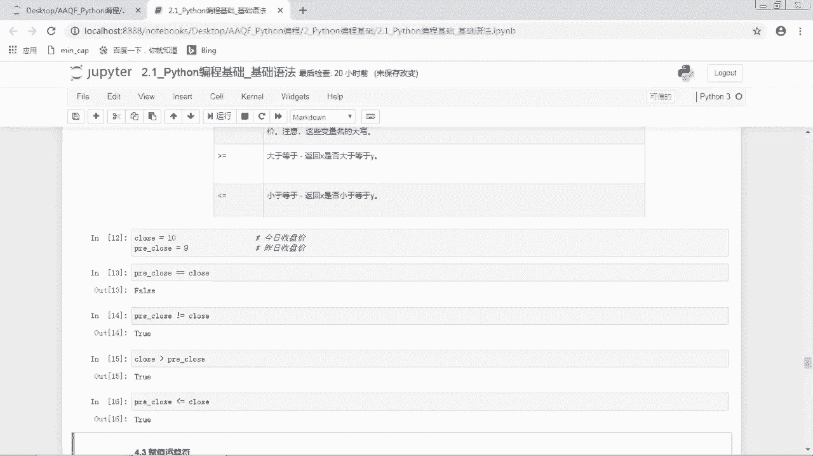

第三个是负值运算符，那负值运算符最简单的就是一个等号的一个等号，那一个等号就是简单的负值运算符。那我们在创建变量的时候，就需要用这个等号来创建变量。比如说嗯。C等于A加B。

也就是将A加B的运算结果赋值为C。那复制运算符还可以和算术运算符进行结合使用。这样子的话是可以省略一些不呃，就是嗯省略一些代码。比如说加法运算符加等于它就是表示哎C加等于A就等效于C等于C加A。

也就是在它自己本身上面加一个对象。那我们就直接用C加等于A就可以了。那减法也是一样的，C减等于A就等于C等于C减A。然后乘等于就是呃等于它本身乘以一个对象，除法运算符就是等于它本身除以一个对象。

取模运算就是等于它本身取模运算，然后幂取整除。那这些的话就是把这个简单的负值运算符和算术运算符结合在一起。那这一块的话，其实就是可以省略它本身的这个。这一块代码。

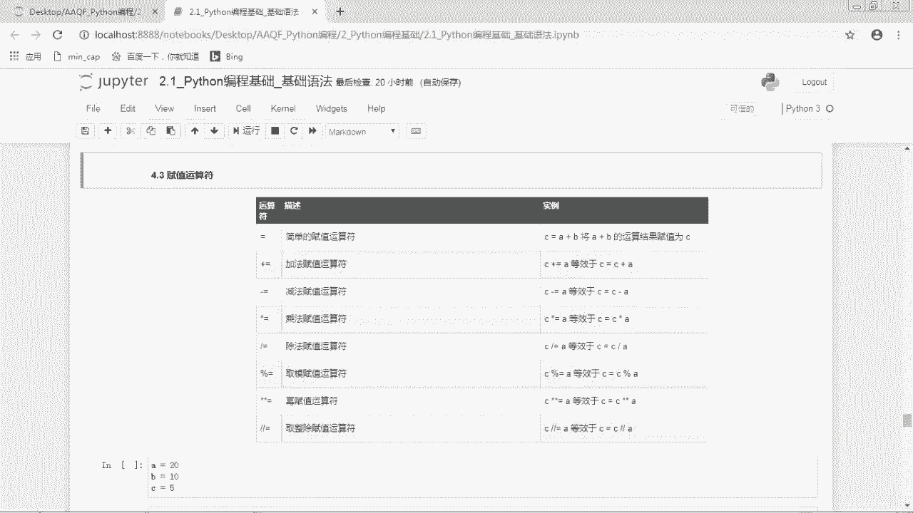

我们来看几个例子。比如说这里我们是创建了三个变量，A是等于20，B是等于10，C是等于5。然后A加等于一，就是等价于A等于A加一，就是在它本身加上一，那我们本身是20嘛，那加上一就是呃21。

那我们可以现在看一下A是不是等于21。哎，但现在就是等于21了。那我们可以再次运行这个。哎，注意一下哦，我们要看这个代码运行顺序的时候，不是说谁在上面就是表示谁先运行的，而是看这个数字。

那我们这里下面是19，上面是20的话，表示上面这个是在下面这一行的后面运行的那这个19的时候，A是等于21。那么我们在20的时候又运行了一次A加等于1。那这时候A就又加了一。好，现在我们再运行这个哎。

我们发现A就是等于22了。好，这个也是大家要注意一下的。然后下面是B加等于A，那这个其实就是在B的基础上加上了一个A，那B是等于多少？B是等于10A现在是等于22，那10加22就是等于32。好。

这个是乘等于就是等于呃B等于B乘C。那就是现在那现在B的话是已经是32了，注意一下，不是原来的1了，现在B是32，然后乘以5，我们看一下是等于160。好，这个是复值运算符，那复值运算符也是非常有用的。

因为它可以帮我们节省代码。那下面看一个比较呃实际的例子，比如说这个R一是表示股票第一天的涨幅是0。05，然后R2等于0。1，就是股票第二天的涨幅是0。1。那接下来呢我们要计算持仓收益情况。哎。

那我们怎么来计算收益？那如果说我们计算第一天的收益，是不是就是嗯1加R1，其实就是第一天嗯就是第一天之后的净值了。那因为最开始的话，如果净值是一的话，那过第一天是不是就变成了1加R1？

那到了第二天是不是就变成了1加R1乘以一个呃1加R2。对吧。😊，那我们来看一下下面这个运算。那首先的话R curve等于一，也就是我们第一天的净值是一。那第一天之后呢，我们这个净值变成多少。

那我们是不是要用R curve乘以一个1加R1。那这个呢就可以简写成乘等于，也就是在它自己本身上再乘了一个一加R1。好，那乘了之后就是1。05。那现在这个R curve就是1。05了。那我们再过第二天。

那再过第二天我们是不是又在这个的基础上再乘以一个一加R2。那如果说我们不用乘等于的话，我们就要写R curve等于R curve乘以1加R2。那这样子的话就比较啰嗦嘛？那我们可以把这一块的话省略掉。

就直接写成乘等于就可以了。好，那我们乘下来就是等于1。155。好，那这个是复值运算符的一个实际实际应用。接下来是逻辑运算符，那逻辑运算符就是与或非就是and not and or not。

那and的话呃。比如说这里呃X andY它是说不尔，它是指不尔语，就是如果X是falseX andY返回foralse，否则它返回Y的计算值。他这里说的比较绕口。

其实的话就是A andYX andY就是两个要同时正确。这个and就是和嘛。那和的话就是呃同时的意思。那他们两个同时是处的话，它才会返回处。那如果说其中有一个是foralse的话。

它就是返回foralse。那二的话就是表示或，也就是X或什么。那因为是货嘛，所以就是X和Y中间只要有一个处e，它就是te。那这里说的是，如果X是触则返回X值。也就是如果X是 truee的话。

因为只要有一个处e就返回te嘛，所以X已经是te的话，那我们就返回处e。嗯，如果X是forse的话，它就返回Y的计算值。那就是如果X是fse，那我们就得看Y是不是te还是fse嘛。

那Y如果是true的话，那就是te。那Y如果是false的话，就是false。那如果是这个and的话。and的话，它是说如果X是forse，它就是forse。

因为and就是两个都同时都要是处e的时候才是te。那如果说第一个X都已经是fse了，那就没有处的可能了嘛，那只可能是forse。好嗯，not X那not的话就是取非，就是取取反。如果X是处e的话。

它就是返回forse。如果它是forse的话就返回出那取一个相反的。好，我们来看几个就是例子。那首先是逻辑语and。那下面的话我是打印了4个，那就是判断一下。呃，就是来看一下这个逻辑运算的结果是什么。

好，我们看到嗯第一个true and truee，那 truee and true两个都是true，所以返回的是true。

那我们看到下面te and false  false and true  false and false。那这里面的话，因为其中出现了一个foralse，那只要里面是存在forse。

那我们就返回foralse。那这个是逻辑语。那逻辑语and的话就是全部是te才是true。好，那第二个是或嗯或的话就是只要有te就是true。那么来看一下，只要有 truee就是te。

那true andtrue or truee的话，它里面全是true，那就是true。那true or false的话，它里面有一个true，然后fse or true，那它也是true。

那除非它是false or false，它两个都是false，那它这时候就是foralse了。好，那就是逻辑或 or的话，它就是里面只要有te，就是true。那note的话就没啥好说的。

所以这里没有举例子嗯。那这个逻辑运算符也是用的非常多的。比如说我们嗯选就是按按条件来选股，那我们想要判断的条件是这个LOEP和PP值。那我们就是根据这三个值来进行选股。好。

那我们现在呢是收取了一个股票的数据，它的ROE是0。12PE值是20，然后PB是2。好，我们现在的话来判断这个LOE是否大于10。那我们是不是可以用这个比较运算符来进行判断。那ROE大于0。1。

我们来判断一下。因为LOE是0。12嘛，那这个是 true。好，那这个的话其实只是判断了一个条件。那如果说我们要判断多个条件呢，那判断多个条件的话，我们就需要使用逻辑运算符。

如果说我们要选出至少满足两个条件中其中一个股票，那什么叫至少两个条件中的其中一个，那就是或嘛，就要么是满足这个，要么是满足另外一个，所以这里面的话我们是使用or这个逻辑运算符。

那or的前面是ROE大于0。1，然后后面是PE小于0。小于15。那这时候呢我们就是要把这两个条件首先进行一个判断，那我们先判断一下RE大于0。1是什么？是te，对吧？那PE小于15。

那PE是22是小于15是fse。那这里面的话因为是all，那or的话就是只要有 truee，就是te。所以这里面就是 truee。好，那如果说我们要选出同时满足两个条件的股票。

那我们就是要用and and的话就是同时满足。其实大家就会发现这个python代码就是真的和我们平时用的语言就非常多。那and的话，我们平时就是呃在使用的时候就是表示同就是同时满足嘛。

那all的话就是要么什么什么，要么什么什么，就是满足其中一个哦。就是所以python语言其实是非常接近人类自然语言的。好，我们来看一下，如果使用and的话，那就是两个条件都要满足。

就是两个do要 truee才是true。那LE大于0。1哈，是te，然后PE小于15是fse。那所以的话这样子的话，我们就是返回的是forse。好，那这个是两个条件。那如果说我们是要有多个条件怎么办呢？

我们可不可以把这个多个and和O连在一起呢？我们试一个试看啊。比如说我们后面再接一个and，那其实这个就很混乱了，你就不知道到底是。就是先判断的是什么。🎼比如说PB大于3吧。那这个的话也是可以呃。

就是也是可以运算的。因为其实and all和note之间是有比较级的。这个比较急，在我们之后会说，但是这种的话就是其实你是很难呃很难判别。因为你不知道到底是先算这个O呢，还是先算这个and。

所以如果说你要这样判断的话，你最好就是在你判断的这个顺序上啊加个括号，比如说我想先判断这前两个哎，那我就是先判断这个前面的这个O，然后再和后面这个and进行判断。那我们看一下这个结果。

那这个前面是不是te，那后面的话是fse，对吧？那这时候应该返回的就是foralse，哎，那说明那我们刚刚是不是返回的te啊，那我们刚刚返回te的话，那是不是说明不是先预算后面的呀。

那其实的话就是and的比较级是要比o要呃更高一些的。所以我们其实刚刚是先去先运算的这后面的那我们看一下后面的PE小于15，那这个是forse，对吧？那foralse的话，那后面这一块就是foralse。

那接下来我们再判断这个O。那前面这个LOE已经是大于零满足了，那就是true。好，那这样子的话，我们就是返回的是true。所以如果有这样三个以及以上条件的话，大家就是要把这个呃顺序给先扩起来。

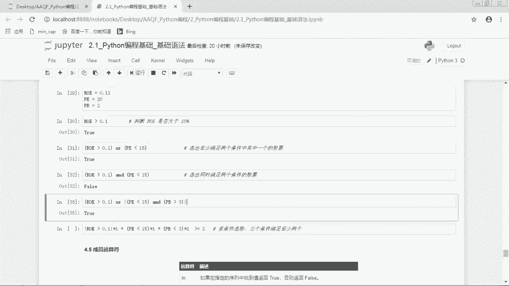

还有一种另外还有另外一种多条件选股的方法。比如说我们三个条件满足至少两个。哎，那这时候呢我们就是有三个条件，但是我们并不确定要满足其中的哪哪几个，但是我们只要满足至少两个就可以了。

那随便两个随便哪两个都可以。那满足三个的话也可以。那这时候我们怎么来做呢？我们是。

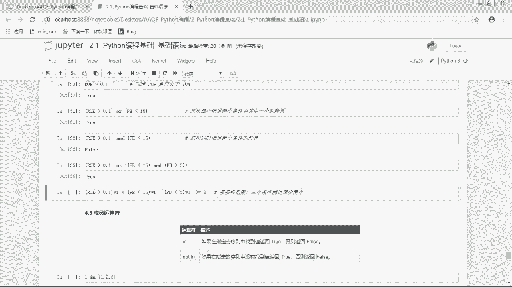

把这个判断，首先将每一个呃这个。条件乘以1个一，然后将它们进行加总。然后进行加总之后再和二比较。那这个的话就是表示三个条件满足至少两个。好，那我们来看一下它为什么可以这样来运算。

那首先这个的话它是不是一个不尔值，因为它是一个比较运算的结果，那LE大于0。1，它是嗯这个呢是te。

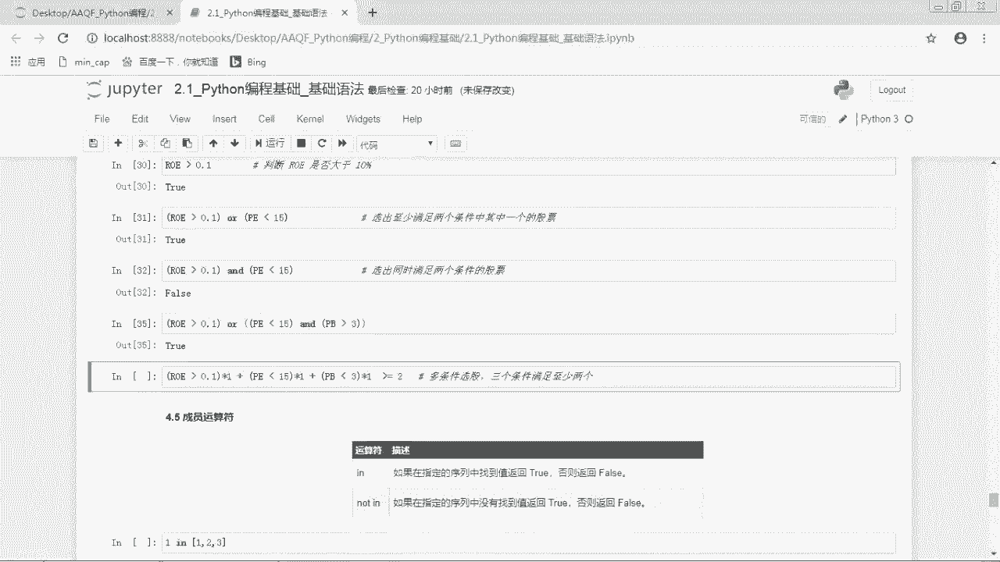

那处e乘以乘一是什么东西呢？那我们之前是不是在讲布尔值的时候说布尔值它的值其实是零和一，那处e是表示呃处的值是一fse的值是0。那如果是处e的话，它就表示一。那一乘1的话就是1。好。

第二个是PE小于15。那PE的话是20，它小于15，它就是fse。那fth值是0，0乘一的话，它就是0。好，第三个是PB小于3，那PB是等于2，PB小于3是处。好，处e的话是11乘以11。那这样子的话。

我们是不是就是把 truee的这个条件转成了一这个数字。然后我们把这个一相加，那我们呃这个相加之后是2，那是不是就是表示有两个呃两个处，也就是满足了两个条件呀？好，那这个左边这一块的话。

就是其实在计算我们这个三个条件中满足了几个条件。然后和我们后面这个呃需要满足的条件数目进行一个比较就可以了。比如说我们这里呃至少要满足一个，那我们就是比合一比较就可以了。

那如果说我们三个秒满条件正好要满足两个，那我们这里就是用双等号来进行判断呃，双等号2。那这样子的话就是把我们已经满足的两个条件和我们目标要满足的两个条件进行比较。

这个是我们在多条件选股中呃非常常用的一种方法。

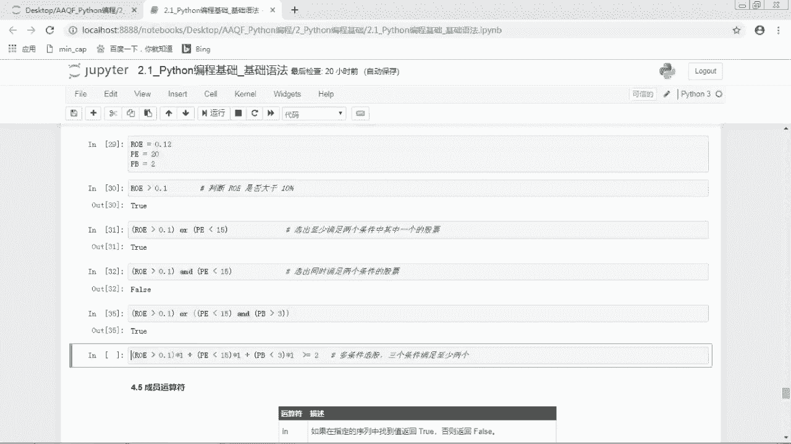

好嗯。

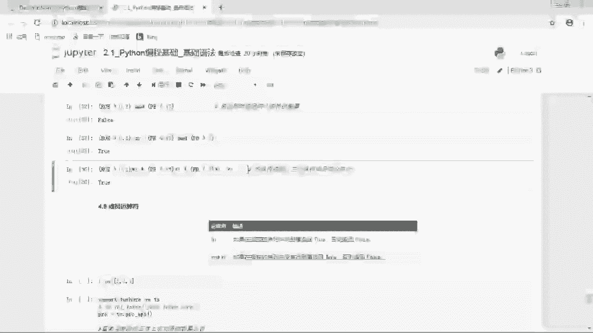

接下来是成员运算符in和not in。那成员运算符就是说。呃，某一个对象是不是在某一个序列中？那这个其实和我们日常用的语言也是非常一样的。那in什么什么in什么什么就表示什么什么在什么什么里嘛。

然后not in不就是什么什么不在什么什么里面吗。😊，比如说我们这里有一个呃123这个列表，那我们想看看这个一哎，是不是在这个列表里面。那我们说一应123，那它返回的是处。那如果说我四那四音123。

Yeah。哎，那它就是forse，因为4的话不是不在这个列表里面。

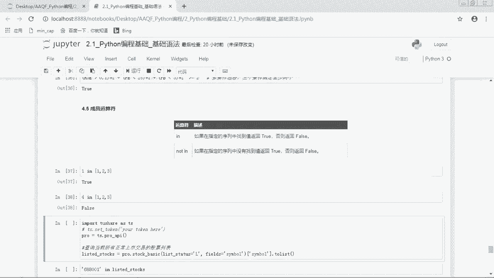

那印的话其实也是用的非常多的。比如说呃下面这个例子。那这个例子呢是我们是想看一看某一个股票代码是不是一个呃正常上市交易的股票代码。那这里面我是用了嗯toition。这个接口那这一块的话。

我们之后给大家介绍吧。那现在的话大家就是需就是只要知道我这一行代码的意思呢，就是查询当前所有正常上市交易的股票列表。

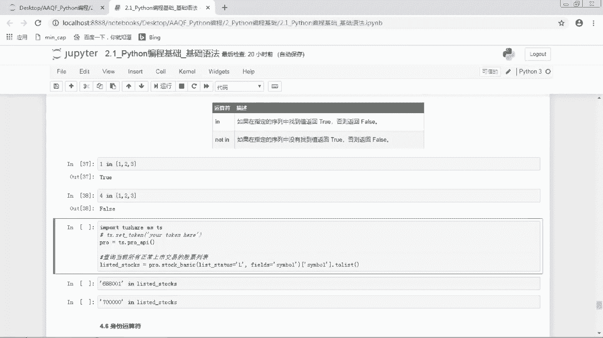

我们看一下这个listed stocks里面是什么东西。

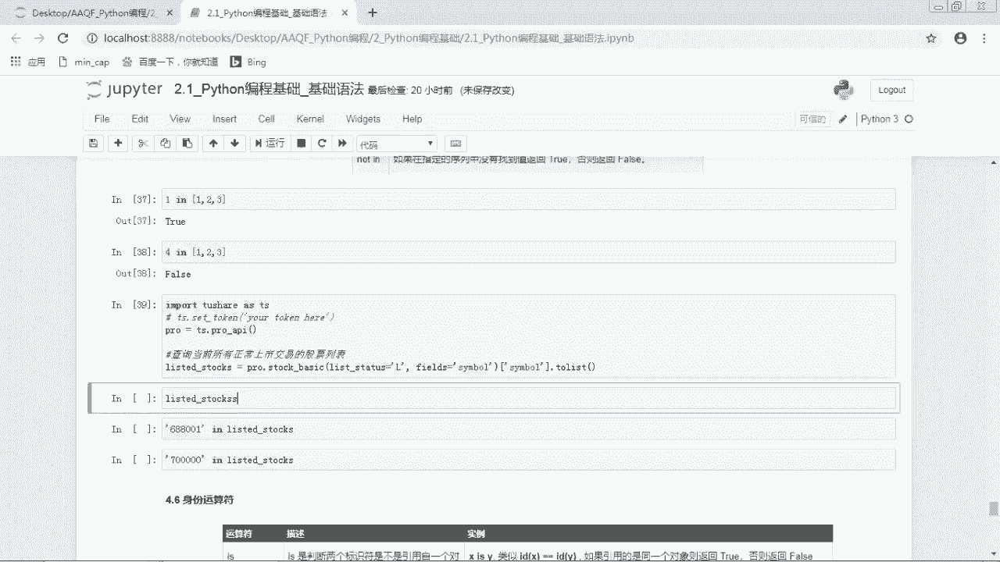

那现在的话我们就是获得了当前正常上市交易的股票列表。那从000001开始。然后一共有这么多。接下来呢我们就想看看某一个股票代码是不是在这个列表里面。比如说688001，唉，它是不是一个股票代码。

那我们来看一看哦，是 truee，那发现它是一个正常上市交易的股票列呃股票代码。那如果说我们想要看看这个700000，那我们知道没有7开头的嘛。那如果说我不知道的话，呃，那我就发现发现它是false。

说明这个呢不是一个呃。合法的股票代码就是不是一个正常上市的股票代码。那有一些股票你可能想看看它是不是退市了呀，呃，就是check一下的话，也可以用这种方法嗯。因为如果退市了嘛。

就不在这个上市交易的股票列表里面了，那它就会返回fce了。好，这个是。这个是成员运算符in not。

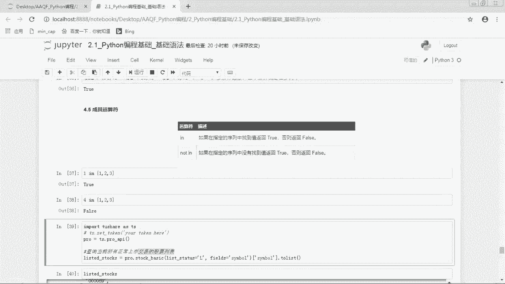

下面是身份运算符，is is not那身份运算符is是判断两个标识符是不是引用自同一个对象。那这个是什么意思呢？我们之前是不是说嗯变量就是一个房子嘛，然后然后这个呃对象呢就是住在这个房子里面的人。哎。

现在呢我们发现这个对象啊，他是有好几个房子，比如说他好超有钱呢，他他一个人就有好几个房子，他这个房子呢也是他的。然后另外一个房子也是他的，那但是对象呢它只有一个呃，比如说这个变量呢是X。

然后这个变量呢是Y，然后发现这两个变量里面都是这个对象。那这时候呢。呃，就是那这时候我们判断两个标识符是不是引用自同一个对象，那这时候就是X isY。就是说它两个房子里面都是同一个对象。

那X isY是类似IDX等于IDY。那这个ID的话其实就是这个对象的ID。注意一下椅子和等于的区别。那椅子是用于判断两个变量是否用于同一个对象。也就是说是不是这两个东西是不是同一个东西。

然后这个等于呢是判断引用对象的值是不是相等。也就是他们是不是相等的，就嗯就好比说嗯有两个同学那这两个同学考考试的分数是相等的那我们用等号判断，哎。

发现他们两个分数是相等的但是呢这两个其实是两个不一样的同学，那他们的学号是不一样的啊，那如果说这两个同学椅子的话，就是这个同学是这个同是另外一个同学，那这个就不对了。啊。

就是一这个椅子就是判断是不是同一个对象，然后等于呢是判断两个值是不是相等。意思就是判断那意思其实就是判断ID是不是相等。那这个等于号其实判断是这个value是不是相等。那这样子是不是就清楚了？

系。那对于python的6种基本的数据类型来说，对于数字和字符串，如果它两者是相等的话，那它两者也是相同的。也就是说is和等于返回的值是一致的。嗯比如说这里A等于一，B等于一，那这个一是一个数字，对吧？

那这个一呢负值给了变量A，然后同时呢它又赋值给了变量B。那这两个其实是两个不一样的变量，就是两个不一样的房子。但是呢这个里面住的都是一哦，这时候我们print a等于B，就是判断它们两个值是不是相等。

那这个肯定是相等的了。那第二个是print a椅子B就是看看这这个A是不是B。哦，他呃我们就发现他返回的值都是处。好。所以对于数字来说，如果值是相等的话，它两个呃对象也是相同的那对于字符串来说也是这样。

如果A是等于hello，然后B是等于hello，那我们注意一下它是一个字符串，对吧？因为连引号括起来的是字符串，那它相等，然后是不是呃相同，那发现它也是相等也是相同的。就是他也是同一个对象。

但是注意一下列表原组集合字典这几种呢两者返回的值是不一致的。比如说这个A是等于123是一个列表，然后B是等于123，也是一个列表。哎，那我们发现它是不是两个一样的列表啊，那我们print a等于B的话。

其实就是一样的。但是A isB是不是呢？那我们会发现A等于B是一致的。然后A isB是false。也就是这个上面的这个123和下面的这个123不是同一个对象。就是他们虽然长得是一样的。

但是他们呃就是其实是两个对象，这个是要注意一下。那元组集合字典也是如此，比如说我们这里是把它变成元组。两组的话是用小括号括起来的。好，那它们的话呃元组的值相同的时候，它们两个呃引用的对象也是不相同的啊。

结合字典也是这样。那最后呢还有一个运算符的比较级，但运算符之间是有比较级的。然后这个的话是呃这个有点复杂，其实大家也不用嗯。就也不用死记。因为如果说你想要。想要控制这个运算符的顺序的话。

最好还是用括号给括起来。你想要先计算哪个部分啊，你就先把哪一块给括起来。这样子的话你自己脑子里也清楚，别人看你的代码也比较清楚。如果单单用这个运算符的比较级的话，很可能会出错。比如说这个最后逻辑运算符。

它是not是最先最优先的，然后是and，然后是哦，那这个可能大家就是呃平时也记不太清楚嘛，然后写着写着也不知道到底是哪个先了，所以最好的话还是用括号来控制。嗯那这块的话了解即可。好。

那我们再来看一下我们看了哪一些运算符。啊，首先是算术运算符，那就是加减乘除取模幂，然后取整除。第二个是比较运算符，双等号是判断两个是否相等，感叹号加等于是不等于，然后大于小于大于等于小于等于。

这是比较运算。第三个是负值运算。那最简单的负值运算就是直接是一个等号，我们也可以将等号和算术运算符结合在一起使用。这个是负值运算符，就是有等号的逻辑运算符就是and or和not。

那这个在嗯条件判断的时候很有用。第五个是成员运算符ink noting，也就是什么是不是在什么里面。第六个是身份运算符，也就是什么是不是什么，就是is和is not。

那这两个那is和这个比较运算符的等于要进行区分。is是判断两个变量是否引用同一个对象，就两个是不是同一个对象，然后等号的是话是判断两个值是不是相等。好，那拍写编程语法的基础语法部分就到这里了。

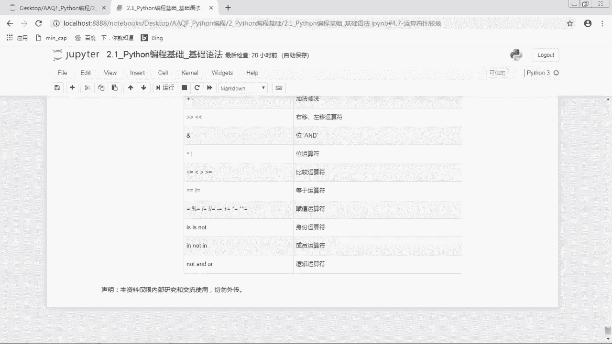

。

