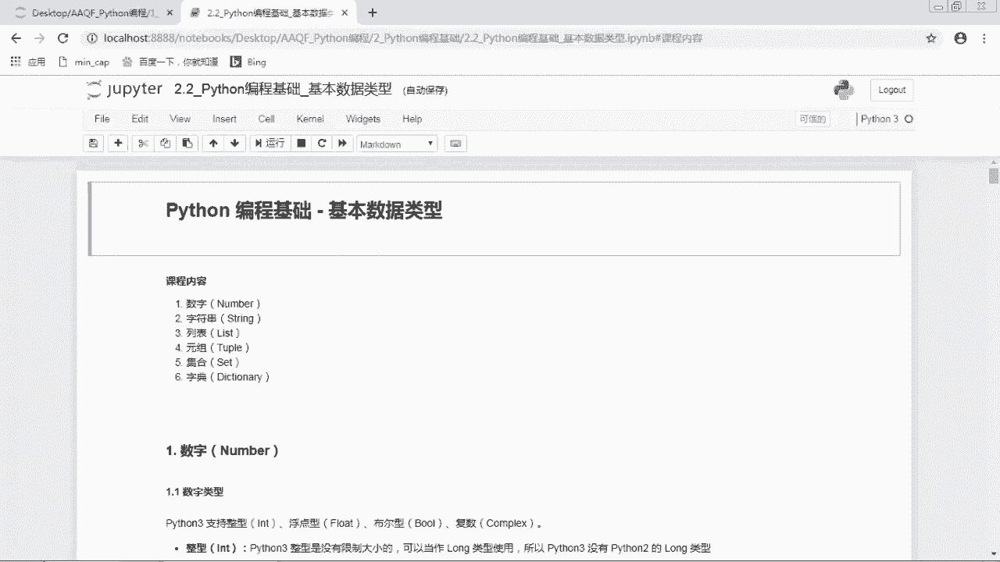
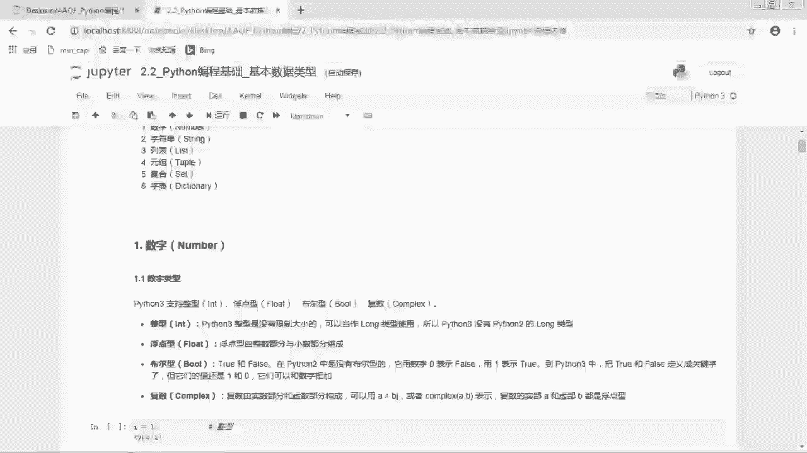
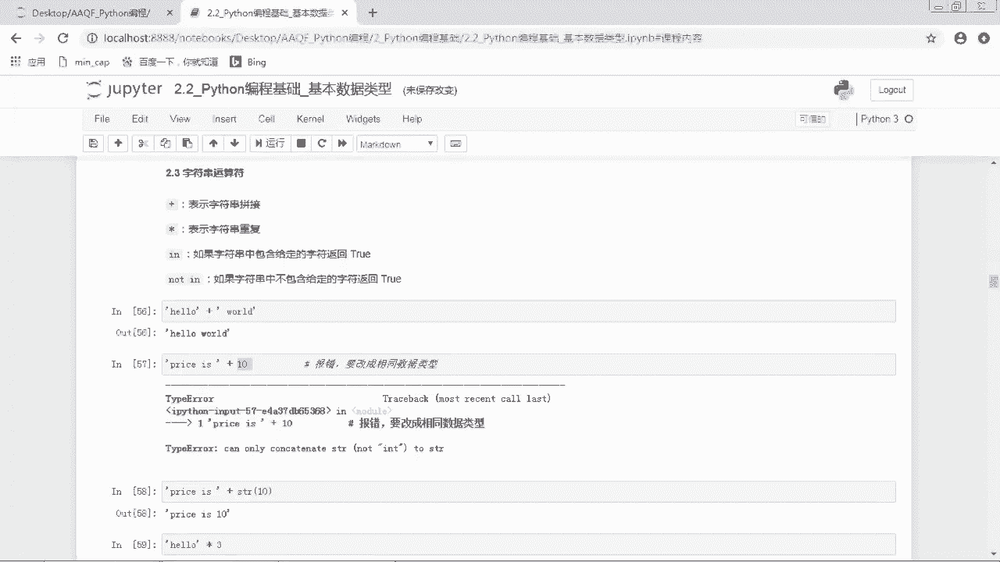
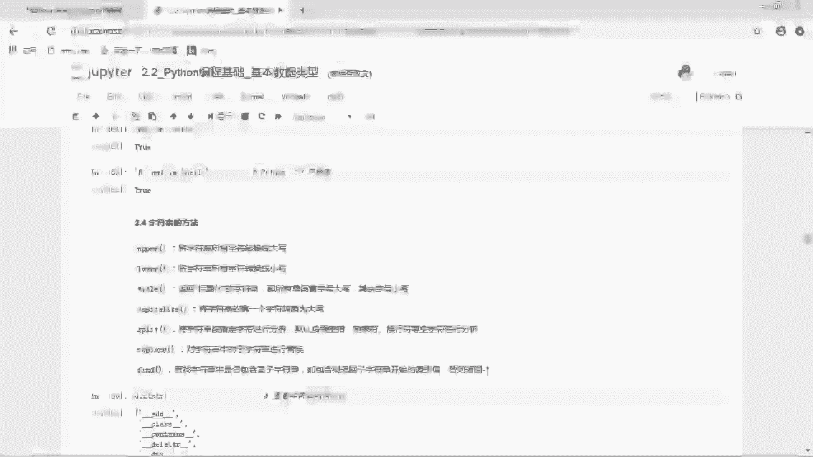
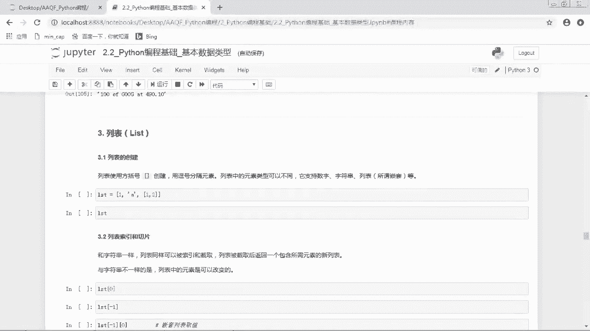

# 2024年金融大神老师讲解量化金融分析师.AQF—量化金融基础知识（完整版课程） - P23：《Python编程》05_Python基本数据类型_数字和字符串 - 量化沿前 - BV1ar421K7Mo

这节课是Python编程基础基本数据类型，那么我们上一节课，已经对Python的六大基本数据类型，做了一个初步的认识，那么今天这节课就是对他们做一个，更加详细的讲解。

所以我们这节课的课程内容是数字字符串列表。

元组集合字典这六大基本数据类型，好话不多说。

我们直接开始，我们首先看数字number the python3支持整型，浮点型，布尔型复数，这四种数字类型对于整形来说，python3整形是没有大小限制的，可以当做long类型使用。

所以python3没有python2的long类型，那其实如果大家就是没有学过python2的话，就不需要在区分这个这个东西了，反正大家就知道，不管这个整数是多大，都是这个int，都是这个整形好。

第二种是浮点数float，浮点型是由整数部分和小数部分组成的，那我们上一节课也讲了，浮点型态的标志，其实就是它那个小数点，它如果说小数部分没有数的话，如果有这个小数点，它也是一个浮点型好。

第三个是布尔型，true和false在python2中是没有布尔型的，它是用零表示false，用一表示true，到python3中把true和false定义成关键字，但它们的值还是零和一。

它们可以和数字相加，那这里面其实就是带了一些python2的内容，不过现在用python2的人应该不是很多了，所以大家就是只要记住python3就OK了，那在python3中。

布尔型就是true和false，那true的值是E，false的值是零，它们是可以和数字相加的，最后一个是复数，复数是实数部分和虚数部分构成的，可以用A加BJ或者这个complex ab来表示。

复数的实数A和虚部B都是浮点型，那复数的话其实我们嗯平时用的不是很多，可能会就是进行一些复杂的数学运算的时候，才会用到负数，所以这个的话大家了解即可，那我们用的比较多的还是前面的整形，浮点型和布尔型好。

那我们先看整形，比如说I等于12，那这个I的数据类型就是整形int，然后FF等于36。5，那我们来看一下F的数据类型是float浮点型，注意一下，加了小数点就是浮点型，比如说F2是等于36点。

那F2的话也是一个浮点型，这个之前我们已经强调过了，好，接下来是布尔型，布尔型就是true和false，比如说B是等于true，那它的类型就是布尔型，布尔型是可以和数字进行相加的，它的值就是一和零。

比如说B乘一，那B的话是上面的true对吧，那true的值是一，那我们把它和E相乘就是等于一，那如果说是false的话，那false和一相乘就是零，因为false是呃，它的值是零，那最后一个是负数。

比如说C是等于12J，那它是一个负数的形式，好这是几种呃数字类型，那数字类型之间可以进行相互转换，那对于数据类型的转换，只需要将数据类型作为函数名即可，比如说我们想要把一个数转成一个整数。

我们就int然后小括号，那其实这里面的这个呃int小括号是一个函数，然后我们把我们要转换的数值放进去，作为参数放进去，那这时候我们就是把X转成了一个整数，那下面的话float就是把X转成一个浮点数。

complex就是转成一个负数，实数部分为X，虚数部分为零，那如果说是complex x y的话，那就是实数部分为X，虚数部分为Y好，那其实除了这个数字类型之外，就是数值类型之外。

接下来我们要介绍的这个字符串啊，列表啊，呃元组啊，这些数据类型都是可以用这样的方法进行转换，比如说我们想要把一个数字转成呃字符串，那我们就用这个string，它这个呢也是一个函数。

那我们把要转换的东西放在这个小括号里面，它就转成了一个字符串的类型好，那我们首先来看一下我们现在有哪一些变量，那我们现在是有这些变量，那这里面我们看到F是不是一个float，是一个浮点型数据。

那如果说我们想要把这个浮点型数据，转成一个整数，我们就直接用int，然后F嗯注意一下，使用硬弹数来进行取整的时候是向下取整的，所以我们这里F36。5取整的话，就是等于36，那如果说我们是三十三十六。

9的话，我们对它进行取整还是36好，那如果说我们想要把一个整数转成浮点数，比如说我们这个I是一个整形，它是等于12，那我们把它转成浮点数哎它就变成了12。0，好注意一下，我们在上面嗯转成整数。

转成浮点数，这些它是不是都有一个结果，那这些结果的话其实就是这个函数的返回值，但是我们这个变量本身并没有改变，也就是我们这里的I以及我们上面本来是改的，这个F它本身并没有改变。

我们现在再来看一下我们现在有哪些变量，哦对于魔法命令来说的话，我们不能把魔法命令写在这一行的后面，因为它这个魔法命令其实就是呃，这个一个百分号表示对这一行来实行魔法命令，那我们写在后面的话。

它就变成这一行的内容了，那我们可以把这个注释写到上面去，好这样看一下好，现在的话我们就可以看到我们现在所有的变量，那么看到原来这个F是36。5，现在的话它还是36。5，那I原来是12，现在还是12。

还是一个整形，说明我们刚刚的这两步操作，并没有对变量本身进行修改，那这个其实是因为它只是返回了一个，函数的返回值嗯，参数的话并没有被改变，那如果说我们要改变这个变量的话。

我们要把这个返回值再赋值给这个变量，那这时候它那这时候的话，函数的返回值就直接赋值给变量了，所以我们现在是看不到一个结果，那这时候它本身就发生了改变，那这个F就变成了整形好，接下来我们来看一下数字运算。

那数字运算非常简单，比如说加法2+4=6，然后2。0+4，那注意一下，如果是不同类型的数字混合运算的话，会将整形自动转为浮点型，比如说这里是2。0，是一个浮点型和四一个整形相加。

那它们的结果的话也是一个浮点数，好你这个是减法，2-4=-2，然后2×4是等于八，2÷4是等于0。5，然后二整除四嗯，这个是一个两个斜杠，是一个整除符号是向下取整，那是等于零。

如果说分母或者分子有浮点数的话，结果也是浮点数，比如说这里2。0整除四，那这个它就会变成0。0诶，它有一个点的话，就是表示浮点数，那不管他这里是2。0，还是说2÷2整除4。0，它都是额浮点数好。

这个百分号是表示取模，就是取余数，那二取对四，取余数的话就是二，然后两个星号是表示乘方，那二的四次方是16好，那这些算术运算都非常简单，就不多说了，那下面还有一些常用的数学函数。

那首先是Python内置的一些函数，比如说abs是表示取绝对值，那这里本来数字是-2。4，我们对它取绝对值的话就是2。4，然后run呢是四舍五入，比如说3。1415926，然后我们取两位小数，就是3。

14好，那这些的话是Python中内置的一些嗯数学函数，那如果说我们还想要使用一些更加复杂的函数，我们可能会使用会需要使用其他第三方模块，比如说我们可以导入max模块，来进行更加高级的计算。

那max模块中比如说自然常数E就是max点E，那max点E的值是2。71828，然后我们也可以获得圆周率派，max里面还有一个sell和flow，sell的话是表示向上取整。

那sell就是那个天花板的意思吗，那就是向上取整，那2。5向上取整就是三，那floor就是地面嘛，地面的话就是往下向下取整，那2。5向下取整的话就是二，然后还有EXPEXP的话就是E的X次方。

就是自然常数E为底的指数函数，也就是嗯E的X次方，那这个参数就是这里的X的位置，比如说这里EXPE那就是E的一次方，那E的一次方其实就是E了，那我们算下来就是2。7828。

然后log的话是表示自然对数LN，即以常数E为底的对数，那这里log10其实就是LN10嗯，SQRT是square root是表示平方根，那四的平方根是二好，那这些的话是使用max模块进行一些嗯。

比较高级的计算好，那这些就是关于数值型的内容，那数值型的数据非常简单嗯，就介绍到这里，那下面的话是非常非常重要的字符串string，那首先是字符串的创建，我们可以使用引号来创建字符串。

比如说这里S是等于hello world的，我们看到他这个hello world两边都是有个单引号，那表示它是一个字符串，那我们看一下它的类型是string，那字符串也可以用双引号来创建。

比如说下面这里hello world旁边呃，两边都是双引号唉，这个S2，那S2的话其实和S是一样的效果，那比如说我们这里看一下S和S2分别是什么，诶，那我们看到他们俩其实是完全一样的，好。

那之前我们也介绍了三引号来创建多行字符串，其实我们之前是在讲那个注释的时候，多行注释是可以用三个嗯，三个引号来进行多行注释，那其实三个引号创建这个东西也是一个字符串。

所以如果说我们想要使用多行字符串的话，可以用S引号来创建，那注意一下前后引号要匹配，这个也是强调了很多次了，比如说这里有一个message是hello，Hello hello，那我们前面是三个单引号。

后面是三个单引号，那把这里面的内容呢就是一个多行的字符串，那我们可以看一下它的类型是一个string，我们可以把这个message给打印出来，那print函数就是打印变量，那我们看到是hello。

Hello，Hello，那前面的话，那在这个最前面一行出现了一个空行，那这是因为我们在这里的时候，这个是不是第一个引号，那其实这个后面的内容就是第一行了，那我们这个hello呢其实是写在第二行。

那我们这个呃多行字符串其实就是有四行，那这个是第一行，然后第二行，第三行，第四行，所以这里的话是有一个空行，那多行字符串的话也可以用三个双引号来创建，比如说下面这个message。

那它前后都是三个双引号，但其实它就是和上面这个三个单引号，其实是一样的，好这个是多行字符串，接下来我们看字符串的索引和切片，那索引和切片，其实是对所有序列类型都可以进行操作的。

那序列类型的话就是字符串列表和元组，那对于字符串来说，它是怎样的一个序列呢，比如说我们这里有一个字符串是hello，那它其实是由12345这样五个字母组成的，对不对，那对于每一个字母来说都有一个位置。

那第一个字母它对应的位置就是零，第二个字母对应的位置就是一，然后它对应的是234，唉，注意一下Python它的技术是从零开始的，那这个其实是保留了一个编程的习惯啊，这个大家要注意一下，它是从零开始的。

那我们对于字符串的索引和切片，其实就是根据它们的位置来对呃，这个字符串中的字符进行索引和切片，那字符串索引和切片的基本形式，是用这个方括号，然后中间写一个数字的类型，数字的这样的一个形式。

比如说这里有一个词string是等于hello，它是一个字符串，那么我们要对它进行索引的话，我们首先写它的这个变量名，然后后面呢加上一个in括号，in括号里面就写我们要取的这个字符串，所在的位置。

比如说我们要取第一个字母H，那我们就是用string0这样的形式，那切片的话，其实就是用一个冒号的形式，I冒号J这样的形式截取字符串中的一部分，比如说我这里想要取这个HE这两个字符呃。

这两个字符那我就是用string0，然后到哎，那这个后面倒多少呢，注意一下它嗯，切片是遵循左闭右开原则，J减I式截取长度，也就是说如果我们这里的话，是要取两个字符的话。

我们后面这个J要比这个第一个I要大二，那我们其实就是0~2，那什么叫左闭右开呢，左闭右开的意思就是我们从零开始取，然后到二结束，但是是开区间，也就是这个二是取不到的。

所以我们实际上取的是零和一这两个字符，那零和一的话就是这里的H和一好，那这个是呃序列的索引和切片，那我们下面来看一个例子，那我们先看一下SS是一个字符串，是hello world。

那如果说我们要通过索引来获取字符，串中字符的话，那我们就是用S然后加上一个in括号，中间写上我们要获取的这个字符的索引，注意一下，Python是从零开始计数，那S0的话就是我们这里第零位的字符。

那就是这里的H那一是表数，倒数表示倒数第一个数，那s-1就是最后一个字母就是D，那其实也可以用二啊，三啊，这样其实就是加了负号的话，我们就是从后往前，那从后往前的时候，我们就不是从零开始了。

因为零的话就是零，那不就和我们正数的呃，这个就是搞不清了嘛，所以如果从倒从最后一个开始数的话，我们就从一开始好，所以说我们这个呃它的索引呢是从正数的话，就是01234，然后从负数从后往前数的话。

就是一负二负三，这样那二的话就是倒数，第二个就是L好，下面是呃切片，切片的话是I冒号J，那这里的话我写的是S直接是冒号二，那这个是什么意思呢，如果说我们把这里的I，或者把这里的J给省略掉的话。

那就表示是取到顶，比如说这里如果是啊什么空，就是这里没有I没有，然后直接是冒号J，那这个呢是表示从最开始取，就是从最左边开始取，然后取到J为止，那当然了，J也是左闭右开嘛，那J是取不到的。

那这时候我们取到了多少个字符呢，大家思考一下，哎那是不是取到了这减I是这个字符，那因为I的话它没有写，是表示从第一个字符开始取，那第一个字符是什么，是零对吧，那其实也就是表示零到J那零到J的话。

它的截取长度就是J，那如果说我这里写的是I，然后冒号，然后直接是一个右括号，那这个是表示从I这个数开始取，然后一直取到最后一个数呃，一直取到最后一个字符，那这时候左闭右开吗，那左臂的话。

那这个I这个位置的数是取得到的，我们来看一下S冒号二，那这个的话就是取前面两个数，前面两个字符是HE，那我们也可以把I和J都给写上，那这里的话R2到四就是从二开始到四结束，然后同时第四位结呃。

就是取不到，那2~4是哪些呢，那我们可以把这个位置先标出来，那H是零，然后E是一，然后L是二，然后第二个L是三，然后D那个O是四，好，这样子的话我们2~4就是从二开始，然后三四取不到。

那我们取到的是这个二三，那二三对应的就是这里的LL好，那我们这里取到的就是LOL，那字符串是不可变数据类型，所以我们不可以改变字符串里面的字符，比如说我们想要把字符串第一个字符，改成大写的H可不可以呢。

我们来试一下诶，他画就是会发现报错，它这里有一个type error，String object does not support item assignment，也就是说我们这个嗯字符串对象。

它是不可以改变它里面的元素的，那这个的话要和我们之后学的列表，还有字典呃，集合这些可变数据类型进行区分，那对于字符串的运算，我们主要是这几这四种运算方法，那算数运算的话，字符串是可以进行加法和乘法。

那加法是表示字符串的拼接，乘法是表示字符串的重复，那in和not in是成员运算符，那如果说字符串中包含给定的字符串返回true，如果说字符串中不包含给定的字符，就返回而返回这not in。

就是说如果字符串中不包含给定的字符，返回TRU，我们看一下，如果我们把hello和word这两个字符串相加，它就变成了一个hello world，就是把这两个字符串进行一个拼接。

那这个的话它就粘在一起了，我们可以在这里加一个空格，那空格的话其实也是一个字符啊，就是空格不不是表示没有，那空格也是一个字符，那我们把它就是这样子的话，就是hello空格word，那空格也是一个字符。

所以它也是有位置的，那这个需要大家注意一下好，那注意一下字符串在进行相加的时候，在进行加法操作的时候，一定要是相同的数据类型，比如说我这里如果是price is加上一个十诶。

那这里的prices其实是一个字符串，那这里的int是一个整形，那如果说我们直接这样相加的话，是会报错的，它那这里写的报错信息是type error。

Can only concdate string to string，那其实我们大家如果遇到报错的话，一定要看这个报错信息啊，这报错信息都写的超级清楚，他这里写什么，就是不可以把这个string和呃。

就是只可以拼接string和string，不可以把这个int和这个string拼接起来，那说明我们这里的话，是不可以把int和这个string进行相加的，那这时候我们怎么办呢，我们可以把这个十这个整形。

先转成字符串数据类型，那转成了数字符串数据类型，那是不是就可以进行相加了呀，比如说我们这里的话用string10，那string10就是把这个十转成了一个字符串，那这时候我们就可以进行相加了。

就是price等于十，a price is10好，那字符串的乘法是字符串的重复，那这里hello乘三的话就变成了hello，Hello，Hello，接下来是成员运算符in和not in，就是看看哪个。

看看某一个子的字符串是不是在这个字呃，在这个大的字符串里面，比如说我们想看看这个小H是不是在hello，这个字符串里面，那这个其实是在的嘛，那它返回值是就是true，那其实我们也可以有多个。

就是有多个字符，比如说H1啊，它也是true，其实就是我们在这个字符串中来查看，是不是包含某一个子字符串，就是一个小的字符串好，那not in就是看看是不是不在里面，那这个大H在这个hello里面吗。

那其实是不在的，因为Python是对大小写敏感的，这个大写的H和小写的H是不一样的，是两个东西，所以这个大写的H是不在这个hello，这个字符串里面的，所以如果说是大h not in hello的话。

它也是返回处，好，接下来我们来看一些比较常用的字符串的方法，那这里的话其实我是把比较常用的一些方法，做了一个总结，那我们先看一些例子，那如果说我们想要看，查看字符串所有的方法的话。

可以用这个DIR这个函数，是可以查看字符串所有方法好，那字符串其实方法非常多，比如说capitalize taste for center count encode。

这样这样这样这些全部都是字符串的方法，那课上的话肯定没有办法，把这所有的方法都跟大家一一讲解，所以这里的话就挑几个比较重点的，那其他如果大家感兴趣的话，也可以，就是嗯就是自己学习，那自己怎么学习呢。

我们可以使用help函数来查看说明文档，比如说哎第一个这个capitalize，这个函数我们不知道它是怎么使用的，那我们就可以用help string点capital capitalize。

就是表示字符串的capitalize，这个方法，那我们运行一下就可以看到他的说明文档，那这里的话它就是嗯这个第一行呢，就是告诉我们如何使用，那这个就是函数名，然后后面这个括号里面就是这个函函数的参数。

那这里面参数的话只有self，就是它自己本身就没有其他参数，所以这是一个非常简单的函数，那它的作用是return capitalize，A version of the string。

那这个capitalized的版本又是又是什么样子的呢，哎它下面还有个更加详细的解释，就是嗯make the first character。

Have apple case and the rest lower case，就第一个字符是大写，其余是小写，诶，那这样子的话是不是就超级清楚了呀。

那比如说我们这里有一个string是hello world的，那如果说我们用4S点capitalize的话，呃注意一下我们在调用这个对象的方法的时候，一定要在后面加一个括号好。

那这样子的话就是把这个字符串第一个呃，第一个字符改成了大写对吧，其他的是小写好，那对于其他的这些字符串，就是所有字符串的方法的话，大家也可以使用这样的方法进行自己学习。

那首先我们可以用help函数来查看说明文档，那我们也可以就是通过一个例子，自己来检验一下好，那我们课上的话讲几个比较重要的，首先是apple，那apple这个方法呢是可以把这个字符串。

所有的字母变成大写诶，它就变成了hello world的，全部是大写，呃注意一下我们这里是不是是一个返回值，就是hello，全部大写的这个hello word是一个返回值的形式。

那这时候这个嗯S变量本身并没有发生改变，我们再来看一下S，我们会发现它还是这个小写的hello world，因为字符串是不可变数据类型，原来的字符串并没有发生改变，而是以返回值的形式进行返回。

那原来的字符串是没有发生改变的，但是如果说我们想要改变这个变量S的话，那我们可以将函数的返回值赋值给原变量，则覆盖原变量指代的对象，也就是说我们把这个S点upper。

这个返回值是这个大写的hello word，把它再赋值给这个S变量，那这时候S就变成了大写的hello world，哎那这个小写的hello world去哪里了呢，其实就是被这个后面的我们新附的。

这个值给赶走了，就被挤走了，那我们不是之前说呃，变量其实就可以看作一个房字嘛，那这里的这个S呢就可以看作是一个房字，然后这个房子里面本来住的是这个小写的hello world。

那现在呢我们就是把这个小写的hello world呀，改成了全部大写，让他住进这个房子里面去了，那之前的那个就是被我们挤出去了，好那现在这个S就已经是大写的hello world了。

那下面呢是S点lower，S点lower是可以把所有的字符都变成小写，那就变成了小写的hello world，然S点title是可以把这个字符串每一个单词的呃，首字母大写就变成了一个标题的格式。

比如说这里hello world，这个H和这个W变成了大写，好capitalize，我们刚刚说过了，就是把第一个字母改成大写，其余是小写，还有一个S点split。

S点split这个方法是对字符串进行拆分，那这个是怎么拆分的呢，它默认是按照这个空空字符进行拆分，比如说空格啊，制表符啊，换行符啊这些东西诶，那我们就是呃。

那这里的话这里有1hello和word里面有一个空格嘛，然后我们就变拆分成了hello和word这两个字符串了，那这两个字符串放是放在一个列表里面，注意一下，我们拆分之后，这个空空格就没有了。

你看我们这里hello后面是不是就直接是这个引号，说明这个hello这个O是最后一个字符，然后word的话W是第一个字符，诶那这里拆分成全部都是大写，是因为我们这上面这几个步骤。

其实都是返回的一个返回值，也就是看看一下这个函数返回值是多少，但是其实并没有对S这个变量进行改变，那S还是这个上面的这个大写的hello world，所以我们这里拆分后出来之后。

就变成了哈大写的hello和大写的word，那我们也可以指定字符串进行拆分，比如说我们这里不想按照空格进行拆分，我们也可以按照其他的东西进行拆分，比如说我们按照这个呃O来进行拆分，对这个O来进行拆分。

那这样子我们拆分成什么东西呢，哦那我们拆分成了HELL这个空格，W和LRLD诶，那这个是因为我们这里S是不是这个hello world呀，那hello world里面是不是有两个O。

这里有一个O这里有一个O，那我们就是按照这两个O进行拆分，那拆分的那拆分的时候，我们就相当于在这个old的地方啊，画个竖线，那前面的HELL就是第一个元素，然后中间的这个空格加W就是第二个元素。

这个最后的这个RLD就是第三个元素，那我们把拆分之后的三个元素，放在一个列表里面，这个是split，那最后一个是replace，replace是对原字符串中的子字符串进行替换，比如说我们想要把这个呃。

原来字符串中的O都改成A，那我们就是用S点replace OA，那其实嗯这个这里面的话就是有两个参数，那第一个参数呢就是这个原来的老的字符串，那A的话就是我们要替换的新的字符串。

那我们就是把这个A替换掉，原来字符串中所有的O，那这里面运行一下就变成了这个呃HELLA什么word，就是把里面的原来的old都替换成了A啊，好这些是字符串的一些常用方法。

我们再来看一下这个最上面给大家总结的，那upper就是将字符串所有字符转换成大写，lower是将字符串所有字符转换成小写，title是返回标题化的字符集，所有单词的首字母大写，其余字母小写。

那capitalize是将字符串的第一个字符转换成大写，split是将字符串按指定字符进行分拆，默认按照空格制表符，换行符等空字符进行分拆，replace是对字符串中的子字符串进行替换。

嗯还有一个find，find是查找字符串中是否包含某字符串，如果包含，则返回字符串开始的索引值，否则返回一哦，那这个的话没有跟大家演示，我们再来看一下这个find。

比如说我们这里还是呃这个小写的小写的hello，world是S，那我们来找一下S点find，我们来找一找这个hello是不是在这个字符串里面，那它返回的值是零，那这个返回的值呢也就是这个hello。

它第一个字符在这个原来字符串出现的位置，那是不是这个零的位置啊，那如果说我们想要找一找word，它返回的值是六，那为什么是六呢，我们看到这个word是不是在这里，那这个H是01234哎。

注意空格也是一个位，那空格是五，那这个W是不是就是六好，所以我们这里的话返回的是六，那如果说我们要找一个嗯这样大写的word，那我们可不可以找到呢，它返回的值是一。

那说明在我们原来的字符串里面是没有word，就是W为大写的这样的一个子字符串的，因为Python中是大小写敏感的，那是不存在这样的一个子字符串，所以它返回的值是一好那这个是find2和三。

接下来我们来看一下字符串的转义，那转译我们在上一节课也讲过了，我们会用这个反斜杠来对特殊字符进行转义，那这里面呢我们介绍几种比较常用的，那如果是一个反斜杠放在行尾的时候，是表示续航符。

那比如说我们这里message是等于hello word，我们想要就是如果说一行写不下了，那我们把这个hello后面加上一个续航符，把后面要接着写的内容写到第二行。

那这时候我们这个message其实还是就是原来的这个，Hello world message，它其实并没有换行，那这个换行符只是为了我们看起来比较清楚，因为如果说我们这里这个代码写的超级超级多。

比如说我们这个代码写超级超级抄着抄着抄，要写到都超过这里代码这个单元格了，那这样子看起来就很不舒服，所以如果说我们要换行的话，我们在这个最后写上换行符。

那这个其实和我们Python代码一般的换行也差不多，那Python代码中换行也是在这个行末加上反斜杠，那如果是在括号中的话，这个反斜杠是不需要添加的，好然后两个反斜杠呢是表示反斜杠符号。

然后反斜杠加单引号是表示单引号，反斜杠加双引号是表示双引号，反斜杠加三个零是表示空，反斜杠加N是表示换行，反斜杠加V是表示纵向制表符，反斜杠加T是表示横向制表符，我们来下面看几个例子。

那这个的话已经看过了，那这里的话是哎，那如果说我们呃，这个其实我们在上一节课也讲过了，就是如果在这个字符串里面，比如说我们这个字符串是用单引号来创建的，然后它这个字符串里面呢又有一个单引号。

那这时候是会报错的，那么看到这里的话，其实很明显就看到他其实是有报错的这种样子，那直接这样运行是会报错的，它是一个语法错误，那这时候呢，我们就要对这个里面的这个单引号，进行一个转义好，那这样子的话。

它中间的这个单引号就变成单引号了，哦那下面的话我是写了两种解决方方法，那一种解决方法，就是我们把这个外面这个单引号改成双引号，那外面这个双引号和里面的单引号，进行一个区分的话也是OK的。

那还有一种方法就是使用转义符加单引号，表示单引号，也就是在这个单引号左边加上一个转义符，那这样子的话也是OK的，好，那反斜杠加N是表示转呃，换行符，那我们这里的话是hello，然后反斜杠加n word。

那这时候我们来看一下，他就是把这个word放到下面一行去了，也就是在这个反斜杠加N的位置，进行了一个换行的操作，那其他的还有一些转义符，大家也可以进行自己的尝试，比如说反斜杠呃，两个反斜杠是表示反斜杠。

那这里两个反斜杠的话就是表示一个反斜杠，那我们这里的话就是hello word，然后000呢是表示空，就是就是没有东西，哎注意空不是空格啊，空格的话其实是是空格的话其实也是一个字符。

那这个000好像好像不是很常用，然后这个反斜杠加T是表示制表符，那其实就是在这里面呢，呃加了一个tab键的那种感觉，然后V是这个纵向制表符哦，看起来有点奇怪，好那这个是转义符。

但有时候我们并不想要使用转义符，我们就可以使用原始字符串，取消对特殊字符的转义，比如说我们这里有一个路径是叫做C盘的，Desktop，就是C盘桌面上的一个news文件夹诶。

那如果说我们直接写这样的一个路径，我们看一下他这个路径是什么东西啊，哎他这里的话就直接把这个反斜杠加N看，就是自动识别成了一个换行符了，我们看到这个EWS就换到下面一行去了，但是我们实际上并不想要。

把它们就进行一个换行，它其实是反斜杠加news，那这时候呢，我们就可以把这个字符串改成一个原始字符串，在这个字符串前面加上一个R，那加上R之后，我们后面字符串中，反斜杠就不再识别成转义符了。

它就就是不再进行自动转呃，自动转译了，那这时候我们看一下这个pass，就是c desktop news就正常了，接下来我们来看一下字符串的格式化，那什么是字符串的格式化呢。

嗯比如说我们就是要重复啊输出一些字符串，但是呢这些字符串虽然看起来差不多，但是其中也是有一点区别的，比如说我们想要打印所有股票的这个价格，那我们可能想要打印这个呃stock，什么什么什么东西啊。

这个是股票代码，然后他的price啊是多是is多少，那这个后面是它的价格哎，那我们所有的字符串都是想要有这样的形式，但是呢这个里面的这些东西啊，对于每个股票来说又不一样。

那这时候呢我们就可以用到字符串的格式化，那字符串格式化，我们首先来介绍一个，比较传统的使用占位符来进行格式化，那占位符是用百分号进行占位，百分号加S是表示对字符串进行占位，百分号加D是表示对整形占位。

百分号加F是表示对浮点数占位，那这个是什么意思呢，那使用百分号占位符，它的基本形式是这个样子的，也就是说我们这里呢，首先是有这样的一个字符串，然后呢字符串里面就是我们一些固定的内容，比如说呃stock。

然后price is，那这些内容都是固定的，那现在是不是我们就差一个嗯这个股票代码，然后差一个它的价格进去啊，好，那这时候呢我们就要对我们要填进去的内容，进行一个占位。

那首先我们这个code要进行一个占位，那要占位的话，我们就是用一个百分号进行占位啊，那这其实就是有点像我们拿这个书，书本放在桌上呃，给呃帮别人占位子是呃一样，一一样一样的，他这里的话就是拿百分号嗯。

占了一个位子，那这样子的话之后，我们要填进来的东西，就可以填到百分号这个位置了，那后面呢这个price也要占个位置好，那我们是用百分号占了位置，但是注意一下，我们在使用百分号占位符来进行占位的时候。

我们一定要确定这个我们站的位置，是给什么样数据类型的，比如说我们这里之后填进来的是一个字符串，那这时候我们就是要用S来进行占位，也就是说我占了这个位置的同时，我要确定我之后哎坐到这个位置上的，只可以。

比如说只可以是男生，只可以是女生这个意思，那这里的话，我们百分号S就是表示我们之后填进来的，这个co的呀，只能是死string这个字符串数据类型好，那price的话价格那价格可能是一个浮点数。

那我们可以用这个F浮点数来进行占位，那这样子的话，我们之后填进来的这个price就一定是要是float，浮点型这个数据类型，那D的话是对整形占位呢，整形就是int好，那这个是呃字符串，那字符串。

我们怎么把我们要填进去的内容给填进去呢，那我们就是要在这个字符串后面，再加上一个百分号哎，那就是前面呢是我们这个字符串的一个，基本格式，就像一个模板一样，然后后面就是要把我们真的值给填进去。

那我们这的值填进去的时候，我们首先要加一个百分号，然后后面呢就是我们要填进去的值，比如说第一个第一个填进去的是他的code，那code的话可能是啊000001，那注意一下，它必须是一个字符串好。

那第二个呢是一个浮点数，那浮点数可能是啊10。5这样一个浮点数好，那我们把这个我们要填进去的数用逗号隔开，同时我们要在它的两边加上一个小括号，就是如果说我们填进去的数是多个的话，一定要在这个呃这个嗯。

所有的填进去的值的外面加上一个小括号好，那这样子的话，就是我们用百分号占位符的一个基本格式，我们来看几个例子，首先嗯那这里的话我们字符串，我们是不是可以把它拆分成这样三块，首先这个百分号是一块。

然后他前面是一块，就是一个字符串的模板，然后后面这个括号里面就是我们要填进去的值，那这里面有几个站位啊，是不是有一个百分号S，然后一个百分号D也就是占了两个位置，那第一个百分号S。

也就是说我们之后填进去的呢，是要是一个string格式，然后百分号D也就是之后我们要填进去的呢，是一个整形的格式，好，那后面这个括号里面就是我们要填进去的内容，那第一个填到这个百分号S的呢。

就是这个完美，然后填到这个第二个百分号D的位置呢，就是这个99好，那这样子的话我们就填充完毕了，那现在就是I'M，然后填进来这个完美，然后i am是吧，Ninety nine years old。

我们来看一下，我们打印一下好，现在的话我们这个字符串就变成了，I'M完，May i'm ninety nine years old，啊啊那这个其实也是在纪纪念这个晚妹，这个非常优秀的程序员。

那使用百分号占位符，在进行字符串格式化的时候，也可以用变量来进行填充，也就是我们要填充的这个值，不一定要一定不一定一定要写在这个括号里面，那我们可以先把它赋值给一个变量，那赋值给一个变量，那这时候呢。

我们就可以把这个变量写在这个括号里面，之后我们就直接修改这个变量就可以了，比如说这里的话就是啊name就是我们这里的完美，然后edge的话，这啊这这这就是就这个还是比较直观的啦。

那之后的话我们要修改的话，我们就不需要修改，我们就不需要修改这一行了对吧，那我们直接修改这个name和age这个变量就可以了，所以就会非常方便，那这个也是同样的效果好，那我们还可以使用字典的形式。

对字符串进行格式化，那这是怎么操作的呢，那我们比如说我们这里有一个字典是stock，Stock，它有三个元素，那三个元素第一个元素呢是呃name，它的key是name，它的值是google。

然后第二个呢是shares，然后一共是100股，然后它的价格是490。1好，那下面的话我们是有一个啊这样子的，一个嗯模板，那我们可以把这个呃空格的部分先挖掉，就看看我们剩下来的是什么内容。

那我们首先这个就连在一起的百分号，后面连在一起的，它是一个整体，我们可以把它看作是第一个站位，然后是of，也就是of，然后第二个这里是不是又有一个百分号，那这是第二个站位好，那这后面又有一个站位。

然后后面是一个at好，那最后是不是又有一个站位好，那这里面的话一共是占了三个位置，那占了三个位置，我们就需要用三个嗯东西填补进来，那后面呢我们还是加上百分号，和我们刚刚一样。

那后面呢就是我们要填几填进来的内容，这里呢我们填进来的就不是这样单独的一个值，一个值把它写进来了，而是用一个字典的形式，那这里的字典是stock，那这里字典是不是有三个元素。

那在这时候我们就要指明填进来的这个值，对应的key，比如说第一个是shares，那它就是说我们填进来的是stock，这个字典中shells这个key对应的值好。

那这个第一个就是shells它对应的value，那同时呢它是D就是呃一个整形，然后第二个呢是name这个key对应的value，那我们看一下name这个key对应的value是不是google。

那这里的话填的就是这个google，然后第一个shares它对应的是呃100，那我们这里的话填的就是100，然后最后的话是price price，对应的就是490。1哎，我们看到这里的话是点2F。

那点2F是什么意思呢，我们知道F是表示浮点型是给浮点型占位，那我们知道呃浮点型是有小数点的吗，那小数点位后面是可以保留精度，那这里点二的话，也就是说我们小数点后面保留两位，那这样子的话。

我们其实就是保留的490。10，就是不足两位的话，就是会呃用零补全，那如果这个那如果这个它原来的数是什么，490点呃，12345之类的话，那我们就是保留两位，那就是490。12，好。

我们来看一下这个结果，就是100，我google啊，490。1，所以说用字典的形式对字符串进行，格式化的时候，括号中为字典的键，然后浮点数可以指定精度好，这个是用百分号占位符来进行占位。

第二种是用format函数来进行占位，那format函数它的基本形式是怎么样的呢，首先它也是哎，我们这个字符串的模板是在这个地方，那我们还是先把模板写出来，比如说stock，然后price呃。

price is什么，那这个还是我们的模板，那现在呢我们就不是用百分号来进行占位了，而是用一个花括号来进行占位，也就是说我们要这里占个位子的话，我们就是要用一个花括号来占位子。

那这样子的话我们就是把这个模板给完成了，那模板完成之后，我们怎么把值给填进去呢，我们就是用点format，然后小括号，那这里面的话就是我们要填进去的值了嗯，我们填进去的值的话。

这里两个值也就是用一个逗号隔开，那第一个值就填到第一个花括号里面，第二个值就填到第二个花括号里面好，那我们就是来看一下例例子，那这个那这个呢就是我们这个字符串的模板。

就是M什么什么M多少years old，然后点format后面呢就是我们要填进去的内容诶，注意一下，我们在format函数，我们使用format函数来进行字符串格式化的话，不需要指定数据类型。

也就是说我们只要用一个花括号来进行占位，那后面那之后嗯，过来的就是做什么样的数据类型都可以诶，那这个是不是就是功能功能更加强大了呀，所以所以format函数是非常方便的，那这里的话我们填进去的话。

也就是这样的结果，M y m m ninety nine years old，好，那这个是format函数一个基本形式，那第二个我们可以通过位置来进行映射，也就是我们如果这个花括号里面就是空的的话。

那我们就是填进来的时候，我们就是按顺序来填，那第一个就是填到第一个，然后第二个呢就是填到第二个，那如果说我们想要把后面一个填到前面去，比如说呃这个嗯，我们想把这个完美呢填到这后面来。

然后把这个呃NANANA填到前面去，那这时候我们可以通过位置来进行映射，比如说这里第二个，那我们的参数是先写的99，然后写的完美，那如果说没有位置的话，我们就变成了这个填到这个，而这个填到这个了。

那这个不是我们想要的结果，那我们如何把后面这个填到前面，前面这个填到后面呢，我们可以通过位置，那这个一呢就是表示我们是第几个元素，那注意啊，Python是从零开始的，所以这个99呢是第零个元素。

然后my man呢是第一个元素，所以说他们的位置99的位置是零，那我们看一下嗯，那所以说99的位置是零，完美的位置是一，那第一个花括号里面填的是位置为一的这个值，那就是我们这里的这个蓝妹。

然后第二个花括号里面是零，也就是填的位置是零的这个值，那就是这里的99好，这个是通过位置映射，那通过位置映射的话，其实有一点不好的地方，就是如果我们这里的嗯，要填进去的值是非常非常多的。

比如说我们要填进去十几个几十个值，那这样子的话，我们不是还要一个一个数它的位置吗，所以一个更好的办法就是使用关键字来映射，那使用关键字来映射的话，我们就是把我们要填进去的值取一个名字。

比如说name是等于晚妹，age是等于99，那这样子的话我们呃我们把这个花括号里面写，写上我们要填进去的这个关键字，那第一个花括号里面就是填的name，那我们就找一找name这个关键字对应的值是多少。

哎我们发现它是完美，那我们就是把name这个关键字，对应的值给填进去了，然后第二个关键字是age，那我们就找一找age，它对应的值是99，那我们就把99给填进去了，好那这个是通过位置和关键字来进行映射。

也是同样的效果，那最后法format呃，format呢也可以使用字典的形式，比如说我们还是刚刚那个例子，那stock它还是这样的一个字典，那下面的话，我们还是首先把这个字符串的模板给写好。

然后点format的什么什么，那在这个模板里面我们就是要指明呃，这个字典所对应的key，就是这个字典中我们想要填进去的value对应的key，比如说这里我们想要填进去，shares这个key对应的值。

那我们就把就在这个花括号里面写shes，那这样子的话，我们就是把shes这个key对应的值，100给填进去了，然后第二个是name，我们就是把name这个key对应的值google给填进去了。

然后第三个是price，那我们就是把price这个键对应的值，490给填进去了，那这里面的话有冒号点2F，这个也是为了保留精度，注意一下，大家不要把这个冒号给漏掉，然后点format之后。

我们就是写上这个嗯字典的这个字典的变量名，那注意一下，一定要在字典的前面加上两个星号，这个是和百分号占位符有所区别的，百分号占位符的话，我们直接用百分号，然后后面写上这个字典就可以了。

但是在死呃这个format里面，我们一定要在前面加上两个星号，好这样子的话我们也是可以达到之前的这样呃，之前同样的效果，这个是format函数来进行字符串格式化，那最后一个是f string。

f string其实是一个新的啦，它是在python3。6之后的版本添加的，它是字面量格式化字符串，是新的格式化字符串的语法，就以前我们其实只是用上面的百分号占位符，还有一个format，那在3。

6之后多了一个FSTR，那f string是呃，这个是格式化，那F4string格式化字符串是以F开头，后面跟着字符串，字符串中的表达式用大括号包起来，它会将变量或表达式计算之后的值替换进去。

那其实f string它的基本格式是这样子的，那首先还是我们这个字符串的模板，比如说啊stock，然后空格，然后price is，然后空格好，那我们的模板不变。

那这时候呢我们要在这个F4string的前面，要加上一个F表示f string，那这时候呢，我们站位还是用这个花括号来进行占位，那它和format一个区别，就在于我们可以直接把我们要填进去的东西。

就直接写在这个括号里面了，那format的话，其实它前面只是一个模板，它我们要填进去的值，要用点format写在后面填进去的，那在F词缀里面，我们就是直接写在这个括号里面，那直接写在括号里面的。

可以是变量啊，或者说是一个表达式，比如说我们这里写3+2的话，它填进去的就是五，我们来看一个例子呃，比我们这里的话是赋值，就创建了两个变量name和age，那下面呢是一个f string。

那f string它的基本格式是F，然后后面加上一个字符串，那在这个字符串中我们需要填充进去的部分，我们用花括号来括起来，那花括号里面要填进去什么东西呢，我们可以直接写在里面。

那name的话就是代表这个name变量，然后age的话就是代表这个age变量，那我们其实就是把这个变量它里面呃，变量所指的对象给嗯，大家就是给填充进去，那我们这里name所指代的就是完美这个字符串。

我们填进去了，然后edge它指代的就是99，我们填进去好，那在那如果说是使用字典的话，那怎么办呢，我们还是一样，我们首先把这个要填进去的，不就是要占位的部分呢，用花括号来来给占占一个位置。

那我们要填进去的是什么东西呢，但这个其实是一个字呃，字典取值的操作，我们之后再讲自检的时候，还会跟大家详细讲，那我们这里首就是先跟大家来呃数，那我们这里就是先跟大家来说一下。

那这个stock shares呢，就表示我们是嗯取stock这个字典中，shares这个key对应的值，那这个stock字典呢就是这个东西，那呃shares它这个key对应的值是100。

那我们就是把100给填进去了，那stock name呢就是嗯取的这个name，这个key对应的值就是google，这个字符串，然后stock price就是取的price，这个key对应的值是490。

1好，那后面的话我们对嗯，490。1这个浮点数进行不保留，小数点位数的话和format一样，也是冒号点2F这样的格式好，那这样子的话也是可以达到相同的效果好，那这个是字符串的所有内容。

那字符串的内容其实非常多，我们再带大家复习一遍，那首先我们讲了字符串的创建，那字符串是可以用单引号和双引号来创建，也可以使用三个单引号或者三个双引号来创建，多行字符串，接下来是字符串的索引和切片。

我们是用这个方括号来表示索引和切片，那如果是索引的话，我们就是把要索引的这个位置，给写在方括号里面，如果是切片的话，就用冒号的形式，注意一下是左闭右开，接下来是字符串的运算符。

那字符串的加法表示字符串的拼接，乘法是表示字符串的重复，in和not in就是成员运算，看看某一个子字符串。

是不是包含在这个字符串里面。

接下来是一些常用的字符串的方法，那upper是大写，Lower，小写title是标题化，capitalize是第一个字符，大写split拆分，replace替换find是查找。

那关于字符串是有非常非常多方法的，大家也可以，就是呃通过这个DIR来查看字符串所有方法，然后使用help函数来查看这些方法的，使来这查看这些方法的使用方法，就使用说明，接下来是字符串的转义。

那字符串转义是用反斜杠来进行转义，那嗯反斜杠在行位表示续航符，两个反斜杠标示表示一个反斜杠，反斜杠加单引号表示单引号，双引号嗯空，然后换行纵向制表符，横向制表符，那这些是字符串的转义。

那如果说我们不想要对字符串进行转译的话，我们可以用R这个R来表示原始字符串，这时候我们字符串中的反斜杠，就不再进行转移了，那最后一个是字符串的格式化，我们是百分号占位符格式化，format嗯。

占格式化以及f string格式化，那对于这三种字符串格式化的方法，大家要注意区分，首先是百分号占位符进行格式化，那对于百分号占位符的话，我们首先是一个字符串的模板，然后使用这个百分号。

对我们要填充进去的东西进行一个占位，注意一下站位的同时，我们要指明我们要填进去的数据类型，比如说我们占我们是给一个字符串来进行占位，或者说我们是给一个呃浮点数来进行占位好。

那这样子的话是一个字符串的模板，我们要把填进去的值填进去的时候，我们要用一个百分号来呃连接，然后后面是我们要填进去的值，那如果说我们要填进去多个值的话，我们首先要加一个小括号。

然后填进去多个值用逗号隔开，那如果是for曼函数的话，我们也是一个字符串的模板，然后这时候呢我们是用一个花括号来进行占位，那在花括号进行占位的时候，我们就不需要指明给哪一个数据类型占位了。

那然后我们把值填进去的时候，我们是用点format来进行连接，点format，然后括号然后填进去的值呢，就是放在这个括号里面，如果是有多个值，用逗号隔开好。

最后是一个F4string f4string的话，我们也是首先一个字符串的模板，然后在这个前面呢加上F，那是表示f string，然后这里面呢也是用花括号来进行占位好，那和这个负脉的进行区别。

就是我们不再使用一个什么后缀的形式，把词填进去了，而是我们直接把我们要填进去的值啊，直接就写在这里面，比如说我们要额写一个什填进去，一个什么变量啊，或者说填进去一个什么表达式啊。

就可以直接写在这个呃花括号里面好，这个是字符串格式化，那字符串是一个非常重要的数据类型，大家一定要多多练习呃。

