# 2024年金融大神老师讲解量化金融分析师.AQF—量化金融基础知识（完整版课程） - P25：《Python编程》07_Python基本数据类型_集合和字典 - 量化沿前 - BV1ar421K7Mo

那接下来集合也是比较简单的，集合是一个无序的不重复元素序列，可以使用大括号或者赛函数来创建集合。注意创建一个空集合，必须用s不是花括号。因为花括号是用来创建一个空字点。那这个其实我们之前已经已经讲过了。

那我们下面直接就来看一个例子啊。from randomread这个的话就是我们从read这个模块导入进来了readend的这个函数。

那这个函数呢是可以创建就是生成随机数的那我们这里readend10的意思就是我们生成一个在1到10之间的一个随机数，也就是一和10都是包含的那。然后forour I in range1000。

那这个是其实是一个啊那这一块的话其实是一个列表解析式。那我们之后再讲了讲了for循环之后，我们再跟大家讲。那这个那大家只要知道这一句代码的意思呢，我们就是产生1000个1到10之间的随机数啊。

那我们现在就是有1000个1到10之间的随机数。那我们来看一下L长的什么样子。大概好，那我们可以看到。L的话它是一个。列表，然后列表中的元素都是1到10之间的随机数，然后它一共是有1000个，就超级多。

我们就不慢慢看了。好，那我们用lens这个函数，那L这个函数大家还记不记得是干嘛用呢？就是来计算呃列表的长度，对不对？那列表长度就是列表的元素的数量呢，因为我们是产生了1000赫嘛。

然后它的长度肯定就是1000。然后这个呢是列表的呃切片。那列表的切片的话，我们。冒号20的意思就是我们切了前面20个元素，那么可以查看一下前面20个元素是什么东西。因为如果我们一下子看这个L的话。

它数量太多了，那我们可能一下子展开太多，那么可能只想看这个前面5个呀，前面10个啊，前面20个，大概看一下它到底长什么样子哦，那我们可以把这个前面20个选出来呢，我们看一下它大概是长这样的一个样子。

那它这里面呢是一些1到10之间的随机整数。

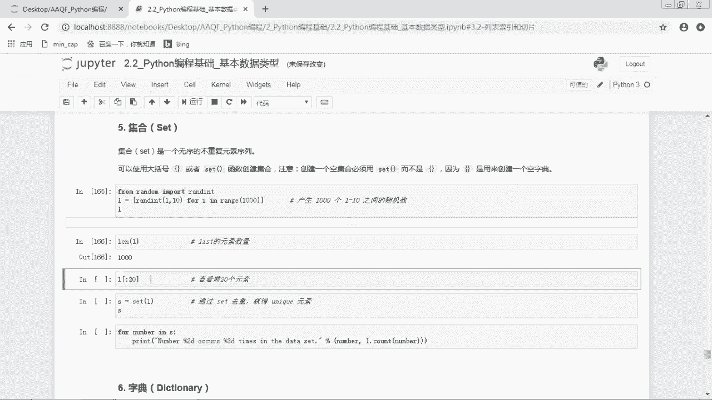

🎼那因为它是read int嘛，那read int的 int就是整数，它其实就是随机的随机整数。然，现在呢我们就是想要把这个列表转成set，那我们可以用set这个函数，把这个列表转成一个set。

注意一下，我这里写的是L啊，不是数字一，这里是小写的L。因为你如果用数字一的话，它会报错的，就是因为数字是不可以，就是呃标识符的第一个字符，不可以是数字，大家还记不记得。那如果说我们只有一个数字一的话。

肯定也是不可以的那我们看到它是绿色，说明是不行的那我们这里的话其实是小写的L。好，那我们把这个小写的呃把这个呃list转成sad。那我们看一下转成赛之后，我们的集合是长什么样子的。哎。

那我发现我们的集合中只有10个元素，就是12345678910。我们发现是不是这个元素中其他重复的部分就被去掉了。因为我们比如说我们这里有一1一，它其实有好多好多一，但是我们只保留一个。

所以我们可以通过set去重来获得un内元素，就是通过集合来进行去重来获得一个独一无二的元素。我为什么这个课件里面都写的中英混杂呀？嗯就是独一无二的。好，那这个其实是列表呃集合一个非常非常大的作用。

因为有时候我们并不想要有重复的东西，那我们就想看一下它里面就包含了哪些不重复的东西呢可以用这个集合来进行。好，那下面的话这个。这其实是一个循环，这个循环呢是在干什么呢？

这个for number in S的意思就是那S是这个集合，对吧？那forour number in S其实就是对这个集合中每一个元素来进行循环。比如说我们第一次循环的是一。

那我们下面的那这时候我们这个number就是一。那下面我们就进行下面的这个操作。那下面这个东西是什么东西啊，大家还有没有印象？哎，这个是不是一个字符串格式化呀？那大家能看懂这个字符串格式化是什么意思吗？

那大家可以暂停一下，然后自己思考一下，作为一个对自己的呃检查。好，我们来看一下这个格式化字呃字符串格式化是怎么进行的那首先它这里有一个百分号，说明它是一个百分号占位符的格式化。

那我们看一下它占了几个位置，它这里是不是有一个百分号，两个百分号。那所以说我们是在这个这整个字符串里面呢，我们是占了两个位置。那第一个位置它是给一个呃D就是一个整整数给占的位置。那这个二是什么东西呢？

😊，那这里的话其实就是占的字符的个数。比如说我们这里其实是占了两个位子，对吧？那这里的话是占了三个位子。那我们是把什么东西填进去呢？首先是一个number。

然后第二个是L点com numberumber。那number的话就是我们这里循环到的东西，对吧？那第一次循环是不是一，那所以现在这个number就是一。

那现在我们把这个number填到这个第一个空格中，我们要怎么填呢？我们是占了两个位置，但是我们这个一其实只有一个字符，所以我们就直接哎做了其中一个字符就可以了。那另外一个字符呢就用空格来代替。

也就是说它这个位置还是要空在这里的，只不过它是一个空格。好，那第二个元素是什么东西呢？是L点countt number，然后点count，哎，这个是不是这个列表的计数，那这个L是列表，对吧？

那列表的count就是我们数一数这个列表中有多少个这个元素。那这个呢是一，那我们就是数一数这个列表中有多少个一，那原来的列表是有1000个元素的就1000个数，那我们就看看我们生成了多少个。呃，这个一。

那我们运习一下。

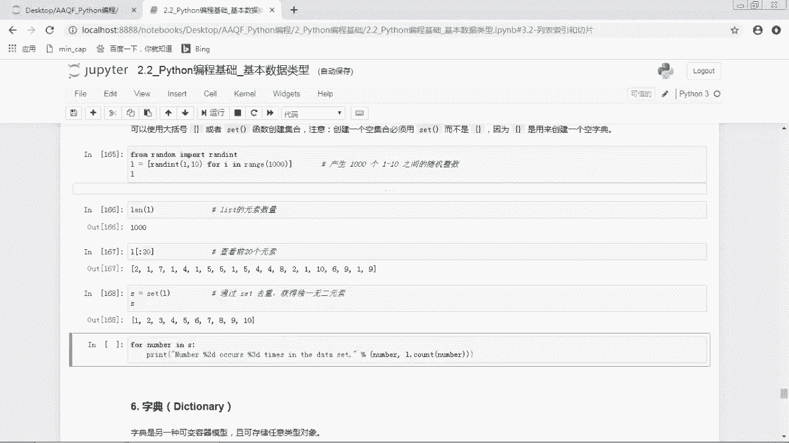

Okay。那我们一共是循环了10次，因为我们这个S呃S变量这个集合呢是有10个元素，所以我们对每一个元素进行一次操作。那第一次就是一，第二次就是2，然后一直到10。我们看到它是占了两个位子。

也就是说如果它是不满两个位子的话，它前面是用一个空格来呃补全的。这样主要是为了就是对齐好看，不然的话。不然的话，这里一的话就是写在这儿，然后二的话写在这。然后后面这里突然来一个十的话，它就跑偏了。

就比如说如果我们这里没有2的话，我们看一下是什么效果。哎，那它这里的话上面123456789都没有什么问题。然后后面十因为占了两个位子嘛，然后他就和上面不对齐了。然后我这种强迫症看起来就有点难受。

所以我在这里加了一个2，然后这里加三呢也是为了对齐，因为我们这里有两位的，有三位的。如果我们这里不加三的话，它就是我们看到它这里就是直接填进去，我们要填的数字。那这样子的话就不对齐了，就看起来有点难受。

我们再加一个三的话哦，它就可以保就是用空格来补齐不足三位的那这样子的话就是一个比较整齐嗯。那那这里面的话，我们第一个填进去的就是这个number。然后第二个填进去的就是我们它出现就是它出现的次数。

所以我们最终得到就是数字一呢，在这个数据集中出现了108次，也就是我们生成的1000个随机整数中有呃108个1，然后呃二呢是生成了97次，然后三呢是93次，那因为我们是生成随机整数嘛，它是随机生成的。

然后每一个概率都是一样的，所以我们大概每一种的话都是在100次左右。

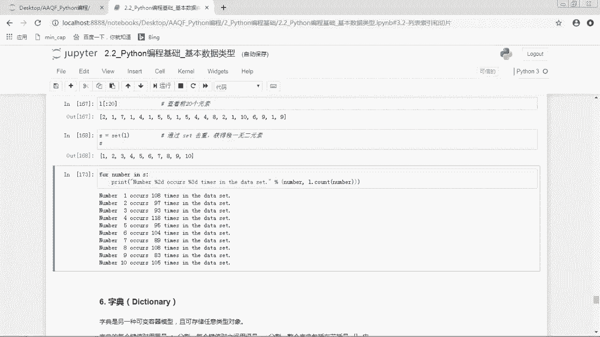

因为是随机的嘛，肯定不可能是完全是100。那这个是集合，那集合还是比较简单的。集合的话就是用在去虫是非常方便，是非常好的。

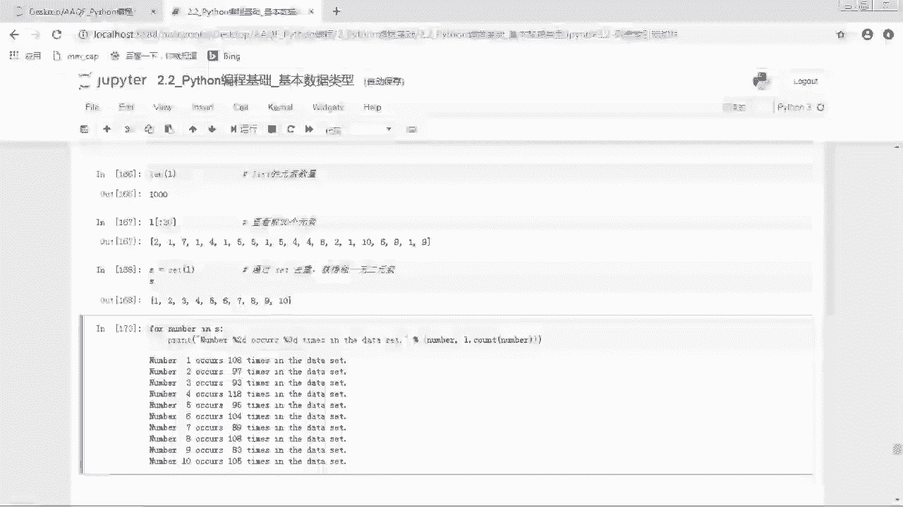

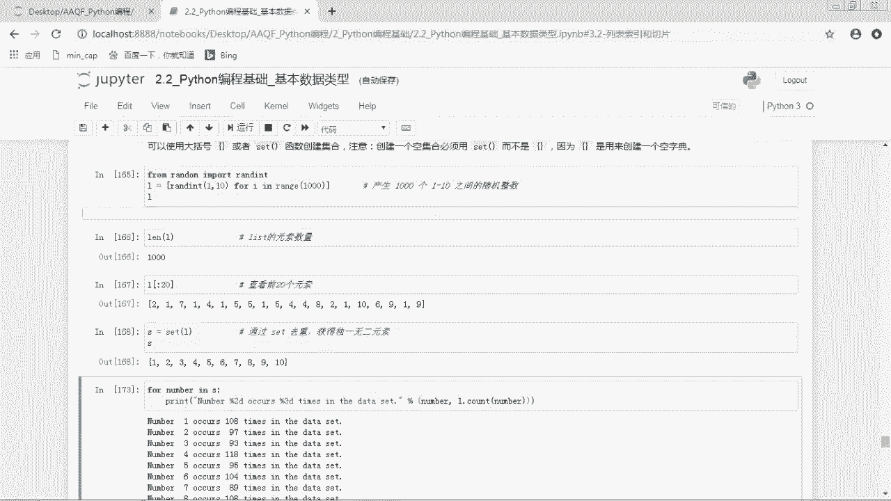

那最后一个是字典，那字典也是一个非常非常重要的呃数据类型。那字典也是另外一种可变容器模型。那可变的有什么列表？set集合和字典。这几种，然后其他嗯数值字符串和元组这三种是不可变的。

然后字典呢也是可以存储任意的类型对象。字典的每一个值每一个间值对用冒号分割，每一个键值对之间用逗号分割，整个字典包括在花括号中。也就是说我们首先呢这个字典是在一个花括号里面的。

然后对于每一个字典中的每一个元素呢，我们是用逗号隔开。然后对于这个字典中每一个元素呢，它就是一个间值对，所以它是key冒号value的形式。好，那第二个元素呢也是一样。

那第二个元素也是key冒号value这样的形式。那注意一下，在呃字典中这个key都必须是独一无二的，不能重复。好，我们来看一下字典的创建那stocking for是一个字典。那首先是一个花括号。

然后嗯这里面呢是有三个元素。那第一个元素是code，然后冒号000001。那在这里面的话，这个code就是第一个键，然后这个呢就是code这个键对应的值，好，它们两个是一对。

然后这个呢这个第二个元素呢是name，然后它对应的是平安银行好，他们俩是一对。然后这个呢和这个它们俩是一对。那它这其实是一个呃一一对应的关系，这也就是一这也就是字典的这个映射关系。那我们创建一下呢。

我们看一下它是d是字典字典的键是独一无二的，不会有两个相同的键。创建是如果同一个键被复制两次会存储后面的值。那比如说我们呃stock，它是如果如果说这个键是没有重复的话，它就没有什么问题。

但是如果说我们这里有创建的时候出现了两个相同的键，那我们看到这里的话是不是有一个industry，然后后面又有一个industry，这两个键是相同的那这时候呢。

我们会保留后面一个直接就把前面那个剔除掉了。那我们看一下这样子运行的结果，哎，它就变成了code，然后name，然后industry，而industry它是地产。

那说明是不是这个呃银行的这一块就自动忽略掉了，那其实是后面的这个把它给。

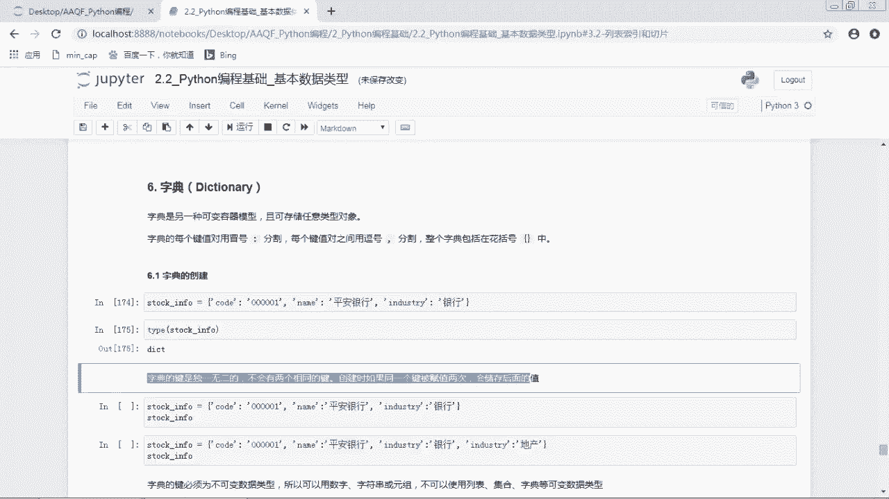

就是呃覆盖掉了。因为字典的键必须要是独一无二的，只能保留一个。那我们保留的是后面一个。

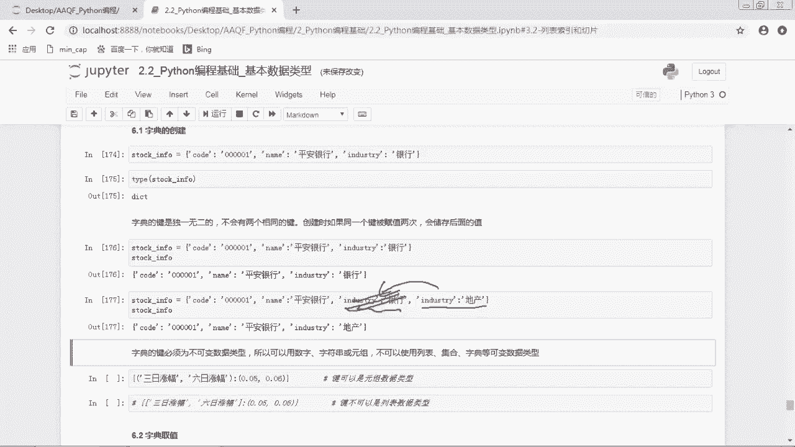

好。字典的键必须为不可变数据类型，所以可以使用数字字符串或元组，不可以使用列表集合字典等可变数据类型。那这个也是要注意的一个点，字典的键是不可变数据类型，比如说这个字典的，比如说这里一个字典。

然后这个字典其实只有一个元素了。然后它的键是一个tple，那这个tple呢是三日涨幅，6日涨幅啊，然后它的值呢是也是一个tle是000。05和0。06。那这个是没有什么问题的那如果说我们的这个。

这个键呢是一个列表，哎，我们看到这里的这个冒号前面这个key是不是一个列表，因为我们它旁边是用呃印括号来包括包裹的那这是一个列表。那这样子的话它会报错。

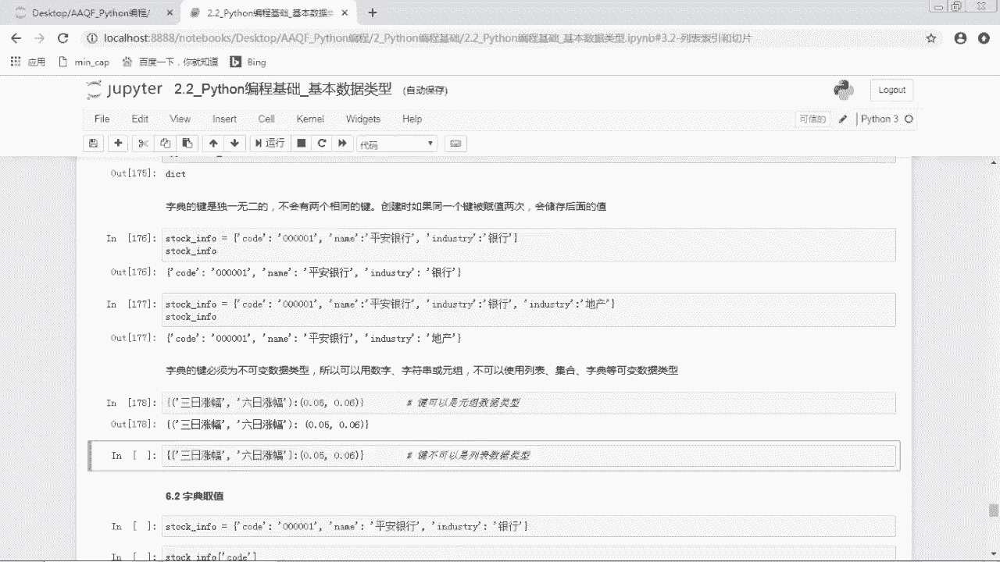

他会报错说呃，t unable type，然后list，那说明是在这个list上面出错。那这个是因为键是键不可以是呃可变数据类型。所以这里的话不管是set呀还是字典啊还是列表啊，都是不可以的啊。

只可以用数字字符串过元组。

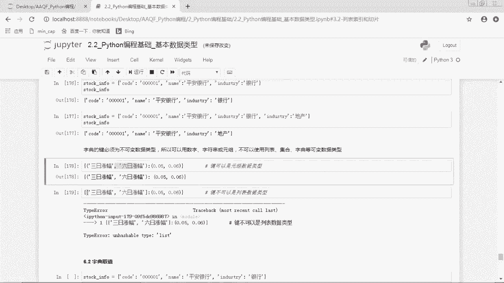

那接下来我们来看一下字典的取值操作。那之前我们对序列类型，比如说字符串元组和列表的时候，我们如果要取值，是不是用索引和切片，但是字典它是没有顺序的，也就是说没有什么012这样的索引和位置。

那这时候如果我们要取值要怎么做呢？应该要按照它的key来取值。比如说这里有一个嗯列表呃，有一个字典是这样子的，还是原来这个字典。然后我们想要取出code的这个key对应的值000001这个字符串。

我们如何取呢？字典取值的基本的操作，就是字基本的形式，就是我们先写这个字符串呃，先写这个列表不，先写这个字典，然后呢，我们加上一个印括号，然后印括号呢写上我们这个K。那这样子的话。

我们就是在这个字典中把这个key对应的value给取出来了。比如说这里是stock。那我们这里如果key是写code的话，哎，注意一下，注意注意，重点是这个一定要写加上引号，因为code它是一个字符串。

如果说我们不加引号，直接是code的话，它是表示一个变量。那如果说表示变量的话，我们就会报错。因为我们其实并没有创建code这个变量。好。那这个是取出扣的这个键对应的值。

那我们取出是000001这个字符串。那我们也可以取出其他的。比如说name这个字符串name这个key对应的值是平安银行。那我们也可以通过点kis点values和点iteems。

同时取出字典的键值和键值。对。那我们看一下点kis，它这个的方法呢是把字典中所有的键给取出来。那也就是把这个code name和in，它所有的键给取出来了。那点value就是把所有的值给取出来。

那就是001平安银行和银行就把它值给取出来。然后这个点iteems，那这个呢是把这个字典所有的键值对给取出来。

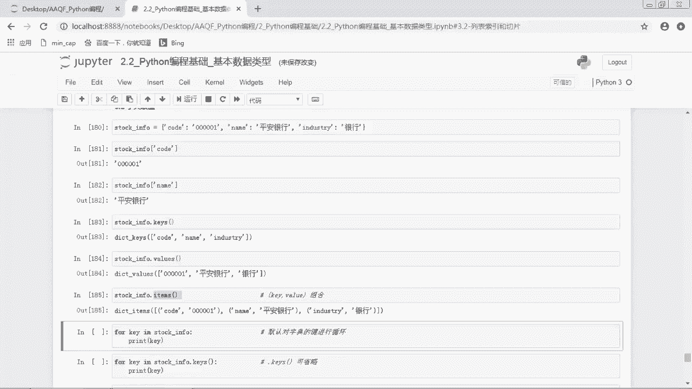

那它的这个整个的呃列表中呢，每一个元素都是一个tupple。那这个tupple就是key和它的value。那这个其实是在呃循环中是用的非常多的。比如说我们下面几个几个这几个for循环。

那for key in stock info for，那也就是对字典进行循环。那默认是对字典的键进行循环。比如说我们这里for key in呃 stocking for print key。

那我们就是把这个字典中所有的键给打印出来了。那这个默认是对字典的键进行循环，所以stock info其实是相当于stock info点ki。因为我们这里stock in for点点ki的话。

其实是不是就是啊这个内容？就是这个东西，那么forour key in这个的话，也就是对这个中的每一个元素进行一个循环。那第一个就是这个code，第二个就是这个name。

第三个就是这个呃industry。那如果说我们没有写这个点ki的话，和这样的效果是相同的。那当然了，我们也可以呃这里也可以写点values。那点values的话就是对这个东西这三个元素进行循环。

那最后呢也可以对这个iteems，那点iteems呢就是对这个东西进行循环。那这个东西进行循环。呢，我们每一次取出来的就是这样两个值。那我们来看一下。那点case就是和上面一样。

然后点iteems是我们来print case。那我们会发现每呃每一次都是都是两个。呃，都是一个嗯包含两个元素的元组。那这时候我们其实一个非常常用的操作，就是直接在这里进行解包。嗯。

也就是forour呃K。valueue那我们直接在这里进行解报的话，我们之后就直接可以使用K和value这两个变量。好，那这时候我们其实就是把这个K和这个value分别给打印出来了。

那如果说我们要对呃K和value分别做一些操作的话，那这个是非常方便的。否则的话，如果我们直接是forK in什么什么forK in这个iteems的话，我们要把这个K取出来的话。

那我们还得用什么嗯还得再用这个元组索引的方法。比如说我们要把这个呃K取出来的话，就是forK0。那这时候我们才可以把它这个K取出来。好，这个是呃字典的取值，接下来是字典的修改操作。

那因为字典也是可变数据类型，那它也是可以进行修改。首先我们来看一下如何更新字典的元素。比如说呃还是原来这个字典，那我们想要把嗯。如果说我们想要新增一个字典的key。

比如说我们想要增加一个key是volume，然后它对应的value是1000，那我们直接用这样的一个负值操作就可以了。就是嗯把1000负值给这个stock info的呃volume这个key。

那我们现在看一下stock info，哎，就多了这个volume1000这一个键值。对。那如果说我们要对字典中已有的元素进行修改的话，那我们也是直接用这个赋值的方法。

比如说我们要把呃volume它对应的值加上100，那加等于好是一个加法赋值操作，对吧？就是在它本身上再加上100，那我们可以直接用这样的一个负值操作。好，那现在的话它就变成了1100。好。

那这个下面的话其实也是更新建的值了。比如说我们现在把这个industry，它本来是银行的嘛，然后我们现在把它等于股份制银行，那现在它就变成了股份制银行。

所以说更新字典或者说修改字典都是用呃字典赋值的操作。那如果那其实那其实我们在进行赋值操作的时候，它呃字典就会自动的在它中间查找是不是有这样的一个K。如果说它本身已经有这样的一个key的话。

就是会更新它这个K对应的值。如果说没有这个key的话，它就会增加这样的一个键值。对。

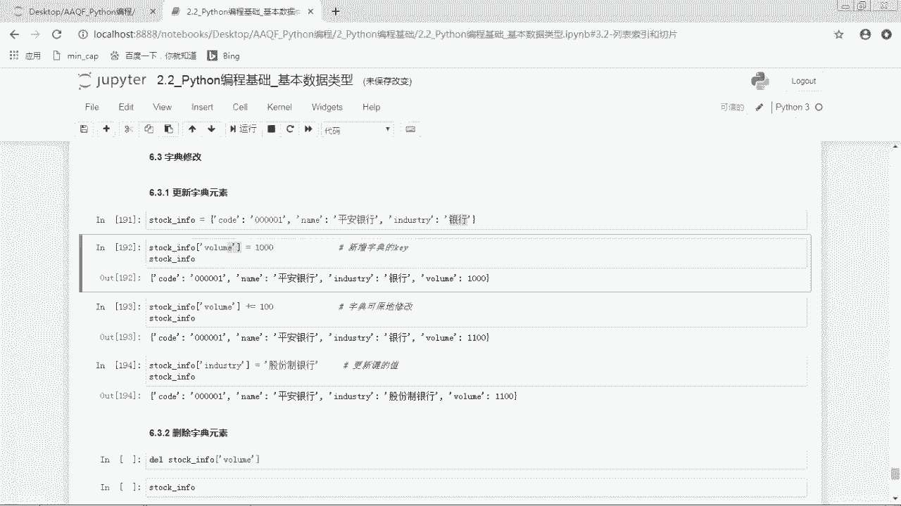

那删除字典元素的话，我们可以使用delete呢，然后呃delete语句，那就是delete，然后sstocking for volume。

那这样子的话就是把呃stocking for the volume这个键值对给删掉了。那我们现在看一下，哎，那stocking for里面就没有volume和volume冒号1100这个元素了。好。

这个是删除字典元素。

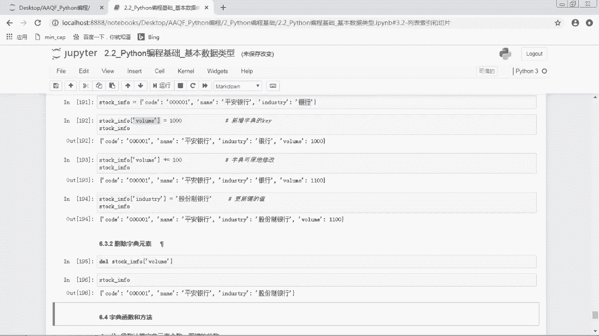

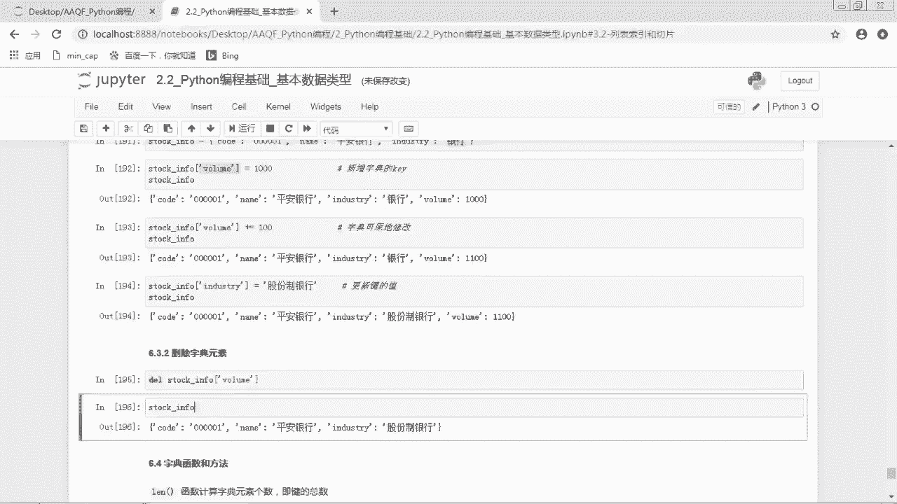

好，最后看一下字典的函数和方法。那lans的话也是可以计算字典的长度。那这里计算字典的元素，个数就是计算键的总数。比如说我们这里lan stock infer。那现在的话。

因为我们stock infer是这样的一个字典，它现在是有三个元素。

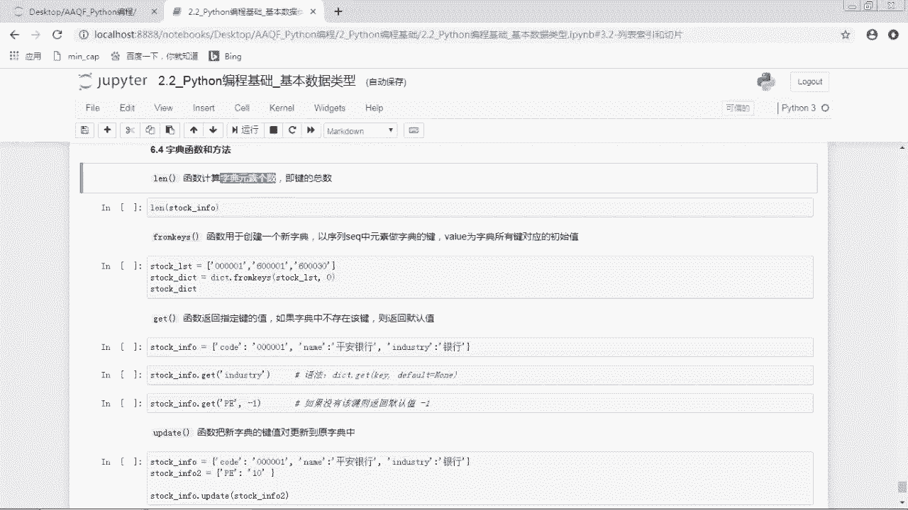

那它的长度就是3。from点 front kiss呢是可以创建一个新字典，以序列中元素作为字典的键value为字典所有键对应的初始值嗯。那这个from kiss呃，这个函数它。

基本的形式就是呃dig的点from kids。然后呢。这里是有一个sequence，第一个参数是一个sequence，然后第二个参数呢是某一个值，就是这里的value。

那它创建出来的是一个怎么样的字典呢？它首先呢我们创建一个字典，那这些字典的键是从这个sequence中来的那这个。比如说这个sequence0是第一个键，然后sequence一是第二个键。

然后sequence3是第三个键。那这里面我们定义的这个value呢，就是我们每一个键对应的这个值就是value。好，所以我们呃创建出来的就是这样的一个字典。比如说我们看一个例子。

那这里有一个stock list是一个列表。那列表其实是一个序列类型，就是sequence。然后我们stock呃 stock d呢，我们这里创建了一个新的变量，叫做stock d。

那后面就是我们如何来创建我们是用dict点from kiss这个函数。那dt点from kiss stock list就是我们呃就是这样的一个序列。然后后面这个零呢就是这里的这个value。

那我们创建出来之后，我们的字典呢，首先我们创建出来一个字典，然后这里。字典的K就是这个序列中的元素。那第一个元素就是000001，然后这个是第一个K，然后第二个K呢就是这里的600001。

然后这是第二个K，然后第三个K是600030。然后对于每一个K对应的值呢就是这里的0，那就是0。好，那它也是0。然后最后一个也是0。好，那就呃创建出来了一个这样子的嗯字典。那这种方法的话。

其实就是可以在初始化一个字典的时候创建。比如说我们初始化的时候，我们知道我们字典都是要有这些键的。然后这些值呢我们目前还不知道，那我们可以给它一个初始值是零。然后之后我们知道了这些值之后。

我们在呃对这个字典进行一个修改操作就可以了。

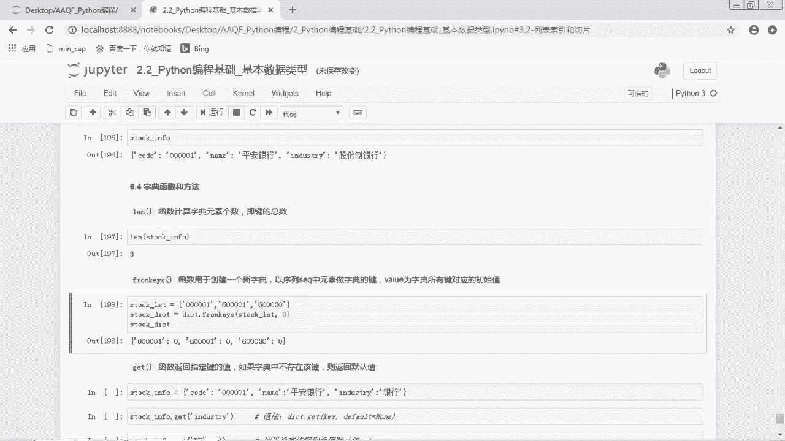

好，get函数呢是可以返回指定键的值。如果字典中不存在该键则返回默认值，嗯，比如说这里还是我们原来的这个字典，然后呢，我们是get industry。

那get industry意思就是我们获取indu这个key这个键对应的值。那我们。

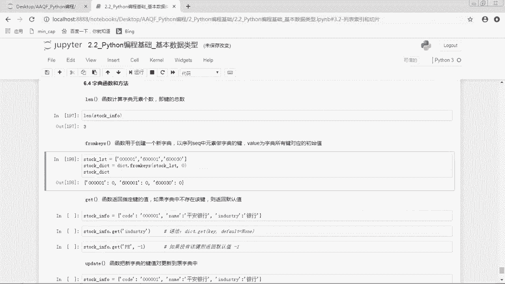

呃，它的语法是dt点get key default等于n。那它直接就是返回呃返回industry这个键对应的值是银行。那这里的话是不是还有一个de等于n啊？这个的话其实就是一个默认值。

它是默认什么东西呢？就是说如果没有就是如果我们找不到这个键的话，我们会返回什么东西。那我它默认的话是返回n。也就是说如果我们找不到这个东西的话，它就会返就是没有返回值，就返回的值是n。

那比如说我们寻找一个呃PE。哎，那这时候我们会发现他就是呃结果是不是没有结果，他这里没有输出一个结果，那说明他其实返回的只是一个no，我们是找不到这个K的。那这样子的话其实可能会呃就是不是很清楚。

就是有时候我们可能想哎这个是不是代码没跑，就是出了什么错，就是没有跑成功啊。所以说我们可以给它一个呃默认值。这样子的话，如果我们找不到这个键的话，它就会返回这个默认值-1。比如说我们这里getPE-1。

哎，它就会返回一个值是-一，那这样子我们就知道了哦，那是我们是找不到这个键。所以这个呃de default这个参数呢主要是可以有这样子一个作用。就是如果找不到这个键的话，就反映这返回这个默认值。

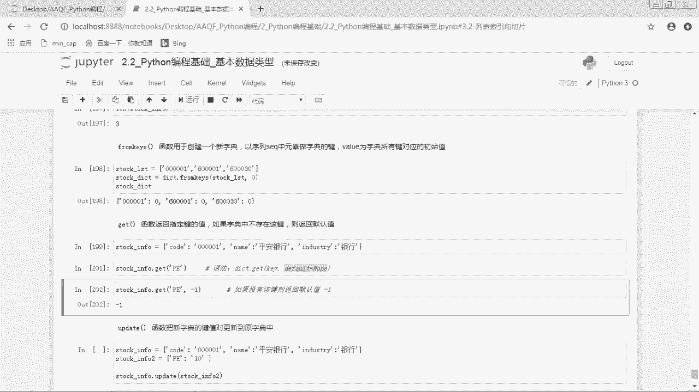

好，那最后是一个update函数。那update函数呢是可以把一个新字典的介值对更新到原来的字典中。比如说我们现在有两个字典啊，第一个是stock info。

然后第二个是stock in for two，那stock info two呢是PE然后冒号10，那这个的话它就是有一个元素的一个字典。

那如果说我们stock info点update stock two，它其实就是把这个stock info for two呃，这个字典添加到了stock info这个原来的字典中，我们看一下它的效果。

你看一下现在stocking for的话，唉，后面就多了1个PE10这样子的一个建值。对那其实我们也可以添加多个。比如说我们这里再添加一个呃PB那PPB等于0。2。那我们在呃。

那如果说我们把这个现在这个stock in two添加到呃更新到stock in中的话，我们看一下现在现在的话我们就是多了两个键值对。好。

所以upate的话可以非常方便的把另外一个字典中的键值对更新到原来的字典中哎，注意一下啊，我们刚刚是不是说字典中的键都是独一无二的。

所以说如果这个stock info two中的键和这个stock info重复的话，它是会做一个更新。比如说我们这里是呃industry。是。🎼嗯，保险。那我们会发现我们在进行更新的时候。

这里面这个industry被更新成了保险。那PE的话因为是一个新的键，所以它是把这个新的键值对添加到后面。好，这个是update函数。那我们之前是不是也讲过呃，就是可以通过一个赋值的操作嗯，在。呃。

字典中添加元素，比如说我们要添加一个。PB是等于2，那我们也可以通过这样负值的操作添加进来。那这样的话我们也可以在呃最后添加1个BB等于2。好，那这个是字典的，字典也是一个嗯内容比较多的。

我们再来看一下。

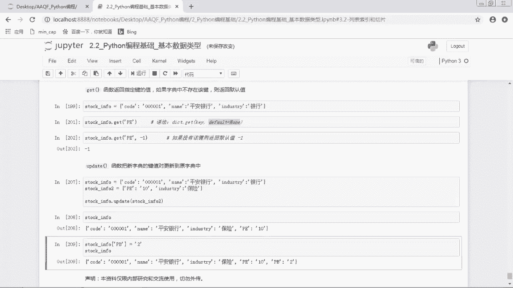

首先，字典创建是用花果创建，然后它是用冒号把剑值队给分割开来的。注意一下，字典的介是独一无二的。如果说剑被复值两次会存储后面的值。

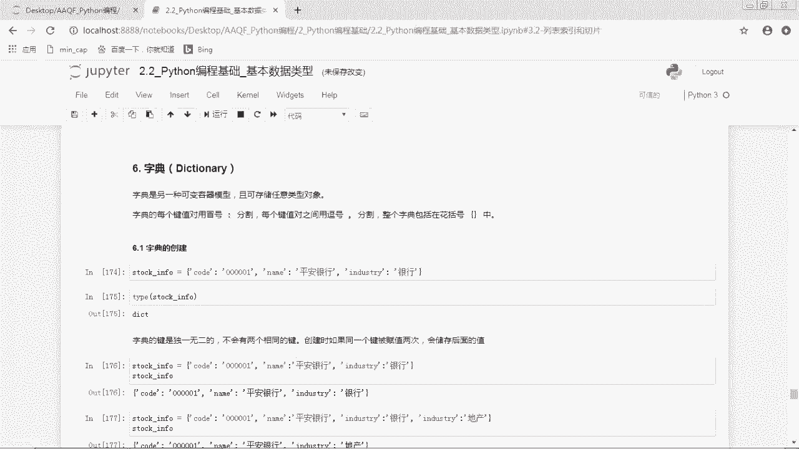

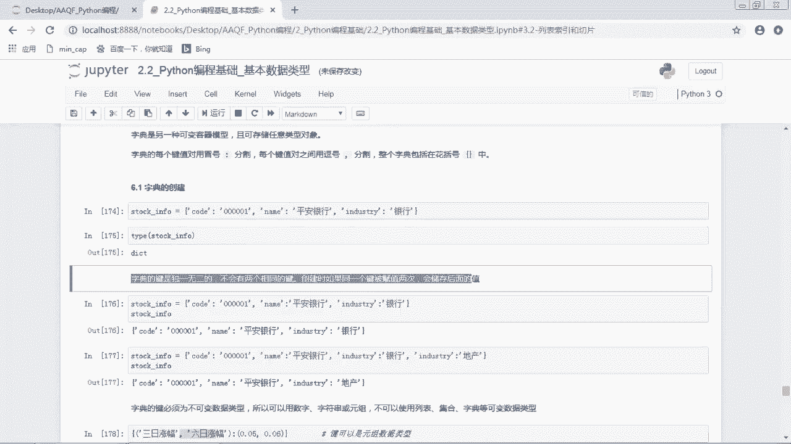

字点的键必须是不可变数据类型，所以可以使用数字、字符串和元组。

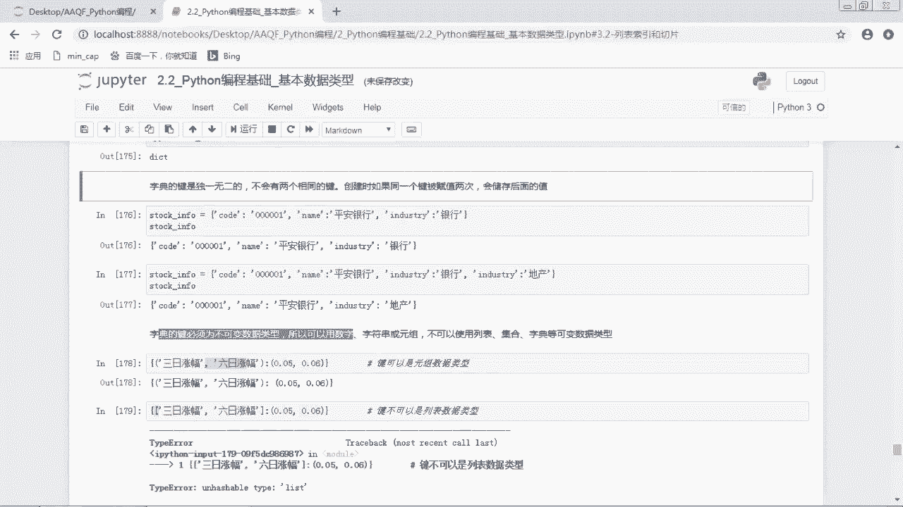

那字典的取值是通过键来取值的。它是不可以通过索引和切片来取值的，因为它是无序的数据类型。那对于字典修改的话，我们可以通过直接赋值操作来修改字典的元素。那如果说这个键在字典中已经存在的话。

就是更新这个字典中呃这个键对应的值。如果说这个键在原来的字典中不存在的话，就是新增一个键值。对。

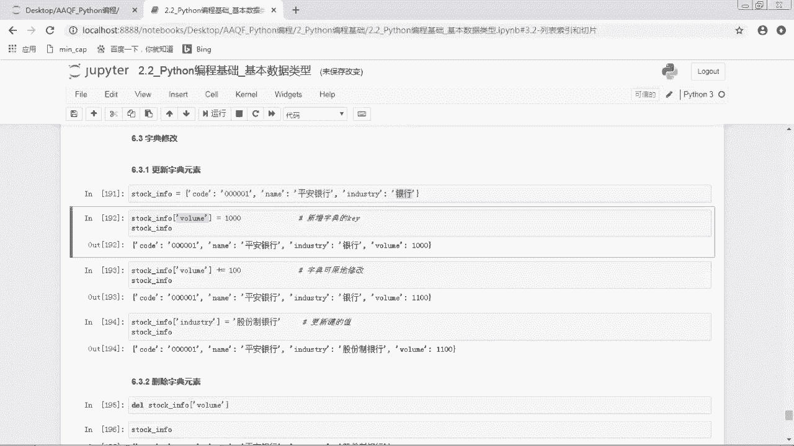

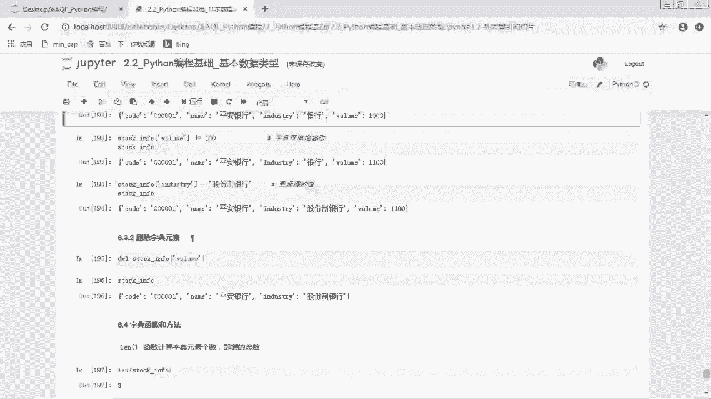

那删除字典元素，我们可以使用dele语句。那from kiss呢是可以呃通过一个序列来创建字典。

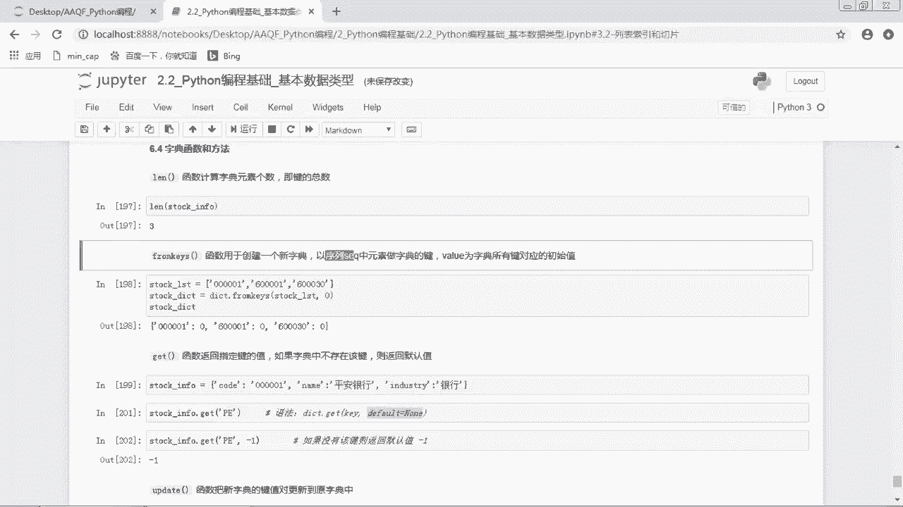

get函数是可以获取字的键对应的值。那我们也可以呃增加一个默认值。这样子的话，如果我们找不到这个嗯键的话，我们就会返回这个默认值。哎，其实我们之前是不是也讲了呃字典取值，可以使用用键来取值啊。

那这里的话其实也是可以用键来取值。比如说我们这里想要获取PE值PE这个键对应的值的话，我们是不是也可以直接用stock in，然后加一个加一个硬括号，然后用PE来取值？呃，这里面画没有PE。

它其实会暴错。比如说我们用code。那我们是不是也可以通过这样子的方法来取值？但是这样子的方法有一个问题，就是如果这个键不存在的话，它是会报错的。比如说我们这里PE。哦，现在这个stock in。

因为我们后面已经重新修改之后，现在不是现在这个stock in了。那我们需要就是把它再重新复制一下。

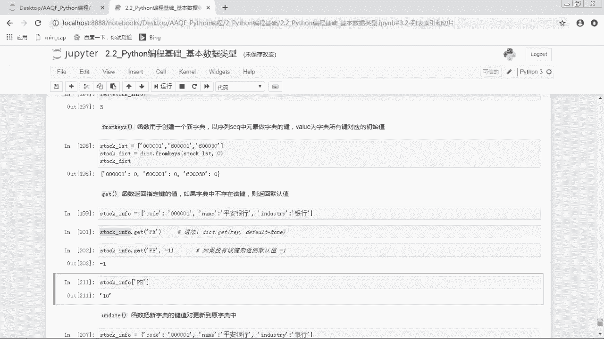

再重新复制成这样的一个stock in。那现在是没有PE这个键的。好，那现在的话它会报一个keyPE，那是说明没有这个键。

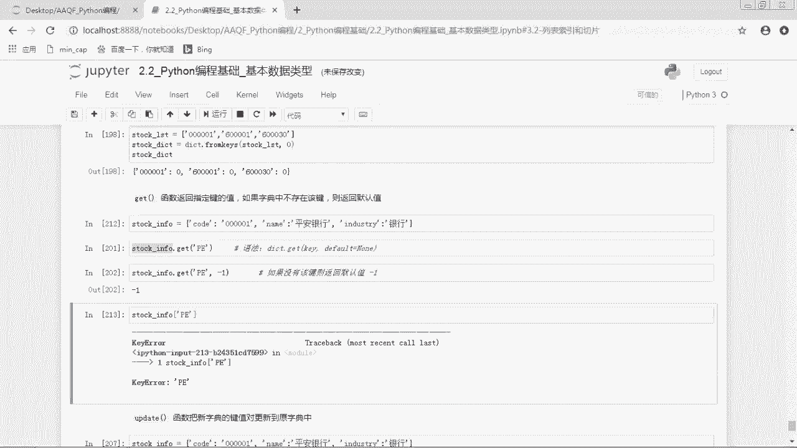

那如果用get函数的话，其实就是可以避免这样的报错。

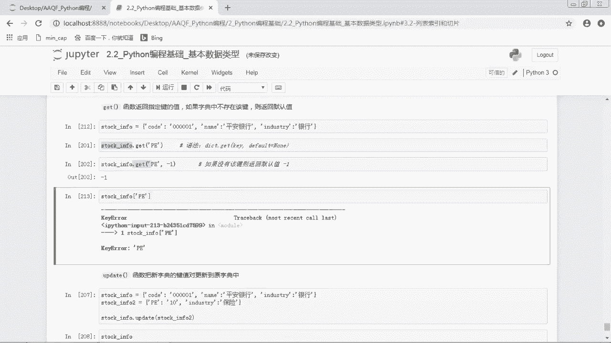

然后update的话是可以把一个新字典的建值对更新到原来的字典中。好，那这个的话就是python编程基础中基本数据类型。那我们讲了数值型字符串嗯，列表元组集合和字典，这六大数据基本的数据类型。

那这六大基本数据类型我们在之后会非常非常经常的用到。所以这一部分大家一定一定要好好掌握。就是你这个呃课件的话，你可以多看几遍。就是如果你对这个python对编程完全是没有基础的话。

这部分其实可以多练习几遍。好，那这节课的话就是这些内容。

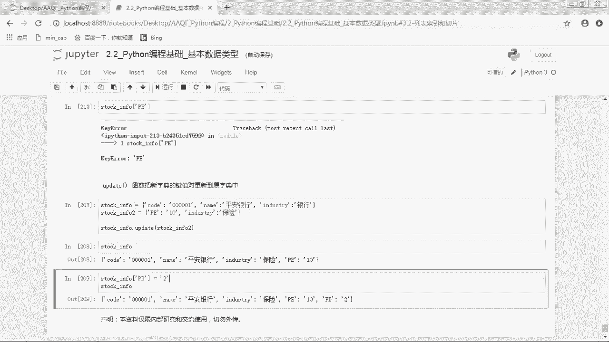

。

