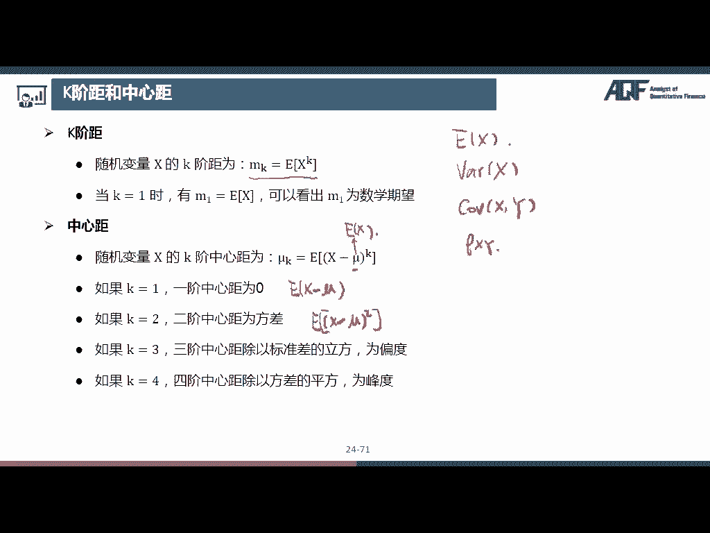

# 2024年金融大神老师讲解量化金融分析师.AQF—量化金融基础知识（完整版课程） - P2：《金融基础》02.数量分析-02_随机变量数字特征 - 量化沿前 - BV1ar421K7Mo

好在介绍常见的概率分布之前，首先给大家介绍几个常用的，随机变量的数字特征，那随机变量的数字特征，可以帮助我们非常容易的对随机变量有一个，非常直观的认识，那我们这节课的主要介绍这样几个数字特征。

首先是数学期望，或者直接叫期望也可以，那这个特征可以描述随机变量的集中趋势，也就是说这些数大致是在怎样的一个水平，或者说集中在哪个点上，第二个是方差，方差呢可以衡量随机变量的离散程度。

也就是这些数结合的比较紧密还是比较松散，接下来是斜方差，和相关系数，这两个特征呢可以描述，两个随机变量之间的关系，是正向的关系还是反向的关系，以及它们的相关性有多紧密，最后呢还有偏度和峰度。

那这两个是描述随机变量分布的一个形态好，那在这样的几个数字特征中，大家需要重点掌握前面四个，包括公式的话，最好也要掌握那偏度和峰度嗯，稍作了解即可，不需要大家掌握公式。

第一个数字特征呢是数学期望或者简称期望，英文是叫做expectation，那我在课上的话，就把比较重要一些英文单词介绍一下，因为我们在呃编程的时候基本上都是用英文的，所以一些专有的名词先和大家讲一下。

然后之后可能会用得上好，那我们刚刚说了，期望是对随机变量集中趋势的度量，那我们看一下计算公式，那对于离散变量来说，ex等于，那因为期望是expectation，所以它一般是用ex来表示的啊。

离散变量的公式呢是啊一个求和符号对吧，那这是一个求和符号，那他求和的内容是PXI乘以XI，那这个xi呢，就是这个随机变量可以取到的所有值，那一共是I等于一到N，一共是可以取到N个值。

那PXI呢就是可以取到额，就是取到xi这个值的概率，那其实也就是每一个值乘以，可以取到这个值的概率嗯，所以离散变量这个期望公式，其实是一个加权平均额，然后他的这个权重是概率，那对于连续性随机变量来说。

那它也是它这个可以取到的值乘以概率，那这个概率呢是一个概率密度函数，那因为连续变量的概率密度函数是连续的曲线，所以这里的话是需要用到积分啊，那之后的话还会涉及到一些微积分的知识，那大家能掌握的话。

最好那实在不能掌握啊，也没有关系，因为Python很多第三方库已经帮我们，把这个公式已经写好了，大家直接用也可以，不过我我在这个课上讲的这些微积分的知识，都是最最基础的。

所以啊最好的话还是希望大家能够掌握，好那我们来看几个比较重要的期望的性质，那下面的这个AABC都是常数，首先EC等于C也就是说一个常数，它的期望就等于它这个常数本身，那这个很好理解嘛。

就是他所有的数都是一样的，那他这样的一个加权平均也是额也是这个数，然后第二个EAX等于A乘以EX，也就是这样的一个常数，这个系数可以提到前面来，那其实就是在这个离散变量公式里面，把这个xi变成AXI。

那这个A这个常数的话，是可以提到求和符号的前面去的，然后ex加B等于EX加B，那这个呢其实是用到了这样的一条性质，其实是不是就是把它拆成了ex加EB，然后EB它是B是一个常数，所以它直接是等于B好。

下面一个E等于ax加B，其实就是把上面这一行把它并在一起了，我们把它拆成EAX就是AEX，然后加上EB就是B嗯，然后E嗯X加Y加减Y等于EX加减EY，一般来说EXY是不等于EX乘以EY的。

但是如果随机变量XY是相互独立的，那么这个条件可以成立，ex的平方不等于ex括号的平方，只有当X是常数的时候，这个等号才成立好，那这些呃性质的话，大家注意一下，还是比较简单的一些性质。

那第二个数字特征是方差，Variance，那方差是对随机变量离散程度的度量，也就是距离中心的偏离程度，那方差的话一般是可以用var来表示，有的教材上也写成DX也是可以的，那这两种表示方法都是可以的。

然后额V额X的方差等于西格玛平方，等于ex减ex的平方，那这里面的这个西格玛也就是这个方差，开根号叫做标准差，这也是我们经常使用的，我们看一下方差的公式是它也是一个期望，它是什么期望呢。

它是这样的一个随机变量的期望，也就是X减1X的平方的期望诶，那我们看到EX减X的平方，那它是一个平方，所以它肯定是大于等于零的对吧，那大于等于，那如果说一个随机变量肯定是大于等于零的。

那他的这样的一个加权平均，肯定是大于等于零的，所以方差额是肯定是大于等于零的，好我们来看几个呃方差的性质，首先嗯常数的方差是等于零，那因为常数它嗯只有一个数，它没有任何波动，所以它的方差是等于零。

第二个ax的方差等于A的平方乘以X的方差，那这里的话为什么呃，这个方差的系数提提到前面，就变成A的平方了呢，那我们看一下这个方差的公式，是EX减1X的平方对吧，那如果说我们这里的X变成ax的话。

那这个EAX的这个A是不是可以提出来，那就变成ax减掉A乘以EX的平方，那我们如果把这个A提出来的话，提到这个平方的外面，那是不是就变成了A的平方，X减EX的平方，那这时候我们把这个系数再提到前面。

那是不是就变成A的平方了，那这个后面的话还是原来的这个呃X的方差，所以如果把这个方差的系数提出来的话，是要乘以一个平方，那X加B的方差是等于X的方差，也就是说，如果把一个随机变量。

所有的数都加上一个常数的话，它其实它的波动程度是没有变化的，所以它的方差还是和原来一样，那当然了，我们也可以带到这个公式里面，那也就是X加B减掉ex加B的平方的期望，那这个ex加B是不是就等于EX加B。

那这里的加B加B把它给就是额抵消掉了，那是不是还是X减ex，那和原来是一样的好，那下面是，那下面这个就是把这个上面两个合并起来，如果随机变量X与Y相互独立，则X加减Y的方差等于X的方差，加Y的方差。

哎大家注意一下，它这里的话是加减，但是这里是加，那这个是为什么呢，嗯其实大家也是可以套公式，但是这里给大家介绍呃，就是讲一个呃好记的技巧吧，那因为我们刚刚也说了，这个方差肯定是大于等于零的对吧。

那所以这个值的话肯定也是大于等于零，那如果说我们这里写成减号的话，那如果Y的方差是大于X的方差，那么一减都不变，不是变成负号，那就不对了对吧，那所以的话这里不能写减号，所以这里的话都是加号。

那这里的话如果XY不是相互独立的，它后面其实还要加减两倍的COVERANCE，XY那这个COVERANCE是斜方差，那是我们下面要介绍的好，那这个的话呃非常简单。

就是在在上面的这个基础上加上了一个系数好，那最后这个公式是非常非常重要的，那我们之后再嗯计算很多方差的时候，都是使用这样的一个公式来进行计算，因为如果我们直接用方差的这个，定义公式来计算的话。

是比较复杂的，但是使用这样的一个公式，可以大大的减少我们的计算量，那这样的一个公式是怎么来的呢，也是非常呃容易可以这个推导出来的，那么知道X的方差等于ex减ex的平方，好吧。

那我们把这个里面的呃展开X的平方，减掉两倍的XEX加上ex的平方，那我们把它拆开，因为这个呃和的期望等于期望的和，那就是以X的平方减掉12X1，然后再加上1EX的平方，那第一个ex的平方不变。

那我们知道这个ex其实是一个常数，那二也是一个常数，我们可以把它提到前面来，那这个里面是不是只剩下ex了，那所以第二项的话就变成了ex的平方，那我们知道EX的平方它也是一个常数。

那所以我们直接就是加ex的平方，那这里是减两倍的ex平方，这加ex的平方，那我们就是抵消掉一个，那最后的话就剩下了ex的平方，减掉ex这个括号的平方，那我们就是得到了这样的一个呃，这样的一个公式。

那接下来我们要介绍这个数字特征是协方差，Covariance，那这个数字特征是可以衡量，多维随机变量之间的关系，那比如说COVERANCEXY，就是衡量X和Y这两个随机变量之间的关系。

那它的计算公式是呃，ex减ex乘以Y减1Y，那如果说我们把这个公式呃整理一下，我们把这个括号里面拆开来，就是XY减掉嗯，X乘以EY减掉EX乘以Y，再加上EXEY嗯，是这整个的期望。

那期望的和等于和的期呃，那和的期望等于期望的和，那我们把它拆开来，ex y减掉EXEY，那这个EY是不是可以提到这个系数前面，然后减掉1ex y的这个ex也是可以提到前面，然后再加上那EX乘以EY。

它本身是一个常数，它的期望就等于它本身就是EXEY，那我们知道这个呢是EXEY，那这个把ex提到前面，也是ex乘以EY，那么看到我们减了两个ex乘以EY，最后又加上了一个，那我们把它抵消掉一个。

那最后就剩下了EXY，减掉ex乘以EY，好那协方差是衡量两个变量的总体误差，它的取值范围是从负无穷到正无穷，那如果说它呃这个协方差是一个负数的话，那说明这两个随机变量之间是一个相反的关系。

那一个变量增加，另外一个变量就会减少，那如果他是正值的话，说明他是一个正向向正向的关系，好那我们来看几个协方差的性质，首先X和X也就是嗯一个随机变量，X和它自己本身的协方差呃，这个X的方差。

那我们带到公式就非常简单，直接可以看出来了，因为如果我们这里把这里的这个Y变成X，把这个Y变成X，那是不是就变成了ex减ex的平方，那这个是不是就是方差的公式啊，所以他这个其实就是一个公式好。

第二个covariance，A加BX嗯，C加DY等于BD可VIOUSXY，那这个性质的话，其实也可以就是直接带公式得到，那我这里就不再慢慢去，就是推导了，这些都非常非常简单，大家可以自己尝试一下嗯。

然后X加减Y的方差是等于X方差，加Y的方差加减两倍的covariance x y，然后ax加减BY的方差是等于A的平方，X的方差加上B的平方Y的方差，加减两倍的ABCOVIRUSXY。

那这些性质都是非常简单的嗯，大家感兴趣的话，都可以自己推导一下，就是类似于我刚刚给大家演示的这样好，那如果随机变量X与Y相互独立，那么X和Y的这个协方差是等于零，那第四个数字特征是相关系数。

Correlation，Coefficient，我直接写一个correlation，那我们在嗯写代码的时候，一般是会用啊，C o r r，也就是correlation这个前面几个字母来表示。

那他的公式是呃，ROXY等于COVERNXY除以西格玛X，西格玛Y也就是X和Y的相关系数，等于X和Y的协方差，除以X的标准差和乘Y的标准差，那它也是可以衡量两个随机变量之间的，相关关系。

那相关系数有一个非常好的点，就在于它是没有单位的，所以它可以消除单位的影响，那我们注意一下，就是我们之前学的，不论是期望啊方差，标准差还是协方差，都是带单位的，比如说我们这个随机变量X是嗯身高吧。

那我们是不是有单位是厘米或者米，那比如说我们这里单位是厘米，那我们期望的额期望的这个嗯单位也是厘米，那方差因为是X的平方的，所以它的这个单位是嗯X厘米的平方，那标准差因为是方差开根号。

所以标准差的单位也是厘米，那协方差异为是两个随机变量之间相互关联，它其实是和这个方差差不多的，所以它的这个单位也是厘米的平方好，那我们这里的话，假设这里covariance的这个单位是厘米的平方。

那这个嗯西格玛X它的单位是厘米对吧，然后它的这个西格玛Y的单位也是厘米诶，那我们正好可以把这里的这个单位给，消除掉了哈，那这样子的话，这个相关系数算出来也是没有单位的，然后它的取值呢是从-1~1之间。

那如果说这个相关系数是等于一的话，那说明这两个随机变量是完全线性负相关的，也就是说一个变量增加多少，那另外一个变量就减少多少，比如举一个最最简单的例子嗯，X和负X，那这两个随机变量之间肯定是完全负的。

线性关系对吧，那一个增加多少，另外一个就减少多少，那它的取值就等于一，为什么呢，我们来算一下，就非常简单的，ROX和负X等于covariance x负X，然后RO的X肉的负X。

那covariance x负X，我们可以把这个负号提到前面来，那就是负的，可VXXX，那可VXX是不是就是X的方差，然后这个负X的标准差，那是不是其实就是负X的方差开根号，那负X的方差其实就是X的方差。

因为它是平方的，所以正负是没有关系的，所以然后这个前面呢也是这个X的方差，开根号，那我们把它两个相乘是不是就是X的方差，那负X的方差除以X的方差，那除下来就等于一好，所以他如果两个随机变量是完全负的。

线性相关关系的话，那就是额相关系数是等于一，那如果说两个随机变量之间是完全正向的，相关关系，也就是一个随机变量增加多少，另外一个也增加多少，那它那这个相关系数就等于一，比如说最最简单的X和它自己本身。

那他肯定就是嗯他自己增加多少XX增加多少，X也增加多少，这这废话对吧，那它自己和自己的这个相关系数，也就是COVARIOUSXX除以西马X，西马X那这就是西马X平方，就是X的方差。

那这个上面的也是X的方差，所以我们算下来是等于一，好啊，我们来看其他几个性质，首先X加减Y的方差等于X的方差，加Y的方差加减两倍的ROX呃，西格玛X西格玛Y嗯，那这里的话。

其实我们就是把原来的这个两倍的可VIANCEXY，把这个可VANCE替换成了row乘以西格玛X，西格玛Y，其实我们就是把这里的这个乘到左边来了对吧，那这个很一目了然。

第二个相关系数衡量两个变量之间的线性关系，也就是说这个相关系数是指可以衡量线性关系，如果是非线性关系的话，这个相关系数就不可以衡量了，好第四个相关系数不表明因果关系，那我们记住，我们不管是在什么时候。

都是不可以表明因果关系的，我们只是计算出来了一个相关关系，那如果两个变量相互独立，则相相关系数为零，那因为我们刚刚也说了，如果两个变量相互独立的话，它的这个协方差covariance是等于零的。

所以如果分子等于零的话，它的相关系数算下来也是等于零好，就是如果他们两个相互独立，那我们可以推出它的相关系数为零，但是如果它的相关系数为零，它们这个两个变量不一定相互独立。

那因为我们说了这个相关系数是衡量线性关系，那如果说这两个随机变量之间是呃，有非线性关系，那通过相关系数是无法衡量的，所以它这个相关系数有可能是为零，比如说我们这样的一个例子。

就是X是服从-1~1的均匀分布，然后Y是等于一减X的平方开根号，那这个的话哈，其实它画在图上的话是一个半圆形，那他这个明显是存在相关关系的对吧，它因为它有一个明显的这样的一个pattern。

就是明显的这样的一个呃形状，但是它们两个之间的相关关系是非线性的，所以他们如果，所以如果我们计算这个相关系数的话，我们会发现，我们计算出来的这个相关系数是等于零的，因为它们之间不是不不存在线性的关系。

好我们来看几个线性相关程度的这个图形嗯，有一个比较直观的认识，首先完全线性正相关，那就是一个这样的向上的直线，那额这个X这个随机变量增加多少，那Y的话也是增加相同的比例嗯，那我刚刚说一呃。

这个完全线性正相关是一个增加多少，另外一个就增加多少，并不是说它的这个增加的绝对值是相同的，而是说它增加的这样的一个比例是相同的，比如说我这里嗯Y是等于这个2X加五，那X每增加1Y就增加二。

那这样的一个增加的这个比例是完全不变的，它完全是呈一个线性的关系，并且它是正相关的，那这样的话是叫做一个完全的线性正相关，那如果是完全线性负相关，那它也也是成一个线性的关系，但是呢它是一个负相关的关系。

也就是一个增加，那另外一个减少好，那如果说他们并不是这样完美的在一条直线上，而是有一个这样的，像这样的一个趋势，那我们看到这里一个线性正相关，它这里的相关系数是0。82，其实已经是一个非常高度相关了。

嗯那我们看到这些点的话，虽然不是完全在一条直线上，那但是它们是不是有一个，大体上在这样的一条直线上，就大体上是这样的一个方向对吧，那所以说这个呢是叫做线性正相关，那线性负相关的话。

就是呃它们是呈现一个负相的关系，那线性不相关呢，那比如说这里的呃这个相关系数是等于零，那么看到这些点是非常零散的，在这个呃平面上我们找不到任何规律，所以它这个是一个线性不相关的情况。

那最后要一个要注意的，就是我们刚刚举的这个例子，我们看到这里的这个XY，是不是呈现一个非常明显的关系，所以它其实是一个这样的一个弧形，但是我们这里算出来的相关系数是等于零的。

那这是因为它们这两个随机变量之间，是非线性的关系，我们用相关系数是无法衡量的，接下来呢我们要介绍偏度和峰度的概念，那这两个呢是可以衡量随机变量分布的，一个形状，比如说我们刚才看偏度。

偏度是叫做SKILLNESS，那它是可以衡量概率密度函数的不对称性，那它这个公式的话，大家就不用记了，我们只要看这个图形呃，大家能够识别这个正片负片就可以了，那这个是大家需要掌握的。

那正篇的话或者也可以叫右偏，那这两个是等价的负片，也可以叫做左偏，那我们看一下这个图形是长什么样子的，那我们首先来看一下负片，那负片也是左偏，那我们来这个区分左偏和右偏的时候，我们怎么来区分呢。

我们主要是看这个尾巴，那这个尾巴在哪里，我们就说它是朝哪里偏的，比如说我们看最左边这个图，我们看到他这个尾巴是不是在这个地方，也就是它这里是拖出来一条哎，这个尾巴像尾巴一样的东西啊，它是在左边。

那我们就叫它左边，那因为这个呃这个坐标轴的左边是负数嘛，所以我们也叫它负偏，那如果是在左偏的这个形态的话，我们是不是又发现这个随机变量会更容易地，取到这个比较小的值啊。

因为如果说我们把这个负片和这个对称形态，做比较的话，我们把这个负片的图画到这个对称的图上，如果说在这个图是左偏的话，那是不是就长成这个样子，那是不是我们在这个左边的，这个面积会比较大一些。

也就是说在左边的这个概率会更大，那在右边的这个呃概率会更小一些，那在负片或者说在左边的形态中，均值是小于中值，小于正数，那其实准确来说，这里应该加上等号，那中值其实就是中位数，那均值就是平均值。

那平均值是小于中位数，小于正数的那种数，非常好，就是好找，就是最多的这个数嘛，所以我们先先可以把这个正数找出来，然后呢中值是肯定一直在中间的，那我们就是我们可以这么记啊，然后均值的话它就是在这个最左边。

那如果是对称的话，均值就等于中值等于正数，那如果说是正偏或者说是右偏的情况，那它这个尾巴呢是在右边，也就是说它取到极端嗯，比较极端的这个大的值的是概率会比较大，那这个负偏是取到嗯。

比较极端小的这个值的概率会比较大，那对于正片来说，它是正数大于等于中值，大于等于均值的，那因为他这个极端大值呃，取到的概率比较大，嗯所以它的均值就会被它拉大，比如说我们班上同学啊。

就是比如说我们想要测量这个班上同学的身高，然后呢突然进来了一个姚明，那我们这个均值是不是一下子就被拉大了，但是呢我们这个正数是不是还没有改变，所以正数的话就是在正片的情况下，这个正数是好，这个写反了。

重数小于等于中值，小于等于均值好嗯，好那对于偏度的话，大家不需要掌握公式，只需要记住图形，然后呃知道什么叫右偏，什么叫左偏就可以了，那最后一个是风度，那风度是衡量概率密度函数分布的尖度。

那他的公式是这个样子的，那还有一个概念叫做超额风度，使风度减三，那为什么要减三呢，是因为呃对于正态分布来说，它的风度是等于三的，而且但是呢，呃那我们一般呢是以正态分布为一个标准，来进行比较。

所以我们把正态分布叫做长风态，所以如果说这个风度是大于正态分布的，风度的话，我们就叫做它是一个尖峰，那如果他的风度是小于正态分布，那就是叫做低峰，比如说我们来看这个图形，那这个蓝色的这个实线是正态分布。

这个虚线呢就是呈现一个尖峰，肥尾的这个呃形态，那我们看到他的这个风度是大于正态分布的，风度的，也就是说他的风度是大于三，或者说它的正超额风度是大于零，那么看到他这个尖尖，是不是在这个正态分布的上面。

那如果说呃随机变量它的分，那如果说尖峰的分布和正态分布，具有相同的方差的话，它的这个尾部会更加的肥大一些，不，也就是说它取到极端小值和极端大值的概率，会比较大，比如说我们来看这个点啊。

那对于正态分布来说，取到这个值的概率是不是只有这么多啊，但是对于尖峰肥尾状态的话，他取到这个值的概率是不是有这么多，就是就呃比正态分布要大很多，那一般我们认为金融资产的收益率。

是呈现尖峰肥尾或者说尖峰厚尾的特征的，也就是说嗯这个收益率取到均值附近的概率，和取到极大值和极小值的概率都比较大，好那这个风度的话，大家记住嗯这样的一个图形就可以了，那最后的话有一个K阶矩和中心矩嗯。

K阶矩的话就是MK等于ex的K次方，那当K等于一时，一阶局就等于ex，那我们可以看到呃，一阶局M1就是数学期望，那还有一个叫中心句，那随机变量X的K阶中心矩是MK，等于ex减mu的K次方。

那如果K等于一的话，嗯一阶中心矩是零，那因为等于一就是X减六的这样的一个期望，那我们把它拆开来的话，ex其实就是mu，然后E缪的话也是缪，这个缪的话就是呃ex期望好，那如果K等于二二阶中心矩是方差。

那就是嗯ex减mu的平方，那这个其实就是方差公式，如果K等于三三阶中心矩除以标准差的立方，是偏度嗯，X等于K等于四四阶中心距除以方差的平方，是等于风度好，那这个的话大家就是稍微了解一下就可以了，好。

那我们这节课的话就是介绍了几个比较重要的，随机变量的数字特征，那大家首先是需要记住这个数，数学期望ex那方差，还有斜方差，以及相关系数ROXY好，那这几个的话大家是需要掌握公式的，那偏度和峰度的话。

